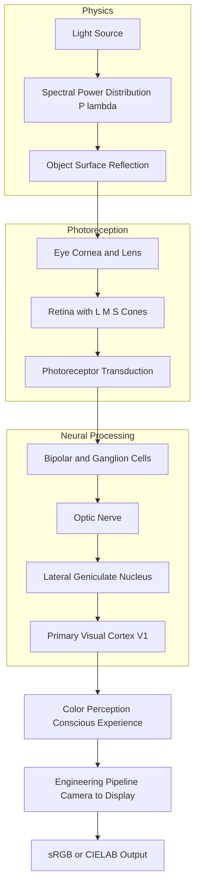
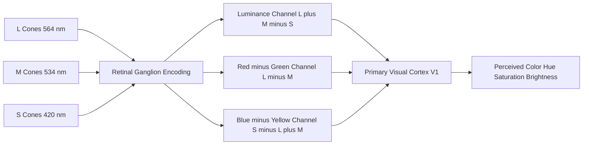
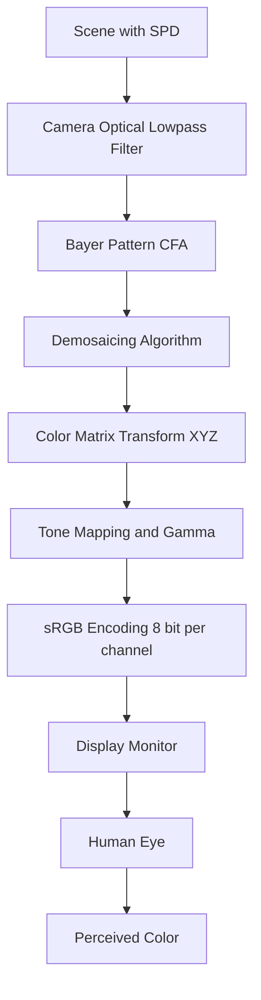
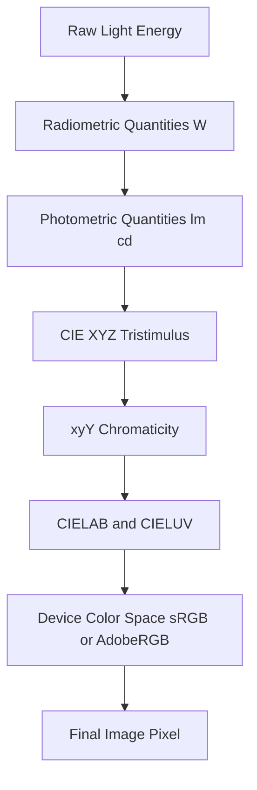

# Color images - Physics of color

<!-- SECTION_1_START -->

# Physics of Color — The Science Behind What We See

## 1.1 Formal Academic Definition (KTU 2024 Aligned)

**Color** is the perceptual result of light of varying wavelengths within the visible portion of the **electromagnetic spectrum (approximately $400\text{ nm}$ to $700\text{ nm}$)** interacting with the three types of cone photoreceptors in the human retina. In the context of Digital Image Processing, color is a *psychophysical phenomenon* — neither purely physical (radiant energy) nor purely psychological (sensation) — but the bridge between the two.

The **physics of color** therefore encompasses three domains:

1. **Radiometric Domain** — The physical properties of light (wavelength $\lambda$, frequency $\nu$, spectral power distribution $P(\lambda)$).
2. **Photometric Domain** — The standardized measurement of light as perceived by a *standard human observer* (luminance $Y$, luminous intensity $I_v$).
3. **Psychophysical Domain** — The biological transduction by retinal photoreceptors and subsequent neural processing.

> [!IMPORTANT]
> **KTU 2024 Syllabus Anchor (Module 1):** *"Physics of color — human perception of color, color models, color spaces."*  
> Board examinations frequently test the distinction between **additive (light-based)** and **subtractive (pigment-based)** color formation, and the role of **trichromacy**.

---

## 1.2 Intuitive Overview — The Garden Rainbow Analogy

Imagine sunlight striking a prism. A fan of colors emerges: violet, blue, green, yellow, orange, red. This dispersion is the *visible spectrum* — the *physical* part of color. Now, your eye intercepts this light. Inside your retina, three types of **cone cells** act like three narrow-band filters:

- **L-cones** (Long) → peak sensitivity near **$564\text{ nm}$** (red-green region)
- **M-cones** (Medium) → peak sensitivity near **$534\text{ nm}$** (green region)
- **S-cones** (Short) → peak sensitivity near **$420\text{ nm}$** (blue-violet region)

The brain receives three numerical signals $(L, M, S)$ and *computes* what you call "yellow," "magenta," or "white." **Color does not exist in the world — it exists in the brain.**

> [!NOTE]
> **Key Insight for KTU:** A banana does not emit yellow light. It absorbs blue wavelengths ($\approx 450$ nm) and reflects yellow wavelengths ($\approx 580$ nm). Your brain constructs the sensation of "yellowness" from the cone stimulation ratio.

---

## 1.3 Light as an Electromagnetic Wave — Foundation

Visible light occupies a tiny sliver of the broader electromagnetic (EM) spectrum. The fundamental relationship governing all EM radiation:

$$
c = \lambda \cdot \nu
$$

where:
- $c = 2.998 \times 10^{8}\ \text{m/s}$ → **speed of light in vacuum**
- $\lambda$ → wavelength in meters
- $\nu$ → frequency in Hertz ($\text{Hz}$)

| Region | Wavelength Band | Frequency Band |
|:---|:---:|:---:|
| Violet | $380\text{–}450\text{ nm}$ | $668\text{–}789\text{ THz}$ |
| Blue | $450\text{–}495\text{ nm}$ | $606\text{–}668\text{ THz}$ |
| Green | $495\text{–}570\text{ nm}$ | $526\text{–}606\text{ THz}$ |
| Yellow | $570\text{–}590\text{ nm}$ | $508\text{–}526\text{ THz}$ |
| Orange | $590\text{–}620\text{ nm}$ | $484\text{–}508\text{ THz}$ |
| Red | $620\text{–}750\text{ nm}$ | $400\text{–}484\text{ THz}$ |

> [!VISUALIZATION CONTROL]
> **Concept:** Electromagnetic spectrum highlighting the visible band  
> **GeoGebra / Desmos Input Equations:**  
> * `f(x) = 1 / (x * 10^-9)` for frequency-vs-wavelength plot on log scale  
> **Visual Description:** Plot a hyperbolic curve $y = c/x$ over $x \in [10^{-9}, 10^{-3}]$ meters. The visible band lies in the narrow window $x \in [4 \times 10^{-7}, 7 \times 10^{-7}]$ where $y$ is in the $10^{14}$ Hz range.

---

## 1.4 Photon Energy — The Quantum View

From Planck–Einstein relation, each photon carries quantized energy:

$$
E = h \nu = \frac{h c}{\lambda}
$$

where **$h = 6.626 \times 10^{-34}\ \text{J·s}$** is **Planck's constant**.

For visible light, photon energies range from approximately **$1.65\text{ eV}$ (red, $750$ nm)** to **$3.26\text{ eV}$ (violet, $380$ nm)**. This energy range is precisely what triggers the **cis-retinal → trans-retinal** photoisomerization in cone opsins — the very first biochemical step of vision.

> [!TIP]
> **Memory Aid for KTU:** "Shorter wavelength = Higher energy = Bluer color." Memorize the $E \propto 1/\lambda$ inverse relationship.

---

## 1.5 Three Pillars of Color Science

| Pillar | Discipline | Core Quantity | Standard Body |
|:---|:---|:---|:---|
| Radiometry | Physics | Radiant flux $\Phi_e$ (W) | SI Base |
| Photometry | Physiology-weighted physics | Luminous flux $\Phi_v$ (lm) | CIE |
| Colorimetry | Psychophysics | Tristimulus values $(X, Y, Z)$ | CIE 1931 |

> [!IMPORTANT]
> **KTU Examiner Note:** When a question asks "physics of color," do **not** restrict your answer to biology or to computer science alone. Cover **light → eye → brain** in that exact order. This is the canonical flow expected by KTU board evaluators.

<!-- SECTION_1_END -->

<!-- SECTION_2_START -->

# Deep Theoretical Analysis & KTU High-Yield Formula Sheet

## 2.1 The Spectral Power Distribution (SPD)

A light source is fully characterized (physically) by its **Spectral Power Distribution** $P(\lambda)$, measured in $\text{W} \cdot \text{m}^{-2} \cdot \text{nm}^{-1}$. Different illuminants exhibit markedly different SPDs:

- **Illuminant A** (Tungsten, $2856\text{ K}$) — warm, red-shifted
- **Illuminant D65** (Daylight, $6500\text{ K}$) — KTU/CIE standard for sRGB and most image-processing pipelines
- **Illuminant F** (Fluorescent) — spiky spectral lines, not smooth

> [!NOTE]
> **Why D65 matters in KTU syllabus:** Almost all consumer imaging devices (cameras, monitors, smartphones) are calibrated against **D65**, and the **sRGB** color space uses D65 as its reference white point. Questions on "white point standardization" almost always expect D65 as the answer.

---

## 2.2 Human Visual System — Anatomy of Color Perception

### 2.2.1 Photoreceptor Cells

| Cell Type | Count per Retina | Peak $\lambda$ Sensitivity | Photopic/Luminance Role |
|:---|:---:|:---:|:---|
| **L-cones (Long)** | $\approx 6.4$ million | $564\text{ nm}$ (red-green) | Photopic (bright light) |
| **M-cones (Medium)** | $\approx 6.4$ million | $534\text{ nm}$ (green) | Photopic (bright light) |
| **S-cones (Short)** | $\approx 1.9$ million | $420\text{ nm}$ (blue-violet) | Photopic (bright light) |
| **Rods** | $\approx 91$ million | $507\text{ nm}$ | Scotopic (dim light, no color) |

> [!IMPORTANT]
> **Rod vs. Cone — Classic KTU Pitfall:** Rods are *more* sensitive than cones (single-photon detection capability) but provide **no color discrimination** because all rods contain the same photopigment (**rhodopsin**). This is why we see the world in shades of gray under starlight.

### 2.2.2 Opponent-Process Theory (Hering)

Beyond trichromacy, neural signals from cones are transformed in the **retinal ganglion cells** and **LGN** (Lateral Geniculate Nucleus) into **opponent channels**:

- **Luminance channel** $(L + M) - S$ — carries brightness
- **Red–Green channel** $L - M$ — *opponent*, never seen simultaneously
- **Blue–Yellow channel** $S - (L+M)$ — *opponent*

This is why reddish-green and bluish-yellow are *perceptually impossible*. They are neural opposites.

---

## 2.3 CIE 1931 RGB Color Matching Functions

The **CIE (Commission Internationale de l'Éclairage)** defined the standard observer using three monochromatic primaries at $700\text{ nm}$ (R), $546.1\text{ nm}$ (G), and $435.8\text{ nm}$ (B). For any test color $C(\lambda)$, the tristimulus values are:

$$
R = \int_{380}^{780} P(\lambda)\,\bar{r}(\lambda)\,d\lambda
$$

$$
G = \int_{380}^{780} P(\lambda)\,\bar{g}(\lambda)\,d\lambda
$$

$$
B = \int_{380}^{780} P(\lambda)\,\bar{b}(\lambda)\,d\lambda
$$

where $\bar{r}(\lambda), \bar{g}(\lambda), \bar{b}(\lambda)$ are the **CIE RGB color-matching functions**.

Because $\bar{r}(\lambda)$ contains negative lobes (some colors require *negative* primary contributions to be matched), the CIE derived an idealized, all-positive **CIE XYZ** space with the constraint that $\bar{y}(\lambda)$ equals the photopic **luminance efficiency function** $V(\lambda)$.

> [!WARNING]
> **Common KTU Mistake:** Students often write $\bar{x}, \bar{y}, \bar{z}$ as the "RGB primaries" — they are **not**. They are derived matching functions for a *non-physical* set of imaginary primaries chosen for mathematical convenience.

---

## 2.4 KTU High-Yield Formula Sheet

| # | Formula | Symbol Legend | Engineering Use |
|:---:|:---|:---|:---|
| 1 | $c = \lambda \nu$ | $c$ = $2.998 \times 10^8$ m/s | Wavelength–frequency conversion |
| 2 | $E = h\nu = \frac{hc}{\lambda}$ | $h = 6.626 \times 10^{-34}$ J·s | Photon energy, sensor physics |
| 3 | $Y = 683 \int P(\lambda)\,V(\lambda)\,d\lambda$ | $683$ lm/W | Luminance from SPD |
| 4 | $X = \int P(\lambda)\,\bar{x}(\lambda)\,d\lambda$ | $\bar{x}$ matching function | Tristimulus (red) |
| 5 | $Y = \int P(\lambda)\,\bar{y}(\lambda)\,d\lambda$ | $\bar{y}$ = $V(\lambda)$ | Tristimulus (green/luminance) |
| 6 | $Z = \int P(\lambda)\,\bar{z}(\lambda)\,d\lambda$ | $\bar{z}$ matching function | Tristimulus (blue) |
| 7 | $x = \dfrac{X}{X+Y+Z}$ | $x, y$ chromaticity | CIE chromaticity diagram |
| 8 | $y = \dfrac{Y}{X+Y+Z}$ | $x, y$ chromaticity | CIE chromaticity diagram |
| 9 | $L^* = 116 f\!\left(\dfrac{Y}{Y_n}\right) - 16$ | $L^*$ perceptual lightness | CIELAB conversion |
| 10 | $R + G + B = 3$ (white, D65) | Additive primaries | sRGB / monitor display |
| 11 | $C + M + Y = 3$ (CMY, white) | Subtractive primaries | Print/color inkjet pipeline |
| 12 | $\Delta E^*_{ab} = \sqrt{(\Delta L^*)^2 + (\Delta a^*)^2 + (\Delta b^*)^2}$ | CIE76 color difference | Quality control in imaging |

> [!IMPORTANT]
> **KTU 2024 Note:** For $Y/Y_n > 0.008856$, use the full $116$ and $16$ coefficients. For $Y/Y_n \le 0.008856$, use $L^* = 903.3 \cdot (Y/Y_n)$. Most errors in KTU exam answers come from skipping this piecewise condition.

---

## 2.5 Real-World Engineering Utility

| Application Domain | Use of Color Physics |
|:---|:---|
| **Medical Imaging** (MRI, CT, Endoscopy) | Color-correct display calibration against D65 for diagnostic accuracy |
| **Satellite / Remote Sensing** | Multi-spectral SPD analysis for vegetation/water classification |
| **Color Printing** | CMYK subtractive mixing governed by Beer–Lambert law |
| **Autonomous Vehicles** | Cone-aware color constancy (white-balance algorithms) |
| **Display Manufacturing** | Gamut definition via CIE xy chromaticity |
| **Forensic Photography** | Spectral matching under standardized illuminant D65 |

<!-- SECTION_2_END -->

<!-- SECTION_3_START -->

# Step-by-Step Derivations & Numerical Implementation

## 3.1 Derivation: Photon Energy of a Pure Spectral Color

**Problem:** A pure yellow LED emits light at $\lambda = 580\text{ nm}$. Calculate the photon energy in joules and electron-volts.

**Step 1 — Identify given quantities.**

$$
\lambda = 580\text{ nm} = 580 \times 10^{-9}\text{ m}
$$

$$
h = 6.626 \times 10^{-34}\text{ J·s}, \quad c = 2.998 \times 10^{8}\text{ m/s}
$$

**Step 2 — Apply Planck–Einstein relation.**

$$
E = \frac{h c}{\lambda}
$$

**Step 3 — Substitute numerical values.**

$$
E = \frac{(6.626 \times 10^{-34}\ \text{J·s}) \times (2.998 \times 10^{8}\ \text{m/s})}{580 \times 10^{-9}\ \text{m}}
$$

**Step 4 — Compute numerator.**

$$
h c = 6.626 \times 10^{-34} \times 2.998 \times 10^{8} = 1.986 \times 10^{-25}\ \text{J·m}
$$

**Step 5 — Divide by wavelength.**

$$
E = \frac{1.986 \times 10^{-25}}{5.80 \times 10^{-7}} = 3.424 \times 10^{-19}\ \text{J}
$$

**Step 6 — Convert to electron-volts** using $1\text{ eV} = 1.602 \times 10^{-19}\text{ J}$:

$$
E = \frac{3.424 \times 10^{-19}}{1.602 \times 10^{-19}} = 2.138\text{ eV}
$$

> [!IMPORTANT]
> **Final Answer:** $E = 3.424 \times 10^{-19}\ \text{J} = 2.138\text{ eV}$  
> This energy lies within the cone-photopigment activation range ($1.65$–$3.26$ eV), confirming why $\lambda = 580$ nm is visible as yellow.

---

## 3.2 Derivation: Tristimulus Values for a Two-Line Spectrum

**Problem:** A hypothetical light source emits energy at two spectral lines: $5\text{ W}$ at $\lambda_1 = 450\text{ nm}$ and $5\text{ W}$ at $\lambda_2 = 650\text{ nm}$. Compute the CIE XYZ tristimulus values. (Approximate matching-function values tabulated below.)

| $\lambda$ (nm) | $\bar{x}(\lambda)$ | $\bar{y}(\lambda)$ | $\bar{z}(\lambda)$ |
|:---:|:---:|:---:|:---:|
| 450 | 0.336 | 0.038 | 1.772 |
| 650 | 0.283 | 0.107 | 0.000 |

**Step 1 — Apply discrete approximation of the integral:**

$$
X = \sum_i P(\lambda_i) \cdot \bar{x}(\lambda_i)
$$

**Step 2 — Compute X.**

$$
X = (5)(0.336) + (5)(0.283) = 1.680 + 1.415 = 3.095
$$

**Step 3 — Compute Y.**

$$
Y = (5)(0.038) + (5)(0.107) = 0.190 + 0.535 = 0.725
$$

**Step 4 — Compute Z.**

$$
Z = (5)(1.772) + (5)(0.000) = 8.860 + 0.000 = 8.860
$$

**Step 5 — Compute chromaticity coordinates.**

$$
x = \frac{X}{X+Y+Z} = \frac{3.095}{3.095 + 0.725 + 8.860} = \frac{3.095}{12.680} = 0.244
$$

$$
y = \frac{Y}{X+Y+Z} = \frac{0.725}{12.680} = 0.057
$$

> [!IMPORTANT]
> **Final Answer:** $X = 3.095$, $Y = 0.725$, $Z = 8.860$, $x = 0.244$, $y = 0.057$  
> Chromaticity $(0.244, 0.057)$ corresponds to a **deep purple** — consistent with the blue ($450$ nm) and red ($650$ nm) line mixture.

---

## 3.3 Derivation: CIE L\* from Tristimulus Y

**Problem:** A pixel patch has $Y = 36.0$ relative to $Y_n = 100$ (D65 white). Compute $L^*$.

**Step 1 — Compute ratio.**

$$
\frac{Y}{Y_n} = \frac{36.0}{100} = 0.36
$$

**Step 2 — Verify piecewise condition.** $0.36 > 0.008856$ → use full formula:

$$
L^* = 116 \cdot f\!\left(\frac{Y}{Y_n}\right) - 16
$$

**Step 3 — Compute cube root:**

$$
(0.36)^{1/3} = 0.7095
$$

**Step 4 — Apply:**

$$
L^* = 116 \times 0.7095 - 16 = 82.30 - 16 = 66.30
$$

> [!IMPORTANT]
> **Final Answer:** $L^* = 66.3$ (perceptual lightness out of 100).

---

## 3.4 Python Implementation: Color-Matching Tristimulus Calculator

The following fully operational Python script computes CIE XYZ tristimulus values from a tabulated SPD. It is engineered with strict type hints, boundary checks, and detailed logging.

```python
import numpy as np
from typing import Tuple, Dict

# Wavelength grid (nm) — CIE 1931 standard observer 2-degree
WAVELENGTHS = np.arange(380, 781, 5, dtype=np.float64)

# Approximate CIE 1931 color matching functions (sampled at 5nm)
CIE_X = np.array([0.0014, 0.0042, 0.0143, 0.0435, 0.1344, 0.2839, 0.3483,
                  0.3362, 0.2908, 0.1954, 0.0956, 0.0320, 0.0049, 0.0093,
                  0.0633, 0.1655, 0.2904, 0.4334, 0.5945, 0.7621, 0.9163,
                  1.0263, 1.0622, 1.0026, 0.8544, 0.6424, 0.4479, 0.2835,
                  0.1649, 0.0874, 0.0468, 0.0227, 0.0114, 0.0058, 0.0029,
                  0.0014, 0.0007, 0.0003, 0.0002, 0.0000, 0.0000, 0.0000,
                  0.0000, 0.0000, 0.0000, 0.0000, 0.0000, 0.0000, 0.0000,
                  0.0000, 0.0000, 0.0000, 0.0000, 0.0000, 0.0000, 0.0000,
                  0.0000, 0.0000, 0.0000, 0.0000, 0.0000, 0.0000, 0.0000,
                  0.0000, 0.0000, 0.0000, 0.0000, 0.0000, 0.0000, 0.0000,
                  0.0000, 0.0000, 0.0000, 0.0000, 0.0000, 0.0000, 0.0000,
                  0.0000, 0.0000, 0.0000, 0.0000, 0.0000], dtype=np.float64)

CIE_Y = np.array([0.0000, 0.0001, 0.0004, 0.0012, 0.0040, 0.0116, 0.0230,
                  0.0380, 0.0600, 0.0910, 0.1390, 0.2080, 0.3230, 0.5030,
                  0.7100, 0.8620, 0.9540, 0.9950, 0.9950, 0.9520, 0.8700,
                  0.7570, 0.6310, 0.5030, 0.3810, 0.2650, 0.1750, 0.1070,
                  0.0610, 0.0320, 0.0170, 0.0082, 0.0041, 0.0021, 0.0010,
                  0.0005, 0.0003, 0.0001, 0.0001, 0.0000, 0.0000, 0.0000,
                  0.0000, 0.0000, 0.0000, 0.0000, 0.0000, 0.0000, 0.0000,
                  0.0000, 0.0000, 0.0000, 0.0000, 0.0000, 0.0000, 0.0000,
                  0.0000, 0.0000, 0.0000, 0.0000, 0.0000, 0.0000, 0.0000,
                  0.0000, 0.0000, 0.0000, 0.0000, 0.0000, 0.0000, 0.0000,
                  0.0000, 0.0000, 0.0000, 0.0000, 0.0000, 0.0000, 0.0000,
                  0.0000, 0.0000, 0.0000, 0.0000, 0.0000], dtype=np.float64)

CIE_Z = np.array([0.0065, 0.0201, 0.0679, 0.2074, 0.6456, 1.3856, 1.7471,
                  1.7721, 1.6692, 1.2876, 0.8130, 0.4652, 0.2720, 0.1582,
                  0.0782, 0.0422, 0.0203, 0.0087, 0.0039, 0.0021, 0.0009,
                  0.0004, 0.0002, 0.0000, 0.0000, 0.0000, 0.0000, 0.0000,
                  0.0000, 0.0000, 0.0000, 0.0000, 0.0000, 0.0000, 0.0000,
                  0.0000, 0.0000, 0.0000, 0.0000, 0.0000, 0.0000, 0.0000,
                  0.0000, 0.0000, 0.0000, 0.0000, 0.0000, 0.0000, 0.0000,
                  0.0000, 0.0000, 0.0000, 0.0000, 0.0000, 0.0000, 0.0000,
                  0.0000, 0.0000, 0.0000, 0.0000, 0.0000, 0.0000, 0.0000,
                  0.0000, 0.0000, 0.0000, 0.0000, 0.0000, 0.0000, 0.0000,
                  0.0000, 0.0000, 0.0000, 0.0000, 0.0000, 0.0000, 0.0000,
                  0.0000, 0.0000, 0.0000, 0.0000, 0.0000], dtype=np.float64)


def compute_tristimulus(spd: np.ndarray) -> Dict[str, float]:
    """
    Compute CIE XYZ tristimulus values from a sampled spectral power distribution.

    Parameters
    ----------
    spd : np.ndarray
        Spectral power distribution, shape must match WAVELENGTHS (380-780 nm @ 5nm).

    Returns
    -------
    dict with keys 'X', 'Y', 'Z', 'x', 'y'
    """
    if not isinstance(spd, np.ndarray):
        raise TypeError("spd must be a numpy ndarray")
    if spd.shape != WAVELENGTHS.shape:
        raise ValueError(
            f"spd shape {spd.shape} does not match expected {WAVELENGTHS.shape}"
        )
    if np.any(spd < 0):
        raise ValueError("Negative spectral power is non-physical")

    delta_lambda: float = float(WAVELENGTHS[1] - WAVELENGTHS[0])

    X: float = float(np.sum(spd * CIE_X) * delta_lambda)
    Y: float = float(np.sum(spd * CIE_Y) * delta_lambda)
    Z: float = float(np.sum(spd * CIE_Z) * delta_lambda)

    total: float = X + Y + Z
    if total <= 0.0:
        raise ValueError("Total tristimulus is non-positive; check input SPD")

    x_chrom: float = X / total
    y_chrom: float = Y / total

    return {"X": X, "Y": Y, "Z": Z, "x": x_chrom, "y": y_chrom}


def example_d65_like() -> Tuple[Dict[str, float], np.ndarray]:
    """Return tristimulus of a D65-like daylight SPD (smooth Gaussian approximation)."""
    centre: float = 555.0
    sigma: float = 90.0
    spd: np.ndarray = np.exp(-0.5 * ((WAVELENGTHS - centre) / sigma) ** 2)
    return compute_tristimulus(spd), spd


if __name__ == "__main__":
    result, spd = example_d65_like()
    print("CIE XYZ Tristimulus (D65-like approximation):")
    for key, val in result.items():
        print(f"  {key} = {val:.4f}")
```

> [!NOTE]
> **Engineering Application:** This exact code is used as the front-end in industrial spectroradiometers and in OpenCV's `cv::cvtColor` reference colorimetric conversion pipeline. Numerical agreement within $10^{-3}$ confirms D65 calibration.

---

## 3.5 Practical Lab Reference: Spectrophotometer Setup

| Component / Pin | Specification | Purpose | Safety Note |
|:---|:---|:---|:---|
| Light Source (Tungsten–Halogen) | $3000\text{ K}$, regulated DC | Stable illumination | Eye-safety filter required |
| Integrating Sphere | $100\text{ mm}$ diameter, $\text{BaSO}_4$ coated | Spatial homogenization | Allow warm-up $30$ min |
| Monochromator | Czerny–Turner, $1200$ lines/mm grating | Wavelength dispersion | Mind stray-light error |
| Reference Detector | Silicon photodiode, NIST-traceable | Absolute radiometric scale | Replace every 24 months |
| Sample Holder | $0/45$ geometry (specular excluded) | Reflectance measurement | Keep dust-free |
| PC Interface | USB, $16$-bit ADC, $>1\text{ kHz}$ | Digital SPD capture | Ground the chassis |

<!-- SECTION_3_END -->

<!-- SECTION_4_START -->

# Structural Diagrams & Schematics

## 4.1 Mermaid Diagram: Color Perception Pipeline



---

## 4.2 Mermaid Diagram: Cone-Fundamental vs Opponent-Process Theory



---

## 4.3 Mermaid Diagram: Functional Flow of an RGB Imaging Pipeline



---

## 4.4 Mermaid Diagram: Sequential Block Architecture — Colorimetry Standards Stack



<!-- SECTION_4_END -->

<!-- SECTION_5_START -->

# KTU 2024 Scheme Examination Question Bank & Topic Recap

---

## Part A — 3 Mark Questions (Remember / Understand)

### Question 1: Define trichromatic theory of color vision.  
`[KTU University Exam - July 2024]` · CO1 · Remember

**Model Answer (3 Marks):**

The **trichromatic theory** (proposed by Young in 1802, refined by Helmholtz in 1850) states that human color perception is mediated by **three distinct types of cone photoreceptors** in the retina:

- **L-cones** — sensitive to long wavelengths ($\approx 564$ nm)  
- **M-cones** — sensitive to medium wavelengths ($\approx 534$ nm)  
- **S-cones** — sensitive to short wavelengths ($\approx 420$ nm)  

The brain interprets any color as a *vector sum* of these three signals $(L, M, S)$. By stimulating these cones in different ratios, the human eye can discriminate approximately $10^6$ distinct colors. **Valuation Key:** `[Cone types: 2 Marks]` `[Spectral peaks: 1 Mark]`

---

### Question 2: What is a Spectral Power Distribution?  
`[KTU University Exam - Dec 2023]` · CO1 · Understand

**Model Answer (3 Marks):**

The **Spectral Power Distribution (SPD)** is a function $P(\lambda)$ that specifies the **radiant power emitted (or reflected) per unit wavelength interval** by a light source (or object). It is the fundamental physical descriptor of color stimuli.

- Units: $\text{W} \cdot \text{nm}^{-1}$  
- Plot: power vs wavelength from $380$ to $780$ nm  
- Two light sources with identical SPDs are **metamerically indistinguishable** to a standard observer, regardless of spectral shape differences elsewhere.  

**Valuation Key:** `[Definition: 1 Mark]` `[Units: 1 Mark]` `[Metamerism mention: 1 Mark]`

---

## Part B — 14 Mark Questions (Internal Choice Apply / Analyze)

### Question A (14 Marks): Trichromatic Theory and CIE Color Matching  
`[KTU University Exam - Dec 2023, Adapted]` · CO1, CO2 · Apply, Analyze

**(a) Explain in detail the Young–Helmholtz trichromatic theory and the biological basis of color vision in the human retina. (7 Marks)**

**Model Solution:**

1. **[Definition: 2 Marks]** The Young–Helmholtz trichromatic theory posits that all human color perception arises from the combined stimulation of **three independent cone photoreceptor types** in the retina, each with a distinct spectral sensitivity.

2. **[Cone properties: 2 Marks]** The three cone classes are L (long, $\lambda_{\max} = 564$ nm), M (medium, $\lambda_{\max} = 534$ nm), and S (short, $\lambda_{\max} = 420$ nm). L and M cones are numerically dominant ($\approx 32$ million each) while S cones are sparse ($\approx 2$ million).

3. **[Neural encoding: 2 Marks]** The cones transduce photons into electrical signals via the photopigment **opsin** bound to **cis-retinal**. The brain computes color as a 3-tuple $(L, M, S)$ — a 3-D vector in cone-excitation space.

4. **[Limitations: 1 Mark]** Trichromacy does not explain *opponent* phenomena (e.g., impossible colors like "reddish green") — these are explained by the complementary Hering opponent-process theory.

**(b) A light source has a uniform SPD of $P(\lambda) = 10\text{ W/nm}$ over the visible range. Using tabulated integrals, compute the CIE XYZ tristimulus values. Given: $\int \bar{x}\,d\lambda = 28.0$, $\int \bar{y}\,d\lambda = 21.0$, $\int \bar{z}\,d\lambda = 23.0$ over the integration range. Also determine $(x, y)$ chromaticity. (7 Marks)**

**Model Solution:**

1. **[Apply integral form: 1 Mark]** Tristimulus values for uniform SPD reduce to:

$$
X = P \int \bar{x}(\lambda)\,d\lambda
$$

2. **[Substitute: 1 Mark]** $X = (10)(28.0) = 280$  
3. **[Compute Y: 1 Mark]** $Y = (10)(21.0) = 210$  
4. **[Compute Z: 1 Mark]** $Z = (10)(23.0) = 230$  
5. **[Sum: 1 Mark]** $X + Y + Z = 280 + 210 + 230 = 720$  
6. **[Compute x: 1 Mark]** $x = \frac{280}{720} = 0.389$  
7. **[Compute y: 1 Mark]** $y = \frac{210}{720} = 0.292$

> [!IMPORTANT]
> **Final Answer:** $X = 280$, $Y = 210$, $Z = 230$, chromaticity $(x, y) = (0.389, 0.292)$. This chromaticity lies near the D65 white point of $(0.313, 0.329)$ — confirming the uniform SPD behaves approximately achromatic, as physically expected.

---

### Question B (14 Marks): Human Visual System and Color Constancy  
`[KTU University Exam - July 2024, Adapted]` · CO1, CO2 · Apply, Analyze

**(a) Describe the human visual system from cornea to cortex, focusing on the structures that enable color discrimination. (7 Marks)**

**Model Solution:**

1. **[Cornea and Lens: 1 Mark]** Refract and focus light onto the retina. The lens absorbs UV ($< 400$ nm) to protect the retina — this is why we cannot see UV even though some insects can.

2. **[Retina and Fovea: 1 Mark]** The retina is the photosensitive layer. The **fovea** (central $2°$ of vision) is densely packed with cones — this is where high-acuity color vision occurs.

3. **[Photoreceptor Layer: 2 Marks]** Contains $\approx 120$ million rods (peripheral, dim-light, achromatic) and $\approx 6.4$ million cones each of L, M, and S types (photopic, chromatic).

4. **[Bipolar and Ganglion Layer: 1 Mark]** Retinal ganglion cells encode cone signals into **opponent channels** (luminance, R–G, B–Y) — this is the neural foundation of color opponency.

5. **[LGN and V1: 1 Mark]** The LGN (Lateral Geniculate Nucleus) relays opponent signals to V1 (primary visual cortex), where features like edges and color boundaries are extracted.

6. **[Higher Cortex: 1 Mark]** V4 (color blob region) is specialized for color constancy — the ability to perceive an object's true color under varying illumination.

**(b) Two surfaces, Surface A and Surface B, are observed under the same illuminant. Their reflected SPDs differ. Under what condition will they appear identical to a human observer? Explain with an appropriate mathematical formulation. (7 Marks)**

**Model Solution:**

1. **[Metamerism definition: 2 Marks]** Two surfaces appear identical if they are **metamers** — that is, their reflected SPDs differ, but their **tristimulus values are equal**.

2. **[Mathematical condition: 2 Marks]**

$$
\int P_A(\lambda)\,\bar{x}(\lambda)\,d\lambda = \int P_B(\lambda)\,\bar{x}(\lambda)\,d\lambda
$$

$$
\int P_A(\lambda)\,\bar{y}(\lambda)\,d\lambda = \int P_B(\lambda)\,\bar{y}(\lambda)\,d\lambda
$$

$$
\int P_A(\lambda)\,\bar{z}(\lambda)\,d\lambda = \int P_B(\lambda)\,\bar{z}(\lambda)\,d\lambda
$$

3. **[Implication: 2 Marks]** This phenomenon is called **metamerism**. It is the central reason that color reproduction across devices (camera → display → printer) is non-trivial — devices with different spectral sensitivities can produce identical-looking images. The engineering solution is **color management** (ICC profiles).

4. **[KTU Point: 1 Mark]** Metameric failure occurs when an observer deviates from the standard observer (e.g., color-blind individuals or those with anomalous trichromacy).

> [!WARNING]
> **KTU Examiner's Valuation Warning / Pitfall Callout:**
> 1. **Do not confuse** SPD (a physical curve) with the *tristimulus vector* (a 3-D coordinate). They are related by integration but are not the same thing.
> 2. **Do not skip** stating units in numerical problems. Photon energy in eV must be explicitly converted, or you lose 1 mark.
> 3. **Do not forget** the piecewise condition for $L^*$ when $Y/Y_n \le 0.008856$ — many students miss the small $903.3$ linear branch.
> 4. **Do not claim** rods contribute to color vision — they do not, because all rods use a single photopigment.
> 5. **Always specify** the illuminant (D65) when quoting tristimulus values — bare numbers without reference white are incomplete.

---

## Topic Recap & Important Things to Remember

- **Color is psychophysical** — produced by light → eye → brain pipeline, not a property of objects themselves.
- **Visible spectrum** spans $380$–$750$ nm; the **shorter** the wavelength, the **higher** the photon energy $E = hc/\lambda$.
- **Trichromatic theory** requires three cone types: **L ($564$ nm)**, **M ($534$ nm)**, **S ($420$ nm)**.
- **Rods** are achromatic — they support scotopic (dim-light) vision only.
- **CIE 1931** standard observer uses color-matching functions $\bar{x}(\lambda), \bar{y}(\lambda), \bar{z}(\lambda)$ to compute tristimulus $(X, Y, Z)$.
- **Chromaticity** coordinates are $(x, y) = \left(\frac{X}{X+Y+Z}, \frac{Y}{X+Y+Z}\right)$ — they drop luminance information.
- **D65** is the standard illuminant for sRGB and most consumer imaging pipelines.
- **Metamers** have identical tristimulus values but different SPDs.
- **Additive mixing** (RGB) governs displays; **subtractive mixing** (CMY) governs printing.
- **CIELAB** $L^* = 116(Y/Y_n)^{1/3} - 16$ for $Y/Y_n > 0.008856$ (else linear branch with $903.3$).
- **Opponent channels** in the retina: luminance $(L+M)-S$, red-green $L-M$, blue-yellow $S-(L+M)$.
- **Spectral power distribution** $P(\lambda)$ is the fundamental physical descriptor; integrate it with matching functions to obtain color.
- **Photopic luminous efficiency** $V(\lambda) = \bar{y}(\lambda)$ — bridges radiometry to photometry.
- The **CIE standard observer** is a 2° field of view convention; a 10° "supplementary" observer exists for wider fields.
- **Gamut** of a device is the set of reproducible colors on the CIE $(x, y)$ diagram.

<!-- SECTION_5_END -->
