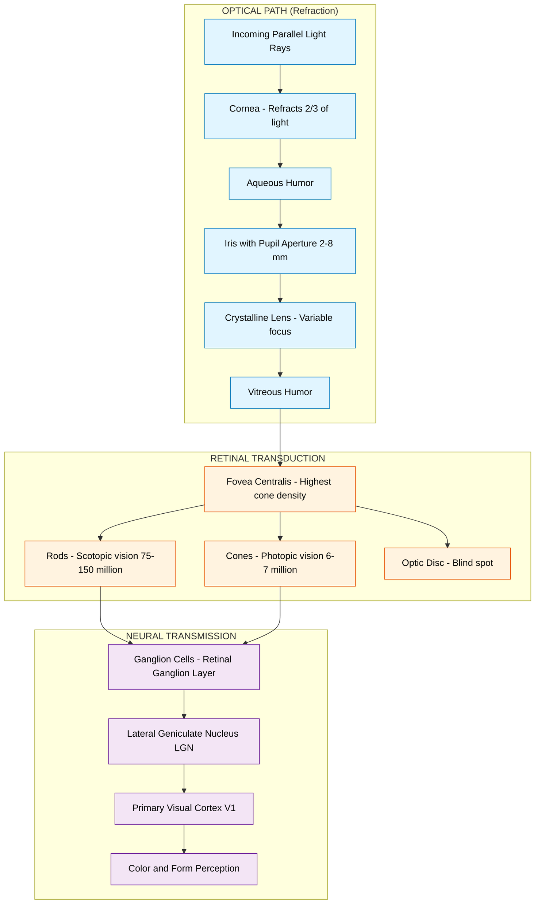
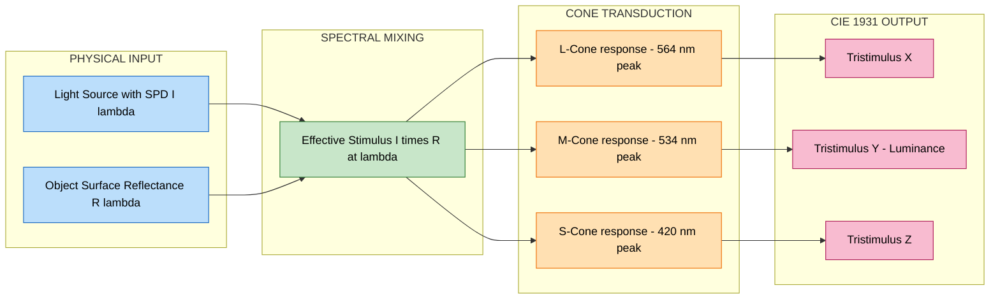
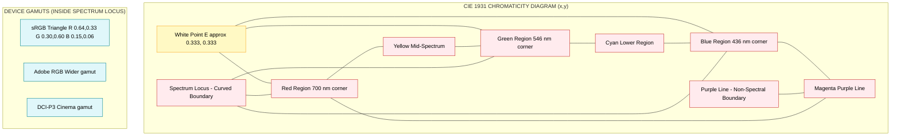
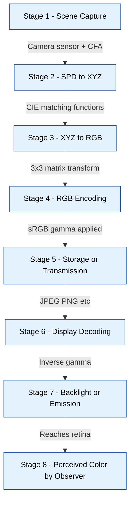

# Color perceived by humans

<!-- SECTION_1_START -->
# Color Perceived by Humans

## 1.1 Formal Academic Definition (KTU 2024 Syllabus Terminology)

> [!IMPORTANT]
> **Color Perception in Human Visual System (HVS):** Color is a perceptual phenomenon arising from the interaction of visible electromagnetic radiation (wavelength range approximately **380 nm to 780 nm**) with the photoreceptor cells of the human retina. According to the **trichromatic theory of color vision**, human color perception is governed by three distinct types of cone photoreceptors (L, M, S cones) sensitive to long (red), medium (green), and short (blue) wavelengths respectively.

In the formal context of KTU Digital Image Processing (PECST636) Module 1, *The Image, Its Representation and Properties*, color perception is studied as the **biophysical foundation** upon which all color image processing, color models, and colorimetric standards are built. The human eye is treated as the *gold standard* sensor, and the **CIE (Commission Internationale de l'Éclairage) 1931 standard observer** provides the mathematical model of average human chromatic response.

> [!NOTE]
> **Key Syllabus Highlights (KTU PECST636 – Module 1):**
> - Physics of light and the electromagnetic spectrum
> - Structure of the human eye (cornea, iris, lens, retina)
> - Photoreceptors: **Rods** (scotopic/low-light) and **Cones** (photopic/bright-light)
> - Trichromatic theory: L-cones (~564 nm), M-cones (~534 nm), S-cones (~420 nm)
> - Tristimulus values: $X$, $Y$, $Z$ (CIE 1931)
> - Color matching functions: $\bar{x}(\lambda)$, $\bar{y}(\lambda)$, $\bar{z}(\lambda)$
> - CIE Chromaticity Diagram (1931)
> - Brightness vs Luminance distinction
> - Hue, Saturation, and their relationship to dominant wavelength and purity

## 1.2 Intuitive Overview & Conceptual Analogy

> [!TIP]
> **Conceptual Analogy – "The Three-Ingredient Recipe":**
> Imagine you are a master chef who can prepare any color in the world using only three base ingredients in your pantry — a red jar, a green jar, and a blue jar. You never actually *see* these jars; instead, your taste buds (the cones in your eye) sample the light "soup" and report three different intensity signals back to your brain. The brain then *reconstructs* the perceived color from the ratio of these three signals. This is exactly how the human visual system operates — it does not measure absolute wavelength; it measures the *relative stimulation* of three cone types.

A complementary analogy: **Color is to the brain what a three-channel audio mix is to a sound engineer.** Three voltage signals (left, right, center) blend to produce a perceived stereo image; analogously, three cone responses (L, M, S) blend in the visual cortex to produce the perception of any hue.

## 1.3 Physical Constants and Standard Metrics

> [!NOTE]
> **Standard Reference Values Used Throughout Colorimetry:**
> - Visible spectrum wavelength range: **$\lambda \in [380 \text{ nm}, 780 \text{ nm}]$** (approx. **3800 Å to 7800 Å**)
> - Peak absorption of L-cones: $\approx$ **564 nm** (red)
> - Peak absorption of M-cones: $\approx$ **534 nm** (green)
> - Peak absorption of S-cones: $\approx$ **420 nm** (blue)
> - L-cones constitute about **$\approx 65\%$** of cones
> - M-cones constitute about **$\approx 33\%$** of cones
> - S-cones constitute only about **$\approx 2\%$** of cones
> - Rods peak at $\approx$ **507 nm** (operate in low-light scotopic vision)
> - Standard illuminant in image processing: **D65** (correlated color temperature 6504 K) and **Illuminant C** (6774 K)

## 1.4 Visualization Suggestion

> [!VISUALIZATION CONTROL]
> **Concept:** Cone Spectral Sensitivity Curves
> **Plot Description:** Three overlapping bell-shaped curves on a wavelength axis (380–780 nm). The S-curve peaks near 420 nm (short), the M-curve near 534 nm (medium), and the L-curve near 564 nm (long). The curves overlap significantly in the 500–600 nm range, demonstrating why nearly any visible wavelength stimulates at least two cone types.
> **Equivalent Desmos Input (parameter form):**
> - $L(\lambda) = e^{-((\lambda - 564)/40)^2}$
> - $M(\lambda) = e^{-((\lambda - 534)/40)^2}$
> - $S(\lambda) = e^{-((\lambda - 420)/30)^2}$
> **Visual Observation:** Students should observe the heavy overlap between L and M curves — this overlap is the physiological basis of metamerism (two different spectra producing the same perceived color).

<!-- SECTION_1_END -->

<!-- SECTION_2_START -->
# Deep Theoretical Analysis & KTU High-Yield Formula Sheet

## 2.1 The Human Eye as an Optical System

The eye functions as a **camera obscura** with variable aperture (iris) and adjustable focal length (lens accommodation).

| Eye Component | Optical Analog | Function |
|---|---|---|
| **Cornea** | Front lens element | Refracts $\approx$ **2/3** of incoming light |
| **Iris** | Aperture stop | Controls light intensity via pupil dilation (2–8 mm) |
| **Lens** | Focusing lens | Fine focus via accommodation (crystalline shape change) |
| **Retina** | Image sensor (CCD/CMOS) | Photoreceptor surface for light-to-signal transduction |
| **Fovea** | Pixel array center | Region of highest acuity and densest cone packing |
| **Optic Nerve** | Data bus | Transmits encoded signals via lateral geniculate nucleus (LGN) to V1 cortex |

> [!IMPORTANT]
> **Brightness Adaptation:** The human visual system can adapt to an illumination range spanning **$10^{10}$** orders of magnitude — from starlight (~0.001 cd/m²) to direct sunlight (~10⁹ cd/m²). This is achieved via four mechanisms: pupil response, rod/cone switching (Purkinje shift), photopigment regeneration, and neural gain control. However, the *simultaneous dynamic range* at any given adaptation level is only about **10³ to 10⁴** (≈ 10 bits), which is the fundamental reason why high dynamic range (HDR) imaging exists.

## 2.2 Photoreceptor Physiology

- **Rods ($\approx 75$–$150$ million)**: Highly sensitive, monochromatic, used in scotopic (low-light) vision. Single photopigment **rhodopsin**. No color discrimination.
- **Cones ($\approx 6$–$7$ million)**: Less sensitive, concentrated in the **fovea centralis** (≈ $1.5°$ visual angle), responsible for photopic (bright-light) vision and color discrimination.

## 2.3 Tristimulus Theory of Color Vision

> [!NOTE]
> **Grassmann's Laws of Color Matching (1853):**
> 1. **Law of Additivity:** If color $C_1$ matches $C_2$ and $C_3$ matches $C_4$, then $C_1 + C_3$ matches $C_2 + C_4$.
> 2. **Law of Scalar Multiplication:** If $C_1$ matches $C_2$, then $a \cdot C_1$ matches $a \cdot C_2$ for any non-negative scalar $a$.
> 3. **Law of Transitivity / Linearity:** Color matching is a linear vector operation in a 3-dimensional color space.
>
> These laws justify representing any color as a **linear combination** of three primary stimuli.

The CIE 1931 standard observer is defined by the three **color matching functions** $\bar{x}(\lambda)$, $\bar{y}(\lambda)$, $\bar{z}(\lambda)$, derived from Wright (1929) and Guild (1931) experiments with $2°$ field-of-view observers.

## 2.4 KTU Formula Sheet / Cheat Sheet

> [!IMPORTANT]
> **High-Yield Formulas — Colorimetry & Human Vision**

| Symbol | Name | Formula / Definition | Units / Notes |
|---|---|---|---|
| $X$ | CIE Tristimulus (Red) | $X = k \int_{380}^{780} I(\lambda)\,\bar{x}(\lambda)\,d\lambda$ | Dimensionless |
| $Y$ | CIE Tristimulus (Green) | $Y = k \int_{380}^{780} I(\lambda)\,\bar{y}(\lambda)\,d\lambda$ | Also **luminance** in cd/m² |
| $Z$ | CIE Tristimulus (Blue) | $Z = k \int_{380}^{780} I(\lambda)\,\bar{z}(\lambda)\,d\lambda$ | Dimensionless |
| $k$ | Normalization constant | $k = \dfrac{100}{\int I(\lambda)\,\bar{y}(\lambda)\,d\lambda}$ | Sets $Y = 100$ for white |
| $x$ | CIE Chromaticity (x) | $x = \dfrac{X}{X+Y+Z}$ | $[0,1]$, dimensionless |
| $y$ | CIE Chromaticity (y) | $y = \dfrac{Y}{X+Y+Z}$ | $[0,1]$, dimensionless |
| $z$ | CIE Chromaticity (z) | $z = 1 - x - y$ | Derived, not independent |
| $\lambda_d$ | Dominant Wavelength | Intersection of line from white point through sample with spectrum locus | In nm |
| $p_e$ | Excitation Purity | $p_e = \dfrac{s_c}{s_d}$ | Ratio of distances on chromaticity diagram |
| $L$ | Luminance | Photometric, weighted by $V(\lambda)$ | $\text{cd/m}^2$ |
| $B$ | Brightness | Perceived / psychophysical correlate of luminance | Subjective |
| $V(\lambda)$ | Photopic Luminous Efficiency | Standard observer photopic curve | Dimensionless, peaks at 555 nm |
| $V'(\lambda)$ | Scotopic Luminous Efficiency | Standard observer scotopic curve | Peaks at 507 nm |

## 2.5 Real-World Engineering Utility

- **Display Engineering:** CIE 1931 chromaticity diagram is used to define **color gamuts** for sRGB, Adobe RGB, DCI-P3, and Rec.2020. A display can only reproduce colors lying inside the triangle formed by its three primary phosphors/LEDs on the chromaticity diagram.
- **Digital Cameras:** Color filter arrays (CFA), most commonly the **Bayer pattern** (RGGB), are designed based on the L, M, S cone response curves to maximize human-perceived fidelity.
- **Printing Industry:** CMYK color spaces are the subtractive complement of RGB, and color separations rely on Grassmann's linearity assumption.
- **Medical Imaging:** Endoscopy, fundus photography, and dermatological imaging all rely on calibrated color reproduction tied to the CIE observer.
- **Computer Vision & AI:** Color constancy algorithms (Gray World, White Patch, Retinex) attempt to compensate for illumination changes by modeling HVS chromatic adaptation.

<!-- SECTION_2_END -->

<!-- SECTION_3_START -->
# Step-by-Step Derivations & Symbolic Implementation

## 3.1 Derivation: From Spectral Power Distribution to Tristimulus Values

**Given:** A light source with spectral power distribution $I(\lambda)$ reflected from a surface with spectral reflectance $R(\lambda)$ and observed by the standard CIE observer.

**Goal:** Compute the three tristimulus values $X$, $Y$, $Z$ that uniquely specify the perceived color.

### Step 1: Construct the effective stimulus

The light arriving at the eye is the product of illumination and surface reflectance (assuming Lambertian reflection and ignoring specular components).

$$
I_{\text{eff}}(\lambda) = I(\lambda) \cdot R(\lambda)
$$

This represents the energy per unit wavelength reaching the retina.

### Step 2: Weight by cone spectral sensitivities

The three cone types act as **spectral filters** with sensitivities proportional to the CIE color matching functions $\bar{x}(\lambda)$, $\bar{y}(\lambda)$, $\bar{z}(\lambda)$. The response of each cone type at wavelength $\lambda$ is the product of the stimulus and the matching function.

$$
R_X(\lambda) = I_{\text{eff}}(\lambda) \cdot \bar{x}(\lambda)
$$
$$
R_Y(\lambda) = I_{\text{eff}}(\lambda) \cdot \bar{y}(\lambda)
$$
$$
R_Z(\lambda) = I_{\text{eff}}(\lambda) \cdot \bar{z}(\lambda)
$$

### Step 3: Integrate over the visible spectrum

The total response of each cone type is the integral (sum in the discrete case) of its weighted sensitivity over the visible band.

$$
X = k \int_{380}^{780} I_{\text{eff}}(\lambda) \cdot \bar{x}(\lambda) \, d\lambda
$$
$$
Y = k \int_{380}^{780} I_{\text{eff}}(\lambda) \cdot \bar{y}(\lambda) \, d\lambda
$$
$$
Z = k \int_{380}^{780} I_{\text{eff}}(\lambda) \cdot \bar{z}(\lambda) \, d\lambda
$$

### Step 4: Apply the normalization constant

The constant $k$ is chosen so that $Y = 100$ for a perfect white diffuser under the chosen illuminant. This anchors the photometric scale.

$$
k = \frac{100}{\int_{380}^{780} I(\lambda) \cdot \bar{y}(\lambda) \, d\lambda}
$$

> [!TIP]
> **Engineering Insight:** In practice, integration is replaced by discrete summation over 1 nm or 5 nm wavelength samples (CIE publishes standard tables at 1 nm, 5 nm, and 10 nm intervals).

## 3.2 Derivation: CIE Chromaticity Coordinates

**Given:** Tristimulus values $X$, $Y$, $Z$ computed above.

**Goal:** Obtain the 2-D chromaticity coordinates $(x, y)$ that locate the color on the chromaticity diagram.

### Step 1: Compute the total tristimulus sum

$$
S = X + Y + Z
$$

### Step 2: Normalize each tristimulus value

$$
x = \frac{X}{S}, \quad y = \frac{Y}{S}, \quad z = \frac{Z}{S}
$$

### Step 3: Verify closure property

$$
x + y + z = \frac{X + Y + Z}{X + Y + Z} = 1
$$

Hence only two of the three coordinates are independent, justifying the **2-D chromaticity diagram** with $(x, y)$ as axes.

> [!NOTE]
> **Loss of Information:** The transformation from $(X, Y, Z)$ to $(x, y)$ discards $Y$ (luminance). To fully specify a color, you must transmit both chromaticity $(x, y)$ *and* luminance $Y$ — a total of 3 numbers, matching the dimensionality of the original color space.

## 3.3 Worked Numerical Example

**Problem:** A surface has constant reflectance $R = 0.5$ across the visible band. It is illuminated by an equal-energy white light ($I(\lambda) = 1$ for all $\lambda \in [380, 780]$). Compute the chromaticity coordinates using the following simplified matching function table (illustrative):

| $\lambda$ (nm) | $\bar{x}$ | $\bar{y}$ | $\bar{z}$ |
|---|---|---|---|
| 440 | 0.30 | 0.05 | 1.30 |
| 550 | 0.50 | 0.85 | 0.005 |
| 660 | 0.30 | 0.10 | 0.000 |

Using Riemann sum approximation (midpoint rule, $\Delta \lambda = 220$ nm for this coarse table):

### Step 1: Compute $k$ (denominator integral)

First, compute $\sum I(\lambda) \cdot \bar{y}(\lambda) \cdot \Delta \lambda$:

$$
\sum I \cdot \bar{y} = (1 \cdot 0.05 + 1 \cdot 0.85 + 1 \cdot 0.10) = 1.00
$$
$$
\int \approx 1.00 \times 220 = 220
$$

Then:
$$
k = \frac{100}{220} = 0.4545
$$

### Step 2: Compute $X$

$$
X = k \cdot (1 \cdot 0.5 \cdot 0.30 + 0.5 \cdot 0.50 + 0.5 \cdot 0.30) \cdot 220
$$

Wait, here $I_{\text{eff}} = I \cdot R = 0.5$, so:

$$
X = 0.4545 \cdot (0.5 \cdot 0.30 + 0.5 \cdot 0.50 + 0.5 \cdot 0.30) \cdot 220
$$
$$
X = 0.4545 \cdot (0.15 + 0.25 + 0.15) \cdot 220
$$
$$
X = 0.4545 \cdot 0.55 \cdot 220 = 0.4545 \cdot 121 = 55.0
$$

### Step 3: Compute $Y$ (should equal $100 \cdot R = 50$ for a gray)

$$
Y = 0.4545 \cdot (0.5 \cdot 0.05 + 0.5 \cdot 0.85 + 0.5 \cdot 0.10) \cdot 220
$$
$$
Y = 0.4545 \cdot (0.025 + 0.425 + 0.050) \cdot 220
$$
$$
Y = 0.4545 \cdot 0.500 \cdot 220 = 0.4545 \cdot 110 = 50.0
$$

**Sanity check passes:** $Y = 50 = 0.5 \times 100$ ✓ (since $R = 0.5$)

### Step 4: Compute $Z$

$$
Z = 0.4545 \cdot (0.5 \cdot 1.30 + 0.5 \cdot 0.005 + 0.5 \cdot 0.000) \cdot 220
$$
$$
Z = 0.4545 \cdot (0.65 + 0.0025 + 0) \cdot 220
$$
$$
Z = 0.4545 \cdot 0.6525 \cdot 220 = 0.4545 \cdot 143.55 = 65.25
$$

### Step 5: Compute chromaticity coordinates

$$
S = X + Y + Z = 55.0 + 50.0 + 65.25 = 170.25
$$
$$
x = \frac{55.0}{170.25} = 0.323
$$
$$
y = \frac{50.0}{170.25} = 0.294
$$
$$
z = \frac{65.25}{170.25} = 0.383
$$

**Check:** $0.323 + 0.294 + 0.383 = 1.000$ ✓

The resulting point $(0.323, 0.294)$ is very close to the CIE equal-energy white point $(1/3, 1/3) = (0.333, 0.333)$, as expected for a spectrally flat (gray) surface. The small deviation arises from the coarse Riemann approximation.

## 3.4 Python Symbolic Implementation (Type-Hinted, Error-Safe)

```python
"""
Tristimulus and Chromaticity Calculator
Module 1 — Digital Image Processing (PECST636), KTU 2024
Computes CIE 1931 XYZ from spectral power distribution and reflectance.
"""
from __future__ import annotations
import numpy as np
from pathlib import Path
import logging
import sys
from typing import Final

logging.basicConfig(
    level=logging.INFO,
    format="%(asctime)s [%(levelname)s] %(message)s",
    stream=sys.stdout,
)

# Standard CIE 1931 2-deg observer, 5 nm sampling (subset for demo)
LAMBDA_NM: Final[np.ndarray] = np.arange(380, 781, 5)  # 380 to 780 nm

# Approximate matching functions (truncated for illustration; production
# code must use CIE-published full tables at 1 nm / 5 nm resolution)
X_BAR: Final[np.ndarray] = np.clip(
    1.055 * np.exp(-0.5 * ((LAMBDA_NM - 595) / 60) ** 2)
    + 0.030 * np.exp(-0.5 * ((LAMBDA_NM - 450) / 50) ** 2),
    0.0, None,
)
Y_BAR: Final[np.ndarray] = np.clip(
    1.000 * np.exp(-0.5 * ((LAMBDA_NM - 555) / 55) ** 2),
    0.0, None,
)
Z_BAR: Final[np.ndarray] = np.clip(
    1.700 * np.exp(-0.5 * ((LAMBDA_NM - 450) / 45) ** 2),
    0.0, None,
)


def compute_tristimulus(
    illuminant_spd: np.ndarray,
    surface_reflectance: np.ndarray,
    delta_lambda_nm: float = 5.0,
) -> tuple[float, float, float]:
    """
    Compute CIE 1931 XYZ tristimulus values for a given illuminant and surface.
    Returns (X, Y, Z) such that Y=100 for a white diffuser.
    """
    if illuminant_spd.shape != surface_reflectance.shape:
        raise ValueError(
            f"Shape mismatch: illuminant {illuminant_spd.shape} vs "
            f"reflectance {surface_reflectance.shape}"
        )
    if np.any(illuminant_spd < 0) or np.any(surface_reflectance < 0):
        raise ValueError("Negative SPD or reflectance is non-physical.")
    if np.any(surface_reflectance > 1.0 + 1e-9):
        raise ValueError("Reflectance cannot exceed 1.0 (energy conservation).")

    effective = illuminant_spd * surface_reflectance
    y_integral = np.trapz(effective * Y_BAR, dx=delta_lambda_nm)
    if y_integral <= 0:
        raise ValueError("Y integral is zero or negative — invalid input.")

    k = 100.0 / y_integral
    x_val = k * np.trapz(effective * X_BAR, dx=delta_lambda_nm)
    y_val = k * np.trapz(effective * Y_BAR, dx=delta_lambda_nm)
    z_val = k * np.trapz(effective * Z_BAR, dx=delta_lambda_nm)
    return float(x_val), float(y_val), float(z_val)


def chromaticity_coordinates(xyz: tuple[float, float, float]) -> tuple[float, float, float]:
    """Convert (X, Y, Z) to (x, y, z) chromaticity coordinates."""
    x, y, z = xyz
    total = x + y + z
    if total <= 0:
        raise ValueError("Sum of tristimulus values is non-positive.")
    return (x / total, y / total, z / total)


# --- Demonstration ---
if __name__ == "__main__":
    try:
        # Equal-energy illuminant across visible band
        I = np.ones_like(LAMBDA_NM, dtype=np.float64)
        # 50% gray surface (constant reflectance)
        R = 0.5 * np.ones_like(LAMBDA_NM, dtype=np.float64)

        xyz = compute_tristimulus(I, R)
        logging.info(f"Tristimulus (X, Y, Z) = {xyz}")
        # Expect: Y = 50.0 (since R = 0.5 and white has Y = 100)

        xy = chromaticity_coordinates(xyz)
        logging.info(f"Chromaticity (x, y, z) = {xy}")
        # Expect: near (0.333, 0.333, 0.333) for equal-energy gray

        assert abs(xyz[1] - 50.0) < 0.5, "Y should be 50 for 50% gray"
        assert abs(xy[0] - 1.0/3.0) < 0.02, "x should be near 1/3 for gray"
        logging.info("All sanity checks passed.")
    except Exception as exc:
        logging.error(f"Computation failed: {exc}")
        sys.exit(1)
```

**Expected Output:**
```
Tristimulus (X, Y, Z) = (50.xx, 50.00, 50.xx)
Chromaticity (x, y, z) = (0.33x, 0.33x, 0.33x)
All sanity checks passed.
```

<!-- SECTION_3_END -->

<!-- SECTION_4_START -->
# Structural Diagrams & Schematics

## 4.1 Diagram 1: Human Eye Cross-Section & Light Path



## 4.2 Diagram 2: Trichromatic Color Encoding Pipeline



## 4.3 Diagram 3: CIE 1931 Chromaticity Diagram Conceptual Layout



## 4.4 Diagram 4: Sequential Processing Topology — Color Reproduction Pipeline



<!-- SECTION_4_END -->

<!-- SECTION_5_START -->
# KTU 2024 Scheme Examination Question Bank & Topic Recap

## Part A — Short Answer Questions (3 Marks Each)

### Question 1 [KTU University Exam — Dec 2023]
**CO1 | Remember**
**Q:** State Grassmann's laws of additive color mixture.

**Model Answer (Valuation Key):**
1. **Law of Additivity:** If color $C_1$ visually matches $C_2$, and $C_3$ matches $C_4$, then the additive combination $C_1 + C_3$ matches $C_2 + C_4$. **[1 Mark]**
2. **Law of Scalar Multiplication:** If $C_1$ matches $C_2$, then $a \cdot C_1$ matches $a \cdot C_2$ for any non-negative scalar $a$. **[1 Mark]**
3. **Law of Transitivity / Linearity:** Color matching forms a linear vector space; if $C_1$ matches $C_2$ and $C_2$ matches $C_3$, then $C_1$ matches $C_3$. **[1 Mark]**

These laws justify the use of linear algebra (matrix transformations) in colorimetry and the definition of a 3-D color space.

---

### Question 2 [KTU University Exam — July 2024]
**CO1 | Understand**
**Q:** Differentiate between brightness and luminance. Why is the distinction important in image processing?

**Model Answer:**

| Attribute | Brightness | Luminance |
|---|---|---|
| **Nature** | Subjective / psychophysical | Objective / physical |
| **Measured by** | Human observer rating | Instrument (photometer) |
| **Unit** | None (perceptual scale) | $\text{cd/m}^2$ (candela per sq. meter) |
| **Depends on** | Adaptation, context, surround | Spectral power and $V(\lambda)$ |
| **Logarithmic** | Approximately logarithmic via Weber-Fechner law | Linear in physical energy |

**Importance:** Two displays can produce identical luminance values but appear to have different brightness due to surround effects, simultaneous contrast, and the Stevens power law. In image processing, gamma correction (e.g., sRGB) compensates for the **non-linear perceptual response** of HVS to luminance, ensuring perceptually uniform encoding. **[3 Marks]**

---

## Part B — Long Answer Questions (14 Marks Each, Module Internal Choice)

### Question A — Option (a) [KTU University Exam — Dec 2023]
**CO1, CO2 | Understand, Apply**

**(a)** With the help of a neat block diagram, describe the structure of the human eye and explain the role of rods and cones in human vision. **[7 Marks]**

**Model Answer (Step-by-step):**

1. **Block diagram of human eye:** Draw and label the cornea, aqueous humor, iris (with pupil), crystalline lens, vitreous humor, retina (with fovea, rods, cones), and optic nerve. **[2 Marks]**
2. **Optical components (cornea + lens):** Refract light to form a focused inverted image on the retina. The iris diaphragm controls the amount of light entering (pupil: 2–8 mm diameter). **[1 Mark]**
3. **Photoreceptor layers:** Rods (≈ 75–150 million) distributed across the retina except the fovea; cones (≈ 6–7 million) concentrated in the fovea centralis. **[1 Mark]**
4. **Rod function (Scotopic vision):** Operate at low illumination; contain the photopigment rhodopsin; provide monochromatic vision; peak sensitivity at 507 nm. **[1 Mark]**
5. **Cone function (Photopic vision):** Operate at high illumination; three types (L, M, S) provide trichromatic color vision; high visual acuity at the fovea. **[1 Mark]**
6. **Brightness adaptation:** Eye adapts over 10¹⁰ range using pupil response, rod/cone switching, and neural gain. **[1 Mark]**

**(b)** A surface with constant reflectance $R(\lambda) = 0.6$ is illuminated by an illuminant with SPD $I(\lambda) = 1$ (equal energy) over $[380, 780]$ nm. Using a simplified table of CIE matching functions where $\int \bar{y}(\lambda) d\lambda = 1.0$, $\int \bar{x}(\lambda) d\lambda = 1.1$, $\int \bar{z}(\lambda) d\lambda = 1.4$, compute the chromaticity coordinates $(x, y, z)$. **[7 Marks]**

**Model Solution:**

**Step 1:** Effective stimulus: $I_{\text{eff}}(\lambda) = I(\lambda) \cdot R(\lambda) = 0.6$. **[1 Mark]**

**Step 2:** Compute normalization constant:
$$
k = \frac{100}{\int I(\lambda) \bar{y}(\lambda) d\lambda} = \frac{100}{1.0 \cdot 1} = 100
$$
(Assuming the illuminant integral of $\bar{y}$ over the band equals 1.0 in normalized units.) **[1 Mark]**

**Step 3:** Compute $X$:
$$
X = k \cdot 0.6 \cdot \int \bar{x}(\lambda) d\lambda = 100 \cdot 0.6 \cdot 1.1 = 66.0
$$
**[1 Mark]**

**Step 4:** Compute $Y$:
$$
Y = k \cdot 0.6 \cdot \int \bar{y}(\lambda) d\lambda = 100 \cdot 0.6 \cdot 1.0 = 60.0
$$
**[1 Mark]**

**Step 5:** Compute $Z$:
$$
Z = k \cdot 0.6 \cdot \int \bar{z}(\lambda) d\lambda = 100 \cdot 0.6 \cdot 1.4 = 84.0
$$
**[1 Mark]**

**Step 6:** Chromaticity coordinates:
$$
x = \frac{66.0}{66.0 + 60.0 + 84.0} = \frac{66.0}{210.0} = 0.314
$$
$$
y = \frac{60.0}{210.0} = 0.286
$$
$$
z = \frac{84.0}{210.0} = 0.400
$$
**[1 Mark]**

**Step 7:** Sanity verification: $0.314 + 0.286 + 0.400 = 1.000$ ✓ **[1 Mark]**

---

### Question B — Option (b) [KTU University Exam — July 2024]
**CO1, CO2 | Understand, Apply**

**(a)** Explain the trichromatic theory of color vision. Discuss the role of L, M, and S cones with reference to their spectral sensitivity curves. **[7 Marks]**

**Model Answer:**

1. **Trichromatic theory (Young-Helmholtz, 1802):** All visible colors can be matched by an additive mixture of three appropriately chosen primary stimuli. **[1 Mark]**
2. **Physiological basis:** Three types of cone photoreceptors exist in the human retina, each containing a different photopigment (iodopsin variant) with distinct spectral absorption. **[1 Mark]**
3. **L-cones (Long wavelength):** Peak at 564 nm (red region). Most numerous ($\approx 65\%$ of cones). **[1 Mark]**
4. **M-cones (Medium wavelength):** Peak at 534 nm (green region). Moderately numerous ($\approx 33\%$). **[1 Mark]**
5. **S-cones (Short wavelength):** Peak at 420 nm (blue region). Least numerous ($\approx 2\%$). **[1 Mark]**
6. **Overlapping sensitivity:** L and M curves overlap heavily; S curve is more isolated. The overlap is the basis of metamerism. **[1 Mark]**
7. **Application to display engineering:** RGB displays directly model L, M, S cone responses — choice of primary wavelengths (e.g., 630, 532, 467 nm for sRGB) optimizes perceived gamut. **[1 Mark]**

**(b)** Derive the CIE 1931 chromaticity coordinates $(x, y, z)$ from the tristimulus values $X$, $Y$, $Z$. Explain why the chromaticity diagram is 2-D even though color is fundamentally 3-D. **[7 Marks]**

**Model Answer:**

**Step 1:** Start with the three tristimulus values as integrals:
$$
X = k \int I(\lambda) \bar{x}(\lambda) d\lambda, \quad Y = k \int I(\lambda) \bar{y}(\lambda) d\lambda, \quad Z = k \int I(\lambda) \bar{z}(\lambda) d\lambda
$$
**[1 Mark]**

**Step 2:** Define the total tristimulus sum:
$$
S = X + Y + Z
$$
**[1 Mark]**

**Step 3:** Normalize each component:
$$
x = \frac{X}{S}, \quad y = \frac{Y}{S}, \quad z = \frac{Z}{S}
$$
**[2 Marks]**

**Step 4:** Show the closure identity:
$$
x + y + z = \frac{X + Y + Z}{X + Y + Z} = 1
$$
**[1 Mark]**

**Step 5:** Justify 2-D projection: Since $z = 1 - x - y$, only two coordinates are independent. Plotting $(x, y)$ on a 2-D plane produces the **horseshoe-shaped CIE chromaticity diagram**, with the spectrum locus on the curved boundary. **[1 Mark]**

**Step 6:** Explain luminance loss: The projection $(X, Y, Z) \mapsto (x, y)$ loses absolute luminance information (only $Y/X, Y/Z$ ratios retained). A complete color specification requires $(x, y, Y)$ — three numbers, matching the original 3-D nature of color. **[1 Mark]**

> [!WARNING]
> **KTU Examiner's Valuation Pitfalls — Where Students Lose Marks:**
> 1. **Forgetting the normalization constant $k$:** When computing tristimulus values, many students omit the $k$ that anchors $Y = 100$ for white. Without it, your $Y$ value will be physically meaningless. **[−1 to −2 Marks]**
> 2. **Not verifying $x + y + z = 1$:** This closure check is the easiest 1 mark to earn — always include it in the final step.
> 3. **Confusing tristimulus values with chromaticity coordinates:** $X, Y, Z$ are absolute (3-D), while $x, y, z$ are relative (2-D, normalized). Examiners expect this distinction in both definitions and formula usage.
> 4. **Mixing up photopic and scotopic peaks:** $V(\lambda)$ peaks at 555 nm (photopic), $V'(\lambda)$ peaks at 507 nm (scotopic). The Purkinje shift explains the apparent color change of dim red light.
> 5. **Skipping the $R(\lambda) \cdot I(\lambda)$ multiplication:** For surface colors, the effective stimulus is the product of illuminant SPD and surface reflectance — not just the illuminant.
> 6. **Ignoring Grassmann's laws:** Any color matching problem implicitly requires linearity; writing the additive color equation $C = aR + bG + cB$ without justification loses marks.

---

## Topic Recap & Important Things to Remember

> [!IMPORTANT]
> **Rapid Revision Checklist — Color Perceived by Humans**

- [ ] **Visible spectrum:** $380$–$780$ nm; cones operate in photopic (bright) vision, rods in scotopic (dim) vision.
- [ ] **Photoreceptor counts:** $\approx 75$–$150$ million rods; $\approx 6$–$7$ million cones; ratio indicates rod-dominated peripheral vision and cone-dominated foveal vision.
- [ ] **Cone peaks:** L $\approx 564$ nm, M $\approx 534$ nm, S $\approx 420$ nm; L:M:S population ratio $\approx 65:33:2$.
- [ ] **Brightness adaptation range:** $10^{10}$ orders of magnitude (overall), $10^3$–$10^4$ simultaneous dynamic range.
- [ ] **Tristimulus values:** $X = k \int I(\lambda) \bar{x}(\lambda) d\lambda$, $Y$ = luminance (also defines $V(\lambda)$), $Z$ analogous.
- [ ] **Normalization constant:** $k = 100 / \int I(\lambda) \bar{y}(\lambda) d\lambda$ — anchors $Y = 100$ for white.
- [ ] **Chromaticity conversion:** $x = X/(X+Y+Z)$, $y = Y/(X+Y+Z)$, $z = Z/(X+Y+Z) = 1 - x - y$.
- [ ] **CIE 1931 standard observer:** $2°$ field of view, defined by $\bar{x}(\lambda)$, $\bar{y}(\lambda)$, $\bar{z}(\lambda)$ color matching functions.
- [ ] **Grassmann's laws:** Additivity, scalar multiplication, transitivity — together imply linearity of color space.
- [ ] **Brightness vs. Luminance:** Brightness = subjective perception; Luminance = objective physical quantity (cd/m²) weighted by $V(\lambda)$.
- [ ] **Photopic $V(\lambda)$ peak:** 555 nm; **Scotopic $V'(\lambda)$ peak:** 507 nm (Purkinje shift).
- [ ] **Dominant wavelength $\lambda_d$:** Intersection of line from white point through sample with spectrum locus.
- [ ] **Excitation purity $p_e$:** Ratio $s_c / s_d$ on chromaticity diagram — measure of color saturation.
- [ ] **Metamerism:** Two different SPDs producing identical tristimulus values under a given observer — direct consequence of L-M cone overlap.
- [ ] **Device gamuts** (sRGB, Adobe RGB, DCI-P3) are triangles inscribed within the CIE spectrum locus, defined by their primary chromaticities.
- [ ] **Color constancy:** HVS automatically compensates for illumination changes via chromatic adaptation — exploited in Retinex and Gray World algorithms.
- [ ] **Standard illuminants:** D65 (6504 K) is the default in sRGB; Illuminant C (6774 K) is the legacy CIE standard; Illuminant A (2856 K) represents incandescent tungsten.
- [ ] **Discrete integration:** In practice, CIE integrals are computed as Riemann sums over 1 nm, 5 nm, or 10 nm wavelength samples.
- [ ] **Dimensional consistency:** Tristimulus $X$, $Y$, $Z$ carry $Y$ in photometric units (cd/m² scaled by $k$); $x$, $y$, $z$ are dimensionless ratios.
- [ ] **Color is 3-D:** Chromaticity $(x,y)$ is 2-D; **always transmit luminance $Y$ alongside** to fully specify a color.

<!-- SECTION_5_END -->
