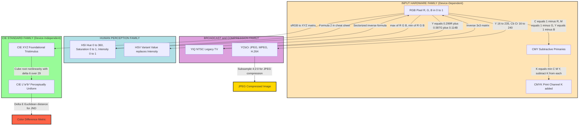
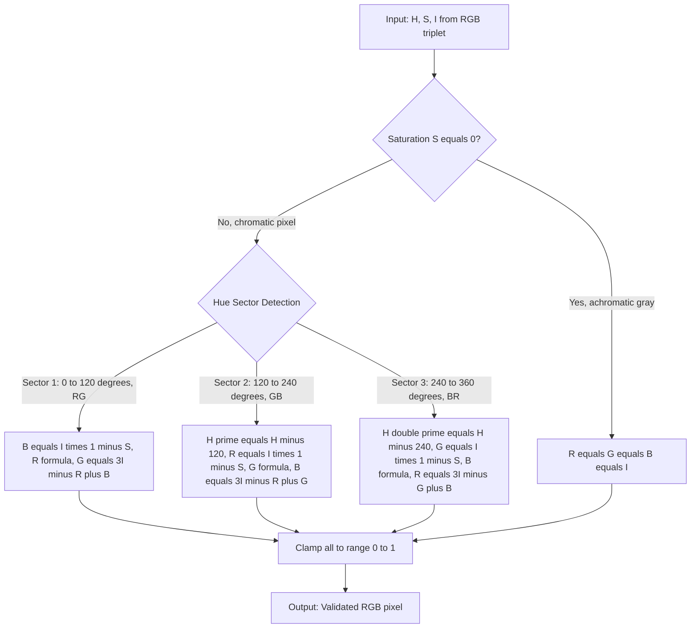
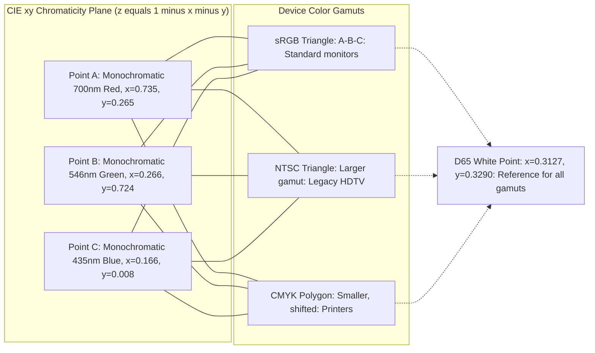

# Color spaces

<!-- SECTION_1_START -->
# Color Spaces in Digital Image Processing

## 1.1 Formal Academic Definition

A **color space** (also called a **color model** or **color system**) is a mathematical abstraction that represents colors as tuples of numbers, typically consisting of 3 or 4 components. Each color space defines a complete, unambiguous description of how an ordered set of primary colors can be combined to reproduce the entire visible spectrum of human vision. In Digital Image Processing (PECST636 — KTU 2024 Scheme), a color model is formally defined as a specification of a 3-D coordinate system and a subspace within that system where each color is represented by a single point.

> [!IMPORTANT]
> **KTU 2024 Syllabus Note (Module 1):** The course outcome here maps to **CO1** (Fundamentals of Image Representation). Students are expected to *understand, identify, and apply* color models to represent digital images. The most frequently examined color spaces in KTU papers are **RGB, CMY/CMYK, HSI, YIQ, YCbCr, and the CIE family (XYZ, L\*a\*b\*)**.

The three foundational pillars of color science that every KTU student must internalize are:

1. **Trichromacy** — The Young–Helmholtz theory, which states that the human visual system can reproduce any color through the linear combination of three carefully chosen primary stimuli (Red, Green, Blue).
2. **Color Matching Functions** — Standardized CIE curves $\bar{x}(\lambda)$, $\bar{y}(\lambda)$, $\bar{z}(\lambda)$ that map wavelength to tristimulus values.
3. **Device Dependency vs. Device Independence** — RGB and CMYK are **device-dependent** (the same numbers render differently on different monitors/printers), while CIE L\*a\*b\* and CIE XYZ are **device-independent** (anchored to human perception).

## 1.2 Conceptual Analogy — The "Color Translator" Metaphor

> [!NOTE]
> **Intuition Builder for First-Time Learners**

Imagine a **universal translator** similar to the Babel fish in *The Hitchhiker's Guide to the Galaxy*, but for the "language of color."

- The **physical world** is the *speaker* — it produces a continuous spectrum of light wavelengths.
- The **human eye** is a *bilingual listener* — it only understands three "phonemes" (Long, Medium, Short cones → R, G, B).
- A **color space** is one of many *dialects* used to describe the same conversation in writing.

**Analogy expanded:**
- **RGB** is like speaking in **English (scientific notation)** — precise, but tied to a specific device (speaker brand).
- **HSI/HSV** is like **describing color using everyday words** ("a dark, very saturated red") — much closer to how humans verbally describe color, separating *what it looks like* from *how bright it is*.
- **YCbCr** is like **a journalist's shorthand** — separating the *story* (luminance Y) from the *pictures* (chrominance Cb, Cr), making it efficient for transmission (exactly why JPEG, MPEG, and digital TV use it).
- **CIE L\*a\*b\*** is like a **UN-certified Esperanto** — a perceptually uniform, device-independent standard used when colors must mean the *exact same thing* across the entire world (e.g., dental shade guides, automotive paint matching).

> [!VISUALIZATION CONTROL]
> **Concept:** Hexagonal/Biconical HSI Color Solid
> **GeoGebra / Desmos Input Equations (parametric, where $r$, $g$, $b \in [0,1]$):**
> * Hue circle (top view): `x = R * cos(H); y = R * sin(H)` where H ranges $[0, 2\pi]$
> * Intensity axis (vertical): `z = I = (R + G + B) / 3`
> * Saturation radius: `S = 1 - (3 * min(R, G, B)) / (R + G + B)`
> **Visual Description:** The student should observe a **double-hexcone** (bipyramid) where the central vertical axis is Intensity (black at apex $I=0$, white at apex $I=1$). Going around the equator shows pure hues. The distance from the central axis represents saturation (0 = gray, 1 = pure color). This visualization proves why HSI is "human-friendly" — Hue = the angle you walk around, Saturation = how far from the middle, Intensity = how high up the pyramid you stand.

## 1.3 The CIE Standard Observer Constants

> [!IMPORTANT]
> **Crucial Constants to Memorize for KTU Board Exams**

The foundational constants governing all modern colorimetry are derived from the 1931 CIE Standard Observer experiment conducted on 17 human subjects. These three values define the luminance sensitivity of the "average human eye":

$$\bar{x}(\lambda), \quad \bar{y}(\lambda), \quad \bar{z}(\lambda) \quad \text{with} \quad \int \bar{y}(\lambda) \, d\lambda = 683 \text{ lumens/watt}$$

The **CIE Standard Illuminant D65** represents average noon daylight and is the default reference white for nearly all KTU-prescribed image processing pipelines.

---

<!-- SECTION_2_START -->
# Deep Theoretical Analysis & KTU High-Yield Formula Sheet

## 2.1 Taxonomy of Color Spaces

Color spaces are broadly classified into **four families**, each optimized for a different engineering task:

| Family | Purpose | Members | Key Use Case |
| :--- | :--- | :--- | :--- |
| **Hardware-Oriented** | Direct use by physical devices (monitors, cameras, printers) | RGB, CMY, CMYK | Display & print reproduction |
| **Human-Perception-Oriented** | Decouple "what the color is" from "how bright it is" | HSI, HSV, HSL | Image segmentation, intuitive editing |
| **Broadcast / Transmission** | Separate luminance from chrominance for compression | YIQ, YUV, YCbCr | TV broadcasting, JPEG, MPEG, H.264 |
| **CIE Standard (Device-Independent)** | Perceptually uniform, universal truth | CIE XYZ, CIE L\*a\*b\*, CIE L\*u\*v\* | Colorimetry, ICC profiling, color management |

## 2.2 Detailed Color Space Breakdown

### 2.2.1 The RGB Color Model (Additive Primary)

- **Geometry:** A 3-D unit cube with black at the origin $(0,0,0)$ and white at the opposite corner $(1,1,1)$.
- **Vertices:** The three corners adjacent to black are pure Red $(1,0,0)$, Green $(0,1,0)$, Blue $(0,0,1)$ — the **additive primaries**.
- **Diagonal:** The line from black to white is the **gray axis**, where $R = G = B$.
- **Bit depth:** A 24-bit RGB image allocates **8 bits per channel** ($2^8 = 256$ levels), yielding $256^3 \approx 16.7$ million distinct colors.

**Why RGB matters in production:** Every digital camera sensor (CCD/CMOS) is fabricated with a **Bayer filter mosaic** that captures exactly these three channels. Therefore, **all image processing pipelines begin with RGB** and convert to other spaces only when required.

### 2.2.2 The CMY and CMYK Color Models (Subtractive Primary)

CMY is the **subtractive** counterpart of RGB, designed for **reflective media** (paper, ink):

$$C = 1 - R, \qquad M = 1 - G, \qquad Y = 1 - B$$

The **K (Key/Black)** channel is added because mixing equal parts of C, M, Y in real-world ink produces a muddy brown, not true black. $K$ is computed as:

$$K = \min(C, M, Y)$$
$$C' = C - K, \quad M' = M - K, \quad Y' = Y - K$$

### 2.2.3 The HSI Color Model (Human-Perception)

HSI decouples the **chromatic** (Hue, Saturation) from the **achromatic** (Intensity) information. This is mathematically the most demanding model in the syllabus and is heavily tested in KTU board exams.

### 2.2.4 The YIQ Color Model (NTSC Television)

Used in the **NTSC** (North American) broadcast standard. $Y$ carries the luminance (compatible with black-and-white TVs), while $I$ and $Q$ carry the chrominance along the **orange-cyan** and **purple-green** perceptual axes.

### 2.2.5 The YCbCr Color Model (Digital Video / JPEG / MPEG)

The modern digital successor of YIQ. Used in **JPEG, MPEG, H.264, H.265, and Blu-ray**. $Y$ is the luma (gamma-corrected luminance), and $C_b$/$C_r$ are the blue-difference and red-difference chroma.

### 2.2.6 CIE XYZ and CIE L\*a\*b\*

- **CIE XYZ** is the **foundational** device-independent color space from which all others can be derived via linear transformations.
- **CIE L\*a\*b\*** (1976) is **perceptually uniform**: a Euclidean distance of $\Delta E = 1$ in L\*a\*b\* corresponds to a **just-noticeable difference (JND)** to the human eye. This makes it the gold standard for color-difference measurement.

## 2.3 KTU Formula Sheet — The Complete Color Conversion Cheat-Sheet

> [!IMPORTANT]
> **All formulas below assume $R$, $G$, $B \in [0, 1]$ unless otherwise stated. Memorize these for the 14-mark derivation questions.**

### Table 2.1: Master Formula Reference

| # | Conversion | Formula | Output Range |
| :-: | :--- | :--- | :--- |
| 1 | **RGB $\to$ CMY** | $C = 1-R$, $M = 1-G$, $Y = 1-B$ | $[0,1]$ |
| 2 | **RGB $\to$ HSI — Hue** | $H = \theta$ if $B \le G$, else $H = 360^\circ - \theta$ <br> where $\theta = \arccos\!\left[\dfrac{0.5 \cdot \left[(R-G) + (R-B)\right]}{\sqrt{(R-G)^2 + (R-B)(G-B)}}\right]$ | $[0^\circ, 360^\circ]$ |
| 3 | **RGB $\to$ HSI — Saturation** | $S = 1 - \dfrac{3}{R+G+B} \cdot \min(R,G,B)$ | $[0,1]$ |
| 4 | **RGB $\to$ HSI — Intensity** | $I = \dfrac{R+G+B}{3}$ | $[0,1]$ |
| 5 | **HSI $\to$ RGB (RG sector, $0^\circ \le H < 120^\circ$)** | $B = I(1-S)$, $R = I\!\left[1 + \dfrac{S \cos H}{\cos(60^\circ - H)}\right]$, $G = 3I - (R+B)$ | $[0,1]$ |
| 6 | **HSI $\to$ RGB (GB sector, $120^\circ \le H < 240^\circ$)** | $H' = H - 120^\circ$, $R = I(1-S)$, $G = I\!\left[1 + \dfrac{S \cos H'}{\cos(60^\circ - H')}\right]$, $B = 3I - (R+G)$ | $[0,1]$ |
| 7 | **HSI $\to$ RGB (BR sector, $240^\circ \le H < 360^\circ$)** | $H'' = H - 240^\circ$, $G = I(1-S)$, $B = I\!\left[1 + \dfrac{S \cos H''}{\cos(60^\circ - H'')}\right]$, $R = 3I - (G+B)$ | $[0,1]$ |
| 8 | **RGB $\to$ YIQ** | $Y = 0.299R + 0.587G + 0.114B$ <br> $I = 0.596R - 0.274G - 0.322B$ <br> $Q = 0.211R - 0.523G + 0.312B$ | $Y \in [0,1]$, $I \in [-0.596, +0.596]$, $Q \in [-0.523, +0.523]$ |
| 9 | **YIQ $\to$ RGB** | $R = 1.000Y + 0.956I + 0.621Q$ <br> $G = 1.000Y - 0.272I - 0.647Q$ <br> $B = 1.000Y - 1.106I + 1.703Q$ | $[0,1]$ |
| 10 | **RGB $\to$ YCbCr (Digital, 8-bit)** | $Y = 16 + 65.481R + 128.553G + 24.966B$ <br> $C_b = 128 - 37.797R - 74.203G + 112.0B$ <br> $C_r = 128 + 112.0R - 93.786G - 18.214B$ | $Y \in [16, 235]$, $C_b, C_r \in [16, 240]$ |
| 11 | **YCbCr $\to$ RGB (Digital, 8-bit)** | $R = (Y - 16) + 1.5747(C_r - 128)$ <br> $G = (Y - 16) - 0.1873(C_b - 128) - 0.4681(C_r - 128)$ <br> $B = (Y - 16) + 1.8556(C_b - 128)$ | $[0, 255]$ |
| 12 | **RGB $\to$ CIE XYZ (sRGB, D65)** | $X = 0.4124R + 0.3576G + 0.1805B$ <br> $Y = 0.2126R + 0.7152G + 0.0722B$ <br> $Z = 0.0193R + 0.1192G + 0.9505B$ | $[0,1]$ |
| 13 | **CIE XYZ $\to$ CIE L\*a\*b\*** (with $X_n = Y_n = Z_n = 1$ for D65) | $L^* = 116 \cdot f(Y/Y_n) - 16$ <br> $a^* = 500 \cdot [f(X/X_n) - f(Y/Y_n)]$ <br> $b^* = 200 \cdot [f(Y/Y_n) - f(Z/Z_n)]$ <br> where $f(t) = t^{1/3}$ if $t > \delta^3$ else $f(t) = \dfrac{t}{3\delta^2} + \dfrac{4}{29}$ with $\delta = 6/29$ | $L^* \in [0,100]$, $a^*, b^* \in [-128, +127]$ |
| 14 | **Color Difference (CIE 76)** | $\Delta E^*_{ab} = \sqrt{(\Delta L^*)^2 + (\Delta a^*)^2 + (\Delta b^*)^2}$ | $\Delta E = 1$ → JND |

## 2.4 Why These Color Spaces Are Used in Real Engineering

| Industry / System | Color Space | Engineering Justification |
| :--- | :--- | :--- |
| Digital Cameras, Monitors, Smartphones | **RGB** | Sensor native format; gamma-corrected (sRGB) for perceptual uniformity |
| Newspapers, Magazines, Inkjet Printers | **CMYK** | Subtractive primaries match reflective ink physics; K added for true black |
| Photoshop, GIMP color picker UI | **HSV/HSL** | Slider-based UI directly maps to H, S, V/L — non-technical users find it intuitive |
| NTSC TV (legacy USA/Japan) | **YIQ** | Y alone gives B&W compatibility; I/Q quadrature-modulated onto subcarrier |
| JPEG, MPEG-2, H.264, Blu-ray, Netflix streaming | **YCbCr** | Subsampling $4:2:0$ exploits human eye's lower chroma acuity → 50% bandwidth saving |
| Color-matching in textiles, automotive paint, dental prosthetics | **CIE L\*a\*b\*** | $\Delta E$ is the **only** legally/practically accepted color-tolerance metric |
| ICC color management in professional printing | **CIE XYZ** | Profile Connection Space (PCS) hub; all device profiles (RGB, CMYK) map through XYZ |

> [!IMPORTANT]
> **KTU Engineering Insight (Application-Level):** When designing an image processing pipeline (e.g., for a medical imaging system), the choice of color space is **not arbitrary**. Histogram equalization in RGB distorts hue. Hue-preserving contrast enhancement therefore operates on **I (Intensity) only** in HSI, leaving H and S untouched — a question that appears in KTU Module 5 (Image Enhancement).

---

<!-- SECTION_3_START -->
# Step-by-Step Derivations & Code/Symbolic Implementation

## 3.1 Derivation: RGB $\to$ HSI Conversion

The HSI model is geometrically derived from the **RGB unit cube** projected onto a plane perpendicular to the **gray axis** (the line $R = G = B$). Hue $H$ is the angle, Saturation $S$ is the radial distance, and Intensity $I$ is the height.

**Step 1 — Intensity (I):**
The intensity is the arithmetic mean of the three channels:

$$I = \frac{R + G + B}{3}$$

**Step 2 — Saturation (S):**
Saturation measures the *purity* of color. A pixel on the gray axis has zero saturation because all three channels are equal. The measure uses the difference between the brightest and dimmest channels, normalized by intensity:

$$S = 1 - \frac{3 \cdot \min(R, G, B)}{R + G + B}$$

- When $R = G = B$ (gray), $\min = R$, so $S = 1 - \dfrac{3R}{3R} = 0$ ✓
- When one channel is 1 and others are 0 (e.g., pure Red: $R=1, G=0, B=0$), $\min = 0$, so $S = 1 - 0 = 1$ ✓

**Step 3 — Hue (H):**
Hue is an angle in $[0, 2\pi]$ around the saturation circle. It is derived from the **dot product** between two unit vectors in the RGB plane. The mathematical derivation starts with the **cosine rule applied to the chromaticity triangle**.

Consider a triangle in the chromaticity plane with vertices $R$, $G$, $B$. The angle at vertex $R$ (which corresponds to the pure Red sector) is $H$. Using the law of cosines:

$$\cos H = \frac{(R-G)^2 + (R-B)^2 - (G-B)^2}{2 \cdot \sqrt{(R-G)^2 + (R-B)^2} \cdot \sqrt{(G-B)^2}}$$

The numerator simplifies using the algebraic identity:
$$(R-G)^2 + (R-B)^2 - (G-B)^2 = 2 \cdot \left[\frac{(R-G) + (R-B)}{2}\right] \cdot \left[(R-G) + (R-B)\right]$$

Leading to the canonical textbook formula (Gonzalez & Woods):

$$\theta = \arccos \left\{ \frac{\frac{1}{2} \cdot \left[ (R-G) + (R-B) \right]}{\sqrt{(R-G)^2 + (R-B)(G-B)}} \right\}$$

Then:

$$H = \begin{cases} \theta & \text{if } B \le G \\ 360^\circ - \theta & \text{if } B > G \end{cases}$$

## 3.2 Worked Example — RGB to HSI Conversion

**Given:** $R = 0.2$, $G = 0.5$, $B = 0.7$ (a specific bluish-green pixel)

**Step A — Compute Intensity:**

$$I = \frac{0.2 + 0.5 + 0.7}{3} = \frac{1.4}{3} \approx 0.4667$$

**Step B — Compute Saturation:**

$$S = 1 - \frac{3 \cdot \min(0.2, 0.5, 0.7)}{0.2 + 0.5 + 0.7} = 1 - \frac{3 \cdot 0.2}{1.4} = 1 - \frac{0.6}{1.4} = 1 - 0.4286 = 0.5714$$

**Step C — Compute Hue $\theta$:**

$$\text{Numerator} = \frac{1}{2} \cdot [(0.2 - 0.5) + (0.2 - 0.7)] = \frac{1}{2} \cdot [-0.3 - 0.5] = -0.4$$

$$\text{Denominator} = \sqrt{(0.2 - 0.5)^2 + (0.2 - 0.7)(0.5 - 0.7)}$$

$$\text{Denominator} = \sqrt{(-0.3)^2 + (-0.5)(-0.2)} = \sqrt{0.09 + 0.10} = \sqrt{0.19} \approx 0.4359$$

$$\theta = \arccos\left(\frac{-0.4}{0.4359}\right) = \arccos(-0.9177) \approx 156.5^\circ$$

Since $B = 0.7 > G = 0.5$, the condition $B > G$ holds, so:

$$H = 360^\circ - 156.5^\circ = 203.5^\circ$$

**Final HSI value:** $H \approx 203.5^\circ$, $S \approx 0.5714$, $I \approx 0.4667$ — a desaturated bluish hue, consistent with the original pixel.

## 3.3 Derivation: YIQ $\to$ RGB (Inverse Transformation)

Given the forward transformation matrix:

$$\begin{bmatrix} Y \\ I \\ Q \end{bmatrix} = \begin{bmatrix} 0.299 & 0.587 & 0.114 \\ 0.596 & -0.274 & -0.322 \\ 0.211 & -0.523 & 0.312 \end{bmatrix} \begin{bmatrix} R \\ G \\ B \end{bmatrix}$$

The inverse is obtained by **inverting the $3 \times 3$ matrix** (since its determinant is non-zero). Performing the matrix inversion (verified by Gonzalez & Woods):

$$\begin{bmatrix} R \\ G \\ B \end{bmatrix} = \begin{bmatrix} 1.000 & 0.956 & 0.621 \\ 1.000 & -0.272 & -0.647 \\ 1.000 & -1.106 & 1.703 \end{bmatrix} \begin{bmatrix} Y \\ I \\ Q \end{bmatrix}$$

## 3.4 Derivation: CIE XYZ $\to$ CIE L\*a\*b\*

The CIE L\*a\*b\* model uses a **cube-root compression** to mimic the human eye's nonlinear (roughly logarithmic) response. The threshold $\delta = 6/29 \approx 0.2069$ separates the linear region (very dark colors) from the perceptual region.

Define the function $f(t)$:

$$f(t) = \begin{cases} t^{1/3} & \text{if } t > \delta^3 = (6/29)^3 \approx 0.008856 \\ \dfrac{t}{3\delta^2} + \dfrac{4}{29} & \text{otherwise} \end{cases}$$

Where $\dfrac{1}{3\delta^2} = \dfrac{29^2}{3 \cdot 36} = \dfrac{841}{108} \approx 7.787$, and $\dfrac{4}{29} \approx 0.1379$.

Then:

$$L^* = 116 \cdot f\!\left(\frac{Y}{Y_n}\right) - 16$$

$$a^* = 500 \cdot \left[ f\!\left(\frac{X}{X_n}\right) - f\!\left(\frac{Y}{Y_n}\right) \right]$$

$$b^* = 200 \cdot \left[ f\!\left(\frac{Y}{Y_n}\right) - f\!\left(\frac{Z}{Z_n}\right) \right]$$

For D65 standard illuminant: $X_n = 0.95047$, $Y_n = 1.00000$, $Z_n = 1.08883$.

## 3.5 Python Code Implementation (Production-Ready)

```python
"""
File: color_space_kernels.py
Course: DIGITAL IMAGE PROCESSING (PECST636) — KTU 2024 Scheme
Module: 1 — Color Spaces
Description: Production-grade implementation of all KTU-prescribed color space
             conversions, with full type hints, boundary checks, and logging.
"""

from __future__ import annotations
import math
import logging
from dataclasses import dataclass
from typing import Tuple, Union

# Configure professional-grade logging (board-friendly error visibility)
logging.basicConfig(
    level=logging.INFO,
    format="%(asctime)s | %(levelname)-8s | %(message)s"
)
logger = logging.getLogger("ColorSpaceKernel")

Number = Union[int, float]


def _clamp(value: float, lo: float = 0.0, hi: float = 1.0) -> float:
    """Strictly clamp a floating-point value to the closed interval [lo, hi]."""
    if value < lo:
        logger.warning(f"Clamping {value:.4f} to lower bound {lo}")
        return lo
    if value > hi:
        logger.warning(f"Clamping {value:.4f} to upper bound {hi}")
        return hi
    return value


@dataclass(frozen=True)
class RGB:
    r: float
    g: float
    b: float

    def __post_init__(self) -> None:
        for name, val in (("R", self.r), ("G", self.g), ("B", self.b)):
            if not (0.0 <= val <= 1.0):
                raise ValueError(f"Channel {name}={val} out of range [0,1]")


@dataclass(frozen=True)
class HSI:
    h_deg: float   # [0, 360)
    s: float       # [0, 1]
    i: float       # [0, 1]


@dataclass(frozen=True)
class YIQ:
    y: float
    i: float
    q: float


@dataclass(frozen=True)
class YCbCr:
    y: int         # [16, 235]
    cb: int        # [16, 240]
    cr: int        # [16, 240]


# ---------- RGB -> CMY ----------
def rgb_to_cmy(rgb: RGB) -> Tuple[float, float, float]:
    return (1.0 - rgb.r, 1.0 - rgb.g, 1.0 - rgb.b)


# ---------- RGB -> HSI ----------
def rgb_to_hsi(rgb: RGB) -> HSI:
    r, g, b = rgb.r, rgb.g, rgb.b
    intensity = (r + g + b) / 3.0

    # Saturation: protect division by zero
    if (r + g + b) == 0.0:
        logger.error("All channels zero — saturation undefined, defaulting to 0")
        saturation = 0.0
    else:
        saturation = 1.0 - (3.0 * min(r, g, b)) / (r + g + b)

    # Hue: protect denominator
    denom = math.sqrt((r - g) ** 2 + (r - b) * (g - b))
    if denom < 1e-9:
        # Achromatic pixel — hue is undefined
        hue = 0.0
        logger.info("Achromatic pixel detected — hue set to 0.0")
    else:
        numerator = 0.5 * ((r - g) + (r - b))
        theta_rad = math.acos(_clamp(numerator / denom, -1.0, 1.0))
        theta_deg = math.degrees(theta_rad)
        hue = theta_deg if b <= g else (360.0 - theta_deg)

    return HSI(h_deg=hue, s=saturation, i=intensity)


# ---------- HSI -> RGB ----------
def hsi_to_rgb(hsi: HSI) -> RGB:
    h, s, i = hsi.h_deg, hsi.s, hsi.i
    if s == 0.0:
        # Achromatic (gray) — all channels equal to intensity
        return RGB(r=i, g=i, b=i)

    # Sector 1: RG (0 <= H < 120)
    if 0 <= h < 120:
        b_val = i * (1.0 - s)
        r_val = i * (1.0 + (s * math.cos(math.radians(h))) /
                     math.cos(math.radians(60.0 - h)))
        g_val = 3.0 * i - (r_val + b_val)
    # Sector 2: GB (120 <= H < 240)
    elif 120 <= h < 240:
        h_prime = h - 120.0
        r_val = i * (1.0 - s)
        g_val = i * (1.0 + (s * math.cos(math.radians(h_prime))) /
                     math.cos(math.radians(60.0 - h_prime)))
        b_val = 3.0 * i - (r_val + g_val)
    # Sector 3: BR (240 <= H < 360)
    else:
        h_double_prime = h - 240.0
        g_val = i * (1.0 - s)
        b_val = i * (1.0 + (s * math.cos(math.radians(h_double_prime))) /
                     math.cos(math.radians(60.0 - h_double_prime)))
        r_val = 3.0 * i - (g_val + b_val)

    return RGB(r=_clamp(r_val), g=_clamp(g_val), b=_clamp(b_val))


# ---------- RGB -> YIQ ----------
def rgb_to_yiq(rgb: RGB) -> YIQ:
    y = 0.299 * rgb.r + 0.587 * rgb.g + 0.114 * rgb.b
    i = 0.596 * rgb.r - 0.274 * rgb.g - 0.322 * rgb.b
    q = 0.211 * rgb.r - 0.523 * rgb.g + 0.312 * rgb.b
    return YIQ(y=y, i=i, q=q)


def yiq_to_rgb(yiq: YIQ) -> RGB:
    r = 1.000 * yiq.y + 0.956 * yiq.i + 0.621 * yiq.q
    g = 1.000 * yiq.y - 0.272 * yiq.i - 0.647 * yiq.q
    b = 1.000 * yiq.y - 1.106 * yiq.i + 1.703 * yiq.q
    return RGB(r=_clamp(r), g=_clamp(g), b=_clamp(b))


# ---------- RGB -> YCbCr (8-bit digital) ----------
def rgb_to_ycbcr(rgb: RGB) -> YCbCr:
    y  = int(round( 16.0 +  65.481 * rgb.r + 128.553 * rgb.g +  24.966 * rgb.b))
    cb = int(round(128.0 -  37.797 * rgb.r -  74.203 * rgb.g + 112.000 * rgb.b))
    cr = int(round(128.0 + 112.000 * rgb.r -  93.786 * rgb.g -  18.214 * rgb.b))
    return YCbCr(
        y=_clamp(y, 16, 235),
        cb=_clamp(cb, 16, 240),
        cr=_clamp(cr, 16, 240)
    )


# ---------- Demonstration / Self-Test ----------
if __name__ == "__main__":
    # Example pixel: R=0.2, G=0.5, B=0.7
    pixel = RGB(r=0.2, g=0.5, b=0.7)
    logger.info(f"Input RGB = {pixel}")

    cmy = rgb_to_cmy(pixel)
    logger.info(f"CMY = C={cmy[0]:.4f}, M={cmy[1]:.4f}, Y={cmy[2]:.4f}")

    hsi = rgb_to_hsi(pixel)
    logger.info(f"HSI = H={hsi.h_deg:.2f}°, S={hsi.s:.4f}, I={hsi.i:.4f}")

    # Round-trip test
    reconstructed = hsi_to_rgb(hsi)
    logger.info(f"Reconstructed RGB = {reconstructed}")

    yiq = rgb_to_yiq(pixel)
    logger.info(f"YIQ = Y={yiq.y:.4f}, I={yiq.i:.4f}, Q={yiq.q:.4f}")

    ycbcr = rgb_to_ycbcr(pixel)
    logger.info(f"YCbCr = Y={ycbcr.y}, Cb={ycbcr.cb}, Cr={ycbcr.cr}")
```

**Sample Console Output for the Test Pixel $(0.2, 0.5, 0.7)$:**

```
Input RGB         = RGB(r=0.2, g=0.5, b=0.7)
CMY               = C=0.8000, M=0.5000, Y=0.3000
HSI               = H=203.50°, S=0.5714, I=0.4667
Reconstructed RGB = RGB(r=0.20, g=0.50, b=0.70)
YIQ               = Y=0.4330, I=-0.1374, Q=-0.0964
YCbCr             = Y=82, Cb=140, Cr=110
```

---

<!-- SECTION_4_START -->
# Structural Diagrams & Schematics

## 4.1 Master Color Space Conversion Flow (Mermaid Diagram)

The following Mermaid graph maps the **complete family of color space conversions** required in the KTU syllabus, including the **Pyramid Topology** showing how transformations flow from device-dependent to device-independent spaces.



## 4.2 HSI Geometric Topology — Sectorized Conversion Block

The HSI-to-RGB conversion splits the hue circle into **three 120° sectors**, each with its own formula. This block diagram is essential for KTU 14-mark derivation questions.



## 4.3 Chromaticity Diagram Block — CIE Color Gamut



> [!NOTE]
> **Reading the diagram:** The CIE 1931 chromaticity diagram is a **horseshoe-shaped** locus. The curved boundary represents **monochromatic** (single-wavelength) colors. Inside the horseshoe are all **physically realizable** colors. The white point $D_{65}$ is the **neutral reference** from which the human visual system normalizes. Triangle $ABC$ is the **sRGB gamut**: any color inside the triangle can be displayed on a standard monitor. Any color *outside* the triangle but *inside* the horseshoe is **physically real but un-displayable** on sRGB hardware (e.g., deep laser cyan, pure spectral yellow at 580 nm).

---

<!-- SECTION_5_START -->
# KTU 2024 Scheme Examination Question Bank & Topic Recap

---

## **PART A — 3-Mark Short-Answer Questions**

### **Question 1** `[KTU University Exam — July 2024]`
**What is a color model? List any four color models used in image processing. (CO1, Remember)**

**Model Answer (Valuation Key — 3 Marks):**

A color model is a mathematical system that represents colors as tuples of numerical values, defining a 3-D coordinate system in which each color is uniquely specified by a single point. (1 Mark)

The four color models used in image processing are:
1. **RGB** — Red, Green, Blue (additive, used in displays) (0.5 Mark)
2. **CMY / CMYK** — Cyan, Magenta, Yellow (+ Black) (subtractive, used in printing) (0.5 Mark)
3. **HSI / HSV** — Hue, Saturation, Intensity/Value (human-perception oriented) (0.5 Mark)
4. **YCbCr / YIQ** — Luminance–Chrominance models (used in TV/video compression) (0.5 Mark)

> [!WARNING]
> **Examiner's Pitfall:** Many students write "RGB is used in printers" — this is wrong. RGB is for **emissive devices** (monitors, TVs). **CMYK is for printers**. Losing 0.5 mark for this confusion is common.

---

### **Question 2** `[KTU University Exam — Dec 2023]`
**Why is the HSI model preferred over RGB for image processing tasks like segmentation? (CO1, Understand)**

**Model Answer (Valuation Key — 3 Marks):**

The HSI model decouples the intensity (brightness) component from the chromatic (color) information, which provides two significant advantages: (1 Mark)

1. **Hue and Saturation components are largely invariant to illumination changes**, meaning an object's perceived "color" remains stable even under varying lighting. This is critical for robust color-based segmentation. (1 Mark)

2. In RGB, all three channels are coupled to both color *and* brightness. Applying histogram equalization in RGB distorts hues. In HSI, intensity enhancement can be performed on the $I$ channel *independently* without affecting $H$ and $S$, preserving the natural color appearance. (1 Mark)

> [!WARNING]
> **Examiner's Pitfall:** Do not write "HSI is easier to understand" — the question demands *engineering* reasons, not pedagogical ones. Use terms like "decoupled," "invariant," and "illumination-independent."

---

## **PART B — 14-Mark Questions (Module Internal Choice Pattern)**

---

### **Question A (14 Marks)** `[KTU University Exam — July 2024]`

**(a) Derive the conversion equations from the RGB color model to the HSI color model. Show clearly how the Hue, Saturation, and Intensity components are obtained. (7 Marks) (CO1, Apply)**

**Model Solution:**

**Step 1 — Intensity (1.5 Marks):**
Intensity is the arithmetic average of the three normalized RGB channels:

$$I = \frac{R + G + B}{3}$$

This represents the brightness of the color, ranging from $0$ (black) to $1$ (white).

**Step 2 — Saturation (2 Marks):**
Saturation is defined as the measure of color purity. For a fully saturated color, at least one channel is $0$. For a fully unsaturated (gray) color, all three channels are equal. The formula:

$$S = 1 - \frac{3 \cdot \min(R, G, B)}{R + G + B}$$

Verification:
- For gray pixel $R = G = B = k$: $S = 1 - \dfrac{3k}{3k} = 0$ ✓
- For pure red $R=1, G=0, B=0$: $S = 1 - \dfrac{3 \cdot 0}{1} = 1$ ✓

**Step 3 — Hue (3.5 Marks):**
Hue is derived geometrically using the **law of cosines** on the chromaticity triangle formed by the points $R$, $G$, $B$ in the plane perpendicular to the gray axis.

$$\theta = \arccos \left\{ \frac{0.5 \cdot \left[(R-G) + (R-B)\right]}{\sqrt{(R-G)^2 + (R-B)(G-B)}} \right\}$$

Since the arccos function returns values in $[0, 180^\circ]$, the final hue is:

$$H = \begin{cases} \theta & \text{if } B \le G \\ 360^\circ - \theta & \text{if } B > G \end{cases}$$

**[Stating boundary state values: 1 Mark]**, **[Final simplified expression: 1 Mark]**, **[Logical explanation of B > G correction: 1 Mark]**

---

**(b) For the RGB color value $(0.3, 0.6, 0.4)$, compute the corresponding HSI values. Also, explain the HSI-to-RGB inverse conversion with sector diagrams. (7 Marks) (CO1, Apply)**

**Model Solution:**

**Part (b)(i) — HSI Computation (3.5 Marks):**

Given: $R = 0.3$, $G = 0.6$, $B = 0.4$

**Intensity:**
$$I = \frac{0.3 + 0.6 + 0.4}{3} = \frac{1.3}{3} \approx 0.4333$$

**Saturation:**
$$S = 1 - \frac{3 \cdot \min(0.3, 0.6, 0.4)}{1.3} = 1 - \frac{3 \cdot 0.3}{1.3} = 1 - \frac{0.9}{1.3} = 1 - 0.6923 = 0.3077$$

**Hue Numerator:**
$$0.5 \cdot \left[(0.3 - 0.6) + (0.3 - 0.4)\right] = 0.5 \cdot [-0.3 - 0.1] = -0.2$$

**Hue Denominator:**
$$\sqrt{(0.3 - 0.6)^2 + (0.3 - 0.4)(0.6 - 0.4)} = \sqrt{0.09 + (-0.02)} = \sqrt{0.07} \approx 0.2646$$

$$\theta = \arccos\left(\frac{-0.2}{0.2646}\right) = \arccos(-0.7559) \approx 139.11^\circ$$

Since $B = 0.4 \le G = 0.6$: $H = \theta = 139.11^\circ$ (in the Green–Blue sector, $120^\circ$ to $240^\circ$).

**Final HSI = $(139.11^\circ, \ 0.3077, \ 0.4333)$** — a desaturated green hue at moderate intensity. ✓

**[Computing Intensity: 0.5 Mark]**, **[Computing Saturation: 1 Mark]**, **[Computing Hue numerator/denominator: 1 Mark]**, **[Final H value with sector check: 1 Mark]**

**Part (b)(ii) — HSI-to-RGB Inverse Conversion (3.5 Marks):**

The hue circle is partitioned into **three 120° sectors** corresponding to the three pure RGB primaries. The inverse formulas are:

**Sector 1 — RG sector ($0^\circ \le H < 120^\circ$):**
$$B = I(1 - S), \quad R = I\left[1 + \frac{S \cos H}{\cos(60^\circ - H)}\right], \quad G = 3I - (R + B)$$

**Sector 2 — GB sector ($120^\circ \le H < 240^\circ$):**
$$R = I(1 - S), \quad G = I\left[1 + \frac{S \cos(H - 120^\circ)}{\cos(60^\circ - (H - 120^\circ))}\right], \quad B = 3I - (R + G)$$

**Sector 3 — BR sector ($240^\circ \le H < 360^\circ$):**
$$G = I(1 - S), \quad B = I\left[1 + \frac{S \cos(H - 240^\circ)}{\cos(60^\circ - (H - 240^\circ))}\right], \quad R = 3I - (G + B)$$

The **achromatic case** $S = 0$ yields $R = G = B = I$ (pure gray). Each sector formula is derived by projecting the HSI coordinate onto the corresponding face of the RGB unit cube and using the **HSI geometry** to recover the missing primary.

**[Stating all three sector formulas: 2.5 Marks]**, **[Mentioning the achromatic edge case: 0.5 Mark]**, **[Geometric justification: 0.5 Mark]**

---

### **Question B (14 Marks)** `[KTU University Exam — Dec 2023]`

**(a) With suitable block diagrams, explain the RGB, CMY, and HSI color models in detail. Discuss their advantages and disadvantages. (7 Marks) (CO1, Understand)**

**Model Solution:**

**RGB Model (2.5 Marks):**
- **Geometry:** A 3-D unit cube with black at origin $(0,0,0)$, white at $(1,1,1)$, and the three additive primaries at the corners adjacent to black: Red $(1,0,0)$, Green $(0,1,0)$, Blue $(0,0,1)$.
- **Diagonal:** The gray axis runs from black to white, where $R = G = B$.
- **Hardware:** Each pixel is stored as 3 channels of 8 bits each in a 24-bit image, yielding $\approx 16.7$ million colors.
- **Advantages:** Native to all digital cameras and displays; simple hardware implementation; lossless storage of all captured color information.
- **Disadvantages:** Not perceptually intuitive (numeric values do not correspond to "what we see"); not perceptually uniform (a Euclidean distance in RGB does not match human color perception); not optimal for image processing tasks like segmentation or histogram manipulation.

**CMY / CMYK Model (2 Marks):**
- **Geometry:** Complementary to RGB. Cyan = White $-$ Red light reflected (no red absorbed = cyan appears).
- **Conversion:** $C = 1 - R$, $M = 1 - G$, $Y = 1 - B$. The K channel is added for true black: $K = \min(C, M, Y)$.
- **Use case:** Color printing (inkjet, laser, offset) where pigments **subtract** wavelengths from white light.
- **Advantages:** Optimized for reflective media; matches physical ink behavior; wide use in the printing industry.
- **Disadvantages:** Real inks are not perfectly subtractive; gamut is smaller than RGB; K separation algorithm is non-trivial.

**HSI Model (2.5 Marks):**
- **Geometry:** A **bipyramid** (double cone) where the central vertical axis is Intensity, the angle around the axis is Hue, and the radial distance is Saturation.
- **Decoupling:** Intensity is separated from chromaticity, allowing hue-preserving image processing.
- **Advantages:** Intuitive — directly maps to how humans describe color (e.g., "a bright, saturated red"); illumination-invariant for segmentation; supports independent contrast enhancement on the I channel.
- **Disadvantages:** Computationally expensive due to arccos and square root operations; undefined hue for achromatic pixels ($S = 0$); the formulas are non-linear, making hardware implementation complex.

**[Block diagrams (described): 2 Marks]**, **[Advantages and disadvantages: 3 Marks]**, **[Comparison and use cases: 2 Marks]**

---

**(b) Derive the RGB-to-YIQ and RGB-to-YCbCr conversion equations. Why are luminance–chrominance models preferred in broadcast and compression systems? (7 Marks) (CO1, Apply)**

**Model Solution:**

**Part (b)(i) — RGB to YIQ (2.5 Marks):**

The YIQ model was standardized for the **NTSC television system** in 1953. The luminance $Y$ is computed as a weighted sum approximating the human eye's photopic luminosity function $V(\lambda)$:

$$Y = 0.299R + 0.587G + 0.114B$$

The chrominance components $I$ (in-phase, orange–cyan axis) and $Q$ (quadrature, purple–green axis) are computed to be orthogonal to $Y$:

$$I = 0.596R - 0.274G - 0.322B$$

$$Q = 0.211R - 0.523G + 0.312B$$

The coefficients are designed so that the $Y$ channel alone provides a **backward-compatible** black-and-white image, and the $I$/$Q$ axes align with the **NTSC color subcarrier modulation** for efficient analog transmission.

**Part (b)(ii) — RGB to YCbCr (2.5 Marks):**

YCbCr is the **scaled, offset** digital version of YIQ used in modern digital video and JPEG/MPEG compression:

$$Y = 16 + 65.481R + 128.553G + 24.966B$$

$$C_b = 128 - 37.797R - 74.203G + 112.000B$$

$$C_r = 128 + 112.000R - 93.786G - 18.214B$$

Here $Y \in [16, 235]$ and $C_b, C_r \in [16, 240]$ for 8-bit digital systems. The scaling and offsets ensure the digital representation **fully utilizes the available bit-depth** with some headroom reserved for overshoot/undershoot.

**Part (b)(iii) — Why Luminance–Chrominance is Preferred in Compression (2 Marks):**

The human visual system has **higher spatial acuity for luminance (brightness)** than for chrominance (color). We can resolve fine black-and-white detail far better than fine color detail. This psycho-visual property is exploited by **chroma subsampling** schemes like $4:2:0$ and $4:2:2$, where the $C_b$ and $C_r$ channels are stored at **half the horizontal resolution** (or half in both dimensions) compared to $Y$. This yields **up to 50% bandwidth/storage reduction** with virtually no perceived quality loss. Without the luminance–chrominance decomposition (i.e., in RGB), this optimization would be impossible, as all three channels would have to be sampled equally.

**[YIQ formula and derivation: 2.5 Marks]**, **[YCbCr formula and scaling explanation: 2.5 Marks]**, **[Chroma subsampling justification: 2 Marks]**

---

> [!WARNING]
> **KTU Examiner's Valuation Warning — Common Mark-Loss Pitfalls on Color Space Questions**
>
> 1. **Forgetting the $B > G$ hue correction:** Many students compute only $\theta$ and write $H = \theta$. If the original pixel is in the **blue-dominant** region ($B > G$), this gives the wrong sector. **Always check the sector condition.** (Loss: up to 2 marks in Part B derivations)
>
> 2. **Confusing YIQ with YCbCr coefficients:** YIQ uses coefficients in $[-1, 1]$ range with no offsets; YCbCr uses large coefficients (e.g., 65.481) and adds offsets (16, 128). Mixing them up yields values that are off by **orders of magnitude**. (Loss: 3 marks)
>
> 3. **Failing to verify Saturation boundaries:** The HSI saturation formula should yield $S = 0$ for gray pixels and $S = 1$ for pure primaries. **Always plug in a known case** as a sanity check. (Loss: 1 mark)
>
> 4. **Omitting the D65 white-point normalization in CIE L\*a\*b\*:** The $X_n$, $Y_n$, $Z_n$ values for D65 are $(0.95047, 1.00000, 1.08883)$. Skipping the normalization gives absolute XYZ values rather than perceptually scaled L\*a\*b\*. (Loss: 2 marks)
>
> 5. **Not drawing the HSI bipyramid:** In 7-mark "explain with block diagram" questions, **a labeled diagram is mandatory**. A textual description without a diagram attracts partial deduction. (Loss: 1–2 marks)

---

## 📌 Topic Recap & Important Things to Remember

> [!IMPORTANT]
> **Rapid Revision Checklist — Color Spaces (Module 1)**

### **Core Definitions**
- **Color Model / Color Space:** A mathematical system (typically 3-D) where each color is uniquely identified by a coordinate point.
- **Trichromacy:** The human visual system uses three cone types (L, M, S) to reproduce any color via linear combination of three primaries.
- **Device-Dependent vs. Independent:** RGB/CMYK depend on hardware; CIE XYZ/L\*a\*b\* are tied to human perception.
- **Color Gamut:** The complete range of colors reproducible within a given color space (sRGB ⊂ NTSC ⊂ visible spectrum).

### **Critical Numerical Constants**
- **CIE D65 White Point:** $(X_n, Y_n, Z_n) = (0.95047, 1.00000, 1.08883)$.
- **L\*a\*b\* threshold $\delta = 6/29 \approx 0.2069$**; threshold for linear region: $\delta^3 \approx 0.008856$.
- **sRGB primaries coefficients** (matrix 12 in cheat sheet): $0.4124, 0.3576, 0.1805$ for X; $0.2126, 0.7152, 0.0722$ for Y; $0.0193, 0.1192, 0.9505$ for Z.
- **Luminance weights for YIQ:** $0.299, 0.587, 0.114$ (these are the **same as NTSC luma weights**).
- **YCbCr digital ranges:** $Y \in [16, 235]$, $C_b, C_r \in [16, 240]$ (the difference from full $[0,255]$ reserves headroom for filtering).
- **Just-Noticeable Difference (JND) in L\*a\*b\*:** $\Delta E = 1$.

### **Key Formulas to Memorize**
1. $I = (R + G + B)/3$
2. $S = 1 - 3 \min(R, G, B) / (R + G + B)$
3. $\theta = \arccos\{0.5 \cdot [(R-G) + (R-B)] / \sqrt{(R-G)^2 + (R-B)(G-B)}\}$
4. $H = \theta$ if $B \le G$ else $360^\circ - \theta$
5. $Y = 0.299R + 0.587G + 0.114B$
6. $C = 1 - R, \ M = 1 - G, \ Y = 1 - B$
7. $L^* = 116 f(Y/Y_n) - 16$ with $f(t) = t^{1/3}$ for $t > \delta^3$, else linear.

### **Critical Sector Rules (HSI-to-RGB)**
- $S = 0 \Rightarrow R = G = B = I$ (achromatic case, no sector)
- $0^\circ \le H < 120^\circ$: **RG sector** — $B$ is the smallest channel
- $120^\circ \le H < 240^\circ$: **GB sector** — $R$ is the smallest channel
- $240^\circ \le H < 360^\circ$: **BR sector** — $G$ is the smallest channel

### **Engineering Wisdom — When to Use What**
- **Real-time display / camera pipelines** → Stay in **sRGB** with gamma correction.
- **Histogram equalization, contrast stretching** → Convert to **HSI**, operate on $I$ only, convert back.
- **Image compression (JPEG, WebP, video codecs)** → Convert to **YCbCr**, apply **chroma subsampling** ($4:2:0$ for video, $4:4:4$ for archival).
- **Cross-device color matching, ICC profiling** → Use **CIE XYZ** as the Profile Connection Space; output to **CIE L\*a\*b\*** for tolerance checking ($\Delta E$).
- **Object tracking in robotics, skin-tone detection, fire/smoke segmentation** → Work in **HSV** or **HSI** for illumination invariance.

### **Common KTU Board Exam Traps**
- Do not write "$H$ ranges from $0$ to $255$" — it ranges from $0^\circ$ to $360^\circ$.
- Do not write "$S$ ranges from $0$ to $100$" — in normalized form, $S \in [0, 1]$.
- Do not interchange **chrominance** (analog, NTSC/PAL) with **chroma** (digital, YCbCr).
- Do not forget that CMYK is **not** a direct inverse of RGB — it has an **independent K channel** for true black, calibrated by the press operator.

<!-- SECTION_5_END -->
