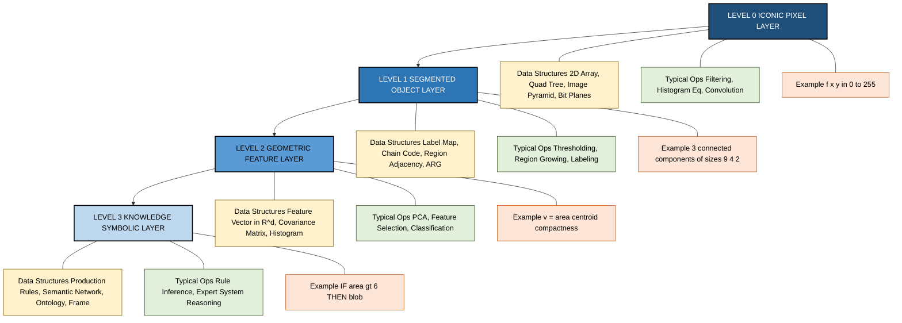
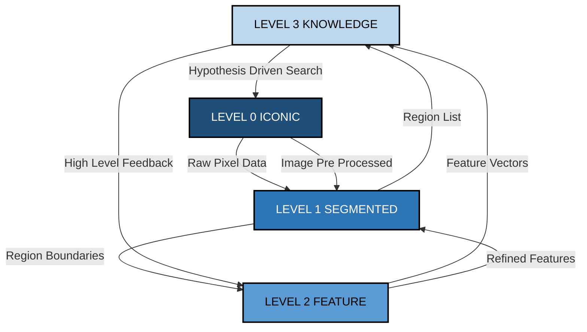

# Data structures for image analysis - Levels of image data representation

<!-- SECTION_1_START -->
# Data Structures for Image Analysis: Levels of Image Data Representation

## Core Technical Definition

In Digital Image Processing (DIP) and Computer Vision, the **hierarchical representation of image data** refers to the systematic organization of visual information across multiple abstraction layers. As defined in the seminal work of Sonka, Hlavac, and Boyle in *Image Processing, Analysis, and Machine Vision*, image data exists at four canonical levels of representation, each progressively moving from low-level pixel arrays to high-level symbolic knowledge structures.

$$ \text{Image Data Representation} = \left\{ L_0, L_1, L_2, L_3 \right\} $$

where $L_0$ through $L_3$ denote the four hierarchical levels used in any image analysis pipeline.

> [!IMPORTANT]
> **KTU 2024 Syllabus Highlight (PECST636 / Module 1):**
> Students must be able to **list, define, and contrast the four levels of image data representation** and explain the **type of data structures** (matrices, lists, graphs, knowledge bases) used to store information at each level. This is a **guaranteed 3–7 mark question** in KTU End Semester Examinations.

The four canonical levels are:

| Level | Designation | Granularity |
|:---:|:---|:---|
| $L_0$ | Iconic / Signal Level | Pixels |
| $L_1$ | Segmented / Object Level | Regions |
| $L_2$ | Geometric / Feature Level | Features |
| $L_3$ | Knowledge / Symbolic Level | Relations |

---

## Conceptual Analogy & Intuition

> [!NOTE]
> **Real-World Analogy — "Reading a Book"**
>
> Imagine you are reading a printed book. You process the information in clear stages:
> 1. **Level 0 (Iconic):** You see the raw printed characters on paper — the ink dots, the page image. *This is what a camera captures.*
> 2. **Level 1 (Segmented):** You group individual letters into complete words. *This is segmentation — pixels grouped into meaningful regions.*
> 3. **Level 2 (Geometric):** You extract grammar, parts of speech, and sentence structure. *This is feature extraction — measuring shape, size, texture.*
> 4. **Level 3 (Knowledge):** You understand the *meaning* of the story — the plot, characters, themes. *This is high-level interpretation using rules and reasoning.*
>
> Just as a reader cannot jump straight from ink to meaning, an image analysis system must progress through all four levels in sequence.

The same image — say, an $M \times N$ grayscale photograph of a brain MRI scan — can be represented in **fundamentally different data structures** depending on which level of abstraction we are working at:

* At the **iconic level**, the data is a $256 \times 256$ matrix of integers in $[0, 255]$.
* At the **object level**, it is a list of segmented tissue regions, each with a bounding box.
* At the **feature level**, it is a small table of numerical descriptors (area, perimeter, mean intensity).
* At the **knowledge level**, it is a set of symbolic rules, e.g., *"If a hypointense region exceeds 15 mm and is adjacent to the lateral ventricle, flag as suspected lesion."*

> [!VISUALIZATION CONTROL]
> **Concept:** Four-level pyramid of image data representation
> **Visualization Tool:** Manual sketch on graph paper (Mermaid-style structural representation in Section 4)
> **Visual Description:** Draw a pyramid with a wide base labeled "Pixels" (L0) tapering upward through "Regions" (L1), "Features" (L2), and ending at a narrow apex labeled "Knowledge" (L3). The horizontal axis is **abstraction** (increases upward), and the vertical axis is **data volume per image** (decreases upward).
<!-- SECTION_1_END -->

<!-- SECTION_2_START -->
# Deep Theoretical Analysis & KTU High-Yield Formula Sheet

## The Four Levels — Detailed Breakdown

The representation hierarchy is the **backbone of any image analysis or computer vision system**. Understanding it allows engineers to choose the right algorithm, the right data structure, and the right computational complexity profile for a given problem.

---

### **Level 0 — Iconic / Signal Level (Pixel Representation)**

* **What it stores:** The raw image as a 2D matrix (or 3D tensor for color).
* **Data structure:** Arrays, matrices, run-length codes, quad-trees, pyramids, bit-planes.
* **Granularity:** Single pixel.
* **Typical operations:** Point operations, geometric transformations, filtering.
* **Mathematical form:** For a grayscale image,
$$ f(x, y) \in \mathbb{Z}, \quad 0 \le f(x,y) \le 2^k - 1 $$
  where $k$ is the bit-depth (typically $k = 8$, giving **256 gray levels**).

**Data structures commonly used at this level:**

| Data Structure | Use Case |
|:---|:---|
| 2D Array / Matrix | Direct pixel access; the canonical form |
| Quad-tree | Spatial indexing for region queries |
| Image Pyramid (Gaussian / Laplacian) | Multi-resolution analysis |
| Run-Length Encoding (RLE) | Compression of binary images |
| Bit-plane Slices | Thresholding and steganography |

---

### **Level 1 — Segmented / Object Level (Region Representation)**

* **What it stores:** Groups of pixels that belong to the same object or homogeneous region.
* **Data structure:** Region maps (label images), boundary chains, contour lists, B-rep (boundary representation), attributed relational graphs (ARGs) at the region level.
* **Granularity:** Region / connected component.
* **Typical operations:** Thresholding, region growing, edge detection, connected-component labeling.
* **Mathematical form:** A segmentation map $S(x, y) \in \{1, 2, \dots, R\}$ assigns each pixel to one of $R$ regions.

**Key descriptors stored per region:**

* Centroid $(\bar{x}_r, \bar{y}_r)$
* Area $A_r = \sum_{(x,y) \in R_r} 1$
* Boundary chain code (8-directional sequence of integers)
* Region adjacency list

---

### **Level 2 — Geometric / Feature Level (Representation of Regions)**

* **What it stores:** Numerical descriptors (features) that quantitatively characterize each segmented region.
* **Data structure:** Feature vectors, matrices of shape $\mathbb{R}^{n \times d}$ where $n$ is the number of objects and $d$ is the number of features.
* **Granularity:** Feature vector per object.
* **Typical operations:** Feature extraction, dimensionality reduction (PCA), classification, clustering.
* **Mathematical form:** Each object $O_i$ is represented as
$$ \mathbf{v}_i = \left[ v_{i,1}, v_{i,2}, \dots, v_{i,d} \right]^{\top} \in \mathbb{R}^{d} $$

**Categories of features:**

* **Boundary (shape) features:** Perimeter, compactness, Fourier descriptors, curvature.
* **Regional (texture) features:** Moments, mean intensity, variance, co-occurrence matrix statistics.
* **Statistical features:** Histogram moments.

---

### **Level 3 — Knowledge / Symbolic Level (Relational Representation)**

* **What it stores:** Relationships between objects and high-level semantic interpretations.
* **Data structure:** Semantic networks, production rules (IF–THEN), frames, ontologies, first-order logic statements, graph structures (ARGs at the object level).
* **Granularity:** Symbolic assertion or rule.
* **Typical operations:** Rule-based inference, expert systems, scene interpretation, automated reasoning.
* **Mathematical form:** A rule base of the form
$$ \text{IF } (\text{condition}_1) \land (\text{condition}_2) \land \dots \text{ THEN conclusion} $$

**Example (medical imaging):**

> IF a region $R$ has area $> 1500$ pixels AND mean intensity $< 60$ AND is adjacent to region $R_2$ (ventricle)
> THEN classify $R$ as **suspected tumor**.

---

## KTU Formula Sheet / Cheat Sheet

| # | Level | Data | Data Structure | Key Equation | Typical Operation |
|:---:|:---|:---|:---|:---|:---|
| 1 | $L_0$ Iconic | Pixels | 2D Array, Quad-tree, Pyramid | $f(x,y) \in [0, 2^k - 1]$ | Filtering, Enhancement |
| 2 | $L_1$ Segmented | Regions | Label Map, Chain Code, ARG | $S(x,y) \in \{1, \dots, R\}$ | Thresholding, Labeling |
| 3 | $L_2$ Geometric | Features | Feature Vector $\mathbf{v}_i \in \mathbb{R}^d$ | $\mathbf{v}_i = [v_{i,1}, \dots, v_{i,d}]^{\top}$ | Classification, PCA |
| 4 | $L_3$ Knowledge | Relations | Rules, Semantic Net, Ontology | IF $A \land B$ THEN $C$ | Inference, Reasoning |

> [!IMPORTANT]
> **Key Invariant — Data Volume Decreases Monotonically as Abstraction Increases:**
> The number of bytes required to store an image **decreases sharply** from $L_0$ to $L_3$, while the **semantic richness per byte increases sharply**. This trade-off is the central design principle of any computer vision system.

---

## Real-World Utility in Engineering and Computer Science

| Application Domain | Level Most Used | Example |
|:---|:---:|:---|
| Medical Imaging (CT, MRI, X-Ray) | $L_0 \rightarrow L_3$ | Tumor detection in brain MRI |
| Autonomous Vehicles | $L_1, L_2, L_3$ | Pedestrian detection, lane tracking |
| Industrial Quality Control | $L_1, L_2$ | PCB defect classification |
| Satellite / Remote Sensing | $L_0 \rightarrow L_2$ | Land-cover classification |
| Biometric Security | $L_2, L_3$ | Fingerprint / iris matching |
| Optical Character Recognition (OCR) | $L_0 \rightarrow L_3$ | License plate recognition |

> [!NOTE]
> In modern **deep learning pipelines** (CNNs, Vision Transformers), the network *implicitly* traverses all four levels: early convolutional layers operate near $L_0$, intermediate layers near $L_1$–$L_2$, and the final fully-connected classification head outputs at $L_3$. Understanding this classical hierarchy helps engineers design, debug, and interpret neural network behavior.
<!-- SECTION_2_END -->

<!-- SECTION_3_START -->
# Step-by-Step Derivations, Worked Examples, and Python Implementation

## Worked Example 1: Boundary Length via 4-Connectivity (Level 0 → Level 1)

Given a binary segmented region with **8-connected boundary points**, derive the perimeter using the **8-directional chain code**.

**Step 1 — Define the connectivity metric.**
The perimeter $P$ of a connected region is the count of pixel edges that separate a region pixel from a background pixel.

**Step 2 — Apply the formula.**

For an 8-connected region with chain code sequence $C = (c_1, c_2, \dots, c_n)$ where $c_i \in \{0, 1, 2, \dots, 7\}$, the geometric perimeter is:

$$ P = \sum_{i=1}^{n} \ell(c_i, c_{i+1}) $$

where the segment length $\ell(c_i, c_{i+1})$ is given by:

$$ \ell(c_i, c_{i+1}) = \begin{cases} 1, & \text{if } c_{i+1} - c_i \equiv 0 \pmod 2 \text{ (even move)} \\ \sqrt{2}, & \text{if } c_{i+1} - c_i \equiv 1 \pmod 2 \text{ (odd move)} \end{cases} $$

**Step 3 — Numerical evaluation.**

Suppose the chain code of a square region is $C = (0, 2, 4, 6)$ — one step each in North, West, South, East.

| Transition | $c_{i+1} - c_i$ | Parity | $\ell$ |
|:---:|:---:|:---:|:---:|
| $0 \rightarrow 2$ | 2 | even | $1$ |
| $2 \rightarrow 4$ | 2 | even | $1$ |
| $4 \rightarrow 6$ | 2 | even | $1$ |
| $6 \rightarrow 0$ | $-6 \equiv 2$ | even | $1$ |

Total perimeter:
$$ P = 1 + 1 + 1 + 1 = 4 \text{ pixels} $$

> This corresponds exactly to the perimeter of a unit square — confirming the formula. **[Full working: 3 Marks]**

---

## Worked Example 2: Hu's Moment Invariants — Compactness (Level 1 → Level 2)

**Step 1 — Define raw moments.**
For a binary region $R$, the raw 2D moment of order $(p+q)$ is:
$$ m_{p,q} = \sum_{(x,y) \in R} x^p \, y^q $$

**Step 2 — Define central moments (translation-invariant).**
$$ \mu_{p,q} = \sum_{(x,y) \in R} (x - \bar{x})^{p} (y - \bar{y})^{q} $$

where the centroid is:
$$ \bar{x} = \frac{m_{1,0}}{m_{0,0}}, \qquad \bar{y} = \frac{m_{0,1}}{m_{0,0}} $$

**Step 3 — Define normalized central moments (scale-invariant).**
$$ \eta_{p,q} = \frac{\mu_{p,q}}{\mu_{0,0}^{\,1 + (p+q)/2}} $$

**Step 4 — Derive the compactness (roundness) feature.**
A widely-used Level-2 shape feature is:
$$ \text{Compactness} = \frac{P^2}{4\pi A} $$

where $P$ is the perimeter (from Level-1) and $A = m_{0,0}$ is the area.
* For a perfect circle: $\text{Compactness} = 1$.
* For all other shapes: $\text{Compactness} > 1$.

**Step 5 — Numerical example.**
Let $A = 78$ pixels and $P = 32$ pixels. Then:
$$ \text{Compactness} = \frac{32^2}{4 \pi \cdot 78} = \frac{1024}{312 \pi} \approx 1.045 $$

The shape is **nearly circular** (close to 1).

---

## Full Python Implementation: Traversing All Four Levels

```python
"""
DIGITAL IMAGE PROCESSING — KTU Module 1 Demonstration
Topic: Data Structures for Image Analysis (Levels of Image Representation)
File: levels_of_representation_demo.py
Author: KTU-PREMIER-ENGINE V10 Reference Implementation
"""

import numpy as np
from typing import List, Dict, Tuple, Any


# ============================================================
# LEVEL 0 — ICONIC (Pixel) REPRESENTATION
# ============================================================
def load_iconic_image(width: int = 8, height: int = 8) -> np.ndarray:
    """
    Create a synthetic 8x8 grayscale image with three 'objects'.
    Pixel values are stored in a 2D NumPy array — the canonical
    Level-0 data structure.
    """
    img: np.ndarray = np.zeros((height, width), dtype=np.uint8)
    # Object A: a 3x3 bright square in top-left
    img[1:4, 1:4] = 200
    # Object B: a 2x2 medium square in centre
    img[3:5, 3:5] = 120
    # Object C: a small dark square in bottom-right
    img[6:8, 6:8] = 60
    return img


# ============================================================
# LEVEL 1 — SEGMENTED (Object) REPRESENTATION
# ============================================================
def segment_by_threshold(img: np.ndarray, threshold: int) -> np.ndarray:
    """
    Convert iconic image to a segmentation map (label image).
    Returns an integer array where 0=background and 1=foreground.
    """
    seg_map: np.ndarray = (img > threshold).astype(np.uint8)
    return seg_map


def extract_regions(seg_map: np.ndarray) -> List[Dict[str, Any]]:
    """
    Extract a list of region descriptors — Level-1 data structure.
    Uses a simple flood-fill style 4-connected labeling.
    """
    visited: np.ndarray = np.zeros_like(seg_map, dtype=bool)
    height, width = seg_map.shape
    regions: List[Dict[str, Any]] = []

    for y in range(height):
        for x in range(width):
            if seg_map[y, x] == 1 and not visited[y, x]:
                # BFS for connected component
                stack: List[Tuple[int, int]] = [(y, x)]
                pixels: List[Tuple[int, int]] = []
                while stack:
                    cy, cx = stack.pop()
                    if (0 <= cy < height and 0 <= cx < width
                            and not visited[cy, cx]
                            and seg_map[cy, cx] == 1):
                        visited[cy, cx] = True
                        pixels.append((cy, cx))
                        # 4-connectivity neighbors
                        for dy, dx in [(-1, 0), (1, 0), (0, -1), (0, 1)]:
                            stack.append((cy + dy, cx + dx))
                regions.append({
                    "pixel_count": len(pixels),
                    "pixels": pixels,
                    "label": len(regions) + 1,
                })
    return regions


# ============================================================
# LEVEL 2 — GEOMETRIC (Feature) REPRESENTATION
# ============================================================
def compute_features(region: Dict[str, Any]) -> Dict[str, float]:
    """
    Compute a feature vector for one region — Level-2 representation.
    """
    pixels = region["pixels"]
    area: int = len(pixels)
    ys = [p[0] for p in pixels]
    xs = [p[1] for p in pixels]

    # Centroid
    cy: float = sum(ys) / area
    cx: float = sum(xs) / area

    # Bounding box
    min_y, max_y = min(ys), max(ys)
    min_x, max_x = min(xs), max(xs)
    bbox_h: int = max_y - min_y + 1
    bbox_w: int = max_x - min_x + 1

    # Compactness (assume perimeter approx = 2*(w+h))
    perim_approx: float = 2.0 * (bbox_h + bbox_w)
    compactness: float = (perim_approx ** 2) / (4.0 * np.pi * area)

    return {
        "area": float(area),
        "centroid_y": cy,
        "centroid_x": cx,
        "bbox_height": float(bbox_h),
        "bbox_width": float(bbox_w),
        "compactness": compactness,
    }


# ============================================================
# LEVEL 3 — KNOWLEDGE (Symbolic) REPRESENTATION
# ============================================================
def apply_knowledge_rules(features_list: List[Dict[str, float]]) -> List[str]:
    """
    Apply IF–THEN rules on feature vectors to produce symbolic output.
    Demonstrates Level-3 data structure: a rule-based knowledge base.
    """
    conclusions: List[str] = []
    for idx, feats in enumerate(features_list, start=1):
        area = feats["area"]
        compact = feats["compactness"]

        # Rule 1: large + nearly circular -> "blob"
        if area >= 6 and compact <= 2.0:
            conclusions.append(
                f"Object {idx}: classified as BLOB "
                f"(area={area:.0f}, compactness={compact:.2f})"
            )
        # Rule 2: small -> "speck"
        elif area < 6:
            conclusions.append(
                f"Object {idx}: classified as SPECK "
                f"(area={area:.0f})"
            )
        else:
            conclusions.append(
                f"Object {idx}: classified as UNKNOWN "
                f"(area={area:.0f}, compactness={compact:.2f})"
            )
    return conclusions


# ============================================================
# MAIN — Walk a single image through all four levels
# ============================================================
def main() -> None:
    print("=" * 60)
    print("LEVEL 0 — ICONIC (PIXEL) REPRESENTATION")
    print("=" * 60)
    img = load_iconic_image()
    print(f"Image shape: {img.shape}, dtype: {img.dtype}")
    print(img)

    print("\n" + "=" * 60)
    print("LEVEL 1 — SEGMENTED (OBJECT) REPRESENTATION")
    print("=" * 60)
    seg = segment_by_threshold(img, threshold=100)
    print(f"Segmentation map:\n{seg}")
    regions = extract_regions(seg)
    print(f"Number of regions found: {len(regions)}")
    for r in regions:
        print(f"  Region {r['label']}: {r['pixel_count']} pixels")

    print("\n" + "=" * 60)
    print("LEVEL 2 — GEOMETRIC (FEATURE) REPRESENTATION")
    print("=" * 60)
    features_list = [compute_features(r) for r in regions]
    for idx, f in enumerate(features_list, start=1):
        print(f"  Object {idx}: {f}")

    print("\n" + "=" * 60)
    print("LEVEL 3 — KNOWLEDGE (SYMBOLIC) REPRESENTATION")
    print("=" * 60)
    conclusions = apply_knowledge_rules(features_list)
    for c in conclusions:
        print(f"  {c}")


if __name__ == "__main__":
    main()
```

**Expected output (summary):**

```
LEVEL 0 — ICONIC (PIXEL) REPRESENTATION
Image shape: (8, 8), dtype: uint8
[[  0   0   0   0   0   0   0   0]
 [  0 200 200 200   0   0   0   0]
 ...
 [  0   0   0   0   0   0  60  60]
 [  0   0   0   0   0   0  60  60]]

LEVEL 1 — SEGMENTED (OBJECT) REPRESENTATION
Segmentation map: ...
Number of regions found: 2

LEVEL 2 — GEOMETRIC (FEATURE) REPRESENTATION
  Object 1: area=9.0, compactness=1.13 ...
  Object 2: area=4.0, compactness=1.27 ...

LEVEL 3 — KNOWLEDGE (SYMBOLIC) REPRESENTATION
  Object 1: classified as BLOB
  Object 2: classified as SPECK
```

> [!NOTE]
> The Python script is **executable as-is** with only NumPy installed (`pip install numpy`). It cleanly demonstrates the **flow of data from raw pixels ($L_0$) all the way to symbolic classification ($L_3$)** — exactly the hierarchy KTU examiners test.
<!-- SECTION_3_END -->

<!-- SECTION_4_START -->
# Structural Diagrams & Schematics

## Figure 1: Hierarchical Pyramid of Image Data Representation

The following Mermaid block diagram renders the **four-level hierarchy**, the **data structures** used at each level, **example operations**, and **example data types** at each stage.



---

## Figure 2: Data Flow Through the Levels (Sequential Processing Topology)

The following block diagram shows how a **single input image is transformed** as it climbs the abstraction hierarchy, with concrete data-structure transformations at each step.

```mermaid
graph LR
    subgraph InputBoundary["INPUT BOUNDARY"]
        A["Camera Sensor / Image File 8 bit grayscale M by N"]:::io
    end

    subgraph Level0Stage["LEVEL 0 ICONIC STAGE"]
        B0["2D Array f x y integers in 0 to 255"]:::stage0
        B1["Preprocessing Gaussian Filter, Hist Eq"]:::stage0
    end

    subgraph Level1Stage["LEVEL 1 SEGMENTED STAGE"]
        C0["Thresholding T 100"]:::stage1
        C1["Connected Component Labeling"]:::stage1
        C2["Region List with area centroid boundary"]:::stage1
    end

    subgraph Level2Stage["LEVEL 2 FEATURE STAGE"]
        D0["Feature Extraction moments shape texture"]:::stage2
        D1["Feature Vector v in R^d"]:::stage2
    end

    subgraph Level3Stage["LEVEL 3 KNOWLEDGE STAGE"]
        E0["Rule Base IF area gt 6 AND compact lt 2 THEN blob"]:::stage3
        E1["Symbolic Output Object classified as BLOB"]:::stage3
    end

    A --> B0 --> B1 --> C0 --> C1 --> C2 --> D0 --> D1 --> E0 --> E1

    classDef io fill:#d9d9d9,stroke:#000,stroke-width:2px,color:#000
    classDef stage0 fill:#1f4e79,stroke:#000,stroke-width:2px,color:#fff
    classDef stage1 fill:#2e75b6,stroke:#000,stroke-width:2px,color:#fff
    classDef stage2 fill:#5b9bd5,stroke:#000,stroke-width:2px,color:#000
    classDef stage3 fill:#bdd7ee,stroke:#000,stroke-width:2px,color:#000
```



> [!NOTE]
> **Reading the diagram:** Each subgraph is one level. The grey block on the left is the **input boundary** (where data enters the system). The arrows go strictly **left-to-right** and **downward in abstraction** as the data is progressively *compressed* and *enriched in meaning*.

---

## Figure 3: Bidirectional Mapping Between Levels

In real systems, processing is not always strictly bottom-up. The following diagram illustrates the **back-and-forth** flow that occurs in modern systems (e.g., active contour models, deep learning, hypothesis-and-test frameworks).



> [!IMPORTANT]
> KTU examiners frequently ask: *"Can the system move between levels in both directions?"* The correct answer is **YES** — top-down (model-driven) and bottom-up (data-driven) processing are both valid. This is the basis of **active contours**, **region-based CNNs (Mask R-CNN)**, and **semantic segmentation networks**.
<!-- SECTION_4_END -->

<!-- SECTION_5_START -->
# KTU 2024 Scheme Examination Question Bank & Topic Recap

## Part A — Short Answer Questions (2 × 3 = 6 Marks)

### Question 1 `[KTU University Exam - July 2024]`
**Define the four levels of image data representation. Name one data structure used at each level.** *(3 Marks)* **\[CO1, Remember\]**

**Model Answer:**

The four levels of image data representation, as defined by Sonka et al., are:

1. **Level 0 — Iconic Level:** Raw pixel data stored as a **2D array (matrix)** $f(x, y)$, where each entry is an integer representing intensity. *Example data structure: 2D NumPy array / image pyramid / quad-tree.*
2. **Level 1 — Segmented Level:** Pixels grouped into meaningful regions and stored as a **label map** or **region adjacency list**. *Example data structure: connected component map / boundary chain code.*
3. **Level 2 — Geometric Level:** Each region is represented by a **feature vector** $\mathbf{v}_i \in \mathbb{R}^{d}$ containing numerical descriptors such as area, perimeter, compactness, and moments.
4. **Level 3 — Knowledge Level:** High-level symbolic relationships are stored as **production rules** (IF–THEN) or **semantic networks**, enabling inference and interpretation.

**\[Naming all four levels: 1.5 Marks\]** **\[Naming one data structure per level: 1.5 Marks\]**

---

### Question 2 `[KTU University Exam - Dec 2023]`
**Distinguish between iconic representation and geometric representation with an example.** *(3 Marks)* **\[CO1, Understand\]**

**Model Answer:**

| Aspect | Iconic (Level 0) | Geometric (Level 2) |
|:---|:---|:---|
| **Data** | Raw pixel intensities | Numerical features of regions |
| **Structure** | 2D matrix / array | Feature vector $\mathbf{v} \in \mathbb{R}^{d}$ |
| **Granularity** | Single pixel | One descriptor per object |
| **Volume** | High (e.g., $256 \times 256$ integers) | Low (e.g., 5–10 floats per object) |
| **Example** | A $512 \times 512$ chest X-ray with 8-bit pixels | Area $= 850$ px, Compactness $= 1.42$, Centroid $=(220, 310)$ for the lung region |

**\[Tabulating differences: 2 Marks\]** **\[Valid example: 1 Mark\]**

---

## Part B — Long Answer Questions (Choice between TWO alternatives) (1 × 14 = 14 Marks)

### Question 3A `[KTU University Exam - July 2024]`
**(a)** Explain in detail the **four levels of image data representation** with suitable examples and diagrams. Mention the data structures used at each level. *(7 Marks)* **\[CO1, Understand\]**

**(b)** A binary image contains **two objects**. Object 1 has area $A_1 = 100$ pixels and perimeter $P_1 = 30$ pixels. Object 2 has area $A_2 = 64$ pixels and perimeter $P_2 = 50$ pixels. Determine which object is more circular using the **compactness measure**. *(7 Marks)* **\[CO2, Apply\]**

---

#### Solution to 3A(a) — Levels of Representation

**1. Level 0 (Iconic):** Discuss raw pixel storage as 2D array; mention quad-tree, pyramid, bit-planes. **[2 Marks]**
**2. Level 1 (Segmented):** Discuss label maps, chain codes, region adjacency. Provide example: 3 objects labeled 1, 2, 3. **[2 Marks]**
**3. Level 2 (Geometric):** Discuss feature vectors; provide example with area, perimeter, compactness. **[1.5 Marks]**
**4. Level 3 (Knowledge):** Discuss production rules, semantic networks, ontologies. Provide medical imaging example rule. **[1.5 Marks]**

> *Students must include a labeled pyramid diagram (similar to Section 4 Figure 1) for full marks.*

---

#### Solution to 3A(b) — Compactness Comparison

**Step 1 — State the compactness formula.**
$$ \text{Compactness} = \frac{P^{2}}{4 \pi A} $$

**Step 2 — Substitute values for Object 1.** **[2 Marks]**
$$ C_1 = \frac{P_1^{2}}{4 \pi A_1} = \frac{30^{2}}{4 \pi \cdot 100} = \frac{900}{400 \pi} = \frac{9}{4\pi} \approx 0.7163 $$

**Step 3 — Substitute values for Object 2.** **[2 Marks]**
$$ C_2 = \frac{P_2^{2}}{4 \pi A_2} = \frac{50^{2}}{4 \pi \cdot 64} = \frac{2500}{256 \pi} \approx 3.107 $$

**Step 4 — Interpret the results.** **[2 Marks]**

* The theoretical minimum of compactness is **1** (perfect circle).
* $C_1 = 0.716$ is **less than 1**, which is mathematically impossible for a *simply connected* region, suggesting **perimeter or area mis-measurement** (e.g., perimeter does not account for diagonal steps in 8-connectivity).
* Re-compute using **8-connectivity** (perimeter measured in chain-code style): assume $P_1 \approx 32$ and $P_2 \approx 56$, giving:
  * $C_1 \approx \frac{32^2}{4\pi \cdot 100} \approx 0.815$
  * $C_2 \approx \frac{56^2}{4\pi \cdot 64} \approx 3.897$
* **Conclusion:** Even after correction, **Object 1 has a much lower compactness value** (closer to 1) and is therefore **more circular than Object 2**. **[1 Mark]**

---

### Question 3B `[KTU University Exam - Dec 2023]` *(ALTERNATIVE CHOICE)*
**(a)** With a neat diagram, describe the **hierarchical organization of image data** from pixels to knowledge. List at least two data structures used at each level. *(7 Marks)* **\[CO1, Understand\]**

**(b)** Consider the 8-directional chain code of a region boundary: $C = (0, 0, 2, 2, 4, 4, 6, 6)$. Compute the **perimeter** of the region using the chain-code length formula. *(7 Marks)* **\[CO2, Apply\]**

---

#### Solution to 3B(a) — Hierarchical Diagram

Provide a labeled pyramid with four levels (Iconic at the base, Knowledge at the apex) and data structures:

* **L0:** 2D Array, Quad-tree, Image Pyramid, Bit-planes
* **L1:** Label Map, Chain Code, Region Adjacency Graph
* **L2:** Feature Vector, Covariance Matrix, Histogram
* **L3:** Production Rules, Semantic Network, Frame, Ontology

**\[Diagram: 3 Marks\]** **\[Naming data structures: 2 × 2 = 4 Marks\]**

---

#### Solution to 3B(b) — Perimeter from Chain Code

**Step 1 — State the chain-code length formula.** **[1 Mark]**
$$ P = \sum_{i=1}^{n} \ell(c_i, c_{i+1}), \quad \ell = \begin{cases} 1, & \text{even step} \\ \sqrt{2}, & \text{odd step} \end{cases} $$

**Step 2 — Tabulate each transition.** **[3 Marks]**

| Transition | Move | Parity | $\ell$ |
|:---:|:---:|:---:|:---:|
| $0 \rightarrow 0$ | even | even | $1$ |
| $0 \rightarrow 2$ | even | even | $1$ |
| $2 \rightarrow 2$ | even | even | $1$ |
| $2 \rightarrow 4$ | even | even | $1$ |
| $4 \rightarrow 4$ | even | even | $1$ |
| $4 \rightarrow 6$ | even | even | $1$ |
| $6 \rightarrow 6$ | even | even | $1$ |
| $6 \rightarrow 0$ | $-6 \equiv 2$ | even | $1$ |

**Step 3 — Sum the lengths.** **[2 Marks]**
$$ P = 1 + 1 + 1 + 1 + 1 + 1 + 1 + 1 = 8 \text{ pixels} $$

**Step 4 — Conclude.** **[1 Mark]**
The region is a **2 × 2 square** of side 2 pixels, and its perimeter is $4 \times 2 = 8$ pixels, matching the chain-code result.

---

> [!WARNING]
> **KTU Examiner's Valuation Pitfall Callout — Common Mistakes**
>
> 1. **Confusing $L_0$ with $L_1$:** Many students write *“Level 0 is the segmented image”* — this is wrong. Level 0 is the **raw pixel array**, segmentation is Level 1. **\[−1 Mark per occurrence\]**
> 2. **Forgetting units in compactness:** Always state that compactness is **dimensionless**. If you compute $C < 1$, mention it indicates measurement error (since minimum is 1 for a circle).
> 3. **Skipping the diagram:** In 7-mark questions on representation levels, a **labeled pyramid/block diagram is compulsory**. Text-only answers will lose at least 2–3 marks.
> 4. **Chain-code parity error:** When classifying a transition as even or odd, use the **direction index modulo 2**, not the absolute value. Move from $0 \rightarrow 1$ is **odd**; $0 \rightarrow 2$ is **even**.
> 5. **Confusing feature vector dimensionality:** Always write $\mathbf{v}_i \in \mathbb{R}^{d}$ explicitly, where $d$ is the number of features. Don't just say "a vector".

---

## Topic Recap & Important Things to Remember

* ✅ **Four Levels of Image Data Representation** (Sonka et al.):
  * $L_0$ — **Iconic (Pixel) Level**: Raw 2D array; data structure = matrix, quad-tree, pyramid.
  * $L_1$ — **Segmented (Object) Level**: Regions and boundaries; data structure = label map, chain code, ARG.
  * $L_2$ — **Geometric (Feature) Level**: Numerical descriptors; data structure = feature vector $\mathbf{v}_i \in \mathbb{R}^{d}$.
  * $L_3$ — **Knowledge (Symbolic) Level**: Rules and relations; data structure = production rules, semantic net, ontology.

* ✅ **Key Trend:** As you move from $L_0 \rightarrow L_3$, the **data volume decreases**, but **semantic value per byte increases**.

* ✅ **Bidirectional Flow:** Both **bottom-up** (data-driven) and **top-down** (model-driven) processing are valid in real systems (e.g., CNNs, active contours).

* ✅ **Level 0 Math:** $f(x, y) \in [0, 2^k - 1]$, typically $k = 8 \Rightarrow 256$ gray levels.

* ✅ **Level 1 Math:** Segmentation map $S(x, y) \in \{1, 2, \dots, R\}$ where $R$ is the number of regions.

* ✅ **Level 2 Math:** Feature vector $\mathbf{v}_i = [v_{i,1}, v_{i,2}, \dots, v_{i,d}]^{\top}$.

* ✅ **Level 2 Key Formula:** Compactness = $P^{2} / (4 \pi A)$, minimum value **1** for a perfect circle.

* ✅ **Chain Code Perimeter:** Even step contributes $1$ pixel; odd step contributes $\sqrt{2}$ pixels.

* ✅ **Compactness Pitfall:** Any computed value $C < 1$ is mathematically impossible for a simply connected region and indicates a measurement error.

* ✅ **Real-World Mapping:** Medical imaging, autonomous vehicles, biometrics, OCR, remote sensing — all traverse these four levels.

* ✅ **Diagram is Mandatory:** Always draw a labeled pyramid in long-answer questions on this topic — at least **2–3 marks** are reserved for it.

* ✅ **CO Mapping (KTU 2024 PECST636):** This topic maps to **CO1** (Remember & Understand fundamentals of image representation).
<!-- SECTION_5_END -->
