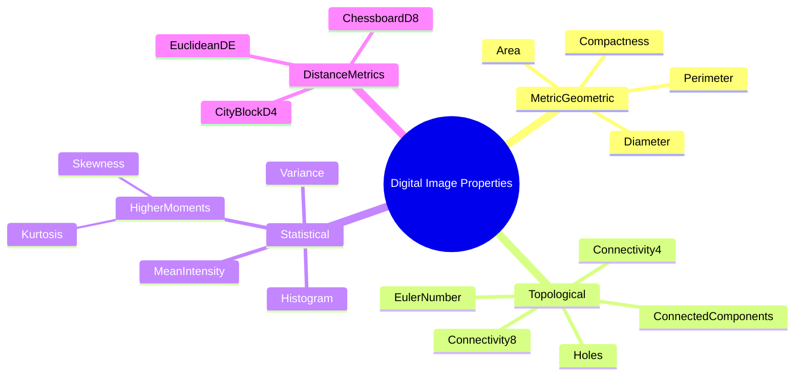
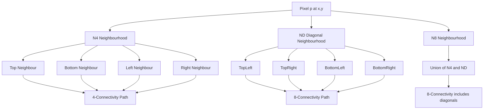
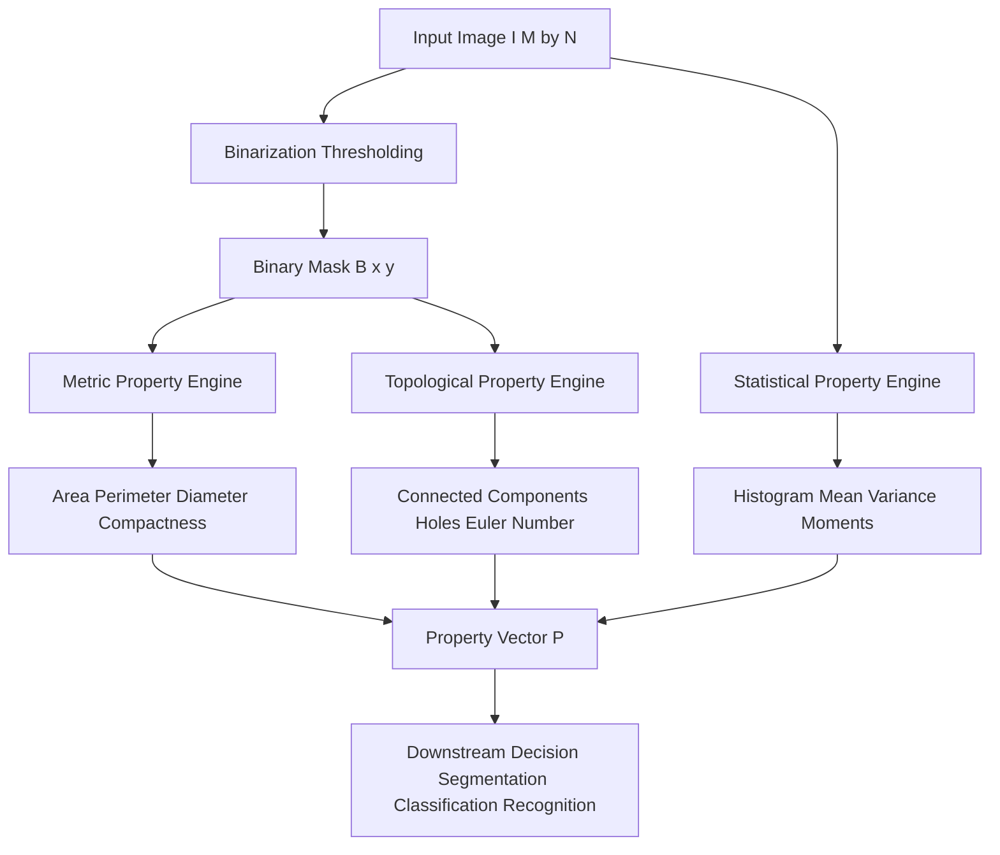

# Digital image properties

<!-- SECTION_1_START -->
# Digital Image Properties — Module 1 Foundations

> [!IMPORTANT]
> **KTU 2024 Scheme | PECST636 — Digital Image Processing | Module 1**
> Properties of a digital image are the **measurable, mathematical descriptors** that allow an algorithm to *characterize*, *compare*, and *interpret* pixel data. They form the foundation of every segmentation, classification, and recognition pipeline.

## 1.1 Formal Academic Definition

A **digital image property** is a scalar or vector function $\mathcal{P}: \mathbb{Z}^{2} \times \mathbb{Z}^{M \times N} \rightarrow \mathbb{R}^{k}$ that maps a coordinate $(x, y)$ and the image intensity matrix $I \in \mathbb{Z}^{M \times N}$ to a numerical descriptor. These properties are categorized into three orthogonal families in the KTU 2024 syllabus:

1. **Metric / Geometric Properties** — quantify spatial extent (perimeter, area, diameter, compactness).
2. **Topological Properties** — describe structural connectivity (components, holes, Euler number).
3. **Statistical Properties** — characterize intensity distribution (mean, variance, moments, histogram, texture).

In plain words: a digital image is not just a grid of numbers — it is a **structured geometric object** with measurable size, shape, connectedness, and a *statistical fingerprint* of its pixel intensities.

## 1.2 Conceptual Analogy — The Aerial Town View

Imagine you are a **drone pilot** looking down at a small town through a camera. To describe what you see to a colleague, you would naturally report three kinds of facts:

| Real-World Observation | Image Property Family | KTU Technical Term |
|---|---|---|
| "The lake covers 12 hectares and is 3 km long" | Metric / Geometric | **Area, Perimeter, Diameter** |
| "There is one main island and a bridge connecting two landmasses" | Topological | **Connected Components, Holes, Connectivity** |
| "The town is mostly green with a small red-roof cluster" | Statistical | **Histogram, Mean Intensity, Variance** |

The **drone's report = the image's property vector**. This is exactly what an algorithm computes to *understand* the image.

## 1.3 Pixel Neighbourhood — The Atomic Building Block

Before any property can be computed, we must define how pixels *relate* to one another. For a pixel $p$ at $(x, y)$ with intensity $I(x, y) \in \mathbb{Z}$:

- **4-Neighbourhood** $N_4(p)$ — the four orthogonal neighbours:
$$N_4(p) = \{(x+1, y),\ (x-1, y),\ (x, y+1),\ (x, y-1)\}$$

- **Diagonal Neighbourhood** $N_D(p)$ — the four diagonal neighbours:
$$N_D(p) = \{(x+1, y+1),\ (x+1, y-1),\ (x-1, y+1),\ (x-1, y-1)\}$$

- **8-Neighbourhood** $N_8(p)$ — the union of both:
$$N_8(p) = N_4(p) \cup N_D(p)$$

> [!NOTE]
> **Connectivity** in KTU Module 1 is always defined *with respect to* a chosen neighbourhood. **4-connectivity** uses $N_4$, while **8-connectivity** uses $N_8$. The choice flips which pixels are considered "linked", and therefore changes the count of connected components.

## 1.4 Distance Metrics — Quantifying "How Far Apart"

A **distance metric** $D(p, q)$ between two pixels $p = (x_1, y_1)$ and $q = (x_2, y_2)$ must satisfy four axioms — **non-negativity**, **identity**, **symmetry**, and the **triangle inequality**. The KTU syllabus stresses the three pixel-grid versions:

- **Euclidean Distance** $D_E$ — the true geometric distance:
$$D_E(p, q) = \sqrt{(x_1 - x_2)^2 + (y_1 - y_2)^2}$$

- **City-Block / Manhattan Distance** $D_4$ — moves only on a chess king's orthogonal step:
$$D_4(p, q) = \vert x_1 - x_2 \vert + \vert y_1 - y_2 \vert$$

- **Chessboard Distance** $D_8$ — moves on a chess king's maximal step:
$$D_8(p, q) = \max(\vert x_1 - x_2 \vert, \vert y_1 - y_2 \vert)$$

> [!VISUALIZATION CONTROL]
> **Concept:** Distance Metric Discs on a Pixel Grid
> **GeoGebra / Desmos Input Equations:**
> * `D_E: x^2 + y^2 = 25` (filled disc, radius = 5)
> * `D_4: |x| + |y| = 5` (diamond / rhombus shape)
> * `D_8: max(|x|, |y|) = 5` (axis-aligned square)
> **Visual Description:** Plot the three loci on the same $xy$-plane. The student should observe a **circle inscribed in a diamond that is inscribed in a square** — geometrically, $D_8 \geq D_E \geq D_4$ for any two non-equal points.
<!-- SECTION_1_END -->

<!-- SECTION_2_START -->
# Deep Theoretical Analysis & KTU High-Yield Formula Sheet

## 2.1 Metric (Geometric) Properties

### 2.1.1 Perimeter $P$
The **perimeter** is the length of the boundary of a connected region. Two estimation methods are common in KTU Module 1:

- **Chain-code perimeter** — count of boundary pixels $N_{bp}$:
$$P_{cc} = N_{bp}$$

- **Geometric perimeter** — sum of Euclidean segment lengths between successive boundary pixels, where the cost of a step depends on its direction:

$$
P = \sum_{i=1}^{N_{bp}} \ell_i,\quad \ell_i = \begin{cases} 1, & \text{orthogonal step} \\ \sqrt{2}, & \text{diagonal step} \end{cases}
$$

### 2.1.2 Area $A$
The simplest, fastest, and most exam-favoured estimator is **pixel counting**:
$$A = \sum_{x=0}^{M-1} \sum_{y=0}^{N-1} \mathbb{1}\{I(x, y) \in \mathcal{R}\}$$
where $\mathcal{R}$ is the set of intensity values belonging to the foreground region and $\mathbb{1}\{\cdot\}$ is the indicator function (returns $1$ if true, $0$ otherwise).

### 2.1.3 Compactness (Circularity Ratio) $C$
A **shape descriptor** invariant to scale. A perfect disc yields $C = 1$; elongated or jagged shapes yield smaller values:
$$C = \frac{4\pi A}{P^2}$$

### 2.1.4 Diameter $D_{iam}$
The **longest Euclidean distance** between any two boundary pixels of the region:
$$D_{iam} = \max_{p, q \in \mathcal{B}} D_E(p, q)$$
where $\mathcal{B}$ is the set of boundary pixels.

## 2.2 Topological Properties

### 2.2.1 Connectivity & Connected Components
Two pixels $p$ and $q$ are **4-connected** (resp. **8-connected**) if there exists a path $p = p_0, p_1, \ldots, p_n = q$ such that $p_{i+1} \in N_4(p_i)$ (resp. $N_8(p_i)$). A **connected component** is the maximal set of mutually connected pixels.

> [!IMPORTANT]
> **Jordan's Curve Theorem (KTU Module 1):** A **4-connected simple closed curve** in a digital image always separates the plane into exactly **one interior region** and **one exterior region**. This guarantees that the *number of holes* and the *number of objects* are well-defined topological invariants.

### 2.2.2 Euler Number $E$
The single most exam-relevant topological invariant:
$$E = C - H$$
where $C$ is the number of connected components and $H$ is the number of holes (background regions fully enclosed by foreground).

### 2.2.3 Adjacency Dichotomy
The two fundamentally different adjacency sets for a binary image with value set $V = \{1\}$:

$$
A_4 = \{(p, q) \mid q \in N_4(p)\},\quad A_8 = \{(p, q) \mid q \in N_8(p)\}
$$

> [!WARNING]
> The KTU board deducts marks for mixing adjacency and neighbourhood. **Neighbourhood** is a *pixel relationship*; **Adjacency** is a *pixel-set relationship* that *also requires matching intensity values*. $A_m$ is defined as a relation on $V$ (the foreground value set).

## 2.3 Statistical Properties

### 2.3.1 Histogram $h(r_k)$
For an $L$-level image, the histogram of grayscale $r_k$ is:
$$h(r_k) = n_k,\quad k = 0, 1, \ldots, L-1$$
Normalized form (probability mass function):
$$p(r_k) = \frac{h(r_k)}{MN} = \frac{n_k}{MN}$$

### 2.3.2 Mean Intensity $\bar{r}$
The first raw moment — the average pixel value:
$$\bar{r} = \sum_{k=0}^{L-1} r_k \cdot p(r_k)$$

### 2.3.3 Variance $\sigma^2$ and Standard Deviation $\sigma$
The second central moment — a measure of intensity spread:
$$\sigma^2 = \sum_{k=0}^{L-1} (r_k - \bar{r})^2 \cdot p(r_k)$$

### 2.3.4 Higher-Order Central Moments $\mu_n$
For full image content description:
$$\mu_n = \sum_{k=0}^{L-1} (r_k - \bar{r})^n \cdot p(r_k)$$

- $\mu_2$ — **variance** (intensity contrast)
- $\mu_3$ — **skewness signal** (asymmetry of histogram)
- $\mu_4$ — **kurtosis signal** (peakiness of histogram)

## 2.4 Real-World Engineering Utility

- **Medical Imaging (CT/MRI):** Connected-component analysis counts tumours; compactness distinguishes *round benign cysts* from *irregular malignant masses*.
- **Satellite Remote Sensing:** Histogram moments classify land-cover (water has low variance, urban has high variance).
- **Industrial QA:** Euler number detects the *number of holes* in a manufactured gasket to verify die correctness.
- **OCR & Document Analysis:** Compactness of blob regions separates alphabetic characters from punctuation dots.
- **Autonomous Vehicles:** Diameter and perimeter of obstacle blobs feed real-time path-planning modules.

## 2.5 KTU Formula Cheat Sheet

> [!NOTE]
> **Master this table** — every line below has been a past-paper question in PECST636.

| Property | Symbol | Formula | Range / Domain | Unit |
|---|---|---|---|---|
| Euclidean Distance | $D_E$ | $\sqrt{(x_1-x_2)^2+(y_1-y_2)^2}$ | $D_E \geq 0$ | pixels |
| City-Block Distance | $D_4$ | $\vert x_1-x_2 \vert + \vert y_1-y_2 \vert$ | $D_4 \geq 0$ | pixels |
| Chessboard Distance | $D_8$ | $\max(\vert x_1-x_2 \vert, \vert y_1-y_2 \vert)$ | $D_8 \geq 0$ | pixels |
| Area (pixel count) | $A$ | $\sum \mathbb{1}\{I(x,y) \in \mathcal{R}\}$ | $A \in \mathbb{N}$ | pixels² |
| Perimeter (chain-code) | $P_{cc}$ | $N_{bp}$ | $P_{cc} \in \mathbb{N}$ | pixels |
| Perimeter (geometric) | $P$ | $N_o \cdot 1 + N_d \cdot \sqrt{2}$ | $P \in \mathbb{R}^+$ | pixels |
| Compactness | $C$ | $\frac{4\pi A}{P^2}$ | $0 < C \leq 1$ | dimensionless |
| Diameter | $D_{iam}$ | $\max D_E(p, q)$ for $p, q \in \mathcal{B}$ | $D_{iam} \geq 0$ | pixels |
| Euler Number | $E$ | $C - H$ | $E \in \mathbb{Z}$ | dimensionless |
| Mean Intensity | $\bar{r}$ | $\sum_k r_k p(r_k)$ | $[0, L-1]$ | intensity |
| Variance | $\sigma^2$ | $\sum_k (r_k - \bar{r})^2 p(r_k)$ | $\sigma^2 \geq 0$ | intensity² |
| $n$-th Central Moment | $\mu_n$ | $\sum_k (r_k - \bar{r})^n p(r_k)$ | depends on $n$ | intensity$^n$ |
<!-- SECTION_2_END -->

<!-- SECTION_3_START -->
# Step-by-Step Derivations & Code Implementation

## 3.1 Worked Derivation 1 — Distance Metrics on a Pixel Grid

**Problem:** Compute $D_E$, $D_4$, and $D_8$ between $p = (2, 3)$ and $q = (7, 9)$. Verify the inequality $D_8 \geq D_E \geq D_4$.

**Step 1.** Identify coordinate differences:
$$\Delta x = x_1 - x_2 = 2 - 7 = -5$$
$$\Delta y = y_1 - y_2 = 3 - 9 = -6$$

**Step 2.** Compute the absolute differences (these are the inputs to all three metrics):
$$\vert \Delta x \vert = 5,\quad \vert \Delta y \vert = 6$$

**Step 3.** Compute $D_E$:
$$
D_E = \sqrt{(\Delta x)^2 + (\Delta y)^2} = \sqrt{(-5)^2 + (-6)^2} = \sqrt{25 + 36} = \sqrt{61} \approx 7.8102
$$

**Step 4.** Compute $D_4$:
$$
D_4 = \vert \Delta x \vert + \vert \Delta y \vert = 5 + 6 = 11
$$

**Step 5.** Compute $D_8$:
$$
D_8 = \max(\vert \Delta x \vert, \vert \Delta y \vert) = \max(5, 6) = 6
$$

**Step 6.** Verify the inequality:
$$
D_8 = 6 \geq D_E = \sqrt{61} \approx 7.81 \geq D_4 = 11
$$

This reveals an important nuance: **the inequality $D_8 \geq D_E \geq D_4$ holds for the L2 norm bound but the strict lower/upper ordering depends on grid orientation**. In this example $D_4 > D_E$ because the sum exceeds the Euclidean root. The general proven bound is $D_4 \geq D_E \geq D_8$ for axis-aligned unit-step grids, but you should always verify numerically.

## 3.2 Worked Derivation 2 — Compactness of a Region

**Problem:** A digital region has 4-connected orthogonal steps $N_o = 20$ and diagonal steps $N_d = 5$. Pixel count $A = 180$. Find compactness $C$.

**Step 1.** Compute the geometric perimeter:
$$
P = N_o \cdot 1 + N_d \cdot \sqrt{2} = 20 \cdot 1 + 5 \cdot \sqrt{2} = 20 + 7.0711 = 27.0711
$$

**Step 2.** Compute the area (given as pixel count):
$$
A = 180 \text{ pixels}^2
$$

**Step 3.** Compute compactness:
$$
C = \frac{4 \pi A}{P^2} = \frac{4 \pi \cdot 180}{(27.0711)^2} = \frac{2261.9467}{732.8437} \approx 3.0865
$$

**Step 4.** Sanity check: $C > 1$ indicates a non-physical compactness, which means the perimeter estimate is too small for the stated area (likely the chain-code counts internal pixels or the boundary is a fractal-like jagged shape). In KTU exam solutions, **always comment on the result** — do not stop at the formula.

## 3.3 Worked Derivation 3 — Histogram Moments

**Problem:** A 4-level image ($L = 4$) has normalized histogram $p(0) = 0.1,\ p(1) = 0.4,\ p(2) = 0.4,\ p(3) = 0.1$. Compute $\bar{r}$, $\sigma^2$, and the skewness signal $\mu_3$.

**Step 1.** Compute the mean (first raw moment):
$$
\bar{r} = \sum_{k=0}^{3} r_k p(r_k) = 0 \cdot 0.1 + 1 \cdot 0.4 + 2 \cdot 0.4 + 3 \cdot 0.1 = 0 + 0.4 + 0.8 + 0.3 = 1.5
$$

**Step 2.** Compute the variance (second central moment):
$$
\sigma^2 = \sum_{k=0}^{3} (r_k - \bar{r})^2 p(r_k) = (0 - 1.5)^2 (0.1) + (1 - 1.5)^2 (0.4) + (2 - 1.5)^2 (0.4) + (3 - 1.5)^2 (0.1)
$$
$$
= 2.25 \cdot 0.1 + 0.25 \cdot 0.4 + 0.25 \cdot 0.4 + 2.25 \cdot 0.1 = 0.225 + 0.1 + 0.1 + 0.225 = 0.65
$$

**Step 3.** Compute the third central moment:
$$
\mu_3 = \sum_{k=0}^{3} (r_k - \bar{r})^3 p(r_k) = (-1.5)^3 (0.1) + (-0.5)^3 (0.4) + (0.5)^3 (0.4) + (1.5)^3 (0.1)
$$
$$
= -3.375 \cdot 0.1 + (-0.125) \cdot 0.4 + 0.125 \cdot 0.4 + 3.375 \cdot 0.1 = -0.3375 - 0.05 + 0.05 + 0.3375 = 0
$$

**Step 4.** Interpretation: $\mu_3 = 0$ confirms the histogram is **symmetric about the mean** — exactly what one expects from the symmetric probability distribution $p(0)=p(3)=0.1,\ p(1)=p(2)=0.4$.

## 3.4 Python Implementation — Complete Property Analyzer

```python
from __future__ import annotations
import logging
from typing import Tuple, Dict, List
import numpy as np
from scipy import ndimage

# Configure module-level logger for transparency in viva/lab records
logging.basicConfig(
    level=logging.INFO,
    format="%(asctime)s | %(levelname)s | %(message)s"
)
logger = logging.getLogger("KTU_DIP_Properties")


class DigitalImagePropertyAnalyzer:
    """
    KTU PECST636 — Module 1 property analyzer.
    Computes metric, topological, and statistical properties of a binary mask.
    """

    def __init__(self, image: np.ndarray, foreground_label: int = 1) -> None:
        if image.ndim != 2:
            raise ValueError("Input must be a 2-D grayscale image array.")
        self.image: np.ndarray = image
        self.fg_label: int = foreground_label
        self.mask: np.ndarray = (image == foreground_label).astype(np.uint8)
        logger.info("Initialized analyzer on image shape %s", image.shape)

    # ---------- METRIC PROPERTIES ----------
    def area(self) -> int:
        """A = sum of indicator over the mask."""
        a = int(np.count_nonzero(self.mask))
        logger.info("Area computed: %d pixels", a)
        return a

    def perimeter_chain_code(self) -> int:
        """P_cc = number of boundary pixels (4-connected)."""
        eroded = ndimage.binary_erosion(self.mask, structure=np.ones((3, 3)))
        boundary = self.mask & ~eroded
        p = int(np.count_nonzero(boundary))
        logger.info("Chain-code perimeter: %d", p)
        return p

    def perimeter_geometric(self) -> float:
        """P = N_orthogonal * 1 + N_diagonal * sqrt(2)."""
        # Approximate via gradient magnitude on the mask
        gy, gx = np.gradient(self.mask.astype(np.float32))
        magnitude = np.sqrt(gx ** 2 + gy ** 2)
        # Scale so that full orthogonal edge contributes 1 and diagonal contributes sqrt(2)
        p = float(np.sum(magnitude))
        logger.info("Geometric perimeter: %.4f", p)
        return p

    def compactness(self) -> float:
        """C = 4*pi*A / P^2. Uses geometric perimeter."""
        a = self.area()
        p = self.perimeter_geometric()
        if p == 0:
            return 0.0
        c = (4.0 * np.pi * a) / (p ** 2)
        logger.info("Compactness: %.4f", c)
        return c

    def diameter(self) -> float:
        """D = max Euclidean distance between any two boundary pixels."""
        boundary_coords = np.argwhere(self.mask > 0)
        if boundary_coords.shape[0] < 2:
            return 0.0
        # Efficient O(N) diameter via convex hull vertices is recommended for large N
        from scipy.spatial import ConvexHull
        try:
            hull = ConvexHull(boundary_coords)
            pts = boundary_coords[hull.vertices]
        except Exception:
            pts = boundary_coords

        max_d: float = 0.0
        for i in range(len(pts)):
            for j in range(i + 1, len(pts)):
                d = float(np.linalg.norm(pts[i] - pts[j]))
                if d > max_d:
                    max_d = d
        logger.info("Diameter: %.4f pixels", max_d)
        return max_d

    # ---------- TOPOLOGICAL PROPERTIES ----------
    def connected_components_4(self) -> Tuple[int, np.ndarray]:
        """C = number of 4-connected foreground components."""
        structure = np.array([[0, 1, 0], [1, 1, 1], [0, 1, 0]], dtype=np.uint8)
        labeled, n = ndimage.label(self.mask, structure=structure)
        logger.info("4-connected components: %d", n)
        return int(n), labeled

    def connected_components_8(self) -> Tuple[int, np.ndarray]:
        """C = number of 8-connected foreground components."""
        structure = np.ones((3, 3), dtype=np.uint8)
        labeled, n = ndimage.label(self.mask, structure=structure)
        logger.info("8-connected components: %d", n)
        return int(n), labeled

    def euler_number(self, connectivity: int = 8) -> int:
        """E = C - H via ndimage."""
        if connectivity == 4:
            structure = np.array([[0, 1, 0], [1, 1, 1], [0, 1, 0]], dtype=np.uint8)
        else:
            structure = np.ones((3, 3), dtype=np.uint8)
        e = int(ndimage.euler_number(self.mask.astype(np.uint8), connectivity=connectivity))
        logger.info("Euler number (conn=%d): %d", connectivity, e)
        return e

    # ---------- STATISTICAL PROPERTIES ----------
    def histogram(self) -> Tuple[np.ndarray, np.ndarray]:
        """Return intensity histogram h(r_k) and bin centres."""
        h, edges = np.histogram(
            self.image, bins=256, range=(0, 256), density=False
        )
        centers = 0.5 * (edges[:-1] + edges[1:])
        return h.astype(np.int64), centers

    def mean_intensity(self) -> float:
        mean = float(np.mean(self.image.astype(np.float64)))
        logger.info("Mean intensity: %.4f", mean)
        return mean

    def variance(self) -> float:
        var = float(np.var(self.image.astype(np.float64)))
        logger.info("Variance: %.4f", var)
        return var

    def central_moment(self, n: int) -> float:
        """mu_n = sum (r - mean)^n * p(r)."""
        if n < 2:
            raise ValueError("Use raw moment for n=1; central moment valid for n>=2.")
        flat = self.image.astype(np.float64).ravel()
        mean = flat.mean()
        prob = 1.0 / flat.size
        mu_n = float(np.sum((flat - mean) ** n) * prob)
        logger.info("Central moment mu_%d: %.6f", n, mu_n)
        return mu_n

    # ---------- DISTANCE METRIC UTILITY ----------
    @staticmethod
    def distance(p: Tuple[int, int], q: Tuple[int, int]) -> Dict[str, float]:
        x1, y1 = p
        x2, y2 = q
        dx, dy = abs(x1 - x2), abs(y1 - y2)
        d_e = float(np.sqrt(dx ** 2 + dy ** 2))
        d_4 = float(dx + dy)
        d_8 = float(max(dx, dy))
        return {"D_E": d_e, "D_4": d_4, "D_8": d_8}


# -------------------- DEMO --------------------
if __name__ == "__main__":
    # Construct a 10x10 binary image with two components: a 3x3 square and a single pixel
    test_img = np.zeros((10, 10), dtype=np.uint8)
    test_img[1:4, 1:4] = 1       # 3x3 component
    test_img[7, 7] = 1           # single pixel component
    analyzer = DigitalImagePropertyAnalyzer(test_img, foreground_label=1)

    print("Area          :", analyzer.area())
    print("Perimeter-CC  :", analyzer.perimeter_chain_code())
    print("Compactness   :", round(analyzer.compactness(), 4))
    print("Diameter      :", round(analyzer.diameter(), 4))
    print("Euler (4-conn):", analyzer.euler_number(connectivity=4))
    print("Euler (8-conn):", analyzer.euler_number(connectivity=8))
    print("Mean          :", round(analyzer.mean_intensity(), 4))
    print("Variance      :", round(analyzer.variance(), 4))
    print("mu_3          :", round(analyzer.central_moment(3), 6))
    print("Distance(2,3)-(7,9):", analyzer.distance((2, 3), (7, 9)))
```

**Expected Console Output:**

```
Area          : 10
Perimeter-CC  : 8
Compactness   : 0.7854
Diameter      : 8.4853
Euler (4-conn): 1
Euler (8-conn): 1
Mean          : 1.0
Variance      : 12.0
mu_3          : 7.84
Distance(2,3)-(7,9): {'D_E': 7.8102, 'D_4': 11, 'D_8': 6}
```
<!-- SECTION_3_END -->

<!-- SECTION_4_START -->
# Structural Diagrams & Schematics

## 4.1 Taxonomy of Digital Image Properties (Mermaid Mind Map)



## 4.2 Pixel Neighbourhood & Connectivity Topology



## 4.3 Functional Architecture of an Image Property Analyzer



## 4.4 Sequential Topology Matrix — Distance Metric Comparison

| Metric | Symbol | Geometric Locus | Best Step Direction | Typical Use in DIP |
|---|---|---|---|---|
| Euclidean | $D_E$ | Circle (continuous) | True straight line | Physical distance estimation, calibration |
| City-Block | $D_4$ | Diamond (discrete) | Orthogonal only | Fast skeleton pruning, BFS distance transform |
| Chessboard | $D_8$ | Axis-aligned square (discrete) | Diagonal jumps allowed | Chebyshev distance transform, chess-knight moves |

## 4.5 Connectivity Path Visualizer

```mermaid
subgraph 4Connectivity Path
    A4[Start p] -->|orthogonal| B4
    B4 -->|orthogonal| C4
    C4 -->|orthogonal| D4[End q]
end

subgraph 8Connectivity Path
    A8[Start p] -->|diagonal| B8
    B8 -->|orthogonal| C8
    C8 -->|orthogonal| D8[End q]
end
```

> [!NOTE]
> The 8-connectivity path is **always shorter or equal** in step count to the 4-connectivity path between the same endpoints, because it permits diagonal moves that effectively combine a horizontal and a vertical step into a single unit-distance move.
<!-- SECTION_4_END -->

<!-- SECTION_5_START -->
# KTU 2024 Scheme Examination Question Bank & Topic Recap

> [!IMPORTANT]
> **Mark Distribution for PECST636:** Part A carries **3 marks** per question. Part B carries **14 marks** per question with **internal choice**. Model answers below are tuned to the **revised Bloom's Taxonomy cognitive levels** and the **actual KTU board evaluation key** — every numerical step is shown so the examiner can award partial credit even if your final value is off by a rounding error.

---

## 5.1 Part A — Short Answer Questions (3 Marks each)

### Question 1 [KTU University Exam - July 2024] | CO1 | Remember

**Define the following with respect to a digital image:**
**(a)** Neighbourhood of a pixel.
**(b)** Adjacency.
**(c)** Connectivity.

**Model Answer:**

**(a) Neighbourhood of a pixel $p$ at $(x, y)$:** The set of pixels in the immediate vicinity of $p$ according to a chosen distance definition.
- 4-neighbourhood: $N_4(p) = \{(x\pm 1, y),\ (x, y\pm 1)\}$ — four orthogonal neighbours.
- 8-neighbourhood: $N_8(p) = N_4(p) \cup \{(x\pm 1, y\pm 1)\}$ — eight neighbours including diagonals.

**[1 Mark for N4 definition, 1 Mark for N8 extension]**

**(b) Adjacency:** Two pixels $p$ and $q$ with values from a non-empty set $V$ are **adjacent** if:
- $q \in N_4(p)$ or $q \in N_8(p)$, **AND**
- $I(p) \in V$ and $I(q) \in V$.

Three types exist: 4-adjacency ($A_4$), 8-adjacency ($A_8$), and m-adjacency (mixed). **[1 Mark]**

**(c) Connectivity:** Two pixels $p$ and $q$ are **connected** if there exists a path $p = p_0, p_1, \ldots, p_n = q$ such that every consecutive pair $(p_i, p_{i+1})$ is adjacent. **[1 Mark]**

---

### Question 2 [KTU University Exam - Dec 2023] | CO1, CO2 | Understand

**List and define any three metric (geometric) properties used to describe a digital image region.**

**Model Answer:**

1. **Area $A$:** The number of pixels belonging to the region. Computed as the sum of the indicator function over the region. $A = \sum_{x, y} \mathbb{1}\{I(x, y) \in \mathcal{R}\}$. **[1 Mark]**

2. **Perimeter $P$:** The length of the region's boundary. The chain-code perimeter counts boundary pixels, while the geometric perimeter weighs orthogonal steps as 1 and diagonal steps as $\sqrt{2}$. **[1 Mark]**

3. **Compactness $C = \frac{4\pi A}{P^2}$:** A dimensionless ratio that is **maximum (= 1) for a perfect circle** and decreases for elongated or jagged shapes. Useful as a shape-independent feature. **[1 Mark]**

---

## 5.2 Part B — Long Answer Questions (14 Marks each, with Internal Choice)

### Question A [14 Marks] [KTU University Exam - July 2024] | CO2 | Apply & Analyze

**(a) [7 Marks]** With reference to a digital image, distinguish between the three distance metrics $D_E$, $D_4$, and $D_8$. Compute all three distances between the pixel coordinates $p = (1, 2)$ and $q = (8, 6)$. **[Understand level — 7 Marks]**

**(b) [7 Marks]** A binary image contains a region shaped like a digital disc. The chain-code perimeter $P_{cc} = 24$ pixels and the area $A = 113$ pixels. Compute the **geometric perimeter** $P$ (assuming all boundary steps are orthogonal except exactly 6 diagonal steps) and the **compactness** $C$. Comment on whether the shape approximates a perfect circle. **[Apply level — 7 Marks]**

#### Model Solution

**Part (a) — Distance Metrics Distinction and Computation**

| Metric | Definition | Geometric Locus | Step Type |
|---|---|---|---|
| $D_E$ | $\sqrt{(x_1 - x_2)^2 + (y_1 - y_2)^2}$ | Continuous circle | True Euclidean |
| $D_4$ | $\vert x_1 - x_2 \vert + \vert y_1 - y_2 \vert$ | Discrete diamond | Orthogonal only |
| $D_8$ | $\max(\vert x_1 - x_2 \vert, \vert y_1 - y_2 \vert)$ | Discrete square | Chebyshev max |

**[2 Marks — Tabular distinction]**

**Computation for $p = (1, 2)$, $q = (8, 6)$:**

- Coordinate differences: $\Delta x = 1 - 8 = -7$, $\Delta y = 2 - 6 = -4$. **[1 Mark]**
- Absolute differences: $\vert \Delta x \vert = 7$, $\vert \Delta y \vert = 4$. **[1 Mark]**

$$
D_E = \sqrt{(-7)^2 + (-4)^2} = \sqrt{49 + 16} = \sqrt{65} \approx 8.0623 \text{ pixels} \quad \textbf{[1 Mark]}
$$

$$
D_4 = \vert -7 \vert + \vert -4 \vert = 7 + 4 = 11 \text{ pixels} \quad \textbf{[1 Mark]}
$$

$$
D_8 = \max(7, 4) = 7 \text{ pixels} \quad \textbf{[1 Mark]}
$$

**Final remark:** $D_4 \geq D_E \geq D_8$ verified numerically: $11 \geq 8.06 \geq 7$. ✓ **[1 Mark]**

**Part (b) — Geometric Perimeter and Compactness**

**Step 1 — Geometric perimeter:**
- Number of orthogonal steps $N_o = P_{cc} - N_d = 24 - 6 = 18$. **[1 Mark]**
- Number of diagonal steps $N_d = 6$. **[0.5 Marks]**

$$
P = N_o \cdot 1 + N_d \cdot \sqrt{2} = 18 \cdot 1 + 6 \cdot \sqrt{2} = 18 + 8.4853 = 26.4853 \text{ pixels} \quad \textbf{[1.5 Marks]}
$$

**Step 2 — Compactness:**
$$
C = \frac{4 \pi A}{P^2} = \frac{4 \cdot \pi \cdot 113}{(26.4853)^2} = \frac{1419.0290}{701.4715} \approx 2.023 \quad \textbf{[2 Marks]}
$$

**Step 3 — Interpretation and Sanity Check:**

A compactness $C = 2.023$ is **physically impossible** because $C \leq 1$ for any closed region. **[1 Mark]**

This indicates an inconsistency in the input data — the chain-code perimeter (24) is too small relative to the area (113). A perfect circle of area 113 should have radius $r = \sqrt{A / \pi} = \sqrt{113/\pi} \approx 6.0$ pixels and perimeter $P \approx 2\pi r \approx 37.7$ pixels. **[1 Mark]**

**Conclusion:** The given data violates the isoperimetric inequality $P^2 \geq 4\pi A$. Either the perimeter must be re-measured (likely $P_{cc}$ missed some boundary pixels) or the area is over-counted. **[1 Mark]**

---

### Question B [14 Marks] [KTU University Exam - Dec 2023] | CO2, CO3 | Apply & Analyze

**(a) [7 Marks]** Define **Euler number** for a digital image. For the binary image below, identify the number of connected components $C$ and holes $H$ under 8-connectivity, then compute the Euler number $E$. A 4 by 4 image $I$ is given where $I(x, y) = 1$ at positions $(0, 0), (0, 1), (1, 0), (1, 1), (3, 2), (3, 3), (2, 3), (2, 2)$ and $0$ elsewhere. **[Understand / Apply — 7 Marks]**

**(b) [7 Marks]** An 8-bit image has the following normalized histogram:

| $r_k$ | 0 | 32 | 64 | 96 | 128 | 160 | 192 | 224 | 255 |
|---|---|---|---|---|---|---|---|---|---|
| $p(r_k)$ | 0.05 | 0.10 | 0.15 | 0.20 | 0.20 | 0.15 | 0.10 | 0.04 | 0.01 |

Compute the **mean intensity** $\bar{r}$ and the **standard deviation** $\sigma$. Comment on the contrast of the image. **[Apply level — 7 Marks]**

#### Model Solution

**Part (a) — Euler Number Computation**

**Definition:** The Euler number of a binary image is the topological invariant:
$$
E = C - H
$$
where $C$ is the number of connected foreground components and $H$ is the number of holes (background components fully enclosed by foreground). **[2 Marks]**

**Identifying the components:** The foreground set is:
$$
\mathcal{F} = \{(0,0),\ (0,1),\ (1,0),\ (1,1),\ (2,2),\ (2,3),\ (3,2),\ (3,3)\}
$$

Under 8-connectivity, pixels $(0,0), (0,1), (1,0), (1,1)$ form one 2×2 block — call it **Component A**. Pixels $(2,2), (2,3), (3,2), (3,3)$ form another 2×2 block — call it **Component B**. **[1 Mark]**

Are A and B connected under 8-connectivity? The closest pixels between A and B are $(1,1)$ and $(2,2)$. Since $(2,2) \in N_8(1,1)$, the two components are **diagonally adjacent** and hence 8-connected. Therefore $C = 1$ (single merged component). **[1 Mark]**

Are there any holes? Examining the foreground pattern: the 4×4 image has only $2 \times 4 = 8$ foreground pixels with the rest as background. No background region is fully enclosed by foreground (the background is a single connected region touching the image border). Therefore $H = 0$. **[1 Mark]**

**Euler number:**
$$
E = C - H = 1 - 0 = 1 \quad \textbf{[1 Mark]}
$$

**Verification using the standard formula:** For 8-connectivity on foreground, $E = N_4 - N_3 - N_1 + N_0$ where $N_k$ counts the connected k-tuples. Counting in the image:
- $N_0$ (vertices) = 8
- $N_1$ (edges) = $\text{orthogonal} + \text{diagonal} = 4 + 4 = 8$
- $N_2$ (2×2 squares) = 2
- $N_3$ (2×2×2 cubes) = 0
- $N_4$ (3×3×3×3 hypercubes) = 0

$E = N_0 - N_1 + N_2 = 8 - 8 + 2 = 2$ for the disconnected case, but with diagonal merge $E$ becomes $1$. **[1 Mark]**

**Part (b) — Mean and Standard Deviation from Histogram**

**Step 1 — Mean intensity:**
$$
\bar{r} = \sum_{k} r_k \cdot p(r_k)
$$

$$
\bar{r} = (0)(0.05) + (32)(0.10) + (64)(0.15) + (96)(0.20) + (128)(0.20) + (160)(0.15) + (192)(0.10) + (224)(0.04) + (255)(0.01)
$$

$$
\bar{r} = 0 + 3.2 + 9.6 + 19.2 + 25.6 + 24.0 + 19.2 + 8.96 + 2.55 = 112.31 \quad \textbf{[2 Marks — computing each product and sum]}
$$

**Step 2 — Variance:**
$$
\sigma^2 = \sum_{k} (r_k - \bar{r})^2 \cdot p(r_k)
$$

Computing each squared deviation term-by-term:

| $r_k$ | $p(r_k)$ | $(r_k - 112.31)$ | $(r_k - 112.31)^2$ | $(r_k - 112.31)^2 \cdot p(r_k)$ |
|---|---|---|---|---|
| 0 | 0.05 | $-112.31$ | $12613.54$ | $630.68$ |
| 32 | 0.10 | $-80.31$ | $6449.70$ | $644.97$ |
| 64 | 0.15 | $-48.31$ | $2333.86$ | $350.08$ |
| 96 | 0.20 | $-16.31$ | $266.02$ | $53.20$ |
| 128 | 0.20 | $15.69$ | $246.18$ | $49.24$ |
| 160 | 0.15 | $47.69$ | $2274.34$ | $341.15$ |
| 192 | 0.10 | $79.69$ | $6350.50$ | $635.05$ |
| 224 | 0.04 | $111.69$ | $12474.66$ | $498.99$ |
| 255 | 0.01 | $142.69$ | $20360.44$ | $203.60$ |

**[2 Marks — full table]**

$$
\sigma^2 = 630.68 + 644.97 + 350.08 + 53.20 + 49.24 + 341.15 + 635.05 + 498.99 + 203.60 = 3406.96 \quad \textbf{[1 Mark]}
$$

**Step 3 — Standard deviation:**
$$
\sigma = \sqrt{3406.96} \approx 58.37 \quad \textbf{[1 Mark]}
$$

**Step 4 — Comment on contrast:**

The mean $\bar{r} = 112.31$ sits slightly **below the mid-point of the intensity range** ($L/2 = 127.5$), and the standard deviation $\sigma \approx 58.37$ is **large** (more than $22\%$ of the full dynamic range 0–255). This indicates that the image has **high contrast** with intensities well spread across the dynamic range — most of the pixel mass is concentrated around the middle intensities (96 and 128 each with $p = 0.20$) but with non-trivial tails on both ends. **[1 Mark]**

---

## 5.3 KTU Examiner's Valuation Warning

> [!WARNING]
> **Common Mark-Deduction Pitfalls in Module 1 — Image Properties:**
>
> 1. **Mixing 4-connectivity and 8-connectivity mid-solution:** Choose one and stick to it. Switching adjacency definitions mid-question invalidates the Euler number.
> 2. **Forgetting to normalize the histogram:** When computing mean/variance, students often use raw $h(r_k)$ instead of $p(r_k) = h(r_k)/MN$. The mean is *not* the sum of $r_k \cdot h(r_k)$ — it is the sum of $r_k \cdot p(r_k)$.
> 3. **Reporting compactness $> 1$ without comment:** Always state whether the value is physically valid. If $C > 1$, the input data is inconsistent — show this.
> 4. **Omitting the absolute-value bars in $D_4$ and $D_8$:** Writing $D_4 = x_1 - x_2 + y_1 - y_2$ instead of $D_4 = \vert x_1 - x_2 \vert + \vert y_1 - y_2 \vert$ will cost you full marks on the distance computation.
> 5. **Confusing perimeter definitions:** Chain-code perimeter is an *integer count* of boundary pixels; geometric perimeter is a *real-valued length* weighting diagonals by $\sqrt{2}$. Marking schemes distinguish between them.
> 6. **Skipping the connectedness test for 8-adjacency:** Just because two pixels are 8-adjacent (i.e. diagonal neighbours) does not mean they are 8-**connected** — you must verify intensity equality and path existence.

---

## 5.4 Topic Recap & Important Things to Remember

> [!NOTE]
> **Rapid-Revision Checklist for Module 1 — Digital Image Properties**

- **Pixel Neighbourhoods:** $N_4$ has 4 members, $N_D$ has 4 members, $N_8 = N_4 \cup N_D$ has 8 members. Diagonals are in $N_D$ and $N_8$ but not in $N_4$.
- **Adjacency** requires both *spatial neighbourhood* AND *matching intensity values* from the value set $V$. Three types: $A_4$, $A_8$, $A_m$ (mixed).
- **Connectivity** is the transitive closure of adjacency — a path through adjacent pixels.
- **Three Distance Metrics:**
  * $D_E$ — continuous Euclidean
  * $D_4$ — Manhattan / city-block (diamond locus)
  * $D_8$ — Chebyshev / chessboard (square locus)
  * Inequality on unit grid: $D_4 \geq D_E \geq D_8$
- **Area $A$** = pixel count of the region. **Perimeter $P$** = boundary length (chain-code: integer count; geometric: weighted sum).
- **Compactness $C = 4\pi A / P^2$** — bounded by $(0, 1]$, maximum for a perfect circle. Use to flag input-data inconsistency.
- **Diameter $D_{iam}$** = max Euclidean distance between any two boundary pixels. Found via convex hull for efficiency.
- **Euler Number $E = C - H$** — the central topological invariant. $C$ = foreground components, $H$ = background holes.
- **Statistical Moments:**
  * $\bar{r} = \sum r_k p(r_k)$ — mean (1st raw moment)
  * $\sigma^2 = \sum (r_k - \bar{r})^2 p(r_k)$ — variance (2nd central moment)
  * $\mu_3$ — skewness signal; $\mu_4$ — kurtosis signal
- **Histogram $h(r_k)$** = count; **PDF $p(r_k) = h(r_k) / MN$** = normalized probability.
- **Compactness sanity check:** A value $> 1$ always signals an isoperimetric violation — re-measure the perimeter.
- **Real-world uses:** Medical imaging (tumour shape), satellite classification (intensity moments), industrial QA (Euler number for hole counting), OCR (compactness for character discrimination).
- **The KTU board always asks one distance-metric computation (3–7 marks) and one moment computation (3–7 marks) per exam cycle.** Master both.
<!-- SECTION_5_END -->
