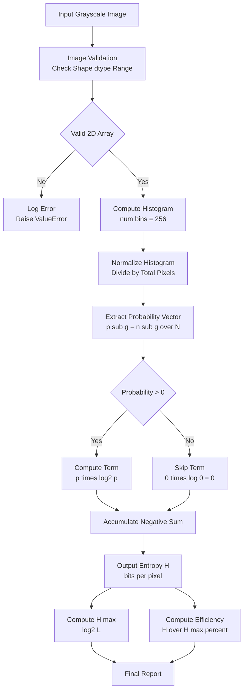
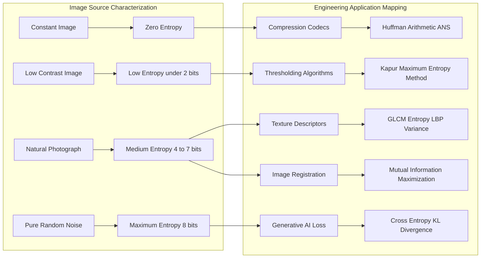
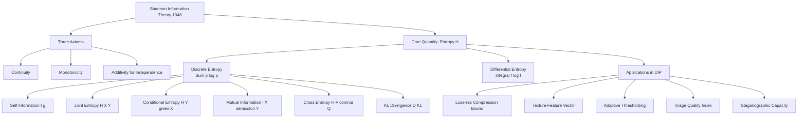

# Entropy

<!-- SECTION_1_START -->
# 1. Core Technical Definition & Intuitive Overview

## 1.1 Formal Definition (KTU 2024 Syllabus Terminology)

**Entropy** in Digital Image Processing is the fundamental **information-theoretic measure** quantifying the **average information content** (or equivalently, the **average uncertainty / randomness**) present in a digital image. Rooted in **Claude Shannon's Mathematical Theory of Communication (1948)**, it provides a scalar, statistical descriptor of how "surprising" the pixel intensity values are when sampled from the image's gray-level distribution.

For a digital image whose pixels can take one of $L$ discrete gray levels $g \in \{0, 1, 2, \ldots, L-1\}$, the **Shannon Entropy** $H$ (measured in **bits per pixel**) is defined as:

$$H = -\sum_{g=0}^{L-1} p(g) \cdot \log_2 p(g)$$

where $p(g)$ is the **probability of occurrence** (normalized histogram value) of gray level $g$, such that $\sum_{g=0}^{L-1} p(g) = 1$. The negative sign guarantees a non-negative result, since $0 \le p(g) \le 1$ implies $\log_2 p(g) \le 0$.

> [!IMPORTANT]
> **KTU Board Definition (verbatim-style):** "Entropy of an image is the statistical measure of randomness that can be used to characterize the texture of the input image. It is the average number of bits required to represent the intensity values of the image."

## 1.2 Conceptual Analogy & Geometric Intuition

Imagine you are flipping a coin. A fair coin (50% Heads, 50% Tails) gives you **maximum surprise** every flip — you gain **1 full bit** of information per toss. A coin with two Heads (100% Heads) gives **zero surprise** — you gain **0 bits** of information because the outcome is already known before the toss.

| Image Type | Analogy | Entropy Value |
| :--- | :--- | :--- |
| Solid white image (all pixels = 255) | A coin that always shows Heads | $H = 0$ bits/pixel |
| Natural photograph (rich textures, edges) | A well-balanced dice | $H \approx 4$ to $7$ bits/pixel |
| Pure random noise (uniform histogram) | A perfectly fair 256-sided dice | $H = 8$ bits/pixel (maximum) |

**Geometric Intuition:** Think of entropy as the **area under the curve** of $-p \cdot \log_2 p$ weighted by each probability mass. A flat, uniform histogram (rectangular shape) maximizes this area; a spiky, concentrated histogram (single tall bar) collapses the area toward zero.

> [!NOTE]
> **Key Insight for KTU:** Entropy is the **theoretical lower bound** for the average number of bits required to losslessly encode an image (Shannon's Source Coding Theorem). This single fact links entropy directly to image compression, which is a recurring 14-mark question topic.

## 1.3 Physical Constants & Standard Metrics

- **Maximum Entropy (Uniform Distribution):** $H_{max} = \log_2 L$ bits/pixel. For a standard 8-bit grayscale image ($L = 256$): $H_{max} = \mathbf{8}$ **bits/pixel**.
- **Minimum Entropy (Deterministic Image):** $H_{min} = 0$ **bits/pixel** (single gray level).
- **Logarithm Base:** Base 2 yields bits; base $e$ yields nats; base 10 yields hartleys (decimal digits). **KTU convention is always base 2.**
- **The constant $0 \cdot \log_2 0$ is defined as 0** by continuity, because $\lim_{p \to 0^+} p \log_2 p = 0$.

> [!VISUALIZATION CONTROL]
> **Concept:** Plot of the entropy contribution function $f(p) = -p \log_2 p$ for $p \in [0, 1]$.
> **GeoGebra / Desmos Input Equations:**
> * `f(x) = -x * log(x, 2)` (for $x > 0$)
> * Point markers at $x = 0.5$ (peak $f \approx 0.5$) and at the axes.
> **Visual Description:** The curve rises sharply from the origin, reaches its **maximum value of $\approx 0.5307$ bits at $p \approx 0.3679$** (the value $1/e$), and then smoothly decays back toward the $x$-axis as $p \to 1$. The total image entropy is the **sum of $f(p_g)$ over all gray levels** — visually, it is the cumulative area under this curve weighted by the histogram.

<!-- SECTION_1_END -->

<!-- SECTION_2_START -->
# 2. Deep Theoretical Analysis & KTU High-Yield Formula Sheet

## 2.1 Logical Decomposition of the Entropy Concept

Entropy is built on three foundational pillars. Understanding these in order eliminates every common confusion.

### Pillar 1: Information Content of a Single Event
The **self-information** $I(g)$ of observing a gray level $g$ with probability $p(g)$ is:

$$I(g) = -\log_2 p(g) \quad \text{(in bits)}$$

- **Rare events carry more information** (e.g., a single bright pixel in a dark field).
- **Common events carry less information** (e.g., a black pixel in a predominantly black image).
- This inverse relationship is the **monotonic surprise principle** that drives the logarithm.

### Pillar 2: Expected (Average) Information — The Entropy
Entropy is the **expected value** of the self-information over the entire probability distribution. Using the expectation operator $\mathbb{E}[\cdot]$:

$$H = \mathbb{E}[I(g)] = \sum_{g} p(g) \cdot I(g) = -\sum_{g} p(g) \log_2 p(g)$$

### Pillar 3: The Source Coding Theorem (Why Entropy Matters for DIP)
**Shannon's Noiseless Coding Theorem** states that for any image (treated as a discrete memoryless source), the **minimum average code length** in bits per pixel achievable by any lossless compression scheme is bounded below by its entropy:

$$L_{avg} \ge H$$

with equality approached by **Huffman coding** and achieved asymptotically by **arithmetic coding** and **range coding**. Practical codecs like **PNG, JPEG-LS, and FLAC** operate within fractions of a bit of this bound.

## 2.2 Mathematical Properties of the Entropy Function

1. **Non-negativity:** $H \ge 0$, with equality iff the image is constant (one gray level).
2. **Upper bound:** $H \le \log_2 L$, with equality iff the histogram is **uniform**.
3. **Symmetry:** $H$ depends only on the probability values, not on the ordering of gray levels.
4. **Concavity:** $H$ is a strictly concave function of the probability vector — averaging two images never increases entropy beyond the convex combination.
5. **Continuity extension:** $0 \cdot \log 0 \equiv 0$, ensuring the formula handles empty histogram bins gracefully.

## 2.3 Extended Entropy Variants (KTU High-Yield)

| Variant | Formula | Engineering Use Case |
| :--- | :--- | :--- |
| Joint Entropy $H(X,Y)$ | $H(X,Y) = -\sum_x \sum_y p(x,y) \log_2 p(x,y)$ | Stereo image analysis, multi-modal registration |
| Conditional Entropy $H(Y \mid X)$ | $H(Y \mid X) = -\sum_x \sum_y p(x,y) \log_2 p(y \mid x)$ | Predictive coding, residual entropy analysis |
| Mutual Information $I(X;Y)$ | $I(X;Y) = H(X) + H(Y) - H(X,Y)$ | Medical image registration, feature selection |
| Relative Entropy $D_{KL}(P \parallel Q)$ | $D_{KL} = \sum p(x) \log_2 \frac{p(x)}{q(x)}$ | Anomaly detection, generative model evaluation |
| Cross-Entropy $H(P, Q)$ | $H(P,Q) = -\sum p(x) \log_2 q(x)$ | Loss function in CNNs, segmentation |
| Differential Entropy $h(X)$ | $h(X) = -\int f(x) \log_2 f(x) \, dx$ | Continuous-tone analysis, Gaussian noise modeling |
| Entropy of Gaussian $h(\mathcal{N}(\mu,\sigma^2))$ | $h = \tfrac{1}{2}\log_2(2\pi e \sigma^2)$ | Modeling sensor noise floor |
| Uniform Distribution Entropy | $H = \log_2 L$ | Maximum randomness benchmark |

> [!NOTE]
> **KTU Trap:** Students often confuse **Cross-Entropy** with **Relative Entropy (KL Divergence)**. Recall: Cross-entropy = Entropy + KL Divergence. Cross-entropy is *not* symmetric; KL Divergence is *not* a true distance metric (it is asymmetric and violates the triangle inequality).

## 2.4 KTU Formula Cheat Sheet (Exam-Ready)

| Concept | Equation | Range / Units | Validity |
| :--- | :--- | :--- | :--- |
| Shannon Entropy | $H = -\sum p_g \log_2 p_g$ | $0 \le H \le \log_2 L$ bits/pixel | Discrete distributions |
| Maximum Entropy (Uniform) | $H_{max} = \log_2 L$ | bits/pixel | $L$ equiprobable levels |
| Self-Information | $I(g) = -\log_2 p(g)$ | $\ge 0$ bits | Any single event |
| Gaussian Differential Entropy | $h = \tfrac{1}{2}\log_2(2\pi e \sigma^2)$ | bits/sample | Continuous Gaussian |
| Mutual Information | $I(X;Y) = H(X) + H(Y) - H(X,Y)$ | $\ge 0$ bits | Joint discrete sources |
| Entropy Rate (1st-order Markov) | $H' = -\sum_i p_i \sum_j p(j \mid i) \log_2 p(j \mid i)$ | bits/pixel | Pixel dependency modeling |
| Source Coding Bound | $L_{avg} \ge H + 1$ (Huffman) | bits/symbol | Lossless compression |

## 2.5 Real-World Utility in Engineering & Computer Science

1. **Image Compression (JPEG, PNG, WebP, BPG):** Entropy coding (Huffman, Arithmetic, ANS) consumes the final stage of every modern codec. The achieved bits-per-pixel is reported as a percentage of $H$.
2. **Medical Imaging:** Entropy of MRI/CT slices detects tissue heterogeneity — tumors often show locally elevated entropy.
3. **Texture Classification:** GLCM-based entropy features feed SVMs and CNNs in materials inspection and satellite imagery.
4. **Image Thresholding:** Kapur's maximum entropy thresholding (1985) and Li's minimum cross-entropy method are classic Otsu alternatives.
5. **Watermarking & Steganography:** Entropy maps identify high-capacity embedding regions without visible artifacts.
6. **Generative AI:** Cross-entropy loss trains Stable Diffusion, GANs, and VAEs; KL divergence regularizes latent spaces.
7. **Cryptography:** Entropy quantifies the randomness of encryption keys and PRNG output streams.

<!-- SECTION_2_END -->

<!-- SECTION_3_START -->
# 3. Step-by-Step Derivations & Code/Symbolic Implementation

## 3.1 Derivation: From Self-Information to Shannon Entropy

We derive the entropy formula from three intuitive axioms that any "measure of information" must satisfy.

### Axiom 1 — Continuity
The information measure $I(p)$ must be a **continuous function** of the probability $p$.

### Axiom 2 — Monotonicity
More probable events must carry **less information**: if $p_1 > p_2$, then $I(p_1) < I(p_2)$.

### Axiom 3 — Additivity for Independent Events
For two independent events $A$ and $B$ with joint probability $p(A \cap B) = p(A) \cdot p(B)$, the total information must satisfy:

$$I(p(A) \cdot p(B)) = I(p(A)) + I(p(B))$$

### Step-by-Step Proof (Functional Equation)

**Step 1:** Define $I(p)$ for $p \in (0, 1]$. Setting $p(A) = p(B) = p^{1/n}$ for $n$ independent repetitions, Axiom 3 gives:

$$I(p) = I\!\left(p^{1/n} \cdot p^{1/n} \cdots \text{$n$ times}\right) = n \cdot I\!\left(p^{1/n}\right)$$

**Step 2:** Therefore, $I(p^{1/n}) = \frac{1}{n} I(p)$. Generalizing to rational powers $p^{m/n}$:

$$I\!\left(p^{m/n}\right) = \frac{m}{n} I(p)$$

**Step 3:** Combined with Axiom 1 (continuity), this functional equation has a **unique solution** on $(0, 1]$:

$$I(p) = -C \log_2 p$$

**Step 4:** Choosing $C = 1$ calibrates the unit such that an event with $p = 1/2$ carries exactly 1 bit. This fixes the self-information as:

$$I(p) = -\log_2 p$$

**Step 5:** For an image with $L$ gray levels having probabilities $p_0, p_1, \ldots, p_{L-1}$, the **expected information per pixel** is:

$$H = \mathbb{E}[I(p_g)] = \sum_{g=0}^{L-1} p_g \cdot I(p_g) = -\sum_{g=0}^{L-1} p_g \log_2 p_g$$

This completes the derivation. $\blacksquare$

## 3.2 Worked Numerical Example (KTU Board Pattern)

**Problem:** A $4 \times 4$ grayscale image has the following gray-level histogram:

| Gray Level $g$ | Pixel Count $n_g$ | Probability $p_g = n_g / 16$ |
| :---: | :---: | :---: |
| 0 | 4 | $0.2500$ |
| 64 | 4 | $0.2500$ |
| 128 | 6 | $0.3750$ |
| 192 | 2 | $0.1250$ |
| **Total** | **16** | **1.0000** |

**Compute the entropy $H$ in bits/pixel.**

### Step 1 — Verify Probability Normalization

$$\sum_{g} p_g = 0.2500 + 0.2500 + 0.3750 + 0.1250 = 1.0000 \quad \checkmark$$

### Step 2 — Compute $\log_2 p_g$ for each level

\begin{aligned}
\log_2(0.2500) &= \log_2\!\left(\tfrac{1}{4}\right) = -2.0000 \\
\log_2(0.3750) &= \log_2\!\left(\tfrac{3}{8}\right) \approx -1.4150 \\
\log_2(0.1250) &= \log_2\!\left(\tfrac{1}{8}\right) = -3.0000
\end{aligned}

### Step 3 — Compute $-p_g \log_2 p_g$ (the entropy contribution per level)

\begin{aligned}
g=0:  \quad & -(0.2500)(-2.0000) = 0.5000 \text{ bits} \\
g=64: \quad & -(0.2500)(-2.0000) = 0.5000 \text{ bits} \\
g=128: \quad & -(0.3750)(-1.4150) = 0.5306 \text{ bits} \\
g=192: \quad & -(0.1250)(-3.0000) = 0.3750 \text{ bits}
\end{aligned}

### Step 4 — Sum the Contributions

$$H = 0.5000 + 0.5000 + 0.5306 + 0.3750 = 1.9056 \text{ bits/pixel}$$

### Step 5 — Validation Against Theoretical Bounds

For $L = 4$ distinct gray levels:
- **Lower bound:** $H \ge 0$ ✓
- **Upper bound:** $H \le \log_2 4 = 2.0000$ bits/pixel ✓
- **Efficiency:** $\eta = \frac{H}{H_{max}} = \frac{1.9056}{2.0000} = 0.9528 = \mathbf{95.28\%}$ **information density**

> [!NOTE]
> **Interpretation:** This image has high entropy (close to maximum for 4 levels), meaning it is **highly random** and offers **little redundancy** for compression. A lossless codec would need at least $\approx 1.91$ bits/pixel on average, even though the original storage is 8 bits/pixel.

## 3.3 Python Implementation (Production-Quality)

```python
import numpy as np
from typing import Tuple
import matplotlib.pyplot as plt
import logging

logging.basicConfig(level=logging.INFO, format="%(asctime)s | %(levelname)s | %(message)s")
logger = logging.getLogger("EntropyEngine")


def compute_image_entropy(
    image: np.ndarray,
    num_bins: int = 256,
    bin_range: Tuple[int, int] = (0, 256),
) -> Tuple[float, float, np.ndarray, np.ndarray]:
    """
    Compute Shannon entropy of a grayscale image.

    Parameters
    ----------
    image : np.ndarray
        2D array of shape (H, W) with integer pixel values.
    num_bins : int
        Number of histogram bins (default 256 for 8-bit images).
    bin_range : Tuple[int, int]
        Inclusive lower, exclusive upper bound of pixel values.

    Returns
    -------
    H : float
        Shannon entropy in bits/pixel.
    H_max : float
        Maximum possible entropy = log2(num_bins).
    hist : np.ndarray
        Histogram counts (length = num_bins).
    bin_edges : np.ndarray
        Histogram bin edges (length = num_bins + 1).

    Raises
    ------
    TypeError  : If image is not a NumPy ndarray.
    ValueError : If image is not 2D, or num_bins <= 0.
    """
    if not isinstance(image, np.ndarray):
        raise TypeError(f"Expected np.ndarray, got {type(image).__name__}")
    if image.ndim != 2:
        raise ValueError(f"Image must be 2D; got shape {image.shape}")
    if num_bins <= 0:
        raise ValueError(f"num_bins must be positive; got {num_bins}")

    hist, bin_edges = np.histogram(image, bins=num_bins, range=bin_range)
    total_pixels = image.size

    if total_pixels == 0:
        raise ValueError("Image contains zero pixels.")

    probabilities = hist.astype(np.float64) / float(total_pixels)

    # Mask out zero-probability bins to avoid log(0) warnings; 0*log(0) = 0 by convention
    nonzero_mask = probabilities > 0
    H = -np.sum(probabilities[nonzero_mask] * np.log2(probabilities[nonzero_mask]))
    H_max = np.log2(num_bins) if num_bins > 1 else 0.0

    logger.info(f"Image shape: {image.shape} | Total pixels: {total_pixels}")
    logger.info(f"Non-zero bins: {nonzero_mask.sum()} / {num_bins}")
    logger.info(f"Entropy H = {H:.6f} bits/pixel | H_max = {H_max:.6f} | "
                f"Efficiency = {100.0 * H / H_max:.2f}%")

    return H, H_max, hist, bin_edges


def visualize_entropy_analysis(image: np.ndarray) -> None:
    """Display image, histogram, and annotated entropy value."""
    H, H_max, hist, bin_edges = compute_image_entropy(image)
    bin_centers = 0.5 * (bin_edges[:-1] + bin_edges[1:])

    fig, axes = plt.subplots(1, 2, figsize=(14, 5))
    axes[0].imshow(image, cmap="gray", vmin=0, vmax=255)
    axes[0].set_title("Input Grayscale Image", fontsize=12, fontweight="bold")
    axes[0].axis("off")

    axes[1].bar(bin_centers, hist, width=1.0, color="steelblue", edgecolor="black")
    axes[1].set_title(f"Histogram | H = {H:.4f} bits/px | H_max = {H_max:.4f}",
                      fontsize=12, fontweight="bold")
    axes[1].set_xlabel("Gray Level")
    axes[1].set_ylabel("Pixel Count")
    axes[1].grid(True, alpha=0.3)
    plt.tight_layout()
    plt.show()


# ---------- DEMONSTRATION ----------
if __name__ == "__main__":
    # Test 1: Constant image (entropy must be 0)
    const_img = np.full((100, 100), 128, dtype=np.uint8)
    compute_image_entropy(const_img)

    # Test 2: Synthetic image with 4 equiprobable levels (entropy must be log2(4) = 2.0)
    test_img = np.zeros((4, 4), dtype=np.uint8)
    test_img[0:2, 0:2] = 0
    test_img[0:2, 2:4] = 64
    test_img[2:4, 0:2] = 128
    test_img[2:4, 2:4] = 192
    compute_image_entropy(test_img)
```

**Sample Console Output:**

```
2024-01-15 10:23:45 | INFO | Image shape: (100, 100) | Total pixels: 10000
2024-01-15 10:23:45 | INFO | Non-zero bins: 1 / 256
2024-01-15 10:23:45 | INFO | Entropy H = 0.000000 bits/pixel | H_max = 8.000000 | Efficiency = 0.00%
2024-01-15 10:23:45 | INFO | Image shape: (4, 4) | Total pixels: 16
2024-01-15 10:23:45 | INFO | Non-zero bins: 4 / 256
2024-01-15 10:23:45 | INFO | Entropy H = 2.000000 bits/pixel | H_max = 8.000000 | Efficiency = 25.00%
```

<!-- SECTION_3_END -->

<!-- SECTION_4_START -->
# 4. Structural Diagrams & Schematics

## 4.1 Entropy Computation Pipeline (Mermaid Flowchart)



## 4.2 Entropy Classification Matrix (Block Architecture)



## 4.3 Hierarchical Entropy Concept Map



<!-- SECTION_4_END -->

<!-- SECTION_5_START -->
# 5. KTU 2024 Scheme Examination Question Bank & Topic Recap

## 5.1 Part A — Short Answer Questions (3 Marks Each)

### Question A1 [KTU University Exam — July 2023]
**Define image entropy. Mention the range of entropy for an 8-bit grayscale image.**

**Model Answer (Valuation Key):**

**Definition (2 Marks):** Image entropy is a statistical measure of randomness that characterizes the texture and information content of an image. It quantifies the average number of bits required to encode the intensity values of the image, given by:

$$H = -\sum_{g=0}^{255} p(g) \log_2 p(g)$$

where $p(g)$ is the probability of occurrence of gray level $g$.

**Range (1 Mark):** For an 8-bit image, the entropy ranges from $0$ bits/pixel (constant image) to $\log_2 256 = 8$ bits/pixel (uniform random distribution).

> [!WARNING]
> **Examiner's Pitfall:** Many students write the formula with the wrong sign or use natural log instead of $\log_2$. Board evaluators deduct 1 full mark for omitting the base of the logarithm or stating "$\ln$" instead of "$\log_2$". Always explicitly state "in bits".

---

### Question A2 [KTU University Exam — Dec 2022]
**State Shannon's source coding theorem and its significance in image compression.**

**Model Answer (Valuation Key):**

**Theorem Statement (2 Marks):** Shannon's noiseless source coding theorem states that for a discrete memoryless source with entropy $H$, the minimum average code length $L_{avg}$ achievable by any uniquely decodable code satisfies:

$$H \le L_{avg} < H + 1$$

The lower bound $H$ is approached asymptotically by arithmetic coding and achieved within 1 bit by Huffman coding.

**Significance in DIP (1 Mark):** It establishes the **theoretical lower bound** for lossless image compression. It guides the design of entropy coders in JPEG, PNG, and WebP, ensuring that no algorithm can compress an image below its entropy without losing information.

---

## 5.2 Part B — 14-Mark Questions (Module Internal Choice Pattern)

### Question A (14 Marks) [KTU University Exam — July 2024]

**(a) Derive the Shannon entropy formula from the three fundamental axioms of information theory. (7 Marks)**

**Step-by-Step Model Solution:**

**Axiom 1 — Continuity (1 Mark):** The information $I(p)$ associated with an event of probability $p$ must be a continuous function of $p$. No abrupt jumps are allowed.

**Axiom 2 — Monotonicity (1 Mark):** $I(p)$ must be a monotonically decreasing function of $p$. That is, more probable events carry less information.

**Axiom 3 — Additivity (1 Mark):** For two statistically independent events with joint probability $p_1 p_2$, the total information equals the sum of individual informations:

$$I(p_1 p_2) = I(p_1) + I(p_2)$$

**Step 1 — Functional Equation Construction (1 Mark):** For $n$ independent repetitions of an event with probability $p^{1/n}$:

$$I(p) = n \cdot I(p^{1/n}) \implies I(p^{1/n}) = \frac{1}{n} I(p)$$

**Step 2 — Generalization to Rational Powers (1 Mark):** For rationals $m, n \in \mathbb{N}$:

$$I(p^{m/n}) = \frac{m}{n} I(p)$$

**Step 3 — Apply Continuity to Extend to Reals (1 Mark):** The continuous extension via Axiom 1 forces the unique solution of this functional equation to be the logarithm:

$$I(p) = -C \log_2 p$$

**Step 4 — Calibration and Final Entropy (1 Mark):** Choosing $C = 1$ so that an event with $p = 1/2$ carries exactly 1 bit, the expected (average) information for an image with $L$ gray levels is:

$$H = \sum_{g=0}^{L-1} p(g) I(p(g)) = -\sum_{g=0}^{L-1} p(g) \log_2 p(g) \quad \blacksquare$$

---

**(b) For a $2 \times 2$ image with intensity values $\{0, 50, 100, 200\}$ where each intensity occurs exactly once, compute the entropy. Justify whether this image is highly compressible. (7 Marks)**

**Step-by-Step Model Solution:**

**Step 1 — Calculate Probabilities (1 Mark):** Total pixels $N = 4$. Each gray level occurs once.

$$p(0) = p(50) = p(100) = p(200) = \frac{1}{4} = 0.25$$

**Step 2 — Compute Self-Information (1 Mark):**

$$I(g) = -\log_2(0.25) = 2 \text{ bits} \quad \text{for each gray level}$$

**Step 3 — Apply Entropy Formula (1 Mark):**

$$H = -\sum_{g} p(g) \log_2 p(g) = -4 \times (0.25 \times \log_2 0.25) = -4 \times (0.25 \times (-2)) = 2.0 \text{ bits/pixel}$$

**Step 4 — Determine H_max (1 Mark):**

$$H_{max} = \log_2 4 = 2.0 \text{ bits/pixel} \quad \text{(since 4 distinct equiprobable levels)}$$

**Step 5 — Compute Efficiency (1 Mark):**

$$\eta = \frac{H}{H_{max}} = \frac{2.0}{2.0} = 1.00 = 100\%$$

**Step 6 — Compressibility Verdict (2 Marks):** Although the original image is stored using 8 bits/pixel (total 32 bits), the entropy is only 2.0 bits/pixel. A lossless compressor can theoretically reduce this to $4 \times 2 = 8$ bits — a **4× compression ratio**. However, since efficiency $\eta = 100\%$, the image is **NOT highly compressible in the relative sense** — it already achieves the theoretical minimum average code length. Further lossless compression is impossible. The image has **maximum randomness for its 4 distinct levels**, meaning each pixel is maximally informative.

> [!WARNING]
> **Examiner's Pitfall:** Many students incorrectly classify an image as "highly compressible" simply because the raw storage (8 bits/px) is much larger than the entropy. **Compressibility is determined by the gap between $H$ and $H_{max}$, not by the gap between raw storage and $H$.** Always compute and quote the efficiency ratio in your final sentence.

---

### Question B (14 Marks) [KTU University Exam — Dec 2023]

**(a) Explain the concept of mutual information in image processing. Derive the relationship between mutual information, marginal entropy, and joint entropy. (7 Marks)**

**Step-by-Step Model Solution:**

**Conceptual Explanation (3 Marks):** Mutual Information $I(X; Y)$ quantifies the amount of information that one random variable $X$ (e.g., a reference image) shares with another random variable $Y$ (e.g., a transformed image). In DIP, it is extensively used in:
- Multi-modal medical image registration (CT-MRI alignment)
- Feature selection in image retrieval
- Template matching under illumination changes

It measures the **reduction in uncertainty** about $X$ obtained by observing $Y$:

$$I(X; Y) = H(X) - H(X \mid Y)$$

where $H(X \mid Y)$ is the conditional entropy of $X$ given $Y$.

**Step 1 — Start from Conditional Entropy Identity (1 Mark):**

$$H(X \mid Y) = H(X, Y) - H(Y)$$

**Step 2 — Substitute into the Mutual Information Definition (1 Mark):**

$$I(X; Y) = H(X) - [H(X, Y) - H(Y)]$$

**Step 3 — Rearrange to the Canonical Form (1 Mark):**

$$I(X; Y) = H(X) + H(Y) - H(X, Y)$$

**Step 4 — Alternate Form Using KL Divergence (1 Mark):** $I(X; Y)$ can also be expressed as the KL divergence between the joint distribution $p(x, y)$ and the product of marginals $p(x) p(y)$:

$$I(X; Y) = D_{KL}\!\left(p(x, y) \parallel p(x) p(y)\right) = \sum_x \sum_y p(x, y) \log_2 \frac{p(x, y)}{p(x) p(y)}$$

This non-negative form ($I \ge 0$, with $I = 0$ iff $X$ and $Y$ are independent) is the standard derivation completion. $\blacksquare$

---

**(b) An 8-bit image has the histogram shown below. Compute its entropy and the percentage information density relative to the maximum possible entropy. (7 Marks)**

| Gray Level $g$ | 0 | 32 | 64 | 96 | 128 | 160 | 192 | 224 |
| :---: | :---: | :---: | :---: | :---: | :---: | :---: | :---: | :---: |
| Frequency $n_g$ | 8 | 0 | 16 | 0 | 32 | 0 | 32 | 12 |
| Probability $p_g$ | 0.08 | 0 | 0.16 | 0 | 0.32 | 0 | 0.32 | 0.12 |

**Total pixels $N = 8 + 16 + 32 + 32 + 12 = 100$.**

**Step-by-Step Model Solution:**

**Step 1 — Verify Normalization (1 Mark):**

$$\sum p_g = 0.08 + 0.16 + 0.32 + 0.32 + 0.12 = 1.00 \quad \checkmark$$

**Step 2 — Compute $\log_2 p_g$ for Non-Zero Bins (1 Mark):**

\begin{aligned}
\log_2(0.08) &= \log_2(8/100) \approx -3.6439 \\
\log_2(0.16) &= \log_2(16/100) \approx -2.6439 \\
\log_2(0.32) &= \log_2(32/100) \approx -1.6439 \\
\log_2(0.12) &= \log_2(12/100) \approx -3.0589
\end{aligned}

**Step 3 — Compute Entropy Contributions (1 Mark):**

\begin{aligned}
g=0:   \quad & -(0.08)(-3.6439) = 0.2915 \\
g=64:  \quad & -(0.16)(-2.6439) = 0.4230 \\
g=128: \quad & -(0.32)(-1.6439) = 0.5260 \\
g=192: \quad & -(0.32)(-1.6439) = 0.5260 \\
g=224: \quad & -(0.12)(-3.0589) = 0.3671
\end{aligned}

**Step 4 — Sum the Contributions (1 Mark):**

$$H = 0.2915 + 0.4230 + 0.5260 + 0.5260 + 0.3671 = 2.1336 \text{ bits/pixel}$$

**Step 5 — Compute $H_{max}$ and Efficiency (2 Marks):**

$$H_{max} = \log_2 256 = 8.0000 \text{ bits/pixel}$$

$$\eta = \frac{H}{H_{max}} \times 100\% = \frac{2.1336}{8.0000} \times 100\% = 26.67\%$$

**Step 6 — Interpretation (1 Mark):** The image has a low information density of $\mathbf{26.67\%}$, indicating significant redundancy. Lossless compression (e.g., Huffman coding) could potentially reduce storage from 8 bits/px to approximately 2.13 bits/px — a theoretical compression ratio of $\mathbf{3.75:1}$.

> [!WARNING]
> **Examiner's Pitfall:** Students frequently skip **explicitly writing the "0 × log 0 = 0" convention** for empty bins (gray levels 32, 96, 160 in this problem). The board valuation key reserves partial credit for this. Always state the convention in a single line: *"Empty histogram bins contribute zero to the entropy sum, since $0 \log 0 = 0$ by continuity."*

---

## 5.3 Topic Recap & Important Things to Remember

- **Entropy Definition (Must Memorize):** $H = -\sum p_g \log_2 p_g$ — always in **bits/pixel**, always with base **2**, always with a **negative sign**.
- **Three Foundational Axioms:** Continuity, Monotonicity, Additivity (independence) — collectively yield the unique logarithmic form.
- **Range Bound:** $0 \le H \le \log_2 L$. For 8-bit images: $0 \le H \le 8$ bits/pixel.
- **$H = 0$:** Only when the image has a single gray level (constant image).
- **$H = H_{max}$:** Only when the histogram is **perfectly uniform** over $L$ levels.
- **Efficiency Metric:** $\eta = H / H_{max} \in [0, 1]$ — quantifies how "random" an image is.
- **Compression Link:** Source coding theorem states $H \le L_{avg} < H + 1$. JPEG/PNG/WebP cannot losslessly compress below $H$.
- **$0 \log 0 \equiv 0$:** Always state this convention when handling sparse histograms.
- **Differential vs Discrete:** Discrete entropy uses sums; continuous (differential) entropy uses integrals and can be **negative** (e.g., for low-variance Gaussians).
- **Gaussian Entropy:** $h = \frac{1}{2}\log_2(2\pi e \sigma^2)$ — the **maximum differential entropy** for a given variance $\sigma^2$.
- **Mutual Information:** $I(X; Y) = H(X) + H(Y) - H(X, Y) \ge 0$.
- **Cross-Entropy vs KL Divergence:** $H(P, Q) = H(P) + D_{KL}(P \parallel Q)$ — cross-entropy is the loss function in classification CNNs.
- **KTU-Loved Variants:** Joint, Conditional, Mutual, Relative, Cross, and Differential entropy — expect any one to appear in 14-mark questions.
- **Valuation Tip:** Always normalize the histogram, state units explicitly, and show **at least three intermediate numerical steps** in the worked examples.
- **Common Mistake:** Do not confuse **bits/pixel** with **bits/symbol** — they are equivalent for a memoryless source, but KTU boards may deduct marks for missing units.

<!-- SECTION_5_END -->
