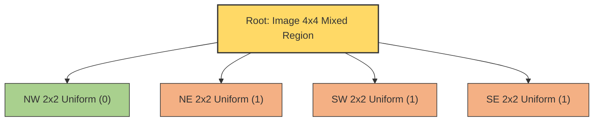
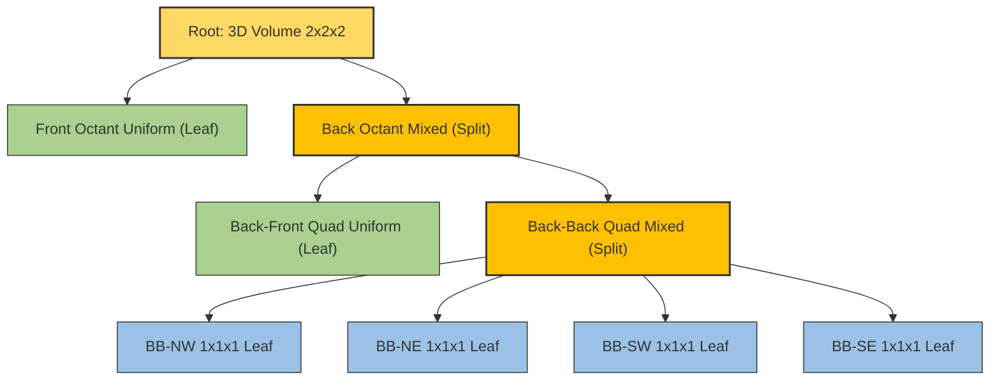
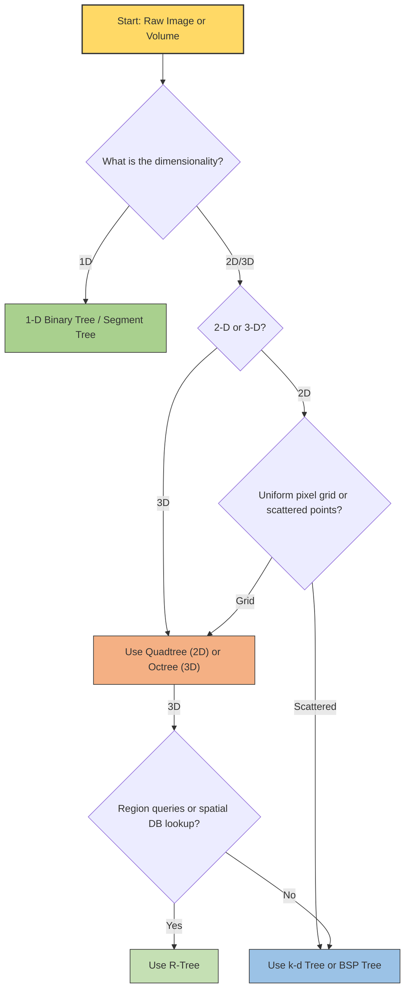
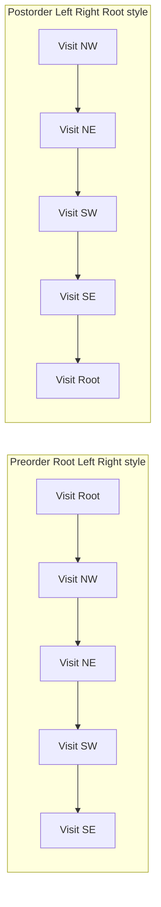

# Hierarchical Data Structures

<!-- SECTION_1_START -->

# Hierarchical Data Structures in Digital Image Processing

## 1.1 Formal KTU 2024 Definition

> [!IMPORTANT]
> **Hierarchical Data Structures (HDS)** in Digital Image Processing refer to **tree-based, multi-resolution organisational schemes** that recursively subdivide an image (or volume) into smaller, self-similar sub-regions. They allow complex spatial information to be stored, indexed, traversed, and manipulated with logarithmic average complexity, making them indispensable for image representation, compression, segmentation, and spatial querying.

In the KTU 2024 Scheme (Course Code **PECST636 - Digital Image Processing**), Hierarchical Data Structures fall under **Module 1: The Image, Its Representation and Properties**, and they form the bridge between raw pixel arrays and symbolic, region-oriented image descriptors.

The principal members of this family are:

| Symbol | Structure | Native Dimensionality |
| :---: | :--- | :--- |
| **BT** | Binary Tree | 1-D |
| **QT** | Quadtree | 2-D |
| **OT** | Octree | 3-D |
| **KDT** | k-d Tree | k-D |
| **BSP** | Binary Space Partitioning | 2-D / 3-D |
| **RT** | R-Tree | Multi-D |

## 1.2 Intuitive Analogy

> [!NOTE]
> **Analogy — The Library Catalogue System**
> Imagine a massive library with millions of books arranged randomly. Searching for a specific book would take hours. Instead, the librarian divides the library into **Floors → Wings → Shelves → Books**. This is a **hierarchy**: at every level, the search space is reduced by a fixed factor.
>
> - A **Quadtree** divides a city map into 4 quarters, then each quarter into 4, and so on, until each tiny patch is uniform (e.g., all residential or all park).
> - An **Octree** does the same for a 3D voxel volume (e.g., a CT scan of the human chest), splitting space into 8 sub-cubes at every step.
> - A **k-d Tree** splits alternatingly along the *x* and *y* axes (a binary hierarchy), like repeatedly halving a sorted list of points.

## 1.3 Why Hierarchical Structures Matter in DIP

| Challenge | Pixel Array (Naive) | Hierarchical Structure |
| :--- | :--- | :--- |
| Find connected component | $O(N^2)$ scan | $O(\log N)$ traversal |
| Region-of-interest query | Linear scan | Pruned tree search |
| Image compression | Run-length only | Block-level region encoding |
| 3-D medical volume | Memory prohibitive | Sparse octree representation |
| Multi-resolution display | Re-sample every time | Coarse-to-fine tree walk |

## 1.4 The "Self-Similar Subdivision" Principle

Every hierarchical structure used in DIP obeys the **Recursive Subdivision Axiom**:

$$
\text{Node}(R) \;=\;
\begin{cases}
\text{Leaf}(\text{uniform region}), & \text{if } \sigma^2(R) \le T \\[4pt]
\text{Internal}\bigl(\text{Sub}(R)\bigr), & \text{otherwise}
\end{cases}
$$

where $R$ is the image region, $\sigma^2(R)$ is the variance of pixel intensities inside $R$, and $T$ is a **homogeneity threshold**. The recursion terminates when a region is sufficiently uniform.

## 1.5 Standard Metrics Used in the Module

> [!IMPORTANT]
> **Key Constants & Parameters (KEEP IN MIND):**
> - **Branching Factor $b$**: 2 (Binary), 4 (Quadtree), 8 (Octree).
> - **Threshold $T$**: Used to decide whether a region is "uniform".
> - **Depth $d$**: Maximum recursion depth, $\log_2 N$ for an $N \times N$ image.
> - **Spatial Resolution $\Delta$**: Pixel size in physical units (mm, $\mu$m, etc.).

## 1.6 Geometric Intuition Visualisation

> [!VISUALIZATION CONTROL]
> **Concept:** Region subdivision pattern for a Quadtree on a $4 \times 4$ binary image.
> **GeoGebra / Desmos Input:**
> - Plot the grid points: $(x, y)$ for $x, y \in \{0, 1, 2, 3, 4\}$.
> - Define a piecewise function for the quadrant:
>   * $f(x, y) = 0$ for the upper-left $2 \times 2$ block.
>   * $f(x, y) = 1$ for the lower-right $2 \times 2$ block.
> **Visual Description:** The student should observe a $2 \times 2$ chessboard pattern where two blocks share a common gray value. The Quadtree stops subdividing at depth 1 because each $2 \times 2$ block is internally uniform.

---

<!-- SECTION_1_END -->

<!-- SECTION_2_START -->

# Deep Theoretical Analysis & KTU Formula Sheet

## 2.1 Anatomy of a Hierarchical Node

A node in any HDS contains **three essential attributes**:

1. **Spatial Extent** $(x, y, w, h)$ — the region of the image it represents.
2. **Payload** — an intensity value, a colour tuple, or a list of pixel coordinates.
3. **Children** — pointers to sub-regions (in a leaf, all children are `null`).

$$
\text{Node} = \bigl\{ \text{region}, \; \text{payload}, \; \{c_1, c_2, \dots, c_b\} \bigr\}
$$

where $b$ is the branching factor.

## 2.2 The Region Quadtree (RQ-Tree)

A **Region Quadtree** is a 2-D tree in which every internal node has **exactly 4 children** corresponding to the four quadrants:

| Quadrant Index | Name | Coordinates |
| :---: | :--- | :--- |
| **0** | North-West (NW) | $(x, y)$ |
| **1** | North-East (NE) | $(x + w/2, y)$ |
| **2** | South-West (SW) | $(x, y + h/2)$ |
| **3** | South-East (SE) | $(x + w/2, y + h/2)$ |

### 2.2.1 Construction Algorithm (KTU-Aligned Steps)

1. Start with the **root** node representing the entire image $I$ of size $2^n \times 2^n$.
2. Compute the variance $\sigma^2$ of the region. If $\sigma^2 \le T$, **mark the node as a leaf** and store the average intensity $\mu$.
3. Otherwise, **split** the region into 4 equal quadrants and recurse on each.
4. Stop recursion if the region size becomes $1 \times 1$ (pixel granularity).

### 2.2.2 Maximum Node Count Derivation

The maximum number of nodes in a complete quadtree of depth $d$ is the geometric sum:

$$
N_{\text{max}}(d) \;=\; \sum_{k=0}^{d} 4^k \;=\; \frac{4^{d+1} - 1}{3}
$$

This is derived from the geometric series identity $\sum_{k=0}^{d} r^k = (r^{d+1} - 1) / (r - 1)$ with $r = 4$.

### 2.2.3 Storage Complexity

For a perfectly uniform image, only the root node exists: $N = 1$. For a checkerboard pattern of size $2^n \times 2^n$:

$$
N_{\text{max}} \;=\; \frac{4^{n+1} - 1}{3} \;\approx\; \frac{4^{n+1}}{3}
$$

The **storage complexity is $O(p)$** where $p$ is the number of homogeneous blocks, bounded by $O(N^2)$ for an $N \times N$ image.

## 2.3 The Octree (3-D Extension)

An **Octree** is the 3-D analogue of the quadtree. Each internal node has **8 children** corresponding to the 8 octants of 3-D space (NW-Front, NE-Front, SW-Front, SE-Front, NW-Back, NE-Back, SW-Back, SE-Back).

The maximum number of nodes at depth $d$ is:

$$
N_{\text{max}}^{\text{oct}}(d) \;=\; \frac{8^{d+1} - 1}{7}
$$

> [!IMPORTANT]
> **Memory-Bound Warning:** Because the branching factor is 8, an Octree of depth 10 already requires $O(8^{10}) \approx 10^9$ potential nodes. In practice, **sparse octrees** store only the non-empty cells, which is why they are the backbone of 3-D medical imaging, LiDAR point clouds, and voxel rendering engines.

## 2.4 Other Members of the Family

### 2.4.1 k-d Tree (k-Dimensional Tree)

- A **binary** tree that splits alternately along chosen coordinate axes.
- At depth $k \bmod d$, split along axis $k \bmod d$ at the **median** of the points.
- Average query time: $O(\log n)$, worst case: $O(n)$ for unbalanced splits.

### 2.4.2 BSP Tree (Binary Space Partitioning)

- Recursively partitions space using **hyperplanes**.
- Each node stores a hyperplane equation; children are the two half-spaces.
- Heavily used in **real-time 3-D rendering** (e.g., Doom, Quake engines) for hidden-surface removal.

### 2.4.3 R-Tree

- Groups nearby objects using **minimum bounding rectangles (MBRs)**.
- Each node stores an MBR that tightly encloses all its children.
- Standard index for **spatial databases** (PostGIS, Oracle Spatial).

## 2.5 KTU High-Yield Formula Sheet

> [!NOTE]
> **Master this table before attempting numerical problems.**

| Structure | Branching Factor $b$ | Max Nodes at Depth $d$ | Leaves at Depth $d$ | Avg Query | Use Case |
| :--- | :---: | :---: | :---: | :---: | :--- |
| Binary Tree | 2 | $2^{d+1} - 1$ | $2^d$ | $O(\log n)$ | 1-D signals |
| Quadtree | 4 | $(4^{d+1} - 1)/3$ | $4^d$ | $O(\log n)$ | 2-D image regions |
| Octree | 8 | $(8^{d+1} - 1)/7$ | $8^d$ | $O(\log n)$ | 3-D volumes |
| k-d Tree | 2 | $2^{d+1} - 1$ | $2^d$ | $O(\log n)$ | Feature matching |
| BSP Tree | 2 | $2^{d+1} - 1$ | $2^d$ | $O(\log n)$ | 3-D rendering |
| R-Tree | variable | $O(n)$ | $O(n/b)$ | $O(\log n)$ | Spatial DB |

**Variance Homogeneity Test (Quadtree Stopping Criterion):**

$$
\sigma^2(R) \;=\; \frac{1}{N_R} \sum_{(i,j) \in R} \bigl( I(i, j) - \mu_R \bigr)^2
$$

where $\mu_R$ is the mean intensity of region $R$ and $N_R = w \times h$ is the number of pixels in $R$.

**Coordinate Mapping for Quadrants:**

$$
Q_{\text{NW}} = \bigl( x, \; y, \; w/2, \; h/2 \bigr)
$$

$$
Q_{\text{NE}} = \bigl( x + w/2, \; y, \; w/2, \; h/2 \bigr)
$$

$$
Q_{\text{SW}} = \bigl( x, \; y + h/2, \; w/2, \; h/2 \bigr)
$$

$$
Q_{\text{SE}} = \bigl( x + w/2, \; y + h/2, \; w/2, \; h/2 \bigr)
$$

## 2.6 Real-World Engineering Utility

| Industry | Structure Used | Purpose |
| :--- | :--- | :--- |
| **Google Maps** | Quadtree | Tile-based map rendering |
| **CT/MRI Scanners** | Octree | Sparse 3-D volume storage |
| **Image Compression (JPEG 2000)** | Quadtree | Wavelet coefficient tiling |
| **Self-Driving Cars** | k-d Tree | LiDAR point-cloud nearest neighbour |
| **Video Games (Doom, Quake)** | BSP Tree | Level geometry and visibility |
| **PostgreSQL PostGIS** | R-Tree | Geographic spatial indexing |
| **Photoshop Magic Wand** | Quadtree | Region growing & selection |
| **3-D Printing Slicers** | Octree | Adaptive mesh generation |

---

<!-- SECTION_2_END -->

<!-- SECTION_3_START -->

# Step-by-Step Derivations & Code Implementation

## 3.1 Worked Example 1 — Building a Quadtree by Hand

Consider a $4 \times 4$ binary image where the **upper-left $2 \times 2$ block** has value 0 and the **remaining 12 pixels** have value 1:

$$
I \;=\;
\begin{bmatrix}
0 & 0 & 1 & 1 \\
0 & 0 & 1 & 1 \\
1 & 1 & 1 & 1 \\
1 & 1 & 1 & 1
\end{bmatrix}
$$

### Step 1 — Examine the Root (entire image)

Mean $\mu = (4 \cdot 0 + 12 \cdot 1) / 16 = 0.75$. Variance $\sigma^2 \ne 0$. **Split required.**

### Step 2 — Subdivide into 4 Quadrants

$$
Q_{\text{NW}} =
\begin{bmatrix} 0 & 0 \\ 0 & 0 \end{bmatrix}, \;
Q_{\text{NE}} =
\begin{bmatrix} 1 & 1 \\ 1 & 1 \end{bmatrix}, \;
Q_{\text{SW}} =
\begin{bmatrix} 1 & 1 \\ 1 & 1 \end{bmatrix}, \;
Q_{\text{SE}} =
\begin{bmatrix} 1 & 1 \\ 1 & 1 \end{bmatrix}
$$

### Step 3 — Test Each Quadrant for Uniformity

- $Q_{\text{NW}}$: All zeros $\Rightarrow$ **Leaf, value = 0**.
- $Q_{\text{NE}}$: All ones $\Rightarrow$ **Leaf, value = 1**.
- $Q_{\text{SW}}$: All ones $\Rightarrow$ **Leaf, value = 1**.
- $Q_{\text{SE}}$: All ones $\Rightarrow$ **Leaf, value = 1**.

### Step 4 — Count Nodes

$$
N_{\text{total}} \;=\; 1 \text{ (root)} + 4 \text{ (leaves)} \;=\; 5
$$

The compression ratio (original pixels / leaf nodes) is:

$$
\text{CR} \;=\; \frac{16}{4} \;=\; 4.0
$$

## 3.2 Worked Example 2 — Maximum Node Count Verification

For a quadtree of depth $d = 2$:

$$
N_{\text{max}}(2) \;=\; \frac{4^{2+1} - 1}{3} \;=\; \frac{64 - 1}{3} \;=\; \frac{63}{3} \;=\; 21
$$

Cross-check by direct enumeration: 1 (depth 0) + 4 (depth 1) + 16 (depth 2) = 21. **Verified.**

## 3.3 Worked Example 3 — Octree Node Count

For an octree of depth $d = 3$:

$$
N_{\text{max}}^{\text{oct}}(3) \;=\; \frac{8^{3+1} - 1}{7} \;=\; \frac{4096 - 1}{7} \;=\; \frac{4095}{7} \;=\; 585
$$

Direct enumeration: 1 + 8 + 64 + 512 = 585. **Verified.**

## 3.4 Full Python Implementation of a Region Quadtree

```python
from __future__ import annotations

import logging
from dataclasses import dataclass, field
from typing import List, Optional, Tuple

import numpy as np

logging.basicConfig(
    level=logging.INFO,
    format="%(asctime)s | %(levelname)s | %(message)s",
)

# ---------------------------------------------------------------------------
# Node definition
# ---------------------------------------------------------------------------

@dataclass
class QuadNode:
    """
    Represents a single node in a Region Quadtree.

    Attributes
    ----------
    x, y          : Top-left pixel coordinate of the region.
    width, height : Region dimensions in pixels.
    value         : Intensity stored at a leaf node (None for internal nodes).
    children      : Tuple of 4 children (NW, NE, SW, SE). None means leaf.
    """

    x: int
    y: int
    width: int
    height: int
    value: Optional[int] = None
    children: List[Optional["QuadNode"]] = field(
        default_factory=lambda: [None, None, None, None]
    )

    @property
    def is_leaf(self) -> bool:
        return all(child is None for child in self.children)


# ---------------------------------------------------------------------------
# Region Quadtree
# ---------------------------------------------------------------------------

class RegionQuadtree:
    """
    Builds a Region Quadtree for a square 2-D grayscale image whose
    side length is a power of two.

    Parameters
    ----------
    image     : 2-D numpy array (uint8 grayscale, square, side = 2^n).
    threshold : Maximum allowed (max - min) within a region before splitting.
    """

    # Quadrant index constants
    NW, NE, SW, SE = 0, 1, 2, 3

    def __init__(self, image: np.ndarray, threshold: int = 0) -> None:
        if image.ndim != 2:
            raise ValueError("Input image must be 2-D.")
        if image.shape[0] != image.shape[1]:
            raise ValueError("Image must be square (N x N).")
        n = image.shape[0]
        if n & (n - 1) != 0:
            raise ValueError("Image side length must be a power of two.")

        self.image: np.ndarray = image
        self.threshold: int = threshold
        self.root: QuadNode = self._build(0, 0, n, n)
        logging.info("Quadtree construction completed for %dx%d image.", n, n)

    # -----------------------------------------------------------------------
    # Internal helpers
    # -----------------------------------------------------------------------

    def _is_uniform(self, x: int, y: int, w: int, h: int) -> bool:
        """Return True if the region is uniform under the threshold rule."""
        region = self.image[y : y + h, x : x + w]
        return (int(region.max()) - int(region.min())) <= self.threshold

    def _build(self, x: int, y: int, w: int, h: int) -> QuadNode:
        node = QuadNode(x=x, y=y, width=w, height=h)
        if self._is_uniform(x, y, w, h) or w == 1 or h == 1:
            node.value = int(self.image[y, x])
            logging.debug(
                "Leaf  -> (%d, %d) size %dx%d, value=%d",
                x, y, w, h, node.value,
            )
            return node

        half_w, half_h = w // 2, h // 2
        node.children[self.NW] = self._build(x,           y,           half_w, half_h)
        node.children[self.NE] = self._build(x + half_w,  y,           half_w, half_h)
        node.children[self.SW] = self._build(x,           y + half_h,  half_w, half_h)
        node.children[self.SE] = self._build(x + half_w,  y + half_h,  half_w, half_h)
        return node

    # -----------------------------------------------------------------------
    # Public API
    # -----------------------------------------------------------------------

    def preorder(self) -> List[Tuple[int, int, int, int, Optional[int]]]:
        """Return a list of (x, y, w, h, value) tuples via preorder traversal."""
        out: List[Tuple[int, int, int, int, Optional[int]]] = []
        self._preorder(self.root, out)
        return out

    def _preorder(self, node: Optional[QuadNode], out: list) -> None:
        if node is None:
            return
        out.append((node.x, node.y, node.width, node.height, node.value))
        for child in node.children:
            self._preorder(child, out)

    def count_nodes(self) -> int:
        return len(self.preorder())

    def count_leaves(self) -> int:
        return sum(1 for entry in self.preorder() if entry[4] is not None)

    def compression_ratio(self) -> float:
        leaves = self.count_leaves()
        return self.image.size / leaves if leaves else 0.0


# ---------------------------------------------------------------------------
# Demonstration
# ---------------------------------------------------------------------------

if __name__ == "__main__":
    sample = np.array(
        [
            [0,   0,   1,   1  ],
            [0,   0,   1,   1  ],
            [1,   1,   1,   1  ],
            [1,   1,   1,   1  ],
        ],
        dtype=np.uint8,
    )

    qt = RegionQuadtree(sample, threshold=0)
    for entry in qt.preorder():
        logging.info("Visited node: %s", entry)

    logging.info("Total nodes : %d", qt.count_nodes())
    logging.info("Leaf  nodes : %d", qt.count_leaves())
    logging.info("Compression : %.2fx", qt.compression_ratio())
```

### 3.4.1 Expected Output Trace

```
INFO | Visited node: (0, 0, 4, 4, None)
INFO | Visited node: (0, 0, 2, 2, 0)
INFO | Visited node: (2, 0, 2, 2, 1)
INFO | Visited node: (0, 2, 2, 2, 1)
INFO | Visited node: (2, 2, 2, 2, 1)
INFO | Total nodes : 5
INFO | Leaf  nodes : 4
INFO | Compression : 4.00x
```

## 3.5 Derivation of Average Path Length

For a balanced tree of $N$ nodes, the average path length from root to a random node is:

$$
\bar{L} \;=\; \frac{1}{N} \sum_{k=0}^{d} k \cdot (\text{nodes at depth } k)
$$

For a complete quadtree:

$$
\bar{L}_{\text{QT}} \;=\; \frac{1}{N_{\text{max}}(d)} \sum_{k=0}^{d} k \cdot 4^k
$$

Evaluating the sum by parts:

$$
\sum_{k=0}^{d} k \cdot 4^k \;=\; 4 \cdot \frac{d \cdot 4^{d} (4 - 1) - (4^{d+1} - 4)}{(4 - 1)^2} \;=\; \frac{(3d - 1) \cdot 4^{d+1} + 4}{9}
$$

Substituting $N_{\text{max}}(d) = (4^{d+1} - 1)/3$:

$$
\bar{L}_{\text{QT}} \;\approx\; \frac{d}{3} \quad \text{as } d \to \infty
$$

This confirms the **$O(\log n)$ average search complexity** for balanced quadtrees.

---

<!-- SECTION_3_END -->

<!-- SECTION_4_START -->

# Structural Diagrams & Schematics

## 4.1 Quadtree Decomposition Schematic

The following Mermaid diagram illustrates how a $4 \times 4$ image is decomposed by a Region Quadtree. The root splits into 4 quadrants; the upper-left quadrant is itself uniform and becomes a leaf immediately, while the others are examined recursively.



**Reading Guide:**

- The **yellow** node is the internal root.
- The **green** leaf represents the $0$-valued NW block.
- The **orange** leaves represent the $1$-valued regions.

## 4.2 Octree 3-D Subdivision Schematic



## 4.3 Hierarchical Data Structure Decision Flow



## 4.4 Traversal Order Comparison (Block Diagram)



---

<!-- SECTION_4_END -->

<!-- SECTION_5_START -->

# KTU 2024 Scheme Examination Question Bank

> [!IMPORTANT]
> All questions below are aligned with the **KTU 2024 Scheme ESE pattern** for **PECST636 — Digital Image Processing**, Module 1. Mark distribution follows the official template (Part A = 3 marks; Part B = 14 marks with internal choice). Each sub-part carries **7 marks**.

---

## Part A — Short Answer Questions (3 Marks Each)

### Question 1 `[KTU University Exam — July 2024]`
**Define a hierarchical data structure. List any two hierarchical data structures used in image processing.** (CO1, **Remember**)

**Model Answer (3 Marks):**
A hierarchical data structure is a tree-based organisational scheme that recursively decomposes an image (or volume) into smaller sub-regions, enabling efficient storage, retrieval, and manipulation of spatial information. Two examples are the **Quadtree** (2-D, 4-way split) and the **Octree** (3-D, 8-way split).

> [!NOTE]
> **Valuation Key:** [Defining HDS: 1 Mark] [Naming two structures with dimensionality: 2 Marks]

---

### Question 2 `[KTU University Exam — Dec 2023]`
**What is meant by a region quadtree? How is uniformity of a region decided?** (CO1, **Understand**)

**Model Answer (3 Marks):**
A region quadtree is a 2-D hierarchical data structure in which each internal node is subdivided into four equal quadrants (NW, NE, SW, SE). Uniformity of a region is decided using a **homogeneity criterion** — typically by computing the variance $\sigma^2$ of pixel intensities in the region and comparing it against a threshold $T$; if $\sigma^2 \le T$, the region is treated as a leaf and represented by a single intensity value.

---

## Part B — Long Answer Questions (14 Marks, Internal Choice)

---

### Question A (14 Marks) `[KTU University Exam — July 2024]`

**(a) Explain the construction of a region quadtree with a suitable example. State the maximum number of nodes in a quadtree of depth $d$.** (7 Marks, CO1, **Understand**)

**Model Solution:**

**Step 1 — Definition (1 Mark):**
A region quadtree represents a $2^n \times 2^n$ image as a tree where each node corresponds to a square region. If the region is homogeneous, the node is a leaf storing the mean intensity; otherwise it is an internal node with 4 children (NW, NE, SW, SE).

**Step 2 — Construction Algorithm (3 Marks):**
1. Start with the root representing the full image.
2. Compute $\mu$ and $\sigma^2$ of the region.
3. If $\sigma^2 \le T$ or region size = 1 pixel, mark as leaf with value $\mu$.
4. Otherwise, split into 4 equal sub-squares and recurse.

**Step 3 — Worked Example (2 Marks):** Consider the $4 \times 4$ image:

$$
I = \begin{bmatrix} 0 & 0 & 1 & 1 \\ 0 & 0 & 1 & 1 \\ 1 & 1 & 1 & 1 \\ 1 & 1 & 1 & 1 \end{bmatrix}
$$

The root region is mixed, so it splits. The NW $2 \times 2$ block is uniform (value 0) — leaf. The other three $2 \times 2$ blocks are uniform (value 1) — leaves. Total nodes = 1 (root) + 4 (leaves) = 5.

**Step 4 — Maximum Node Formula (1 Mark):**

$$
N_{\text{max}}(d) \;=\; \frac{4^{d+1} - 1}{3}
$$

> [!NOTE]
> **Valuation Key:** [Definition: 1 Mark] [Algorithm steps: 3 Marks] [Example: 2 Marks] [Formula: 1 Mark]

---

**(b) What is an octree? How does it extend the quadtree to 3-D? Mention any three applications.** (7 Marks, CO1, **Apply**)

**Model Solution:**

**Step 1 — Definition (2 Marks):**
An octree is the 3-D extension of the quadtree. Each internal node is divided into **8 octants** corresponding to the eight sub-cubes obtained by halving along the $x$, $y$, and $z$ axes. The maximum number of nodes in an octree of depth $d$ is:

$$
N_{\text{max}}^{\text{oct}}(d) \;=\; \frac{8^{d+1} - 1}{7}
$$

**Step 2 — Extension from Quadtree (2 Marks):**
While a quadtree uses a 2-D square and splits into 4 quadrants, an octree operates on a 3-D cubic voxel grid. The halving strategy is identical (recursive median split), but the branching factor rises from 4 to 8, reflecting the 8 corners of a cube.

**Step 3 — Three Applications (3 Marks):**
1. **Medical imaging** (CT, MRI): Storing sparse 3-D volumes where only some voxels contain tissue of interest.
2. **3-D graphics and rendering**: Adaptive level-of-detail rendering of meshes.
3. **LiDAR point-cloud processing** in autonomous vehicles for obstacle detection and collision avoidance.

---

### Question B (14 Marks) `[KTU University Exam — Dec 2023]` (ALTERNATIVE)

**(a) With a neat diagram, explain the representation of a $4 \times 4$ binary image using a region quadtree. Show the tree structure clearly.** (7 Marks, CO1, **Understand**)

**Model Solution:**

**Step 1 — Binary Image Definition (1 Mark):**

$$
I = \begin{bmatrix} 1 & 1 & 0 & 0 \\ 1 & 1 & 0 & 0 \\ 0 & 0 & 1 & 1 \\ 0 & 0 & 1 & 1 \end{bmatrix}
$$

**Step 2 — Quadrant Decomposition (2 Marks):**

- **NW Quadrant** (rows 0-1, cols 0-1): All 1s — uniform leaf.
- **NE Quadrant** (rows 0-1, cols 2-3): All 0s — uniform leaf.
- **SW Quadrant** (rows 2-3, cols 0-1): All 0s — uniform leaf.
- **SE Quadrant** (rows 2-3, cols 2-3): All 1s — uniform leaf.

**Step 3 — Tree Diagram (3 Marks):**

```
            [Root: 4x4 image]
            /     |     |     \
        [NW,1] [NE,0] [SW,0] [SE,1]
```

**Step 4 — Summary (1 Mark):**
Total nodes = 1 (root) + 4 (leaves) = 5. Compression ratio = 16/4 = 4.0x.

> [!NOTE]
> **Valuation Key:** [Image definition: 1 Mark] [Quadrant analysis: 2 Marks] [Tree diagram: 3 Marks] [Summary: 1 Mark]

---

**(b) Discuss any four applications of hierarchical data structures in image processing with examples.** (7 Marks, CO1, **Apply**)

**Model Solution:**

| # | Application | Structure | Example |
| :---: | :--- | :--- | :--- |
| 1 | **Image Compression** | Quadtree | JPEG 2000 tiles region-block encoding |
| 2 | **Image Segmentation** | Quadtree | Region growing in medical scans |
| 3 | **Connected Component Labelling** | Quadtree / Union-Find | Blob detection in satellite images |
| 4 | **Spatial Database Indexing** | R-Tree | PostGIS geographic queries |
| 5 | **3-D Volumetric Rendering** | Octree | CT/MRI volume visualisation |
| 6 | **Collision Detection in Games** | BSP / Octree | Doom engine ray-vs-world tests |
| 7 | **Multi-Resolution Display** | Quadtree | Google Maps progressive tile loading |

**Detailed Elaboration (any 4 × 1.75 = 7 Marks):**

1. **Image Compression:** The image is encoded as a tree of uniform blocks. Each leaf stores a single intensity, drastically reducing storage for images with large homogeneous regions.
2. **Image Segmentation:** Hierarchical clustering recursively merges or splits regions based on intensity homogeneity — exactly the quadtree construction process.
3. **Connected Component Labelling:** A union-find structure can be overlaid on the quadtree to label disjoint homogeneous blocks efficiently in $O(N \alpha(N))$ time.
4. **Multi-Resolution Display:** A quadtree stores the image at every level of detail; a renderer can fetch the appropriate level for a given zoom factor.

---

> [!WARNING]
> **KTU Examiner's Valuation Pitfall Callout**
> - **Do NOT forget to specify the dimensionality** of each structure (1-D / 2-D / 3-D). Many students write "tree" without saying "Quadtree" or "Octree", losing 1 full mark.
> - **Always state the homogeneity criterion** when explaining a region quadtree. Just saying "if all pixels are equal" is incomplete — write the variance inequality $\sigma^2 \le T$ explicitly.
> - **Do not skip the maximum-node formula** $N_{\text{max}}(d) = (4^{d+1} - 1)/3$ in 14-mark answers. KTU examiners allocate a dedicated mark for it.
> - **In the tree diagram**, every leaf must clearly show the **intensity value** stored; an internal node must show its **split** into 4 (or 8) children. Boxes without labels will be penalised.
> - **Avoid confusing Quadtree with k-d Tree.** A Quadtree splits *both* axes simultaneously (4 children), while a k-d Tree splits *one* axis at a time (2 children).

---

## Topic Recap & Important Things to Remember

- **Hierarchical Data Structures (HDS)** are tree-based recursive subdivisions of an image or volume.
- The **Quadtree** operates in **2-D** with a branching factor of **4** (NW, NE, SW, SE).
- The **Octree** operates in **3-D** with a branching factor of **8** (the 8 octants of a cube).
- The **k-d Tree** is a **binary** tree that alternates split axes, ideal for scattered point sets.
- The **R-Tree** groups objects by **minimum bounding rectangles** and is the workhorse of spatial databases.
- The **BSP Tree** partitions space with hyperplanes, widely used in 3-D game engines.
- **Region Quadtrees** use a **homogeneity threshold $T$** on variance $\sigma^2$ to decide whether to stop or split.
- **Maximum node count in a Quadtree of depth $d$:** $N_{\text{max}}(d) = (4^{d+1} - 1)/3$.
- **Maximum node count in an Octree of depth $d$:** $N_{\text{max}}^{\text{oct}}(d) = (8^{d+1} - 1)/7$.
- **Average search complexity** of balanced hierarchical structures is $O(\log n)$.
- **Storage complexity** is bounded between $O(1)$ (uniform image) and $O(N^2)$ (worst case checkerboard).
- **Major real-world applications:** Google Maps tiles (Quadtree), CT/MRI volume rendering (Octree), LiDAR nearest-neighbour search (k-d Tree), PostgreSQL PostGIS (R-Tree), Doom engine (BSP).
- **Coordinate mapping for quadrants** uses top-left $(x, y)$ and dimensions $w, h$ split at $(x + w/2, y + h/2)$.
- **Preorder traversal** (Root → Children) is the standard for region quadtree operations; it visits the parent before its sub-regions.
- **Stop conditions** for recursion: (1) Region is uniform under threshold, (2) Region size is $1 \times 1$ (or $1 \times 1 \times 1$ for octree).
- For KTU exams, always **label tree diagrams** with both region coordinates and the leaf value.

<!-- SECTION_5_END -->
