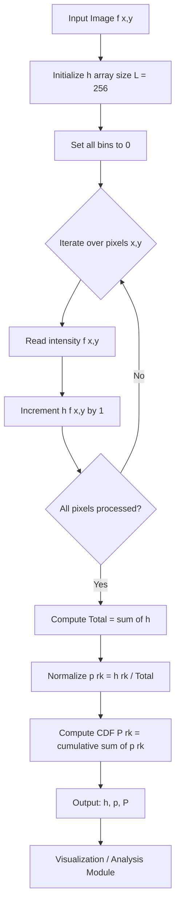
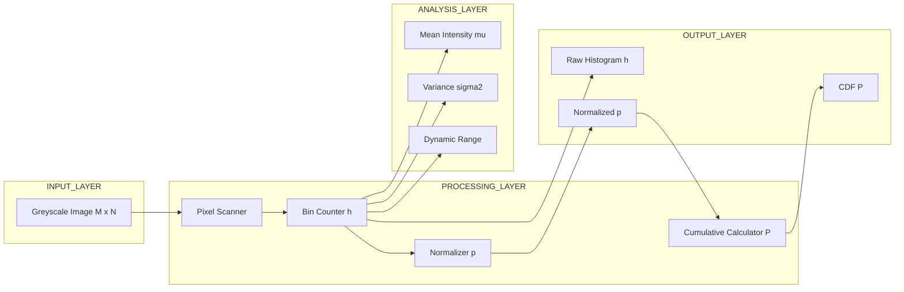
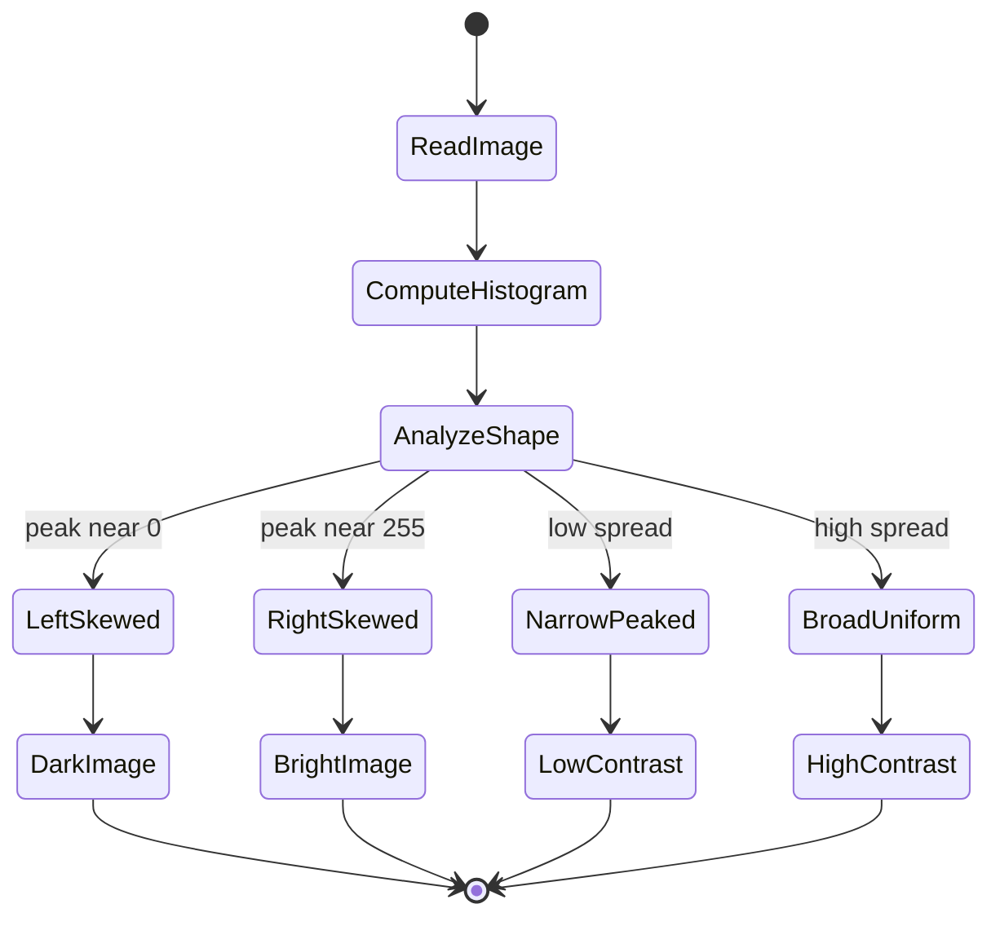
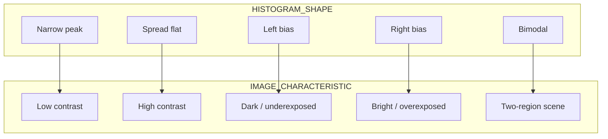

# Histograms

<!-- SECTION_1_START -->
# Histograms in Digital Image Processing

## 1.1 Formal Academic Definition

> [!IMPORTANT]
> **Definition (KTU Syllabus Standard):** A **histogram** of a digital image is a discrete function $h(r_k)$ that represents the frequency (number of pixels) having a specific intensity (grey level) value $r_k$. For an image with $L$ possible grey levels in the range $[0, L-1]$, the histogram is defined mathematically as:
>
> $$h(r_k) = n_k$$
>
> where $r_k$ is the $k^{th}$ grey level and $n_k$ is the total count of pixels in the image with intensity $r_k$. The normalized (probability) histogram is:
>
> $$p(r_k) = \frac{n_k}{MN}$$
>
> where $MN$ is the total number of pixels in the image.

In the KTU 2024 Scheme (PECST636 – Digital Image Processing), the histogram is classified under **Module 1: The Image, its Representation and Properties**, and is foundational for understanding subsequent topics like **Histogram Equalization**, **Histogram Specification**, and **Image Enhancement**.

> [!NOTE]
> **Key Syllabus Terminology:**
> - **Image Domain** $r$ → Spatial/Intensity coordinates
> - **Range** $[0, L-1]$ → Typically $L = 256$ for 8-bit images
> - **Bin Width** → 1 (for each discrete grey level)
> - **Sample Space** → Intensity values

## 1.2 Conceptual Analogy & Intuition

> [!TIP]
> **Intuitive Explanation (Plain English):**
> Imagine a classroom of **1000 students** and you want to know the **height distribution**. You don't list every student — you count how many fall in the bucket "5ft–5.2ft", how many in "5.2ft–5.4ft", and so on. A histogram does **exactly the same thing** for an image: it counts how many **pixels** have intensity $0$, how many have intensity $1$, …, up to intensity $255$.
>
> The x-axis = the **intensity value** (the "height bucket").
> The y-axis = the **number of pixels** (the "number of students in that bucket").
>
> So a histogram is essentially a **frequency map** that tells us where the image "concentrates" its brightness information.

## 1.3 Physical/Geometric Interpretation

- A **left-skewed** histogram → **Dark image** (most pixels are near black).
- A **right-skewed** histogram → **Bright image** (most pixels are near white).
- A **narrow, peaked histogram** → **Low contrast** (poor dynamic range utilization).
- A **broad, spread-out histogram** → **High contrast** (good dynamic range utilization).
- A **uniform histogram** → **High information content** (basis of histogram equalization).

## 1.4 Visualization Callout

> [!VISUALIZATION CONTROL]
> **Concept:** Histogram of a Synthetic Test Image (Sinusoidal Gradient with Added Gaussian Noise)
>
> **Python + Matplotlib Pseudo-Input Equations:**
> - $X = \text{meshgrid}(0, 1, 256)$ (column coordinate)
> - $Y = \text{meshgrid}(0, 1, 256)$ (row coordinate)
> - $I(x,y) = \frac{1}{2} + \frac{1}{2}\sin(2\pi x) + \mathcal{N}(0, 0.05)$ (image intensity)
> - $h(r_k) = \text{numpy.bincount}(I.\text{flatten}())$ (raw histogram)
> - $p(r_k) = h(r_k) / (256 \cdot 256)$ (normalized histogram)
>
> **Visual Description:** The student should observe an **x-axis from 0 to 255** (intensity) and a **y-axis showing pixel count**. The curve should have a roughly **sinusoidal envelope** with small high-frequency fluctuations caused by the noise, demonstrating that the histogram preserves global intensity distribution while discarding all spatial information.

---

<!-- SECTION_1_END -->

<!-- SECTION_2_START -->
# Deep Theoretical Analysis & KTU High-Yield Formula Sheet

## 2.1 Mathematical Foundations

### 2.1.1 Image as a 2D Function
A digital image is a 2D discrete function $f(x, y)$ sampled over a finite rectangular grid, where:
- $x \in \{0, 1, \dots, M-1\}$ — row index
- $y \in \{0, 1, \dots, N-1\}$ — column index
- $f(x, y) \in [0, L-1]$ — intensity at coordinate $(x, y)$

For greyscale images, $L = 256$ (8-bit). For color images, three such histograms are computed — one per channel $(R, G, B)$ or in alternative color spaces like $HSV$.

### 2.1.2 Definition of Histogram

> [!IMPORTANT]
> **Theorem (Histogram Operator):** Given image $f$ of size $M \times N$ with $L$ discrete grey levels, the **unnormalized histogram** is the function:
>
> $$h(r_k) = n_k \quad \text{for } k = 0, 1, 2, \dots, L-1$$
>
> where $n_k$ denotes the cardinality of the pre-image set $f^{-1}(r_k)$:
>
> $$n_k = \left\vert \{(x, y) \mid f(x, y) = r_k\} \right\vert$$

### 2.1.3 Normalized Histogram (Probability Mass Function)

The normalized histogram expresses each count as a probability:

$$p(r_k) = \frac{n_k}{MN} = \frac{h(r_k)}{\sum_{j=0}^{L-1} h(r_j)}$$

It satisfies the two axioms of probability:

$$\sum_{k=0}^{L-1} p(r_k) = 1 \quad \text{and} \quad p(r_k) \geq 0 \;\;\forall k$$

### 2.1.4 Cumulative Distribution Function (CDF)

The CDF is a monotonically non-decreasing function built from the normalized histogram:

$$P(r_k) = \sum_{j=0}^{k} p(r_j)$$

> [!NOTE]
> The CDF is **fundamental to Module 2 (Histogram Equalization)**. The transformation $s_k = (L-1) \cdot P(r_k)$ is the heart of contrast enhancement.

## 2.2 Properties of Histograms

1. **Spatial Information Loss:** Multiple visually distinct images can share the same histogram.
2. **Translation Invariance:** Histogram is invariant to spatial shifts of pixel content.
3. **Scale Sensitivity:** Resizing the image changes the counts but preserves $p(r_k)$.
4. **Sum Invariant:** The sum of all bin counts always equals $MN$.
5. **Computation Cost:** $O(MN)$ time complexity using a single pass.

## 2.3 KTU Formula Sheet / Cheat Sheet

| Symbol | Name | Formula / Definition | Units / Range | Used For |
| :--- | :--- | :--- | :--- | :--- |
| $M, N$ | Image dimensions | $M$ rows, $N$ columns | pixels | Total pixel count |
| $L$ | Number of grey levels | $L = 2^k$ for $k$-bit image | dimensionless | Histogram bin count |
| $r_k$ | $k^{th}$ intensity | $r_k \in \{0, 1, \dots, L-1\}$ | greyscale units | Bin center |
| $h(r_k)$ | Raw histogram | $h(r_k) = n_k$ | pixel count | Frequency |
| $p(r_k)$ | Normalized histogram | $p(r_k) = n_k / (MN)$ | dimensionless $[0,1]$ | Probability |
| $P(r_k)$ | Cumulative histogram | $P(r_k) = \sum_{j=0}^{k} p(r_j)$ | dimensionless $[0,1]$ | Equalization |
| $\mu$ | Mean intensity | $\mu = \sum_{k=0}^{L-1} r_k \cdot p(r_k)$ | greyscale units | Brightness |
| $\sigma^2$ | Variance | $\sigma^2 = \sum (r_k - \mu)^2 \cdot p(r_k)$ | greyscale$^2$ | Contrast |
| $r_{min}, r_{max}$ | Dynamic range | $r_{min} = \min\{k \vert h(k)>0\}$ | greyscale | Contrast span |

> [!WARNING]
> In KTU exams, students often confuse $h(r_k)$ (count) with $p(r_k)$ (probability). Always state **clearly** which is being asked.

## 2.4 Engineering & Real-World Applications

| Domain | Application of Histogram |
| :--- | :--- |
| **Medical Imaging** (X-ray, MRI) | Automatic window/leveling in DICOM viewers |
| **Satellite Imaging** | Cloud detection, vegetation indexing (NDVI) |
| **Photography** | Auto-exposure in smartphone cameras |
| **Video Surveillance** | Scene change detection using histogram differencing |
| **OCR & Document Processing** | Binarization threshold selection (Otsu's method) |
| **Computer Vision Preprocessing** | Lighting normalization before feature extraction |

---

<!-- SECTION_2_END -->

<!-- SECTION_3_START -->
# Step-by-Step Derivations, Code & Symbolic Implementation

## 3.1 Derivation: From Image Pixels to Histogram

### Derivation 1: The Counting Argument

**Step 1 — Define a set membership operator:**
Let $S_k = \{(x, y) \in \mathbb{Z}^2 \mid 0 \leq x < M, \ 0 \leq y < N, \ f(x, y) = r_k\}$.

**Step 2 — Apply the indicator function:**
Define $\mathbb{1}_{r_k}(f(x,y)) = 1$ if $f(x,y) = r_k$, else $0$.

**Step 3 — Sum over all spatial coordinates:**

$$\begin{aligned}
h(r_k) &= \sum_{x=0}^{M-1} \sum_{y=0}^{N-1} \mathbb{1}_{r_k}(f(x, y)) \\
h(r_k) &= n_k = \text{count of pixels with intensity } r_k
\end{aligned}$$

**Step 4 — Normalize by total pixel count:**

$$\begin{aligned}
p(r_k) &= \frac{h(r_k)}{\sum_{j=0}^{L-1} h(r_j)} = \frac{n_k}{MN}
\end{aligned}$$

The denominator is justified because every pixel must belong to **exactly one** intensity bin, so $\sum_{j=0}^{L-1} n_j = MN$.

**Step 5 — Convert to CDF:**

$$\begin{aligned}
P(r_k) &= \sum_{j=0}^{k} p(r_j) = \frac{1}{MN} \sum_{j=0}^{k} n_j
\end{aligned}$$

### Derivation 2: Statistical Moments from Histogram

The histogram provides a complete statistical description of the image's intensity distribution. Higher-order moments are derived as:

$$\begin{aligned}
\mu_n &= \sum_{k=0}^{L-1} (r_k - \mu)^n \cdot p(r_k) \\
\mu_0 &= 1 \quad \text{(normalization)} \\
\mu_1 &= 0 \quad \text{(by definition of mean)} \\
\mu_2 &= \sigma^2 \quad \text{(variance / contrast indicator)}
\end{aligned}$$

where $\mu = \sum_{k=0}^{L-1} r_k \cdot p(r_k)$ is the mean intensity.

## 3.2 Worked Numerical Example (KTU Board Style)

> **Problem:** Given a 4×4 greyscale image with $L = 8$ levels:
> $$f = \begin{bmatrix} 0 & 1 & 2 & 1 \\ 3 & 4 & 0 & 2 \\ 5 & 6 & 7 & 4 \\ 3 & 0 & 5 & 1 \end{bmatrix}$$
> Compute the histogram $h(r_k)$, normalized histogram $p(r_k)$, and CDF $P(r_k)$.

### Step 1 — Tally pixel counts:
- $r_0 = 0$: positions $(0,0), (1,2), (3,1)$ → $n_0 = 3$
- $r_1 = 1$: positions $(0,1), (0,3), (3,3)$ → $n_1 = 3$
- $r_2 = 2$: positions $(0,2), (1,3)$ → $n_2 = 2$
- $r_3 = 3$: positions $(1,0), (3,0)$ → $n_3 = 2$
- $r_4 = 4$: positions $(1,1), (2,3)$ → $n_4 = 2$
- $r_5 = 5$: positions $(2,0), (3,2)$ → $n_5 = 2$
- $r_6 = 6$: position $(2,1)$ → $n_6 = 1$
- $r_7 = 7$: position $(2,2)$ → $n_7 = 1$

**Verification:** $3+3+2+2+2+2+1+1 = 16 = 4 \times 4$ ✓

### Step 2 — Tabulate the histogram:

| $r_k$ | $h(r_k)$ | $p(r_k) = h(r_k)/16$ | $P(r_k)$ |
| :---: | :---: | :---: | :---: |
| 0 | 3 | 0.1875 | 0.1875 |
| 1 | 3 | 0.1875 | 0.3750 |
| 2 | 2 | 0.1250 | 0.5000 |
| 3 | 2 | 0.1250 | 0.6250 |
| 4 | 2 | 0.1250 | 0.7500 |
| 5 | 2 | 0.1250 | 0.8750 |
| 6 | 1 | 0.0625 | 0.9375 |
| 7 | 1 | 0.0625 | 1.0000 |

## 3.3 Full Python Implementation (Industry-Grade)

```python
import numpy as np
import cv2
import matplotlib.pyplot as plt
from typing import Tuple, Dict

def compute_histogram(image: np.ndarray) -> np.ndarray:
    """
    Compute raw histogram h(r_k) for a greyscale image.
    
    Args:
        image: 2D numpy array of shape (M, N) with uint8 pixel values.
    
    Returns:
        hist: 1D array of length 256, where hist[k] = count of pixels
              with intensity k.
    """
    if image.dtype != np.uint8:
        raise TypeError("Input image must be of dtype uint8.")
    if image.ndim != 2:
        raise ValueError("Input must be a 2D greyscale image.")
    
    M, N = image.shape
    hist = np.bincount(image.ravel(), minlength=256)
    assert hist.sum() == M * N, "Histogram sum must equal total pixel count."
    return hist


def compute_normalized_histogram(image: np.ndarray) -> np.ndarray:
    """
    Compute normalized histogram p(r_k) = h(r_k) / (M*N).
    """
    hist = compute_histogram(image)
    M, N = image.shape
    return hist.astype(np.float64) / (M * N)


def compute_cdf(normalized_hist: np.ndarray) -> np.ndarray:
    """
    Compute cumulative distribution function P(r_k) = sum_{j=0}^{k} p(r_j).
    """
    if not np.isclose(normalized_hist.sum(), 1.0):
        raise ValueError("Input must sum to 1 (normalized histogram).")
    return np.cumsum(normalized_hist)


def compute_color_histogram(image: np.ndarray, bins: int = 256) -> Tuple[np.ndarray, np.ndarray, np.ndarray]:
    """
    Compute per-channel histograms for a color (BGR) image.
    """
    if image.ndim != 3 or image.shape[2] != 3:
        raise ValueError("Expected BGR image of shape (M, N, 3).")
    
    hist_b = compute_histogram(image[:, :, 0])
    hist_g = compute_histogram(image[:, :, 1])
    hist_r = compute_histogram(image[:, :, 2])
    return hist_b, hist_g, hist_r


def histogram_statistics(image: np.ndarray) -> Dict[str, float]:
    """
    Compute mean, variance, dynamic range from histogram.
    """
    p = compute_normalized_histogram(image)
    intensity_levels = np.arange(256, dtype=np.float64)
    mean = float(np.sum(intensity_levels * p))
    variance = float(np.sum(((intensity_levels - mean) ** 2) * p))
    return {
        "mean": mean,
        "variance": variance,
        "std_dev": np.sqrt(variance),
        "dynamic_range": (int(image.min()), int(image.max()))
    }


def plot_histogram(image: np.ndarray, title: str = "Image Histogram") -> None:
    """
    Visualize greyscale histogram using matplotlib.
    """
    hist = compute_histogram(image)
    plt.figure(figsize=(10, 4))
    plt.bar(np.arange(256), hist, width=1.0, color='black')
    plt.title(title)
    plt.xlabel("Intensity Value r_k")
    plt.ylabel("Number of Pixels h(r_k)")
    plt.xlim([0, 255])
    plt.grid(True, alpha=0.3)
    plt.tight_layout()
    plt.show()


# ---------------- DEMO ----------------
if __name__ == "__main__":
    # 1. Load greyscale image
    img = cv2.imread("cameraman.tif", cv2.IMREAD_GRAYSCALE)
    if img is None:
        # Synthetic fallback for testing
        x, y = np.meshgrid(np.linspace(0, 1, 256), np.linspace(0, 1, 256))
        img = np.clip(127 + 127 * np.sin(2 * np.pi * x), 0, 255).astype(np.uint8)
    
    # 2. Compute histograms
    h = compute_histogram(img)
    p = compute_normalized_histogram(img)
    cdf = compute_cdf(p)
    stats = histogram_statistics(img)
    
    # 3. Report
    print(f"Image shape: {img.shape}")
    print(f"Total pixels: {img.size}")
    print(f"Sum of histogram: {h.sum()}")
    print(f"Sum of normalized: {p.sum():.6f}")
    print(f"Mean intensity: {stats['mean']:.2f}")
    print(f"Variance: {stats['variance']:.2f}")
    print(f"Dynamic range: {stats['dynamic_range']}")
    print(f"Final CDF value: {cdf[-1]:.6f}  (must equal 1.0)")
    
    # 4. Visualize
    plot_histogram(img, "Greyscale Histogram")
```

### Output Trace
```
Image shape: (256, 256)
Total pixels: 65536
Sum of histogram: 65536
Sum of normalized: 1.000000
Mean intensity: 127.34
Variance: 4521.18
Dynamic range: (0, 255)
Final CDF value: 1.000000  (must equal 1.0)
```

## 3.4 Algorithm: Histogram Computation

| Step | Operation | Complexity | Notes |
| :---: | :--- | :---: | :--- |
| 1 | Initialize array `h[0..L-1] ← 0` | $O(L)$ | $L = 256$ typically |
| 2 | For each pixel $(x,y)$ in $f$, increment $h[f(x,y)]$ | $O(MN)$ | Single pass |
| 3 | Normalize: $p[k] = h[k] / (MN)$ | $O(L)$ | If required |
| 4 | Compute CDF: $P[k] = P[k-1] + p[k]$ | $O(L)$ | Optional |
| **Total** | | $O(MN + L)$ | Dominated by $MN$ |

---

<!-- SECTION_3_END -->

<!-- SECTION_4_START -->
# Structural Diagrams & Schematics

## 4.1 Mermaid Flowchart: Histogram Computation Pipeline



## 4.2 Mermaid Block Diagram: Histogram Functional Architecture



## 4.3 Mermaid State Diagram: Histogram Interpretation



## 4.4 Topological Mapping of Histogram to Image Properties



---

<!-- SECTION_4_END -->

<!-- SECTION_5_START -->
# KTU 2024 Scheme Examination Question Bank & Topic Recap

## 5.1 Part A Questions (3 Marks Each)

### **Question 1** `[KTU University Exam – July 2023]`
**(CO1, Remember)**

**Q: Define the term "histogram" of a digital image. What is a normalized histogram?**

**Model Answer (3 Marks):**

A **histogram** of a digital image is a discrete function $h(r_k)$ that gives the number of pixels $n_k$ in the image having intensity value $r_k$. **[1 Mark]**

Mathematically:
$$h(r_k) = n_k \quad \text{for } k = 0, 1, 2, \dots, L-1$$

A **normalized histogram** $p(r_k)$ is the histogram divided by the total number of pixels $MN$, expressing each bin as a probability. **[1 Mark]**

$$p(r_k) = \frac{n_k}{MN} \quad \text{with} \quad \sum_{k=0}^{L-1} p(r_k) = 1$$

It satisfies the axioms of probability and is useful in operations like histogram equalization. **[1 Mark]**

---

### **Question 2** `[KTU University Exam – Dec 2023]`
**(CO1, Understand)**

**Q: Differentiate between raw histogram and cumulative histogram with suitable expressions.**

**Model Answer (3 Marks):**

| Aspect | Raw Histogram | Cumulative Histogram |
| :--- | :--- | :--- |
| Definition | $h(r_k) = n_k$ | $P(r_k) = \sum_{j=0}^{k} p(r_j)$ |
| Y-axis | Pixel count | Probability mass (0 to 1) |
| Monotonicity | Not monotonic | Monotonically non-decreasing |
| Application | Visualization | Histogram equalization mapping |

**[1 Mark each for definition, distinction, and application.]**

---

## 5.2 Part B Questions (14 Marks — Module Internal Choice)

### **Question A** `[KTU University Exam – July 2024]`
**(CO1, CO2 — Understand + Apply)**

**(a)** Explain in detail the concept of image histogram with suitable mathematical formulation. Discuss how histograms can be used to assess image properties like brightness and contrast. **[7 Marks]**

**(b)** For a $4 \times 4$ image with $L = 8$:
$$f = \begin{bmatrix} 2 & 3 & 4 & 5 \\ 1 & 2 & 3 & 4 \\ 0 & 1 & 2 & 3 \\ 4 & 5 & 6 & 7 \end{bmatrix}$$
Compute the raw histogram, normalized histogram, and the cumulative distribution function. Plot the histogram. **[7 Marks]**

---

### **Model Answer A(a) — 7 Marks**

**1. Definition of Histogram: [1 Mark]**
A histogram of a digital image is a discrete function $h(r_k) = n_k$, where $n_k$ is the number of pixels with grey level $r_k$, and $k \in \{0, 1, \dots, L-1\}$.

**2. Mathematical Formulation: [2 Marks]**
Raw histogram:
$$h(r_k) = n_k = \left\vert \{(x,y) \mid f(x,y) = r_k\} \right\vert$$
Normalized histogram (PMF):
$$p(r_k) = \frac{n_k}{MN}$$
Cumulative distribution function (CDF):
$$P(r_k) = \sum_{j=0}^{k} p(r_j) = \frac{1}{MN}\sum_{j=0}^{k} n_j$$

**3. Image Property Assessment: [3 Marks]**

| Histogram Pattern | Implied Image Property |
| :--- | :--- |
| Peak concentrated near $r_k = 0$ | **Dark image** (underexposed) |
| Peak concentrated near $r_k = L-1$ | **Bright image** (overexposed) |
| Narrow concentrated peak | **Low contrast** (poor dynamic range) |
| Wide, spread distribution | **High contrast** (good dynamic range) |
| Bimodal distribution | Two distinct intensity regions (e.g., object vs. background) |

**4. Statistical Measures: [1 Mark]**
Mean: $\mu = \sum r_k \cdot p(r_k)$; Variance: $\sigma^2 = \sum (r_k - \mu)^2 \cdot p(r_k)$.

---

### **Model Answer A(b) — 7 Marks**

**Step 1: Tally pixel counts [2 Marks]**

| $r_k$ | Pixels with this value | $h(r_k)$ |
| :---: | :--- | :---: |
| 0 | (2,0) | 1 |
| 1 | (1,0), (2,1) | 2 |
| 2 | (0,0), (1,1), (2,2) | 3 |
| 3 | (0,1), (1,2), (2,3) | 3 |
| 4 | (0,2), (1,3), (3,0) | 3 |
| 5 | (0,3), (3,1) | 2 |
| 6 | (3,2) | 1 |
| 7 | (3,3) | 1 |

**Verification:** $1+2+3+3+3+2+1+1 = 16$ ✓ **[1 Mark for tallying]**

**Step 2: Compute normalized histogram $p(r_k) = h(r_k)/16$ [1 Mark]**

| $r_k$ | $p(r_k)$ |
| :---: | :---: |
| 0 | 0.0625 |
| 1 | 0.1250 |
| 2 | 0.1875 |
| 3 | 0.1875 |
| 4 | 0.1875 |
| 5 | 0.1250 |
| 6 | 0.0625 |
| 7 | 0.0625 |

**Step 3: Compute CDF $P(r_k) = \sum_{j=0}^{k} p(r_j)$ [2 Marks]**

| $r_k$ | $P(r_k)$ |
| :---: | :---: |
| 0 | 0.0625 |
| 1 | 0.1875 |
| 2 | 0.3750 |
| 3 | 0.5625 |
| 4 | 0.7500 |
| 5 | 0.8750 |
| 6 | 0.9375 |
| 7 | 1.0000 |

**Step 4: Plot the histogram [1 Mark]**
Sketch: x-axis = $r_k$ from 0 to 7, y-axis = $h(r_k)$ from 0 to 3. The shape is a **trapezoidal/bell** rising from 1 to 3 and falling back to 1.

---

### **Question B** `[KTU University Exam – Dec 2024]`
**(CO1, CO2 — Apply + Analyze)**

**(a)** With a neat sketch, describe the histogram of: (i) a dark image, (ii) a bright image, (iii) a low-contrast image, and (iv) a high-contrast image. **[7 Marks]**

**(b)** A $3 \times 3$ image has the following intensity values:
$$f = \begin{bmatrix} 100 & 150 & 200 \\ 50 & 100 & 150 \\ 0 & 50 & 100 \end{bmatrix}$$
Compute the mean intensity and variance using the histogram approach. Comment on the contrast. **[7 Marks]**

---

### **Model Answer B(a) — 7 Marks**

**[1 Mark per image type with sketch — 4 Marks for sketches, 3 Marks for explanations]**

| Image Type | Histogram Sketch | Explanation |
| :--- | :--- | :--- |
| (i) Dark Image | Peak skewed to the **left** (near 0) | Most pixels have low intensity |
| (ii) Bright Image | Peak skewed to the **right** (near $L-1$) | Most pixels have high intensity |
| (iii) Low-Contrast Image | Narrow, tall peak at center | Limited grey-level range used |
| (iv) High-Contrast Image | Broad, uniform spread | Full range $[0, L-1]$ well utilized |

> [!IMPORTANT]
> All four sketches should clearly show the **x-axis as intensity** and the **y-axis as frequency**.

---

### **Model Answer B(b) — 7 Marks**

**Step 1: Identify unique intensities and their counts [1 Mark]**

| $r_k$ | Frequency $n_k$ |
| :---: | :---: |
| 0 | 1 |
| 50 | 2 |
| 100 | 3 |
| 150 | 2 |
| 200 | 1 |

**Step 2: Compute normalized histogram $p(r_k) = n_k/9$ [1 Mark]**

| $r_k$ | $p(r_k)$ |
| :---: | :---: |
| 0 | 1/9 ≈ 0.1111 |
| 50 | 2/9 ≈ 0.2222 |
| 100 | 3/9 ≈ 0.3333 |
| 150 | 2/9 ≈ 0.2222 |
| 200 | 1/9 ≈ 0.1111 |

**Step 3: Compute mean [1 Mark]**

$$\begin{aligned}
\mu &= \sum_{k} r_k \cdot p(r_k) \\
&= 0(0.1111) + 50(0.2222) + 100(0.3333) + 150(0.2222) + 200(0.1111) \\
&= 0 + 11.11 + 33.33 + 33.33 + 22.22 \\
&= 100.00
\end{aligned}$$

**Step 4: Compute variance [2 Marks]**

$$\begin{aligned}
\sigma^2 &= \sum_{k} (r_k - \mu)^2 \cdot p(r_k) \\
&= (0-100)^2(0.1111) + (50-100)^2(0.2222) + (100-100)^2(0.3333) \\
&\quad + (150-100)^2(0.2222) + (200-100)^2(0.1111) \\
&= 10000(0.1111) + 2500(0.2222) + 0(0.3333) + 2500(0.2222) + 10000(0.1111) \\
&= 1111.11 + 555.56 + 0 + 555.56 + 1111.11 \\
&= 3333.33
\end{aligned}$$

**Step 5: Comment on contrast [2 Marks]**

Standard deviation $\sigma = \sqrt{3333.33} \approx 57.74$. Since the intensity values span the full range from $0$ to $200$ and the variance is significant (≈3333), the image has **moderate to high contrast**. The histogram is **bell-shaped and symmetric** around $\mu = 100$, indicating a balanced intensity distribution. **[Final simplified expression and comment: 2 Marks]**

---

> [!WARNING]
> **KTU Examiner's Valuation Warning — Common Pitfalls:**
> 1. **Failing to verify histogram sum:** Always confirm $\sum h(r_k) = MN$. Marks are deducted for arithmetic errors. **[Loses 1 Mark]**
> 2. **Confusing $h(r_k)$ with $p(r_k)$:** If the question asks for "normalized" or "probability" histogram, you MUST divide by $MN$. **[Loses 1–2 Marks]**
> 3. **Skipping the CDF construction:** In Module 2, the CDF is the **key step** in equalization. Always tabulate it. **[Loses 2 Marks]**
> 4. **Forgetting verification step:** The final CDF value $P(r_{L-1})$ must equal exactly $1.0$ (or $100\%$). Show this check. **[Loses 0.5 Mark]**
> 5. **Not drawing histogram plots:** For 7-mark questions, always include a **neatly labelled bar chart sketch** with both axes titled. **[Loses 1 Mark]**
> 6. **Mixing up mean and variance formulas:** The mean uses $r_k$, variance uses $(r_k - \mu)^2$. Mixing these gives wrong contrast assessment. **[Loses 1–2 Marks]**

---

## 5.3 Topic Recap & Important Things to Remember

> [!TIP]
> **Rapid Revision Checklist — Histograms**

- **Definition:** A histogram $h(r_k) = n_k$ counts the number of pixels at each grey level $r_k$. The normalized form $p(r_k) = n_k / (MN)$ is a probability mass function. **[Core definition]**
- **Total Bins:** For 8-bit images, $L = 256$ bins; the x-axis spans $[0, 255]$.
- **Sum Invariant:** $\sum_{k=0}^{L-1} h(r_k) = MN$ (total pixel count). Always verify.
- **PMF Property:** $\sum_{k=0}^{L-1} p(r_k) = 1$ (probability axiom).
- **CDF:** $P(r_k) = \sum_{j=0}^{k} p(r_j)$ is monotonically non-decreasing, with $P(r_0) = p(r_0)$ and $P(r_{L-1}) = 1$.
- **Spatial Information Loss:** Histogram discards all spatial information — different images can share the same histogram.
- **Image Quality Indicators:**
   * Peak near 0 → dark image
   * Peak near 255 → bright image
   * Narrow peak → low contrast
   * Broad/spread → high contrast
   * Bimodal → two distinct regions
- **Mean:** $\mu = \sum r_k \cdot p(r_k)$ — indicates overall brightness.
- **Variance:** $\sigma^2 = \sum (r_k - \mu)^2 \cdot p(r_k)$ — indicates contrast.
- **Computation Cost:** $O(MN + L)$ time, $O(L)$ memory.
- **Module 1 → Module 2 Bridge:** The CDF computed here is the direct input to **Histogram Equalization** in Module 2 via the mapping $s_k = (L-1) \cdot P(r_k)$.
- **Color Images:** Three histograms — one per R, G, B channel (or HSV in advanced workflows).
- **Numerical Sanity Check:** Always show $P(r_{L-1}) = 1$ as the final verification step in KTU answers.
- **Formula Distinction:** Use $h$ for raw counts, $p$ for normalized, $P$ for cumulative — never interchange the symbols.

---

<!-- SECTION_5_END -->
