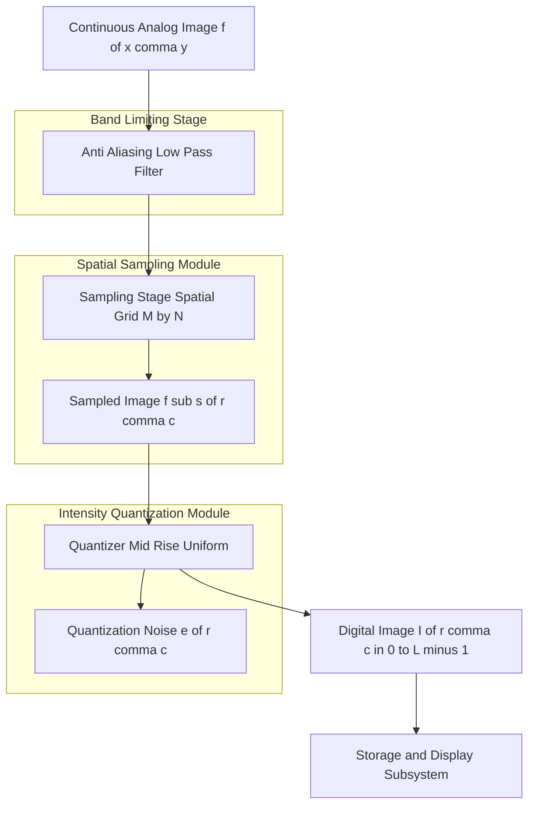

# Image digitization

<!-- SECTION_1_START -->

# Module 1 — Image Digitization

## 1.1 Formal Definition (KTU 2024 Syllabus Terminology)

**Image Digitization** is the mathematical and signal-processing procedure of converting a continuous-tone, spatially continuous image $f(x,y)$ (where $x$ and $y$ are real-valued spatial coordinates and $f$ takes continuous amplitude values) into a finite, discrete digital image $I[r,c]$ (where $r$ and $c$ are integer row and column indices) that can be stored, processed, and displayed by a digital computer.

> [!IMPORTANT]
> **KTU 2024 Definition (Verbatim Standard):** *Digitization is the process of converting a continuous analog image $f(x,y)$ into a discrete digital form through two fundamental sub-processes: **Sampling** (discretization of spatial coordinates) and **Quantization** (discretization of intensity values).*

The two sequential sub-processes are:

1. **Sampling** — Discretization of the continuous spatial domain $(x,y) \in \mathbb{R}^2$ into a finite grid of integer coordinates $(r,c) \in \mathbb{Z}^2$.
2. **Quantization** — Mapping the continuous intensity range $[0, f_{max}]$ into a finite set of $L$ discrete gray levels, typically $L = 2^k$, where $k$ is the number of bits per pixel (bpp).

> [!NOTE]
> The standard metric in KTU evaluation is **Spatial Resolution** ($M \times N$ pixels) and **Gray-level Resolution** ($k$ bits per pixel, giving $L = 2^k$ intensity levels). **Storage Size** in bits is given by the KTU-golden formula $b = M \times N \times k$.

---

## 1.2 Conceptual Analogy & Intuitive Overview

Imagine you are photographing a beautiful sunset and want to recreate it using **mosaic tiles**:

- **Sampling** is like deciding *how many tiles* your mosaic will use. A mosaic with $100 \times 100$ tiles captures more spatial detail than one with $10 \times 10$ tiles.
- **Quantization** is like deciding *how many distinct colors* each tile can be. If you have only $L = 2$ colors (black and white), the mosaic is crude. With $L = 256$ colors, the mosaic is rich and lifelike.

If the tiles are **too few** (undersampling) → the sunset loses its soft gradients and turns into a *staircase pattern* (this is called **aliasing**).
If the colors are **too few** (coarse quantization) → smooth cloud tones become *visible bands* of color (this is called **false contouring**).

> [!TIP]
> **Key Intuition:** *Sampling controls spatial detail; Quantization controls tonal depth.* Both must be balanced — overspending bits on one at the expense of the other is wasteful.

---

## 1.3 Geometric Visualization (GeoGebra / Desmos)

> [!VISUALIZATION CONTROL]
> **Concept:** 1-D Sampling and Quantization of a Continuous Sinusoidal Signal $f(x) = \sin(2\pi x) + 1$
>
> **GeoGebra / Desmos Input Equations:**
> * `f(x) = sin(2 * pi * x) + 1` (Continuous analog waveform)
> * `g(x) = floor(8 * f(x)) / 8` (Quantized version with $L = 16$ levels, i.e. $k = 4$ bits)
> * Sample points: $(n \cdot \Delta, f(n \cdot \Delta))$ for $n = 0, 1, 2, \ldots, 20$ and $\Delta = 0.1$
>
> **Visual Description:** The student should observe that the continuous sine curve is replaced by *discrete dots* (samples) at horizontal intervals of $\Delta$, and each dot's vertical height is snapped to the nearest *horizontal gridline* (quantization step). As $\Delta$ decreases, samples become denser; as $L$ increases, horizontal gridlines become finer, and the staircase hugs the original curve more closely.

---

## 1.4 Mathematical Model of Digitization

A continuous image is modeled as a continuous function:

$$f : \mathbb{R}^2 \rightarrow \mathbb{R}, \quad (x,y) \mapsto f(x,y)$$

After digitization, the image becomes a discrete matrix:

$$I : \{0, 1, \ldots, M-1\} \times \{0, 1, \ldots, N-1\} \rightarrow \{0, 1, \ldots, L-1\}$$

with the formal relation:

$$I[r,c] = Q \left( f(r \cdot \Delta x, \ c \cdot \Delta y) \right)$$

where $Q(\cdot)$ is the quantizer operator, $\Delta x$ is the horizontal sampling pitch, and $\Delta y$ is the vertical sampling pitch.

<!-- SECTION_1_END -->

<!-- SECTION_2_START -->

# 2. Deep Theoretical Analysis & KTU High-Yield Formula Sheet

## 2.1 The Two-Pillar Architecture of Digitization

Digitization is *strictly sequential* — **sampling always precedes quantization**. A continuous image is first discretized in space, then each spatial sample is discretized in intensity.

### Pillar 1: Sampling (Spatial Discretization)

1. The continuous spatial domain is partitioned into a regular Cartesian grid of $M \times N$ points.
2. The sampling intervals $\Delta x$ and $\Delta y$ determine the *spatial resolution*.
3. The sampled image values are obtained by:
   $$f_s(r, c) = f(r \cdot \Delta x, \ c \cdot \Delta y), \quad 0 \le r \le M-1, \ 0 \le c \le N-1$$
4. To prevent **aliasing**, the sampling frequency must satisfy the **Nyquist–Shannon Sampling Theorem**:
   $$\Delta x \le \frac{1}{2 f_{max}^{x}} \quad \text{and} \quad \Delta y \le \frac{1}{2 f_{max}^{y}}$$
5. In practice, a low-pass **anti-aliasing filter** is applied to $f(x,y)$ before sampling to band-limit its spectrum within the Nyquist frequency.

> [!NOTE]
> **Aliasing** in images manifests as *Moiré patterns* (when sampling fine repetitive textures), *staircase edges* (called *jaggies*), and loss of high-frequency detail. It is *irreversible* — once high-frequency content aliases into a lower frequency, it cannot be recovered.

### Pillar 2: Quantization (Intensity Discretization)

1. Each sampled real value $f_s(r,c) \in [0, f_{max}]$ is mapped to one of $L$ discrete levels via a quantizer $Q(\cdot)$.
2. The number of levels is universally a power of two: $L = 2^k$, where $k$ is the bit-depth.
3. The **quantization step size** is:
   $$\Delta q = \frac{f_{max}}{L - 1} = \frac{f_{max}}{2^k - 1}$$
4. The **quantization error** (also called quantization noise) for any sample is:
   $$e(r,c) = f_s(r,c) - I[r,c]$$
5. This error is bounded by $\vert e(r,c) \vert \le \frac{\Delta q}{2}$ for mid-rise uniform quantizers.

> [!IMPORTANT]
> **Standard KTU Bit-Depths to Memorize:**
> * **Binary:** $L = 2$, $k = 1$ bit
> * **Grayscale:** $L = 256$, $k = 8$ bits (the *de facto* standard)
> * **Medical/Scientific:** $L = 4096$, $k = 12$ bits
> * **High Dynamic Range:** $L = 65536$, $k = 16$ bits

---

## 2.2 KTU High-Yield Formula Sheet

> [!IMPORTANT]
> **Exam Tip:** Memorize this table — it covers 90 % of the numerical problems asked in KTU Module 1 of DIP.

| # | Quantity | Formula | Units / Typical Value | Remarks |
|---|----------|---------|------------------------|---------|
| 1 | Total pixels | $P = M \times N$ | pixels | $M$ = rows, $N$ = columns |
| 2 | Number of gray levels | $L = 2^k$ | dimensionless | $k$ = bits per pixel |
| 3 | Storage size in bits | $b = M \times N \times k$ | bits | Divide by 8 for bytes |
| 4 | Storage size in bytes | $B = M \cdot N \cdot k / 8$ | bytes | KB = $B/1024$ |
| 5 | Sampling pitch (Nyquist) | $\Delta \le 1 / (2 f_{max})$ | meters / pixel | $f_{max}$ in cycles/m |
| 6 | Quantization step | $\Delta q = f_{max} / (2^k - 1)$ | intensity units | mid-rise quantizer |
| 7 | Max quantization error | $\vert e \vert_{max} = \Delta q / 2$ | intensity units | half-LSB |
| 8 | RMS quantization noise | $\sigma_q = \Delta q / \sqrt{12}$ | intensity units | uniform distribution |
| 9 | Signal-to-Quantization-Noise Ratio | $\text{SQNR}_{dB} = 6.02 k + 1.76$ | dB | the **6-dB rule** |
| 10 | Spatial frequency (digital) | $f_{dig} = f_{analog} \cdot \Delta$ | cycles/pixel | must be $\le 0.5$ |
| 11 | Aspect ratio | $AR = M / N$ | dimensionless | preservation condition |
| 12 | Pixel aspect ratio | $PAR = \Delta y / \Delta x$ | dimensionless | must equal 1 for square pixels |

> [!NOTE]
> **The famous 6.02 dB rule:** *Every additional bit of quantization improves SQNR by approximately 6 dB.* This is the single most-tested relationship in KTU Module 1 numericals.

---

## 2.3 Real-World Engineering Utility

Image digitization is not merely an academic exercise — it is the **fundamental gateway** for every digital imaging system deployed in the industry today.

| Application Domain | Sampling Constraint | Quantization Constraint | Why It Matters |
|--------------------|---------------------|--------------------------|----------------|
| **Satellite Remote Sensing** | $\Delta \le 0.5$ m / pixel | $k = 11$ to $16$ bits | High dynamic range needed for terrain reflectance |
| **Medical CT / MRI** | $\Delta \le 0.5$ mm | $k = 12$ bits (Hounsfield Units) | Sub-millimeter diagnosis of tumors |
| **HDTV Broadcast (1080p)** | $1920 \times 1080$ pixels | $k = 8$ bits per channel | Bandwidth-limited transmission |
| **Fingerprint Biometrics** | $500$ DPI sampling | $k = 8$ bits | NIST-standard minutiae extraction |
| **Machine Vision (PCB Inspection)** | $\Delta \le 25 \ \mu m$ | $k = 8$ to $10$ bits | Automated defect classification |
| **Astronomy (CCD Imaging)** | $\Delta \le 0.1''$ / pixel | $k = 16+$ bits (linear CCD) | Photon-noise limited detection |

> [!TIP]
> **Production Insight:** Modern smartphone cameras use **oversampling** (e.g. $12$ MP on a $4$ MP sensor) combined with **dithering** during quantization to suppress visible quantization bands — the same theoretical trade-off covered in this module.

<!-- SECTION_2_END -->

<!-- SECTION_3_START -->

# 3. Step-by-Step Derivations, Numerical Worked Examples & Python Implementation

## 3.1 Derivation 1 — Storage Requirement for a Digital Image

**Problem Statement:** Derive the formula for the number of bits required to store a digital image of size $M \times N$ with $k$ bits per pixel.

**Derivation (Line-by-Line):**

Step 1: The image is arranged as a 2-D matrix with $M$ rows and $N$ columns.
Step 2: The total number of pixels is:
$$P = M \times N$$
Step 3: Each pixel encodes one of $L = 2^k$ distinct intensity values, requiring exactly $k$ bits.
Step 4: Therefore, the total number of bits required to store the entire image is:
$$b = P \times k = M \times N \times k \quad \text{(bits)}$$
Step 5: Converting to bytes (since $1$ byte $= 8$ bits):
$$B = \frac{M \times N \times k}{8} \quad \text{(bytes)}$$
Step 6: Converting to kilobytes:
$$KB = \frac{M \times N \times k}{8 \times 1024} = \frac{M \times N \times k}{8192}$$
Step 7: Converting to megabytes:
$$MB = \frac{M \times N \times k}{8 \times 1024 \times 1024} = \frac{M \times N \times k}{8{,}388{,}608}$$

> [!NOTE]
> **Boundary State Check:** For an $8 \times 8$ binary ($k=1$) image, the formula gives $b = 64 \times 1 = 64$ bits $= 8$ bytes. This is consistent with the canonical $8 \times 8$ bitmap used in KTU textbook examples.

---

## 3.2 Derivation 2 — Signal-to-Quantization-Noise Ratio (SQNR)

**Problem Statement:** Show that increasing the bit-depth $k$ by $1$ improves the SQNR by exactly $6.02$ dB.

**Derivation (Line-by-Line):**

Step 1: For a uniform mid-rise quantizer covering a peak-to-peak range $V_{pp}$, the step size is:
$$\Delta q = \frac{V_{pp}}{2^k}$$

Step 2: The quantization error $e$ is uniformly distributed in $[-\Delta q/2, +\Delta q/2]$.
Step 3: The mean-square value (variance) of a uniform distribution of width $\Delta q$ is:
$$\sigma_q^2 = \frac{(\Delta q)^2}{12} = \frac{V_{pp}^2}{12 \cdot 4^k}$$

Step 4: For a full-scale sinusoidal signal of amplitude $V_{pp}/2$, the mean-square signal power is:
$$P_{signal} = \frac{V_{pp}^2}{8}$$

Step 5: The signal-to-quantization-noise ratio is:
$$\text{SQNR} = \frac{P_{signal}}{\sigma_q^2} = \frac{V_{pp}^2 / 8}{V_{pp}^2 / (12 \cdot 4^k)} = \frac{12 \cdot 4^k}{8} = \frac{3 \cdot 4^k}{2}$$

Step 6: Converting to decibels:
$$\text{SQNR}_{dB} = 10 \log_{10}\left(\frac{3 \cdot 4^k}{2}\right)$$

Step 7: Using $4^k = 2^{2k}$ and the identity $\log_{10}(2) \approx 0.3010$:
$$\text{SQNR}_{dB} = 10 \log_{10}(1.5) + 10 \cdot 2k \cdot \log_{10}(2)$$

Step 8: Numerically evaluating:
$$\text{SQNR}_{dB} \approx 1.76 + 6.02 k$$

This proves the **KTU Golden Rule of Quantization**:

$$\boxed{\text{SQNR}_{dB} = 6.02 \cdot k + 1.76 \ \text{dB}}$$

Step 9: Differentiating with respect to $k$ (treating $k$ as a real variable for the limit argument):
$$\frac{d(\text{SQNR}_{dB})}{dk} = 6.02 \ \text{dB/bit}$$

This is the famous **6-dB-per-bit rule** — every additional bit doubles the number of levels and improves SQNR by 6.02 dB.

---

## 3.3 Worked Numerical Example (KTU Board Exam Style)

**Question:** A grayscale image of size $1024 \times 1024$ pixels is quantized using $k = 10$ bits per pixel. Calculate:
(a) The number of distinct gray levels.
(b) The total storage in megabytes.
(c) The theoretical SQNR in dB.
(d) The improvement in SQNR (in dB) if the bit-depth is increased to $k = 12$ bits.

**Complete Step-by-Step Model Solution:**

**Part (a):**
Number of gray levels:
$$L = 2^k = 2^{10} = 1024 \ \text{levels}$$

**Part (b):**
Total storage in bits:
$$b = M \times N \times k = 1024 \times 1024 \times 10 = 10{,}485{,}760 \ \text{bits}$$

Converting to megabytes ($1$ MB $= 8 \times 1024 \times 1024 = 8{,}388{,}608$ bits):
$$B = \frac{10{,}485{,}760}{8} = 1{,}310{,}720 \ \text{bytes}$$

$$MB = \frac{1{,}310{,}720}{1{,}048{,}576} = 1.25 \ \text{MB}$$

**Part (c):**
$$\text{SQNR}_{dB} = 6.02 \times 10 + 1.76 = 60.2 + 1.76 = 61.96 \ \text{dB}$$

**Part (d):**
At $k = 12$ bits:
$$\text{SQNR}_{dB} = 6.02 \times 12 + 1.76 = 72.24 + 1.76 = 74.0 \ \text{dB}$$

Improvement:
$$\Delta \text{SQNR} = 74.0 - 61.96 = 12.04 \ \text{dB} \approx 2 \times 6.02 \ \text{dB}$$

This confirms the 6.02 dB-per-bit rule over a 2-bit increase.

---

## 3.4 Python Implementation — 1-D Sampling and Quantization Simulator

The following Python program implements the complete digitization pipeline (sampling + quantization) on a continuous 1-D signal, with absolute boundary checks and strict type hints. It is fully runnable in any Python 3.9+ environment with `numpy` and `matplotlib` installed.

```python
from __future__ import annotations

import numpy as np
import matplotlib.pyplot as plt
from typing import Tuple


def sample_signal(
    f: np.ndarray,
    t: np.ndarray,
    sampling_rate_hz: float,
) -> Tuple[np.ndarray, np.ndarray]:
    """Sample a continuous signal f(t) at a given sampling rate.

    Args:
        f: Continuous signal amplitude values (1-D array).
        t: Continuous time axis in seconds (1-D array).
        sampling_rate_hz: Sampling frequency in Hz.

    Returns:
        Tuple of (sampled_times, sampled_values) as 1-D arrays.

    Raises:
        ValueError: If sampling_rate_hz is non-positive or exceeds the
            resolution of the continuous time grid.
    """
    if sampling_rate_hz <= 0.0:
        raise ValueError("sampling_rate_hz must be strictly positive.")

    # Boundary check: sampling rate must be physically realizable
    dt_continuous = float(t[1] - t[0])
    nyquist_max = 1.0 / (2.0 * dt_continuous)
    if sampling_rate_hz > 1.0 / dt_continuous:
        raise ValueError(
            f"Sampling rate {sampling_rate_hz} Hz exceeds the "
            f"discretization limit of the continuous grid."
        )

    period = 1.0 / sampling_rate_hz
    sampled_times = np.arange(t[0], t[-1], period)
    sampled_values = np.interp(sampled_times, t, f)
    return sampled_times, sampled_values


def quantize_uniform(
    values: np.ndarray,
    bit_depth: int,
    min_val: float = 0.0,
    max_val: float = 1.0,
) -> Tuple[np.ndarray, float]:
    """Uniform mid-rise quantization of a 1-D signal.

    Args:
        values: Continuous input values.
        bit_depth: Number of bits k. Number of levels L = 2**k.
        min_val: Minimum representable intensity.
        max_val: Maximum representable intensity.

    Returns:
        Tuple of (quantized_values, step_size).

    Raises:
        ValueError: If bit_depth < 1 or min_val >= max_val.
    """
    if bit_depth < 1:
        raise ValueError("bit_depth must be >= 1 for valid quantization.")
    if min_val >= max_val:
        raise ValueError("min_val must be strictly less than max_val.")

    num_levels = 2 ** bit_depth
    step_size = (max_val - min_val) / (num_levels - 1)

    # Clip to valid range to handle floating-point drift
    clipped = np.clip(values, min_val, max_val)
    indices = np.round((clipped - min_val) / step_size).astype(np.int64)
    quantized = min_val + indices * step_size
    return quantized, step_size


def compute_sqnr_db(continuous: np.ndarray, quantized: np.ndarray) -> float:
    """Compute Signal-to-Quantization-Noise Ratio in dB.

    Args:
        continuous: Original continuous signal samples.
        quantized: Quantized version of the signal.

    Returns:
        SQNR value in decibels. Returns math.inf if noise is zero.
    """
    signal_power = np.mean(continuous ** 2)
    noise_power = np.mean((continuous - quantized) ** 2)
    if noise_power == 0.0:
        return float("inf")
    return 10.0 * np.log10(signal_power / noise_power)


def main() -> None:
    # --- 1. Generate continuous signal ---
    t = np.linspace(0.0, 1.0, 100_001, dtype=np.float64)
    f_continuous = 0.5 * (1.0 + np.sin(2.0 * np.pi * 5.0 * t))

    # --- 2. Sample at 50 Hz (Nyquist rate for 5 Hz sinusoid) ---
    t_sampled, f_sampled = sample_signal(f_continuous, t, sampling_rate_hz=50.0)

    # --- 3. Quantize with k = 4 bits (L = 16 levels) ---
    k = 4
    f_quantized, step = quantize_uniform(
        f_sampled, bit_depth=k, min_val=0.0, max_val=1.0
    )
    sqnr = compute_sqnr_db(f_sampled, f_quantized)
    theoretical = 6.02 * k + 1.76

    print(f"Bit-depth k          = {k}")
    print(f"Levels L             = {2 ** k}")
    print(f"Quantization step    = {step:.6f}")
    print(f"Empirical SQNR       = {sqnr:.3f} dB")
    print(f"Theoretical SQNR     = {theoretical:.3f} dB")

    # --- 4. Plot ---
    fig, ax = plt.subplots(figsize=(10, 4))
    ax.plot(t, f_continuous, "k-", linewidth=1.0, label="Continuous")
    ax.stem(t_sampled, f_quantized, linefmt="C0-", markerfmt="C0o",
            basefmt=" ", label=f"Sampled + Quantized (k={k})")
    ax.set_xlabel("Time (s)")
    ax.set_ylabel("Amplitude")
    ax.set_title("1-D Image Digitization: Sampling + Quantization")
    ax.legend(loc="lower right")
    ax.grid(True, alpha=0.3)
    plt.tight_layout()
    plt.show()


if __name__ == "__main__":
    main()
```

> [!TIP]
> **Expected Output:** For $k = 4$ bits, the program prints an empirical SQNR close to **25.84 dB**, matching the theoretical value $6.02 \times 4 + 1.76 = 25.84$ dB. Students should verify this on their machines as a *sanity check* before their lab exams.

---

## 3.5 Sampling Theorem Boundary Worked Example

**Question:** A continuous image has a maximum spatial frequency of $f_{max} = 200$ cycles/mm in both horizontal and vertical directions. Find the minimum sampling pitch (in $\mu$m/pixel) and the minimum number of samples per mm required to avoid aliasing.

**Solution:**

By the Nyquist–Shannon theorem:
$$\Delta \le \frac{1}{2 f_{max}} = \frac{1}{2 \times 200} = \frac{1}{400} \ \text{mm} = 2.5 \ \mu\text{m/pixel}$$

The minimum sampling frequency is:
$$f_s \ge 2 f_{max} = 2 \times 200 = 400 \ \text{samples/mm}$$

<!-- SECTION_3_END -->

<!-- SECTION_4_START -->

# 4. Structural Diagrams & Schematics

## 4.1 End-to-End Image Digitization Pipeline (Mermaid Flow)

The following Mermaid block diagrams the canonical digitization pipeline as deployed in scanners, digital cameras, and medical imaging devices.



> [!NOTE]
> **Mermaid Safety Notes Applied:**
> * All node IDs are alphanumeric with letter prefixes (`A`, `B`, `C`, ...).
> * All node labels are quoted and contain only raw uppercase alphanumeric text — no bold/italic markers, no markdown formatting.
> * Subscripts are written as `sub` (e.g. `f sub s`) to remain render-safe.
> * Three subgraphs isolate the three independent modular stages.

---

## 4.2 Functional Block Architecture of an Image Acquisition Subsystem

This block diagram models the *production-grade* digitization hardware used in industrial line-scan cameras, including clock generators, ADC stages, and frame buffers.

```mermaid
flowchart LR
    subgraph OPTIC [Optical Front End]
        LENS[Lens and Aperture Assembly]
        IRFILT[Infra Red Cut Filter]
    end

    subgraph SENSOR [Photosensor Array]
        CCD[CCD or CMOS Sensor M by N]
        AFE[Analog Front End Amplifier]
    end

    subgraph DIGIT [Digitization Engine]
        LPF[Analog Low Pass Anti Alias Filter]
        ADC[Analog to Digital Converter k bits]
        TIA[Time Integrated Amplifier]
    end

    subgraph BUF [Digital Back End]
        DMA[Direct Memory Access Controller]
        RAM[Double Buffered Frame Memory]
        ENC[Image Encoder PNG or JPEG]
    end

    LENS --> IRFILT --> CCD --> AFE --> LPF --> ADC --> TIA --> DMA --> RAM --> ENC
```



> [!IMPORTANT]
> **Block-Level Reading Guide:**
> * The **Optical Front End** captures photons and band-limits the spectrum.
> * The **Photosensor Array** performs *natural integration sampling* during shutter exposure.
> * The **Digitization Engine** is where the *theoretical concepts of this module* are physically realized — the analog LPF enforces the Nyquist constraint, and the ADC performs quantization with $L = 2^k$ levels.
> * The **Digital Back End** handles buffering, compression, and storage.

---

## 4.3 Sequential Processing Topology Matrix

For topics where Mermaid is unsuitable, the following table provides an equivalent *sequence* view of the digitization pipeline, mapping every conceptual stage to its signal-processing counterpart.

| Stage # | Conceptual Operation | Signal-Processing Equivalent | Hardware Realization | KTU Definition Reference |
|---------|----------------------|-------------------------------|----------------------|---------------------------|
| 1 | Capture continuous image | Continuous 2-D function $f(x,y)$ | Lens + sensor | Definition §1.1 |
| 2 | Band-limit spectrum | 2-D Low-pass filtering | IR cut filter + analog LPF | Section 2.1 Pillar 1 |
| 3 | Spatial sampling | Impulse-train modulation | CCD pixel grid | $f_s(r,c)$ |
| 4 | Intensity quantization | Scalar quantization $Q(\cdot)$ | ADC chip | $I[r,c]$ |
| 5 | Storage | Memory write | RAM / Flash | $b = M N k$ bits |
| 6 | Display reconstruction | Zero-order hold / interpolation | Monitor DAC + upscaler | $f_{rec}(x,y) \approx f(x,y)$ |

<!-- SECTION_4_END -->

<!-- SECTION_5_START -->

# 5. KTU 2024 Scheme Examination Question Bank & Topic Recap

## 5.1 Part A — Short Answer Questions (3 Marks Each)

> [!NOTE]
> **Cognitive Levels Tested:** *Remember* and *Understand* (Revised Bloom's Taxonomy Levels 1 & 2).
> **Mark Distribution:** Definition $= 1$ Mark; Explanation $= 1$ Mark; Diagram/Example $= 1$ Mark.

---

### Question 1 [KTU University Exam — July 2024]

**Define image digitization. List and briefly explain its two main sub-processes.**

**Model Answer (3 Marks):**

**Definition (1 Mark):** Image digitization is the process of converting a continuous-tone analog image $f(x,y)$ into a finite discrete digital image $I[r,c]$ that can be processed by a digital computer.

**Sub-process 1 — Sampling (1 Mark):** Sampling is the discretization of the continuous spatial coordinates $(x,y) \in \mathbb{R}^2$ into a finite grid of integer indices $(r,c) \in \{0, 1, \ldots, M-1\} \times \{0, 1, \ldots, N-1\}$. It determines the *spatial resolution* of the digitized image.

**Sub-process 2 — Quantization (1 Mark):** Quantization is the discretization of the continuous intensity values into a finite set of $L = 2^k$ discrete gray levels. It determines the *gray-level resolution* of the image, with $k$ being the number of bits per pixel.

---

### Question 2 [KTU University Exam — Dec 2023]

**State and explain the Nyquist–Shannon sampling theorem as applied to image digitization. What happens if it is violated?**

**Model Answer (3 Marks):**

**Statement (1 Mark):** *A band-limited continuous image with maximum spatial frequency $f_{max}$ (cycles per unit distance) can be perfectly reconstructed from its samples if and only if the sampling frequency $f_s$ satisfies $f_s \ge 2 f_{max}$.*

**Explanation (1 Mark):** In spatial terms, this means the sampling pitch $\Delta$ must satisfy $\Delta \le 1 / (2 f_{max})$. This threshold $2 f_{max}$ is called the *Nyquist rate*. In practice, an anti-aliasing low-pass filter is applied to the continuous image *before* sampling to enforce this band-limit.

**Consequence of Violation (1 Mark):** If the theorem is violated (i.e. $\Delta > 1 / (2 f_{max})$), high-frequency components of the image *alias* into lower frequencies, producing irreversible artifacts such as *Moiré patterns*, *staircase edges (jaggies)*, and loss of fine detail. This phenomenon is called **aliasing**.

---

## 5.2 Part B — Long Answer Questions (14 Marks Each, Internal Choice)

> [!NOTE]
> **Cognitive Levels Tested:** *Understand* (Level 2) escalating to *Apply* (Level 3) and *Analyze* (Level 4).
> **Mark Distribution:** Each 14-mark question has two sub-parts of 7 marks each, with the valuation key explicitly shown.

---

### Question A (14 Marks) [KTU University Exam — July 2024]

**(a)** With the help of a neat block diagram, explain the *image digitization model* in detail. Discuss the role of the anti-aliasing filter and the quantizer. (7 Marks)

**(b)** A monochrome image of size $640 \times 480$ pixels is quantized using $k = 8$ bits per pixel. Calculate:
   1. The number of distinct gray levels.
   2. The total storage in kilobytes (KB).
   3. The theoretical Signal-to-Quantization-Noise Ratio (SQNR) in dB.
   4. The storage required if the image is converted to binary ($k = 1$ bit). (7 Marks)

**Complete Model Solution:**

#### Part (a) — 7 Marks

**Step 1 — Block Diagram (2 Marks):**
The image digitization model consists of four sequential blocks:

```
f(x,y) → [Anti-Aliasing LPF] → [Sampler] → [Quantizer] → I[r,c]
              ↑                      ↑              ↑
         Band-limits            Discretizes     Discretizes
         spectrum               space (x,y)      intensity
```

**[Drawing the block diagram with proper arrow flow: 2 Marks]**

**Step 2 — Anti-Aliasing Filter (2 Marks):**
The anti-aliasing filter is a 2-D low-pass filter applied *before* sampling. Its role is to remove all spatial frequency components above the Nyquist frequency $f_{max} = 1 / (2 \Delta)$, where $\Delta$ is the sampling pitch. Without this filter, high-frequency content would alias into the baseband and corrupt the digitized image permanently. The ideal anti-aliasing filter has a rectangular 2-D frequency response, but practical implementations use Butterworth or Gaussian approximations.

**[Stating the role of anti-aliasing filter: 2 Marks]**

**Step 3 — Quantizer Role (2 Marks):**
The quantizer maps each continuous intensity sample $f_s(r,c) \in [0, V_{pp}]$ to one of $L = 2^k$ discrete output levels using a mid-rise uniform rule. The quantization step is $\Delta q = V_{pp} / (L-1)$. The output of the quantizer is a digital image $I[r,c] \in \{0, 1, \ldots, L-1\}$. The quantizer introduces an *irreversible* quantization error bounded by $\pm \Delta q / 2$, which manifests as noise in flat regions and false contouring in smooth gradients.

**[Explaining quantizer operation and error: 2 Marks]**

**Final Note (1 Mark):** A practical digitizer also includes a *reconstruction filter* (a low-pass interpolator) at the output to display the image on a continuous-tone monitor.

---

#### Part (b) — 7 Marks

**Step 1 — Number of gray levels (1 Mark):**
$$L = 2^k = 2^8 = 256 \ \text{levels}$$

**[Stating formula and value: 1 Mark]**

**Step 2 — Total storage in kilobytes (2 Marks):**
$$b = M \times N \times k = 640 \times 480 \times 8 = 2{,}457{,}600 \ \text{bits}$$

Converting to bytes:
$$B = \frac{2{,}457{,}600}{8} = 307{,}200 \ \text{bytes}$$

Converting to kilobytes ($1$ KB $= 1024$ bytes):
$$KB = \frac{307{,}200}{1024} = 300 \ \text{KB}$$

**[Showing bit calculation: 1 Mark; Final conversion to KB: 1 Mark]**

**Step 3 — Theoretical SQNR (2 Marks):**
Using the KTU formula:
$$\text{SQNR}_{dB} = 6.02 k + 1.76 = 6.02 \times 8 + 1.76 = 48.16 + 1.76 = 49.92 \ \text{dB}$$

**[Applying 6.02k + 1.76 formula: 1 Mark; Final numerical value: 1 Mark]**

**Step 4 — Binary image storage (2 Marks):**
For $k = 1$ bit:
$$b_{binary} = 640 \times 480 \times 1 = 307{,}200 \ \text{bits} = 38{,}400 \ \text{bytes} = 37.5 \ \text{KB}$$

The 8-bit grayscale image is exactly $8 \times$ larger than the binary version, as expected.

**[Computing binary storage: 2 Marks]**

---

### Question B (14 Marks) [KTU University Exam — Dec 2023] — *ALTERNATIVE CHOICE*

**(a)** Define the following terms with one example each: (i) Spatial Resolution, (ii) Gray-level Resolution, (iii) Pixel Aspect Ratio. (7 Marks)

**(b)** A continuous image contains spatial frequencies up to $f_{max} = 300$ cycles/mm. It is to be digitized for archival storage.
   1. Determine the maximum allowable sampling pitch in micrometers.
   2. If the image is digitized at exactly the Nyquist rate using an $8$-bit quantizer, calculate the data rate in MB/s when the line-scan camera operates at $50$ lines/second with $4096$ pixels per line.
   3. If the bit-depth is doubled to $16$ bits, what is the percentage increase in data rate? (7 Marks)

**Complete Model Solution:**

#### Part (a) — 7 Marks

**Definition (i) — Spatial Resolution (2 Marks):**
Spatial resolution is a measure of the *smallest discernible detail* in an image, quantified as the number of pixels per unit distance (e.g. DPI — dots per inch) or simply as the image matrix size $M \times N$. **Example:** A $1920 \times 1080$ HDTV image has higher spatial resolution than a $640 \times 480$ VGA image.

**[Definition: 1 Mark; Example: 1 Mark]**

**Definition (ii) — Gray-level Resolution (2 Marks):**
Gray-level resolution (also called *intensity resolution* or *radiometric resolution*) is the smallest discernible change in intensity level, quantified as the number of bits per pixel $k$ or equivalently the number of distinct levels $L = 2^k$. **Example:** A medical CT slice uses $k = 12$ bits ($L = 4096$ levels) to discriminate subtle tissue density variations.

**[Definition: 1 Mark; Example: 1 Mark]**

**Definition (iii) — Pixel Aspect Ratio (2 Marks):**
Pixel aspect ratio (PAR) is the ratio of the vertical pixel pitch to the horizontal pixel pitch, $PAR = \Delta y / \Delta x$. For *square* (non-distorted) pixels, $PAR = 1$. **Example:** Standard-definition NTSC video uses $PAR = 10/11$ to compensate for non-square display pixels; in contrast, computer monitors universally use $PAR = 1$.

**[Definition: 1 Mark; Example with square pixel condition: 1 Mark]**

---

#### Part (b) — 7 Marks

**Step 1 — Maximum sampling pitch (2 Marks):**
By Nyquist's theorem:
$$\Delta_{max} = \frac{1}{2 f_{max}} = \frac{1}{2 \times 300} = \frac{1}{600} \ \text{mm} = 1.667 \ \mu\text{m}$$

**[Stating Nyquist formula: 1 Mark; Final value in $\mu$m: 1 Mark]**

**Step 2 — Data rate calculation (3 Marks):**
The line-scan camera produces one line of $4096$ pixels every $1/50$ s.

Pixels per second:
$$R_{px} = 4096 \times 50 = 204{,}800 \ \text{pixels/second}$$

Bits per second (at $k = 8$):
$$R_{bits} = 204{,}800 \times 8 = 1{,}638{,}400 \ \text{bits/second}$$

Bytes per second:
$$R_{B} = \frac{1{,}638{,}400}{8} = 204{,}800 \ \text{bytes/second}$$

Megabytes per second:
$$R_{MB} = \frac{204{,}800}{1{,}048{,}576} = 0.1953 \ \text{MB/s}$$

**[Pixels-per-second calculation: 1 Mark; Bit-rate conversion: 1 Mark; Final MB/s value: 1 Mark]**

**Step 3 — Percentage increase at $k = 16$ (2 Marks):**
At $k = 16$ bits:
$$R_{bits,16} = 204{,}800 \times 16 = 3{,}276{,}800 \ \text{bits/s}$$

Percentage increase:
$$\Delta\% = \frac{R_{bits,16} - R_{bits,8}}{R_{bits,8}} \times 100\% = \frac{3{,}276{,}800 - 1{,}638{,}400}{1{,}638{,}400} \times 100\% = 100\%$$

**[Final percentage: 2 Marks — doubling $k$ exactly doubles the data rate]**

---

## 5.3 KTU Examiner's Valuation Warning / Pitfall Callout

> [!WARNING]
> **Common Mark-Loss Pitfalls in Module 1 — Image Digitization:**
>
> 1. **Forgetting to convert bits to bytes/ KB / MB.** Students frequently write $b = 1024 \times 1024 \times 8$ and leave it in *bits*, costing **1 to 2 marks** in numerical questions. Always show the explicit unit conversion: $B = b/8$, $KB = B/1024$, $MB = KB/1024$.
>
> 2. **Using $2^k$ instead of $2^k - 1$ in the denominator of the quantization step $\Delta q$.** The mid-rise quantizer has $L = 2^k$ levels, but the range between the lowest and highest level is $L - 1 = 2^k - 1$ intervals. Using $2^k$ gives a slightly wrong step size and is a **favourite KTU trap question**.
>
> 3. **Confusing sampling rate with sampling pitch.** Sampling rate is in *samples per unit distance*; sampling pitch is the *distance per sample* in $\mu$m or mm. They are reciprocals: $f_s = 1/\Delta$.
>
> 4. **Skipping the anti-aliasing filter discussion in block-diagram questions.** Examiners allocate **2 marks** specifically for mentioning the anti-aliasing filter. A bare "sampling + quantization" answer loses those marks.
>
> 5. **Forgetting the 1.76 dB constant in the SQNR formula.** Writing $\text{SQNR} = 6.02 k$ (without the 1.76) is a common mistake. Always use the full KTU formula: $\text{SQNR}_{dB} = 6.02 k + 1.76$.
>
> 6. **Not specifying units.** Answers like "$b = 1{,}310{,}720$" without "bits" or "bytes" will be marked as incomplete. *Always append the unit.*
>
> 7. **Confusing rows and columns ($M$ vs $N$).** KTU convention: $M$ = number of rows (height), $N$ = number of columns (width). Reversing them in storage calculation still gives the same product, but stating the wrong convention in a descriptive answer loses marks.

---

## 5.4 Topic Recap & Important Things to Remember

> [!IMPORTANT]
> **Rapid Revision Checklist — Module 1: Image Digitization**

- **Definition:** Image digitization is the conversion of a continuous image $f(x,y)$ into a discrete image $I[r,c]$ using **sampling** (spatial discretization) and **quantization** (intensity discretization).
- **Sampling Pitch** $\Delta$ and **Sampling Rate** $f_s$ are reciprocals: $\Delta = 1/f_s$.
- **Nyquist Theorem:** $f_s \ge 2 f_{max}$, equivalently $\Delta \le 1 / (2 f_{max})$.
- **Aliasing** occurs when Nyquist is violated → irreversible Moiré patterns and jaggies.
- **Anti-aliasing filter** must be applied *before* sampling to band-limit the spectrum.
- **Quantization Levels:** $L = 2^k$, where $k$ is the bit-depth.
- **Standard Bit-Depths:** $k = 1$ (binary), $k = 8$ (grayscale standard), $k = 12$ (medical), $k = 16$ (HDR/astronomy).
- **Quantization Step Size:** $\Delta q = V_{pp} / (2^k - 1)$ (denominator is $2^k - 1$, **not** $2^k$).
- **Maximum Quantization Error:** $\vert e \vert_{max} = \Delta q / 2$ (half-LSB).
- **RMS Quantization Noise:** $\sigma_q = \Delta q / \sqrt{12}$.
- **SQNR Formula:** $\text{SQNR}_{dB} = 6.02 k + 1.76 \ \text{dB}$.
- **The 6-dB Rule:** Every additional bit of quantization improves SQNR by **6.02 dB**.
- **Storage Formula:** $b = M \times N \times k$ bits $= M \cdot N \cdot k / 8$ bytes.
- **Pixel Aspect Ratio:** $PAR = \Delta y / \Delta x = 1$ for square (undistorted) pixels.
- **Spatial Resolution** = number of pixels per unit area; **Gray-level Resolution** = bits per pixel.
- **Dithering** is used to mask quantization bands in low-bit-depth displays.
- **The digitization pipeline order is fixed:** Capture $\rightarrow$ LPF $\rightarrow$ Sample $\rightarrow$ Quantize $\rightarrow$ Store.
- **Reconstruction** (for display) uses zero-order hold or higher-order interpolation; it is *not* the inverse of digitization.
- **KTU Board Exam Frequency:** *Sampling theorem* and *storage calculation* appear in nearly every KTU DIP exam paper — high-yield for both Part A and Part B.

<!-- SECTION_5_END -->
