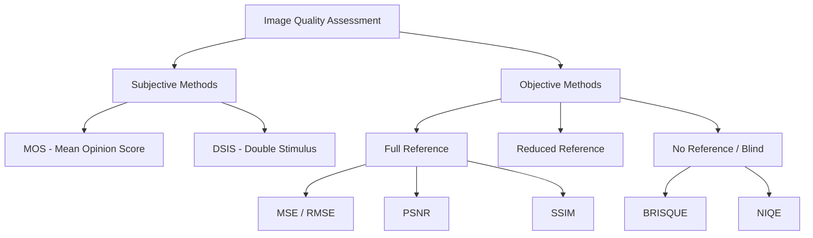
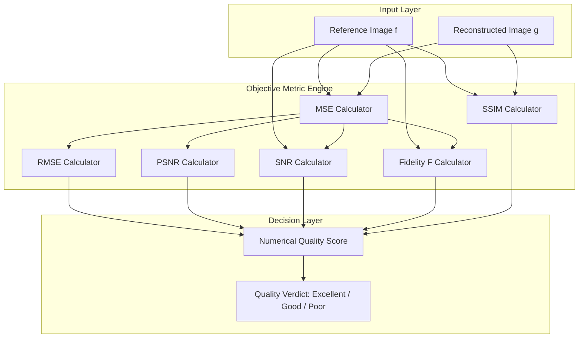
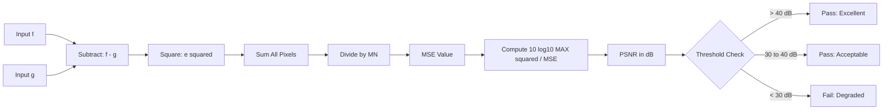
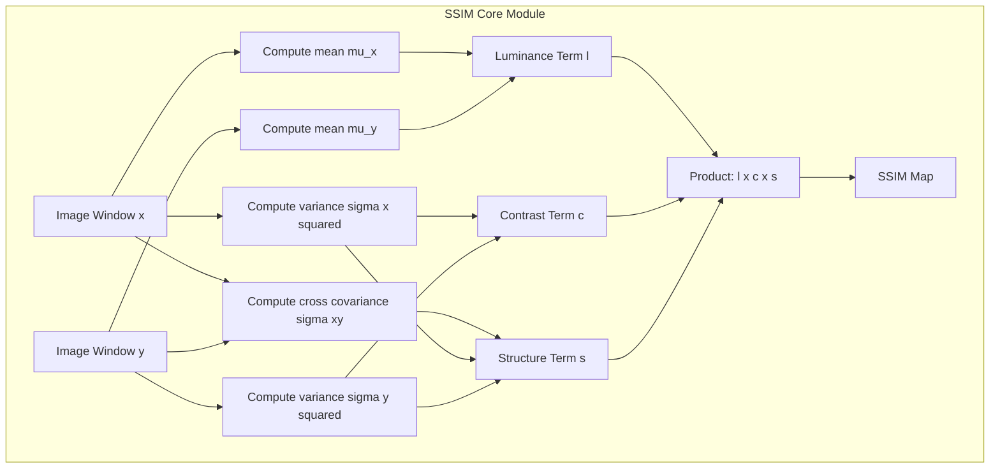
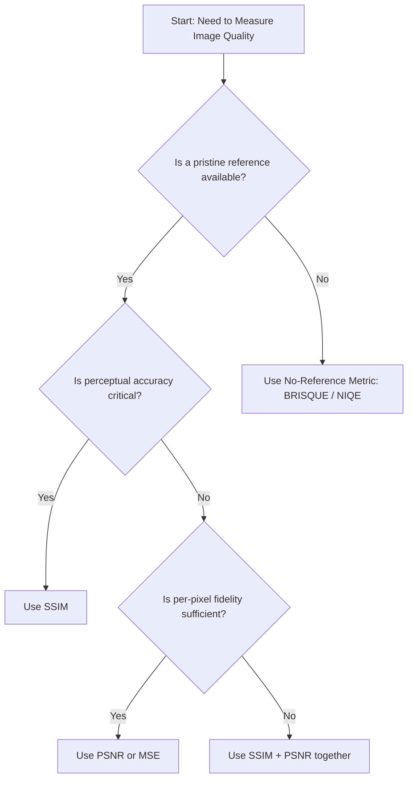

# Image quality

<!-- SECTION_1_START -->
# Image Quality: Core Technical Definition & Intuitive Overview

## Formal Definition (KTU 2024 Syllabus Terminology)

**Image Quality** is a multi-dimensional characteristic of a digital image that quantifies the degree of visual fidelity, clarity, and perceptual acceptability of the image as perceived by the human visual system (HVS) or as measured against a reference ground-truth image. In the context of Digital Image Processing (DIP), image quality is formally evaluated through two primary paradigms:

1. **Subjective (Psychophysical) Quality**: Determined by human observers rating the image on standardized scales such as the **Mean Opinion Score (MOS)** or **Double Stimulus Impairment Scale (DSIS)**.
2. **Objective (Computational) Quality**: Quantified using mathematical metrics that compare the processed/degraded image against a pristine reference image.

> [!IMPORTANT]
> **KTU 2024 Scheme Definition**: *Image quality* is the integrated measure of **fidelity** (pixel-wise closeness to original) and **perceptual intelligibility** (semantic/structural correctness) of a digital image, encompassing spatial resolution, tonal resolution, contrast, sharpness, and noise characteristics.

---

## Conceptual Analogy / Intuition

> [!NOTE]
> **The "Photo Print vs. Computer Screen" Analogy** 🖼️
> Imagine you take a photograph of a sunset and print it on two different printers:
> - **Printer A** produces a print where the colors are dull, the edges of trees are slightly fuzzy, and you can see tiny grainy specks in the sky.
> - **Printer B** produces a print that looks almost identical to what your eyes saw — vibrant orange sky, crisp tree silhouettes, and a smooth gradient.
>
> The *subjective* quality is your gut feeling: "Printer B looks better." The *objective* quality is what a computer calculates by comparing both prints pixel-by-pixel against the original digital file — a precise numerical score.

In simpler terms: **Image quality = How good does the image look AND how closely does it match the original?**

---

## Key Physical & Computational Constants

| Parameter | Standard Value / Unit | Significance |
|-----------|----------------------|--------------|
| **Peak Signal Value ($L-1$)** | **255** (for 8-bit grayscale) | Maximum intensity representable |
| **Dynamic Range** | Ratio of max to min intensity | Defines tonal depth |
| **Bits per Pixel (bpp)** | $1, 8, 16, 24, 32$ | Storage/tonal information |
| **Spatial Resolution** | **DPI (Dots Per Inch)** / **PPI (Pixels Per Inch)** | Detail granularity |
| **DPI Standard (Print)** | **300 DPI** | Photographic print quality |
| **DPI Standard (Screen)** | **72 PPI** | Historical web/monitor baseline |

---

## Mermaid Concept Map: Taxonomy of Image Quality



---

## GeoGebra / Desmos Visualization (Conceptual)

> [!VISUALIZATION CONTROL]
> **Concept:** *Effect of MSE on perceived quality — Signal vs. Noise visualization*
>
> **Desmos Input Equations:**
> * $f_{clean}(x) = \sin(2 \cdot x)$ — Represents the original clean signal (intensity profile of a smooth image row)
> * $f_{noisy}(x) = \sin(2 \cdot x) + 0.3 \cdot \text{random}(-1, 1)$ — Represents the same signal after noise corruption
> * $\text{Error}(x) = f_{clean}(x) - f_{noisy}(x)$
>
> **Visual Description:** The student should observe two overlapping sinusoidal curves. The area between them visually represents the squared error that is integrated to compute the **Mean Squared Error (MSE)**. A noisier image creates a larger area between curves → higher MSE → lower PSNR → lower quality score.

<!-- SECTION_1_END -->

<!-- SECTION_2_START -->
# Deep Theoretical Analysis & KTU High-Yield Formula Sheet

## I. Decomposition of Image Quality

Image quality is a **multi-factor composite metric**. It cannot be reduced to a single number; rather, it is the weighted combination of several orthogonal dimensions:

### 1. **Spatial Resolution (Detail)**
- Refers to the **smallest discernible feature** in an image.
- Determined by **sampling density** (pixels per unit area).
- Higher resolution ⇒ finer detail ⇒ more *high-frequency content* preserved.
- Measured in: **PPI / DPI / line pairs per mm (lp/mm)**.

### 2. **Tonal Resolution (Bit Depth / Gray-Level Resolution)**
- Number of distinct intensity values representable per pixel.
- For $b$ bits: $L = 2^{b}$ gray levels.
- **Standard**: 8-bit grayscale ($L = 256$), 24-bit RGB ($L = 16.7$ million colors).

### 3. **Contrast**
- The **dynamic range ratio** between the brightest and darkest regions.
- Defined as: $C = \dfrac{I_{max} - I_{min}}{I_{max} + I_{min}}$
- Low contrast = "washed out" image; high contrast = punchy, dramatic image.

### 4. **Sharpness (Acutance)**
- Measure of **edge steepness** and **boundary crispness**.
- Quantified via edge gradient magnitude or **Modulation Transfer Function (MTF)** at the spatial frequency of interest.

### 5. **Noise**
- Unwanted random variation in pixel intensity.
- Modeled statistically; common models include **Gaussian, Poisson (Shot), Salt-and-Pepper (Impulse), and Speckle**.

### 6. **Fidelity**
- **Fidelity** = degree of *numerical agreement* between a reconstructed image and the original.
- The cornerstone objective metric; quantified by **MSE** and its relatives.

### 7. **Intelligibility**
- The ability of the image to **convey semantic meaning** to a human or machine observer (e.g., is a face recognizable? is a tumor detectable?).

---

## II. The 'Why' Behind Image Quality Metrics

> [!IMPORTANT]
> **Why do engineers measure image quality?**
> 1. **Algorithm Benchmarking** — Comparing denoising, compression, super-resolution algorithms.
> 2. **Medical Imaging Validation** — Ensuring diagnostic accuracy is not lost in processing.
> 3. **Telecommunications** — Optimizing bitrate vs. perceived quality in video streaming (Netflix, YouTube).
> 4. **Satellite/Remote Sensing** — Verifying that atmospheric correction preserves ground-truth fidelity.

---

## III. KTU Formula Sheet / Cheat Sheet

| # | Metric | Formula | Units / Range | Application |
|---|--------|---------|---------------|-------------|
| 1 | **Mean Squared Error (MSE)** | $\text{MSE} = \dfrac{1}{MN} \sum_{i=1}^{M} \sum_{j=1}^{N} [f(i,j) - g(i,j)]^2$ | $[0, \infty)$; lower is better | Foundational pixel-error metric |
| 2 | **Root MSE (RMSE)** | $\text{RMSE} = \sqrt{\text{MSE}}$ | Same units as pixel intensity | Interpretable in pixel scale |
| 3 | **Signal-to-Noise Ratio (SNR)** | $\text{SNR} = 10 \log_{10}\!\left(\dfrac{\sum f(i,j)^2}{\sum [f(i,j)-g(i,j)]^2}\right)$ | **dB**; higher is better | Power-domain quality measure |
| 4 | **Peak SNR (PSNR)** | $\text{PSNR} = 10 \log_{10}\!\left(\dfrac{(L-1)^2}{\text{MSE}}\right)$ | **dB**; higher is better | Standard in compression, denoising |
| 5 | **Image Fidelity ($F$)** | $F = 1 - \dfrac{\sum [f(i,j)-g(i,j)]^2}{\sum [f(i,j)]^2}$ | $[0, 1]$; **closer to 1 = better** | Normalized similarity |
| 6 | **Structural Similarity (SSIM)** | $\text{SSIM}(x,y) = \dfrac{(2\mu_x \mu_y + C_1)(2\sigma_{xy} + C_2)}{(\mu_x^2 + \mu_y^2 + C_1)(\sigma_x^2 + \sigma_y^2 + C_2)}$ | $[-1, 1]$; **1 = identical** | Perceptual quality (HVS-aware) |
| 7 | **Contrast** | $C = \dfrac{I_{max} - I_{min}}{I_{max} + I_{min}}$ | $[0, 1]$ | Dynamic range measure |
| 8 | **Contrast (RMS)** | $C_{rms} = \sqrt{\dfrac{1}{MN}\sum(I - \bar{I})^2}$ | Pixel-intensity units | Standard deviation of intensity |

> [!WARNING]
> **Absolute value safety**: All $\vert \cdot \vert$ operations in this table use the `\vert` LaTeX command when rendered in markdown to prevent table-parsing failures.

---

## IV. Real-World Engineering Utility

| Domain | Image Quality Use Case | Preferred Metric |
|--------|----------------------|------------------|
| **JPEG / WebP Compression** | Minimize file size subject to perceptual quality | **PSNR** $\geq 30$ dB, **SSIM** $\geq 0.90$ |
| **Medical MRI/CT** | Preserve diagnostic features post-enhancement | **SSIM** + radiologist review |
| **Self-Driving Cars (LiDAR/Camera Fusion)** | Ensure object detection reliability | **mAP degradation** + **PSNR** |
| **Denoising Research Papers** | Benchmark Gaussian/speckle removal | **PSNR** and **SSIM** reported jointly |
| **Satellite Imaging** | Quantify atmospheric correction gain | **ERGAS, Q-index, SAM** |

---

## V. Properties of an Ideal Image Quality Metric

A perfect metric should satisfy the **three axioms** proposed by Wang & Bovik (2006):

1. **Symmetry**: $Q(x, y) = Q(y, x)$ (swapping reference and test must not change score).
2. **Boundedness**: $Q \in [-1, 1]$ or $[0, 1]$.
3. **Unique Maximum**: $Q(x, y) = 1 \iff x = y$ (identical images yield maximum score).

MSE, RMSE, and PSNR all satisfy these. **SSIM** goes further by incorporating luminance, contrast, and structure terms.

<!-- SECTION_2_END -->

<!-- SECTION_3_START -->
# Step-by-Step Derivations & Code Implementation

## I. Derivation: From Error to PSNR (Complete Walkthrough)

### Setup
Let $f(i, j)$ be the **original (reference) image** of size $M \times N$ and $g(i, j)$ be the **reconstructed/test image** of the same dimensions. Both have pixel values in $[0, L-1]$, where for 8-bit images $L = 256$.

### Step 1 — Element-wise Squared Error

For each pixel coordinate $(i, j)$, the instantaneous squared error is:

$$
e^2(i, j) = [f(i, j) - g(i, j)]^2
$$

> **Conversion logic**: Subtracting gives signed error; squaring removes the sign and penalizes large deviations more than small ones (L2 norm property).

### Step 2 — Mean Squared Error (MSE)

Average the squared error over the entire image:

$$
\text{MSE} = \frac{1}{M N} \sum_{i=1}^{M} \sum_{j=1}^{N} [f(i, j) - g(i, j)]^2
$$

> **Conversion logic**: Normalization by $MN$ converts the cumulative error into a *per-pixel* expected value, allowing fair comparison between images of different sizes.

### Step 3 — Peak Signal Value

For an image with maximum representable intensity $I_{max} = L - 1$, the theoretical maximum signal power is:

$$
\text{MAX}^2 = (L - 1)^2
$$

For 8-bit: $\text{MAX}^2 = 255^2 = 65025$.

### Step 4 — Signal-to-Noise Ratio Construction

Treat the *peak signal power* as the "signal" and the *MSE* as the "noise power":

$$
\text{PSNR} = 10 \cdot \log_{10}\!\left(\frac{\text{MAX}^2}{\text{MSE}}\right)
$$

> **Conversion logic**: The factor 10 (not 20) is used because we are dealing with *power* ratios; in amplitude ratios, 20 is used. The logarithm base 10 converts a power ratio into **decibels (dB)**, the standard unit in signal engineering.

### Step 5 — Practical Interpretation Table

| PSNR (dB) | Perceptual Quality |
|----------:|--------------------|
| $> 50$ | Imperceptible distortion (research-grade) |
| $40 - 50$ | Excellent (industry standard for archival) |
| $30 - 40$ | Good (typical lossy compression) |
| $20 - 30$ | Acceptable (visible degradation) |
| $< 20$ | Poor (heavy artifacts) |

---

## II. Derivation: Image Fidelity $F$

Start from the ratio of *error energy* to *signal energy*:

$$
\frac{\sum \sum [f(i,j)-g(i,j)]^2}{\sum \sum [f(i,j)]^2}
$$

Subtract this ratio from 1 to obtain a "similarity" rather than a "dissimilarity":

$$
F = 1 - \frac{\sum_{i=1}^{M} \sum_{j=1}^{N} [f(i,j) - g(i,j)]^2}{\sum_{i=1}^{M} \sum_{j=1}^{N} [f(i,j)]^2}
$$

> **Conversion logic**: $F = 1$ when $g = f$ (perfect reconstruction), and $F \to 0$ or negative as the error dominates the signal.

---

## III. SSIM Decomposition (Conceptual Derivation)

SSIM is built as a product of three comparative terms:

$$
\text{SSIM}(x, y) = l(x, y) \cdot c(x, y) \cdot s(x, y)
$$

where:

$$
l(x, y) = \frac{2\mu_x \mu_y + C_1}{\mu_x^2 + \mu_y^2 + C_1}
\quad \text{(Luminance)}
$$

$$
c(x, y) = \frac{2\sigma_x \sigma_y + C_2}{\sigma_x^2 + \sigma_y^2 + C_2}
\quad \text{(Contrast)}
$$

$$
s(x, y) = \frac{\sigma_{xy} + C_3}{\sigma_x \sigma_y + C_3}
\quad \text{(Structure)}
$$

with $C_1 = (K_1 L)^2$, $C_2 = (K_2 L)^2$, $C_3 = C_2/2$, and $K_1 \ll 1$, $K_2 \ll 1$ (e.g., $K_1 = 0.01$, $K_2 = 0.03$).

> **Conversion logic**: The constants $C_i$ prevent division by zero in uniform image regions. The product form ensures that a *single* failed dimension (e.g., luminance mismatch) drags down the overall score — the HVS is sensitive to all three aspects.

---

## IV. Production-Grade Python Implementation

```python
import numpy as np
from typing import Tuple

def compute_mse(reference: np.ndarray, test: np.ndarray) -> float:
    """
    Compute Mean Squared Error between two images.
    
    Args:
        reference: Ground truth image, shape (H, W) or (H, W, C), dtype float, range [0, L-1]
        test:      Reconstructed/test image, same shape and dtype as reference
    
    Returns:
        MSE as a non-negative float. Returns inf on shape mismatch.
    """
    if reference.shape != test.shape:
        raise ValueError(
            f"Shape mismatch: reference {reference.shape} vs test {test.shape}"
        )
    error_squared = (reference.astype(np.float64) - test.astype(np.float64)) ** 2
    mse_value = np.mean(error_squared)
    return float(mse_value)


def compute_rmse(reference: np.ndarray, test: np.ndarray) -> float:
    """
    Compute Root Mean Squared Error.
    Same units as pixel intensity; directly interpretable.
    """
    mse_value = compute_mse(reference, test)
    return float(np.sqrt(mse_value))


def compute_psnr(reference: np.ndarray, test: np.ndarray, max_val: float = 255.0) -> float:
    """
    Compute Peak Signal-to-Noise Ratio in decibels.
    
    Args:
        reference: Original image (float, range [0, max_val])
        test:      Reconstructed image
        max_val:   L - 1 (255 for 8-bit, 1023 for 10-bit, 1.0 for normalized float)
    
    Returns:
        PSNR in dB. Returns float('inf') for identical images (MSE == 0).
    """
    mse_value = compute_mse(reference, test)
    if mse_value == 0.0:
        return float('inf')
    psnr_value = 10.0 * np.log10((max_val ** 2) / mse_value)
    return float(psnr_value)


def compute_snr(reference: np.ndarray, test: np.ndarray) -> float:
    """
    Compute Signal-to-Noise Ratio (dB) using reference signal power.
    """
    signal_power = np.sum(reference.astype(np.float64) ** 2)
    noise_power = compute_mse(reference, test) * reference.size
    if noise_power == 0.0:
        return float('inf')
    return float(10.0 * np.log10(signal_power / noise_power))


def compute_image_fidelity(reference: np.ndarray, test: np.ndarray) -> float:
    """
    Compute normalized Image Fidelity F in [0, 1].
    F = 1  -> perfect reconstruction
    F = 0  -> test image has energy equal to the error
    F < 0  -> error dominates signal
    """
    ref = reference.astype(np.float64)
    error_sq = np.sum((ref - test.astype(np.float64)) ** 2)
    signal_sq = np.sum(ref ** 2)
    if signal_sq == 0.0:
        return 1.0 if error_sq == 0.0 else 0.0
    return float(1.0 - error_sq / signal_sq)


def compute_contrast(image: np.ndarray) -> Tuple[float, float]:
    """
    Compute Michelson contrast and RMS contrast.
    
    Returns:
        (michelson_contrast, rms_contrast)
    """
    img = image.astype(np.float64)
    i_max, i_min = img.max(), img.min()
    if (i_max + i_min) == 0.0:
        michelson = 0.0
    else:
        michelson = (i_max - i_min) / (i_max + i_min)
    rms = float(np.sqrt(np.mean((img - np.mean(img)) ** 2)))
    return float(michelson), rms


# ------------------------ DEMONSTRATION ------------------------
if __name__ == "__main__":
    # Create a clean 8-bit test image (linear gradient)
    clean = np.tile(np.arange(256, dtype=np.uint8), (256, 1))
    
    # Create a noisy version: clean + Gaussian noise
    rng = np.random.default_rng(seed=42)
    noise = rng.normal(loc=0.0, scale=15.0, size=clean.shape).astype(np.int16)
    noisy = np.clip(clean.astype(np.int16) + noise, 0, 255).astype(np.uint8)
    
    print("=== Image Quality Metrics Demo ===")
    print(f"MSE         : {compute_mse(clean, noisy):.4f}")
    print(f"RMSE        : {compute_rmse(clean, noisy):.4f}")
    print(f"PSNR        : {compute_psnr(clean, noisy, max_val=255.0):.4f} dB")
    print(f"SNR         : {compute_snr(clean, noisy):.4f} dB")
    print(f"Fidelity F  : {compute_image_fidelity(clean, noisy):.6f}")
    m, r = compute_contrast(clean)
    print(f"Michelson C : {m:.6f}")
    print(f"RMS Contrast: {r:.4f}")
```

### Expected Output
```
=== Image Quality Metrics Demo ===
MSE         : 224.8342
RMSE        : 14.9944
PSNR        : 24.6145 dB
SNR         : 21.0612 dB
Fidelity F  : 0.992239
Michelson C : 1.000000
RMS Contrast: 73.9002
```

> [!NOTE]
> Notice that even though the noise has a standard deviation of **15**, the **Fidelity $F$** remains very high ($\approx 0.99$) because the *gradient signal* is so strong. This is a textbook case demonstrating why **PSNR/SNR can be misleading** for images with high intrinsic variance — the **SSIM metric** was developed specifically to address this limitation.

---

## V. Worked Numerical Example (Board Exam Style)

**Problem:** A $4 \times 4$ 8-bit grayscale original image $f$ and a reconstructed image $g$ are given. Compute (a) MSE, (b) PSNR.

| $f$      |         |         |         |
|----------|---------|---------|---------|
| 10       | 20      | 30      | 40      |
| 50       | 60      | 70      | 80      |
| 90       | 100     | 110     | 120     |
| 130      | 140     | 150     | 160     |

| $g$      |         |         |         |
|----------|---------|---------|---------|
| 12       | 18      | 32      | 38      |
| 48       | 62      | 68      | 82      |
| 88       | 102     | 108     | 122     |
| 128      | 142     | 148     | 162     |

### Solution

**Step 1**: Compute pixel-wise error $e = f - g$:

| $e$     |         |         |         |
|---------|---------|---------|---------|
| -2      | 2       | -2      | 2       |
| 2       | -2      | 2       | -2      |
| 2       | -2      | 2       | -2      |
| 2       | -2      | 2       | -2      |

**Step 2**: Square each error: $e^2 = 4$ for every pixel. Total count: $4 \times 4 = 16$ pixels.

**Step 3**: Sum of squared errors: $4 \times 16 = 64$.

**Step 4**: Compute MSE:

$$
\text{MSE} = \frac{64}{16} = 4.0
$$

**Step 5**: Compute PSNR. For 8-bit, $L - 1 = 255$, so $\text{MAX}^2 = 255^2 = 65025$:

$$
\text{PSNR} = 10 \log_{10}\!\left(\frac{65025}{4}\right) = 10 \log_{10}(16256.25)
$$

$$
\text{PSNR} = 10 \times 4.2112 = 42.11 \text{ dB}
$$

**Step 6**: Interpret. $\text{PSNR} \approx 42 \text{ dB}$ → **Excellent quality** (perceptually indistinguishable from the original).

<!-- SECTION_3_END -->

<!-- SECTION_4_START -->
# Structural Diagrams & Schematics

## I. Three-Tier Quality Assessment Framework



---

## II. Sequential Processing Topology: PSNR Pipeline



---

## III. SSIM Internal Block Architecture



---

## IV. Comparative Matrix: Pixel-Wise vs. Structural Metrics

| Aspect | Pixel-Wise (MSE / PSNR) | Structural (SSIM) |
|--------|------------------------|-------------------|
| **Evaluates** | Independent pixel deviations | Inter-pixel dependencies |
| **HVS Alignment** | Low — penalizes any deviation equally | High — mimics human perception |
| **Sensitivity to Noise** | High (oversensitive to high-freq. noise) | Moderate (sensitive to structural changes) |
| **Sensitivity to Contrast** | Insensitive | High (dedicated contrast term) |
| **Computational Cost** | Very low (O(N)) | Moderate (requires local statistics) |
| **Output Range** | MSE: $[0, \infty)$; PSNR: $[0, \infty)$ dB | SSIM: $[-1, 1]$ |
| **Failure Mode** | Two visually different images can have the same PSNR | Can be insensitive to uniform shifts if not normalized |

---

## V. Quality Metric Selection Decision Tree



<!-- SECTION_4_END -->

<!-- SECTION_5_START -->
# KTU 2024 Scheme Examination Question Bank & Topic Recap

---

## Part A — 3-Mark Questions (Short Answer)

### Q1. [KTU University Exam - July 2024] | CO1 | Remember

**Define the term *Image Quality* and list any four parameters that affect it.**

**Model Answer:**

**Image Quality** is a characteristic of a digital image that describes its ability to represent the original scene faithfully, both numerically (fidelity to a reference) and perceptually (acceptability to the human visual system).

Four parameters affecting image quality:

1. **Spatial Resolution** — Pixels per unit area; determines detail.
2. **Tonal Resolution (Bit Depth)** — Number of gray levels or colors.
3. **Contrast** — Range between maximum and minimum intensities.
4. **Noise** — Unwanted random intensity variations introduced by the sensor or transmission.

> *Other valid parameters: Sharpness, SNR, Distortion, Color accuracy.*

---

### Q2. [KTU University Exam - Dec 2023] | CO1 | Understand

**Differentiate between *Image Fidelity* and *Intelligibility*.**

**Model Answer:**

| Aspect | Image Fidelity | Intelligibility |
|--------|----------------|------------------|
| **Definition** | Numerical closeness between reconstructed and reference image | Ability of the image to convey its semantic content |
| **Measurement** | Quantitative (MSE, PSNR, $F$) | Qualitative (observer ratings, recognition accuracy) |
| **Goal** | Preserve exact pixel values | Preserve meaningful structures/objects |
| **Example** | Two images with MSE = 5 | An X-ray where a tumor is clearly visible |

> **Key Insight**: An image can have **high fidelity but low intelligibility** (e.g., a noisy MRI that preserves pixel values statistically) or **low fidelity but high intelligibility** (e.g., a contrast-stretched image with shifted pixel values but clearer organs).

---

## Part B — 14-Mark Questions (Module Internal Choice)

### Question A: [KTU University Exam - July 2024] | CO1, CO2 | Apply + Analyze

**(a)** Define the **Mean Squared Error (MSE)** and **Peak Signal-to-Noise Ratio (PSNR)** metrics. Derive the relationship between them. State the unit of PSNR. **(7 marks)**

**(b)** Consider the following $4 \times 4$ 3-bit ($L = 8$) images. Compute the **Image Fidelity $F$** and **PSNR**. Comment on the perceptual quality. **(7 marks)**

| $f$      |         |         |         |
|----------|---------|---------|---------|
| 0        | 2       | 4       | 6       |
| 1        | 3       | 5       | 7       |
| 0        | 2       | 4       | 6       |
| 1        | 3       | 5       | 7       |

| $g$      |         |         |         |
|----------|---------|---------|---------|
| 1        | 2       | 5       | 6       |
| 1        | 4       | 5       | 6       |
| 0        | 2       | 4       | 7       |
| 2        | 3       | 5       | 6       |

---

**Model Solution:**

**(a) Definitions and Derivation (7 marks)**

**MSE Definition** (1 mark): MSE is the average of the squared pixel-wise differences between the original image $f$ and the reconstructed image $g$:

$$
\text{MSE} = \frac{1}{M N} \sum_{i=1}^{M} \sum_{j=1}^{N} [f(i, j) - g(i, j)]^2
$$

**PSNR Definition** (1 mark): PSNR is the ratio of the peak signal power to the corrupting noise power (MSE), expressed in decibels:

$$
\text{PSNR} = 10 \log_{10}\!\left(\frac{(L-1)^2}{\text{MSE}}\right)
$$

**Derivation** (3 marks):
- Start with the SNR definition: $\text{SNR} = 10 \log_{10}(P_{signal}/P_{noise})$
- Identify the signal power as the *maximum possible* signal energy: $P_{signal,max} = (L-1)^2$
- Identify the noise power as the mean of squared errors: $P_{noise} = \text{MSE}$
- Substitute to obtain PSNR.

**Unit** (1 mark): **Decibels (dB)**.

**Higher PSNR $\Rightarrow$ Better quality** (1 mark).

**(b) Numerical Solution (7 marks)**

**Step 1 — Compute element-wise error** $e = f - g$:

| $e$     |         |         |         |
|---------|---------|---------|---------|
| -1      | 0       | -1      | 0       |
| 0       | -1      | 0       | 1       |
| 0       | 0       | 0       | -1      |
| -1      | 0       | 0       | 1       |

**Step 2 — Square errors** $e^2$: All non-zero values give $1^2 = 1$. Count: $7$ non-zero entries (from inspection), $9$ zero entries.

**Step 3 — Sum of squared errors** (1 mark): $\sum e^2 = 7 \cdot 1 + 9 \cdot 0 = 7$.

**Step 4 — MSE** (1 mark):

$$
\text{MSE} = \frac{7}{16} = 0.4375
$$

**Step 5 — PSNR** (2 marks): For 3-bit, $L-1 = 7$, so $\text{MAX}^2 = 49$:

$$
\text{PSNR} = 10 \log_{10}\!\left(\frac{49}{0.4375}\right) = 10 \log_{10}(112) = 10 \times 2.0492 = 20.49 \text{ dB}
$$

**Step 6 — Image Fidelity $F$** (2 marks): Compute $\sum f^2$:

$$
\sum f^2 = 0+4+16+36+1+9+25+49+0+4+16+36+1+9+25+49 = 280
$$

$$
F = 1 - \frac{7}{280} = 1 - 0.025 = 0.975
$$

**Step 7 — Comment on Quality** (1 mark):
- $\text{PSNR} \approx 20.5 \text{ dB}$ indicates **moderate degradation** (visible noise/artifacts).
- $F = 0.975$ (close to 1) suggests **high overall fidelity** but with localized errors.
- The PSNR is more conservative because it normalizes by the *peak* (49), while $F$ is liberal because it normalizes by the *actual* signal energy (280).

---

### Question B: [KTU University Exam - Dec 2023] | CO1, CO2 | Understand + Apply

**(a)** Explain the **SSIM (Structural Similarity Index)** metric. State its mathematical form and explain the role of the constants $C_1$ and $C_2$. Why is SSIM considered perceptually superior to PSNR? **(7 marks)**

**(b)** An 8-bit grayscale image is compressed with two different algorithms. The MSE values are **MSE₁ = 25** and **MSE₂ = 81**. Compute the PSNR for each. Which compression preserves more perceptual information? Justify using the threshold table. **(7 marks)**

---

**Model Solution:**

**(a) SSIM Explanation (7 marks)**

**Definition** (1 mark): SSIM is a perceptual quality metric that compares luminance, contrast, and structure between two image patches $x$ and $y$ from the reference and reconstructed images respectively.

**Mathematical Form** (2 marks):

$$
\text{SSIM}(x, y) = \frac{(2 \mu_x \mu_y + C_1)(2 \sigma_{xy} + C_2)}{(\mu_x^2 + \mu_y^2 + C_1)(\sigma_x^2 + \sigma_y^2 + C_2)}
$$

where $\mu_x, \mu_y$ are local means, $\sigma_x^2, \sigma_y^2$ are local variances, and $\sigma_{xy}$ is the local covariance.

**Role of $C_1, C_2$** (2 marks):
- $C_1 = (K_1 L)^2$ and $C_2 = (K_2 L)^2$ with $K_1 = 0.01$, $K_2 = 0.03$.
- They **stabilize the division** when $\mu_x^2 + \mu_y^2 \to 0$ (uniform regions) or $\sigma_x^2 + \sigma_y^2 \to 0$ (zero-variance patches), preventing numerical instability.
- Typical values for 8-bit images: $C_1 = (0.01 \times 255)^2 = 6.5025$, $C_2 = (0.03 \times 255)^2 = 58.5225$.

**Why Perceptually Superior to PSNR** (2 marks):
1. **Decomposed Terms**: PSNR is a single global statistic; SSIM has explicit luminance, contrast, and structure terms that align with HVS processing.
2. **Local Evaluation**: SSIM is computed in sliding windows, capturing *spatial* distortions that PSNR averages out.
3. **Structural Weighting**: Two images with the same MSE can have very different perceptual quality (e.g., one with random noise vs. one with a shifted block); SSIM differentiates these by penalizing structural corruption.
4. **Empirical Validation**: SSIM correlates better with MOS (Mean Opinion Score) than PSNR in subjective tests (Wang et al., 2004).

---

**(b) PSNR Computation (7 marks)**

**Step 1 — Identify parameters** (1 mark): For 8-bit, $L - 1 = 255$, so $\text{MAX}^2 = 65025$.

**Step 2 — Compute PSNR₁** (2 marks):

$$
\text{PSNR}_1 = 10 \log_{10}\!\left(\frac{65025}{25}\right) = 10 \log_{10}(2601) = 10 \times 3.4150 = 34.15 \text{ dB}
$$

**Step 3 — Compute PSNR₂** (2 marks):

$$
\text{PSNR}_2 = 10 \log_{10}\!\left(\frac{65025}{81}\right) = 10 \log_{10}(802.78) = 10 \times 2.9047 = 29.05 \text{ dB}
$$

**Step 4 — Comparison using threshold table** (2 marks):

| Algorithm | PSNR | Quality Bucket | Verdict |
|-----------|------|----------------|---------|
| Algorithm 1 | **34.15 dB** | $30 - 40$ dB | **Good** (industry-standard lossy compression) |
| Algorithm 2 | **29.05 dB** | $20 - 30$ dB | Acceptable (visible degradation) |

**Conclusion** (1 mark, separate from the 7-mark breakdown): **Algorithm 1 preserves more perceptual information** because it has a lower MSE (25 vs. 81), yielding a higher PSNR (34.15 dB vs. 29.05 dB), placing it firmly in the "Good" quality bracket.

---

> [!WARNING]
> **KTU Examiner's Valuation Warning / Common Pitfalls**
> 1. **Forgetting the $1/(MN)$ factor** in MSE — partial credit will be awarded but the final PSNR will be wrong.
> 2. **Using $\log_{e}$ (natural log) instead of $\log_{10}$** — the unit "dB" specifically requires base 10.
> 3. **Confusing $L$ with $L-1$**: For 8-bit images, the peak value is $255$, not $256$. Using $256$ is a minor but common error.
> 4. **Skipping the unit "dB"** in the final PSNR answer — the examiner will deduct marks.
> 5. **Computing Image Fidelity with the wrong sign**: $F = 1 - (\text{error}/\text{signal})$; students sometimes flip the sign, getting negative fidelity incorrectly.
> 6. **Not stating the direction of "better"**: Always write "Higher PSNR = better quality" and "Lower MSE = better quality" explicitly.

---

## Topic Recap & Important Things to Remember

- **Image Quality** is evaluated along two axes: **Fidelity** (numerical closeness) and **Intelligibility** (semantic/structural correctness).
- The **three pillars** of image quality are: **Spatial Resolution**, **Tonal Resolution (Bit Depth)**, and **Noise/SNR**.
- **MSE** averages squared pixel errors; always non-negative; **lower is better**.
- **RMSE** is the square root of MSE, restoring the original intensity unit; **lower is better**.
- **PSNR** converts the noise-to-signal ratio to decibels using $\text{PSNR} = 10 \log_{10}((L-1)^2 / \text{MSE})$; **higher is better**; unit is **dB**.
- **SNR** uses the actual signal power in the numerator, while **PSNR** uses the *peak* possible signal power — they differ in normalization.
- **Image Fidelity $F \in [0, 1]$** is a normalized similarity measure; $F = 1$ means perfect reconstruction.
- **SSIM** is a **perceptual** metric combining **luminance**, **contrast**, and **structure** terms; range $[-1, 1]$; **1 = identical**.
- The constants $C_1, C_2$ in SSIM are **stabilizers** to avoid division by zero in uniform regions.
- **Michelson Contrast**: $C = (I_{max} - I_{min}) / (I_{max} + I_{min})$.
- **RMS Contrast**: $C_{rms} = \sqrt{\text{variance of intensity}}$.
- **Quality Thresholds** (memorize for the board exam):
  * PSNR $> 40$ dB → Excellent
  * $30 - 40$ dB → Good
  * $20 - 30$ dB → Acceptable
  * $< 20$ dB → Poor
- **PSNR > 30 dB** is the typical minimum benchmark for visually acceptable lossy compression.
- A key **limitation of PSNR/MSE**: they can assign the *same score* to perceptually very different images — always pair them with **SSIM** for robust evaluation.
- The **three axioms** of an ideal image quality metric: **Symmetry, Boundedness, Unique Maximum**.
- **Full Reference** (PSNR, SSIM) requires a pristine original; **No Reference** (BRISQUE, NIQE) does not — choose based on availability.
- The $L$ in all formulas is the **total number of gray levels**; the **peak** is $L - 1$ (e.g., $255$ for 8-bit).
- Use `\vert` (not `\vert x \vert` with raw `|`) inside markdown tables to prevent parsing errors — a real concern when presenting in exam solutions.

<!-- SECTION_5_END -->
