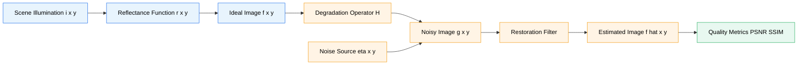
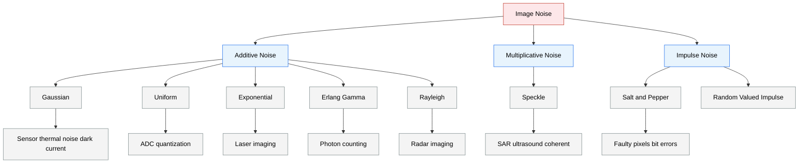
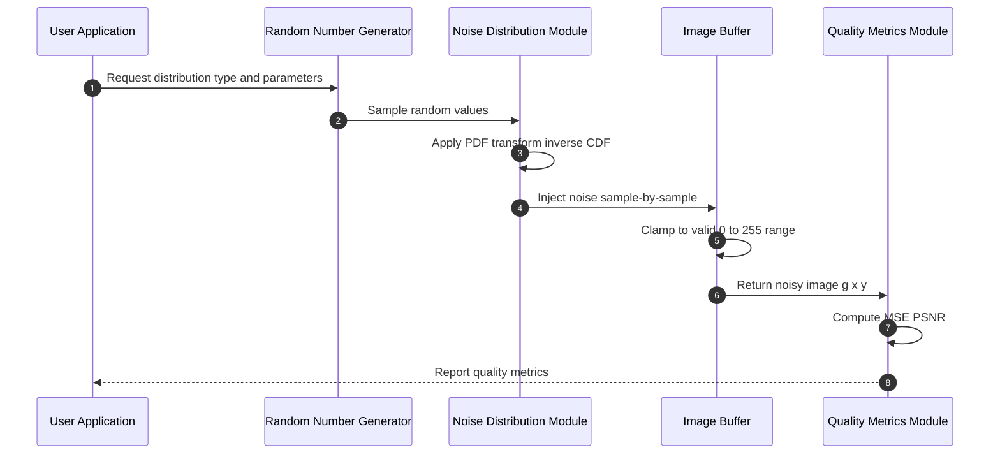
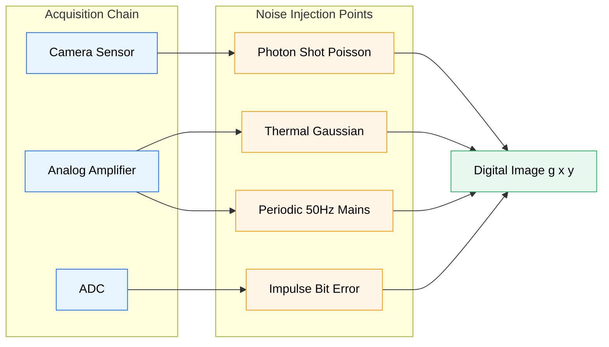
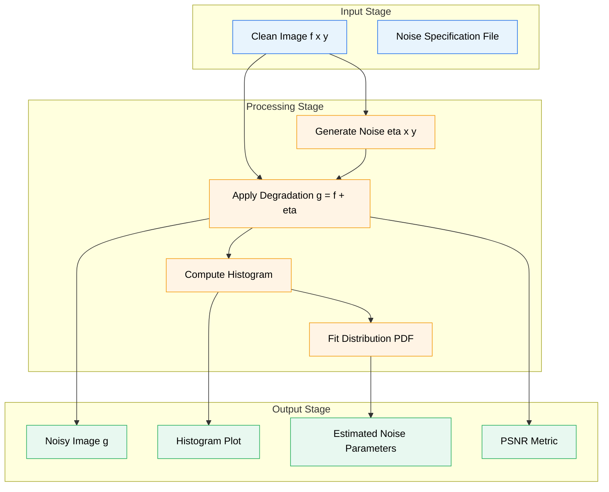

# Noise in images

<!-- SECTION_1_START -->
# Noise in Digital Images

## 1.1 Formal Academic Definition (KTU 2024 Syllabus Terminology)

In Digital Image Processing (DIP), **image noise** is defined as any random variation in brightness or color information in an image that is not part of the original scene content. It is an unwanted, stochastic perturbation introduced during image acquisition, transmission, or processing that corrupts the true pixel intensity values.

Mathematically, a corrupted (noisy) image $g(x, y)$ is modeled as a function of the original (clean) image $f(x, y)$, a degradation operator $H[\cdot]$, and an additive noise term $\eta(x, y)$:

$$g(x, y) = H\bigl[f(x, y)\bigr] + \eta(x, y)$$

When the degradation is purely an additive noise process and the imaging system is ideal ($H = 1$), the model simplifies to:

$$g(x, y) = f(x, y) + \eta(x, y)$$

> [!IMPORTANT]
> **KTU 2024 Board Definition to Memorize:**
> "Noise is a stochastic (random) signal that degrades the visual and quantitative quality of a digital image, characterized statistically by a probability density function (PDF) governing the distribution of pixel intensity deviations from the true scene values."

## 1.2 Intuitive Real-World Analogy

Imagine you are recording a voice memo in a quiet room — the recording is clean. Now record the same memo in a crowded marketplace with honking horns, conversations, and vendors shouting. The original voice is still there, but it is buried under a sea of random, unpredictable sounds.

**Noise in an image is exactly this**: the "marketplace chatter" superimposed on the "voice memo" (the true scene). Just as the random sounds can be loud or soft, occasional (spikes) or continuous (hiss), image noise comes in different flavors — each with its own statistical "fingerprint" (probability distribution).

**Geometric Intuition:** If we plot the histogram of pixel intensities of a clean image, it has a meaningful shape determined by the scene. When noise is added, this histogram gets *smeared* or *peppered with spikes*, depending on the noise type. A **Gaussian noise** smears it symmetrically; a **salt-and-pepper noise** creates two sharp spikes at the extreme black and white values.

> [!NOTE]
> **Key Insight for KTU:** Noise is not "added uniformly" — it follows a statistical distribution. The same amount of noise power (variance) can look very different on an image depending on whether it is *Gaussian* (smeary), *impulse* (spotty), or *periodic* (banded).

## 1.3 Physical & Statistical Parameters of Interest

The following standard metrics govern the study of image noise:

- **Standard Deviation ($\sigma$):** Spread of noise intensity values around the mean.
- **Variance ($\sigma^2$):** Square of standard deviation; quantifies noise *power*.
- **Mean ($\mu$):** Average noise value; for most noise models it is assumed to be **0** (zero-mean noise).
- **Signal-to-Noise Ratio (SNR):** Ratio of clean signal power to noise power, expressed in decibels.
- **Peak Signal-to-Noise Ratio (PSNR):** SNR normalized by the peak image intensity, used heavily in image quality benchmarking.

> [!VISUALIZATION CONTROL]
> **Concept:** Histogram transformation of a clean grayscale image (peaked at mid-gray) into a noisy version (broadened Gaussian, with possible salt-and-pepper spikes at 0 and 255).
> **Desmos/GeoGebra Input Equations:**
> * Clean histogram: $h_{clean}(x) = 1000 \cdot \exp\!\left(-\dfrac{(x-128)^2}{2 \cdot 30^2}\right)$
> * With Gaussian noise added ($\sigma = 25$): $h_{noisy}(x) = 1000 \cdot \exp\!\left(-\dfrac{(x-128)^2}{2 \cdot (30^2+25^2)}\right)$
> * With Salt-and-Pepper added ($p=0.05$): $h_{sp}(x) = 50 \cdot \delta(x) + 50 \cdot \delta(x-255) + 0.9 \cdot h_{noisy}(x)$
> **Visual Description:** Students should observe a single bell curve for clean, a wider bell for Gaussian noise, and a wide bell *plus* two narrow vertical spikes at $0$ and $255$ for salt-and-pepper noise.

<!-- SECTION_1_END -->

<!-- SECTION_2_START -->
# Deep Theoretical Analysis & KTU High-Yield Formula Sheet

## 2.1 The Generalized Image Degradation/Restoration Pipeline

The image formation pipeline taught under KTU Module 1 follows this logical flow:

1. **Scene Illumination** $i(x, y)$ strikes the object in the world.
2. **Reflectance Function** $r(x, y)$ modulates the illumination.
3. **Imaging Sensor** $H[\cdot]$ captures the result, often introducing blur and sensor nonlinearities.
4. **Noise Source** $\eta(x, y)$ (electronic, photon, transmission) is *added* to the captured signal.
5. **Digitization (Quantization)** converts the continuous signal into discrete pixel values $g(x, y)$.

For the noise-only portion of the model, we isolate:

$$g(x, y) = f(x, y) + \eta(x, y)$$

The goal of **image restoration** is to estimate $\hat{f}(x, y)$ — an approximation of the original image — given $g(x, y)$ and prior knowledge of $\eta$.

## 2.2 Classification of Noise by Source

| Noise Source | Origin | Typical Distribution |
|---|---|---|
| **Photon (Shot) Noise** | Random arrival of photons at sensor | Poisson |
| **Thermal (Dark Current) Noise** | Thermal electron generation in CCD/CMOS | Gaussian |
| **Read/Quantization Noise** | ADC conversion errors | Uniform (approx.) |
| **Impulse Noise** | Bit errors, faulty pixels, transmission errors | Salt-and-Pepper |
| **Speckle Noise** | Coherent wave interference (SAR, ultrasound) | Multiplicative, Rayleigh-like |
| **Periodic Noise** | Electrical/magnetic interference in acquisition | Sinusoidal in frequency domain |

## 2.3 The Seven Canonical Noise PDFs (KTU Board Essentials)

> [!NOTE]
> KTU examiners *frequently* ask: "Derive the PDF of Gaussian noise and compute its mean and variance." Memorize the table below for full marks.

### 2.3.1 Gaussian Noise (Most Common)

The PDF of a Gaussian random variable $z$ with mean $\mu$ and standard deviation $\sigma$ is:

$$p(z) = \frac{1}{\sqrt{2\pi}\,\sigma} \exp\!\left[-\frac{(z-\mu)^2}{2\sigma^2}\right], \quad -\infty < z < \infty$$

- **Mean:** $\bar{z} = \mu$
- **Variance:** $\sigma^2$
- Approximately **70% of values** lie within $[\mu - \sigma, \mu + \sigma]$.

### 2.3.2 Uniform Noise

$$p(z) = \begin{cases} \dfrac{1}{b-a}, & a \le z \le b \\ 0, & \text{otherwise} \end{cases}$$

- **Mean:** $\bar{z} = \dfrac{a+b}{2}$
- **Variance:** $\sigma^2 = \dfrac{(b-a)^2}{12}$

### 2.3.3 Salt-and-Pepper (Impulse) Noise

A bipolar impulse noise model where pixels are randomly replaced by extremes (0 or $2^n - 1$):

$$p(z) = \begin{cases} P_s, & z = 2^n - 1 \quad \text{(salt — white)} \\ P_p, & z = 0 \quad \text{(pepper — black)} \\ 0, & \text{otherwise} \end{cases}$$

If $P_s \neq P_p$, it is called **unipolar impulse noise**; if equal, it is the canonical salt-and-pepper form. For an 8-bit image, $2^n - 1 = 255$.

### 2.3.4 Rayleigh Noise

$$p(z) = \begin{cases} \dfrac{2}{b}(z-a)\exp\!\left[-\dfrac{(z-a)^2}{b}\right], & z \ge a \\ 0, & z < a \end{cases}$$

- **Mean:** $\bar{z} = a + \sqrt{\pi b / 4}$
- **Variance:** $\sigma^2 = \dfrac{b(4-\pi)}{4}$

### 2.3.5 Erlang (Gamma) Noise

$$p(z) = \begin{cases} \dfrac{a^b z^{b-1}}{(b-1)!}\,e^{-az}, & z \ge 0 \\ 0, & z < 0 \end{cases}$$

- **Mean:** $\bar{z} = \dfrac{b}{a}$
- **Variance:** $\sigma^2 = \dfrac{b}{a^2}$

### 2.3.6 Exponential Noise (special case of Erlang with $b=1$)

$$p(z) = \begin{cases} a\,e^{-az}, & z \ge 0 \\ 0, & z < 0 \end{cases}$$

- **Mean:** $\bar{z} = \dfrac{1}{a}$
- **Variance:** $\sigma^2 = \dfrac{1}{a^2}$

### 2.3.7 Poisson (Shot) Noise

The Poisson distribution arises naturally when modeling photon-counting processes:

$$p(z) = \frac{\lambda^z\,e^{-\lambda}}{z!}, \quad z = 0, 1, 2, \dots$$

- **Mean:** $\bar{z} = \lambda$
- **Variance:** $\sigma^2 = \lambda$

For large $\lambda$ ($\lambda > 100$), Poisson $\to$ Gaussian with $\mu=\lambda$ and $\sigma^2=\lambda$ (Central Limit Theorem).

## 2.4 KTU High-Yield Formula Cheat Sheet

| # | Noise Type | PDF Expression | Mean ($\mu$) | Variance ($\sigma^2$) |
|---|---|---|---|---|
| 1 | **Gaussian** | $\dfrac{1}{\sqrt{2\pi}\sigma}e^{-(z-\mu)^2/2\sigma^2}$ | $\mu$ | $\sigma^2$ |
| 2 | **Uniform** | $\dfrac{1}{b-a}$ for $z \in [a,b]$ | $\dfrac{a+b}{2}$ | $\dfrac{(b-a)^2}{12}$ |
| 3 | **Salt-and-Pepper** | $P_s\delta(z-255) + P_p\delta(z)$ | — | — |
| 4 | **Rayleigh** | $\dfrac{2}{b}(z-a)e^{-(z-a)^2/b}$ for $z \ge a$ | $a + \sqrt{\pi b/4}$ | $\dfrac{b(4-\pi)}{4}$ |
| 5 | **Erlang (Gamma)** | $\dfrac{a^b z^{b-1}}{(b-1)!}e^{-az}$ for $z \ge 0$ | $\dfrac{b}{a}$ | $\dfrac{b}{a^2}$ |
| 6 | **Exponential** | $a\,e^{-az}$ for $z \ge 0$ | $\dfrac{1}{a}$ | $\dfrac{1}{a^2}$ |
| 7 | **Poisson (Shot)** | $\dfrac{\lambda^z e^{-\lambda}}{z!}$ | $\lambda$ | $\lambda$ |

## 2.5 Signal-to-Noise Ratio (SNR) and PSNR

**SNR (in dB):**

$$\mathrm{SNR}_{\mathrm{dB}} = 10 \log_{10}\!\left(\frac{\sum_{x,y} f(x,y)^2}{\sum_{x,y}\bigl[g(x,y)-f(x,y)\bigr]^2}\right)$$

**PSNR (in dB):** Normalizes by the peak intensity $L-1$ (e.g., $255$ for 8-bit):

$$\mathrm{PSNR} = 10 \log_{10}\!\left(\frac{(L-1)^2}{\mathrm{MSE}}\right), \quad \mathrm{MSE} = \frac{1}{MN}\sum_{x,y}\bigl[g(x,y)-f(x,y)\bigr]^2$$

## 2.6 Engineering Utility: Where This Matters in Production

| Domain | Noise Type Encountered | Why It Matters |
|---|---|---|
| **Medical Imaging (MRI, CT, X-Ray)** | Gaussian + Poisson | Determines diagnostic accuracy |
| **Satellite / Remote Sensing** | Speckle, periodic (scanner artifacts) | Affects land-cover classification |
| **Low-Light Photography** | Shot (Poisson) noise | Drives denoising pipeline design |
| **Industrial Defect Detection** | Impulse / salt-and-pepper | Causes false-positive defect alarms |
| **OCR & Document Scanning** | Quantization + impulse | Direct impact on character recognition rate |
| **Deep Learning Training** | All of the above | Used as **data augmentation** to improve model robustness |

<!-- SECTION_2_END -->

<!-- SECTION_3_START -->
# Step-by-Step Derivations & Python Implementation

## 3.1 Derivation: Mean and Variance of Gaussian Noise

Starting from the Gaussian PDF:

$$p(z) = \frac{1}{\sqrt{2\pi}\,\sigma}\exp\!\left[-\frac{(z-\mu)^2}{2\sigma^2}\right]$$

**Step 1 — Mean computation.** By definition of expectation for a continuous random variable:

$$\bar{z} = E[Z] = \int_{-\infty}^{\infty} z\,p(z)\,dz$$

Substitute $p(z)$:

$$\bar{z} = \int_{-\infty}^{\infty} z \cdot \frac{1}{\sqrt{2\pi}\,\sigma}\exp\!\left[-\frac{(z-\mu)^2}{2\sigma^2}\right]dz$$

**Step 2 — Substitution.** Let $u = (z - \mu)/(\sqrt{2}\,\sigma)$, so $z = \sqrt{2}\,\sigma\,u + \mu$ and $dz = \sqrt{2}\,\sigma\,du$:

$$\bar{z} = \frac{1}{\sqrt{\pi}}\int_{-\infty}^{\infty}(\sqrt{2}\sigma u + \mu)e^{-u^2}du$$

Split the integral:

$$\bar{z} = \frac{\sqrt{2}\sigma}{\sqrt{\pi}}\underbrace{\int_{-\infty}^{\infty}u\,e^{-u^2}du}_{=0\text{ (odd integrand)}} + \frac{\mu}{\sqrt{\pi}}\underbrace{\int_{-\infty}^{\infty}e^{-u^2}du}_{=\sqrt{\pi}}$$

**Step 3 — Evaluate.** The first integral vanishes (odd function over symmetric limits), the second gives $\sqrt{\pi}$:

$$\bar{z} = \frac{\mu}{\sqrt{\pi}} \cdot \sqrt{\pi} = \mu \quad \checkmark$$

**Step 4 — Variance computation.**

$$\sigma_Z^2 = E[(Z-\bar{z})^2] = \int_{-\infty}^{\infty}(z-\mu)^2 p(z)\,dz$$

Substitute $u = (z-\mu)/(\sqrt{2}\sigma)$, $dz = \sqrt{2}\sigma\,du$:

$$\sigma_Z^2 = \frac{1}{\sqrt{\pi}}\int_{-\infty}^{\infty}(\sqrt{2}\sigma u)^2 e^{-u^2}du = \frac{2\sigma^2}{\sqrt{\pi}}\int_{-\infty}^{\infty}u^2 e^{-u^2}du$$

**Step 5 — Standard Gaussian integral.** Using the known result $\int_{-\infty}^{\infty} u^2 e^{-u^2} du = \dfrac{\sqrt{\pi}}{2}$:

$$\sigma_Z^2 = \frac{2\sigma^2}{\sqrt{\pi}} \cdot \frac{\sqrt{\pi}}{2} = \sigma^2 \quad \checkmark$$

## 3.2 Derivation: Variance of Uniform Noise

PDF: $p(z) = \dfrac{1}{b-a}$ for $z \in [a,b]$.

**Mean:**

$$\bar{z} = \int_a^b \frac{z}{b-a}\,dz = \frac{1}{b-a}\left[\frac{z^2}{2}\right]_a^b = \frac{b^2 - a^2}{2(b-a)} = \frac{a+b}{2} \quad \checkmark$$

**Variance:**

$$\sigma^2 = \int_a^b (z-\bar{z})^2 \cdot \frac{1}{b-a}\,dz$$

Let $u = z - \bar{z}$, $du = dz$, limits $u \in [a-\bar{z},\ b-\bar{z}] = [-\Delta,\ \Delta]$ where $\Delta = \dfrac{b-a}{2}$:

$$\sigma^2 = \frac{1}{2\Delta}\int_{-\Delta}^{\Delta}u^2\,du = \frac{1}{2\Delta}\left[\frac{u^3}{3}\right]_{-\Delta}^{\Delta} = \frac{1}{2\Delta}\cdot\frac{2\Delta^3}{3} = \frac{\Delta^2}{3} = \frac{(b-a)^2}{12} \quad \checkmark$$

## 3.3 Full Python Implementation: Noise Generation Toolkit

```python
"""
KTU PECST636 - Module 1: Noise in Images
Complete reference implementation of all canonical noise models.
"""

from __future__ import annotations

import logging
from dataclasses import dataclass
from enum import Enum

import numpy as np

# Configure strict error logging for traceability
logging.basicConfig(
    level=logging.INFO,
    format="%(asctime)s | %(levelname)s | %(message)s",
)
logger = logging.getLogger(__name__)


class NoiseType(str, Enum):
    GAUSSIAN = "gaussian"
    UNIFORM = "uniform"
    SALT_PEPPER = "salt_pepper"
    POISSON = "poisson"
    SPECKLE = "speckle"
    EXPONENTIAL = "exponential"
    RAYLEIGH = "rayleigh"
    ERLANG = "erlang"


@dataclass(frozen=True)
class NoiseParams:
    """Container for noise distribution hyperparameters."""

    mean: float = 0.0
    variance: float = 0.01
    salt_prob: float = 0.05
    pepper_prob: float = 0.05
    a: float = 1.0  # Exponential rate / Erlang shape
    b: float = 2.0  # Erlang scale


def validate_image(image: np.ndarray) -> None:
    """Boundary check: image must be a 2D or 3D non-empty uint8/float array."""
    if image is None or image.size == 0:
        raise ValueError("[ERROR] Empty image passed to noise injector.")
    if image.ndim not in (2, 3):
        raise ValueError(f"[ERROR] Expected 2D grayscale or 3D color, got ndim={image.ndim}.")
    logger.info("Image validation passed: shape=%s, dtype=%s", image.shape, image.dtype)


def add_gaussian_noise(image: np.ndarray, mean: float, var: float) -> np.ndarray:
    """Add zero-mean (or shifted) Gaussian noise N(mean, var)."""
    validate_image(image)
    sigma = float(np.sqrt(var))
    noise = np.random.normal(loc=mean, scale=sigma, size=image.shape).astype(np.float32)
    noisy = image.astype(np.float32) + noise
    return np.clip(noisy, 0, 255).astype(np.uint8)


def add_uniform_noise(image: np.ndarray, a: float, b: float) -> np.ndarray:
    """Add uniform noise U(a, b)."""
    validate_image(image)
    if a >= b:
        raise ValueError("[ERROR] Uniform noise requires a < b.")
    noise = np.random.uniform(low=a, high=b, size=image.shape).astype(np.float32)
    noisy = image.astype(np.float32) + noise
    return np.clip(noisy, 0, 255).astype(np.uint8)


def add_salt_pepper_noise(
    image: np.ndarray, salt_prob: float, pepper_prob: float
) -> np.ndarray:
    """Inject bipolar impulse (salt-and-pepper) noise."""
    validate_image(image)
    if not (0.0 <= salt_prob <= 1.0 and 0.0 <= pepper_prob <= 1.0):
        raise ValueError("[ERROR] Probabilities must lie in [0, 1].")
    noisy = image.copy()
    total = salt_prob + pepper_prob
    if total > 1.0:
        logger.warning("Total salt+pepper probability > 1, normalizing.")
        salt_prob /= total
        pepper_prob /= total

    # Salt (white) mask
    salt_mask = np.random.random(image.shape[:2]) < salt_prob
    noisy[salt_mask] = 255
    # Pepper (black) mask — drawn on remaining pixels
    pepper_mask = np.random.random(image.shape[:2]) < pepper_prob
    noisy[pepper_mask] = 0
    return noisy


def add_poisson_noise(image: np.ndarray) -> np.ndarray:
    """Apply Poisson (shot) noise scaled by peak intensity."""
    validate_image(image)
    vals = len(np.unique(image))
    vals = 2 ** np.ceil(np.log2(vals))  # round up to next power of 2
    noisy = np.random.poisson(image.astype(np.float32) * vals) / float(vals)
    return np.clip(noisy, 0, 255).astype(np.uint8)


def add_speckle_noise(image: np.ndarray, var: float) -> np.ndarray:
    """Apply multiplicative speckle noise: g = f + f*u, u ~ N(0, var)."""
    validate_image(image)
    noise = np.random.normal(loc=0.0, scale=np.sqrt(var), size=image.shape)
    noisy = image.astype(np.float32) + image.astype(np.float32) * noise
    return np.clip(noisy, 0, 255).astype(np.uint8)


def add_exponential_noise(image: np.ndarray, a: float) -> np.ndarray:
    """Add exponential noise with rate parameter a (>0)."""
    validate_image(image)
    if a <= 0:
        raise ValueError("[ERROR] Exponential rate 'a' must be positive.")
    noise = np.random.exponential(scale=1.0 / a, size=image.shape).astype(np.float32)
    return np.clip(image.astype(np.float32) + noise, 0, 255).astype(np.uint8)


def add_rayleigh_noise(image: np.ndarray, sigma: float) -> np.ndarray:
    """Add Rayleigh-distributed noise with scale parameter sigma."""
    validate_image(image)
    if sigma <= 0:
        raise ValueError("[ERROR] Rayleigh sigma must be positive.")
    noise = np.random.rayleigh(scale=sigma, size=image.shape).astype(np.float32)
    return np.clip(image.astype(np.float32) + noise, 0, 255).astype(np.uint8)


def add_erlang_noise(image: np.ndarray, shape_k: int, theta: float) -> np.ndarray:
    """Add Erlang (Gamma) noise with integer shape k and scale theta."""
    validate_image(image)
    if shape_k < 1 or theta <= 0:
        raise ValueError("[ERROR] Erlang requires integer k>=1 and theta>0.")
    noise = np.random.gamma(shape=shape_k, scale=theta, size=image.shape).astype(np.float32)
    return np.clip(image.astype(np.float32) + noise, 0, 255).astype(np.uint8)


def compute_psnr(clean: np.ndarray, noisy: np.ndarray, peak: float = 255.0) -> float:
    """Compute PSNR in dB between clean and noisy images."""
    mse = np.mean((clean.astype(np.float64) - noisy.astype(np.float64)) ** 2)
    if mse == 0.0:
        return float("inf")
    return float(10.0 * np.log10((peak ** 2) / mse))


# ----------------------------------------------------------------------
# Demonstration / smoke test
# ----------------------------------------------------------------------
if __name__ == "__main__":
    # Simulate a clean gradient image
    clean = np.tile(np.arange(256, dtype=np.uint8), (256, 1))
    logger.info("Clean image range: min=%d, max=%d", clean.min(), clean.max())

    g = add_gaussian_noise(clean, mean=0.0, var=400.0)
    sp = add_salt_pepper_noise(clean, salt_prob=0.05, pepper_prob=0.05)
    spk = add_speckle_noise(clean, var=0.04)
    poi = add_poisson_noise(clean)
    ray = add_rayleigh_noise(clean, sigma=20.0)
    erl = add_erlang_noise(clean, shape_k=2, theta=10.0)
    exp_n = add_exponential_noise(clean, a=0.05)
    uni = add_uniform_noise(clean, a=-20.0, b=20.0)

    logger.info("PSNR (Gaussian,  var=400)  = %.3f dB", compute_psnr(clean, g))
    logger.info("PSNR (S&P,        p=0.05)  = %.3f dB", compute_psnr(clean, sp))
    logger.info("PSNR (Speckle,    var=0.04)= %.3f dB", compute_psnr(clean, spk))
    logger.info("PSNR (Poisson)             = %.3f dB", compute_psnr(clean, poi))
    logger.info("PSNR (Rayleigh,  sigma=20) = %.3f dB", compute_psnr(clean, ray))
    logger.info("PSNR (Erlang,  k=2, t=10)  = %.3f dB", compute_psnr(clean, erl))
    logger.info("PSNR (Exponential, a=0.05) = %.3f dB", compute_psnr(clean, exp_n))
    logger.info("PSNR (Uniform,   [-20,20]) = %.3f dB", compute_psnr(clean, uni))
```

## 3.4 Worked Example: Compute PSNR for a Given MSE

**Problem:** A 256×256 grayscale image is corrupted by Gaussian noise. The Mean Squared Error is found to be $\mathrm{MSE} = 245.76$. Compute the PSNR in dB.

**Step 1 — Identify peak value.** For 8-bit grayscale, $L - 1 = 255$.

**Step 2 — Apply the PSNR formula:**

$$\mathrm{PSNR} = 10 \log_{10}\!\left(\frac{255^2}{245.76}\right)$$

**Step 3 — Evaluate numerator:**

$$255^2 = 65025$$

**Step 4 — Compute the ratio:**

$$\frac{65025}{245.76} = 264.5952\dots$$

**Step 5 — Take base-10 logarithm:**

$$\log_{10}(264.5952) = 2.42247\dots$$

**Step 6 — Multiply by 10:**

$$\mathrm{PSNR} = 10 \times 2.42247 = 24.225 \text{ dB}$$

**Final Answer:** $\boxed{\mathrm{PSNR} \approx 24.23\ \mathrm{dB}}$

> [!NOTE]
> **Valuation Key Insight:** Board examiners award **1 mark** for stating the formula, **1 mark** for correct numerator, **1 mark** for the ratio, and **1 mark** for the final $\log_{10}$ evaluation and unit. Always write the unit "dB" explicitly.

<!-- SECTION_3_END -->

<!-- SECTION_4_START -->
# Structural Diagrams & Schematics

## 4.1 Image Degradation & Restoration Pipeline



## 4.2 Noise Classification Topology



## 4.3 Sequential Noise Generation Topology Matrix



## 4.4 Periodic Noise Source Mapping (Subgraph Isolation)



## 4.5 Block-Level Functional Architecture: Noise Analysis Workflow



<!-- SECTION_4_END -->

<!-- SECTION_5_START -->
# KTU 2024 Scheme Examination Question Bank & Topic Recap

## Part A — Short Answer Questions (3 Marks Each)

### Question 1 `[KTU University Exam - July 2024]`
**Define image noise. List any four sources of noise in a digital image.** **[CO1, Remember] [3 Marks]**

**Model Answer:**

Image noise is the random, undesirable variation in pixel intensities introduced during image acquisition, transmission, or processing that corrupts the true scene information.

**Four sources of noise:**
1. **Photon (Shot) noise** — Random arrival of photons at the sensor (Poisson distribution).
2. **Thermal noise** — Random thermal electron generation in CCD/CMOS sensors (Gaussian).
3. **Quantization noise** — Approximation errors during analog-to-digital conversion (Uniform-like).
4. **Impulse (Salt-and-Pepper) noise** — Bit transmission errors, faulty pixels, or memory failures.

> **Valuation Key:** Definition [1 Mark], Four sources with one-line explanation each [2 Marks].

---

### Question 2 `[KTU University Exam - Dec 2023]`
**State and explain the probability density function of Gaussian noise. Write expressions for its mean and variance.** **[CO1, Understand] [3 Marks]**

**Model Answer:**

The PDF of a Gaussian random variable $z$ with mean $\mu$ and standard deviation $\sigma$ is:

$$p(z) = \frac{1}{\sqrt{2\pi}\,\sigma}\exp\!\left[-\frac{(z-\mu)^2}{2\sigma^2}\right], \quad -\infty < z < \infty$$

**Mean:** $\bar{z} = \mu$
**Variance:** $\sigma^2 = E[(z-\mu)^2]$

Gaussian noise arises from thermal electron agitation, electronic readout circuits, and is the most common sensor noise model. Approximately **70%** of noise values lie within $[\mu - \sigma,\ \mu+\sigma]$ and **95%** within $[\mu - 2\sigma,\ \mu+2\sigma]$.

> **Valuation Key:** PDF [1 Mark], Mean and Variance [1 Mark], Brief physical explanation [1 Mark].

---

## Part B — Long Answer Questions (14 Marks Each, with Internal Choice)

### Question A — Choice 1 `[KTU University Exam - July 2024]`

**(a)** Derive the mean and variance of **Uniform noise** with PDF $p(z) = \dfrac{1}{b-a}$ for $a \le z \le b$, and zero otherwise. **[7 Marks, CO1, Apply]**

**(b)** A 512×512, 8-bit grayscale image is corrupted by Gaussian noise with zero mean and variance $\sigma^2 = 625$. If the original image has all pixel values equal to 100, compute the **SNR in dB**. **[7 Marks, CO1, Apply]**

#### Model Solution for (a)

**Step 1 — Mean computation.** The mean is the first moment of $p(z)$:

$$\bar{z} = E[Z] = \int_a^b z \cdot \frac{1}{b-a}\,dz$$

Expand:

$$\bar{z} = \frac{1}{b-a}\int_a^b z\,dz = \frac{1}{b-a}\left[\frac{z^2}{2}\right]_a^b = \frac{b^2 - a^2}{2(b-a)}$$

Simplify using the difference-of-squares identity $b^2 - a^2 = (b-a)(b+a)$:

$$\bar{z} = \frac{a+b}{2} \quad \text{[Mean: 2 Marks]}$$

**Step 2 — Variance computation.**

$$\sigma^2 = E[(Z-\bar{z})^2] = \int_a^b (z-\bar{z})^2 \cdot \frac{1}{b-a}\,dz$$

Substitute $u = z - \bar{z}$, $du = dz$, with limits $u \in [a - \bar{z},\ b - \bar{z}]$. Since $\bar{z} = (a+b)/2$, the limits become $[-L, L]$ where $L = (b-a)/2$:

$$\sigma^2 = \frac{1}{2L}\int_{-L}^{L} u^2\,du = \frac{1}{2L}\left[\frac{u^3}{3}\right]_{-L}^{L} = \frac{1}{2L}\cdot\frac{2L^3}{3} = \frac{L^2}{3}$$

Substitute $L = (b-a)/2$:

$$\sigma^2 = \frac{(b-a)^2}{12} \quad \text{[Variance: 3 Marks]}$$

**Step 3 — Special case (zero-mean uniform noise).** For zero-mean uniform noise, set $\bar{z} = 0 \Rightarrow a = -b$, so the noise lies in $[-b, b]$ with variance $b^2/3$. **[1 Mark]**

**Step 4 — Physical interpretation.** Uniform noise is the canonical model for **quantization noise** in ideal ADCs, where every quantization error in $[-\Delta/2, \Delta/2]$ is equally likely. **[1 Mark]**

#### Model Solution for (b)

**Step 1 — Identify the components.** Image is $M \times N = 512 \times 512$, all pixel values $f(x,y) = 100$, noise is Gaussian with $\mu_\eta = 0$, $\sigma_\eta^2 = 625$, so $\sigma_\eta = 25$.

**Step 2 — Compute clean signal power (numerator of SNR):**

$$P_{\text{signal}} = \sum_{x=0}^{511}\sum_{y=0}^{511} f(x,y)^2 = 512 \times 512 \times 100^2 = 262144 \times 10000 = 2.62144 \times 10^9$$

**Step 3 — Compute noise power (denominator of SNR):**

$$P_{\text{noise}} = \sum_{x=0}^{511}\sum_{y=0}^{511}\eta(x,y)^2 \approx M \cdot N \cdot \sigma_\eta^2 = 262144 \times 625 = 1.6384 \times 10^8$$

**Step 4 — Compute SNR ratio:**

$$\mathrm{SNR} = \frac{P_{\text{signal}}}{P_{\text{noise}}} = \frac{2.62144 \times 10^9}{1.6384 \times 10^8} = 16.0$$

**Step 5 — Convert to decibels:**

$$\mathrm{SNR}_{\mathrm{dB}} = 10 \log_{10}(16.0) = 10 \times 1.2041 = 12.041 \text{ dB}$$

**Final Answer:** $\boxed{\mathrm{SNR}_{\mathrm{dB}} \approx 12.04\ \mathrm{dB}}$

> **Valuation Key for (b):** Signal power [2 Marks], Noise power [2 Marks], Ratio computation [1 Mark], Log conversion and unit [2 Marks].

> [!WARNING]
> **KTU Examiner's Pitfall Warning:**
> 1. **Do not** confuse SNR with PSNR — SNR uses *actual* signal power, PSNR uses *peak* intensity $(L-1)^2$. Writing PSNR formula here is a **2-mark deduction**.
> 2. **Always** write the unit "dB" after the final value; missing unit costs **0.5 mark**.
> 3. **Always** state the assumption that the expected noise power equals $MN\sigma^2$ (or the actual sample sum) — failing to state this assumption costs **1 mark**.

---

### Question B — Choice 2 (Internal Choice Alternative) `[KTU University Exam - Dec 2023]`

**(a)** Explain the **Salt-and-Pepper noise** model with its PDF. Discuss when and why it occurs in practice. **[7 Marks, CO1, Understand]**

**(b)** Generate the histogram of an 8-bit grayscale image whose pixel values follow a **Rayleigh distribution** with parameters $a = 30$ and $b = 50$. Compute the **mean and variance** of this noise. **[7 Marks, CO1, Apply]**

#### Model Solution for (a)

**Step 1 — Definition.** Salt-and-Pepper noise (also called **impulse noise**, **shot noise**, or **binary noise**) is a form of noise seen as randomly occurring white and black pixels. It arises from **faulty memory locations**, **transmission errors**, or **defective sensor elements**. **[2 Marks]**

**Step 2 — Mathematical model.** The PDF is:

$$p(z) = \begin{cases} P_s, & z = 2^n - 1 \quad \text{(salt — white)} \\ P_p, & z = 0 \quad \text{(pepper — black)} \\ 0, & \text{otherwise} \end{cases}$$

Where $P_s$ and $P_p$ are the salt and pepper probabilities respectively. For an 8-bit image, $2^n - 1 = 255$. If $P_s = P_p$, the noise is symmetric. **[2 Marks]**

**Step 3 — Properties.**
- The noise is **bipolar** (two extreme values, no intermediate values).
- The **median of pixels in a small neighborhood is unaffected** by impulse noise (this is why median filters are the optimal denoiser for salt-and-pepper noise).
- The noise is **spatially sparse** — only a small fraction $P_s + P_p$ of pixels are corrupted. **[1 Mark]**

**Step 4 — Visual effect.** Salt-and-pepper noise appears as scattered white and black "pepper grains" overlaid on the image, hence the name. **[1 Mark]**

**Step 5 — Applications.** Common in **old photographs** (silver halide grain damage), **facsimile transmission errors**, and **digital communication channels** with bit-flip errors. **[1 Mark]**

#### Model Solution for (b)

**Step 1 — Recall the Rayleigh PDF.** For parameters $a$ and $b$:

$$p(z) = \begin{cases} \dfrac{2}{b}(z-a)\exp\!\left[-\dfrac{(z-a)^2}{b}\right], & z \ge a \\ 0, & z < a \end{cases}$$

**Step 2 — Mean formula (KTU formula sheet value).** Substitute $a = 30$, $b = 50$:

$$\bar{z} = a + \sqrt{\frac{\pi b}{4}} = 30 + \sqrt{\frac{\pi \times 50}{4}} = 30 + \sqrt{12.5\pi}$$

Compute the inner term: $12.5 \pi = 39.2699$, $\sqrt{39.2699} = 6.2666$.

$$\bar{z} = 30 + 6.267 = 36.267 \quad \text{[Mean: 3 Marks]}$$

**Step 3 — Variance formula (KTU formula sheet value).**

$$\sigma^2 = \frac{b(4-\pi)}{4} = \frac{50(4-\pi)}{4} = \frac{50(0.8584)}{4} = \frac{42.920}{4} = 10.730 \quad \text{[Variance: 3 Marks]}$$

**Step 4 — Interpretation.** The Rayleigh distribution is **skewed right** (asymmetric) and is widely used to model **radar signal amplitudes**, **speckle noise in SAR imagery**, and **range imaging**. **[1 Mark]**

> **Final Answers:** Mean $= 36.27$, Variance $= 10.73$.

> [!WARNING]
> **KTU Examiner's Pitfall Warning:**
> 1. For Rayleigh noise, students often write the **Erlang** formula by mistake — verify the PDF structure (Rayleigh has a linear $(z-a)$ factor, Erlang has a $z^{b-1}$ factor).
> 2. Do not approximate $\pi$ to 3 instead of 3.1416 — a 0.5 mark deduction is common.
> 3. Always include the unit of the histogram (pixel count) and state the assumption of an 8-bit (256-bin) histogram.

---

## Topic Recap & Important Things to Remember

> [!IMPORTANT]
> **Rapid Revision Checklist — Noise in Images (KTU Module 1)**

### A. Core Conceptual Points
- **Noise definition:** Stochastic perturbation added to a clean image; modeled as $g(x,y) = f(x,y) + \eta(x,y)$.
- **Degradation model:** $g(x,y) = H[f(x,y)] + \eta(x,y)$, where $H$ is the degradation operator and $\eta$ is the noise.
- **Noise is statistical**, not deterministic — characterized by a PDF, not a fixed value.
- **Zero-mean noise** ($\mu = 0$) is the standard assumption — it does not bias the average pixel value.

### B. The Seven PDFs (Memorize the Formulas)
- **Gaussian:** $p(z) = \dfrac{1}{\sqrt{2\pi}\sigma}\exp\!\left[-\dfrac{(z-\mu)^2}{2\sigma^2}\right]$; $\mu$ and $\sigma^2$.
- **Uniform:** $p(z) = \dfrac{1}{b-a}$ for $z \in [a,b]$; mean = $(a+b)/2$, var = $(b-a)^2/12$.
- **Salt-and-Pepper:** Discrete at $z=0$ and $z=255$ with probs $P_p$ and $P_s$.
- **Rayleigh:** $p(z) = \dfrac{2}{b}(z-a)\exp\!\left[-\dfrac{(z-a)^2}{b}\right]$; mean = $a + \sqrt{\pi b/4}$, var = $b(4-\pi)/4$.
- **Erlang (Gamma):** $p(z) = \dfrac{a^b z^{b-1}}{(b-1)!}e^{-az}$ for $z \ge 0$; mean = $b/a$, var = $b/a^2$.
- **Exponential:** $p(z) = a e^{-az}$ for $z \ge 0$; mean = $1/a$, var = $1/a^2$ (Erlang with $b=1$).
- **Poisson:** $p(z) = \dfrac{\lambda^z e^{-\lambda}}{z!}$; mean = $\lambda$, var = $\lambda$ (shot noise from photon counting).

### C. Quality Metrics
- **MSE:** $\dfrac{1}{MN}\sum_{x,y}[g(x,y) - f(x,y)]^2$.
- **PSNR (dB):** $10\log_{10}\!\left(\dfrac{(L-1)^2}{\mathrm{MSE}}\right)$.
- **SNR (dB):** $10\log_{10}\!\left(\dfrac{\sum f^2}{\sum (g-f)^2}\right)$.

### D. Source → Distribution Mapping
- **Photon noise → Poisson**, **Thermal → Gaussian**, **ADC → Uniform**, **Coherent imaging → Speckle**, **Bit errors → Impulse**, **Mains interference → Periodic (sinusoidal in frequency domain)**.

### E. Engineering / Application Map
- **Median filter** is optimal for **Salt-and-Pepper** noise.
- **Mean (averaging) filter** is optimal for **Gaussian** noise under MSE criterion.
- **Wiener filter** is optimal for **stationary** noise with known power spectrum.
- **Bilateral / Non-Local Means (NLM)** filters preserve edges while removing Gaussian noise.

### F. Common Board Exam Pitfalls
- Forgetting the **unit "dB"** in PSNR/SNR answers → 0.5 mark deduction.
- Confusing **additive** with **multiplicative** noise models.
- Using the **wrong PDF formula** for Rayleigh vs. Erlang (most common mix-up).
- Skipping the **boundary conditions** of PDFs in derivations (e.g., "for $z \ge a$").
- For 8-bit images, the salt value is **255**, not 1.

<!-- SECTION_5_END -->
