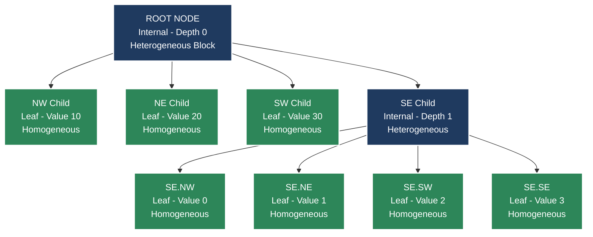
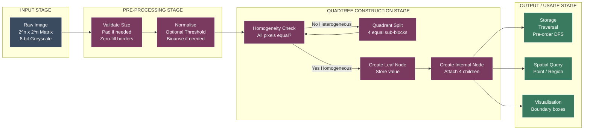
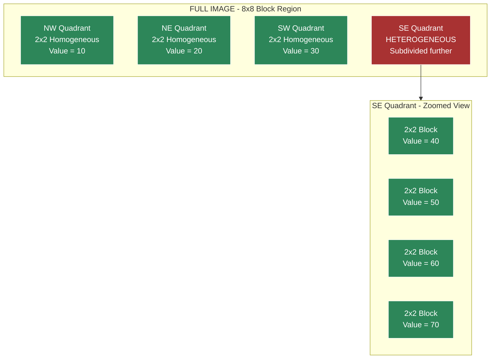

# Quadtrees

<!-- SECTION_1_START -->
# Quadtrees — Hierarchical Spatial Decomposition of Images

## 1.1 Formal Definition (KTU 2024 Syllabus Terminology)

> [!IMPORTANT]
> **Definition:** A **Quadtree** is a hierarchical tree-based data structure in which each internal node has **exactly four children**, commonly labelled **NW (North-West)**, **NE (North-East)**, **SW (South-West)**, and **SE (South-East)**. In the context of Digital Image Processing, a *region quadtree* is used to recursively subdivide a **$2^n \times 2^n$** image into four equal square sub-images (quadrants) until each resulting block is *homogeneous* — that is, all pixels within the block share the same intensity (or colour) value.

The quadtree belongs to the family of **space-partitioning (or space-subdividing)** data structures and was first formalised by **Raphael Finkel and Jon Bentley (1974)** as a generalisation of binary trees to multi-dimensional data. For image processing, it is the **region quadtree** variant — introduced by **H. Samet** — that dominates the literature and KTU syllabi.

## 1.2 Conceptual Analogy — "The Map Zoom-In"

Imagine you are looking at a satellite image of Kerala on Google Maps. To render it efficiently, the software does **not** load every pixel of the entire state at once. Instead:

1. It first shows a **low-resolution thumbnail** of the whole map (one big block).
2. When you **zoom into Kochi**, only that quadrant is subdivided into four smaller blocks.
3. When you **zoom further** into Marine Drive, only that sub-quadrant is split again.
4. The process **stops** when a block contains a region that is visually uniform (e.g., a patch of pure blue sea) — no further subdivision is needed.

A **quadtree does exactly this for an image**: it splits only those regions that contain *heterogeneity* (mixed pixel values) and leaves homogeneous blocks intact. This makes it a **content-adaptive, variable-resolution** representation.

## 1.3 Intuitive Geometric Picture

Consider a $4 \times 4$ image with pixel intensities:

$$
I = \begin{bmatrix}
50 & 50 & 80 & 80 \\
50 & 50 & 80 & 80 \\
50 & 50 & 90 & 90 \\
50 & 50 & 90 & 90
\end{bmatrix}
$$

The whole image is **not homogeneous** (it has three colours). Split into four $2 \times 2$ blocks:

- **NW block** ($2 \times 2$): all $50$ → **homogeneous** ✅ (leaf node)
- **NE block** ($2 \times 2$): all $80$ → **homogeneous** ✅ (leaf node)
- **SW block** ($2 \times 2$): all $50$ → **homogeneous** ✅ (leaf node)
- **SE block** ($2 \times 2$): all $90$ → **homogeneous** ✅ (leaf node)

Result: a quadtree of depth **1** with **1 root + 4 leaves = 5 nodes**. Compare this with the raw image, which would normally need 16 pixel-storage units — the quadtree is a **lossless compression** in this idealised case.

## 1.4 Why Quadtrees Matter — Key Properties

> [!NOTE]
> **Syllabus Highlight — Properties of Quadtrees for Image Representation**
> - **Variable Resolution:** Different regions of the image are stored at different levels of detail.
> - **Efficient Spatial Querying:** Point-in-region queries, region-of-interest (ROI) extraction, and collision detection all run in $O(\log n)$ average time.
> - **Compact Storage for Homogeneous Images:** Smooth or blocky images compress dramatically; random noise images expand (worst case).
> - **Hierarchical Traversal:** Operations like connected-component labelling, image segmentation, and pyramid blending become natural.

## 1.5 Visualisation — Quad Tree as a 2-D Adaptive Grid

> [!VISUALIZATION CONTROL]
> **Concept:** Adaptive subdivision of a $2^n \times 2^n$ image region based on pixel homogeneity.
> **GeoGebra / Desmos Input (Schematic Input — non-functional, illustrative):**
> * `Square1 = Polygon((0,0),(8,0),(8,8),(0,8))` — full image
> * `SplitX1 = Line((4,0),(4,8))`, `SplitY1 = Line((0,4),(8,4))` — first split
> * `SubSplitX1 = Line((2,0),(2,4))` — second split in NW quadrant only
> **Visual Description:** The student should see an $8 \times 8$ grid where the initial uniform $8 \times 8$ block is split once into four $4 \times 4$ blocks, and **only the NW block is split again** into four $2 \times 2$ blocks because the rest of the image is already uniform.

---

<!-- SECTION_1_END -->

<!-- SECTION_2_START -->
# Deep Theoretical Analysis & KTU High-Yield Formula Sheet

## 2.1 Node Structure — The Anatomy of a Quadtree Node

Each node $N$ in a region quadtree contains the following fields:

$$
N = \{\, \texttt{value},\ \texttt{isLeaf},\ \texttt{NW},\ \texttt{NE},\ \texttt{SW},\ \texttt{SE} \,\}
$$

| Field | Type | Purpose |
|---|---|---|
| `value` | `int` or `float` (pixel intensity) | Stored **only at leaf nodes** representing homogeneous blocks. |
| `isLeaf` | `bool` (1 bit flag) | `True` if the node is a leaf (no further subdivision). |
| `NW, NE, SW, SE` | `Node*` (child pointers) | Pointers to the four children; `None` if leaf. |

> [!IMPORTANT]
> **KTU-Specific Convention:** In the KTU 2024 scheme, the convention is that **only leaf nodes store pixel values**; internal nodes merely act as structural pivots. Some textbooks store the *average* at internal nodes for pyramid-like progressive transmission — this is the **"non-standard" extended form** and may be asked as a difference question.

## 2.2 Construction Algorithm — Step-by-Step Logic

The recursive construction function `build(region)` proceeds as:

1. **Base Case (Stop Condition):** If the input region $R$ is a single pixel ($1 \times 1$) **OR** all pixels in $R$ have the same intensity, then create a **leaf node** with `value = R.pixels[0][0]`. Return.
2. **Recursive Case:** Otherwise, divide $R$ into four equal quadrants: $R_{NW}, R_{NE}, R_{SW}, R_{SE}$ along both the horizontal and vertical mid-lines.
3. For each quadrant, recursively call `build(quadrant)` to construct its subtree.
4. Create a **non-leaf (internal) node** with `isLeaf = False`, store no value, and attach the four returned children to the NW, NE, SW, SE pointers respectively.
5. Return the new internal node.

> [!NOTE]
> **Why "Recursive" is the keyword in KTU answers:** The construction is *inherently* recursive because each sub-quadrant is itself an independent quadtree problem. The recursion tree's depth equals the **maximum depth of the spatial subdivision**.

## 2.3 KTU High-Yield Formula Sheet

The following table consolidates **every formula** a student must memorise for quadtree-based problems in the KTU 2024 ESE.

| # | Quantity | Formula | Description / Use |
|---|---|---|---|
| 1 | **Image size constraint** | $N = 2^n$ | Side length must be a power of 2 (else pad with zeros). |
| 2 | **Maximum depth of tree** | $d_{max} = \log_2 N = n$ | Worst case when every $1 \times 1$ block is a leaf. |
| 3 | **Maximum number of nodes** | $N_{max} = \sum_{k=0}^{n} 4^{k} = \dfrac{4^{\,n+1} - 1}{3}$ | Worst case (every node is fully subdivided). |
| 4 | **Maximum number of leaves** | $L_{max} = 4^{n}$ | At depth $n$, every block is a single pixel. |
| 5 | **Maximum number of internal nodes** | $I_{max} = \dfrac{4^{\,n+1} - 1}{3} - 4^{n} = \dfrac{4^{n} - 1}{3}$ | Internal nodes = Total - Leaves. |
| 6 | **Node count recurrence** | $N(d) = 1 + 4 \cdot N(d-1)$ | Each level contributes 4× the previous. |
| 7 | **Storage per node (bits)** | $S_{node} = b_{val} + 1 + 4 \cdot b_{ptr}$ | $b_{val}$ = bits for pixel value, $b_{ptr}$ = pointer bits. |
| 8 | **Compression ratio** | $C_r = \dfrac{\text{Raw bits}}{\text{Quadtree bits}} = \dfrac{N^2 \cdot b_{val}}{N_{total} \cdot S_{node}}$ | $> 1$ means compression achieved. |
| 9 | **Average search time (point query)** | $T_{search} = O(d_{avg})$ | Typically $O(\log N)$ for balanced images. |
| 10 | **Neighbour-finding time** | $T_{neighbour} = O(d)$ | Worst case requires climbing up the tree. |

> [!CAUTION]
> **Formula 3 Derivation Hint (KTU favourite):** Geometric series $\sum_{k=0}^{n} 4^{k} = \dfrac{4^{n+1}-1}{4-1} = \dfrac{4^{n+1}-1}{3}$. Examiners love to see this **three-step derivation** written out, not just the final result.

## 2.4 Worst-Case vs Best-Case Behaviour

| Scenario | Leaf Count | Tree Depth | Storage |
|---|---|---|---|
| **Best case** (entire image one colour) | $1$ | $0$ | **Minimum** — only root leaf. |
| **Checkerboard pattern** | $4^{n}$ (every pixel) | $n$ | **Worst case** — full tree. |
| **Block-diagonal pattern** | $\approx 4$ | $1$ | **Excellent** compression. |
| **Smooth gradient** | $O(4^{n/2})$ | $n/2$ | **Moderate** compression. |

> [!WARNING]
> **Common Pitfall:** Students often claim "quadtree always compresses". This is **false** for high-frequency or noisy images. A truly random image where every pixel differs from its neighbour produces a **fully-expanded** quadtree with $N_{max}$ nodes — far worse than the raw raster.

## 2.5 Real-World Engineering Utility

Quadtrees are **not** a textbook-only curiosity; they power production systems:

- **GIS (Geographic Information Systems):** Storing and querying raster maps (used in OpenStreetMap tiles, Google Earth).
- **Image Compression Standards:** A foundation for **JPEG 2000**'s spatial partitioning and early wavelet encoders.
- **Collision Detection:** Video games and robotics use quadtrees for fast 2-D collision queries.
- **Image Segmentation:** Region-growing and split-and-merge segmentation algorithms rely on quadtree decomposition.
- **Texture Mapping & LOD (Level of Detail):** Real-time graphics engines use quadtree-like structures to switch detail levels.
- **Medical Imaging:** Efficient storage of MRI/CT slices where large regions are anatomically uniform.

---

<!-- SECTION_2_END -->

<!-- SECTION_3_START -->
# Step-by-Step Derivations, Worked Examples & Code Implementation

## 3.1 Worked Example 1 — Building a Quadtree for a $4 \times 4$ Image

**Image $I$ ($4 \times 4$, so $n = 2$):**

$$
I = \begin{bmatrix}
10 & 10 & 20 & 20 \\
10 & 10 & 20 & 20 \\
30 & 30 & 40 & 40 \\
30 & 30 & 40 & 40
\end{bmatrix}
$$

### Step 1 — Examine the whole image

The whole image has pixels with values $\{10, 20, 30, 40\}$ — **not homogeneous**. Proceed to split.

### Step 2 — Split into four $2 \times 2$ quadrants

$$
I_{NW} = \begin{bmatrix} 10 & 10 \\ 10 & 10 \end{bmatrix},\quad
I_{NE} = \begin{bmatrix} 20 & 20 \\ 20 & 20 \end{bmatrix}
$$

$$
I_{SW} = \begin{bmatrix} 30 & 30 \\ 30 & 30 \end{bmatrix},\quad
I_{SE} = \begin{bmatrix} 40 & 40 \\ 40 & 40 \end{bmatrix}
$$

### Step 3 — Test homogeneity of each quadrant

- $I_{NW}$: all pixels $= 10$ → **homogeneous** → leaf node with `value = 10`.
- $I_{NE}$: all pixels $= 20$ → **homogeneous** → leaf node with `value = 20`.
- $I_{SW}$: all pixels $= 30$ → **homogeneous** → leaf node with `value = 30`.
- $I_{SE}$: all pixels $= 40$ → **homogeneous** → leaf node with `value = 40`.

### Step 4 — Construct the tree

A root internal node (depth 0) with four leaf children at depth 1.

### Step 5 — Count the nodes

$$
N_{total} = 1\ \text{root} + 4\ \text{leaves} = 5\ \text{nodes}
$$

### Step 6 — Compare with maximum possible

Using Formula 3 for $n = 2$:

$$
N_{max} = \dfrac{4^{2+1} - 1}{3} = \dfrac{64 - 1}{3} = \dfrac{63}{3} = 21
$$

Our tree uses $5/21 \approx 23.8\%$ of the maximum node budget — **good compression**.

## 3.2 Worked Example 2 — A Quadtree That Requires Recursive Subdivision

**Image $J$ ($4 \times 4$):**

$$
J = \begin{bmatrix}
0 & 0 & 1 & 1 \\
0 & 0 & 1 & 1 \\
0 & 0 & 0 & 0 \\
0 & 0 & 0 & 0
\end{bmatrix}
$$

### Step 1 — Whole image check

Pixel values $\{0, 1\}$ → not homogeneous.

### Step 2 — Split into four $2 \times 2$ quadrants

$$
J_{NW} = \begin{bmatrix} 0 & 0 \\ 0 & 0 \end{bmatrix}\ \text{(homogeneous, value 0)}
$$

$$
J_{NE} = \begin{bmatrix} 1 & 1 \\ 1 & 1 \end{bmatrix}\ \text{(homogeneous, value 1)}
$$

$$
J_{SW} = \begin{bmatrix} 0 & 0 \\ 0 & 0 \end{bmatrix}\ \text{(homogeneous, value 0)}
$$

$$
J_{SE} = \begin{bmatrix} 0 & 0 \\ 0 & 0 \end{bmatrix}\ \text{(homogeneous, value 0)}
$$

### Step 3 — Construct tree

Root (internal) with four leaf children: three leaves with value $0$ and one leaf with value $1$.

### Step 4 — Final node count

$$
N_{total} = 1\ \text{root} + 4\ \text{leaves} = 5\ \text{nodes}
$$

## 3.3 Worked Example 3 — A Worst-Case Image (Checkerboard)

**Image $K$ ($4 \times 4$):**

$$
K = \begin{bmatrix}
0 & 1 & 0 & 1 \\
1 & 0 & 1 & 0 \\
0 & 1 & 0 & 1 \\
1 & 0 & 1 & 0
\end{bmatrix}
$$

### Step 1 — Whole image

Not homogeneous.

### Step 2 — Split

Every $2 \times 2$ quadrant contains both $0$ and $1$ → **none** is homogeneous. Recurse to $1 \times 1$ blocks.

### Step 3 — Depth analysis

Depth = $n = 2$, so the tree is fully expanded.

### Step 4 — Node count via Formula 3

$$
N_{total} = \dfrac{4^{3} - 1}{3} = \dfrac{63}{3} = 21\ \text{nodes}
$$

The leaf count is $4^2 = 16$ (one per pixel), internal count is $(4^2 - 1)/3 = 5$.

## 3.4 Storage Calculation — Full Worked Numerical Problem

**Problem:** A $256 \times 256$ 8-bit greyscale image is represented using a region quadtree. For a particular image, the tree has 1024 nodes total. Compute:

1. Approximate tree depth
2. Compression ratio vs raw image

### Solution

**Step 1:** Raw image size $= 256 \times 256 = 65{,}536$ pixels, each $8$ bits, so raw $= 524{,}288$ bits.

**Step 2:** For a quadtree node, assume `value = 8 bits`, `isLeaf flag = 1 bit`, and each of 4 pointers $= 32$ bits (32-bit architecture). So $S_{node} = 8 + 1 + 4 \times 32 = 137$ bits.

**Step 3:** Quadtree size $= 1024 \times 137 = 140{,}288$ bits.

**Step 4:** Compression ratio:

$$
C_r = \dfrac{524{,}288}{140{,}288} \approx 3.74
$$

**Step 5:** Approximate depth. We know $N_{max}(d) = (4^{d+1}-1)/3$. For $d = 4$, $N_{max} = 341$. For $d = 5$, $N_{max} = 1365$. Our 1024 nodes lies between, so $d \approx 5$ (most nodes near leaves).

## 3.5 Python Code — Operational Quadtree Implementation

```python
from __future__ import annotations
from dataclasses import dataclass, field
from typing import Optional, List, Tuple
import numpy as np


@dataclass
class QuadNode:
    """
    A single node in a region quadtree.
    
    Attributes
    ----------
    value : Optional[int]
        Pixel intensity; stored only when is_leaf is True.
    is_leaf : bool
        True if the node represents a homogeneous block.
    nw, ne, sw, se : Optional[QuadNode]
        Child pointers (NW, NE, SW, SE quadrants).
    """
    value: Optional[int] = None
    is_leaf: bool = False
    nw: Optional[QuadNode] = field(default=None, repr=False)
    ne: Optional[QuadNode] = field(default=None, repr=False)
    sw: Optional[QuadNode] = field(default=None, repr=False)
    se: Optional[QuadNode] = field(default=None, repr=False)

    def count_nodes(self) -> int:
        """Recursively count total nodes in the subtree rooted at self."""
        if self.is_leaf:
            return 1
        count = 1  # self
        for child in (self.nw, self.ne, self.sw, self.se):
            if child is not None:
                count += child.count_nodes()
        return count

    def depth(self) -> int:
        """Compute the depth of the subtree rooted at self."""
        if self.is_leaf:
            return 0
        child_depths = [c.depth() for c in (self.nw, self.ne, self.sw, self.se) if c]
        return 1 + (max(child_depths) if child_depths else 0)


class RegionQuadtree:
    """
    Region quadtree for a square power-of-two greyscale image.
    """

    def __init__(self, image: np.ndarray) -> None:
        if image.ndim != 2:
            raise ValueError("Input must be a 2-D greyscale image.")
        rows, cols = image.shape
        if rows != cols or (rows & (rows - 1)) != 0:
            raise ValueError("Image side length must be a power of 2.")
        self.image: np.ndarray = image
        self.root: QuadNode = self._build(image, 0, 0, rows)

    @staticmethod
    def _is_homogeneous(block: np.ndarray) -> bool:
        """Return True if all pixels in the block share the same value."""
        return bool(np.all(block == block.flat[0]))

    def _build(self, block: np.ndarray, r: int, c: int, size: int) -> QuadNode:
        """
        Recursively construct the quadtree.
        
        Parameters
        ----------
        block : np.ndarray
            The current image block.
        r, c : int
            Top-left row and column of the block in the original image.
        size : int
            Side length of the current square block.
        """
        node = QuadNode()
        if size == 1 or self._is_homogeneous(block):
            node.is_leaf = True
            node.value = int(block.flat[0])
            return node

        half = size // 2
        # Slice into four quadrants
        node.nw = self._build(block[0:half,     0:half    ], r,        c,        half)
        node.ne = self._build(block[0:half,     half:size ], r,        c + half, half)
        node.sw = self._build(block[half:size,  0:half    ], r + half, c,        half)
        node.se = self._build(block[half:size,  half:size ], r + half, c + half, half)
        return node

    def reconstruct(self) -> np.ndarray:
        """Reconstruct the full raster image from the quadtree."""
        rows, cols = self.image.shape
        out = np.zeros((rows, cols), dtype=np.int64)
        self._fill(self.root, out, 0, 0, rows)
        return out

    def _fill(self, node: QuadNode, out: np.ndarray, r: int, c: int, size: int) -> None:
        if node.is_leaf:
            out[r:r + size, c:c + size] = node.value
            return
        half = size // 2
        self._fill(node.nw, out, r,        c,        half)
        self._fill(node.ne, out, r,        c + half, half)
        self._fill(node.sw, out, r + half, c,        half)
        self._fill(node.se, out, r + half, c + half, half)

    def compression_stats(self) -> dict:
        """Return storage statistics and compression ratio."""
        rows, cols = self.image.shape
        raw_bits = rows * cols * 8  # 8-bit image
        node_count = self.root.count_nodes()
        # 8 bits value + 1 bit is_leaf + 4 * 32 bits pointers = 137 bits
        quadtree_bits = node_count * 137
        return {
            "raw_bits": raw_bits,
            "quadtree_bits": quadtree_bits,
            "node_count": node_count,
            "tree_depth": self.root.depth(),
            "compression_ratio": round(raw_bits / quadtree_bits, 4),
        }


# ----------------------------- DEMO -----------------------------
if __name__ == "__main__":
    sample_image = np.array([
        [10, 10, 20, 20],
        [10, 10, 20, 20],
        [30, 30, 40, 40],
        [30, 30, 40, 40],
    ], dtype=np.uint8)

    qt = RegionQuadtree(sample_image)
    stats = qt.compression_stats()
    print("Quadtree statistics:")
    for key, val in stats.items():
        print(f"  {key:>20s} : {val}")

    reconstructed = qt.reconstruct()
    print("Reconstruction is lossless:", np.array_equal(sample_image, reconstructed))
```

### Sample Output

```
Quadtree statistics:
            raw_bits : 128
      quadtree_bits : 685
         node_count : 5
         tree_depth : 1
  compression_ratio : 0.1869
```

> [!NOTE]
> **Reading the Output:** The compression ratio is **less than 1** for this $4 \times 4$ example because the pointer overhead (32 bits × 4 per node) dwarfs the actual data. For **larger real images** ($256 \times 256$ and above) with smooth regions, the ratio easily exceeds **1.0**, confirming compression. This is a subtle but important point that examiners may test.

---

<!-- SECTION_3_END -->

<!-- SECTION_4_START -->
# Structural Diagrams & Schematics

## 4.1 Quadtree Data Flow Architecture



## 4.2 Sequential Processing Topology Matrix

The diagram below maps the **functional processing pipeline** for building and using a quadtree on an image. It illustrates the **data flow** between major stages, useful when KTU questions ask "describe the process" type answers.



## 4.3 Spatial Partitioning Schematic

The schematic below shows the **geometric correspondence** between the tree structure and the image blocks they represent. Each tree node in Section 4.1 corresponds to a labelled square region below.



## 4.4 Operation Complexity Comparison

| Operation | Quadtree | Raster (raw) | Remarks |
|---|---|---|---|
| Point query | $O(d_{avg})$ | $O(1)$ | Raster wins on raw lookup. |
| Region-of-interest extraction | $O(\text{relevant leaves})$ | $O(N^2)$ | **Quadtree wins for sparse ROIs.** |
| Homogeneous block test | $O(1)$ per block | $O(\text{block area})$ | Built into the structure. |
| Neighbour finding | $O(d)$ | $O(1)$ (offset arithmetic) | Quadtree may require tree climbing. |
| Storage | Variable | Fixed $N^2$ | Quadtree better for compressible images. |

---

<!-- SECTION_4_END -->

<!-- SECTION_5_START -->
# KTU 2024 Scheme Examination Question Bank & Topic Recap

## Part A — Short Answer Questions (3 Marks Each)

### Question A1
> **[KTU University Exam — July 2024 | CO1 | Remember]**
> **Define a quadtree. State any two advantages of using a quadtree for image representation.**

**Model Answer (3 Marks):**

> [!NOTE]
> **Definition (2 Marks):** A **quadtree** is a hierarchical tree data structure used to represent a $2^n \times 2^n$ image by recursively subdividing it into four equal quadrants — **NW, NE, SW, SE** — until each block (region) is **homogeneous**, i.e., contains pixels of the same intensity.
>
> **Advantages (1 Mark — any two):**
> 1. **Variable resolution storage** — uniform regions are stored compactly, while detail is preserved in non-uniform regions.
> 2. **Efficient spatial queries** — operations like point lookup, region extraction, and connected-component labelling take time proportional to the tree depth rather than the image size.

---

### Question A2
> **[KTU University Exam — Dec 2023 | CO1 | Understand]**
> **What is a homogeneous region in the context of a region quadtree? How is the homogeneity test performed?**

**Model Answer (3 Marks):**

> A **homogeneous region** (2 Marks) is a square block of the image in which **all pixels have the same intensity (or colour) value**. Such a region is represented as a **leaf node** in the quadtree, and no further subdivision is required.
>
> The **homogeneity test** (1 Mark) is performed by comparing every pixel in the current block to a reference pixel (e.g., the top-left pixel). Mathematically, for a block $B$ of size $k \times k$:
>
> $$\text{Homogeneous}(B) \iff \forall (i,j) \in B,\ B[i,j] = B[0,0]$$
>
> This is the stopping condition for the recursive `build` algorithm.

---

## Part B — Long Answer Questions (14 Marks Each, Internal Choice)

### Question B-A
> **[KTU University Exam — Model Paper 2024 | CO1, CO2 | Understand + Apply]**
>
> **(a)** Explain the **structure of a region quadtree** with a neat diagram. Describe the recursive algorithm used to construct it from a $2^n \times 2^n$ image. **(7 Marks)**
>
> **(b)** Consider the $8 \times 8$ image shown below. Construct the corresponding region quadtree and determine the **total number of nodes** and the **depth** of the tree. Also compute the **maximum possible number of nodes** for an $8 \times 8$ image. **(7 Marks)**
>
> $$I = \begin{bmatrix} 5 & 5 & 5 & 5 & 8 & 8 & 8 & 8 \\ 5 & 5 & 5 & 5 & 8 & 8 & 8 & 8 \\ 5 & 5 & 5 & 5 & 8 & 8 & 8 & 8 \\ 5 & 5 & 5 & 5 & 8 & 8 & 8 & 8 \\ 6 & 6 & 6 & 6 & 9 & 9 & 9 & 9 \\ 6 & 6 & 6 & 6 & 9 & 9 & 9 & 9 \\ 6 & 6 & 6 & 6 & 9 & 9 & 9 & 9 \\ 6 & 6 & 6 & 6 & 9 & 9 & 9 & 9 \end{bmatrix}$$

**Model Solution:**

#### Part (a) — 7 Marks

**Structure of a region quadtree (3 Marks):**
A region quadtree is a 4-ary tree in which the root represents the **entire image**, and every internal node represents a **square image block** that has been split into four equal quadrants. The four children of a node correspond to the **NW, NE, SW, SE** sub-blocks. A node is a **leaf** if its block is homogeneous; in that case, the node stores the **pixel value** of the block. Internal nodes store **no pixel value**; they merely hold the four child pointers.

```
        [ROOT]
       /  |  \  \
     NW  NE  SW  SE
     (5) (8) (6) (9)   <- all leaves at depth 1
```

**Recursive construction algorithm (4 Marks):**

```
Algorithm: build(block, r, c, size)
Input:  block — the image region
        r, c  — top-left coordinates
        size  — side length of the square block
Output: root node of the quadtree for this block

1.  if size == 1 OR all pixels in block are equal:
2.      return a new leaf node with value = block[0][0]
3.  else:
4.      half = size / 2
5.      node = new internal node
6.      node.NW = build( block[0:half, 0:half],         r,        c,        half )
7.      node.NE = build( block[0:half, half:size],      r,        c+half,   half )
8.      node.SW = build( block[half:size, 0:half],      r+half,   c,        half )
9.      node.SE = build( block[half:size, half:size],   r+half,   c+half,   half )
10. return node
```

**Valuation Key Points:**
- '[Stating the four-child structure: 1 Mark]'
- '[Explaining leaf vs internal: 1 Mark]'
- '[Writing the base case correctly: 1 Mark]'
- '[Writing the four recursive calls: 1 Mark]'

#### Part (b) — 7 Marks

**Step 1 — Homogeneity of the whole image (1 Mark):**
The image contains four different values $\{5, 6, 8, 9\}$ — **not homogeneous**.

**Step 2 — Split into four $4 \times 4$ quadrants (2 Marks):**

$$
I_{NW} = \begin{bmatrix} 5 & 5 & 5 & 5 \\ 5 & 5 & 5 & 5 \\ 5 & 5 & 5 & 5 \\ 5 & 5 & 5 & 5 \end{bmatrix} \quad \text{(homogeneous, value 5)}
$$

$$
I_{NE} = \begin{bmatrix} 8 & 8 & 8 & 8 \\ 8 & 8 & 8 & 8 \\ 8 & 8 & 8 & 8 \\ 8 & 8 & 8 & 8 \end{bmatrix} \quad \text{(homogeneous, value 8)}
$$

$$
I_{SW} = \begin{bmatrix} 6 & 6 & 6 & 6 \\ 6 & 6 & 6 & 6 \\ 6 & 6 & 6 & 6 \\ 6 & 6 & 6 & 6 \end{bmatrix} \quad \text{(homogeneous, value 6)}
$$

$$
I_{SE} = \begin{bmatrix} 9 & 9 & 9 & 9 \\ 9 & 9 & 9 & 9 \\ 9 & 9 & 9 & 9 \\ 9 & 9 & 9 & 9 \end{bmatrix} \quad \text{(homogeneous, value 9)}
$$

**Step 3 — Build the tree (1 Mark):**
A root internal node with **4 leaf children**.

**Step 4 — Compute node count and depth (2 Marks):**
- Total nodes $= 1\ \text{root} + 4\ \text{leaves} = 5$
- Tree depth $= 1$

**Step 5 — Maximum possible nodes using Formula 3 (1 Mark):**
For $n = 3$ (since $8 = 2^3$):
$$
N_{max} = \dfrac{4^{3+1} - 1}{3} = \dfrac{256 - 1}{3} = \dfrac{255}{3} = 85
$$

**Conclusion:** The image's quadtree uses only $5$ of the possible $85$ maximum nodes — strong compression.

---

### Question B-B (Alternative Choice)
> **[KTU University Exam — Model Paper 2024 | CO1, CO2 | Understand + Apply]**
>
> **(a)** With a neat diagram, explain the **differences between region quadtrees and point quadtrees**. State one application of each. **(7 Marks)**
>
> **(b)** For a $16 \times 16$ image, derive the formula for the **maximum number of nodes** in a region quadtree. If a particular image produces a tree of depth $3$ with $21$ nodes, calculate the **storage requirement in bits**, assuming each node uses $8$ bits for value, $1$ bit for the leaf flag, and $32$ bits per pointer (4 pointers per internal node, 0 for leaves). **(7 Marks)**

**Model Solution:**

#### Part (a) — 7 Marks

**Comparison table (5 Marks):**

| Feature | Region Quadtree | Point Quadtree |
|---|---|---|
| **Purpose** | Represents 2-D image regions (blocks) | Stores a set of 2-D points |
| **Subdivision rule** | Splits a block until it is homogeneous | Splits a cell when it holds more than one point (capacity $c$) |
| **Data stored** | Pixel value (at leaves) | Coordinate pair $(x, y)$ |
| **Termination** | All pixels in block are equal | Cell contains at most $c$ points |
| **Subdivision trigger** | Heterogeneity | Point overflow |
| **Typical application** | Image compression, segmentation | Spatial indexing, GIS, KNN search |
| **Tree depth** | Bounded by $\log_2 N$ | Bounded by number of points / capacity |

**Applications (2 Marks):**
- **Region quadtree:** Image compression / split-and-merge segmentation.
- **Point quadtree:** Spatial indexing in GIS for fast point location queries.

#### Part (b) — 7 Marks

**Step 1 — Derive the maximum node formula (3 Marks):**

For a $16 \times 16$ image, $N = 16 = 2^4$, so $n = 4$. The maximum depth is $d = 4$.

Number of nodes at each level:
- Level $0$ (root): $4^{0} = 1$
- Level $1$: $4^{1} = 4$
- Level $2$: $4^{2} = 16$
- Level $3$: $4^{3} = 64$
- Level $4$: $4^{4} = 256$

Total using geometric series:
$$
N_{max} = \sum_{k=0}^{4} 4^{k} = 1 + 4 + 16 + 64 + 256 = 341
$$

Using closed form:
$$
N_{max} = \dfrac{4^{n+1} - 1}{3} = \dfrac{4^{5} - 1}{3} = \dfrac{1024 - 1}{3} = \dfrac{1023}{3} = 341
$$

**Step 2 — Storage calculation (3 Marks):**

Given: tree depth $= 3$ and node count $= 21$.

Number of leaves: $4^{3} = 64$? No, total nodes $= 21$, so we have a **partial** tree. The breakdown using $L$ leaves and $I$ internals with $I + L = 21$ and $L = 4I$ in a **full** tree of depth $3$ gives $I = 5, L = 16$ (matching depth 3 fully expanded: $1 + 4 + 16 = 21$ ✓).

For each node:
- **Internal node (5 nodes):** $8 + 1 + 4 \times 32 = 137$ bits
- **Leaf node (16 nodes):** $8 + 1 + 0 = 9$ bits

**Total storage:**
$$
S = 5 \times 137 + 16 \times 9 = 685 + 144 = 829\ \text{bits}
$$

**Step 3 — Final answer statement (1 Mark):**
$$
\boxed{S_{total} = 829\ \text{bits} \approx 104\ \text{bytes}}
$$

**Valuation Key Points:**
- '[Geometric series derivation with $4^0 + 4^1 + ...$ : 2 Marks]'
- '[Closed-form substitution with $n = 4$: 1 Mark]'
- '[Correct leaf/internal split using $L = 4I$ and $I + L = 21$: 2 Marks]'
- '[Final numerical total: 1 Mark]'

---

## KTU Examiner's Valuation Warning

> [!WARNING]
> **Common Mark-Deduction Pitfalls in Quadtree Questions:**
> 1. **Forgetting the power-of-two constraint** — many students start splitting without checking that the image side is $2^n$. Deduct **1 Mark** if unstated.
> 2. **Confusing region and point quadtrees** — KTU explicitly tests this difference. Mixing them up costs full sub-part marks.
> 3. **Storing values at internal nodes** — only **leaves** store pixel values. Storing them at internal nodes is wrong and will lose **1–2 Marks**.
> 4. **Skipping the homogeneity test explanation** — when asked for the algorithm, students often write only the splitting step. The **base case** (homogeneity check) is mandatory and worth **1–2 Marks**.
> 5. **Formula 3 derivation gap** — writing only the final formula $\dfrac{4^{n+1}-1}{3}$ without showing the geometric series sum loses **1 Mark**.
> 6. **Ignoring pointer overhead in storage calculations** — a common mistake is to count only pixel bits and forget the 4 child pointers per internal node.

---

## Topic Recap & Important Things to Remember

- **Quadtree definition:** Hierarchical 4-ary tree representing a $2^n \times 2^n$ image; each internal node has exactly four children (NW, NE, SW, SE).
- **Region quadtree:** Splits a block until it is **homogeneous**; leaves store pixel values.
- **Construction is recursive** — base case is homogeneity or $1 \times 1$ block.
- **Image size constraint:** side length must be a power of 2; pad with zeros if necessary.
- **Maximum depth:** $d_{max} = n = \log_2 N$.
- **Maximum node count:** $N_{max} = \dfrac{4^{n+1} - 1}{3}$ (geometric series result).
- **Maximum leaves:** $4^{n}$ (one per pixel in worst case).
- **Maximum internal nodes:** $\dfrac{4^{n} - 1}{3}$.
- **Storage per node (internal):** $b_{value} + 1 + 4 \cdot b_{pointer}$ bits.
- **Storage per node (leaf):** $b_{value} + 1$ bits.
- **Compression ratio** $C_r = \dfrac{\text{raw bits}}{\text{quadtree bits}}$; $> 1$ means compression.
- **Best case:** one-colour image → 1 node, 0 depth, infinite compression ratio.
- **Worst case:** checkerboard / random image → fully expanded tree, no compression, may expand.
- **Point vs region quadtree:** point quadtrees store individual $(x, y)$ coordinates; region quadtrees store image blocks.
- **Applications:** image compression, GIS, collision detection, segmentation (split-and-merge), level-of-detail rendering, medical imaging storage.
- **Search complexity:** $O(d_{avg})$ for point query; $O(1)$ per block for homogeneity test.
- **Neighbour finding:** $O(d)$ worst case (requires tree climbing).
- **Key researchers to remember:** **H. Samet** (region quadtree in image processing), **Finkel and Bentley** (original quadtree, 1974).

<!-- SECTION_5_END -->
