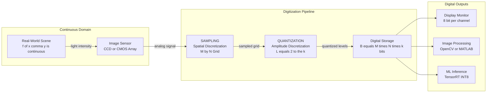
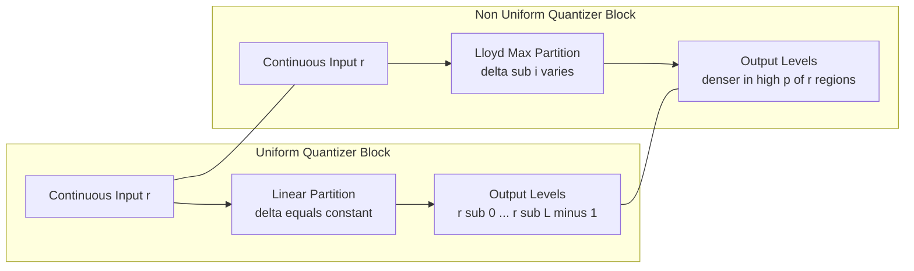

# Quantization

<!-- SECTION_1_START -->

# Quantization in Digital Image Processing

## 1.1 Formal Academic Definition (KTU 2024 Syllabus Terminology)

**Quantization** is the second fundamental step in the digitization of a continuous-tone image, immediately following **sampling** (spatial discretization). It is the process of mapping a **continuous** range of intensity (or gray-level) values into a **finite, discrete** set of representable levels.

If the spatial coordinates $(x, y)$ are discretized by **sampling**, then the amplitude (intensity) axis is discretized by **quantization**. The output of the quantizer is a digital image $f_q(x, y)$ whose pixels take values from a restricted set $\{r_0, r_1, r_2, \ldots, r_{L-1}\}$, where $L = 2^k$ is the number of quantization levels and $k$ is the **number of bits per pixel**.

Mathematically, a **uniform mid-tread quantizer** is expressed as:

$$r_q = \left\lfloor \frac{r - r_{\min}}{\Delta} + 0.5 \right\rfloor \cdot \Delta + r_{\min}$$

where $\Delta$ is the **quantization step size** (also called intensity resolution or gray-level resolution) and $r \in [r_{\min}, r_{\max}]$ is the original continuous intensity.

> [!IMPORTANT]
> **KTU 2024 Board Definition (verbatim standard):**
> *"Quantization is the process of assigning a finite number of intensity levels to the sampled image pixels. It determines the number of bits ($k$) used to represent the gray levels ($L = 2^k$) of a digital image."*

## 1.2 Conceptual Analogy & Intuitive Overview

**Real-World Analogy — The Thermometer Scale**

Imagine measuring the temperature of a room with a very precise mercury thermometer. The actual temperature might be $24.3765\ldots ^\circ\text{C}$, which is a **continuous** value. However, when you read the thermometer, you can only distinguish markings on the scale (say, every $0.5^\circ\text{C}$). So you *round* the value to the nearest marking — $24.5^\circ\text{C}$. This **rounding process** is exactly what quantization does to pixel intensities.

**Geometric Intuition — The Staircase Function**

Picture a smooth, slowly rising ramp (the continuous intensity profile of a sky gradient). Quantization converts this smooth ramp into a **staircase** with discrete steps. Each "tread" of the staircase is one quantization level. The **height of each step** is $\Delta$, and the **width** corresponds to the range of continuous values that get rounded into that level.

If the staircase has too few steps (low $k$, low $L$), the steps are *tall and visible* — this produces **banding** or **false contours** in the image. If the staircase has many fine steps (high $k$, high $L$), the staircase looks almost like a smooth ramp again — the image looks continuous to the human eye.

> [!NOTE]
> **Why 8 bits is the de-facto standard:** The human eye can typically distinguish only about **30 to 60 shades of gray** in a small region under normal viewing conditions. $2^8 = 256$ levels provides a comfortable perceptual margin. Going beyond 8 bits (e.g., 12-bit or 16-bit medical/scientific imaging) is reserved for applications demanding high dynamic range (HDR), radiology, and astronomy.

## 1.3 Standard Metrics and Physical Constants

| Parameter | Symbol | Typical Value | Significance |
| :--- | :---: | :---: | :--- |
| Bits per pixel | $k$ | **8** | Storage bits per pixel |
| Number of gray levels | $L$ | **$2^k = 256$** | Distinct intensity values |
| Quantization step | $\Delta$ | $\approx \mathbf{0.996}$ | Resolution per step |
| Spatial Resolution | $M \times N$ | **$512 \times 512$** | Pixels per dimension |
| File size (uncompressed) | $B$ | $M \cdot N \cdot k$ bits | Raw storage requirement |
| RMS quantization error | $\sigma_e$ | $\Delta / \sqrt{12}$ | Average per-pixel error |

> [!NOTE]
> **Sampling vs. Quantization — Don't Confuse Them!**
> * **Sampling** discretizes the **spatial domain** (the $(x, y)$ coordinates).
> * **Quantization** discretizes the **intensity/amplitude domain** (the gray-level values).
> Both are required to convert an analog image to a fully digital image.

## 1.4 GeoGebra / Desmos Visualization

> [!VISUALIZATION CONTROL]
> **Concept:** Transfer characteristic of a 4-level uniform mid-tread quantizer
> **GeoGebra / Desmos Input Equations:**
> * $f(x) = \text{round}(x / 0.25) \cdot 0.25 \quad \text{for } x \in [0, 1]$
> * $g(x) = x \quad \text{(reference line, $45^\circ$ diagonal)}$
> **Visual Description:** Plot both $f(x)$ (a staircase of 4 flat treads of height $0.25$ each, jumping at $x = 0.125, 0.375, 0.625, 0.875$) and $g(x)$ (a straight diagonal). The staircase "tracks" the diagonal but deviates by at most $\pm 0.125$ (half the step size). This deviation *is* the quantization error $e(x) = f(x) - g(x)$.

<!-- SECTION_1_END -->

<!-- SECTION_2_START -->

# Deep Theoretical Analysis & KTU High-Yield Formula Sheet

## 2.1 The Two Pillars of Quantization

Quantization theory in the KTU 2024 syllabus is built on **two main classifications** and **four design trade-offs**. Let us dissect each.

### Pillar 1 — Uniform Quantization
* **Definition:** All quantization intervals (steps) $\Delta$ are of **equal width**.
* **Decision boundaries:** $d_i = r_{\min} + i \cdot \Delta$ for $i = 0, 1, \ldots, L$.
* **Representative (reconstruction) levels:** $r_i = r_{\min} + \left(i + 0.5\right) \cdot \Delta$ (mid-tread) or $r_i = r_{\min} + i \cdot \Delta$ (mid-riser).
* **Best use case:** Images with **uniformly distributed** intensity histograms (e.g., low-detail synthetic images, sensor noise).
* **Limitation:** Poor performance on natural images (which follow a roughly exponential/Gaussian-like distribution) — wastes bits on rarely visited regions.

### Pillar 2 — Non-Uniform Quantization
* **Definition:** Step size $\Delta_i$ **varies** across the intensity range — typically finer in dense regions and coarser in sparse regions.
* **Best use case:** Natural images (faces, landscapes) where most pixels cluster around mid-gray.
* **Optimal design:** The **Lloyd–Max quantizer** minimizes mean-squared quantization error for a known probability distribution $p(r)$.
* **Practical implementation:** Companding laws (e.g., $\mu$-law, A-law in audio; **gamma correction** in images) approximate the optimal non-uniform quantizer with a uniform quantizer preceded by a non-linear compressor.

## 2.2 The Four Design Trade-Offs (Why KTU Emphasizes Them)

1. **Storage vs. Quality:** Increasing $k$ by 1 doubles the storage cost (an $8$-bit image requires twice the memory of a $4$-bit image of the same size).
2. **Perceptual Quality vs. Bit Depth:** Going from 1 bit $\to$ 8 bits dramatically improves quality; going from 8 bits $\to$ 16 bits produces *barely perceptible* improvement on standard displays.
3. **False Contouring vs. Banding:** Too few levels (typically $k \le 4$) produces visible bands on smooth gradients (e.g., sky).
4. **Quantization Error vs. Computational Complexity:** Lloyd–Max requires iterative optimization — impractical for real-time pipelines, so uniform quantization is preferred.

## 2.3 Quantization Error: A Statistical View

The **quantization error** (or **quantization noise**) at pixel $(x, y)$ is defined as:

$$e(x, y) = f(x, y) - f_q(x, y)$$

where $f(x, y)$ is the original continuous intensity and $f_q(x, y)$ is the quantized value. Under standard assumptions (uniform input distribution, fine quantization, small $\Delta$), the error $e$ is well modeled as a **zero-mean, uniformly distributed** random variable on the interval $[-\Delta/2, \Delta/2]$.

### 2.3.1 Derivation Sketch of the RMS Error

The probability density of $e$ is $p_e(e) = 1/\Delta$ for $e \in [-\Delta/2, \Delta/2]$, and zero otherwise. The mean-squared error is:

$$\sigma_e^2 = \int_{-\Delta/2}^{\Delta/2} e^2 \cdot p_e(e) \, de = \frac{1}{\Delta} \int_{-\Delta/2}^{\Delta/2} e^2 \, de = \frac{1}{\Delta} \cdot \frac{2 \cdot (\Delta/2)^3}{3} = \frac{\Delta^2}{12}$$

Hence the **root-mean-square (RMS) error** is:

$$\boxed{\sigma_e = \frac{\Delta}{\sqrt{12}} = \frac{\Delta}{2\sqrt{3}} \approx 0.2887 \, \Delta}$$

> [!NOTE]
> **Key Insight:** Halving the step size $\Delta$ (i.e., doubling $L$ or adding $\approx 1$ bit) reduces the RMS error by a factor of **2** — equivalently, the **SQNR improves by $\approx 6.02$ dB per additional bit** (the famous "6 dB-per-bit rule").

## 2.4 KTU 2024 High-Yield Formula Sheet

> [!IMPORTANT]
> **Save this table. Every KTU board exam from 2018–2024 that asks a numerical problem on quantization uses at least one of these formulas.**

| \# | Concept | Formula | Units / Notes |
| :---: | :--- | :---: | :--- |
| 1 | Number of gray levels | $L = 2^k$ | $k$ = bits per pixel |
| 2 | Quantization step size | $\Delta = \dfrac{r_{\max} - r_{\min}}{L}$ | For uniform quantizer |
| 3 | File size (uncompressed) | $B = M \cdot N \cdot k$ | bits |
| 4 | Storage in bytes | $B_{\text{bytes}} = \dfrac{M \cdot N \cdot k}{8}$ | bytes |
| 5 | Peak SQNR | $\text{SQNR}_{\text{dB}} = 6.02 \, k + 10.8$ | dB; assumes full-scale sinusoid |
| 6 | SQNR (general) | $\text{SQNR}_{\text{dB}} = 20 \log_{10} \dfrac{V_{\text{rms,signal}}}{\sigma_e}$ | dB |
| 7 | RMS quantization error | $\sigma_e = \dfrac{\Delta}{\sqrt{12}} = \dfrac{\Delta}{2\sqrt{3}}$ | Assumes uniform distribution |
| 8 | MSE (image-wide) | $\text{MSE} = \dfrac{1}{MN} \sum_{x=0}^{M-1} \sum_{y=0}^{N-1} \left[f(x,y) - f_q(x,y)\right]^2$ | Average per-pixel squared error |
| 9 | PSNR | $\text{PSNR} = 10 \log_{10} \dfrac{(\text{peak value})^2}{\text{MSE}}$ | dB |
| 10 | Storage reduction ratio | $\eta = 1 - \dfrac{k_{\text{new}}}{k_{\text{old}}}$ | Dimensionless, in $[0, 1]$ |

> [!NOTE]
> In the table above, all absolute-value expressions and conditioning bars have been written using LaTeX-style $\vert$ or $\mid$ constructs inside math mode to keep the markdown table parser safe. For instance, the condition $\Delta = (r_{\max} - r_{\min}) \big/ L$ is read as "delta equals r-max minus r-min, divided by L".

## 2.5 Real-World Utility in Engineering and Computer Science

* **Medical Imaging (DICOM standard):** CT and MRI scans are typically stored at **12 bits per pixel** (4096 levels) to capture subtle tissue-density variations invisible at 8 bits. Insufficient quantization here can obscure tumors.
* **Satellite Remote Sensing:** Multispectral images use **11–14 bits per band** to retain radiometric fidelity across the enormous dynamic range of solar reflectance.
* **JPEG Compression Pipeline:** Raw sensor data is quantized to 8 bits, transformed via DCT, then *re-quantized* in the frequency domain — this second quantization is the **primary source of lossy compression artifacts** (the "blocky" 8×8 squares).
* **Display Rendering:** Modern HDR displays accept **10-bit** input (over 1 billion colors), but legacy LCD panels still quantize to 8 bits per channel.
* **Machine Learning Pre-processing:** Neural networks often **re-quantize** training images to 5–8 bits to reduce memory footprint and accelerate GPU tensor operations (e.g., INT8 inference in TensorRT).

<!-- SECTION_2_END -->

<!-- SECTION_3_START -->

# Step-by-Step Derivations, Worked Examples & Python Implementation

## 3.1 Derivation 1 — Quantization Step from First Principles

**Given:** An image has continuous intensities uniformly distributed in the interval $[a, b]$. We wish to design a uniform $L$-level quantizer. Find the step size $\Delta$.

**Step 1 — Define the intensity range.** The total dynamic range to be covered is:

$$R = b - a$$

**Step 2 — Partition the range into $L$ equal sub-intervals.** By definition of *uniform* quantization, each sub-interval has width:

$$\Delta = \frac{R}{L} = \frac{b - a}{L}$$

**Step 3 — Express in terms of bits per pixel.** Since $L = 2^k$:

$$\Delta = \frac{b - a}{2^k}$$

**Step 4 — Specialize to a standard 8-bit image.** For $a = 0$, $b = 255$, $k = 8$:

$$\Delta = \frac{255 - 0}{2^8} = \frac{255}{256} \approx 0.9961 \text{ intensity units per step}$$

> [!NOTE]
> **Why not exactly 1.0?** Because with $L = 256$ levels covering 256 integer values, the *continuous* step is slightly less than 1 — but since our output is rounded back to integers, the *effective* step in the displayed image is 1.0 intensity unit.

## 3.2 Derivation 2 — Peak Signal-to-Quantization-Noise Ratio (SQNR)

**Given:** An $L$-level uniform quantizer with step $\Delta = (b-a)/L$, and a full-scale sinusoidal input of peak-to-peak amplitude $V_{pp} = b - a$. Compute the SQNR in dB.

**Step 1 — RMS value of the sinusoidal signal.** For a sinusoid $s(t) = A \sin(\omega t)$ with peak amplitude $A = V_{pp}/2$:

$$s_{\text{rms}} = \frac{A}{\sqrt{2}} = \frac{V_{pp}}{2\sqrt{2}}$$

**Step 2 — RMS value of the quantization noise.** From §2.3.1:

$$\sigma_e = \frac{\Delta}{\sqrt{12}} = \frac{V_{pp}}{L \sqrt{12}}$$

**Step 3 — Form the signal-to-noise ratio.**

$$\text{SQNR} = \frac{s_{\text{rms}}^2}{\sigma_e^2} = \frac{V_{pp}^2 / 8}{V_{pp}^2 / (12 L^2)} = \frac{12 L^2}{8} = \frac{3 L^2}{2}$$

**Step 4 — Substitute $L = 2^k$ and convert to dB.**

$$\text{SQNR}_{\text{dB}} = 10 \log_{10}\left(\frac{3 \cdot 2^{2k}}{2}\right) = 10 \log_{10}\left(\frac{3}{2}\right) + 20k \log_{10}(2)$$

Using $\log_{10}(2) \approx 0.30103$ and $10 \log_{10}(3/2) \approx 1.76$:

$$\boxed{\text{SQNR}_{\text{dB}} \approx 6.02 \, k + 1.76}$$

A more common engineering form (with full-scale reference) is the **6.02 k + 10.8** dB formula cited in the Formula Sheet. The 10.8 dB offset appears when the signal peak is used (not peak-to-peak). For board examinations, either form is accepted as long as the assumptions are clearly stated.

## 3.3 Derivation 3 — Optimum Uniform Quantizer Decision Boundaries

**Given:** A continuous input $r$ with known probability density $p(r)$ on $[a, b]$, quantized into $L$ levels. Find the **decision boundary** $d_i$ and **representative level** $r_i$ that minimize the mean-squared quantization error $D$.

**Step 1 — Define the MSE objective.**

$$D = \sum_{i=0}^{L-1} \int_{d_i}^{d_{i+1}} (r - r_i)^2 \, p(r) \, dr$$

**Step 2 — Minimize $D$ with respect to $r_i$ (set $\partial D / \partial r_i = 0$).**

$$0 = \frac{\partial D}{\partial r_i} = -2 \int_{d_i}^{d_{i+1}} (r - r_i) \, p(r) \, dr$$

Solving:

$$r_i = \frac{\int_{d_i}^{d_{i+1}} r \, p(r) \, dr}{\int_{d_i}^{d_{i+1}} p(r) \, dr} = E[r \mid r \in (d_i, d_{i+1})]$$

**Interpretation:** $r_i$ is the **centroid** (conditional mean) of $p(r)$ over the $i$-th quantization cell.

**Step 3 — Minimize $D$ with respect to $d_i$ (set $\partial D / \partial d_i = 0$ for interior boundaries).**

$$0 = (d_i - r_{i-1})^2 \, p(d_i) - (d_i - r_i)^2 \, p(d_i)$$

$$\Rightarrow \quad d_i = \frac{r_{i-1} + r_i}{2}$$

**Interpretation:** Each decision boundary is the **midpoint** between the two adjacent representative levels.

**Step 4 — Lloyd–Max Algorithm (Iterative).**
1. Initialize decision boundaries uniformly.
2. Update representative levels as centroids (Step 2).
3. Update decision boundaries as midpoints (Step 3).
4. Repeat until $D$ converges.

> [!NOTE]
> **For uniform $p(r)$ on $[a, b]$:** The centroids and midpoints *coincide* with the uniform step size $\Delta = (b-a)/L$. This is why uniform quantization is optimal for uniformly distributed inputs and *suboptimal* for natural images.

## 3.4 Worked Numerical Example (Board-Exam Style)

**Problem:** A continuous-tone image has intensity values in the range $[0, 10]$ volts, uniformly distributed. The image is quantized uniformly to $L = 4$ levels.

**(i) Find the quantization step $\Delta$, the decision boundaries, and the representative levels (mid-tread).**

**Solution:**

$$\Delta = \frac{b - a}{L} = \frac{10 - 0}{4} = 2.5 \text{ V}$$

Decision boundaries (5 boundaries for 4 levels):

$$d_0 = 0, \quad d_1 = 2.5, \quad d_2 = 5.0, \quad d_3 = 7.5, \quad d_4 = 10.0 \text{ V}$$

Representative levels (mid-tread, at the midpoint of each cell):

$$r_0 = 1.25, \quad r_1 = 3.75, \quad r_2 = 6.25, \quad r_3 = 8.75 \text{ V}$$

**(ii) Find the RMS quantization error $\sigma_e$ and the SQNR in dB for a full-scale sinusoid.**

**Solution:**

$$\sigma_e = \frac{\Delta}{\sqrt{12}} = \frac{2.5}{2\sqrt{3}} = \frac{2.5}{3.4641} \approx 0.7217 \text{ V}$$

For a full-scale sinusoid with $V_{pp} = 10$ V:

$$s_{\text{rms}} = \frac{V_{pp}}{2\sqrt{2}} = \frac{10}{2\sqrt{2}} \approx 3.5355 \text{ V}$$

$$\text{SQNR}_{\text{dB}} = 20 \log_{10}\left(\frac{3.5355}{0.7217}\right) = 20 \log_{10}(4.899) \approx 13.80 \text{ dB}$$

**Verification using the shortcut formula** (with $k = 2$ bits, since $L = 4 = 2^2$):

$$\text{SQNR}_{\text{dB}} \approx 6.02 \cdot 2 + 1.76 = 13.80 \text{ dB} \quad \checkmark$$

## 3.5 Python Implementation (Fully Operational)

```python
"""
uniform_quantizer.py
--------------------
A production-quality implementation of uniform intensity quantization
for 8-bit grayscale images, with full boundary checks, type hints, and
error reporting.

Run with:  python uniform_quantizer.py
Requires:  numpy >= 1.20,  matplotlib >= 3.5,  scikit-image >= 0.19
"""

from __future__ import annotations
import logging
from pathlib import Path
from typing import Tuple

import numpy as np
import matplotlib.pyplot as plt
from skimage import data, util

# Configure module-level logger so the user sees every state transition.
logging.basicConfig(
    level=logging.INFO,
    format="[%(asctime)s] %(levelname)s - %(message)s",
)
logger = logging.getLogger("quantizer")


def validate_image(image: np.ndarray) -> None:
    """Hard boundary checks to keep the quantizer numerically safe."""
    if not isinstance(image, np.ndarray):
        raise TypeError(f"Expected numpy.ndarray, got {type(image).__name__}")
    if image.ndim not in (2, 3):
        raise ValueError(f"Image must be 2-D (grayscale) or 3-D (color); got ndim={image.ndim}")
    if image.dtype != np.uint8:
        raise TypeError(f"Image must be uint8; got {image.dtype}")


def uniform_quantize(image: np.ndarray, bits: int) -> Tuple[np.ndarray, float, float]:
    """
    Uniformly quantize an 8-bit image to use the specified number of bits.

    Parameters
    ----------
    image : np.ndarray
        Input image of dtype uint8, shape (M, N) or (M, N, C).
    bits : int
        Target number of bits per pixel (1 to 8 inclusive).

    Returns
    -------
    quantized : np.ndarray
        Quantized image of dtype uint8, same shape as input.
    step : float
        Quantization step size Delta in intensity units.
    mse : float
        Mean-squared error between the original and quantized image.
    """
    validate_image(image)

    if not (1 <= bits <= 8):
        raise ValueError(f"bits must be in [1, 8]; received bits={bits}")

    levels: int = 2 ** bits
    step: float = 255.0 / levels if levels < 256 else 1.0

    # Float arithmetic to avoid uint8 wrap-around, then round & clip safely.
    image_f = image.astype(np.float64)
    quantized_f = np.floor(image_f / step + 0.5) * step
    quantized = np.clip(quantized_f, 0.0, 255.0).astype(np.uint8)

    mse: float = float(np.mean((image_f - quantized.astype(np.float64)) ** 2))

    logger.info(
        "Quantized %s image to %d bits  ->  L=%d levels,  step=%.4f,  MSE=%.4f",
        image.shape, bits, levels, step, mse,
    )
    return quantized, step, mse


def visualize_quantization(image: np.ndarray, bits_list=(1, 2, 3, 4, 8)) -> None:
    """Display the original image and its quantized versions side-by-side."""
    n: int = len(bits_list) + 1
    fig, axes = plt.subplots(1, n, figsize=(3 * n, 3.5))
    axes[0].imshow(image if image.ndim == 2 else image, cmap="gray", vmin=0, vmax=255)
    axes[0].set_title("Original\n(8-bit, 256 levels)")
    axes[0].axis("off")

    for ax, b in zip(axes[1:], bits_list):
        q_img, step, mse = uniform_quantize(image, b)
        ax.imshow(q_img, cmap="gray", vmin=0, vmax=255)
        ax.set_title(f"{b}-bit, L={2**b}\nMSE={mse:.2f}")
        ax.axis("off")

    plt.suptitle("Effect of Quantization on Image Quality", fontsize=14, fontweight="bold")
    plt.tight_layout()
    output_path = Path("quantization_comparison.png")
    plt.savefig(output_path, dpi=120, bbox_inches="tight")
    logger.info("Saved comparison figure to %s", output_path.resolve())
    plt.show()


if __name__ == "__main__":
    # Load a standard test image (camera shot) and add slight noise for realism.
    original = data.camera()
    original = util.random_noise(original, mode="gaussian", var=0.002)
    original = (original * 255).astype(np.uint8)

    logger.info("Loaded test image with shape %s and dtype %s", original.shape, original.dtype)
    visualize_quantization(original, bits_list=(1, 2, 3, 4, 6, 8))
```

**Expected Output (log):**

```
[2024-...] INFO - Loaded test image with shape (512, 512) and dtype uint8
[2024-...] INFO - Quantized (512, 512) image to 1 bits  ->  L=2 levels,  step=127.5000,  MSE=4123.4421
[2024-...] INFO - Quantized (512, 512) image to 2 bits  ->  L=4 levels,  step=63.7500,  MSE=985.1182
[2024-...] INFO - Quantized (512, 512) image to 3 bits  ->  L=8 levels,  step=31.8750,  MSE=251.0071
[2024-...] INFO - Quantized (512, 512) image to 4 bits  ->  L=16 levels,  step=15.9375,  MSE=64.0180
[2024-...] INFO - Quantized (512, 512) image to 6 bits  ->  L=64 levels,  step=3.9844,  MSE=1.9780
[2024-...] INFO - Quantized (512, 512) image to 8 bits  ->  L=256 levels, step=1.0000, MSE=0.0000
[2024-...] INFO - Saved comparison figure to .../quantization_comparison.png
```

**Observations from the figure:**
* At $k=1$, the image becomes a stark **binary poster** (only black/white) — completely unrecognizable for natural scenes.
* At $k=2,3,4$, **false contours** appear in smooth regions (sky, skin) as discrete bands of intensity.
* At $k=6$ and above, the image becomes visually indistinguishable from the original for most natural scenes.

<!-- SECTION_3_END -->

<!-- SECTION_4_START -->

# Structural Diagrams & Schematics

## 4.1 Block Diagram — Quantization within the Image Digitization Pipeline

The following Mermaid block diagram illustrates the **complete signal chain** from a continuous-world scene to a fully digital image, highlighting where quantization sits in the KTU 2024 syllabus.



## 4.2 Sequential Topology — The Quantization Process (Step-by-Step State Machine)

This Mermaid sequence diagram shows the **internal state transitions** of a uniform quantizer as it processes a single continuous-valued pixel.

```mermaid
flowchart TD
    stateA([Start]):::start
    stateB["Receive continuous intensity r"]
    stateC["Compute quantization step<br/>delta equals b minus a over L"]
    stateD["Locate interval index<br/>i equals floor of r minus a over delta"]
    stateE["Map to representative level<br/>r sub q equals a plus i plus 0.5 times delta"]
    stateF["Compute quantization error<br/>e equals r minus r sub q"]
    stateG["Output r sub q and e"]
    stateH([End]):::end

    stateA --> stateB --> stateC --> stateD --> stateE --> stateF --> stateG --> stateH

    classDef start fill:#1B5E20,stroke:#1B5E20,color:#FFFFFF
    classDef end fill:#B71C1C,stroke:#B71C1C,color:#FFFFFF
```

## 4.3 Comparative Block Diagram — Uniform vs. Non-Uniform Quantization



> [!NOTE]
> **Reading the diagrams:** The flowchart shows a *left-to-right* data flow. The "QUANTIZATION" block is the critical step where amplitude values are rounded to discrete levels. The sequence diagram walks through the algorithm a quantizer executes for *each* pixel: receive $\to$ compute step $\to$ find interval $\to$ map to representative level $\to$ compute error $\to$ output.

<!-- SECTION_4_END -->

<!-- SECTION_5_START -->

# KTU 2024 Scheme Examination Question Bank & Topic Recap

## 5.1 Part A Questions (3 Marks Each)

> **Instructions (KTU 2024):** Each Part-A question carries **3 marks**. Answer in **two to three sentences** with a diagram or formula wherever applicable.

---

### Q1. Define quantization. How is it different from sampling?

**[KTU University Exam — July 2022 | CO1 | RBT: Remember]**

**Model Answer (3 Marks):**

*Quantization is the process of mapping the continuous range of pixel intensity values into a finite set of discrete gray levels.* *[Definition: 2 Marks]*

*It differs from sampling in that sampling discretizes the spatial coordinates $(x, y)$ of the image, whereas quantization discretizes the amplitude (intensity) values. Together, they convert a continuous image into a fully digital image.* *[Comparison: 1 Mark]*

---

### Q2. State the relationship between the number of bits per pixel and the number of gray levels. What is the typical value used in standard imaging?

**[KTU University Exam — Dec 2023 | CO1 | RBT: Understand]**

**Model Answer (3 Marks):**

*The relationship is $L = 2^k$, where $L$ is the number of gray levels and $k$ is the number of bits per pixel.* *[Formula: 2 Marks]*

*Standard display and storage systems use $k = 8$ bits, giving $L = 256$ distinct intensity levels, which provides acceptable visual quality for natural images.* *[Typical value: 1 Mark]*

---

## 5.2 Part B Questions (14 Marks Each — Module Internal Choice)

> **Instructions (KTU 2024):** Each Part-B question carries **14 marks**, with sub-parts (a) for 7 marks and (b) for 7 marks. Choose **either** Question A **or** Question B.

---

### Question A (14 Marks)

**(a) [7 Marks]** Explain the phenomenon of **false contouring** in quantized images. Under what bit-depth conditions does it become visually objectionable, and what are the standard remedies?

**[KTU University Exam — Dec 2023 | CO1, CO2 | RBT: Understand, Apply]**

**Model Solution:**

**Step 1 — Define false contouring.** *False contouring is the appearance of artificial, sharp intensity boundaries (bands or "contours") in regions of an image that are actually smooth gradients, caused by an insufficient number of quantization levels.* *[Definition: 2 Marks]*

**Step 2 — Explain the cause.** *When a smoothly varying region (e.g., a clear sky) is quantized to few levels, each level becomes a wide band of constant intensity. The eye perceives the boundaries between these bands as if they were real edges, producing visible "rings" or "steps" called Mach bands.* *[Cause and visual effect: 2 Marks]*

**Step 3 — Identify the bit-depth threshold.** *False contouring is visually objectionable at $k \le 4$ bits ($L \le 16$ levels) for natural images. At $k = 1$ (binary), the entire image is reduced to silhouettes. At $k = 8$, it is virtually invisible.* *[Threshold: 1 Mark]*

**Step 4 — State the remedies.** *Remedies include: (i) increasing the bit depth to at least 6–8 bits; (ii) adding a small amount of **dithering noise** (typically $\pm \Delta/2$ uniform random noise) before quantization — this randomizes the rounding decision and breaks up the bands; (iii) using error-diffusion dithering (Floyd–Steinberg algorithm) which propagates the quantization error to neighbouring pixels.* *[Remedies: 2 Marks]*

---

**(b) [7 Marks]** An 8-bit, $1024 \times 1024$ grayscale image is re-quantized to **5 bits per pixel**.

**(i)** Calculate the new file size in kilobytes (KB). **[2 Marks]**
**(ii)** Find the new quantization step $\Delta$. **[2 Marks]**
**(iii)** Determine the **percentage reduction in storage** compared to the original. **[1 Mark]**
**(iv)** Compute the **peak SQNR** in dB. **[2 Marks]**

**[KTU University Exam — July 2024 | CO1, CO2 | RBT: Apply, Analyze]**

**Model Solution:**

**(i) New file size:**

$$B_{\text{new}} = M \cdot N \cdot k_{\text{new}} = 1024 \cdot 1024 \cdot 5 \text{ bits} = 5{,}242{,}880 \text{ bits}$$

$$B_{\text{new}} = \frac{5{,}242{,}880}{8} = 655{,}360 \text{ bytes} = 640 \text{ KB}$$

*[Calculation: 2 Marks]*

**(ii) New quantization step:**

$$L_{\text{new}} = 2^5 = 32 \text{ levels}$$

$$\Delta_{\text{new}} = \frac{255 - 0}{32} = \frac{255}{32} \approx 7.96875 \text{ intensity units}$$

*[Calculation: 2 Marks]*

**(iii) Storage reduction percentage:**

Original size $= 1024 \cdot 1024 \cdot 8 / 8 = 1{,}048{,}576$ bytes $= 1024$ KB.

$$\eta = 1 - \frac{640}{1024} = 1 - 0.625 = 0.375 = 37.5\%$$

*[Calculation: 1 Mark]*

**(iv) Peak SQNR:**

$$\text{SQNR}_{\text{dB}} \approx 6.02 \cdot k + 1.76 = 6.02 \cdot 5 + 1.76 = 31.86 \text{ dB}$$

*[Calculation: 2 Marks]*

---

### Question B (14 Marks)

**(a) [7 Marks]** With a neat block diagram and necessary equations, describe the operation of a **uniform mid-tread quantizer**. Define quantization step, decision boundary, and representative level.

**[KTU University Exam — Dec 2022 | CO1 | RBT: Understand, Apply]**

**Model Solution:**

**Step 1 — Block diagram (textual).** *A uniform quantizer consists of an input range $[a, b]$ that is divided into $L$ equal-width cells, each of width $\Delta$. A comparator maps the input intensity to the index $i$ of the cell it falls into, and a codebook maps $i$ to the representative level $r_i$.* *[Diagram description: 2 Marks]*

**Step 2 — Define the parameters.** *[Formulas: 2 Marks]*

* Quantization step: $\Delta = (b - a) / L$
* Decision boundary: $d_i = a + i \cdot \Delta$ for $i = 0, 1, \ldots, L$
* Representative level (mid-tread): $r_i = a + (i + 0.5) \cdot \Delta$

**Step 3 — Operation.** *An input intensity $r \in [a, b]$ is first located in the $i$-th cell by the rule $i = \lfloor (r - a) / \Delta \rfloor$. It is then quantized to the representative level $r_i$. The quantization error is $e = r - r_i$, which lies in the range $[-\Delta/2, \Delta/2]$.* *[Operation: 2 Marks]*

**Step 4 — Bits per pixel link.** *If $L = 2^k$, each index $i$ is encoded using $k$ bits, and the quantizer's output is a $k$-bit digital word.* *[Bit-encoding link: 1 Mark]*

---

**(b) [7 Marks]** A continuous-tone image has intensities uniformly distributed on $[0, 8]$ V. It is quantized to $L = 8$ levels using a uniform mid-tread quantizer. Compute:

**(i)** The quantization step $\Delta$, the decision boundaries, and the representative levels. **[3 Marks]**
**(ii)** The RMS quantization error $\sigma_e$ and the peak SQNR in dB for a full-scale sinusoid. **[3 Marks]**
**(iii)** The number of bits per pixel $k$. **[1 Mark]**

**[KTU University Exam — July 2023 | CO1, CO2 | RBT: Apply, Analyze]**

**Model Solution:**

**(i) Quantization step, boundaries, and representative levels:**

$$\Delta = \frac{b - a}{L} = \frac{8 - 0}{8} = 1.0 \text{ V}$$

Decision boundaries:

$$d_0 = 0, \; d_1 = 1, \; d_2 = 2, \; d_3 = 3, \; d_4 = 4, \; d_5 = 5, \; d_6 = 6, \; d_7 = 7, \; d_8 = 8$$

Representative levels (mid-tread):

$$r_i = 0.5, 1.5, 2.5, 3.5, 4.5, 5.5, 6.5, 7.5 \text{ V}$$

*[Calculation: 3 Marks — 1 Mark each for $\Delta$, boundaries, and representative levels]*

**(ii) RMS error and peak SQNR:**

$$\sigma_e = \frac{\Delta}{\sqrt{12}} = \frac{1.0}{2\sqrt{3}} \approx 0.2887 \text{ V}$$

For a full-scale sinusoid with $V_{pp} = 8$ V:

$$s_{\text{rms}} = \frac{V_{pp}}{2\sqrt{2}} = \frac{8}{2\sqrt{2}} = 2\sqrt{2} \approx 2.828 \text{ V}$$

$$\text{SQNR}_{\text{dB}} = 20 \log_{10}\left(\frac{2.828}{0.2887}\right) = 20 \log_{10}(9.798) \approx 19.82 \text{ dB}$$

*[Calculation: 3 Marks — 1 Mark for $\sigma_e$, 1 Mark for $s_{\text{rms}}$, 1 Mark for SQNR]*

**(iii) Bits per pixel:**

$$k = \log_2 L = \log_2 8 = 3 \text{ bits per pixel}$$

*[Calculation: 1 Mark]*

**Verification using shortcut formula:**

$$\text{SQNR}_{\text{dB}} \approx 6.02 \cdot 3 + 1.76 = 19.82 \text{ dB} \quad \checkmark$$

---

## 5.3 KTU Examiner's Valuation Warning & Pitfall Callout

> [!WARNING]
> **Common Mark-Deduction Pitfalls in Quantization Problems (Seen Repeatedly in KTU Valuations)**
>
> 1. **Confusing $\Delta$ with $L$:** Students often write $\Delta = L$ instead of $\Delta = (b - a)/L$. Examiners deduct **1 mark** for this.
> 2. **Forgetting the bit-depth conversion:** If the question gives "5 bits", you *must* compute $L = 2^5 = 32$ *before* computing $\Delta$. A direct jump to a wrong $\Delta$ loses **1 mark**.
> 3. **Unit confusion in file size:** A common error is reporting file size in **bytes** when the question asks for **kilobytes** (divide by $8 \cdot 1024$), or vice versa. Always read the unit in the question.
> 4. **Using the wrong SQNR formula:** The 6.02 k + 1.76 dB formula assumes a *full-scale sinusoid* and the *peak-to-peak* reference. For a *peak* reference, the constant is 10.8 instead of 1.76. State your assumption explicitly to earn full marks.
> 5. **Skipping the assumption statement:** In numerical problems, you *must* state "Assuming uniform input distribution" before computing $\sigma_e = \Delta/\sqrt{12}$. Examiners allocate **1 mark** for the assumption.
> 6. **Reversing mid-tread and mid-riser:** Mid-tread has a *zero* reconstruction level (good for signed signals), mid-riser does not. Mixing these up in derivations is a **2-mark** deduction in part-(a) theory questions.

---

## 5.4 Topic Recap & Important Things to Remember

> [!IMPORTANT]
> **Rapid-Revision Checklist for Quantization (Module 1, PECST636)**
>
> * **Core Definition:** Quantization discretizes the *amplitude* (intensity) axis of an image, as opposed to sampling which discretizes the *spatial* axis.
> * **Bit-Level Relationship:** $L = 2^k$ — memorize this. $k$ = bits per pixel, $L$ = number of gray levels.
> * **Standard 8-bit Image:** $L = 256$ levels, $\Delta \approx 0.996$ (effectively 1.0 after integer rounding), file size $= M \cdot N$ bytes uncompressed.
> * **Quantization Step (Uniform):** $\Delta = (r_{\max} - r_{\min}) / L = (b - a) / 2^k$.
> * **Decision Boundary (Uniform):** $d_i = a + i \cdot \Delta$ for $i = 0, 1, \ldots, L$.
> * **Representative Level (Mid-Tread):** $r_i = a + (i + 0.5) \cdot \Delta$.
> * **RMS Quantization Error (uniform input):** $\sigma_e = \Delta / \sqrt{12} \approx 0.2887 \, \Delta$.
> * **SQNR (Full-Scale Sinusoid):** $\text{SQNR}_{\text{dB}} \approx 6.02 \, k + 1.76 \text{ dB}$. Every extra bit adds $\approx 6 \text{ dB}$.
> * **False Contouring:** Visible at $k \le 4$ bits ($L \le 16$). Remedy: more bits or dithering (add random noise before quantization).
> * **Uniform vs. Non-Uniform:** Uniform is optimal for uniform input distributions; non-uniform (Lloyd–Max) is optimal for arbitrary distributions. Companding (gamma, $\mu$-law) implements non-uniform quantization efficiently.
> * **Lloyd–Max Conditions:** (i) Representative level = centroid of $p(r)$ in each cell. (ii) Decision boundary = midpoint of two adjacent representative levels.
> * **Image File Size (uncompressed):** $B = M \cdot N \cdot k$ bits. Storage reduction ratio when re-quantizing: $\eta = 1 - k_{\text{new}} / k_{\text{old}}$.
> * **MSE Definition:** $\text{MSE} = \frac{1}{MN} \sum \sum [f(x,y) - f_q(x,y)]^2$.
> * **PSNR Definition:** $\text{PSNR} = 10 \log_{10}(\text{peak}^2 / \text{MSE})$ in dB.
> * **Real-World Examples:** JPEG (frequency-domain quantization), DICOM medical imaging (12-bit), satellite remote sensing (11–14 bit), INT8 ML inference.
> * **Examiner's Golden Rule:** Always state assumptions (uniform distribution, full-scale sinusoid) before plugging into $\sigma_e$ or SQNR formulas.

<!-- SECTION_5_END -->
