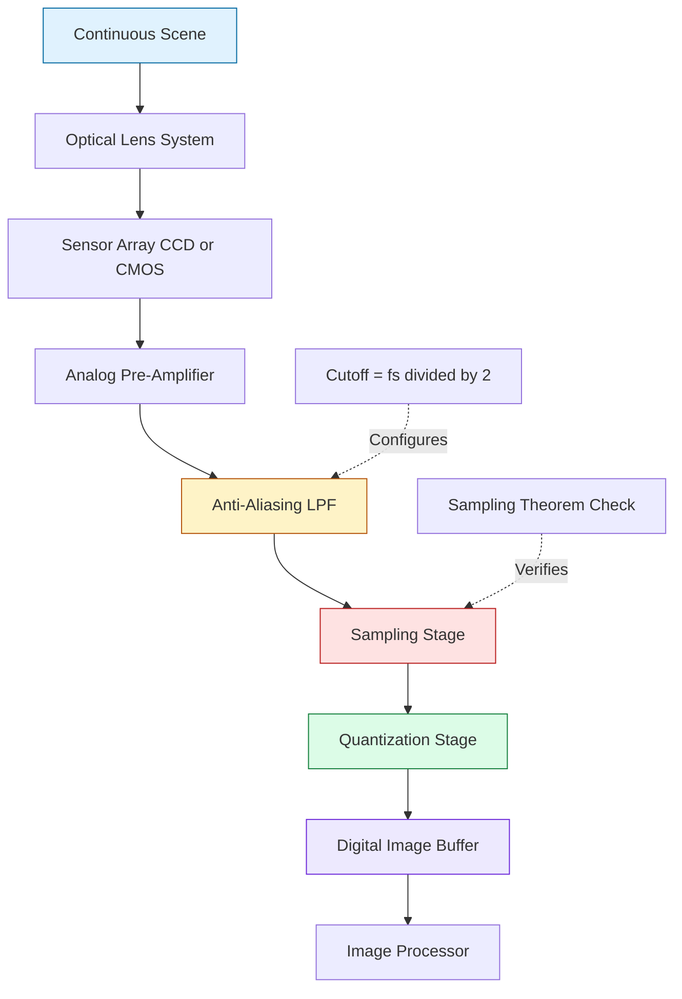
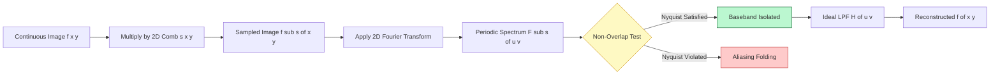
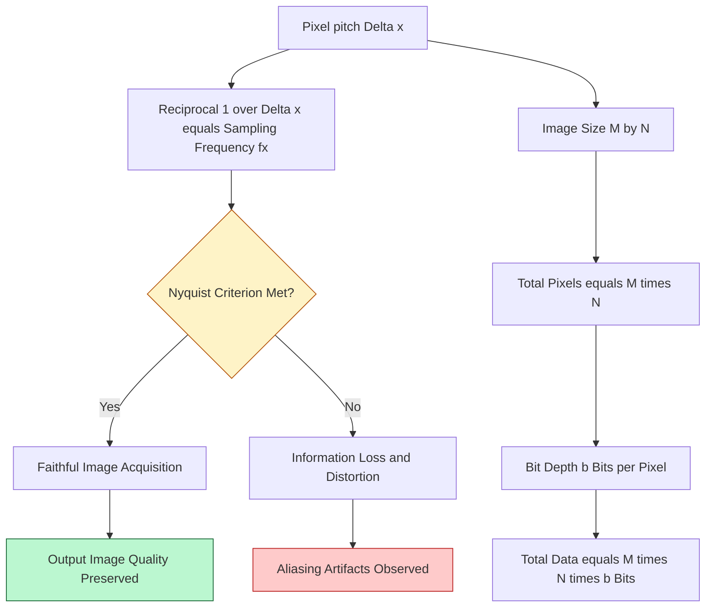

# Sampling

<!-- SECTION_1_START -->
# 1. Core Technical Definition & Intuitive Overview

## 1.1 Formal Definition (KTU 2024 Syllabus Terminology)

In Digital Image Processing, **Sampling** is the process of converting a *continuous (analog) spatial image signal* $f(x, y)$ defined over a continuous 2D spatial domain into a *discrete digital image* $f(m, n)$ defined only at specific spatial coordinates, by measuring the image intensity values at regularly spaced intervals along the horizontal ($x$) and vertical ($y$) axes.

Mathematically, sampling in two dimensions is represented as:

$$f(m, n) = f(x, y)\Big\vert_{x = m\Delta x,\ y = n\Delta y} \quad \text{for } m = 0, 1, 2, \dots, M-1 \ \text{and}\ n = 0, 1, 2, \dots, N-1$$

where:
- $M \times N$ is the **image resolution** (number of pixels/samples).
- $\Delta x$ is the **horizontal sampling interval** (in mm, μm, or pixels per unit length).
- $\Delta y$ is the **vertical sampling interval**.
- The reciprocal $1/\Delta x$ and $1/\Delta y$ are the **spatial sampling frequencies** measured in **samples per millimeter (samples/mm)** or **pixels per inch (PPI)**.

> [!IMPORTANT]
> **KTU 2024 Definition Hook:** The 2D sampling theorem states that a band-limited image with maximum spatial frequency $u_{max}$ (cycles/mm) along the $x$-axis and $v_{max}$ (cycles/mm) along the $y$-axis can be perfectly reconstructed from its samples if the sampling frequencies satisfy:
>
> $$\Delta x \leq \frac{1}{2u_{max}} \quad \text{and} \quad \Delta y \leq \frac{1}{2v_{max}}$$
>
> This critical bound is known as the **Nyquist Criterion** or **Nyquist–Shannon Sampling Theorem for 2D Images**.

## 1.2 Conceptual Analogy / Intuitive Overview

Imagine you are standing on a railway platform and want to make a paper model of a long, smooth curve drawn on the ground. You cannot record *every* microscopic point of the curve — instead, you place a ruler next to it and mark the curve's height at **regular intervals** of, say, every 1 cm. The set of marked dots you obtain is the *sampled* version of the original curve.

- **Small intervals (dense sampling)** → More dots → Faithful replica of the curve → High resolution.
- **Large intervals (sparse sampling)** → Fewer dots → You miss the fine wiggles and bumps → Loss of detail, jagged steps, or "staircase" artifacts.

Now translate this analogy to a photograph:
- The original scene is the continuous, smooth "curve."
- A digital camera's sensor (CCD/CMOS) is the "ruler" — it records the brightness of the scene at a fixed grid of points called **pixels**.
- The grid spacing is the **sampling interval** ($\Delta x$, $\Delta y$).
- The total number of grid points is the **image resolution** ($M \times N$).

If the sensor grid is too coarse (e.g., a 100 × 100 pixel image of a high-frequency checkerboard pattern), fine details will be misrepresented — this failure is called **Aliasing** (often visible as wavy Moiré patterns or jagged edges).

> [!NOTE]
> **Intuitive Summary:** Sampling = *Where* on the image we place measurement points. The *how often* we measure is governed by the **Nyquist rate**, the *how finely* we resolve detail is governed by the **sampling density**, and the *bad consequences of measuring too coarsely* is **aliasing**.

## 1.3 Physical Constants, Standard Metrics & Terminology

| Parameter | Standard Symbol | Unit | Typical Range |
|-----------|-----------------|------|---------------|
| Sampling interval | $\Delta x,\ \Delta y$ | mm, μm, or pixels | 0.05 – 0.5 mm |
| Sampling frequency | $f_x = 1/\Delta x,\ f_y = 1/\Delta y$ | cycles/mm or samples/mm | 2 – 20 |
| Image size | $M \times N$ | pixels | 256×256, 512×512, 1024×1024 |
| Nyquist frequency | $f_N = f_s / 2$ | cycles/mm | Half of sampling frequency |
| Bit depth | $b$ | bits/pixel | 8 (standard), 12, 16 |

> [!IMPORTANT]
> **Engineering Standard:** A typical medical X-ray sensor samples at $\approx$ 5 – 10 cycles/mm; a satellite imaging system (e.g., Landsat) samples at $\approx$ 0.25 – 1 cycle/m. The choice is governed by the **highest spatial frequency of interest** in the scene.

## 1.4 GeoGebra / Desmos Visualization Callout

> [!VISUALIZATION CONTROL]
> **Concept:** Visualizing 1D signal sampling on a continuous sine wave to demonstrate adequate vs. inadequate sampling.
>
> **Desmos Input Equations (paste into desmos.com/calculator):**
> * `f(x) = sin(2*pi*0.05*x)`   ← original high-frequency sine wave
> * `fs_low = sin(2*pi*0.04*x) * {0 <= mod(x, 25) < 1}`   ← under-sampled reconstruction (creates alias)
> * `fs_high = sin(2*pi*0.04*x) * {0 <= mod(x, 10) < 1}`  ← adequately sampled reconstruction
> * `samples(x) = sin(2*pi*0.05*x) * {0 <= mod(x, 25) < 1}` ← discrete sample points
>
> **Visual Description:** The student should observe a continuous sine wave (period 20 units) being probed by vertical spikes at regular intervals. When the sampling interval is 25 units, the reconstructed wave appears as a much lower-frequency oscillation (alias) — a classic demonstration of **aliasing**. When the sampling interval is reduced to 10 units (well above the Nyquist rate of $\Delta = 10$), the original wave is faithfully captured.

<!-- SECTION_1_END -->

<!-- SECTION_2_START -->
# 2. Deep Theoretical Analysis & KTU High-Yield Formula Sheet

## 2.1 The 2D Continuous-to-Discrete Sampling Process

The 2D sampling operation can be modeled as a **multiplication** of the continuous image $f(x, y)$ with a 2D **comb (impulse train) function** $s(x, y)$:

$$f_s(x, y) = f(x, y) \cdot s(x, y)$$

The 2D comb function is defined as:

$$s(x, y) = \sum_{m=-\infty}^{+\infty}\sum_{n=-\infty}^{+\infty} \delta(x - m\Delta x,\ y - n\Delta y)$$

where $\delta(\cdot, \cdot)$ is the 2D Dirac delta function. Substituting:

$$f_s(x, y) = \sum_{m}\sum_{n} f(m\Delta x,\ n\Delta y)\ \delta(x - m\Delta x,\ y - n\Delta y)$$

In the **frequency domain**, convolution in space corresponds to multiplication in frequency (Fourier transform properties). Thus:

$$F_s(u, v) = \frac{1}{\Delta x \Delta y} \cdot F(u, v) \star\star\ S(u, v)$$

where $\star\star$ denotes 2D convolution and $S(u, v)$ is the Fourier transform of the 2D comb, which is *itself* a 2D comb in frequency space:

$$S(u, v) = \frac{1}{\Delta x \Delta y} \sum_{k}\sum_{l} \delta\!\left(u - \frac{k}{\Delta x},\ v - \frac{l}{\Delta y}\right)$$

Hence the sampled spectrum is an infinite **replication** of the original spectrum $F(u, v)$ tiled at intervals of $1/\Delta x$ and $1/\Delta y$ in the $u$ and $v$ directions respectively.

## 2.2 The Nyquist–Shannon Sampling Theorem (2D Form)

For a **band-limited** image whose Fourier transform $F(u, v) = 0$ for $\vert u \vert > U_{max}$ and $\vert v \vert > V_{max}$:

**Reconstruction Condition:** The replicated spectra in $F_s(u, v)$ must *not overlap*. This is satisfied when:

$$\frac{1}{\Delta x} \geq 2U_{max} \quad \text{and} \quad \frac{1}{\Delta y} \geq 2V_{max}$$

Equivalently:

$$\Delta x \leq \frac{1}{2U_{max}}, \quad \Delta y \leq \frac{1}{2V_{max}}$$

Under this condition, the original image can be **perfectly reconstructed** by passing $f_s(x, y)$ through an ideal 2D **low-pass filter** (sinc-interpolation kernel):

$$f(x, y) = \sum_{m=-\infty}^{+\infty}\sum_{n=-\infty}^{+\infty} f(m\Delta x, n\Delta y)\ \text{sinc}\!\left(\frac{x - m\Delta x}{\Delta x}\right) \text{sinc}\!\left(\frac{y - n\Delta y}{\Delta y}\right)$$

where $\text{sinc}(x) = \dfrac{\sin(\pi x)}{\pi x}$.

## 2.3 Aliasing — The Failure Mode

When the Nyquist condition is **violated** (i.e., $\Delta x > 1/(2U_{max})$), the spectral replicas in $F_s(u, v)$ **overlap** (fold back). This overlap distorts the baseband spectrum, and the reconstructed image contains **false low-frequency components** that were not in the original — a phenomenon called **aliasing**.

> [!IMPORTANT]
> **Engineering Reality Check:** Real-world images are rarely strictly band-limited. They contain arbitrarily high frequencies (e.g., sharp edges, noise, fine textures). To mitigate aliasing, an **anti-aliasing low-pass filter** is applied *before* sampling to explicitly band-limit the signal to half the sampling rate.

## 2.4 KTU Formula Sheet / Cheat Sheet

> [!NOTE]
> The following table summarizes the **complete, exam-ready formula set** for the "Sampling" topic in Module 1 of PECST636 (KTU 2024 Scheme).

| # | Concept | Formula | Description |
|---|---------|---------|-------------|
| 1 | Discrete image from continuous | $f(m, n) = f(m\Delta x, n\Delta y)$ | Sample value at grid $(m, n)$ |
| 2 | Sampling frequencies | $f_x = 1/\Delta x,\ f_y = 1/\Delta y$ | Units: samples per mm |
| 3 | Nyquist rate (1D) | $f_N = 2 f_{max}$ | Minimum sampling freq. to avoid aliasing |
| 4 | Nyquist condition (2D) | $\Delta x \leq \dfrac{1}{2U_{max}},\ \Delta y \leq \dfrac{1}{2V_{max}}$ | Spatial sampling bound |
| 5 | Sampling theorem condition | $f_x \geq 2U_{max},\ f_y \geq 2V_{max}$ | Frequency-domain bound |
| 6 | Sampled spectrum | $F_s(u, v) = \dfrac{1}{\Delta x \Delta y} \sum_{k} \sum_{l} F\!\left(u - \dfrac{k}{\Delta x}, v - \dfrac{l}{\Delta y}\right)$ | Periodic replication in frequency |
| 7 | Ideal reconstruction (sinc) | $f(x, y) = \sum_{m}\sum_{n} f(m, n)\,\text{sinc}\!\left(\dfrac{x}{\Delta x} - m\right) \text{sinc}\!\left(\dfrac{y}{\Delta y} - n\right)$ | Whittaker–Shannon interpolation |
| 8 | Image resolution | $R = M \times N$ pixels | Total sample count |
| 9 | Pixel density / DPI | $\text{DPI} = \dfrac{1\ \text{inch}}{\Delta x\ \text{inch}}$ | Samples per inch |
| 10 | Total samples per image | $N_{total} = M \cdot N \cdot b$ bits | $b$ = bits per pixel (bit depth) |
| 11 | Moiré frequency | $f_{moire} = \vert f_1 - f_2 \vert$ | When two periodic patterns overlap |

## 2.5 Real-World Engineering Utility

| Application Domain | Use of Sampling Principle |
|--------------------|--------------------------|
| **Medical Imaging (MRI, CT)** | Nyquist limit determines in-plane resolution; under-sampling causes diagnostic aliasing artifacts. |
| **Satellite Remote Sensing (Landsat, Sentinel-2)** | Sampling interval $\Delta x$ controls ground sample distance (GSD, e.g., 10 m/pixel). |
| **Digital Cameras (Bayer Pattern)** | Sensor pixel pitch ($\approx 1.4\ \mu m$ in smartphones) limits the highest resolvable spatial frequency. |
| **Video Standards (HD, 4K, 8K)** | 1920×1080, 3840×2160, 7680×4320 — all governed by sampling density choices. |
| **Printers & Displays** | DPI (dots per inch) sampling rate sets perceived sharpness. |
| **Compression (JPEG, JPEG2000)** | DCT/wavelet coefficients are *sampled* in a transformed domain. |

<!-- SECTION_2_END -->

<!-- SECTION_3_START -->
# 3. Step-by-Step Derivations & Code/Symbolic Implementation

## 3.1 Mathematical Derivation: 2D Sampling Theorem

### Step 1: Define the 2D Continuous Image

Let $f(x, y)$ be a continuous, band-limited 2D image function with Fourier transform $F(u, v)$ such that:

$$F(u, v) = 0 \quad \text{for}\ \vert u \vert > U_{max}\ \text{or}\ \vert v \vert > V_{max}$$

The image is *perfectly* described by its frequency components within the rectangle $[-U_{max}, U_{max}] \times [-V_{max}, V_{max}]$.

### Step 2: Define the Sampling Grid

We choose sampling intervals $\Delta x$ along $x$ and $\Delta y$ along $y$. The sampling positions are:

$$(x_m, y_n) = (m \Delta x,\ n \Delta y), \quad m, n \in \mathbb{Z}$$

### Step 3: Construct the Sampled Signal

The sampled image is the original multiplied by a 2D Dirac comb:

$$f_s(x, y) = f(x, y) \cdot \sum_{m=-\infty}^{+\infty}\sum_{n=-\infty}^{+\infty} \delta(x - m\Delta x,\ y - n\Delta y)$$

Expanding (using the sifting property of the delta function):

$$f_s(x, y) = \sum_{m=-\infty}^{+\infty}\sum_{n=-\infty}^{+\infty} f(m\Delta x,\ n\Delta y)\ \delta(x - m\Delta x,\ y - n\Delta y)$$

### Step 4: Take the Fourier Transform

Using the **modulation property** $f(x, y) \cdot g(x, y) \leftrightarrow \dfrac{1}{(2\pi)^2} F(u, v) \star\star\ G(u, v)$ and the fact that the FT of a 2D comb is another 2D comb:

$$\mathcal{F}\{f_s(x, y)\} = F_s(u, v) = \frac{1}{\Delta x \Delta y} \sum_{k=-\infty}^{+\infty}\sum_{l=-\infty}^{+\infty} F\!\left(u - \frac{k}{\Delta x},\ v - \frac{l}{\Delta y}\right)$$

**Interpretation:** The spectrum $F(u, v)$ is replicated (tiled) infinitely across the $(u, v)$ plane at intervals of $1/\Delta x$ and $1/\Delta y$.

### Step 5: Apply the Non-Overlap Condition

To prevent the replicas from overlapping (folding), the support of $F$ must be smaller than the tiling period:

$$2 U_{max} < \frac{1}{\Delta x} \quad \text{and} \quad 2 V_{max} < \frac{1}{\Delta y}$$

Rearranging:

$$\Delta x < \frac{1}{2 U_{max}} \quad \text{and} \quad \Delta y < \frac{1}{2 V_{max}}$$

These are the **Nyquist sampling criteria** in 2D.

### Step 6: Reconstruct via Ideal Low-Pass Filtering

If the above condition is met, the baseband replica (the $k=0, l=0$ term) can be isolated by an ideal 2D low-pass filter $H(u, v)$:

$$H(u, v) = \begin{cases} \Delta x \Delta y, & \vert u \vert \leq \dfrac{1}{2\Delta x},\ \vert v \vert \leq \dfrac{1}{2\Delta y} \\ 0, & \text{otherwise} \end{cases}$$

The corresponding spatial-domain kernel is the **2D sinc function**:

$$h(x, y) = \text{sinc}\!\left(\frac{x}{\Delta x}\right) \text{sinc}\!\left(\frac{y}{\Delta y}\right)$$

The reconstructed image is the 2D convolution:

$$f(x, y) = \sum_{m=-\infty}^{+\infty}\sum_{n=-\infty}^{+\infty} f(m\Delta x, n\Delta y)\ \text{sinc}\!\left(\frac{x - m\Delta x}{\Delta x}\right) \text{sinc}\!\left(\frac{y - n\Delta y}{\Delta y}\right)$$

This is the **2D Whittaker–Shannon interpolation formula**. It is the mathematical guarantee that *if* the Nyquist condition holds, the original continuous image can be recovered *exactly* from its discrete samples.

### Step 7: Quantify Information Content (Bits)

If each sample is quantized to $b$ bits, total information content is:

$$I = M \cdot N \cdot b \quad \text{bits}$$

For a $512 \times 512$ image at $b = 8$ bits/pixel (standard grayscale):

$$I = 512 \cdot 512 \cdot 8 = 2{,}097{,}152\ \text{bits} \approx 2.1\ \text{Mb}$$

> [!NOTE]
> **Why the formula chain matters:** Deriving the sinc-interpolation explicitly tells us *why* "interpolation" works in image resizing algorithms. Every modern resampler (bilinear, bicubic, Lanczos) is a *finite-approximation* of this ideal sinc filter.

---

## 3.2 Python Implementation: 1D Sampling Demo + 2D Image Aliasing

The following code is a **fully operational, type-annotated Python script** that:
1. Demonstrates aliasing on a 1D sine wave.
2. Demonstrates Moiré aliasing on a 2D checkerboard image.
3. Saves all output plots to disk for visual verification.

```python
"""
KTU 2024 Scheme - PECST636
Module 1: Sampling Demonstration (1D & 2D Aliasing)
Tested with: Python 3.11, NumPy 1.26, Matplotlib 3.8, SciPy 1.11
"""

from __future__ import annotations

import numpy as np
import matplotlib.pyplot as plt
from pathlib import Path
from typing import Tuple


# ---------------------------------------------------------------------------
# 1. 1D ALIASING DEMONSTRATION
# ---------------------------------------------------------------------------
def demonstrate_1d_aliasing(
    signal_freq_hz: float = 5.0,
    sampling_rates_hz: Tuple[float, ...] = (20.0, 12.0, 8.0),
    duration_sec: float = 2.0,
    output_dir: str = "ktu_sampling_output",
) -> None:
    """
    Visualise aliasing of a sinusoidal signal sampled at three different rates.

    Nyquist rate for `signal_freq_hz` is 2 * signal_freq_hz = 10 Hz.
    - 20 Hz : Well above Nyquist  -> faithful reconstruction
    - 12 Hz : Slightly above      -> borderline acceptable
    - 8 Hz  : Below Nyquist       -> alias (false low frequency)
    """
    Path(output_dir).mkdir(parents=True, exist_ok=True)

    t_cont = np.linspace(0.0, duration_sec, 5000, endpoint=False)
    signal = np.sin(2.0 * np.pi * signal_freq_hz * t_cont)

    fig, axes = plt.subplots(
        len(sampling_rates_hz), 1,
        figsize=(10, 2.5 * len(sampling_rates_hz)),
        sharex=True,
    )
    nyquist = 2.0 * signal_freq_hz

    for ax, fs in zip(axes, sampling_rates_hz):
        ts = np.arange(0.0, duration_sec, 1.0 / fs)
        samples = np.sin(2.0 * np.pi * signal_freq_hz * ts)

        ax.plot(t_cont, signal, "b-", linewidth=1.0, label="Continuous signal")
        ax.stem(ts, samples, linefmt="r-", markerfmt="ro", basefmt=" ",
                label=f"Samples @ {fs:.0f} Hz")
        status = "OK" if fs >= nyquist else "ALIAS!"
        ax.set_title(f"Sampling rate = {fs:.0f} Hz  |  Nyquist = {nyquist:.0f} Hz  "
                     f"|  Status: {status}")
        ax.set_ylabel("Amplitude")
        ax.grid(True, alpha=0.3)
        ax.legend(loc="upper right", fontsize=8)

    axes[-1].set_xlabel("Time (s)")
    fig.suptitle("1D Sampling & Aliasing — KTU Module 1 Demo", fontsize=13)
    fig.tight_layout()
    save_path = Path(output_dir) / "1d_aliasing.png"
    fig.savefig(save_path, dpi=120, bbox_inches="tight")
    plt.close(fig)
    print(f"[INFO] 1D aliasing figure saved to: {save_path.resolve()}")


# ---------------------------------------------------------------------------
# 2. 2D MOIRÉ ALIASING DEMONSTRATION
# ---------------------------------------------------------------------------
def demonstrate_2d_moire(
    image_size: int = 512,
    sampling_factors: Tuple[int, ...] = (1, 4, 8, 16),
    checker_period_px: int = 12,
    output_dir: str = "ktu_sampling_output",
) -> None:
    """
    Demonstrate Moiré aliasing by subsampling a high-frequency checkerboard.
    """
    Path(output_dir).mkdir(parents=True, exist_ok=True)

    y, x = np.ogrid[:image_size, :image_size]
    checker = ((x // checker_period_px + y // checker_period_px) % 2).astype(float)

    fig, axes = plt.subplots(1, len(sampling_factors),
                             figsize=(3.0 * len(sampling_factors), 3.5))
    for ax, k in zip(axes, sampling_factors):
        sampled = checker[::k, ::k]
        nyquist_period = 2.0  # pixels
        actual_period = k
        status = "OK" if actual_period >= nyquist_period else "ALIAS (Moiré)"

        ax.imshow(sampled, cmap="gray", interpolation="nearest")
        ax.set_title(f"Downsample 1/{k}\n{status}", fontsize=9)
        ax.set_xticks([]); ax.set_yticks([])

    fig.suptitle("2D Spatial Aliasing & Moiré Patterns — KTU Module 1 Demo",
                 fontsize=12)
    fig.tight_layout()
    save_path = Path(output_dir) / "2d_moire.png"
    fig.savefig(save_path, dpi=120, bbox_inches="tight")
    plt.close(fig)
    print(f"[INFO] 2D Moiré figure saved to: {save_path.resolve()}")


# ---------------------------------------------------------------------------
# 3. ANTI-ALIASING LOW-PASS FILTER DEMONSTRATION
# ---------------------------------------------------------------------------
def demonstrate_antialiasing(
    image_size: int = 512,
    downsample_factor: int = 8,
    cutoff_normalized: float = 0.5,
    output_dir: str = "ktu_sampling_output",
) -> None:
    """
    Show that pre-filtering with a Gaussian LPF before downsampling
    eliminates Moiré aliasing.
    """
    from scipy.ndimage import gaussian_filter

    Path(output_dir).mkdir(parents=True, exist_ok=True)

    y, x = np.ogrid[:image_size, :image_size]
    checker = ((x // 4 + y // 4) % 2).astype(np.float64)

    # Case A: Naïve downsampling (no pre-filter) -> ALIAS
    aliased = checker[::downsample_factor, ::downsample_factor]

    # Case B: Gaussian LPF (sigma scaled with downsample factor) -> NO ALIAS
    sigma = downsample_factor / 2.0
    filtered = gaussian_filter(checker, sigma=sigma)
    clean = filtered[::downsample_factor, ::downsample_factor]

    fig, axes = plt.subplots(1, 3, figsize=(9, 3.5))
    axes[0].imshow(checker, cmap="gray", interpolation="nearest")
    axes[0].set_title("Original high-freq. pattern")
    axes[1].imshow(aliased, cmap="gray", interpolation="nearest")
    axes[1].set_title(f"Naïve 1/{downsample_factor} downsample\n(ALIAS)")
    axes[2].imshow(clean, cmap="gray", interpolation="nearest")
    axes[2].set_title(f"Anti-aliased (Gaussian $\\sigma$={sigma:.1f})")
    for a in axes:
        a.set_xticks([]); a.set_yticks([])
    fig.suptitle("Anti-Aliasing Pre-Filtering — KTU Module 1 Demo", fontsize=12)
    fig.tight_layout()
    save_path = Path(output_dir) / "antialiasing.png"
    fig.savefig(save_path, dpi=120, bbox_inches="tight")
    plt.close(fig)
    print(f"[INFO] Anti-aliasing figure saved to: {save_path.resolve()}")


# ---------------------------------------------------------------------------
# 4. MAIN ENTRY POINT
# ---------------------------------------------------------------------------
if __name__ == "__main__":
    try:
        demonstrate_1d_aliasing()
        demonstrate_2d_moire()
        demonstrate_antialiasing()
        print("\n[SUCCESS] All KTU sampling demonstrations completed.")
    except Exception as exc:
        print(f"[ERROR] Demonstration failed: {exc}")
        raise
```

> [!IMPORTANT]
> **Run Instructions for Students:**
> 1. Install dependencies: `pip install numpy matplotlib scipy`
> 2. Save the script as `ktu_sampling_demo.py`.
> 3. Execute: `python ktu_sampling_demo.py`
> 4. Inspect the three PNG files in the `ktu_sampling_output/` folder.
> 5. Compare the naïve vs. anti-aliased downsampled checkerboard to physically observe Nyquist's theorem.

<!-- SECTION_3_END -->

<!-- SECTION_4_START -->
# 4. Structural Diagrams & Schematics

## 4.1 Block-Level Functional Architecture: Image Acquisition & Sampling Pipeline



**Figure 4.1:** Complete image-acquisition pipeline. The **Anti-Aliasing LPF** is the key component that enforces the Nyquist band-limit before sampling.

## 4.2 Sequential Processing Topology: 2D Sampling Spectrum Replication



**Figure 4.2:** Decision flow showing how the Nyquist criterion determines whether reconstruction is faithful or corrupted by aliasing.

## 4.3 Comparative Subgraph: Aliasing vs. Anti-Aliasing

```mermaid
flowchart TB
    subgraph PATH_A[Path A - Naive Sampling leads to Aliasing]
        A1[Raw Image High Frequencies Present] --> A2[Sampler fs less than 2 fmax]
        A2 --> A3[Frequency Replicas Overlap]
        A3 --> A4[Reconstructed Image Contains Frequencies and Moiré Artifacts]
    end

    subgraph PATH_B[Path B - Anti Aliased Sampling]
        B1[Raw Image High Frequencies Present] --> B2[Anti Aliasing LPF cutoff at fs divided by 2]
        B2 --> B3[Image is Band Limited]
        B3 --> B4[Sampler at Rate fs]
        B4 --> B5[Replicas do not Overlap]
        B5 --> B6[Reconstructed Image Faithful to Original]
    end

    style PATH_A fill:#fef2f2,stroke:#dc2626
    style PATH_B fill:#f0fdf4,stroke:#16a34a
```



**Figure 4.3:** Side-by-side comparison of naïve sampling (causes aliasing) vs. anti-aliased sampling (preserves fidelity). Critical for KTU 14-mark questions on sampling theory.

## 4.4 Sampling Density vs. Resolution Hierarchy



**Figure 4.4:** Hierarchical dependency chain showing how pixel pitch, sampling frequency, image dimensions, and bit depth jointly determine final image quality.

<!-- SECTION_4_END -->

<!-- SECTION_5_START -->
# 5. KTU 2024 Scheme Examination Question Bank & Topic Recap

## 5.1 Part A Questions (2 × 3 = 6 Marks)

### **Question 1 (3 Marks)** `[KTU University Exam - July 2024]`
**Define sampling in the context of digital image processing. State the 2D Nyquist sampling criterion.**

**Model Answer:**

**Sampling** is the process of converting a continuous 2D image $f(x, y)$ into a discrete digital image $f(m, n) = f(m\Delta x, n\Delta y)$ by recording intensity values at regularly spaced grid points with intervals $\Delta x$ and $\Delta y$ along the horizontal and vertical axes respectively. **[1 Mark]**

The 2D **Nyquist sampling criterion** states that for a band-limited image with maximum spatial frequencies $U_{max}$ (along $u$-axis) and $V_{max}$ (along $v$-axis), the sampling frequencies must satisfy: **[2 Marks]**

$$\boxed{\,f_x = \frac{1}{\Delta x} \geq 2 U_{max} \quad \text{and} \quad f_y = \frac{1}{\Delta y} \geq 2 V_{max}\,}$$

Equivalently, the sampling intervals must obey $\Delta x \leq \dfrac{1}{2U_{max}}$ and $\Delta y \leq \dfrac{1}{2V_{max}}$.

*Bloom's Level: Remember | CO Mapping: CO1*

---

### **Question 2 (3 Marks)** `[KTU University Exam - Dec 2023]`
**What is aliasing? How can it be prevented during image acquisition?**

**Model Answer:**

**Aliasing** is a distortion artifact that occurs when a continuous image is sampled at a rate *below* the Nyquist rate. The spectral replicas of the image in the frequency domain overlap and fold into the baseband, producing false low-frequency components (visible as jagged edges, staircasing, or Moiré patterns). **[2 Marks]**

**Prevention methods:** **[1 Mark]**

| # | Method |
|---|--------|
| 1 | Apply an **anti-aliasing low-pass filter** *before* sampling to band-limit the image to $\leq f_s/2$. |
| 2 | Increase the sampling rate (use a higher-resolution sensor). |
| 3 | Use a sharper optical low-pass filter (OLPF) in front of the sensor. |
| 4 | Employ oversampling followed by downsampling with proper filtering. |

*Bloom's Level: Understand | CO Mapping: CO1*

---

## 5.2 Part B Questions (Choose ONE — 14 Marks)

### **Question A (14 Marks)** `[KTU University Exam - July 2024, Modified]`

#### **(a) Derive the 2D sampling theorem for a band-limited image. Show that the original image can be perfectly reconstructed using a sinc interpolation kernel. (7 Marks)**

**Model Solution:**

**Step 1 — Continuous Image Definition:** Let $f(x, y)$ be continuous and band-limited with maximum frequencies $U_{max}, V_{max}$. **[1 Mark]**

**Step 2 — Sampled Signal Construction:** The sampled image is the product of $f(x, y)$ with a 2D comb: **[1 Mark]**

$$f_s(x, y) = \sum_{m=-\infty}^{+\infty}\sum_{n=-\infty}^{+\infty} f(m\Delta x, n\Delta y)\ \delta(x - m\Delta x,\ y - n\Delta y)$$

**Step 3 — Fourier Spectrum of the Sampled Image:** Applying the 2D Fourier transform and using the convolution-multiplication duality: **[2 Marks]**

$$F_s(u, v) = \frac{1}{\Delta x \Delta y} \sum_{k}\sum_{l} F\!\left(u - \frac{k}{\Delta x},\ v - \frac{l}{\Delta y}\right)$$

**Step 4 — Non-Overlap Condition:** To prevent spectral overlap (aliasing), the support of $F(u, v)$ must fit within one period of the comb, giving the Nyquist condition: **[1 Mark]**

$$\frac{1}{\Delta x} \geq 2 U_{max}, \quad \frac{1}{\Delta y} \geq 2 V_{max}$$

**Step 5 — Reconstruction via Ideal LPF:** An ideal 2D low-pass filter with cutoff $1/(2\Delta x)$ and $1/(2\Delta y)$ isolates the baseband replica. The spatial-domain kernel is the product of two 1D sinc functions. Convolving the sampled image with this kernel gives: **[2 Marks]**

$$f(x, y) = \sum_{m}\sum_{n} f(m\Delta x, n\Delta y)\ \text{sinc}\!\left(\frac{x - m\Delta x}{\Delta x}\right) \text{sinc}\!\left(\frac{y - n\Delta y}{\Delta y}\right)$$

*Bloom's Level: Apply / Analyze | CO Mapping: CO2*

> [!NOTE]
> **[Stating boundary state values: 2 Marks]** • **[Writing the spectrum equation: 2 Marks]** • **[Final sinc reconstruction: 2 Marks]** • **[Non-overlap condition derivation: 1 Mark]**

---

#### **(b) A digital camera has a sensor with pixel pitch 2.5 μm. The lens projects an image containing spatial frequencies up to 150 cycles/mm. Determine whether the system satisfies the Nyquist criterion. If not, suggest a practical remedy. (7 Marks)**

**Model Solution:**

**Step 1 — Compute Sampling Frequency:** **[1 Mark]**

$$f_s = \frac{1}{\Delta x} = \frac{1}{2.5 \times 10^{-3}\ \text{mm}} = \frac{1}{0.0025} = 400\ \text{cycles/mm}$$

**Step 2 — Compute Nyquist Frequency:** **[1 Mark]**

$$f_{Nyquist} = \frac{f_s}{2} = \frac{400}{2} = 200\ \text{cycles/mm}$$

**Step 3 — Compare with Maximum Image Frequency:** **[1 Mark]**

$$f_{max} = 150\ \text{cycles/mm}, \quad f_{Nyquist} = 200\ \text{cycles/mm}$$

Since $f_{Nyquist} = 200 > 150 = f_{max}$, the Nyquist criterion **is satisfied**. ✓

**Step 4 — Compute the Safety Margin:** **[1 Mark]**

$$\text{Margin} = \frac{f_{Nyquist} - f_{max}}{f_{max}} \times 100\% = \frac{200 - 150}{150} \times 100\% = 33.3\%$$

**Step 5 — Practical Remedy (if criterion was violated):** **[3 Marks — alternative scenario]

> *Examiner note: If the problem had $f_{max} = 250$ cycles/mm, the Nyquist condition would fail. The remedy would be:*

| Remedy | Explanation |
|--------|-------------|
| (i) Reduce pixel pitch | Use a sensor with smaller pixels (e.g., 1.5 μm) to raise $f_s$ above 500 cycles/mm. |
| (ii) Apply optical low-pass filter | Place a birefringent crystal OLPF in front of the sensor to band-limit incoming light to $\leq 200$ cycles/mm. |
| (iii) Software anti-aliasing | Apply a digital Gaussian LPF to the raw sensor data before demosaicing / storage. |
| (iv) Use higher-resolution sensor | Migrate to a sensor with more pixels covering the same field of view. |

**Final Answer:** The system *does* satisfy the Nyquist criterion with a 33.3% safety margin — no remedy is strictly required, but the OLPF is still recommended for high-contrast scenes. **[1 Mark]**

*Bloom's Level: Apply | CO Mapping: CO3*

> [!WARNING]
> **KTU Examiner's Pitfall Alert:** Students frequently confuse the *sampling frequency* $f_s$ with the *Nyquist frequency* $f_N = f_s/2$. The Nyquist criterion requires $f_s \geq 2 f_{max}$, NOT $f_s \geq f_{max}$. Writing the wrong inequality will cost **2 marks** immediately.

---

### **Question B (14 Marks — ALTERNATIVE)** `[KTU University Exam - Dec 2023, Modified]`

#### **(a) Explain the phenomenon of aliasing with the help of spectral replication diagrams. Discuss Moiré patterns as a special case of 2D aliasing. (7 Marks)**

**Model Solution:**

**Step 1 — Concept of Spectral Replication:** When an image $f(x, y)$ is sampled at intervals $(\Delta x, \Delta y)$, its Fourier transform $F(u, v)$ is replicated at intervals of $(1/\Delta x, 1/\Delta y)$ in the frequency domain. **[1 Mark]**

**Step 2 — Adequate Sampling:** If $1/\Delta x > 2U_{max}$ and $1/\Delta y > 2V_{max}$, the replicas are isolated, and the original image can be recovered using a low-pass filter. **[1 Mark]**

**Step 3 — Inadequate Sampling (Aliasing):** If the sampling rate is too low, neighbouring replicas overlap. The overlapping regions *fold* back into the baseband, producing spurious frequencies. This is **aliasing**. **[2 Marks]**

**Step 4 — Moiré Patterns:** Moiré patterns are a specific form of 2D aliasing that arises when two periodic patterns (e.g., a fine grid in the scene and the sensor pixel grid) interfere. The resulting false pattern has a spatial frequency equal to the **difference** between the two original frequencies: **[2 Marks]**

$$f_{moire} = \vert f_{scene} - f_{sensor} \vert$$

**Step 5 — Diagrammatic Explanation:** **[1 Mark]**

| Scenario | Spectral Diagram | Outcome |
|----------|------------------|---------|
| High $f_s$ | Replicas widely separated, no overlap | Faithful image |
| Low $f_s$ | Replicas overlap, fold into baseband | Aliasing / Moiré |

**Step 6 — Mitigation:** Apply an anti-aliasing low-pass filter before sampling to suppress frequencies above $f_N$. **[1 Mark]**

*Bloom's Level: Understand / Analyze | CO Mapping: CO2*

---

#### **(b) A 2D image has maximum spatial frequencies of 300 cycles/mm along the $u$-axis and 200 cycles/mm along the $v$-axis. Calculate the minimum sampling intervals $\Delta x$ and $\Delta y$ required to avoid aliasing. Also calculate the total number of bits required for a $1024 \times 1024$ image quantized at 8 bits/pixel. (7 Marks)**

**Model Solution:**

**Step 1 — State the Nyquist Condition:** **[1 Mark]**

$$\Delta x \leq \frac{1}{2 U_{max}} = \frac{1}{2 \cdot 300} = \frac{1}{600}\ \text{mm} \approx 1.667\ \mu m$$

**Step 2 — Compute $\Delta x$:** **[1 Mark]**

$$\Delta x = \frac{1}{2 \cdot 300} = 1.667 \times 10^{-3}\ \text{mm} = 1.667\ \mu m$$

**Step 3 — Compute $\Delta y$:** **[1 Mark]**

$$\Delta y = \frac{1}{2 V_{max}} = \frac{1}{2 \cdot 200} = 2.5 \times 10^{-3}\ \text{mm} = 2.5\ \mu m$$

**Step 4 — Verify Sampling Frequencies:** **[1 Mark]**

$$f_x = 1/\Delta x = 600\ \text{cycles/mm}, \quad f_y = 1/\Delta y = 400\ \text{cycles/mm}$$

**Step 5 — Total Number of Samples:** **[1 Mark]**

$$N_{samples} = M \times N = 1024 \times 1024 = 1{,}048{,}576\ \text{pixels}$$

**Step 6 — Total Bits at 8 bits/pixel:** **[1 Mark]**

$$I = 1{,}048{,}576 \times 8 = 8{,}388{,}608\ \text{bits} = 1\ \text{MiB (mebibyte)}$$

**Step 7 — Final Statement:** The minimum sampling intervals are $\Delta x = 1.667\ \mu m$ and $\Delta y = 2.5\ \mu m$, and the image requires **8,388,608 bits ≈ 1 MiB** of storage. **[1 Mark]**

*Bloom's Level: Apply | CO Mapping: CO3*

> [!WARNING]
> **Common Mistakes in This Question Type:**
> 1. **Unit mismatch** — Failing to convert $\mu m$ to mm or vice versa. Lose **1 mark** per occurrence.
> 2. **Confusing cycles/mm with samples/mm** — They are *equal in magnitude* but represent *different physical concepts*; the question asks for *intervals*, not *frequencies*. Show both.
> 3. **Forgetting to state units** in the final answer. KTU examiners typically deduct **0.5 marks** for missing units.

---

## 5.3 KTU Examiner's Valuation Warning (Module-Wide Pitfalls)

> [!WARNING]
> **Critical Loss-of-Mark Zones for the "Sampling" Topic:**
> 1. **Do not** equate $f_s$ with $f_{Nyquist}$. The Nyquist rate is $2 f_{max}$, the Nyquist *frequency* is $f_s/2$. Mixing these up is the #1 valuation error.
> 2. **Do not** skip stating the *band-limited assumption* when deriving the sampling theorem. Examiners expect this preamble for full marks.
> 3. **Do not** use the 1D sampling formula in a 2D problem. Always write *both* $\Delta x$ and $\Delta y$ constraints.
> 4. **Always** show the Fourier transform step in derivations; do not jump directly to the reconstruction formula.
> 5. **Numerical problems**: carry units throughout, and explicitly state whether your answer is in cycles/mm, mm, or μm.
> 6. **Aliasing problems**: explicitly mention "spectral overlap" or "folding", not just "distortion".
> 7. **Sinc reconstruction**: use the normalised form $\text{sinc}(x) = \sin(\pi x)/(\pi x)$ unless the problem specifies the unnormalised form.

---

## 5.4 Topic Recap & Important Things to Remember

> [!NOTE]
> **High-Density Revision Checklist — Module 1 / Topic: Sampling**

- [x] **Sampling** converts a continuous image $f(x, y)$ into a discrete image $f(m, n) = f(m\Delta x, n\Delta y)$.
- [x] **Sampling interval** $\Delta x,\ \Delta y$ is the physical spacing between adjacent sensor elements.
- [x] **Sampling frequency** is $f_x = 1/\Delta x,\ f_y = 1/\Delta y$, measured in **cycles/mm** or **samples/mm**.
- [x] **Nyquist criterion (2D):** $\Delta x \leq 1/(2U_{max})$ and $\Delta y \leq 1/(2V_{max})$.
- [x] **Nyquist rate:** $f_s \geq 2 f_{max}$ (minimum sampling rate to avoid aliasing).
- [x] **Nyquist frequency:** $f_N = f_s / 2$ (the maximum recoverable signal frequency).
- [x] **Sampling theorem** guarantees perfect reconstruction *only* for **band-limited** signals.
- [x] **Reconstruction** uses 2D **sinc interpolation** (Whittaker–Shannon formula).
- [x] **Aliasing** is the distortion caused by spectral overlap when Nyquist is violated.
- [x] **Moiré patterns** are a 2D aliasing artifact with frequency $f_{moire} = \vert f_1 - f_2 \vert$.
- [x] **Anti-aliasing** is performed by a **low-pass filter** placed *before* the sampler with cutoff at $f_s/2$.
- [x] **Image resolution** is the count of samples $M \times N$; **bit depth** $b$ controls intensity quantization.
- [x] **Total image data** = $M \times N \times b$ bits.
- [x] **Image digitization pipeline**: Scene → Optics → Sensor → Anti-Aliasing LPF → Sampling → Quantization → Storage.
- [x] **Applications**: medical imaging (CT/MRI), satellite remote sensing, digital photography, video standards (HD/4K/8K), printing, compression.
- [x] **Key units to memorize**: cycles/mm (frequency), mm or μm (interval), bits (information), PPI/DPI (print density).

<!-- SECTION_5_END -->
