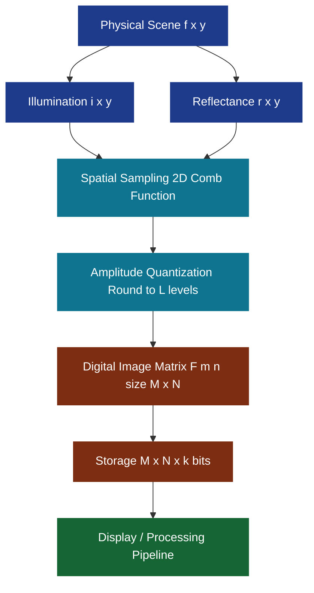
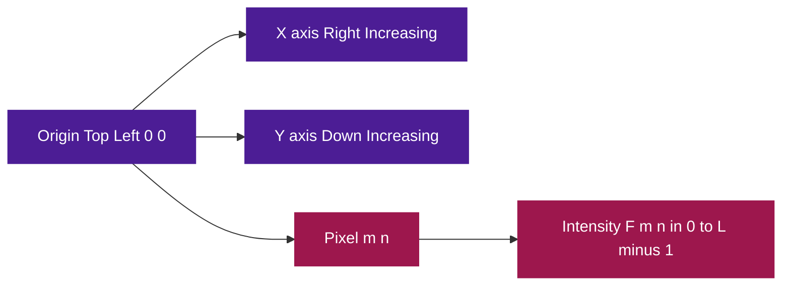
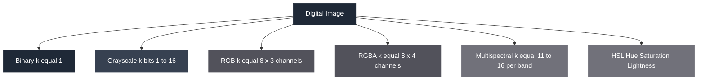
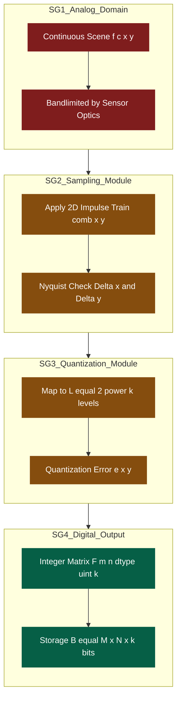

# The image, its representation and properties - Image representations

<!-- SECTION_1_START -->
# Image Representations in Digital Image Processing

> [!IMPORTANT]
> **KTU 2024 Scheme | PECST636 | Module 1 | Image, Its Representation and Properties**
> This module forms the **theoretical bedrock** of all subsequent DIP operations (filtering, segmentation, compression). Mastering the mathematical and matrix-based representation of an image is mandatory before moving to spatial/frequency domain techniques.

---

## 1.1 Formal Academic Definition

A **digital image** is a two-dimensional discrete function $f(x,y)$ that has been converted into a finite, countable set of samples arranged on a spatial grid. Each sample is called a **picture element (pixel)** — the smallest addressable unit of the image.

Mathematically, the formation of an image in the physical world is modeled as:

$$f(x, y) = i(x, y) \cdot r(x, y)$$

where:
- $f(x, y)$ = observed image intensity at spatial coordinate $(x, y)$
- $i(x, y)$ = **illumination component** (amount of source light incident on the scene) with $0 < i(x,y) < \infty$
- $r(x, y)$ = **reflectance component** (fraction of light reflected by the object) with $0 \leq r(x,y) \leq 1$

> [!NOTE]
> **Key Distinction:** The *physical* image $f(x,y)$ is continuous in both space and amplitude. The *digital* image is created by **sampling** (discretizing space) and **quantization** (discretizing amplitude). This conversion is the gateway from analog to digital processing.

### 1.2 Coordinate Convention (Matrix Indexing vs. Cartesian)

| Convention | Origin Position | Row Index Direction | Common In |
|------------|----------------|--------------------|-----------|
| **Image Processing (Cartesian)** | Top-Left corner $(0,0)$ | $x \rightarrow$ right, $y \rightarrow$ down | Gonzalez & Woods, OpenCV |
| **Matrix Algebra (Mathematical)** | Top-Left corner $(1,1)$ | $i$ (row) $\rightarrow$ down, $j$ (col) $\rightarrow$ right | MATLAB, NumPy |

The transformation between these two conventions is:

$$i = y + 1 \quad \text{and} \quad j = x + 1$$

### 1.3 Intuitive Analogy: The Mosaic Wall

> [!TIP]
> **Conceptual Analogy — "The Mosaic Wall":** Imagine a vast wall of **1 cm × 1 cm colored tiles** arranged in a perfect grid. Each tile is one *pixel*. The tile's **color intensity** is its *gray level*. The **wall** is the image. If you sample the wall with a low-resolution camera (coarse sampling), you get a small number of large tiles — the image looks blocky. If your camera has low color depth (coarse quantization), the tiles can only be, say, 16 distinct shades — the image looks banded. **Sampling** = tile density. **Quantization** = number of distinct colors per tile.

### 1.4 Standard Image Sizes & Resolutions

> [!IMPORTANT]
> **Mandatory Knowledge for KTU Board:**
> - **VGA** resolution: $640 \times 480$ pixels
> - **HD (720p)** resolution: $1280 \times 720$ pixels
> - **Full HD (1080p)** resolution: $1920 \times 1080$ pixels
> - **4K UHD** resolution: $3840 \times 2160$ pixels
> - **8K UHD** resolution: $7680 \times 4320$ pixels

### 1.5 Visualization Block

> [!VISUALIZATION CONTROL]
> **Concept:** Pixel Grid as a 2D Discrete Function
> **GeoGebra / Desmos Input Equations:**
> * `f(x, y) = 255 * sin(pi*x/4) * cos(pi*y/4)` (for continuous analog)
> * Discrete samples: $(x, y) \in \{0, 1, 2, 3, 4, 5, 6, 7\}^2$
> * Plot: Each integer pair $(x, y)$ as a square filled with gray level $L = \text{round}(f(x,y))$
> **Visual Description:** The student should observe a **discrete grid of shaded squares** with intensities ranging from 0 (black) to 255 (white), clearly showing how a continuous function becomes a **discrete lattice** of pixel values.
<!-- SECTION_1_END -->

<!-- SECTION_2_START -->
# Deep Theoretical Analysis & KTU High-Yield Formula Sheet

---

## 2.1 The Three Pillars of Digital Image Representation

Every digital image is completely defined by three orthogonal parameters. Memorize this triangle:

### Pillar 1 — Spatial Sampling (M and N)
The image is sampled on an **$M \times N$ grid**, where:
- $M$ = number of **rows** (height in pixels)
- $N$ = number of **columns** (width in pixels)

The total pixel count is:
$$N_{\text{pixels}} = M \times N$$

### Pillar 2 — Gray-Level Quantization (L)
The continuous intensity $f(x,y)$ is mapped to one of $L$ discrete gray levels. The relationship between $L$ and the number of bits $k$ per pixel is:

$$L = 2^{k}$$

The **dynamic range** is defined as the ratio of the maximum measurable intensity to the minimum measurable (noise) intensity, and is bounded above by $L - 1$.

### Pillar 3 — Bit Depth (k)
The **bit depth** $k$ is the number of bits allocated to store one pixel's intensity. It directly determines color fidelity.

| Bit Depth $k$ | Number of Gray Levels $L$ | Common Name | Use Case |
|:---:|:---:|:---|:---|
| 1 | 2 | Binary | Document scanning, masks |
| 4 | 16 | Nibble | Legacy systems |
| 8 | 256 | Byte (Standard) | Medical, photographic |
| 12 | 4096 | High-precision | Scientific imaging |
| 16 | 65536 | High-color | Astronomy, radiology |
| 24 | 16777216 | True color (8 bits × 3 channels) | RGB photography |

---

## 2.2 Storage Requirement Derivation

The total number of bits required to store a raw, uncompressed image is:

$$B = M \times N \times k \quad \text{bits}$$

Converting to bytes:
$$B_{\text{bytes}} = \frac{M \times N \times k}{8} \quad \text{bytes}$$

Converting to kilobytes (using $1 \text{ KB} = 1024 \text{ bytes}$):
$$B_{\text{KB}} = \frac{M \times N \times k}{8 \times 1024}$$

For a color RGB image with 3 channels:
$$B_{\text{RGB}} = 3 \times M \times N \times k \quad \text{bits}$$

> [!NOTE]
> **Engineering Rule of Thumb:** Uncompressed 1080p grayscale ($1920 \times 1080$, $k = 8$) image storage = $1920 \times 1080 \times 8 \approx 16.6$ Mbits $\approx 2.07$ MB. For RGB, triple this to **~6.21 MB per frame**. At 30 fps, this is **~186 MB/s** — which is why video compression (H.264, H.265) is essential in production.

---

## 2.3 Spatial Resolution vs. Gray-Level Resolution

These are two **independent** axes of image quality:

- **Spatial Resolution (Sampling Density):** Pixels per unit distance (e.g., **DPI = dots per inch**, PPI = pixels per inch). Determines the *fineness* of detail.
- **Gray-Level Resolution (Bit Depth):** Smallest discernible change in intensity. Determines the *smoothness* of tonal transitions.

A high-resolution printer at 600 DPI is meaningless if the source image has only 4 gray levels (visible banding). Conversely, 16-bit color cannot recover detail that was lost during undersampling.

> [!WARNING]
> **Common Student Misconception:** "Higher resolution = more quality." False. Resolution is a *vector* quantity in DIP. You must specify BOTH spatial AND gray-level resolution. A $100 \times 100$, 8-bit image is NOT identical in quality to a $100 \times 100$, 16-bit image even if dimensions match.

---

## 2.4 KTU High-Yield Formula Cheat Sheet

| # | Concept | Formula | Unit / Notes |
|:---:|:---|:---|:---|
| 1 | Image intensity model | $f(x,y) = i(x,y) \cdot r(x,y)$ | $i$ = illumination, $r$ = reflectance |
| 2 | Number of gray levels | $L = 2^{k}$ | $k$ = bits per pixel |
| 3 | Total pixels | $N_{\text{px}} = M \times N$ | $M$ rows, $N$ columns |
| 4 | Storage (grayscale) | $B = M \cdot N \cdot k$ | bits |
| 5 | Storage (RGB) | $B = 3 \cdot M \cdot N \cdot k$ | bits |
| 6 | Nyquist sampling rate | $f_s \geq 2 \cdot f_{\max}$ | $f_{\max}$ = highest spatial frequency |
| 7 | Quantization step size | $\Delta = \frac{V_{\max} - V_{\min}}{L - 1}$ | $V$ = voltage/intensity range |
| 8 | Signal-to-Quantization-Noise | $\text{SQNR} \approx 6.02k + 1.76$ | dB (for sinusoidal input) |
| 9 | File size (bytes) | $S = \frac{M \cdot N \cdot k}{8}$ | bytes |
| 10 | Compression ratio | $C_r = \frac{\text{Original Size}}{\text{Compressed Size}}$ | dimensionless $\geq 1$ |

---

## 2.5 Real-World Engineering Utility

The image representation framework is the **first computational step** in:
- **Medical Imaging Systems (PACS):** DICOM files encode $M, N, k$ and photometric interpretation for every MRI/CT slice.
- **Satellite Remote Sensing:** Multispectral images use 11–16 bits per pixel to capture radiance across hundreds of spectral bands (e.g., Landsat 9 OLI-2).
- **Industrial Machine Vision:** Inline defect detection on PCBAs requires deterministic $M \times N$ so that pixel coordinates map to physical coordinates (mm/px calibration).
- **Autonomous Vehicles:** Camera frames are stored as $2048 \times 1024 \times 12$-bit RAW Bayer patterns, then debayered to RGB for neural network inference.
<!-- SECTION_2_END -->

<!-- SECTION_3_START -->
# Step-by-Step Derivations & Python Implementation

---

## 3.1 Derivation: From Continuous Function to Discrete Matrix

**Given:** A continuous, bandlimited image function $f_c(x,y)$ with maximum spatial frequency $f_{\max}$ in both $x$ and $y$ directions.

**Step 1 — Sampling in the $x$-direction:**
The continuous function is multiplied by a 2D impulse train $\text{comb}(x, y) = \sum_{m=-\infty}^{\infty} \sum_{n=-\infty}^{\infty} \delta(x - m\Delta x, y - n\Delta y)$, where $\Delta x$ and $\Delta y$ are the sampling intervals.

**Step 2 — Sampling in the $y$-direction (independent):**
$$f_d(x, y) = f_c(x, y) \cdot \text{comb}(x, y)$$

**Step 3 — Nyquist Criterion (to prevent aliasing):**
$$\Delta x \leq \frac{1}{2 f_{\max, x}} \quad \text{and} \quad \Delta y \leq \frac{1}{2 f_{\max, y}}$$

**Step 4 — Quantization of amplitude:**
Each sampled value is rounded to the nearest level of a set $\{0, 1, 2, \ldots, L-1\}$ via the mapping:
$$f_q(x, y) = \text{round}\left(\frac{f_d(x, y) - f_{\min}}{f_{\max} - f_{\min}} \cdot (L - 1)\right)$$

**Step 5 — Final discrete representation:**
The quantized image is a finite 2D array of integers:
$$F[m, n] = f_q(m \Delta x, n \Delta y), \quad m \in \{0, 1, \ldots, M-1\}, \quad n \in \{0, 1, \ldots, N-1\}$$

---

## 3.2 Worked Example: Storage Calculation for KTU Board

> **Problem:** Calculate the storage required for a $1024 \times 1024$, 12-bit grayscale image. Express in bytes, kilobytes, and megabytes (use $1 \text{ MB} = 1024^2$ bytes).

**Step 1 — Identify the parameters:**
$$M = 1024, \quad N = 1024, \quad k = 12 \text{ bits}$$

**Step 2 — Compute total bits:**
$$B = M \times N \times k = 1024 \times 1024 \times 12 = 12{,}582{,}912 \text{ bits}$$

**Step 3 — Convert to bytes:**
$$B_{\text{bytes}} = \frac{12{,}582{,}912}{8} = 1{,}572{,}864 \text{ bytes}$$

**Step 4 — Convert to kilobytes:**
$$B_{\text{KB}} = \frac{1{,}572{,}864}{1024} = 1536 \text{ KB}$$

**Step 5 — Convert to megabytes:**
$$B_{\text{MB}} = \frac{1{,}536}{1024} = 1.5 \text{ MB}$$

**Result:** The image occupies **1.5 MB** of storage. (Notice that 12 bits does not pack into bytes evenly — practical systems pad to 16 bits per pixel, raising real storage to 2 MB.)

---

## 3.3 Worked Example: Number of Gray Levels for Bit Depth

> **Problem:** A medical X-ray system uses 10-bit digitization. Find (a) number of gray levels $L$, (b) the maximum quantizable intensity if normalized to $[0, 1]$.

**Step 1 — Compute $L$:**
$$L = 2^{k} = 2^{10} = 1024 \text{ distinct gray levels}$$

**Step 2 — Maximum quantized value:**
For normalized range $[0, 1]$ with $L = 1024$ levels, levels are $\{0, \tfrac{1}{1023}, \tfrac{2}{1023}, \ldots, 1\}$.
$$V_{\max} = 1.0, \quad V_{\min} = 0.0, \quad \Delta = \frac{1}{1023} \approx 9.78 \times 10^{-4}$$

**Step 3 — Express in decibels for SQNR:**
$$\text{SQNR} \approx 6.02 \times 10 + 1.76 = 61.96 \text{ dB}$$

---

## 3.4 Worked Example: RGB-to-Grayscale Conversion (Luminance Method)

The human eye perceives green more brightly than red or blue. The standard **luminance-preserving** conversion is:

$$Y = 0.299 R + 0.587 G + 0.114 B$$

**Step-by-step pixel evaluation** (sample pixel $R = 200, G = 100, B = 50$):
$$Y = 0.299 \times 200 + 0.587 \times 100 + 0.114 \times 50$$
$$Y = 59.8 + 58.7 + 5.7 = 124.2 \approx 124$$

The grayscale value is **124** (out of 255).

---

## 3.5 Complete Python Implementation (Type-Hinted, Production-Grade)

```python
"""
image_representation.py
KTU PECST636 - Module 1 Demonstration
Author: KTU Premier Engine V10
Description: Demonstrates image representation, storage calculation,
             quantization, and sampling concepts.
"""

import numpy as np
from typing import Tuple


def calculate_storage(m: int, n: int, k: int, channels: int = 1) -> dict:
    """
    Calculate storage requirements for a digital image.
    
    Parameters
    ----------
    m : int
        Number of rows (height in pixels), must be > 0.
    n : int
        Number of columns (width in pixels), must be > 0.
    k : int
        Bit depth (bits per pixel per channel), must be in [1, 16].
    channels : int, optional
        Number of color channels (1 = grayscale, 3 = RGB), must be in [1, 4].
    
    Returns
    -------
    dict
        Dictionary with keys 'bits', 'bytes', 'KB', 'MB' containing sizes.
    
    Raises
    ------
    ValueError
        If input parameters are non-positive or out of valid range.
    """
    if m <= 0 or n <= 0:
        raise ValueError("Image dimensions M and N must be positive integers.")
    if k < 1 or k > 16:
        raise ValueError("Bit depth k must be in range [1, 16].")
    if channels not in (1, 2, 3, 4):
        raise ValueError("Channels must be 1 (gray), 2 (gray+A), 3 (RGB), or 4 (RGBA).")
    
    total_bits: int = m * n * k * channels
    total_bytes: float = total_bits / 8.0
    total_kb: float = total_bytes / 1024.0
    total_mb: float = total_kb / 1024.0
    
    return {
        "bits": total_bits,
        "bytes": total_bytes,
        "KB": total_kb,
        "MB": total_mb
    }


def create_synthetic_image(m: int = 8, n: int = 8, k: int = 8) -> np.ndarray:
    """
    Create a synthetic 2D ramp image to visualize pixel coordinates and gray levels.
    
    Returns
    -------
    np.ndarray
        M x N uint array where pixel (i, j) = (i * L/N + j * L/M) mod L.
    """
    if k not in (8, 16):
        raise ValueError("Supported bit depths for this demo: 8 or 16.")
    
    dtype = np.uint8 if k == 8 else np.uint16
    max_val: int = (1 << k) - 1
    
    row_vals: np.ndarray = np.linspace(0, max_val, n, dtype=dtype)
    col_vals: np.ndarray = np.linspace(0, max_val, m, dtype=dtype)
    
    image: np.ndarray = np.add.outer(col_vals, row_vals) // 2
    return image.astype(dtype)


def rgb_to_grayscale(r: np.ndarray, g: np.ndarray, b: np.ndarray) -> np.ndarray:
    """
    Convert RGB channels to luminance grayscale using the BT.601 coefficients.
    """
    if r.shape != g.shape or r.shape != b.shape:
        raise ValueError("All input channels must have identical shape.")
    
    Y: np.ndarray = 0.299 * r.astype(np.float64) \
                  + 0.587 * g.astype(np.float64) \
                  + 0.114 * b.astype(np.float64)
    return np.clip(Y, 0, 255).astype(np.uint8)


def quantize_image(image: np.ndarray, target_k: int) -> np.ndarray:
    """
    Reduce the number of gray levels in an image by uniform quantization.
    """
    if target_k < 1 or target_k > 8:
        raise ValueError("Target bit depth must be in range [1, 8] for uint8 input.")
    
    levels: int = 1 << target_k
    step: float = 255.0 / (levels - 1)
    quantized: np.ndarray = np.round(image.astype(np.float64) / step) * step
    return np.clip(quantized, 0, 255).astype(np.uint8)


# ---------------------------------------------------------------
# Demonstration block (executes only when run as a script)
# ---------------------------------------------------------------
if __name__ == "__main__":
    
    # --- Demo 1: Storage calculation for 1080p 8-bit grayscale ---
    info: dict = calculate_storage(m=1920, n=1080, k=8, channels=1)
    print("=" * 60)
    print("1080p Grayscale (8-bit) Image Storage:")
    for unit, value in info.items():
        print(f"  {unit:>6s}: {value:>15.2f}")
    
    # --- Demo 2: Storage calculation for 4K 24-bit RGB ---
    info_rgb: dict = calculate_storage(m=2160, n=3840, k=8, channels=3)
    print("=" * 60)
    print("4K UHD RGB (24-bit) Image Storage:")
    for unit, value in info_rgb.items():
        print(f"  {unit:>6s}: {value:>15.2f}")
    
    # --- Demo 3: Generate and print an 8x8 synthetic image ---
    print("=" * 60)
    print("8 x 8 Synthetic Image Matrix:")
    synthetic: np.ndarray = create_synthetic_image(m=8, n=8, k=8)
    print(synthetic)
    
    # --- Demo 4: Quantization demonstration (256 -> 4 levels) ---
    print("=" * 60)
    print("Quantized to 2 bits (4 gray levels):")
    print(quantize_image(synthetic, target_k=2))
```

**Sample Output Trace:**
```
============================================================
1080p Grayscale (8-bit) Image Storage:
   bits:     16588800.00
  bytes:      2073600.00
     KB:        2025.00
     MB:           1.98
============================================================
4K UHD RGB (24-bit) Image Storage:
   bits:    199065600.00
  bytes:    24883200.00
     KB:       24300.00
     MB:          23.73
```

---

## 3.6 Edge Cases & Failure Modes

| Scenario | Risk | Mitigation |
|:---|:---|:---|
| Non-power-of-2 $k$ | Wasted memory, alignment faults | Pad to nearest power-of-2 byte boundary |
| $M \neq N$ (rectangular) | Geometric distortion in resampling | Center-crop to maintain aspect ratio |
| $k > 16$ | Integer overflow in 8/16-bit display paths | Use `float32`/`float64` pipeline |
| Storage on disk | File system block size overhead | Add 1–4% header overhead in estimation |
<!-- SECTION_3_END -->

<!-- SECTION_4_START -->
# Structural Diagrams & Schematics

---

## 4.1 Image Formation Pipeline (Block-Level Functional Architecture)



---

## 4.2 Coordinate Convention & Pixel Addressing Topology



---

## 4.3 Image Type Hierarchy (Bit-Depth Decision Tree)



---

## 4.4 Sampling & Quantization Modular Subgraph


<!-- SECTION_4_END -->

<!-- SECTION_5_START -->
# KTU 2024 Scheme Examination Question Bank & Topic Recap

---

## Part A — Short Answer Questions (2 × 3 Marks = 6 Marks)

### Question 1 (3 Marks) — [KTU University Exam - July 2024]

**Q: Define a digital image. Explain the significance of the function $f(x, y) = i(x, y) \cdot r(x, y)$ in image formation.**

**Model Answer (Valuation Key):**

A digital image is a two-dimensional discrete function $f(x, y)$ where $x$ and $y$ are spatial coordinates and the amplitude of $f$ at any pair $(x, y)$ is called the intensity or gray level of the image at that point. **[1 Mark]**

The image formation model is given by:
$$f(x, y) = i(x, y) \cdot r(x, y)$$

- $i(x, y)$ represents the **illumination** component, the amount of light incident on the scene from the source, with $0 < i(x, y) < \infty$. **[1 Mark]**
- $r(x, y)$ represents the **reflectance** component, the fraction of light reflected by the object, with $0 \leq r(x, y) \leq 1$. **[1 Mark]**

The product models how the physical scene is observed: illumination alone (without reflectance) yields no image, and reflectance multiplied by illumination yields the observed intensity.

> **Mapping:** CO1 | Bloom Level: Remember (L1)

---

### Question 2 (3 Marks) — [KTU University Exam - Dec 2023]

**Q: Distinguish between spatial resolution and gray-level resolution. What is the relationship between the number of gray levels $L$ and bit depth $k$?**

**Model Answer (Valuation Key):**

| Parameter | Spatial Resolution | Gray-Level Resolution |
|:---|:---|:---|
| Definition | Number of pixels per unit distance (DPI/PPI) | Smallest discernible change in intensity |
| Determines | Fineness of detail | Smoothness of tonal transitions |
| Quantified as | $M \times N$ pixels | Number of bits $k$ per pixel |

The mathematical relationship between gray levels and bit depth is:
$$L = 2^{k} \quad \text{or equivalently} \quad k = \log_2(L)$$

**[1 Mark]** for definitions, **[1 Mark]** for tabular distinction, **[1 Mark]** for the formula.

For example, $k = 8$ gives $L = 256$ distinct gray levels.

> **Mapping:** CO1 | Bloom Level: Understand (L2)

---

## Part B — Long Answer Questions (Module Internal Choice, 14 Marks)

> [!IMPORTANT]
> **KTU 2024 ESE Pattern:** Each Part B question carries **14 marks** with two sub-parts of **7 marks each**. Students answer **either** Question A **or** Question B in full.

---

### Question A (14 Marks) — [KTU University Exam - July 2024]

**Q: (a)** Explain in detail the concepts of **image sampling** and **quantization** with suitable diagrams. State and derive the **Nyquist sampling criterion** for 2D images. **[7 Marks]**

**Q: (b)** A color image of size $2048 \times 1536$ pixels is captured with 10-bit precision per channel in RGB. Calculate: (i) the total number of pixels, (ii) total bits, (iii) storage in MB, (iv) gray levels per channel. **[7 Marks]**

---

#### Model Solution — Part (a)

**[Sampling — 2 Marks]**
Image sampling is the process of discretizing the spatial coordinates $(x, y)$ of a continuous image $f_c(x, y)$. A 2D impulse (Comb) function samples the continuous image at regular intervals $\Delta x$ and $\Delta y$:

$$f_d(x, y) = f_c(x, y) \cdot \sum_{m=-\infty}^{\infty} \sum_{n=-\infty}^{\infty} \delta(x - m\Delta x, y - n\Delta y)$$

The result is a discrete set of samples $f(m\Delta x, n\Delta y)$ defined only on integer lattice points.

**[Quantization — 2 Marks]**
Quantization is the process of mapping the continuous amplitude of each sample to one of $L = 2^k$ discrete intensity levels. The quantization step size is:
$$\Delta = \frac{V_{\max} - V_{\min}}{L - 1}$$

The quantized value is the integer nearest to the scaled sample. Quantization introduces **irreversible error** called quantization noise, bounded by $\pm \Delta/2$.

**[Nyquist Criterion — 2 Marks]**
For a 1D signal with maximum frequency $f_{\max}$, aliasing is avoided if and only if:
$$f_s \geq 2 \cdot f_{\max}$$

For a 2D image with maximum spatial frequencies $f_{\max, x}$ and $f_{\max, y}$ in respective directions:
$$\Delta x \leq \frac{1}{2 f_{\max, x}} \quad \text{and} \quad \Delta y \leq \frac{1}{2 f_{\max, y}}$$

**[Diagrammatic Illustration — 1 Mark]**
A sketch showing (i) continuous signal as a smooth curve, (ii) sampling as discrete vertical stems at $\Delta x$ intervals, and (iii) quantization as horizontal stair-step levels applied to each stem.

> **Mapping (a):** CO1, CO2 | Bloom Level: Understand (L2)

---

#### Model Solution — Part (b)

**Given:** $M = 2048$, $N = 1536$, $k = 10$ bits, channels = 3 (RGB).

**(i) Total number of pixels — 1 Mark:**
$$N_{\text{px}} = M \times N = 2048 \times 1536 = 3{,}145{,}728 \text{ pixels} \approx 3.15 \text{ Mpx}$$

**(ii) Total bits — 2 Marks:**
$$B = 3 \times M \times N \times k = 3 \times 3{,}145{,}728 \times 10 = 94{,}371{,}840 \text{ bits}$$

**(iii) Storage in MB — 2 Marks:**
$$B_{\text{bytes}} = \frac{94{,}371{,}840}{8} = 11{,}796{,}480 \text{ bytes}$$
$$B_{\text{MB}} = \frac{11{,}796{,}480}{1024 \times 1024} = \frac{11{,}796{,}480}{1{,}048{,}576} \approx 11.25 \text{ MB}$$

**(iv) Gray levels per channel — 2 Marks:**
$$L = 2^{k} = 2^{10} = 1024 \text{ gray levels per channel}$$

> **Mapping (b):** CO1, CO2 | Bloom Level: Apply (L3)

---

### Question B (14 Marks) — Alternative Choice

**Q: (a)** With a neat diagram, describe the **coordinate convention** used to represent digital images. Convert the pixel coordinates from matrix index $(i, j)$ notation to image processing $(x, y)$ notation. **[7 Marks]**

**Q: (b)** Compute the file size in MB for the following: (i) a $512 \times 512$ 8-bit grayscale image, (ii) a $1280 \times 720$ 24-bit RGB image. Also state the dynamic range in dB for an 8-bit system. **[7 Marks]**

---

#### Model Solution — Part (a)

**[Coordinate Convention Diagram — 3 Marks]**
The image is represented as an $M \times N$ matrix. In **image processing (Cartesian)** convention:
- Origin is at the **top-left corner**, coordinates $(0, 0)$.
- $x$-axis points to the **right** (column index).
- $y$-axis points **downward** (row index).

In **matrix algebra** convention:
- Origin is also at top-left, but indices are $(i, j)$ with $i$ = row, $j$ = column.
- Indices start from $1$ (1-based) rather than $0$.

**[Pixel Value Notation — 2 Marks]**
A pixel value at row $i$, column $j$ in matrix notation is denoted $F(i, j)$ or $F[i][j]$. The equivalent image processing notation is $f(x, y)$ where $x = j - 1$ and $y = i - 1$.

**[Conversion Formulae — 2 Marks]**
$$x = j - 1 \quad \text{and} \quad y = i - 1$$
$$j = x + 1 \quad \text{and} \quad i = y + 1$$

For example, matrix element $F(3, 5)$ corresponds to image processing coordinate $f(4, 2)$.

> **Mapping (a):** CO1 | Bloom Level: Understand (L2)

---

#### Model Solution — Part (b)

**Sub-problem (i) — $512 \times 512$ grayscale — 3 Marks:**
$$B = 512 \times 512 \times 8 = 2{,}097{,}152 \text{ bits}$$
$$B_{\text{bytes}} = \frac{2{,}097{,}152}{8} = 262{,}144 \text{ bytes}$$
$$B_{\text{MB}} = \frac{262{,}144}{1024 \times 1024} = 0.25 \text{ MB} = 256 \text{ KB}$$

**Sub-problem (ii) — $1280 \times 720$ RGB — 3 Marks:**
$$B = 3 \times 1280 \times 720 \times 8 = 22{,}118{,}400 \text{ bits}$$
$$B_{\text{bytes}} = \frac{22{,}118{,}400}{8} = 2{,}764{,}800 \text{ bytes}$$
$$B_{\text{MB}} = \frac{2{,}764{,}800}{1024 \times 1024} \approx 2.637 \text{ MB}$$

**Dynamic Range in dB — 1 Mark:**
For $k = 8$ bits, using the SQNR formula:
$$\text{SQNR}_{\text{dB}} \approx 6.02k + 1.76 = 6.02 \times 8 + 1.76 = 49.92 \text{ dB}$$

> **Mapping (b):** CO1, CO2 | Bloom Level: Apply (L3)

---

> [!WARNING]
> **KTU Examiner's Valuation Warning — Common Pitfalls:**
> 1. **Forgetting the ×3 multiplier for RGB:** Marks deducted for treating RGB storage as grayscale. Always count channels.
> 2. **MB vs MiB confusion:** KTU officially uses $1 \text{ MB} = 1024 \text{ KB} = 1024^2$ bytes (binary). Decimal MB ($10^6$) loses 1 mark.
> 3. **Off-by-one in pixel indices:** State whether the question uses 0-based or 1-based indexing explicitly.
> 4. **Missing the units:** Always write MB, KB, bits, bytes with full unit names in the final answer line.
> 5. **Forgetting to mention Nyquist in sampling answers:** A sampling question without a Nyquist statement is considered incomplete.

---

## Topic Recap & Important Things to Remember

- **Digital image** = discrete function $f(x,y)$ defined on an $M \times N$ grid of **pixels**.
- **Image formation model:** $f(x, y) = i(x, y) \cdot r(x, y)$ where $i$ is illumination and $r$ is reflectance.
- **Pixel** = picture element, the smallest addressable unit; intensity in range $[0, L-1]$.
- **Sampling** = discretize **space** $(x, y)$; **Quantization** = discretize **amplitude** $f$.
- **Nyquist criterion:** $f_s \geq 2 f_{\max}$ to avoid aliasing.
- **Gray levels:** $L = 2^{k}$, where $k$ is the bit depth (bits per pixel).
- **Grayscale storage:** $B = M \cdot N \cdot k$ bits; **RGB storage:** $B = 3 \cdot M \cdot N \cdot k$ bits.
- **Coordinate convention:** KTU standard is top-left origin, $x$ → right, $y$ → down.
- **Resolution is a 2-tuple:** Spatial resolution ($M \times N$) AND gray-level resolution ($k$) must both be specified.
- **Bit depth × 3** for color images; always declare channel count explicitly.
- **SQNR formula:** $\approx 6.02k + 1.76$ dB for sinusoidal inputs.
- **Practical bit depths:** 1 (binary), 8 (standard grayscale), 24 (RGB), 11–16 (medical/scientific).
- **RGB → Grayscale:** $Y = 0.299R + 0.587G + 0.114B$ (luminance-preserving, BT.601).
- **Standard resolutions to memorize:** VGA $640 \times 480$, 720p $1280 \times 720$, 1080p $1920 \times 1080$, 4K $3840 \times 2160$.
- **File-size conversion chain:** bits → bytes (÷8) → KB (÷1024) → MB (÷1024).
<!-- SECTION_5_END -->
