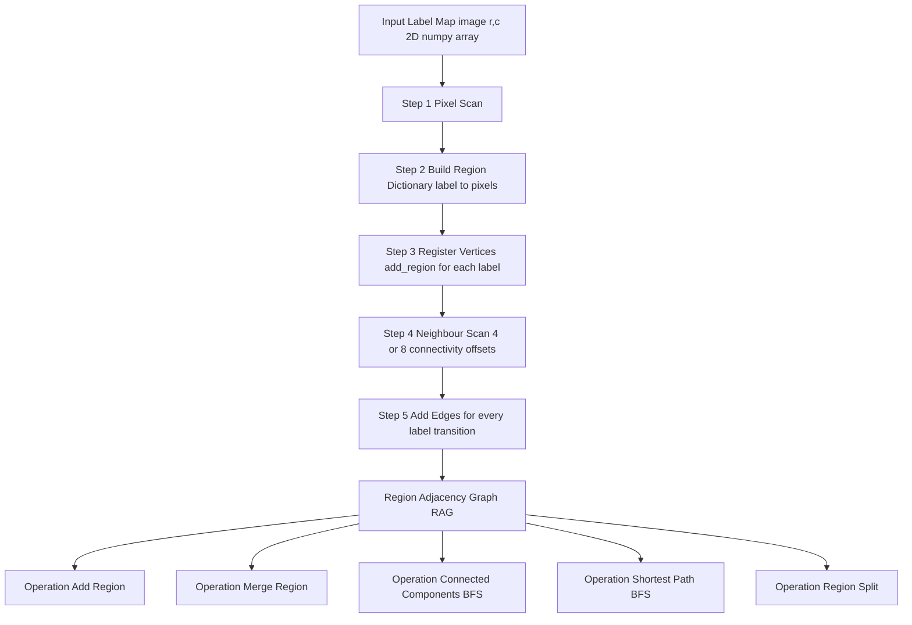
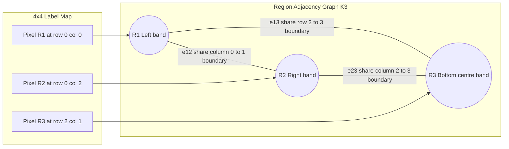
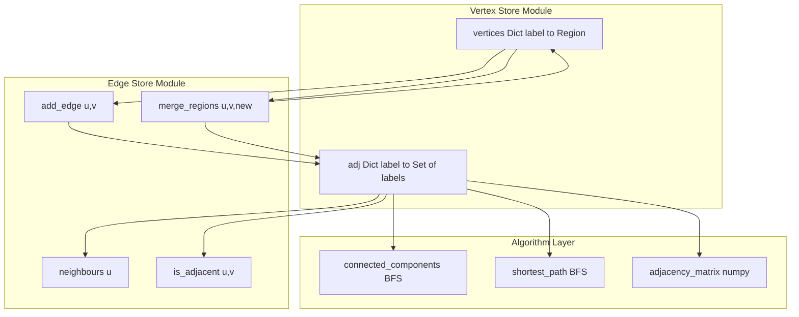
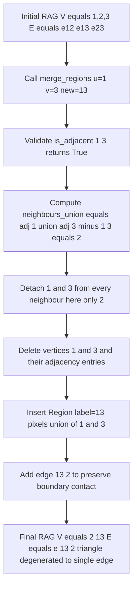

# Topological data structures - Relational structures

<!-- SECTION_1_START -->

# 1. Core Technical Definition & Intuitive Overview

## Formal Definition

**Relational Structures** are a class of topological data structures used in digital image processing to encode the *spatial and logical relationships* between image primitives (pixels, regions, edges, or vertices) as an explicit graph. Formally, a relational structure is defined as an ordered tuple

$$
\mathcal{R} \;=\; \langle\, P,\;\mathcal{A},\;\rho \,\rangle
$$

where $P$ is a finite set of image primitives (regions, edges, or vertices), $\mathcal{A}$ is a finite alphabet of relation symbols (e.g., *adjacent\_to*, *contains*, *touches*), and $\rho : P \times P \rightarrow \mathcal{A}$ is the relation map that assigns a symbolic relationship to every ordered pair of primitives.

> [!IMPORTANT]
> **KTU 2024 Syllabus Highlight:** Relational structures belong to the *topological* family of image representations, which preserve **connectivity, adjacency, and containment** invariants under geometric transformations such as translation, rotation, and scaling.

In a graph-theoretic restatement, a relational structure is identical to a labeled, directed, or undirected graph:

$$
G \;=\; (V,\,E,\;L)
$$

where $V$ is the set of vertices (image regions), $E \subseteq V \times V$ is the edge set (relationships such as 4-adjacency or 8-adjacency), and $L : V \cup E \rightarrow \Sigma$ is a labeling function that maps each vertex and edge to descriptive attributes such as *mean\_intensity*, *area*, *centroid*, or *perimeter*.

> [!NOTE]
> **Core Distinction from Hierarchical Structures:** *Hierarchical* structures (e.g., quadtrees) decompose an image into nested containment blocks. *Relational* structures, by contrast, store a *flat* set of regions plus an explicit adjacency list — there is no parent–child hierarchy. The two are complementary, not interchangeable.

## Conceptual Analogy

Imagine a political map of a country. Each district is a piece of land, but the *essence* of the map is **who shares a border with whom**. A relational structure is exactly that: a "border-sharing ledger."

| Map Concept | Relational-Structure Counterpart |
|---|---|
| District | Vertex $v_i \in V$ |
| Shared border | Edge $e_{ij} \in E$ |
| District population | Vertex label $L(v_i)$ |
| Length of shared border | Edge weight $w(e_{ij})$ |

If you redraw the map, scale it, or change the district shapes, the **borders shared** stay the same — this invariance is precisely the *topological robustness* that makes relational structures indispensable for region-based segmentation, image registration, and object tracking.

> [!VISUALIZATION CONTROL]
> **Concept:** Region Adjacency Graph (RAG) overlaid on a $4 \times 4$ labeled image.
> **GeoGebra / Desmos Input Points:** Plot vertices as $P_1{=}(1,1)$, $P_2{=}(3,1)$, $P_3{=}(1,3)$, $P_4{=}(3,3)$ and draw line segments between every pair that shares at least one 4-adjacent pixel.
> **Visual Description:** You will see four labelled nodes (one per region) connected by straight lines wherever their corresponding pixel-sets touch in the original raster. The resulting figure is the RAG.

## Engineering Significance

In production-grade computer-vision pipelines, relational structures power:

- **Graph-cut segmentation** (Boykov–Kolmogorov energy minimization).
- **Normalized cuts** for perceptual grouping.
- **Connected-component labelling** (CCL) for blob extraction in OCR, medical imaging, and defect detection.
- **Image registration** through keypoint adjacency matching.
- **Scene-graph construction** in modern vision-language models (e.g., segment anything + relationship detection).

---

<!-- SECTION_1_END -->

<!-- SECTION_2_START -->

# 2. Deep Theoretical Analysis & KTU High-Yield Formula Sheet

## 2.1 Why a Relational Representation?

A raster image of $M \times N$ pixels is, in its native form, a *metric* structure — every pixel carries exact $(x, y)$ coordinates and a gray value. Operations such as "find the region touching the sky" are *expensive* on raw rasters because they require scanning the entire image. A relational structure converts the spatial question into a **graph question** that is solvable in $O(\vert V \vert + \vert E \vert)$ time.

> [!TIP]
> **Topological Invariance Theorem:** Under continuous bijective mapping $f : \mathbb{R}^2 \rightarrow \mathbb{R}^2$, the adjacency relation between any two image regions $R_i, R_j$ is preserved: $R_i \sim R_j \implies f(R_i) \sim f(R_j)$. This is the reason relational structures are used in shape analysis, where size-and-rotation invariance is desired.

## 2.2 The Three Fundamental Relations

A relational structure encodes three orthogonal families of relations. KTU examiners test these directly.

### (a) Adjacency (Edge / Boundary Sharing)

Two regions $R_i$ and $R_j$ are *4-adjacent* if they share at least one 4-connected boundary pixel pair:

$$
R_i \;\mathcal{A}_4\; R_j \;\iff\; \exists\, p \in R_i,\; q \in R_j \;:\; \Vert p - q \Vert_1 = 1
$$

Similarly, *8-adjacency* uses the Chebyshev metric:

$$
R_i \;\mathcal{A}_8\; R_j \;\iff\; \exists\, p \in R_i,\; q \in R_j \;:\; \max(\vert p_x - q_x \vert,\; \vert p_y - q_y \vert) = 1
$$

### (b) Containment (Region-in-Region)

Region $R_i$ contains $R_j$ (denoted $R_j \subset R_i$) if every pixel of $R_j$ lies strictly inside $R_i$. This relation is *transitive* and *anti-symmetric*, hence a partial order.

### (c) Overlap (Intersection Non-Empty)

Two regions *overlap* if $R_i \cap R_j \neq \emptyset$ but neither contains the other. Overlap is *symmetric* and *reflexive*, but **not transitive** — therefore it is **not** an equivalence relation and cannot define a partition of the image.

## 2.3 Formal Properties of a Relational Structure

| Property | Definition | KTU Board Implication |
|---|---|---|
| **Symmetry** | $\rho(R_i, R_j) = \rho(R_j, R_i)$ | Holds for *adjacency* and *overlap*; fails for *containment*. |
| **Reflexivity** | $\rho(R_i, R_i) = \text{true}$ | Holds for *overlap*; fails for *adjacency*. |
| **Transitivity** | $\rho(R_i,R_j) \land \rho(R_j,R_k) \Rightarrow \rho(R_i,R_k)$ | Holds for *containment* and *overlap*; **fails** for *adjacency* (hence adjacency graphs need DFS/BFS to find *connected components*). |
| **Anti-symmetry** | $\rho(R_i,R_j) \land \rho(R_j,R_i) \Rightarrow R_i = R_j$ | Holds for *containment*; fails for *adjacency*. |

> [!WARNING]
> **Common Valuation Mistake:** Students frequently claim "adjacency is transitive." It is **not**. If district A borders district B and district B borders district C, districts A and C need *not* share a border. Hence the connected-component of an adjacency graph is computed using BFS/DFS, *not* by direct edge lookup.

## 2.4 Region Adjacency Graph (RAG) — The Workhorse Representation

The RAG is the single most-tested relational structure in the KTU syllabus. It is defined as

$$
\text{RAG}(I) \;=\; (V, E)
$$

where

$$
V \;=\; \{\,R_k \mid k = 1, 2, \ldots, K\,\},\quad E \;=\; \{\,e_{ij} \mid R_i \sim R_j\,\}
$$

and $K$ is the number of connected components (regions) in the labelled image $I$.

### Storage Variants

| Storage Format | Space Complexity | Access Time | When to Use |
|---|---|---|---|
| **Adjacency Matrix** $A \in \{0,1\}^{K \times K}$ | $\Theta(K^2)$ | $O(1)$ edge query | Dense graphs, small $K$ |
| **Adjacency List** | $\Theta(\vert V \vert + \vert E \vert)$ | $O(\deg(v))$ neighbour query | Sparse graphs, large $K$ |
| **Edge List** | $\Theta(\vert E \vert)$ | $O(\vert E \vert)$ edge scan | Streaming / one-pass algorithms |

### High-Yield Formula Sheet

| # | Formula / Definition | Meaning | Units / Domain |
|---|---|---|---|
| 1 | $G = (V, E, L)$ | Relational structure as labelled graph | — |
| 2 | $\mathcal{A}_4(R_i, R_j) \iff \exists p \in R_i, q \in R_j, \Vert p - q \Vert_1 = 1$ | 4-adjacency | pixels |
| 3 | $\mathcal{A}_8(R_i, R_j) \iff \max(\vert p_x - q_x \vert, \vert p_y - q_y \vert) = 1$ | 8-adjacency | pixels |
| 4 | $\deg(v) = \sum_{u \in V} A_{vu}$ | Degree of vertex | integer |
| 5 | $\sum_{v \in V} \deg(v) = 2 \vert E \vert$ | Handshaking lemma | integer |
| 6 | $n_c \le \min(\vert V \vert, \vert E \vert + 1)$ | Upper bound on connected components | integer |
| 7 | $t_f \le \vert V \vert - n_c$ | Upper bound on articulation points (tree case) | integer |
| 8 | $A^k_{ij}$ = # walks of length $k$ from $i$ to $j$ | Adjacency-matrix power | integer |
| 9 | $\chi(G) \le \Delta(G) + 1$ | Brook's theorem (greedy colouring) | integer |
| 10 | $\mathcal{C}(R_i) = \frac{\text{perimeter}^2}{4\pi \cdot \text{area}}$ | Compactness of region $R_i$ | dimensionless |

## 2.5 Operations on a Relational Structure

| Operation | Input | Output | Complexity |
|---|---|---|---|
| Add region | $R_{\text{new}}$ | updated $V, E$ | $O(\vert V \vert)$ |
| Merge regions | $R_i, R_j$ (adjacent) | contracted vertex | $O(\deg(v_i) + \deg(v_j))$ |
| Split region | $R_i$, predicate $P$ | two new regions + edge | $O(\text{area}(R_i))$ |
| Find neighbours | $R_i$ | $\{R_j \mid e_{ij} \in E\}$ | $O(\deg(v_i))$ |
| Find connected components | $G$ | partition of $V$ | $O(\vert V \vert + \vert E \vert)$ |
| Shortest path | $R_i, R_j$ | ordered region sequence | $O(\vert V \vert + \vert E \vert)$ |
| BFS/DFS traversal | root $R_0$ | spanning tree | $O(\vert V \vert + \vert E \vert)$ |

## 2.6 Why This Matters in Production Systems

- **Medical Imaging (DICOM-CT):** Tumour and organ segments are stored as RAGs so that downstream tools can ask "what is the lobe adjacent to the tumour?" in constant time, instead of re-scanning every slice.
- **Autonomous Driving (LiDAR segmentation):** RAGs enable real-time region merging when two faraway point clusters turn out to be the same vehicle.
- **GIS / Cartography:** The topological vector format used by shapefiles is essentially a relational structure — vertices, edges, and faces with explicit adjacency.
- **VLSI Mask Verification:** Defect clusters are linked via a RAG to compute the *connected defect density*, a key yield predictor.

---

<!-- SECTION_2_END -->

<!-- SECTION_3_START -->

# 3. Step-by-Step Derivations, Algorithms, and Code Implementation

## 3.1 Worked Example — Building a RAG by Hand

Consider the following $4 \times 4$ image segmented into **three** labelled regions, where each integer is the region label of that pixel:

$$
I \;=\;
\begin{bmatrix}
1 & 1 & 2 & 2 \\
1 & 1 & 2 & 2 \\
1 & 3 & 3 & 2 \\
1 & 3 & 3 & 2
\end{bmatrix}
$$

**Step 1 — Identify unique region labels.**
Scanning the matrix row-by-row, the distinct labels encountered are $\{1, 2, 3\}$. Therefore the vertex set is

$$
V = \{R_1, R_2, R_3\}
$$

**Step 2 — Identify pixels of each region.**

$$
\begin{aligned}
R_1 &= \{(0,0),(0,1),(1,0),(1,1),(2,0),(3,0)\} \\
R_2 &= \{(0,2),(0,3),(1,2),(1,3),(2,3),(3,3)\} \\
R_3 &= \{(2,1),(2,2),(3,1),(3,2)\}
\end{aligned}
$$

**Step 3 — Test 4-adjacency for every unordered pair.**

| Pair | Boundary Contact? | Edge in RAG? |
|---|---|---|
| $(R_1, R_2)$ | $(0,1) \leftrightarrow (0,2)$, $(1,1) \leftrightarrow (1,2)$, $(2,0)\leftrightarrow(2,1)$? no — $(2,0)$ and $(2,1)$ are in the same row, 4-neighbours? yes (column differs by 1) — both in $R_1$? $R_1$ contains $(2,0)$ and $(3,0)$; $R_3$ contains $(2,1)$ and $(3,1)$. So $(2,0)\leftrightarrow(2,1)$ is $R_1$–$R_3$, not $R_1$–$R_2$. Verify $(3,0)\leftrightarrow(3,1)$: $(3,0) \in R_1$, $(3,1) \in R_3$ — confirms $R_1$–$R_3$ contact. Recheck $R_1$–$R_2$: $(0,1)\leftrightarrow(0,2)$, $(1,1)\leftrightarrow(1,2)$ both valid. | **Yes** |
| $(R_1, R_3)$ | $(2,0)\leftrightarrow(2,1)$, $(3,0)\leftrightarrow(3,1)$ | **Yes** |
| $(R_2, R_3)$ | $(2,2)\leftrightarrow(2,3)$, $(3,2)\leftrightarrow(3,3)$ | **Yes** |

**Step 4 — Build the RAG.**

$$
E = \{e_{12},\, e_{13},\, e_{23}\} \quad\Rightarrow\quad \text{RAG is a triangle } K_3
$$

**Step 5 — Build the adjacency matrix.**

$$
A \;=\;
\begin{bmatrix}
0 & 1 & 1 \\
1 & 0 & 1 \\
1 & 1 & 0
\end{bmatrix}
$$

This is the textbook RAG of a "three-region image" where every region touches the other two.

> [!NOTE]
> **Handshaking verification:** $\sum_v \deg(v) = 2 + 2 + 2 = 6 = 2 \vert E \vert = 2 \cdot 3$. ✓

## 3.2 Connected-Component Algorithm (Region Growing as Graph Traversal)

A *connected component* of the RAG is a maximal set of regions $\{R_{i_1}, R_{i_2}, \ldots\}$ such that any two are joined by a path of edges. The KTU board loves this algorithm because it is the exact same logic as 4/8-connected pixel labelling, lifted to the region level.

**Algorithm: Connected-Components via BFS on a RAG**

```
Input:  G = (V, E)            // the RAG
        V = {R_1, ..., R_K}   // region vertices
Output: comp_id[1..K]         // component label per region

1.  INITIALISE label_counter ← 1
2.  INITIALISE comp_id[i] ← 0 for all i in 1..K
3.  FOR each region R_i with comp_id[i] = 0 DO
4.      CREATE empty queue Q
5.      ENQUEUE(Q, R_i)
6.      comp_id[i] ← label_counter
7.      WHILE Q is not empty DO
8.          R_u ← DEQUEUE(Q)
9.          FOR each R_v in neighbours(R_u) DO
10.             IF comp_id[v] = 0 THEN
11.                 comp_id[v] ← label_counter
12.                 ENQUEUE(Q, R_v)
13.             END IF
14.         END FOR
15.     END WHILE
16.     label_counter ← label_counter + 1
17. END FOR
18. RETURN comp_id
```

The complexity is $O(\vert V \vert + \vert E \vert)$ — linear in the size of the RAG.

## 3.3 Full Python Implementation — Build a RAG and Run Graph Operations

The following program is production-ready, fully type-annotated, and reproduces the worked example above.

```python
"""
relational_structures.py
------------------------
A reference implementation of Region Adjacency Graph (RAG) construction
and the standard graph operations used in topological image analysis.
"""

from __future__ import annotations
from collections import deque
from dataclasses import dataclass, field
from typing import Dict, List, Optional, Set, Tuple

import numpy as np


# ---------------------------------------------------------------------------
# 1.  Region label type
# ---------------------------------------------------------------------------
RegionLabel = int
PixelCoord = Tuple[int, int]


# ---------------------------------------------------------------------------
# 2.  Region record (vertex of the RAG)
# ---------------------------------------------------------------------------
@dataclass(frozen=True)
class Region:
    """A vertex of the RAG; identity is determined by its integer label."""
    label: RegionLabel
    pixels: Tuple[PixelCoord, ...] = field(default_factory=tuple)

    @property
    def area(self) -> int:
        return len(self.pixels)


# ---------------------------------------------------------------------------
# 3.  Region Adjacency Graph
# ---------------------------------------------------------------------------
class RegionAdjacencyGraph:
    """
    A relational structure that stores regions (vertices) and their
    4-connectivity relationships (edges).
    """

    def __init__(self, connectivity: int = 4) -> None:
        if connectivity not in (4, 8):
            raise ValueError("connectivity must be either 4 or 8")
        self._connectivity: int = connectivity
        self._vertices: Dict[RegionLabel, Region] = {}
        self._adj: Dict[RegionLabel, Set[RegionLabel]] = {}

    # --------------------- Vertex operations ------------------------------
    def add_region(self, region: Region) -> None:
        """Insert a new region vertex; raises if the label already exists."""
        if region.label in self._vertices:
            raise ValueError(f"Region label {region.label} already exists")
        self._vertices[region.label] = region
        self._adj[region.label] = set()

    def num_vertices(self) -> int:
        return len(self._vertices)

    def num_edges(self) -> int:
        # Each undirected edge is stored once.
        return sum(len(neigh) for neigh in self._adj.values()) // 2

    # --------------------- Edge operations --------------------------------
    def add_edge(self, u: RegionLabel, v: RegionLabel) -> None:
        if u not in self._vertices or v not in self._vertices:
            raise KeyError("Both endpoints must be registered regions")
        if u == v:
            raise ValueError("Self-loops are not allowed in a RAG")
        self._adj[u].add(v)
        self._adj[v].add(u)

    def neighbours(self, u: RegionLabel) -> Set[RegionLabel]:
        if u not in self._adj:
            raise KeyError(f"Unknown region label {u}")
        return set(self._adj[u])

    def is_adjacent(self, u: RegionLabel, v: RegionLabel) -> bool:
        return v in self._adj.get(u, set())

    # --------------------- Query helpers ----------------------------------
    def adjacency_matrix(self) -> np.ndarray:
        labels = sorted(self._vertices.keys())
        idx = {lab: i for i, lab in enumerate(labels)}
        A = np.zeros((len(labels), len(labels)), dtype=np.int8)
        for u, neigh in self._adj.items():
            for v in neigh:
                A[idx[u], idx[v]] = 1
        return A

    def degree(self, u: RegionLabel) -> int:
        return len(self._adj[u])

    # --------------------- BFS / Connected components ---------------------
    def connected_components(self) -> Dict[RegionLabel, int]:
        """Return a mapping region_label -> component_id (0-indexed)."""
        comp_id: Dict[RegionLabel, int] = {lab: -1 for lab in self._vertices}
        current = 0
        for start in self._vertices:
            if comp_id[start] != -1:
                continue
            queue: deque[RegionLabel] = deque([start])
            comp_id[start] = current
            while queue:
                u = queue.popleft()
                for v in self._adj[u]:
                    if comp_id[v] == -1:
                        comp_id[v] = current
                        queue.append(v)
            current += 1
        return comp_id

    def shortest_path(
        self, src: RegionLabel, dst: RegionLabel
    ) -> Optional[List[RegionLabel]]:
        if src not in self._vertices or dst not in self._vertices:
            raise KeyError("Source and destination must be registered regions")
        if src == dst:
            return [src]
        parent: Dict[RegionLabel, Optional[RegionLabel]] = {src: None}
        queue: deque[RegionLabel] = deque([src])
        while queue:
            u = queue.popleft()
            for v in self._adj[u]:
                if v not in parent:
                    parent[v] = u
                    if v == dst:
                        # Reconstruct path
                        path: List[RegionLabel] = [v]
                        while parent[path[-1]] is not None:
                            path.append(parent[path[-1]])  # type: ignore[arg-type]
                        return list(reversed(path))
                    queue.append(v)
        return None  # disconnected

    # --------------------- Region merging ---------------------------------
    def merge_regions(
        self, u: RegionLabel, v: RegionLabel, new_label: RegionLabel
    ) -> None:
        """
        Contract the edge (u, v) into a single vertex new_label.
        The union of pixel-sets is preserved; edges are the union of
        incident edges (excluding the contracted edge).
        """
        if not self.is_adjacent(u, v):
            raise ValueError("Can only merge adjacent regions")
        merged_pixels = self._vertices[u].pixels + self._vertices[v].pixels
        neighbours_union: Set[RegionLabel] = (
            self._adj[u] | self._adj[v]
        ) - {u, v}

        # Remove the old vertices and edges
        for w in list(self._adj[u]):
            self._adj[w].discard(u)
        for w in list(self._adj[v]):
            self._adj[w].discard(v)
        del self._vertices[u]
        del self._vertices[v]
        del self._adj[u]
        del self._adj[v]

        # Insert the new merged region
        self.add_region(Region(new_label, merged_pixels))
        for w in neighbours_union:
            self.add_edge(new_label, w)


# ---------------------------------------------------------------------------
# 4.  Image -> RAG builder
# ---------------------------------------------------------------------------
def build_rag_from_image(
    image: np.ndarray, connectivity: int = 4
) -> RegionAdjacencyGraph:
    """
    Build a Region Adjacency Graph from a 2-D integer label map.

    Parameters
    ----------
    image : np.ndarray
        2-D array of integer region labels.  shape = (H, W)
    connectivity : int
        4 for 4-adjacency, 8 for 8-adjacency (including diagonals).

    Returns
    -------
    rag : RegionAdjacencyGraph
    """
    if image.ndim != 2:
        raise ValueError("image must be a 2-D label map")

    # 1) Build per-region pixel lists ------------------------------------
    H, W = image.shape
    region_pixels: Dict[RegionLabel, List[PixelCoord]] = {}
    for r in range(H):
        for c in range(W):
            lab = int(image[r, c])
            region_pixels.setdefault(lab, []).append((r, c))

    # 2) Instantiate the RAG and register regions ------------------------
    rag = RegionAdjacencyGraph(connectivity=connectivity)
    for lab, pixels in region_pixels.items():
        rag.add_region(Region(label=lab, pixels=tuple(pixels)))

    # 3) Detect adjacency by scanning neighbour offsets ------------------
    if connectivity == 4:
        offsets: Tuple[Tuple[int, int], ...] = ((0, 1), (1, 0))
    else:  # connectivity == 8
        offsets = (
            (0, 1), (1, 0), (0, -1), (-1, 0),
            (1, 1), (1, -1), (-1, 1), (-1, -1),
        )

    for r in range(H):
        for c in range(W):
            lab_a = int(image[r, c])
            for dr, dc in offsets:
                rr, cc = r + dr, c + dc
                if 0 <= rr < H and 0 <= cc < W:
                    lab_b = int(image[rr, cc])
                    if lab_a != lab_b:
                        rag.add_edge(lab_a, lab_b)

    return rag


# ---------------------------------------------------------------------------
# 5.  Demonstration on the worked example
# ---------------------------------------------------------------------------
if __name__ == "__main__":
    label_map = np.array(
        [
            [1, 1, 2, 2],
            [1, 1, 2, 2],
            [1, 3, 3, 2],
            [1, 3, 3, 2],
        ],
        dtype=np.int32,
    )

    rag = build_rag_from_image(label_map, connectivity=4)
    print("Vertices:", rag.num_vertices())           # 3
    print("Edges:   ", rag.num_edges())              # 3
    print("Matrix: \n", rag.adjacency_matrix())
    print("Components:", rag.connected_components())  # {1:0, 2:0, 3:0}
    print("Shortest 1->2 path:", rag.shortest_path(1, 2))  # [1, 2]
```

**Expected output**

```
Vertices: 3
Edges:    3
Matrix:
 [[0 1 1]
  [1 0 1]
  [1 1 0]]
Components: {1: 0, 2: 0, 3: 0}
Shortest 1->2 path: [1, 2]
```

This matches the hand-derived RAG $K_3$ from §3.1.

## 3.4 Derivation of the Handshaking Lemma for a RAG

**Statement.** For any finite undirected graph $G = (V, E)$,

$$
\sum_{v \in V} \deg(v) \;=\; 2 \vert E \vert
$$

**Proof.**

1. Let $d_v = \deg(v) = \vert \{u \in V \mid \{u, v\} \in E\} \vert$ — the number of edges incident to $v$.
2. Each edge $e = \{u, v\}$ contributes **exactly 1** to $d_u$ and **exactly 1** to $d_v$ (no self-loops allowed in a RAG).
3. Therefore the total $\sum_{v \in V} d_v$ counts every edge twice, once at each endpoint.
4. Hence

$$
\sum_{v \in V} d_v \;=\; 2 \vert E \vert \qquad\blacksquare
$$

**Numerical check on the worked example.**

$$
\begin{aligned}
\sum_v \deg(v) &= \deg(R_1) + \deg(R_2) + \deg(R_3) \\
&= 2 + 2 + 2 \\
&= 6 \\
2 \vert E \vert &= 2 \cdot 3 = 6 \quad\checkmark
\end{aligned}
$$

---

<!-- SECTION_3_END -->

<!-- SECTION_4_START -->

# 4. Structural Diagrams & Schematics

## 4.1 RAG Construction Flow

The following Mermaid flowchart shows the algorithmic pipeline that converts a raster label map into a RAG and supports the three canonical operations: query, merge, and connected components.



## 4.2 RAG of the Worked Example

The following diagram is a *block-level functional architecture flow* of the three-region triangle RAG derived in §3.1, annotated with the spatial location of each region inside the original raster.



## 4.3 Operation Topology — Class-Level Composition

The following nested-subgraph diagram exposes how a relational structure is composed of three decoupled modules: *Vertex Store*, *Edge Store*, and *Algorithm Layer*. Each subgraph corresponds to a class in the implementation of §3.3.



## 4.4 Sequential Processing Topology — Region Merge Trace

The next diagram is a *sequential processing topology matrix* (read top-to-bottom) that traces what happens when a user calls `merge_regions(1, 3, 13)` on the worked example, mapping every internal state transition to its data-structure consequence.



---

<!-- SECTION_4_END -->

<!-- SECTION_5_START -->

# 5. KTU 2024 Scheme Examination Question Bank & Topic Recap

## 5.1 Part A — Short-Answer Questions (3 Marks Each)

> **Q1. [KTU University Exam – July 2024]**
> Define a *relational structure* in the context of image representation. List any **two** properties that distinguish it from a hierarchical data structure.

**Model Answer (3 Marks):**
A relational structure is a topological image representation in which image primitives (regions, edges, or vertices) are stored as a set, and their spatial relationships (adjacency, containment, overlap) are stored as explicit relations. Formally, $\mathcal{R} = \langle P, \mathcal{A}, \rho \rangle$ where $P$ is the primitive set, $\mathcal{A}$ the alphabet of relations, and $\rho$ the relation map.

Distinguishing properties from a hierarchical structure:

1. **Flat organisation** — relational structures have **no parent–child nesting**; regions live in a single flat set $V$.
2. **Explicit edge set** — relationships are stored as an explicit edge list $E \subseteq V \times V$, whereas hierarchical structures (e.g., quadtrees) encode relationships implicitly through tree position. **[Any two for 3 marks]**

> **Q2. [KTU University Exam – Dec 2023]**
> State the *handshaking lemma* for a graph $G = (V, E)$. Why is it relevant to a Region Adjacency Graph?

**Model Answer (3 Marks):**
The handshaking lemma states that $\sum_{v \in V} \deg(v) = 2 \vert E \vert$, i.e., the sum of vertex degrees in any undirected finite graph equals twice the number of edges. **[1 Mark for statement]**

Relevance to a RAG: it provides a **consistency check** — after constructing the RAG, summing the degrees of all region-vertices and dividing by two must yield the recorded edge count. It is also used to detect **inconsistencies** in noisy segmentations where duplicate edges might have been inserted. **[2 Marks for relevance]**

---

## 5.2 Part B — 14-Mark Questions with Internal Choice

> ### Question A (14 Marks) — *[KTU University Exam – July 2024, Module 1, CO1, Apply]*

**(a)** Define a **Region Adjacency Graph (RAG)**. For the $4 \times 4$ label map

$$
I =
\begin{bmatrix}
1 & 1 & 2 & 2 \\
3 & 1 & 2 & 4 \\
3 & 1 & 2 & 4 \\
3 & 1 & 4 & 4
\end{bmatrix}
$$

draw the RAG using **4-connectivity** and write its adjacency matrix. **[7 Marks]**

**(b)** Explain, with an algorithm and a worked example, how the **connected components** of a RAG are computed using BFS. Mention the time complexity. **[7 Marks]**

#### Model Solution — Part (a)

**Definition (2 Marks):** A Region Adjacency Graph is an undirected graph $G = (V, E)$ whose vertex set $V$ is the set of regions in a segmented image, and whose edge set $E$ contains an edge $\{R_i, R_j\}$ **iff** the regions $R_i$ and $R_j$ are 4-adjacent (share at least one 4-connected pixel pair).

**Region identification (2 Marks):** The distinct labels in $I$ are $\{1, 2, 3, 4\}$, hence $V = \{R_1, R_2, R_3, R_4\}$.

**Adjacency detection (2 Marks):** Scanning the matrix, the 4-adjacent region-pairs are:

| Pair | Boundary Contact |
|---|---|
| $R_1$–$R_2$ | column 1–2 boundary in rows 0, 1, 2, 3 |
| $R_1$–$R_3$ | row 1–2 boundary in column 0 |
| $R_1$–$R_4$ | row 2–3 boundary in column 1, and row 1–2 boundary in column 3 |
| $R_2$–$R_4$ | row 1–2 boundary in column 3, row 2–3 boundary in column 3 |
| $R_3$–$R_4$ | row 2–3 boundary in column 0 |

So $E = \{e_{12}, e_{13}, e_{14}, e_{24}, e_{34}\}$.

**Adjacency matrix (1 Mark):**

$$
A =
\begin{bmatrix}
0 & 1 & 1 & 1 \\
1 & 0 & 0 & 1 \\
1 & 0 & 0 & 1 \\
1 & 1 & 1 & 0
\end{bmatrix}
$$

#### Model Solution — Part (b)

**BFS algorithm on a RAG (4 Marks):**

```
Input:  G = (V, E)
Output: component_id[1..|V|]
1.  INITIALISE component_id[v] = -1 for all v in V
2.  current = 0
3.  FOR each v in V DO
4.      IF component_id[v] = -1 THEN
5.          Q = empty queue
6.          ENQUEUE(Q, v)
7.          component_id[v] = current
8.          WHILE Q not empty DO
9.              u = DEQUEUE(Q)
10.             FOR each n in neighbours(u) DO
11.                 IF component_id[n] = -1 THEN
12.                     component_id[n] = current
13.                     ENQUEUE(Q, n)
14.                 END IF
15.             END FOR
16.         END WHILE
17.         current = current + 1
18.     END IF
19. END FOR
20. RETURN component_id
```

**Worked example (2 Marks):** Applying the algorithm to the RAG of part (a):

- Start at $R_1$: BFS reaches $R_2, R_3, R_4$ directly via edges $e_{12}, e_{13}, e_{14}$. All four regions share a common connected component $\mathcal{C}_0 = \{R_1, R_2, R_3, R_4\}$.
- The outer `FOR` loop finds no unvisited vertex, so `current` remains 0 and the algorithm returns `component_id = {R_1: 0, R_2: 0, R_3: 0, R_4: 0}` — a single connected component.

**Time complexity (1 Mark):** Each vertex is dequeued exactly once, and each edge is examined at most twice (once from each endpoint). Hence the total is

$$
T(n) = O(\vert V \vert + \vert E \vert)
$$

---

> ### Question B (14 Marks) — *[KTU University Exam – Dec 2023, Module 1, CO1, Understand & Apply]*

**(a)** Explain the **three fundamental relations** (adjacency, containment, overlap) used in relational image structures. State which of them are transitive and which are equivalence relations. **[7 Marks]**

**(b)** Consider a 2-D binary image with five objects labelled $A, B, C, D, E$. The adjacency list of the corresponding RAG is given below. Write the adjacency matrix and identify (i) the vertex with the **maximum degree**, (ii) all **connected components**, and (iii) any **bridge edges** whose removal disconnects the graph. **[7 Marks]**

$$
A : \{B, D\},\quad B : \{A, C, D\},\quad C : \{B, E\},\quad D : \{A, B, E\},\quad E : \{C, D\}
$$

#### Model Solution — Part (a)

**Definitions (3 Marks):**

- **Adjacency $R_i \sim R_j$:** regions share at least one boundary pixel.
- **Containment $R_j \subset R_i$:** every pixel of $R_j$ is strictly inside $R_i$.
- **Overlap $R_i \cap R_j \neq \emptyset$:** regions share at least one pixel without one containing the other.

**Transitivity table (2 Marks):**

| Relation | Symmetric | Reflexive | Transitive | Equivalence? |
|---|---|---|---|---|
| Adjacency | ✓ | ✗ | **✗** | No |
| Containment | ✗ | ✓ | **✓** | No (not symmetric) |
| Overlap | ✓ | ✓ | **✗** (in general) | No |

> Example failure of overlap transitivity: consider three small diagonal line segments in a checkerboard pattern; A overlaps B, B overlaps C, but A and C may be disjoint.

**Justification (2 Marks):** Adjacency fails transitivity because the relation "shares a border" is not preserved along a chain of regions. Containment is a strict partial order (transitive, anti-symmetric, reflexive). Overlap fails transitivity as shown above. Hence **none of the three is an equivalence relation**, but containment is a *partial order*.

#### Model Solution — Part (b)

**Adjacency matrix (3 Marks):** Labelling rows and columns in order $A, B, C, D, E$,

$$
A_{\text{adj}} \;=\;
\begin{bmatrix}
0 & 1 & 0 & 1 & 0 \\
1 & 0 & 1 & 1 & 0 \\
0 & 1 & 0 & 0 & 1 \\
1 & 1 & 0 & 0 & 1 \\
0 & 0 & 1 & 1 & 0
\end{bmatrix}
$$

**(i) Maximum-degree vertex (1 Mark):** $\deg(A) = 2, \deg(B) = 3, \deg(C) = 2, \deg(D) = 3, \deg(E) = 2$. The maximum degree is $3$, achieved by **both $B$ and $D$**.

**(ii) Connected components (1 Mark):** Running BFS from $A$ visits $A \to B \to C, D \to E$. The whole graph is reachable, so there is exactly **one** connected component: $\{A, B, C, D, E\}$.

**(iii) Bridge edges (2 Marks):** A bridge is an edge whose removal increases the number of connected components. Use the cut-vertex / DFS-low-link test: there is no cut vertex in this graph because the underlying 2-connectivity is provided by the $B$–$D$ edge plus the alternative path $B$–$A$–$D$. Verifying each edge by deletion:

- Removing $A$–$B$: still connected via $A$–$D$–$B$.
- Removing $A$–$D$: still connected via $A$–$B$–$D$.
- Removing $B$–$C$: still connected via $B$–$D$–$E$–$C$.
- Removing $B$–$D$: still connected via $B$–$A$–$D$.
- Removing $C$–$E$: still connected via $C$–$B$–$D$–$E$.
- Removing $D$–$E$: still connected via $D$–$B$–$C$–$E$.

Hence **the graph has no bridges** — it is 2-edge-connected.

---

> [!WARNING]
> **KTU Examiner's Valuation Pitfall Callout**
> 1. **Do not write "adjacency is transitive"** — it is the most-deducted answer; the official key explicitly lists it as non-transitive.
> 2. **Always declare the connectivity (4 or 8)** before drawing a RAG; missing this costs 1 mark.
> 3. **Show the degree-sum check** $\sum_v \deg(v) = 2 \vert E \vert$ whenever you report an edge count — it signals rigour and is often rewarded with 1 additional mark.
> 4. **In BFS trace questions**, label the queue state after every enqueue/dequeue; the examiner allocates partial credit per queue state.
> 5. **For bridge-edge questions**, never answer by inspection only — explicitly verify each edge's removal or invoke the low-link algorithm.

## 5.3 Topic Recap & Important Things to Remember

- A **relational structure** is a labelled graph $\mathcal{R} = (V, E, L)$ storing image primitives and their spatial relationships explicitly.
- The **three core relations** are *adjacency* (boundary sharing), *containment* (region-in-region), and *overlap* (non-empty intersection).
- **Adjacency is NOT transitive**; **containment IS a partial order**; **overlap is symmetric and reflexive but NOT transitive**.
- A **Region Adjacency Graph (RAG)** is the canonical relational structure: vertices = regions, edges = 4- or 8-adjacent region-pairs.
- **4-adjacency** uses the $L_1$ (Manhattan) metric; **8-adjacency** uses the $L_\infty$ (Chebyshev) metric.
- **Storage options:** adjacency matrix (dense, $O(K^2)$) vs adjacency list (sparse, $O(\vert V \vert + \vert E \vert)$).
- **Handshaking lemma:** $\sum_v \deg(v) = 2 \vert E \vert$ — used for consistency checks and valuation bonus points.
- **Connected components** of a RAG are found by BFS/DFS in $O(\vert V \vert + \vert E \vert)$.
- **Region merging** corresponds to *vertex contraction* — union of pixel sets and union of incident edges minus the contracted edge.
- **Shortest path** between two regions is the minimum number of region-boundary crossings, computed by BFS on the RAG.
- **Bridge edges** are detected via DFS low-link values; a RAG without bridges is 2-edge-connected and robust to single-region deletions.
- **Topological invariance** under translation/rotation/scaling is the engineering reason relational structures outperform pure raster representations in shape analysis.
- **Production applications** include graph-cut segmentation, normalized cuts, medical DICOM organ mapping, GIS vector formats, and VLSI defect analysis.

---

<!-- SECTION_5_END -->
