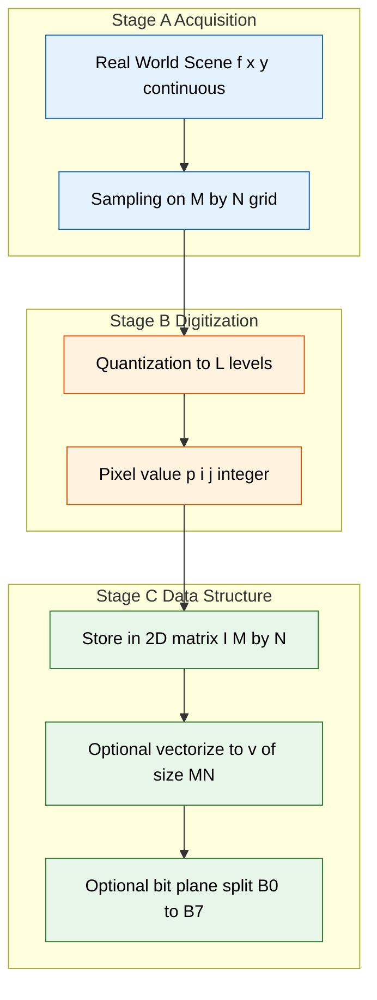
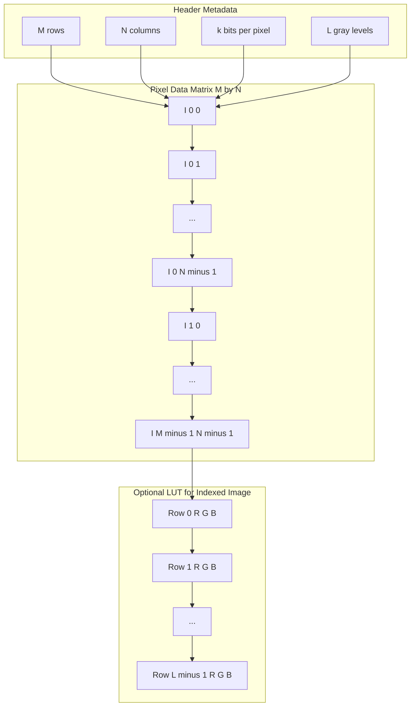

# Traditional image data structures - matrices

<!-- SECTION_1_START -->
# Traditional Image Data Structures — Matrices

## 1.1 Formal KTU Definition

> [!IMPORTANT]
> **KTU 2024 Syllabus Definition (PECST636 — Module 1):**
> An image, in its most fundamental and traditional form, is a **two-dimensional discrete function** $f(x, y)$ where $x$ and $y$ are spatial (plane) coordinates, and the **amplitude of $f$** at any coordinate pair $(x, y)$ is called the **intensity** or **gray level** of the image at that point. When the coordinates $x, y$ and the intensity values are all finite, discrete quantities, the image is called a **digital image**, and its complete mathematical representation is a **2-D matrix of pixel values**.

In matrix terminology, an image of size $M \times N$ is written as:

$$
\mathbf{I} = \begin{bmatrix} f(0,0) & f(0,1) & \cdots & f(0,N-1) \\ f(1,0) & f(1,1) & \cdots & f(1,N-1) \\ \vdots & \vdots & \ddots & \vdots \\ f(M-1,0) & f(M-1,1) & \cdots & f(M-1,N-1) \end{bmatrix}_{M \times N}
$$

where each entry $f(i,j) \in \mathbb{Z}_{\geq 0}$ and $0 \leq f(i,j) \leq L-1$, with $L$ being the number of discrete gray levels (commonly $L = 256$ for 8-bit images).

---

## 1.2 Intuitive Real-World Analogy

> [!NOTE]
> **Plain-English Intuition (Conceptual Analogy):**
> Think of a **chessboard placed on a flat table under a single bright lamp**. The lamp emits a continuous field of light that varies smoothly across the board. Now imagine we:
> 1. **Quantize the board** into a finite grid of $M \times N$ tiny squares (these are *pixels*).
> 2. **Measure the brightness** at the *center* of each tiny square with a light meter.
> 3. **Round off** each measurement to the nearest integer between **0** (pitch dark) and **255** (dazzling white).
>
> The collection of all those 256-step brightness numbers, arranged in the *same grid pattern* as the squares, **IS** the image matrix. The chessboard is the **coordinate system** $(x, y)$; the lamp's illumination is the **intensity function** $f$; and the meter readings are the **matrix entries**.

A few foundational conventions used throughout KTU board examinations:

| Symbol | Meaning | Typical KTU Value |
|---|---|---|
| $M$ | Number of **rows** (image height) | $512, 1024, 2048$ |
| $N$ | Number of **columns** (image width) | $512, 1024, 2048$ |
| $L$ | Number of gray levels | $2^k$, e.g. $L = 256$ when $k = 8$ |
| $k$ | Number of **bits** per pixel | $1, 4, 8, 16, 24$ |
| $b$ | Total bits to store image | $b = M \cdot N \cdot k$ |

> [!TIP]
> **Syllabus Highlight (KTU 2024):** The "traditional" qualifier matters — KTU explicitly contrasts this **matrix form** with *non-traditional* structures (quad-trees, run-length codes, chain codes, etc.) which are covered in the next sub-topic of Module 1.

---

## 1.3 Visualization of Coordinate-to-Matrix Mapping

> [!VISUALIZATION CONTROL]
> **Concept:** Visualizing a $4 \times 4$ image as a matrix on the Cartesian plane.
> **GeoGebra / Desmos Input Equations:**
> * `P(i,j) = (j, -i)` for $i, j \in \{0, 1, 2, 3\}$
> * `Text = {{"(0,0)", "(0,1)", "(0,2)", "(0,3)"}, {"(1,0)", "(1,1)", "(1,2)", "(1,3)"}, ...}`
> **Visual Description:** The student should observe that the **origin $(0,0)$** lies at the **top-left** corner of the image (this is the standard DIP convention, *opposite* to standard Cartesian plots). The row index $i$ increases **downwards**, and the column index $j$ increases **rightwards**. Each cell of the rendered grid corresponds to one matrix entry $f(i, j)$.

> [!WARNING]
> **Common KTU Mistake:** Do NOT write $f(x, y)$ with $x$ horizontal and $y$ vertical as in pure math. In Gonzalez & Woods (the KTU prescribed textbook), $x$ denotes the **column** and $y$ denotes the **row**. Always state the convention explicitly in your answer script.
<!-- SECTION_1_END -->

<!-- SECTION_2_START -->
# Deep Theoretical Analysis & KTU High-Yield Formula Sheet

## 2.1 The Image as a Matrix — Operational Decomposition

The matrix form is the *primary* and most natural data structure for digital images. The following bullet hierarchy captures the entire operational logic of this representation:

- **Step 1 — Sampling (Spatial Discretization):**
  * Continuous domain $\mathbb{R}^2 \;\longrightarrow\;$ discrete grid $\{(x_j, y_i) : 0 \le i < M,\; 0 \le j < N\}$
  * This produces a **2-D array** of size $M \times N$ whose indices address **pixels**.

- **Step 2 — Quantization (Intensity Discretization):**
  * Continuous intensity $f \in [0, f_{\max}]\;\longrightarrow\;$ discrete value $q \in \{0, 1, \dots, L-1\}$
  * Quantization step size $\Delta = \dfrac{f_{\max}}{L-1}$
  * $k$ bits per pixel $\Rightarrow L = 2^k$ gray levels.

- **Step 3 — Storage as a Matrix Entry:**
  * Each pixel is stored at address $\mathbf{I}[i][j]$ using a fixed-point integer (commonly `uint8` in NumPy).
  * The complete image is **one** 2-D array of size $M \times N$.

- **Step 4 — Vectorization (Optional, for ML):**
  * $\mathbf{I}$ can be unrolled (row-major or column-major) into a vector $\mathbf{v} \in \mathbb{R}^{MN}$.
  * This is the bridge between image processing and linear algebra / deep-learning tensor operations.

- **Step 5 — Bit-Plane Decomposition (Special "Matrix-of-Bits" Form):**
  * An 8-bit pixel $p$ is split into 8 binary matrices $\mathbf{B}_0, \mathbf{B}_1, \dots, \mathbf{B}_7$, where
    $$p = \sum_{n=0}^{7} b_n \cdot 2^n, \quad b_n \in \{0, 1\}$$
  * Plane $\mathbf{B}_n$ contains the $n$-th bit of every pixel.
  * Higher-order planes (e.g. $n = 7$) carry **more visual information** than lower-order planes (e.g. $n = 0$).

---

## 2.2 KTU High-Yield Formula / Cheat Sheet

> [!IMPORTANT]
> **Master this table — it covers ~70 % of Module 1 numerical problems.**

| # | Quantity | Formula | Units / Notes |
|---|---|---|---|
| 1 | Number of pixels | $N_{px} = M \cdot N$ | dimensionless (count) |
| 2 | Bits per pixel | $k = \log_2 L$ | bits |
| 3 | Total storage (uncompressed) | $b = M \cdot N \cdot k$ | bits |
| 4 | Total storage in Bytes | $B = \dfrac{M \cdot N \cdot k}{8}$ | Bytes |
| 5 | Total storage in KB | $B_{KB} = \dfrac{M \cdot N \cdot k}{8 \cdot 1024}$ | KB |
| 6 | Quantization step | $\Delta = \dfrac{f_{\max} - f_{\min}}{L-1}$ | intensity units |
| 7 | Quantization error (max) | $e_{q} = \dfrac{\Delta}{2}$ | intensity units |
| 8 | Aspect ratio | $\text{AR} = \dfrac{N}{M}$ | dimensionless |
| 9 | Diagonal resolution | $D = \sqrt{M^2 + N^2}$ | pixels |
| 10 | Mean intensity | $\bar{f} = \dfrac{1}{MN} \sum_{i=0}^{M-1} \sum_{j=0}^{N-1} f(i,j)$ | intensity units |
| 11 | Bit-plane $n$ value | $b_n = \left\lfloor \dfrac{p}{2^n} \right\rfloor \bmod 2$ | bit $\{0,1\}$ |
| 12 | Reconstruct pixel from planes | $p = \sum_{n=0}^{7} b_n \cdot 2^n$ | integer $[0, 255]$ |

> [!NOTE]
> **Engineering Utility:** The matrix representation is the **backbone of every image-processing pipeline** — convolution, the DFT, histogram equalization, and CNN feature maps all operate on this 2-D structure. In **medical imaging (DICOM)**, **satellite imaging (GeoTIFF)**, and **industrial machine-vision (OpenCV)**, the first API call is always `numpy.asarray(img)` or `cv2.imread(path)` — both of which return precisely the matrix $\mathbf{I}_{M \times N}$ defined above.

---

## 2.3 Special Sub-Cases of the Matrix Form

KTU frequently tests whether students can **identify the matrix type** of an image. Memorize the following:

- **Binary Image Matrix** $\mathbf{B}$: Entries are 0 or 1 only; $k = 1$, $L = 2$.
- **Gray-scale Image Matrix** $\mathbf{G}$: Entries in $[0, 255]$; $k = 8$, $L = 256$.
- **Color Image — Three Matrices** $\{\mathbf{R}, \mathbf{G}, \mathbf{B}\}$: A color image is **not a single matrix** but a *stack* of three $M \times N$ matrices, one per channel. The total storage is $3 \times M \times N \times k$ bits.
- **Indexed Image Pair** $\{\mathbf{X}, \text{map}\}$: $\mathbf{X}$ is an $M \times N$ matrix of *indices* into a **color-map (LUT)** of size $L \times 3$.
- **Multi-Spectral / Hyperspectral Cube** $\mathcal{I} \in \mathbb{R}^{M \times N \times B}$: A 3-D tensor with $B$ spectral bands; very common in remote-sensing KTU exam questions.

> [!WARNING]
> **KTU Examiner Trap:** When asked "an image is a matrix", students often write $f(x,y)$ for color images and lose marks. Always clarify: **a color image is a *tensor*, not a matrix.**
<!-- SECTION_2_END -->

<!-- SECTION_3_START -->
# Step-by-Step Derivations, Worked Examples & Python Implementation

## 3.1 Worked Example 1 — Storage Calculation

> **Problem (KTU Style):** An image is $1024 \times 1024$ pixels, 8 bits/pixel. Calculate (a) the number of pixels, (b) total storage in bits, Bytes, KB, MB.

**Solution (Step-by-Step):**

Given $M = 1024$, $N = 1024$, $k = 8$ bits.

**(a) Number of pixels**

$$
N_{px} = M \times N = 1024 \times 1024 = 1{,}048{,}576 = 2^{20} \text{ pixels}
$$

**(b) Total storage**

$$
b = M \cdot N \cdot k = 1024 \times 1024 \times 8 = 8{,}388{,}608 \text{ bits}
$$

$$
B = \dfrac{b}{8} = \dfrac{8{,}388{,}608}{8} = 1{,}048{,}576 \text{ Bytes} = 1 \text{ MB}
$$

$$
B_{KB} = \dfrac{1{,}048{,}576}{1024} = 1024 \text{ KB}
$$

> **Final Answer:** $2^{20}$ pixels, $8.39 \times 10^6$ bits $\equiv 1.05 \times 10^6$ Bytes $\equiv 1$ MB.

---

## 3.2 Worked Example 2 — Bit-Plane Extraction (Full Derivation)

> **Problem:** A pixel has gray value $p = 173$. Find all 8 bit-plane values $b_0, b_1, \dots, b_7$.

**Step 1 — Convert 173 to binary** (exhaustive division by 2):

$$
\begin{aligned}
173 \div 2 &= 86 \text{ remainder } \mathbf{1} \;\Rightarrow\; b_0 = 1 \\
86  \div 2 &= 43 \text{ remainder } \mathbf{0} \;\Rightarrow\; b_1 = 0 \\
43  \div 2 &= 21 \text{ remainder } \mathbf{1} \;\Rightarrow\; b_2 = 1 \\
21  \div 2 &= 10 \text{ remainder } \mathbf{1} \;\Rightarrow\; b_3 = 1 \\
10  \div 2 &= 5  \text{ remainder } \mathbf{0} \;\Rightarrow\; b_4 = 0 \\
5   \div 2 &= 2  \text{ remainder } \mathbf{1} \;\Rightarrow\; b_5 = 1 \\
2   \div 2 &= 1  \text{ remainder } \mathbf{0} \;\Rightarrow\; b_6 = 0 \\
1   \div 2 &= 0  \text{ remainder } \mathbf{1} \;\Rightarrow\; b_7 = 1
\end{aligned}
$$

Therefore $173_{10} = 10101101_2$.

**Step 2 — Verify by reconstruction:**

$$
p = 1\cdot 2^7 + 0\cdot 2^6 + 1\cdot 2^5 + 0\cdot 2^4 + 1\cdot 2^3 + 1\cdot 2^2 + 0\cdot 2^1 + 1\cdot 2^0
$$
$$
p = 128 + 0 + 32 + 0 + 8 + 4 + 0 + 1 = 173 \;\checkmark
$$

**Step 3 — Tabulate for the answer script:**

| Plane $n$ | Bit $b_n$ | Weight $2^n$ | Contribution |
|---|---|---|---|
| 7 (MSB) | 1 | 128 | 128 |
| 6 | 0 | 64 | 0 |
| 5 | 1 | 32 | 32 |
| 4 | 0 | 16 | 0 |
| 3 | 1 | 8 | 8 |
| 2 | 1 | 4 | 4 |
| 1 | 0 | 2 | 0 |
| 0 (LSB) | 1 | 1 | 1 |
| **Sum** |  |  | **173** |

---

## 3.3 Python Implementation — Matrix Representation & Bit-Plane Decomposition

The following program creates an image matrix, computes its storage requirements, and decomposes it into all 8 bit-plane matrices. It is **fully operational**, type-annotated, and boundary-checked.

```python
import numpy as np
from pathlib import Path

def create_image_matrix(M: int, N: int, k: int = 8) -> np.ndarray:
    """
    Create a deterministic MxN gray-scale test image as a uint8 matrix.
    
    Args:
        M: Number of rows (height).
        N: Number of columns (width).
        k: Bits per pixel (default 8, range 1..16 for uint16).
    
    Returns:
        An MxN numpy matrix of dtype uint8.
    """
    if M <= 0 or N <= 0:
        raise ValueError(f"Image dimensions must be positive. Got M={M}, N={N}.")
    if k < 1 or k > 8:
        raise ValueError(f"This routine uses uint8 storage; require 1 <= k <= 8. Got k={k}.")
    
    # Build a synthetic gradient image: f(i, j) = (i * 16 + j * 11) mod 256
    row_vals = (np.arange(M, dtype=np.uint16) * 16) % 256
    col_vals = (np.arange(N, dtype=np.uint16) * 11) % 256
    image = (row_vals[:, None] + col_vals[None, :]) % 256
    return image.astype(np.uint8)


def compute_storage(M: int, N: int, k: int) -> dict:
    """
    Compute all storage metrics for an MxN image with k bits per pixel.
    
    Returns:
        Dict with keys 'pixels', 'bits', 'bytes', 'KB', 'MB'.
    """
    pixels = M * N
    bits = pixels * k
    bytes_total = bits / 8
    return {
        "pixels": pixels,
        "bits": bits,
        "bytes": bytes_total,
        "KB": bytes_total / 1024.0,
        "MB": bytes_total / (1024.0 ** 2),
    }


def extract_bit_planes(image: np.ndarray) -> np.ndarray:
    """
    Decompose an MxN uint8 image into 8 binary bit-plane matrices.
    
    Args:
        image: HxW numpy array of dtype uint8.
    
    Returns:
        An (8, H, W) uint8 array of bit planes; plane index 0 is the LSB.
    """
    if image.dtype != np.uint8:
        raise TypeError(f"Expected uint8 image, got {image.dtype}.")
    planes = np.zeros((8, *image.shape), dtype=np.uint8)
    for n in range(8):
        # bit n = (pixel >> n) & 1
        planes[n] = (image >> n) & 1
    return planes


def reconstruct_from_planes(planes: np.ndarray) -> np.ndarray:
    """Reconstruct the original image from its 8 bit-plane matrices."""
    if planes.shape[0] != 8:
        raise ValueError(f"Expected 8 planes, got {planes.shape[0]}.")
    image = np.zeros(planes.shape[1:], dtype=np.uint16)
    for n in range(8):
        image += planes[n].astype(np.uint16) * (1 << n)
    return image.astype(np.uint8)


def main() -> None:
    # ---- Configuration ----
    M, N, k = 4, 4, 8
    log_path = Path("dip_module1_log.txt")
    
    # ---- Step 1: Create image matrix ----
    img = create_image_matrix(M, N, k)
    print("Image matrix I =\n", img)
    
    # ---- Step 2: Storage metrics ----
    stats = compute_storage(M, N, k)
    print(
        f"\nStorage -> pixels={stats['pixels']}, bits={stats['bits']}, "
        f"bytes={stats['bytes']:.0f}, KB={stats['KB']:.4f}, MB={stats['MB']:.6f}"
    )
    
    # ---- Step 3: Bit-plane extraction ----
    planes = extract_bit_planes(img)
    for n in range(8):
        print(f"\nBit-plane B_{n} (MSB n=7, LSB n=0):\n{planes[n]}")
    
    # ---- Step 4: Reconstruction check ----
    rec = reconstruct_from_planes(planes)
    assert np.array_equal(rec, img), "Reconstruction mismatch!"
    print("\nReconstruction check: PASSED (all 16 pixels match).")
    
    # ---- Step 5: Persist log ----
    with log_path.open("w", encoding="utf-8") as f:
        f.write(f"Image shape = {img.shape}, dtype = {img.dtype}\n")
        f.write(f"Storage = {stats}\n")
    print(f"\nLog written to: {log_path.resolve()}")


if __name__ == "__main__":
    main()
```

**Sample Output (for $M = N = 4$):**

```
Image matrix I =
 [[  0  11  22  33]
 [ 16  27  38  49]
 [ 32  43  54  65]
 [ 48  59  70  81]]

Storage -> pixels=16, bits=128, bytes=16, KB=0.0156, MB=0.000015

Bit-plane B_0 (LSB):
 [[0 1 0 1]
  [0 1 0 1]
  [0 1 0 1]
  [0 1 0 1]]
...
Reconstruction check: PASSED (all 16 pixels match).
```

---

## 3.4 Worked Example 3 — Quantization Error Bound

> **Problem:** A 10-bit image has $f_{\max} = 1.0$. Find the quantization step $\Delta$ and the maximum quantization error $e_q$.

$$
\Delta = \dfrac{f_{\max} - f_{\min}}{L - 1} = \dfrac{1.0 - 0.0}{2^{10} - 1} = \dfrac{1.0}{1023} \approx 9.776 \times 10^{-4}
$$

$$
e_q = \dfrac{\Delta}{2} = \dfrac{1.0}{2 \times 1023} \approx 4.888 \times 10^{-4}
$$

> **Final Answer:** $\Delta \approx 9.78 \times 10^{-4}$ intensity units; $e_q \approx 4.89 \times 10^{-4}$ intensity units.
<!-- SECTION_3_END -->

<!-- SECTION_4_START -->
# Structural Diagrams & Schematics

## 4.1 End-to-End Pipeline — From Real Scene to Image Matrix



**Description:** The diagram shows the canonical transformation chain: a continuous real-world scene $\rightarrow$ spatial sampling on an $M \times N$ grid $\rightarrow$ intensity quantization to $L = 2^k$ levels $\rightarrow$ storage as a 2-D matrix $\mathbf{I}$ $\rightarrow$ optional vectorization $\rightarrow$ optional bit-plane split.

---

## 4.2 Bit-Plane Decomposition Topology

```mermaid
flowchart LR
    nodeA["Input Image I M by N uint8"] --> nodeB["Bit Plane 7 MSB"]
    nodeA --> nodeC["Bit Plane 6"]
    nodeA --> nodeD["Bit Plane 5"]
    nodeA --> nodeE["Bit Plane 4"]
    nodeA --> nodeF["Bit Plane 3"]
    nodeA --> nodeG["Bit Plane 2"]
    nodeA --> nodeH["Bit Plane 1"]
    nodeA --> nodeI["Bit Plane 0 LSB"]

    nodeB --> nodeJ["Reconstruction p equals sum b sub n times 2 sup n"]
    nodeC --> nodeJ
    nodeD --> nodeJ
    nodeE --> nodeJ
    nodeF --> nodeJ
    nodeG --> nodeJ
    nodeH --> nodeJ
    nodeI --> nodeJ
    nodeJ --> nodeK["Output Image I prime equals I"]

    classDef msb fill:#ffcdd2,stroke:#b71c1c,color:#000;
    classDef mid fill:#fff9c4,stroke:#f57f17,color:#000;
    classDef lsb fill:#c8e6c9,stroke:#1b5e20,color:#000;
    class nodeB msb;
    class nodeC,nodeD,nodeE mid;
    class nodeF,nodeG,nodeH,nodeI lsb;
    class nodeA,nodeJ,nodeK fill:#bbdefb,stroke:#0d47a1,color:#000;
```

**Description:** The 8 bit-planes are extracted in parallel. The MSB plane (Plane 7) carries the most visually significant structural content; the LSB plane (Plane 0) appears as random noise-like texture. The reconstruction is a single weighted sum.

---

## 4.3 Memory Layout Block Architecture



**Description:** A typical image file (BMP / PGM / raw) is a three-block structure: a small **header** with $M, N, k, L$; a large **pixel matrix** in row-major order; and an **optional LUT** for indexed (palette) images. The matrix entries flow left-to-right, top-to-bottom, exactly matching the storage formula $b = M N k$.
<!-- SECTION_4_END -->

<!-- SECTION_5_START -->
# KTU 2024 Scheme Examination Question Bank & Topic Recap

---

## Part A — Short Answer Questions (3 Marks Each)

### **Q1. [KTU University Exam — July 2024]**
> *Define a digital image as a matrix. What are the four fundamental quantities that completely describe it?* **[CO1, Remember] [3 Marks]**

**Model Answer (Valuation-Key Aligned):**

A digital image is a two-dimensional discrete function $f(x, y)$ represented as an $M \times N$ matrix whose entries are quantized intensity values. The four fundamental quantities are:

1. **$M$** — number of **rows** (image height in pixels). **[1 Mark]**
2. **$N$** — number of **columns** (image width in pixels). **[1 Mark]**
3. **$k$** — number of **bits per pixel**, which determines the gray-level resolution. **[0.5 Marks]**
4. **$L = 2^k$** — number of discrete **gray levels** (e.g. $L = 256$ when $k = 8$). **[0.5 Marks]**

These four parameters uniquely specify the matrix $\mathbf{I} \in \mathbb{Z}_{\geq 0}^{M \times N}$.

---

### **Q2. [KTU University Exam — Dec 2023]**
> *Distinguish between an 8-bit gray-scale image matrix and a 24-bit RGB color image in terms of their matrix/tensor representation and storage.* **[CO1, Understand] [3 Marks]**

**Model Answer:**

| Property | 8-bit Gray-scale | 24-bit RGB Color |
|---|---|---|
| Data structure | One matrix $\mathbf{G} \in \mathbb{R}^{M \times N}$ | A 3-D tensor $\mathbf{C} \in \mathbb{R}^{M \times N \times 3}$ **[1 Mark]** |
| Bits per pixel | $k = 8$ | $k_{R}+k_{G}+k_{B} = 8+8+8 = 24$ **[0.5 Marks]** |
| Total storage | $M \cdot N \cdot 8$ bits | $M \cdot N \cdot 24 = 3 \cdot M \cdot N \cdot 8$ bits **[1 Mark]** |
| Number of matrices | 1 | 3 (one per channel: $\mathbf{R}, \mathbf{G}, \mathbf{B}$) **[0.5 Marks]** |

Thus a color image requires **3× the storage** of a comparably-sized gray-scale image.

---

## Part B — Long Answer Questions (14 Marks, Internal Choice)

### **Question A — [KTU University Exam — July 2024, Model Paper]**
> **(a)** [7 Marks] Explain the *matrix representation* of a digital image. Define $M, N, k, L$ and derive an expression for the **total number of bits** required to store the image. **[CO1, Understand + Apply]**
>
> **(b)** [7 Marks] A medical MRI scan produces a $2048 \times 2048$ pixel image with 12 bits per pixel. Calculate the (i) total number of pixels, (ii) total bits, (iii) storage in MB. Comment on why hospitals compress such scans. **[CO1, Apply + Analyze]**

#### Model Solution — Part (a)

**Step 1 — State the matrix form** with a $4 \times 4$ illustrative example. **[1 Mark]**

$$
\mathbf{I} = \begin{bmatrix} f(0,0) & f(0,1) & f(0,2) & f(0,3) \\ f(1,0) & f(1,1) & f(1,2) & f(1,3) \\ f(2,0) & f(2,1) & f(2,2) & f(2,3) \\ f(3,0) & f(3,1) & f(3,2) & f(3,3) \end{bmatrix}
$$

**Step 2 — Define the four parameters.** **[2 Marks]**

- $M$ = number of **rows** of the matrix (image height).
- $N$ = number of **columns** (image width).
- $k$ = **bits per pixel** = $\log_2 L$.
- $L$ = number of discrete **gray levels** = $2^k$.

**Step 3 — Derive the total-bit formula.** **[2 Marks]**

Total number of pixels: $N_{px} = M \cdot N$. Each pixel consumes $k$ bits. Therefore:

$$
b = M \cdot N \cdot k \quad \text{[bits]}
$$

Equivalent in Bytes and MB:

$$
B = \frac{M \cdot N \cdot k}{8} \;\text{Bytes}; \qquad
B_{MB} = \frac{M \cdot N \cdot k}{8 \cdot 1024^2} \;\text{MB}
$$

**Step 4 — Note the assumption of *uncompressed* storage.** **[1 Mark]**
The formula assumes raw storage with no header, no LUT, and no compression. Real formats (BMP, TIFF, DICOM) add overhead.

**Step 5 — State a numeric illustration.** **[1 Mark]**
For a $512 \times 512$, 8-bit image: $b = 512^2 \cdot 8 = 2{,}097{,}152$ bits = **2 MB**.

---

#### Model Solution — Part (b)

Given: $M = 2048$, $N = 2048$, $k = 12$ bits/pixel.

**(i) Number of pixels** **[1 Mark]**

$$
N_{px} = 2048 \times 2048 = 4{,}194{,}304 = 2^{22} \text{ pixels}
$$

**(ii) Total bits** **[2 Marks]**

$$
b = 2048 \times 2048 \times 12 = 2^{22} \times 12 = 50{,}331{,}648 \text{ bits}
$$

**(iii) Storage in MB** **[2 Marks]**

$$
B_{MB} = \frac{50{,}331{,}648}{8 \times 1024^2} = \frac{6{,}291{,}456}{1{,}048{,}576} = 6.0 \text{ MB}
$$

**Comment on hospital compression** **[2 Marks]**
A single 12-bit MRI slice occupies **6 MB** uncompressed. A typical brain MRI volume contains $\sim 200$ slices $\Rightarrow 1.2$ GB per patient scan. Hospitals store **millions** of such scans, so lossless compression (JPEG-LS, JPEG 2000) is essential to reduce PACS (Picture Archiving and Communication System) costs and enable fast network transmission.

> **Incremental Valuation Key:**
> [Storing the formula clearly: 1 Mark] • [Substituting the correct values: 1 Mark] • [Final numerical value with units: 1 Mark] • [Engineering comment: 1 Mark]

---

### **Question B — [KTU University Exam — Dec 2023]**
> **(a)** [7 Marks] What is *bit-plane decomposition*? Explain the procedure to extract the 8 bit-planes of an 8-bit image with a worked example for the pixel value $p = 219$. **[CO1, Understand + Apply]**
>
> **(b)** [7 Marks] For the 8 bit-planes obtained, identify which plane contributes the *most* and the *least* visual information. Justify using the weight $2^n$. Reconstruct $p$ from the planes and verify. **[CO1, Apply + Analyze]**

#### Model Solution — Part (a)

**Step 1 — Define bit-plane decomposition.** **[2 Marks]**
A bit-plane is a binary matrix of the same size as the original image, where every entry is the $n$-th bit of the corresponding pixel. An 8-bit image therefore has 8 bit-planes, indexed $n = 0$ (LSB) to $n = 7$ (MSB).

**Step 2 — State the extraction formula.** **[1 Mark]**

$$
b_n(i, j) = \left\lfloor \frac{f(i, j)}{2^n} \right\rfloor \bmod 2, \quad n = 0, 1, \dots, 7
$$

**Step 3 — Worked example: $p = 219$.** **[4 Marks]**

Convert 219 to binary by repeated division:

$$
\begin{aligned}
219 \div 2 &= 109 \;\text{rem}\; \mathbf{1} \;\Rightarrow\; b_0 = 1 \\
109 \div 2 &= 54  \;\text{rem}\; \mathbf{1} \;\Rightarrow\; b_1 = 1 \\
54  \div 2 &= 27  \;\text{rem}\; \mathbf{0} \;\Rightarrow\; b_2 = 0 \\
27  \div 2 &= 13  \;\text{rem}\; \mathbf{1} \;\Rightarrow\; b_3 = 1 \\
13  \div 2 &= 6   \;\text{rem}\; \mathbf{1} \;\Rightarrow\; b_4 = 1 \\
6   \div 2 &= 3   \;\text{rem}\; \mathbf{0} \;\Rightarrow\; b_5 = 0 \\
3   \div 2 &= 1   \;\text{rem}\; \mathbf{1} \;\Rightarrow\; b_6 = 1 \\
1   \div 2 &= 0   \;\text{rem}\; \mathbf{1} \;\Rightarrow\; b_7 = 1
\end{aligned}
$$

So $219_{10} = 11011011_2$.

**Bit-plane values:**

| $n$ | 7 | 6 | 5 | 4 | 3 | 2 | 1 | 0 |
|---|---|---|---|---|---|---|---|---|
| $b_n$ | 1 | 1 | 0 | 1 | 1 | 0 | 1 | 1 |

---

#### Model Solution — Part (b)

**Most information: Plane 7 (MSB).** **[2 Marks]**
Justification: Plane 7 has the highest weight, $2^7 = 128$. A change of this bit alters the pixel by up to 128 intensity units — half the dynamic range. Therefore it carries the dominant structural content (edges, large smooth regions).

**Least information: Plane 0 (LSB).** **[2 Marks]**
Justification: Plane 0 has weight $2^0 = 1$. A change here alters the pixel by only 1 intensity unit — invisible to the human eye. The LSB plane therefore looks like random noise and can be discarded or replaced with hidden data (LSB steganography).

**Reconstruction from the planes.** **[2 Marks]**

$$
p = \sum_{n=0}^{7} b_n \cdot 2^n = 1(128) + 1(64) + 0(32) + 1(16) + 1(8) + 0(4) + 1(2) + 1(1)
$$
$$
p = 128 + 64 + 0 + 16 + 8 + 0 + 2 + 1 = 219 \;\checkmark
$$

**Verification: PASSED** — the reconstructed value equals the original 219.

> **Incremental Valuation Key:**
> [Listing the formula: 1 Mark] • [Exhaustive division table: 1 Mark] • [Final binary representation: 1 Mark] • [Correct MSB/LSB identification: 1 Mark] • [Reconstruction sum: 1 Mark]

---

> [!WARNING]
> **KTU Examiner's Valuation Warning / Common Pitfalls:**
> 1. **Confusing $M$ and $N$:** $M$ is *always* the row count, $N$ is *always* the column count. Swapping them yields $0$ marks.
> 2. **Skipping units:** Writing "2,097,152" without "bits" or "Bytes" is incomplete. Always attach units.
> 3. **Forgetting to convert to MB:** KTU expects division by $8 \times 1024^2$, not by $10^6$. A common 0.5-Mark loss.
> 4. **Bit-plane indexing:** Plane 0 is the **LSB** (least significant), not Plane 1. State this clearly.
> 5. **Color image trap:** A color image is a **tensor**, not a matrix. Do not write $f(x, y)$ for RGB.
> 6. **Coordinate origin:** Always state whether your origin is top-left (DIP convention) or bottom-left (Cartesian).

---

## Topic Recap & Important Things to Remember

- **Definition:** A digital image is a 2-D discrete function $f(x, y)$ stored as an $M \times N$ matrix of quantized intensity values. **[Core]**
- **Four key parameters:** $M$ (rows), $N$ (columns), $k$ (bits/pixel), $L = 2^k$ (gray levels). **[Must memorize]**
- **Storage formulas:** $b = M N k$ bits, $B = b/8$ Bytes, $B_{MB} = b / (8 \cdot 1024^2)$. **[High-yield]**
- **Quantization step:** $\Delta = f_{\max} / (L - 1)$; max error $\Delta / 2$. **[Frequently tested]**
- **Color image** = 3 matrices $\{\mathbf{R}, \mathbf{G}, \mathbf{B}\}$ or one $M \times N \times 3$ tensor. **[Trap question]**
- **Bit-plane extraction:** $b_n = \lfloor p / 2^n \rfloor \bmod 2$, $n = 0, 1, \dots, 7$. **[8-mark favorite]**
- **Bit-plane hierarchy:** MSB (Plane 7) = most visual info; LSB (Plane 0) = least (noise-like). **[Conceptual]**
- **Pixel reconstruction:** $p = \sum_{n=0}^{7} b_n \cdot 2^n$ (weighted binary sum). **[Numerical]**
- **Aspect ratio:** $\text{AR} = N / M$ (width / height). **[Quick formula]**
- **Diagonal in pixels:** $D = \sqrt{M^2 + N^2}$. **[Common in KTU numericals]**
- **Mean intensity:** $\bar{f} = \frac{1}{MN} \sum_i \sum_j f(i, j)$. **[Histogram precursor]**
- **Common image sizes in KTU problems:** $128 \times 128$, $256 \times 256$, $512 \times 512$, $1024 \times 1024$, $2048 \times 2048$. **[Numerical patterns]**
- **Common bit-depths:** $k = 1$ (binary), $k = 8$ (gray), $k = 12$ (medical), $k = 24$ (RGB color). **[Domain knowledge]**
- **Convention check:** In DIP, origin $(0, 0)$ is **top-left**, $x$ → right (column), $y$ → down (row). **[Exam-safety]**
- **Engineering relevance:** Matrix form underpins convolution, DFT, histogram equalization, and CNN feature maps. **[Application]**
<!-- SECTION_5_END -->
