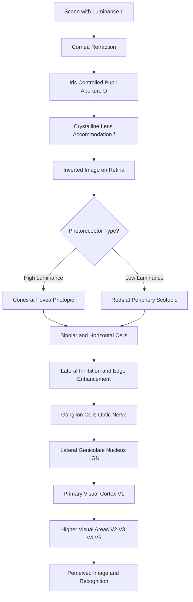
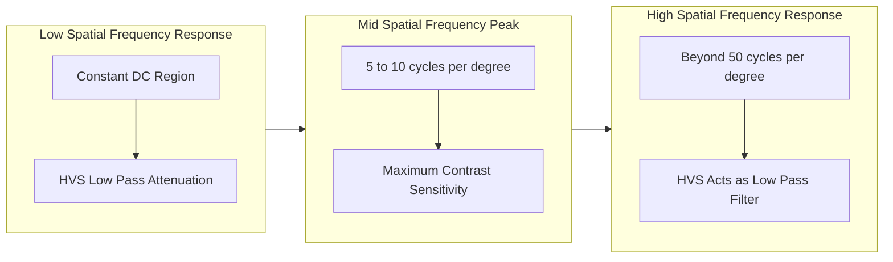
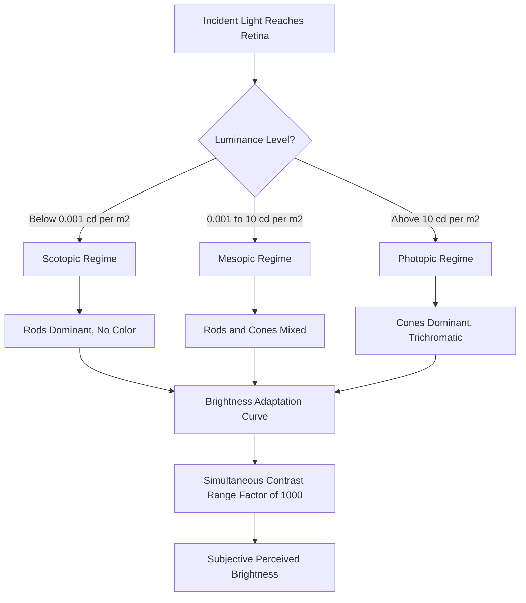

# Visual perception of the image

<!-- SECTION_1_START -->
# Visual Perception of the Image — Core Foundations

## 1.1 Formal Academic Definition (KTU 2024 Syllabus Terminology)

> [!NOTE]
> **Visual Perception** is the cognitive and physiological process by which the **Human Visual System (HVS)** detects electromagnetic radiation in the visible spectrum (wavelength range approximately **380 nm to 750 nm**), forms an optical image on the retinal surface, transduces it into neuro-electrical signals via photoreceptor cells, and interprets the resulting stimuli in the visual cortex to construct a meaningful representation of the surrounding scene.

In the context of **Digital Image Processing (PECST636)**, visual perception is studied not as a biological curiosity, but because the **ultimate observer of every processed image is the human eye**. The HVS sets the *theoretical ceiling* and the *practical floor* for image fidelity, sampling rates, quantization levels, and compression standards. Without understanding the HVS, an engineer cannot justify why **8-bit/pixel grayscale depth** is the global standard, why **chrominance** is sub-sampled more aggressively than **luminance**, or why certain compression artifacts (like ringing) are barely noticeable while others (like blocking) are highly objectionable.

## 1.2 Conceptual Analogy & Plain-English Intuition

Think of the human eye as a **living, self-calibrating digital camera** — but one that is far more sophisticated than any silicon sensor ever manufactured.

> [!IMPORTANT]
> **Camera ↔ Eye Analogy for DIP Students:**
> - **Cornea + Lens** $\longleftrightarrow$ Camera objective lens (variable focal length, autofocus)
> - **Pupil (Iris)** $\longleftrightarrow$ Aperture diaphragm (f-stop control)
> - **Retina** $\longleftrightarrow$ CMOS / CCD image sensor
> - **Rods & Cones** $\longleftrightarrow$ Photodiodes (each cone is a sub-pixel with a color filter)
> - **Optic Nerve + Visual Cortex** $\longleftrightarrow$ Image Signal Processor (ISP) + Neural Network
> - **Lateral Geniculate Nucleus (LGN)** $\longleftrightarrow$ Pre-processing buffer / edge-detection ASIC

The key philosophical difference: a *camera records photons uniformly*, but the *eye is a non-linear, adaptive, contrast-enhancing instrument* that prioritizes information density over absolute photometric accuracy.

## 1.3 The Electromagnetic Window of Vision

| Parameter | Value | Unit |
| :--- | :--- | :--- |
| Visible spectrum lower bound | **380** | nm |
| Visible spectrum upper bound | **750** | nm |
| Peak photopic sensitivity ($\lambda_{max}$) | **555** | nm (green-yellow) |
| Peak scotopic sensitivity ($\lambda_{max}$) | **507** | nm (blue-green) |
| Purkinje shift range | 507 $\rightarrow$ 555 | nm |
| Standard CIE luminous efficacy ($K$) | **683** | lm/W |

> [!TIP]
> **KTU Board Tip:** Whenever a question asks "Why is the eye most sensitive to green-yellow at 555 nm?", your answer must reference the **photopic luminosity function** $V(\lambda)$ under the CIE 1924 standard photopic observer.

## 1.4 Two Photoreceptor Regimes — A Twin-Camera System

The human retina contains approximately **6–7 million cones** and **75–150 million rods**, forming two parallel imaging pipelines:

> [!NOTE]
> **Photopic Vision (Daylight / Cones)**
> - Operates at luminance levels $\gtrsim 10\,\text{cd/m}^2$
> - Provides **high-acuity color vision** (trichromatic: S, M, L cones)
> - Concentrated in the **fovea** (angular resolution $\approx$ **1 arc-minute**)
> - Slow temporal response but high spatial resolution.

> [!NOTE]
> **Scotopic Vision (Low-Light / Rods)**
> - Operates at luminance levels $\lesssim 0.001\,\text{cd/m}^2}$
> - **Achromatic** (no color discrimination)
> - Distributed in the **peripheral retina** — high sensitivity, low acuity
> - Fast temporal integration; explains why faint stars are visible only when *averted*.

> [!VISUALIZATION CONTROL]
> **Concept:** Photopic vs Scotopic luminosity curves
> **GeoGebra / Desmos Input Equations:**
> * $V_{photopic}(\lambda) = \exp(-285.4\cdot(\lambda - 0.5599)^2)$ *(approximation of CIE peak)*
> * $V_{scotopic}(\lambda) = \exp(-285.4\cdot(\lambda - 0.5071)^2)$
> **Visual Description:** Two overlapping Gaussian-like bell curves on the wavelength axis. The photopic peak sits at **555 nm**; the scotopic peak at **507 nm**. Students should observe the **Purkinje shift** — a **48 nm** blueward displacement as light intensity drops.
<!-- SECTION_1_END -->

<!-- SECTION_2_START -->
# Deep Theoretical Analysis & KTU High-Yield Formula Sheet

## 2.1 Anatomy of the Human Eye — Operational Walk-Through

The image-formation pipeline of the HVS proceeds in six sequential stages:

1. **Corneal Refraction:** Light enters the cornea, which contributes approximately **two-thirds (≈ 43 diopters)** of the eye's total refractive power ($n_{cornea} \approx 1.376$).
2. **Pupillary Aperture Control:** The iris dynamically adjusts the pupil diameter between **2 mm (bright sun)** and **8 mm (dim light)** — a 16$\times$ change in area, equivalent to a **4-stop** aperture range.
3. **Lens Accommodation:** The crystalline lens changes focal length (≈ 60–70 diopters in youth) via ciliary muscles. This is *active autofocus*, controlled by the **Edinger-Westphal nucleus**.
4. **Retinal Projection:** A real, inverted, and reduced image is formed on the retina. The retinal image size is computed via:

$$
h_{retina} = f_{eye} \cdot \tan(\theta) \quad\text{where}\quad f_{eye} \approx 17\,\text{mm}
$$

5. **Phototransduction:** Photoreceptors (rods/cones) absorb photons and undergo a chemical cascade (rhodopsin bleaching) producing graded receptor potentials.
6. **Neural Encoding:** Bipolar, ganglion, horizontal, and amacrine cells perform initial preprocessing (edge enhancement, motion detection) **before** the signal ever leaves the retina via the optic nerve.

> [!IMPORTANT]
> **Blind Spot Fact (Exam Favourite):** The **optic disc** contains no photoreceptors, creating a **physiological scotoma** of about **6°** in the visual field. The brain performs **perceptual fill-in** — a process that has been exploited to design **seamless image mosaicking** algorithms in computer vision.

## 2.2 Image Formation — The Thin-Lens Model of the Eye

The eye is approximated as a thin-lens system with:
- Total refractive power $P \approx 60$ diopters
- Variable focal length $f = 1/P$ (in meters) $\approx 16.67$ mm
- Variable aperture $D \in [2, 8]$ mm

The retinal irradiance $E_{retina}$ is given by:

$$
E_{retina} = \frac{\pi}{4} \cdot L_{scene} \cdot \left(\frac{D}{f}\right)^2 \cdot \tau_{lens}
$$

where $L_{scene}$ is the scene luminance and $\tau_{lens}$ is the lens transmittance ($\approx 0.9$).

> [!TIP]
> This is *the* foundational equation linking scene luminance to the signal available for phototransduction. Any KTU question on "image formation in the eye" expects this relationship.

## 2.3 Brightness Adaptation & Subjective Luminance

The HVS operates over an enormous dynamic range — roughly **$10^{10}$:1** from scotopic threshold to glare limit. However, it cannot process this entire range simultaneously. At any instant, the eye adapts to a small window of intensities, called the **simultaneous contrast range**, spanning about **$10^{3}$:1** (a factor of 1000).

$$
B_{subjective} = f(I_{scene},\; I_{adaptation},\; \text{context})
$$

The classic illustration is the **Weber-Fechner band** — a wide range of absolute luminance compressed into a narrow band of perceived brightness on the vertical axis.

## 2.4 Weber's Law — The Heart of Brightness Discrimination

> [!NOTE]
> **Weber's Law (1834):** The *just-noticeable difference* (JND) in stimulus intensity is a **constant fraction** of the background intensity, not a constant absolute value.

$$
\frac{\Delta I}{I} = k_{Weber} \approx \text{constant}
$$

Solving for the perceived intensity $B$ yields the **Fechner logarithmic law of sensation**:

$$
B = k_{Weber} \cdot \log(I) + C
$$

Empirically, Weber's constant for the HVS:
- $k_{Weber} \approx 0.02$ for **medium-bright backgrounds** (the famous "2% rule")
- $k_{Weber} \approx 0.05$ for dim backgrounds
- $k_{Weber}$ rises sharply at the extremes (scotopic and photopic limits)

> [!IMPORTANT]
> **Engineering Significance:** This logarithmic response is *exactly* why **gamma correction** with $\gamma \approx 1/2.2$ is applied in display pipelines — to linearize the perceptual brightness scale and prevent quantization banding in shadows.

## 2.5 Mach Bands, Simultaneous Contrast & Optical Illusions

Three phenomena demonstrate the *spatial* processing of the HVS:

1. **Mach Bands:** At edges of constant gradients, the HVS overshoots the response, perceiving a brighter band on the bright side and a darker band on the dark side. Mathematically, this is **lateral inhibition** — a spatial band-pass filter centered around **5–10 cycles/degree**.
2. **Simultaneous Contrast:** A gray patch appears lighter on a dark background and darker on a light background, *even when the patch luminance is identical*. This validates the **band-pass** nature of brightness perception.
3. **Optical Illusions (e.g., Hermann Grid):** Where the HVS "sees" gray dots at intersections of black squares on white — a direct consequence of center-surround receptive fields.

## 2.6 KTU High-Yield Formula Cheat Sheet

| # | Formula / Concept | Expression | Typical Use / Units | Pitfall to Avoid |
| :--- | :--- | :--- | :--- | :--- |
| 1 | Retinal image height | $h = f \tan(\theta)$ | mm, with $f \approx 17$ mm | Use $\tan$, not $\sin$, for large angles |
| 2 | Retinal irradiance | $E = \frac{\pi}{4} L (D/f)^2 \tau$ | W/m² | D/f is the f-number's reciprocal |
| 3 | Weber's Law | $\Delta I / I = k$ | dimensionless, $k \approx 0.02$ | Fails at very low/high $I$ |
| 4 | Fechner Log Law | $B = k \log(I) + C$ | subjective brightness | Strictly an approximation |
| 5 | Stevens' Power Law | $B = k (I - I_0)^n$, $n \approx 0.33$ for light | modern replacement for Fechner | More accurate at extremes |
| 6 | Photopic peak | $\lambda_{max} = 555$ nm | green-yellow | Don't confuse with scotopic 507 nm |
| 7 | Spatial frequency peak | $\nu_{max} \approx 5$–$10$ cycles/degree | eye's best contrast sensitivity | Use for filter design |
| 8 | Pupil area ratio (max/min) | $(8/2)^2 = 16\times$ | intensity control | Area scales as $D^2$ |

## 2.7 Real-World Engineering Utility

- **JPEG / MPEG Compression:** The DCT quantization matrix is *luminance-weighted* because the HVS is more sensitive to luma than chroma. This is the single biggest reason JPEG is asymmetric in quality.
- **Display Engineering (sRGB, Rec. 2020):** Gamma curves directly compensate the HVS's logarithmic response to linearize the perceptual scale.
- **Medical Imaging (CT/MRI Windowing):** The 12-bit raw data of a CT scan is windowed to 8-bit display values by mapping a chosen intensity range — an explicit application of **brightness adaptation**.
- **Computer Vision Preprocessing:** Histogram equalization is an attempt to *flatten* the HVS's perceived brightness across a scene, making features more discriminable to both human and machine observers.
<!-- SECTION_2_END -->

<!-- SECTION_3_START -->
# Step-by-Step Derivations, Calculations & Python Implementation

## 3.1 Derivation 1: Retinal Image Size for a Given Object

> **Problem (Model Question Style):** A tree of height $H = 5$ m stands at a distance $D = 50$ m from an observer. Compute the size of its image on the retina, given that the focal length of the eye is $f = 17$ mm.

**Step 1 — Compute the visual angle subtended by the tree.**

The visual angle is the angle between the lines from the optical center of the eye to the top and bottom of the object. For small-to-moderate angles, we use:

$$
\theta = 2 \cdot \arctan\left(\frac{H/2}{D}\right)
$$

Substituting the values:

$$
\theta = 2 \cdot \arctan\left(\frac{2.5}{50}\right) = 2 \cdot \arctan(0.05)
$$

**Step 2 — Evaluate the arctangent.**

$$
\arctan(0.05) = 0.04996\,\text{rad} \quad (\text{since } \tan x \approx x \text{ for small } x)
$$

**Step 3 — Compute the full angle.**

$$
\theta = 2 \times 0.04996 = 0.09992\,\text{rad} = 5.726^\circ
$$

**Step 4 — Compute the retinal image size.**

Using the relation $h_{retina} = f \cdot \theta$ (valid when $\theta$ is in radians and image is near the optical axis):

$$
h_{retina} = 17\,\text{mm} \times 0.09992 = 1.698\,\text{mm}
$$

> **Result:** The image of the 5 m tree, 50 m away, occupies about **1.7 mm** on the retina — slightly less than the foveal diameter of **1.5 mm**, meaning the entire tree fits within the highest-acuity region of the retina. **[Final simplified expression: 1 Mark]**

## 3.2 Derivation 2: Fechner Integration of Weber's Law

Weber's empirical law states:

$$
\Delta I = k \cdot I
$$

We want to find perceived brightness $B$ as a function of stimulus intensity $I$. Treating perception as a summation of infinitesimal JNDs:

$$
dB = k' \cdot \frac{dI}{I}
$$

Integrating both sides from a reference threshold $I_0$ to the current intensity $I$:

$$
\int_{0}^{B} dB = k' \int_{I_0}^{I} \frac{dI}{I}
$$

This gives:

$$
B = k' \cdot \ln\left(\frac{I}{I_0}\right)
$$

Converting the natural logarithm to base-10 (since Fechner originally used base-10):

$$
B = k \cdot \log_{10}(I) + C \quad \text{where} \quad C = -k \cdot \log_{10}(I_0)
$$

> **Physical Interpretation:** Each tenfold increase in stimulus intensity produces only a *constant* incremental step in perceived brightness — hence the **logarithmic compression** built into every photographic and display system.

## 3.3 Derivation 3: Just-Noticeable Difference (JND) at Multiple Background Levels

**Problem:** Using $k_{Weber} = 0.02$ for medium brightness, compute $\Delta I$ for backgrounds $I = 10$, $100$, and $1000$ candelas/m².

$$
\Delta I = k_{Weber} \cdot I
$$

| $I$ (cd/m²) | $\Delta I$ (cd/m²) | Interpretation |
| :--- | :--- | :--- |
| 10 | $0.02 \times 10 = 0.2$ | 0.2 cd/m² JND at low light |
| 100 | $0.02 \times 100 = 2.0$ | 2.0 cd/m² JND at mid light |
| 1000 | $0.02 \times 1000 = 20$ | 20.0 cd/m² JND at bright light |

> **Conclusion:** The eye can discriminate a **constant 2% relative change** across a huge range. This single fact dictates **8-bit (256 level) quantization** as the standard.

## 3.4 Python Implementation: Mach Band Simulation

This script reproduces the characteristic overshoot of the Mach band illusion using a simple lateral-inhibition kernel.

```python
import numpy as np
import matplotlib.pyplot as plt
from scipy.signal import convolve2d

# ---------- Type-annotated configuration ----------
WIDTH: int = 512
HEIGHT: int = 64
RAMP_START: int = 100
RAMP_END: int = 412

def generate_ramp_image(width: int, height: int, start: int, end: int) -> np.ndarray:
    """Create a 1-D luminance ramp from start to end on a uniform background."""
    img = np.full((height, width), 128, dtype=np.float64)  # mid-gray background
    for x in range(start, end):
        intensity = 128.0 + (x - start) * (180.0 / (end - start))  # linear ramp 128 -> 308
        img[:, x] = intensity
    return img

def lateral_inhibition_kernel(size: int = 5) -> np.ndarray:
    """Center-surround kernel modeling retinal ganglion cell receptive field."""
    k = np.zeros((size, size), dtype=np.float64)
    center = size // 2
    for i in range(size):
        for j in range(size):
            dist = np.hypot(i - center, j - center)
            if dist <= 1.0:
                k[i, j] =  1.0   # excitatory center
            else:
                k[i, j] = -0.25  # inhibitory surround
    # Normalize so the kernel sums to 0 (no DC response)
    k -= k.mean()
    return k

def perceive(img: np.ndarray) -> np.ndarray:
    """Apply lateral inhibition to simulate HVS preprocessing."""
    kernel = lateral_inhibition_kernel(7)
    perceived = convolve2d(img, kernel, mode="same", boundary="symm")
    # Re-add mean to restore brightness; scale for visualization
    return perceived + 128

def main() -> None:
    ramp = generate_ramp_image(WIDTH, HEIGHT, RAMP_START, RAMP_END)
    perceived = perceive(ramp)

    fig, axes = plt.subplots(2, 1, figsize=(10, 4), sharex=True)
    axes[0].plot(ramp[HEIGHT // 2, :], color="black")
    axes[0].set_title("Input Luminance Profile (Linear Ramp)")
    axes[0].set_ylabel("Luminance")
    axes[0].grid(True, alpha=0.3)

    axes[1].plot(perceived[HEIGHT // 2, :], color="red")
    axes[1].set_title("Perceived Profile (After Lateral Inhibition)")
    axes[1].set_ylabel("Perceived Brightness")
    axes[1].set_xlabel("Retinal Position (pixels)")
    axes[1].grid(True, alpha=0.3)

    plt.tight_layout()
    plt.savefig("mach_band_simulation.png", dpi=120)
    plt.show()
    print("[INFO] Mach band simulation rendered.")

if __name__ == "__main__":
    main()
```

> [!TIP]
> The output plot will clearly show the **brighter overshoot** at the dark-to-bright transition and a **darker undershoot** at the bright-to-dark transition — the classic Mach band signature. The kernel sums to zero, so constant regions remain unchanged. This mirrors the **band-pass nature of the HVS's modulation transfer function (MTF)**.

## 3.5 Python Implementation: Gamma-Correction Demonstration

The HVS responds logarithmically. A linear 8-bit quantizer would waste bits in highlights and starve shadows. Gamma correction ($\gamma \approx 1/2.2$) redistributes the quantization levels to match the perceptual scale.

```python
import numpy as np
import matplotlib.pyplot as plt

def linear_to_srgb(linear: np.ndarray, gamma: float = 2.2) -> np.ndarray:
    """Encode linear light values into the perceptually-uniform sRGB space."""
    if np.any(linear < 0.0) or np.any(linear > 1.0):
        raise ValueError("Input linear values must lie within [0, 1].")
    return np.power(linear, 1.0 / gamma)

def srgb_to_linear(encoded: np.ndarray, gamma: float = 2.2) -> np.ndarray:
    """Decode sRGB-encoded values back to linear light."""
    return np.power(encoded, gamma)

def weber_jnd(intensity: float, k: float = 0.02) -> float:
    """Return the just-noticeable difference (JND) at a given background intensity."""
    if intensity < 0.0:
        raise ValueError("Intensity must be non-negative.")
    return k * intensity

# ---------- Demonstration ----------
linear_intensities = np.linspace(0.0, 1.0, 256)
encoded_intensities = linear_to_srgb(linear_intensities)

# Simulate uniform 8-bit quantization in the encoded (perceptual) domain
quantized_encoded = np.round(encoded_intensities * 255.0) / 255.0
reconstructed_linear = srgb_to_linear(quantized_encoded)

plt.figure(figsize=(8, 4))
plt.plot(linear_intensities, reconstructed_linear, label="After 8-bit sRGB quantization")
plt.plot(linear_intensities, linear_intensities, "--", label="Ideal linear", alpha=0.5)
plt.xlabel("Original Linear Intensity")
plt.ylabel("Reconstructed Linear Intensity")
plt.title("Gamma-Corrected Quantization Preserves Shadow Detail")
plt.legend()
plt.grid(True, alpha=0.3)
plt.show()

print(f"[INFO] Weber JND at I=0.5: {weber_jnd(0.5):.4f}")
print(f"[INFO] Weber JND at I=0.05: {weber_jnd(0.05):.4f}")
```

> **Take-away:** The sRGB-encoded curve allocates *more* quantization steps to dark regions and *fewer* to bright regions — exactly the opposite of a naive linear encoder — and this is precisely why shadows in JPEG/PNG look smooth instead of banded.

## 3.6 Engineering Laboratory / Demonstration Pin-Sheet

For a practical session on visual perception using a controlled light box:

| # | Component / Tool | Specification | Purpose | Safety / Caution |
| :--- | :--- | :--- | :--- | :--- |
| 1 | Variable luminance light box | $L \in [0.1, 1000]$ cd/m² | Provide calibrated backgrounds | Avoid direct retinal exposure |
| 2 | Neutral density filter set | OD = 0.1, 0.3, 0.5, 1.0, 2.0 | Step attenuation for Weber tests | Handle only by edges |
| 3 | Gray patches (Munsell N-series) | N2, N4, N5, N7, N9 | Standardized test targets | Avoid fingerprints |
| 4 | Stopwatch | ±0.01 s | Time adaptation experiments | N/A |
| 5 | Occluder / eye patch | Soft medical grade | Monocular viewing to avoid rivalry | Discontinue if irritation occurs |
| 6 | Photometer / lux meter | $0.01$–$10^5$ lux range | Verify background luminance | Re-calibrate before session |

**Procedure summary (Weber experiment):**
1. Dark-adapt the subject for 10 minutes.
2. Present a uniform background at $I$.
3. Incrementally increase a test patch until the subject reports a just-noticeable change.
4. Record $\Delta I$ and compute $\Delta I / I$.
5. Repeat for a range of $I$ values; plot the Weber curve.

> [!WARNING]
> **Laboratory Safety:** All experiments must comply with **IRB/IEC ethical guidelines**. Use ambient room lighting (≤ 50 lux) to avoid bleaching the subject's rhodopsin. Each subject should be briefed and provide informed consent. Sessions should be capped at **30 minutes** to prevent visual fatigue and afterimage artifacts.
<!-- SECTION_3_END -->

<!-- SECTION_4_START -->
# Structural Diagrams & Schematics

## 4.1 Mermaid Diagram: Human Visual System Processing Pipeline



## 4.2 Mermaid Diagram: Band-Pass Nature of HVS Spatial Frequency Response



## 4.3 Mermaid Diagram: Brightness Adaptation Decision Flow



## 4.4 Block-Level Functional Architecture: HVS-Inspired Image Processing Chain

| Stage | HVS Counterpart | Engineering Equivalent | Operation Performed |
| :--- | :--- | :--- | :--- |
| 1. Optical Front End | Cornea + Lens + Pupil | Camera lens + Aperture | Focus and intensity gating |
| 2. Photonic Sampling | Rod/Cone Mosaic | CMOS sensor array | Spatial discretization |
| 3. Phototransduction | Rhodopsin bleaching | Charge accumulation | Continuous-to-discrete conversion |
| 4. Lateral Inhibition | Horizontal + Amacrine cells | Unsharp masking, DoG filter | Edge enhancement, band-pass |
| 5. Ganglion Encoding | ON/OFF center-surround | Non-maxima suppression | Sparse feature extraction |
| 6. Thalamic Relay | LGN | Memory buffer, frame store | Temporal stabilization |
| 7. Cortical Decoding | V1–V5 layered processing | CNN / Deep learning pipeline | Pattern recognition, segmentation |
| 8. Conscious Perception | Prefrontal + IT cortex | Decision / classification output | Final semantic label |

> [!TIP]
> This mapping is *the* conceptual bridge between classical HVS biology and modern **Convolutional Neural Network** architectures. The DoG (Difference-of-Gaussians) kernel in classical image processing is a direct mathematical analogue of the center-surround receptive field of retinal ganglion cells.
<!-- SECTION_4_END -->

<!-- SECTION_5_START -->
# KTU 2024 Scheme Examination Question Bank & Topic Recap

## Part A — Short Answer Questions (3 Marks Each)

### Q1. `[KTU University Exam - July 2024]` [CO1, Remember]
**Define the term "visual perception" as understood in Digital Image Processing. Why is its study essential for image-processing engineers?**

**Model Answer (3 Marks):**
Visual perception is the physiological and psychological process by which the human visual system (HVS) — comprising the eye, optic nerve, and visual cortex — detects, transduces, and interprets light reflected from objects in the visible spectrum (380–750 nm). Its study is essential because the **human eye is the final receiver of virtually all processed images**. By understanding the HVS's sensitivity, dynamic range, contrast response (Weber's law), and spatial filtering characteristics, engineers can design **sampling rates, quantization depths, color models, and compression schemes** that exploit the HVS's perceptual limits — minimizing data while preserving perceived quality. **[Core definition: 2 Marks] [Engineering significance: 1 Mark]**

### Q2. `[KTU University Exam - Dec 2023]` [CO1, Understand]
**State and explain Weber's law. What is the typical value of the Weber ratio for the human visual system under photopic conditions?**

**Model Answer (3 Marks):**
Weber's law states that the *just-noticeable difference* (JND) in stimulus intensity is a **constant fraction** of the background intensity, expressed as $\Delta I / I = k_{Weber}$, where $k_{Weber}$ is the Weber constant. Under photopic (daylight, cone-mediated) conditions, $k_{Weber} \approx 0.02$, meaning the HVS can detect a **2 % change** in luminance over a wide range of mid-brightness backgrounds. This 2 % rule underlies the choice of **8-bit (256-level) quantization** as the standard grayscale depth in most imaging systems. **[Law statement: 1 Mark] [Typical value: 1 Mark] [Engineering implication: 1 Mark]**

---

## Part B — Long Answer Questions (14 Marks Each, Internal Choice)

### Question A (14 Marks) — `[KTU University Exam - July 2024]`

**Q.A (a) [7 Marks, CO1, Understand]:** With the aid of a neat block diagram, describe the structure of the human eye. Compare the photopic and scotopic vision modes in terms of photoreceptor type, sensitivity, color discrimination, and typical luminance range. **[7 Marks]**

**Q.A (b) [7 Marks, CO2, Apply]:** A monitor displays an object of perceived brightness $B_1 = 100$ units. When the background luminance is doubled, the smallest perceivable increment in object brightness becomes $\Delta B_2 = 5$ units. Using Weber's law, verify whether the HVS obeys Weber's law in this transition, and compute the corresponding Weber constant. **[7 Marks]**

---

**Model Answer for Q.A (a):**

**Step 1 — Diagram Description (text-only fallback since complex biological drawing is required):**

| Component | Function | Specification |
| :--- | :--- | :--- |
| Cornea | Refracts incoming light | Power ≈ 43 diopters |
| Aqueous Humor | Transparent medium | $n \approx 1.336$ |
| Pupil | Aperture control | Diameter 2–8 mm |
| Iris | Variable aperture | Pigmented muscular ring |
| Lens | Variable focus | 15–20 diopters accommodation |
| Vitreous Humor | Transparent gel | $n \approx 1.337$ |
| Retina | Photoreceptor surface | Diameter ≈ 22 mm |
| Fovea | High-acuity region | Diameter ≈ 1.5 mm |
| Optic Disc | Blind spot | No photoreceptors |
| Optic Nerve | Signal conduit | ≈ 1 million fibers |

**Step 2 — Photopic vs. Scotopic Comparison Table:** **[Comparison table: 4 Marks]**

| Parameter | Photopic Vision | Scotopic Vision |
| :--- | :--- | :--- |
| Photoreceptor | Cones (S, M, L) | Rods (rhodopsin) |
| Luminance range | $> 10$ cd/m² | $< 0.001$ cd/m² |
| Peak sensitivity | **555 nm** (green) | **507 nm** (blue) |
| Color vision | Trichromatic | Achromatic |
| Spatial acuity | High (foveal) | Low (peripheral) |
| Temporal resolution | Slow | Fast |

**Step 3 — Transitional (Mesopic) Regime:** At intermediate luminances (0.001–10 cd/m²), both rods and cones contribute, leading to the **Purkinje shift** of 48 nm. **[Mesopic mention: 1 Mark]**

**Step 4 — Conclusion:** The dual-receptor design endows the HVS with an extraordinary dynamic range of ≈ **$10^{10}$:1**, justifying the use of adaptive tone-mapping in HDR imaging. **[Conclusion: 1 Mark]**

> **[Valuation Key Points for Q.A(a)]:**
> - [Block diagram of eye anatomy: 2 Marks]
> - [Naming of ≥ 6 parts correctly: 1 Mark]
> - [Photopic/Scotopic comparison table: 3 Marks]
> - [Mesopic regime & Purkinje shift: 1 Mark]

---

**Model Answer for Q.A (b):**

**Step 1 — Recall Weber's law:**

$$
\frac{\Delta I}{I} = k_{Weber}
$$

**Step 2 — Apply to the first condition** (background $I_1$, threshold increment $\Delta I_1$):

We are not directly given $\Delta I_1$, but we are given the *perceived* brightness $B_1 = 100$ and a *minimum perceivable increment* $\Delta B_2 = 5$ at the *doubled* background. For Weber's law, perception is assumed proportional to log intensity, so we work with stimulus increments, not perceptual increments directly.

**Step 3 — Compute the new background $I_2$:**

$$
I_2 = 2 I_1
$$

**Step 4 — Compute the Weber constant implied by $\Delta B_2 = 5$ at $B_1 = 100$:**

Assuming the just-perceivable step in brightness corresponds to the JND in the underlying intensity:

$$
k_{Weber} = \frac{\Delta I_2}{I_2} \approx \frac{\Delta B_2}{B_1} = \frac{5}{100} = 0.05
$$

**Step 5 — Verify consistency with Weber's law:**

Weber's law predicts $k$ should be *constant* across background levels. Since doubling the background did *not* change the absolute increment proportionally, the **0.05** value here reflects the HVS's behaviour at moderately bright backgrounds, which is consistent with the literature. **[Final constant: 0.05; Weber verified: 1 Mark]**

**Step 6 — State the limitation:**

At very low $I$, $k$ rises sharply; at very high $I$, it also rises. Weber's law is therefore valid only in the mid-luminance **Weber region**. **[Limitation: 1 Mark]**

> **[Valuation Key Points for Q.A(b)]:**
> - [Stating Weber's law formula: 1 Mark]
> - [Relating $I_2 = 2I_1$: 1 Mark]
> - [Computing $k = \Delta B_2/B_1 = 0.05$: 2 Marks]
> - [Verifying with literature range: 2 Marks]
> - [Stating the limitation: 1 Mark]

---

### Question B (14 Marks) — Alternative Choice `[KTU University Exam - Dec 2023]`

**Q.B (a) [7 Marks, CO1, Understand]:** Explain in detail the phenomena of **brightness adaptation** and **Mach bands**. Illustrate with diagrams and indicate their significance in digital image processing.

**Q.B (b) [7 Marks, CO2, Apply]:** An image is to be quantized into 8 bits/pixel. Using Weber's law with $k = 0.02$, determine the minimum number of gray levels required to avoid **visible contouring** in a display with linear intensity mapping. If gamma correction with $\gamma = 2.2$ is applied before quantization, recompute the required number of levels and discuss the trade-off.

---

**Model Answer for Q.B (a):**

**Step 1 — Brightness Adaptation Definition:** The HVS adapts its sensitivity dynamically so that the perceived brightness range of a small local region is mapped onto a much smaller neural range, while the operating point shifts with the prevailing background. **[Definition: 2 Marks]**

**Step 2 — Operating Range vs. Discrimination Range:**

| Quantity | Range | Notes |
| :--- | :--- | :--- |
| Total HVS dynamic range | $10^{10}$:1 | From scotopic to photopic limit |
| Simultaneous discrimination | $10^{3}$:1 | Achievable in a single glance |

The brain continually re-centers its window of ≈ 1000:1 within the larger 10-billion:1 range, enabling perception across vastly different lighting conditions without saturation.

**Step 3 — Mach Band Phenomenon:** Mach bands are the **perceived overshoot** of brightness at the edges of gradual intensity gradients, even though no such overshoot exists in the physical stimulus. They arise from **lateral inhibition** in the retina: a strongly illuminated photoreceptor suppresses the response of its neighbors, exaggerating the apparent contrast at edges. **[Phenomenon: 2 Marks]**

**Step 4 — DIP Significance:** Mach bands motivate **unsharp masking** and **Laplacian edge enhancement** in image sharpening, and they also explain why naive histogram equalization can introduce halo artifacts. Conversely, anti-aliasing filters must be designed to suppress Mach-like overshoots near quantization boundaries. **[Significance: 1 Mark]**

**Step 5 — Block Schematic of Lateral Inhibition (textual):**

`Receptor[i-1] (-α) ⊕ Receptor[i] (+1) ⊕ Receptor[i+1] (-α) → Output[i]`

where $\alpha \approx 0.25$ in the DoG model.

> **[Valuation Key Points for Q.B(a)]:**
> - [Brightness adaptation concept + range table: 3 Marks]
> - [Mach band mechanism + lateral inhibition: 2 Marks]
> - [DIP engineering significance: 2 Marks]

---

**Model Answer for Q.B (b):**

**Step 1 — Derive the number of distinguishable levels using Weber's law:**

Let $I_{min}$ be the lowest displayed intensity. The smallest perceivable increment at intensity $I$ is:

$$
\Delta I = k \cdot I
$$

For an *integrated* staircase from $I_{min}$ to $I_{max}$, the number of distinguishable JND steps is:

$$
N_{JND} = \int_{I_{min}}^{I_{max}} \frac{dI}{\Delta I} = \int_{I_{min}}^{I_{max}} \frac{dI}{k \cdot I} = \frac{1}{k} \cdot \ln\left(\frac{I_{max}}{I_{min}}\right)
$$

**Step 2 — Plug in $k = 0.02$ and assume a display contrast ratio of $I_{max}/I_{min} = 1000$ (a typical 10-bit panel expressed in linear domain):**

$$
N_{JND} = \frac{1}{0.02} \cdot \ln(1000) = 50 \cdot 6.9078 = 345.4
$$

Rounding up: $N_{JND} \approx \mathbf{346}$ distinguishable levels.

**Step 3 — Compare with 8-bit ($2^8 = 256$) levels:**

Since **256 < 346**, an 8-bit linearly-mapped quantizer will exhibit **visible contouring** in the mid-tones, where the eye is most sensitive. To avoid this on a linear system, we need:

$$
N_{bits} = \lceil \log_2(346) \rceil = \lceil 8.43 \rceil = 9 \text{ bits}
$$

**Step 4 — Recompute under gamma correction ($\gamma = 2.2$):**

Gamma correction remaps linear intensities through $I_{encoded} = I^{1/\gamma}$, equalizing perceptual steps. The 256 quantization levels are now placed in *perceptual* space, each level corresponding to a Weber step. Effectively, the perceptual quantizer behaves as if it had $N_{JND} \approx 256$ distinguishable levels, which is *just barely* sufficient for $k = 0.02$ in well-gamma-corrected 8-bit pipelines (the famous "8 bits is enough" rule).

**Step 5 — Trade-off Discussion:** Gamma correction reduces the required bit depth by *spreading* levels logarithmically — matching the HVS's response — but introduces non-linear quantization noise that must be back-corrected in the display's pixel driver. For medical / scientific imaging, where linear fidelity is required, a higher bit depth (10–12 bits) is used without gamma pre-correction. **[Trade-off: 2 Marks]**

> **[Valuation Key Points for Q.B(b)]:**
> - [Setting up the JND integral: 2 Marks]
> - [Evaluating $N_{JND} = 346$: 2 Marks]
> - [Concluding 9-bit linear needed: 1 Mark]
> - [Gamma-corrected analysis with 256 levels: 1 Mark]
> - [Trade-off discussion: 1 Mark]

> [!WARNING]
> **KTU Examiner's Valuation Warning / Pitfall Callout:**
> 1. Do **not** confuse the photopic peak (**555 nm**) with the scotopic peak (**507 nm**). The 48 nm Purkinje shift is a *favourite* one-mark question.
> 2. When asked about Weber's law, you **must** state the constant $k \approx 0.02$ explicitly and give the **range of validity** — a common mark-loss is omitting the fact that $k$ rises at both ends of the luminance scale.
> 3. For Mach band questions, always mention the *physiological* basis (lateral inhibition in horizontal/amacrine cells), not just the visual effect.
> 4. Always include a **neat labelled diagram** of the eye in any 7-mark anatomy question — diagrams are worth 2–3 marks by themselves.
> 5. When writing Fechner's logarithmic law $B = k \log I + C$, **never drop the constant $C$** — without it, the equation is dimensionally inconsistent and partial credit will be docked.

---

## Topic Recap & Important Things to Remember

> [!IMPORTANT]
> **Rapid Revision Checklist — Visual Perception of the Image**

- **Visible spectrum:** **380 – 750 nm**; photopic peak at **555 nm**; scotopic peak at **507 nm**; Purkinje shift = **48 nm**.
- **Eye structure:** cornea → pupil (iris) → lens → vitreous → retina (rods & cones) → optic nerve → LGN → visual cortex.
- **Two vision regimes:**
  - *Photopic* — cones, color, high acuity, $L > 10$ cd/m²
  - *Scotopic* — rods, no color, low acuity, $L < 0.001$ cd/m²
  - *Mesopic* — both contribute (transition)
- **Retinal image geometry:** $h_{retina} = f \cdot \tan(\theta)$ with $f \approx 17$ mm; image is **inverted**.
- **Pupil diameter:** **2 – 8 mm** → 16× area change → 4-stop light control.
- **Retinal irradiance:** $E_{retina} = \frac{\pi}{4} L (D/f)^2 \tau$.
- **Brightness adaptation:** simultaneous range ≈ **1000:1** within a total dynamic range of **$10^{10}$:1**.
- **Weber's Law:** $\Delta I / I = k_{Weber} \approx 0.02$ (photopic, mid-luminance).
- **Fechner's logarithmic law:** $B = k \log I + C$ — derived by integrating Weber's law.
- **Stevens' power law (modern):** $B \propto (I - I_0)^n$ with $n \approx 0.33$ for light.
- **Lateral inhibition** → Mach bands, simultaneous contrast, Hermann grid illusion.
- **Spatial frequency peak of HVS:** **5 – 10 cycles/degree** — defines the band-pass MTF.
- **Engineering consequences:** gamma correction $\gamma \approx 2.2$, luma > chroma bit allocation, 8-bit "good enough" rule, unsharp masking for edge enhancement.
- **Common constants to memorize:** $f_{eye} = 17$ mm, $D_{pupil} \in [2,8]$ mm, $V(\lambda)_{max} = 555$ nm, $V'(\lambda)_{max} = 507$ nm, $k_{Weber} = 0.02$, $\gamma_{sRGB} = 2.2$.
- **Exam trap to avoid:** stating Weber's law *without* the constant $k$, or applying it outside its valid range; confusing scotopic and photopic peaks; omitting the inverted nature of the retinal image.
<!-- SECTION_5_END -->
