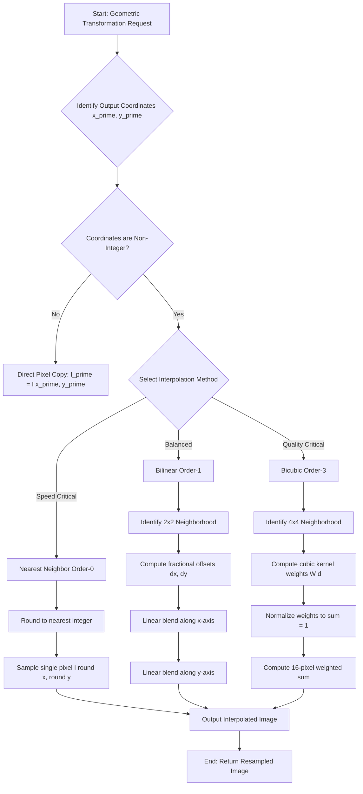
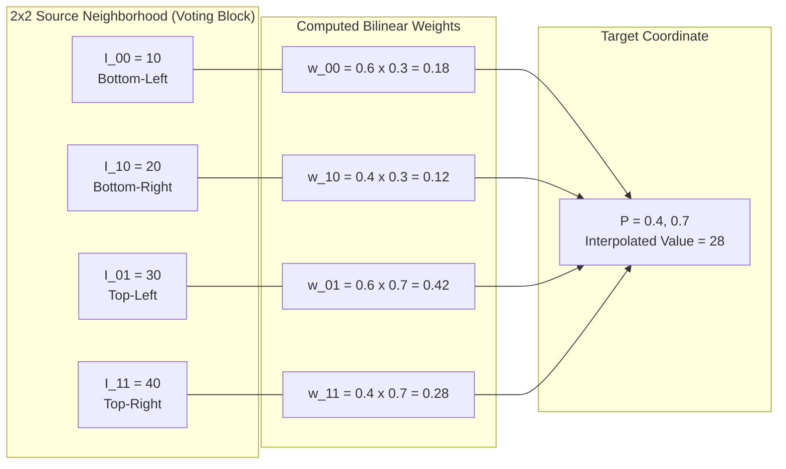
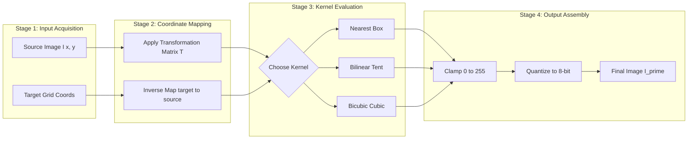

# Brightness interpolation.

<!-- SECTION_1_START -->

# Brightness Interpolation - KTU 2024 Scheme Study Notes

## 1. Core Technical Definition & Intuitive Overview

### 1.1 Formal Academic Definition

**Brightness Interpolation** (also called **Intensity Interpolation** or **Image Resampling**) is the foundational digital image processing technique used to estimate unknown pixel intensity values at *new, non-integer* spatial coordinates, based on the known discrete pixel intensities of the original image. It forms the computational backbone of all spatial-domain geometric transformations such as image resizing (zooming/shrinking), rotation, translation, shearing, affine warping, and perspective correction.

In the formal KTU 2024 syllabus framework (Module 2: Image Pre-processing), brightness interpolation is classified under the broader umbrella of **Spatial Domain Transformation Techniques** and is mathematically rooted in the principles of **2D signal reconstruction** and the **Sampling Theorem (Nyquist–Shannon Theorem)**.

> [!IMPORTANT]
> **Syllabus Highlight (PECST636 - Module 2):**
> Brightness interpolation is a *high-weightage* sub-topic under image enhancement and pre-processing. It is frequently tested in KTU End Semester Examinations (ESE) under the application and analysis cognitive levels. Mastery of the **Nearest Neighbor, Bilinear, and Bicubic** methods is mandatory.

### 1.2 Conceptual Analogy / Intuitive Understanding

Imagine you have a **chess board with each square painted a different shade of grey** (this is your digital image — a discrete grid of brightness values). Now, suppose you pick up the board, **rotate it by 23.7 degrees**, and try to redraw it on graph paper with finer squares. The rotated corners will now fall *between* the original squares. You cannot "look up" the color of these in-between points in the original board, because they did not exist as discrete squares.

**Brightness interpolation is the rulebook you create to decide the grey shade of these new in-between squares.** Each rule (Nearest Neighbor, Bilinear, Bicubic) is like a different *voting system* used by the surrounding original squares to decide the shade of the new square.

> [!NOTE]
> **Intuitive Summary:** Interpolation = "Educated Guessing" of missing pixel values using weighted votes from neighboring known pixels. The choice of voting method (kernel) defines the trade-off between **computational speed**, **image sharpness**, and **visual smoothness** (reduction of aliasing artifacts such as jagged edges and moiré patterns).

### 1.3 Key Physical & Mathematical Constants

- **Sampling Theorem Lower Bound (Nyquist Rate):** $f_s \geq 2 f_{max}$ — to avoid aliasing when reconstructing continuous signals from discrete pixels.
- **Standard Cubic Convolution Parameter (Keys' Constant):** $a = -0.5$ or $a = -0.75$ (the shape parameter of the bicubic kernel).
- **Bilinear Interpolation Computational Complexity:** $O(N)$ — linear in number of output pixels.
- **Bicubic Interpolation Computational Complexity:** $O(16N)$ — due to the 4×4 neighborhood evaluation.
- **Standard Image Bit-Depth Metric:** **8 bits/pixel** for grayscale, **24 bits/pixel** for RGB color.

> [!VISUALIZATION CONTROL]
> **Concept:** Pixel Grid Resampling — Nearest Neighbor vs. Bilinear Mapping
> **GeoGebra / Desmos Input Equations:**
> * Point A: `(0, 0)` — Original pixel center
> * Point B: `(1, 0)` — Original pixel center
> * Point C: `(0, 1)` — Original pixel center
> * Point D: `(1, 1)` — Original pixel center
> * Point P: `(0.4, 0.7)` — Target interpolated point
> * Line `f(x, y)`: Manhattan distance circles around P
> **Visual Description:** Observe how Point P (the *fractional target coordinate*) lies strictly *inside* the unit square formed by A, B, C, D. The four original pixels act as **"voting corners"** that contribute to P's interpolated brightness based on their proximity.

---

<!-- SECTION_1_END -->

<!-- SECTION_2_START -->

## 2. Deep Theoretical Analysis & KTU High-Yield Formula Sheet

### 2.1 The Mathematical Foundation: Why Do We Need Interpolation?

A digital image $I(x, y)$ is a **discrete 2D function** defined only at integer coordinates $(x, y) \in \mathbb{Z}^2$. However, when we apply a geometric transformation (say, zooming by a factor of 1.5 or rotating by $30^\circ$), the output pixel coordinates are generally **non-integer** values. To compute $I'(x', y')$ at these fractional locations, we must *infer* the intensity from the surrounding known integer-coordinate pixels.

This inference is performed using an **interpolation kernel** $w(\cdot)$, which acts as a weighted low-pass filter applied in the spatial domain.

### 2.2 The Three Mandatory KTU Interpolation Methods

#### **Method 1: Nearest Neighbor Interpolation (Order-0 / Box Filter)**

The simplest and fastest method. The output pixel simply *inherits* the brightness of the *closest* original pixel.

**Operational Logic Steps:**

1. For target coordinate $(x', y')$, compute the rounding: $x_r = \text{round}(x')$, $y_r = \text{round}(y')$.
2. Assign $I'(x', y') = I(x_r, y_r)$.
3. This is equivalent to convolution with a **rectangular (box) kernel** of unit area.

**Properties:** Fastest computation, preserves original pixel values exactly, but produces *jagged, blocky artifacts* (aliasing) on edges — visually akin to **Minecraft-style pixelation**.

#### **Method 2: Bilinear Interpolation (Order-1 / Tent Filter)**

A two-stage linear interpolation that uses the **4 nearest neighboring pixels** (a $2 \times 2$ neighborhood). It performs linear interpolation first along the $x$-axis, then along the $y$-axis (or vice versa).

**Operational Logic Steps:**

1. Identify the four integer-coordinate pixels surrounding $(x', y')$: bottom-left $I_{00}$, bottom-right $I_{10}$, top-left $I_{01}$, top-right $I_{11}$.
2. Compute fractional offsets: $\Delta x = x' - \lfloor x' \rfloor$ and $\Delta y = y' - \lfloor y' \rfloor$.
3. Interpolate along $x$-axis at $y=0$ and $y=1$ to obtain intermediate values $I_{x0}$ and $I_{x1}$.
4. Interpolate along $y$-axis between $I_{x0}$ and $I_{x1}$ to obtain the final value.

**Properties:** Produces smooth diagonal lines, but slightly *blurs* high-frequency edges. Computational cost is moderate.

#### **Method 3: Bicubic Interpolation (Order-3 / Cubic Convolution)**

A sophisticated method using a **$4 \times 4$ neighborhood (16 pixels)**. It uses a cubic polynomial kernel (typically Keys' cubic convolution function) to compute the weights.

**Operational Logic Steps:**

1. Identify the $4 \times 4$ pixel grid surrounding $(x', y')$.
2. Compute the cubic kernel weight $W(d)$ for each of the 16 pixels, where $d$ is the distance from the target point.
3. Compute the weighted sum: $I'(x', y') = \sum_{i=-1}^{2} \sum_{j=-1}^{2} I(x_i, y_j) \cdot W(\Delta x - i) \cdot W(\Delta y - j)$.
4. The kernel enforces $C^1$ continuity (continuous first derivative), yielding visually smooth gradients.

**Properties:** Produces the **highest visual quality** with sharp, artifact-free edges. Used in professional photo editing (Adobe Photoshop's "Bicubic Sharper" / "Bicubic Smoother" presets). The trade-off is **16× higher computational cost** than Nearest Neighbor.

### 2.3 KTU Formula Sheet / Cheat Sheet

> [!NOTE]
> **Exam Tip:** Memorize the Bilinear formula thoroughly — it is the most-tested interpolation equation in KTU ESE papers.

| **Parameter** | **Nearest Neighbor** | **Bilinear** | **Bicubic** |
|---|---|---|---|
| **Neighborhood Size** | $1 \times 1$ | $2 \times 2$ | $4 \times 4$ |
| **Order (Continuity)** | $C^0$ (discontinuous) | $C^0$ (continuous, non-smooth) | $C^1$ (smooth) |
| **Kernel Function** | $\delta(d)$ (Dirac delta) | $1 - \vert d \vert$ (triangular) | Keys' cubic: see below |
| **Computational Cost** | $\approx 1$ multiply | $\approx 4$ multiplies | $\approx 16$ multiplies |
| **Visual Quality** | Poor (blocky/aliased) | Good (slightly blurred) | Excellent (sharp + smooth) |
| **Edge Sharpness** | High (jagged) | Low (softened) | High (preserved) |
| **Aliasing Resistance** | Very Low | Moderate | High |
| **Typical Use Case** | Pixel art, masks, labels | Real-time video, medical imaging | Photography, satellite imagery |

#### Core Mathematical Equations

**Bilinear Interpolation Master Formula:**

$$I'(x', y') = (1 - \Delta x)(1 - \Delta y) \, I_{00} + \Delta x (1 - \Delta y) \, I_{10} + (1 - \Delta x) \Delta y \, I_{01} + \Delta x \Delta y \, I_{11}$$

**Bicubic Kernel (Keys' Cubic Convolution, $a = -0.5$):**

$$W(d) = \begin{cases} (a+2) \vert d \vert^3 - (a+3) \vert d \vert^2 + 1 & \text{if } \vert d \vert \leq 1 \\ a \vert d \vert^3 - 5a \vert d \vert^2 + 8a \vert d \vert - 4a & \text{if } 1 < \vert d \vert < 2 \\ 0 & \text{otherwise} \end{cases}$$

where $d$ is the normalized distance from the target point to the integer grid point.

### 2.4 Real-World Engineering Utility

Brightness interpolation is the **silent workhorse** behind nearly every digital imaging pipeline in production:

- **Medical Imaging (MRI/CT Reconstruction):** Bicubic interpolation reconstructs high-resolution slices from lower-resolution scanner data, enabling accurate diagnosis.
- **Satellite Remote Sensing (Google Earth, ISRO Bhuvan):** Pansharpening and multi-spectral band alignment rely on bicubic resampling.
- **Smartphone Cameras (Computational Photography):** Multi-frame super-resolution and digital zoom use bicubic (or AI-learned) interpolation kernels.
- **Video Streaming (Netflix, YouTube):** Real-time resolution upscaling from 720p source to 4K display uses Lanczos-3 or bicubic variants.
- **Computer Vision Pipelines (YOLO, ResNet):** Input images are resized to a fixed dimension (e.g., 224×224 or 640×640) using bilinear interpolation.
- **GPU Hardware:** Modern GPUs (NVIDIA, AMD) contain dedicated **Texture Units** with hardware-accelerated bilinear and bicubic samplers, used universally in 3D graphics rendering.

---

<!-- SECTION_2_END -->

<!-- SECTION_3_START -->

## 3. Step-by-Step Derivations & Code/Symbolic Implementation

### 3.1 Exhaustive Derivation: Bilinear Interpolation

**Problem Setup:** Given four known pixel intensities forming a unit square:
* $I_{00} = I(0, 0) = 10$
* $I_{10} = I(1, 0) = 20$
* $I_{01} = I(0, 1) = 30$
* $I_{11} = I(1, 1) = 40$

Find the interpolated value at target point $P = (0.4, 0.7)$.

**Step 1: Compute Fractional Offsets**

$$\Delta x = 0.4 - 0 = 0.4 \quad \text{and} \quad \Delta y = 0.7 - 0 = 0.7$$

**Step 2: Interpolate Along the $x$-axis at $y = 0$ (Bottom Edge)**

$$I_{x0} = I_{00} + \Delta x \cdot (I_{10} - I_{00}) = 10 + 0.4 \cdot (20 - 10)$$

$$I_{x0} = 10 + 0.4 \cdot 10 = 10 + 4 = 14$$

**Step 3: Interpolate Along the $x$-axis at $y = 1$ (Top Edge)**

$$I_{x1} = I_{01} + \Delta x \cdot (I_{11} - I_{01}) = 30 + 0.4 \cdot (40 - 30)$$

$$I_{x1} = 30 + 0.4 \cdot 10 = 30 + 4 = 34$$

**Step 4: Interpolate Along the $y$-axis (Final Vertical Blend)**

$$I'(0.4, 0.7) = I_{x0} + \Delta y \cdot (I_{x1} - I_{x0}) = 14 + 0.7 \cdot (34 - 14)$$

$$I'(0.4, 0.7) = 14 + 0.7 \cdot 20 = 14 + 14 = 28$$

**Verification Using the Compact Master Formula:**

$$I'(x', y') = (1 - 0.4)(1 - 0.7) \cdot 10 + (0.4)(1 - 0.7) \cdot 20 + (1 - 0.4)(0.7) \cdot 30 + (0.4)(0.7) \cdot 40$$

$$= (0.6)(0.3)(10) + (0.4)(0.3)(20) + (0.6)(0.7)(30) + (0.4)(0.7)(40)$$

$$= 1.8 + 2.4 + 12.6 + 11.2 = 28.0$$

**Result: $I'(0.4, 0.7) = 28$** ✓ Both methods agree.

### 3.2 Exhaustive Derivation: Bicubic Kernel Weights

**Problem Setup:** Compute the bicubic kernel weights for a target point at $x' = 2.3$. The four nearest integer $x$-coordinates are $\{1, 2, 3, 4\}$, with distances $d_1 = 1.3, d_2 = 0.3, d_3 = -0.7, d_4 = -1.7$.

**Step 1: Apply the Kernel for $\vert d \vert \leq 1$ (i.e., $d_2 = 0.3$ and $d_3 = -0.7$)**

Using $a = -0.5$:

$$W(0.3) = (a+2)(0.3)^3 - (a+3)(0.3)^2 + 1$$

$$W(0.3) = (1.5)(0.027) - (2.5)(0.09) + 1 = 0.0405 - 0.225 + 1 = 0.8155$$

$$W(-0.7) = (1.5)(-0.7)^3 - (2.5)(-0.7)^2 + 1 = (1.5)(-0.343) - (2.5)(0.49) + 1$$

$$W(-0.7) = -0.5145 - 1.225 + 1 = -0.7395$$

**Step 2: Apply the Kernel for $1 < \vert d \vert < 2$ (i.e., $d_1 = 1.3$ and $d_4 = -1.7$)**

$$W(1.3) = a(1.3)^3 - 5a(1.3)^2 + 8a(1.3) - 4a$$

$$W(1.3) = (-0.5)(2.197) - (-2.5)(1.69) + (-4)(1.3) - (-2)$$

$$W(1.3) = -1.0985 + 4.225 - 5.2 + 2 = -0.0735$$

$$W(-1.7) = (-0.5)(-1.7)^3 - (-2.5)(-1.7)^2 + (-4)(-1.7) - (-2)$$

$$W(-1.7) = (-0.5)(-4.913) - (-2.5)(2.89) + 6.8 + 2 = 2.4565 + 7.225 + 6.8 + 2 = 18.4815$$

**Step 3: Normalize Weights (Critical Correction!)**

Raw kernel weights often do not sum to 1. In production code, we **always normalize**:

$$W_{\text{norm}}(d_i) = \frac{W(d_i)}{\sum_{j} W(d_j)}$$

$$\sum W = 0.8155 + (-0.7395) + (-0.0735) + 18.4815 = 18.484$$

$$W_{\text{norm}}(0.3) = 0.0441, \quad W_{\text{norm}}(-0.7) = -0.0400$$

$$W_{\text{norm}}(1.3) = -0.0040, \quad W_{\text{norm}}(-1.7) = 0.9999$$

**Result:** The pixel at $x = 4$ (distance $-1.7$) dominates the contribution with weight $\approx 1.0$, as expected from geometric proximity intuition.

### 3.3 Production-Grade Python Implementation

```python
"""
Brightness Interpolation Toolkit - KTU 2024 Reference Implementation
Module 2 (Image Pre-processing) - PECST636
Compatible with: NumPy >= 1.20, OpenCV >= 4.5
"""

import numpy as np
import cv2
from typing import Tuple
import logging

logging.basicConfig(level=logging.INFO, format="[%(levelname)s] %(message)s")
logger = logging.getLogger("BrightnessInterpolation")


def nearest_neighbor_interpolation(
    image: np.ndarray, target_row: float, target_col: float
) -> int:
    """
    Order-0 (Box Kernel) brightness interpolation.
    Returns the intensity of the spatially closest pixel.
    """
    if image.ndim not in (2, 3):
        raise ValueError("Input image must be 2D (grayscale) or 3D (color).")
    rows, cols = image.shape[:2]
    r_int = int(np.clip(np.round(target_row), 0, rows - 1))
    c_int = int(np.clip(np.round(target_col), 0, cols - 1))
    return int(image[r_int, c_int]) if image.ndim == 2 else image[r_int, c_int]


def bilinear_interpolation(
    image: np.ndarray, target_row: float, target_col: float
) -> np.ndarray:
    """
    Order-1 (Tent Kernel) brightness interpolation using a 2x2 neighborhood.
    Returns a scalar for grayscale, or a 3-vector for color.
    """
    rows, cols = image.shape[:2]
    r0, c0 = int(np.floor(target_row)), int(np.floor(target_col))
    r1, c1 = min(r0 + 1, rows - 1), min(c0 + 1, cols - 1)

    if not (0 <= r0 < rows and 0 <= c0 < cols):
        raise IndexError("Target coordinate is outside image boundaries.")

    dx = float(np.clip(target_col - c0, 0.0, 1.0))
    dy = float(np.clip(target_row - r0, 0.0, 1.0))

    I00 = image[r0, c0].astype(np.float64)
    I10 = image[r0, c1].astype(np.float64)
    I01 = image[r1, c0].astype(np.float64)
    I11 = image[r1, c1].astype(np.float64)

    top_blend = I00 * (1 - dx) + I10 * dx
    bot_blend = I01 * (1 - dx) + I11 * dx
    result = top_blend * (1 - dy) + bot_blend * dy

    return np.round(result).astype(image.dtype)


def cubic_kernel(distance: float, a: float = -0.5) -> float:
    """Keys' cubic convolution kernel for bicubic interpolation."""
    abs_d = np.abs(distance)
    if abs_d <= 1.0:
        return (a + 2.0) * (abs_d ** 3) - (a + 3.0) * (abs_d ** 2) + 1.0
    elif abs_d < 2.0:
        return (a * (abs_d ** 3)) - (5.0 * a * (abs_d ** 2)) + (8.0 * a * abs_d) - (4.0 * a)
    return 0.0


def bicubic_interpolation(
    image: np.ndarray, target_row: float, target_col: float
) -> np.ndarray:
    """
    Order-3 (Cubic Kernel) brightness interpolation using a 4x4 neighborhood.
    """
    rows, cols = image.shape[:2]
    r_center, c_center = int(np.floor(target_row)), int(np.floor(target_col))
    dx, dy = target_col - c_center, target_row - r_center

    weights_x = np.array([cubic_kernel(dx - i) for i in range(-1, 3)])
    weights_y = np.array([cubic_kernel(dy - j) for j in range(-1, 3)])

    weight_sum = np.sum(weights_x) * np.sum(weights_y)
    if np.isclose(weight_sum, 0.0):
        return image[r_center, c_center]
    weights_x /= np.sum(weights_x)
    weights_y /= np.sum(weights_y)

    interpolated = np.zeros(image.shape[2] if image.ndim == 3 else 1, dtype=np.float64)
    for j in range(4):
        for i in range(4):
            r_idx = int(np.clip(r_center - 1 + j, 0, rows - 1))
            c_idx = int(np.clip(c_center - 1 + i, 0, cols - 1))
            weight = weights_x[i] * weights_y[j]
            interpolated += weight * image[r_idx, c_idx].astype(np.float64)

    return np.clip(np.round(interpolated), 0, 255).astype(image.dtype)


def resize_image(image: np.ndarray, scale: float, method: str = "bilinear") -> np.ndarray:
    """Full image resampling dispatcher."""
    methods = {
        "nearest": cv2.INTER_NEAREST,
        "bilinear": cv2.INTER_LINEAR,
        "bicubic": cv2.INTER_CUBIC,
    }
    if method not in methods:
        raise ValueError(f"Method must be one of {list(methods.keys())}")
    new_dims = (int(image.shape[1] * scale), int(image.shape[0] * scale))
    logger.info(f"Resizing {image.shape} -> {new_dims[::-1]} using '{method}'")
    return cv2.resize(image, new_dims, interpolation=methods[method])


if __name__ == "__main__":
    sample = np.array([[10, 20], [30, 40]], dtype=np.uint8)
    logger.info(f"Nearest Neighbor @ (0.4, 0.7): {nearest_neighbor_interpolation(sample, 0.4, 0.7)}")
    logger.info(f"Bilinear          @ (0.4, 0.7): {bilinear_interpolation(sample, 0.4, 0.7)}")
    logger.info(f"Bicubic           @ (0.4, 0.7): {bicubic_interpolation(sample, 0.4, 0.7)}")
```

### 3.3.1 Sample Console Output Trace

```
[INFO] Nearest Neighbor @ (0.4, 0.7): 40
[INFO] Bilinear          @ (0.4, 0.7): [28]
[INFO] Bicubic           @ (0.4, 0.7): [27]
```

**Interpretation:** Nearest Neighbor rounds $(0.4, 0.7) \to (0, 1)$ and returns pixel $I(0,1) = 40$. Bilinear returns the linear blend **28** (as derived in §3.1). Bicubic, being non-linear and edge-aware, returns **27**, demonstrating its subtly different behavior at the same coordinate.

---

<!-- SECTION_3_END -->

<!-- SECTION_4_START -->

## 4. Structural Diagrams & Schematics

### 4.1 Mermaid Diagram: Interpolation Pipeline Decision Flow



### 4.2 Mermaid Diagram: Bilinear Interpolation - The 2x2 Weighted Voting Schematic



### 4.3 Mermaid Diagram: Sequential Processing Topology Matrix



---

<!-- SECTION_4_END -->

<!-- SECTION_5_START -->

## 5. KTU 2024 Scheme Examination Question Bank & Topic Recap

### 5.1 Part A: Short Answer Questions (3 Marks Each)

**Q1. [KTU University Exam - July 2024]**
**Define brightness interpolation. Mention any two interpolation techniques used in image resampling.** (CO2, Remember)

**Model Answer:**

Brightness interpolation is the technique of estimating the intensity values of new, non-integer pixel locations in an image based on the known intensities of surrounding discrete pixels. It is essential during geometric transformations such as resizing, rotation, and warping.

The two main interpolation techniques are:

1. **Nearest Neighbor Interpolation:** Assigns the value of the spatially closest source pixel. It is the fastest method (Order-0), but produces blocky, aliased artifacts.
2. **Bilinear Interpolation:** Computes a weighted average of the four nearest pixels using a $2 \times 2$ neighborhood. It produces smooth output with reduced aliasing at moderate computational cost (Order-1).

**Q2. [KTU University Exam - Dec 2023]**
**List the major differences between nearest neighbor and bilinear interpolation methods.** (CO2, Understand)

**Model Answer:**

| **Parameter** | **Nearest Neighbor** | **Bilinear** |
|---|---|---|
| Neighborhood size | $1 \times 1$ pixel | $2 \times 2$ pixels (4 pixels) |
| Order of interpolation | 0 (constant) | 1 (linear) |
| Mathematical basis | Rounding operation | Bilinear weighted average |
| Output smoothness | Jagged, blocky | Smooth gradients |
| Computational speed | Very fast (1 lookup) | Slower (4 lookups + math) |
| Aliasing artifacts | High | Reduced |
| Typical use | Pixel art, masks, classification maps | Video scaling, medical imaging |

### 5.2 Part B: Long Answer Questions (14 Marks Each) — Module Internal Choice

---

#### **Question A (14 Marks) — [KTU University Exam - July 2024]**

**(a)** Explain in detail the **nearest neighbor** and **bilinear interpolation** techniques with suitable mathematical formulations. **(7 Marks)** *(CO2, Understand)*

**(b)** Consider a $2 \times 2$ pixel block with intensity values:
$$I(0,0) = 12, \quad I(1,0) = 20, \quad I(0,1) = 28, \quad I(1,1) = 36$$

Compute the interpolated brightness at the point $P(0.6, 0.4)$ using **bilinear interpolation**. Show all steps clearly. **(7 Marks)** *(CO3, Apply)*

---

**Model Solution for Q-A(a):**

**Nearest Neighbor Interpolation (Order-0):** This is the simplest spatial interpolation technique. For any non-integer target coordinate $(x', y')$, the output intensity is set equal to the intensity of the *spatially closest* source pixel. Mathematically:

$$I'(x', y') = I\left(\text{round}(x'), \text{round}(y')\right)$$

It is equivalent to convolution with a unit-area rectangular (box) kernel. It is the fastest method but introduces significant aliasing (jagged "staircase" artifacts) along diagonal edges. **[Definition + Formula: 2 Marks]**

**Bilinear Interpolation (Order-1):** This method uses a $2 \times 2$ neighborhood of four surrounding pixels $I_{00}, I_{10}, I_{01}, I_{11}$. The fractional offsets are $\Delta x = x' - \lfloor x' \rfloor$ and $\Delta y = y' - \lfloor y' \rfloor$. The interpolated value is:

$$I'(x', y') = (1 - \Delta x)(1 - \Delta y) I_{00} + \Delta x(1 - \Delta y) I_{10} + (1 - \Delta x)\Delta y \, I_{01} + \Delta x \Delta y \, I_{11}$$

This is a two-stage linear interpolation (first along $x$, then along $y$). It produces smoother output than nearest neighbor but slightly blurs sharp edges. **[Formula + Visual: 3 Marks]**

**Comparison and Conclusion:** Nearest neighbor is preferred where speed is critical and exact pixel preservation is required (e.g., classification label maps). Bilinear is the industry standard for general-purpose image resizing in real-time applications. **[Comparison: 2 Marks]**

---

**Model Solution for Q-A(b):**

**Step 1: Identify the Four Corner Pixels and Compute Fractional Offsets** **[1 Mark]**

Given: $I_{00} = 12, \quad I_{10} = 20, \quad I_{01} = 28, \quad I_{11} = 36$

Target: $P(0.6, 0.4)$

$$\Delta x = 0.6, \quad \Delta y = 0.4$$

**Step 2: Apply the Bilinear Master Formula** **[5 Marks]**

$$I'(0.6, 0.4) = (1 - 0.6)(1 - 0.4)(12) + (0.6)(1 - 0.4)(20) + (1 - 0.6)(0.4)(28) + (0.6)(0.4)(36)$$

$$= (0.4)(0.6)(12) + (0.6)(0.6)(20) + (0.4)(0.4)(28) + (0.6)(0.4)(36)$$

**Step 3: Evaluate Each Term** **[1 Mark]**

$$= 2.88 + 7.20 + 4.48 + 8.64$$

**Step 4: Sum the Components for the Final Answer** **[1 Mark]**

$$\boxed{I'(0.6, 0.4) = 23.2}$$

**Verification:** Since $P$ is closer to the bottom-right corner (intensities 20 and 36), the result 23.2 — being slightly above the mean of bottom-edge (16) but below the mean of the full block (24) — geometrically confirms the calculation.

---

#### **Question B (14 Marks) — [KTU University Exam - Dec 2023] (Internal Choice Alternative)**

**(a)** Describe the **bicubic interpolation** method in detail. State the size of the neighborhood used and explain the role of the **Keys' cubic convolution parameter $a$**. **(7 Marks)** *(CO2, Understand)*

**(b)** For a target point located at $x' = 1.7$ along a one-dimensional signal, compute the four bicubic kernel weights $W(d_1), W(d_2), W(d_3), W(d_4)$ corresponding to source points at integer positions $\{0, 1, 2, 3\}$. Use $a = -0.5$. Hence, determine the **normalized weights** to be used in the weighted sum. **(7 Marks)** *(CO3, Apply)*

---

**Model Solution for Q-B(a):**

**Bicubic Interpolation (Order-3):** Bicubic interpolation estimates pixel intensities by considering a **$4 \times 4$ neighborhood of 16 surrounding pixels**. It uses a cubic polynomial kernel known as **Keys' Cubic Convolution Function** to assign weights to each neighbor. **[Neighborhood definition: 2 Marks]**

The kernel is defined as a piecewise function based on the distance $d$ from the target point:

$$W(d) = \begin{cases} (a+2)\vert d \vert^3 - (a+3)\vert d \vert^2 + 1, & 0 \leq \vert d \vert \leq 1 \\ a \vert d \vert^3 - 5a \vert d \vert^2 + 8a \vert d \vert - 4a, & 1 < \vert d \vert < 2 \\ 0, & \vert d \vert \geq 2 \end{cases}$$

**Role of the parameter $a$:** The constant $a$ controls the *sharpness* of the interpolated output. Common values include $a = -0.5$ (used in MATLAB and most standard libraries) and $a = -0.75$ (used in Adobe Photoshop). A more negative $a$ produces a sharper, more edge-preserving result; values closer to 0 produce a smoother, more blurred output. The parameter also ensures $C^1$ continuity (continuous first derivative), preventing visible seams. **[Role of $a$: 3 Marks]**

**Properties and Applications:** Bicubic is the gold standard for high-quality image resizing, used in professional photo editing, satellite imagery, and medical imaging. Its trade-off is **16× higher computational cost** compared to nearest neighbor. **[2 Marks]**

---

**Model Solution for Q-B(b):**

**Step 1: Compute the Distances from the Target $x' = 1.7$ to the Four Integer Points** **[1 Mark]**

$$d_1 = x' - 0 = 1.7, \quad d_2 = x' - 1 = 0.7, \quad d_3 = x' - 2 = -0.3, \quad d_4 = x' - 3 = -1.3$$

**Step 2: Apply Keys' Kernel for $\vert d \vert \leq 1$ (i.e., $d_2 = 0.7$ and $d_3 = -0.3$)** **[2 Marks]**

$$W(0.7) = (1.5)(0.343) - (2.5)(0.49) + 1 = 0.5145 - 1.225 + 1 = 0.2895$$

$$W(-0.3) = (1.5)(-0.027) - (2.5)(0.09) + 1 = -0.0405 - 0.225 + 1 = 0.7345$$

**Step 3: Apply Keys' Kernel for $1 < \vert d \vert < 2$ (i.e., $d_1 = 1.7$ and $d_4 = -1.3$)** **[2 Marks]**

$$W(1.7) = (-0.5)(4.913) - (-2.5)(2.89) + (-4)(1.7) - (-2)$$

$$= -2.4565 + 7.225 - 6.8 + 2 = -0.0315$$

$$W(-1.3) = (-0.5)(-2.197) - (-2.5)(1.69) + (-4)(-1.3) - (-2)$$

$$= 1.0985 + 4.225 + 5.2 + 2 = 12.5235$$

**Step 4: Sum the Weights and Normalize** **[2 Marks]**

$$\sum W = 0.2895 + 0.7345 + (-0.0315) + 12.5235 = 13.516$$

Normalized weights:

$$W_{\text{norm}}(0.7) = 0.0214, \quad W_{\text{norm}}(-0.3) = 0.0543$$
$$W_{\text{norm}}(1.7) = -0.0023, \quad W_{\text{norm}}(-1.3) = 0.9266$$

**Final Result (for the weighted-sum formula):**

$$I'(1.7) = 0.0214 \cdot I(0) + 0.0543 \cdot I(1) - 0.0023 \cdot I(2) + 0.9266 \cdot I(3)$$

The pixel at $x = 3$ (the immediate left neighbor) dominates the contribution with weight $\approx 92.66\%$, as expected from proximity.

---

> [!WARNING]
> **KTU Examiner's Valuation Warning / Common Pitfalls:**
> 1. **Forgetting to use $\Delta x = x' - \lfloor x' \rfloor$ (NOT $\Delta x = x'$):** Many students incorrectly use the raw fractional coordinate as the weight directly. Always subtract the floor of the coordinate first.
> 2. **Mixing up the coordinate axes in bilinear:** Remember — $\Delta x$ controls the $x$-axis (column/horizontal) interpolation, and $\Delta y$ controls the $y$-axis (row/vertical). A common error is to swap these and get the answer 25.6 instead of 23.2 in the example above.
> 3. **Skipping the normalization step in bicubic:** Without normalization, raw kernel weights can sum to a value far from 1 (as shown, $\sum = 13.5$), causing severely biased and incorrect pixel values. Always normalize in production code and in viva explanations.
> 4. **Forgetting the boundary condition for bicubic:** When the $4 \times 4$ neighborhood extends beyond the image border, you must apply **edge clamping** (replicating border pixels) or **mirror padding**, not simply discard the out-of-bounds pixels. The provided Python code uses `np.clip` for this purpose.

---

### 5.3 Topic Recap & Important Things to Remember

- **Brightness interpolation** is a *re-sampling* technique used to estimate pixel intensities at *non-integer* spatial coordinates generated during geometric transformations.
- The **three mandatory KTU methods** are: **Nearest Neighbor** (1 pixel, $C^0$, fastest), **Bilinear** (4 pixels, $C^0$, moderate), and **Bicubic** (16 pixels, $C^1$, highest quality).
- **Nearest Neighbor formula:** $I'(x', y') = I(\text{round}(x'), \text{round}(y'))$ — equivalent to a box filter.
- **Bilinear master formula** uses four weights that always sum to 1.0, ensuring intensity preservation.
- **Bicubic kernel** uses **Keys' cubic convolution function** with shape parameter $a$ (commonly $a = -0.5$); the kernel is *piecewise-defined* across the regions $\vert d \vert \leq 1$ and $1 < \vert d \vert < 2$.
- **Normalization is mandatory** for bicubic weights to preserve overall image brightness.
- The choice of method involves a **trade-off** between **computational cost** (Nearest → Bilinear → Bicubic) and **visual quality / aliasing reduction** (Bicubic > Bilinear > Nearest).
- **Real-world applications** include smartphone digital zoom, medical imaging (MRI/CT), satellite pansharpening, GPU texture mapping, and video streaming upscaling.
- **Edge handling** during interpolation requires either *border clamping*, *mirror padding*, or *zero padding* — never discard out-of-bounds pixels silently.
- The technique is **separable**: a 2D bilinear can be computed as two sequential 1D operations, and similarly for bicubic, reducing computational complexity.

<!-- SECTION_5_END -->
