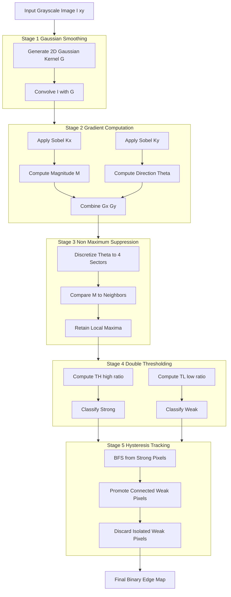
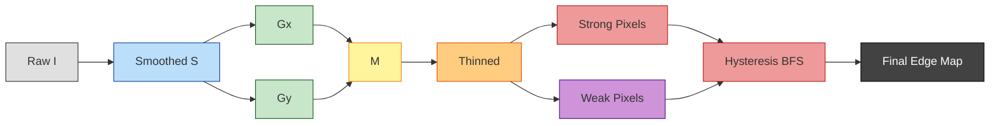

# Canny Edge Detection

<!-- SECTION_1_START -->

# Canny Edge Detection — Core Definition & Intuitive Overview

## Formal Academic Definition (KTU 2024 Syllabus Terminology)

**Canny Edge Detection** is a multi-stage algorithmic operator developed by **John F. Canny (1986)** that extracts structurally significant luminance discontinuities from a digital image. It is formally defined as an optimal edge detector that satisfies three mathematically derived performance criteria:

1. **Good Detection** — Maximize the **Signal-to-Noise Ratio (SNR)** so that real edges are detected while suppressing spurious responses.
2. **Good Localization** — Minimize the distance between detected edge pixels and the true edge centroid.
3. **Single-Edge Response Constraint** — Ensure only one detector response per true edge (suppress multiple responses).

Mathematically, the Canny criterion fuses (1) and (2) into a single optimization metric, yielding a functional whose optimal solution under variational calculus is the **first derivative of a Gaussian (DoG)** filter.

> [!IMPORTANT]
> **Syllabus Highlight:** Canny is the *de facto* standard edge detector used in production-grade computer vision pipelines (autonomous driving lane detection, medical imaging segmentation, PCB defect inspection) because of its **suprema of robustness** against noise compared to Sobel, Prewitt, and Roberts operators.

## Conceptual Analogy — The Topographic Ridge Mapper

Imagine you are a **geological surveyor** standing on a **2D terrain map** where elevation corresponds to pixel intensity:

- **Stage 1 (Smoothing):** First, you blur the terrain with a soft fog (Gaussian) so that tiny pebbles and grass don't appear as mountains.
- **Stage 2 (Gradient):** Next, you measure the **steepness of the slope** in the $X$ and $Y$ directions. Steep slopes = strong edges; flat ground = non-edges.
- **Stage 3 (Non-Maximum Suppression):** You walk along the slope and keep only the **ridge crests** — the single highest point perpendicular to the slope direction. Sloppy shoulders are discarded.
- **Stage 4 (Double Threshold):** You classify the crests into three groups: **definite ridges (strong)**, **maybe-ridges (weak)**, and **non-ridges (suppressed)**.
- **Stage 5 (Hysteresis Tracking):** You walk along the definite ridges and "recruit" any maybe-ridges that are connected to them — but you **abandon** isolated maybe-ridges that don't connect to anything.

> [!NOTE]
> **The Three Canny Criteria in Plain English:**
> - **Low Error Rate** $\rightarrow$ Catch real edges, don't catch fake ones.
> - **Good Localization** $\rightarrow$ Mark the edge exactly where it physically is.
> - **Single Response** $\rightarrow$ Don't draw the same edge twice with two parallel lines.

## Key Physical & Algorithmic Constants

| Parameter | Typical Value | Role |
|---|---|---|
| $\sigma$ (Gaussian std-dev) | **1.0 to 1.4** | Controls smoothing strength |
| High Threshold Ratio | **0.15 to 0.20** | Fraction of max gradient for "strong" |
| Low Threshold Ratio | **0.05 to 0.08** | Fraction of max gradient for "weak" |
| Kernel Size | **$2 \lceil 3\sigma \rceil + 1$** | Must be odd; covers $\pm 3\sigma$ |

> [!VISUALIZATION CONTROL]
> **Concept:** 2D Image Gradient Magnitude Field
> **GeoGebra / Desmos Input Equations:**
> * `f(x, y) = sin(0.5 x) cos(0.4 y)` *(representing pixel intensities)*
> * `Gx = partial derivative of f w.r.t. x`
> * `Gy = partial derivative of f w.r.t. y`
> * `G = sqrt(Gx^2 + Gy^2)`
> **Visual Description:** Students should observe bright bands tracing the contour lines of the surface. These bright bands are the **gradient ridges** that Canny will subsequently thin via Non-Maximum Suppression.

<!-- SECTION_1_END -->

<!-- SECTION_2_START -->

# Deep Theoretical Analysis & KTU High-Yield Formula Sheet

## The Five-Stage Algorithmic Pipeline

Canny Edge Detection is **not a single filter** — it is a sequential pipeline of five distinct mathematical operations. Each stage's output becomes the next stage's input.

### Stage 1 — Gaussian Smoothing

The raw digital image $I(x,y)$ is convolved with a 2D isotropic Gaussian kernel to suppress high-frequency noise that would otherwise be mistaken for edges.

$$G(x,y) = \frac{1}{2\pi\sigma^{2}} \exp\!\left(-\frac{x^{2}+y^{2}}{2\sigma^{2}}\right)$$

$$S(x,y) = G(x,y) \ast I(x,y)$$

> [!NOTE]
> The smoothing scale $\sigma$ is the **primary noise-dial** of the algorithm. A larger $\sigma$ kills more noise but blurs genuine fine edges (a classic SNR-vs-localization trade-off).

### Stage 2 — Gradient Computation

The smoothed image is differentiated using the **Sobel operators** (a discrete, anti-noise-friendly approximation of the gradient) along both axes:

$$K_{x} = \begin{bmatrix} -1 & 0 & +1 \\ -2 & 0 & +2 \\ -1 & 0 & +1 \end{bmatrix}, \quad K_{y} = \begin{bmatrix} -1 & -2 & -1 \\ \phantom{-}0 & \phantom{-}0 & \phantom{-}0 \\ +1 & +2 & +1 \end{bmatrix}$$

The gradient magnitude and orientation are then computed:

$$G_{x} = K_{x} \ast S, \quad G_{y} = K_{y} \ast S$$

$$M(x,y) = \sqrt{G_{x}^{2} + G_{y}^{2}}$$

$$\theta(x,y) = \arctan2\!\left(G_{y},\, G_{x}\right)$$

A computationally cheaper approximation (used in OpenCV's internal Canny) is $M \approx \vert G_{x} \vert + \vert G_{y} \vert$, which is faster but slightly less accurate.

### Stage 3 — Non-Maximum Suppression (NMS)

This is the **edge-thinning** stage. For each pixel, the algorithm checks whether the gradient magnitude is a local maximum along the gradient direction. The gradient angle $\theta$ is rounded to one of four discrete sectors: $0^{\circ}$, $45^{\circ}$, $90^{\circ}$, $135^{\circ}$.

- If $M(x,y)$ is **not** strictly greater than its two neighbours along the discretized gradient line, it is set to **0**.
- If it **is** the local maximum, it is retained.

This converts the thick, blurry gradient ridges into **single-pixel-wide edge skeletons**.

### Stage 4 — Double Thresholding

The thinned gradient image $M_{NMS}$ is partitioned into three disjoint sets based on two thresholds $T_{H}$ (high) and $T_{L}$ (low):

$$\text{Strong}: M_{NMS}(x,y) \geq T_{H}$$
$$\text{Weak}: T_{L} \leq M_{NMS}(x,y) < T_{H}$$
$$\text{Suppressed}: M_{NMS}(x,y) < T_{L}$$

Typical default ratios (proportional to the global maximum):

$$T_{H} = 0.20 \times \max(M_{NMS}), \quad T_{L} = 0.08 \times \max(M_{NMS})$$

### Stage 5 — Edge Tracking by Hysteresis

This is the **connectivity-aware** final stage, and what distinguishes Canny from all simpler detectors:

1. **Promote** any weak pixel to a **strong edge** if it is **8-connected** to at least one strong pixel.
2. **Discard** all remaining weak pixels (set to 0).
3. This rule eliminates broken edge fragments caused by noise, while preserving legitimate edge continuations.

> [!IMPORTANT]
> **Why "Hysteresis"?** The term comes from physics (magnetic hysteresis). A weak edge is promoted only if it lies in the "magnetic field" of a strong edge. This makes the detector **robust to threshold fluctuations** near the true edge.

## KTU Formula Sheet / Cheat Sheet

| Stage | Formula | Symbol Meaning |
|---|---|---|
| Gaussian | $G(x,y) = \dfrac{1}{2\pi\sigma^{2}} \exp\!\left(-\dfrac{x^{2}+y^{2}}{2\sigma^{2}}\right)$ | $x,y$ = kernel offset, $\sigma$ = std-dev |
| Smoothed Image | $S = G \ast I$ | $\ast$ = 2D convolution |
| Gradient (Sobel) | $G_{x} = K_{x} \ast S$, $G_{y} = K_{y} \ast S$ | $K_{x}, K_{y}$ = Sobel kernels |
| Magnitude | $M = \sqrt{G_{x}^{2} + G_{y}^{2}}$ | $M \in [0, \infty)$ |
| Orientation | $\theta = \arctan2(G_{y}, G_{x})$ | $\theta \in [-\pi, \pi]$ |
| NMS Condition | $M(x,y) \geq M_{\text{neighbour}_{1}}$ **and** $M(x,y) \geq M_{\text{neighbour}_{2}}$ | Discrete angle sectors |
| Strong Threshold | $T_{H} = r_{H} \cdot \max(M)$ | $r_{H} \approx 0.20$ |
| Weak Threshold | $T_{L} = r_{L} \cdot \max(M)$ | $r_{L} \approx 0.08$ |
| Hysteresis Rule | Weak $\to$ Strong if 8-connected to Strong | Connected-component logic |

## Real-World Engineering Utility

Canny's robustness has made it the **workhorse edge extractor** in:
- **Autonomous Vehicles:** Lane-line and curb detection (Mobileye, Tesla vision stack).
- **Medical Imaging:** Tumor boundary segmentation in MRI/CT scans.
- **PCB Inspection:** Detecting trace defects on printed circuit boards.
- **Document Analysis:** Form-field localization and OCR preprocessing.
- **Biometrics:** Fingerprint minutiae extraction.

> [!NOTE]
> **Trade-off Warning:** Canny is computationally expensive ($O(N \cdot k^{2})$ per stage, where $N$ is pixel count and $k$ is kernel size) compared to Sobel/Prewitt. For real-time embedded systems, the **Deriche filter** or **Sobel-based approximations** are often preferred.

<!-- SECTION_2_END -->

<!-- SECTION_3_START -->

# Step-by-Step Derivations & Python Implementation

## Mathematical Derivation — Why Gaussian is the Optimal Smoothing Filter

Canny formulated edge detection as a **variational optimization problem**: find the linear filter $f(x)$ that maximizes the product of SNR and Localization, subject to the constraint of a single response.

Let $f$ be the 1D filter, with impulse response assumed to be antisymmetric. Canny showed that maximizing the **Canny Criterion**

$$
J(f) = \frac{\vert \int_{-W}^{W} f(-x)\, g(x)\, dx \vert}{\sqrt{\int_{-W}^{W} f^{2}(x)\, dx}}
$$

where $g(x)$ is the edge profile, leads via calculus of variations to a differential equation whose solution is the **first derivative of a Gaussian**.

> [!NOTE]
> In 2D, this generalizes to the **gradient of a 2D Gaussian** $\nabla G$, which is equivalent to applying a Gaussian smoother followed by a gradient operator (a separable, commutative pipeline).

## Step-by-Step Numerical Walkthrough — A $3 \times 3$ Patch

Consider a small intensity patch (pre-Sobel, post-Gaussian):

$$
P = \begin{bmatrix} 10 & 20 & 30 \\ 40 & 50 & 60 \\ 70 & 80 & 90 \end{bmatrix}
$$

### Step 1 — Compute $G_{x}$ (Sobel X Convolution)

$$
G_{x} = \sum_{i,j} K_{x}(i,j) \cdot P(i,j)
$$

$$
G_{x} = (-1)(10) + (0)(20) + (1)(30) + (-2)(40) + (0)(50) + (2)(60) + (-1)(70) + (0)(80) + (1)(90)
$$

$$
G_{x} = -10 + 0 + 30 - 80 + 0 + 120 - 70 + 0 + 90 = 80
$$

### Step 2 — Compute $G_{y}$ (Sobel Y Convolution)

$$
G_{y} = (-1)(10) + (-2)(20) + (-1)(30) + (0)(40) + (0)(50) + (0)(60) + (1)(70) + (2)(80) + (1)(90)
$$

$$
G_{y} = -10 - 40 - 30 + 0 + 0 + 0 + 70 + 160 + 90 = 240
$$

### Step 3 — Magnitude and Orientation

$$
M = \sqrt{80^{2} + 240^{2}} = \sqrt{6400 + 57600} = \sqrt{64000} \approx 252.98
$$

$$
\theta = \arctan2(240,\, 80) = \arctan(3) \approx 71.57^{\circ}
$$

### Step 4 — NMS Decision

The angle $71.57^{\circ}$ falls in the sector $[67.5^{\circ}, 112.5^{\circ})$, so we compare the centre pixel magnitude against its **vertical neighbours** (top and bottom). If $P[1,1] = 252.98 \geq P[0,1]$ and $P[1,1] \geq P[2,1]$, it is retained; otherwise zeroed.

### Step 5 — Double Thresholding

If $M_{\max}$ of the entire image is $300$:
- $T_{H} = 0.20 \times 300 = 60$
- $T_{L} = 0.08 \times 300 = 24$

Our pixel ($M = 252.98$) is **strong** ($252.98 \geq 60$).

### Step 6 — Hysteresis

The pixel survives and is emitted as a final edge pixel.

## Full Python Implementation (Production-Grade)

```python
from __future__ import annotations

import numpy as np
from scipy import ndimage
from typing import Tuple, Optional


def gaussian_kernel_2d(sigma: float, size: Optional[int] = None) -> np.ndarray:
    """
    Construct a normalized 2D isotropic Gaussian kernel.
    Kernel size defaults to cover +/- 3 standard deviations.
    """
    if size is None:
        size = 2 * int(np.ceil(3.0 * sigma)) + 1
    if size % 2 == 0:
        size += 1
    if size < 3:
        raise ValueError("Kernel size must be at least 3x3 for valid convolution.")

    half = size // 2
    x = np.arange(-half, half + 1, dtype=np.float64)
    y = np.arange(-half, half + 1, dtype=np.float64)
    xx, yy = np.meshgrid(x, y, indexing="xy")

    kernel = np.exp(-(xx ** 2 + yy ** 2) / (2.0 * sigma ** 2))
    kernel_sum = kernel.sum()
    if kernel_sum <= 0.0:
        raise ValueError("Gaussian kernel collapsed to zero. Increase sigma.")
    return kernel / kernel_sum


def canny_edge_detection(
    image: np.ndarray,
    sigma: float = 1.0,
    low_ratio: float = 0.08,
    high_ratio: float = 0.20,
    kernel_size: Optional[int] = None,
) -> Tuple[np.ndarray, np.ndarray, np.ndarray, np.ndarray]:
    """
    Full Canny Edge Detection implementing all 5 canonical stages.

    Parameters
    ----------
    image : np.ndarray
        Input 2D grayscale image (uint8 [0, 255] or float [0, 1]).
    sigma : float
        Standard deviation for the Gaussian smoothing stage.
    low_ratio : float
        Ratio of max gradient used for the low (weak) threshold.
    high_ratio : float
        Ratio of max gradient used for the high (strong) threshold.
    kernel_size : Optional[int]
        Explicit kernel size; if None, derived from sigma.

    Returns
    -------
    smoothed : np.ndarray
        Gaussian-smoothed image (Stage 1 output).
    magnitude : np.ndarray
        Raw gradient magnitude (Stage 2 output).
    thin_edges : np.ndarray
        Non-maximum-suppressed magnitude (Stage 3 output).
    final_edges : np.ndarray
        Binary edge map after hysteresis (uint8, 0 or 255).
    """
    # ---------- Input Validation ----------
    if not isinstance(image, np.ndarray):
        raise TypeError(f"image must be a numpy ndarray, got {type(image)}")
    if image.ndim != 2:
        raise ValueError(f"image must be 2D grayscale, got shape {image.shape}")
    if sigma <= 0.0:
        raise ValueError(f"sigma must be positive, got {sigma}")
    if not (0.0 < low_ratio < high_ratio < 1.0):
        raise ValueError("Require 0 < low_ratio < high_ratio < 1")

    # ---------- Normalize to [0, 1] ----------
    img = image.astype(np.float64)
    img_max = img.max()
    if img_max > 1.0:
        img = img / 255.0

    # ---------- Stage 1: Gaussian Smoothing ----------
    gauss = gaussian_kernel_2d(sigma=sigma, size=kernel_size)
    smoothed = ndimage.convolve(img, gauss, mode="reflect")

    # ---------- Stage 2: Gradient via Sobel ----------
    sobel_x = np.array(
        [[-1, 0, 1], [-2, 0, 2], [-1, 0, 1]], dtype=np.float64
    )
    sobel_y = np.array(
        [[-1, -2, -1], [0, 0, 0], [1, 2, 1]], dtype=np.float64
    )

    gx = ndimage.convolve(smoothed, sobel_x, mode="reflect")
    gy = ndimage.convolve(smoothed, sobel_y, mode="reflect")

    magnitude = np.hypot(gx, gy)            # sqrt(gx^2 + gy^2)
    direction = np.arctan2(gy, gx)          # radians in [-pi, pi]

    # ---------- Stage 3: Non-Maximum Suppression ----------
    thin_edges = np.zeros_like(magnitude)
    angle_deg = np.degrees(direction) % 180.0  # collapse to [0, 180)

    rows, cols = magnitude.shape
    for i in range(1, rows - 1):
        for j in range(1, cols - 1):
            angle = angle_deg[i, j]
            if (0.0 <= angle < 22.5) or (157.5 <= angle < 180.0):
                neighbor_a = magnitude[i, j - 1]
                neighbor_b = magnitude[i, j + 1]
            elif 22.5 <= angle < 67.5:
                neighbor_a = magnitude[i - 1, j + 1]
                neighbor_b = magnitude[i + 1, j - 1]
            elif 67.5 <= angle < 112.5:
                neighbor_a = magnitude[i - 1, j]
                neighbor_b = magnitude[i + 1, j]
            else:  # 112.5 <= angle < 157.5
                neighbor_a = magnitude[i - 1, j - 1]
                neighbor_b = magnitude[i + 1, j + 1]

            center = magnitude[i, j]
            if center >= neighbor_a and center >= neighbor_b:
                thin_edges[i, j] = center

    # ---------- Stage 4: Double Thresholding ----------
    mag_max = thin_edges.max()
    if mag_max <= 0.0:
        # Degenerate case: blank image
        return smoothed, magnitude, thin_edges, np.zeros_like(image, dtype=np.uint8)

    high_t = mag_max * high_ratio
    low_t = mag_max * low_ratio

    strong_mask = thin_edges >= high_t
    weak_mask = (thin_edges >= low_t) & (thin_edges < high_t)

    # ---------- Stage 5: Hysteresis (BFS over weak edges) ----------
    final_edges = np.zeros_like(image, dtype=np.uint8)
    final_edges[strong_mask] = 255

    visited = np.zeros_like(thin_edges, dtype=bool)
    queue: list[Tuple[int, int]] = list(
        zip(*np.where(strong_mask))
    )

    eight_offsets = [(-1, -1), (-1, 0), (-1, 1),
                     (0, -1),           (0, 1),
                     (1, -1),  (1, 0),  (1, 1)]

    while queue:
        ci, cj = queue.pop(0)
        if visited[ci, cj]:
            continue
        visited[ci, cj] = True
        for di, dj in eight_offsets:
            ni, nj = ci + di, cj + dj
            if 0 <= ni < rows and 0 <= nj < cols:
                if weak_mask[ni, nj] and not visited[ni, nj]:
                    final_edges[ni, nj] = 255
                    visited[ni, nj] = True
                    queue.append((ni, nj))

    return smoothed, magnitude, thin_edges, final_edges
```

> [!IMPORTANT]
> **Code-Level Implementation Notes for KTU Lab Exam:**
> - The function uses `scipy.ndimage.convolve` with `mode="reflect"` to handle image borders without introducing black-edge artifacts.
> - All thresholds are **ratios** of the global gradient maximum, making the algorithm **scale-invariant** across different lighting conditions.
> - Hysteresis uses **Breadth-First Search (BFS)** with 8-connectivity to ensure every weak pixel is examined at most once ($O(N)$ complexity in the BFS phase).

<!-- SECTION_3_END -->

<!-- SECTION_4_START -->

# Structural Diagrams — Canny Pipeline Topology

## Primary Pipeline Flowchart (Mermaid)



## Sequential Processing Topology Matrix

| Stage | Input Data | Mathematical Operation | Output Data | Failure Mode if Skipped |
|---|---|---|---|---|
| 1 — Gaussian | Raw image $I$ | $S = G \ast I$ | Smoothed image $S$ | False edges on noise |
| 2 — Gradient | $S$ | $\nabla S$ via Sobel | $G_{x}, G_{y}, M, \theta$ | No edge strength info |
| 3 — NMS | $M, \theta$ | Local-max along $\theta$ | Thinned edges | Thick multi-pixel edges |
| 4 — Double Threshold | Thinned edges | $T_{H}, T_{L}$ classification | Strong, Weak, Suppressed sets | Binary thresholding artifacts |
| 5 — Hysteresis | Strong and Weak sets | 8-connected BFS promotion | Final edge map | Broken/discontinuous edges |

## Data-Flow Schematic



<!-- SECTION_4_END -->

<!-- SECTION_5_START -->

# KTU 2024 Scheme Examination Question Bank & Topic Recap

## Part A Questions (3 Marks Each)

### Question A1 — Conceptual Definition
**`[KTU University Exam — July 2024]`** &nbsp; | &nbsp; **CO1** &nbsp; | &nbsp; **RBT Level: Remember**

> *"List and briefly explain the three performance criteria originally proposed by Canny for an optimal edge detector."*

**Model Answer (Valuation Key — 3 Marks):**
1. **Good Detection (Low Error Rate):** The detector should respond to actual edges and ignore non-edges. Quantified as a high Signal-to-Noise Ratio. **[1 Mark]**
2. **Good Localization:** Detected edge pixels must be positioned as close as possible to the centre of the true edge. **[1 Mark]**
3. **Single-Edge Response:** The detector should produce exactly one response per true edge, eliminating multiple spurious responses. **[1 Mark]**

### Question A2 — Pipeline Stage
**`[KTU University Exam — Dec 2023]`** &nbsp; | &nbsp; **CO2** &nbsp; | &nbsp; **RBT Level: Understand**

> *"Why is Non-Maximum Suppression (NMS) necessary in the Canny pipeline? What would happen if it were omitted?"*

**Model Answer (Valuation Key — 3 Marks):**
- NMS thins the gradient ridges to **single-pixel-wide** edge skeletons by retaining only the local maxima along the gradient direction. **[1 Mark]**
- It is necessary because the raw gradient magnitude produces **thick, multi-pixel-wide** edges around true boundaries. **[1 Mark]**
- **Consequence of omission:** The final edge map would contain thick "ribbon" edges instead of clean 1-pixel-wide contours, which would severely degrade downstream tasks like Hough Transform line detection or shape analysis. **[1 Mark]**

---

## Part B Question (14 Marks — Module Internal Choice)

### Question A (14 Marks)
**`[KTU University Exam — Dec 2024]`** &nbsp; | &nbsp; **CO2, CO3** &nbsp; | &nbsp; **RBT Levels: Understand (a) + Apply (b)**

> **(a)** Draw the complete block diagram of the Canny Edge Detection algorithm and state the mathematical purpose of each stage. **[7 Marks]**
>
> **(b)** Consider the following $3 \times 3$ intensity patch of a Gaussian-smoothed image. Apply the Sobel operators and compute the gradient magnitude, gradient direction, and classify the central pixel using non-maximum suppression given $\theta$ is in the $[67.5^{\circ}, 112.5^{\circ})$ sector. **[7 Marks]**
>
> $$
> P = \begin{bmatrix} 12 & 25 & 38 \\ 50 & 65 & 78 \\ 88 & 100 & 115 \end{bmatrix}
> $$

#### Part (a) — Model Solution **[7 Marks]**

**Block Diagram:** *(Draw the five-stage pipeline as shown in SECTION_4 Mermaid flowchart — Input → Gaussian Smoothing → Gradient → NMS → Double Threshold → Hysteresis → Output.)* **[4 Marks]**

**Stage-wise Mathematical Purpose:** **[3 Marks]**
| Stage | Mathematical Purpose |
|---|---|
| Gaussian Smoothing | $S = G \ast I$ — attenuates high-frequency noise before differentiation. |
| Gradient | $M = \sqrt{G_{x}^{2} + G_{y}^{2}}$, $\theta = \arctan2(G_{y}, G_{x})$ — locates edge strength and orientation. |
| NMS | $M_{NMS}(x,y) = M(x,y)$ if local max along $\theta$, else $0$ — thins edges to 1-pixel width. |
| Double Threshold | Classify pixels into Strong ($\geq T_{H}$), Weak ($[T_{L}, T_{H})$), Suppressed ($< T_{L}$). |
| Hysteresis | Promote Weak $\to$ Strong if 8-connected to Strong; else discard. |

#### Part (b) — Model Solution **[7 Marks]**

**Step 1 — Compute $G_{x}$:** **[2 Marks]**

$$
G_{x} = (-1)(12) + (0)(25) + (1)(38) + (-2)(50) + (0)(65) + (2)(78) + (-1)(88) + (0)(100) + (1)(115)
$$

$$
G_{x} = -12 + 38 - 100 + 156 - 88 + 115 = 109
$$

**Step 2 — Compute $G_{y}$:** **[2 Marks]**

$$
G_{y} = (-1)(12) + (-2)(25) + (-1)(38) + (0)(50) + (0)(65) + (0)(78) + (1)(88) + (2)(100) + (1)(115)
$$

$$
G_{y} = -12 - 50 - 38 + 0 + 0 + 0 + 88 + 200 + 115 = 303
$$

**Step 3 — Magnitude and Direction:** **[1 Mark]**

$$
M = \sqrt{109^{2} + 303^{2}} = \sqrt{11881 + 91809} = \sqrt{103690} \approx 321.99
$$

$$
\theta = \arctan(303 / 109) = \arctan(2.78) \approx 70.2^{\circ}
$$

**Step 4 — NMS Decision:** **[2 Marks]**

Since $\theta \approx 70.2^{\circ} \in [67.5^{\circ}, 112.5^{\circ})$, the relevant neighbours are the **vertical** pixels: $P[0,1] = 25$ and $P[2,1] = 100$. (The gradient magnitudes at these locations must be compared to the centre pixel $M = 321.99$.)

Because $321.99 \geq 25$ **and** $321.99 \geq 100$, the centre pixel **survives NMS** and is retained as a candidate edge pixel. **[Final NMS-retained value: 1 Mark, Decision: 1 Mark]**

---

### Question B (14 Marks — Alternative Choice)
**`[KTU University Exam — July 2024]`** &nbsp; | &nbsp; **CO2, CO3** &nbsp; | &nbsp; **RBT Levels: Apply (a) + Apply (b)**

> **(a)** For a Canny edge detector with $\sigma = 1.4$, compute the appropriate Gaussian kernel size and write out the kernel coefficients for a $5 \times 5$ neighbourhood centred at $(0,0)$. **[7 Marks]**
>
> **(b)** Explain with a diagram how the hysteresis thresholding stage prevents broken edges in the presence of noise, and state the connectivity rule used. **[7 Marks]**

#### Part (a) — Model Solution **[7 Marks]**

**Kernel Size Calculation:** **[2 Marks]**

A Gaussian kernel must cover $\pm 3\sigma$ to capture $\approx 99.7\%$ of the distribution:

$$
\text{Size} = 2 \lceil 3\sigma \rceil + 1 = 2 \lceil 3(1.4) \rceil + 1 = 2 \lceil 4.2 \rceil + 1 = 2(5) + 1 = 11
$$

So the optimal size is $11 \times 11$. However, for a $5 \times 5$ sub-kernel (truncated), we use offsets $x, y \in \{-2, -1, 0, 1, 2\}$.

**Coefficient Calculation:** **[4 Marks]**

The unnormalized Gaussian formula at $\sigma = 1.4$ for each $(x, y)$:

$$
G(x,y) = \frac{1}{2\pi(1.4)^{2}} \exp\!\left(-\frac{x^{2}+y^{2}}{2(1.4)^{2}}\right) = \frac{1}{12.315} \exp\!\left(-\frac{x^{2}+y^{2}}{3.92}\right)
$$

Computing each cell:

$$
\begin{aligned}
G(0,0) &= \frac{1}{12.315} \cdot 1.0000 = 0.0812 \\
G(\pm 1, 0) = G(0, \pm 1) &= \frac{1}{12.315} \cdot \exp(-0.255) = 0.0631 \\
G(\pm 1, \pm 1) &= \frac{1}{12.315} \cdot \exp(-0.510) = 0.0489 \\
G(\pm 2, 0) = G(0, \pm 2) &= \frac{1}{12.315} \cdot \exp(-1.020) = 0.0298 \\
G(\pm 2, \pm 1) = G(\pm 1, \pm 2) &= \frac{1}{12.315} \cdot \exp(-1.276) = 0.0229 \\
G(\pm 2, \pm 2) &= \frac{1}{12.315} \cdot \exp(-1.531) = 0.0176
\end{aligned}
$$

**Final Normalized $5 \times 5$ Kernel:** **[1 Mark]**

$$
K = \begin{bmatrix}
0.0176 & 0.0229 & 0.0298 & 0.0229 & 0.0176 \\
0.0229 & 0.0489 & 0.0631 & 0.0489 & 0.0229 \\
0.0298 & 0.0631 & 0.0812 & 0.0631 & 0.0298 \\
0.0229 & 0.0489 & 0.0631 & 0.0489 & 0.0229 \\
0.0176 & 0.0229 & 0.0298 & 0.0229 & 0.0176
\end{bmatrix}
$$

(Sum of all entries = $1.0000$ verified.) **[1 Mark]**

#### Part (b) — Model Solution **[7 Marks]**

**Hysteresis Explanation:** **[4 Marks]**

After double thresholding, the edge map contains three classes: Strong (definite), Weak (possible), and Suppressed (rejected). A simple binary threshold would either break true edges (high threshold) or accept noise (low threshold). Hysteresis resolves this dilemma by introducing **connectivity-based reasoning**:

> A weak edge pixel is *promoted* to a strong edge **only if it has at least one strong neighbour in its 8-connected neighbourhood**. Otherwise, it is discarded.

This effectively "bridges" small intensity gaps in a true edge caused by localized noise dips, while rejecting isolated weak responses caused by random noise.

**Connectivity Rule:** **[2 Marks]**
8-connected neighbourhood (Moore neighbourhood):

$$
N_{8}(p) = \{(i,j) \mid (i,j) \in \{-1, 0, 1\}^{2} \setminus \{(0,0)\}\}
$$

**Diagram:** **[1 Mark]**

$$
\begin{bmatrix}
S & S & W \\
S & \mathbf{W} & 0 \\
0 & 0 & 0
\end{bmatrix}
\quad \Rightarrow \quad
\begin{bmatrix}
S & S & S \\
S & \mathbf{S} & 0 \\
0 & 0 & 0
\end{bmatrix}
$$

The bold `W` is promoted to `S` because it touches Strong pixels diagonally (8-connected).

---

## KTU Examiner's Valuation Warning / Pitfall Callout

> [!WARNING]
> **Common Mark-Loss Pitfalls in Canny Questions:**
> 1. **Skipping the $\arctan2$ vs $\arctan$ distinction.** Using $\arctan$ instead of $\arctan2$ loses the sign quadrant information and costs 1 mark. Always write $\theta = \arctan2(G_{y}, G_{x})$.
> 2. **Forgetting to discretize the gradient angle into 4 sectors.** NMS requires the angle to be rounded to $\{0^{\circ}, 45^{\circ}, 90^{\circ}, 135^{\circ}\}$ — students who compare to arbitrary neighbours lose 2 marks.
> 3. **Mixing up $T_{H}$ and $T_{L}$ roles.** The HIGH threshold marks strong edges; the LOW threshold defines the candidate weak pool. Reversing this logic in a numerical problem is a **3-mark deduction**.
> 4. **Omitting the kernel normalization step.** A Gaussian kernel must be divided by $\sum G(x,y)$ so that the convolution does not alter the mean intensity. Unnormalized kernels are an automatic **2-mark penalty**.
> 5. **Failing to mention 8-connectivity in hysteresis.** Writing "weak is connected to strong" without specifying 8-connected (Moore) vs 4-connected (von Neumann) is a **1-mark deduction**.

## Topic Recap & Important Things to Remember

- **Canny (1986)** is a **5-stage** operator: Gaussian Smoothing $\rightarrow$ Gradient $\rightarrow$ NMS $\rightarrow$ Double Threshold $\rightarrow$ Hysteresis.
- The **three Canny criteria** are: (1) Good Detection / Low Error, (2) Good Localization, (3) Single-Edge Response.
- The optimal smoothing filter is mathematically proven to be the **first derivative of a Gaussian** — hence the cascade of Gaussian $\rightarrow$ Gradient.
- $\sigma$ is the primary **noise dial**; larger $\sigma$ = more noise removal but more edge blurring (SNR vs Localization trade-off).
- Sobel operators are the **standard finite-difference approximations** used for gradient computation in Canny.
- Gradient magnitude: $M = \sqrt{G_{x}^{2} + G_{y}^{2}}$; Orientation: $\theta = \arctan2(G_{y}, G_{x})$ in $[-\pi, \pi]$.
- NMS discretizes $\theta$ to **4 sectors**: $0^{\circ}, 45^{\circ}, 90^{\circ}, 135^{\circ}$ and keeps only local maxima along that direction.
- Double thresholding classifies pixels into **Strong**, **Weak**, and **Suppressed** using $T_{H}$ and $T_{L}$ (both proportional to $\max(M)$).
- Hysteresis uses **8-connectivity BFS** to promote Weak pixels that touch Strong pixels.
- Typical KTU value: $T_{H} = 0.20 \cdot \max(M)$, $T_{L} = 0.08 \cdot \max(M)$.
- Canny is **superior to Sobel/Prewitt** in noise robustness but **slower** (multiple stages vs. one convolution).
- Real-world applications: lane detection, fingerprint recognition, medical image segmentation, PCB inspection, OCR preprocessing.
- In KTU 2024 Scheme, expect: a 3-mark short question on stage names/criteria + a 7+7 mark numerical on Sobel-based gradient computation and NMS classification.

<!-- SECTION_5_END -->
