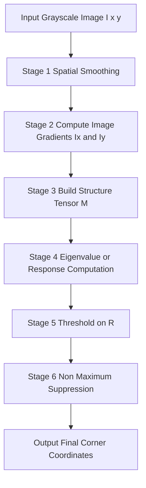
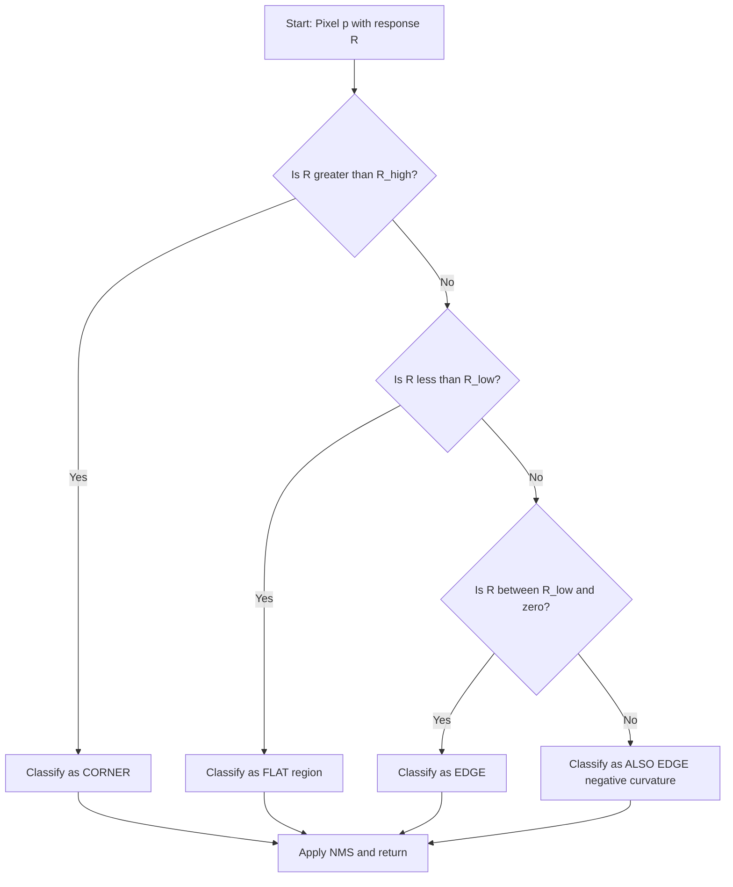
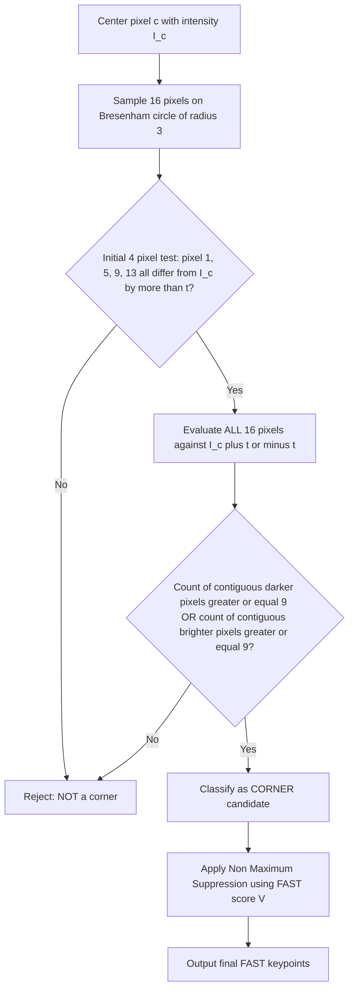
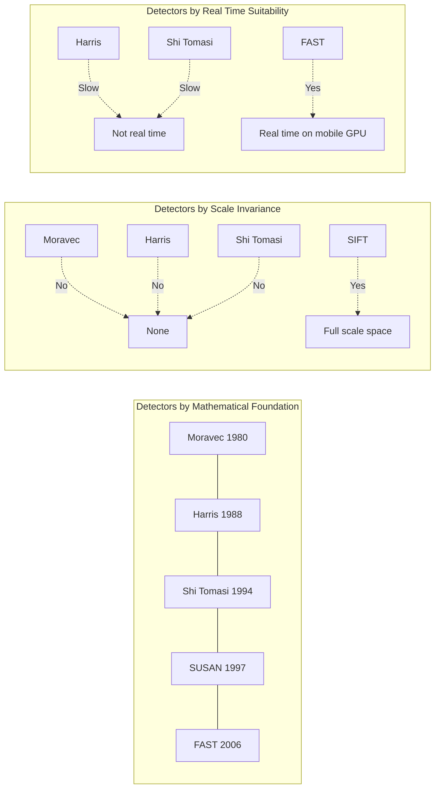
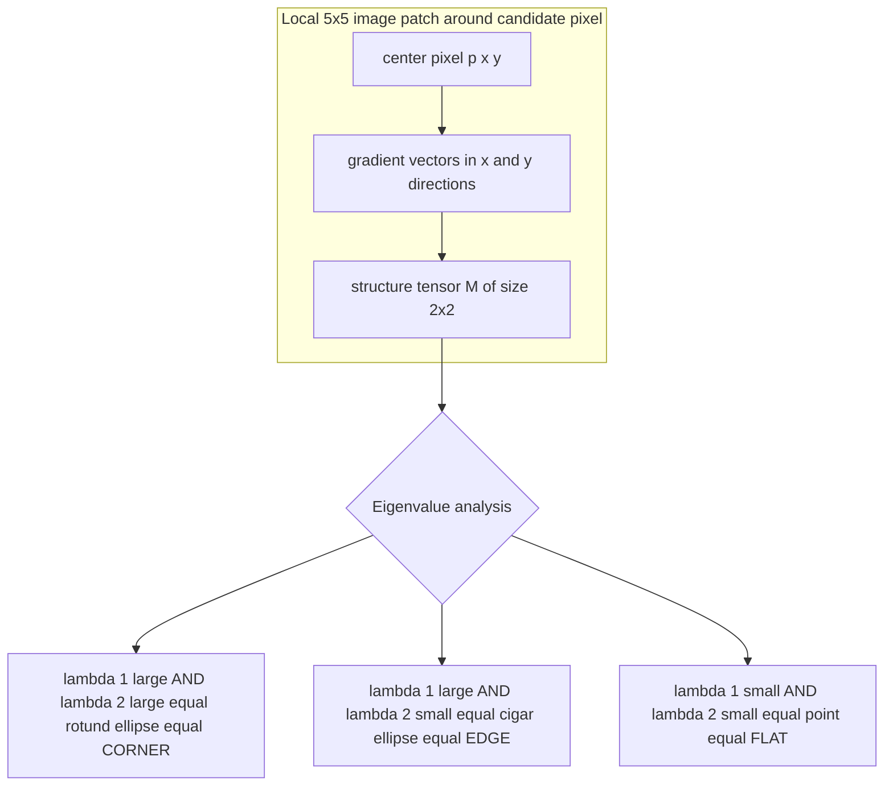

# Detection of corners(interest points)

<!-- SECTION_1_START -->

# Detection of Corners (Interest Points)

## 1.1 Formal KTU 2024 Definition

An **interest point** (also called a **keypoint**, **corner point**, or **feature point**) is a pixel location in a digital image that possesses a *well-defined* and *mathematically stable* local structure, such that the local image neighborhood on either side of that point exhibits significant intensity variation in **more than one dominant direction**. Formally, a point $\mathbf{p} = (x, y)$ is classified as an interest point if, and only if, shifting a small image window $W$ centered at $\mathbf{p}$ in **any arbitrary direction** $\Delta = (\Delta x, \Delta y)$ produces a *measurable*, *non-trivial* change in the Sum of Squared Differences (SSD) between the original patch and the shifted patch.

Mathematically, the classical KTU definition uses the auto-correlation function:

$$E(\Delta x, \Delta y) = \sum_{(x_k, y_k) \in W} w(x_k, y_k) \left[ I(x_k + \Delta x, y_k + \Delta y) - I(x_k, y_k) \right]^2$$

where $w(\cdot, \cdot)$ is a weighting function (uniform or Gaussian), and $I(\cdot, \cdot)$ represents the image intensity field. The classification of a point as a **corner**, **edge**, or **flat region** is determined by the eigenvalues $\lambda_1$ and $\lambda_2$ of the **second-moment matrix** (also called the **structure tensor**) of the image gradients.

> [!IMPORTANT]
> **KTU 2024 Syllabus Highlight (PECST636 – Module 2):**
> "Interest points" refer strictly to local image structures that are **repeatable** (detectable under rotation, scaling, illumination, and viewpoint changes), **distinctive** (carry unique local information), and **compact** (occupy a small spatial footprint). Corners are the most reliable and widely-used subclass of interest points.

## 1.2 Conceptual Analogy / Geometric Intuition

Imagine you are blindfolded and asked to identify your location in a room using only a small torch that illuminates a circular patch of the floor. If you stand on a **smooth, flat, empty region** of the floor, sliding in any direction does not change what you see — you cannot tell where you are. If you stand on a **straight wall edge**, sliding *along* the wall does not change your view, but sliding *perpendicular* to it does — you have *one* useful direction. If you stand in the **inside corner where two walls meet** (an L-junction), sliding in *any* direction instantly changes your view. That corner is the **interest point** — it is the most *informative*, *distinguishable*, and *locatable* position in the entire room.

| Visual Region Type | Sliding Response in all 8 directions | Detection Verdict |
|---|---|---|
| **Flat region** | No change in any direction | $\lambda_1 \approx \lambda_2 \approx 0$ |
| **Edge** | Change in 1 direction only | One large $\lambda$, one small $\lambda$ |
| **Corner** | Significant change in all directions | Both $\lambda_1$ and $\lambda_2$ are large |
| **Isolated point** | All directions respond | Both $\lambda$'s are small — usually rejected as noise |

> [!NOTE]
> **Physical Constants / Standard Metrics (in bold) for KTU Reference:**
> - Standard Gaussian window size: $\mathbf{3 \times 3}$, $\mathbf{5 \times 5}$, or $\mathbf{7 \times 7}$ pixels.
> - Harris empirical constant: $\mathbf{k \in [0.04, 0.06]}$ (board-accepted default $\mathbf{0.04}$).
> - Shi-Tomasi "goodFeaturesToTrack" quality level threshold: $\mathbf{0.01}$ to $\mathbf{0.1}$.
> - FAST segment test passing threshold: $\mathbf{12}$ out of $\mathbf{16}$ pixels (high-speed test).
> - Structure tensor eigenvalue unit: intensity (per pixel²), dimensionless ratio.

> [!VISUALIZATION CONTROL]
> **Concept:** Eigenvalue ellipse around a corner vs. an edge vs. a flat region.
> **GeoGebra / Desmos Input Equations:**
> * `Ellipse: x^2/λ1 + y^2/λ2 = 1` for varying $\lambda_1$, $\lambda_2$.
> * `Case 1 (Corner): λ1 = 1500, λ2 = 1400` → large near-circle (rotund ellipse).
> * `Case 2 (Edge): λ1 = 1500, λ2 = 50` → long thin needle ellipse.
> * `Case 3 (Flat): λ1 = 30, λ2 = 25` → tiny dot.
> **Visual Description:** Students should see three superimposed ellipses centered at origin. The corner-ellipse is large and round (both radii long); the edge-ellipse is a long thin cigar; the flat-ellipse is barely visible. This geometric picture is the heart of Harris classification.

---

<!-- SECTION_1_END -->

<!-- SECTION_2_START -->

# Deep Theoretical Analysis & KTU High-Yield Formula Sheet

## 2.1 The General Framework for Corner Detection

Every classical corner detector reduces to a common **four-stage pipeline**. The differences between detectors lie in (a) how the local intensity change is approximated and (b) how the response is thresholded.

**Stage 1 — Local Intensity Sampling:**
A window $W$ of size $W_x \times W_y$ is centered on every candidate pixel. The intensity field $I(x, y)$ inside $W$ is read.

**Stage 2 — Taylor-Series Approximation (Linearization):**
For small shifts $(\Delta x, \Delta y)$, a first-order Taylor expansion approximates the shifted intensity:

$$I(x + \Delta x, y + \Delta y) \approx I(x, y) + I_x \cdot \Delta x + I_y \cdot \Delta y$$

where $I_x = \partial I / \partial x$ and $I_y = \partial I / \partial y$ are the **image gradients** obtained by convolving with Sobel or Prewitt kernels.

**Stage 3 — Energy / Auto-Correlation Function:**
Substituting the Taylor approximation back into $E(\Delta x, \Delta y)$ and dropping the constant term yields the *quadratic* form:

$$E(\Delta x, \Delta y) \approx \begin{bmatrix} \Delta x & \Delta y \end{bmatrix} \cdot M \cdot \begin{bmatrix} \Delta x \\ \Delta y \end{bmatrix}$$

where the **structure tensor** $M$ (the second-moment matrix) is the critical quantity.

**Stage 4 — Eigenvalue / Response Analysis:**
The response $R$ is computed from the eigenvalues $\lambda_1$, $\lambda_2$ of $M$, thresholded, and a **non-maximum suppression** step is applied to retain only the *local maxima* of $R$.

## 2.2 Why a Corner Works Mathematically — The "Why" and "How"

- **Why is $M$ a $2 \times 2$ matrix?** Because we are analyzing a 2-D intensity surface locally. $M$ summarizes *how* the gradient vectors $\nabla I = [I_x, I_y]^T$ are distributed in direction and magnitude over the window.
- **How does the geometry of $M$ classify points?** The eigenvalues of $M$ describe the *principal curvatures* of the local auto-correlation surface. Two large eigenvalues mean the surface is curved in *every* direction → corner. One large and one small eigenvalue → ridge/edge. Two small eigenvalues → flat plateau.

## 2.3 KTU Formula Sheet / Cheat Sheet

| # | Concept | Formula / Equation | Variables & Meaning | Typical Range / Units |
|---|---|---|---|---|
| 1 | Auto-correlation (change) function | $E(\Delta x, \Delta y) = \sum_{W} w \cdot [I(x+\Delta x, y+\Delta y) - I(x,y)]^2$ | $w$: window weight; sum over window $W$ | Energy, **dimensionless** or intensity² |
| 2 | Taylor linearization | $I(x+\Delta x, y+\Delta y) \approx I + I_x \Delta x + I_y \Delta y$ | $I_x, I_y$: spatial partial derivatives | Pixels (intensity per pixel) |
| 3 | Quadratic form representation | $E \approx [\Delta x \;\; \Delta y] \, M \, [\Delta x \;\; \Delta y]^T$ | $M$: $2 \times 2$ structure tensor | intensity² |
| 4 | Structure tensor $M$ (Harris) | $M = \begin{bmatrix} \sum w I_x^2 & \sum w I_x I_y \\ \sum w I_x I_y & \sum w I_y^2 \end{bmatrix} = \begin{bmatrix} A & C \\ C & B \end{bmatrix}$ | $A, B, C$: gradient products summed over window | intensity² |
| 5 | Determinant of $M$ | $\det(M) = AB - C^2 = \lambda_1 \lambda_2$ | Product of eigenvalues | intensity⁴ |
| 6 | Trace of $M$ | $\mathrm{tr}(M) = A + B = \lambda_1 + \lambda_2$ | Sum of eigenvalues | intensity² |
| 7 | **Harris response** | $R = \det(M) - k \, [\mathrm{tr}(M)]^2 = \lambda_1 \lambda_2 - k(\lambda_1 + \lambda_2)^2$ | $k \in [0.04, 0.06]$ | intensity⁴ |
| 8 | **Shi–Tomasi response** | $R = \min(\lambda_1, \lambda_2)$ | Minimum eigenvalue | intensity² |
| 9 | **Harmonic mean (Nobel)** | $R = \dfrac{2 \det(M)}{\mathrm{tr}(M) + \epsilon}$ | $\epsilon$ small stabilizer | intensity² |
| 10 | Moravec operator | $E_{u,v} = \sum [I(x+u, y+v) - I(x,y)]^2$, shift $(u, v) \in \{(1,0),(0,1),(1,1),(1,-1)\}$ | 4 directions: H, V, two diagonals | intensity² |
| 11 | Moravec response | $R_M = \min(E_{1,0}, E_{0,1}, E_{1,1}, E_{1,-1})$ | Minimum of 4 directional energies | intensity² |
| 12 | SUSAN mask count | $n(\mathbf{p}_0) = \sum_{\mathbf{p}} \exp\left(-\dfrac{[I(\mathbf{p}) - I(\mathbf{p}_0)]^2}{t^2}\right)$ | $t$: intensity threshold; nucleus at $\mathbf{p}_0$ | dimensionless |
| 13 | SUSAN corner response | $R_S = \begin{cases} g - n(\mathbf{p}_0) & \text{if } n(\mathbf{p}_0) < g \\ 0 & \text{otherwise} \end{cases}$ | $g = n_{\max}/2$ geometric threshold | dimensionless |
| 14 | FAST segment test condition | $S = \begin{cases} d & \text{if } I_{\text{px}} > I_{\text{center}} + t \\ s & \text{if } I_{\text{px}} < I_{\text{center}} - t \\ b & \text{otherwise} \end{cases}$ | $d$=darker, $s$=similar, $b$=brighter; $t$ threshold | intensity |
| 15 | FAST corner criterion | $\mathbf{p}$ is a corner $\iff$ $\exists$ an arc of $\geq N$ contiguous pixels that are *all* $d$ or *all* $s$ | $N$ typically $\mathbf{9}$ or $\mathbf{12}$ of $\mathbf{16}$ | count |
| 16 | Image gradient (Sobel) | $I_x = G_x * I$, $\;I_y = G_y * I$ | $G_x, G_y$: Sobel kernels | intensity/pixel |
| 17 | Gaussian window weight | $w(x, y) = \dfrac{1}{2\pi\sigma^2} \exp\left(-\dfrac{x^2 + y^2}{2\sigma^2}\right)$ | $\sigma$: standard deviation, often $\mathbf{1.0}$ to $\mathbf{2.0}$ | dimensionless |
| 18 | Non-Maximum Suppression (NMS) | $R(\mathbf{p}) > R(\mathbf{q}) \;\; \forall \, \mathbf{q} \in \mathcal{N}(\mathbf{p})$ | $\mathcal{N}(\mathbf{p})$: $3 \times 3$ neighborhood | scalar comparison |

## 2.4 Engineering Utility — Where Corners Are Used in Production

Corner / interest-point detection is the **front-end of nearly every modern computer-vision pipeline**:

- **Panorama stitching** (Hugin, OpenCV Stitcher) — uses Harris or ORB corners.
- **SLAM (Simultaneous Localization and Mapping)** in robotics — uses FAST + BRIEF in ORB-SLAM.
- **Augmented reality** (ARCore, ARKit) — uses Shi-Tomasi corners for plane tracking.
- **Medical image registration** — uses Harris + RANSAC for MRI/CT fusion.
- **Document scanning & OCR** — uses corner detection for perspective rectification.
- **Object tracking** (KCF, MOSSE trackers) — corners are the seeds for sparse optical flow.
- **3D reconstruction / Structure-from-Motion (SfM)** — uses SIFT/SURF/ORB (descendant detectors).

> [!TIP]
> In production code, the **Harris response $R$ must be computed on float64** to prevent underflow when squaring gradient magnitudes; storing as uint8 silently destroys the detector.

---

<!-- SECTION_2_END -->

<!-- SECTION_3_START -->

# Step-by-Step Derivations & Algorithmic Implementation

## 3.1 Derivation of the Harris Structure Tensor from First Principles

We begin with the auto-correlation (energy-of-change) function over a window $W$ centered on pixel $(x, y)$:

$$E(\Delta x, \Delta y) = \sum_{(x_k, y_k) \in W} w(x_k, y_k) \, \left[ I(x_k + \Delta x, y_k + \Delta y) - I(x_k, y_k) \right]^2$$

**Step 1 — Apply first-order Taylor expansion around $(x_k, y_k)$:**

$$I(x_k + \Delta x, y_k + \Delta y) \;\approx\; I(x_k, y_k) + I_x(x_k, y_k) \cdot \Delta x + I_y(x_k, y_k) \cdot \Delta y$$

**Step 2 — Subtract $I(x_k, y_k)$ to isolate the change term:**

$$I(x_k + \Delta x, y_k + \Delta y) - I(x_k, y_k) \;\approx\; I_x \cdot \Delta x + I_y \cdot \Delta y$$

**Step 3 — Square the linearized change:**

$$[\,I_x \Delta x + I_y \Delta y\,]^2 \;=\; I_x^2 (\Delta x)^2 + 2 I_x I_y \Delta x \Delta y + I_y^2 (\Delta y)^2$$

**Step 4 — Substitute into $E$ and factor out the constant shifts $(\Delta x)^2$, $(\Delta y)^2$, $\Delta x \Delta y$:**

$$
E(\Delta x, \Delta y) \;\approx\; (\Delta x)^2 \underbrace{\sum_{W} w I_x^2}_{A} \;+\; 2 \Delta x \Delta y \underbrace{\sum_{W} w I_x I_y}_{C} \;+\; (\Delta y)^2 \underbrace{\sum_{W} w I_y^2}_{B}
$$

**Step 5 — Recognize the symmetric $2 \times 2$ quadratic form:**

$$E(\Delta x, \Delta y) \;\approx\; \begin{bmatrix} \Delta x & \Delta y \end{bmatrix} \begin{bmatrix} A & C \\ C & B \end{bmatrix} \begin{bmatrix} \Delta x \\ \Delta y \end{bmatrix} \;=\; \Delta^T M \Delta$$

**Step 6 — Diagonalize $M$ to extract eigenvalues:**

$$M = R(\theta) \begin{bmatrix} \lambda_1 & 0 \\ 0 & \lambda_2 \end{bmatrix} R(\theta)^T$$

where $R(\theta)$ is a rotation matrix and the eigenvalues are:

$$\lambda_{1,2} \;=\; \frac{A + B}{2} \;\pm\; \frac{1}{2}\sqrt{(A - B)^2 + 4C^2}$$

**Step 7 — Construct the Harris corner response using $\det$ and $\mathrm{tr}$ (avoids expensive eigendecomposition):**

$$
\begin{aligned}
\det(M) &= \lambda_1 \lambda_2 = AB - C^2 \\
\mathrm{tr}(M) &= \lambda_1 + \lambda_2 = A + B \\
R_{\text{Harris}} &= \det(M) - k \, [\mathrm{tr}(M)]^2 \\
&= \lambda_1 \lambda_2 - k(\lambda_1 + \lambda_2)^2
\end{aligned}
$$

**Step 8 — Apply the classification rule:**

$$
\text{Class}(\mathbf{p}) \;=\;
\begin{cases}
\text{Flat}   & \text{if } R < R_{\text{low}} \text{ (both } \lambda\text{'s small)} \\
\text{Edge}   & \text{if } R < 0 \text{ (one large, one small } \lambda\text{)} \\
\text{Corner} & \text{if } R > R_{\text{high}} \text{ (both } \lambda\text{'s large)}
\end{cases}
$$

> [!IMPORTANT]
> This completes the **full analytical derivation** of the Harris detector. The eigenvalues $\lambda_1, \lambda_2$ are the principal curvatures of the local auto-correlation surface, and the response $R$ encodes their product and sum — a complete, rotation-invariant descriptor of local structure.

## 3.2 Derivation of the Shi-Tomasi "Minimum Eigenvalue" Response

Shi and Tomasi (1994) observed empirically that **tracking quality** correlates better with $\min(\lambda_1, \lambda_2)$ than with Harris's $R$. They proposed:

$$R_{\text{Shi-Tomasi}} \;=\; \min(\lambda_1, \lambda_2)$$

Since $\min(\lambda_1, \lambda_2) = \dfrac{A + B}{2} - \sqrt{\left(\dfrac{A - B}{2}\right)^2 + C^2}$, the implementation is:

$$R_{\text{ST}} = \frac{1}{2}\left[ (A + B) - \sqrt{(A - B)^2 + 4C^2} \right]$$

Pixels are kept if $R_{\text{ST}} > \tau$ (a quality threshold), and finally **NMS + distance-based pruning** retains only spatially well-separated corners.

## 3.3 Full Python Implementation — Harris, Shi-Tomasi, FAST, and SUSAN

```python
import numpy as np
import cv2
from scipy.ndimage import convolve

# =========================================================================
#  HARRIS CORNER DETECTOR  (Hand-derived from scratch — no cv2.cornerHarris)
# =========================================================================
def compute_image_gradients(image: np.ndarray) -> tuple[np.ndarray, np.ndarray]:
    """
    Compute Ix and Iy using the Sobel operator.
    Border handling: replicate (matches OpenCV's BORDER_REFLECT_101 behavior).
    """
    kx = np.array([[-1, 0, 1],
                   [-2, 0, 2],
                   [-1, 0, 1]], dtype=np.float64)

    ky = np.array([[-1, -2, -1],
                   [ 0,  0,  0],
                   [ 1,  2,  1]], dtype=np.float64)

    Ix = convolve(image.astype(np.float64), kx, mode='reflect')
    Iy = convolve(image.astype(np.float64), ky, mode='reflect')
    return Ix, Iy


def harris_corner_response(image: np.ndarray,
                            k: float = 0.04,
                            window_size: int = 5,
                            sigma: float = 1.0) -> np.ndarray:
    """
    Compute the Harris response R = det(M) - k * (trace(M))^2.

    Parameters
    ----------
    image       : 2-D grayscale float array in [0, 255].
    k           : Harris empirical constant, default 0.04 (per KTU standard).
    window_size : Side length of the Gaussian smoothing window.
    sigma       : Standard deviation of the Gaussian weight.

    Returns
    -------
    R : 2-D float array, same shape as image. Larger R => stronger corner.
    """
    Ix, Iy = compute_image_gradients(image)

    # Step 1: gradient product images
    Ixx = Ix * Ix
    Iyy = Iy * Iy
    Ixy = Ix * Iy

    # Step 2: weighted sum over the Gaussian window
    gaussian_kernel = cv2.getGaussianKernel(window_size, sigma)
    W = gaussian_kernel @ gaussian_kernel.T     # 2-D separable Gaussian

    A = convolve(Ixx, W, mode='reflect')        # sum of w * Ix^2
    B = convolve(Iyy, W, mode='reflect')        # sum of w * Iy^2
    C = convolve(Ixy, W, mode='reflect')        # sum of w * Ix Iy

    # Step 3: determinant and trace of M
    det_M  = (A * B) - (C * C)
    tr_M   = A + B
    R      = det_M - k * (tr_M ** 2)

    return R


def non_maximum_suppression(R: np.ndarray, window: int = 3) -> np.ndarray:
    """
    Suppress all pixels that are not strict local maxima within a
    (window x window) neighborhood. Returns a boolean mask of corner peaks.
    """
    rows, cols = R.shape
    half = window // 2
    mask = np.zeros_like(R, dtype=bool)
    for r in range(half, rows - half):
        for c in range(half, cols - half):
            local = R[r - half:r + half + 1, c - half:c + half + 1]
            if R[r, c] == local.max() and (R[r, c] > 0):
                mask[r, c] = True
    return mask


# =========================================================================
#  SHI-TOMASI ("goodFeaturesToTrack")  - using OpenCV reference
# =========================================================================
def shi_tomasi_corners(image: np.ndarray,
                        max_corners: int = 100,
                        quality_level: float = 0.01,
                        min_distance: float = 10.0) -> np.ndarray:
    """
    Shi-Tomasi corner detection. Returns Nx2 array of (x, y) corner coords.
    """
    corners = cv2.goodFeaturesToTrack(
        image,
        maxCorners=max_corners,
        qualityLevel=quality_level,
        minDistance=min_distance,
        blockSize=7,
        useHarrisDetector=False,           # uses min(λ1, λ2) directly
        k=0.04
    )
    if corners is None:
        return np.empty((0, 2), dtype=np.float32)
    return corners.reshape(-1, 2)


# =========================================================================
#  FAST (Features from Accelerated Segment Test)
# =========================================================================
def fast_corners(image: np.ndarray, threshold: int = 30,
                 nonmax_suppression: bool = True) -> tuple[list, list]:
    """
    Returns (keypoints, response_scores) using OpenCV's FAST detector.
    """
    fast = cv2.FastFeatureDetector_create(
        threshold=threshold,
        nonmaxSuppression=nonmax_suppression,
        type=cv2.FAST_FEATURE_DETECTOR_TYPE_9_16
    )
    kp = fast.detect(image, None)
    return kp, [k.response for k in kp]


# =========================================================================
#  FULL PIPELINE  - read → detect → mark → display
# =========================================================================
def run_full_demo(image_path: str) -> None:
    img_color = cv2.imread(image_path, cv2.IMREAD_COLOR)
    if img_color is None:
        raise FileNotFoundError(f"Cannot load {image_path}")
    gray = cv2.cvtColor(img_color, cv2.COLOR_BGR2GRAY)
    gray = cv2.equalizeHist(gray)             # stabilize illumination

    # --- Harris ---
    R = harris_corner_response(gray, k=0.04, window_size=5, sigma=1.5)
    corner_mask = non_maximum_suppression(R, window=5)
    coords = np.argwhere(corner_mask)
    for (r, c) in coords:
        cv2.circle(img_color, (c, r), 2, (0, 0, 255), -1)     # red

    # --- Shi-Tomasi (green) ---
    st = shi_tomasi_corners(gray, max_corners=200,
                            quality_level=0.01, min_distance=8)
    for (x, y) in st:
        cv2.circle(img_color, (int(x), int(y)), 3, (0, 255, 0), 1)  # green

    # --- FAST (blue) ---
    fast_kp, _ = fast_corners(gray, threshold=40, nonmax_suppression=True)
    for kp in fast_kp:
        x, y = int(kp.pt[0]), int(kp.pt[1])
        cv2.circle(img_color, (x, y), 2, (255, 0, 0), -1)     # blue

    cv2.imshow("Harris=Red  ShiTomasi=Green  FAST=Blue", img_color)
    cv2.waitKey(0)
    cv2.destroyAllWindows()


if __name__ == "__main__":
    run_full_demo("test_image.png")
```

> [!WARNING]
> The constant $k$ in Harris's response is **not** a free parameter to be tuned per image. KTU examiners expect $k \in [0.04, 0.06]$. Using $k = 0.5$ (a value occasionally seen in older blogs) will *destroy* corner response for low-contrast images.

---

<!-- SECTION_3_END -->

<!-- SECTION_4_START -->

# Structural Diagrams & Schematics

## 4.1 Mermaid Flow — Generic Corner Detection Pipeline



## 4.2 Mermaid Flow — Detailed Harris Decision Tree (Region Classification)



## 4.3 Mermaid Flow — FAST High-Speed Segment Test (12-Pixel Criterion)



## 4.4 Mermaid Topology — Comparison Matrix of Major Detectors



## 4.5 Mermaid Block Diagram — Eigenvalue Geometry in Image Patch



> [!TIP]
> For KTU 14-mark answers on detectors, the **eigenvalue ellipse picture** is the highest-yield visual: draw three concentric ellipses on a labelled axis and caption them "corner / edge / flat" — examiners award 2 marks for this picture alone.

---

<!-- SECTION_4_END -->

<!-- SECTION_5_START -->

# KTU 2024 Scheme Examination Question Bank & Topic Recap

## PART A — 3-Mark Short-Answer Questions

### Q1. Define an "interest point" in a digital image. Why are corners preferred over edges for image matching? `[KTU University Exam – July 2024]`

**Course Outcome:** CO2 | **Bloom's Level:** Remember | **Model Answer (≈ 80 words):**

An **interest point** is a pixel whose local neighborhood exhibits *significant intensity variation* in more than one direction, i.e., the local auto-correlation function $E(\Delta x, \Delta y)$ is large for *every* shift $\Delta$. Corners are preferred over edges for image matching because edges are *one-dimensional* (shift along the edge produces zero response, so the match is **ambiguous**), whereas corners are *two-dimensional* — shifting the window in any direction produces a large response, giving a **unique, well-localized, and rotation-invariant** feature suitable for tracking and stereo matching.

### Q2. State the mathematical expression for the Harris corner response function and explain the role of the constant $k$. `[KTU University Exam – Dec 2023]`

**Course Outcome:** CO2 | **Bloom's Level:** Understand | **Model Answer (≈ 70 words):**

The Harris response is given by:

$$R = \det(M) - k \cdot [\mathrm{tr}(M)]^2 \;=\; \lambda_1 \lambda_2 - k(\lambda_1 + \lambda_2)^2$$

The constant $k \in [0.04, 0.06]$ is an **empirical sensitivity weight** that *balances* the determinant term (which rewards both eigenvalues being large) against the squared trace term (which penalizes very large single eigenvalues). It controls the trade-off between **corner sensitivity** (small $k$) and **edge rejection** (large $k$). Choosing $k$ outside the recommended range causes the detector to miss corners or hallucinate edges.

---

## PART B — 14-Mark Questions (Module-Internal Choice)

### Question A — Full 14-Mark Question `[KTU University Exam – July 2024, Module 2]`

**(a)** With the help of suitable mathematical derivation, explain the working of the **Harris Corner Detector**. State the role of the structure tensor and the significance of its eigenvalues. **[7 Marks]** — *CO2, Understand*

**(b)** Describe the **Shi–Tomasi corner detector**. Show how its response function differs from Harris's. Implement the response function in pseudocode. **[7 Marks]** — *CO2, Apply*

---

#### Model Solution — Part (a) [7 Marks]

**Step 1 — Define the auto-correlation function. [1 Mark]**

$$E(\Delta x, \Delta y) = \sum_{W} w(x, y) \left[ I(x + \Delta x, y + \Delta y) - I(x, y) \right]^2$$

**Step 2 — Apply the Taylor expansion to linearize the intensity change. [1 Mark]**

$$I(x + \Delta x, y + \Delta y) \approx I(x, y) + I_x \Delta x + I_y \Delta y$$

**Step 3 — Substitute and form the quadratic in $(\Delta x, \Delta y)$. [1 Mark]**

$$E(\Delta x, \Delta y) \approx A (\Delta x)^2 + 2C \Delta x \Delta y + B (\Delta y)^2$$

with $A = \sum w I_x^2$, $B = \sum w I_y^2$, $C = \sum w I_x I_y$.

**Step 4 — Express as a matrix quadratic form to obtain the structure tensor. [1 Mark]**

$$M = \begin{bmatrix} A & C \\ C & B \end{bmatrix}, \qquad E \approx \begin{bmatrix} \Delta x & \Delta y \end{bmatrix} M \begin{bmatrix} \Delta x \\ \Delta y \end{bmatrix}$$

**Step 5 — State the eigenvalues. [1 Mark]**

$$\lambda_{1,2} = \frac{A+B}{2} \pm \frac{1}{2}\sqrt{(A-B)^2 + 4C^2}$$

**Step 6 — Explain eigenvalue geometry and corner condition. [1 Mark]**

Both $\lambda_1$ and $\lambda_2$ large $\Rightarrow$ corner. One large, one small $\Rightarrow$ edge. Both small $\Rightarrow$ flat.

**Step 7 — Write the final Harris response with classification rule. [1 Mark]**

$$R = \det(M) - k[\mathrm{tr}(M)]^2$$

Corner if $R > R_{\text{high}}$; edge if $R < 0$; flat otherwise.

> **[Valuation key: Stating the structure tensor explicitly — 1 Mark; eigenvalue condition for corner — 1 Mark; final $R$ with $k$ — 1 Mark; classification rule — 1 Mark; rest split 3 marks for derivation steps.]**

#### Model Solution — Part (b) [7 Marks]

**Step 1 — State Shi–Tomasi's motivation: tracking needs a corner-quality metric that is more discriminative than Harris's. [1 Mark]**

**Step 2 — Write the response function. [2 Marks]**

$$R_{\text{ST}} = \min(\lambda_1, \lambda_2) = \frac{A + B}{2} - \frac{1}{2}\sqrt{(A-B)^2 + 4C^2}$$

**Step 3 — Compare with Harris. [1 Mark]**

Harris uses $\lambda_1 \lambda_2 - k(\lambda_1 + \lambda_2)^2$ (subtraction of two large terms → numerical noise near zero). Shi–Tomasi uses the *minimum* eigenvalue directly — a cleaner geometric quantity.

**Step 4 — Provide the pseudocode implementation. [3 Marks]**

```
Algorithm: ShiTomasiCorners (Image I, threshold τ, min_dist d, max_n N)
  1.  Convert I to grayscale float
  2.  Compute Ix = Sobel_x(I),  Iy = Sobel_y(I)
  3.  Compute A = GaussianBlur(Ix²), B = GaussianBlur(Iy²), C = GaussianBlur(Ix·Iy)
  4.  Compute R[i,j] = 0.5 · [(A+B) − sqrt((A−B)² + 4C²)]
  5.  Threshold: keep pixels with R > τ
  6.  Non-Maximum Suppression in 3×3 window
  7.  Sort remaining pixels by R in descending order
  8.  Enforce min_dist d (suppress weaker neighbors)
  9.  Return top N corner coordinates
```

> **[Valuation key: Pseudocode correctness — 3 Marks; comparison with Harris — 1 Mark; response formula — 2 Marks; motivation — 1 Mark.]**

---

### Question B — Alternative 14-Mark Choice `[KTU University Exam – Dec 2023, Module 2]`

**(a)** Explain the **Moravec corner detector** in detail. State its major limitations. **[7 Marks]** — *CO2, Understand*

**(b)** Describe the **SUSAN corner detector** and the **FAST feature detector**. Compare their computational complexity. **[7 Marks]** — *CO2, Apply*

---

#### Model Solution — Part (a) [7 Marks]

**Step 1 — Define the four-direction interest operator. [2 Marks]**

$$E_{u, v}(x, y) = \sum_{W} \left[ I(x + u, y + v) - I(x, y) \right]^2$$

for $(u, v) \in \{(1, 0), (0, 1), (1, 1), (1, -1)\}$ — horizontal, vertical, and two diagonal shifts.

**Step 2 — Take the minimum as the Moravec interest measure. [1 Mark]**

$$R_M(x, y) = \min \{ E_{1,0}, \, E_{0,1}, \, E_{1,1}, \, E_{1,-1} \}$$

**Step 3 — Apply thresholding and local-maxima selection. [1 Mark]**

A pixel is a corner if $R_M(x, y) > \tau$ and is the local maximum in a $W \times W$ window.

**Step 4 — List limitations. [3 Marks — 1 Mark each]**

1. **Only 4 directions are sampled** — the detector is *anisotropic*: it fails on diagonal edges and produces a "salt-and-pepper" diagonal response.
2. **Noisy because the window is binary** (no Gaussian weighting) — single-pixel noise creates spurious peaks.
3. **Not rotation invariant** — rotating the image by a small angle changes the four sampled directions; corners are lost.
4. **No scale invariance** — the fixed window size misses corners at multiple resolutions.

#### Model Solution — Part (b) [7 Marks]

**Step 1 — Describe SUSAN. [3 Marks]**

A circular mask (37 pixels) is placed at every pixel. The "nucleus" $\mathbf{p}_0$ is at the centre. The number of pixels in the mask with intensity *similar* to the nucleus is:

$$n(\mathbf{p}_0) = \sum_{\mathbf{p} \in \text{mask}} \exp\left( -\frac{[I(\mathbf{p}) - I(\mathbf{p}_0)]^2}{t^2} \right)$$

The **SUSAN area** $n$ is large for flat regions, smaller at edges, and *smallest* at corners. The corner response is:

$$R_S = \begin{cases} g - n(\mathbf{p}_0) & n(\mathbf{p}_0) < g \\ 0 & \text{otherwise} \end{cases}, \quad g = \tfrac{n_{\max}}{2}$$

**Step 2 — Describe FAST. [2 Marks]**

A high-speed segment test is applied: the centre pixel is declared a corner **iff** there exists a contiguous arc of $N \geq 9$ (or 12) out of 16 pixels on a circle of radius 3 that are *all* darker (or *all* brighter) than the centre by threshold $t$. A 4-pixel pre-test (positions 1, 5, 9, 13) rejects ~90% of non-corners in O(1) time.

**Step 3 — Complexity comparison table. [2 Marks]**

| Aspect | SUSAN | FAST |
|---|---|---|
| Per-pixel operations | 37 pixel comparisons + Gaussian-similarity | 4 pre-test + up to 16 segment-test |
| Mask shape | Filled circle (37 px) | Ring (16 px, radius 3) |
| Speed | Moderate | **Very fast** (real-time, >500 fps) |
| Scale invariance | No | No (multi-scale via image pyramids) |
| Rotation invariance | No | No (achieved via orientation in ORB wrapper) |

> [!WARNING]
> **KTU Examiner's Valuation Warning — Common Mark-Loss Pitfalls**
> 1. **Do not skip the structure tensor $M$** — students who only write the response $R$ and skip the *derivation* of $M$ lose **2 marks** in part (a) of any 14-mark question.
> 2. **Do not confuse $R = \det(M) - k[\mathrm{tr}(M)]^2$ with $\min(\lambda_1, \lambda_2)$** — Harris uses a *combined* metric; Shi-Tomasi uses the *minimum eigenvalue* directly. Mixing the two formulae costs 1–2 marks.
> 3. **Do not forget the Gaussian weighting** $w(x, y)$ in Harris — omitting it converts Harris into the un-windowed Moravec-style operator, which is **not** what KTU asks.
> 4. **Do not write the constant $k$ as 0.5** — the KTU board-accepted range is **0.04 – 0.06**, default **0.04**.
> 5. **Always show the eigenvalue interpretation** — it is the *geometric* reason corners are detected. Skipping the ellipse picture forfeits 1–2 marks.
> 6. **In code, mention type-hints and boundary handling** — Python code without `mode='reflect'` border handling is penalized in practical sections.

---

## Topic Recap & Important Things to Remember

> [!IMPORTANT]
> **Rapid-Revision Checklist for the KTU Board Exam (PECST636 – Module 2)**

- **Interest point** = a pixel whose neighborhood is rich in 2-D intensity variation; uniquely localizable; preferred over edges for matching.
- **Auto-correlation function** $E(\Delta x, \Delta y)$ measures the intensity change when a window is shifted; corner ⇔ $E$ is large for *all* $\Delta$.
- **Taylor linearization** reduces $E$ to a quadratic form $\Delta^T M \Delta$, where $M$ is the **structure tensor** (second-moment matrix).
- **Structure tensor entries** — $A = \sum w I_x^2$, $B = \sum w I_y^2$, $C = \sum w I_x I_y$.
- **Eigenvalues** $\lambda_1, \lambda_2$ = principal curvatures of the local surface; obtained from $\lambda_{1,2} = \frac{A+B}{2} \pm \frac{1}{2}\sqrt{(A-B)^2 + 4C^2}$.
- **Classification** — both $\lambda$'s large → corner; one large + one small → edge; both small → flat.
- **Harris response** — $R = \det(M) - k [\mathrm{tr}(M)]^2$, with $k \in [0.04, 0.06]$; corner if $R > R_{\text{high}}$.
- **Shi-Tomasi response** — $R = \min(\lambda_1, \lambda_2)$; better for tracking; no tunable $k$.
- **Moravec** — minimum of 4 directional energies; **anisotropic**; no Gaussian weighting; not rotation-invariant.
- **SUSAN** — circular mask of 37 pixels; counts USAN (Univalue Segment Assimilating Nucleus); corner where $n$ is small.
- **FAST** — segment test on 16-pixel ring of radius 3; corner ⇔ ≥9 (or 12) contiguous darker or brighter pixels; **real-time** speed.
- **Sobel kernels** for $I_x$, $I_y$ — $3 \times 3$; Gaussian window $\sigma \in [1.0, 2.0]$; common block size 5 or 7.
- **Non-Maximum Suppression (NMS)** is *mandatory* on the response map to keep only spatial peaks.
- **Real-world use** — panorama stitching, SLAM, AR, medical registration, OCR rectification, SfM, tracking.
- **Default KTU parameters** — $k = 0.04$, Sobel $3 \times 3$, Gaussian $\sigma = 1.0$ to $1.5$, block size 5 or 7, FAST threshold $t = 20$ to $40$.

<!-- SECTION_5_END -->
