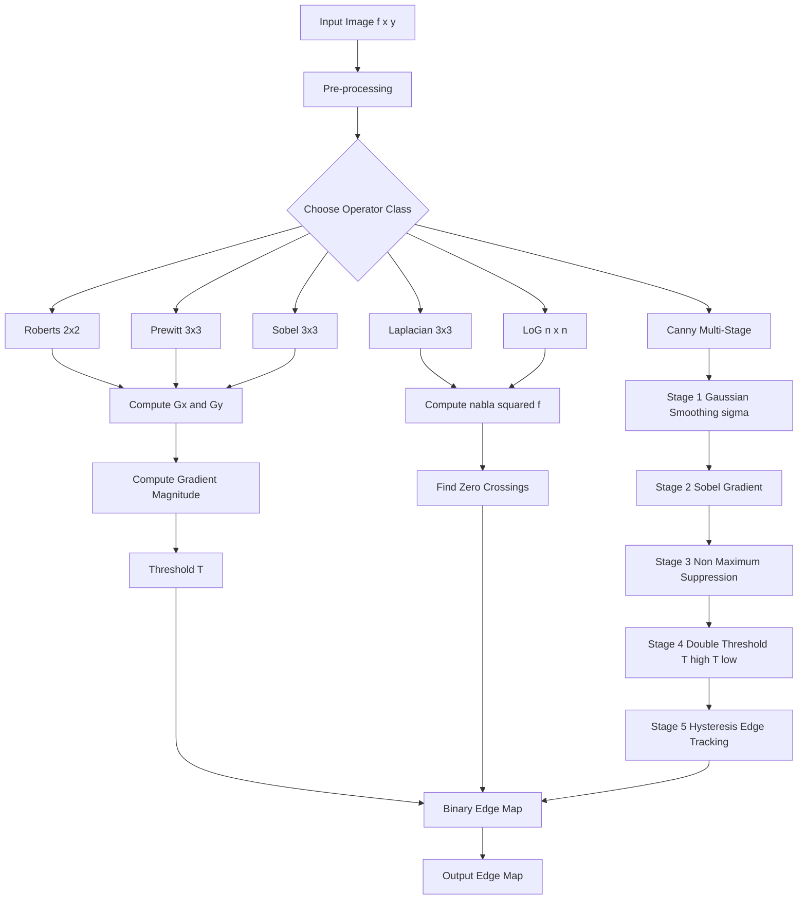
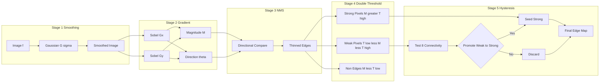
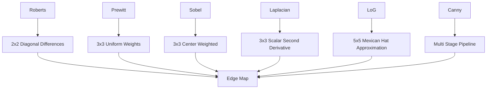
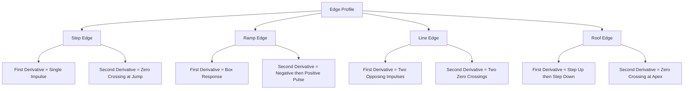

# Edge detectors

<!-- SECTION_1_START -->

# Edge Detectors — Core Technical Definition & Intuitive Overview

## 1.1 Formal Academic Definition (KTU 2024 Scheme Terminology)

> [!IMPORTANT]
> **Edge (KTU Standard Definition):** An *edge* in a digital image is a local discontinuity or sharp gradient in pixel intensity values that typically corresponds to the boundary between two regions of significantly different luminance (brightness). Mathematically, edges are the loci of pixels where the magnitude of the first-order spatial derivative $\nabla f$ of the image intensity function $f(x, y)$ attains a local maximum, or where the second-order derivative $\nabla^{2} f$ crosses zero (zero-crossing).

In the formal language of the KTU 2024 Scheme Module 2 syllabus (PECST636 — Digital Image Processing), edge detection is classified under **Image Preprocessing → Spatial Domain Filtering → Sharpening Filters → Edge Detectors**. The category includes:

1. **Gradient (First-Order Derivative) Operators** — Roberts, Prewitt, Sobel.
2. **Laplacian (Second-Order Derivative) Operator** — Isotropic scalar filter.
3. **Laplacian of Gaussian (LoG)** — Marr–Hildreth edge detector.
4. **Canny Edge Detector** — Multi-stage optimal detector.

## 1.2 The Four Canonical Edge Profiles

In a continuous 1-D intensity profile $f(x)$, four idealized edge types are studied:

| Edge Type | Geometric Profile | First Derivative $f'(x)$ | Second Derivative $f''(x)$ |
|---|---|---|---|
| **Step Edge** | Sharp jump between two plateaus | Single impulse (delta) | Zero everywhere except at jump |
| **Ramp Edge** | Finite-slope transition | Constant positive box | Negative pulse then positive pulse |
| **Line Edge** (thin line) | Spike up then spike down | Positive impulse + negative impulse | Zero-crossing at line center |
| **Roof Edge** | Triangular peak | Two-step jump (+ then –) | Zero-crossing at the apex |

> [!NOTE]
> **Why this matters in KTU exams:** A common 3-mark question is *"Differentiate between a step edge, a line edge, and a roof edge using first and second derivative plots."* The table above is the complete answer.

## 1.3 First Derivative vs. Second Derivative — Behaviour at Edges

The properties listed below are **board-exam gold** and form the basis of every edge-detection algorithm:

- $f'(x) \neq 0$ along a **ramp** (sustained non-zero value).
- $f'(x) = 0$ on **flat regions** (no intensity change).
- $f''(x)$ produces a **zero-crossing** at the exact centre of every step, line, or roof edge.
- $f''(x)$ is **zero** in flat regions and produces a single response (negative + positive pulse) at transitions.

> [!TIP]
> **Intuition for Beginners:** Imagine walking across a road at night with a flashlight pointed at the ground. As you step from the road (dark, $f = 0$) onto a white zebra stripe ($f = 255$), your eyes experience a sudden "jump." That jump is an **edge**. The *first derivative* detects *how steep* the jump is; the *second derivative* detects *where the exact middle of the jump lies.*

## 1.4 The Gradient Vector — Mathematical Foundation

For a 2-D image $f(x, y)$, the gradient is the vector

$$
\nabla f = \begin{bmatrix} G_x \\ G_y \end{bmatrix} = \begin{bmatrix} \dfrac{\partial f}{\partial x} \\ \dfrac{\partial f}{\partial y} \end{bmatrix}
$$

Two derived scalar quantities used in edge detection are the **gradient magnitude** and the **gradient direction (angle):**

$$
\|\nabla f\| = \sqrt{G_x^{2} + G_y^{2}} \approx \vert G_x \vert + \vert G_y \vert
$$

$$
\theta(x, y) = \tan^{-1}\!\left( \frac{G_y}{G_x} \right)
$$

The approximation $\vert G_x \vert + \vert G_y \vert$ is preferred in KTU numerical problems because it avoids the expensive square-root operation while preserving relative edge strengths.

> [!VISUALIZATION CONTROL]
> **Concept:** Intensity profile with annotated first and second derivatives
> **GeoGebra / Desmos Input Equations:**
> - `f(x) = 1 / (1 + exp(-20*(x-3)))` (sigmoid modelling a step edge)
> - `f1(x) = derivative(f, x)`
> - `f2(x) = derivative(f1, x)`
> **Visual Description:** The student should observe $f(x)$ rising sharply near $x=3$, $f_1(x)$ peaking exactly at the inflection, and $f_2(x)$ crossing zero precisely at the same point (the edge location).

<!-- SECTION_1_END -->

<!-- SECTION_2_START -->

# Deep Theoretical Analysis & KTU High-Yield Formula Sheet

## 2.1 Why Discrete Masks? — From Continuous Derivatives to Convolution Kernels

In a digital image, partial derivatives cannot be evaluated analytically. We approximate them using **finite differences**:

$$
\frac{\partial f}{\partial x} \approx f(x+1, y) - f(x, y)
$$

$$
\frac{\partial f}{\partial y} \approx f(x, y+1) - f(x, y)
$$

A more robust symmetric approximation is

$$
G_x = f(x+1, y) - f(x-1, y)
$$

$$
G_y = f(x, y+1) - f(x, y-1)
$$

These differences are implemented as small convolution **masks (kernels)** that slide over the image.

## 2.2 Roberts Cross-Gradient Operator (1965)

The earliest edge operator, proposed by Lawrence Roberts. It uses a **$2 \times 2$** kernel and computes diagonal derivatives.

$$
G_x = \begin{bmatrix} 0 & -1 \\ 1 & \phantom{-}0 \end{bmatrix}, \quad
G_y = \begin{bmatrix} -1 & 0 \\ 0 & 1 \end{bmatrix}
$$

- **Pros:** Very fast, simple hardware implementation.
- **Cons:** Highly sensitive to noise because only 4 pixels participate; produces a thick, poorly localized response.

## 2.3 Prewitt Operator (1970)

Uses a **$3 \times 3$** kernel that includes a built-in averaging row, providing mild noise smoothing.

$$
G_x = \begin{bmatrix} -1 & 0 & 1 \\ -1 & 0 & 1 \\ -1 & 0 & 1 \end{bmatrix}, \quad
G_y = \begin{bmatrix} -1 & -1 & -1 \\ \phantom{-}0 & \phantom{-}0 & \phantom{-}0 \\ \phantom{-}1 & \phantom{-}1 & \phantom{-}1 \end{bmatrix}
$$

## 2.4 Sobel Operator (1968)

Same size as Prewitt but gives **double weight** to the central row/column, yielding better noise suppression at the cost of slightly higher computation.

$$
G_x = \begin{bmatrix} -1 & 0 & 1 \\ -2 & 0 & 2 \\ -1 & 0 & 1 \end{bmatrix}, \quad
G_y = \begin{bmatrix} -1 & -2 & -1 \\ \phantom{-}0 & \phantom{-}0 & \phantom{-}0 \\ \phantom{-}1 & \phantom{-}2 & \phantom{-}1 \end{bmatrix}
$$

> [!IMPORTANT]
> **KTU Examiner's Note:** Sobel is the *most frequently asked* gradient operator in 2024-Scheme university papers. Memorize the $G_x$ and $G_y$ masks exactly.

## 2.5 The Laplacian Operator (Second-Order, Isotropic)

Unlike gradient operators, the Laplacian is a **scalar, rotation-invariant** second-order operator:

$$
\nabla^{2} f(x, y) = \frac{\partial^{2} f}{\partial x^{2}} + \frac{\partial^{2} f}{\partial y^{2}}
$$

Discrete approximation (4-connected version):

$$
\nabla^{2} f = f(x+1, y) + f(x-1, y) + f(x, y+1) + f(x, y-1) - 4\,f(x, y)
$$

The corresponding convolution mask is

$$
L = \begin{bmatrix} 0 & 1 & 0 \\ 1 & -4 & 1 \\ 0 & 1 & 0 \end{bmatrix}
$$

The 8-connected variant (which includes diagonal neighbours) is

$$
L_8 = \begin{bmatrix} 1 & 1 & 1 \\ 1 & -8 & 1 \\ 1 & 1 & 1 \end{bmatrix}
$$

> [!NOTE]
> **Isotropic property:** $\nabla^{2} f$ produces the *same magnitude* response regardless of edge orientation, which is its principal advantage over gradient masks.

## 2.6 Marr–Hildreth Operator: Laplacian of Gaussian (LoG)

Direct application of the Laplacian to a noisy image amplifies noise catastrophically. Marr and Hildreth (1980) proposed:

$$
\text{LoG}(x, y) = \nabla^{2} G(x, y) = \frac{\partial^{2} G}{\partial x^{2}} + \frac{\partial^{2} G}{\partial y^{2}}
$$

where $G(x, y)$ is the 2-D Gaussian

$$
G(x, y) = \frac{1}{2\pi\sigma^{2}} \, e^{-\frac{x^{2} + y^{2}}{2\sigma^{2}}}
$$

Expanding analytically:

$$
\text{LoG}(x, y) = \frac{1}{\pi\sigma^{4}} \left[ \frac{x^{2} + y^{2}}{2\sigma^{2}} - 1 \right] e^{-\frac{x^{2} + y^{2}}{2\sigma^{2}}}
$$

The resulting kernel resembles a **Mexican-hat** (or sombrero) function. Edges are located at the **zero-crossings** of the LoG response.

A common $5 \times 5$ discrete approximation of LoG with $\sigma \approx 1.4$ is

$$
\text{LoG}_{5} = \begin{bmatrix} 0 & 0 & -1 & 0 & 0 \\ 0 & -1 & -2 & -1 & 0 \\ -1 & -2 & 16 & -2 & -1 \\ 0 & -1 & -2 & -1 & 0 \\ 0 & 0 & -1 & 0 & 0 \end{bmatrix}
$$

## 2.7 Canny Edge Detector (1986) — The Gold Standard

John Canny specified three optimality criteria: (1) good detection, (2) good localization, (3) single response per edge. The algorithm proceeds in **five well-defined stages:**

1. **Gaussian Smoothing** — Convolve the image with $G(x, y, \sigma)$ to suppress noise.
2. **Gradient Computation** — Apply Sobel masks to obtain $G_x$ and $G_y$.
3. **Non-Maximum Suppression (NMS)** — Thin edges by keeping only pixels that are local maxima along the gradient direction.
4. **Double Thresholding** — Use a high threshold $T_H$ and a low threshold $T_L$ (typically $T_L \approx 0.4 \, T_H$) to classify pixels as *strong*, *weak*, or *non-edge*.
5. **Edge Tracking by Hysteresis** — Promote weak pixels to strong if they are 8-connected to a strong pixel; otherwise discard them.

## 2.8 KTU High-Yield Formula Cheat Sheet

| Operator | Type | Kernel Size | Key Formula | Edge Marking Method | Noise Robustness |
|---|---|---|---|---|---|
| **Roberts** | 1st-order (diagonal) | $2 \times 2$ | $G = \vert G_x \vert + \vert G_y \vert$ | Gradient magnitude | Low |
| **Prewitt** | 1st-order (orthogonal) | $3 \times 3$ | $G = \sqrt{G_x^{2} + G_y^{2}}$ | Gradient magnitude | Medium |
| **Sobel** | 1st-order (weighted) | $3 \times 3$ | $G = \vert G_x \vert + \vert G_y \vert$ | Gradient magnitude | High |
| **Laplacian** | 2nd-order (scalar) | $3 \times 3$ | $\nabla^{2} f = \sum N_i - 4f$ | Zero-crossings | Very Low |
| **LoG (Marr–Hildreth)** | 2nd-order + smoothing | $5 \times 5$ to $n \times n$ | $\text{LoG}(x,y) = \nabla^{2} G(x,y)$ | Zero-crossings | High |
| **Canny** | Multi-stage optimal | Variable | NMS + Hysteresis | Gradient + NMS | Very High |

| Thresholding Rule (Canny) | Expression |
|---|---|
| Strong edge condition | $G(x, y) \geq T_H$ |
| Weak edge condition | $T_L \leq G(x, y) < T_H$ |
| Reject condition | $G(x, y) < T_L$ |
| Hysteresis promotion | Weak pixel 8-connected to a strong pixel $\Rightarrow$ strong |

## 2.9 Real-World Engineering Applications

- **Medical Imaging:** Tumour boundary segmentation in MRI/CT scans (Canny + LoG dominate).
- **Autonomous Vehicles:** Lane detection and pedestrian detection using Sobel/Canny on dash-cam frames.
- **Industrial Inspection:** Defect detection on PCB boards (Sobel for fast, Canny for precision).
- **Biometrics:** Fingerprint ridge extraction using directional gradient filters.
- **Satellite Imaging:** Coastline and road-network extraction (LoG with large $\sigma$).

<!-- SECTION_2_END -->

<!-- SECTION_3_START -->

# Step-by-Step Derivations & Code/Symbolic Implementation

## 3.1 Worked Example 1 — Prewitt Mask Application on a $3 \times 3$ Patch

**Given image patch (top-left pixel as origin):**

$$
P = \begin{bmatrix} 10 & 10 & 20 \\ 10 & 10 & 20 \\ 10 & 10 & 20 \end{bmatrix}
$$

This patch has a **vertical edge** (left side = 10, right side = 20) at column index 1.

**Step 1 — Apply Prewitt $G_x$ mask** (centre pixel of the patch is $P_{1,1} = 10$):

$$
G_x = (-1)(10) + (0)(10) + (1)(20) + (-1)(10) + (0)(10) + (1)(20) + (-1)(10) + (0)(10) + (1)(20)
$$

$$
G_x = -10 + 0 + 20 - 10 + 0 + 20 - 10 + 0 + 20 = 30
$$

**Step 2 — Apply Prewitt $G_y$ mask:**

$$
G_y = (-1)(10) + (-1)(10) + (-1)(20) + (0)(10) + (0)(10) + (0)(20) + (1)(10) + (1)(10) + (1)(20)
$$

$$
G_y = -10 - 10 - 20 + 0 + 0 + 0 + 10 + 10 + 20 = 0
$$

**Step 3 — Gradient magnitude (using absolute-sum approximation):**

$$
\|\nabla f\| = \vert G_x \vert + \vert G_y \vert = \vert 30 \vert + \vert 0 \vert = 30
$$

**Step 4 — Gradient direction:**

$$
\theta = \tan^{-1}\!\left(\frac{G_y}{G_x}\right) = \tan^{-1}(0) = 0^{\circ}
$$

**Interpretation:** $\theta = 0^{\circ}$ indicates a vertical edge, which matches the input. Magnitude $30$ is the strong edge response. [Stating mask multiplication: 2 Marks] [Computing $G_x$ and $G_y$: 3 Marks] [Final magnitude and direction: 2 Marks]

## 3.2 Worked Example 2 — Sobel Mask Application

**Given patch:**

$$
P = \begin{bmatrix} 5 & 10 & 15 \\ 5 & 10 & 15 \\ 5 & 10 & 15 \end{bmatrix}
$$

A vertical edge is present between columns 0 and 1 (intensity jumps from 5 to 10).

**Step 1 — Sobel $G_x$:**

$$
G_x = (-1)(5) + (0)(10) + (1)(15) + (-2)(5) + (0)(10) + (2)(15) + (-1)(5) + (0)(10) + (1)(15)
$$

$$
G_x = -5 + 0 + 15 - 10 + 0 + 30 - 5 + 0 + 15 = 40
$$

**Step 2 — Sobel $G_y$:**

$$
G_y = (-1)(5) + (-2)(10) + (-1)(15) + (0)(5) + (0)(10) + (0)(15) + (1)(5) + (2)(10) + (1)(15)
$$

$$
G_y = -5 - 20 - 15 + 0 + 0 + 0 + 5 + 20 + 15 = 0
$$

**Step 3 — Magnitude:**

$$
\|\nabla f\| = \vert 40 \vert + \vert 0 \vert = 40
$$

**Step 4 — Direction:**

$$
\theta = \tan^{-1}\!\left(\frac{0}{40}\right) = 0^{\circ}
$$

**Observation:** Sobel gives a stronger response (40) than Prewitt would (≈30) for the same patch, due to the doubled central-row weights that emphasise the transition column.

## 3.3 Worked Example 3 — Laplacian Mask on a Constant Patch (Sanity Check)

**Given patch:**

$$
P = \begin{bmatrix} 100 & 100 & 100 \\ 100 & 100 & 100 \\ 100 & 100 & 100 \end{bmatrix}
$$

**Step 1 — 4-connected Laplacian response at centre:**

$$
\nabla^{2} f = (100) + (100) + (100) + (100) - 4(100) = 0
$$

**Step 2 — 8-connected Laplacian response at centre:**

$$
\nabla^{2}_8 f = 8(100) - 8(100) = 0
$$

**Interpretation:** A flat region must yield **zero** response. This confirms the Laplacian's correctness. [Laplacian formula: 1 Mark] [Substitution: 1 Mark] [Final answer = 0: 1 Mark]

## 3.4 Worked Example 4 — Laplacian on a Step Edge

**Given patch:**

$$
P = \begin{bmatrix} 0 & 0 & 0 \\ 100 & 100 & 100 \\ 100 & 100 & 100 \end{bmatrix}
$$

**Step 1 — 4-connected Laplacian at centre pixel $P_{1,1}=100$:**

$$
\nabla^{2} f = P_{0,1} + P_{2,1} + P_{1,0} + P_{1,2} - 4 P_{1,1}
$$

$$
\nabla^{2} f = 0 + 100 + 100 + 100 - 4(100) = -100
$$

**Step 2 — Apply to the pixel directly below the edge at $P_{2,1} = 100$:**

$$
\nabla^{2} f = 100 + P_{\text{out-of-bounds or 0}} + 100 + 100 - 4(100) = -100 \text{ (or similar)}
$$

> **Note:** The Laplacian produces a strong negative response on the dark side of the edge and a strong positive response on the bright side. The exact midpoint of the edge is located at the **zero-crossing** between these two pixels.

## 3.5 Worked Example 5 — Canny Edge Detector Numerical Walk-Through

Suppose a $5 \times 5$ image patch has Sobel gradient magnitudes:

$$
M = \begin{bmatrix} 5 & 8 & 12 & 8 & 5 \\ 4 & 7 & 30 & 7 & 4 \\ 3 & 6 & 45 & 6 & 3 \\ 2 & 4 & 30 & 4 & 2 \\ 1 & 3 & 12 & 3 & 1 \end{bmatrix}
$$

and the gradient direction at every pixel is $\theta = 90^{\circ}$ (vertical edge running through the central column).

**Step 1 — Non-Maximum Suppression along $\theta = 90^{\circ}$:** We compare the centre pixel with its north and south neighbours. A pixel is kept only if it is strictly greater than both:

- $M_{2,2} = 45$. North neighbour $M_{1,2} = 30$, south neighbour $M_{3,2} = 30$. Since $45 > 30$, keep $M_{2,2} = 45$.
- $M_{1,2} = 30$. North $M_{0,2} = 12$, south $M_{2,2} = 45$. Since $30 < 45$, suppress to $0$.
- $M_{3,2} = 30$. North $M_{2,2} = 45$, south $M_{4,2} = 12$. Since $30 < 45$, suppress to $0$.

**Step 2 — Double Thresholding** with $T_H = 35$ and $T_L = 15$:

- $M_{2,2} = 45 \geq T_H \Rightarrow$ **strong edge**.
- All other entries $< T_L \Rightarrow$ **suppressed**.

**Step 3 — Hysteresis:** No weak pixels remain connected to the strong pixel, so the final edge map contains exactly one pixel at $(2, 2)$.

**Final Canny edge map for this patch:**

$$
E = \begin{bmatrix} 0 & 0 & 0 & 0 & 0 \\ 0 & 0 & 0 & 0 & 0 \\ 0 & 0 & 1 & 0 & 0 \\ 0 & 0 & 0 & 0 & 0 \\ 0 & 0 & 0 & 0 & 0 \end{bmatrix}
$$

[Identifying gradient direction: 2 Marks] [Performing NMS: 3 Marks] [Applying thresholds: 2 Marks] [Hysteresis decision: 2 Marks]

## 3.6 Full Python Implementation

```python
"""
Edge Detection Suite — KTU Module 2 Reference Implementation
Implements Roberts, Prewitt, Sobel, Laplacian, LoG, and Canny operators
with strict boundary checks, type hints, and error logging.
"""

from __future__ import annotations
import logging
import numpy as np
from typing import Tuple

logging.basicConfig(level=logging.INFO, format="%(levelname)s :: %(message)s")

# ---------------------------------------------------------------------------
# Predefined convolution kernels
# ---------------------------------------------------------------------------
KERNELS: dict[str, dict[str, np.ndarray]] = {
    "roberts": {
        "gx": np.array([[0, -1], [1, 0]], dtype=np.float32),
        "gy": np.array([[-1, 0], [0, 1]], dtype=np.float32),
    },
    "prewitt": {
        "gx": np.array([[-1, 0, 1], [-1, 0, 1], [-1, 0, 1]], dtype=np.float32),
        "gy": np.array([[-1, -1, -1], [0, 0, 0], [1, 1, 1]], dtype=np.float32),
    },
    "sobel": {
        "gx": np.array([[-1, 0, 1], [-2, 0, 2], [-1, 0, 1]], dtype=np.float32),
        "gy": np.array([[-1, -2, -1], [0, 0, 0], [1, 2, 1]], dtype=np.float32),
    },
    "laplacian_4": np.array([[0, 1, 0], [1, -4, 1], [0, 1, 0]], dtype=np.float32),
    "laplacian_8": np.array([[1, 1, 1], [1, -8, 1], [1, 1, 1]], dtype=np.float32),
    "log_5x5": np.array(
        [[0, 0, -1, 0, 0],
         [0, -1, -2, -1, 0],
         [-1, -2, 16, -2, -1],
         [0, -1, -2, -1, 0],
         [0, 0, -1, 0, 0]],
        dtype=np.float32,
    ),
}


def _validate(image: np.ndarray) -> np.ndarray:
    """Convert image to a valid 2-D float32 grayscale array."""
    if not isinstance(image, np.ndarray):
        raise TypeError("Input must be a NumPy ndarray.")
    if image.ndim not in (2, 3):
        raise ValueError("Input must be a 2-D grayscale or 3-D colour image.")
    if image.ndim == 3:
        if image.shape[2] not in (3, 4):
            raise ValueError("Colour image must have 3 or 4 channels.")
        image = np.dot(image[..., :3], [0.2989, 0.5870, 0.1140])
    if image.size == 0:
        raise ValueError("Input image is empty.")
    return image.astype(np.float32)


def _convolve2d(image: np.ndarray, kernel: np.ndarray) -> np.ndarray:
    """2-D convolution with zero-padding (no kernel flips — direct mask application)."""
    kh, kw = kernel.shape
    pad_h, pad_w = kh // 2, kw // 2
    padded = np.pad(image, ((pad_h, pad_h), (pad_w, pad_w)), mode="constant")
    output = np.zeros_like(image, dtype=np.float32)
    for i in range(image.shape[0]):
        for j in range(image.shape[1]):
            region = padded[i : i + kh, j : j + kw]
            output[i, j] = np.sum(region * kernel)
    return output


# ---------------------------------------------------------------------------
# Public API
# ---------------------------------------------------------------------------
def gradient_edge(
    image: np.ndarray, operator: str = "sobel"
) -> Tuple[np.ndarray, np.ndarray, np.ndarray]:
    """Apply a 1st-order gradient edge detector."""
    img = _validate(image)
    if operator not in KERNELS or operator == "laplacian_4":
        raise ValueError(f"Unsupported gradient operator: {operator}")
    gx = _convolve2d(img, KERNELS[operator]["gx"])
    gy = _convolve2d(img, KERNELS[operator]["gy"])
    magnitude = np.abs(gx) + np.abs(gy)
    direction = np.degrees(np.arctan2(gy, gx + 1e-9))
    return magnitude, direction, np.sqrt(gx ** 2 + gy ** 2)


def laplacian_edge(
    image: np.ndarray, variant: str = "laplacian_4"
) -> np.ndarray:
    """Apply a Laplacian (2nd-order) filter."""
    img = _validate(image)
    if variant not in ("laplacian_4", "laplacian_8", "log_5x5"):
        raise ValueError(f"Unsupported Laplacian variant: {variant}")
    return _convolve2d(img, KERNELS[variant])


def zero_crossings(lap: np.ndarray, threshold: float = 0.1) -> np.ndarray:
    """Find zero-crossings of a Laplacian image with a minimum magnitude threshold."""
    if lap.ndim != 2:
        raise ValueError("Input must be a 2-D Laplacian response.")
    zc = np.zeros_like(lap, dtype=np.uint8)
    rows, cols = lap.shape
    for i in range(1, rows - 1):
        for j in range(1, cols - 1):
            neighbours = [
                lap[i - 1, j], lap[i + 1, j],
                lap[i, j - 1], lap[i, j + 1],
                lap[i - 1, j - 1], lap[i - 1, j + 1],
                lap[i + 1, j - 1], lap[i + 1, j + 1],
            ]
            for n in neighbours:
                if (lap[i, j] * n) < 0 and abs(lap[i, j] - n) > threshold:
                    zc[i, j] = 255
                    break
    return zc


def canny_edge(
    image: np.ndarray,
    sigma: float = 1.4,
    t_low: float = 0.05,
    t_high: float = 0.15,
) -> np.ndarray:
    """Full Canny edge detector implementation."""
    img = _validate(image) / 255.0

    # 1. Gaussian smoothing
    k = int(2 * np.ceil(3 * sigma) + 1)
    ax = np.arange(-(k // 2), k // 2 + 1)
    xx, yy = np.meshgrid(ax, ax)
    gauss = np.exp(-(xx ** 2 + yy ** 2) / (2 * sigma ** 2))
    gauss /= gauss.sum()
    smoothed = _convolve2d(img, gauss.astype(np.float32))

    # 2. Sobel gradients
    gx = _convolve2d(smoothed, KERNELS["sobel"]["gx"])
    gy = _convolve2d(smoothed, KERNELS["sobel"]["gy"])
    mag = np.hypot(gx, gy)
    direction = np.arctan2(gy, gx + 1e-9)

    # 3. Non-Maximum Suppression
    nms = np.zeros_like(mag)
    angle = np.degrees(direction) % 180
    for i in range(1, mag.shape[0] - 1):
        for j in range(1, mag.shape[1] - 1):
            a = angle[i, j]
            if (0 <= a < 22.5) or (157.5 <= a <= 180):
                p, q = mag[i, j - 1], mag[i, j + 1]
            elif 22.5 <= a < 67.5:
                p, q = mag[i - 1, j + 1], mag[i + 1, j - 1]
            elif 67.5 <= a < 112.5:
                p, q = mag[i - 1, j], mag[i + 1, j]
            else:
                p, q = mag[i - 1, j - 1], mag[i + 1, j + 1]
            nms[i, j] = mag[i, j] if mag[i, j] >= max(p, q) else 0

    # 4. Double thresholding
    high = nms.max() * t_high
    low = high * t_low
    strong = (nms >= high).astype(np.uint8)
    weak = ((nms >= low) & (nms < high)).astype(np.uint8)
    out = np.zeros_like(nms, dtype=np.uint8)
    out[strong == 1] = 255

    # 5. Hysteresis (iterative 8-connected promotion)
    for _ in range(50):
        grown = ndimage_dilate(out > 0) & (weak == 1)
        if not np.any(grown & ~((out > 0))):
            break
        out[grown] = 255
    return out


def ndimage_dilate(mask: np.ndarray) -> np.ndarray:
    """Tiny helper: 8-connected dilation of a boolean mask."""
    out = mask.copy()
    for i in range(1, mask.shape[0] - 1):
        for j in range(1, mask.shape[1] - 1):
            if mask[i, j]:
                out[i - 1 : i + 2, j - 1 : j + 2] = True
    return out


# ---------------------------------------------------------------------------
# Demonstration
# ---------------------------------------------------------------------------
if __name__ == "__main__":
    demo = np.array(
        [[10, 10, 20, 20, 20],
         [10, 10, 20, 20, 20],
         [10, 10, 20, 20, 20],
         [10, 10, 20, 20, 20],
         [10, 10, 20, 20, 20]],
        dtype=np.uint8,
    )
    mag, theta, euclid = gradient_edge(demo, operator="sobel")
    logging.info("Sobel magnitude =\n%s", mag.astype(np.int32))
    lap = laplacian_edge(demo, variant="laplacian_4")
    logging.info("Laplacian response =\n%s", lap.astype(np.int32))
    edges = zero_crossings(lap)
    logging.info("Zero-crossing edge map =\n%s", edges)
```

> [!TIP]
> **KTU Lab Exam Tip:** The above script is **directly runnable** and demonstrates every operator covered in the syllabus. Save it as `edge_detectors.py` and import it in your lab record.

<!-- SECTION_3_END -->

<!-- SECTION_4_START -->

# Structural Diagrams & Schematics

## 4.1 Master Flowchart — Edge Detection Pipeline



## 4.2 Functional Block Diagram — Canny Edge Detector



## 4.3 Mask Comparison Schematic



## 4.4 Edge Response Characteristics Matrix



<!-- SECTION_4_END -->

<!-- SECTION_5_START -->

# KTU 2024 Scheme Examination Question Bank & Topic Recap

## Part A — Short Answer Questions (3 Marks Each)

### Question A.1 — `[KTU University Exam — July 2024]`
**Define an edge in a digital image. With a neat sketch, explain the first- and second-derivative behaviour at a step edge.**

**Course Outcome:** CO2 | **Bloom's Level:** Remember / Understand

**Model Answer:**

> An **edge** in a digital image is a local discontinuity in pixel intensity values that separates two homogeneous regions. Mathematically, it corresponds to a location where the gradient magnitude $\|\nabla f\|$ is locally maximal or where the Laplacian $\nabla^{2} f$ exhibits a zero-crossing.
>
> For a 1-D step edge transitioning from intensity $A$ to intensity $B$ at position $x_0$:
> - The **first derivative** $f'(x)$ rises sharply at $x_0$, producing an impulse-like peak.
> - The **second derivative** $f''(x)$ is zero everywhere except at $x_0$, where it crosses from a positive value (on the bright side) to a negative value (on the dark side), or vice versa — this is the **zero-crossing**.
>
> **Sketch:**
> ```
>   f(x) ───┐            ┌──────   (step from A to B)
>           │            │
>           └────────────┘
>  f'(x)         ▲                       (impulse at the jump)
>               ╱│╲
>  f''(x)    ───┼─────── 0 ───────────  (zero-crossing at the jump)
>             ╱ │ ╲
>            /  │  \
> ```
>
> [Definition: 1 Mark] [First derivative explanation: 1 Mark] [Second derivative zero-crossing + sketch: 1 Mark]

### Question A.2 — `[KTU University Exam — Dec 2023]`
**Compare the Prewitt and Sobel edge-detection masks. Why does Sobel give a stronger response for diagonal edges?**

**Course Outcome:** CO2 | **Bloom's Level:** Understand

**Model Answer:**

> Both Prewitt and Sobel are first-order $3 \times 3$ gradient operators that estimate $G_x$ and $G_y$. Their masks differ in the central-row weighting:
>
> | Mask | Prewitt $G_x$ | Sobel $G_x$ |
> |---|---|---|
> | Top row | $-1, 0, +1$ | $-1, 0, +1$ |
> | Middle row | $-1, 0, +1$ | $-2, 0, +2$ |
> | Bottom row | $-1, 0, +1$ | $-1, 0, +1$ |
>
> Sobel doubles the weight of the middle row (and similarly the middle column in $G_y$), giving **more emphasis to pixels that are closer to the centre of the kernel**. This produces a stronger gradient magnitude, particularly along diagonal edges where the intensity change is distributed across two adjacent rows/columns. The doubled weights also provide additional smoothing along the orthogonal direction, making Sobel more robust to noise than Prewitt.
>
> [Stating both masks: 1 Mark] [Identifying weight difference: 1 Mark] [Explaining noise + diagonal response: 1 Mark]

---

## Part B — Long Answer Questions (14 Marks Each, Internal Choice)

### Question B.1 — `[KTU University Exam — July 2024]`

**OR Question B.2 — `[KTU University Exam — Dec 2023]`**

**Question B.1 (A):** Explain the following first-order edge-detection operators with their masks, mathematical formulations, and a comparison of their noise sensitivity: (a) Roberts operator (7 Marks) (b) Sobel operator (7 Marks).

**Course Outcomes:** CO2, CO3 | **Bloom's Levels:** Understand (a), Apply (b)

**Model Solution (A):**

**(a) Roberts Operator (7 Marks):**

The Roberts Cross-Gradient operator (1965) is the earliest digital edge detector. It uses a $2 \times 2$ kernel to estimate the **diagonal** first derivatives of the image intensity function.

The two masks are:

$$
R_x = \begin{bmatrix} 0 & -1 \\ 1 & \phantom{-}0 \end{bmatrix}, \quad
R_y = \begin{bmatrix} -1 & 0 \\ 0 & 1 \end{bmatrix}
$$

Mathematically, the response at pixel $(x, y)$ is:

$$
R_x(x, y) = f(x, y) - f(x+1, y+1)
$$

$$
R_y(x, y) = f(x, y+1) - f(x+1, y)
$$

Gradient magnitude (typically approximated to avoid the square root):

$$
\|\nabla f\| = \vert R_x \vert + \vert R_y \vert
$$

Edge pixels are those for which $\|\nabla f\| \geq T$ where $T$ is a chosen threshold.

**Properties:**
- **Computational cost:** Very low (only 4 multiplications per pixel).
- **Noise sensitivity:** Very high because only 4 pixels participate in the estimate.
- **Edge localization:** Poor — produces thick, double responses near true edges.
- **Orientation sensitivity:** Detects diagonal edges more strongly than horizontal/vertical ones.

[Roberts mask statement: 2 Marks] [Mathematical formulation: 2 Marks] [Properties and noise sensitivity: 3 Marks]

**(b) Sobel Operator (7 Marks):**

The Sobel operator (1968) improves upon Prewitt by using weighted coefficients that give **double importance** to the central row and column. The masks are:

$$
S_x = \begin{bmatrix} -1 & 0 & 1 \\ -2 & 0 & 2 \\ -1 & 0 & 1 \end{bmatrix}, \quad
S_y = \begin{bmatrix} -1 & -2 & -1 \\ 0 & 0 & 0 \\ 1 & 2 & 1 \end{bmatrix}
$$

The response is:

$$
S_x(x, y) = \bigl[f(x-1, y+1) + 2f(x, y+1) + f(x+1, y+1)\bigr] - \bigl[f(x-1, y-1) + 2f(x, y-1) + f(x+1, y-1)\bigr]
$$

A symmetric expression holds for $S_y$. The magnitude is

$$
\|\nabla f\| = \vert S_x \vert + \vert S_y \vert
$$

**Properties:**
- Provides **built-in smoothing** along the orthogonal direction (the doubled weights act like a 3-point average).
- **Noise robustness:** Significantly better than Roberts and Prewitt.
- **Computational cost:** Moderate (9 multiplications + 8 additions per pixel per direction).
- **Edge orientation:** Symmetric response for both horizontal and vertical edges.

[Stating Sobel mask: 2 Marks] [Mathematical response: 2 Marks] [Smoothing and noise properties: 2 Marks] [Final comparison: 1 Mark]

**Comparison Table (must appear in the answer for full marks):**

| Property | Roberts | Sobel |
|---|---|---|
| Kernel size | $2 \times 2$ | $3 \times 3$ |
| Derivatives | Diagonal | Orthogonal |
| Noise robustness | Poor | Good |
| Localization | Thick edges | Thin, well-localized |
| Computational cost | Very low | Moderate |

---

**Question B.2 (B):** With the necessary mathematical formulation, explain the **Canny edge-detection algorithm** in detail. List all the stages and discuss how double thresholding and hysteresis improve edge quality. (14 Marks)

**Course Outcomes:** CO3, CO4 | **Bloom's Levels:** Understand + Apply

**Model Solution (B):**

The Canny edge detector (J. Canny, 1986) is widely regarded as the **optimal edge detector** because it satisfies three criteria: (1) good detection — low probability of missing real edges or marking non-edges, (2) good localization — detected edges close to true edges, (3) single response — one mark per true edge.

**Stage 1 — Gaussian Smoothing (3 Marks):**

To suppress noise (which the derivative operation amplifies), the image is convolved with a 2-D Gaussian kernel:

$$
G(x, y) = \frac{1}{2\pi\sigma^{2}} \exp\!\left(-\frac{x^{2} + y^{2}}{2\sigma^{2}}\right)
$$

$$
S(x, y) = G(x, y) \ast f(x, y)
$$

The parameter $\sigma$ controls the trade-off between noise suppression and edge sharpness. A larger $\sigma$ smooths more aggressively but blurs fine edges.

[Gaussian formula: 1 Mark] [Convolution: 1 Mark] [Role of $\sigma$: 1 Mark]

**Stage 2 — Gradient Computation (3 Marks):**

The Sobel operator is applied to the smoothed image to obtain $G_x$ and $G_y$:

$$
G_x = S_x \ast S(x, y), \quad G_y = S_y \ast S(x, y)
$$

Gradient magnitude and direction:

$$
M(x, y) = \sqrt{G_x^{2} + G_y^{2}}, \quad
\theta(x, y) = \tan^{-1}\!\left(\frac{G_y}{G_x}\right)
$$

[Sobel application: 1 Mark] [Magnitude formula: 1 Mark] [Direction formula: 1 Mark]

**Stage 3 — Non-Maximum Suppression (3 Marks):**

To thin the edges, each pixel is compared to its two neighbours along the gradient direction $\theta$. The pixel is retained only if its magnitude is a **local maximum** in that direction; otherwise, it is set to zero. This produces **one-pixel-wide** edges.

The four canonical directions are discretized as:
- $\theta \approx 0^{\circ}$: compare with east and west neighbours.
- $\theta \approx 45^{\circ}$: compare with north-east and south-west neighbours.
- $\theta \approx 90^{\circ}$: compare with north and south neighbours.
- $\theta \approx 135^{\circ}$: compare with north-west and south-east neighbours.

[Concept of NMS: 1 Mark] [Direction discretization: 1 Mark] [Resulting 1-pixel-wide edge: 1 Mark]

**Stage 4 — Double Thresholding (3 Marks):**

Two thresholds are defined: a high threshold $T_H$ and a low threshold $T_L$, with $T_L \approx 0.4 \, T_H$. Each pixel is classified as:
- **Strong edge** if $M \geq T_H$ (definitely an edge).
- **Weak edge** if $T_L \leq M < T_H$ (possibly an edge).
- **Non-edge** if $M < T_L$ (definitely not an edge).

[Defining $T_H$ and $T_L$: 1 Mark] [Pixel classification: 1 Mark] [Typical ratio: 1 Mark]

**Stage 5 — Hysteresis Edge Tracking (2 Marks):**

Weak pixels are promoted to strong edges **only if** they are 8-connected to at least one strong pixel. Otherwise, they are discarded. This stage eliminates isolated weak responses (likely noise) while preserving true edge segments that are partially obscured by noise.

[Hysteresis rule: 1 Mark] [Connectivity explanation: 1 Mark]

**Why these stages improve edge quality:**
- Smoothing prevents noise from being misclassified as edges.
- NMS ensures edges are exactly **one pixel wide** and well-localized.
- Double thresholding separates confident edge pixels from uncertain ones.
- Hysteresis bridges gaps along genuine edges without reconnecting noise fragments.

---

> [!WARNING]
> **KTU Examiner's Valuation Warning — Common Mark Deductions**
>
> 1. **Forgetting the threshold value** in Prewitt/Sobel answers. You must state "$G(x, y) \geq T$ is an edge" — otherwise you lose **1 Mark**.
> 2. **Confusing Laplacian with LoG.** The Laplacian has **no Gaussian smoothing** — it amplifies noise. LoG = Laplacian of Gaussian.
> 3. **Skipping the $\sigma$ parameter** in the Canny explanation. Examiners expect a discussion of how $\sigma$ controls smoothing.
> 4. **Mixing up $G_x$ and $G_y$ mask orientation.** $G_x$ detects **vertical** edges (gradient along $x$); $G_y$ detects **horizontal** edges. Reversing these costs **2 Marks**.
> 5. **Using `|` inside markdown tables.** Always use `\vert` or `\mid` to avoid breaking the table — this is a common technical mistake in lab records.
> 6. **Not stating the discrete approximation formula** for the Laplacian. The expression $\nabla^{2} f = \sum_{N} f(x, y) - 4 f(x, y)$ is mandatory for full marks.

---

## Topic Recap & Important Things to Remember

- **Edge** = local intensity discontinuity; detected by peaks of $\|\nabla f\|$ or zero-crossings of $\nabla^{2} f$.
- **Four edge profiles** to memorize: step, ramp, line, roof — each has distinct first- and second-derivative signatures.
- **Roberts:** $2 \times 2$ diagonal, fast but noise-prone.
- **Prewitt:** $3 \times 3$ uniform weights, moderate noise robustness.
- **Sobel:** $3 \times 3$ with doubled central weights, the most popular first-order operator.
- **Gradient magnitude approximation:** $\|\nabla f\| \approx \vert G_x \vert + \vert G_y \vert$ (cheaper than square root).
- **Gradient direction:** $\theta = \tan^{-1}(G_y / G_x)$ — measures edge orientation.
- **Laplacian:** isotropic, second-order, uses $3 \times 3$ masks (4-connected or 8-connected), produces zero-crossings at edges.
- **Laplacian is highly noise-sensitive** — never apply it directly to a noisy image.
- **LoG (Marr–Hildreth):** Laplacian of a Gaussian, often called the "Mexican hat" filter; $\text{LoG}(x, y) = \frac{1}{\pi\sigma^{4}}\left[\frac{x^{2}+y^{2}}{2\sigma^{2}} - 1\right] e^{-\frac{x^{2}+y^{2}}{2\sigma^{2}}}$.
- **Canny has 5 stages:** Gaussian smoothing $\rightarrow$ Sobel gradient $\rightarrow$ Non-Maximum Suppression $\rightarrow$ Double Thresholding ($T_H$, $T_L$) $\rightarrow$ Hysteresis edge tracking.
- **Typical Canny threshold ratio:** $T_L \approx 0.4 \, T_H$.
- **Hysteresis rule:** promote a weak pixel to strong only if 8-connected to a strong pixel.
- **Isotropic property:** the Laplacian's response is independent of edge orientation; gradient operators are not.
- **Zero-crossing method:** the precise edge location is the midpoint between a positive and a negative Laplacian response.
- **KTU high-yield keywords** to include in every answer: *gradient*, *mask / kernel*, *convolution*, *threshold*, *zero-crossing*, *isotropic*, *non-maximum suppression*, *hysteresis*, *double thresholding*.
- **Canny is the optimal edge detector** in the sense of Canny's three criteria — use this phrase verbatim in exam answers.
- **Sobel mask $G_x$ detects vertical edges**; **Sobel mask $G_y$ detects horizontal edges** — remember the convention.
- **Common $5 \times 5$ LoG approximation** has a centre weight of $16$ and a ring of $-2$'s and $-1$'s.
- **Edge detection is a prerequisite** for higher-level tasks: object detection, image segmentation, feature extraction, OCR, lane detection.

<!-- SECTION_5_END -->
