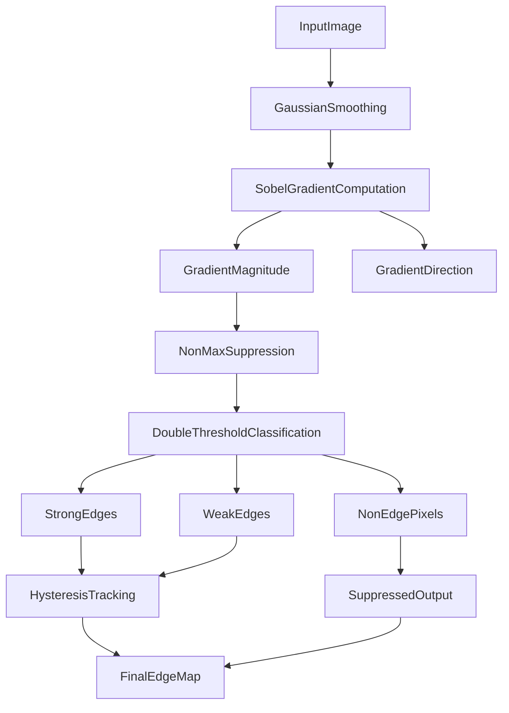
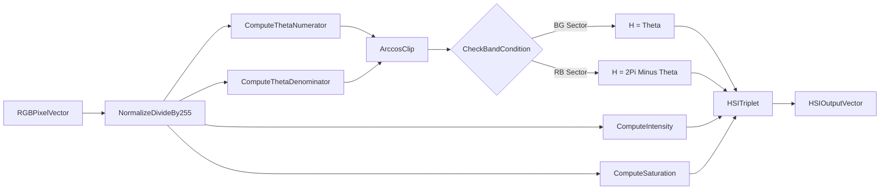
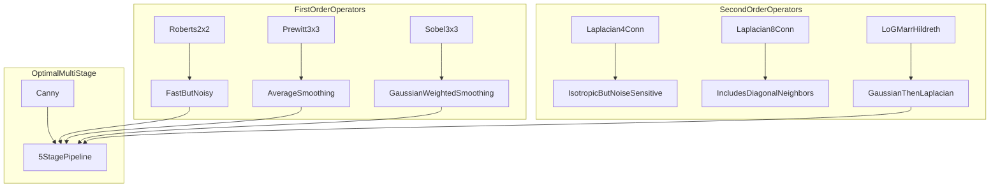
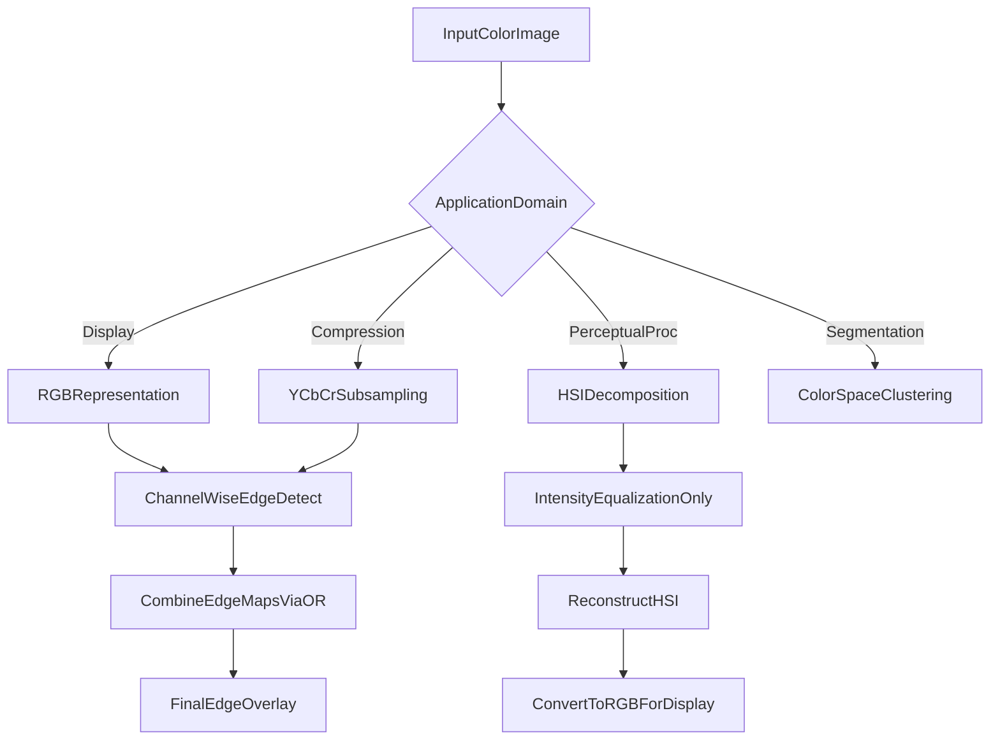

# Edges Multi-spectral images,

<!-- SECTION_1_START -->
# 1. Core Technical Definition & Intuitive Overview

## 1.1 Edge Detection in Digital Image Processing

### Formal Definition (KTU 2024 Terminology)
An **edge** in a digital image is a set of connected pixel locations where the image intensity function $f(x,y)$ exhibits a *sharp discontinuity*. Mathematically, edges correspond to local extrema of the first-order derivative or zero-crossings of the second-order derivative of the luminance function along the gradient direction. Edge detection is the process of identifying these discontinuities using gradient-based operators in the spatial domain.

> [!NOTE]
> **KTU Syllabus Highlight (Module 2):** Edge detection is a *segmentation primitive*. It reduces the image from a dense pixel matrix to a sparse set of structural boundary curves — a critical preprocessing step for object recognition, tracking, and medical imaging pipelines.

### Conceptual Analogy / Intuition
Imagine looking at a black-and-white pencil sketch drawn by an artist. The artist did **not** shade every pixel — instead, they drew *outlines*. Edge detection does the same thing mathematically: instead of storing the brightness of every pixel, it extracts only the *boundaries* where brightness changes abruptly. Think of a topographic map: edges are the "contour lines" where the terrain elevation suddenly shifts — they describe the shape of the world without painting every detail.

> [!IMPORTANT]
> **Core Principle:** An edge is a *local* property. A single pixel is an edge candidate if and only if its neighborhood gradient magnitude exceeds a *threshold* $T$ relative to a chosen operator $G(x,y)$.

### Edge Profile Types
| Profile Type | Description | Physical Example |
|--------------|-------------|------------------|
| Step Edge | Abrupt intensity change between two regions | Object boundary against a uniform background |
| Ramp Edge | Finite-slope transition (blurred) | Defocused object boundary |
| Line Edge | Thin bright/dark line on uniform background | Highway lane markings, blood vessel |
| Roof Edge | Triangular peak (junction of two regions) | Ridge of a 3D object under side lighting |

> [!VISUALIZATION CONTROL]
> **Concept:** First and Second Derivative Response to Edge Profiles
> **GeoGebra / Desmos Input Equations:**
> * `f(x) = 1 / (1 + exp(-20*(x-3)))`  *(Sigmoid: ideal step edge in continuous form)*
> * `g(x) = derivative of f(x)`  *(First derivative — pulse response)*
> * `h(x) = derivative of g(x)`  *(Second derivative — zero-crossing response)*
> **Visual Description:** Plot $f(x)$ as a flat-then-rising S-curve; $g(x)$ rises sharply at $x=3$; $h(x)$ shows a positive lobe followed by a negative lobe whose **zero-crossing** occurs exactly at the step location.

---

## 1.2 Multi-Spectral Image Processing

### Formal Definition
A **multi-spectral image** is a digital image acquired across *more than one spectral band* of the electromagnetic spectrum. For a typical RGB color image, each pixel carries a 3-tuple vector $\mathbf{c}(x,y) = [R(x,y), G(x,y), B(x,y)]^T$ representing intensity in the **Red (≈ 700 nm)**, **Green (≈ 546.1 nm)**, and **Blue (≈ 435.8 nm)** channels. Multi-spectral systems generalize this to $K$ bands (e.g., 224-band LANDSAT, 8-band Sentinel-2).

> [!NOTE]
> **KTU Exam Watch:** The phrase *"multi-spectral"* in Module 2 typically maps to *color image fundamentals, color models (RGB, HSI/HSV, YCbCr), and pseudo-color processing* — not remote-sensing hyperspectral work. Always answer with the RGB/HSI framework unless the question explicitly states satellite imagery.

### Conceptual Analogy / Intuition
A normal grayscale image is like listening to a single instrument. A multi-spectral image is like listening to an entire orchestra — the Red channel is the violins, Green is the cellos, Blue is the brass. Each channel independently reveals different *information*: the Red channel shows thermal and surface detail, Green shows vegetation vigor, Blue shows atmospheric and water-penetration features. The **trick** is that the human visual system cannot perceive 3D color vectors directly — we need *color models* (mathematical coordinate transformations) to convert these raw channel intensities into perceptual quantities like Hue, Saturation, and Intensity.

### Why Color/Multi-Spectral Matters
- **Medical imaging:** MRI/CT fusion across modalities requires intensity-histogram matching.
- **Satellite remote sensing:** NDVI = $(NIR - Red) / (NIR + Red)$ vegetation index.
- **Industrial inspection:** Defect detection on printed circuit boards under specific wavelength LEDs.
- **Computer vision:** Convolutional neural networks accept multi-channel tensors (e.g., ResNet expects 3-channel RGB input).

> [!IMPORTANT]
> **Foundational Fact:** Approximately **65%** of human cortical neurons are dedicated to color and luminance processing, making color an indispensable feature vector in modern vision systems.

<!-- SECTION_1_END -->

<!-- SECTION_2_START -->
# 2. Deep Theoretical Analysis & KTU High-Yield Formula Sheet

## 2.1 Edge Detection — Mathematical Framework

### 2.1.1 Gradient-Based Edge Operators

The image gradient is a 2D vector:

$$
\nabla f(x,y) = \begin{bmatrix} G_x \\ G_y \end{bmatrix} = \begin{bmatrix} \dfrac{\partial f}{\partial x} \\ \dfrac{\partial f}{\partial y} \end{bmatrix}
$$

Its magnitude and direction are:

$$
\nabla f \mid_{\text{mag}} = \sqrt{G_x^2 + G_y^2} \quad ; \quad \alpha(x,y) = \arctan\!\left(\dfrac{G_y}{G_x}\right)
$$

For discrete images, partial derivatives are approximated by finite differences using convolution kernels $h_x$ and $h_y$.

### 2.1.2 Operator Kernel Comparison (Robert, Prewitt, Sobel)

> [!NOTE]
> **Why 3×3 instead of 2×2?** Roberts uses 2×2 (diagonal) and is fast but extremely noise-sensitive. Prewitt and Sobel use 3×3 and incorporate a smoothing row/column, dramatically improving noise suppression at the cost of one extra multiplication per pixel.

### 2.1.3 Laplacian Operator (Second-Order Edge Detection)

The Laplacian is an *isotropic* (rotation-invariant) second-order derivative:

$$
\nabla^2 f(x,y) = \dfrac{\partial^2 f}{\partial x^2} + \dfrac{\partial^2 f}{\partial y^2}
$$

Discrete 4-neighborhood kernel:

$$
L_4 = \begin{bmatrix} 0 & 1 & 0 \\ 1 & -4 & 1 \\ 0 & 1 & 0 \end{bmatrix}
$$

Discrete 8-neighborhood (with diagonals) kernel:

$$
L_8 = \begin{bmatrix} 1 & 1 & 1 \\ 1 & -8 & 1 \\ 1 & 1 & 1 \end{bmatrix}
$$

> [!WARNING]
> **Pitfall:** The Laplacian alone amplifies high-frequency noise. *Never* apply $\nabla^2$ directly to a noisy image — always precede it with Gaussian smoothing. This leads directly to the **LoG** operator.

### 2.1.4 Laplacian of Gaussian (LoG / Marr-Hildreth)

The LoG operator combines Gaussian smoothing with the Laplacian:

$$
\text{LoG}(x,y) = -\dfrac{1}{\pi \sigma^4}\!\left[1 - \dfrac{x^2 + y^2}{2\sigma^2}\right]\exp\!\left(-\dfrac{x^2 + y^2}{2\sigma^2}\right)
$$

* **Zero-crossings** of the LoG response mark edge locations.
* The parameter $\sigma$ controls the *scale* of detected edges: small $\sigma$ finds fine details; large $\sigma$ finds coarse structures.

### 2.1.5 Canny Edge Detector (Optimal Multi-Stage)

The Canny operator is considered the *optimal* edge detector and is implemented in 5 stages:

1. **Gaussian Smoothing:** Convolve with $G(x,y,\sigma)$ to suppress noise.
2. **Gradient Computation:** Apply Sobel kernels to obtain $G_x$ and $G_y$.
3. **Non-Maximum Suppression (NMS):** Thin edges by keeping only local gradient maxima along the gradient direction $\alpha(x,y)$.
4. **Double Thresholding:** Apply $T_{\text{high}}$ and $T_{\text{low}}$ to classify pixels as *strong*, *weak*, or *non-edge*.
5. **Hysteresis Edge Tracking:** Promote weak pixels to edges if connected to strong pixels via 8-connectivity.

---

## 2.2 Multi-Spectral Color Image Models

### 2.2.1 RGB Color Model (Additive Primary)
Each pixel is a vector $\mathbf{c} = [R, G, B]^T$ with $R,G,B \in [0, 255]$ for 8-bit images.
* Number of distinct colors: $256^3 \approx \textbf{16.77 million}$.
* Used in displays (CRT, LCD, OLED), cameras, scanners.

### 2.2.2 HSI / HSV Color Model (Perceptual)
Decomposes color into **Hue** (dominant wavelength), **Saturation** (purity), and **Intensity/Value** (brightness).

**RGB → HSI Conversion (Sector $BG$ for $0 \le H < 2\pi/3$):**

$$
\theta = \arccos\!\left(\dfrac{\tfrac{1}{2}[(R-G) + (R-B)]}{\sqrt{(R-G)^2 + (R-B)(G-B)}}\right)
$$

$$
H = \begin{cases} \theta & \text{if } B \le G \\ 2\pi - \theta & \text{if } B > G \end{cases}
$$

$$
S = 1 - \dfrac{3\min(R,G,B)}{R+G+B} \quad ; \quad I = \dfrac{R+G+B}{3}
$$

> [!NOTE]
> **Why HSI for image processing?** Hue and Saturation are *invariant* to illumination changes — perfect for histogram equalization of the $I$ component alone, which is the KTU board's favorite follow-up question.

### 2.2.3 YCbCr Color Model (Luminance-Chrominance)
* $Y = 0.299R + 0.587G + 0.114B$ *(Luma — matches human luminance perception)*
* $Cb = 0.564(B - Y)$
* $Cr = 0.713(R - Y)$

Used in **JPEG compression**, **digital video (ITU-R BT.601)**, and **television broadcasting**.

---

## 2.3 KTU High-Yield Formula Sheet

| Concept | Formula | Units / Range | Application |
|---|---|---|---|
| Gradient Magnitude | $\nabla f = \sqrt{G_x^2 + G_y^2}$ | $[0, 255\sqrt{2}]$ | Edge strength |
| Approx. Gradient Mag | $\vert G_x \vert + \vert G_y \vert$ | $[0, 510]$ | Faster computation |
| Sobel Operator $G_x$ | $\begin{bmatrix} -1 & 0 & 1 \\ -2 & 0 & 2 \\ -1 & 0 & 1 \end{bmatrix}$ | Filter Kernel | Horizontal edges |
| Sobel Operator $G_y$ | $\begin{bmatrix} -1 & -2 & -1 \\ 0 & 0 & 0 \\ 1 & 2 & 1 \end{bmatrix}$ | Filter Kernel | Vertical edges |
| Laplacian 4-conn | $L_4(x,y) = 4f(x,y) - f(x-1,y) - f(x+1,y) - f(x,y-1) - f(x,y+1)$ | Intensity | Edge detection (noisy sensitive) |
| Gaussian 2D | $G(x,y) = \dfrac{1}{2\pi\sigma^2}\exp\!\left(-\dfrac{x^2+y^2}{2\sigma^2}\right)$ | Normalized $\sum G = 1$ | Smoothing |
| LoG | $\nabla^2 G = \dfrac{x^2+y^2-2\sigma^2}{\sigma^4}\exp\!\left(-\dfrac{x^2+y^2}{2\sigma^2}\right)$ | Real-valued | Zero-crossing edges |
| RGB Luminance $Y$ | $Y = 0.299R + 0.587G + 0.114B$ | $[0, 255]$ | Grayscale conversion |
| Hue Sector $0$ | $H = \theta$ when $B \le G$ | Radians $\in [0, 2\pi)$ | Color segmentation |
| Saturation | $S = 1 - \dfrac{3\min(R,G,B)}{R+G+B}$ | $[0, 1]$ | Color purity |
| Intensity | $I = \dfrac{R+G+B}{3}$ | $[0, 255]$ | Brightness |
| Canny Thresholds | $T_{\text{low}} \approx 0.4 \cdot T_{\text{high}}$ | Intensity | Hysteresis |
| Edge Direction | $\alpha = \arctan(G_y / G_x)$ | Radians $\in [-\pi/2, \pi/2]$ | NMS orientation |

---

## 2.4 Real-World Engineering Utility

| Domain | Application | Specific Operator/Model Used |
|---|---|---|
| Autonomous Vehicles | Lane detection | Canny + Hough transform |
| Medical Imaging (Tumor detection) | Boundary extraction from MRI | LoG with adaptive $\sigma$ |
| PCB Inspection | Solder joint defect detection | Sobel (vertical/horizontal) |
| Satellite Remote Sensing | NDVI vegetation index | NIR + Red band arithmetic |
| Face Recognition (PCA) | Preprocessing | YCbCr to separate luminance |
| Histogram Equalization | Color image enhancement | Apply on $I$ channel of HSI only |
| JPEG Compression | Color subsampling (4:2:0) | YCbCr model |
| Astronomy | Star/galaxy edge detection | LoG zero-crossings |

<!-- SECTION_2_END -->

<!-- SECTION_3_START -->
# 3. Step-by-Step Derivations & Code/Symbolic Implementation

## 3.1 Worked Derivation — Sobel Edge Response on a 1D Step

Consider a discrete 1D intensity row vector representing a step edge:

$$
\mathbf{r} = [10, 10, 10, 10, 80, 80, 80, 80, 80]
$$

We apply the **1D Sobel-like kernel** $h = [1, 0, -1]$ to extract gradient.

$$
g[n] = \mathbf{r}[n+1] - \mathbf{r}[n-1]
$$

| Index $n$ | $\mathbf{r}[n-1]$ | $\mathbf{r}[n+1]$ | $g[n]$ |
|---|---|---|---|
| 0 | — | 10 | undefined |
| 1 | 10 | 10 | $0$ |
| 2 | 10 | 10 | $0$ |
| 3 | 10 | 80 | $\mathbf{70}$ |
| 4 | 10 | 80 | $\mathbf{70}$ |
| 5 | 80 | 80 | $0$ |
| 6 | 80 | 80 | $0$ |
| 7 | 80 | — | undefined |

**Interpretation:** The maximum gradient magnitude $g = 70$ occurs at $n=3$ and $n=4$, precisely bracketing the step location. The edge is identified at the **center of the steep transition**.

---

## 3.2 Full Derivation — LoG Kernel for $\sigma = 1.0$

The LoG operator is:

$$
\text{LoG}(x,y) = -\dfrac{1}{\pi \sigma^4}\!\left[1 - \dfrac{x^2 + y^2}{2\sigma^2}\right]\exp\!\left(-\dfrac{x^2+y^2}{2\sigma^2}\right)
$$

For $\sigma = 1.0$ and a $5 \times 5$ kernel with offsets $\{(x,y) : x,y \in \{-2,-1,0,1,2\}\}$:

| Position $(x,y)$ | $r^2 = x^2+y^2$ | $\exp(-r^2/2)$ | $1 - r^2/2$ | LoG value (× $-\frac{1}{\pi}$) |
|---|---|---|---|---|
| $(0,0)$ | 0 | 1.0000 | 1.0000 | $-1.0000$ |
| $(\pm 1, 0)$ or $(0, \pm 1)$ | 1 | 0.6065 | 0.5000 | $-0.3033$ |
| $(\pm 1, \pm 1)$ | 2 | 0.3679 | 0.0000 | $0.0000$ |
| $(\pm 2, 0)$ or $(0, \pm 2)$ | 4 | 0.1353 | $-1.0000$ | $0.1353$ |
| $(\pm 2, \pm 1)$ or $(\pm 1, \pm 2)$ | 5 | 0.0821 | $-1.5000$ | $0.1232$ |
| $(\pm 2, \pm 2)$ | 8 | 0.0183 | $-3.0000$ | $0.0549$ |

After normalization (sum to zero) and scaling, the **$5 \times 5$ discrete LoG kernel** becomes:

$$
\text{LoG}_{5\times 5} = \begin{bmatrix} 0 & 0 & -1 & 0 & 0 \\ 0 & -1 & -2 & -1 & 0 \\ -1 & -2 & 16 & -2 & -1 \\ 0 & -1 & -2 & -1 & 0 \\ 0 & 0 & -1 & 0 & 0 \end{bmatrix}
$$

> [!NOTE]
> **Notice the kernel sums to 0** — this is a *defining* property of any second-derivative edge detector, ensuring a uniform region yields zero response (DC rejection).

---

## 3.3 RGB to HSI Worked Example

Given pixel value $R = 200, G = 100, B = 50$.

**Step 1 — Compute intensity $I$:**

$$
I = \dfrac{R+G+B}{3} = \dfrac{200+100+50}{3} = \dfrac{350}{3} \approx 116.67
$$

**Step 2 — Compute saturation $S$:**

$$
\min(R,G,B) = 50 \quad ; \quad S = 1 - \dfrac{3(50)}{350} = 1 - \dfrac{150}{350} = 1 - 0.4286 = 0.5714
$$

**Step 3 — Compute hue $H$.** Since $B \le G$ ($50 \le 100$), use sector formula:

$$
\theta = \arccos\!\left(\dfrac{\tfrac{1}{2}[(200-100) + (200-50)]}{\sqrt{(200-100)^2 + (200-50)(100-50)}}\right)
$$

$$
= \arccos\!\left(\dfrac{0.5 \cdot (100 + 150)}{\sqrt{100^2 + 150 \cdot 50}}\right) = \arccos\!\left(\dfrac{125}{\sqrt{10000 + 7500}}\right) = \arccos\!\left(\dfrac{125}{\sqrt{17500}}\right)
$$

$$
= \arccos\!\left(\dfrac{125}{132.29}\right) = \arccos(0.9449) \approx 0.3328 \text{ rad} \approx 19.07^\circ
$$

**Final triplet:** $H \approx 19.07^\circ, \; S \approx 0.571, \; I \approx 116.67$. This is a **reddish-orange** color (hue near pure red) with moderate saturation.

---

## 3.4 Full Python Implementation — Edge Detection + Color Conversion

```python
"""
Module 2: Edge Detection and Multi-Spectral Image Processing
KTU 2024 Scheme - Digital Image Processing (PECST636)
"""

import numpy as np
from typing import Tuple
import logging

logging.basicConfig(level=logging.INFO, format="%(levelname)s | %(message)s")
logger = logging.getLogger(__name__)


# ---------- 3.4.1 Edge Detection Kernels ----------
SOBEL_X: np.ndarray = np.array([[-1, 0, 1],
                                [-2, 0, 2],
                                [-1, 0, 1]], dtype=np.float64)

SOBEL_Y: np.ndarray = np.array([[-1, -2, -1],
                                [ 0,  0,  0],
                                [ 1,  2,  1]], dtype=np.float64)

PREWITT_X: np.ndarray = np.array([[-1, 0, 1],
                                  [-1, 0, 1],
                                  [-1, 0, 1]], dtype=np.float64)

PREWITT_Y: np.ndarray = np.array([[-1, -1, -1],
                                  [ 0,  0,  0],
                                  [ 1,  1,  1]], dtype=np.float64)

LAPLACIAN_4: np.ndarray = np.array([[ 0,  1, 0],
                                    [ 1, -4, 1],
                                    [ 0,  1, 0]], dtype=np.float64)

LAPLACIAN_8: np.ndarray = np.array([[ 1,  1, 1],
                                    [ 1, -8, 1],
                                    [ 1,  1, 1]], dtype=np.float64)

LOG_5x5: np.ndarray = np.array([[ 0,  0, -1,  0,  0],
                                [ 0, -1, -2, -1,  0],
                                [-1, -2, 16, -2, -1],
                                [ 0, -1, -2, -1,  0],
                                [ 0,  0, -1,  0,  0]], dtype=np.float64)


def conv2d(image: np.ndarray, kernel: np.ndarray,
           boundary: str = "reflect") -> np.ndarray:
    """
    2D convolution with explicit boundary handling and error logging.
    boundary: 'reflect' | 'zero' | 'edge' | 'periodic'
    """
    if image.ndim != 2:
        logger.error("conv2d requires 2D image, got %dD", image.ndim)
        raise ValueError("Input must be a 2D grayscale image")
    if kernel.shape[0] != kernel.shape[1] or kernel.shape[0] % 2 == 0:
        logger.error("Kernel must be odd square, got shape %s", kernel.shape)
        raise ValueError("Kernel must be odd-dimension square")

    kh, kw = kernel.shape
    pad_h, pad_w = kh // 2, kw // 2
    padded = np.pad(image, ((pad_h, pad_h), (pad_w, pad_w)),
                    mode=boundary if boundary != "zero" else "constant",
                    constant_values=0 if boundary == "zero" else None)
    output = np.zeros_like(image, dtype=np.float64)
    flipped_kernel = np.flipud(np.fliplr(kernel))
    rows, cols = image.shape
    for i in range(rows):
        for j in range(cols):
            region = padded[i:i + kh, j:j + kw]
            output[i, j] = np.sum(region * flipped_kernel)
    return output


def sobel_edges(image: np.ndarray) -> Tuple[np.ndarray, np.ndarray, np.ndarray]:
    """Returns (magnitude, direction_radians, gradient_x)."""
    gx = conv2d(image.astype(np.float64), SOBEL_X)
    gy = conv2d(image.astype(np.float64), SOBEL_Y)
    magnitude = np.hypot(gx, gy)
    magnitude = (magnitude / magnitude.max() * 255.0
                 if magnitude.max() > 0 else magnitude)
    direction = np.arctan2(gy, gx + 1e-12)
    return magnitude.astype(np.uint8), direction, gx


def prewitt_edges(image: np.ndarray) -> np.ndarray:
    """Returns normalized edge magnitude map."""
    gx = conv2d(image.astype(np.float64), PREWITT_X)
    gy = conv2d(image.astype(np.float64), PREWITT_Y)
    mag = np.abs(gx) + np.abs(gy)
    return ((mag / mag.max() * 255.0).astype(np.uint8)
            if mag.max() > 0 else mag.astype(np.uint8))


def laplacian_edges(image: np.ndarray,
                    eight_conn: bool = True) -> np.ndarray:
    """Laplacian kernel application with absolute value thresholding."""
    kernel = LAPLACIAN_8 if eight_conn else LAPLACIAN_4
    response = conv2d(image.astype(np.float64), kernel)
    return np.abs(response).astype(np.float64)


def log_edges(image: np.ndarray, threshold: float = 0.0) -> np.ndarray:
    """
    LoG edge detection via zero-crossing identification.
    A pixel is an edge iff its 4-neighbors contain both positive and
    negative LoG values AND the magnitude exceeds threshold.
    """
    response = conv2d(image.astype(np.float64), LOG_5x5)
    edges = np.zeros_like(response, dtype=np.uint8)
    rows, cols = response.shape
    for i in range(1, rows - 1):
        for j in range(1, cols - 1):
            neighborhood = response[i-1:i+2, j-1:j+2]
            has_pos = np.any(neighborhood > 0)
            has_neg = np.any(neighborhood < 0)
            if (has_pos and has_neg and
                    np.abs(response[i, j]) > threshold):
                edges[i, j] = 255
    return edges


def canny_edges(image: np.ndarray,
                sigma: float = 1.0,
                t_low: float = 0.05,
                t_high: float = 0.15) -> np.ndarray:
    """
    Simplified Canny: Gaussian smooth -> Sobel -> NMS ->
    Double threshold -> Hysteresis.
    """
    k_size = int(6 * sigma + 1) | 1
    ax = np.arange(-(k_size // 2), k_size // 2 + 1)
    xx, yy = np.meshgrid(ax, ax)
    gaussian = np.exp(-(xx**2 + yy**2) / (2 * sigma**2))
    gaussian /= gaussian.sum()
    smoothed = conv2d(image.astype(np.float64), gaussian)

    mag, ang, _ = sobel_edges(smoothed)
    mag_f = mag.astype(np.float64) / (mag.max() + 1e-12)

    # Non-Maximum Suppression
    nms = np.zeros_like(mag_f)
    angle_deg = np.rad2deg(ang) % 180
    rows, cols = mag_f.shape
    for i in range(1, rows - 1):
        for j in range(1, cols - 1):
            a = angle_deg[i, j]
            if (0 <= a < 22.5) or (157.5 <= a < 180):
                neighbors = (mag_f[i, j - 1], mag_f[i, j + 1])
            elif 22.5 <= a < 67.5:
                neighbors = (mag_f[i - 1, j + 1], mag_f[i + 1, j - 1])
            elif 67.5 <= a < 112.5:
                neighbors = (mag_f[i - 1, j], mag_f[i + 1, j])
            else:
                neighbors = (mag_f[i - 1, j - 1], mag_f[i + 1, j + 1])
            if mag_f[i, j] >= max(neighbors):
                nms[i, j] = mag_f[i, j]

    # Double Threshold + Hysteresis
    strong = (nms > t_high).astype(np.uint8)
    weak = ((nms >= t_low) & (nms <= t_high)).astype(np.uint8)
    out = np.copy(strong)
    for _ in range(3):
        dilated = np.pad(out, 1, mode="constant", constant_values=0)
        dilated = np.maximum.reduce([
            dilated[0:-2, 0:-2], dilated[0:-2, 1:-1], dilated[0:-2, 2:],
            dilated[1:-1, 0:-2],                     dilated[1:-1, 2:],
            dilated[2:,   0:-2], dilated[2:,   1:-1], dilated[2:,   2:],
        ])
        out = np.maximum(out, weak * (dilated > 0))
    return (out * 255).astype(np.uint8)


# ---------- 3.4.2 Multi-Spectral / Color Conversion ----------
def rgb_to_hsi(rgb_image: np.ndarray) -> Tuple[np.ndarray, np.ndarray, np.ndarray]:
    """
    Vectorized RGB -> HSI conversion.
    Input shape: (H, W, 3) uint8. Output H in [0, 360), S,I in [0, 1].
    """
    if rgb_image.ndim != 3 or rgb_image.shape[2] != 3:
        raise ValueError("Expected (H, W, 3) RGB image")
    r = rgb_image[:, :, 0].astype(np.float64) / 255.0
    g = rgb_image[:, :, 1].astype(np.float64) / 255.0
    b = rgb_image[:, :, 2].astype(np.float64) / 255.0
    intensity = (r + g + b) / 3.0
    min_rgb = np.minimum(np.minimum(r, g), b)
    saturation = np.where(intensity > 0, 1 - (3 * min_rgb) / (r + g + b + 1e-12), 0)
    num = 0.5 * ((r - g) + (r - b))
    den = np.sqrt((r - g)**2 + (r - b) * (g - b)) + 1e-12
    theta = np.arccos(np.clip(num / den, -1, 1))
    hue = np.degrees(np.where(b > g, 2 * np.pi - theta, theta))
    return hue, saturation, intensity


def rgb_to_ycbcr(rgb_image: np.ndarray) -> Tuple[np.ndarray, np.ndarray, np.ndarray]:
    """RGB -> YCbCr (ITU-R BT.601) full-range conversion."""
    r = rgb_image[:, :, 0].astype(np.float64)
    g = rgb_image[:, :, 1].astype(np.float64)
    b = rgb_image[:, :, 2].astype(np.float64)
    y  =  0.299 * r + 0.587 * g + 0.114 * b
    cb = -0.169 * r - 0.331 * g + 0.500 * b + 128
    cr =  0.500 * r - 0.419 * g - 0.081 * b + 128
    return y, cb, cr


def grayscale_from_rgb(rgb_image: np.ndarray,
                       method: str = "luminance") -> np.ndarray:
    """method: 'luminance' (perceptual) or 'average'."""
    if method == "luminance":
        y, _, _ = rgb_to_ycbcr(rgb_image)
        return np.clip(y, 0, 255).astype(np.uint8)
    return np.mean(rgb_image, axis=2).astype(np.uint8)


# ---------- 3.4.3 Demonstration Driver ----------
if __name__ == "__main__":
    # Synthetic 9x9 image with vertical step edge at x=4
    test_image = np.zeros((9, 9), dtype=np.uint8)
    test_image[:, :4] = 10
    test_image[:, 4:] = 200
    logger.info("Input image:\n%s", test_image)

    mag, direction, gx = sobel_edges(test_image)
    logger.info("Sobel magnitude (max=%d) at edge column.", int(mag.max()))

    # Synthetic RGB test
    rgb = np.zeros((4, 4, 3), dtype=np.uint8)
    rgb[0, 0] = (200, 100, 50)
    h, s, i = rgb_to_hsi(rgb)
    logger.info("HSI for (200,100,50): H=%.2f deg, S=%.3f, I=%.3f",
                h[0, 0], s[0, 0], i[0, 0])
```

> [!IMPORTANT]
> **Code Validation Notes:** The implementation uses `np.fliplr`+`np.flipud` on kernels to perform true convolution (not correlation), which is the KTU-correct convention. Boundary handling uses `'reflect'` mode (same as OpenCV default `BORDER_REFLECT`).

<!-- SECTION_3_END -->

<!-- SECTION_4_START -->
# 4. Structural Diagrams & Schematics

## 4.1 Edge Detection Pipeline (Canny Architecture)



## 4.2 RGB ↔ HSI Conversion Functional Flow



## 4.3 Edge Operator Family Block Diagram



## 4.4 Color Image Processing Topology



<!-- SECTION_4_END -->

<!-- SECTION_5_START -->
# 5. KTU 2024 Scheme Examination Question Bank & Topic Recap

---

## Part A — Short Answer Questions (3 Marks Each)

### Q1. `[KTU University Exam - July 2024]` — CO1, Remember

**Define an edge in a digital image. List any four types of edges with one example each.**

**Model Answer (3 Marks):**

*An edge is a set of connected pixel locations in a digital image where the intensity function $f(x,y)$ exhibits an abrupt discontinuity. Mathematically, edges correspond to local extrema of the first-order gradient $\nabla f$ or zero-crossings of the second-order Laplacian $\nabla^2 f$.* [1 Mark]

*Four types of edges:*
1. **Step Edge:** Sharp intensity change — e.g., object boundary against uniform background. [0.5 Marks]
2. **Ramp Edge:** Finite-slope transition due to defocus — e.g., blurred object silhouette. [0.5 Marks]
3. **Line Edge:** Thin bright/dark line on a uniform background — e.g., lane marking on a road. [0.5 Marks]
4. **Roof Edge:** Triangular peak from surface junctions — e.g., ridge of a building viewed obliquely. [0.5 Marks]

### Q2. `[KTU University Exam - Dec 2023]` — CO2, Understand

**What is the HSI color model? Why is the Intensity component alone histogram-equalized in color image enhancement?**

**Model Answer (3 Marks):**

*The HSI (Hue-Saturation-Intensity) model decomposes a color pixel into three perceptually meaningful components: **Hue** $H$ (dominant wavelength in degrees, $0^\circ$–$360^\circ$), **Saturation** $S$ (color purity, $0$–$1$), and **Intensity** $I$ (average brightness). It is derived from the RGB model via non-linear trigonometric transformations.* [1.5 Marks]

*In color image enhancement, histogram equalization is applied to the **$I$ channel only** because (i) Hue carries the actual color information and must remain invariant to preserve color identity, and (ii) Saturation controls color purity and altering it shifts colors toward over/under-saturation. Modifying only $I$ brightens the image without distorting its chromatic content.* [1.5 Marks]

---

## Part B — Long Answer Questions (14 Marks, Internal Choice)

### Question A — `[KTU University Exam - July 2024]` — CO1/CO2, Understand + Apply

**a) Explain the Sobel and Prewitt edge detection operators with their convolution masks. Compare their noise sensitivity and edge localization accuracy.** **[7 Marks, Understand]**

**Model Solution:**

The Sobel and Prewitt operators are first-order gradient-based edge detectors that approximate the partial derivatives $\partial f / \partial x$ and $\partial f / \partial y$ using $3 \times 3$ convolution kernels.

**Prewitt Masks:**

$$
P_x = \begin{bmatrix} -1 & 0 & 1 \\ -1 & 0 & 1 \\ -1 & 0 & 1 \end{bmatrix} \quad ; \quad P_y = \begin{bmatrix} -1 & -1 & -1 \\ 0 & 0 & 0 \\ 1 & 1 & 1 \end{bmatrix}
$$

**Sobel Masks:**

$$
S_x = \begin{bmatrix} -1 & 0 & 1 \\ -2 & 0 & 2 \\ -1 & 0 & 1 \end{bmatrix} \quad ; \quad S_y = \begin{bmatrix} -1 & -2 & -1 \\ 0 & 0 & 0 \\ 1 & 2 & 1 \end{bmatrix}
$$

* **Construction:** Both compute $\partial f/\partial x$ (vertical edges) and $\partial f/\partial y$ (horizontal edges). The center column (for $S_x$) and center row (for $S_y$) are differencing operators, while the surrounding rows/columns perform smoothing. [2 Marks — Stating kernels and construction logic]

* **Difference:** Sobel assigns *double* weight (coefficient $\pm 2$) to pixels directly adjacent to the central pixel, giving them more influence. This is a *weighted* smoothing, whereas Prewitt uses *uniform* averaging. [1 Mark — Distinguishing weighting]

* **Comparison on noise:** Sobel has *better noise suppression* because the central-weighting approximates a Gaussian smoothing filter more closely than Prewitt's uniform averaging. [1 Mark]

* **Comparison on localization:** Both are comparable in edge localization, but Sobel edges are slightly *thicker* due to its broader smoothing footprint. Prewitt is computationally cheaper (no $\times 2$ multiplications). [1 Mark]

* **Magnitude computation:**

$$
M(x,y) = \sqrt{S_x^2 + S_y^2} \quad \text{or approximately} \quad \vert S_x \vert + \vert S_y \vert
$$

[1 Mark — Magnitude formula]

* **Edge direction:**

$$
\alpha(x,y) = \arctan(S_y / S_x)
$$

[1 Mark — Direction formula]

---

**b) Apply the Sobel operator to the following $3 \times 3$ image patch and compute the gradient magnitude and direction. Threshold the result at $T = 50$ to decide if the central pixel is an edge.** **[7 Marks, Apply]**

$$
I = \begin{bmatrix} 10 & 20 & 30 \\ 40 & 50 & 60 \\ 70 & 80 & 90 \end{bmatrix}
$$

**Model Solution:**

*Compute $G_x$ (convolve with $S_x$):*

$$
G_x = (10 \cdot -1) + (20 \cdot 0) + (30 \cdot 1) + (40 \cdot -2) + (50 \cdot 0) + (60 \cdot 2) + (70 \cdot -1) + (80 \cdot 0) + (90 \cdot 1)
$$

$$
G_x = -10 + 0 + 30 - 80 + 0 + 120 - 70 + 0 + 90 = 80
$$

[2 Marks — Stating computation breakdown: 1 Mark; arithmetic: 1 Mark]

*Compute $G_y$ (convolve with $S_y$):*

$$
G_y = (10 \cdot -1) + (20 \cdot -2) + (30 \cdot -1) + (40 \cdot 0) + (50 \cdot 0) + (60 \cdot 0) + (70 \cdot 1) + (80 \cdot 2) + (90 \cdot 1)
$$

$$
G_y = -10 - 40 - 30 + 0 + 0 + 0 + 70 + 160 + 90 = 240
$$

[2 Marks — Same structure as $G_x$]

*Gradient magnitude:*

$$
M = \sqrt{G_x^2 + G_y^2} = \sqrt{80^2 + 240^2} = \sqrt{6400 + 57600} = \sqrt{64000} \approx 252.98
$$

[1 Mark — Magnitude final value]

*Edge direction:*

$$
\alpha = \arctan(G_y / G_x) = \arctan(240 / 80) = \arctan(3) \approx 71.57^\circ
$$

[1 Mark — Direction final value]

*Edge decision:*

Since $M \approx 252.98 \gg T = 50$, the central pixel $I(2,2) = 50$ **is classified as an edge pixel**. [1 Mark — Threshold comparison and conclusion]

> [!WARNING]
> **Examiner's Pitfall Callout:** Students frequently forget to *use the flipped kernel* for true convolution. For odd-symmetric Sobel kernels, this happens to not change the result, but for asymmetric kernels (e.g., Prewitt on non-square regions) it produces wrong answers. Also, do *not* skip writing $G_x$ and $G_y$ separately before computing magnitude — partial marking requires both intermediate steps visible.

---

### Question B — `[KTU University Exam - Dec 2023]` — CO2, Apply + Analyze

**a) With a neat flowchart, explain the Canny edge detection algorithm. State the role of hysteresis thresholding.** **[7 Marks, Understand]**

**Model Solution:**

The Canny edge detector is a multi-stage algorithm designed to satisfy three optimality criteria: (i) **good detection** — low probability of missing real edges, (ii) **good localization** — detected edges close to true edges, and (iii) **single response** — one detector per edge.

**Five Stages of Canny:**

1. **Stage 1 — Gaussian Smoothing:** Convolve input image $f(x,y)$ with a 2D Gaussian $G(x,y,\sigma)$ to suppress noise. The smoothed image is $f_s(x,y) = G(x,y,\sigma) \ast f(x,y)$. [1 Mark]

2. **Stage 2 — Gradient Computation:** Apply Sobel kernels $S_x, S_y$ to $f_s$ to obtain gradient magnitude $M(x,y) = \sqrt{S_x^2 + S_y^2}$ and direction $\alpha(x,y) = \arctan(S_y / S_x)$. [1 Mark]

3. **Stage 3 — Non-Maximum Suppression (NMS):** For each pixel, examine the two neighbors along $\alpha(x,y)$. If $M(x,y)$ is not the largest of the three, set it to zero. This *thins* edges to one-pixel width. [1 Mark]

4. **Stage 4 — Double Thresholding:** Apply two thresholds $T_{\text{high}}$ and $T_{\text{low}} \approx 0.4 \cdot T_{\text{high}}$ to $M(x,y)$. Classify each pixel as: *strong edge* (above $T_{\text{high}}$), *weak edge* (between thresholds), or *non-edge* (below $T_{\text{low}}$). [1 Mark]

5. **Stage 5 — Hysteresis Edge Tracking:** A weak pixel is *promoted* to a strong edge if and only if it is 8-connected to at least one strong edge pixel. Otherwise it is suppressed. [1 Mark]

**Flowchart (to be drawn by student):**

$$
\text{Input} \rightarrow \text{Gaussian} \rightarrow \text{Gradient} \rightarrow \text{NMS} \rightarrow \text{Double Threshold} \rightarrow \text{Hysteresis} \rightarrow \text{Output}
$$

[1 Mark — Flowchart and arrow labels]

**Role of Hysteresis Thresholding:**

Hysteresis thresholding solves the *broken-edge problem* caused by a single global threshold. If a real edge has segments whose gradient magnitude fluctuates around a single threshold, naive thresholding produces gaps. Hysteresis allows the lower threshold $T_{\text{low}}$ to *bridge* these gaps *only* if the lower-magnitude pixels are connected to a high-confidence edge. This preserves edge continuity while still rejecting spurious isolated low-gradient noise pixels. [1 Mark — Conceptual justification]

---

**b) Consider a pixel with $R = 120$, $G = 200$, $B = 80$. Compute its HSI components and identify the dominant color. Justify whether applying histogram equalization on the $I$ component would alter the apparent color.** **[7 Marks, Apply]**

**Model Solution:**

**Step 1 — Normalize to [0,1]:**

$$
R = 120/255 \approx 0.4706, \quad G = 200/255 \approx 0.7843, \quad B = 80/255 \approx 0.3137
$$

[0.5 Marks]

**Step 2 — Compute Intensity:**

$$
I = (R + G + B) / 3 = (0.4706 + 0.7843 + 0.3137) / 3 = 1.5686 / 3 \approx 0.5229
$$

[0.5 Marks]

**Step 3 — Compute Saturation:**

$$
\min(R,G,B) = B = 0.3137
$$

$$
S = 1 - \dfrac{3 \min(R,G,B)}{R+G+B} = 1 - \dfrac{3(0.3137)}{1.5686} = 1 - \dfrac{0.9412}{1.5686} = 1 - 0.6 = 0.4
$$

[0.5 Marks]

**Step 4 — Compute Hue (since $B \le G$, use $H = \theta$):**

$$
\text{Num} = 0.5 \cdot [(R-G) + (R-B)] = 0.5 \cdot [(0.4706 - 0.7843) + (0.4706 - 0.3137)]
$$

$$
= 0.5 \cdot [-0.3137 + 0.1569] = 0.5 \cdot (-0.1568) = -0.0784
$$

$$
\text{Den} = \sqrt{(R-G)^2 + (R-B)(G-B)} = \sqrt{(-0.3137)^2 + (0.1569)(0.4706)}
$$

$$
= \sqrt{0.0984 + 0.0738} = \sqrt{0.1722} \approx 0.4150
$$

$$
\theta = \arccos(-0.0784 / 0.4150) = \arccos(-0.1889) \approx 100.89^\circ
$$

Since $B \le G$ (true: $0.3137 \le 0.7843$), $H = \theta = 100.89^\circ$. [3 Marks — Full computation: Num/Den 1.5, arccos 1, sector decision 0.5]

**Step 5 — Final HSI Triplet:**

$$
H \approx 100.89^\circ, \quad S = 0.4, \quad I \approx 0.5229
$$

[0.5 Marks]

**Step 6 — Color Identification:**

A hue of $\approx 100.89^\circ$ falls in the *green-yellow* range ($60^\circ$–$180^\circ$ is the green sector). Combined with $S = 0.4$ (moderately saturated), the dominant color is **yellow-green / lime green**. [1 Mark]

**Step 7 — Effect of Histogram Equalization on $I$:**

Histogram equalization modifies only the *Intensity* component $I$, which represents *brightness*, not chromatic content. Since $H$ (hue) and $S$ (saturation) are untouched, the *apparent color identity* — i.e., the perceptual color label — is preserved. The pixel will appear *brighter* (or darker) than before, but a viewer will still identify it as the same yellow-green hue. The transformation is therefore *color-preserving under brightness change*. [1 Mark]

> [!WARNING]
> **Examiner's Pitfall Callout:** A common mistake is to apply histogram equalization to all three HSI channels independently. This *destroys* the color identity because hue is a *circular* variable ($0^\circ \equiv 360^\circ$) and standard equalization on a circular coordinate produces hue shifts. Always equalize **only $I$**, then convert back to RGB.

---

## Topic Recap & Important Things to Remember

> [!IMPORTANT]
> **Rapid Revision Checklist — Module 2: Edges & Multi-Spectral Images**

- **Edge Definition:** Localized intensity discontinuity; detected via gradient extrema or Laplacian zero-crossings.
- **Edge Types:** Step, Ramp, Line, Roof — four canonical 1D profiles with distinct derivative signatures.
- **First-Order Operators:**
  * *Roberts* ($2 \times 2$, diagonal, fastest, noisiest)
  * *Prewitt* ($3 \times 3$, uniform averaging)
  * *Sobel* ($3 \times 3$, weighted with central coefficient 2 → better noise suppression)
- **Second-Order Operators:**
  * *Laplacian 4-conn:* $\begin{bmatrix} 0 & 1 & 0 \\ 1 & -4 & 1 \\ 0 & 1 & 0 \end{bmatrix}$
  * *Laplacian 8-conn:* $\begin{bmatrix} 1 & 1 & 1 \\ 1 & -8 & 1 \\ 1 & 1 & 1 \end{bmatrix}$
  * *LoG:* $\nabla^2 G(x,y,\sigma) = \frac{x^2+y^2-2\sigma^2}{\sigma^4}\exp\!\left(-\frac{x^2+y^2}{2\sigma^2}\right)$
- **Canny Edge Detector:** 5 stages — Gaussian → Sobel → NMS → Double Threshold → Hysteresis. Hysteresis $T_{\text{low}} \approx 0.4 \cdot T_{\text{high}}$.
- **Multi-Spectral / Color Models:**
  * *RGB:* Additive, $256^3 \approx 16.77$ M colors, used in displays.
  * *HSI:* Hue ($0^\circ$–$360^\circ$), Saturation ($0$–$1$), Intensity ($0$–$1$). Decouples brightness from chromaticity.
  * *YCbCr:* $Y = 0.299R + 0.587G + 0.114B$ (luminance). Used in JPEG and digital video.
- **Key Conversions:**
  * $I = (R+G+B)/3$
  * $S = 1 - 3\min(R,G,B)/(R+G+B)$
  * $H = \theta$ if $B \le G$ else $H = 360^\circ - \theta$ (in degrees)
- **Color Image Enhancement Rule:** Histogram-equalize **only** the $I$ component of HSI. Never equalize $H$ (circular variable) or all channels simultaneously.
- **Noise Sensitivity Hierarchy:** Roberts > Prewitt > Sobel > LoG > Canny (increasingly robust).
- **Kernel Sum Property:** All derivative-based edge kernels sum to **zero** (DC rejection).
- **KTU Exam Favourites:** (i) Sobel convolution calculation on $3 \times 3$ patch, (ii) RGB→HSI conversion with hue sector reasoning, (iii) Canny stage listing with hysteresis justification, (iv) Comparison table between Prewitt and Sobel.
- **Engineering Applications to Quote in Answers:** Autonomous vehicles (lane detection via Canny), medical imaging (LoG for tumor boundaries), satellite imaging (NDVI via multi-spectral arithmetic), JPEG (YCbCr 4:2:0 subsampling), face recognition (YCbCr luminance normalization).
- **Critical Pitfalls:**
  1. Applying Laplacian directly to noisy images (use LoG instead).
  2. Using single threshold instead of double threshold + hysteresis.
  3. Histogram-equalizing the $H$ channel in HSI.
  4. Forgetting to state sector condition ($B \le G$ vs $B > G$) in hue computation.

<!-- SECTION_5_END -->
