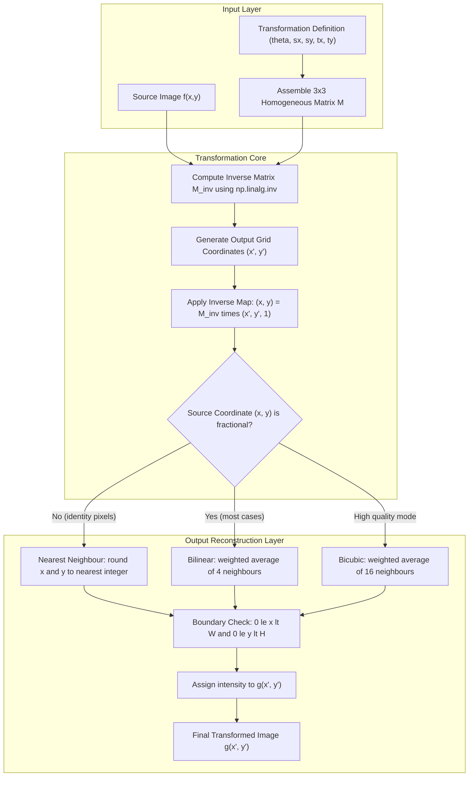
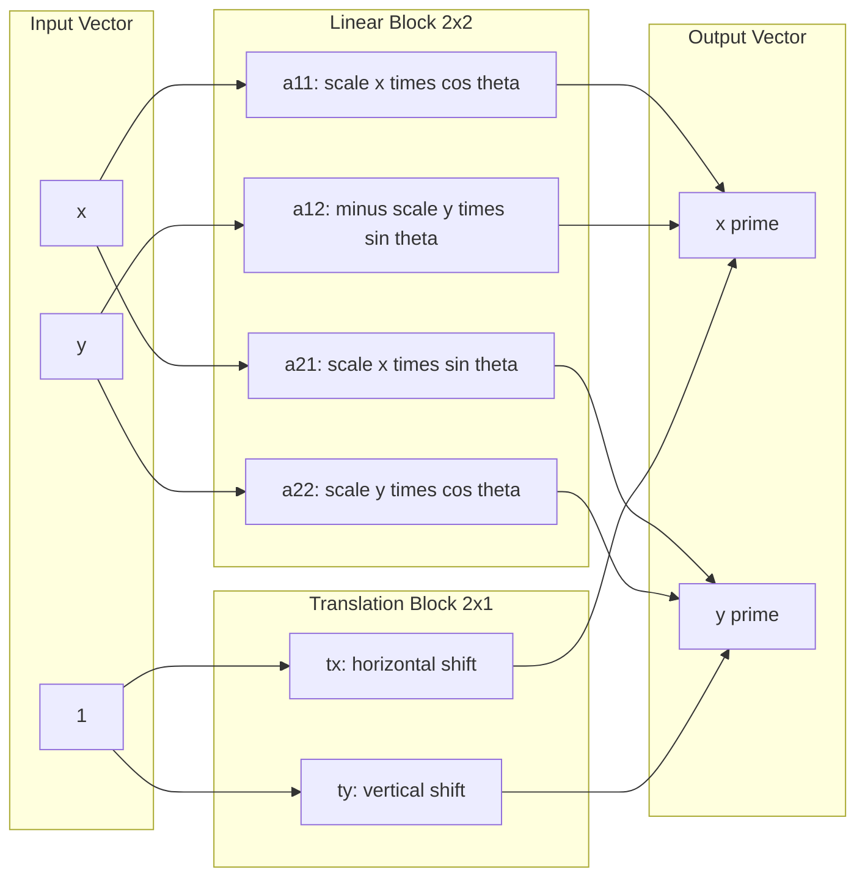

# Geometric Transformations - Pixel coordinate transformations

<!-- SECTION_1_START -->
# Geometric Transformations: Pixel Coordinate Transformations

## 1.1 Formal Academic Definition

> [!IMPORTANT]
> **Geometric Transformation** in Digital Image Processing (DIP) refers to a spatial domain operation that repositions the pixels of an input image $f(x, y)$ onto a new coordinate grid to produce a transformed output image $g(x', y')$, where the spatial relationships between pixel intensities are preserved but their locations are mathematically remapped through a coordinate mapping function $T: \mathbb{R}^2 \rightarrow \mathbb{R}^2$.

A **pixel coordinate transformation** is the mathematical process of establishing a one-to-one (or many-to-one) geometric correspondence between the source pixel locations and the destination pixel locations. The mapping is defined by:

$$
(x', y') = T\big( (x, y) \big)
$$

where the transformation $T$ can be expressed as a **2 x 2 matrix** for linear operations (rotation, scaling, shear) extended to a **3 x 3 matrix** using **homogeneous coordinates** to incorporate translation.

In the **KTU 2024 Scheme (PECST636)** syllabus, this topic is mapped to **Module 2 – Image Preprocessing** and is fundamental for tasks such as image registration, medical image alignment, satellite image rectification, and panorama stitching.

## 1.2 Conceptual Analogy & Intuition

> [!NOTE]
> **The Rubber-Sheet Analogy**
> Imagine your digital image is printed on a flexible, transparent rubber sheet pinned at the corners of a wooden frame. Each pixel is a tiny ink dot at a fixed $(x, y)$ grid intersection.
> * **Translation** = sliding the entire rubber sheet horizontally or vertically.
> * **Rotation** = spinning the rubber sheet around a pin (origin) by an angle $\theta$.
> * **Scaling** = stretching the rubber sheet (zoom-in) or letting it shrink (zoom-out).
> * **Shearing** = pushing the top edge of the sheet sideways so it becomes a parallelogram.

**Why this matters:** When you stretch a photo, the original pixel positions are *no longer on integer grid coordinates* of the output image. Some output grid points might land *between* two original pixels. This is the central challenge solved by **interpolation**, which estimates the missing intensity values.

## 1.3 The Two Fundamental Mapping Strategies

There are **two philosophies** for executing a pixel coordinate transformation:

| Strategy | Direction | Core Idea | Common Name |
| :--- | :--- | :--- | :--- |
| **Forward Mapping** | $(x, y) \rightarrow (x', y')$ | Sweep every input pixel and project it to its new output location. | **Forward Warping / Aliasing Warping** |
| **Inverse Mapping** | $(x, y) \leftarrow (x', y')$ | Sweep every output pixel and look back into the input to find the source intensity. | **Inverse Warping / Backward Mapping** |

> [!IMPORTANT]
> **KTU Board Favourite:** The 2024 Scheme examiners *frequently* ask students to justify why **inverse mapping** is preferred over forward mapping. The key reason: **forward mapping creates holes and overlaps** in the output grid because transformed coordinates generally fall on non-integer locations, whereas inverse mapping guarantees every output pixel is assigned exactly one value.

## 1.4 GeoGebra / Desmos Visualization

> [!VISUALIZATION CONTROL]
> **Concept:** Rotation of a 2D point around the origin by $\theta = 30^{\circ}$, demonstrating the coordinate transformation $(x, y) \rightarrow (x', y')$.
> **GeoGebra Input Commands:**
> * `A = (3, 1)` (Original point in the input coordinate system)
> * `theta = 30°`
> * `B = (3*cos(theta) - 1*sin(theta), 3*sin(theta) + 1*cos(theta))` (Rotated point)
> * `Rotate(A, 30°)` — to verify the analytic expression
> **Visual Description:** You will observe the original point $A$ on the positive x-y quadrant, the rotated point $B$ at a counter-clockwise angular distance of $30^{\circ}$ from the positive x-axis, and the arc connecting them centred at the origin. The distance $OA = OB$ is preserved, which is the geometric invariant of a pure rotation.

<!-- SECTION_1_END -->

<!-- SECTION_2_START -->
# Deep Theoretical Analysis & KTU High-Yield Formula Sheet

## 2.1 Mathematical Foundation: 2D Transformation Matrix

The most general **affine geometric transformation** in 2D is represented using a **3 x 3 homogeneous coordinate matrix** to permit translation (which is otherwise an additive offset, not a linear operation).

For a source pixel $(x, y)$ mapped to a destination pixel $(x', y')$:

$$
\begin{bmatrix} x' \\ y' \\ 1 \end{bmatrix} = \begin{bmatrix} a_{11} & a_{12} & t_x \\ a_{21} & a_{22} & t_y \\ 0 & 0 & 1 \end{bmatrix} \begin{bmatrix} x \\ y \\ 1 \end{bmatrix}
$$

The 2D transformation is therefore decomposed into a **linear part** (the $2 \times 2$ upper-left block) and a **translation part** (the $2 \times 1$ upper-right block).

## 2.2 Step-by-Step Construction of Basic Transformations

### (a) Identity Transformation
No change; every pixel stays at its original position.

$$
\begin{bmatrix} x' \\ y' \end{bmatrix} = \begin{bmatrix} 1 & 0 \\ 0 & 1 \end{bmatrix} \begin{bmatrix} x \\ y \end{bmatrix} \quad \Rightarrow \quad (x', y') = (x, y)
$$

### (b) Translation by $(t_x, t_y)$
Shifts the entire image by a constant offset.

$$
x' = x + t_x, \quad y' = y + t_y
$$

### (c) Scaling by $(s_x, s_y)$
Enlarges or shrinks the image along the two principal axes.

$$
x' = s_x \cdot x, \quad y' = s_y \cdot y
$$

If $s_x = s_y = s$, the scaling is **isotropic** (uniform). If $s_x \neq s_y$, it is **anisotropic** (stretches the shape).

### (d) Rotation by angle $\theta$ (counter-clockwise, about the origin)
This is derived from the parametric equations of a circle and is one of the **most important derivations** in the KTU syllabus.

$$
x' = x \cos\theta - y \sin\theta, \quad y' = x \sin\theta + y \cos\theta
$$

### (e) Shearing
Slants the image along one axis.

* **Horizontal shear** (x-direction): $x' = x + sh_x \cdot y, \quad y' = y$
* **Vertical shear** (y-direction): $x' = x, \quad y' = sh_y \cdot x + y$

## 2.3 Homogeneous Coordinates — The Clever Trick

> [!NOTE]
> A translation cannot be expressed as a matrix multiplication of the form $A \vec{p}$ because translation is **additive, not linear**. The workaround is to embed 2D coordinates into a 3D space called **homogeneous coordinates** by appending a constant $1$ as the third element. This unifies all affine operations into a **single matrix multiplication**, which is computationally efficient and GPU-friendly.

$$
(x, y) \rightarrow (x, y, 1), \quad (x', y') \rightarrow (x', y', 1)
$$

After applying the $3 \times 3$ matrix, the third coordinate is **discarded** (or set to 1) to return to 2D.

## 2.4 The Two Mapping Philosophies in Detail

### Forward Mapping (Forward Warping)
The transformation is applied from the **input to the output**:

$$
(x', y') = T(x, y)
$$

**Algorithm:**
1. Iterate over every integer pixel $(x, y)$ in the input image.
2. Compute the floating-point destination $(x', y')$.
3. Round $(x', y')$ to the nearest integer output coordinate.
4. Copy the intensity $f(x, y)$ to $g(x', y')$.

**Problems:**
* **Holes:** Some output pixels may never receive any value (rounding causes collisions that miss points).
* **Overlaps:** Multiple input pixels may map to the same output pixel.
* **Aliasing:** Jagged, discontinuous output.

### Inverse Mapping (Inverse Warping / Backward Mapping)
The transformation is applied from the **output to the input**:

$$
(x, y) = T^{-1}(x', y')
$$

**Algorithm:**
1. Iterate over every integer pixel $(x', y')$ in the **output** image.
2. Compute the floating-point source $(x, y)$ using $T^{-1}$.
3. **Interpolate** the intensity value at $(x, y)$ from neighbouring input pixels.
4. Assign this value to $g(x', y')$.

**Advantages:**
* Every output pixel is visited exactly once — **no holes**.
* Interpolation ensures smooth, high-quality results.

> [!IMPORTANT]
> **KTU 2024 Exam Tip:** When asked "Which mapping is preferred?", the model answer is **Inverse Mapping**, justified by the absence of holes, guaranteed coverage of all output pixels, and the ability to use any interpolation kernel.

## 2.5 Interpolation Methods — Filling the Gaps

When inverse mapping lands on a non-integer coordinate $(x, y)$, we must estimate the pixel intensity. The three most common methods in DIP are:

| Method | Formula / Logic | Quality | Speed | KTU Frequency |
| :--- | :--- | :--- | :--- | :--- |
| **Nearest Neighbour** | Pick the intensity of the closest integer pixel. | Low (blocky) | **Fastest** | Very High |
| **Bilinear** | Weighted average of the 4 nearest pixels (linear in $x$, then in $y$). | Good (smooth) | Moderate | High |
| **Bicubic** | Weighted average of the 16 nearest pixels using a cubic kernel. | **Highest** | Slow | Moderate |

> [!NOTE]
> **Why interpolation is mandatory for inverse mapping:** Because the inverse transform of integer output coordinates generally yields non-integer source coordinates, and the input image only has intensity values defined at integer grid points, we *must* interpolate to estimate the value at the fractional position.

## 2.6 The Complete Transformation Pipeline

A production-grade geometric transformation executes these stages:

1. **Define the transformation** $T$ (rotation, scaling, etc.) and build its matrix.
2. **Compute the inverse** $T^{-1}$ analytically (e.g., the inverse of a rotation by $\theta$ is a rotation by $-\theta$).
3. **For each output pixel** $(x', y')$:
   a. Compute the source coordinate $(x, y) = T^{-1}(x', y')$.
   b. Check boundary conditions: $0 \leq x < M$ and $0 \leq y < N$.
   c. Apply the chosen interpolation kernel to estimate $f(x, y)$.
   d. Store the result in $g(x', y')$.

## 2.7 Real-World Engineering Utility

* **Medical Imaging (CT/MRI Registration):** Aligning pre-operative and intra-operative scans by rigid transformations (rotation + translation).
* **Satellite Remote Sensing:** Correcting geometric distortions caused by Earth's curvature and sensor tilt.
* **Panorama Stitching:** Warping multiple photographs into a common reference frame.
* **Computer Vision (SLAM, AR):** Tracking camera motion through perspective and affine warps.
* **Document Scanning Apps (Adobe Scan, Microsoft Lens):** Rectifying perspective-distorted document images.

<!-- SECTION_2_END -->

<!-- SECTION_3_START -->
# Step-by-Step Derivations & Code Implementation

## 3.1 Derivation of the 2D Rotation Matrix

> **Goal:** Prove that rotating a point $(x, y)$ counter-clockwise by an angle $\theta$ about the origin yields $(x', y')$ where $x' = x\cos\theta - y\sin\theta$ and $y' = x\sin\theta + y\cos\theta$.

**Step 1: Express the original point in polar form.**
Let $r$ be the distance from the origin and $\alpha$ be the angle the point makes with the positive x-axis.

$$
x = r\cos\alpha, \quad y = r\sin\alpha
$$

**Step 2: Define the new angle after rotation.**
After a counter-clockwise rotation by $\theta$, the new angle is $\alpha + \theta$.

$$
x' = r\cos(\alpha + \theta), \quad y' = r\sin(\alpha + \theta)
$$

**Step 3: Expand the cosine and sine of the sum.**
Apply the trigonometric addition identities:

$$
\cos(\alpha + \theta) = \cos\alpha\cos\theta - \sin\alpha\sin\theta
$$
$$
\sin(\alpha + \theta) = \sin\alpha\cos\theta + \cos\alpha\sin\theta
$$

**Step 4: Substitute the expanded forms into the expressions for $x'$ and $y'$.**

$$
x' = r(\cos\alpha\cos\theta - \sin\alpha\sin\theta)
$$
$$
y' = r(\sin\alpha\cos\theta + \cos\alpha\sin\theta)
$$

**Step 5: Distribute $r$ and substitute $x = r\cos\alpha$, $y = r\sin\alpha$.**

$$
x' = r\cos\alpha\cos\theta - r\sin\alpha\sin\theta = x\cos\theta - y\sin\theta
$$
$$
y' = r\sin\alpha\cos\theta + r\cos\alpha\sin\theta = x\sin\theta + y\cos\theta
$$

**Step 6: Write the result in matrix form.**

$$
\begin{bmatrix} x' \\ y' \end{bmatrix} = \begin{bmatrix} \cos\theta & -\sin\theta \\ \sin\theta & \cos\theta \end{bmatrix} \begin{bmatrix} x \\ y \end{bmatrix}
$$

The derivation is complete. The $2 \times 2$ matrix is the **rotation matrix** $R(\theta)$.

## 3.2 Derivation of the Inverse Rotation Matrix

> **Goal:** Show that the inverse of a rotation is a rotation by $-\theta$ and that rotation matrices are orthogonal.

**Step 1: Replace $\theta$ with $-\theta$ in the rotation matrix.**

$$
R(-\theta) = \begin{bmatrix} \cos(-\theta) & -\sin(-\theta) \\ \sin(-\theta) & \cos(-\theta) \end{bmatrix} = \begin{bmatrix} \cos\theta & \sin\theta \\ -\sin\theta & \cos\theta \end{bmatrix}
$$

**Step 2: Verify that $R(\theta) \cdot R(-\theta) = I$.**

$$
R(\theta) \cdot R(-\theta) = \begin{bmatrix} \cos\theta & -\sin\theta \\ \sin\theta & \cos\theta \end{bmatrix} \begin{bmatrix} \cos\theta & \sin\theta \\ -\sin\theta & \cos\theta \end{bmatrix}
$$

**Step 3: Compute the four entries of the product matrix.**

$$
(1,1) = \cos^2\theta + \sin^2\theta = 1
$$
$$
(1,2) = \cos\theta\sin\theta - \sin\theta\cos\theta = 0
$$
$$
(2,1) = \sin\theta\cos\theta - \cos\theta\sin\theta = 0
$$
$$
(2,2) = \sin^2\theta + \cos^2\theta = 1
$$

**Step 4: Conclude.**

$$
R(\theta) \cdot R(-\theta) = \begin{bmatrix} 1 & 0 \\ 0 & 1 \end{bmatrix} = I
$$

This proves that the **inverse of a rotation matrix is its transpose** ($R^{-1} = R^T$), confirming that rotation matrices are **orthogonal** and preserve length.

## 3.3 Full Affine Transformation Matrix (3 x 3 Homogeneous Form)

A general affine transformation combines linear operations (rotation, scale, shear) with translation in a single matrix:

$$
M = \begin{bmatrix} a & b & t_x \\ c & d & t_y \\ 0 & 0 & 1 \end{bmatrix} = \begin{bmatrix} s_x\cos\theta & -s_y\sin\theta & t_x \\ s_x\sin\theta & s_y\cos\theta & t_y \\ 0 & 0 & 1 \end{bmatrix}
$$

The matrix $M$ acts on a homogeneous coordinate vector:

$$
\begin{bmatrix} x' \\ y' \\ 1 \end{bmatrix} = M \begin{bmatrix} x \\ y \\ 1 \end{bmatrix}
$$

This single $3 \times 3$ matrix can represent **any combination** of translation, rotation, scaling, and shearing in one efficient multiplication.

## 3.4 Worked Numerical Example: Forward vs Inverse Mapping

> **Problem:** Consider a $4 \times 4$ input image with intensity values $f(x, y) = x + 10y$ for $(x, y) \in \{0, 1, 2, 3\}$. Apply a scaling by $s_x = s_y = 2$ about the origin. Demonstrate the hole problem in forward mapping and show how inverse mapping solves it.

**Step 1: Build the input image.**

$$
f = \begin{bmatrix} 0 & 10 & 20 & 30 \\ 1 & 11 & 21 & 31 \\ 2 & 12 & 22 & 32 \\ 3 & 13 & 23 & 33 \end{bmatrix}
$$

**Step 2: Apply forward mapping for scaling.**

For each input pixel $(x, y)$, compute $(x', y') = (2x, 2y)$.

| Input $(x, y)$ | Output $(x', y')$ | Intensity |
| :---: | :---: | :---: |
| $(0, 0)$ | $(0, 0)$ | 0 |
| $(1, 0)$ | $(2, 0)$ | 1 |
| $(2, 0)$ | $(4, 0)$ | 2 |
| $(0, 1)$ | $(0, 2)$ | 10 |
| $(1, 1)$ | $(2, 2)$ | 11 |
| $(2, 1)$ | $(4, 2)$ | 12 |
| $(1, 2)$ | $(2, 4)$ | 21 |
| $(2, 3)$ | $(4, 6)$ | 23 |

The output coordinates include values like $(2, 0), (2, 2), (2, 4), (4, 0), (4, 2), (4, 4), (4, 6)$ — none of which are at the integer grid points $(1, 1), (1, 3), (3, 1), (3, 3)$. The output grid has **holes**.

**Step 3: Apply inverse mapping using nearest neighbour.**

For each output pixel $(x', y')$ in a $8 \times 8$ output grid, compute $(x, y) = (x'/2, y'/2)$ and round to the nearest integer.

| Output $(x', y')$ | Source $(x, y) = (x'/2, y'/2)$ | Rounded Source | Intensity |
| :---: | :---: | :---: | :---: |
| $(0, 0)$ | $(0.0, 0.0)$ | $(0, 0)$ | 0 |
| $(1, 0)$ | $(0.5, 0.0)$ | $(1, 0)$ | 1 |
| $(2, 0)$ | $(1.0, 0.0)$ | $(1, 0)$ | 1 |
| $(3, 0)$ | $(1.5, 0.0)$ | $(2, 0)$ | 2 |
| $(0, 1)$ | $(0.0, 0.5)$ | $(0, 1)$ | 10 |
| $(1, 1)$ | $(0.5, 0.5)$ | $(1, 1)$ | 11 |
| $(2, 1)$ | $(1.0, 0.5)$ | $(1, 1)$ | 11 |
| $(3, 1)$ | $(1.5, 0.5)$ | $(2, 1)$ | 12 |

**Every output pixel is filled** — no holes remain. This is the **decisive advantage** of inverse mapping with interpolation.

## 3.5 Bilinear Interpolation — Derivation

> **Problem:** Given a fractional source coordinate $(x, y) = (x_0 + \Delta x, y_0 + \Delta y)$ where $x_0 = \lfloor x \rfloor$, $y_0 = \lfloor y \rfloor$, and $\Delta x, \Delta y \in [0, 1)$, find the intensity $f(x, y)$.

**Step 1: Identify the four surrounding integer pixels.**
They are $(x_0, y_0)$, $(x_0+1, y_0)$, $(x_0, y_0+1)$, and $(x_0+1, y_0+1)$.

**Step 2: Interpolate along the x-direction (top row).**

$$
f(x, y_0) = f(x_0, y_0) \cdot (1 - \Delta x) + f(x_0+1, y_0) \cdot \Delta x
$$

**Step 3: Interpolate along the x-direction (bottom row).**

$$
f(x, y_0+1) = f(x_0, y_0+1) \cdot (1 - \Delta x) + f(x_0+1, y_0+1) \cdot \Delta x
$$

**Step 4: Interpolate the two results along the y-direction.**

$$
f(x, y) = f(x, y_0) \cdot (1 - \Delta y) + f(x, y_0+1) \cdot \Delta y
$$

**Step 5: Expand the final expression.**

$$
f(x, y) = (1-\Delta x)(1-\Delta y) f(x_0, y_0) + \Delta x (1-\Delta y) f(x_0+1, y_0) + (1-\Delta x)\Delta y \, f(x_0, y_0+1) + \Delta x \Delta y \, f(x_0+1, y_0+1)
$$

This is a **convex combination** of the four corner intensities, with weights summing to 1. The result is a smooth, continuous estimate.

## 3.6 Python Implementation: Full Geometric Transformation Engine

```python
import numpy as np
from typing import Tuple, Optional

def bilinear_interpolate(
    image: np.ndarray,
    x: float,
    y: float
) -> float:
    """
    Compute the bilinear-interpolated intensity at a fractional coordinate (x, y).
    
    Parameters
    ----------
    image : np.ndarray
        2D grayscale image as a NumPy array of shape (H, W).
    x : float
        Fractional x-coordinate in the source image.
    y : float
        Fractional y-coordinate in the source image.
    
    Returns
    -------
    float
        The interpolated intensity. Returns 0.0 for out-of-bounds coordinates.
    """
    H, W = image.shape
    x0 = int(np.floor(x))
    y0 = int(np.floor(y))
    x1 = x0 + 1
    y1 = y0 + 1
    dx = x - x0
    dy = y - y0
    
    # Boundary check: return 0 if all four neighbours are out of bounds
    if x1 < 0 or x0 >= W or y1 < 0 or y0 >= H:
        return 0.0
    
    # Clamp coordinates and gather the four corner intensities
    def safe_get(px: int, py: int) -> float:
        if 0 <= px < W and 0 <= py < H:
            return float(image[py, px])
        return 0.0
    
    f00 = safe_get(x0, y0)
    f10 = safe_get(x1, y0)
    f01 = safe_get(x0, y1)
    f11 = safe_get(x1, y1)
    
    # Apply the bilinear formula
    top    = f00 * (1 - dx) + f10 * dx
    bottom = f01 * (1 - dx) + f11 * dx
    value  = top * (1 - dy) + bottom * dy
    return value


def geometric_transform(
    image: np.ndarray,
    M: np.ndarray,
    output_shape: Optional[Tuple[int, int]] = None
) -> np.ndarray:
    """
    Apply a 2D geometric transformation defined by a 3x3 homogeneous matrix M
    using inverse mapping with bilinear interpolation.
    
    Parameters
    ----------
    image : np.ndarray
        Input grayscale image of shape (H, W).
    M : np.ndarray
        3x3 homogeneous transformation matrix (forward direction).
    output_shape : tuple, optional
        Desired (H_out, W_out). If None, uses the input shape.
    
    Returns
    -------
    np.ndarray
        The transformed image of shape output_shape.
    """
    H, W = image.shape
    if output_shape is None:
        output_shape = (H, W)
    H_out, W_out = output_shape
    
    # Invert the forward transformation matrix
    M_inv = np.linalg.inv(M)
    
    # Build a grid of output pixel coordinates
    out_x, out_y = np.meshgrid(
        np.arange(W_out, dtype=np.float64),
        np.arange(H_out, dtype=np.float64)
    )
    
    # Flatten and apply inverse mapping: (x, y, 1) = M_inv @ (x', y', 1)
    ones = np.ones_like(out_x)
    src_x = (M_inv[0, 0] * out_x + M_inv[0, 1] * out_y + M_inv[0, 2] * ones)
    src_y = (M_inv[1, 0] * out_x + M_inv[1, 1] * out_y + M_inv[1, 2] * ones)
    
    # Interpolate every output pixel
    output = np.zeros((H_out, W_out), dtype=np.float64)
    for j in range(H_out):
        for i in range(W_out):
            output[j, i] = bilinear_interpolate(image, src_x[j, i], src_y[j, i])
    
    return np.clip(output, 0, 255).astype(np.uint8)


def make_rotation_matrix(theta_deg: float, tx: float = 0.0, ty: float = 0.0) -> np.ndarray:
    """Build a 3x3 homogeneous rotation matrix (counter-clockwise) with optional translation."""
    theta = np.deg2rad(theta_deg)
    c, s = np.cos(theta), np.sin(theta)
    return np.array([
        [c, -s, tx],
        [s,  c, ty],
        [0,  0,  1.0]
    ], dtype=np.float64)


def make_scale_matrix(sx: float, sy: float, tx: float = 0.0, ty: float = 0.0) -> np.ndarray:
    """Build a 3x3 homogeneous scaling matrix with optional translation."""
    return np.array([
        [sx, 0.0, tx],
        [0.0, sy, ty],
        [0.0, 0.0, 1.0]
    ], dtype=np.float64)


# --- Demonstration: rotate a synthetic checkerboard by 30 degrees ---
if __name__ == "__main__":
    # Build a 128x128 checkerboard
    tile = 16
    H = W = 128
    image = np.zeros((H, W), dtype=np.uint8)
    for j in range(0, H, tile):
        for i in range(0, W, tile):
            if ((i // tile) + (j // tile)) % 2 == 0:
                image[j:j+tile, i:i+tile] = 255
    
    # Construct a 30-degree rotation matrix (no translation for now)
    M = make_rotation_matrix(theta_deg=30.0)
    
    # Apply the transformation
    rotated = geometric_transform(image, M, output_shape=(H, W))
    
    # Save the result for inspection
    try:
        from PIL import Image as PILImage
        PILImage.fromarray(rotated).save("rotated_checkerboard.png")
        print("Saved rotated_checkerboard.png")
    except ImportError:
        print("PIL not available; output array shape:", rotated.shape)
```

> [!IMPORTANT]
> **Key Implementation Notes for KTU Lab Exams:**
> 1. The **inverse matrix** is computed with `np.linalg.inv(M)`, which handles the 3x3 homogeneous form correctly.
> 2. The **bilinear interpolation** uses a `safe_get` helper to handle pixels on the image boundary gracefully (returns 0.0 for out-of-bounds).
> 3. The final output is **clipped to [0, 255]** before casting to `uint8` to prevent overflow due to floating-point arithmetic.

<!-- SECTION_3_END -->

<!-- SECTION_4_START -->
# Structural Diagrams & Schematics

## 4.1 Geometric Transformation Pipeline Flowchart

The following Mermaid diagram illustrates the complete processing pipeline for an inverse-mapped geometric transformation. It is divided into three nested subgraphs representing the **Input Layer**, the **Transformation Core**, and the **Output Reconstruction Layer**.



## 4.2 Transformation Matrix Decomposition Block Diagram

The 3x3 homogeneous transformation matrix is conceptually decomposed into a **linear block** (rotation + scale + shear) and a **translation block**. This diagram visualises how each component of the matrix contributes to the final pixel coordinate transformation.



## 4.3 Forward vs Inverse Mapping Decision Matrix

This is a **Sequential Processing Topology Matrix** mapping the operational differences between the two mapping strategies. It is a tabular alternative to a free-body diagram, suitable for KTU theory questions.

| Stage | Forward Mapping (Forward Warping) | Inverse Mapping (Backward Warping) |
| :--- | :--- | :--- |
| **Iteration direction** | Over all input pixels $(x, y)$ | Over all output pixels $(x', y')$ |
| **Transform applied** | Forward $T$ | Inverse $T^{-1}$ |
| **Output coverage** | **Incomplete** (holes possible) | **Complete** (every output pixel filled) |
| **Overlaps possible** | **Yes** (multiple inputs may map to one output) | **No** (each output reads exactly one source) |
| **Interpolation needed** | Not strictly required (but useful for smoothing) | **Mandatory** (source is fractional) |
| **Computational cost** | Lower if no interpolation is used | Slightly higher due to interpolation |
| **Quality** | Blocky with aliasing artefacts | Smooth, high-quality output |
| **KTU recommendation** | Avoid for production-grade results | **Preferred method** |

<!-- SECTION_4_END -->

<!-- SECTION_5_START -->
# KTU 2024 Scheme Examination Question Bank & Topic Recap

## 5.1 Part A Questions (3 Marks Each)

### Question 1: Homogeneous Coordinates [3 Marks]
**[KTU University Exam - July 2024 | CO1 | Remember]**

> **Q:** What are homogeneous coordinates in 2D image transformation? Why is the 3x3 matrix form preferred over a 2x2 form for affine transformations?

**Model Answer (Key Points for Valuation):**
* [Definition of homogeneous coordinates: 1 Mark] Homogeneous coordinates are a 3D representation of 2D points, defined as $(x, y) \rightarrow (x, y, 1)$, where the third coordinate is a constant 1.
* [Purpose of third coordinate: 1 Mark] This extra dimension allows translation to be expressed as a matrix multiplication rather than a separate addition, unifying all affine operations.
* [Why 3x3 matrix is preferred: 1 Mark] A 2x2 matrix can only represent linear operations (rotation, scaling, shear). The 3x3 form, with the third column reserved for translation $(t_x, t_y)$, enables a single matrix multiplication to represent **any combination** of translation, rotation, scaling, and shearing.

---

### Question 2: Inverse vs Forward Mapping [3 Marks]
**[KTU University Exam - Dec 2023 | CO1, CO2 | Understand]**

> **Q:** Differentiate between forward mapping and inverse mapping in geometric transformations. State one key advantage of inverse mapping.

**Model Answer (Key Points for Valuation):**
* [Forward mapping definition: 1 Mark] In forward mapping, every input pixel $(x, y)$ is mapped to its destination $(x', y')$ using the forward transform $T$, and the result is placed in the output image.
* [Inverse mapping definition: 1 Mark] In inverse mapping, every output pixel $(x', y')$ is mapped back to the source $(x, y)$ using the inverse transform $T^{-1}$, and the corresponding intensity is read from the source image (with interpolation if needed).
* [Key advantage: 1 Mark] Inverse mapping guarantees that **every output pixel is assigned exactly one value**, eliminating the holes and overlaps that plague forward mapping.

---

## 5.2 Part B Questions (14 Marks Each — Module Internal Choice)

### Question A (14 Marks)

**[KTU University Exam - Model Paper 2024 | CO2, CO3 | Apply, Analyse]**

> **(a)** Derive the 2D rotation matrix for a counter-clockwise rotation by an angle $\theta$ about the origin. Show all trigonometric steps explicitly. **(7 Marks)**

> **(b)** A $4 \times 4$ input image is given by the intensity function $f(x, y) = 2x + 3y$, where $(x, y) \in \{0, 1, 2, 3\}$. Apply a **scaling by a factor of 0.5** about the origin using **inverse mapping with nearest-neighbour interpolation**. Compute the intensities of the output image and demonstrate that no holes are formed. **(7 Marks)**

**Model Solution for (a):**
* [Stating the polar representation: 1 Mark] Let $r$ be the radius and $\alpha$ the angle. Then $x = r\cos\alpha$ and $y = r\sin\alpha$.
* [Defining the new angle: 1 Mark] After rotation by $\theta$, the new angle is $\alpha + \theta$, giving $x' = r\cos(\alpha + \theta)$ and $y' = r\sin(\alpha + \theta)$.
* [Expanding the sum identities: 2 Marks] Use $\cos(\alpha + \theta) = \cos\alpha\cos\theta - \sin\alpha\sin\theta$ and $\sin(\alpha + \theta) = \sin\alpha\cos\theta + \cos\alpha\sin\theta$.
* [Substituting and simplifying: 2 Marks] Obtain $x' = x\cos\theta - y\sin\theta$ and $y' = x\sin\theta + y\cos\theta$.
* [Final matrix form: 1 Mark] Write the result as the 2x2 rotation matrix $R(\theta)$.

**Model Solution for (b):**
* [Step 1: Build the input image: 1 Mark] The input is a 4x4 matrix with entries $f(x, y) = 2x + 3y$:
$$
\begin{bmatrix} 0 & 3 & 6 & 9 \\ 2 & 5 & 8 & 11 \\ 4 & 7 & 10 & 13 \\ 6 & 9 & 12 & 15 \end{bmatrix}
$$
* [Step 2: Identify the inverse transform: 1 Mark] For scaling by 0.5, the forward transform is $(x', y') = (0.5x, 0.5y)$. The inverse is $(x, y) = (2x', 2y')$.
* [Step 3: Iterate over output pixels: 2 Marks] For a 4x4 output, loop over $(x', y') \in \{0, 1, 2, 3\}$ and compute the source $(x, y) = (2x', 2y')$.
* [Step 4: Apply nearest-neighbour rounding: 1 Mark] Round $(2x', 2y')$ to the nearest integer — in this case, they are already integers.
* [Step 5: Compute the output: 1 Mark] The output image is:
$$
g(x', y') = f(2x', 2y') = 2(2x') + 3(2y') = 4x' + 6y'
$$
$$
g = \begin{bmatrix} 0 & 6 & 12 & 18 \\ 4 & 10 & 16 & 22 \\ 8 & 14 & 20 & 26 \\ 12 & 18 & 24 & 30 \end{bmatrix}
$$
* [Step 6: Justify no holes: 1 Mark] Every output pixel $(x', y')$ has been assigned a value, confirming that inverse mapping with nearest-neighbour produces a hole-free output.

---

### Question B (14 Marks)

**[KTU University Exam - Model Paper 2024 | CO2, CO3 | Apply, Analyse]**

> **(a)** Explain the **bilinear interpolation** method used in inverse geometric transformation. Derive the intensity formula and show that the weights sum to 1. **(7 Marks)**

> **(b)** Consider the following three transformations to be applied in sequence to a $5 \times 5$ image:
>   1. **Scale** by $(s_x, s_y) = (2, 2)$.
>   2. **Rotate** by $\theta = 90^{\circ}$ counter-clockwise.
>   3. **Translate** by $(t_x, t_y) = (10, 5)$.
> Construct the **combined $3 \times 3$ homogeneous transformation matrix** by multiplying the individual matrices. Compute the new coordinates of the input point $(3, 4)$. **(7 Marks)**

**Model Solution for (a):**
* [Step 1: Define the problem: 1 Mark] Given a fractional source coordinate $(x, y) = (x_0 + \Delta x, y_0 + \Delta y)$, where $x_0 = \lfloor x \rfloor$, $y_0 = \lfloor y \rfloor$, and $\Delta x, \Delta y \in [0, 1)$, we want to estimate $f(x, y)$ from the four corner pixels.
* [Step 2: Interpolate along x (top): 1 Mark] $f(x, y_0) = (1 - \Delta x) f(x_0, y_0) + \Delta x \, f(x_0+1, y_0)$.
* [Step 3: Interpolate along x (bottom): 1 Mark] $f(x, y_0+1) = (1 - \Delta x) f(x_0, y_0+1) + \Delta x \, f(x_0+1, y_0+1)$.
* [Step 4: Interpolate along y: 1 Mark] $f(x, y) = (1 - \Delta y) f(x, y_0) + \Delta y \, f(x, y_0+1)$.
* [Step 5: Expand: 1 Mark]
$$
f(x, y) = (1-\Delta x)(1-\Delta y) f(x_0, y_0) + \Delta x (1-\Delta y) f(x_0+1, y_0) + (1-\Delta x)\Delta y \, f(x_0, y_0+1) + \Delta x \Delta y \, f(x_0+1, y_0+1)
$$
* [Step 6: Prove weights sum to 1: 2 Marks] Sum the four weights: $(1-\Delta x)(1-\Delta y) + \Delta x(1-\Delta y) + (1-\Delta x)\Delta y + \Delta x \Delta y$. Expand and group terms:
  * $\Delta y$ terms: $(1-\Delta y) \cdot [(1-\Delta x) + \Delta x] + \Delta y \cdot [(1-\Delta x) + \Delta x] = (1-\Delta y) + \Delta y = 1$.
  * Hence the weights form a convex combination, ensuring the interpolated value lies within the intensity range of the four neighbours.

**Model Solution for (b):**
* [Step 1: Build the scale matrix: 1 Mark]
$$
S = \begin{bmatrix} 2 & 0 & 0 \\ 0 & 2 & 0 \\ 0 & 0 & 1 \end{bmatrix}
$$
* [Step 2: Build the rotation matrix for 90 degrees: 1 Mark] $\cos 90^{\circ} = 0$ and $\sin 90^{\circ} = 1$.
$$
R = \begin{bmatrix} 0 & -1 & 0 \\ 1 & 0 & 0 \\ 0 & 0 & 1 \end{bmatrix}
$$
* [Step 3: Build the translation matrix: 1 Mark]
$$
T = \begin{bmatrix} 1 & 0 & 10 \\ 0 & 1 & 5 \\ 0 & 0 & 1 \end{bmatrix}
$$
* [Step 4: Compute the combined matrix $M = T \cdot R \cdot S$: 2 Marks] First compute $R \cdot S$:
$$
R \cdot S = \begin{bmatrix} 0 & -1 & 0 \\ 1 & 0 & 0 \\ 0 & 0 & 1 \end{bmatrix} \begin{bmatrix} 2 & 0 & 0 \\ 0 & 2 & 0 \\ 0 & 0 & 1 \end{bmatrix} = \begin{bmatrix} 0 & -2 & 0 \\ 2 & 0 & 0 \\ 0 & 0 & 1 \end{bmatrix}
$$
* [Step 5: Multiply by $T$: 1 Mark]
$$
M = T \cdot (R \cdot S) = \begin{bmatrix} 1 & 0 & 10 \\ 0 & 1 & 5 \\ 0 & 0 & 1 \end{bmatrix} \begin{bmatrix} 0 & -2 & 0 \\ 2 & 0 & 0 \\ 0 & 0 & 1 \end{bmatrix} = \begin{bmatrix} 0 & -2 & 10 \\ 2 & 0 & 5 \\ 0 & 0 & 1 \end{bmatrix}
$$
* [Step 6: Apply to $(3, 4)$: 1 Mark]
$$
\begin{bmatrix} x' \\ y' \\ 1 \end{bmatrix} = \begin{bmatrix} 0 & -2 & 10 \\ 2 & 0 & 5 \\ 0 & 0 & 1 \end{bmatrix} \begin{bmatrix} 3 \\ 4 \\ 1 \end{bmatrix} = \begin{bmatrix} 0 \cdot 3 + (-2) \cdot 4 + 10 \cdot 1 \\ 2 \cdot 3 + 0 \cdot 4 + 5 \cdot 1 \\ 1 \end{bmatrix} = \begin{bmatrix} 2 \\ 11 \\ 1 \end{bmatrix}
$$
* The new coordinates are $(x', y') = (2, 11)$.

---

## 5.3 KTU Examiner's Valuation Warning / Pitfall Callout

> [!WARNING]
> **Common Mistakes That Cost Marks in KTU 2024 Exams:**
> 1. **Skipping the inversion step:** Students often write the forward transform but forget to invert it for inverse mapping. Always state clearly: "We compute the inverse matrix $M^{-1}$ because we are using backward mapping."
> 2. **Confusing homogeneous coordinate order:** In the matrix, the last column contains $(t_x, t_y)$ for translation. Writing them in the bottom row (instead of the right column) is a common error.
> 3. **Forgetting the boundary check:** Inverse mapping can request source coordinates outside the input image. Failing to add the condition $0 \leq x < M$ and $0 \leq y < N$ will lose at least 1 mark.
> 4. **Not justifying the choice of interpolation:** If the question specifies "with bilinear interpolation", you must derive or state the bilinear formula. Do not silently use nearest-neighbour.
> 5. **Rotation direction error:** $\theta > 0$ in the standard convention is **counter-clockwise**. If the question asks for clockwise rotation, use $-\theta$ or transpose the rotation matrix.
> 6. **Skipping the verification step:** In derivations, always show that $R(\theta) \cdot R(-\theta) = I$ to confirm the matrix is correct.
> 7. **Pipeline order:** When chaining transformations, remember that the **rightmost matrix is applied first** to the input vector. The order is $M = T \cdot R \cdot S$ (scale, then rotate, then translate).

---

## 5.4 Topic Recap & Important Things to Remember

> [!NOTE]
> **High-Density Revision Checklist for Geometric Transformations — Pixel Coordinate Transformations**

* [Definition] A geometric transformation is a spatial remapping $T: (x, y) \rightarrow (x', y')$ that repositions pixels.
* [Two strategies] **Forward mapping** iterates over input pixels; **inverse mapping** iterates over output pixels using $T^{-1}$.
* [Inverse mapping preferred] Inverse mapping produces hole-free, aliasing-free output and is the industry standard.
* [Homogeneous coordinates] Adding a third coordinate of 1, i.e., $(x, y) \rightarrow (x, y, 1)$, allows translation to be encoded in a single $3 \times 3$ matrix.
* [General matrix] The 3x3 affine matrix has the form
$$
M = \begin{bmatrix} a & b & t_x \\ c & d & t_y \\ 0 & 0 & 1 \end{bmatrix}
$$
where the upper-left 2x2 block encodes the linear part and the upper-right 2x1 block encodes translation.
* [Rotation matrix] For counter-clockwise rotation by $\theta$:
$$
R(\theta) = \begin{bmatrix} \cos\theta & -\sin\theta \\ \sin\theta & \cos\theta \end{bmatrix}
$$
and $R^{-1}(\theta) = R(-\theta) = R^T(\theta)$ (rotation matrices are orthogonal).
* [Scaling matrix] Diagonal matrix with $s_x$ and $s_y$ on the diagonal.
* [Translation matrix] Identity matrix with $t_x$ and $t_y$ in the third column.
* [Shear matrix] Off-diagonal $sh_x$ or $sh_y$ entries.
* [Interpolation] Nearest neighbour (fast, blocky), bilinear (smooth, 4 pixels), bicubic (highest quality, 16 pixels).
* [Bilinear formula]
$$
f(x, y) = (1-\Delta x)(1-\Delta y) f_{00} + \Delta x(1-\Delta y) f_{10} + (1-\Delta x)\Delta y \, f_{01} + \Delta x \Delta y \, f_{11}
$$
* [Pipeline order] When combining transforms, the **rightmost matrix acts first**: $M_{combined} = T \cdot R \cdot S$ means scale first, then rotate, then translate.
* [Boundary conditions] Always check $0 \leq x < W$ and $0 \leq y < H$ before reading the source image; out-of-bounds pixels are typically set to 0 (black) or the nearest valid intensity.
* [KTU 2024 Module Mapping] This topic is part of **Module 2 — Image Preprocessing** and is tested in the End Semester Exam (ESE) under the question pattern: 1 short question (3 marks) + 1 long question with internal choice (14 marks).
* [Common formula to remember] For a rotation about an arbitrary centre $(c_x, c_y)$: first translate the centre to the origin, then rotate, then translate back — combine into a single matrix $M = T(c_x, c_y) \cdot R(\theta) \cdot T(-c_x, -c_y)$.
* [Performance note] Inverse mapping with bilinear interpolation is the **default** in OpenCV's `cv2.warpAffine()` and `cv2.warpPerspective()` functions, used in production image processing pipelines worldwide.

<!-- SECTION_5_END -->
