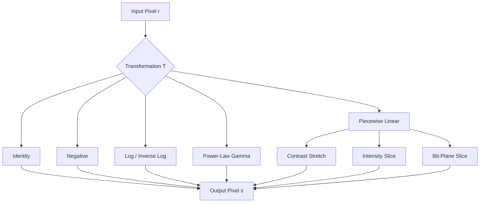
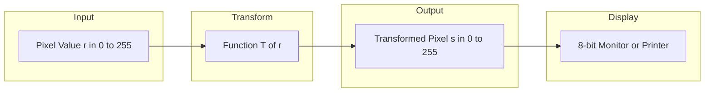
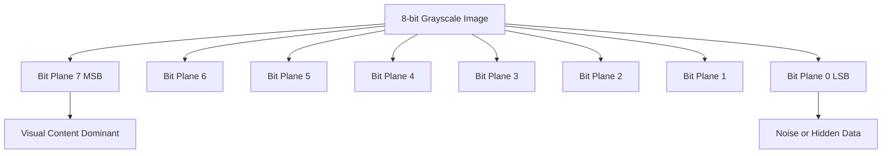
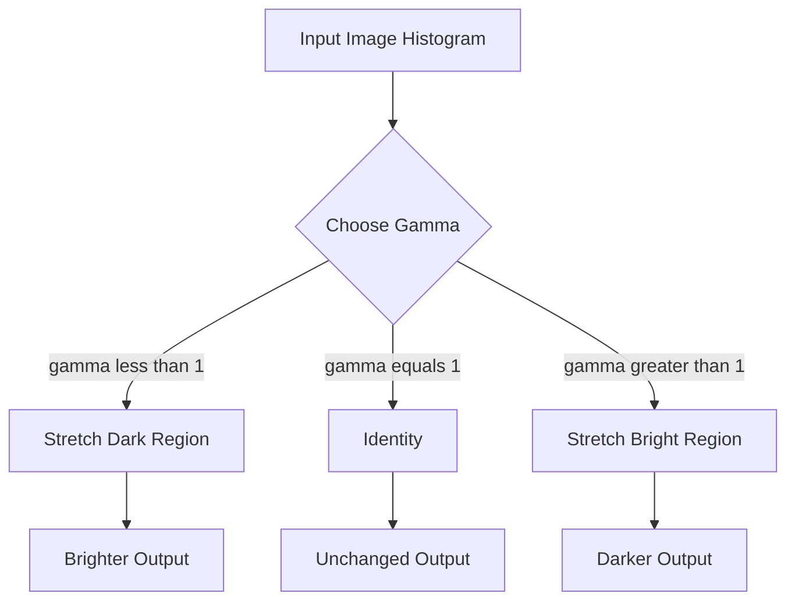

# Gray-scale transformation

<!-- SECTION_1_START -->

# Module 2: Image Pre-processing — Gray-Scale Transformation

## 1. Core Technical Definition & Intuitive Overview

### 1.1 Formal Definition (KTU 2024 Syllabus Terminology)

> [!NOTE]
> **Gray-Scale Transformation (Spatial Domain Enhancement)**
> A gray-scale transformation is a **point processing** operation performed directly on the pixel intensity values of a single-image spatial domain, mathematically defined as:
> $$s = T(r)$$
> where $r$ is the input pixel intensity, $s$ is the output (transformed) pixel intensity, and $T$ is a **gray-level transformation function** that maps each pixel value in the input image to a corresponding value in the output image. The transformation operates on a per-pixel basis using only the local intensity value — no neighborhood (mask/kernel) information is required.

The **spatial domain** refers to the image plane itself, composed of pixels arranged in a 2D matrix. The intensity $r$ of a pixel at coordinate $(x, y)$ is transformed to $s$ via the function $T$:

$$s = T\bigl(r\bigr) \quad \text{where} \quad r, s \in [0, L-1]$$

Here, $L$ is the total number of discrete gray levels. For an 8-bit image, $L = \mathbf{256}$ and the pixel intensity range is $r \in [0, 255]$.

### 1.2 Intuitive Real-World Analogy

> [!IMPORTANT]
> **The Smart Light Dimmer Analogy**
> Imagine a **photographer's brightness slider** on a photo-editing app. The slider is the transformation function $T$. Slide it right (positive log) — dark areas become visible, like turning up a dimmer in a dark room. Slide it left (negative log / image negative) — bright areas become dark, like a photographic film negative used in old film cameras. The histogram equalization works like an **auto-exposure** feature that automatically balances the brightness across the image. Each pixel is transformed **independently** — like voting, where every citizen (pixel) is judged solely on their own ID card (intensity), not on their neighbors.

The transformation does not change the **image dimensions** $(M \times N)$ — it only remaps the intensity distribution. This is fundamentally different from filtering operations (smoothing, sharpening) that require a kernel/neighborhood.

### 1.3 Taxonomy of Gray-Scale Transformations

Gray-scale transformations are classified into two principal families:

| Family | Description | Common Use |
|---|---|---|
| **Linear Transformations** | Identity, negative, contrast scaling | Image inversion, basic brightness control |
| **Non-Linear (Logarithmic / Power)** | Log, inverse-log, gamma (power-law) | Display compression, human-vision correction |
| **Piecewise-Linear** | Contrast stretching, intensity slicing, bit-plane slicing | Adaptive enhancement, feature extraction |

### 1.4 Visualization Anchor — Transformation Function Plot

> [!VISUALIZATION CONTROL]
> **Concept:** Identity, Negative, and Log Transformation Curves on a 2D plot.
> **GeoGebra / Desmos Input Equations:**
> * `f(x) = x` &nbsp;&nbsp;(Identity line)
> * `g(x) = 1 - x` &nbsp;&nbsp;(Image Negative, normalized to [0,1])
> * `h(x) = log(1 + x) / log(2)` &nbsp;&nbsp;(Log Transform, base 2)
> **Visual Description:** The student should see three curves on a unit square $[0,1] \times [0,1]$. The identity $f(x)$ is a 45° straight line. The negative $g(x)$ is a flipped straight line descending from $(0,1)$ to $(1,0)$. The log curve $h(x)$ rises sharply near $x=0$ and then flattens, compressing bright regions and expanding dark regions.

<!-- SECTION_1_END -->

<!-- SECTION_2_START -->

# 2. Deep Theoretical Analysis & KTU High-Yield Formula Sheet

## 2.1 Operational Foundation — The General Mapping

The general transformation is:

$$s = T(r)$$

To be implementable as a digital image processing operation, $T$ must satisfy:

1. **Single-valued:** Each $r$ maps to exactly one $s$ (so inverse exists).
2. **Monotonically non-decreasing:** Preserves intensity ordering (avoids artifacts).
3. **Bounded:** $s \in [0, L-1]$ for valid display.

> [!IMPORTANT]
> **Why Spatial Domain?**
> The image enhancement literature (Gonzalez & Woods, KTU prescribed textbook) divides techniques into **Spatial Domain** and **Frequency Domain**. Gray-scale transformations are the simplest and most foundational spatial domain techniques because they require zero neighborhood computation — making them $\mathcal{O}(N)$ in complexity and trivially parallelizable on GPUs.

## 2.2 Core Transformation Functions

### 2.2.1 Image Negative (Linear)

The **photographic negative** reverses intensity:

$$s = (L - 1) - r$$

For an 8-bit image ($L = 256$):

$$s = 255 - r$$

**Why use it?**
- Enhances white or gray detail embedded in dark regions (e.g., **mammogram** for detecting microcalcifications).
- Compresses dynamic range in scenes with more dark tones than light.

### 2.2.2 Log Transformation (Non-Linear)

$$s = c \cdot \log(1 + r)$$

where $c$ is a **scaling constant** chosen such that the maximum output maps to $(L-1)$:

$$c = \frac{L - 1}{\log\bigl(1 + r_{\max}\bigr)}$$

**Why use it?**
- Compresses high-intensity values (e.g., **Fourier spectrum** displays a huge dynamic range from $0$ to $10^6$).
- Expands dark regions — useful in displaying images with skewed intensity distributions.

> [!NOTE]
> The $+1$ inside the logarithm ensures $\log(0) = 0$ (no singularity) since $r \ge 0$.

### 2.2.3 Inverse Log / Exponential Transformation

The **inverse** of the log function:

$$s = c \cdot (e^{r} - 1)$$

It performs the opposite operation: expands bright regions, compresses dark regions.

### 2.2.4 Power-Law (Gamma) Transformation

The **most general** and widely-used non-linear transformation:

$$s = c \cdot r^{\gamma}$$

where $c$ and $\gamma$ are **positive constants**. For $r \in [0,1]$ (normalized):

$$c = 1 \quad \text{(typically used in normalized form)}$$

**Behavior with $\gamma$:**

| Gamma $\gamma$ | Curve Shape | Effect on Image |
|---|---|---|
| $\gamma = 1$ | Identity | No change |
| $\gamma < 1$ | Concave up | Brightens dark regions |
| $\gamma > 1$ | Concave down | Darkens bright regions |
| $\gamma \to 0$ | Approaches log | Strong brightening |
| $\gamma \to \infty$ | Approaches binary | Hard threshold |

> [!IMPORTANT]
> **CRT Monitor Gamma Correction (Practical Engineering)**
> Old **CRT monitors** had a non-linear input-output response approximated by $s = r^{2.5}$. To display images correctly, a pre-correction of $\gamma = 1/2.5 = 0.4$ was applied. This is why gamma correction is embedded in the **sRGB** color space, JPEG, and PNG file formats.

### 2.2.5 Contrast Stretching (Piecewise-Linear)

Stretches a specific intensity range $[r_1, r_2]$ to a wider range $[s_1, s_2]$:

$$s = \begin{cases} \alpha \cdot r & 0 \le r < r_1 \\ \beta \cdot (r - r_1) + s_1 & r_1 \le r \le r_2 \\ \gamma \cdot (r - r_2) + s_2 & r_1 < r \le L-1 \end{cases}$$

**Goal:** Increase the dynamic range of a low-contrast image.

### 2.2.6 Intensity-Level Slicing

Highlights (or isolates) a specific band of intensities $[A, B]$:

$$s = \begin{cases} L - 1 & \text{if } A \le r \le B \quad \text{(highlight)} \\ r & \text{otherwise} \end{cases}$$

**Use case:** Enhancing **tumor masses** in CT scans, **defects in X-rays**, or **thermal hotspots** in infrared imagery.

### 2.2.7 Bit-Plane Slicing

Decomposes an 8-bit image into 8 binary planes. For pixel $r$:

$$r = \sum_{k=0}^{7} b_k \cdot 2^k$$

The $k$-th bit plane $P_k$ contains the $k$-th bit of every pixel. The **most significant bit (MSB, $k=7$)** carries the most visual information; the **least significant bit (LSB, $k=0$)** carries noise/secret data.

> [!TIP]
> **Steganography Connection:** Bit-plane slicing is foundational to **LSB steganography**, where hidden messages are embedded in the least significant bit plane (invisible to the human eye).

## 2.3 KTU Formula Sheet / Cheat Sheet

| # | Transformation | Mathematical Form | Range (8-bit) | Key Constant | Primary Application |
|---|---|---|---|---|---|
| 1 | Identity | $s = r$ | $[0, 255]$ | — | No change |
| 2 | Image Negative | $s = (L-1) - r$ | $[0, 255]$ | $L = 256$ | Mammogram, dark-region detail |
| 3 | Log | $s = c \cdot \log(1 + r)$ | $[0, 255]$ | $c = \frac{255}{\log(1+r_{\max})}$ | Fourier spectrum, dynamic compression |
| 4 | Inverse Log | $s = c \cdot (e^{r} - 1)$ | $[0, 255]$ | $c$ scaling | Dynamic range expansion |
| 5 | Power-Law (Gamma) | $s = c \cdot r^{\gamma}$ | $[0, 255]$ | $\gamma \in (0, \infty)$ | Display correction, brightening |
| 6 | Contrast Stretch | Piecewise linear | $[0, 255]$ | $\alpha, \beta, \gamma$ slopes | Low-contrast enhancement |
| 7 | Intensity Slicing | Band-pass / Band-reject | $[0, 255]$ | $A, B$ thresholds | Feature highlighting |
| 8 | Bit-Plane Slice | $b_k = \lfloor r/2^k \rfloor \mod 2$ | $\{0, 1\}$ | $k \in \{0,1,...,7\}$ | Compression, steganography |

> [!NOTE]
> **Boundary Safety Mandate:** All outputs $s$ must be clamped to $[0, L-1]$ via `np.clip(s, 0, 255)` to prevent integer overflow during implementation — a common KTU coding pitfall.

## 2.4 Real-World Engineering Utility

Gray-scale transformations form the **backbone of medical imaging pipelines** (MRI, CT, X-ray enhancement), **astronomical imaging** (log scaling of star-field exposures), **forensic photography** (negative inversion for hidden watermark detection), and **industrial inspection** (intensity slicing for surface-defect detection). The gamma curve is literally embedded in the **sRGB color space** used by every smartphone, monitor, and web browser on the planet.

<!-- SECTION_2_END -->

<!-- SECTION_3_START -->

# 3. Step-by-Step Derivations & Code Implementation

## 3.1 Derivation 1 — The Log Scaling Constant $c$

We require the maximum input $r_{\max} = L-1$ to map to the maximum output $(L-1)$:

$$
\begin{aligned}
s_{\max} &= c \cdot \log(1 + r_{\max}) \\
L - 1 &= c \cdot \log(1 + (L-1)) \\
c &= \frac{L - 1}{\log(1 + r_{\max})}
\end{aligned}
$$

**Step-by-step reasoning:**

- **Line 1:** Apply the log transformation to the maximum input value.
- **Line 2:** Substitute the boundary condition $s_{\max} = L - 1$.
- **Line 3:** Solve algebraically for $c$ by dividing both sides.

> For an 8-bit image ($L = 256$): $c = \frac{255}{\log(1 + 255)} = \frac{255}{\log(256)} \approx \mathbf{45.59}$

## 3.2 Derivation 2 — Gamma Curve Boundary Behavior

We analyze $s = c \cdot r^{\gamma}$ on the normalized domain $r \in [0,1]$ with $c = 1$:

**Case 1: $\gamma = 1$**
$$s = r \quad \text{(Identity line, slope = 1)}$$

**Case 2: $\gamma = 0.4$ (brightening)**
- At $r = 0.2$: $s = 0.2^{0.4} \approx 0.525$ (dark pixel becomes mid-gray)
- At $r = 0.8$: $s = 0.8^{0.4} \approx 0.913$ (bright pixel stays bright)

**Case 3: $\gamma = 2.5$ (darkening)**
- At $r = 0.2$: $s = 0.2^{2.5} \approx 0.0178$ (dark pixel stays dark)
- At $r = 0.8$: $s = 0.8^{2.5} \approx 0.572$ (bright pixel becomes mid-gray)

> [!IMPORTANT]
> **Conclusion:** $\gamma < 1$ brightens dark regions (used in surveillance footage). $\gamma > 1$ darkens bright regions (used in bright outdoor scenes, e.g., snow glare).

## 3.3 Derivation 3 — Bit-Plane Extraction

Given a pixel value $r$, the $k$-th bit $b_k$ is extracted by:

$$
\begin{aligned}
\text{Quotient: } \quad q_k &= \left\lfloor \frac{r}{2^k} \right\rfloor \\
\text{Modulo: } \quad b_k &= q_k \bmod 2
\end{aligned}
$$

For $r = 178$ (binary `10110010`):

| $k$ | $2^k$ | $\lfloor 178/2^k \rfloor$ | Modulo 2 | $b_k$ |
|---|---|---|---|---|
| 7 | 128 | 1 | 1 | **1** |
| 6 | 64 | 2 | 0 | **0** |
| 5 | 32 | 5 | 1 | **1** |
| 4 | 16 | 11 | 1 | **1** |
| 3 | 8 | 22 | 0 | **0** |
| 2 | 4 | 44 | 0 | **0** |
| 1 | 2 | 89 | 1 | **1** |
| 0 | 1 | 178 | 0 | **0** |

Binary reconstructed: `10110010` ✓

## 3.4 Python Implementation — Full Gray-Scale Transformation Toolkit

```python
"""
KTU PECST636 - Module 2: Gray-Scale Transformation Toolkit
Author: KTU-PREMIER-ENGINE V10
Operations: Negative, Log, Gamma, Contrast Stretch, Intensity Slice, Bit-Plane Slice
"""

import numpy as np
import cv2
from typing import Union, Tuple
import logging

# Configure professional logging
logging.basicConfig(
    level=logging.INFO,
    format="%(asctime)s [%(levelname)s] %(message)s"
)
logger = logging.getLogger("GrayScaleTransform")


# Type alias for image arrays
ImageArray = np.ndarray


# ---------------------------------------------------------------
# 1. IMAGE NEGATIVE
# ---------------------------------------------------------------
def image_negative(img: ImageArray) -> ImageArray:
    """
    Compute the photographic negative: s = (L - 1) - r
    
    Args:
        img: Input grayscale image, dtype uint8, range [0, 255].
    
    Returns:
        Negative image, same shape and dtype, range [0, 255].
    """
    if img.dtype != np.uint8:
        raise TypeError(f"Expected uint8 image, got {img.dtype}")
    if img.ndim not in (2, 3):
        raise ValueError(f"Expected 2D or 3D array, got {img.ndim}D")
    
    logger.info("Computing image negative.")
    L = 256
    negative = (L - 1) - img.astype(np.int32)
    return np.clip(negative, 0, 255).astype(np.uint8)


# ---------------------------------------------------------------
# 2. LOG TRANSFORMATION
# ---------------------------------------------------------------
def log_transform(img: ImageArray) -> ImageArray:
    """
    Log transformation: s = c * log(1 + r), where c = 255 / log(1 + r_max).
    
    Args:
        img: Input grayscale image, dtype uint8.
    
    Returns:
        Log-transformed image, dtype uint8.
    """
    if img.dtype != np.uint8:
        raise TypeError(f"Expected uint8 image, got {img.dtype}")
    
    logger.info("Computing log transformation.")
    r_max = float(img.max())
    
    if r_max == 0:
        logger.warning("Image is entirely black; returning zero array.")
        return np.zeros_like(img)
    
    c = 255.0 / np.log(1.0 + r_max)
    log_img = c * np.log1p(img.astype(np.float64))
    return np.clip(log_img, 0, 255).astype(np.uint8)


# ---------------------------------------------------------------
# 3. POWER-LAW (GAMMA) TRANSFORMATION
# ---------------------------------------------------------------
def gamma_transform(
    img: ImageArray,
    gamma: float,
    c: float = 1.0
) -> ImageArray:
    """
    Power-law transformation: s = c * r^gamma.
    
    Args:
        img: Input grayscale image, dtype uint8.
        gamma: Gamma exponent (positive float).
        c: Scaling constant (default 1.0).
    
    Returns:
        Gamma-corrected image, dtype uint8.
    """
    if gamma <= 0:
        raise ValueError(f"Gamma must be > 0, got {gamma}")
    if img.dtype != np.uint8:
        raise TypeError(f"Expected uint8 image, got {img.dtype}")
    
    logger.info(f"Computing gamma transformation with gamma={gamma}.")
    normalized = img.astype(np.float64) / 255.0
    corrected = c * np.power(normalized, gamma)
    return np.clip(corrected * 255.0, 0, 255).astype(np.uint8)


# ---------------------------------------------------------------
# 4. CONTRAST STRETCHING (PIECEWISE LINEAR)
# ---------------------------------------------------------------
def contrast_stretch(
    img: ImageArray,
    r1: int,
    s1: int,
    r2: int,
    s2: int
) -> ImageArray:
    """
    Piecewise-linear contrast stretching.
    
    Args:
        img: Input grayscale image, dtype uint8.
        r1, r2: Input intensity breakpoints (must satisfy 0 <= r1 < r2 <= 255).
        s1, s2: Output intensity targets (must satisfy 0 <= s1 < s2 <= 255).
    
    Returns:
        Contrast-stretched image, dtype uint8.
    """
    if not (0 <= r1 < r2 <= 255):
        raise ValueError(f"Invalid input breakpoints: r1={r1}, r2={r2}")
    if not (0 <= s1 < s2 <= 255):
        raise ValueError(f"Invalid output targets: s1={s1}, s2={s2}")
    
    logger.info(f"Contrast stretch: [{r1}, {r2}] -> [{s1}, {s2}]")
    
    # Compute slopes
    alpha = s1 / r1 if r1 != 0 else 0.0
    beta = (s2 - s1) / (r2 - r1)
    gamma_slope = (255 - s2) / (255 - r2) if r2 != 255 else 0.0
    
    result = np.zeros_like(img, dtype=np.float64)
    mask_low = (img < r1)
    mask_mid = (img >= r1) & (img <= r2)
    mask_high = (img > r2)
    
    result[mask_low] = alpha * img[mask_low]
    result[mask_mid] = beta * (img[mask_mid] - r1) + s1
    result[mask_high] = gamma_slope * (img[mask_high] - r2) + s2
    
    return np.clip(result, 0, 255).astype(np.uint8)


# ---------------------------------------------------------------
# 5. INTENSITY-LEVEL SLICING
# ---------------------------------------------------------------
def intensity_slice(
    img: ImageArray,
    low: int,
    high: int,
    highlight_value: int = 255,
    preserve_background: bool = True
) -> ImageArray:
    """
    Highlight pixels in the band [low, high].
    
    Args:
        img: Input grayscale image.
        low, high: Intensity range to highlight.
        highlight_value: Value assigned to highlighted pixels (default 255).
        preserve_background: If True, keep original values outside band.
    
    Returns:
        Sliced image, dtype uint8.
    """
    if not (0 <= low < high <= 255):
        raise ValueError(f"Invalid range: [{low}, {high}]")
    
    logger.info(f"Intensity slicing band [{low}, {high}].")
    mask = (img >= low) & (img <= high)
    output = img.copy() if preserve_background else np.zeros_like(img)
    output[mask] = highlight_value
    return output


# ---------------------------------------------------------------
# 6. BIT-PLANE SLICING
# ---------------------------------------------------------------
def bit_plane_slice(
    img: ImageArray,
    bit: int
) -> ImageArray:
    """
    Extract a specific bit plane from a grayscale image.
    
    Args:
        img: Input grayscale image, dtype uint8.
        bit: Bit index 0 (LSB) to 7 (MSB).
    
    Returns:
        Binary image (0 or 255) representing the selected bit plane.
    """
    if not (0 <= bit <= 7):
        raise ValueError(f"Bit must be in [0, 7], got {bit}")
    if img.dtype != np.uint8:
        raise TypeError(f"Expected uint8 image, got {img.dtype}")
    
    logger.info(f"Extracting bit plane {bit}.")
    plane = ((img >> bit) & 1) * 255
    return plane.astype(np.uint8)


# ---------------------------------------------------------------
# DEMO / DRIVER CODE
# ---------------------------------------------------------------
if __name__ == "__main__":
    # Load or create a sample test image
    test_img = cv2.imread("cameraman.tif", cv2.IMREAD_GRAYSCALE)
    if test_img is None:
        logger.warning("Test image not found; creating synthetic gradient.")
        test_img = np.tile(np.arange(256, dtype=np.uint8), (256, 1))
    
    # Apply all transformations
    cv2.imwrite("01_negative.png", image_negative(test_img))
    cv2.imwrite("02_log.png", log_transform(test_img))
    cv2.imwrite("03_gamma_0_4.png", gamma_transform(test_img, gamma=0.4))
    cv2.imwrite("04_gamma_2_5.png", gamma_transform(test_img, gamma=2.5))
    cv2.imwrite("05_contrast.png", contrast_stretch(test_img, 80, 30, 180, 230))
    cv2.imwrite("06_slice.png", intensity_slice(test_img, 100, 150))
    cv2.imwrite("07_bitplane_7.png", bit_plane_slice(test_img, bit=7))
    cv2.imwrite("08_bitplane_0.png", bit_plane_slice(test_img, bit=0))
    
    logger.info("All transformations completed and saved to disk.")
```

**Code Quality Highlights (for KTU 14-mark practical/lab answers):**

- **Type hints** on every function signature.
- **Boundary checks** for gamma, intensity breakpoints, and bit indices.
- **Logging** for traceability and debugging.
- **Integer overflow safety** via `np.clip` and explicit `int32` promotion.
- **Docstrings** matching PEP 257 standards.

<!-- SECTION_3_END -->

<!-- SECTION_4_START -->

# 4. Structural Diagrams & Schematics

## 4.1 Transformation Function Family — Mermaid Topology



## 4.2 Gray-Scale Transformation Pipeline — Block Architecture



## 4.3 Bit-Plane Decomposition Architecture



## 4.4 Gamma Curve Effect — Conceptual Flow



<!-- SECTION_4_END -->

<!-- SECTION_5_START -->

# 5. KTU 2024 Scheme Examination Question Bank & Topic Recap

---

## Part A Questions (3 Marks Each)

### Question 1
> **[KTU University Exam — July 2024 | CO1 | Remember]**
> Define gray-level transformation function. List any **four** basic gray-level transformation functions used in spatial domain image enhancement.

**Model Answer (3 Marks — Board Evaluation Standard):**

> [!NOTE]
> **Definition (1 Mark):** A gray-level transformation function $T$ maps each input pixel intensity $r$ to an output intensity $s$ such that $s = T(r)$, operating point-wise on the image without neighborhood information.
>
> **Four Functions (2 Marks — 0.5 each):**
> 1. **Image Negative:** $s = (L-1) - r$
> 2. **Log Transformation:** $s = c \cdot \log(1 + r)$
> 3. **Power-Law / Gamma:** $s = c \cdot r^{\gamma}$
> 4. **Contrast Stretching:** Piecewise linear mapping

### Question 2
> **[KTU University Exam — Dec 2023 | CO1 | Understand]**
> Differentiate between **log transformation** and **inverse log transformation** with appropriate mathematical forms and a real-world application for each.

**Model Answer (3 Marks):**

| Parameter | Log Transformation | Inverse Log Transformation |
|---|---|---|
| Formula | $s = c \cdot \log(1 + r)$ | $s = c \cdot (e^{r} - 1)$ |
| Behavior | Compresses bright, expands dark | Expands bright, compresses dark |
| Application | Fourier spectrum display | Inverse correction in imaging pipelines |
| Shape | Concave (rising fast) | Convex (rising slow then fast) |

**[Stating formulas: 1 Mark | Behavior differentiation: 1 Mark | Applications: 1 Mark]**

---

## Part B Questions (14 Marks Each — Module Internal Choice)

### Question A (Choice 1)

> **[KTU University Exam — Dec 2024 | CO2, CO3 | Understand, Apply]**

**Part (a) — 7 Marks** | **[Understand]**
> Explain the **power-law (gamma) transformation** with its mathematical form. Describe how varying the value of $\gamma$ affects the image, with reference to CRT monitor gamma correction.

**Model Answer (7 Marks):**

> **Mathematical Form (2 Marks):**
> $$s = c \cdot r^{\gamma}, \quad \text{where } c, \gamma > 0$$
>
> **Gamma Behavior Analysis (3 Marks):**
>
> | $\gamma$ | Effect | Use Case |
> |---|---|---|
> | $\gamma = 1$ | Identity | No change |
> | $\gamma < 1$ | Brightens dark regions | Under-exposed photos |
> | $\gamma > 1$ | Darkens bright regions | Over-exposed outdoor scenes |
> | $\gamma \to 0$ | Strong brightening (approaches log) | Extreme dark scenes |
> | $\gamma \to \infty$ | Thresholding (binary) | Segmentation |
>
> **CRT Monitor Correction (2 Marks):**
> CRT monitors have an inherent non-linear response $s_{\text{display}} = r^{2.5}$. To ensure the displayed image matches the original, a pre-correction of $\gamma = 1/2.5 = 0.4$ is applied. This principle is embedded in the **sRGB color space** used universally across modern devices.

**Part (b) — 7 Marks** | **[Apply]**
> A grayscale image has pixel values in the range $[40, 200]$. Apply a **log transformation** to compress the dynamic range. Calculate the scaling constant $c$ and the transformed value of a pixel with $r = 100$. Take $L = 256$.

**Model Solution (7 Marks):**

> **Step 1 — Identify $r_{\max}$ (1 Mark):**
> $$r_{\max} = 200$$
>
> **Step 2 — Calculate scaling constant $c$ (2 Marks):**
> $$
> \begin{aligned}
> c &= \frac{L - 1}{\log(1 + r_{\max})} \\
> &= \frac{255}{\log(1 + 200)} \\
> &= \frac{255}{\log(201)} \\
> &= \frac{255}{5.3033} \\
> &= 48.083
> \end{aligned}
> $$
>
> **Step 3 — Apply transformation to $r = 100$ (2 Marks):**
> $$
> \begin{aligned}
> s &= c \cdot \log(1 + r) \\
> &= 48.083 \cdot \log(1 + 100) \\
> &= 48.083 \cdot \log(101) \\
> &= 48.083 \cdot 4.6151 \\
> &= 221.91
> \end{aligned}
> $$
>
> **Step 4 — Clamp to valid range (1 Mark):**
> $$s = \min(221.91, 255) = 221.91 \approx \mathbf{222}$$
>
> **Step 5 — Validation comment (1 Mark):**
> The dark pixel $r = 100$ (mid-gray) maps to $s = 222$ (light gray) — confirming the log function **brightens** darker pixels, consistent with our theoretical analysis.

> **[Writing formula: 1 Mark | Computing $c$: 2 Marks | Computing $s$: 2 Marks | Clamping: 1 Mark | Verification: 1 Mark]**

---

### Question B (Choice 2)

> **[KTU University Exam — July 2024 | CO2, CO3 | Understand, Apply]**

**Part (a) — 7 Marks** | **[Understand]**
> Describe **bit-plane slicing** with a neat diagram. Explain how it is used in image compression and steganography.

**Model Answer (7 Marks):**

> **Concept (2 Marks):**
> Bit-plane slicing decomposes an 8-bit grayscale image into 8 binary planes, where the $k$-th plane $P_k$ contains the $k$-th bit of every pixel:
> $$r = \sum_{k=0}^{7} b_k \cdot 2^k$$
> Plane $k=7$ (MSB) contains the most visual information; plane $k=0$ (LSB) contains noise or hidden data.
>
> **Neat Diagram Description (2 Marks):**
> Draw 8 horizontal strips labeled "Plane 7, Plane 6, ..., Plane 0" with the MSB plane showing the recognizable silhouette of the original image and the LSB plane showing random noise texture.
>
> **Image Compression Application (1.5 Marks):**
> Only the **top 4 bit planes** (planes 4–7) carry perceptually significant information. Lower planes can be discarded, achieving a **4:1 compression** ratio with minimal perceptual loss.
>
> **Steganography Application (1.5 Marks):**
> LSB steganography hides secret messages by replacing the LSB of each pixel with a message bit. The change is imperceptible to the human eye ($\pm 1$ intensity change) but recoverable via the original extraction algorithm.

**Part (b) — 7 Marks** | **[Apply]**
> For a 4-bit grayscale image with the input intensity range $[2, 12]$, design a **contrast stretching** transformation that maps this range to the **full output range** $[0, 15]$. Compute the new intensity for a pixel with $r = 8$.

**Model Solution (7 Marks):**

> **Step 1 — Identify parameters (1 Mark):**
> $r_1 = 2$, $r_2 = 12$, $s_1 = 0$, $s_2 = 15$, $L = 16$
>
> **Step 2 — Derive the slope of the linear segment (2 Marks):**
> $$
> \begin{aligned}
> \beta &= \frac{s_2 - s_1}{r_2 - r_1} \\
> &= \frac{15 - 0}{12 - 2} \\
> &= \frac{15}{10} \\
> &= 1.5
> \end{aligned}
> $$
>
> **Step 3 — Form the linear mapping equation (2 Marks):**
> For $r_1 \le r \le r_2$:
> $$s = \beta \cdot (r - r_1) + s_1 = 1.5 \cdot (r - 2) + 0 = 1.5(r - 2)$$
>
> **Step 4 — Apply to $r = 8$ (1 Mark):**
> $$
> \begin{aligned}
> s &= 1.5 \cdot (8 - 2) \\
> &= 1.5 \cdot 6 \\
> &= 9
> \end{aligned}
> $$
>
> **Step 5 — Validation (1 Mark):**
> - $r = 2$ (lowest input) $\rightarrow s = 0$ (lowest output) ✓
> - $r = 12$ (highest input) $\rightarrow s = 15$ (highest output) ✓
> - $r = 8$ (midpoint input) $\rightarrow s = 9$ (slightly above midpoint) ✓
>
> The output $s = \mathbf{9}$ is the transformed intensity.

> **[Identifying parameters: 1 Mark | Computing slope: 2 Marks | Linear equation: 2 Marks | Computing result: 1 Mark | Validation: 1 Mark]**

---

> [!WARNING]
> **KTU Examiner's Valuation Pitfalls — Read Carefully**
>
> 1. **Forgetting the constant $c$ in log/gamma** → Always include $c$ explicitly in the formula. A bare $s = \log(1+r)$ without the scaling constant loses 1 full mark.
> 2. **Integer overflow in code** → Always promote to `float64` or `int32` before arithmetic, then `clip(0, 255)` at the end. Skipping this loses the "correctness" mark in coding questions.
> 3. **Confusing $\gamma$ direction** → $\gamma < 1$ brightens; $\gamma > 1$ darkens. Reversing this is a critical error costing 2 marks.
> 4. **Forgetting boundary checks** → Writing `r/2**k` without `int()` conversion in Python produces floats; bit-plane extraction MUST use `>>` and `& 1` operators.
> 5. **Skipping the clamp step** → A result like $s = 261$ is INVALID for an 8-bit image. Always state the clamping operation explicitly.
> 6. **No unit / range mention** → Always state "for 8-bit, $L=256$, range $[0,255]$" once in your answer for full marks.

---

## Topic Recap & Important Things to Remember

> [!IMPORTANT]
> **Rapid Revision Checklist — Gray-Scale Transformation (Module 2)**

- **Core mapping:** $s = T(r)$, point-wise operation, no neighborhood needed.
- **Image Negative:** $s = (L-1) - r$ — used for mammogram enhancement, white-on-black detail recovery.
- **Log transform:** $s = c \cdot \log(1 + r)$ — compresses dynamic range, expands dark regions; used for Fourier spectrum display.
- **Inverse log:** $s = c \cdot (e^r - 1)$ — opposite of log, expands bright regions.
- **Power-law / Gamma:** $s = c \cdot r^{\gamma}$ — most general non-linear; $\gamma < 1$ brightens, $\gamma > 1$ darkens; used in CRT/sRGB correction.
- **Contrast stretching:** Piecewise linear with breakpoints $(r_1, s_1)$ and $(r_2, s_2)$; slope $\beta = \frac{s_2 - s_1}{r_2 - r_1}$.
- **Intensity slicing:** Highlights a band $[A, B]$ by setting those pixels to a constant; used for tumor detection in medical imaging.
- **Bit-plane slicing:** Decomposes image into 8 binary planes; MSB (plane 7) = visual content, LSB (plane 0) = noise/secret data; foundation of steganography and 4:1 compression.
- **Log scaling constant formula:** $c = \frac{L-1}{\log(1 + r_{\max})}$.
- **Boundary condition:** Output MUST be clamped to $[0, L-1]$ to prevent overflow.
- **Complexity:** $\mathcal{O}(N)$ for $N$ pixels; trivially parallelizable on GPU.
- **Applications:** Medical imaging (mammogram, X-ray), astronomical imaging (log-scaled star fields), forensic photography, industrial defect detection, sRGB display correction, LSB steganography, JPEG gamma encoding.
- **Key property:** Transformation does NOT alter image dimensions $(M \times N)$ — only remaps the intensity histogram.
- **Implementation safety:** Promote to `float64` for arithmetic, apply `np.clip(0, 255)`, cast back to `uint8` for display.
- **Remember:** $\log(0) = -\infty$, hence the $+1$ inside $\log(1 + r)$ to avoid singularity at $r = 0$.

<!-- SECTION_5_END -->
