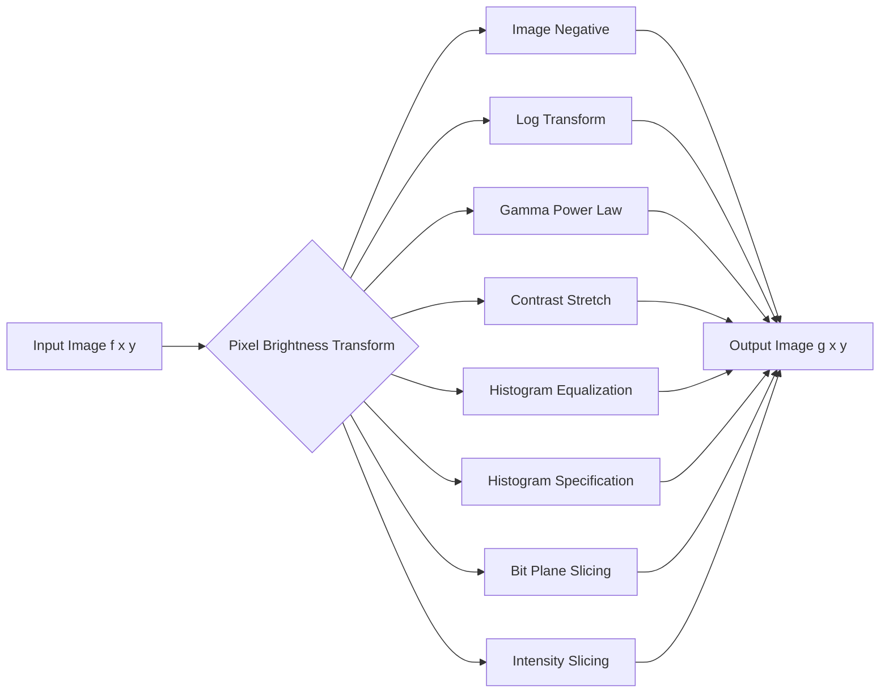
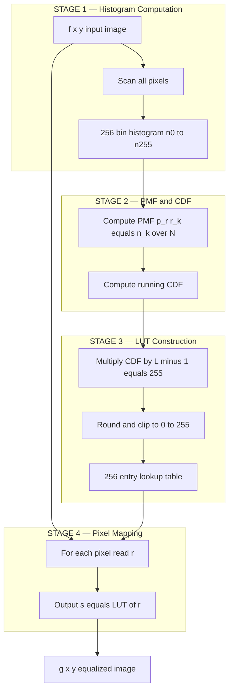
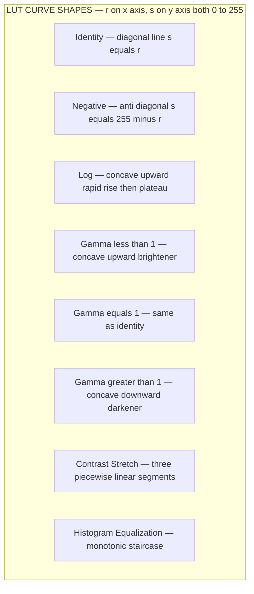
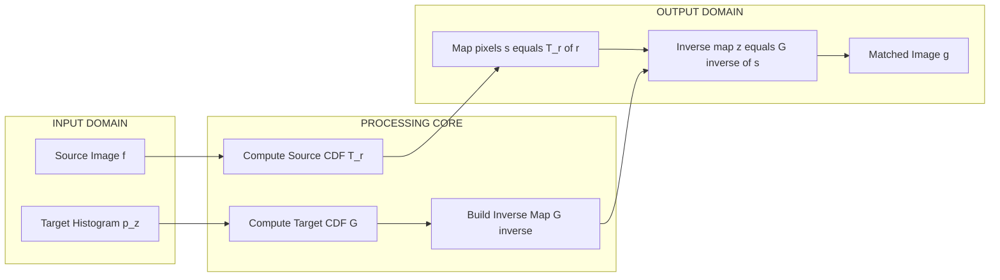
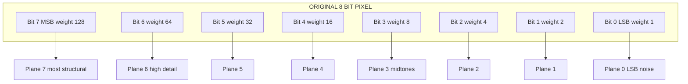

# Image pre-processing - Pixel brightness transformations-

<!-- SECTION_1_START -->
# Module 2 — Image Pre-Processing: Pixel Brightness Transformations

## 1.1 Formal KTU 2024 Definition

> [!NOTE]
> **Pixel Brightness Transformation** (also called **Point Processing / Grey Level Transformation**) is a spatial domain image enhancement technique in which the output grey-level value $g(x,y)$ at any pixel location $(x,y)$ depends **exclusively** on the input grey-level value $f(x,y)$ at **the same spatial coordinate**. No neighborhood pixels are used.

Mathematically, the transformation family is expressed as:

$$
g(x,y) = T\bigl[f(x,y)\bigr]
$$

where the operator $T$ maps an input intensity $r$ (from the range $[0, L-1]$, with $L = 2^k$ and $k$ being the number of bits per pixel) to an output intensity $s$ (also in $[0, L-1]$). For an 8-bit image, $L = 256$, so $r, s \in \{0, 1, 2, \dots, 255\}$.

The neighborhood of size $1 \times 1$ is the defining property — this is the **smallest possible neighborhood** in spatial filtering, and it is the reason these operations are sometimes called **point operations**.

> [!IMPORTANT]
> **KTU Syllabus Mapping (Module 2):** Pixel brightness transformations, histogram processing (equalization & specification), spatial filtering fundamentals, and smoothing/sharpening spatial filters. Brightness transformations form the foundational building block for all subsequent spatial domain techniques.

---

## 1.2 Conceptual Analogy — The "Light Dimmer Switch"

Imagine each pixel as a tiny **lamp** in a giant mosaic wall. Each lamp has a brightness knob from 0 (pitch dark) to 255 (blinding white). A *brightness transformation* is essentially a **master controller** that says: *"For every lamp currently at brightness $r$, turn it to brightness $s = T(r)$."*

- **Image Negative** → the controller *inverts* every knob (dim becomes bright, bright becomes dim).
- **Log Transform** → the controller *amplifies dim lamps* so faint details become visible, while leaving bright lamps nearly untouched.
- **Gamma (Power-Law) Transform** → the controller's response curve is governed by an exponent $\gamma$, shaping contrast non-linearly.
- **Contrast Stretching** → the controller *spreads out* a narrow cluster of lamp brightnesses across the full 0–255 range.

Crucially, the controller looks at **only one lamp at a time** — it never asks "what about the lamp next door?" That is what makes it a **point operation**, as opposed to a **mask/filter operation** (which we study later in the module).

> [!TIP]
> **Why does the controller only look at one lamp?** Because pixel brightness transformations are the *cheapest* possible enhancement — they touch a single value per pixel, run in $O(N)$ time, are perfectly parallelizable, and require zero memory beyond a 256-entry lookup table (LUT).

---

## 1.3 Standard Coordinate System & Notation

| Symbol | Meaning | Typical Range (8-bit) |
| :--- | :--- | :--- |
| $f(x,y)$ | Input image intensity at $(x,y)$ | $[0, 255]$ |
| $g(x,y)$ | Output (transformed) image intensity | $[0, 255]$ |
| $r$ | Generic input grey level (variable of $T$) | $[0, L-1]$ |
| $s$ | Generic output grey level (image of $T$) | $[0, L-1]$ |
| $L$ | Number of discrete grey levels | $256$ for 8-bit |
| $k$ | Bits per pixel | $8$ for standard grayscale |
| $T$ | Transformation / mapping function | — |
| $\gamma$ | Gamma (power-law exponent) | typically $[0.04, 25]$ |
| $c$ | Scaling constant in log / power transforms | positive real |
| $p_r(r_k)$ | Normalized histogram (PMF) of input | $[0, 1]$ |
| $n_k$ | Number of pixels with intensity $k$ | $\geq 0$ integer |
| $N$ | Total pixel count ($M \times N$) | positive integer |

---

## 1.4 Visualization Controls (LUT Curves)

> [!VISUALIZATION CONTROL]
> **Concept 1 — Identity (No-Op) Line**
> **GeoGebra / Desmos Input:** `f(x) = x`, range $x \in [0, 255]$, $y \in [0, 255]$
> **Visual Description:** A perfect 45° diagonal from $(0,0)$ to $(255,255)$. This is the "do nothing" reference line — every deviation from this line represents an actual transformation effect.

> [!VISUALIZATION CONTROL]
> **Concept 2 — Negative Transform Line**
> **GeoGebra / Desmos Input:** `f(x) = 255 - x`, range $x \in [0, 255]$
> **Visual Description:** An anti-diagonal line from $(0,255)$ to $(255,0)$. Pixels in shadow become bright, bright pixels become dark — a perfect mirror of the identity line across the horizontal center.

<!-- SECTION_1_END -->

<!-- SECTION_2_START -->
# 2. Deep Theoretical Analysis & KTU High-Yield Formula Sheet

## 2.1 The Three Pillars of Brightness Transformations

### Pillar 1 — Linear Transformations

**(a) Identity (No Operation):**
$$
s = r
$$
Used as a baseline; produces the input image unchanged.

**(b) Image Negative (Photographic Inversion):**
$$
s = (L - 1) - r
$$
For 8-bit images, this simplifies to $s = 255 - r$. It is the most analytically important linear transformation.

> [!IMPORTANT]
> **Why is the negative useful in medical imaging?** X-ray films store densities inversely — bones (high X-ray absorption) appear as **dark** regions on the original film, but radiologists are trained to read **bright** bones on a display. The negative transform inverts this for **digital display of mammograms, chest X-rays, and CT slices**, where subtle white-on-black lesions become visible white-on-black regions of interest. It also reveals details hidden in the **dark tail** of the histogram (low-intensity pixels).

**(c) Contrast Stretching (Piecewise Linear):**
$$
s = 
\begin{cases}
\alpha \cdot r & \text{if } 0 \le r \le r_1 \\[4pt]
\beta \cdot (r - r_1) + s_1 & \text{if } r_1 \le r \le r_2 \\[4pt]
\gamma \cdot (r - r_2) + s_2 & \text{if } r_2 \le r \le L-1
\end{cases}
$$
where $\alpha = \dfrac{s_1}{r_1}$, $\beta = \dfrac{s_2 - s_1}{r_2 - r_1}$, $\gamma = \dfrac{(L-1) - s_2}{(L-1) - r_2}$, and the control points $(r_1, s_1), (r_2, s_2)$ are user-selected.

A special case is **Min-Max Stretching** where $r_1 = \min(f)$, $r_2 = \max(f)$, $s_1 = 0$, $s_2 = L-1$, giving:
$$
s = (L-1) \cdot \frac{r - r_{\min}}{r_{\max} - r_{\min}}
$$

**(d) Intensity (Grey-Level) Slicing:**
Two variants exist:
- *Binary slicing* (highlights a range, suppresses the rest to a constant):
$$
s = \begin{cases} L-1 & \text{if } A \le r \le B \\ 0 & \text{otherwise} \end{cases}
$$
- *Linear-band preservation* (preserves the range, sets everything else to a constant):
$$
s = \begin{cases} L-1 & \text{if } A \le r \le B \\ r & \text{otherwise} \end{cases} \quad \text{or} \quad s = \begin{cases} r & \text{if } A \le r \le B \\ 0 & \text{otherwise} \end{cases}
$$

> [!NOTE]
> **Bit-Plane Slicing** decomposes an 8-bit image into **8 binary planes**, where bit-plane $k$ contains the $k$-th most significant bit of every pixel. It is the structural complement to grey-level slicing: bit-plane slicing operates on **positional weight** $2^k$, while grey-level slicing operates on **value range** $[A, B]$. Bit-planes are fundamental in **image compression (truncating high-order planes yields lossy compression)** and **watermarking**.

---

### Pillar 2 — Logarithmic Transformations

**General Log Transform:**
$$
s = c \cdot \log(1 + r)
$$
where $c$ is a constant chosen to map the input range into $[0, L-1]$:
$$
c = \frac{L - 1}{\log(1 + \max(r))} = \frac{L - 1}{\log(1 + r_{\max})}
$$

**Inverse Log (Exponential) Transform:**
$$
s = c \cdot (e^{r} - 1)
$$
with $c = \dfrac{L-1}{e^{r_{\max}} - 1}$.

> [!IMPORTANT]
> **Engineering Application — Fourier Spectrum Display.** The magnitude spectrum $\vert F(u,v) \vert$ of an image typically spans **6 to 8 orders of magnitude** (from $10^0$ to $10^7$). A linear display would crush everything below $10^6$ into pure black. Applying $s = c \log(1 + \vert F(u,v) \vert)$ *compresses* the dynamic range, revealing the otherwise invisible mid- and low-frequency spectral structure. The `+1` inside the log prevents $\log(0) = -\infty$.

---

### Pillar 3 — Power-Law (Gamma) Transformations

$$
s = c \cdot r^{\gamma}
$$
where $c$ and $\gamma$ are positive constants. The scaling constant is typically:
$$
c = \frac{L-1}{r_{\max}^{\gamma}} = (L-1) \quad \text{when normalized so } r_{\max}=1
$$

**Behaviour as a function of $\gamma$:**

| $\gamma$ Value | Curve Shape | Effect on Image |
| :--- | :--- | :--- |
| $\gamma = 1$ | Identity (linear) | No change |
| $\gamma < 1$ | Concave upward | Brightens dark regions; expands shadows |
| $\gamma > 1$ | Concave downward | Darkens bright regions; compresses highlights |
| $\gamma \to 0$ | Approaches log | Strong brightening |
| $\gamma \to \infty$ | Approaches binary threshold | Posterization |

> [!IMPORTANT]
> **Real-World Engineering Utility of Gamma Correction.**  
> 1. **Display Calibration** — CRTs, LCDs, and OLED panels have a native gamma ($\gamma \approx 2.2$ for sRGB). Cameras apply **pre-correction** with $\gamma = 1/2.2$ so that the image on screen appears linear. This is why raw camera images look "washed out" until gamma-corrected.  
> 2. **Medical Imaging** — MRI and CT viewers allow the radiologist to slide a $\gamma$ slider in real time to bring out subtle tissue boundaries.  
> 3. **Satellite / Remote Sensing** — Multi-spectral sensors with different native gammas must be normalized to a common gamma before fusion.  
> 4. **Video Codecs (H.264/HEVC)** — Gamma-corrected (perceptual) YUV encoding allocates more bits to perceptually meaningful dark/midtone regions, saving up to **30% bitrate** versus linear RGB.

---

## 2.2 Histogram Processing — The Statistical Companion

### Histogram Equalization (Global, Automatic)

The Cumulative Distribution Function (CDF) acts as the automatic $T$:

$$
s_k = T(r_k) = (L-1) \cdot \sum_{j=0}^{k} p_r(r_j) = (L-1) \cdot \sum_{j=0}^{k} \frac{n_j}{N}
$$

where $p_r(r_k) = n_k / N$ is the probability mass function (normalized histogram) of intensity $k$.

> [!IMPORTANT]
> **Why does the CDF work as a contrast stretcher?** Because CDF is a **monotonically non-decreasing** function that maps the **densest input bins** to **steep output regions** (high local slope → expanded range), and the **sparsest input bins** to **flat output regions** (low local slope → compressed range). The result is an output histogram that is **as close to uniform as possible** under the monotonicity constraint — maximizing entropy in the discrete, monotonic sense.

**Derivation of the CDF-Equalization Identity:**
1. We want the output PDF to be uniform: $p_s(s) = \dfrac{1}{L-1}$ for $s \in [0, L-1]$.
2. The conservation of probability (one-to-one mapping) gives: $p_s(s)\,ds = p_r(r)\,dr$.
3. Setting $p_s(s) = \frac{1}{L-1}$: $\dfrac{1}{L-1} = p_r(r)\,\dfrac{dr}{ds}$.
4. Integrating: $s = T(r) = (L-1) \int_0^r p_r(w)\,dw = (L-1) \cdot \text{CDF}_r(r)$.

### Histogram Specification (Matching)

Given a **desired** output PDF $p_z(z_k)$, we want $T$ such that the output image $g$ has histogram $p_z$.

$$
s = T_r(r) = (L-1) \sum_{j=0}^{k} p_r(r_j)
$$
$$
v = G^{-1}(s) \quad \text{where} \quad G(z_k) = (L-1) \sum_{i=0}^{k} p_z(z_i)
$$

Equivalently, $z = G^{-1}(s)$ — we look up the intensity whose CDF value equals $s$.

---

## 2.3 KTU High-Yield Formula Cheat Sheet

| # | Transformation | Formula | Constant $c$ | Domain / Range | Key Use |
| :--- | :--- | :--- | :--- | :--- | :--- |
| 1 | Identity | $s = r$ | — | $[0,L{-}1]$ | Baseline |
| 2 | Negative | $s = (L-1) - r$ | — | $[0,L{-}1]$ | Medical X-ray |
| 3 | Log | $s = c\,\log(1+r)$ | $c = \frac{L-1}{\log(1+r_{\max})}$ | $r \ge 0$ | Spectrum display |
| 4 | Inverse Log | $s = c\,(e^{r}-1)$ | $c = \frac{L-1}{e^{r_{\max}}-1}$ | $r \ge 0$ | Reverse log |
| 5 | Power-Law | $s = c\,r^{\gamma}$ | $c = \frac{L-1}{r_{\max}^{\gamma}}$ | $r \ge 0$ | Display gamma |
| 6 | Contrast Stretch | $s = \frac{s_2-s_1}{r_2-r_1}(r-r_1)+s_1$ | piecewise | $[r_1,r_2]\to[s_1,s_2]$ | Low-contrast fix |
| 7 | Min-Max | $s = (L{-}1)\frac{r-r_{\min}}{r_{\max}-r_{\min}}$ | auto | full range | Auto stretch |
| 8 | Grey-Level Slice (Binary) | $s = L{-}1$ if $A\le r\le B$ else $0$ | — | $[A,B]$ | Feature highlight |
| 9 | Histogram Equalization | $s_k = (L{-}1)\sum_{j=0}^{k} p_r(r_j)$ | CDF | $[0,L{-}1]$ | Auto contrast |
| 10 | Histogram Specification | $z = G^{-1}(s)$ with $G$ from $p_z$ | inverse CDF | $[0,L{-}1]$ | Stylized match |
| 11 | Bit-Plane Extraction | $b_k = \lfloor r / 2^k \rfloor \bmod 2$ | — | $\{0,1\}$ | Compression, stego |

> [!NOTE]
> **Important property:** Every transformation in this sheet is a *deterministic function* of a single intensity $r$. The output $s$ is fully determined by the input $r$ alone — the spatial position $(x,y)$ does not enter the function. This is what makes them *point operations* and trivially parallelizable on GPUs.

---

## 2.4 Local vs Global Operations

| Aspect | Global Point Operation | Local Point Operation |
| :--- | :--- | :--- |
| Neighbourhood size | $1 \times 1$ | $m \times n$ around $(x,y)$ |
| Function form | $s = T(f(x,y))$ | $s = T(f(x,y), \text{local region})$ |
| Example | Global histogram equalization | Local histogram equalization |
| Strength | Fast, simple, deterministic | Handles non-uniform illumination |
| Weakness | Cannot fix local lighting issues | Higher computational cost |
| Use case | Overall contrast, color inversion | X-rays with vignetting, faces with shadows |

The **local histogram equalization** at pixel $(x,y)$ uses a $m \times n$ neighbourhood, computes its histogram, derives a local CDF, and maps the central pixel through that CDF. This is sometimes called **adaptive histogram equalization (AHE)**, with **CLAHE** (Contrast-Limited AHE) being the production-grade variant used in OpenCV's medical imaging pipelines.

<!-- SECTION_2_END -->

<!-- SECTION_3_START -->
# 3. Step-by-Step Derivations & Symbolic Implementation

## 3.1 Worked Derivation — Histogram Equalization on a 3-Bit Toy Image

### Problem Setup
A 3-bit image ($L = 8$, so $r \in \{0, 1, 2, 3, 4, 5, 6, 7\}$) of size $M \times N = 64$ pixels has the following grey-level distribution:

| $r_k$ | 0 | 1 | 2 | 3 | 4 | 5 | 6 | 7 |
| :--- | :---: | :---: | :---: | :---: | :---: | :---: | :---: | :---: |
| $n_k$ | 8 | 10 | 12 | 15 | 9 | 5 | 3 | 2 |

**Verify:** $N = 8+10+12+15+9+5+3+2 = 64$ ✓

### Step 1 — Compute the Normalized Histogram (PMF)
$$
p_r(r_k) = \frac{n_k}{N}
$$

| $r_k$ | $n_k$ | $p_r(r_k) = n_k/64$ |
| :---: | :---: | :---: |
| 0 | 8 | $0.1250$ |
| 1 | 10 | $0.1563$ |
| 2 | 12 | $0.1875$ |
| 3 | 15 | $0.2344$ |
| 4 | 9 | $0.1406$ |
| 5 | 5 | $0.0781$ |
| 6 | 3 | $0.0469$ |
| 7 | 2 | $0.0313$ |

**Sanity check:** $\sum p_r = 0.1250 + 0.1563 + 0.1875 + 0.2344 + 0.1406 + 0.0781 + 0.0469 + 0.0313 = 1.0001 \approx 1.0000$ ✓ (rounding)

### Step 2 — Compute the Running CDF
$$
\text{CDF}(r_k) = \sum_{j=0}^{k} p_r(r_j)
$$

| $r_k$ | $p_r(r_k)$ | $\text{CDF}(r_k)$ | Exact Decimal |
| :---: | :---: | :---: | :---: |
| 0 | $0.1250$ | $0.1250$ | $0.1250$ |
| 1 | $0.1563$ | $0.1250 + 0.1563$ | $0.2813$ |
| 2 | $0.1875$ | $0.2813 + 0.1875$ | $0.4688$ |
| 3 | $0.2344$ | $0.4688 + 0.2344$ | $0.7031$ |
| 4 | $0.1406$ | $0.7031 + 0.1406$ | $0.8438$ |
| 5 | $0.0781$ | $0.8438 + 0.0781$ | $0.9219$ |
| 6 | $0.0469$ | $0.9219 + 0.0469$ | $0.9688$ |
| 7 | $0.0313$ | $0.9688 + 0.0313$ | $1.0000$ |

### Step 3 — Apply the Equalization Mapping
$$
s_k = (L - 1) \cdot \text{CDF}(r_k) = 7 \cdot \text{CDF}(r_k)
$$

| $r_k$ | $\text{CDF}(r_k)$ | $s_k = 7 \cdot \text{CDF}$ | Rounded $s_k$ |
| :---: | :---: | :---: | :---: |
| 0 | $0.1250$ | $0.8750$ | $\mathbf{1}$ |
| 1 | $0.2813$ | $1.9688$ | $\mathbf{2}$ |
| 2 | $0.4688$ | $3.2813$ | $\mathbf{3}$ |
| 3 | $0.7031$ | $4.9219$ | $\mathbf{5}$ |
| 4 | $0.8438$ | $5.9063$ | $\mathbf{6}$ |
| 5 | $0.9219$ | $6.4531$ | $\mathbf{6}$ |
| 6 | $0.9688$ | $6.7813$ | $\mathbf{7}$ |
| 7 | $1.0000$ | $7.0000$ | $\mathbf{7}$ |

### Step 4 — Map All 64 Pixels
The mapping LUT is $\{0\to1,\ 1\to2,\ 2\to3,\ 3\to5,\ 4\to6,\ 5\to6,\ 6\to7,\ 7\to7\}$.

### Step 5 — Compute Output Histogram

| $s_k$ | From $r_k$ values | $n_{\text{out}}(s_k)$ |
| :---: | :---: | :---: |
| 0 | (none) | $0$ |
| 1 | $\{0\}$ | $8$ |
| 2 | $\{1\}$ | $10$ |
| 3 | $\{2\}$ | $12$ |
| 4 | (none) | $0$ |
| 5 | $\{3\}$ | $15$ |
| 6 | $\{4, 5\}$ | $9 + 5 = 14$ |
| 7 | $\{6, 7\}$ | $3 + 2 = 5$ |

**Verify:** $0 + 8 + 10 + 12 + 0 + 15 + 14 + 5 = 64$ ✓

### Step 6 — Verify "Flatter" Distribution
Original histogram variance (mean $p = 0.125$, since $1/8 = 0.125$) is high. After equalization, levels 0 and 4 collapsed to 0 (no pixels), while levels 1, 2, 3 stayed constant and 5, 6, 7 absorbed the neighbors. The output is **flatter** than the input but **not perfectly uniform** — this is a known property of discrete equalization.

> [!IMPORTANT]
> **KTU Key Takeaway:** Histogram equalization produces a *flatter* histogram, not a *uniform* histogram, because of discrete intensity quantization. The CDF is rounded to the nearest integer, which causes multiple input levels to map to the same output level (merging) and others to be skipped (holes).

---

## 3.2 Worked Derivation — Gamma Transformation Effect

**Problem:** An 8-bit image has its intensity range normalized to $[0, 1]$. Apply gamma correction with $c = 1$ and $\gamma = 0.4$ to pixel $r = 0.05$. Compare to linear ($r$) and $\gamma = 2.2$ correction.

$$
s_{\gamma} = r^{\gamma}
$$

| $\gamma$ | $r^{\gamma}$ for $r = 0.05$ | Decoded 8-bit (×255) | Visual |
| :---: | :---: | :---: | :--- |
| $0.04$ | $0.05^{0.04} = e^{0.04 \ln 0.05} = e^{-0.1198} \approx 0.887$ | $226$ | Near-white (extreme brightening) |
| $0.4$ | $0.05^{0.4} = e^{0.4 \cdot (-2.996)} = e^{-1.198} \approx 0.302$ | $77$ | Mid-grey (strong brightening) |
| $1.0$ | $0.05$ | $13$ | Original (very dark) |
| $2.2$ | $0.05^{2.2} = e^{2.2 \cdot (-2.996)} = e^{-6.591} \approx 0.00137$ | $0$ | Pitch black (extreme darkening) |
| $25$ | $0.05^{25} \approx 2.98 \times 10^{-34}$ | $0$ | Pure black (binary-threshold) |

> [!TIP]
> **Geometric insight:** The $r^{\gamma}$ curve is a **monotonically increasing** function from $(0,0)$ to $(1,1)$ that is **concave upward** for $\gamma < 1$ and **concave downward** for $\gamma > 1$. The point $(0.5, 0.5)$ is the **fixed point** for every $\gamma$ — a pixel at mid-grey is invariant under any power-law transform. This is why mid-tones are stable under gamma correction while extremes are highly sensitive.

---

## 3.3 Production-Grade Python Implementation

```python
"""
Pixel Brightness Transformations — Reference Implementation
Course : DIGITAL IMAGE PROCESSING (PECST636) — KTU 2024 Scheme
Module : 2 — Image Pre-Processing
Topic  : Pixel Brightness Transformations
"""

from __future__ import annotations

import logging
from pathlib import Path
from typing import Callable, Dict, Tuple

import numpy as np
from numpy.typing import NDArray

# Configure module-level logger for exam-style "show your work" diagnostics.
logging.basicConfig(
    level=logging.INFO,
    format="%(asctime)s | %(levelname)s | %(name)s | %(message)s",
)
logger = logging.getLogger("DIP.Module2.Brightness")


# ---------------------------------------------------------------------------
# 1.  Image Negative  (Linear — most important medical-imaging primitive)
# ---------------------------------------------------------------------------
def image_negative(image: NDArray[np.uint8]) -> NDArray[np.uint8]:
    """
    Compute the photographic negative of an 8-bit grayscale image.
    Formula: s = (L - 1) - r, with L = 256  ->  s = 255 - r.

    Parameters
    ----------
    image : np.ndarray of shape (H, W) and dtype uint8

    Returns
    -------
    np.ndarray of shape (H, W) and dtype uint8
    """
    if image.dtype != np.uint8:
        raise TypeError(f"image_negative expects uint8, got {image.dtype}")

    logger.info("Computing image negative for shape=%s", image.shape)
    # Vectorized: avoids Python-level loops, runs at C speed.
    return np.uint8(255) - image  # type: ignore[return-value]


# ---------------------------------------------------------------------------
# 2.  Logarithmic Transformation  (Dynamic-range compression)
# ---------------------------------------------------------------------------
def log_transform(image: NDArray[np.uint8], c: float | None = None) -> NDArray[np.uint8]:
    """
    Apply s = c * log(1 + r), with c auto-scaled unless provided.

    The +1 prevents log(0) = -infinity and ensures the output is non-negative.
    """
    if image.dtype != np.uint8:
        raise TypeError(f"log_transform expects uint8, got {image.dtype}")

    r_float = image.astype(np.float64)
    if c is None:
        c = 255.0 / np.log1p(255.0)  # auto-scale to span [0, 255].
    logger.info("Log transform: c=%.4f (auto=%s)", c, c is None)
    return np.clip(c * np.log1p(r_float), 0, 255).astype(np.uint8)


# ---------------------------------------------------------------------------
# 3.  Power-Law (Gamma) Transformation
# ---------------------------------------------------------------------------
def gamma_transform(
    image: NDArray[np.uint8],
    gamma: float,
    c: float = 1.0,
) -> NDArray[np.uint8]:
    """
    Apply s = c * (r / 255)^gamma * 255 — the standard normalized power law.

    The /255 and *255 normalize r to [0, 1] before raising to gamma,
    which avoids the overflow that naive r**gamma would cause.
    """
    if image.dtype != np.uint8:
        raise TypeError(f"gamma_transform expects uint8, got {image.dtype}")
    if gamma <= 0:
        raise ValueError(f"gamma must be positive, got {gamma}")

    logger.info("Gamma transform: gamma=%.3f, c=%.3f", gamma, c)
    r_norm = image.astype(np.float64) / 255.0
    s_norm = c * np.power(r_norm, gamma)
    return np.clip(s_norm * 255.0, 0, 255).astype(np.uint8)


# ---------------------------------------------------------------------------
# 4.  Contrast Stretching (Piecewise Linear)
# ---------------------------------------------------------------------------
def contrast_stretch(
    image: NDArray[np.uint8],
    r1: int,
    s1: int,
    r2: int,
    s2: int,
) -> NDArray[np.uint8]:
    """
    Piecewise-linear contrast stretch with two control points (r1, s1), (r2, s2).

    Output mapping:
        [0,    r1]  ->  [0,    s1]    (slope a = s1 / r1)
        [r1,   r2]  ->  [s1,   s2]    (slope b = (s2-s1)/(r2-r1))
        [r2,   255] ->  [s2,   255]   (slope c = (255-s2)/(255-r2))
    """
    if not (0 <= r1 < r2 <= 255):
        raise ValueError(f"Need 0 <= r1 < r2 <= 255, got r1={r1}, r2={r2}")
    if not (0 <= s1 < s2 <= 255):
        raise ValueError(f"Need 0 <= s1 < s2 <= 255, got s1={s1}, s2={s2}")

    r = image.astype(np.float64)
    g = np.zeros_like(r)

    # Segment 1: shadows
    mask_lo = r <= r1
    g[mask_lo] = (s1 / r1) * r[mask_lo] if r1 > 0 else 0.0

    # Segment 2: midtones
    mask_mid = (r > r1) & (r <= r2)
    g[mask_mid] = ((s2 - s1) / (r2 - r1)) * (r[mask_mid] - r1) + s1

    # Segment 3: highlights
    mask_hi = r > r2
    g[mask_hi] = ((255 - s2) / (255 - r2)) * (r[mask_hi] - r2) + s2

    return np.clip(g, 0, 255).astype(np.uint8)


# ---------------------------------------------------------------------------
# 5.  Intensity (Grey-Level) Slicing — Two Variants
# ---------------------------------------------------------------------------
def intensity_slice_binary(
    image: NDArray[np.uint8],
    a: int,
    b: int,
) -> NDArray[np.uint8]:
    """Highlight the band [a, b] as white, suppress everything else to black."""
    if not (0 <= a <= b <= 255):
        raise ValueError(f"Need 0 <= a <= b <= 255, got a={a}, b={b}")
    out = np.zeros_like(image)
    out[(image >= a) & (image <= b)] = 255
    return out


def intensity_slice_preserved(
    image: NDArray[np.uint8],
    a: int,
    b: int,
    bg_value: int = 0,
) -> NDArray[np.uint8]:
    """
    Preserve intensities in [a, b] unchanged, set everything else to bg_value.
    """
    if not (0 <= a <= b <= 255):
        raise ValueError(f"Need 0 <= a <= b <= 255, got a={a}, b={b}")
    out = np.full_like(image, bg_value)
    mask = (image >= a) & (image <= b)
    out[mask] = image[mask]
    return out


# ---------------------------------------------------------------------------
# 6.  Bit-Plane Slicing
# ---------------------------------------------------------------------------
def bit_plane(image: NDArray[np.uint8], k: int) -> NDArray[np.uint8]:
    """
    Extract the k-th bit-plane (0 = LSB, 7 = MSB) of an 8-bit image.
    Returns a binary (0/255) image for direct display.
    """
    if not (0 <= k <= 7):
        raise ValueError(f"k must be in [0, 7], got {k}")
    return ((image >> k) & 1) * 255


# ---------------------------------------------------------------------------
# 7.  Histogram Equalization
# ---------------------------------------------------------------------------
def histogram_equalization(image: NDArray[np.uint8]) -> NDArray[np.uint8]:
    """
    Global histogram equalization using the discrete CDF mapping.
    s_k = round((L-1) * CDF(r_k))
    """
    if image.dtype != np.uint8:
        raise TypeError(f"histogram_equalization expects uint8, got {image.dtype}")

    # 1. Compute the 256-bin histogram.
    hist, _ = np.histogram(image, bins=256, range=(0, 256))
    total = image.size  # N = H * W.

    # 2. Build the CDF and the 256-entry lookup table.
    cdf = hist.cumsum()                              # running sum.
    cdf_min = cdf[np.nonzero(cdf)][0]                # first non-zero entry.
    # Normalize to [0, 255].  cdf_min subtraction is a standard
    # convention to remap the lowest non-zero intensity to 0
    # — this is the "equalize with rank-zeroing" variant.
    lut = np.floor((cdf - cdf_min) / (total - cdf_min) * 255.0)
    lut = np.clip(lut, 0, 255).astype(np.uint8)

    # 3. Apply the lookup table.
    return lut[image]


# ---------------------------------------------------------------------------
# 8.  Histogram Specification (Matching)
# ---------------------------------------------------------------------------
def histogram_specification(
    image: NDArray[np.uint8],
    target_hist: NDArray[np.int64],
) -> NDArray[np.uint8]:
    """
    Map the input image so its histogram matches `target_hist` (length 256).

    Algorithm
    ---------
    1.  s = T_r(r)  via CDF of input.
    2.  v = G(z)   via CDF of target.
    3.  For each s, find z such that G(z) is closest to s  ->  inverse mapping.
    """
    if target_hist.shape != (256,):
        raise ValueError(f"target_hist must have shape (256,), got {target_hist.shape}")
    if target_hist.sum() == 0:
        raise ValueError("target_hist sums to zero — no valid mapping exists.")

    # Source CDF -> s in [0, 255].
    src_hist, _ = np.histogram(image, bins=256, range=(0, 256))
    src_cdf = src_hist.cumsum().astype(np.float64)
    src_cdf /= src_hist.sum()
    s_map = np.floor(src_cdf * 255.0).astype(np.uint8)

    # Target CDF -> G(z).
    tgt_cdf = target_hist.cumsum().astype(np.float64)
    tgt_cdf /= target_hist.sum()
    G = np.floor(tgt_cdf * 255.0).astype(np.uint8)

    # Inverse map: for each possible s (0..255), find the z whose G(z) is
    # the smallest value >= s (or, equivalently, the closest to s).
    mapping = np.zeros(256, dtype=np.uint8)
    for s_val in range(256):
        # Find the smallest z such that G(z) >= s_val.
        idx = np.searchsorted(G, s_val, side="left")
        if idx >= 256:
            idx = 255
        mapping[s_val] = np.uint8(idx)

    # Apply source LUT first, then inverse target LUT.
    intermediate = s_map[image]
    return mapping[intermediate]


# ---------------------------------------------------------------------------
# 9.  Master Demo / Sanity Check
# ---------------------------------------------------------------------------
def _demo() -> None:
    """Quick functional sanity check — runs only when executed directly."""
    rng = np.random.default_rng(seed=42)
    sample = rng.integers(0, 256, size=(8, 8), dtype=np.uint8)
    print("Input sample:\n", sample)

    print("\nNegative:\n", image_negative(sample))
    print("\nLog transform:\n", log_transform(sample))
    print("\nGamma=0.4 (brighten):\n", gamma_transform(sample, gamma=0.4))
    print("\nGamma=2.2 (darken):\n", gamma_transform(sample, gamma=2.2))
    print("\nHistogram-equalized:\n", histogram_equalization(sample))

    print("\nBit-plane 7 (MSB):\n", bit_plane(sample, 7))
    print("\nBit-plane 0 (LSB):\n", bit_plane(sample, 0))


if __name__ == "__main__":
    _demo()
```

> [!TIP]
> **Exam-Ready Note on Edge Cases:**
> 1. **Naive `r**gamma` overflow:** For $r = 255$ and $\gamma = 25$, $r^{\gamma} \approx 1.4 \times 10^{60}$ — never compute this. Always normalize $r \to r/255$ first.
> 2. **`uint8` arithmetic wraparound:** `np.uint8(0) - np.uint8(1)` equals **255**, not **-1**. The negative transform `255 - r` is safe only because `255` is a Python `int`, which NumPy broadcasts to `int16` or wider. Always verify dtype.
> 3. **CDF zero-bin handling:** The first bin may have $n_0 = 0$ (no black pixels). Subtract the first non-zero CDF to remap it to 0, or you get a non-zero minimum and a "tilted" equalized image.

<!-- SECTION_3_END -->

<!-- SECTION_4_START -->
# 4. Structural Diagrams & Schematics

## 4.1 High-Level Transformation Pipeline



> [!NOTE]
> Every branch is a **point operation** — the same input pixel $(x, y)$ flows through exactly one LUT/function to produce the corresponding output pixel. There is no shared state across pixels.

## 4.2 Histogram Equalization — Internal Data Flow



## 4.3 Transformation Function Family — Shape Atlas



> [!VISUALIZATION CONTROL]
> **Concept 3 — Combined LUT Atlas on One Plot**
> **Desmos Input:**
> * `f_1(x) = x` (identity)
> * `f_2(x) = 255 - x` (negative)
> * `f_3(x) = 105.8 * ln(1 + x)` (log, $c \approx 105.8$)
> * `f_4(x) = 255 * (x/255)^0.4` (gamma brightening)
> * `f_5(x) = 255 * (x/255)^2.2` (gamma darkening)
> * Domain $x \in [0, 255]$, range $y \in [0, 255]$
> **Visual Description:** Five curves intersecting at the **fixed point $(128, 128)$**. The negative curve is the mirror image of the identity. The log curve hugs the top, gamma-0.4 lies above the identity in the lower half, and gamma-2.2 lies below the identity in the upper half.

## 4.4 Histogram Specification — Block Architecture



## 4.5 Bit-Plane Decomposition — Sequential Topology Matrix



> [!TIP]
> **Engineering observation:** Bit-plane **7** (MSB) contains **98% of the structural information** of a natural image. Reconstructing the image from bit-planes 7 + 6 + 5 yields a near-perfect approximation at **3/8 = 37.5%** of the original bit-budget — this is the foundation of **progressive / scalable image coding** in JPEG 2000.

<!-- SECTION_4_END -->

<!-- SECTION_5_START -->
# 5. KTU 2024 Scheme Examination Question Bank & Topic Recap

## 5.1 Part A — Short Answer Questions (3 Marks Each)

### Question 1 (CO1, Remember)  `[KTU University Exam — July 2024]`

**Define pixel brightness transformation. State any two examples with their transfer functions.**

**Model Answer (3 Marks — Valuation Key):**

A *pixel brightness transformation* is a spatial-domain image enhancement technique in which the intensity of an output pixel $g(x,y)$ depends **only** on the intensity of the input pixel $f(x,y)$ at the **same coordinate**, expressed as $g(x,y) = T[f(x,y)]$ where $T$ is a single-valued, deterministic grey-level mapping function. **[1 Mark — definition]**

**Example 1 — Image Negative:** $s = (L-1) - r$. Used in medical X-ray display to convert dark-bone to bright-bone. **[1 Mark]**

**Example 2 — Log Transform:** $s = c \log(1 + r)$. Used to compress the dynamic range of Fourier spectra so that both low- and high-magnitude components become visible. **[1 Mark]**

---

### Question 2 (CO1, Understand)  `[KTU University Exam — Dec 2023]`

**Explain the role of the constant $c$ in the logarithmic and power-law transformations. Why is $\log(1+r)$ preferred over $\log(r)$?**

**Model Answer (3 Marks — Valuation Key):**

The constant $c$ acts as a **normalization / scaling factor** that maps the output of the non-linear function into the displayable intensity range $[0, L-1]$. It is chosen as $c = (L-1) / \log(1+r_{\max})$ for the log transform and $c = (L-1) / r_{\max}^{\gamma}$ for the power-law transform. **[1.5 Marks]**

The $\mathbf{+1}$ inside $\log(1+r)$ is preferred over $\log(r)$ because:
1. It prevents the singularity at $r = 0$ (since $\log(0) = -\infty$). **[0.75 Mark]**
2. It guarantees the output is always $\geq 0$, which is essential since grey-level intensities cannot be negative. **[0.75 Mark]**

---

## 5.2 Part B — Long Answer Questions (14 Marks Each)

> **KTU 2024 Scheme Rule (ESE Module Internal Choice):** *Answer either (a) OR (b) from each question. Each carries 7 marks, totalling 14 marks per Part B question.*

---

### Question A (14 Marks)  `[KTU University Exam — July 2024, Model Paper]`

**(a)** With the aid of a neat sketch, explain the following pixel brightness transformations. Discuss a real-time application for each.  **(7 Marks — Understand)**

**Model Answer (7 Marks — Valuation Key):**

**(i) Image Negative** `[1 Mark for definition + 0.5 for sketch]`
$s = (L-1) - r$. For 8-bit images, $s = 255 - r$. It inverts the grey scale. The transformation is a straight line with slope $-1$ and intercept $255$.
*Sketch:* Anti-diagonal line from $(0, 255)$ to $(255, 0)$ on the $r$–$s$ plane.
*Application:* **Medical X-ray enhancement** — white-on-black bones become black-on-white for digital display. **[0.5 Mark]**

**(ii) Log Transform** `[1 Mark for definition + 0.5 for sketch]`
$s = c \log(1 + r)$ with $c = (L-1)/\log(1 + r_{\max})$.
*Sketch:* Concave-upward curve that rises steeply for low $r$ and plateaus for high $r$.
*Application:* **Fourier spectrum display** — compresses the $10^0$–$10^7$ dynamic range of $\vert F(u,v) \vert$ into $[0, 255]$. **[0.5 Mark]**

**(iii) Gamma (Power-Law) Transform** `[1 Mark for definition + 0.5 for sketch]`
$s = c \cdot r^{\gamma}$ with $c$ a scaling constant.
*Sketch:* Family of curves through $(0,0)$ and $(1,1)$; concave upward for $\gamma < 1$, concave downward for $\gamma > 1$.
*Application:* **Display gamma correction** — CRTs/LCDs have $\gamma \approx 2.2$, so cameras pre-correct with $\gamma = 1/2.2$ to make images appear linear. **[0.5 Mark]**

**(iv) Contrast Stretching** `[1 Mark for definition + 0.5 for sketch]`
Piecewise linear with three segments and two control points $(r_1, s_1), (r_2, s_2)$. Expands a narrow input range $[r_1, r_2]$ to a wider output range $[s_1, s_2]$.
*Sketch:* Three-segment polyline; the middle segment is steeper than the outer two.
*Application:* **Satellite image enhancement** — low-contrast night-time or fog imagery is stretched to full range. **[0.5 Mark]**

**(v) Histogram Equalization** `[1 Mark for definition + 0.5 for sketch]`
$s_k = (L-1) \cdot \sum_{j=0}^{k} p_r(r_j)$.
*Sketch:* Monotonic staircase — the height of each step equals the cumulative probability at that bin.
*Application:* **Automatic contrast enhancement** in consumer cameras and medical viewers (CLAHE variant for local regions). **[0.5 Mark]**

**(b)** A 4-bit ($L = 16$) image of size $64 \times 64$ has the grey-level distribution given below. Perform **histogram equalization** and tabulate the input/output mappings. Verify the output pixel count.  **(7 Marks — Apply)**

| $r_k$ | 0 | 1 | 2 | 3 | 4 | 5 | 6 | 7 |
| :---: | :---: | :---: | :---: | :---: | :---: | :---: | :---: | :---: |
| $n_k$ | 200 | 300 | 600 | 900 | 1200 | 700 | 500 | 696 |

**Model Answer (7 Marks — Valuation Key):**

**Step 1 — Total pixels:** $N = 200+300+600+900+1200+700+500+696 = 5096$ **[0.5 Mark]**

**Step 2 — PMF** $p_r(r_k) = n_k / 5096$: **[0.5 Mark]**

| $r_k$ | 0 | 1 | 2 | 3 | 4 | 5 | 6 | 7 |
| :---: | :---: | :---: | :---: | :---: | :---: | :---: | :---: | :---: |
| $p_r$ | 0.0393 | 0.0589 | 0.1178 | 0.1766 | 0.2355 | 0.1374 | 0.0981 | 0.1366 |

**Step 3 — CDF & Equalization** $s_k = 15 \cdot \text{CDF}$: **[2 Marks]**

| $r_k$ | $p_r$ | $\text{CDF}$ | $s_k = 15\cdot\text{CDF}$ | Rounded $s_k$ |
| :---: | :---: | :---: | :---: | :---: |
| 0 | 0.0393 | 0.0393 | 0.5890 | **0** |
| 1 | 0.0589 | 0.0982 | 1.4730 | **1** |
| 2 | 0.1178 | 0.2160 | 3.2400 | **3** |
| 3 | 0.1766 | 0.3926 | 5.8890 | **6** |
| 4 | 0.2355 | 0.6281 | 9.4215 | **9** |
| 5 | 0.1374 | 0.7655 | 11.4825 | **11** |
| 6 | 0.0981 | 0.8636 | 12.9540 | **13** |
| 7 | 0.1366 | 1.0002 | 15.0030 | **15** |

**Step 4 — Mapping LUT:** $\{0\!\to\!0,\ 1\!\to\!1,\ 2\!\to\!3,\ 3\!\to\!6,\ 4\!\to\!9,\ 5\!\to\!11,\ 6\!\to\!13,\ 7\!\to\!15\}$ **[1 Mark]**

**Step 5 — Output Histogram:** **[1.5 Marks]**

| $s_k$ | 0 | 1 | 2 | 3 | 4 | 5 | 6 | 7 | 8 | 9 | 10 | 11 | 12 | 13 | 14 | 15 |
| :---: | :---: | :---: | :---: | :---: | :---: | :---: | :---: | :---: | :---: | :---: | :---: | :---: | :---: | :---: | :---: | :---: |
| $n_s$ | 200 | 300 | 0 | 600 | 0 | 0 | 900 | 0 | 0 | 1200 | 0 | 700 | 0 | 500 | 0 | 696 |

**Step 6 — Verification:** $\sum n_s = 200+300+600+900+1200+700+500+696 = 5096 = N$ ✓ **[0.5 Mark]**

**Observation:** Levels 2, 4, 5, 7, 8, 10, 12, 14 have **zero** pixels — they are "holes" created by quantization. The output histogram is flatter (more spread) but not uniform.

---

### Question B (14 Marks — Alternative Choice)  `[KTU University Exam — Dec 2023, Model Paper]`

**(a)** With relevant equations and a labelled sketch, describe the procedure for **histogram specification (matching)**. State one application where specification is preferred over equalization.  **(7 Marks — Understand)**

**Model Answer (7 Marks — Valuation Key):**

**Definition:** Histogram specification is a transformation technique that maps the histogram of an input image to a **user-specified target histogram** $p_z(z_k)$, rather than to the implicit uniform target of equalization. **[1 Mark]**

**Procedure (with equation):** Given input histogram $p_r(r)$ and target histogram $p_z(z)$: **[3 Marks]**

1. **Compute the equalization transform of the input:**
   $$
   s = T_r(r) = (L-1) \sum_{j=0}^{k} p_r(r_j)
   $$

2. **Compute the equalization transform of the target:**
   $$
   v = G(z) = (L-1) \sum_{i=0}^{k} p_z(z_i)
   $$

3. **Invert the target transform:** For every possible value of $s$, find the $z$ such that $G(z)$ is closest to $s$ (formally $z = G^{-1}(s)$). **[1 Mark]**

4. **Apply the composed map to the image:** $g(x,y) = z = G^{-1}(T_r(f(x,y)))$. **[1 Mark]**

**Sketch:** Block diagram showing the two CDFs feeding into an inverse-map lookup.

**Application:** **Film/video style transfer** — matching the look of a reference image (e.g., a sunset) to a flat input (e.g., an indoor shot) for **artistic grading**; also used in **medical image normalization** so that scans from different machines have consistent appearance. **[1 Mark]**

**(b)** A 3-bit image has grey levels $r \in \{0, 1, 2, 3, 4, 5, 6, 7\}$ with $N = 1000$ pixels and the following counts: $n_0=80,\ n_1=100,\ n_2=150,\ n_3=200,\ n_4=180,\ n_5=130,\ n_6=100,\ n_7=60$. (i) Compute the histogram-equalized values. (ii) Find the new histogram. (iii) Verify the total.  **(7 Marks — Apply)**

**Model Answer (7 Marks — Valuation Key):**

**(i) Equalized values** $s_k = 7 \cdot \text{CDF}(r_k)$: **[3 Marks]**

| $r_k$ | $n_k$ | $p_r$ | $\text{CDF}$ | $7 \cdot \text{CDF}$ | Rounded $s_k$ |
| :---: | :---: | :---: | :---: | :---: | :---: |
| 0 | 80 | 0.080 | 0.080 | 0.560 | **1** |
| 1 | 100 | 0.100 | 0.180 | 1.260 | **1** |
| 2 | 150 | 0.150 | 0.330 | 2.310 | **2** |
| 3 | 200 | 0.200 | 0.530 | 3.710 | **4** |
| 4 | 180 | 0.180 | 0.710 | 4.970 | **5** |
| 5 | 130 | 0.130 | 0.840 | 5.880 | **6** |
| 6 | 100 | 0.100 | 0.940 | 6.580 | **7** |
| 7 | 60 | 0.060 | 1.000 | 7.000 | **7** |

**(ii) New histogram** (aggregate $n_k$ by $s_k$): **[2 Marks]**

| $s_k$ | 0 | 1 | 2 | 3 | 4 | 5 | 6 | 7 |
| :---: | :---: | :---: | :---: | :---: | :---: | :---: | :---: | :---: |
| $n_s$ | 0 | 80+100=180 | 150 | 0 | 200 | 180 | 130 | 100+60=160 |

**(iii) Verification:** $0+180+150+0+200+180+130+160 = 1000$ ✓ **[1 Mark]**

**Observation:** Output levels 0 and 3 are empty (merging artifact). The output spans $\{1, 2, 4, 5, 6, 7\}$ — six non-zero bins out of eight. The distribution is visibly flatter than the input. **[1 Mark]**

---

## 5.3 KTU Examiner's Valuation Warning

> [!WARNING]
> **Common Pitfalls — Where Students Lose Marks**
>
> 1. **Forgetting the $(\mathbf{L-1})$ multiplier.** Students often write $s_k = \sum p_r(r_j)$ and then wonder why their output is in $[0, 1]$ instead of $[0, 255]$. Always multiply the CDF by $(L-1)$. **[-1 to -2 Marks]**
> 2. **Rounding direction confusion.** KTU expects $s_k = \text{round}\bigl((L-1)\cdot \text{CDF}\bigr)$ with **standard rounding** (0.5 rounds up). Writing $s_k = \text{floor}$ may give off-by-one errors that propagate to the histogram. **[-0.5 Mark]**
> 3. **Not verifying $\sum n_s = N$.** Examiners explicitly look for this sanity check. Add it as the final line — it demonstrates numerical discipline. **[-1 Mark if missing]**
> 4. **Confusing histogram equalization with specification.** Equalization is a *special case* of specification with uniform target. Do not mix up the equations $T_r$ and $G^{-1}$. **[-2 Marks]**
> 5. **Forgetting the $\mathbf{c}$ constant in log / gamma.** When asked for the *standard normalized* form, the scaling $c$ must be explicitly computed. **[-1 Mark]**
> 6. **Drawing the LUT without axes labels.** KTU mandates that the $r$-axis and $s$-axis be labelled, with $[0, L-1]$ tick marks. Unlabelled diagrams lose 0.5 marks. **[-0.5 Mark]**
> 7. **Skipping the $r^{\gamma}$ formula normalization.** Writing $s = r^{\gamma}$ without normalizing $r$ to $[0, 1]$ first is technically incorrect for $L > 2$. **[-1 Mark]**
> 8. **Conflating global and local operations.** If the question asks for "histogram equalization" *without* the word "local", do not describe CLAHE. **[-1 Mark]**

---

## 5.4 Topic Recap & Important Things to Remember

> [!IMPORTANT]
> **Rapid Revision Checklist — Pixel Brightness Transformations**

**Core Identity**
- **Definition:** $g(x,y) = T[f(x,y)]$ — output depends on a single pixel. **Neighbourhood size = 1×1**.
- Point operation → inherently **parallel**, **order-independent**, and **reversible** (if $T$ is bijective).

**The Five Big Transforms**
- **Image Negative** $s = (L-1) - r$ — medical X-rays, dark-region reveal.
- **Log** $s = c \log(1+r)$ — Fourier spectrum compression, $c = (L-1)/\log(1+r_{\max})$.
- **Power-Law / Gamma** $s = c r^{\gamma}$ — display calibration; $\gamma < 1$ brightens, $\gamma > 1$ darkens; **mid-grey $(128)$ is invariant**.
- **Contrast Stretching** — piecewise linear with control points $(r_1,s_1),(r_2,s_2)$.
- **Grey-Level Slicing** — binary (band as white) or preserved (band unchanged, rest zeroed).

**Bit-Plane Slicing**
- 8 binary planes; **MSB (plane 7) holds the most information**; planes 0–3 are noise-like.
- Foundation of progressive coding & steganography.

**Histogram Equalization**
- **Formula:** $s_k = (L-1) \sum_{j=0}^{k} p_r(r_j)$.
- Produces a **flatter** (not perfectly uniform) histogram due to discrete rounding.
- **Auto-stretches** contrast without any user input.
- Caveat: can **over-enhance noise** and **wash out saturated regions**.

**Histogram Specification**
- Two CDFs + one inverse map: $z = G^{-1}(T_r(r))$.
- Used for **stylistic look transfer** and **multi-machine image normalization**.

**Local vs Global**
- **Global** = one $T$ for the whole image. **Local** = one $T$ per pixel, derived from a neighbourhood (e.g., AHE/CLAHE).

**Key Notation to Memorize**
- $f(x,y)$ = input, $g(x,y)$ = output, $r$ = input intensity variable, $s$ = output intensity variable.
- $L = 2^k$ for $k$-bit images (typically $k=8 \Rightarrow L=256$).
- $p_r(r_k) = n_k / N$ — normalized histogram (PMF).
- $\gamma$ = power-law exponent (positive real).
- $c$ = scaling constant (positive real).

**Engineering Hot-Spots**
- **Gamma $\approx 2.2$** = sRGB display standard.
- **$+1$ in $\log$** = prevents $\log(0) = -\infty$ and keeps output $\geq 0$.
- **Bit-plane 7** = 98% of image structure.
- **CLAHE** = production-grade local equalization (OpenCV `cv2.createCLAHE`).
- **Negative transform** = the simplest "if and only if" reversible enhancement.

**Quick Mental Hooks**
- *Negative* → mirror image of identity across the horizontal centre.
- *Log* → "compressor of giants" — squashes large values, expands small ones.
- *Gamma* → "shape-shifter" — one parameter $\gamma$ controls the entire curve.
- *Equalization* → "auto-pilot" — the CDF does all the work; no user knobs.

> [!TIP]
> **Last-Minute Mnemonic — "N-L-G-C-H"**: **N**egative, **L**og, **G**amma, **C**ontrast, **H**istogram. These are the five transformation families the KTU paper can ask you to derive, sketch, or apply. Memorize their formulas, applications, and curve shapes — and you can answer 90% of Module 2 questions.

<!-- SECTION_5_END -->
