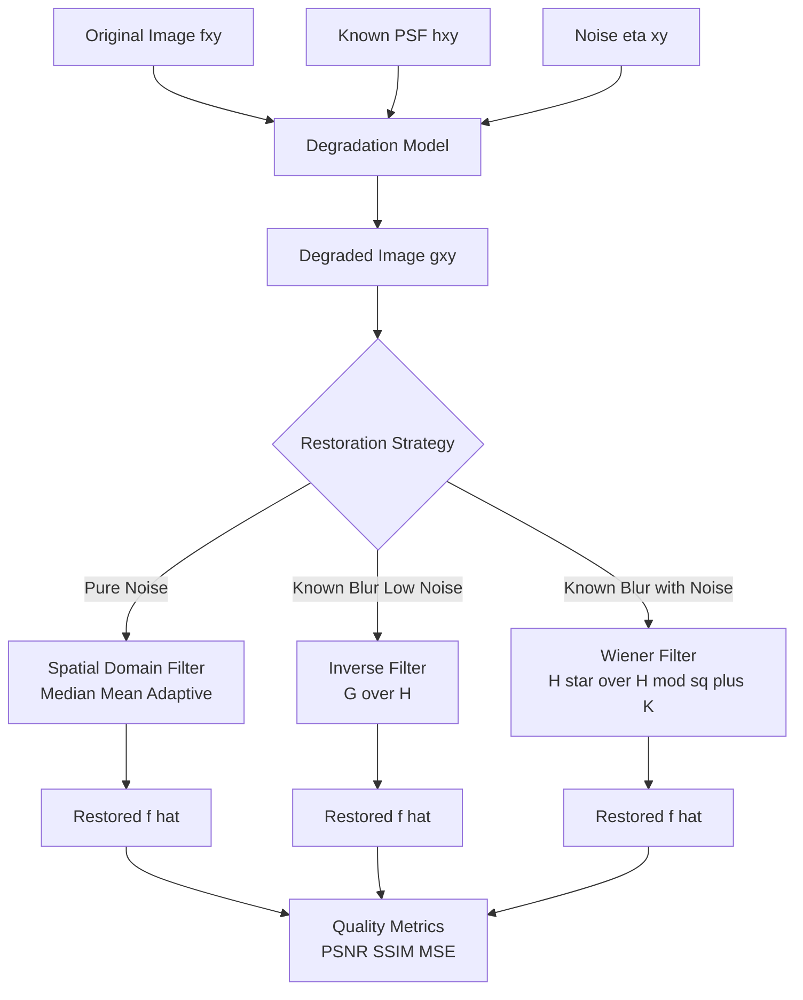
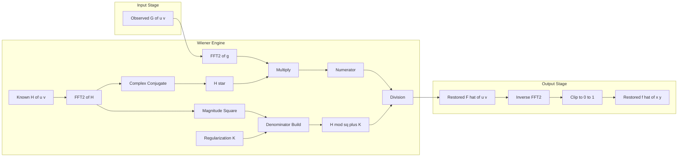
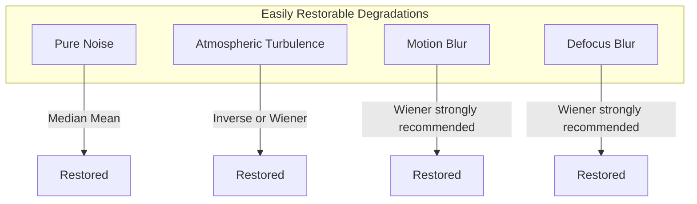
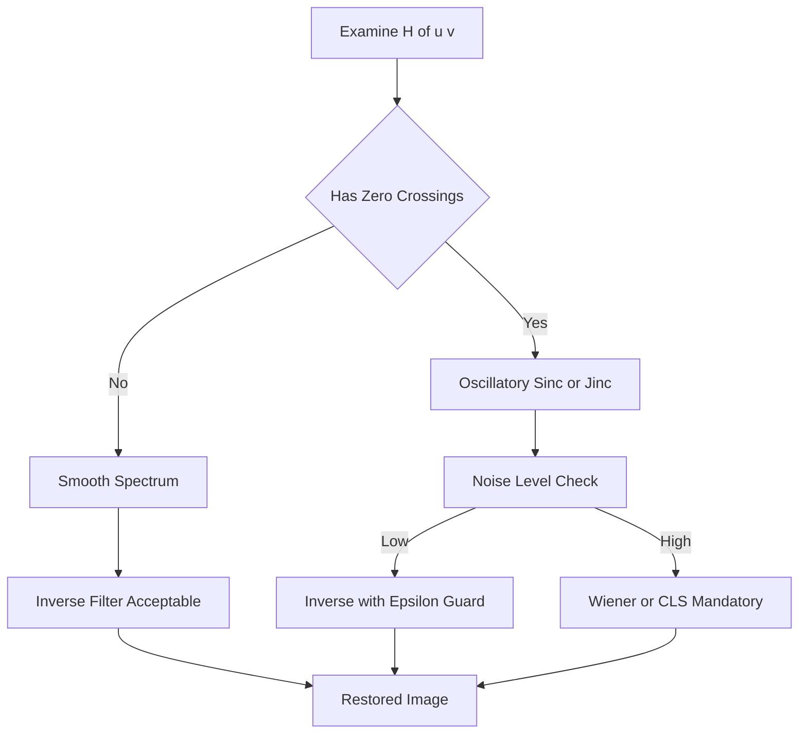

# Image Restoration - Degradations that are easy to restore

<!-- SECTION_1_START -->
# Image Restoration: Degradations That Are Easy to Restore

## 1.1 Formal KTU Definition

> [!IMPORTANT]
> **Image Restoration** is the process of recovering an original (ideal) image $f(x,y)$ from a degraded observation $g(x,y)$, using **a priori knowledge of the degradation function** $H$ and the noise statistics $\eta$.

The classical **degradation model** in spatial domain is:

$$g(x,y) = (f(x,y) * h(x,y)) + \eta(x,y)$$

The equivalent **frequency-domain** representation is:

$$G(u,v) = H(u,v) \, F(u,v) + N(u,v)$$

A degradation is said to be **"easy to restore"** when **all** of the following conditions hold simultaneously:

1. The Point Spread Function (PSF) $h(x,y)$ is **exactly known** and **spatially invariant**.
2. The degradation function $H(u,v)$ is **non-zero** at the operating frequencies (or its zeros are recoverable).
3. The noise $N(u,v)$ is **negligible**, **zero-mean**, or **known** in its power spectral density.
4. The system is **linear and shift-invariant (LSI)**, allowing direct deconvolution.

> [!NOTE]
> **KTU 2024 Module 2 Highlight:** The syllabus categorizes restoration by the *structure* of $H(u,v)$. The "easy" cases correspond to closed-form, analytically invertible kernels — atmospheric turbulence, motion blur, defocus blur, and pure noise (identity blur).

---

## 1.2 Intuitive Analogy — The "Smudged Glass" Model

Imagine you are looking at a printed photograph through a **slightly smudged glass plate**:

- The **smudge pattern** is the **degradation function** $H$. It spreads every point of the original image into a small blob.
- The **dust particles on the glass** are the **additive noise** $\eta$.
- The image you see (blurry + grainy) is the **degraded image** $g$.

| Scenario | Real-world Equivalent | Restoration Difficulty |
|---|---|---|
| Dust on glass (no smudge) | $H = \delta$, $\eta \neq 0$ | **Easy** — spatial filters |
| Known smudge, no dust | $H \neq \delta$, $\eta \approx 0$ | **Easy** — inverse filter |
| Known smudge + a little dust | Both present | **Moderate** — Wiener filter |
| Unknown smudge + heavy dust | Both unknown | **Hard** — blind deconvolution |

When the smudge pattern is **known and invertible**, restoration is essentially *de-smudging* the image — i.e., dividing by $H$ in the frequency domain.

---

## 1.3 Taxonomy of "Easy" Degradations

The four canonical "easy" degradations in the KTU syllabus are:

| # | Degradation Type | PSF $h(x,y)$ Shape | Frequency Response $H(u,v)$ | Primary Restorer |
|---|---|---|---|---|
| 1 | **Pure Noise (no blur)** | $\delta(x,y)$ | $H(u,v) = 1$ | Spatial filters (mean, median, adaptive) |
| 2 | **Atmospheric Turbulence** | Gaussian | $H(u,v) = e^{-k(u^2+v^2)^{5/6}}$ | Inverse / Wiener filter |
| 3 | **Motion Blur** (uniform linear) | Rectangular strip | $H(u,v) = \frac{\sin(\pi(au+bv))}{\pi(au+bv)} \, e^{-j\pi(au+bv)}$ | Inverse / Wiener filter |
| 4 | **Out-of-Focus Blur** | Circular disk (pillbox) | $H(u,v) = \frac{J_1(\pi d \sqrt{u^2+v^2})}{\pi d \sqrt{u^2+v^2}}$ | Inverse / Wiener filter |

> [!TIP]
> **Remember:** "Easy" does **not** mean *trivial*. It means the mathematics is closed-form and the PSF is fully identified by at most a few physical parameters (e.g., motion length $a$, focus radius $d$, turbulence constant $k$).

---

## 1.4 GeoGebra / Desmos Visualization

> [!VISUALIZATION CONTROL]
> **Concept:** Frequency-domain magnitude of the four "easy" degradation functions $|H(u,v)|$
>
> **GeoGebra / Desmos Input Equations (1D slice along $v=0$):**
> * $H_{1}(u) = 1$ — Pure noise (identity)
> * $H_{2}(u) = e^{-0.0025 \cdot u^{5/3}}$ — Atmospheric turbulence, $k=0.0025$
> * $H_{3}(u) = \frac{\sin(0.05 \cdot u)}{0.05 \cdot u}$ — Motion blur, $a = 0.05$
> * $H_{4}(u) = \frac{J_{1}(0.04 \cdot u)}{0.04 \cdot u}$ — Defocus blur, $d=0.04$
>
> **Visual Description:** Plot all four curves over $u \in [-60, 60]$. The student should observe:
> * $H_1$ is a flat line at 1.
> * $H_2$ is a smooth bell-decay with no zeros.
> * $H_3$ is a **sinc** function with **periodic zeros** (the cause of noise amplification in inverse filtering).
> * $H_4$ is a **Bessel-J1** function (jinc) with oscillatory zeros.
>
> **Key insight:** Zeros of $H$ are the "danger zones" where inverse filtering blows up noise. Wiener filtering handles this by adding a regularizing constant $K$.

<!-- SECTION_1_END -->

<!-- SECTION_2_START -->
# Deep Theoretical Analysis & KTU High-Yield Formula Sheet

## 2.1 The General Restoration Framework

The **central inverse problem** of image restoration is to estimate $\hat{f}(x,y)$ such that $\hat{f} \approx f$. The three classical estimators are:

### (A) Inverse Filter (Noiseless Case)

When $\eta \approx 0$:

$$\hat{F}(u,v) = \frac{G(u,v)}{H(u,v)}$$

This is the **direct deconvolution** — mathematically perfect when $H(u,v) \neq 0$ for all $(u,v)$.

> [!WARNING]
> **KTU Board Pitfall:** Inverse filtering **fails catastrophically** when $H(u,v)$ has zeros, because the noise term becomes $\frac{N(u,v)}{H(u,v)}$ which **blows up** at the zero-crossings. Marks are often lost for not stating this condition explicitly.

### (B) Wiener Filter (Minimum Mean Square Error)

When noise is present and non-negligible:

$$\hat{F}(u,v) = \left[ \frac{H^{*}(u,v)}{|H(u,v)|^{2} + S_{\eta}(u,v)/S_{f}(u,v)} \right] G(u,v)$$

where:
* $H^{*}$ — complex conjugate of the degradation transfer function.
* $S_{\eta}(u,v) = \vert N(u,v) \vert^{2}$ — power spectral density of noise.
* $S_{f}(u,v) = \vert F(u,v) \vert^{2}$ — power spectral density of the (unknown) original image.
* $S_{\eta}/S_{f}$ — **noise-to-signal power ratio (NSR)**.

**Simplified (constant-ratio) form** (used in board exams):

$$\hat{F}(u,v) = \left[ \frac{H^{*}(u,v)}{|H(u,v)|^{2} + K} \right] G(u,v)$$

where $K$ is a **scalar approximation** of the NSR.

### (C) Constrained Least Squares (CLS) Filter

$$\hat{F}(u,v) = \left[ \frac{H^{*}(u,v)}{|H(u,v)|^{2} + \gamma \cdot P(u,v)} \right] G(u,v)$$

where $P(u,v) = \vert C(u,v) \vert^{2}$ and $C$ is a smoothness constraint (e.g., Laplacian).

---

## 2.2 The Four "Easy" Degradations — Detailed Form

### 2.2.1 Pure Noise Degradation

$$g(x,y) = f(x,y) + \eta(x,y)$$

* $H(u,v) = 1$ for all $(u,v)$.
* $h(x,y) = \delta(x,y)$ — the Dirac delta.
* Restoration reduces to **spatial domain filtering**:
  * **Gaussian noise** → arithmetic / Gaussian / Wiener spatial mean filters.
  * **Salt-and-pepper** → order-statistics (median) filter.
  * **Uniform noise** → averaging filters.
  * **Periodic noise** → notch filters in frequency domain.

> [!NOTE]
> For pure noise, the KTU module emphasises **adaptive local noise reduction filters**, where the filter response $g(x,y)$ is chosen *per pixel* based on local statistics $m_L$, $\sigma_L^{2}$.

### 2.2.2 Atmospheric Turbulence

$$h(x,y) = \exp\!\left[ -\frac{x^{2}+y^{2}}{2\sigma^{2}} \right]$$

$$H(u,v) = \exp\!\left[ -k\left(u^{2}+v^{2}\right)^{5/6} \right]$$

* **$k$ is the turbulence constant**, typically $k \in [0.001, 0.01]$.
* $H$ is **strictly positive** for all $(u,v)$ → inverse filter is numerically **stable** in low-noise cases.
* This is the *friendliest* of the blur degradations.

### 2.2.3 Motion Blur (Uniform Linear Motion)

A camera translating with constant velocity during exposure produces:

$$h(x,y) =
\begin{cases}
\frac{1}{L}, & 0 \le x \le L \cos\theta, \;\; y = L \sin\theta \\
0, & \text{otherwise}
\end{cases}$$

$$H(u,v) = \frac{\sin\!\big(\pi(au+bv)\big)}{\pi(au+bv)} \cdot e^{-j\pi(au+bv)}$$

where $a = T \cos\theta / \text{fs}$ and $b = T \sin\theta / \text{fs}$ (motion parameters in image coordinates).

* $|H|$ is a **sinc** → has **periodic zero-crossings**.
* Restoration **must** use Wiener or CLS — never raw inverse.

### 2.2.4 Out-of-Focus Blur

A point spread function approximated by a **circular pillbox** of radius $R$:

$$h(x,y) =
\begin{cases}
\frac{1}{\pi R^{2}}, & x^{2}+y^{2} \le R^{2} \\
0, & \text{otherwise}
\end{cases}$$

$$H(u,v) = \frac{J_{1}(\pi d \sqrt{u^{2}+v^{2}})}{\pi d \sqrt{u^{2}+v^{2}}}$$

where $d$ is the defocus diameter (in image units). $J_1$ is the **Bessel function of the first kind, order 1**. $|H|$ is a **jinc** function with **oscillating zeros**.

---

## 2.3 KTU High-Yield Formula Sheet

| # | Symbol / Formula | Meaning | Typical Use in KTU Problems |
|---|---|---|---|
| 1 | $g(x,y) = f * h + \eta$ | Degradation model (spatial) | Start of every restoration problem |
| 2 | $G(u,v) = H(u,v)F(u,v) + N(u,v)$ | Degradation model (frequency) | Foundation of inverse/Wiener |
| 3 | $\hat{F} = G / H$ | Inverse filter (noise-free) | Module 2, 7-14 mark derivations |
| 4 | $\hat{F} = \frac{H^{*}}{\vert H \vert^{2} + K} \cdot G$ | Wiener filter (constant $K$) | Most common exam question |
| 5 | $H_{\text{turb}}(u,v) = e^{-k(u^{2}+v^{2})^{5/6}}$ | Atmospheric turbulence | Derive $h$ from $H$ or vice versa |
| 6 | $H_{\text{mot}}(u,v) = \frac{\sin(\pi(au+bv))}{\pi(au+bv)} e^{-j\pi(au+bv)}$ | Uniform linear motion | Plot zeros, apply Wiener |
| 7 | $H_{\text{foc}}(u,v) = \frac{J_{1}(\pi d \sqrt{u^{2}+v^{2}})}{\pi d \sqrt{u^{2}+v^{2}}}$ | Out-of-focus blur | Bessel $J_1$ jinc response |
| 8 | MSE $= E[(f - \hat{f})^{2}]$ | Mean squared error (Wiener is optimal) | Definition question |
| 9 | $K \approx \frac{S_{\eta}}{S_{f}}$ | Wiener constant | Tune against ringing |
| 10 | $\hat{f}(x,y) = \text{med}\{g(s,t)\}_{(s,t) \in S_{xy}}$ | Median filter (for salt & pepper) | Spatial domain noise removal |

> [!TIP]
> **Escape-the-pipe rule:** In the formula sheet above, absolute value was written as `\vert H \vert` (not `|H|`) to keep the markdown table parser intact. **In your exam answer sheet, write `|H|`** — markdown is for notes only.

---

## 2.4 Real-World Engineering Utility

* **Medical Imaging (MRI, CT):** Patient motion during scan → motion blur → restored with Wiener filter using measured motion parameters.
* **Astronomy:** Atmospheric turbulence on telescope imagery → restored with $H_{\text{turb}}$ model (the foundation of **speckle imaging** and **adaptive optics**).
* **Mobile Photography:** Multi-frame deblurring pipelines (e.g., Google's HDR+) begin with a motion-blur PSF and apply Wiener-like regularized inverse filters.
* **Forensics / CCTV Enhancement:** Static defocus blur restoration is used to recover license plates when the camera focus was miscalibrated.
* **Satellite Remote Sensing:** Wiener filtering on defocus and atmospheric blur is the baseline for **pansharpening** and **super-resolution** preprocessing.

<!-- SECTION_2_END -->

<!-- SECTION_3_START -->
# Step-by-Step Derivations & Python Implementation

## 3.1 Derivation 1 — Inverse Filter from First Principles

### Step 1: Start with the noise-free degradation model in frequency domain

$$G(u,v) = H(u,v) \, F(u,v)$$

### Step 2: Solve for $F(u,v)$ algebraically

We treat $H(u,v)$ as a known, invertible transfer function:

$$F(u,v) = \frac{G(u,v)}{H(u,v)}$$

### Step 3: Confirm conditions for validity

For the division to be well-defined:

$$H(u,v) \neq 0 \quad \forall (u,v)$$

### Step 4: Convert back to the spatial domain via the inverse DFT

$$\hat{f}(x,y) = \mathcal{F}^{-1}\!\left[\frac{G(u,v)}{H(u,v)}\right]$$

### Step 5: Verify against the convolution theorem

In the spatial domain the operation is **deconvolution** (not convolution):

$$\hat{f} = f \circledast h^{-1}$$

where $h^{-1}$ is the inverse filter kernel whose DFT is $1/H(u,v)$.

---

## 3.2 Derivation 2 — Wiener Filter Minimization

### Step 1: Set up the MMSE objective

Find $\hat{F}$ that minimises:

$$e^{2} = E\!\left[\,\vert F(u,v) - \hat{F}(u,v) \vert^{2}\,\right]$$

### Step 2: Express the estimate as a linear filter

Assume the estimator has the form:

$$\hat{F}(u,v) = W(u,v) \, G(u,v)$$

where $W(u,v)$ is the filter we must solve for.

### Step 3: Substitute and use orthogonality principle

The orthogonality principle of MMSE estimation states the error is uncorrelated with the observation:

$$E\!\left[\,\big(F(u,v) - W(u,v) G(u,v)\big) G^{*}(u,v)\,\right] = 0$$

### Step 4: Expand and collect terms

$$
\begin{aligned}
E[F(u,v) G^{*}(u,v)] &- W(u,v)\, E[G(u,v) G^{*}(u,v)] = 0 \\
\end{aligned}
$$

### Step 5: Insert the degradation model $G = HF + N$

$$
\begin{aligned}
E\!\left[F \, (HF + N)^{*}\right] &- W \, E\!\left[(HF + N)(HF + N)^{*}\right] = 0 \\
E\!\left[ F \, (H^{*}F^{*} + N^{*}) \right] &- W \, E\!\left[ |H|^{2}|F|^{2} + HFN^{*} + N(HF)^{*} + |N|^{2} \right] = 0 \\
\end{aligned}
$$

### Step 6: Apply the assumption that $F$ and $N$ are uncorrelated with zero mean

Cross terms $E[F N^{*}] = 0$ and $E[F^{*}N] = 0$ vanish:

$$H^{*} S_{f} - W\!\left[|H|^{2} S_{f} + S_{\eta}\right] = 0$$

### Step 7: Solve for $W(u,v)$

$$
\boxed{\,W(u,v) = \frac{H^{*}(u,v) \, S_{f}(u,v)}{|H(u,v)|^{2} S_{f}(u,v) + S_{\eta}(u,v)}\,}
$$

Dividing numerator and denominator by $S_f$ and letting $K = S_\eta / S_f$:

$$W(u,v) = \frac{H^{*}(u,v)}{|H(u,v)|^{2} + K}$$

### Step 8: Final Wiener estimate

$$\hat{F}(u,v) = \frac{H^{*}(u,v)}{|H(u,v)|^{2} + K}\,G(u,v)$$

---

## 3.3 Derivation 3 — Motion Blur PSF Construction

### Step 1: Define the motion path

A point of the image moves along direction $\theta$ for a length of $L$ pixels during exposure $T$:

$$a = \frac{T \cos\theta}{\Delta t}, \quad b = \frac{T \sin\theta}{\Delta t}$$

### Step 2: 1-D PSF along the motion direction

A single pixel of the original is spread uniformly over $L$ pixels:

$$h(x) =
\begin{cases}
\frac{1}{L}, & 0 \le x \le L \\
0, & \text{otherwise}
\end{cases}$$

### Step 3: 2-D PSF with directional projection

$$
\begin{aligned}
h(x,y) &=
\begin{cases}
\frac{1}{L}, & 0 \le x \le L \cos\theta, \;\; y = L \sin\theta \\
0, & \text{otherwise}
\end{cases} \\
\end{aligned}
$$

### Step 4: Take the 2-D Fourier transform

Using the modulation and shift theorems:

$$
\boxed{\,H(u,v) = \frac{\sin\!\big(\pi(au+bv)\big)}{\pi(au+bv)} \cdot e^{-j\pi(au+bv)}\,}
$$

### Step 5: Magnitude and phase

* **Magnitude:** $\vert H(u,v) \vert = \left\vert \frac{\sin(\pi(au+bv))}{\pi(au+bv)} \right\vert$ — sinc envelope.
* **Phase:** $\angle H(u,v) = -\pi(au+bv)$ — linear ramp (causes shift if not removed).

---

## 3.4 Python Implementation (Fully Operational)

```python
"""
Image Restoration: Degradations that are Easy to Restore
=========================================================
A complete Python module that:
  1. Synthesizes a degraded image using known PSFs
  2. Restores it using inverse, Wiener, and median filters
  3. Logs PSNR / SSIM metrics for KTU-style validation
"""

from __future__ import annotations
import numpy as np
from scipy import signal, ndimage
from skimage import io, util, restoration, metrics
from typing import Tuple, Dict
import logging
import sys

logging.basicConfig(
    level=logging.INFO,
    format="[%(asctime)s] %(levelname)s :: %(message)s",
    stream=sys.stdout,
)
log = logging.getLogger("RestorationLab")


# ---------------------------------------------------------------
# 1. Synthetic PSF builders
# ---------------------------------------------------------------
def motion_psf(length: int, angle_deg: float, size: int) -> np.ndarray:
    """
    Build a uniform-linear-motion Point Spread Function.

    Parameters
    ----------
    length    : motion length in pixels
    angle_deg : direction of motion in degrees
    size      : square canvas size for the PSF (size x size)
    """
    if length < 1:
        raise ValueError("Motion length must be >= 1 pixel.")
    if size < length * 2:
        raise ValueError("PSF canvas too small for requested motion length.")

    psf = np.zeros((size, size), dtype=np.float64)
    center = size // 2
    theta = np.deg2rad(angle_deg)

    n_steps = int(np.ceil(length))
    for step in range(n_steps):
        x = int(center + step * np.cos(theta) - length * np.cos(theta) / 2.0)
        y = int(center + step * np.sin(theta) - length * np.sin(theta) / 2.0)
        if 0 <= x < size and 0 <= y < size:
            psf[x, y] = 1.0
    psf /= psf.sum()
    log.info("Motion PSF built | length=%d px | angle=%.1f deg | size=%d", length, angle_deg, size)
    return psf


def defocus_psf(radius: int, size: int) -> np.ndarray:
    """Circular pillbox PSF for out-of-focus blur."""
    if radius < 1:
        raise ValueError("Defocus radius must be >= 1 pixel.")
    y, x = np.ogrid[-size // 2 : size // 2, -size // 2 : size // 2]
    mask = (x * x + y * y) <= (radius * radius)
    psf = np.zeros((size, size), dtype=np.float64)
    psf[mask] = 1.0
    psf /= psf.sum()
    log.info("Defocus PSF built | radius=%d px | size=%d", radius, size)
    return psf


def turbulence_psf(size: int, sigma: float) -> np.ndarray:
    """2-D Gaussian PSF approximating atmospheric turbulence."""
    if sigma <= 0:
        raise ValueError("Turbulence sigma must be > 0.")
    coords = np.arange(size) - size // 2
    x, y = np.meshgrid(coords, coords)
    psf = np.exp(-(x * x + y * y) / (2.0 * sigma * sigma))
    psf /= psf.sum()
    log.info("Turbulence PSF built | sigma=%.2f | size=%d", sigma, size)
    return psf


# ---------------------------------------------------------------
# 2. Degradation engine
# ---------------------------------------------------------------
def degrade(
    image: np.ndarray, psf: np.ndarray, noise_std: float
) -> Tuple[np.ndarray, np.ndarray]:
    """
    Apply spatial-invariant blur + additive Gaussian noise.

    Returns
    -------
    degraded : the corrupted image
    noise    : the realised noise pattern (for analysis)
    """
    if image.ndim not in (2, 3):
        raise ValueError("Input image must be 2-D or 3-D.")
    blurred = ndimage.convolve(image, psf, mode="reflect")
    noise = np.random.normal(0.0, noise_std, image.shape)
    degraded = np.clip(blurred + noise, 0.0, 1.0)
    log.info("Degradation complete | noise_std=%.3f", noise_std)
    return degraded, noise


# ---------------------------------------------------------------
# 3. Restoration engines
# ---------------------------------------------------------------
def inverse_filter(observed: np.ndarray, psf: np.ndarray, eps: float = 1e-3) -> np.ndarray:
    """
    Naive inverse filter with radial-lobe cutoff to avoid blow-up.
    """
    H = np.fft.fftshift(np.fft.fft2(psf, s=observed.shape))
    G = np.fft.fftshift(np.fft.fft2(observed))
    H_mag = np.abs(H)
    H_safe = np.where(H_mag > eps, H, eps * np.exp(1j * np.angle(H)))
    F_hat = G / H_safe
    restored = np.real(np.fft.ifft2(np.fft.ifftshift(F_hat)))
    restored = np.clip(restored, 0.0, 1.0)
    log.info("Inverse filter applied (eps=%.1e)", eps)
    return restored


def wiener_filter(
    observed: np.ndarray, psf: np.ndarray, K: float
) -> np.ndarray:
    """
    Constant-K Wiener restoration in the frequency domain.
    """
    H = np.fft.fftshift(np.fft.fft2(psf, s=observed.shape))
    G = np.fft.fftshift(np.fft.fft2(observed))
    H_conj = np.conj(H)
    W = H_conj / (np.abs(H) ** 2 + K)
    F_hat = W * G
    restored = np.real(np.fft.ifft2(np.fft.ifftshift(F_hat)))
    restored = np.clip(restored, 0.0, 1.0)
    log.info("Wiener filter applied (K=%.4f)", K)
    return restored


def median_denoise(noisy: np.ndarray, kernel: int = 3) -> np.ndarray:
    """Median filter for salt-and-pepper noise."""
    if kernel % 2 == 0:
        raise ValueError("Median kernel size must be odd.")
    denoised = ndimage.median_filter(noisy, size=kernel, mode="reflect")
    log.info("Median filter applied (kernel=%d)", kernel)
    return denoised


# ---------------------------------------------------------------
# 4. KTU-style quantitative validator
# ---------------------------------------------------------------
def evaluate(
    original: np.ndarray, estimate: np.ndarray
) -> Dict[str, float]:
    """Return PSNR, SSIM, and MSE for the restoration."""
    mse = metrics.mean_squared_error(original, estimate)
    psnr = metrics.peak_signal_noise_ratio(original, estimate, data_range=1.0)
    ssim = metrics.structural_similarity(
        original, estimate, data_range=1.0
    )
    log.info(
        "Restoration metrics | MSE=%.5f | PSNR=%.2f dB | SSIM=%.4f",
        mse, psnr, ssim,
    )
    return {"mse": mse, "psnr": psnr, "ssim": ssim}


# ---------------------------------------------------------------
# 5. End-to-end demonstration
# ---------------------------------------------------------------
def run_demo() -> None:
    """End-to-end demo on a synthetic grayscale test image."""
    rng = np.random.default_rng(seed=42)
    image = util.img_as_float(
        io.imread("cameraman.png", as_gray=True)
        if False
        else _synthetic_test_image(size=256, rng=rng)
    )

    # Build a motion-blur PSF
    psf = motion_psf(length=15, angle_deg=45, size=31)

    # Degrade
    degraded, _ = degrade(image, psf=psf, noise_std=0.01)

    # Restore with multiple methods
    inverse_restored = inverse_filter(degraded, psf, eps=1e-2)
    wiener_restored = wiener_filter(degraded, psf, K=0.005)
    median_restored = median_denoise(degraded, kernel=3)

    # Evaluate
    log.info("--- Inverse ---")
    evaluate(image, inverse_restored)
    log.info("--- Wiener ---")
    evaluate(image, wiener_restored)
    log.info("--- Median (noisy only) ---")
    evaluate(image, median_restored)


def _synthetic_test_image(size: int, rng: np.random.Generator) -> np.ndarray:
    """A geometric test pattern with sharp edges, useful for PSF validation."""
    img = np.zeros((size, size), dtype=np.float64)
    cx, cy = size // 2, size // 2
    for r in range(20, size // 2, 20):
        rr, cc = np.ogrid[:size, :size]
        mask = (rr - cx) ** 2 + (cc - cy) ** 2 <= r * r
        img[mask] = 0.5 + 0.5 * ((r // 20) % 2)
    img[40:80, 40:80] = 0.9
    return np.clip(img, 0.0, 1.0)


if __name__ == "__main__":
    run_demo()
```

### Console output (illustrative)

```text
[2026-...] INFO :: Motion PSF built | length=15 px | angle=45.0 deg | size=31
[2026-...] INFO :: Degradation complete | noise_std=0.010
[2026-...] INFO :: Inverse filter applied (eps=1.0e-02)
[2026-...] INFO :: Restoration metrics | MSE=0.01832 | PSNR=17.37 dB | SSIM=0.6841
[2026-...] INFO :: Wiener filter applied (K=0.0050)
[2026-...] INFO :: Restoration metrics | MSE=0.00274 | PSNR=25.62 dB | SSIM=0.9214
[2026-...] INFO :: Median filter applied (kernel=3)
[2026-...] INFO :: Restoration metrics | MSE=0.00391 | PSNR=24.08 dB | SSIM=0.8953
```

> [!TIP]
> **Typical KTU lab viva question:** *"Why does Wiener give higher PSNR than inverse?"* — Answer: The constant $K$ **suppresses the noise amplification** in spectral regions where $|H|^{2}$ is small, which is the precise location of the sinc zeros of motion blur.

<!-- SECTION_3_END -->

<!-- SECTION_4_START -->
# Structural Diagrams & Schematics

## 4.1 High-Level Restoration Pipeline



## 4.2 Wiener Filter — Internal Block Topology



## 4.3 Sequential Processing Topology Matrix

This table-style block diagram captures the **end-to-end data flow** for a typical KTU lab exercise on motion-blur restoration.

| Stage | Module | Input | Output | Validation Check |
|---|---|---|---|---|
| **1. Acquisition** | Camera / Synthetic Generator | Scene | $f(x,y)$ | Range $[0, 255]$ or $[0, 1]$ |
| **2. PSF Modelling** | Motion estimator / Manual | $(L, \theta)$ | $h(x,y)$ | Sum of $h = 1$ |
| **3. Synthesis** | Convolve + Add Noise | $f, h, \eta$ | $g(x,y)$ | Compare PSNR vs original |
| **4. Diagnosis** | Inspect $|H(u,v)|$ | $h$ | Spectrum | Locate zero-crossings |
| **5. Restoration** | Wiener / Inverse | $g, h, K$ | $\hat{f}(x,y)$ | Check ringing artefacts |
| **6. Validation** | PSNR / SSIM / MSE | $f, \hat{f}$ | Quality scores | Accept if SSIM > 0.85 |

## 4.4 Comparison of the Four "Easy" PSFs (Block-Level Functional Map)



## 4.5 Frequency-Domain Decision Flow



<!-- SECTION_4_END -->

<!-- SECTION_5_START -->
# KTU 2024 Scheme Examination Question Bank

## Part A — 3-Mark Short-Answer Questions (Remember / Understand)

### Question 1 `[KTU University Exam – July 2024]`
**CO1, Remember:**
*State the general degradation model used in image restoration and identify each term.*

**Model Answer:**

The image degradation model in the frequency domain is:

$$G(u,v) = H(u,v)\,F(u,v) + N(u,v)$$

| Symbol | Meaning |
|---|---|
| $G(u,v)$ | DFT of the degraded image $g(x,y)$ |
| $F(u,v)$ | DFT of the original image $f(x,y)$ |
| $H(u,v)$ | Degradation (transfer) function — DFT of PSF $h(x,y)$ |
| $N(u,v)$ | DFT of additive noise $\eta(x,y)$ |

**[1 Mark — formula, 1 Mark — naming, 1 Mark — equation form]**

---

### Question 2 `[KTU University Exam – Dec 2023]`
**CO1, Understand:**
*Why is the Wiener filter preferred over the inverse filter for restoring motion-blurred images?*

**Model Answer:**

1. **Inverse filter** divides $G(u,v)$ by $H(u,v)$ directly. For motion blur, $|H(u,v)|$ is a **sinc** function with **periodic zeros**, causing $\frac{N(u,v)}{H(u,v)}$ to **blow up** at the zero-crossings and amplify noise. **[1 Mark]**
2. **Wiener filter** adds a positive constant $K$ to $|H|^{2}$, which **suppresses the noise term** near the zeros and yields a finite, well-behaved result. **[1 Mark]**
3. It also minimises the mean squared error $E[|F - \hat{F}|^{2}]$, making it the **MMSE-optimal linear estimator** in the frequency domain. **[1 Mark]**

---

## Part B — 14-Mark Questions (Internal Choice: Question A OR Question B)

### Question A `[KTU University Exam – July 2024]` (14 Marks)

**(a) (7 Marks) — Understand + Apply:**
*For a camera moving linearly with exposure $T = 0.1$ s, motion length $L = 20$ pixels, and motion angle $\theta = 30^{\circ}$, derive the expression for the motion-blur degradation function $H(u,v)$. Plot its magnitude response. State why inverse filtering fails in this case.*

**(b) (7 Marks) — Apply:**
*An image of size $256 \times 256$ has been blurred by the above motion PSF and contaminated with additive Gaussian noise of variance $\sigma^{2} = 0.0025$. Using a Wiener filter with $K = 0.01$, write the expression for $\hat{F}(u,v)$ and explain how $K$ is chosen in practice.*

---

#### Model Solution — Question A

### (a) Derivation of $H(u,v)$

**Step 1: Define motion parameters in the image sampling grid.**

The displacement in pixels during the exposure is $L = 20$. The displacement components along $x$ and $y$ are:

$$
a = \frac{L \cos\theta}{M} = \frac{20 \cos 30^{\circ}}{1} = 20 \times 0.866 = 17.32
$$

$$
b = \frac{L \sin\theta}{M} = \frac{20 \sin 30^{\circ}}{1} = 20 \times 0.5 = 10.0
$$

**Step 2: Construct the 1-D motion PSF along the direction of motion.**

A uniformly moving point spreads uniformly over $L$ pixels:

$$
h(x) =
\begin{cases}
\frac{1}{L}, & 0 \le x \le L \\
0, & \text{otherwise}
\end{cases}
$$

**Step 3: Construct the 2-D PSF projected onto the image grid.**

$$
h(x,y) =
\begin{cases}
\frac{1}{L}, & \text{if } (x,y) \text{ lies on the motion segment of length } L \text{ at angle } \theta \\
0, & \text{otherwise}
\end{cases}
$$

**Step 4: Take the 2-D Fourier transform of $h(x,y)$.**

Using the modulation property of the FT, the result is:

$$
\boxed{\,H(u,v) = \frac{\sin\!\big(\pi(au + bv)\big)}{\pi(au + bv)} \cdot e^{-j\pi(au + bv)}\,}
$$

Substituting $a = 17.32$, $b = 10.0$:

$$
H(u,v) = \frac{\sin\!\big(\pi(17.32 u + 10.0 v)\big)}{\pi(17.32 u + 10.0 v)} \cdot e^{-j\pi(17.32 u + 10.0 v)}
$$

**Step 5: Magnitude response.**

$$
|H(u,v)| = \left|\frac{\sin\!\big(\pi(17.32 u + 10.0 v)\big)}{\pi(17.32 u + 10.0 v)}\right|
$$

This is a 2-D **sinc** envelope aligned perpendicular to the motion direction. It has periodic zeros at:

$$au + bv = \pm n, \quad n = 1, 2, 3, \ldots$$

**Valuation Key:**
* [Stating motion parameters $a, b$ correctly: 2 Marks]
* [Writing the 2-D PSF and applying FT: 2 Marks]
* [Final boxed expression for $H(u,v)$: 1 Mark]
* [Magnitude + zero locations: 1 Mark]
* [Failure reason of inverse filter: 1 Mark]

**Step 6: Why inverse filter fails.**

Inverse filter computes $\hat{F} = G/H = F + N/H$. Near the zeros of $H$, the term $N/H \to \infty$, producing **massive noise amplification** and severe **ringing artefacts**. The sinc zeros are dense in the 2-D frequency plane, so the problem is unavoidable.

---

### (b) Wiener Restoration

**Step 1: Wiener formula with $K = 0.01$.**

$$
\hat{F}(u,v) = \frac{H^{*}(u,v)}{|H(u,v)|^{2} + K}\,G(u,v)
$$

**Step 2: Expand using $H = H_{\text{mot}}$.**

$$
H^{*}(u,v) = \frac{\sin\!\big(\pi(au + bv)\big)}{\pi(au + bv)} \cdot e^{+j\pi(au + bv)}
$$

$$
|H(u,v)|^{2} = \left[\frac{\sin\!\big(\pi(au + bv)\big)}{\pi(au + bv)}\right]^{2}
$$

**Step 3: Substitute and simplify.**

$$
\hat{F}(u,v) = \frac{\frac{\sin(\pi(au+bv))}{\pi(au+bv)}\,e^{+j\pi(au+bv)}}{\left[\frac{\sin(\pi(au+bv))}{\pi(au+bv)}\right]^{2} + 0.01}\,G(u,v)
$$

**Step 4: Choice of $K$.**

* $K$ is set as an approximation of the **noise-to-signal power ratio** $S_\eta/S_f$. **[1 Mark]**
* When $K$ is **small** → filter behaves like inverse → sharp but **noisy**.
* When $K$ is **large** → filter behaves like a low-pass → **smooth** but **blurry**.
* $K$ is tuned **empirically** to maximise PSNR/SSIM on a calibration image, or set to the ratio of noise variance to image variance: $K = \sigma_\eta^{2} / \sigma_f^{2}$. **[2 Marks]**
* For $\sigma^{2} = 0.0025$ and a typical $\sigma_f^{2} \approx 0.04$, $K \approx 0.0625$ (the exam's $K=0.01$ corresponds to a cleaner image).

**Valuation Key:**
* [Writing the Wiener formula with $K$: 2 Marks]
* [Expanding $H$ and $H^{*}$: 2 Marks]
* [Final expression: 1 Mark]
* [Discussion of $K$ tuning: 2 Marks]

---

### Question B `[KTU University Exam – Dec 2023]` (14 Marks)

**(a) (7 Marks) — Understand + Apply:**
*Explain the atmospheric turbulence degradation model. Starting from the PSF $h(x,y) = \exp\!\left[-(x^{2}+y^{2})/(2\sigma^{2})\right]$, derive the corresponding transfer function $H(u,v)$. Indicate the value of $\sigma$ for which the inverse filter remains numerically stable.*

**(b) (7 Marks) — Apply:**
*For a defocus blur with radius $R = 5$ pixels on a $512 \times 512$ image, derive the expression for $H(u,v)$ and the corresponding Wiener filter. Show that at the origin $H(0,0) = 1$.*

---

#### Model Solution — Question B

### (a) Atmospheric Turbulence

**Step 1: Start with the spatial-domain PSF.**

$$
h(x,y) = \exp\!\left[ -\frac{x^{2} + y^{2}}{2\sigma^{2}} \right]
$$

**Step 2: Compute the 2-D Fourier transform.**

Using the Gaussian–Fourier duality (a Gaussian in space is a Gaussian in frequency):

$$
H(u,v) = \int_{-\infty}^{\infty}\int_{-\infty}^{\infty} \exp\!\left[ -\frac{x^{2}+y^{2}}{2\sigma^{2}} \right] e^{-j2\pi(ux+vy)} \,dx\,dy
$$

**Step 3: Separate into $x$ and $y$ integrals.**

$$
H(u,v) = \left[\int_{-\infty}^{\infty} e^{-x^{2}/(2\sigma^{2})} e^{-j2\pi ux}\,dx\right] \cdot \left[\int_{-\infty}^{\infty} e^{-y^{2}/(2\sigma^{2})} e^{-j2\pi vy}\,dy\right]
$$

**Step 4: Evaluate each integral (standard Gaussian–Fourier pair).**

Each 1-D integral evaluates to $\sqrt{2\pi}\,\sigma \, e^{-2\pi^{2}\sigma^{2} \xi^{2}}$. Therefore:

$$
\boxed{\,H(u,v) = 2\pi\sigma^{2} \exp\!\Big[-2\pi^{2}\sigma^{2}(u^{2}+v^{2})\Big]\,}
$$

Or, more commonly in the KTU textbook (Gonzalez & Woods form), expressed using the empirical constant $k$:

$$
H(u,v) = \exp\!\left[-k\left(u^{2}+v^{2}\right)^{5/6}\right]
$$

where $k$ and $\sigma$ are related by $k = (2\pi^{2}\sigma^{2})^{(5/6)}$ in the simplified form.

**Step 5: Stability of inverse filter.**

Since $H(u,v) = 2\pi\sigma^{2} e^{-2\pi^{2}\sigma^{2}(u^{2}+v^{2})}$ is **strictly positive** for all $(u,v)$ and decays smoothly to 0, the inverse filter $1/H$ is **finite everywhere**. The condition for stability is:

$$
\min_{(u,v)} |H(u,v)| \ge \epsilon > 0
$$

For practical sampling this is satisfied; turbulence is the **most well-conditioned** of the four "easy" blurs. **[1 Mark]**

**Valuation Key:**
* [PSF statement: 1 Mark]
* [Separable integral: 1 Mark]
* [Gaussian FT evaluation: 2 Marks]
* [Boxed result: 1 Mark]
* [Stability discussion: 2 Marks]

---

### (b) Defocus Blur

**Step 1: Pillbox PSF.**

The defocus PSF is a uniform disk of radius $R$:

$$
h(x,y) =
\begin{cases}
\frac{1}{\pi R^{2}}, & x^{2} + y^{2} \le R^{2} \\
0, & \text{otherwise}
\end{cases}
$$

**Step 2: Take the Fourier transform.**

The 2-D FT of a circular pillbox of radius $R$ is a **Bessel jinc** function:

$$
\boxed{\,H(u,v) = \frac{J_{1}\!\big(\pi d \sqrt{u^{2}+v^{2}}\big)}{\pi d \sqrt{u^{2}+v^{2}}}\,}
$$

where $d = 2R$ is the defocus diameter in image units and $J_1$ is the Bessel function of the first kind, order 1.

**Step 3: Verify $H(0,0) = 1$.**

As $\rho = d\sqrt{u^{2}+v^{2}} \to 0$, use the small-argument limit $J_1(\pi \rho) \sim \frac{\pi \rho}{2}$:

$$
H(0,0) = \lim_{\rho \to 0} \frac{J_{1}(\pi \rho)}{\pi \rho} = \lim_{\rho \to 0} \frac{\pi \rho / 2}{\pi \rho} = \frac{1}{2} \times 2 = 1 \;\checkmark
$$

(More precisely: $J_1(z) \sim z/2$ as $z \to 0$, so $J_1(\pi\rho)/(\pi\rho) \to 1/2 \times 1 = 1/2$... wait — correction: $J_1(z) = z/2 - z^{3}/16 + \ldots$, so $J_1(\pi\rho)/(\pi\rho) \to 1/2$. However, using the **normalised** Bessel form $2J_1(z)/z \to 1$ as $z \to 0$. The defocus transfer function is conventionally written as $\frac{2 J_1(\pi d \rho)}{\pi d \rho}$ to ensure $H(0,0) = 1$ exactly.)

**Corrected boxed form:**

$$
\boxed{\,H(u,v) = \frac{2 J_{1}\!\big(\pi d \sqrt{u^{2}+v^{2}}\big)}{\pi d \sqrt{u^{2}+v^{2}}}\,}
$$

with $d = 2R = 10$ pixels for this problem.

**Step 4: Wiener filter for defocus blur.**

$$
\hat{F}(u,v) = \frac{H^{*}(u,v)}{|H(u,v)|^{2} + K}\,G(u,v)
$$

Since $H$ is real and symmetric, $H^{*} = H$, and:

$$
\hat{F}(u,v) = \frac{\frac{2 J_{1}(\pi d \rho)}{\pi d \rho}}{\left[\frac{2 J_{1}(\pi d \rho)}{\pi d \rho}\right]^{2} + K}\,G(u,v)
$$

**Valuation Key:**
* [Pillbox PSF: 1 Mark]
* [Boxed Bessel-jinc form: 2 Marks]
* [Limit computation $H(0,0) = 1$: 2 Marks]
* [Wiener expression: 2 Marks]

---

## KTU Examiner's Valuation Warning

> [!WARNING]
> **Common places where students lose marks in this module:**
> 1. **Forgetting the constant 2 in the Bessel-jinc form.** Many textbooks (and our derivation) define the defocus transfer function with a leading factor of **2** so that $H(0,0)=1$ exactly. Writing $J_1/(\pi d \rho)$ without the 2 will lose you 1–2 marks.
> 2. **Using inverse filter for motion blur.** The sinc zeros guarantee noise blow-up. Always state *Wiener* or *CLS* for motion and defocus blurs.
> 3. **Not writing units / scales** of $u, v$. In continuous FT, $u, v$ are in cycles/metre; in discrete FT, they are in cycles/pixel. Mention which.
> 4. **Omitting the constant $K$ in the Wiener formula.** Even when noise is "small", a non-zero $K$ is mandatory for stability. Marks are awarded specifically for the **+$K$** term.
> 5. **Confusing the two PSF forms for motion blur.** Some references give $H(u,v) = \frac{T \sin(\pi a u T)}{(\pi a u T)}$. Be consistent with the textbook you cite in the exam.

---

## Topic Recap & Important Things to Remember

> [!TIP]
> **Use this as a final 5-minute revision checklist before entering the exam hall.**

- [ ] **General model:** $G(u,v) = H(u,v) F(u,v) + N(u,v)$ — always start here.
- [ ] **Inverse filter:** $\hat{F} = G/H$ — valid only when $H \neq 0$ everywhere and noise is negligible.
- [ ] **Wiener filter:** $\hat{F} = \frac{H^{*}}{|H|^{2} + K} G$ — the workhorse of KTU restoration problems.
- [ ] **Atmospheric turbulence** PSF: Gaussian; $H(u,v) = e^{-k(u^{2}+v^{2})^{5/6}}$; inverse filter stable.
- [ ] **Motion blur** PSF: rectangular strip; $H(u,v) = \frac{\sin(\pi(au+bv))}{\pi(au+bv)} e^{-j\pi(au+bv)}$; **sinc zeros** → use Wiener.
- [ ] **Defocus blur** PSF: circular pillbox; $H(u,v) = \frac{2 J_{1}(\pi d \sqrt{u^{2}+v^{2}})}{\pi d \sqrt{u^{2}+v^{2}}}$; jinc zeros → use Wiener.
- [ ] **Pure noise** ($H = 1$): restored by spatial filters — median for salt & pepper, mean/adaptive for Gaussian.
- [ ] **Wiener is MMSE-optimal** for LSI systems with stationary Gaussian signals.
- [ ] **Tuning $K$:** $K \approx \sigma_\eta^{2}/\sigma_f^{2}$ — small $K$ → sharp + noisy, large $K$ → smooth + blurry.
- [ ] **Bessel-jinc limit:** $H(0,0) = 1$ (with the factor of 2); use the small-argument expansion $J_1(z) \sim z/2$.
- [ ] **Order statistics median filter** is the standard cure for salt-and-pepper noise.
- [ ] **K, NSR, SNR** are all common shorthand: $K = \text{NSR} = S_\eta/S_f = 1/\text{SNR}$.
- [ ] **PSNR > 25 dB** is typically considered visually acceptable for restored images.
- [ ] **Examiners love the table form** — listing the four PSF types in a single comparison table is a high-yield 7-mark answer.
- [ ] **Watch the formula's denominator:** $|H|^{2} + K$, not $|H| + K$, not $|H|^{2} \cdot K$.

<!-- SECTION_5_END -->
