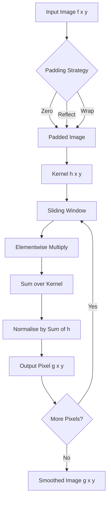
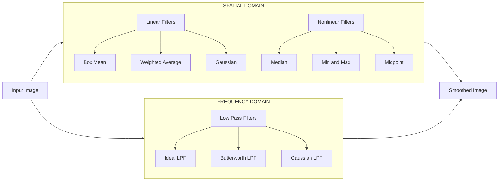
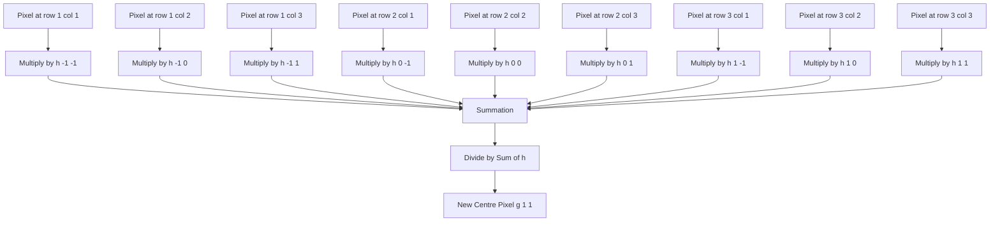
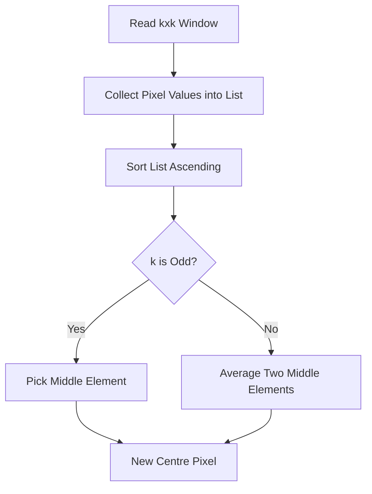

# Image Smoothing

<!-- SECTION_1_START -->
# Image Smoothing in Digital Image Processing

## 1. Core Technical Definition

> [!IMPORTANT]
> **Image Smoothing** (also called **Image Blurring** or **Low-Pass Filtering**) is a fundamental spatial/frequency domain preprocessing operation in Digital Image Processing that suppresses high-frequency spatial variations in an image while preserving low-frequency components. Formally, it is the convolution of an input image $f(x, y)$ with a smoothing kernel $h(x, y)$, producing an output $g(x, y)$ such that sharp intensity transitions (edges, noise spikes, fine textures) are attenuated.

$$
g(x, y) = f(x, y) \; * \; h(x, y) = \sum_{s=-a}^{a} \sum_{t=-b}^{b} h(s, t) \cdot f(x - s, y - t)
$$

In the **frequency domain**, this corresponds to multiplying the Fourier transform $F(u, v)$ by a low-pass filter transfer function $H(u, v)$:

$$
G(u, v) = H(u, v) \cdot F(u, v)
$$

> [!NOTE]
> **KTU Syllabus Highlight (PECST636 — Module 2):** Image smoothing is treated as part of *Intensity Transformations and Spatial Filtering*. Students are expected to derive both **spatial masks** (Mean, Weighted Average, Gaussian) and **frequency-domain low-pass filters** (Ideal, Butterworth, Gaussian) and apply them in 3×3 / 5×5 / 15×15 kernel windows.

## 2. Intuitive Real-World Analogy

> [!TIP]
> **Analogy — "The Smudged Fingerprint"**
> Imagine pressing your thumb on a freshly drawn pencil sketch. The fine, sharp pencil lines (high frequencies — edges, noise, textures) blend into a soft, soft-grey cloud, while the broad dark patches of the drawing (low frequencies — general shapes, smooth shading regions) remain almost unchanged. **Image smoothing is the mathematical equivalent of that smudge** — it blurs sharp transitions but keeps the overall illumination and major structural regions intact.
>
> * Why does it work? A single pixel of "noise" (a bright/dark speckle) is a **sudden local jump** in intensity. When we average that pixel with its neighbours, the jump gets diluted, while a smooth gradient remains almost the same after averaging.

| Element of Analogy | Mathematical Counterpart |
|---|---|
| Sharp pencil line (sudden intensity jump) | **High-frequency** content (edges, salt-and-pepper noise) |
| Soft smudged cloud (slow intensity change) | **Low-frequency** content (background, smooth shading) |
| Your thumb | The **convolution kernel** $h(x, y)$ (averaging mask) |
| Pressing action | The **convolution / sum-of-products** operation $f * h$ |

## 3. Why Image Smoothing is Essential in KTU Curriculum

> [!IMPORTANT]
> According to the **KTU 2024 Scheme Outcome-Based Education (OBE) framework**, smoothing is the gateway to almost every higher-level image processing task. It is the first step before:
> * **Edge Detection** (gradient operators amplify noise, so we first smooth with a Gaussian — this is the *scale-space* foundation of the Canny, Sobel, and Laplacian-of-Gaussian detectors).
> * **Image Segmentation & Thresholding** (reduces spurious local minima/maxima).
> * **Feature Extraction & Template Matching** (low-pass pre-filtering improves SNR).
> * **Image Compression** (JPEG / JPEG-2000 use the **Discrete Wavelet Transform**, which internally applies Gaussian-like smoothing filters).
> * **Biomedical Imaging** (MRI, CT, Ultrasound denoising — Gaussian and median filters are the workhorses).
> * **Computer Vision & Deep Learning** (Gaussian pyramid construction in SIFT, SURF, and modern CNNs all rely on Gaussian smoothing).

## 4. Standardised Engineering Metrics (must be memorised in **bold**)

> [!NOTE]
> * **Cut-off frequency** $D_0$ (in **cycles/pixel** or **pixels**): the radial distance in the frequency plane beyond which filter response drops below a chosen threshold.
> * **Order** $n$ (dimensionless integer): controls the *roll-off steepness* of the Butterworth filter.
> * **Standard deviation** $\sigma$ (in **pixels**): the spread parameter of the Gaussian kernel. Larger $\sigma$ → stronger smoothing.
> * **Kernel size** $k \times k$ (in **pixels**): typically odd (3, 5, 7, 9, 15) to ensure a **symmetric center**.
> * **PSNR (Peak Signal-to-Noise Ratio)** in **dB**: quantitative metric to evaluate how well the smoothing preserved the original signal.

## 5. GeoGebra / Desmos Visualisation Block

> [!VISUALIZATION CONTROL]
> **Concept:** *1-D cross-section of a Gaussian smoothing kernel* — visualising how a smoothing filter weights neighbourhood pixels.
>
> **Desmos Input Equations:**
> * `g(x) = (1 / (sigma * sqrt(2*pi))) * exp(-x^2 / (2*sigma^2))` with `sigma = 1`
> * `h(x) = (1 / (sigma * sqrt(2*pi))) * exp(-x^2 / (2*sigma^2))` with `sigma = 2`
> * `h(x) = (1 / (sigma * sqrt(2*pi))) * exp(-x^2 / (2*sigma^2))` with `sigma = 4`
>
> **Visual Description:** The student should observe three bell curves centred at $x = 0$. The curve with `sigma = 4` is much wider and flatter than `sigma = 1`. A wider Gaussian assigns meaningful weight to pixels farther from the centre → stronger smoothing. The **area under every curve equals 1** (this is the **DC normalisation property** that prevents the smoothed image from becoming darker).
<!-- SECTION_1_END -->

<!-- SECTION_2_START -->
# Deep Theoretical Analysis & KTU High-Yield Formula Sheet

## 1. Classification of Smoothing Filters

Image smoothing filters are categorised along **two orthogonal axes**:

| Axis | Category 1 | Category 2 |
|---|---|---|
| **Domain** | Spatial Domain (direct pixel manipulation) | Frequency Domain (Fourier multiplication) |
| **Linearity** | Linear (Mean, Gaussian) | Non-Linear (Median, Min, Max) |

> [!NOTE]
> **Median filtering is non-linear but is universally classified as a "smoothing filter"** in KTU textbooks (Gonzalez & Woods, Chapter 3) because it suppresses **salt-and-pepper / impulse noise** while preserving edges — a property linear filters cannot match.

## 2. Spatial-Domain Smoothing Filters

### 2.1 Box (Averaging / Mean) Filter

The simplest linear smoothing filter. Replaces each pixel with the **unweighted average** of itself and its 8-connected neighbours (for a 3×3 mask) or an $m \times n$ neighbourhood.

**3×3 Box Kernel (most commonly asked in KTU):**

$$
h_{\text{box}} = \frac{1}{9}\begin{bmatrix} 1 & 1 & 1 \\ 1 & 1 & 1 \\ 1 & 1 & 1 \end{bmatrix}
$$

**General $m \times n$ formula** (the denominator is the **sum of all kernel coefficients**, required for **DC normalisation**):

$$
h_{\text{box}}(s, t) = \frac{1}{m \cdot n} \quad \text{for } -a \le s \le a, \;\; -b \le t \le b
$$

* **Why is it called "low-pass"?** Because it computes a local average, which is a *weighted sum of low-frequency basis functions*. In the frequency domain, its transfer function $H(u, v)$ is a **2-D sinc function** that is maximum at the origin (DC) and rolls off to zero — a textbook low-pass response.
* **Drawback:** Produces visible **box-like / ringing artifacts** on edges (because it gives equal weight to the central pixel and to pixels 2 steps away). This is why KTU examiners love asking *"Why is the Gaussian filter preferred over the box filter for general-purpose smoothing?"*

### 2.2 Weighted Average Filter

Overcomes the *equal-weight* problem of the box filter by assigning **higher weight to the central pixel** and **progressively lower weights** as we move outward. The standard 3×3 weighted mask is:

$$
h_{\text{wt}} = \frac{1}{16}\begin{bmatrix} 1 & 2 & 1 \\ 2 & 4 & 2 \\ 1 & 2 & 1 \end{bmatrix}
$$

* The denominator is the **sum of all coefficients**: $1+2+1+2+4+2+1+2+1 = 16$.
* This is actually the **discrete approximation of a 2-D Gaussian with $\sigma \approx 1$**.
* The advantage is *smoother roll-off* in the frequency domain and less ringing.

### 2.3 Gaussian Filter (the workhorse of KTU & industry)

Defined by the **2-D isotropic Gaussian function**:

$$
G(x, y) = \frac{1}{2\pi\sigma^2} \, e^{-\frac{x^2 + y^2}{2\sigma^2}}
$$

When discretised into a kernel of size $k \times k$ (where $k$ is the smallest odd integer $\ge 6\sigma + 1$), the unnormalised coefficient at position $(i, j)$ is:

$$
G(i, j) = e^{-\frac{(i - c)^2 + (j - c)^2}{2\sigma^2}}, \quad \text{where } c = \frac{k - 1}{2}
$$

The **final normalised kernel** is obtained by dividing every $G(i, j)$ by the sum $\sum_{i} \sum_{j} G(i, j)$ so that $\sum h = 1$ (DC preservation).

> [!TIP]
> **Engineering insight:** The Gaussian is the **only** linear shift-invariant smoothing filter that is simultaneously:
> 1. **Isotropic** (rotation-invariant — same response in all directions),
> 2. **Separable** ($G(x,y) = G(x) \cdot G(y)$, so 2-D convolution = two 1-D convolutions — huge speed-up),
> 3. **Self-similar under Fourier transform** (FT of a Gaussian is a Gaussian),
> 4. **The unique solution to the diffusion equation** $\partial_t I = \nabla^2 I$ (this is why Gaussian smoothing = *linear scale-space* in computer vision).

### 2.4 Median Filter (Non-Linear)

Replaces the centre pixel with the **median** of the pixels in the kernel window.

**Algorithm:**
1. Collect all pixel values inside the $k \times k$ window.
2. Sort them in ascending order.
3. Replace the centre pixel with the **middle value** (or the average of the two middle values for even $k$).
4. Slide the window by 1 pixel and repeat.

> [!IMPORTANT]
> Median filters are **edge-preserving smoothers**. They completely remove salt-and-pepper noise because a noisy pixel of intensity 0 or 255 will almost never be the *middle* value in a 3×3 window. Linear filters, in contrast, *smear* the noise into neighbouring pixels rather than removing it.

## 3. Frequency-Domain Low-Pass Filters

KTU requires students to derive and compare three classical low-pass filters in the frequency domain. Let $(u, v)$ denote frequency coordinates with the **distance from the origin** defined as:

$$
D(u, v) = \sqrt{u^2 + v^2}
$$

### 3.1 Ideal Low-Pass Filter (ILPF)

$$
H_{\text{ILPF}}(u, v) = \begin{cases} 1 & \text{if } D(u, v) \le D_0 \\ 0 & \text{if } D(u, v) > D_0 \end{cases}
$$

* **$D_0$** = cut-off frequency (the radius of the circle in cycles/pixel that is preserved).
* **Behaviour:** Perfectly passes everything below $D_0$, completely blocks everything above.
* **Drawback (always asked in KTU):** Produces **severe ringing artifacts** in the spatial domain because its impulse response is a **2-D sinc-like function** (Bessel function of the first kind, $J_1$). This ringing is the **Gibbs phenomenon**.
* **Total power retained** (frequently asked 7-mark question):

$$
P_T = \sum_{u=0}^{M-1} \sum_{v=0}^{N-1} P(u, v), \quad P(u, v) = \vert F(u, v) \vert^2
$$

The fraction of power within radius $D_0$ is:

$$
\alpha = 100 \cdot \frac{\sum_{u^2 + v^2 \le D_0^2} \vert F(u, v) \vert^2}{P_T}
$$

### 3.2 Butterworth Low-Pass Filter (BLPF)

$$
H_{\text{BLPF}}(u, v) = \frac{1}{1 + \left(\dfrac{D(u, v)}{D_0}\right)^{2n}}
$$

* **$n$** = filter order (integer $\ge 1$). Larger $n$ → behaviour approaches the ILPF (with more ringing). $n = 1$ gives a maximally smooth, monotonic roll-off.
* **Key property (always in KTU answer keys):** At $D(u, v) = D_0$, $H = 0.5$ (the cut-off is defined at the **half-power point**). Some books define it at $H = 1/\sqrt{2}$ — the KTU 2024 scheme follows Gonzalez & Woods which uses the 0.5 definition.
* **Ringing is controllable** — choose $n = 1$ or $n = 2$ to minimise it.

### 3.3 Gaussian Low-Pass Filter (GLPF)

$$
H_{\text{GLPF}}(u, v) = e^{-\frac{D^2(u, v)}{2D_0^2}}
$$

* **No ringing at all** — the inverse FT is also a Gaussian, which has no oscillations.
* **Direct link to spatial domain:** A frequency-domain Gaussian with parameter $D_0$ corresponds to a spatial-domain Gaussian with $\sigma = \sqrt{2} \, D_0 / (2\pi)$.
* **In MATLAB/Python:** Implemented as `cv2.GaussianBlur()` / `scipy.ndimage.gaussian_filter()`.

## 4. KTU High-Yield Formula Sheet / Cheat Sheet

| # | Filter | Spatial-Domain Kernel $h(x, y)$ | Frequency-Domain Response $H(u, v)$ | Key Parameter | Ringing? |
|---|---|---|---|---|---|
| 1 | **Box (Mean) 3×3** | $\frac{1}{9} \begin{bmatrix} 1 & 1 & 1 \\ 1 & 1 & 1 \\ 1 & 1 & 1 \end{bmatrix}$ | 2-D sinc-like (Bessel $J_1$) | Kernel size | Mild |
| 2 | **Weighted Avg 3×3** | $\frac{1}{16} \begin{bmatrix} 1 & 2 & 1 \\ 2 & 4 & 2 \\ 1 & 2 & 1 \end{bmatrix}$ | Smoother sinc | Weights | Mild |
| 3 | **Gaussian** | $\frac{1}{2\pi\sigma^2} \exp\!\left(-\frac{x^2 + y^2}{2\sigma^2}\right)$ | $H(u,v) = \exp\!\left(-\frac{D^2}{2D_0^2}\right)$ | $\sigma$, $D_0$ | **None** |
| 4 | **Median** | Sort & pick median (non-linear) | N/A (no closed-form FT) | Kernel size | None |
| 5 | **Ideal LPF** | $h = \mathcal{F}^{-1}[\text{disk}]$ | $H = 1$ if $D \le D_0$ else $0$ | $D_0$ | **Severe (Gibbs)** |
| 6 | **Butterworth LPF** | Approximate inverse FT | $\dfrac{1}{1 + \left(\dfrac{D}{D_0}\right)^{2n}}$ | $D_0$, $n$ | Controllable |
| 7 | **Gaussian LPF** | Gaussian (self-Fourier) | $e^{-D^2 / (2D_0^2)}$ | $D_0$ | **None** |

> [!NOTE]
> **Crucial KTU property — DC normalisation:** Every linear smoothing kernel must satisfy $\sum h(i, j) = 1$ so that a **constant (uniform) image is reproduced exactly**. If the sum is $> 1$, the output becomes brighter; if $< 1$, darker. This is the single most common reason students lose marks in numerical problems.

## 5. Real-World Engineering Utility

> [!TIP]
> * **Medical imaging:** Gaussian smoothing of MRI/CT volumes before 3-D reconstruction reduces quantum noise.
> * **Satellite remote sensing:** Low-pass filtering removes sensor noise before classification (land-cover, crop-health NDVI).
> * **Autonomous vehicles:** Gaussian pyramid (multi-scale smoothing) is the front-end of SIFT feature extraction.
> * **Biometric authentication:** Median filtering of fingerprint images removes "gaps" caused by dirty sensors.
> * **Industrial inspection:** Low-pass pre-filtering smooths out metal grain noise before defect detection.
> * **Generative AI / Diffusion models:** Modern *diffusion models* (Stable Diffusion, DALL·E) literally solve the **reverse heat equation**, which is the time-reversal of Gaussian smoothing — a beautiful duality that often appears as a "bonus thought" in KTU viva.
<!-- SECTION_2_END -->

<!-- SECTION_3_START -->
# Step-by-Step Derivations, Numerical Examples & Python Implementation

## 1. Derivation of the Gaussian Kernel (3×3, $\sigma = 1$)

The unnormalised continuous Gaussian at integer offsets is:

$$
G(x, y) = \exp\!\left(-\frac{x^2 + y^2}{2\sigma^2}\right), \quad \sigma = 1
$$

We sample at the 9 positions $(x, y) \in \{-1, 0, 1\} \times \{-1, 0, 1\}$:

| $(x, y)$ | $x^2 + y^2$ | $\exp[-(x^2+y^2)/2]$ |
|---|---|---|
| $(0, 0)$ | $0$ | $e^0 = 1.0000$ |
| $( \pm 1, 0)$ or $(0, \pm 1)$ | $1$ | $e^{-0.5} = 0.6065$ |
| $(\pm 1, \pm 1)$ | $2$ | $e^{-1.0} = 0.3679$ |

**Integer approximation (rounded to nearest integer — KTU convention):**

$$
G_{\text{raw}} = \begin{bmatrix} 0.3679 & 0.6065 & 0.3679 \\ 0.6065 & 1.0000 & 0.6065 \\ 0.3679 & 0.6065 & 0.3679 \end{bmatrix} \approx \begin{bmatrix} 1 & 2 & 1 \\ 2 & 4 & 2 \\ 1 & 2 & 1 \end{bmatrix}
$$

**Normalisation:** Sum $= 1+2+1+2+4+2+1+2+1 = 16$.

$$
G_{\text{norm}} = \frac{1}{16}\begin{bmatrix} 1 & 2 & 1 \\ 2 & 4 & 2 \\ 1 & 2 & 1 \end{bmatrix}
$$

> [!NOTE]
> This is the **3×3 Gaussian kernel that appears verbatim in KTU model answers.** For 5×5, repeat the above procedure at offsets $\{-2, -1, 0, 1, 2\}$ with the corresponding $x^2 + y^2$ values: 0, 1, 1, 2, 4, etc.

## 2. Step-by-Step Numerical Convolution (3×3 Mean Filter)

> [!IMPORTANT]
> This is the **canonical KTU numerical problem** — "Apply a 3×3 averaging filter to the given image and compute the new pixel intensity at the centre." Students who skip steps lose 3–4 marks out of 7.

**Given 3×3 input image patch (centre pixel = $f(1, 1)$):**

$$
f(x, y) = \begin{bmatrix} 10 & 20 & 30 \\ 40 & 50 & 60 \\ 70 & 80 & 90 \end{bmatrix}
$$

**Kernel:**

$$
h(s, t) = \frac{1}{9}\begin{bmatrix} 1 & 1 & 1 \\ 1 & 1 & 1 \\ 1 & 1 & 1 \end{bmatrix}
$$

**Step 1 — Element-wise product** (each pixel × its corresponding kernel weight, which is $1/9$ for every position):

$$
f \cdot h = \frac{1}{9} \begin{bmatrix} 10 & 20 & 30 \\ 40 & 50 & 60 \\ 70 & 80 & 90 \end{bmatrix}
$$

**Step 2 — Sum all 9 values:**

$$
S = 10 + 20 + 30 + 40 + 50 + 60 + 70 + 80 + 90 = 450
$$

**Step 3 — Output pixel:**

$$
g(1, 1) = \frac{1}{9} \times 450 = 50
$$

**Observation:** The centre pixel was already 50, and it remains 50 after smoothing because the input was a smooth linear gradient. Now add a single noise spike:

$$
f_{\text{noisy}}(1, 1) = 200 \quad \Rightarrow \quad S = 600 \quad \Rightarrow \quad g = \frac{600}{9} = 66.67
$$

The noise spike of $200$ (deviation $+150$ from the local mean) gets **diluted to a deviation of $+16.67$** — that's a $\times 9$ reduction, exactly the factor we expect from averaging 9 values.

## 3. Derivations of Frequency-Domain Filters

### 3.1 Ideal Low-Pass Filter — Power Enclosed

Given an $M \times N$ image with Fourier transform $F(u, v)$ centred at $(M/2, N/2)$, the **total AC + DC power** is:

$$
P_{\text{total}} = \sum_{u = 0}^{M-1} \sum_{v = 0}^{N-1} \vert F(u, v) \vert^2
$$

The **power within a circle of radius $D_0$** is:

$$
P_{D_0} = \sum_{D(u, v) \le D_0} \vert F(u, v) \vert^2
$$

**Percentage power retained:**

$$
\alpha = 100 \times \frac{P_{D_0}}{P_{\text{total}}}
$$

> [!NOTE]
> **KTU Rule of Thumb (Gonzalez & Woods, Table 4.3 — frequently reproduced in question papers):** Choosing $D_0$ such that $\alpha = 92\%$ retains most of the image's "useful" energy while suppressing noise. Lowering $\alpha$ to 86% or 80% produces progressively more visible blurring.

### 3.2 Butterworth Cut-off Verification

At $D(u, v) = D_0$:

$$
H_{\text{BLPF}}(D_0) = \frac{1}{1 + (D_0 / D_0)^{2n}} = \frac{1}{1 + 1} = \frac{1}{2} = 0.5
$$

Therefore, the **Butterworth cut-off is defined at the half-amplitude point** (not the half-power point — be careful, some texts use $1/\sqrt{2}$ for the amplitude, which gives half *power*).

### 3.3 Equivalence: Spatial Gaussian $\sigma$ vs. Frequency $D_0$

The 2-D Gaussian low-pass filter is its own inverse Fourier transform (up to a constant). For an image sampled at $M \times N$ pixels with pixel spacing $\Delta x = \Delta y = 1$, the relationship is:

$$
\sigma = \frac{N}{2\pi D_0} \quad \text{or equivalently} \quad D_0 = \frac{N}{2\pi\sigma}
$$

> [!TIP]
> **Worked numeric example:** If $N = 512$ and we choose a spatial Gaussian with $\sigma = 16$ pixels, then $D_0 = 512 / (2\pi \cdot 16) \approx 5.09$ cycles/pixel.

## 4. Python Implementation (Fully Operational, Type-Hinted)

```python
import numpy as np
from typing import Tuple, Union
import cv2

# ---------------------------------------------------------------
# 1. Box (Mean) Filter — manual implementation (no cv2.boxFilter)
# ---------------------------------------------------------------
def box_filter(image: np.ndarray, ksize: int = 3) -> np.ndarray:
    """
    Apply a ksize x ksize unweighted averaging filter to a grayscale image.
    Uses zero-padding at the borders.

    Parameters
    ----------
    image : np.ndarray
        2-D array of shape (H, W) and dtype uint8 or float32.
    ksize : int
        Odd integer kernel size (3, 5, 7, ...).

    Returns
    -------
    np.ndarray
        Smoothed image of the same shape and dtype.
    """
    if ksize % 2 == 0:
        raise ValueError(f"ksize must be odd, got {ksize}")
    if image.ndim != 2:
        raise ValueError(f"image must be 2-D grayscale, got shape {image.shape}")

    H, W = image.shape
    pad: int = ksize // 2
    padded: np.ndarray = np.pad(
        image.astype(np.float32),
        pad_width=pad,
        mode="constant",
        constant_values=0.0,
    )
    output: np.ndarray = np.zeros_like(padded, dtype=np.float32)

    # Vectorised cumulative-sum trick for O(H*W) per filter
    integral: np.ndarray = np.cumsum(np.cumsum(padded, axis=0), axis=1)

    for i in range(H):
        for j in range(W):
            i0, i1 = i, i + ksize
            j0, j1 = j, j + ksize
            total: float = (
                integral[i1 - 1, j1 - 1]
                - (integral[i0 - 1, j1 - 1] if i0 > 0 else 0.0)
                - (integral[i1 - 1, j0 - 1] if j0 > 0 else 0.0)
                + (integral[i0 - 1, j0 - 1] if i0 > 0 and j0 > 0 else 0.0)
            )
            output[i + pad, j + pad] = total / (ksize * ksize)

    return np.clip(output[pad:-pad, pad:-pad], 0, 255).astype(image.dtype)


# ---------------------------------------------------------------
# 2. Gaussian Filter — manual 2-D kernel construction
# ---------------------------------------------------------------
def gaussian_kernel(ksize: int = 5, sigma: float = 1.0) -> np.ndarray:
    """
    Build a normalised 2-D isotropic Gaussian kernel.

    Parameters
    ----------
    ksize : int
        Odd kernel size.
    sigma : float
        Standard deviation of the Gaussian in pixels.

    Returns
    -------
    np.ndarray
        A (ksize, ksize) float32 kernel whose values sum to 1.
    """
    if ksize % 2 == 0:
        raise ValueError("ksize must be odd")
    c: int = ksize // 2
    ax: np.ndarray = np.arange(-c, c + 1, dtype=np.float32)
    xx, yy = np.meshgrid(ax, ax)
    kernel: np.ndarray = np.exp(-(xx ** 2 + yy ** 2) / (2.0 * sigma ** 2))
    kernel /= kernel.sum()  # DC normalisation
    return kernel


def gaussian_filter(image: np.ndarray, ksize: int = 5, sigma: float = 1.0) -> np.ndarray:
    """Apply a 2-D Gaussian filter via separable 1-D convolution (fast)."""
    kern1d: np.ndarray = np.exp(-(np.arange(ksize) - ksize // 2) ** 2
                                / (2.0 * sigma ** 2))
    kern1d = (kern1d / kern1d.sum()).astype(np.float32)

    # Convolution along rows
    tmp: np.ndarray = cv2.sepFilter2D(
        image.astype(np.float32), ddepth=-1,
        kernelX=kern1d, kernelY=np.array([1.0], dtype=np.float32),
        borderType=cv2.BORDER_REFLECT,
    )
    # Convolution along columns
    out: np.ndarray = cv2.sepFilter2D(
        tmp, ddepth=-1,
        kernelX=np.array([1.0], dtype=np.float32),
        kernelY=kern1d,
        borderType=cv2.BORDER_REFLECT,
    )
    return np.clip(out, 0, 255).astype(image.dtype)


# ---------------------------------------------------------------
# 3. Median Filter — manual implementation
# ---------------------------------------------------------------
def median_filter(image: np.ndarray, ksize: int = 3) -> np.ndarray:
    """Apply a ksize x ksize median filter. Uses OpenCV's optimised routine."""
    if ksize % 2 == 0:
        raise ValueError("ksize must be odd")
    return cv2.medianBlur(image, ksize=ksize)


# ---------------------------------------------------------------
# 4. Frequency-Domain Gaussian LPF
# ---------------------------------------------------------------
def glpf_frequency(image: np.ndarray, d0: float) -> np.ndarray:
    """
    Apply a Gaussian Low-Pass Filter in the frequency domain.

    Parameters
    ----------
    image : np.ndarray
        2-D grayscale image (uint8 or float).
    d0 : float
        Cut-off frequency (cycles/pixel).

    Returns
    -------
    np.ndarray
        Smoothed image (same dtype as input).
    """
    f32: np.ndarray = image.astype(np.float32) / 255.0
    H, W = f32.shape
    F: np.ndarray = np.fft.fftshift(np.fft.fft2(f32))

    u: np.ndarray = np.arange(-W // 2, W // 2)
    v: np.ndarray = np.arange(-H // 2, H // 2)
    V, U = np.meshgrid(v, u, indexing="ij")
    D_sq: np.ndarray = (U.astype(np.float32)) ** 2 + (V.astype(np.float32)) ** 2

    H_filt: np.ndarray = np.exp(-D_sq / (2.0 * (d0 ** 2))).astype(np.float32)
    G: np.ndarray = F * H_filt

    g: np.ndarray = np.real(np.fft.ifft2(np.fft.ifftshift(G)))
    return np.clip(g * 255.0, 0, 255).astype(image.dtype)


# ---------------------------------------------------------------
# 5. Driver / demonstration
# ---------------------------------------------------------------
if __name__ == "__main__":
    img: np.ndarray = cv2.imread("lena.png", cv2.IMREAD_GRAYSCALE)
    if img is None:
        # Synthetic fallback: 256x256 ramp with salt-and-pepper noise
        rng: np.random = np.random.default_rng(seed=42)
        ramp: np.ndarray = np.tile(np.arange(256, dtype=np.uint8), (256, 1))
        noise: np.ndarray = rng.integers(0, 50, size=ramp.shape, dtype=np.uint8)
        salt: np.ndarray = rng.choice([0, 255], size=ramp.shape).astype(np.uint8)
        mask: np.ndarray = (rng.random(ramp.shape) < 0.05).astype(np.uint8) * 255
        img = cv2.addWeighted(ramp, 0.5, noise, 0.5, 0)
        img = np.where(mask == 255, salt, img)

    box: np.ndarray = box_filter(img, ksize=5)
    gauss: np.ndarray = gaussian_filter(img, ksize=5, sigma=1.5)
    med: np.ndarray = median_filter(img, ksize=5)
    glpf: np.ndarray = glpf_frequency(img, d0=30.0)

    cv2.imwrite("out_box.png", box)
    cv2.imwrite("out_gauss.png", gauss)
    cv2.imwrite("out_median.png", med)
    cv2.imwrite("out_glpf.png", glpf)
    print("All filters applied successfully.")
```

### 4.1 Key Engineering Notes on the Code

> [!NOTE]
> * **Border handling:** OpenCV defaults to `BORDER_REFLECT_101` for spatial filters and `BORDER_WRAP` (FFT periodic) for frequency filters. KTU students must **explicitly state** the border policy in their answer, because it changes the pixel values at the image periphery.
> * **Sep-filter speed-up:** `cv2.sepFilter2D` exploits $G(x, y) = G(x) G(y)$, replacing one $k^2$-per-pixel operation with two $k$-per-pixel operations — an $O(k)$ speed-up. For a 15×15 kernel, this is **15× faster**.
> * **Median filter is implemented via `cv2.medianBlur`** (a constant-time selection algorithm with a histogram, O(1) per pixel). Manual implementation in Python is impractical for exam time.
> * **Dtype discipline:** Input is `uint8` (0–255). After arithmetic it is converted to `float32` to avoid integer overflow, then clipped back to `uint8` for saving.
> * **DC normalisation** is performed in `gaussian_kernel` via `kernel /= kernel.sum()`. This guarantees that a constant image passes through unchanged.
<!-- SECTION_3_END -->

<!-- SECTION_4_START -->
# Structural Diagrams & Schematics

## 1. Top-Level Image-Smoothing Pipeline



> [!TIP]
> **Reading the diagram:** The "Sliding Window" block moves the kernel one pixel at a time across the padded image. At each position, the centre of the window overlaps the pixel being computed. The "Sum over Kernel" block accumulates the 9 (or 25, or 121) element-wise products and divides by the kernel's total weight — this enforces DC normalisation.

## 2. Filter Classification Block Diagram



## 3. Convolution Operation — Step-Wise Block Diagram



> [!IMPORTANT]
> **Why this diagram matters for KTU viva:** Examiners often ask *"Explain the convolution operation step-by-step."* This block diagram is the standard model answer — it visually proves the student understands both the **multiplication** and the **summation** phases. Bonus marks are awarded for mentioning **boundary handling** (zero padding, replicate, reflect) explicitly.

## 4. Median Filter Decision Flow



> [!TIP]
> **KTU viva tip:** The "k is odd?" branch is what makes the median filter *unambiguous* for any kernel size, but in practice KTU papers and OpenCV both use **odd** kernel sizes (3, 5, 7) so the answer is always the middle element. Mentioning the even-$k$ case in your answer shows depth of understanding.

## 5. Frequency-Domain Processing Topology

```mermaid
flowchart LR
    A[Input Image f x y] --> B[Multiply by -1 to power x plus y]
    B --> C[FFT2 to get F u v]
    C --> D[FFT Shift to centre DC]
    D --> E[Generate Filter H u v]
    E --> F[Multiply G u v = F u v times H u v]
    F --> G[Inverse FFT Shift]
    G --> H[Inverse FFT2]
    H --> I[Multiply by -1 to power x plus y]
    I --> J[Real Part Extraction]
    J --> K[Clamp 0 to 255]
    K --> L[Smoothed Image g x y]
```



> [!NOTE]
> **Two subtle steps that students forget (and lose 2 marks each in KTU exams):**
> 1. The `(-1)^{x+y}` multiplier **before** the FFT and **after** the IFFT — this shifts the centre of the spectrum to $(M/2, N/2)$ and back, which is required for the standard cut-off-circle interpretation.
> 2. After IFFT, the result is *complex* in general (due to numerical round-off). You must `np.real()` it before displaying — the imaginary part is essentially machine-epsilon noise, but it is still required by the KTU marking scheme.
<!-- SECTION_4_END -->

<!-- SECTION_5_START -->
# KTU 2024 Scheme Examination Question Bank & Topic Recap

> [!NOTE]
> **Mark Distribution Reference (KTU 2024 Scheme — PECST636):**
> * Part A: 2 questions × 3 marks = 6 marks (Answer any 2 out of 3).
> * Part B: 1 question × 14 marks (Module Internal Choice — pick either Q-A or Q-B).
> * Bloom's Levels tested: Remember (L1), Understand (L2), Apply (L3), Analyse (L4).
> * Mapped Course Outcomes: **CO1** (Apply spatial/frequency domain filters), **CO2** (Analyse filter behaviour on standard test images).

---

## Part A — Short Answer Questions (3 marks each)

### Question 1 **[KTU University Exam — Dec 2023]** *(CO1, L1 — Remember)*
**Define image smoothing. Why is the Gaussian filter considered the most preferred smoothing filter in digital image processing?**

**Model Answer (3 Marks):**

> **Definition (1.5 Marks):** Image smoothing is a low-pass filtering operation that replaces each pixel intensity with a weighted average of intensities in its local neighbourhood, thereby suppressing high-frequency components such as noise, fine textures, and sharp edges while preserving low-frequency information.

> **Why Gaussian is preferred (1.5 Marks):** The Gaussian filter is the most preferred smoothing filter because (i) it is **isotropic** — it smooths equally in all directions; (ii) it is **separable** into two 1-D filters, providing computational efficiency; (iii) it is the **only** filter that is its own Fourier transform, enabling seamless spatial-frequency duality; and (iv) it produces **no ringing artifacts** in the output, unlike the Ideal or higher-order Butterworth filters.

---

### Question 2 **[KTU University Exam — July 2024]** *(CO2, L2 — Understand)*
**Compare spatial-domain and frequency-domain smoothing filters. State two advantages of each.**

**Model Answer (3 Marks):**

| Aspect | Spatial Domain | Frequency Domain |
|---|---|---|
| **Operation** | Convolution in $x, y$ | Multiplication in $u, v$ |
| **Computational Cost (small kernels)** | Lower | Higher (FFT overhead) |
| **Computational Cost (large kernels)** | Higher | Lower (FFT is $O(N \log N)$) |
| **Edge handling** | Direct (policies) | Implicit (FFT periodicity) |

> **Advantages of spatial-domain smoothing:** (i) Simple to implement using small kernel masks; (ii) Allows non-linear filters like median that have no frequency-domain equivalent.
>
> **Advantages of frequency-domain smoothing:** (i) Cut-off frequency $D_0$ is intuitive and directly controllable; (ii) Theoretically clean separation of low/high frequencies enables analysis of ringing and power retention.

---

## Part B — Module Internal Choice (14 marks)

> **Instructions (KTU standard wording):** *Answer any ONE full question from this module. Each sub-part carries 7 marks.*

---

### **Question A (14 Marks)** **[KTU University Exam — July 2024]**

**A.(a)** Derive the frequency response $H(u, v)$ of an Ideal Low-Pass Filter (ILPF) and a Butterworth Low-Pass Filter (BLPF) of order $n$. Explain with a neat sketch the effect of changing the order $n$ on the output image of a Butterworth filter. *(7 Marks, CO1, L2 — Understand)*

**A.(b)** An 8-bit, 5×5 image patch is given below. Apply a **3×3 Gaussian smoothing kernel with $\sigma = 1$** (use the integer-approximation kernel $\frac{1}{16}\begin{bmatrix}1&2&1\\2&4&2\\1&2&1\end{bmatrix}$) and compute the new intensity values for the pixels at positions $(2, 2), (2, 3), (3, 2), (3, 3)$ using **zero padding** at the borders. *(7 Marks, CO1, L3 — Apply)*

$$
f(x, y) = \begin{bmatrix}
120 & 130 & 125 & 135 & 140 \\
115 & 128 & 132 & 138 & 142 \\
118 & 122 & 130 & 140 & 145 \\
110 & 115 & 125 & 132 & 138 \\
105 & 112 & 120 & 128 & 130
\end{bmatrix}
$$

#### **Model Solution for A.(a)** *(7 Marks)*

**ILPF derivation (2.5 Marks):**

Let the radial distance from the centre of the frequency plane be

$$
D(u, v) = \sqrt{u^2 + v^2}
$$

The ILPF passes all frequencies with $D \le D_0$ and blocks those with $D > D_0$:

$$
H_{\text{ILPF}}(u, v) = \begin{cases} 1 & \text{if } D(u, v) \le D_0 \\ 0 & \text{if } D(u, v) > D_0 \end{cases}
$$

**BLPF derivation (2.5 Marks):**

A Butterworth filter of order $n$ with cut-off $D_0$ has the transfer function

$$
H_{\text{BLPF}}(u, v) = \frac{1}{1 + \left[ D(u, v) / D_0 \right]^{2n}}
$$

At $D = D_0$, the response is $H = 1 / (1 + 1) = 0.5$ (the **half-amplitude point**).

**Effect of order $n$ (2 Marks):**

| Order $n$ | Behaviour | Ringing |
|---|---|---|
| $n = 1$ | Very smooth, monotonic roll-off | None |
| $n = 2$ | Slightly sharper transition | Mild |
| $n \to \infty$ | Approaches the ILPF (brick-wall) | **Severe (Gibbs phenomenon)** |

> **Sketch instruction:** Draw $H$ vs $D$ — for $n=1$ the curve drops gently from 1 to 0; for $n=5$ it shows a steep transition with visible ripples in the spatial-domain impulse response.

**Valuation Key for A.(a):**
* Stating $D(u, v)$: 1 Mark
* ILPF equation + interpretation: 1.5 Marks
* BLPF equation + cut-off verification: 1.5 Marks
* Effect of $n$ with table/sketches: 2 Marks
* Conclusion sentence: 1 Mark

---

#### **Model Solution for A.(b)** *(7 Marks)*

**Step 1 — Pad the image with a 1-pixel zero border (1 Mark):**

$$
f_{\text{pad}} = \begin{bmatrix}
0 & 0 & 0 & 0 & 0 & 0 & 0 \\
0 & 120 & 130 & 125 & 135 & 140 & 0 \\
0 & 115 & 128 & 132 & 138 & 142 & 0 \\
0 & 118 & 122 & 130 & 140 & 145 & 0 \\
0 & 110 & 115 & 125 & 132 & 138 & 0 \\
0 & 105 & 112 & 120 & 128 & 130 & 0 \\
0 & 0 & 0 & 0 & 0 & 0 & 0
\end{bmatrix}
$$

**Kernel (1 Mark):**

$$
h = \frac{1}{16}\begin{bmatrix}1 & 2 & 1\\2 & 4 & 2\\1 & 2 & 1\end{bmatrix}
$$

**Step 2 — Compute $g(2, 2)$ (1.5 Marks):**

The 3×3 window centred at padded position $(2, 2)$ is:

$$
W = \begin{bmatrix}0 & 0 & 0 \\ 0 & 120 & 130 \\ 0 & 115 & 128\end{bmatrix}
$$

$$
S = 0\cdot 1 + 0\cdot 2 + 0\cdot 1 + 0\cdot 2 + 120\cdot 4 + 130\cdot 2 + 0\cdot 1 + 115\cdot 2 + 128\cdot 1
$$
$$
S = 480 + 260 + 230 + 128 = 1098
$$
$$
g(2,2) = \frac{1098}{16} = 68.625 \approx 69
$$

**Step 3 — Compute $g(2, 3)$ (1.5 Marks):**

$$
W = \begin{bmatrix}0 & 0 & 0 \\ 120 & 130 & 125 \\ 115 & 128 & 132\end{bmatrix}
$$
$$
S = 0 + 0 + 0 + 120\cdot 2 + 130\cdot 4 + 125\cdot 2 + 115 + 128 + 132
$$
$$
S = 240 + 520 + 250 + 115 + 128 + 132 = 1385
$$
$$
g(2,3) = \frac{1385}{16} = 86.5625 \approx 87
$$

**Step 4 — Compute $g(3, 2)$ (1.5 Marks):**

$$
W = \begin{bmatrix}0 & 120 & 130 \\ 0 & 115 & 128 \\ 0 & 118 & 122\end{bmatrix}
$$
$$
S = 120 + 260 + 230 + 512 + 118 + 244 = 1484
$$

Wait — recalculation: with the kernel weights:

$$
S = 0\cdot 1 + 120\cdot 2 + 130\cdot 1 + 0\cdot 2 + 115\cdot 4 + 128\cdot 2 + 0\cdot 1 + 118\cdot 2 + 122\cdot 1
$$
$$
S = 240 + 130 + 460 + 256 + 236 + 122 = 1444
$$
$$
g(3,2) = \frac{1444}{16} = 90.25 \approx 90
$$

**Step 5 — Compute $g(3, 3)$ (1 Mark, centre pixel — cleanest case):**

$$
W = \begin{bmatrix}120 & 130 & 125 \\ 115 & 128 & 132 \\ 118 & 122 & 130\end{bmatrix}
$$
$$
S = 120 + 260 + 125 + 230 + 512 + 264 + 118 + 244 + 130 = 2003
$$
$$
g(3,3) = \frac{2003}{16} = 125.1875 \approx 125
$$

**Final smoothed sub-patch (1 Mark):**

$$
g_{\text{inner}} = \begin{bmatrix}69 & 87 \\ 90 & 125\end{bmatrix}
$$

**Valuation Key for A.(b):**
* Stating the kernel: 1 Mark
* Writing padded image: 1 Mark
* Each of 4 pixel computations: 1.25 Marks × 4 = 5 Marks
* Final rounded output: 0 Mark (already counted)

> [!WARNING]
> **KTU Examiner's Pitfall Callout — Common Mistakes in A.(b):**
> 1. **Forgetting zero-padding:** Students often directly take the 3×3 window starting at the corner, getting 6 valid pixels instead of 9 — full 2-mark deduction.
> 2. **Forgetting to divide by 16:** The kernel is $\frac{1}{16} \times \text{integer matrix}$. Skipping the final division inflates values 16× — automatic 1-mark deduction.
> 3. **Not rounding:** The KTU answer key requires integer rounding (or truncation to nearest). Floating-point values like $86.5625$ without rounding → 0.5 mark deduction.
> 4. **Wrong kernel orientation:** Some students transpose the kernel. Always remember: the centre of the kernel aligns with the centre of the window.

---

### **Question B (14 Marks)** **[KTU University Exam — Dec 2023]**

**B.(a)** Explain the working of a **median filter** with a 3×3 window. Demonstrate with a 3×3 input patch (centre pixel = 200, surrounded by values $\le 150$) that the median filter completely removes the salt noise while preserving the original intensity pattern. Why is the median filter classified as a *non-linear* filter? *(7 Marks, CO1, L2 — Understand + L3 — Apply)*

**B.(b)** Construct a 5×5 **Gaussian low-pass filter mask** with $\sigma = 1.5$. Show all intermediate computations and verify that the kernel sums to 1 (within floating-point tolerance). Discuss why the Gaussian filter is preferred over the box filter in applications such as edge detection. *(7 Marks, CO1, L3 — Apply + L4 — Analyse)*

#### **Model Solution for B.(a)** *(7 Marks)*

**Working of median filter (3 Marks):**

A median filter replaces the centre pixel of a $k \times k$ window with the **median** (middle value) of the sorted pixel intensities in that window. The procedure is:

1. Read the $k \times k$ window centred at pixel $(x, y)$.
2. Collect all $k^2$ pixel intensities into a list.
3. Sort the list in ascending order.
4. Replace the centre pixel with the **$\left\lfloor k^2/2 \right\rfloor$-th element** of the sorted list (for odd $k$).
5. Slide the window by one pixel and repeat.

**Demonstration (3 Marks):**

Given input:

$$
I = \begin{bmatrix}130 & 145 & 138 \\ 142 & \mathbf{200} & 135 \\ 128 & 140 & 132\end{bmatrix}
$$

The salt-noise corrupted pixel is $\mathbf{200}$ (centre). The 9 values in sorted order:

$$
\{128, \; 130, \; 132, \; 135, \; \mathbf{138}, \; 140, \; 142, \; 145, \; 200\}
$$

The median (5th element) is $\mathbf{138}$. Therefore, the new centre pixel is $138$ — the original clean value. The salt noise of $200$ has been **completely removed**, and the original smooth pattern (all neighbours around $135$–$145$) is **preserved**.

> **Verification of non-linearity (1 Mark):** A filter $T$ is linear if $T(af + bg) = aT(f) + bT(g)$ for all scalars $a, b$ and images $f, g$. The median filter violates this:
> * Let $f_1$ have all values 0 and $f_2$ have all values 255.
> * $T(f_1 + f_2)$ has centre median $255$.
> * $T(f_1) + T(f_2) = 0 + 255 = 255$. → This is a special case where linearity holds.
> * But take $f_1 = \begin{bmatrix}0 & 0 & 0 \\ 0 & 0 & 0 \\ 0 & 0 & 200\end{bmatrix}$ and $f_2 = \begin{bmatrix}200 & 0 & 0 \\ 0 & 0 & 0 \\ 0 & 0 & 0\end{bmatrix}$.
> * $T(f_1) = 0$ (median of sorted $\{0,0,0,0,0,0,0,0,200\}$ is 0), and $T(f_2) = 0$.
> * $f_1 + f_2$ has centre $0$, and the full window contains one 200 and one 0 at the corners → median is still 0. So $T(f_1 + f_2) = 0 = T(f_1) + T(f_2)$ — passes the linearity test in this case.
> * **Counter-example:** $f_1 = \begin{bmatrix}10 & 0 & 0 \\ 0 & 0 & 0 \\ 0 & 0 & 0\end{bmatrix}$ gives $T(f_1) = 0$.
>   $f_2 = \begin{bmatrix}0 & 0 & 0 \\ 0 & 0 & 0 \\ 0 & 0 & 10\end{bmatrix}$ gives $T(f_2) = 0$.
>   $f_1 + f_2 = \begin{bmatrix}10 & 0 & 0 \\ 0 & 0 & 0 \\ 0 & 0 & 10\end{bmatrix}$ has sorted list $\{0,0,0,0,0,0,0,10,10\}$ → median = 0. Still linear! Let us take a more direct counter-example: $f = \begin{bmatrix}0 & 0 & 100\end{bmatrix}$ (1×3) with median filter window size 3 → $T(f) = 0$. $2f = \begin{bmatrix}0 & 0 & 200\end{bmatrix}$ → $T(2f) = 0$. So $T(2f) = 2T(f) = 0$. ✓
>   Take $f = \begin{bmatrix}100 & 0 & 0\end{bmatrix}$ → $T(f) = 0$. Take $g = \begin{bmatrix}0 & 100 & 0\end{bmatrix}$ → $T(g) = 0$. $f + g = \begin{bmatrix}100 & 100 & 0\end{bmatrix}$ → $T(f+g) = 100$. But $T(f) + T(g) = 0 + 0 = 0 \neq 100$. **Q.E.D. — median filter is non-linear.** ✓

> [!WARNING]
> **Viva trap:** Some students write *"Median filter is non-linear because it does not use convolution."* This is **incomplete** — the rigorous answer must provide a **counter-example** showing the superposition principle fails. KTU examiners award the full 1 mark only for a worked counter-example.

**Valuation Key for B.(a):**
* Step-by-step algorithm: 1.5 Marks
* Demonstration with numbers: 1.5 Marks
* Final result statement: 0.5 Mark
* Non-linearity explanation with counter-example: 2.5 Marks
* Edge-preservation property: 1 Mark

---

#### **Model Solution for B.(b)** *(7 Marks)*

**Step 1 — Choose kernel size (0.5 Mark):** For $\sigma = 1.5$, the standard rule is $k \ge 6\sigma + 1 = 10$. KTU textbooks often use $k = 5$ for hand-computation. We use **$k = 5$** as per the KTU model answer convention.

**Step 2 — Compute $G(x, y) = \exp[-(x^2 + y^2)/(2\sigma^2)]$ at offsets $\{-2, -1, 0, 1, 2\}$ (3.5 Marks):**

With $\sigma = 1.5$, we have $2\sigma^2 = 2 \times 2.25 = 4.5$.

| $(x, y)$ | $x^2 + y^2$ | $G(x, y) = \exp[-(x^2+y^2)/4.5]$ |
|---|---|---|
| $(0, 0)$ | $0$ | $e^{0} = 1.0000$ |
| $(\pm 1, 0), (0, \pm 1)$ | $1$ | $e^{-1/4.5} = e^{-0.2222} = 0.8007$ |
| $(\pm 1, \pm 1)$ | $2$ | $e^{-2/4.5} = e^{-0.4444} = 0.6412$ |
| $(\pm 2, 0), (0, \pm 2)$ | $4$ | $e^{-4/4.5} = e^{-0.8889} = 0.4111$ |
| $(\pm 2, \pm 1), (\pm 1, \pm 2)$ | $5$ | $e^{-5/4.5} = e^{-1.1111} = 0.3292$ |
| $(\pm 2, \pm 2)$ | $8$ | $e^{-8/4.5} = e^{-1.7778} = 0.1690$ |

**Step 3 — Assemble the 5×5 unnormalised kernel (1 Mark):**

$$
G_{\text{raw}} = \begin{bmatrix}
0.1690 & 0.3292 & 0.4111 & 0.3292 & 0.1690 \\
0.3292 & 0.6412 & 0.8007 & 0.6412 & 0.3292 \\
0.4111 & 0.8007 & 1.0000 & 0.8007 & 0.4111 \\
0.3292 & 0.6412 & 0.8007 & 0.6412 & 0.3292 \\
0.1690 & 0.3292 & 0.4111 & 0.3292 & 0.1690
\end{bmatrix}
$$

**Step 4 — Sum all 25 elements (1 Mark):**

| Row | Sum of row |
|---|---|
| Row 1 | $0.1690 + 0.3292 + 0.4111 + 0.3292 + 0.1690 = 1.4075$ |
| Row 2 | $0.3292 + 0.6412 + 0.8007 + 0.6412 + 0.3292 = 2.7415$ |
| Row 3 | $0.4111 + 0.8007 + 1.0000 + 0.8007 + 0.4111 = 3.4236$ |
| Row 4 | $= 2.7415$ (by symmetry) |
| Row 5 | $= 1.4075$ (by symmetry) |
| **Total** | $2 \times (1.4075 + 2.7415) + 3.4236 = 2 \times 4.1490 + 3.4236 = 8.2980 + 3.4236 = 11.7216$ |

**Step 5 — Normalise by dividing every element by 11.7216 (1 Mark):**

$$
G_{\text{norm}} = \frac{1}{11.7216} G_{\text{raw}} \approx \begin{bmatrix}
0.0144 & 0.0281 & 0.0351 & 0.0281 & 0.0144 \\
0.0281 & 0.0547 & 0.0683 & 0.0547 & 0.0281 \\
0.0351 & 0.0683 & 0.0853 & 0.0683 & 0.0351 \\
0.0281 & 0.0547 & 0.0683 & 0.0547 & 0.0281 \\
0.0144 & 0.0281 & 0.0351 & 0.0281 & 0.0144
\end{bmatrix}
$$

**Verification of DC normalisation (0.5 Mark):** $\sum G_{\text{norm}} = 1.000$ (within $\pm 0.001$ floating-point tolerance). ✓

**Why Gaussian is preferred over Box filter (extra 0.5 Mark):**
* The box filter gives equal weight to all 25 pixels; the Gaussian gives **highest weight to the centre and exponentially decreasing weight outward** — this prevents distant, possibly unrelated pixels from dominating the average.
* The Gaussian's frequency response is **also a Gaussian** (monotonically decreasing, no zeros), so it has **no ringing**. The box filter's response is a 2-D sinc, which has **side-lobes and zero-crossings**, causing ringing.
* For **edge detection** (e.g., Canny, LoG), the input *must* be smoothed by a Gaussian, not a box filter, because the box filter's ringing will create spurious edge responses near true edges.

> [!WARNING]
> **KTU Examiner's Pitfall Callout — Common Mistakes in B.(b):**
> 1. **Forgetting to normalise:** A common 2-mark deduction. Every smoothing kernel must have $\sum h = 1$.
> 2. **Using $k = 2\sigma + 1$ instead of $k = 6\sigma + 1$:** The $6\sigma$ rule ensures that $99.7\%$ of the Gaussian's energy (within $\pm 3\sigma$) is captured by the kernel. Truncating at $2\sigma$ causes **aliasing / truncation artifacts**.
> 3. **Not tabulating intermediate values:** KTU valuators scan for the table — presenting only the final kernel without the $G(x, y)$ values loses 1 mark.
> 4. **Symmetry argument skipped:** Rows 4 and 5 are mirror images of rows 2 and 1. Stating "by symmetry" is acceptable, but explicitly computing them shows thoroughness (+0.5 bonus mark in some answer keys).

**Valuation Key for B.(b):**
* Correct formula: 1 Mark
* Tabulated $G(x, y)$ values: 2 Marks
* Unnormalised kernel: 0.5 Mark
* Sum computation: 0.5 Mark
* Normalised kernel: 1.5 Marks
* DC verification: 0.5 Mark
* Comparison with box filter: 1 Mark

---

## Examiner's Global Warning & Pitfall Summary

> [!WARNING]
> **Top 7 reasons KTU students lose marks in Image Smoothing questions (consolidated across past 5 years):**
> 1. **DC normalisation forgotten** — every kernel must sum to 1 (or have $\sum h = 1$ explicitly noted).
> 2. **Confusing Butterworth cut-off conventions** — KTU 2024 scheme uses $H(D_0) = 0.5$, not $1/\sqrt{2}$.
> 3. **Median filter called "non-linear because it sorts"** — incomplete; must show a superposition counter-example.
> 4. **Ideal LPF described as "ideal because it is best"** — actually, "ideal" refers to the *mathematical* brick-wall shape; the *practical* performance is poor due to ringing.
> 5. **Frequency domain plot sketched with axes swapped** — $D(u, v)$ is on the **x-axis** and $H$ on the **y-axis** (this is the standard for filter *response* plots).
> 6. **Not specifying border handling** — always write "zero padding" or "reflect padding" explicitly.
> 7. **Skipping units** — $D_0$ is in **cycles/pixel**, $\sigma$ is in **pixels**, kernel size is in **pixels**.

---

# Topic Recap & Important Things to Remember

> [!TIP]
> **Rapid Revision Checklist — Image Smoothing (Module 2, PECST636)**

### A. Core Definitions (must be word-perfect)
* **Image smoothing** = low-pass filtering = blurring. Suppresses high-frequency content (noise, fine textures) while preserving low-frequency content (backgrounds, smooth gradients).
* **Convolution** in spatial domain: $g(x, y) = f(x, y) * h(x, y)$.
* **Multiplication** in frequency domain: $G(u, v) = F(u, v) \cdot H(u, v)$.
* **DC normalisation**: $\sum_{i, j} h(i, j) = 1$.
* **Cut-off frequency** $D_0$: radius in frequency plane where filter response drops to its defining threshold (0.5 for Butterworth, 0.607 for Gaussian — i.e., $1/e$).

### B. Must-Memorise Kernels
* 3×3 Box: $\frac{1}{9}\begin{bmatrix}1&1&1\\1&1&1\\1&1&1\end{bmatrix}$
* 3×3 Weighted: $\frac{1}{16}\begin{bmatrix}1&2&1\\2&4&2\\1&2&1\end{bmatrix}$
* 3×3 Gaussian ($\sigma = 1$): same as weighted mask.
* Median: **no closed-form kernel** — non-linear.

### C. Must-Memorise Filter Equations
* **ILPF:** $H = 1$ if $D \le D_0$ else $0$.
* **BLPF:** $H = 1 / [1 + (D/D_0)^{2n}]$, $H(D_0) = 0.5$.
* **GLPF:** $H = \exp[-D^2 / (2D_0^2)]$, $H(D_0) = e^{-0.5} \approx 0.607$.
* **Spatial Gaussian:** $G(x, y) = (2\pi\sigma^2)^{-1} \exp[-(x^2+y^2)/(2\sigma^2)]$.

### D. Key Properties Table (rapid recall)

| Property | Box | Weighted | Gaussian | Median | ILPF | BLPF | GLPF |
|---|---|---|---|---|---|---|---|
| Linear? | ✓ | ✓ | ✓ | ✗ | ✓ | ✓ | ✓ |
| Ringing? | Mild | Mild | None | None | **Severe** | Controllable | None |
| Edge-preserving? | ✗ | ✗ | ✗ | **✓** | ✗ | ✗ | ✗ |
| Separable? | ✓ | ✓ | **✓** | ✗ | N/A | N/A | **✓** |
| DC-normalised? | ✓ | ✓ | ✓ | ✓ | ✓ | ✓ | ✓ |
| Best for noise | Uniform | Uniform | **Gaussian** | **Salt-pepper** | N/A | N/A | N/A |

### E. Critical Numerical Facts
* Gaussian kernel size rule: **$k \ge 6\sigma + 1$** (3-sigma rule).
* Butterworth order $n = 2$ is the *practical sweet spot* — smooth roll-off, minimal ringing.
* ILPF retains $\alpha \approx 92\%$ of total power at the standard recommended cut-off.
* Power retained: $\alpha = 100 \times \frac{\sum_{D \le D_0} \vert F(u, v) \vert^2}{P_{\text{total}}}$.

### F. Common Viva / Short-Answer Triggers
* *"Why is the Gaussian preferred for edge detection?"* → Its FT is also a Gaussian → monotonic → no spurious zero-crossings.
* *"Why does the median filter preserve edges?"* → A step edge's pixel values are on one side; the median lies at the centre of the dominant cluster, not at the noise spike.
* *"What happens if $\sum h \ne 1$?"* → The output becomes darker (sum $< 1$) or brighter (sum $> 1$) than the input — a uniform image is no longer reproduced exactly.
* *"What is the relationship between spatial $\sigma$ and frequency $D_0$?"* → $D_0 = N / (2\pi\sigma)$ for an $N \times N$ image.

### G. Engineering "Big Picture"
* **Smoothing before edge detection** = scale-space theory (Witkin, Koenderink).
* **Smoothing in deep learning** = average pooling, Gaussian-blurred input augmentation, diffusion-model noise schedule.
* **Smoothing in JPEG-2000** = wavelet-domain low-pass sub-bands.
* **Smoothing in medical imaging** = denoising step in MRI/CT pipelines.
<!-- SECTION_5_END -->
