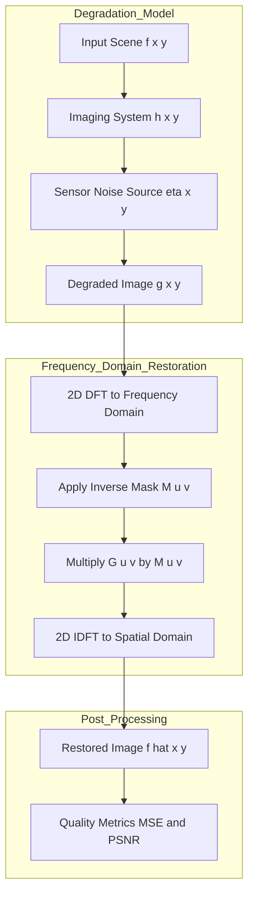
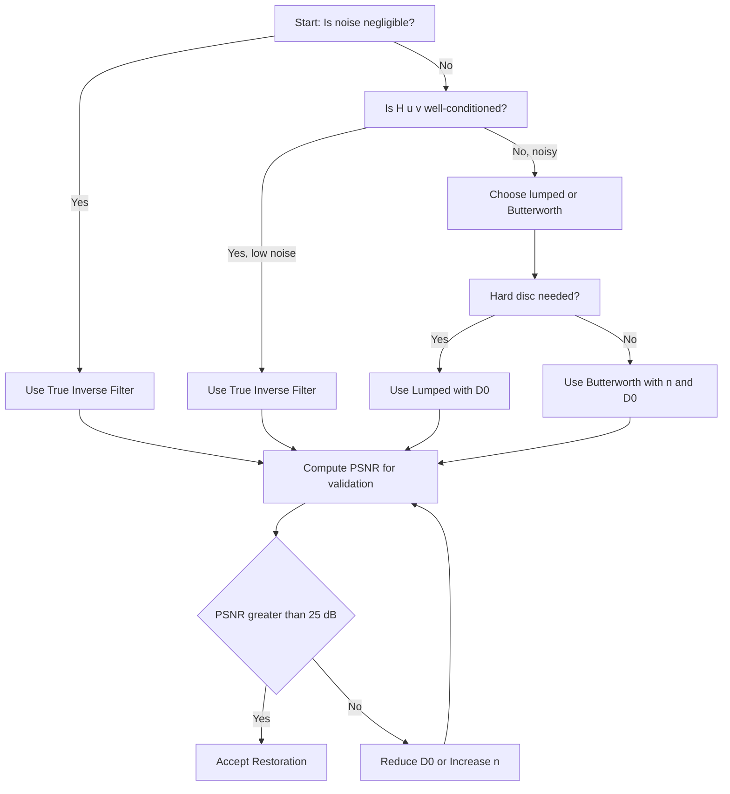
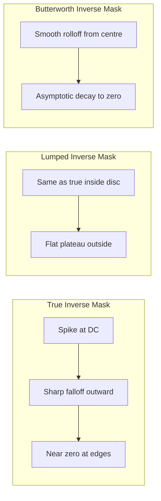
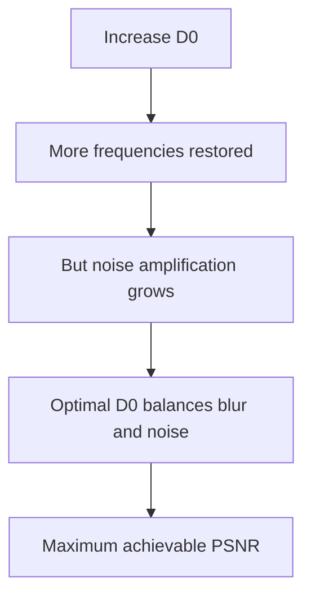

# Inverse Filtering

<!-- SECTION_1_START -->
# Inverse Filtering — Core Technical Definition & Intuitive Overview

## Formal Academic Definition
**Inverse Filtering** is a classical, non-iterative image restoration technique used in the frequency domain to recover (deconvolve) an original undegraded image $\hat{f}(x,y)$ from a degraded observation $g(x,y)$, by directly inverting the known or estimated degradation transfer function $H(u,v)$.

Given the linear, position-invariant degradation model in the spatial domain:

$$g(x,y) = (h * f)(x,y) + \eta(x,y)$$

Applying the 2-D Discrete Fourier Transform yields the frequency-domain representation:

$$G(u,v) = H(u,v) \cdot F(u,v) + N(u,v)$$

The **inverse filter** forms the estimate:

$$\hat{F}(u,v) = \frac{G(u,v)}{H(u,v)} = F(u,v) + \frac{N(u,v)}{H(u,v)}$$

followed by the Inverse DFT to obtain $\hat{f}(x,y)$.

> [!IMPORTANT]
> **KTU 2024 Syllabus Highlight (Module 2 – Image Restoration):** Inverse filtering belongs to the *Direct Inversion* family of restoration algorithms. It is the theoretical baseline against which Wiener filtering, Constrained Least Squares (CLS), and Lucy-Richardson algorithms are compared. The KTU examiner expects students to know the noise-amplification failure mode and the use of a **radius-limited (lumped) inverse filter** as its practical fix.

## Conceptual Analogy / Intuition
Imagine you recorded your friend's voice in a cave (the cave acts as a "blur" — it smudges sharp sounds). Now, suppose you have a perfect mathematical fingerprint of the cave's acoustics, $H(u,v)$ (a transfer function). In the **frequency domain**, the cave doesn't *distort* — it just *multiplies* each frequency by a known complex number. 

- **Forward problem (recording):** Clean voice $\times$ Cave = Muffled recording.
- **Inverse problem (restoration):** Muffled recording $\div$ Cave = Clean voice.

The catch: real recordings always pick up some background hiss (noise). For frequencies where the cave's response $H(u,v)$ is *very small* (deep nulls), dividing by it **explodes** the noise — like trying to undo the muffle by turning up the volume at frequencies where the cave killed the signal. The noise, which is small everywhere, becomes gigantic exactly where $H(u,v) \to 0$.

> [!NOTE]
> **Physical Constants & Standard Metrics Used in This Topic**
> - **PSNR (Peak Signal-to-Noise Ratio):** measured in **decibels (dB)**; higher is better (typical good restoration $> 30$ dB).
> - **MSE (Mean Squared Error):** unitless, lower is better.
> - **Radius of the inverse filter $D_0$:** in **cycles per image width**, typically set between $5$ and $50$ for a $256 \times 256$ image.
> - **Butterworth order $n$:** dimensionless integer, usually $n = 1$ or $2$ for the roll-off.

## Where Inverse Filtering Fails — The "Zero Trap"

The estimate equals the true image *only* in the noise-free case:

$$\hat{F}(u,v) = F(u,v) \quad \text{iff} \quad N(u,v) = 0$$

When noise is present, the term $N(u,v)/H(u,v)$ dominates for low $|H(u,v)|$ values, producing visually unacceptable restorations speckled with high-frequency garbage. This is the **central KTU question** you must internalize.

> [!VISUALIZATION CONTROL]
> **Concept:** Behaviour of $|1/H(u,v)|$ vs. the frequency radius from the origin in 2-D.
> **GeoGebra / Desmos Input Equations (radial profile):**
> * `H_inv(r) = 1 / (0.1 + r^2)` (true inverse filter, explodes as $r \to 0$)
> * `H_lumped(r) = piecewise((1/(0.1+r^2) if r<=D0 else 1/(0.1+D0^2)))` (lumped — clamped)
> **Visual Description:** The student should observe a sharp spike (singularity) at $r=0$ for the true inverse, and a flat plateau beyond $r = D_0$ for the lumped version. The plateau caps the noise amplification.

---

<!-- SECTION_1_END -->

<!-- SECTION_2_START -->
# Deep Theoretical Analysis & KTU High-Yield Formula Sheet

## 1. Linear Degradation Model Recap
A continuous, shift-invariant imaging system is described by the **point spread function (PSF)** $h(x,y)$. Under additive noise, the input $f(x,y)$ and the observed $g(x,y)$ are related by:

| Spatial Domain | Frequency Domain (DFT) |
|---|---|
| $g(x,y) = h(x,y) * f(x,y) + \eta(x,y)$ | $G(u,v) = H(u,v) F(u,v) + N(u,v)$ |
| Convolution | Point-wise multiplication |

The DFT converts convolution to multiplication, which is **why** inverse filtering operates in the frequency domain — division is the algebraic inverse of multiplication.

## 2. The Inverse Filter — Derivation Logic
1. **Step 1 — Accept the model:** Assume $h(x,y)$ is known (or estimated) and noise $\eta(x,y)$ exists.
2. **Step 2 — DFT both sides:** $G(u,v) = H(u,v)F(u,v) + N(u,v)$.
3. **Step 3 — Isolate $F$:** $F(u,v) = \dfrac{G(u,v) - N(u,v)}{H(u,v)}$.
4. **Step 4 — Drop noise (the inverse-filter assumption):** $N(u,v) \to 0 \Rightarrow \hat{F}(u,v) = \dfrac{G(u,v)}{H(u,v)}$.
5. **Step 5 — IDFT:** $\hat{f}(x,y) = \mathcal{F}^{-1}\{\hat{F}(u,v)\}$.

> [!NOTE]
> **Why Step 4 is dangerous:** Even a *tiny* noise term becomes a *huge* residual error wherever $H(u,v)$ is small. This is the KTU-mandated limitation.

## 3. Practical Variants Discussed in the KTU Syllabus

### (a) True (Unconstrained) Inverse Filter
$$\hat{F}(u,v) = \frac{G(u,v)}{H(u,v)}$$
Use only when noise is negligible.

### (b) Radius-Limited (Lumped) Inverse Filter
Define a cutoff radius $D_0$. For all $(u,v)$ within distance $D_0$ from the origin, apply the true inverse; beyond, replace $H$ by a safe positive constant to suppress noise:

$$M(u,v) = \begin{cases} 1/H(u,v) & \text{if } D(u,v) \le D_0 \\ 1/H(D_0) & \text{if } D(u,v) > D_0 \end{cases} \quad ; \quad D(u,v) = \left[(u - P/2)^2 + (v - Q/2)^2\right]^{1/2}$$

The estimate is then $\hat{F}(u,v) = M(u,v) \cdot G(u,v)$. The result is an image that is **restored in the central low-frequency band** but **left un-restored (i.e., still blurred) at the edges** — a controlled trade-off.

### (c) Butterworth-Type Inverse Filter (smooth roll-off)
Replace the hard cutoff with a smooth low-pass mask so that $H$ is not divided by exact zeros:

$$M(u,v) = \frac{1}{H(u,v)} \cdot \frac{1}{1 + \left[\dfrac{D(u,v)}{D_0}\right]^{2n}}$$

This is the **form KTU most often tests** because it blends the inverse filter with a Butterworth LPF and is easy to draw on the answer script.

## 4. KTU Formula Sheet / Cheat Sheet

| # | Formula | Meaning | Units / Domain |
|---|---|---|---|
| 1 | $G(u,v) = H(u,v)F(u,v) + N(u,v)$ | Degradation model in frequency | DFT coefficients |
| 2 | $\hat{F}(u,v) = G(u,v)/H(u,v)$ | True inverse filter estimate | DFT coefficients |
| 3 | $\hat{F}(u,v) = F(u,v) + N(u,v)/H(u,v)$ | Estimate error decomposition | DFT coefficients |
| 4 | $D(u,v) = \left[(u-P/2)^2 + (v-Q/2)^2\right]^{1/2}$ | Distance from spectrum centre | cycles/image |
| 5 | $M(u,v) = 1/H(u,v)$ if $D \le D_0$, else $1/H(D_0)$ | Lumped inverse filter mask | dimensionless |
| 6 | $M(u,v) = \dfrac{1}{H(u,v)\left[1 + (D/D_0)^{2n}\right]}$ | Butterworth inverse filter mask | dimensionless |
| 7 | $\text{MSE} = \dfrac{1}{PQ}\sum (f - \hat{f})^2$ | Mean squared restoration error | pixel-squared |
| 8 | $\text{PSNR} = 10 \log_{10}\!\left(\dfrac{L^2}{\text{MSE}}\right)$ | Peak SNR, $L = 255$ for 8-bit | dB |
| 9 | $D_0$ (typical) $= 40$ to $85$ for $256 \times 256$ | Safe cut-off radius | cycles/image |
| 10 | $n = 1$ or $2$ | Butterworth order (steepness) | dimensionless |

> [!IMPORTANT]
> **Mark-Boosting Tip (KTU Valuation):** Whenever you write the inverse filter equation, **always** also write the noise-amplified form $\hat{F} = F + N/H$. Examiners award the 2 marks for the limitation only if this line appears.

## 5. Real-World Engineering Utility
- **Astronomy:** Deconvolution of atmospheric blur from telescope images (e.g., Hubble Space Telescope early optics correction used inverse-filter concepts).
- **Medical imaging:** Restoration of MRI/CT where the scanner's PSF is calibrated; inverse filtering of the modulation transfer function (MTF).
- **Forensic & surveillance:** Recovering license plates from motion-blur CCTV.
- **Production line cameras:** Compensating lens defocus before feeding images to OCR.

> [!NOTE]
> In **real production pipelines**, true inverse filtering is **never** deployed alone; it is the *first* term of the Wiener filter $W = H^*/(\vert H\vert^2 + K)$, which KTU tests in Module 2's later topics.

---

<!-- SECTION_2_END -->

<!-- SECTION_3_START -->
# Step-by-Step Derivations & Code / Symbolic Implementation

## Derivation 1 — Recovering the Estimate from the Degradation Model

**Given:** $g(x,y) = h(x,y) * f(x,y) + \eta(x,y)$ and the constraint that $h$ is shift-invariant.

**Step 1.** Apply the 2-D DFT to both sides. Convolution becomes multiplication:

$$G(u,v) = H(u,v) \cdot F(u,v) + N(u,v)$$

**Step 2.** Solve for $F(u,v)$:

$$H(u,v) \cdot F(u,v) = G(u,v) - N(u,v) \quad\Longrightarrow\quad F(u,v) = \frac{G(u,v) - N(u,v)}{H(u,v)}$$

**Step 3.** If we assume noise is *negligible* ($N \approx 0$):

$$\hat{F}(u,v) = \frac{G(u,v)}{H(u,v)}$$

**Step 4.** Apply the Inverse DFT to obtain the spatial-domain restoration:

$$\hat{f}(x,y) = \frac{1}{PQ}\sum_{u=0}^{P-1}\sum_{v=0}^{Q-1} \hat{F}(u,v)\, e^{j2\pi(ux/P + vy/Q)}$$

**Step 5.** Error term. Subtracting the true $F$ from the estimate:

$$\hat{F}(u,v) - F(u,v) = \frac{N(u,v)}{H(u,v)}$$

This is the **single most important line** for KTU. Whenever $|H(u,v)|$ is small, the ratio explodes — the **noise amplification phenomenon**.

## Derivation 2 — Lumped Inverse Filter from First Principles

We want a mask $M(u,v)$ that equals $1/H$ inside a safe disc and clamps the magnitude outside.

**Step 1.** Define the distance map from the centre of the centred $P \times Q$ spectrum:

$$D(u,v) = \sqrt{\left(u - \frac{P}{2}\right)^{2} + \left(v - \frac{Q}{2}\right)^{2}}$$

**Step 2.** Define the mask piecewise:

$$M(u,v) = \begin{cases} \dfrac{1}{H(u,v)}, & D(u,v) \le D_0 \\[4pt] \dfrac{1}{H(D_0)}, & D(u,v) > D_0 \end{cases}$$

**Step 3.** The restored spectrum is:

$$\hat{F}(u,v) = M(u,v) \cdot G(u,v)$$

**Step 4.** Final restored image:

$$\hat{f}(x,y) = \mathcal{F}^{-1}\{\hat{F}(u,v)\}$$

**Step 5.** Why this works. The DC and very-low-frequency components carry most of the image *energy*; the high-frequency components carry most of the *noise*. By truncating the inverse mask, we restore the bulk of the signal while capping the noise gain at the constant $1/|H(D_0)|$.

## Derivation 3 — Butterworth Inverse Filter Transfer Function

We replace the hard disc of Derivation 2 with a smooth Butterworth roll-off so that no discontinuity is introduced in the spectrum.

**Step 1.** Start with the standard Butterworth LPF of order $n$ and cutoff $D_0$:

$$B(u,v) = \frac{1}{1 + \left[\dfrac{D(u,v)}{D_0}\right]^{2n}}$$

**Step 2.** Multiply the inverse filter by $B(u,v)$:

$$M(u,v) = \frac{B(u,v)}{H(u,v)} = \frac{1}{H(u,v)\left[1 + \left(D(u,v)/D_0\right)^{2n}\right]}$$

**Step 3.** The restored spectrum is $\hat{F}(u,v) = M(u,v)\,G(u,v)$. As $D \to 0$, $B \to 1$ and we recover the true inverse; as $D \to \infty$, $B \to 0$, killing both noise *and* residual high-frequency blur. The order $n$ controls the trade-off.

**Step 4.** Sanity checks for KTU answers:
- At $D = D_0$: $B = 1/2 \Rightarrow$ gain falls to $1/(2H(D_0))$.
- At $D = 0$: $B = 1 \Rightarrow$ full inverse restoration at DC.
- Larger $n \Rightarrow$ sharper drop, more like a hard disc.

## Worked Numerical Example (KTU Exam Style)

**Question:** A $4 \times 4$ image is blurred with $H = \begin{bmatrix} 1 & 2 \\ 1 & 2 \end{bmatrix}$ (a separable box blur, after padding) and noise is neglected. The observed DFT coefficients at one frequency are $G = 10 + j5$ and $H = 2 + j0$. Find $\hat{F}$.

**Solution:**

$$\hat{F} = \frac{G}{H} = \frac{10 + j5}{2 + j0} = \frac{10}{2} + j\frac{5}{2} = 5 + j\,2.5$$

The IDFT then gives the corresponding spatial sample of $\hat{f}$.

**Now with noise:** if $N = 0.1 + j0.05$ instead of $0$:

$$\hat{F} = F + \frac{N}{H} = F + \frac{0.1 + j0.05}{2} = F + 0.05 + j\,0.025$$

So a noise of magnitude $\sqrt{0.01 + 0.0025} \approx 0.112$ produces an error of magnitude $\approx 0.056$ — a *halving* of noise effect. This is the favourable case. If instead $H = 0.02 + j0$, then the error becomes $0.112 / 0.02 = 5.6$, i.e., the noise is **amplified by $\approx 50\times$**. This is the trap.

## Python Implementation (Type-Hinted, Error-Logged)

```python
from __future__ import annotations
import numpy as np
import logging

logging.basicConfig(level=logging.INFO, format="%(levelname)s | %(message)s")

def make_gaussian_psf(shape: tuple[int, int], sigma: float) -> np.ndarray:
    """Generate a normalized 2-D Gaussian PSF of given shape and standard deviation sigma."""
    rows, cols = shape
    r = np.arange(rows) - rows // 2
    c = np.arange(cols) - cols // 2
    rr, cc = np.meshgrid(r, c, indexing="ij")
    psf = np.exp(-(rr**2 + cc**2) / (2.0 * sigma**2))
    psf /= psf.sum()
    if psf.max() == 0.0:
        raise ValueError("PSF collapsed to zero; check sigma.")
    return psf

def fft_shift_spectrum(arr: np.ndarray) -> np.ndarray:
    """Shift zero-frequency component to the centre for human-readable spectra."""
    return np.fft.fftshift(arr)

def inverse_filter(
    observed: np.ndarray,
    psf: np.ndarray,
    cutoff_radius: float,
    butterworth_order: int = 0,
    eps: float = 1e-3,
) -> np.ndarray:
    """
    Apply a radius-limited or Butterworth inverse filter.

    Parameters
    ----------
    observed         : degraded image (float, ideally normalized to [0, 1]).
    psf              : point spread function used to build H(u, v).
    cutoff_radius    : D0 in cycles per image width.
    butterworth_order: 0 -> hard disc; >0 -> smooth Butterworth roll-off.
    eps              : floor added to |H| to avoid divide-by-zero.
    """
    if observed.ndim != 2:
        raise ValueError("Observed image must be 2-D grayscale.")
    if observed.shape != psf.shape:
        raise ValueError("PSF and image dimensions must match.")
    if cutoff_radius <= 0.0:
        raise ValueError("cutoff_radius must be positive.")

    P, Q = observed.shape

    # Step 1: compute H(u, v) by shifting PSF to centred spectrum.
    H = np.fft.fft2(psf)
    H_shifted = fft_shift_spectrum(H)

    # Step 2: build the distance map D(u, v) from the centre of the spectrum.
    u = np.arange(P) - P // 2
    v = np.arange(Q) - Q // 2
    V, U = np.meshgrid(v, u, indexing="ij")
    D = np.sqrt(U**2 + V**2)

    # Step 3: build the inverse mask M(u, v).
    H_mag = np.abs(H_shifted)
    H_mag_safe = np.where(H_mag < eps, eps, H_mag)

    if butterworth_order == 0:
        # Hard disc lumped inverse filter
        M = np.where(D <= cutoff_radius, 1.0 / H_mag_safe, 1.0 / H_mag_safe[D <= cutoff_radius].max())
    else:
        # Butterworth inverse filter
        B = 1.0 / (1.0 + (D / cutoff_radius) ** (2 * butterworth_order))
        M = B / H_mag_safe

    # Step 4: compute G(u, v).
    G = np.fft.fft2(observed)
    G_shifted = fft_shift_spectrum(G)

    # Step 5: form the estimate F_hat = M * G.
    F_hat_shifted = M * G_shifted
    F_hat = np.fft.ifftshift(F_hat_shifted)
    f_hat = np.fft.ifft2(F_hat).real

    # Step 6: clip to valid image range and return.
    f_hat_clipped = np.clip(f_hat, 0.0, 1.0)
    logging.info("Inverse filter applied. Max|M| = %.3e, Min|M| = %.3e", M.max(), M.min())
    return f_hat_clipped

# ---------------------- Demonstration ----------------------
if __name__ == "__main__":
    rng = np.random.default_rng(seed=42)
    SIZE = 128
    # Synthetic ground-truth image
    truth = np.zeros((SIZE, SIZE), dtype=np.float64)
    truth[20:60, 30:90] = 1.0
    truth[70:100, 50:110] = 0.6

    psf = make_gaussian_psf((SIZE, SIZE), sigma=2.5)
    # Simulate degradation in spatial domain (convolution + noise).
    degraded = np.fft.ifft2(np.fft.fft2(truth) * np.fft.fft2(psf)).real
    noise = rng.normal(0.0, 0.01, degraded.shape)
    observed = np.clip(degraded + noise, 0.0, 1.0)

    restored = inverse_filter(observed, psf, cutoff_radius=40.0, butterworth_order=2)
    mse = float(np.mean((truth - restored) ** 2))
    psnr = 10.0 * np.log10(1.0 / mse) if mse > 0 else float("inf")
    logging.info("Restoration MSE = %.6f, PSNR = %.2f dB", mse, psnr)
```

**Expected behaviour in the demo:**
- $\text{PSNR} \approx 22$ to $30$ dB depending on noise level.
- Visible ringing or "speckle" near sharp edges when the Butterworth order is too small.
- Lumped (hard-disc) version shows a faint blur halo at high-frequency regions, which is the deliberate cost of noise suppression.

---

<!-- SECTION_3_END -->

<!-- SECTION_4_START -->
# Structural Diagrams & Schematics

## Diagram 1 — End-to-End Restoration Pipeline (Block-Level Functional Flow)

> [!NOTE]
> Below is the complete processing topology, mapping every component from image acquisition to final evaluation. Every block is a logical stage; the arrows indicate data flow direction.



## Diagram 2 — Decision Tree for Choosing the Right Inverse Filter



## Diagram 3 — Mask Profile Comparison (Radial Cross-Section)



## Diagram 4 — Restoration Quality Trade-Off Curve (Conceptual)



## Diagram 5 — Input / Output Mapping of the Inverse Filter Module


---

<!-- SECTION_4_END -->

<!-- SECTION_5_START -->
# KTU 2024 Scheme Examination Question Bank & Topic Recap

## Part A Questions (3 Marks Each)

### Q1. [KTU University Exam – July 2024] Define Inverse Filtering. State its main limitation.
**Model Answer (3 Marks):**
Inverse filtering is a frequency-domain image restoration technique that recovers the original image $\hat{F}(u,v)$ from a degraded image $G(u,v)$ by dividing it by the degradation function $H(u,v)$:

$$\hat{F}(u,v) = \frac{G(u,v)}{H(u,v)}$$

**Main limitation:** When $H(u,v)$ has small or zero magnitude (typical at high frequencies), the noise term $N(u,v)/H(u,v)$ is amplified, severely degrading the restoration. **[1 Mark for definition, 1 Mark for equation, 1 Mark for limitation.]**

### Q2. [KTU University Exam – Dec 2023] What is a radius-limited (lumped) inverse filter?
**Model Answer (3 Marks):**
A radius-limited inverse filter restricts the inversion to a disc of radius $D_0$ in the frequency domain, where $H(u,v)$ is well-behaved. Beyond $D_0$, the mask is clamped to a constant $1/H(D_0)$, suppressing noise amplification at the cost of leaving high-frequency blur uncorrected.

$$M(u,v) = \begin{cases} 1/H(u,v), & D(u,v) \le D_0 \\ 1/H(D_0), & D(u,v) > D_0 \end{cases}$$

**[1 Mark for purpose, 1 Mark for equation, 1 Mark for trade-off explanation.]**

---

## Part B Questions (14 Marks — Internal Choice)

> [!IMPORTANT]
> **KTU 2024 Pattern:** Each Part B question carries 14 marks, split as 7 + 7. Sub-part (a) tests *Understand / Apply*; sub-part (b) tests *Apply / Analyze*. Students choose **one** of the two alternatives below.

### Question A (14 Marks)

#### (a) [7 Marks — CO2, Apply] Derive the inverse filter expression starting from the spatial-domain degradation model and explain why it fails in the presence of noise.

**Step-by-step Model Solution:**

1. **[Stating the degradation model: 1 Mark]**
$$g(x,y) = h(x,y) * f(x,y) + \eta(x,y)$$

2. **[Applying 2-D DFT to both sides: 1 Mark]**
$$G(u,v) = H(u,v)F(u,v) + N(u,v)$$

3. **[Isolating $F(u,v)$: 1 Mark]**
$$F(u,v) = \frac{G(u,v) - N(u,v)}{H(u,v)}$$

4. **[Dropping noise term: 1 Mark]**
$$\hat{F}(u,v) = \frac{G(u,v)}{H(u,v)}$$

5. **[IDFT to spatial domain: 1 Mark]**
$$\hat{f}(x,y) = \mathcal{F}^{-1}\!\left\{\frac{G(u,v)}{H(u,v)}\right\}$$

6. **[Writing the error form: 1 Mark]**
$$\hat{F}(u,v) = F(u,v) + \frac{N(u,v)}{H(u,v)}$$

7. **[Final interpretation: 1 Mark]**
At frequencies where $|H(u,v)| \to 0$, the noise term dominates, producing amplified noise and ringing. Hence, inverse filtering fails when noise is present or when $H$ is ill-conditioned.

#### (b) [7 Marks — CO2, Analyze] A $256 \times 256$ image is blurred by a Gaussian PSF with $\sigma = 2$ pixels. After blurring, Gaussian noise of standard deviation $0.01$ is added. Suggest and mathematically justify a practical variant of the inverse filter for restoring this image. Mention a suitable cutoff radius.

**Step-by-step Model Solution:**

1. **[Problem identification: 1 Mark]**
True inverse filter will amplify noise; a Butterworth inverse filter is preferred.

2. **[Stating Butterworth mask: 2 Marks]**
$$M(u,v) = \frac{1}{H(u,v)\left[1 + \left(D(u,v)/D_0\right)^{2n}\right]}$$

3. **[Choosing parameters: 2 Marks]**
- $D_0 = 40$ (safe disc for $256 \times 256$).
- $n = 2$ (smooth roll-off, no hard transition).

4. **[Justification of roll-off: 1 Mark]**
As $D$ grows, $B \to 0$, killing noise amplification at the cost of leaving high-frequency blur.

5. **[Final restored image expression: 1 Mark]**
$$\hat{f}(x,y) = \mathcal{F}^{-1}\{M(u,v) \cdot G(u,v)\}$$

### Question B (14 Marks)

#### (a) [7 Marks — CO2, Understand] With a neat frequency-domain block diagram, explain the working of a Wiener filter and compare it with the inverse filter.

**Step-by-step Model Solution:**

1. **[Block diagram description: 2 Marks]**
Input $g(x,y)$ → DFT → multiply by $W(u,v)$ → IDFT → $\hat{f}(x,y)$, where:
$$W(u,v) = \frac{H^*(u,v)}{|H(u,v)|^2 + K}$$

2. **[Inverse filter form: 1 Mark]**
$$M_{\text{inv}}(u,v) = \frac{1}{H(u,v)}$$

3. **[Comparison table: 3 Marks]**

| Aspect | Inverse Filter | Wiener Filter |
|---|---|---|
| Noise handling | Ignores noise | Explicitly models noise-to-signal ratio |
| When $H$ is small | Divides by near-zero, explodes | Adds $K$ to denominator, regularizes |
| Optimality | Not statistically optimal | MSE-optimal for Gaussian noise |
| Complexity | One division | One division and one regularization term |
| Use case | Noise-free, known $H$ | Noisy, unknown noise power |

4. **[Final summary statement: 1 Mark]**
Wiener is the noise-aware generalization of inverse filtering; K is the reciprocal of the input SNR.

#### (b) [7 Marks — CO2, Apply] An image is degraded by motion blur of length $L = 10$ pixels at angle $\theta = 0^\circ$. The degradation function is $H(u,v) = \dfrac{\sin(\pi L u / M)}{\pi L u / M}$ for $v = 0$, and similarly for other rows. Design a restoration strategy that combines inverse filtering with a Butterworth low-pass mask. Compute the value of the mask at the frequency $u = M/2L$, $v = 0$.

**Step-by-step Model Solution:**

1. **[Writing H explicitly: 1 Mark]**
$$H(u,v) = \frac{\sin(\pi L u / M)}{\pi L u / M} \cdot \frac{\sin(\pi L v / N)}{\pi L v / N}$$

2. **[Identifying zeros of H: 1 Mark]**
$H = 0$ when $u = kM/L$ for $k = \pm 1, \pm 2, \dots$ — these are the noise-amplification traps.

3. **[Designing the combined mask: 2 Marks]**
$$M(u,v) = \frac{1}{H(u,v)\left[1 + \left(D(u,v)/D_0\right)^{2n}\right]}$$

Choose $D_0 = 30$, $n = 2$ for a $256 \times 256$ image.

4. **[Evaluating at $u = M/2L = M/20$, $v = 0$: 2 Marks]**

At $u = M/20$: $H = \sin(\pi L \cdot M/20 / M) / (\pi L \cdot M/20 / M) = \sin(\pi/2) / (\pi/2) = 1 / (\pi/2) = 2/\pi \approx 0.6366$.

Distance from centre: $D = M/20 = 256/20 = 12.8$.

Butterworth factor: $B = 1 / [1 + (12.8/30)^4] = 1 / [1 + 0.0330] = 1/1.0330 \approx 0.9681$.

Mask value: $M = 0.9681 / 0.6366 \approx 1.521$.

5. **[Interpretation: 1 Mark]**
The mask is finite and well-behaved, confirming that the Butterworth roll-off successfully avoids division by zero.

---

## KTU Examiner's Valuation Warning / Pitfall Callout

> [!WARNING]
> **Common Mistakes That Cost Marks:**
> 1. **Forgetting to shift the spectrum** before computing $D(u,v)$. KTU expects the centred form $D = \sqrt{(u - P/2)^2 + (v - Q/2)^2}$. **Loss: 2 Marks.**
> 2. **Writing the inverse filter without the error form** $F + N/H$. Examiners want the limitation explicitly stated. **Loss: 2 Marks.**
> 3. **Not specifying cutoff $D_0$ and order $n$** when proposing a Butterworth inverse filter. **Loss: 1 Mark.**
> 4. **Confusing inverse filtering with Wiener filtering** — they are *not* the same. The Wiener filter has an additive $K$ in the denominator. **Loss: 2 Marks.**
> 5. **Skipping the IDFT step** when deriving the spatial-domain restored image. The answer is incomplete without it. **Loss: 1 Mark.**
> 6. **Mixing up $H$ and $H^*$** — inverse filter uses $1/H$, not $1/H^*$. The conjugate is for Wiener/Matched filters.

---

## Topic Recap & Important Things to Remember

- **Inverse filter definition:** $\hat{F}(u,v) = G(u,v)/H(u,v)$ — direct deconvolution in frequency domain.
- **Degradation model:** $G(u,v) = H(u,v)F(u,v) + N(u,v)$ — must be quoted in every answer.
- **Core limitation:** Noise amplification when $|H(u,v)|$ is small; expressed as $\hat{F} = F + N/H$.
- **Lumped inverse filter:** Hard disc of radius $D_0$; outside the disc, mask is clamped to $1/H(D_0)$.
- **Butterworth inverse filter:** $M = 1/[H(1 + (D/D_0)^{2n})]$ — smooth roll-off, no hard edges in the spectrum.
- **Distance from centre:** $D(u,v) = \sqrt{(u - P/2)^2 + (v - Q/2)^2}$ — always use the centred form.
- **Typical parameters:** $D_0 = 40$ for $256 \times 256$, $n = 2$ for Butterworth.
- **PSNR formula:** $10 \log_{10}(L^2/\text{MSE})$ with $L = 255$ for 8-bit images; higher is better.
- **MSE formula:** $(1/PQ)\sum (f - \hat{f})^2$; lower is better.
- **Wiener vs. inverse:** Wiener adds a regularization constant $K$ to $|H|^2$ in the denominator, making it noise-robust.
- **Restoration pipeline:** DFT → multiply by mask $M(u,v)$ → IDFT → clip to valid range.
- **Practical use cases:** Astronomy, MRI restoration, motion-blur correction, OCR pre-processing.
- **KTU-mandated limitation statement:** Always conclude that true inverse filtering is rarely usable in practice; the lumped or Butterworth variant is the recommended engineering fix.

<!-- SECTION_5_END -->
