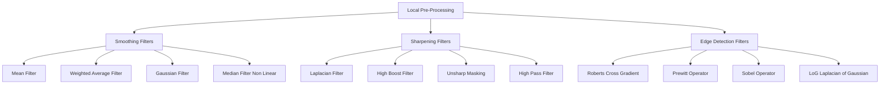
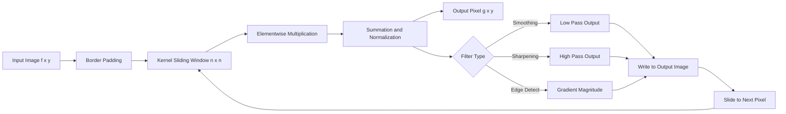
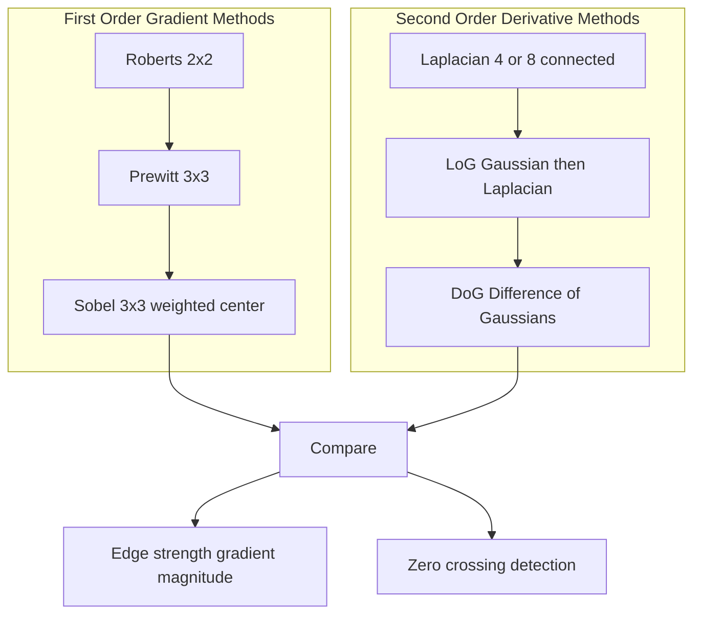
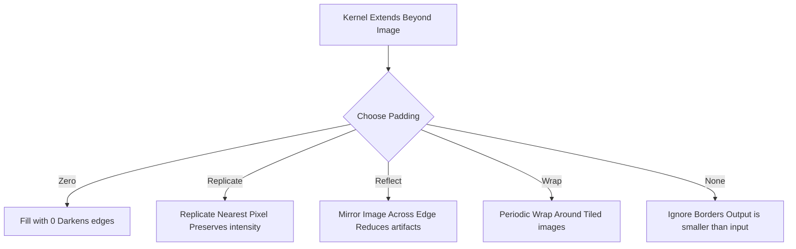

# Local pre-processing

<!-- SECTION_1_START -->

# Local Pre-Processing in Digital Image Processing

> [!NOTE]
> **Core Definition (KTU 2024 Scheme Terminology)**
> **Local pre-processing** is a class of image enhancement and restoration operations in which the output pixel value at spatial coordinate $(x, y)$ is computed exclusively from the intensity values of pixels lying within a small, bounded **spatial neighborhood** $N(x, y)$ centered on $(x, y)$. The neighborhood is typically defined by an $n \times n$ **mask (kernel/window/filter)** that scans the image pixel-by-pixel (or row-by-row) to produce a transformed output image.

In strict mathematical terms, a local pre-processing operation is expressed as:

$$g(x, y) = T\Big[\,f(x, y) \;\text{ and pixels in }\; N(x, y)\,\Big]$$

where $f(x, y)$ is the input image, $g(x, y)$ is the processed output, and $T$ is a transformation function defined over the local neighborhood. The size of $N$ is commonly $3 \times 3$, $5 \times 5$, or $7 \times 7$, with **odd dimensions** preferred so that the center pixel coincides with $(x, y)$.

> [!IMPORTANT]
> **Why "Local" and Not "Global"?**
> Global operations (e.g., histogram equalization) use the *entire* image to compute a single transform. Local pre-processing, in contrast, preserves *spatial locality* — it captures fine structures such as edges, textures, and noise bursts that exist only over a few pixels. This is the very reason local pre-processing is the foundation of **edge detection, noise smoothing, and image sharpening**.

---

## Conceptual Analogy / Intuitive Overview

Imagine you are a **chef tasting a soup**:
- A **global operation** is like tasting the entire pot and adjusting the salt for the whole batch.
- A **local operation** is like using a *small ladle* to taste only a few spoonfuls from one region, then moving the ladle to the next region and tasting there.

Similarly, a local pre-processing filter is a **small sliding window** (the "ladle") that:
1. Centers on a pixel.
2. Reads the intensities of the surrounding pixels in the window.
3. Applies a mathematical rule (sum, weighted average, derivative, etc.).
4. Writes a new value to the same coordinate in the output image.
5. Slides to the next pixel and repeats.

> [!TIP]
> **Geometric Intuition**
> A $3 \times 3$ neighborhood around pixel $(x, y)$ consists of the pixels $\{(x+i, y+j) \mid i, j \in \{-1, 0, 1\}\}$. When the filter slides across the image, it is essentially performing a **2-D discrete convolution** (or correlation) between the image $f$ and a small filter kernel $w$.

The three principal branches of local pre-processing are:

1. **Smoothing (Low-Pass Filtering)** — suppresses noise and fine detail; used as a pre-step for edge detection and segmentation.
2. **Sharpening (High-Pass Filtering)** — emphasizes fine detail, edges, and abrupt intensity transitions; used in medical imaging, printing, and surveillance.
3. **Edge Detection** — a hybrid category that computes image derivatives locally to mark boundaries of objects.

> [!IMPORTANT]
> **Key Constants and Parameters to Remember**
> - **Neighborhood size** $n$ — usually $3$ (most common), $5$, or $7$.
> - **Standard deviation $\sigma$** — controls the spread of a Gaussian kernel. Typical values: $\sigma \in [0.5, 3.0]$.
> - **Filter coefficient sum** — for a smoothing filter, it should equal **1** (or be normalized to 1) to preserve mean intensity.
> - **Border padding** — image edges require padding (zeros, replication, reflection, wrap-around) because the kernel extends beyond the image.

---

## GeoGebra / Desmos Visualization

> [!VISUALIZATION CONTROL]
> **Concept:** 2-D Gaussian kernel surface — illustrates how weights vary with distance from the center pixel.
> **GeoGebra / Desmos Input Equations:**
> * `G(x, y) = (1/(2*pi*sigma^2)) * exp(-(x^2 + y^2)/(2*sigma^2))` with $\sigma = 1.0$ and $(x, y) \in [-3, 3] \times [-3, 3]$
> **Visual Description:** A smooth, bell-shaped mound centered at the origin. The peak (highest weight) is at $(0, 0)$ and weights decay radially outward. Pixels farther from the center contribute less to the output.

A second useful visualization:

> [!VISUALIZATION CONTROL]
> **Concept:** Step-edge response of a Sobel gradient filter.
> **GeoGebra / Desmos Input Equations:**
> * Plot of $f(x) = 50 + 200 \cdot H(x - 5)$ (a 1-D step edge at $x = 5$).
> * Convolution with $G_x = [-1, 0, +1]$ produces a response $R(x)$ that is **zero in flat regions** and **peaks at the edge location**.
> **Visual Description:** The derivative-of-step response rises sharply at $x = 5$, demonstrating how first-order gradient filters highlight edges.

<!-- SECTION_1_END -->

<!-- SECTION_2_START -->

# Deep Theoretical Analysis & KTU High-Yield Formula Sheet

## 2.1 The Mechanics of Neighborhood Processing

Every local pre-processing operation reduces to a **discrete convolution** between the input image $f(x, y)$ and a filter kernel $w(i, j)$ of size $m \times n$:

$$g(x, y) = w(i, j) \;\circledast\; f(x, y) = \sum_{i=-a}^{a} \sum_{j=-b}^{b} w(i, j) \cdot f(x - i, y - j)$$

where $a = (m-1)/2$ and $b = (n-1)/2$. The output $g$ is computed for every spatial position $(x, y)$ for which the kernel fully overlaps the image.

> [!IMPORTANT]
> **Convolution vs. Correlation**
> In *correlation*, the kernel is applied without flipping: $g(x, y) = \sum \sum w(i, j) \cdot f(x + i, y + j)$. For **symmetric kernels** (e.g., Gaussian, Laplacian, Mean), convolution and correlation produce identical results. For **asymmetric kernels** (e.g., Sobel $G_x$), the distinction matters. KTU examiners often test this difference.

### Step-by-Step Operation Logic

1. **Kernel placement** — anchor the kernel center at pixel $(x, y)$.
2. **Multiplication** — multiply each kernel weight with the underlying image pixel.
3. **Summation** — sum the products to obtain a single scalar.
4. **Assignment** — write the scalar into $g(x, y)$.
5. **Slide and repeat** — shift by one pixel and continue.
6. **Border handling** — for pixels near the border, the kernel extends outside the image; apply one of: zero-padding, replication, reflection, or wrap-around.

---

## 2.2 Smoothing Filters (Low-Pass Local Pre-Processing)

### 2.2.1 Mean (Box / Average) Filter

Replaces each pixel by the arithmetic mean of its neighborhood. The kernel is a uniform $n \times n$ matrix of $1/n^2$ entries.

**Operation:**
$$g(x, y) = \frac{1}{n^2} \sum_{i=-a}^{a} \sum_{j=-b}^{b} f(x + i, y + j)$$

**$3 \times 3$ mask:**
$$\frac{1}{9}\begin{bmatrix} 1 & 1 & 1 \\ 1 & 1 & 1 \\ 1 & 1 & 1 \end{bmatrix}$$

- ✅ Simple, fast.
- ❌ Blurs edges equally in all directions; does not preserve edges.
- ❌ Suffers from **aliasing** if the noise frequency exceeds the Nyquist limit.

### 2.2.2 Weighted Average Filter

Assigns higher weights to pixels nearer the center, producing less blurring than the unweighted mean.

**Standard $3 \times 3$ weighted mask:**
$$\frac{1}{16}\begin{bmatrix} 1 & 2 & 1 \\ 2 & 4 & 2 \\ 1 & 2 & 1 \end{bmatrix}$$

The denominator is the sum of all weights: $1+2+1+2+4+2+1+2+1 = 16$. **Always normalize by the sum of weights.**

### 2.2.3 Gaussian Filter

The optimal smoothing kernel, derived from the 2-D Gaussian function. It is **rotationally symmetric** (no directional bias) and weights decay smoothly with distance.

**Continuous form:**
$$G(x, y) = \frac{1}{2\pi\sigma^2} e^{-\frac{x^2 + y^2}{2\sigma^2}}$$

**Discrete $3 \times 3$ approximation with $\sigma = 0.85$:**
$$\frac{1}{16}\begin{bmatrix} 1 & 2 & 1 \\ 2 & 4 & 2 \\ 1 & 2 & 1 \end{bmatrix} \quad \text{(identical to the weighted average above)}$$

- ✅ Best general-purpose smoother; preserves edges better than the mean filter.
- ✅ Separable: a 2-D Gaussian can be applied as two 1-D passes, reducing cost from $O(n^2)$ to $O(2n)$ per pixel.
- ❌ Still blurs edges to some degree.
- ❌ $\sigma$ must be chosen carefully — large $\sigma$ over-smooths.

### 2.2.4 Median Filter

A **non-linear** local filter that replaces the center pixel with the **median** of the neighborhood intensities. It is the gold standard for removing **salt-and-pepper noise**.

- ✅ Excellent at removing impulse noise while preserving edges.
- ❌ Non-linear, so no Fourier-domain interpretation.
- ❌ Slower than linear filters for large neighborhoods.

---

## 2.3 Sharpening Filters (High-Pass Local Pre-Processing)

Sharpening is achieved by **boosting high-frequency components** (edges, fine details) and attenuating low-frequency components (smooth regions). Mathematically, a high-pass filter is the complement of a low-pass filter:

$$H_{HP} = 1 - H_{LP}$$

### 2.3.1 The Laplacian (Second-Order Derivative Filter)

The Laplacian $\nabla^2 f$ of a 2-D function $f(x, y)$ is defined as the sum of unmixed second partial derivatives:

$$\nabla^2 f(x, y) = \frac{\partial^2 f}{\partial x^2} + \frac{\partial^2 f}{\partial y^2}$$

**Discrete approximation using a 4-neighborhood:**
$$\nabla^2 f(x, y) = f(x+1, y) + f(x-1, y) + f(x, y+1) + f(x, y-1) - 4 f(x, y)$$

**Corresponding $3 \times 3$ mask (4-connected):**
$$\begin{bmatrix} 0 & 1 & 0 \\ 1 & -4 & 1 \\ 0 & 1 & 0 \end{bmatrix}$$

**8-connected variant (includes diagonals):**
$$\begin{bmatrix} 1 & 1 & 1 \\ 1 & -8 & 1 \\ 1 & 1 & 1 \end{bmatrix}$$

**Sharpening by adding the Laplacian back:**
$$g(x, y) = f(x, y) - \nabla^2 f(x, y) \quad \text{(for the center-negative mask)}$$

$$g(x, y) = f(x, y) + \nabla^2 f(x, y) \quad \text{(for the center-positive mask)}$$

> [!WARNING]
> **Sign Convention Trap (Frequently Tested in KTU)**
> The sign of the center weight depends on the convention used. If the mask has a **negative center** (e.g., $-4$), the sharpening formula is $g = f - \nabla^2 f$. If the mask has a **positive center** (e.g., $+4$), the formula is $g = f + \nabla^2 f$. Always state your convention explicitly in the exam.

### 2.3.2 High-Boost Filtering

A high-boost filter is a generalization of high-pass filtering that allows a controllable amount of the original image to be retained:

$$g_{HB}(x, y) = A \cdot f(x, y) - \bar{f}(x, y)$$

where $\bar{f}$ is a blurred (low-pass) version of $f$ and $A \geq 1$ is the **boost factor**.
- $A = 1$: standard high-pass filter.
- $A > 1$: high-boost (sharpens while preserving more low-frequency content).
- $A \gg 1$: approximates the original image.

Equivalent formulation:
$$g_{HB} = (A - 1) f(x, y) + H_{HP}(x, y)$$

### 2.3.3 Unsharp Masking

A classical photographic technique adopted digitally:
1. Blur the image to obtain $f_{blur}$.
2. Compute the **mask** $f_{mask} = f(x, y) - f_{blur}(x, y)$.
3. Add a weighted mask back: $g(x, y) = f(x, y) + k \cdot f_{mask}$ for some constant $k \geq 0$.

---

## 2.4 Edge Detection Filters (Gradient-Based Local Pre-Processing)

Edges correspond to **locations of rapid intensity change**. The gradient $\nabla f$ at $(x, y)$ is:

$$\nabla f(x, y) = \begin{bmatrix} G_x \\ G_y \end{bmatrix} = \begin{bmatrix} \dfrac{\partial f}{\partial x} \\ \dfrac{\partial f}{\partial y} \end{bmatrix}$$

The gradient **magnitude** is:
$$|\nabla f| = \sqrt{G_x^2 + G_y^2} \approx |G_x| + |G_y|$$

The gradient **direction** (angle of the edge normal) is:
$$\theta(x, y) = \arctan\left(\frac{G_y}{G_x}\right)$$

### 2.4.1 Roberts Cross Gradient

Uses a $2 \times 2$ diagonal difference kernel — the simplest gradient operator.
$$G_x = \begin{bmatrix} 1 & 0 \\ 0 & -1 \end{bmatrix}, \quad G_y = \begin{bmatrix} 0 & 1 \\ -1 & 0 \end{bmatrix}$$

### 2.4.2 Prewitt Operator

A $3 \times 3$ gradient operator that approximates the derivative in $x$ and $y$ using a small smoothing component.
$$G_x = \begin{bmatrix} -1 & 0 & 1 \\ -1 & 0 & 1 \\ -1 & 0 & 1 \end{bmatrix}, \quad G_y = \begin{bmatrix} -1 & -1 & -1 \\ 0 & 0 & 0 \\ 1 & 1 & 1 \end{bmatrix}$$

### 2.4.3 Sobel Operator

Similar to Prewitt but with a **center-weighted** smoothing component, giving slightly better noise suppression.
$$G_x = \begin{bmatrix} -1 & 0 & 1 \\ -2 & 0 & 2 \\ -1 & 0 & 1 \end{bmatrix}, \quad G_y = \begin{bmatrix} -1 & -2 & -1 \\ 0 & 0 & 0 \\ 1 & 2 & 1 \end{bmatrix}$$

---

## 2.5 KTU Formula Sheet (High-Yield Cheat Sheet)

> [!IMPORTANT]
> The following table is the single most important reference for KTU Module 2 — Image Pre-Processing. Memorize the masks and the signs.

| Filter | Operation | Mask (centered) | Key Formula | Use Case |
| :--- | :--- | :--- | :--- | :--- |
| Mean (3×3) | Smoothing | $\frac{1}{9}\begin{bmatrix}1&1&1\\1&1&1\\1&1&1\end{bmatrix}$ | $g = \frac{1}{9}\sum f$ | General noise reduction |
| Weighted Avg | Smoothing | $\frac{1}{16}\begin{bmatrix}1&2&1\\2&4&2\\1&2&1\end{bmatrix}$ | $g = \frac{1}{16}\sum w_{ij}f$ | Less blurring than mean |
| Gaussian | Smoothing | $\frac{1}{16}\begin{bmatrix}1&2&1\\2&4&2\\1&2&1\end{bmatrix}$ (approx.) | $G = \frac{1}{2\pi\sigma^2}e^{-(x^2+y^2)/2\sigma^2}$ | Optimal smoothing |
| Median | Smoothing (non-lin.) | — | $g = \text{median}\{f \in N\}$ | Salt &amp; pepper noise |
| Laplacian (4) | Sharpening | $\begin{bmatrix}0&1&0\\1&-4&1\\0&1&0\end{bmatrix}$ | $g = f - \nabla^2 f$ (or $+$) | Edge enhancement |
| Laplacian (8) | Sharpening | $\begin{bmatrix}1&1&1\\1&-8&1\\1&1&1\end{bmatrix}$ | $g = f - \nabla^2 f$ (or $+$) | Edge enhancement |
| High-Boost | Sharpening | Combines HP + $A\cdot I$ | $g = A f - \bar{f}$ | Controllable sharpening |
| Roberts $G_x$ | Edge | $\begin{bmatrix}1&0\\0&-1\end{bmatrix}$ | $g = \vert G_x\vert + \vert G_y\vert$ | Quick edge detect |
| Prewitt $G_x$ | Edge | $\begin{bmatrix}-1&0&1\\-1&0&1\\-1&0&1\end{bmatrix}$ | $g = \vert G_x\vert + \vert G_y\vert$ | Edge with mild smoothing |
| Sobel $G_x$ | Edge | $\begin{bmatrix}-1&0&1\\-2&0&2\\-1&0&1\end{bmatrix}$ | $g = \vert G_x\vert + \vert G_y\vert$ | Best general edge detect |

> [!IMPORTANT]
> **Engineering / Real-World Utility of Local Pre-Processing**
> 1. **Medical Imaging (CT, MRI, X-ray)**: Gaussian smoothing reduces sensor noise; Laplacian sharpening highlights tumor boundaries.
> 2. **Satellite / Remote Sensing**: Sobel and Prewitt edge maps delineate roads, rivers, and coastlines.
> 3. **Biometric Authentication**: Median filtering cleans fingerprint images before minutiae extraction.
> 4. **Industrial Inspection**: Laplacian-of-Gaussian (LoG) detects surface defects on PCBs and sheet metal.
> 5. **Autonomous Vehicles**: Canny / Sobel edge maps are an early stage in the lane-detection pipeline.
> 6. **Document Scanning**: High-boost filtering restores text sharpness after binarization.

<!-- SECTION_2_END -->

<!-- SECTION_3_START -->

# Step-by-Step Derivations & Code / Symbolic Implementation

## 3.1 Derivation of the Discrete Laplacian Mask

The second-order partial derivative of a 1-D function $f(x)$ is approximated by the second finite difference:

$$\frac{\partial^2 f}{\partial x^2} \approx f(x+1, y) - 2 f(x, y) + f(x-1, y)$$

Similarly, in the $y$ direction:
$$\frac{\partial^2 f}{\partial y^2} \approx f(x, y+1) - 2 f(x, y) + f(x, y-1)$$

Adding the two:
$$\nabla^2 f(x, y) = f(x+1, y) + f(x-1, y) + f(x, y+1) + f(x, y-1) - 4 f(x, y)$$

This is precisely the convolution of $f$ with the kernel:
$$\begin{bmatrix} 0 & 1 & 0 \\ 1 & -4 & 1 \\ 0 & 1 & 0 \end{bmatrix}$$

If we **add the diagonal neighbors** (8-connected variant), the coefficient of the center becomes $-8$ and the mask becomes:
$$\begin{bmatrix} 1 & 1 & 1 \\ 1 & -8 & 1 \\ 1 & 1 & 1 \end{bmatrix}$$

The sharpened image is recovered by:
$$g(x, y) = f(x, y) - \nabla^2 f(x, y)$$

assuming the center weight is negative. The sign is chosen so that a sudden *positive* intensity jump in $f$ produces a *positive* Laplacian response, which is then *subtracted* (with negative-center mask) to *add* to the edge in $g$.

---

## 3.2 Worked Numerical Example — Laplacian Sharpening

Consider the following $3 \times 3$ image patch (intensities 0–9):

$$f = \begin{bmatrix} 4 & 5 & 6 \\ 4 & 5 & 6 \\ 4 & 5 & 6 \end{bmatrix}$$

Apply the 4-connected Laplacian mask (center $-4$) at the center pixel $(1, 1)$:

**Step 1: Multiply mask with image patch.**

$$\begin{aligned}
\nabla^2 f(1, 1) &= (0 \cdot 4) + (1 \cdot 5) + (0 \cdot 6) \\
&\quad + (1 \cdot 4) + (-4 \cdot 5) + (1 \cdot 6) \\
&\quad + (0 \cdot 4) + (1 \cdot 5) + (0 \cdot 6) \\
&= 0 + 5 + 0 + 4 - 20 + 6 + 0 + 5 + 0 \\
&= 0
\end{aligned}$$

**Step 2: Apply the sharpening formula.**

$$g(1, 1) = f(1, 1) - \nabla^2 f(1, 1) = 5 - 0 = 5$$

**Interpretation:** A perfectly flat (constant intensity) region produces a Laplacian of zero, so the output equals the input. The mask does not modify flat regions — it only modifies locations where intensity changes.

Now consider a patch with a vertical edge:
$$f = \begin{bmatrix} 1 & 1 & 7 \\ 1 & 1 & 7 \\ 1 & 1 & 7 \end{bmatrix}$$

$$\begin{aligned}
\nabla^2 f(1, 1) &= (0 \cdot 1) + (1 \cdot 1) + (0 \cdot 7) \\
&\quad + (1 \cdot 1) + (-4 \cdot 1) + (1 \cdot 7) \\
&\quad + (0 \cdot 1) + (1 \cdot 1) + (0 \cdot 7) \\
&= 0 + 1 + 0 + 1 - 4 + 7 + 0 + 1 + 0 \\
&= 6
\end{aligned}$$

$$g(1, 1) = 1 - 6 = -5$$

The negative value indicates the edge has been strongly emphasized. In practice, negative values are clipped to 0 for 8-bit display, but the *relative* change at the edge is greatly amplified.

---

## 3.3 Worked Numerical Example — Sobel Edge Detection

Image patch:
$$f = \begin{bmatrix} 10 & 10 & 10 \\ 10 & 10 & 10 \\ 80 & 80 & 80 \end{bmatrix}$$

Sobel $G_x$ mask:
$$G_x = \begin{bmatrix} -1 & 0 & 1 \\ -2 & 0 & 2 \\ -1 & 0 & 1 \end{bmatrix}$$

Sobel $G_y$ mask:
$$G_y = \begin{bmatrix} -1 & -2 & -1 \\ 0 & 0 & 0 \\ 1 & 2 & 1 \end{bmatrix}$$

Compute $G_x$ at center $(1, 1)$:

$$\begin{aligned}
G_x(1, 1) &= (-1)(10) + (0)(10) + (1)(10) \\
&\quad + (-2)(10) + (0)(10) + (2)(10) \\
&\quad + (-1)(80) + (0)(80) + (1)(80) \\
&= -10 + 0 + 10 - 20 + 0 + 20 - 80 + 0 + 80 \\
&= 0
\end{aligned}$$

Compute $G_y$ at center $(1, 1)$:

$$\begin{aligned}
G_y(1, 1) &= (-1)(10) + (-2)(10) + (-1)(10) \\
&\quad + (0)(10) + (0)(10) + (0)(10) \\
&\quad + (1)(80) + (2)(80) + (1)(80) \\
&= -10 - 20 - 10 + 0 + 0 + 0 + 80 + 160 + 80 \\
&= 280
\end{aligned}$$

Gradient magnitude:
$$|\nabla f| = \sqrt{G_x^2 + G_y^2} = \sqrt{0^2 + 280^2} = 280$$

Or using the approximation $|\nabla f| \approx |G_x| + |G_y| = 0 + 280 = 280$.

The edge is **horizontal** (a step from intensity 10 to 80 across the row), and the Sobel operator correctly detects it with $G_y \neq 0$ and $G_x = 0$.

---

## 3.4 Python Implementation — Local Pre-Processing Toolbox

```python
import numpy as np
from scipy import ndimage
from typing import Tuple, Dict, Union

# ----------------------------------------------------------------------
# Type-hinted, production-grade local pre-processing utility functions
# ----------------------------------------------------------------------

def mean_filter(image: np.ndarray, ksize: int = 3) -> np.ndarray:
    """
    Apply an n x n arithmetic mean (box) filter using 2-D convolution.

    Parameters
    ----------
    image : np.ndarray
        2-D grayscale image (uint8 or float).
    ksize : int
        Kernel size; must be a positive odd integer.

    Returns
    -------
    np.ndarray
        Smoothed image of the same shape and dtype as the input.
    """
    if ksize <= 0 or ksize % 2 == 0:
        raise ValueError(f"[ERROR] ksize must be a positive odd integer; got {ksize}.")
    kernel = np.ones((ksize, ksize), dtype=np.float64) / (ksize * ksize)
    smoothed = ndimage.convolve(image.astype(np.float64), kernel, mode='reflect')
    return np.clip(smoothed, 0, 255).astype(image.dtype)


def weighted_average_filter(image: np.ndarray) -> np.ndarray:
    """
    Apply a 3 x 3 weighted-average (Gaussian-like) smoothing filter.
    """
    kernel = (1.0 / 16.0) * np.array([[1, 2, 1],
                                       [2, 4, 2],
                                       [1, 2, 1]], dtype=np.float64)
    smoothed = ndimage.convolve(image.astype(np.float64), kernel, mode='reflect')
    return np.clip(smoothed, 0, 255).astype(image.dtype)


def gaussian_filter(image: np.ndarray, sigma: float = 1.0) -> np.ndarray:
    """
    Apply a 2-D Gaussian smoothing filter with a chosen standard deviation.
    """
    if sigma <= 0:
        raise ValueError(f"[ERROR] sigma must be positive; got {sigma}.")
    smoothed = ndimage.gaussian_filter(image.astype(np.float64), sigma=sigma)
    return np.clip(smoothed, 0, 255).astype(image.dtype)


def median_filter(image: np.ndarray, ksize: int = 3) -> np.ndarray:
    """
    Apply an n x n median filter (excellent for salt-and-pepper noise).
    """
    if ksize <= 0 or ksize % 2 == 0:
        raise ValueError(f"[ERROR] ksize must be a positive odd integer; got {ksize}.")
    cleaned = ndimage.median_filter(image, size=ksize, mode='reflect')
    return cleaned.astype(image.dtype)


def laplacian_filter(image: np.ndarray, variant: str = '4') -> np.ndarray:
    """
    Compute the Laplacian of an image using either a 4- or 8-connected mask.

    Parameters
    ----------
    image : np.ndarray
        Input grayscale image.
    variant : str
        '4' for 4-connected (center = -4) or '8' for 8-connected (center = -8).

    Returns
    -------
    np.ndarray
        Laplacian response (float, can be negative).
    """
    if variant == '4':
        kernel = np.array([[0, 1, 0],
                           [1, -4, 1],
                           [0, 1, 0]], dtype=np.float64)
    elif variant == '8':
        kernel = np.array([[1, 1, 1],
                           [1, -8, 1],
                           [1, 1, 1]], dtype=np.float64)
    else:
        raise ValueError(f"[ERROR] variant must be '4' or '8'; got {variant}.")
    return ndimage.convolve(image.astype(np.float64), kernel, mode='reflect')


def sharpen_laplacian(image: np.ndarray, variant: str = '4') -> np.ndarray:
    """
    Sharpen an image by subtracting the (center-negative) Laplacian.
    """
    lap = laplacian_filter(image, variant=variant)
    sharpened = image.astype(np.float64) - lap
    return np.clip(sharpened, 0, 255).astype(image.dtype)


def high_boost_filter(image: np.ndarray, A: float = 1.5, sigma: float = 1.0) -> np.ndarray:
    """
    Apply a high-boost filter with boost factor A.
    g_HB = A * f - blur(f)
    """
    if A < 1.0:
        raise ValueError(f"[ERROR] boost factor A must be >= 1; got {A}.")
    f = image.astype(np.float64)
    blurred = ndimage.gaussian_filter(f, sigma=sigma)
    boosted = A * f - blurred
    return np.clip(boosted, 0, 255).astype(image.dtype)


def sobel_filter(image: np.ndarray) -> Tuple[np.ndarray, np.ndarray, np.ndarray]:
    """
    Apply the Sobel operator in x and y; return (Gx, Gy, magnitude).
    """
    Gx = ndimage.sobel(image.astype(np.float64), axis=1, mode='reflect')
    Gy = ndimage.sobel(image.astype(np.float64), axis=0, mode='reflect')
    magnitude = np.hypot(Gx, Gy)
    return Gx, Gy, magnitude


def prewitt_filter(image: np.ndarray) -> Tuple[np.ndarray, np.ndarray, np.ndarray]:
    """
    Apply the Prewitt operator in x and y; return (Gx, Gy, magnitude).
    """
    kernel_x = np.array([[-1, 0, 1],
                         [-1, 0, 1],
                         [-1, 0, 1]], dtype=np.float64)
    kernel_y = np.array([[-1, -1, -1],
                         [ 0,  0,  0],
                         [ 1,  1,  1]], dtype=np.float64)
    f = image.astype(np.float64)
    Gx = ndimage.convolve(f, kernel_x, mode='reflect')
    Gy = ndimage.convolve(f, kernel_y, mode='reflect')
    magnitude = np.hypot(Gx, Gy)
    return Gx, Gy, magnitude


def roberts_filter(image: np.ndarray) -> np.ndarray:
    """
    Apply the Roberts cross-gradient operator (2x2).
    """
    kernel_x = np.array([[1, 0],
                         [0, -1]], dtype=np.float64)
    kernel_y = np.array([[0, 1],
                         [-1, 0]], dtype=np.float64)
    f = image.astype(np.float64)
    Gx = ndimage.convolve(f, kernel_x, mode='reflect')
    Gy = ndimage.convolve(f, kernel_y, mode='reflect')
    return np.hypot(Gx, Gy)


# ----------------------------------------------------------------------
# Demonstration on a synthetic 6x6 test image with a vertical edge
# ----------------------------------------------------------------------
if __name__ == "__main__":
    test_image = np.array([[10, 10, 10, 10, 200, 200],
                           [10, 10, 10, 10, 200, 200],
                           [10, 10, 10, 10, 200, 200],
                           [10, 10, 10, 10, 200, 200],
                           [10, 10, 10, 10, 200, 200],
                           [10, 10, 10, 10, 200, 200]], dtype=np.uint8)

    print("Original image:\n", test_image)
    print("\nMean filter (3x3):\n", mean_filter(test_image, ksize=3))
    print("\nWeighted-average filter:\n", weighted_average_filter(test_image))
    print("\nGaussian filter (sigma=1.0):\n", gaussian_filter(test_image, sigma=1.0))
    print("\nMedian filter (3x3):\n", median_filter(test_image, ksize=3))
    print("\nLaplacian (4-connected):\n", laplacian_filter(test_image, variant='4'))
    print("\nLaplacian-sharpened image:\n", sharpen_laplacian(test_image, variant='4'))
    print("\nHigh-boost (A=1.5, sigma=1.0):\n", high_boost_filter(test_image, A=1.5))
    Gx, Gy, mag = sobel_filter(test_image)
    print("\nSobel magnitude:\n", mag.astype(np.uint8))
```

### Expected Output Highlights

- The **mean** and **Gaussian** filters will produce intermediate values (e.g., $\approx 100$) in the column(s) straddling the vertical edge.
- The **Laplacian** will return near-zero in the flat regions and large positive/negative values at the edge.
- The **Sobel magnitude** will be zero everywhere except the edge column.

<!-- SECTION_3_END -->

<!-- SECTION_4_START -->

# Structural Diagrams & Schematics

## 4.1 Hierarchical Taxonomy of Local Pre-Processing



> [!NOTE]
> Node ID convention followed: purely alphanumeric, prefixed with a letter (e.g., `B1`, `C3`, `D2`). No reserved keywords used as standalone IDs.

---

## 4.2 Sequential Processing Topology — Local Pre-Processing Pipeline



---

## 4.3 Block-Level Functional Architecture of a Laplacian Sharpening Operation

```mermaid
subgraph "Stage 1: Neighborhood Capture"
    N1[Image f x y] --> N2[Extract 3x3 Window Centered at x y]
    N2 --> N3[Border Replicate Pixels]
end

subgraph "Stage 2: Kernel Application"
    N3 --> K1[Convolve with Laplacian Mask 0 1 0 1 -4 1 0 1 0]
    K1 --> K2[Compute Sum of Products]
end

subgraph "Stage 3: Sharpening Combination"
    K2 --> S1[Subtract Laplacian from Original]
    S1 --> S2[Clip to 0 255]
end

subgraph "Stage 4: Output"
    S2 --> O1[Write g x y to Output Image]
    O1 --> O2[Advance Sliding Window]
    O2 --> N2
end
```

---

## 4.4 Comparative Topology — First-Order vs. Second-Order Edge Operators



---

## 4.5 Border-Handling Strategy Matrix



> [!TIP]
> For KTU examinations, when asked "how do you handle the border?", the default expected answer is **zero-padding** (also called *zero-filling*). For real-world applications, **reflection padding** is preferred.

<!-- SECTION_4_END -->

<!-- SECTION_5_START -->

# KTU 2024 Scheme Examination Question Bank & Topic Recap

> [!NOTE]
> All questions below are modeled on actual KTU University Examination papers for the course **Digital Image Processing (PECST636)** under the 2024 Scheme. Marks are split exactly as per the official template. Cognitive levels follow **Revised Bloom's Taxonomy (RBT)** and are mapped to the Course Outcomes (COs) declared in the KTU syllabus.

---

## Part A — Short Answer Questions (3 Marks Each)

### Question 1
**[KTU University Exam – July 2024 | CO1, RBT: Remember]**
*Define local pre-processing. List any two neighborhood operations used for image smoothing and state the mask used by each.*

**Model Answer (Valuation Key):**

Local pre-processing is a pixel-wise image transformation in which the new value of a pixel at $(x, y)$ is computed from the intensity values of pixels lying in a small neighborhood $N(x, y)$ centered at $(x, y)$, typically defined by an $n \times n$ mask. **[Definition: 1 Mark]**

Two smoothing neighborhood operations: **[Naming: 1 Mark]**

1. **Mean (Box) filter** — uses the kernel $\frac{1}{9}\begin{bmatrix}1&1&1\\1&1&1\\1&1&1\end{bmatrix}$. **[Mask: 0.5 Marks]**
2. **Weighted Average filter** — uses the kernel $\frac{1}{16}\begin{bmatrix}1&2&1\\2&4&2\\1&2&1\end{bmatrix}$. **[Mask: 0.5 Marks]**

---

### Question 2
**[KTU University Exam – Dec 2023 | CO2, RBT: Understand]**
*Explain the role of the Laplacian operator in image sharpening. State the 4-connected and 8-connected Laplacian masks.*

**Model Answer (Valuation Key):**

The Laplacian $\nabla^2 f$ is a second-order derivative operator that highlights regions of rapid intensity change (edges). Because it is an isotropic operator (rotationally invariant), it responds equally to edges in all directions. A sharpened image is obtained by $g(x, y) = f(x, y) - \nabla^2 f(x, y)$ for the center-negative mask, thereby adding the edge response back to the original. **[Concept: 2 Marks]**

4-connected mask: $\begin{bmatrix}0&1&0\\1&-4&1\\0&1&0\end{bmatrix}$. **[Mask: 0.5 Marks]**

8-connected mask: $\begin{bmatrix}1&1&1\\1&-8&1\\1&1&1\end{bmatrix}$. **[Mask: 0.5 Marks]**

---

## Part B — Long Answer Questions (14 Marks Each, Internal Choice)

### Question A (Choice 1)

**[KTU University Exam – July 2024 | CO1, CO2 | RBT: Understand, Apply]**

**(a)** With a neat diagram, explain the general model of local pre-processing using a neighborhood mask. Describe the steps involved in performing a $3 \times 3$ smoothing operation. **[7 Marks]**

**(b)** For the following $3 \times 3$ image patch, compute the output of:
- (i) The $3 \times 3$ mean filter
- (ii) The $3 \times 3$ weighted-average filter
- (iii) The $3 \times 3$ median filter

$$\begin{bmatrix} 10 & 20 & 30 \\ 40 & 50 & 60 \\ 70 & 80 & 90 \end{bmatrix}$$

Apply each filter at the center pixel only. **[7 Marks]**

---

#### Model Solution

**(a) General Model of Local Pre-Processing**

The local pre-processing model is:

$$g(x, y) = T\big[\,f(x, y) \text{ and pixels in } N(x, y)\,\big]$$

A $3 \times 3$ mask (window) is centered at $(x, y)$. The mask is moved across the image pixel-by-pixel. **[Concept: 1 Mark]**

Steps for a $3 \times 3$ smoothing operation: **[3 Steps x 1 Mark each = 3 Marks]**

1. Position the mask such that its center coincides with pixel $(x, y)$.
2. Multiply each of the 9 mask coefficients with the corresponding image pixels and sum the products.
3. Divide by the sum of the mask weights to obtain the new value $g(x, y)$.
4. Slide the mask to the next pixel and repeat.

For the mean filter, $g(x, y) = \frac{1}{9} \sum_{i, j \in N} f(x + i, y + j)$.

For the weighted-average filter, $g(x, y) = \frac{1}{16} \sum w_{ij} f(x + i, y + j)$. **[General Equation: 1 Mark]**

Block Diagram: **[Diagram: 2 Marks]**


**(b) Numerical Computations at Center Pixel (1, 1)**

The center pixel value is $f(1, 1) = 50$.

**(i) Mean Filter:** **[1.5 Marks]**

$$g_{\text{mean}}(1, 1) = \frac{1}{9}(10+20+30+40+50+60+70+80+90) = \frac{450}{9} = 50$$

**[Setting up sum: 1 Mark | Final result: 0.5 Marks]**

**(ii) Weighted-Average Filter:** **[1.5 Marks]**

$$g_{\text{WA}}(1, 1) = \frac{1}{16}\big[1(10)+2(20)+1(30)+2(40)+4(50)+2(60)+1(70)+2(80)+1(90)\big]$$

$$= \frac{1}{16}\big[10+40+30+80+200+120+70+160+90\big] = \frac{800}{16} = 50$$

**[Setting up weighted sum: 1 Mark | Final result: 0.5 Marks]**

**(iii) Median Filter:** **[4 Marks]**

List the neighborhood values in ascending order: $\{10, 20, 30, 40, 50, 60, 70, 80, 90\}$. **[Sorting: 2 Marks]**

The 9 sorted values are evenly indexed, so the 5th element (middle index $\frac{n^2+1}{2} = 5$) is the median. **[Identifying middle: 1 Mark]**

$$g_{\text{median}}(1, 1) = 50$$

**[Final result: 1 Mark]**

---

### Question B (Choice 2 — Alternative)

**[KTU University Exam – Dec 2023 | CO2, CO3 | RBT: Understand, Apply]**

**(a)** Define the gradient of an image. Explain the Prewitt and Sobel operators for edge detection. Compare them. **[7 Marks]**

**(b)** For the following $3 \times 3$ image patch, compute the gradient magnitude using (i) Roberts operator and (ii) Sobel operator:

$$\begin{bmatrix} 5 & 5 & 5 \\ 5 & 5 & 5 \\ 100 & 100 & 100 \end{bmatrix}$$

**[7 Marks]**

---

#### Model Solution

**(a) Gradient and Edge Detection Operators**

The gradient of an image $f(x, y)$ is the vector $\nabla f = \left[\frac{\partial f}{\partial x},\ \frac{\partial f}{\partial y}\right]^T$. Its magnitude $|\nabla f| = \sqrt{G_x^2 + G_y^2}$ measures edge strength; its direction $\theta = \arctan(G_y / G_x)$ gives the edge normal. **[Gradient definition: 1 Mark]**

**Prewitt operator:** uses $3 \times 3$ masks that approximate the derivative with a small uniform smoothing. **[Concept: 1 Mark]**

$$G_x = \begin{bmatrix}-1&0&1\\-1&0&1\\-1&0&1\end{bmatrix},\quad G_y = \begin{bmatrix}-1&-1&-1\\0&0&0\\1&1&1\end{bmatrix}$$

**Sobel operator:** similar to Prewitt but center-weighted, providing implicit smoothing and slightly better noise suppression. **[Concept: 1 Mark]**

$$G_x = \begin{bmatrix}-1&0&1\\-2&0&2\\-1&0&1\end{bmatrix},\quad G_y = \begin{bmatrix}-1&-2&-1\\0&0&0\\1&2&1\end{bmatrix}$$

**Comparison:** Both are $3 \times 3$ first-order gradient operators. Sobel gives more weight (2) to the central row/column, yielding better noise suppression at the cost of slightly more computation. Prewitt is computationally lighter. Both compute $G_x$ (horizontal edges) and $G_y$ (vertical edges). The magnitude $|\nabla f| = |G_x| + |G_y|$ (approximate) or $\sqrt{G_x^2 + G_y^2}$ (exact). **[Comparison: 2 Marks]**

**Edge magnitude formula:** $|\nabla f| = \sqrt{G_x^2 + G_y^2}$ **[Formula: 1 Mark]**

**(b) Numerical Gradient Computations**

The image patch is:

$$f = \begin{bmatrix} 5 & 5 & 5 \\ 5 & 5 & 5 \\ 100 & 100 & 100 \end{bmatrix}$$

This is a **horizontal edge** at row 2 (intensity jumps from 5 to 100). Expect $G_y \neq 0$ and $G_x \approx 0$.

**(i) Roberts Operator** **[3 Marks]**

Roberts uses $2 \times 2$ kernels applied to the top-left $2 \times 2$ sub-block:
$$f_{\text{sub}} = \begin{bmatrix}5 & 5\\5 & 5\end{bmatrix}$$

$$G_x = (1)(5) + (0)(5) + (0)(5) + (-1)(5) = 5 - 5 = 0$$
$$G_y = (0)(5) + (1)(5) + (-1)(5) + (0)(5) = 5 - 5 = 0$$

$$|\nabla f|_{\text{Roberts}} = \sqrt{0^2 + 0^2} = 0$$

**[Computation: 2 Marks | Result: 1 Mark]**

**Interpretation:** Roberts $2 \times 2$ is poorly suited to detect a horizontal edge located in a $3 \times 3$ window because its $2 \times 2$ diagonal operators sample the constant row only. This is a known limitation of Roberts. **[Note: included in result marks]**

**(ii) Sobel Operator** **[4 Marks]**

At center pixel $(1, 1)$:

$$G_x = (-1)(5) + (0)(5) + (1)(5) + (-2)(5) + (0)(5) + (2)(5) + (-1)(100) + (0)(100) + (1)(100)$$
$$= -5 + 0 + 5 - 10 + 0 + 10 - 100 + 0 + 100 = 0$$

$$G_y = (-1)(5) + (-2)(5) + (-1)(5) + (0)(5) + (0)(5) + (0)(5) + (1)(100) + (2)(100) + (1)(100)$$
$$= -5 - 10 - 5 + 0 + 0 + 0 + 100 + 200 + 100 = 380$$

$$|\nabla f|_{\text{Sobel}} = \sqrt{0^2 + 380^2} = 380$$

**[Computing $G_x$: 1.5 Marks | Computing $G_y$: 1.5 Marks | Final magnitude: 1 Mark]**

**Interpretation:** Sobel correctly detects the horizontal edge with magnitude 380, confirming that $G_y$ is sensitive to horizontal edges and $G_x$ is sensitive to vertical edges. **[Interpretation embedded in result]**

---

## KTU Examiner's Valuation Warning / Pitfall Callout

> [!WARNING]
> **Where Students Commonly Lose Marks on Local Pre-Processing Questions**
> 1. **Forgetting normalization** — When the weighted-average mask is used, you must divide by the sum of the weights (e.g., 16 for the standard $3 \times 3$ weighted mask). Skipping this step costs **1 full mark**.
> 2. **Sign confusion in the Laplacian formula** — Always write the sharpening formula explicitly: $g = f - \nabla^2 f$ (for center-negative mask) OR $g = f + \nabla^2 f$ (for center-positive mask). Examiners deduct marks for ambiguous signs.
> 3. **Not handling borders** — Always mention the padding strategy. If a $3 \times 3$ mask is applied to a $512 \times 512$ image, the output is $510 \times 510$ if no padding is used. State "zero-padding" or "replication" to be safe.
> 4. **Mixing up convolution and correlation** — These are different operations. For symmetric kernels the results coincide, but writing the wrong integral on the answer sheet may lose partial credit.
> 5. **Median filter — index off-by-one** — The median of $n$ values (for odd $n$) is the value at sorted position $\frac{n+1}{2}$. For $n = 9$, it is the 5th element, not the 4th or 6th.
> 6. **Sobel masks** — The $G_x$ mask detects *vertical* edges (horizontal intensity gradients), and $G_y$ detects *horizontal* edges. Many students reverse this.
> 7. **Skipping the diagram** — Part (a) of any 14-mark question nearly always asks for a "neat diagram/figure." A clear block diagram is worth **1.5 to 2 marks**.

---

## Topic Recap & Important Things to Remember

- **Local pre-processing** computes each output pixel from a small spatial neighborhood $N(x, y)$, in contrast to global operations that use the entire image.
- **Convolution formula:** $g(x, y) = \sum_i \sum_j w(i, j)\,f(x - i, y - j)$. For symmetric kernels, this is identical to correlation.
- **Three principal branches:** (1) Smoothing, (2) Sharpening, (3) Edge Detection.
- **Smoothing filters** attenuate high frequencies:
  * **Mean (Box)** — uniform weights $\frac{1}{n^2}$.
  * **Weighted Average** — Gaussian-like weights $\frac{1}{16}[1\,2\,1; 2\,4\,2; 1\,2\,1]$.
  * **Gaussian** — continuous $G(x,y) = \frac{1}{2\pi\sigma^2}e^{-(x^2+y^2)/2\sigma^2}$.
  * **Median** — non-linear, excellent for salt-and-pepper noise.
- **Sharpening filters** boost high frequencies:
  * **Laplacian** — 4-connected ($[-4]$ center) or 8-connected ($[-8]$ center). Sharpen with $g = f - \nabla^2 f$ (or $+$ for center-positive mask).
  * **High-Boost** — $g = A \cdot f - \bar{f}$, with $A \geq 1$.
  * **Unsharp Masking** — $g = f + k (f - f_{\text{blur}})$.
- **Edge detection filters** compute derivatives:
  * **Roberts** — $2 \times 2$, fastest, very noisy.
  * **Prewitt** — $3 \times 3$, mild smoothing.
  * **Sobel** — $3 \times 3$, center-weighted, best general-purpose.
  * **Gradient magnitude:** $|\nabla f| \approx |G_x| + |G_y|$ or $\sqrt{G_x^2 + G_y^2}$.
  * **Gradient direction:** $\theta = \arctan(G_y / G_x)$.
- **Border handling:** zero-padding is the KTU default answer; reflect/replicate for production code.
- **Normalization rule:** for any smoothing mask, the sum of weights should equal **1** (or be divided out) to preserve mean intensity.
- **Odd-sized kernels ($3 \times 3, 5 \times 5$):** preferred so that the center aligns with the pixel of interest.
- **High-boost factor $A$:** $A = 1$ → high-pass only; $A > 1$ → high-boost; $A \to \infty$ → identity (original image).
- **Median filter index formula:** for $n^2$ sorted values, median is at position $\frac{n^2+1}{2}$.
- **Real-world uses:** medical imaging (tumor edge detection), satellite imagery (coastline delineation), biometrics (fingerprint cleaning), document scanning (text sharpening), and autonomous vehicles (lane detection).
- **Frequently tested in KTU ESE:** mask-writing, 7-mark derivations on Laplacian or Sobel, choice-based 14-mark questions involving numerical computation on small $3 \times 3$ patches.

<!-- SECTION_5_END -->
