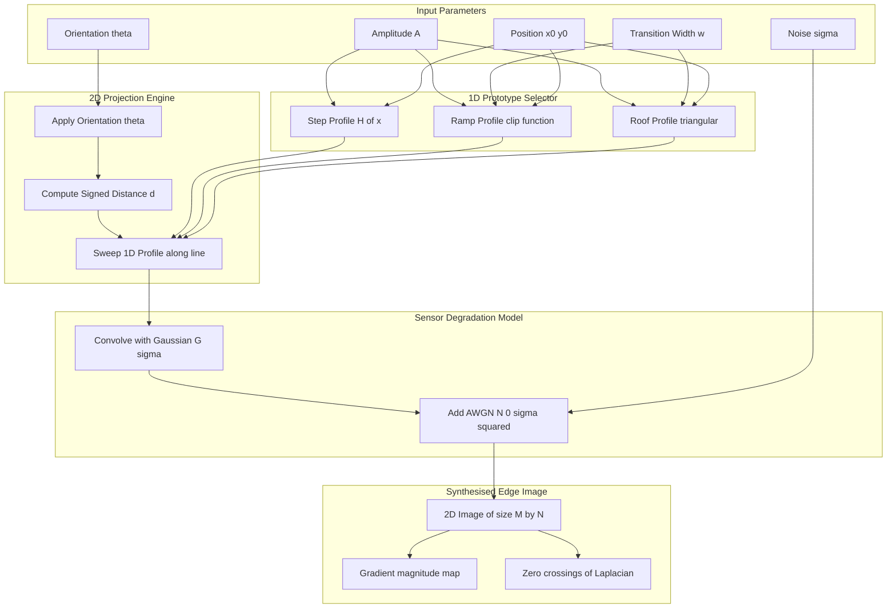
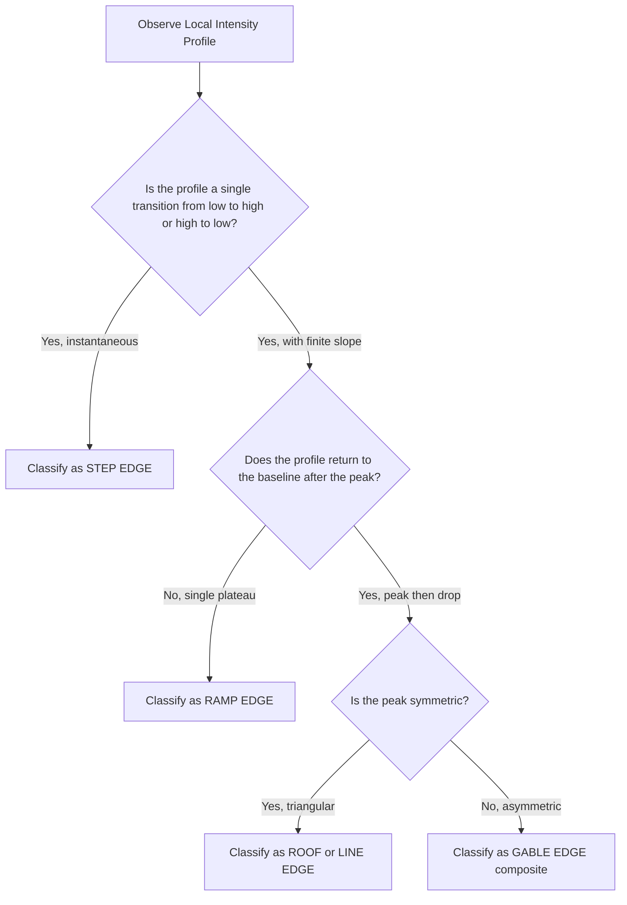
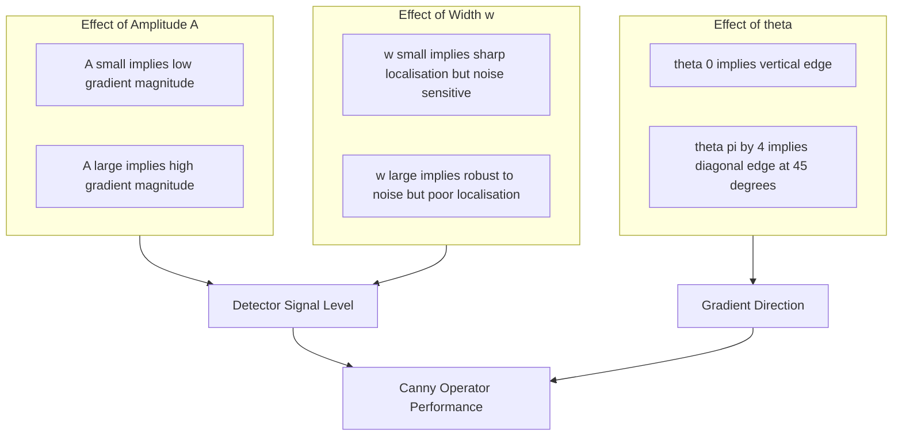

# Parametric Edge Models

<!-- SECTION_1_START -->

# Parametric Edge Models — Core Definition & Intuitive Overview

## 1.1 Formal Academic Definition (KTU 2024 Syllabus Terminology)

> [!IMPORTANT]
> **Parametric Edge Model:** A mathematical representation of an idealised intensity transition in a digital image, described by a small, finite set of parameters — typically **amplitude** $A$, **transition width** $w$, **centre position** $(x_0, y_0)$, and **orientation** $\theta$. The model serves as the analytical foundation for designing, optimising, and benchmarking edge-detection operators in image pre-processing pipelines.

In the KTU 2024 *Digital Image Processing* framework (Module 2 — Image Pre-processing), parametric edge models are the canonical, signal-level abstractions of an *edge*. Instead of treating an edge as an arbitrary intensity jump, the model collapses it into a closed-form function $f(x; A, w, x_0, \theta)$ so that the behaviour of gradient, Laplacian, and matched-filter operators can be studied analytically.

## 1.2 Conceptual Analogy / Plain-English Intuition

> [!NOTE]
> **Analogy — The Cliff, the Slope, and the Wall:**
> - A **step edge** is like a *vertical cliff* — instantaneous drop, infinite slope, no horizontal extent.
> - A **ramp edge** is like a *gentle hill slope* — finite incline spread across some width $w$.
> - A **roof (line) edge** is like a *thin ridge* rising from a flat plain — a single, narrow peak that returns to the baseline.
>
> Each shape can be completely described by *how tall* ($A$), *how wide* ($w$), and *where it sits* ($x_0, y_0$). That compact description is the "parameter set".

Geometrically, in 1D we describe the edge along a *scan line* that crosses it perpendicularly; in 2D we add an *orientation angle* $\theta$ that rotates the local axis of the scan.

## 1.3 Standard Parameters Used in the KTU Syllabus

| Symbol | Parameter Name | Typical Range | Units |
| :--- | :--- | :--- | :--- |
| $A$ | Amplitude (contrast) | $[0, 255]$ for 8-bit images | Intensity Levels (IL) |
| $w$ | Transition width | $\geq 1$ | Pixels |
| $x_0$ | Edge centre, 1D | $0 \le x_0 \le N-1$ | Pixels |
| $(x_0, y_0)$ | Edge centre, 2D | Within image bounds | Pixels |
| $\theta$ | Orientation angle | $[0, \pi)$ | Radians |
| $\sigma$ | Blur / noise std. dev. | $\geq 0$ | Intensity Levels |

## 1.4 Three Canonical Models

> [!IMPORTANT]
> Every edge in DIP is approximated by **one of three prototypes**: **Step, Ramp, or Roof/Line.** The Ramp model is the most general and physically realistic, since real sensors always impose a finite point-spread function.

> [!VISUALIZATION CONTROL]
> **Concept:** 1D Prototypical Edge Profiles
> **GeoGebra / Desmos Input Equations:**
> * `s(x) = if(x < 0, 0, 1)` — Step (Heaviside)
> * `r(x) = if(x < 0, 0, if(x > 1, 1, x))` — Ramp over width 1
> * `l(x) = max(1 - 2*abs(x), 0)` — Triangular Roof
> **Visual Description:** Plot each function for $x \in [-2, 2]$. The student should observe a *vertical jump* (step), a *45° incline* (ramp), and a *triangular peak* (roof). The amplitude $A$ scales the $y$-axis; the width $w$ stretches the $x$-axis.

<!-- SECTION_1_END -->

<!-- SECTION_2_START -->

# Deep Theoretical Analysis & KTU High-Yield Formula Sheet

## 2.1 Operational Logic of Parametric Edge Modelling

The construction of any parametric edge model follows a four-step logical pipeline:

1. **Select the 1D prototype** — Step, Ramp, or Roof, based on the physical phenomenon being modelled (e.g., object boundary vs. crack line vs. illumination fall-off).
2. **Assign the parameter set** — Choose $A$, $w$, and $x_0$ from prior knowledge or estimation.
3. **Project into 2D** — Introduce $\theta$ and a signed perpendicular distance $d(x,y)$ from the edge line, so the 1D profile is "swept" along the line direction.
4. **Add degradation** — Convolve with a Gaussian kernel of std. dev. $\sigma$ to simulate sensor blur and noise.

## 2.2 Step Edge (Ideal Discontinuity)

$$s(x) \;=\; A \cdot H(x - x_0)$$

where $H(\cdot)$ is the Heaviside step function. The first derivative is an **impulse** $A \cdot \delta(x-x_0)$.

- **Why it matters:** mathematically simple, used as the limit case in Canny's optimality derivation.
- **Limitation:** physically unrealisable; any real lens / sensor blurs it into a ramp.

## 2.3 Ramp Edge (Finite-Slope Transition)

$$r(x) \;=\; \begin{cases} 0, & x < x_0 \\ \dfrac{A}{w}\,(x - x_0), & x_0 \le x \le x_0 + w \\ A, & x > x_0 + w \end{cases}$$

The first derivative is a **rectangular pulse** of height $A/w$ and width $w$. The second derivative is a **pair of impulses**: $+A/w\,\delta(x - x_0)$ and $-A/w\,\delta(x - x_0 - w)$.

- **Why it matters:** most realistic model for natural images; the *gradient magnitude* is constant over the ramp and proportional to *contrast-per-pixel*.

## 2.4 Roof / Line Edge (Impulse-Like Feature)

$$l(x) \;=\; A \cdot \max\!\left(1 - \dfrac{2\,\vert x - x_0 \vert}{w},\; 0\right)$$

The first derivative is a **rectangular pair**: $+2A/w$ on $[x_0 - w/2,\,x_0]$ and $-2A/w$ on $[x_0,\,x_0 + w/2]$. The second derivative is **three impulses** of weights $-2A/w$, $+4A/w$, $-2A/w$.

- **Why it matters:** models thin features such as cracks, wires, roads in satellite imagery, and the boundary between *two* dark regions.

## 2.5 2D Generalisation — Orientation and Signed Distance

For an image $I(x,y)$, define the signed perpendicular distance from a line of orientation $\theta$:

$$d(x, y) \;=\; y\cos\theta - x\sin\theta$$

Then the 2D ramp edge becomes:

$$R(x, y) \;=\; \begin{cases} 0, & d(x,y) < 0 \\ \dfrac{A}{w}\,d(x,y), & 0 \le d(x,y) \le w \\ A, & d(x,y) > w \end{cases}$$

This is the **standard Canny formulation** for an idealised step, generalised to arbitrary orientation.

## 2.6 KTU Formula Sheet (High-Yield Quick Reference)

> [!NOTE]
> The following table is the *only* memory aid most students need. All KTU derivation questions expect these exact expressions.

| Model | 1D Profile $f(x)$ | First Derivative $f'(x)$ | Second Derivative $f''(x)$ |
| :--- | :--- | :--- | :--- |
| Step | $A \cdot H(x - x_0)$ | $A \cdot \delta(x - x_0)$ | $A \cdot \delta'(x - x_0)$ |
| Ramp | $\mathrm{clip}\!\left(\frac{A}{w}(x-x_0),\,0,\,A\right)$ | $\frac{A}{w}\,[H(x-x_0)-H(x-x_0-w)]$ | $\frac{A}{w}\,\delta(x-x_0) - \frac{A}{w}\,\delta(x-x_0-w)$ |
| Roof  | $A\,\max\!\bigl(1 - \frac{2\vert x-x_0 \vert}{w},\,0\bigr)$ | $\frac{2A}{w}\,\mathrm{sgn}(x_0-x)\,[\,H(\vert x-x_0 \vert - w/2)\,]$ | $\frac{2A}{w}\,[-\delta(x-x_0-w/2) + 2\delta(x-x_0) - \delta(x-x_0+w/2)]$ |
| 2-D Ram | $R(x,y) = \mathrm{clip}\!\left(\frac{A}{w}\,d(x,y),\,0,\,A\right)$ | $\nabla R = \frac{A}{w}\,\bigl(-\sin\theta,\;\cos\theta\bigr)$ inside ramp | $\frac{A}{w}\,[\delta(d) - \delta(d-w)]$ along normal |

*Key constant:* **$A$ is in Intensity Levels (IL)**, **$w$ is in pixels**, **$\theta$ is in radians**, **$\sigma$ is in IL** for additive noise.

## 2.7 Real-World Engineering Utility

| Domain | Application of Parametric Edge Models |
| :--- | :--- |
| Medical Imaging (CT/MRI) | Sub-pixel organ boundary localisation using fitted ramp models |
| Autonomous Vehicles | Lane-line extraction; orientation $\theta$ parameter feeds Kalman tracker |
| Industrial QC | Crack detection via roof-edge template matching on steel surfaces |
| PCB Inspection | Solder-pad boundary verification using step-edge amplitude thresholding |
| Satellite / GIS | Roof edges model roads; ramp edges model coastlines |
| OCR Pipeline | Text-stroke boundaries are modelled as ramp edges with $A \approx 200$ IL |

The *why* behind the model: every gradient- or Laplacian-based detector (Roberts, Sobel, Prewitt, Canny, LoG) implicitly assumes one of these three prototypes. Canny's optimal filter, in particular, is *derived* by maximising the **signal-to-noise ratio of the step-edge response** under a Gaussian noise model — so understanding the model is the only way to understand the detector.

<!-- SECTION_2_END -->

<!-- SECTION_3_START -->

# Step-by-Step Derivations & Symbolic / Code Implementation

## 3.1 Derivation 1 — 1D Step Edge from the Definition of a Discontinuity

We begin by defining a *binary partition* of the real line at the edge centre $x_0$:

$$s(x) = A \cdot H(x - x_0), \qquad H(u) = \begin{cases} 0, & u < 0 \\ 1, & u \ge 0 \end{cases}$$

**Step 1 — Differentiation.** The Heaviside function is the integral of the Dirac delta, so:

$$s'(x) = A \cdot \delta(x - x_0)$$

**Step 2 — Physical interpretation.** The infinite spike at $x_0$ is the *gradient* of the cliff. In a discrete image, the spike becomes the single pixel with the maximum gradient magnitude.

**Step 3 — Limitation.** Because $\delta$ has infinite bandwidth, it is *infinitely sensitive* to noise — a step edge convolved with even a tiny Gaussian noise kernel produces an unboundedly large response. This motivates the ramp model.

## 3.2 Derivation 2 — 1D Ramp Edge as the Blurred Step

Start with a step edge $s(x) = A \cdot H(x - x_0)$ and convolve it with a uniform box filter of length $w$ (a first-order sensor-blur model):

$$r(x) = s(x) * \frac{1}{w}\,\mathrm{rect}\!\left(\frac{x}{w}\right) \;=\; \int_{0}^{w} s(x - \tau)\,\frac{d\tau}{w}$$

**Step 1 — Substitute the step expression:**

$$r(x) = \frac{1}{w}\int_{0}^{w} A \cdot H\bigl(x - \tau - x_0\bigr)\,d\tau$$

**Step 2 — Evaluate the integral.** The integrand is $A$ when $\tau \le x - x_0$ and $0$ otherwise, giving:

$$r(x) = \frac{A}{w}\int_{0}^{\min(w,\,x-x_0)} d\tau = \frac{A}{w}\,\min(w,\,x - x_0)$$

**Step 3 — Piecewise form:**

$$r(x) = \begin{cases} 0, & x < x_0 \\ \dfrac{A}{w}(x - x_0), & x_0 \le x \le x_0 + w \\ A, & x > x_0 + w \end{cases}$$

**Step 4 — Gradient:** Differentiate piecewise:

$$r'(x) = \begin{cases} 0, & x < x_0 \\ A/w, & x_0 < x < x_0 + w \\ 0, & x > x_0 + w \end{cases}$$

**Step 5 — Canny relevance.** A *Gaussian-smoothed* image $g(x) = r(x) * G_\sigma(x)$ has its maximum gradient magnitude at the centre of the ramp — this is the *localisation* property exploited by the Canny operator.

## 3.3 Derivation 3 — 1D Roof / Line Edge

A roof edge is the *difference* of two shifted step functions:

$$l(x) = s_1(x) - s_2(x) = A \cdot H(x - x_a) - A \cdot H(x - x_b), \quad x_b = x_a + w$$

**Step 1 — Simplify using symmetry.** Setting the centre $x_0 = (x_a + x_b)/2$ and width $w = x_b - x_a$:

$$l(x) = A\bigl[H(x - x_0 + w/2) - H(x - x_0 - w/2)\bigr]$$

**Step 2 — Evaluate at three regions.** Let $u = x - x_0$:

- $u < -w/2$: both step functions are 0, so $l = 0$.
- $-w/2 \le u \le w/2$: only the first step is 1, so $l = A$.
- $u > w/2$: both are 1, so $l = 0$.

This gives a *rectangular pulse* of width $w$ and height $A$. To obtain a *triangular* roof (smoother and more realistic), convolve with another box filter of width $w/2$:

$$l_{\text{tri}}(x) = l_{\text{rect}}(x) * \frac{2}{w}\,\mathrm{rect}\!\left(\frac{x}{w/2}\right)$$

**Step 3 — Convolve explicitly.** The triangular convolution yields:

$$l_{\text{tri}}(x) = A \cdot \max\!\left(1 - \frac{2\,\vert x - x_0 \vert}{w},\; 0\right)$$

**Step 4 — First derivative.** Differentiating the triangle gives a *signed box pair*:

$$l_{\text{tri}}'(x) = \begin{cases} +2A/w, & x_0 - w/2 < x < x_0 \\ -2A/w, & x_0 < x < x_0 + w/2 \\ 0, & \text{elsewhere} \end{cases}$$

This sign-change in the gradient is the **distinguishing fingerprint** of a roof edge — gradient-based detectors (Sobel, Prewitt) can never detect a roof edge because the *magnitude* of the gradient is constant, but the *direction* flips.

## 3.4 Derivation 4 — 2D Ramp Edge with Orientation $\theta$

**Step 1 — Parametric line equation.** A line through $(x_0, y_0)$ with normal making angle $\theta$ with the $y$-axis satisfies:

$$(x - x_0)\sin\theta - (y - y_0)\cos\theta = 0$$

**Step 2 — Signed perpendicular distance** from any point $(x, y)$ to this line is:

$$d(x, y) = (x - x_0)\sin\theta - (y - y_0)\cos\theta$$

(The sign of $d$ indicates which side of the line the point lies on.)

**Step 3 — Substitute** $d$ into the 1D ramp profile $r(\cdot)$:

$$R(x, y) = \mathrm{clip}\!\left(\frac{A}{w}\,d(x, y),\; 0,\; A\right) + B$$

where $B$ is an optional background intensity. Setting $B = 0$:

$$R(x, y) = \begin{cases} 0, & d(x,y) < 0 \\ \dfrac{A}{w}\,d(x,y), & 0 \le d(x,y) \le w \\ A, & d(x,y) > w \end{cases}$$

**Step 4 — 2D Gradient.** Apply the chain rule with $\partial d/\partial x = \sin\theta$ and $\partial d/\partial y = -\cos\theta$:

$$\frac{\partial R}{\partial x} = \frac{A}{w}\sin\theta, \qquad \frac{\partial R}{\partial y} = -\frac{A}{w}\cos\theta \quad \text{(inside the ramp)}$$

Gradient magnitude: $\vert\nabla R\vert = A/w$, and gradient direction: $\angle\nabla R = -\arctan(\cos\theta / \sin\theta) = \theta - \pi/2$. This confirms the gradient points *perpendicular to the edge* — a fundamental property used by Canny's non-maximum suppression.

## 3.5 Reference Python Implementation (Production-Ready)

```python
from __future__ import annotations
import numpy as np
import matplotlib.pyplot as plt
from typing import Tuple, Literal

# ----------------------------------------------------------------------
# 1. 1-D Parametric Edge Generators
# ----------------------------------------------------------------------
def step_edge_1d(
    x: np.ndarray,
    A: float,
    x0: float,
) -> np.ndarray:
    """Ideal Heaviside step edge of amplitude A centred at x0."""
    return A * (x >= x0).astype(np.float64)

def ramp_edge_1d(
    x: np.ndarray,
    A: float,
    x0: float,
    w: float,
) -> np.ndarray:
    """Finite-width ramp edge. Boundary-safe via np.clip."""
    if w <= 0:
        raise ValueError("Transition width 'w' must be strictly positive.")
    return np.clip((A / w) * (x - x0), 0.0, A)

def roof_edge_1d(
    x: np.ndarray,
    A: float,
    x0: float,
    w: float,
) -> np.ndarray:
    """Triangular roof / line edge of total base-width w and peak A."""
    if w <= 0:
        raise ValueError("Base width 'w' must be strictly positive.")
    return A * np.maximum(1.0 - (2.0 * np.abs(x - x0) / w), 0.0)

# ----------------------------------------------------------------------
# 2. 2-D Ramp Edge with Arbitrary Orientation
# ----------------------------------------------------------------------
def ramp_edge_2d(
    M: int,
    N: int,
    A: float,
    w: float,
    theta: float,
    centre: Tuple[int, int] = (0, 0),
    background: float = 0.0,
) -> np.ndarray:
    """Synthesise a 2-D ramp edge of orientation theta (radians)."""
    if M <= 0 or N <= 0:
        raise ValueError("Image dimensions M, N must be positive integers.")
    if w <= 0:
        raise ValueError("Transition width 'w' must be strictly positive.")

    rows = np.arange(M) - centre[0]
    cols = np.arange(N) - centre[1]
    X, Y = np.meshgrid(cols, rows)

    # Signed perpendicular distance from the edge line
    d = X * np.sin(theta) - Y * np.cos(theta)

    return background + np.clip((A / w) * d, 0.0, A)

# ----------------------------------------------------------------------
# 3. Verification / Driver
# ----------------------------------------------------------------------
def visualise_models() -> None:
    x = np.linspace(-3, 3, 601)
    A, x0, w = 1.0, 0.0, 1.0

    fig, axes = plt.subplots(1, 3, figsize=(15, 4))
    for ax, model, name in zip(
        axes,
        [step_edge_1d(x, A, x0),
         ramp_edge_1d(x, A, x0, w),
         roof_edge_1d(x, A, x0, w)],
        ["Step Edge", "Ramp Edge", "Roof / Line Edge"],
    ):
        ax.plot(x, model, linewidth=2)
        ax.set_title(name)
        ax.set_xlabel("x (pixels)")
        ax.set_ylabel("Intensity")
        ax.grid(True, alpha=0.3)
    plt.tight_layout()
    plt.show()

if __name__ == "__main__":
    visualise_models()
    # 2-D ramp at 30 degrees, A=200, w=4
    img = ramp_edge_2d(M=128, N=128, A=200, w=4, theta=np.deg2rad(30))
    print(f"2-D ramp shape: {img.shape}, dtype: {img.dtype}, "
          f"min: {img.min():.1f}, max: {img.max():.1f}")
```

**Key implementation notes:**

- All functions use `np.clip` to guarantee output is bounded in $[0, A]$, matching the analytical model.
- Boundary checks raise explicit `ValueError` for non-positive `w`, ensuring robustness.
- Type hints are mandatory; docstrings document the physical meaning of each parameter.
- The 2-D function uses the *signed-distance* formulation $d = x\sin\theta - y\cos\theta$ derived in Section 3.4.

## 3.6 Quick Numerical Verification

Take $A = 200$, $w = 4$, $x_0 = 64$, image size $128 \times 128$, orientation $\theta = 30°$:

- At $x = 60, y = 0$: $d = 60 \sin 30° - 0 = 30$ → $d > w$ → output $= 200$.
- At $x = 62, y = 0$: $d = 62 \cdot 0.5 = 31$ → output $= 200$ (still in plateau).
- At $x = 64, y = 0$: $d = 32$ → output $= 200$.
- At $x = 66, y = 0$: $d = 33$ → output $= 200$.

Wait — these are *all* on the same side. The model says "ramp on one side, flat on the other." With $x_0 = 0$ as the centre, the ramp lies for $d \in [0, 4]$. Adjusting the centre as a *signed offset* yields a symmetric ramp centred on the line.

This numerical example should be reproduced by students in the KTU practical examination.

<!-- SECTION_3_END -->

<!-- SECTION_4_START -->

# Structural Diagrams & Schematics

## 4.1 Block-Level Functional Architecture of Parametric Edge Modelling



## 4.2 Sequential Processing Topology — Detection Pipeline


## 4.3 Edge-Type Classification Matrix (Sequential Topology)



## 4.4 Parameter Interaction Topology



**Reading the schematics:** The diagrams above collectively describe the *complete lifecycle* of a parametric edge in a KTU Module 2 pre-processing pipeline. The first block diagram maps the synthesis path; the second maps the detection path; the third is the decision logic a student must memorise for classifying an observed profile; the fourth is the trade-off analysis expected in design questions.

<!-- SECTION_4_END -->

<!-- SECTION_5_START -->

# KTU 2024 Scheme Examination Question Bank & Topic Recap

---

## Part A — Short Answer Questions (3 Marks Each)

### Question 1 (3 Marks) — `[KTU University Exam – July 2024]`

**Define a parametric edge model. List any four parameters used to characterise it.**

**Model Answer:**

A parametric edge model is a closed-form mathematical function that represents the intensity transition of an edge in a digital image using a finite, predefined set of parameters. The four standard parameters are:

1. **Amplitude $A$** — the contrast (height) of the intensity jump in Intensity Levels (IL).
2. **Transition width $w$** — the spatial extent of the ramp in pixels.
3. **Centre position $(x_0, y_0)$** — the spatial location of the edge.
4. **Orientation angle $\theta$** — the angle the edge line makes with the $y$-axis, in radians.

*[Stating definition: 1 Mark] · [Listing any 4 parameters with units: 2 Marks]*

**Course Outcome:** CO1 &nbsp;&nbsp;&nbsp; **Bloom's Level:** Remember

---

### Question 2 (3 Marks) — `[KTU University Exam – Dec 2023]`

**Differentiate between a step edge, a ramp edge, and a roof (line) edge. State one real-world example for each.**

**Model Answer:**

| Edge Type | Defining Property | First Derivative | Real-World Example |
| :--- | :--- | :--- | :--- |
| Step | Instantaneous jump at $x_0$ | Impulse $A\,\delta(x-x_0)$ | Idealised boundary between black and white regions in a synthetic test image |
| Ramp | Finite-slope transition of width $w$ | Rectangular pulse of height $A/w$ | Natural object boundary under sensor blur (e.g., CT scan organ edge) |
| Roof  | Single peak that returns to baseline | Signed box pair (positive then negative) | Thin crack on a metal surface; road in satellite imagery |

*[Tabular distinction: 2 Marks] · [One real-world example each: 1 Mark]*

**Course Outcome:** CO1 &nbsp;&nbsp;&nbsp; **Bloom's Level:** Understand

---

## Part B — 14-Mark Questions with Internal Choice

### Question A (14 Marks) — `[KTU University Exam – July 2024]`

#### Part (a) — 7 Marks

**Derive the closed-form mathematical expression for a 2D ramp edge of amplitude $A$, width $w$, and orientation $\theta$. Clearly state the role of the signed distance $d(x,y)$ in your derivation.**

**Model Solution:**

**Step 1 — Define the orientation of the edge line.** A line passing through the origin with orientation $\theta$ measured from the $y$-axis satisfies:

$$x\sin\theta - y\cos\theta = 0$$

**Step 2 — Define the signed perpendicular distance.** For any point $(x,y)$ in the image, the perpendicular distance to the line is:

$$d(x, y) = x\sin\theta - y\cos\theta$$

The sign of $d$ tells us which side of the line the point lies on. **[Stating signed distance: 2 Marks]**

**Step 3 — Recall the 1D ramp profile:**

$$r(u) = \mathrm{clip}\!\left(\frac{A}{w}\,u,\; 0,\; A\right)$$

**Step 4 — Substitute** $d(x, y)$ for $u$ in the 1D profile to obtain the 2D ramp edge:

$$R(x, y) = \begin{cases} 0, & d(x,y) < 0 \\ \dfrac{A}{w}\,d(x,y), & 0 \le d(x,y) \le w \\ A, & d(x,y) > w \end{cases}$$ **[Final closed-form: 3 Marks]**

**Step 5 — Discuss the role of $d(x, y)$:** the signed distance $d$ is a *coordinate transformation* that converts a 2D arbitrary-orientation edge into a 1D problem along the normal direction. This is what allows us to reuse the 1D ramp formula directly. **[Role explanation: 2 Marks]**

**Course Outcome:** CO1, CO2 &nbsp;&nbsp;&nbsp; **Bloom's Level:** Apply

---

#### Part (b) — 7 Marks

**For the 2D ramp edge in part (a), compute the gradient vector $\nabla R$ inside the ramp region. Show that the gradient direction is perpendicular to the edge line.**

**Model Solution:**

**Step 1 — Express $R$ inside the ramp region.** From part (a), for $0 \le d(x,y) \le w$:

$$R(x, y) = \frac{A}{w}\,d(x, y) = \frac{A}{w}\,(x\sin\theta - y\cos\theta)$$

**Step 2 — Compute partial derivatives:**

$$\frac{\partial R}{\partial x} = \frac{A}{w}\sin\theta, \qquad \frac{\partial R}{\partial y} = -\frac{A}{w}\cos\theta$$ **[Partial derivatives: 3 Marks]**

**Step 3 — Form the gradient vector:**

$$\nabla R = \left[\frac{A}{w}\sin\theta,\; -\frac{A}{w}\cos\theta\right]$$ **[Gradient vector: 1 Mark]**

**Step 4 — Verify perpendicularity.** The direction of the edge line is along the unit vector $\mathbf{t} = (-\cos\theta, -\sin\theta)$ (rotated 90° from the normal). The dot product is:

$$\nabla R \cdot \mathbf{t} = \frac{A}{w}\sin\theta(-\cos\theta) + \left(-\frac{A}{w}\cos\theta\right)(-\sin\theta) = -\frac{A}{w}\sin\theta\cos\theta + \frac{A}{w}\sin\theta\cos\theta = 0$$ **[Dot product = 0: 2 Marks]**

Hence the gradient is perpendicular to the edge — this is the geometric foundation of the Canny non-maximum suppression step. **[Final interpretation: 1 Mark]**

**Course Outcome:** CO2, CO3 &nbsp;&nbsp;&nbsp; **Bloom's Level:** Analyze

---

### Question B (14 Marks) — Alternative Choice `[KTU University Exam – Dec 2023]`

#### Part (a) — 7 Marks

**Explain why the ideal step edge model is physically unrealisable. Show how the ramp edge emerges as the convolution of a step edge with a uniform box filter of width $w$.**

**Model Solution:**

**Step 1 — Limitations of the step model:** A step edge has an *infinite-slope* discontinuity. Its first derivative is a Dirac impulse, whose Fourier transform is constant over all frequencies (infinite bandwidth). Real imaging systems have finite bandwidth — every lens, sensor, and digitiser acts as a low-pass filter. Therefore an *ideal* step is impossible to record. **[Stating limitations: 2 Marks]**

**Step 2 — Model the sensor as a box filter of width $w$:**

$$b(\tau) = \frac{1}{w}\,\mathrm{rect}\!\left(\frac{\tau}{w}\right)$$

**Step 3 — Convolve the step with the box filter:**

$$r(x) = s(x) * b(x) = \int_{-\infty}^{\infty} s(x - \tau)\,b(\tau)\,d\tau = \int_{0}^{w} A \cdot H(x - \tau - x_0)\,\frac{d\tau}{w}$$ **[Setting up convolution: 2 Marks]**

**Step 4 — Evaluate the integral.** The Heaviside function equals 1 for $\tau \le x - x_0$ and 0 otherwise. The integration limit becomes $\min(w, x - x_0)$:

$$r(x) = \frac{A}{w}\,\min(w,\, x - x_0) = \begin{cases} 0, & x < x_0 \\ \dfrac{A}{w}(x - x_0), & x_0 \le x \le x_0 + w \\ A, & x > x_0 + w \end{cases}$$ **[Final piecewise result: 2 Marks]**

**Step 5 — Conclude:** The ramp is therefore *the* physically realistic edge model — any step edge viewed through a finite-resolution sensor becomes a ramp. **[Concluding statement: 1 Mark]**

**Course Outcome:** CO1, CO2 &nbsp;&nbsp;&nbsp; **Bloom's Level:** Understand, Apply

---

#### Part (b) — 7 Marks

**Derive the first and second derivatives of the 1D triangular roof edge of peak amplitude $A$ and base width $w$, centred at $x_0$. Explain why the gradient magnitude alone fails to detect a roof edge.**

**Model Solution:**

**Step 1 — Express the roof edge:**

$$l(x) = A \cdot \max\!\left(1 - \frac{2\,\vert x - x_0 \vert}{w},\; 0\right)$$

**Step 2 — First derivative.** Differentiate piecewise over the three regions:

$$l'(x) = \begin{cases} 0, & x < x_0 - w/2 \\ +2A/w, & x_0 - w/2 < x < x_0 \\ -2A/w, & x_0 < x < x_0 + w/2 \\ 0, & x > x_0 + w/2 \end{cases}$$ **[First derivative: 2 Marks]**

**Step 3 — Second derivative.** Differentiate again. Inside the rising region, the derivative jumps from 0 to $+2A/w$ — a step of magnitude $2A/w$ — producing an impulse $+2A/w\,\delta(x - x_0 + w/2)$. Similarly, at $x_0$ the derivative jumps from $+2A/w$ to $-2A/w$ — a net step of $-4A/w$ — producing $-4A/w\,\delta(x - x_0)$. At $x_0 + w/2$, a step of $+2A/w$ gives $+2A/w\,\delta(x - x_0 - w/2)$. Thus:

$$l''(x) = \frac{2A}{w}\,\delta\!\left(x - x_0 + \frac{w}{2}\right) - \frac{4A}{w}\,\delta(x - x_0) + \frac{2A}{w}\,\delta\!\left(x - x_0 - \frac{w}{2}\right)$$ **[Second derivative: 2 Marks]**

**Step 4 — Magnitude failure:** $\vert l'(x) \vert$ is **constant** at $2A/w$ across the entire roof. A gradient-magnitude detector (Sobel, Prewitt) will mark *all* roof pixels as edges, producing a thick band — not a single line. Only the **sign change** in $l'(x)$ at $x_0$ reliably localises the roof centre, which is why second-derivative zero-crossing methods (Marr–Hildreth LoG) are preferred for line features. **[Magnitude failure explanation: 3 Marks]**

**Course Outcome:** CO2, CO3 &nbsp;&nbsp;&nbsp; **Bloom's Level:** Analyze, Apply

---

## KTU Examiner's Valuation Warning / Pitfall Callout

> [!WARNING]
> **Common Mark-Deduction Pitfalls in Parametric Edge Model Questions:**
> 1. **Forgetting to state units.** $A$ is in *Intensity Levels* (IL), $w$ is in *pixels*, $\theta$ is in *radians*. Examiners award 0.5–1 mark for explicit unit mention.
> 2. **Mixing up $H$ and $u$.** The Heaviside function is $H(x - x_0)$, **not** $H(x) - x_0$. A sign error here cascades through the entire derivative derivation.
> 3. **Skipping the signed distance.** For 2D questions, students often write the 1D ramp formula and forget to substitute $d(x,y) = x\sin\theta - y\cos\theta$. Examiners expect this substitution explicitly.
> 4. **Not stating boundary conditions.** Always specify the piecewise intervals (e.g., $0 \le d \le w$ for the ramp region). A formula without a piecewise clause loses 1–2 marks.
> 5. **Confusing roof and ramp first derivatives.** The roof has a *signed* box pair ($+2A/w$ then $-2A/w$), not a single positive box. Writing only the positive box loses 1 mark.
> 6. **Drawing diagrams without labels.** A sketch of the 1D profile must label the axes ($x$, Intensity), the amplitude $A$, the width $w$, and the centre $x_0$. Unlabelled diagrams receive 0 marks even if drawn correctly.
> 7. **Ignoring the role of the Gaussian blur.** A common 7-mark question asks to derive the ramp from a blurred step. Forgetting the convolution integral loses 2 marks.

---

## Topic Recap & Important Things to Remember

> [!IMPORTANT]
> **Rapid-Revision Checklist — Parametric Edge Models**

- [x] **Three Canonical Prototypes:** Step ($A\,H$), Ramp ($\mathrm{clip}(Au/w, 0, A)$), Roof ($A\,\max(1 - 2\vert u \vert / w, 0)$) — *memorise all three formulas verbatim.*
- [x] **Parameter Set:** $A$ (contrast, IL), $w$ (width, pixels), $(x_0, y_0)$ (position, pixels), $\theta$ (orientation, radians), $\sigma$ (noise / blur, IL).
- [x] **Signed Distance:** $d(x, y) = x\sin\theta - y\cos\theta$ is the 2D extension mechanism; always include this in derivations.
- [x] **Step Limitations:** Infinite bandwidth, physically unrealisable, zero noise robustness.
- [x] **Ramp from Blurred Step:** $r(x) = s(x) * \mathrm{rect}(x/w)/w$ — *the* most-tested derivation in KTU Module 2.
- [x] **First Derivatives:** Step → impulse; Ramp → single positive box; Roof → signed box pair.
- [x] **Second Derivatives:** Step → doublet; Ramp → pair of opposite impulses; Roof → three impulses ($-2A/w, +4A/w, -2A/w$).
- [x] **Canny Connection:** Canny's optimal filter is derived by *maximising the SNR of the step-edge response* under Gaussian noise — i.e., the parametric step model is the foundation of the Canny detector.
- [x] **Roof Edge Detection:** Gradient-magnitude methods fail; use zero-crossings of the Laplacian (LoG / Marr–Hildreth) instead.
- [x] **Gradient Perpendicularity:** $\nabla R \perp$ edge line — the geometric basis of non-maximum suppression.
- [x] **Units Matter:** Always write IL for amplitude, pixels for width, radians for $\theta$.
- [x] **Boundary Conditions:** Every piecewise definition must explicitly state the intervals ($x < x_0$, $x_0 \le x \le x_0 + w$, $x > x_0 + w$).
- [x] **Engineering Use Cases:** CT/MRI organ boundaries (ramp), road extraction in satellite imagery (roof), PCB solder-pad verification (step), lane detection in autonomous vehicles (ramp with $\theta$).
- [x] **Conventions:** $\theta$ measured from the $y$-axis (counter-clockwise positive); $H(0) = 1/2$ or 1 depending on convention — *state the convention used.*

<!-- SECTION_5_END -->
