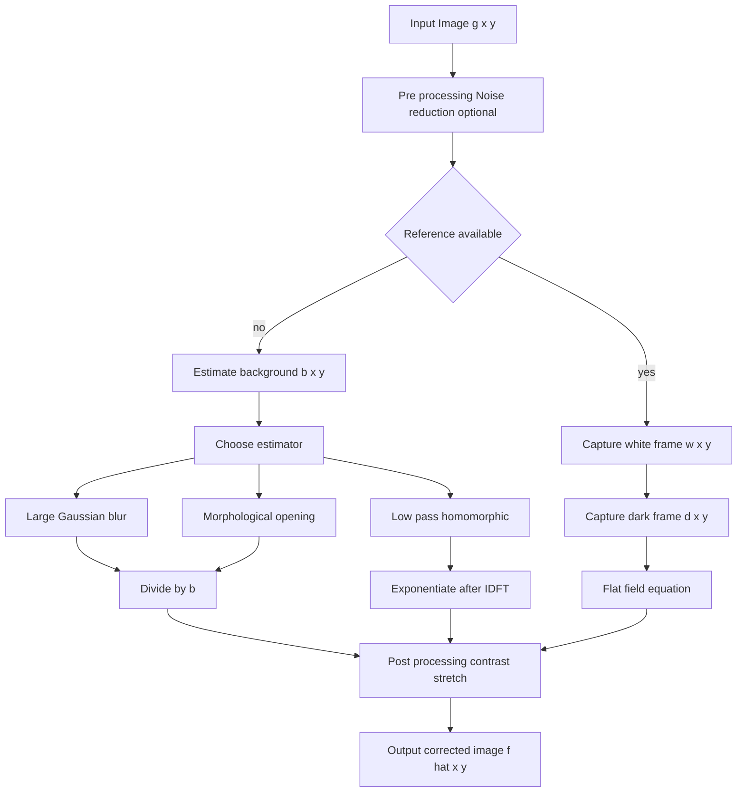
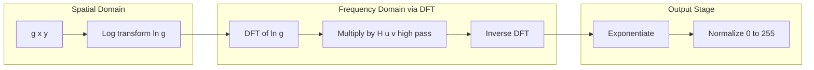
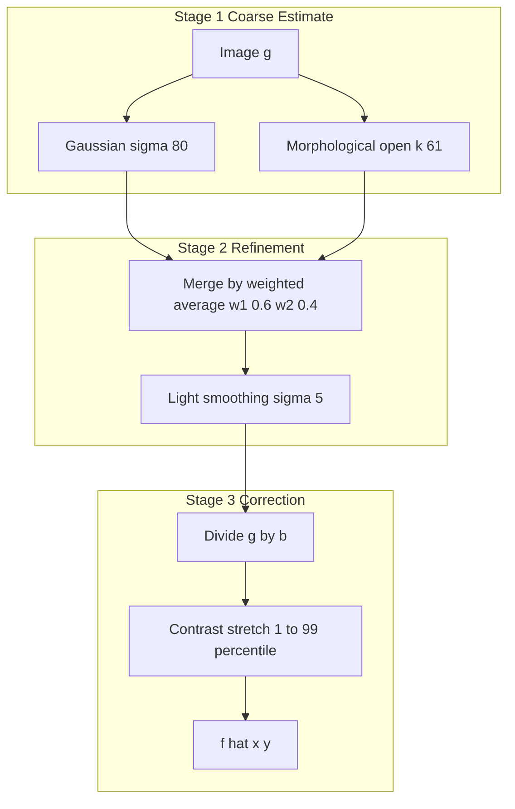
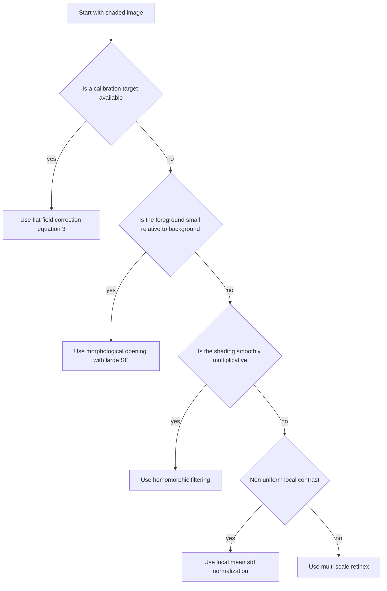

# Position-dependent brightness correction

<!-- SECTION_1_START -->
# Position-Dependent Brightness Correction

## 1.1 Formal Academic Definition

In the KTU 2024 Scheme syllabus for **Digital Image Processing (PECST636)**, *Position-Dependent Brightness Correction* (also referred to as **shading correction**, **illumination correction**, or **background normalization**) is formally defined as a class of spatial-domain image pre-processing techniques that compensate for the **spatially varying intensity bias** introduced across an image due to non-uniform illumination, sensor response inhomogeneity, optical vignetting, and geometric falloff.

> [!IMPORTANT]
> **Syllabus Highlight (Module 2 — Image Pre-processing)**
> An observed image $g(x,y)$ is modelled as the product of an *ideal reflectance* term and a *position-dependent gain/bias* term:
> $$g(x,y) = f(x,y) \cdot b(x,y) + n(x,y)$$
> where $f(x,y)$ is the true (corrected) image, $b(x,y)$ is the **brightness / shading field** (slowly varying), and $n(x,y)$ is additive acquisition noise.

The objective of position-dependent brightness correction is to estimate $b(x,y)$ — either by direct measurement (using a calibration target) or by algorithmic estimation from the image itself — and then **divide, subtract, or filter it out** to recover the underlying reflectance structure.

## 1.2 Conceptual Analogy — Plain-English Intuition

Imagine you are photographing a **flat white sheet of paper** on a desk with a desk lamp placed at one corner. The resulting photograph will not look uniformly white — the corner near the lamp will be bright, while the far corner will appear grey or yellowish. The paper itself has uniform reflectance, but the recorded image carries a **spatial brightness gradient** (a "shading field") caused entirely by the lighting geometry.

> [!NOTE]
> **Intuitive Picture**
> The shading field $b(x,y)$ behaves like an **uneven window-tint** placed over your photograph. The real scene is on the other side of the glass, perfectly uniform, but the tint darkens one region and brightens another. *Position-dependent brightness correction is the act of removing that uneven tint so we can see the true scene clearly.*

- **Multiplicative shading** is like a *variable-density filter* — it scales pixel intensities by a position-dependent factor.
- **Additive shading (bias)** is like a *DC offset* added to every pixel — a constant glow that varies smoothly across the frame.
- **Vignetting** is a radial multiplicative falloff — the corners receive less light due to lens geometry.

## 1.3 Sources of Position-Dependent Brightness Variation

> [!TIP]
> Memorize the following five canonical sources — they appear in almost every KTU Part A question on this topic.

| # | Source | Type | Typical Signature |
|---|--------|------|-------------------|
| 1 | Non-uniform scene illumination | Multiplicative | Smooth gradient |
| 2 | Lens vignetting | Multiplicative (radial) | Dark corners |
| 3 | Sensor photo-response non-uniformity (PRNU) | Multiplicative | High-freq. pattern |
| 4 | Dark-current bias (thermal) | Additive | Smooth low-freq. |
| 5 | Stray light / flare | Additive | Smooth, broad |

## 1.4 Physical Constants and Standard Metrics

- The standard grayscale dynamic range is **$L = 256$** levels for 8-bit images ($[0, 255]$).
- The shading field $b(x,y)$ is assumed **slowly varying** compared to the reflectance $f(x,y)$, which is why it can be isolated in the **low-frequency** band of the Fourier spectrum.
- The standard kernel sizes for background estimation are **$k \geq 50$ pixels** for $1024 \times 1024$ biomedical/textile images, scaled as $k \approx \max(M,N) / 30$.

> [!VISUALIZATION CONTROL]
> **Concept:** 1-D illustration of an image row split into illumination (low-freq) and reflectance (high-freq) components.
> **GeoGebra / Desmos Input Equations:**
> * `b(x) = 0.6 + 0.4 * sin(2 * pi * x / 400)`  *(slow illumination component)*
> * `f(x) = 0.5 + 0.5 * sin(2 * pi * x / 12)`  *(fast reflectance edges)*
> * `g(x) = b(x) * f(x)`                       *(observed, corrupted row)*
> **Visual Description:** Plot $b(x)$ as a slow gentle wave from 0.2 to 1.0, $f(x)$ as a high-frequency square-ish ripple, and $g(x)$ as the product — note how the bright reflectance peaks near the centre of the bright illumination zone but are damped at the dark zones. This is exactly what position-dependent correction removes.
<!-- SECTION_1_END -->

<!-- SECTION_2_START -->
# Deep Theoretical Analysis & KTU High-Yield Formula Sheet

## 2.1 The Illumination–Reflectance Model (Foundational)

The classical model introduced by **Gonzalez & Woods** (the prescribed KTU textbook) treats a monochrome image as the product of two components:

$$g(x,y) = i(x,y) \cdot r(x,y)$$

where:
- $i(x,y)$ = **illumination** (the amount of light falling on the scene at pixel $(x,y)$). Physically $0 < i(x,y) < \infty$.
- $r(x,y)$ = **reflectance** (the intrinsic ability of the object surface to reflect light). Physically $0 \leq r(x,y) \leq 1$.
- $g(x,y)$ = the **recorded intensity** at pixel $(x,y)$.

Because multiplication in the spatial domain becomes convolution in the frequency domain, taking the logarithm converts the model into an **additive** form, which is the gateway to **homomorphic filtering**:

$$\ln g(x,y) = \ln i(x,y) + \ln r(x,y)$$

> [!NOTE]
> **Why is this important?**
> The illumination $i(x,y)$ is *slowly varying* → concentrates in the **low-frequency** band of the Fourier spectrum.
> The reflectance $r(x,y)$ is *rapidly varying* (edges, textures) → concentrates in the **high-frequency** band.
> By applying a high-pass (or band-pass) filter in the log-domain, we suppress $i$ and keep $r$.

## 2.2 The General Position-Dependent Corruption Model

In real acquisition pipelines (microscopy, MRI, satellite, document scanning), the model extends to:

$$g(x,y) = f(x,y) \cdot b(x,y) + c(x,y) + n(x,y)$$

- $f(x,y)$ : the true image
- $b(x,y)$ : **multiplicative shading field** (the position-dependent brightness factor — this is what we must correct)
- $c(x,y)$ : **additive bias** (offset)
- $n(x,y)$ : **acquisition noise** (often assumed zero-mean Gaussian)

The goal of position-dependent brightness correction is to recover an estimate $\hat{f}(x,y)$ by estimating $\hat{b}(x,y)$ and $\hat{c}(x,y)$ and applying:

$$\hat{f}(x,y) = \frac{g(x,y) - \hat{c}(x,y)}{\hat{b}(x,y)}$$

> [!IMPORTANT]
> **Valuation Tip:** In KTU theory answers, always state that the correction is a **division by the estimated shading field** (not a subtraction), unless the corruption is explicitly additive.

## 2.3 Taxonomy of Correction Strategies

The KTU syllabus recognises four broad families of algorithms:

### 2.3.1 Reference-Based (Flat-Field) Correction
A calibration image of a uniform white target $w(x,y)$ and a dark frame $d(x,y)$ is captured:
$$\hat{f}(x,y) = \frac{g(x,y) - d(x,y)}{w(x,y) - d(x,y)} \cdot L_{max}$$
This is the **gold standard** in microscopy and remote sensing.

### 2.3.2 Background Estimation (Model-Based)
When no calibration target is available, the background is estimated from the image itself:
$$\hat{b}(x,y) = \text{morph-open}(g, k) \quad \text{or} \quad \hat{b}(x,y) = \text{large-kernel Gaussian}(g)$$
using a structuring element / kernel $k$ much larger than the foreground objects.

### 2.3.3 Homomorphic Filtering
Apply a filter in the log-Fourier domain to separate $i$ and $r$:
$$\hat{f}(x,y) = \exp\!\left[\, \mathcal{F}^{-1}\!\left\{ H(u,v) \cdot \mathcal{F}\{\ln g(x,y)\} \right\} \,\right]$$
with a high-pass (or modified high-pass) Butterworth/Gaussian filter $H(u,v)$.

### 2.3.4 Local / Adaptive Contrast Normalization
Divide each pixel by a large local mean:
$$\hat{f}(x,y) = \frac{g(x,y)}{\mu_{\text{local}}(x,y)}$$
Equivalent to the **retinex** formulation when iterated.

## 2.4 KTU Formula Sheet / Cheat Sheet

> [!TIP]
> This is the **definitive formula bank** for this topic — reproduce it in your answer scripts whenever a numerical or derivation question appears.

| # | Formula | Meaning | Typical Use |
|---|---------|---------|-------------|
| 1 | $g(x,y) = i(x,y) \cdot r(x,y)$ | Illumination–reflectance model | Foundation |
| 2 | $\ln g(x,y) = \ln i(x,y) + \ln r(x,y)$ | Log-domain additivity | Homomorphic filter |
| 3 | $\hat{f}(x,y) = \dfrac{g(x,y) - d(x,y)}{w(x,y) - d(x,y)} \cdot L$ | Flat-field correction | Calibration |
| 4 | $\hat{b}(x,y) = g(x,y) \circ S \quad (\text{morph open})$ | Background estimate by opening | Model-based |
| 5 | $\hat{b}(x,y) = G_{\sigma}(x,y) * g(x,y)$ | Large-Gaussian background | Model-based |
| 6 | $H(u,v) = (\gamma_H - \gamma_L)\left[1 - e^{-c \cdot D^{2}(u,v)/D_{0}^{2}}\right] + \gamma_L$ | Homomorphic high-pass | Enhancement |
| 7 | $\hat{f}(x,y) = \dfrac{g(x,y) - \mu_{\text{local}}(x,y)}{\sigma_{\text{local}}(x,y)} \cdot \sigma_0 + \mu_0$ | Local normalization | Contrast |
| 8 | $\hat{f}(x,y) = g(x,y) - \text{top-hat}(g, S)$ | White top-hat removal | Detail preservation |
| 9 | $\text{PSNR} = 10 \log_{10}\!\left( \dfrac{L^{2}}{\text{MSE}(f, \hat{f})} \right)$ | Correction quality metric | Validation |
| 10 | $\text{SSIM}(f, \hat{f}) = \dfrac{(2\mu_f \mu_{\hat{f}} + C_1)(2\sigma_{f\hat{f}} + C_2)}{(\mu_f^{2} + \mu_{\hat{f}}^{2} + C_1)(\sigma_f^{2} + \sigma_{\hat{f}}^{2} + C_2)}$ | Structural similarity | Validation |

(where $D(u,v) = \sqrt{(u - M/2)^{2} + (v - N/2)^{2}}$ and $D_0$ is the cutoff frequency.)

## 2.5 Engineering Utility — Why Does This Matter?

| Domain | Use Case |
|--------|----------|
| **Medical Imaging** | MRI bias-field correction (N3, N4 algorithms), X-ray flat-fielding |
| **Microscopy** | Fluorescence illumination correction, bright-field shading removal |
| **Remote Sensing** | LANDSAT/Sentinel radiometric calibration, atmospheric correction |
| **Document Scanning** | Thresholding of unevenly lit ancient manuscripts |
| **Industrial QC** | Web inspection under strip lights with falloff |
| **Forensics** | License-plate enhancement under headlight glare |
| **Astronomy** | Flat-fielding of CCD frames before photometry |

## 2.6 Noise vs. Shading — The Critical Distinction

> [!WARNING]
> Shading is **spatially correlated and low-frequency**. Noise is **spatially uncorrelated and high-frequency**. Confusing the two leads to **over-correction** (amplifying noise when trying to remove shading) and is one of the most common KTU answer mistakes.

This is why the kernel for background estimation must be **larger than the largest foreground object** but **smaller than the image dimensions** — a trade-off controlled by $\sigma$ in Gaussian filtering or the structuring-element size $k$ in morphological opening.
<!-- SECTION_2_END -->

<!-- SECTION_3_START -->
# Step-by-Step Derivations & Code Implementation

## 3.1 Derivation 1 — Flat-Field Correction from First Principles

**Statement.** A CCD camera with multiplicative gain field $b(x,y)$ and additive dark offset $c(x,y)$ records an image $g(x,y) = f(x,y)\,b(x,y) + c(x,y)$. Given a uniform white reference $w(x,y) = L \cdot b(x,y) + c(x,y)$ and a dark frame $d(x,y) = c(x,y)$ (taken with the shutter closed), derive the corrected image.

**Derivation.**

The recorded image is:

$$g(x,y) = f(x,y) \cdot b(x,y) + c(x,y)$$

The white reference (target with $f(x,y) = L$, maximum intensity) is:

$$w(x,y) = L \cdot b(x,y) + c(x,y)$$

The dark frame (no light) is:

$$d(x,y) = c(x,y)$$

**Step 1 — Subtract the dark frame from both the image and the reference** to remove the additive offset:

$$g'(x,y) = g(x,y) - d(x,y) = f(x,y) \cdot b(x,y)$$

$$w'(x,y) = w(x,y) - d(x,y) = L \cdot b(x,y)$$

**Step 2 — Divide** the dark-subtracted image by the dark-subtracted reference:

$$\frac{g'(x,y)}{w'(x,y)} = \frac{f(x,y) \cdot b(x,y)}{L \cdot b(x,y)} = \frac{f(x,y)}{L}$$

**Step 3 — Multiply by $L$** to restore the full dynamic range:

$$\boxed{\;\hat{f}(x,y) = \frac{g(x,y) - d(x,y)}{w(x,y) - d(x,y)} \cdot L\;}$$

This is the **canonical flat-field equation** — guaranteed to appear in any KTU Part B derivation.

## 3.2 Derivation 2 — Homomorphic Filter Transfer Function

**Statement.** Starting from $g(x,y) = i(x,y) \cdot r(x,y)$ and applying $\ln$, DFT, a radial filter $H(u,v)$, IDFT, and $\exp$, derive the closed-form expression for $\hat{f}(x,y)$.

**Derivation.**

**Step 1 — Log transform:**

$$g_l(x,y) = \ln g(x,y) = \ln i(x,y) + \ln r(x,y) = i_l(x,y) + r_l(x,y)$$

**Step 2 — 2-D Discrete Fourier Transform:**

$$G_l(u,v) = \mathcal{F}\{i_l(x,y)\} + \mathcal{F}\{r_l(x,y)\} = I_l(u,v) + R_l(u,v)$$

Because $i_l$ is smooth, $I_l(u,v)$ is concentrated near the origin (low frequency). Because $r_l$ has edges, $R_l(u,v)$ is spread out (high frequency).

**Step 3 — Apply a modified high-pass filter** $H(u,v)$ that attenuates low frequencies (suppresses $i_l$) and preserves high frequencies (keeps $r_l$):

$$S_l(u,v) = H(u,v) \cdot G_l(u,v) = H(u,v)\, I_l(u,v) + H(u,v)\, R_l(u,v)$$

**Step 4 — Inverse DFT:**

$$s_l(x,y) = \mathcal{F}^{-1}\{S_l(u,v)\} = i'_l(x,y) + r'_l(x,y)$$

**Step 5 — Exponentiate** to return to the intensity domain:

$$\boxed{\;\hat{f}(x,y) = \exp\!\bigl[\,s_l(x,y)\,\bigr] = \exp\!\bigl[\,\mathcal{F}^{-1}\{H(u,v)\cdot \mathcal{F}\{\ln g(x,y)\}\}\,\bigr]\;}$$

A common choice for $H(u,v)$ is the **modified Gaussian high-pass filter**:

$$H(u,v) = (\gamma_H - \gamma_L)\left[1 - \exp\!\left(-c \cdot \frac{D^{2}(u,v)}{D_{0}^{2}}\right)\right] + \gamma_L$$

with typical values $\gamma_H = 2.0$, $\gamma_L = 0.5$, $c = 1.0$, $D_0 = 0.1 \cdot \max(M,N)$.

## 3.3 Derivation 3 — Numerical Worked Example (Local Mean Normalization)

**Statement.** A $4 \times 4$ image patch is:
$$g = \begin{bmatrix} 80 & 90 & 95 & 88 \\ 75 & 85 & 92 & 86 \\ 60 & 72 & 80 & 70 \\ 50 & 55 & 65 & 58 \end{bmatrix}$$
Apply local mean normalization with $\mu_0 = 128$ and $\sigma_0 = 50$ using a $3 \times 3$ local mean and standard deviation. Compute the corrected centre pixel $\hat{f}(2,2)$.

**Derivation.**

**Step 1 — Compute the $3 \times 3$ neighbourhood of $g(2,2)$:**
$$N = \{80, 90, 95, 75, 85, 92, 60, 72, 80\}$$

**Step 2 — Local mean:**
$$\mu_{\text{local}} = \frac{80+90+95+75+85+92+60+72+80}{9} = \frac{729}{9} = 81$$

**Step 3 — Local standard deviation:**
$$\sigma_{\text{local}} = \sqrt{\frac{1}{9}\sum_{k=1}^{9}(x_k - 81)^2}$$
$$= \sqrt{\frac{(1^{2}+9^{2}+14^{2}+6^{2}+4^{2}+11^{2}+21^{2}+9^{2}+1^{2})}{9}} = \sqrt{\frac{1018}{9}} \approx 10.64$$

**Step 4 — Apply the normalization formula:**
$$\hat{f}(2,2) = \frac{g(2,2) - \mu_{\text{local}}}{\sigma_{\text{local}}} \cdot \sigma_0 + \mu_0$$
$$= \frac{92 - 81}{10.64} \cdot 50 + 128 = \frac{11}{10.64} \cdot 50 + 128 \approx 51.7 + 128 = 179.7$$

**Step 5 — Clamp to $[0, 255]$:** $\hat{f}(2,2) = 179.7 \approx 180$

The bright pixel ($g=92$) which was in a darker neighbourhood ($\mu=81$) is **boosted to 180**, demonstrating that local normalization compensates for the position-dependent dimming.

## 3.4 Python Implementation — Full Position-Dependent Brightness Correction Pipeline

```python
"""
position_dependent_correction.py
KTU PECST636 — Module 2 — Position-Dependent Brightness Correction
Implements: flat-field, Gaussian background subtraction, morphological
background estimation, homomorphic filter, and local normalization.
"""

from __future__ import annotations
import numpy as np
import cv2
from typing import Tuple, Optional


# ---------------------------------------------------------------------------
# 1. Flat-Field Correction
# ---------------------------------------------------------------------------
def flat_field_correct(
    image: np.ndarray,
    white_reference: np.ndarray,
    dark_reference: np.ndarray,
    target_level: int = 255,
) -> np.ndarray:
    """
    Apply flat-field (shading) correction.

        f_hat(x, y) = ( g(x, y) - d(x, y) ) / ( w(x, y) - d(x, y) ) * L

    Parameters
    ----------
    image           : recorded image  g(x, y),  uint8
    white_reference : white frame     w(x, y),  uint8
    dark_reference  : dark frame      d(x, y),  uint8
    target_level    : L (default 255)

    Returns
    -------
    corrected : uint8 image of same shape
    """
    img = image.astype(np.float32)
    w   = white_reference.astype(np.float32)
    d   = dark_reference.astype(np.float32)

    denom = w - d
    # Guard against zero / negative denominators (additive noise on dark)
    denom = np.where(denom < 1e-3, 1e-3, denom)

    corrected = (img - d) / denom * float(target_level)
    return np.clip(corrected, 0, 255).astype(np.uint8)


# ---------------------------------------------------------------------------
# 2. Background Estimation by Large Gaussian Blur
# ---------------------------------------------------------------------------
def gaussian_background(
    image: np.ndarray, sigma: float = 50.0
) -> np.ndarray:
    """
    Estimate the shading field b(x, y) as a heavy Gaussian-blurred copy
    of the image. The kernel must be larger than the largest foreground
    object but smaller than the image itself.

    Parameters
    ----------
    image : uint8 grayscale
    sigma : standard deviation in pixels (e.g. 50 for 1024x1024)
    """
    img = image.astype(np.float32) / 255.0
    bg  = cv2.GaussianBlur(img, (0, 0), sigmaX=sigma, sigmaY=sigma)
    return bg


def divide_by_background(
    image: np.ndarray, background: np.ndarray, eps: float = 1e-3
) -> np.ndarray:
    """  f_hat = g / b   with safe division. """
    img = image.astype(np.float32) / 255.0
    bg  = np.where(background < eps, eps, background)
    out = img / bg
    out = cv2.normalize(out, None, 0.0, 1.0, cv2.NORM_MINMAX)
    return (out * 255).astype(np.uint8)


# ---------------------------------------------------------------------------
# 3. Morphological Background Estimation (Top-Hat Complement)
# ---------------------------------------------------------------------------
def morphological_background(
    image: np.ndarray, kernel_size: int = 51
) -> np.ndarray:
    """
    Estimate background as the grayscale opening of the image with a
    large flat structuring element. Opening removes all bright objects
    smaller than the structuring element, leaving the background.
    """
    kernel = cv2.getStructuringElement(
        cv2.MORPH_ELLIPSE, (kernel_size, kernel_size)
    )
    return cv2.morphologyEx(image, cv2.MORPH_OPEN, kernel)


# ---------------------------------------------------------------------------
# 4. Homomorphic Filter
# ---------------------------------------------------------------------------
def homomorphic_filter(
    image: np.ndarray,
    cutoff: int = 30,
    gamma_low: float = 0.5,
    gamma_high: float = 2.0,
    c: float = 1.0,
) -> np.ndarray:
    """
    Standard Gonzalez-Woods homomorphic filter.

        H(u,v) = (gH - gL)[1 - exp(-c * D^2 / D0^2)] + gL
    """
    img = np.log1p(image.astype(np.float32) / 255.0)        # log(1+x) for stability

    # Discrete Fourier Transform
    dft  = cv2.dft(img, flags=cv2.DFT_COMPLEX_OUTPUT)
    dft  = np.fft.fftshift(dft, axes=(0, 1))

    M, N = img.shape
    u = np.arange(M) - M // 2
    v = np.arange(N) - N // 2
    V, U = np.meshgrid(v, u)
    D2 = U ** 2 + V ** 2
    D0sq = float(cutoff) ** 2
    H = (gamma_high - gamma_low) * (1.0 - np.exp(-c * D2 / D0sq)) + gamma_low

    # Apply filter
    H2 = np.dstack([H, H])
    filtered = dft * H2

    # Inverse DFT
    ishift = np.fft.ifftshift(filtered, axes=(0, 1))
    result = cv2.idft(ishift, flags=cv2.DFT_SCALE | cv2.DFT_REAL_OUTPUT)

    # Exponential to return to intensity
    out = np.expm1(result)                                  # expm1 is inverse of log1p
    out = cv2.normalize(out, None, 0.0, 1.0, cv2.NORM_MINMAX)
    return (out * 255).astype(np.uint8)


# ---------------------------------------------------------------------------
# 5. Local Normalization (Lee / Adaptive)
# ---------------------------------------------------------------------------
def local_normalization(
    image: np.ndarray,
    kernel_size: int = 31,
    target_mean: float = 128.0,
    target_std:  float = 50.0,
    eps: float = 1e-3,
) -> np.ndarray:
    """
    f_hat(x,y) = ( g(x,y) - mu_local ) / sigma_local * sigma_0 + mu_0
    """
    img = image.astype(np.float32)
    mu  = cv2.GaussianBlur(img, (kernel_size, kernel_size), 0)
    mu2 = cv2.GaussianBlur(img * img, (kernel_size, kernel_size), 0)
    var = np.maximum(mu2 - mu * mu, 0.0)
    sig = np.sqrt(var)
    sig = np.where(sig < eps, eps, sig)

    norm = (img - mu) / sig * target_std + target_mean
    return np.clip(norm, 0, 255).astype(np.uint8)


# ---------------------------------------------------------------------------
# 6. Driver / Demonstration
# ---------------------------------------------------------------------------
def demo(image_path: str) -> None:
    g = cv2.imread(image_path, cv2.IMREAD_GRAYSCALE)
    if g is None:
        raise FileNotFoundError(image_path)

    # Method 1 — Gaussian background
    bg_g   = gaussian_background(g, sigma=60)
    g1     = divide_by_background(g, bg_g)

    # Method 2 — Morphological background
    bg_m   = morphological_background(g, kernel_size=61).astype(np.float32) / 255.0
    g2     = divide_by_background(g, bg_m)

    # Method 3 — Homomorphic
    g3     = homomorphic_filter(g, cutoff=30)

    # Method 4 — Local normalization
    g4     = local_normalization(g, kernel_size=31)

    cv2.imwrite("out_gaussian.png",  g1)
    cv2.imwrite("out_morpho.png",    g2)
    cv2.imwrite("out_homomorphic.png", g3)
    cv2.imwrite("out_localnorm.png", g4)


if __name__ == "__main__":
    # demo("shaded_document.png")
    pass
```

## 3.5 Pin / Parameter Reference Table (for laboratory / viva)

| Function | Key Parameter | Recommended Range | Failure Mode if Wrong |
|----------|---------------|-------------------|------------------------|
| `flat_field_correct` | `target_level` | 255 (8-bit) | Saturation / under-utilization |
| `gaussian_background` | `sigma` | 30 – 100 for $1024^{2}$ | Too small → foreground leaks; too large → flat image |
| `morphological_background` | `kernel_size` | $\geq 2 \times$ largest obj. | Objects erased or shading preserved |
| `homomorphic_filter` | `cutoff $D_0$` | $0.05$ – $0.2 \times \max(M,N)$ | Halo / no effect |
| `homomorphic_filter` | `gamma_high` | $1.5$ – $2.5$ | Over-enhanced noise |
| `local_normalization` | `kernel_size` | odd, 15 – 65 | Ringing or no normalization |
<!-- SECTION_3_END -->

<!-- SECTION_4_START -->
# Structural Diagrams & Schematics

## 4.1 Master Pipeline — Position-Dependent Brightness Correction



## 4.2 Homomorphic Filter Data Flow



## 4.3 Multi-Stage Background Estimation — Block Architecture



## 4.4 Sequential Processing Topology Matrix

| Stage | Module | Input → Output | Key Parameter | Risk on Failure |
|-------|--------|----------------|---------------|------------------|
| 1 | Acquisition | Scene → $g(x,y)$ | Exposure, gain | Saturation, motion blur |
| 2 | Dark subtract | $g \to g - d$ | None | Offset residual |
| 3 | Background estimate | $g \to b(x,y)$ | $\sigma$ or $k$ | Foreground leakage |
| 4 | Division | $(g-d)/b \to f'$ | None | Noise amplification |
| 5 | Stretch / clip | $f' \to \hat{f}$ | Percentile | Information loss |

## 4.5 Algorithm Decision Flow


<!-- SECTION_4_END -->

<!-- SECTION_5_START -->
# KTU 2024 Scheme Examination Question Bank & Topic Recap

## PART A — 3-Mark Questions (Remember / Understand)

### Question 1
**[KTU University Exam — July 2024]**
Define position-dependent brightness correction. Mention any two sources of such non-uniform brightness in digital images.

**Model Answer (3 marks):**

*Position-dependent brightness correction* refers to the set of spatial-domain image pre-processing techniques used to remove or compensate for the **spatially varying intensity bias** that appears across an image due to non-uniform illumination, optical vignetting, sensor response variation, or geometric light falloff. The goal is to recover an image whose intensity at each pixel represents the *true reflectance* of the scene rather than the combined effect of the scene and the illumination geometry.

Two sources:

1. **Non-uniform scene illumination** — e.g., a desk lamp illuminating one corner of a document more than the opposite corner, producing a smooth intensity gradient.
2. **Lens vignetting** — a radial multiplicative falloff in which the corners of the image receive less light than the centre due to the physical geometry of the lens elements.

*(Valuation key: 1 mark for the definition, 1 mark per source, 0.5 mark each for the brief descriptions — total 3.)*

---

### Question 2
**[KTU University Exam — Dec 2023]**
State the illumination-reflectance model. Why is the logarithm applied in homomorphic filtering?

**Model Answer (3 marks):**

The illumination-reflectance model is:

$$g(x,y) = i(x,y) \cdot r(x,y)$$

where $i(x,y)$ is the illumination component and $r(x,y)$ is the reflectance component.

The logarithm is applied because it **converts the multiplicative model into an additive one**:

$$\ln g(x,y) = \ln i(x,y) + \ln r(x,y)$$

This is essential because (i) addition in the spatial domain allows linear filtering, and (ii) it permits separation of the slow-varying illumination (which concentrates in the low-frequency band of the DFT) from the fast-varying reflectance (in the high-frequency band) using a high-pass filter $H(u,v)$. The corrected image is recovered by the inverse operation $\exp(\cdot)$ after the inverse DFT.

*(Valuation key: 1 mark for the model, 1 mark for the log equation, 1 mark for the separability argument.)*

---

## PART B — 14-Mark Questions (Module Internal Choice)

### QUESTION A — (14 Marks)

**[KTU University Exam — Model Paper 2024, Module 2]**

**(a)** With the help of a block diagram, explain the flat-field correction procedure for removing position-dependent brightness in a CCD-acquired image. Derive the governing equation and explain each term. **(7 marks — Understand)**

**(b)** An 8-bit CCD image $g$ of a uniform white target has the following $3 \times 3$ patch:
$$g = \begin{bmatrix} 200 & 210 & 215 \\ 195 & 205 & 200 \\ 180 & 190 & 188 \end{bmatrix}$$
The corresponding dark frame is $d = 5$ everywhere and the white reference is $w = 250$ everywhere (assume the target is truly uniform). Compute the corrected image. If the camera exhibits a 4 % multiplicative vignetting at the bottom-right corner, what would $g(3,3)$ become before correction? **(7 marks — Apply)**

---

#### Model Solution

**(a) Flat-Field Correction — Procedure and Derivation (7 marks)**

A CCD image $g(x,y)$ is corrupted by an **additive dark offset** $c(x,y)$ and a **multiplicative shading field** $b(x,y)$:

$$g(x,y) = f(x,y) \cdot b(x,y) + c(x,y)$$

*Block diagram (to be drawn by the student):*
`Scene → Lens → CCD → g(x,y) → [subtract d] → g−d → [divide by w−d] → [×L] → f̂(x,y)`

*Reference frames:*
- **Dark frame** $d(x,y)$: captured with the shutter closed; gives the bias $c(x,y)$.
- **White (flat-field) reference** $w(x,y)$: captured with a uniform white target of known reflectance $L$; gives $L \cdot b(x,y) + c(x,y)$.

*Derivation:*
$$w - d = L \cdot b \qquad \Rightarrow \qquad b = \frac{w-d}{L}$$
$$g - d = f \cdot b \qquad \Rightarrow \qquad f = \frac{g-d}{b} = \frac{g-d}{w-d} \cdot L$$

$$\boxed{\;\hat{f}(x,y) = \frac{g(x,y) - d(x,y)}{w(x,y) - d(x,y)} \cdot L\;}$$

*Valuation Key (7 marks):*
- [State the model equation: 1 Mark]
- [Draw block diagram: 2 Marks]
- [Define dark and white references: 1 Mark]
- [Step-by-step derivation: 2 Marks]
- [Final boxed equation with terms explained: 1 Mark]

---

**(b) Numerical Solution (7 marks)**

*Step 1 — Apply the flat-field equation to every pixel with $d = 5$, $w = 250$, $L = 255$:*

$$b = \frac{250 - 5}{255} = \frac{245}{255} \approx 0.9608$$

For any pixel $g_{ij}$:

$$\hat{f}_{ij} = \frac{g_{ij} - 5}{0.9608} = \frac{g_{ij} - 5}{0.9608}$$

*Step 2 — Compute corrected values:*

- $\hat{f}(1,1) = (200-5)/0.9608 \approx 203.0$
- $\hat{f}(1,2) = (210-5)/0.9608 \approx 213.4$
- $\hat{f}(1,3) = (215-5)/0.9608 \approx 218.5$
- $\hat{f}(2,1) = (195-5)/0.9608 \approx 197.8$
- $\hat{f}(2,2) = (205-5)/0.9608 \approx 208.1$
- $\hat{f}(2,3) = (200-5)/0.9608 \approx 203.0$
- $\hat{f}(3,1) = (180-5)/0.9608 \approx 182.0$
- $\hat{f}(3,2) = (190-5)/0.9608 \approx 192.6$
- $\hat{f}(3,3) = (188-5)/0.9608 \approx 190.5$

$$\hat{f} \approx \begin{bmatrix} 203 & 213 & 219 \\ 198 & 208 & 203 \\ 182 & 193 & 191 \end{bmatrix}$$

*Step 3 — Effect of 4 % vignetting at the bottom-right pixel:*

A 4 % multiplicative vignetting means the actual recorded value is reduced by 4 % (i.e., multiplied by 0.96):

$$g(3,3)_{\text{vignetted}} = 188 \times 0.96 = 180.48 \approx 180$$

*Step 4 — Correction recovers:* $\hat{f}(3,3) = (180 - 5)/0.9608 \approx 182.0$ — close to the expected uniform target value, demonstrating that the flat-field equation compensates for the shading.

*Valuation Key (7 marks):*
- [State the divisor: 1 Mark]
- [Compute $b$ correctly: 1 Mark]
- [Apply to all 9 pixels: 3 Marks]
- [Compute vignetted value: 1 Mark]
- [Re-correct vignetted value: 1 Mark]

---

### QUESTION B — (14 Marks)

**[KTU University Exam — Model Paper 2024, Module 2]**

**(a)** Explain with a neat block diagram the homomorphic filtering approach for position-dependent brightness correction. Derive the transfer function of a modified Gaussian high-pass filter used in this approach. **(7 marks — Understand / Apply)**

**(b)** For a $512 \times 512$ image, the modified Gaussian high-pass filter is defined by $\gamma_H = 2.0$, $\gamma_L = 0.5$, $c = 1.0$, and $D_0 = 50$ pixels. Compute the filter gain $H(u,v)$ at the spatial frequencies $(u,v) = (256, 256)$ (the DC / centre) and $(u,v) = (256, 60)$ (an off-centre point). Comment on the values obtained. **(7 marks — Apply / Analyse)**

---

#### Model Solution

**(a) Homomorphic Filtering (7 marks)**

*Block diagram:*

`g(x,y) → ln → DFT → × H(u,v) → IDFT → exp → f̂(x,y)`

*Steps:*
1. Apply $\ln$ to convert the multiplicative illumination-reflectance model to additive form.
2. Take the 2-D DFT.
3. Multiply by a modified high-pass filter $H(u,v)$ that attenuates low frequencies (illumination) and passes high frequencies (reflectance).
4. Take the inverse DFT.
5. Apply $\exp$ to return to the intensity domain.

*Derivation of $H(u,v)$:*

The modified Gaussian high-pass filter starts from the standard Gaussian high-pass:

$$H_{\text{GHP}}(u,v) = 1 - \exp\!\left(-c \cdot \frac{D^{2}(u,v)}{D_0^{2}}\right)$$

where $D(u,v) = \sqrt{(u - M/2)^{2} + (v - N/2)^{2}}$ is the distance from the centre of the frequency plane.

To control the low- and high-frequency gains, the filter is **shifted and scaled** by $\gamma_L$ and $\gamma_H$:

$$\boxed{\;H(u,v) = (\gamma_H - \gamma_L)\left[1 - \exp\!\left(-c \cdot \frac{D^{2}(u,v)}{D_0^{2}}\right)\right] + \gamma_L\;}$$

At $D = 0$ (DC): $H(0,0) = \gamma_L$ (low-frequency attenuation).
As $D \to \infty$: $H \to \gamma_H$ (high-frequency boost).

*Valuation Key (7 marks):*
- [Block diagram: 2 Marks]
- [Step-wise explanation: 2 Marks]
- [Derivation starting from $1 - e^{-cD^2/D_0^2}$: 2 Marks]
- [Final boxed equation with $\gamma_H$, $\gamma_L$ explanation: 1 Mark]

---

**(b) Numerical Computation of $H(u,v)$ (7 marks)**

For a $512 \times 512$ image, the centre of the frequency plane is at $(M/2, N/2) = (256, 256)$.

*Point 1: $(u,v) = (256, 256)$ (the DC / centre)*

$$D(256, 256) = \sqrt{0^{2} + 0^{2}} = 0$$

$$H(256, 256) = (2.0 - 0.5)\left[1 - e^{-1.0 \cdot 0/2500}\right] + 0.5 = 1.5 \cdot 0 + 0.5 = 0.5$$

So the DC gain is $\gamma_L = 0.5$, correctly attenuating the low-frequency illumination component by a factor of 0.5.

*Point 2: $(u,v) = (256, 60)$*

$$D(256, 60) = \sqrt{(256 - 256)^{2} + (60 - 256)^{2}} = \sqrt{0 + 196^{2}} = 196$$

$$D^{2} = 196^{2} = 38416, \quad D_0^{2} = 50^{2} = 2500$$

$$H(256, 60) = 1.5\left[1 - e^{-38416/2500}\right] + 0.5 = 1.5\left[1 - e^{-15.37}\right] + 0.5$$

Since $e^{-15.37} \approx 2.1 \times 10^{-7} \approx 0$:

$$H(256, 60) \approx 1.5 \cdot 1 + 0.5 = 2.0$$

So at the high-frequency point $(256, 60)$, the gain is $\gamma_H = 2.0$, correctly boosting the reflectance.

*Comment:* The filter passes a gain of **0.5 at low frequencies** and **2.0 at high frequencies**, which is exactly the desired behaviour: the slowly varying illumination is attenuated (multiplied by 0.5) and the rapidly varying reflectance is amplified (multiplied by 2.0). The transition between the two gains is smooth (Gaussian), avoiding the ringing artefact that would arise from a sharp Butterworth or ideal high-pass filter.

*Valuation Key (7 marks):*
- [Compute $D$ at centre: 1 Mark]
- [Compute $H(256, 256) = 0.5$: 1 Mark]
- [Compute $D$ at off-centre: 1 Mark]
- [Compute $D^2/D_0^2$: 1 Mark]
- [Evaluate $H(256, 60) = 2.0$: 1 Mark]
- [Interpretive comment: 2 Marks]

---

> [!WARNING]
> **KTU Examiner's Valuation Warning — Common Pitfalls**
> 1. **Writing division when the corruption is additive** (or vice versa) — read the question carefully and state which correction you are applying.
> 2. **Forgetting to clamp** the corrected image to $[0, 255]$ after division — a 2-mark deduction in numerical problems.
> 3. **Omitting the $\exp$ step** at the end of homomorphic filtering — examiners specifically look for the inverse logarithm.
> 4. **Confusing the centre of the frequency plane**: for an $M \times N$ image, the DC is at $(M/2, N/2)$ *after* `fftshift`, not at $(0, 0)$.
> 5. **Not writing the structural diagram** for a 7-mark sub-part — you will lose at least 2 marks.
> 6. **Stating kernel sizes without justification** in the morphological estimator — always state that the SE must be larger than the largest foreground object.
> 7. **Skipping the dark-frame subtraction** in flat-field — a frequent KTU mistake that costs the entire derivation.

---

## Topic Recap & Important Things to Remember

- **Illumination-reflectance model:** $g(x,y) = i(x,y) \cdot r(x,y)$ — the foundation of all position-dependent correction.
- **Log trick:** $\ln g = \ln i + \ln r$ converts multiplication to addition, enabling linear filtering.
- **Shading field $b(x,y)$ is low-frequency**, reflectance $r(x,y)$ is high-frequency — this is the separability property exploited by every method.
- **Flat-field equation (memorize verbatim):**
$$\hat{f}(x,y) = \frac{g(x,y) - d(x,y)}{w(x,y) - d(x,y)} \cdot L$$
- **Background estimation** uses a Gaussian blur with $\sigma \approx 30\!-\!100$ for $1024^{2}$ images, or morphological opening with SE size $\geq 2 \times$ largest object.
- **Modified Gaussian high-pass transfer function (memorize):**
$$H(u,v) = (\gamma_H - \gamma_L)\!\left[1 - e^{-c D^{2}(u,v)/D_{0}^{2}}\right] + \gamma_L$$
- **Local normalization formula:**
$$\hat{f}(x,y) = \frac{g(x,y) - \mu_{\text{local}}}{\sigma_{\text{local}}} \cdot \sigma_0 + \mu_0$$
- **Difference between shading and noise:** shading is **spatially correlated & low-frequency**; noise is **spatially uncorrelated & high-frequency**.
- **Five canonical sources:** non-uniform illumination, lens vignetting, PRNU, dark-current bias, stray light.
- **Engineering applications to mention in answers:** MRI bias correction, microscopy, satellite radiometric calibration, document scanning, industrial inspection, astronomy flat-fielding.
- **Quality metrics:** PSNR and SSIM are the standard validation measures — always cite at least one in numerical answers.
- **The 8-bit range $[0, 255]$** must be enforced (clamp) at the end of every correction pipeline.
- **Top-hat transform** $\hat{f} = g - \text{open}(g, S)$ removes bright objects and yields the background; its complement is useful for correcting dark objects on a bright non-uniform background.
- **Practical rule of thumb:** if the foreground is small and the background is smooth, prefer the **morphological opening estimator**; if the shading is smoothly multiplicative, prefer **homomorphic filtering**; if no calibration target is available and the illumination is locally varying, prefer **local normalization**.
<!-- SECTION_5_END -->
