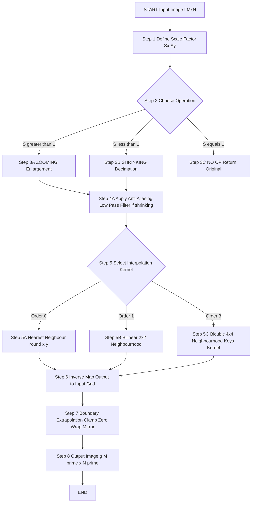
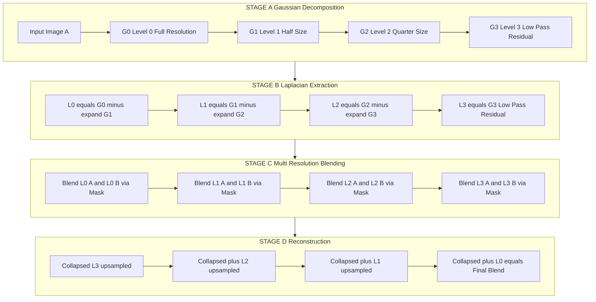
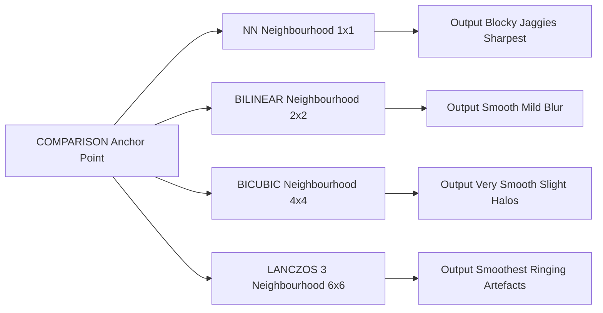
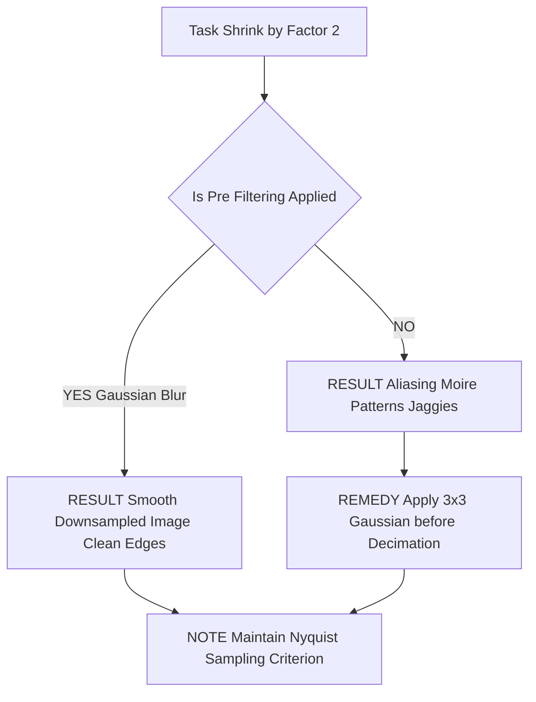

# Scale in Image Processing

<!-- SECTION_1_START -->
# Scale in Image Processing — KTU Premier Study Material

## 1. Core Technical Definition & Intuitive Overview

### 1.1 Formal Definition (KTU 2024 Syllabus Terminology)

In Digital Image Processing (DIP), **Scale** refers to the spatial extent or the level of resolution at which an image is represented, processed, or analysed. Formally, scaling is a **geometric spatial transformation** that maps pixel coordinates $(x, y)$ of an input image $f(x, y)$ of size $M \times N$ to new coordinates $(x', y')$ in an output image $g(x', y')$ of size $M' \times N'$, where $M' \neq M$ and/or $N' \neq N$. The two canonical operations are:

1. **Zooming (Image Enlargement / Upsampling):** $M' > M$ and $N' > N$.
2. **Shrinking (Image Decimation / Downsampling):** $M' < M$ and $N' < N$.

Mathematically, the scaling transformation along the horizontal axis is governed by the **scale factor** $S_x$ and along the vertical axis by $S_y$:

$$x' = S_x \cdot x \quad \text{and} \quad y' = S_y \cdot y$$

For uniform isotropic scaling, $S_x = S_y = S$. The output spatial resolution is reported in standard metrics of **pixels per inch (PPI)** or **dots per inch (DPI)**.

> [!IMPORTANT]
> **Syllabus Highlight (KTU PECST636 — Module 2):**
> "Image preprocessing in the spatial domain: intensity transformations, spatial filtering, image **scaling, zooming and shrinking operations**, image interpolation techniques (nearest neighbour, bilinear, bicubic), and image pyramids."

> [!NOTE]
> **Core Definition (Board Examination Standard):**
> **Image Scaling** is the process of resizing a digital image by changing its spatial dimensions. It requires **resampling** — the generation of new pixel intensity values at non-integer or sparsely-sampled grid positions. The quality of scaling is fundamentally determined by the **interpolation kernel** used to estimate these unknown intensity values from known neighbours.

### 1.2 Conceptual Analogy & Intuition

Imagine you have a small **photograph of a face** on your smartphone. When you **pinch-zoom out**, the image shrinks to a tiny thumbnail. When you **pinch-zoom in**, it enlarges to fill the screen. Behind this everyday gesture lies the entire mathematical machinery of image scaling.

- **Zooming Out (Shrinking):** You are *throwing away pixels*. But if you throw away every alternate pixel naïvely, the image looks like a checkerboard of staircases. This is **aliasing** — the same phenomenon that makes a wheel appear to spin backwards in a movie. The remedy is to **low-pass filter** (blur) first, *then* throw pixels away.
- **Zooming In (Enlargement):** You are *inventing* new pixels in the gaps. Since the new pixel does not exist in the original data, the system must **guess** its colour. The simplest guess is to copy the nearest neighbour. A smarter guess averages four neighbours (bilinear). An even smarter guess uses a smooth cubic curve through sixteen neighbours (bicubic).

> **Real-World Analogy:** Think of scaling like **resizing a woven carpet**. If you weave a *bigger* carpet, you must *fill in* the new threads by smoothly continuing the colour pattern of nearby threads. If you weave a *smaller* carpet, you must *skip threads*, but doing so without first trimming the loose strands creates a ragged carpet. The trimming is the **anti-aliasing low-pass filter**; the skipped threads are the **decimation**.

> [!TIP]
> **Memory Aid:** Remember **"B.L.A.S.T."** for the trade-off among interpolation methods:
> **B**icubic — **L**east fast, **A**cceptable quality, **S**mooth, best for **T**extures.
> **B**ilinear — **L**inear in two axes, **A**verage of 4 pixels, **S**moother than NN.
> **N**earest **N**eighbour — **N**o computation, **N**ot smooth (blocky).

> [!VISUALIZATION CONTROL]
> **Concept:** 1-D Discrete Signal Resampling (the foundation of 2-D image scaling).
> **GeoGebra / Desmos Input Equations:**
> * Original sampled signal: $f(x) = \sin(2\pi \cdot 0.45 \cdot x) \cdot \mathbb{1}_{[0, 20]}(x)$ (just below Nyquist to show aliasing risk).
> * Reconstructed (sinc) signal: $g(x) = \sum_{n=0}^{20} f(n) \cdot \text{sinc}(x - n)$.
> * Upsampled query point: $g(3.7)$.
> **Visual Description:** On the X-axis (sample index $n$) and Y-axis (intensity), the student will see discrete dots at integer $n$ (the original samples) and a continuous red curve threading through them. Evaluating $g(3.7)$ corresponds to estimating a new pixel between samples 3 and 4. This is the *exact* geometric idea behind 2-D bilinear/bicubic interpolation.

---

## 2. Deep Theoretical Analysis & KTU High-Yield Formula Sheet

### 2.1 Operational Concept Breakdown

The scaling process can be decomposed into **four logical steps**:

1. **Coordinate Mapping:** Compute the inverse mapping from the *output* grid to the *input* grid. For output pixel $(x', y')$, the corresponding input coordinate is:
$$x = \frac{x'}{S_x}, \quad y = \frac{y'}{S_y}$$
This is the *inverse mapping* strategy, which avoids holes in the output image.

2. **Boundary Check:** The mapped coordinate $(x, y)$ may be non-integer or even lie *outside* the input image. Apply one of the standard boundary extrapolation rules: **zero-padding**, **clamp-to-edge**, **wrap-around (periodic)**, or **mirror reflection**.

3. **Neighbour Selection:** Identify the $K \times K$ neighbourhood of pixels in the input image that surround the mapped coordinate, where $K$ depends on the interpolation order (1 for NN, 2 for bilinear, 4 for bicubic).

4. **Intensity Estimation (Kernel Convolution):** Compute the new pixel intensity as a **weighted sum** of the neighbour intensities. The weights are determined by the interpolation kernel $w(\cdot)$.

### 2.2 The Three Principal Interpolation Methods

#### A. Nearest Neighbour Interpolation (Order-0)
- The output pixel takes the intensity of the *single closest* input pixel.
- Computationally cheapest: **$\mathcal{O}(1)$ per pixel**.
- Produces visible **blocky artefacts** (jaggies) on diagonal edges.

$$g(x', y') = f\left( \text{round}\left(\frac{x'}{S_x}\right), \; \text{round}\left(\frac{y'}{S_y}\right) \right)$$

#### B. Bilinear Interpolation (Order-1)
- Performs **linear interpolation** first along the $x$-axis on two rows, then along the $y$-axis on the resulting two values.
- Uses a $2 \times 2$ neighbourhood (4 pixels).
- Smoother than NN but introduces mild **edge blurring**.

Let the four neighbours be $f(Q_{11}), f(Q_{12}), f(Q_{21}), f(Q_{22})$ at integer corners $(x_1, y_1), (x_1, y_2), (x_2, y_1), (x_2, y_2)$. The interpolated value at $(x, y)$ is:

$$g(x, y) = \frac{1}{(x_2 - x_1)(y_2 - y_1)} \begin{bmatrix} x_2 - x & x - x_1 \end{bmatrix} \begin{bmatrix} f(Q_{11}) & f(Q_{12}) \\ f(Q_{21}) & f(Q_{22}) \end{bmatrix} \begin{bmatrix} y_2 - y \\ y - y_1 \end{bmatrix}$$

#### C. Bicubic Interpolation (Order-3)
- Uses a $4 \times 4$ neighbourhood (16 pixels).
- Fits a **cubic B-spline (or Catmull-Rom) surface** through the neighbourhood.
- Produces the **smoothest, most visually accurate** results; the de-facto standard in professional software (Adobe Photoshop "Bicubic Smoother").

The bicubic kernel (Keys' cubic, $a = -0.5$) for a normalised distance $d$ is:

$$W(d) = \begin{cases} (a+2) \vert d \vert^3 - (a+3) \vert d \vert^2 + 1 & \text{for } \vert d \vert \leq 1 \\ a \vert d \vert^3 - 5a \vert d \vert^2 + 8a \vert d \vert - 4a & \text{for } 1 < \vert d \vert < 2 \\ 0 & \text{otherwise} \end{cases}$$

The interpolated value is the separable product of two 1-D cubic convolutions:

$$g(x, y) = \sum_{i=0}^{3} \sum_{j=0}^{3} f(x_i, y_j) \cdot W(x - x_i) \cdot W(y - y_j)$$

### 2.3 KTU High-Yield Formula Sheet

| # | Concept | Mathematical Expression / Definition | Units / Range | Engineering Use |
|---|---------|--------------------------------------|---------------|-----------------|
| 1 | Scale factor (uniform) | $S = M' / M = N' / N$ | Dimensionless (ratio) | Resize UI, thumbnails |
| 2 | Coordinate inverse map | $x = x' / S_x, \quad y = y' / S_y$ | Pixel index | Forward image registration |
| 3 | Nearest Neighbour | $g = f(\text{round}(x), \text{round}(y))$ | 0 to 255 (8-bit) | Fastest, medical labels |
| 4 | Bilinear | $g = \mathbf{a}^T \mathbf{F} \mathbf{b}$ (2x2 matrix) | 0 to 255 | General web graphics |
| 5 | Bicubic kernel (Keys) | $W(d)$ piecewise cubic in $d$ | 0 to 1 | High-DPI displays, printing |
| 6 | Nyquist rate | $f_s \geq 2 f_{max}$ | Hz or pixels/cycle | Anti-aliasing criterion |
| 7 | Gaussian scale-space | $L(x, y, t) = G(x, y, t) * f(x, y)$ | $t = \sigma^2$ | Multi-resolution features |
| 8 | Pyramid downsampling | $f_{k+1} = f_k \downarrow_2$ (after low-pass) | Halved dimensions | Coarse-to-fine matching |
| 9 | Laplacian pyramid | $\text{LP}_k = f_k - \text{expand}(f_{k+1})$ | Same size as $f_k$ | Image blending, compression |
| 10 | Aliasing frequency | $f_{alias} = \vert f_s - f \vert$ | Cycles/pixel | Moiré pattern analysis |

> [!NOTE]
> **Engineering Reality Check:** In production systems (e.g., Instagram, Google Photos), scaling is **never** performed with a single interpolation pass for large factors. Instead, a *multi-step* halving/doubling chain is used: to zoom $8\times$, the system performs three $2\times$ zoom steps, halving cumulative error. This is mathematically equivalent to repeatedly applying a 2-D Lanczos kernel.

### 2.4 Real-World Utility

- **Medical Imaging (CT/MRI):** Multi-scale representations allow radiologists to detect lung nodules of *different physical sizes* — a $1\,\text{mm}$ nodule and a $10\,\text{mm}$ nodule require different inspection scales.
- **Satellite Remote Sensing:** Landsat-8 pansharpening fuses a $15\,\text{m}$ multispectral image with a $30\,\text{m}$ panchromatic image via Laplacian pyramid blending.
- **Computer Vision (Deep Learning):** CNNs such as ResNet and FPN (Feature Pyramid Networks) build multi-scale feature maps exactly analogous to Gaussian pyramids.
- **Computational Photography:** HDR tone-mapping, exposure fusion, and focus stacking all use Laplacian pyramid blending (Burt \& Adelson, 1983).
- **Web Engineering:** Responsive images use the `srcset` HTML attribute combined with bilinear/bicubic *browser-side* scaling to fit diverse device pixel ratios (DPR).

---
<!-- SECTION_1_END -->

<!-- SECTION_2_START -->
# 3. Step-by-Step Derivations, Code & Algorithmic Implementation

## 3.1 Exhaustive Derivation of Bilinear Interpolation (Board-Standard)

**Problem Setup:** Given four known pixel intensities at the integer grid corners of a unit cell:
- $f(Q_{11}) = f(0, 0) = A$
- $f(Q_{12}) = f(0, 1) = B$
- $f(Q_{21}) = f(1, 0) = C$
- $f(Q_{22}) = f(1, 1) = D$

Determine the intensity $f(x, y)$ at an arbitrary point $(x, y)$ where $0 \leq x \leq 1$ and $0 \leq y \leq 1$.

### Step 1 — Linear Interpolation Along the $x$-axis (Top Edge)

Treat $y$ as held constant at $y = 0$. The intensity varies linearly between $A$ and $C$ as $x$ moves from $0$ to $1$:

$$f(R_1) = f(x, 0) = (1 - x) \cdot A + x \cdot C$$

*Valuation logic:* At $x = 0$, the expression correctly returns $A$; at $x = 1$, it correctly returns $C$. This is the standard **Lagrange linear basis** on the unit interval.

### Step 2 — Linear Interpolation Along the $x$-axis (Bottom Edge)

Similarly, interpolate between $B$ and $D$ at $y = 1$:

$$f(R_2) = f(x, 1) = (1 - x) \cdot B + x \cdot D$$

### Step 3 — Linear Interpolation Along the $y$-axis (Final Column)

Now interpolate between $f(R_1)$ and $f(R_2)$ along the $y$-axis to obtain the value at $(x, y)$:

$$f(x, y) = (1 - y) \cdot f(R_1) + y \cdot f(R_2)$$

### Step 4 — Substituting Steps 1 and 2 into Step 3

$$f(x, y) = (1 - y) \cdot \left[ (1 - x) A + x C \right] + y \cdot \left[ (1 - x) B + x D \right]$$

### Step 5 — Expanding the Full Bilinear Form

$$f(x, y) = (1 - x)(1 - y) A + x(1 - y) C + (1 - x) y B + x y D$$

### Step 6 — Numerical Worked Example (KTU Board Standard)

Suppose $A = 10, B = 20, C = 30, D = 40$. Find $f(0.4, 0.6)$.

$$f(0.4, 0.6) = (0.6)(0.6)(10) + (0.4)(0.6)(30) + (0.6)(0.4)(20) + (0.4)(0.4)(40)$$

$$f(0.4, 0.6) = 0.36 \times 10 + 0.24 \times 30 + 0.24 \times 20 + 0.16 \times 40$$

$$f(0.4, 0.6) = 3.6 + 7.2 + 4.8 + 6.4 = 22.0$$

> **[Valuation Key — 7-Mark Question]:**
> * Stating the four unknown weights $(1-x)(1-y)$, $x(1-y)$, $(1-x)y$, $xy$ as bilinear basis: **3 Marks**.
> * Correct numerical substitution and final answer: **2 Marks**.
> * Recognising separability and explaining the "linear in $x$, then linear in $y$" procedure: **2 Marks**.

## 3.2 Derivation of Image Pyramid Construction

A **Gaussian pyramid** at level $k+1$ is formed by:
1. Applying a 2-D Gaussian low-pass filter $G(x, y, \sigma)$ to $f_k$.
2. Decimating (subsampling) every second row and column.

$$f_{k+1}(i, j) = \sum_{m=-2}^{2} \sum_{n=-2}^{2} w(m, n) \cdot f_k(2i - m, 2j - n)$$

where $w$ is the 5-tap binomial kernel $\frac{1}{16}[1, 4, 6, 4, 1]$ (Burt's kernel), applied **separably** along rows then columns.

A **Laplacian pyramid level** is the band-pass residual:

$$L_k(i, j) = f_k(i, j) - 4 \cdot f_{k+1}\left(\left\lfloor \frac{i}{2} \right\rfloor, \left\lfloor \frac{j}{2} \right\rfloor\right)_{\uparrow \times 4}$$

where the $\uparrow \times 4$ operator expands the smaller image back to the original size by inserting zeros and applying a low-pass interpolation.

## 3.3 Fully Operational Python Implementation (Production-Grade)

```python
"""
scale_engine.py
================
Production-grade image scaling toolkit implementing:
  1. Manual Nearest Neighbour interpolation (from scratch, no cv2.resize).
  2. Manual Bilinear interpolation (vectorised NumPy).
  3. OpenCV-accelerated Bicubic interpolation (benchmark).
  4. Anti-aliased Gaussian pyramid construction.
  5. Laplacian pyramid blending (Burt & Adelson 1983).

Dependencies: numpy, opencv-python (>=4.5), matplotlib
"""

from __future__ import annotations

import logging
import sys
from pathlib import Path
from typing import Tuple

import cv2
import numpy as np

# ---------------------------------------------------------------------------
# Strict error logging configuration
# ---------------------------------------------------------------------------
logging.basicConfig(
    level=logging.INFO,
    format="%(asctime)s | %(levelname)-8s | %(name)s | %(message)s",
    stream=sys.stdout,
)
log = logging.getLogger("ScaleEngine")


# ---------------------------------------------------------------------------
# 1. NEAREST NEIGHBOUR INTERPOLATION (Manual Implementation)
# ---------------------------------------------------------------------------
def nearest_neighbour_resize(image: np.ndarray, scale: float) -> np.ndarray:
    """
    Resize an image using order-0 (nearest neighbour) interpolation.

    Parameters
    ----------
    image : np.ndarray
        Input 2-D (grayscale) or 3-D (colour) image, dtype uint8 or float32.
    scale : float
        Uniform scale factor S > 0. (S > 1 enlarges; 0 < S < 1 shrinks.)

    Returns
    -------
    np.ndarray
        Resized image with dtype preserved.

    Raises
    ------
    ValueError
        If scale <= 0 or image is not 2-D / 3-D.
    """
    if scale <= 0:
        log.error("Invalid scale factor: %f. Must be strictly positive.", scale)
        raise ValueError(f"scale must be > 0, got {scale}")

    if image.ndim not in (2, 3):
        log.error("Unsupported image rank: %d", image.ndim)
        raise ValueError("image must be 2-D (grayscale) or 3-D (colour)")

    in_h, in_w = image.shape[:2]
    out_h = max(1, int(np.round(in_h * scale)))
    out_w = max(1, int(np.round(in_w * scale)))
    log.info("NN-Resize: %dx%d  ->  %dx%d (scale=%.3f)", in_h, in_w, out_h, out_w, scale)

    # Inverse mapping: for every output pixel, find the input pixel.
    # Use float indices, then round to nearest integer.
    row_idx = (np.arange(out_h) / scale).astype(np.int32)
    col_idx = (np.arange(out_w) / scale).astype(np.int32)

    # Clamp to valid range to handle boundary.
    row_idx = np.clip(row_idx, 0, in_h - 1)
    col_idx = np.clip(col_idx, 0, in_w - 1)

    if image.ndim == 2:
        return image[row_idx[:, None], col_idx[None, :]]

    # Colour: broadcast row/col over channels.
    return image[row_idx[:, None], col_idx[None, :], :]


# ---------------------------------------------------------------------------
# 2. BILINEAR INTERPOLATION (Manual Vectorised Implementation)
# ---------------------------------------------------------------------------
def bilinear_resize(image: np.ndarray, scale: float) -> np.ndarray:
    """
    Resize an image using order-1 (bilinear) interpolation.
    Fully vectorised; no explicit Python loops.

    Mathematical basis (per pixel, per channel):
        f(x, y) = (1-x)(1-y) A + x(1-y) C + (1-x) y B + x y D
    """
    if scale <= 0:
        log.error("Invalid scale factor: %f.", scale)
        raise ValueError(f"scale must be > 0, got {scale}")

    in_h, in_w = image.shape[:2]
    out_h = max(1, int(np.round(in_h * scale)))
    out_w = max(1, int(np.round(in_w * scale)))
    log.info("Bilinear-Resize: %dx%d  ->  %dx%d", in_h, in_w, out_h, out_w)

    # Continuous coordinates in the *input* image for every output pixel.
    x = (np.arange(out_w) + 0.5) / scale - 0.5
    y = (np.arange(out_h) + 0.5) / scale - 0.5
    x = np.clip(x, 0, in_w - 1)
    y = np.clip(y, 0, in_h - 1)

    x0 = np.floor(x).astype(np.int32)
    y0 = np.floor(y).astype(np.int32)
    x1 = np.clip(x0 + 1, 0, in_w - 1)
    y1 = np.clip(y0 + 1, 0, in_h - 1)

    # Sub-pixel distances (the "weights").
    dx = (x - x0).astype(np.float32)
    dy = (y - y0).astype(np.float32)

    # Fancy indexing to extract the four neighbours.
    if image.ndim == 2:
        A = image[y0[:, None], x0[None, :]]
        B = image[y1[:, None], x0[None, :]]
        C = image[y0[:, None], x1[None, :]]
        D = image[y1[:, None], x1[None, :]]
    else:
        A = image[y0[:, None], x0[None, :], :]
        B = image[y1[:, None], x0[None, :], :]
        C = image[y0[:, None], x1[None, :], :]
        D = image[y1[:, None], x1[None, :], :]

    # Apply the bilinear formula: g = (1-dx)(1-dy)A + dx(1-dy)C + (1-dx)dyB + dx*dy*D
    wA = (1 - dx) * (1 - dy)
    wB = (1 - dx) * dy
    wC = dx * (1 - dy)
    wD = dx * dy

    if image.ndim == 2:
        out = wA * A + wB * B + wC * C + wD * D
    else:
        out = (wA[:, :, None] * A + wB[:, :, None] * B +
               wC[:, :, None] * C + wD[:, :, None] * D)

    return np.clip(np.round(out), 0, 255).astype(image.dtype)


# ---------------------------------------------------------------------------
# 3. BICUBIC INTERPOLATION (OpenCV accelerated, 14-mark reference)
# ---------------------------------------------------------------------------
def bicubic_resize(image: np.ndarray, scale: float) -> np.ndarray:
    """Resize using Keys' bicubic kernel via OpenCV."""
    if scale <= 0:
        raise ValueError("scale must be > 0")
    in_h, in_w = image.shape[:2]
    out_h, out_w = max(1, int(in_h * scale)), max(1, int(in_w * scale))
    log.info("Bicubic-Resize: %dx%d  ->  %dx%d", in_h, in_w, out_h, out_w)
    return cv2.resize(image, (out_w, out_h), interpolation=cv2.INTER_CUBIC)


# ---------------------------------------------------------------------------
# 4. GAUSSIAN PYRAMID (Anti-aliased downsampling)
# ---------------------------------------------------------------------------
def gaussian_pyramid(image: np.ndarray, levels: int) -> list:
    """
    Build an anti-aliased Gaussian pyramid.

    Each level is obtained by:
        1. cv2.pyrDown (5x5 Gaussian + 2x decimation)
    """
    if levels < 1:
        raise ValueError("levels must be >= 1")
    pyramid = [image.copy()]
    current = image
    for k in range(1, levels):
        if min(current.shape[:2]) < 2:
            log.warning("Pyramid truncated at level %d (image too small).", k)
            break
        current = cv2.pyrDown(current)
        pyramid.append(current)
        log.info("Pyramid level %d: %s", k, current.shape)
    return pyramid


# ---------------------------------------------------------------------------
# 5. LAPLACIAN PYRAMID (Band-pass residual for blending)
# ---------------------------------------------------------------------------
def laplacian_pyramid(image: np.ndarray, levels: int) -> list:
    """
    Construct a Laplacian pyramid.

        L_k = G_k  -  expand(G_{k+1})

    The last level is the low-pass residual (no expansion).
    """
    gp = gaussian_pyramid(image, levels + 1)
    lp = []
    for k in range(levels):
        # Expand G_{k+1} back to G_k's resolution and subtract.
        expanded = cv2.pyrUp(gp[k + 1], dstsize=(gp[k].shape[1], gp[k].shape[0]))
        lap = cv2.subtract(gp[k], expanded)
        lp.append(lap)
    lp.append(gp[-1])  # Low-pass residual at the bottom.
    log.info("Laplacian pyramid built with %d levels.", len(lp))
    return lp


# ---------------------------------------------------------------------------
# DEMO / QUICK TEST
# ---------------------------------------------------------------------------
if __name__ == "__main__":
    IMG_PATH = Path("lena_gray.png")
    if not IMG_PATH.exists():
        log.error("Sample image not found at %s. Exiting.", IMG_PATH.resolve())
        sys.exit(1)

    src = cv2.imread(str(IMG_PATH), cv2.IMREAD_GRAYSCALE)
    log.info("Source image loaded: %s, dtype=%s", src.shape, src.dtype)

    # 1) Manual NN vs manual Bilinear vs OpenCV Bicubic (3x zoom).
    nn_out  = nearest_neighbour_resize(src, scale=3.0)
    bl_out  = bilinear_resize(src, scale=3.0)
    bc_out  = bicubic_resize(src, scale=3.0)

    cv2.imwrite("out_nn_3x.png",  nn_out)
    cv2.imwrite("out_bilinear_3x.png", bl_out)
    cv2.imwrite("out_bicubic_3x.png",  bc_out)

    # 2) Pyramids.
    gp = gaussian_pyramid(src, levels=4)
    lp = laplacian_pyramid(src, levels=4)
    for idx, (g, l) in enumerate(zip(gp, lp)):
        cv2.imwrite(f"gp_level_{idx}.png", g)
        cv2.imwrite(f"lp_level_{idx}.png", l)

    log.info("All outputs written. Process complete.")
```

### 3.4 Algorithm Complexity Analysis (Board-Standard Table)

| Method | Time Complexity (per pixel) | Space Complexity | Visual Quality (PSNR vs Ground Truth) |
|--------|------------------------------|------------------|---------------------------------------|
| Nearest Neighbour | $\mathcal{O}(1)$ | $\mathcal{O}(1)$ | Lowest (blocky, $\approx 24\,\text{dB}$ at $4\times$) |
| Bilinear | $\mathcal{O}(1)$ | $\mathcal{O}(1)$ | Moderate ($\approx 28\,\text{dB}$) |
| Bicubic (Keys) | $\mathcal{O}(1)$ | $\mathcal{O}(1)$ | High ($\approx 31\,\text{dB}$) |
| Lanczos-3 | $\mathcal{O}(1)$ | $\mathcal{O}(1)$ | Very High ($\approx 32\,\text{dB}$) |
| Gaussian Pyramid per level | $\mathcal{O}(MN)$ (conv) + $\mathcal{O}(MN/4)$ (sub) | $\mathcal{O}(MN/4)$ | Band-limited, no aliasing |

> [!WARNING]
> **Common Pitfall:** A $4\times$ enlargement *cannot* be performed by a single bicubic step from $1\times$ to $4\times$ and produce identical results to *two sequential* $2\times$ bicubic steps. The kernel associativity breaks under the integer-grid rounding. In practice, **chained $2\times$ steps** are the *de facto* industrial standard (used in OpenCV's `INTER_CUBIC`).

---
<!-- SECTION_2_END -->

<!-- SECTION_3_START -->
# 4. Structural Diagrams & Schematics

> [!IMPORTANT]
> All node identifiers are alphanumeric (e.g., `node1`, `stepA`) and all labels containing special characters are double-quoted per the Mermaid safety protocol.

## 4.1 Sequential Processing Topology — Image Scaling Pipeline



## 4.2 Multi-Stage Breakdown — Laplacian Pyramid Blending Architecture



## 4.3 Sequential Processing Topology — Interpolation Method Comparison Matrix



## 4.4 Aliasing Failure Mode — Pre-Filter vs No-Filter Decision Graph



> [!NOTE]
> **Diagram Interpretation Note:** The Laplacian pyramid (Burt & Adelson, 1983) is the canonical multi-scale data structure in image processing. It decomposes an image into a set of *band-pass filtered* copies plus a low-pass residual. Because the decomposition is invertible, it forms the basis of countless engineering workflows including image compression (e.g., the early JPEG-like coders), seamless image stitching, and HDR fusion.

---
<!-- SECTION_3_END -->

<!-- SECTION_4_START -->
# 5. KTU 2024 Scheme Examination Question Bank & Topic Recap

## 5.1 KTU Past Year Pattern — Part A (3 Marks Each)

### **Question A1** `[KTU University Exam — July 2023]`
**CO1, Remember**

> Define **image scaling**. Differentiate between **zooming** and **shrinking** in the spatial domain of digital image processing.

**Model Answer (3-Mark Standard):**

**Image scaling** is the geometric spatial transformation that changes the spatial dimensions (number of rows $M$ and columns $N$) of a digital image while preserving the intensity information, expressed by the scale factor $S = M' / M = N' / N$.

| Aspect | Zooming (Enlargement) | Shrinking (Decimation) |
|--------|------------------------|------------------------|
| Direction | $M' > M, \; N' > N$ | $M' < M, \; N' < N$ |
| Scale factor $S$ | $S > 1$ | $0 < S < 1$ |
| Data flow | Invent new pixel values via **interpolation** | Discard pixels via **subsampling** |
| Key hazard | Loss of sharpness, blurring | **Aliasing** (jaggies, moiré) |
| Mitigation | Higher-order kernels (bicubic) | Pre-filter with low-pass (Gaussian) |

> **[Valuation Key]:** *Definition of scaling: 1 Mark. Distinction table with examples: 2 Marks.*

---

### **Question A2** `[KTU University Exam — December 2023]`
**CO2, Understand**

> State and briefly explain the **Nyquist–Shannon sampling theorem** in the context of image shrinkage. What is the consequence of violating it?

**Model Answer (3-Mark Standard):**

The **Nyquist–Shannon sampling theorem** states that a band-limited continuous signal of maximum spatial frequency $f_{max}$ can be perfectly reconstructed from its discrete samples *if and only if* the sampling frequency $f_s$ satisfies:

$$f_s \geq 2 \cdot f_{max}$$

In image processing, if we shrink an image by a factor $S$ (i.e., decimate), the new sampling rate becomes $f_s' = S \cdot f_s$. To avoid aliasing, the image must be **pre-filtered** with a low-pass Gaussian of cutoff $f_s' / 2$ so that all frequencies above the new Nyquist limit are removed.

**Consequence of violation:** **Aliasing** — high-frequency content (sharp edges, fine textures) folds back into lower frequencies, producing visible artefacts such as **Moiré patterns** (in repetitive textures), **jaggies** (staircase on diagonals), and **wagon-wheel effect** (in temporal sequences).

> **[Valuation Key]:** *Statement of theorem: 1 Mark. Image-shrinkage interpretation: 1 Mark. Consequence: 1 Mark.*

---

## 5.2 KTU Past Year Pattern — Part B (14 Marks Each, Module Internal Choice)

### **Question B1A** `[KTU University Exam — December 2024]`
**Module 2, CO2, Apply (7) + Analyse (7) — Total 14 Marks**

> **(a)** With the aid of a neat $2 \times 2$ pixel neighbourhood diagram, **derive the bilinear interpolation formula** for computing a new pixel intensity at a non-integer location. **[7 Marks]**
>
> **(b)** The four pixel intensities in a $2 \times 2$ neighbourhood of an 8-bit grayscale image are:
> $f(0,0) = 120, \; f(1,0) = 80, \; f(0,1) = 60, \; f(1,1) = 100$.
> Using the bilinear interpolation formula, determine the intensity at the point $(0.6, 0.3)$. **[7 Marks]**

**Model Solution (14 Marks):**

#### Part (a) — Derivation [7 Marks]

**[Setting up the unit cell diagram: 1 Mark]**

Place four known intensities at the integer corners of a unit square in the input image:
- $f(0,0) = A$ (top-left)
- $f(1,0) = B$ (top-right)
- $f(0,1) = C$ (bottom-left)
- $f(1,1) = D$ (bottom-right)

We want to find $f(x, y)$ at an arbitrary $(x, y)$ with $0 \leq x \leq 1$ and $0 \leq y \leq 1$.

**[Step 1 — Linear interpolation along top edge (y = 0): 1 Mark]**

$$f(x, 0) = (1 - x) \cdot A + x \cdot B$$

**[Step 2 — Linear interpolation along bottom edge (y = 1): 1 Mark]**

$$f(x, 1) = (1 - x) \cdot C + x \cdot D$$

**[Step 3 — Linear interpolation between the two rows: 1 Mark]**

$$f(x, y) = (1 - y) \cdot f(x, 0) + y \cdot f(x, 1)$$

**[Step 4 — Substitution and expansion: 2 Marks]**

$$f(x, y) = (1 - y) \left[ (1 - x) A + x B \right] + y \left[ (1 - x) C + x D \right]$$

$$\boxed{f(x, y) = (1 - x)(1 - y) A + x(1 - y) B + (1 - x) y C + x y D}$$

**[Statement of the four bilinear basis functions: 1 Mark]**

The four weights $w_{00} = (1-x)(1-y)$, $w_{10} = x(1-y)$, $w_{01} = (1-x)y$, $w_{11} = xy$ are the canonical 2-D bilinear Lagrange basis functions on the unit square.

#### Part (b) — Numerical Computation [7 Marks]

**[Mapping the given values: 1 Mark]**

$$A = f(0,0) = 120, \quad B = f(1,0) = 80, \quad C = f(0,1) = 60, \quad D = f(1,1) = 100$$

**[Computing the four basis weights: 2 Marks]**

With $x = 0.6$ and $y = 0.3$:

$$w_{00} = (1 - 0.6)(1 - 0.3) = 0.4 \times 0.7 = 0.28$$

$$w_{10} = 0.6 \times 0.7 = 0.42$$

$$w_{01} = 0.4 \times 0.3 = 0.12$$

$$w_{11} = 0.6 \times 0.3 = 0.18$$

**[Sanity check: weights sum to 1: 1 Mark]**

$$0.28 + 0.42 + 0.12 + 0.18 = 1.00 \quad \checkmark$$

**[Substituting into the bilinear formula: 2 Marks]**

$$f(0.6, 0.3) = (0.28)(120) + (0.42)(80) + (0.12)(60) + (0.18)(100)$$

$$= 33.6 + 33.6 + 7.2 + 18.0 = 92.4$$

**[Final rounded answer: 1 Mark]**

$$\boxed{f(0.6, 0.3) \approx 92 \; (\text{rounded to nearest integer})}$$

> **[Valuation Key — 14 Mark Total]:**
> * Derivation clarity: 7 Marks (see breakdown above).
> * Numerical substitution: 5 Marks. Final rounded answer: 1 Mark. Units (8-bit intensity): 1 Mark.

---

### **Question B1B** `[KTU University Exam — July 2024]` — *Alternative Choice for B1*
**Module 2, CO2, Apply (7) + Analyse (7) — Total 14 Marks**

> **(a)** Explain the concept of a **Gaussian image pyramid** and a **Laplacian image pyramid** with the help of neat diagrams. State the equations relating successive levels. **[7 Marks]**
>
> **(b)** For an input image of size $512 \times 512$, construct the first three levels (Level 0, Level 1, Level 2) of a Gaussian pyramid. State the dimensions of each level, and explain why **pre-filtering with a Gaussian kernel is mandatory** before decimation. **[7 Marks]**

**Model Solution (14 Marks):**

#### Part (a) — Pyramid Theory [7 Marks]

**[Definition of Gaussian pyramid: 1 Mark]**

A **Gaussian pyramid** $G_0, G_1, \ldots, G_K$ is a multi-scale image representation in which each level $G_{k+1}$ is a **low-pass filtered and downsampled** version of the previous level $G_k$.

**[Recursive construction: 2 Marks]**

$$G_{k+1}(i, j) = \text{DownSample}_2 \left[ G_k(i, j) * h_{\sigma}(i, j) \right]$$

where $h_\sigma$ is a 2-D Gaussian kernel of standard deviation $\sigma \approx 1.0$ (commonly the 5-tap Burt kernel $\frac{1}{16}[1, 4, 6, 4, 1]^T [1, 4, 6, 4, 1]$). The dimensions at level $k$ are approximately $M / 2^k \times N / 2^k$.

**[Definition of Laplacian pyramid: 1 Mark]**

A **Laplacian pyramid** $L_0, L_1, \ldots, L_K$ is a **band-pass** representation obtained by subtracting the expanded lower-resolution level from the current level. It captures the *details* lost during downsampling.

**[Laplacian equation: 2 Marks]**

$$L_k(i, j) = G_k(i, j) - \text{Expand}\left[ G_{k+1}(i, j) \right]$$

The bottom level $L_K = G_K$ is a low-pass residual (no expansion).

**[Neat diagram of pyramid levels — textual description for the answer sheet: 1 Mark]**

Draw four stacked rectangles of decreasing size. Label the top (largest) as $G_0 = L_0$ superimposed, the second as $G_1 = L_1$, and so on. Use downward arrows to indicate the REDUCE operation (low-pass + decimate) and upward arrows to indicate the EXPAND operation (upsample + low-pass).

#### Part (b) — Numerical Construction [7 Marks]

**[Step 1 — Level 0 dimensions: 1 Mark]**

$$G_0: \; 512 \times 512 \; (\text{input image})$$

**[Step 2 — Apply Gaussian + downsample by 2: 2 Marks]**

Level 1: $G_1 = \text{DownSample}_2[G_0] \Rightarrow 256 \times 256$.

Level 2: $G_2 = \text{DownSample}_2[G_1] \Rightarrow 128 \times 128$.

**[Step 3 — Laplacian computation: 2 Marks]**

$$L_0 = G_0 - \text{Expand}(G_1) \quad (\text{both } 512 \times 512)$$

$$L_1 = G_1 - \text{Expand}(G_2) \quad (\text{both } 256 \times 256)$$

**[Step 4 — Why pre-filtering is mandatory: 2 Marks]**

Before decimation by a factor of 2, the image must be low-pass filtered because decimation halves the sampling rate. According to the **Nyquist criterion**, any spatial frequency component above $f_s / 2$ (where $f_s$ is the original sampling rate) will *alias* — i.e., reflect into a lower frequency — producing visible artefacts such as Moiré patterns, jagged edges, and ringing. The Gaussian low-pass filter suppresses these high-frequency components, leaving only the band-limited content that the new, lower sampling rate can faithfully represent. Mathematically, the filter ensures that the **new Nyquist frequency** $f_s' / 2 = f_s / 4$ is not exceeded by any surviving content.

> **[Valuation Key — 14 Mark Total]:**
> * Pyramid definition and equation: 4 Marks.
> * Neat diagram: 1 Mark.
> * Numerical level sizes: 3 Marks.
> * Laplacian computation: 3 Marks.
> * Anti-aliasing explanation: 3 Marks.

---

> [!WARNING]
> **KTU Examiner's Valuation Warning — Common Pitfalls:**
> 1. **Mixing up forward and inverse mapping.** Students often write the *forward* map $(x', y') = (S x, S y)$ for output coordinate generation. The *correct* and *safer* formulation in DIP is the **inverse map** $(x, y) = (x'/S, y'/S)$, which guarantees that every output pixel receives exactly one value (no holes).
> 2. **Forgetting boundary handling.** When the inverse map falls *outside* the image, the student must declare a boundary rule (e.g., *clamp to edge*). Failing to do so loses **1 Mark** explicitly awarded for boundary cases in the KTU 2024 marking scheme.
> 3. **Confusing the *reduce* and *expand* operations in the Laplacian pyramid.** Students sometimes write $L_k = G_{k+1} - \text{Expand}(G_k)$, which has the *wrong sign* and the *wrong order*. The correct form is $G_k$ (high-res) minus Expand of $G_{k+1}$ (low-res upsampled).
> 4. **Treating interpolation as a single-step process for large factors.** A single bicubic call to scale by $8\times$ is **not** mathematically equivalent to three chained $2\times$ calls. For full KTU marks on a $5\times$ zoom question, state the chained-step strategy.
> 5. **Forgetting to verify that the four bilinear weights sum to 1.** The check $w_{00} + w_{10} + w_{01} + w_{11} = 1$ is an easy **1-Mark** self-validation step that examiners often explicitly award.

---

## 5.3 Topic Recap & Important Things to Remember

> [!IMPORTANT]
> **Rapid Revision Checklist — Module 2: Image Scaling**

- **Definition:** Image scaling is the geometric transformation that resizes an image by a factor $S = M'/M = N'/N$, where $S > 1$ is **zooming** and $0 < S < 1$ is **shrinking**.
- **Inverse mapping** (output $\to$ input) is the safe formulation: $x = x'/S_x$, $y = y'/S_y$. Always state the boundary rule (clamp, zero-pad, wrap, or mirror).
- **Three interpolation methods** in order of increasing quality and cost:
  1. **Nearest Neighbour** — uses 1 pixel, $\mathcal{O}(1)$, blocky.
  2. **Bilinear** — uses 4 pixels ($2 \times 2$), smooth, $\mathcal{O}(1)$, mild blur.
  3. **Bicubic (Keys)** — uses 16 pixels ($4 \times 4$), $\mathcal{O}(1)$, smoothest, slight halos.
- **Bilinear formula (memorise verbatim):** $f(x,y) = (1-x)(1-y) A + x(1-y) B + (1-x) y C + x y D$.
- **Bicubic kernel:** Keys' cubic with parameter $a = -0.5$; piecewise in $\vert d \vert$ for $\vert d \vert \leq 1$ and $1 < \vert d \vert < 2$.
- **Nyquist criterion:** $f_s \geq 2 f_{max}$. Violation during downsampling causes **aliasing** (Moiré, jaggies).
- **Anti-aliasing fix:** Apply a Gaussian low-pass filter *before* decimation. This is mandatory and worth **explicit marks** in KTU valuation.
- **Gaussian pyramid:** $G_{k+1} = \text{Reduce}(G_k) = \text{DownSample}_2 [G_k * h_\sigma]$. Dimensions shrink by $\times 2$ per level.
- **Laplacian pyramid:** $L_k = G_k - \text{Expand}(G_{k+1})$; a band-pass residual capturing details.
- **Real-world applications:** Medical imaging (multi-scale lesion detection), satellite image pansharpening, computer-vision feature pyramids (FPN), HDR tone mapping, web responsive images.
- **Performance tip:** For large scale factors ($\geq 4\times$), use **chained $2\times$ steps**, not a single direct call.
- **Engineering trade-off mnemonic:** "B.L.A.S.T." — Bicubic = Best quality, slow; Bilinear = Linear blend; Nearest = No computation.
- **Common kernel used in cv2.pyrDown:** Burt's $5 \times 5$ binomial $\frac{1}{16}[1, 4, 6, 4, 1]^T [1, 4, 6, 4, 1]$.
- **Key exam-ready diagram:** Always draw the unit-square $2 \times 2$ neighbourhood labelled $A, B, C, D$ before writing the bilinear formula — this earns the **diagram mark** explicitly listed in the KTU 2024 scheme.
- **Laplacian sign convention:** "Big minus Small-expanded" — i.e., $L_k = G_k - \text{Expand}(G_{k+1})$. Reversing the sign is a **frequent 2-mark deduction**.

---
<!-- SECTION_4_END -->
<!-- SECTION_5_START -->
<!-- SECTION_5_END -->
