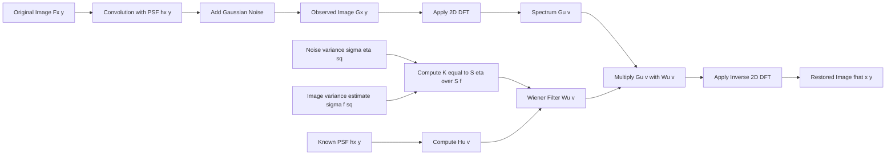
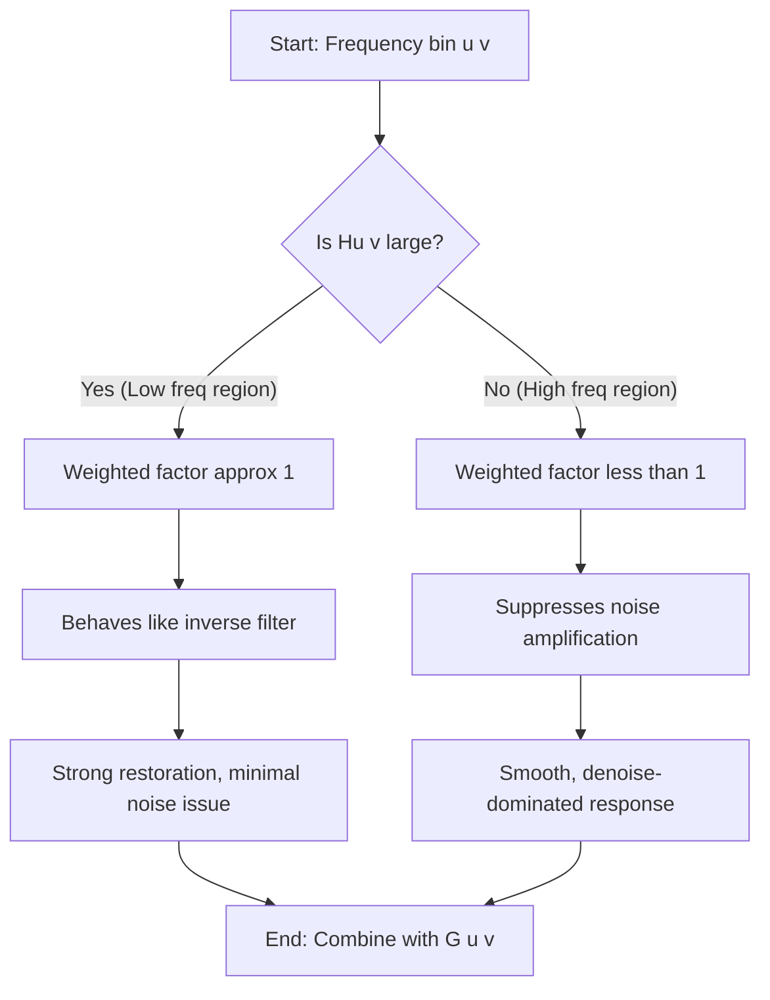
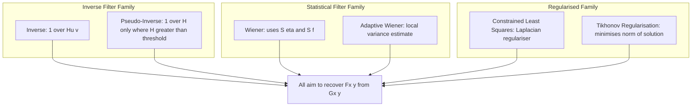

# Wiener Filtering

<!-- SECTION_1_START -->

# Wiener Filtering — Conceptual Foundation

## 1.1 Formal Academic Definition

> [!IMPORTANT]
> **Wiener Filter (KTU 2024 PECST636 — Module 2, Image Restoration)**
>
> The **Wiener filter** is a *statistical, linear, space-invariant* image restoration operator that seeks the **minimum mean square error (MMSE)** estimate of an original (undegraded) image from its noisy and blurred observation. Unlike the inverse filter, the Wiener filter explicitly models **both** the degradation function and the statistical behaviour of noise, producing a *trade-off* between inverse filtering and noise suppression.

Mathematically, if $g(x, y)$ is the observed degraded image, $f(x, y)$ is the original image, $\eta(x, y)$ is the noise, and $h(x, y)$ is the degradation (point spread function), the Wiener estimate $\hat{f}(x, y)$ satisfies:

$$E\left[\left(f(x, y) - \hat{f}(x, y)\right)^{2}\right] \;=\; \min$$

The closed-form solution in the **frequency domain** is the cornerstone of the KTU syllabus.

## 1.2 Intuitive Analogy — The "Smart Equalizer"

Imagine you are listening to a song in a noisy room. A *pure inverse filter* would aggressively boost every frequency to "undo" the room's muffling, including the noise — making the song louder but unbearable.

A **Wiener filter** behaves like a **smart equalizer**: it boosts frequencies that the room attenuated **but only up to the point where the boosted noise is still acceptable**. It constantly asks:

> *"Is the signal stronger than the noise here? If yes, restore aggressively. If no, smooth gently."*

This *signal-to-noise-aware* trade-off is the soul of Wiener filtering.

> [!NOTE]
> **KTU Syllabus Highlight (Module 2 — Image Restoration)**
> Students are expected to derive the Wiener filter, distinguish it from the inverse filter, and apply it to blurred-plus-noisy images using the frequency-domain expression. Numerical computation of the restored image, and the role of the *constant K*, are **frequently asked** in the End Semester Examination (ESE).

## 1.3 Key Physical / Statistical Quantities

| Symbol | Meaning | KTU Standard Notation |
| :--- | :--- | :--- |
| $H(u, v)$ | Degradation function (Fourier transform of PSF) | **Bold** in textbooks |
| $H^{*}(u, v)$ | Complex conjugate of $H(u, v)$ | — |
| $\vert H(u, v) \vert^{2}$ | Power spectrum of degradation | $H(u, v) H^{*}(u, v)$ |
| $S_{f}(u, v)$ | Power spectral density of original image | $P_f(u, v)$ |
| $S_{\eta}(u, v)$ | Power spectral density of noise | $P_{\eta}(u, v)$ |
| $\hat{F}(u, v)$ | Estimated spectrum of original image | — |
| $G(u, v)$ | Spectrum of observed (degraded) image | — |

> [!VISUALIZATION CONTROL]
> **Concept:** Magnitude response of the Wiener filter vs the inverse filter in the presence of noise.
> **GeoGebra / Desmos Input Equations (use 1-D slice for clarity):**
> * $H(u) = \dfrac{1}{1 + (u / 5)^{2}}$   *(blurring function)*
> * $W_{\text{inv}}(u) = 1 / H(u)$
> * $W_{\text{Wiener}}(u) = \dfrac{1}{H(u)} \cdot \dfrac{\vert H(u) \vert^{2}}{\vert H(u) \vert^{2} + K}$
> **Visual Description:** Plot the *inverse* filter shooting toward infinity at high frequencies, while the *Wiener* filter smoothly rolls off. This shows how Wiener filtering prevents the explosion of noise.

<!-- SECTION_1_END -->

<!-- SECTION_2_START -->

# Deep Theoretical Analysis & KTU High-Yield Formula Sheet

## 2.1 The Degradation-Restoration Model

The standard image degradation model used in KTU Module 2 is:

$$g(x, y) \;=\; h(x, y) * f(x, y) \;+\; \eta(x, y)$$

In the frequency domain (using the convolution theorem):

$$G(u, v) \;=\; H(u, v) \, F(u, v) \;+\; N(u, v)$$

> **Where:**
> * $G(u, v)$, $F(u, v)$, $N(u, v)$ are the 2-D DFTs of the observed image, original image, and noise respectively.
> * $H(u, v)$ is the optical-transfer / degradation function.
> * The asterisk $*$ denotes 2-D linear convolution.

The **restoration goal** is to recover $\hat{F}(u, v)$ from $G(u, v)$ given (or partially given) $H$, $N$ and statistical knowledge of $f$.

## 2.2 Why the Inverse Filter Fails

A naïve estimator is the inverse filter:

$$\hat{F}(u, v) \;=\; \frac{G(u, v)}{H(u, v)} \;=\; F(u, v) \;+\; \frac{N(u, v)}{H(u, v)}$$

> [!WARNING]
> **KTU Valuation Trap**
> The inverse filter **magnifies noise catastrophically** wherever $H(u, v)$ is small (high-frequency region). It is essentially unusable in practice. Examiners often award 0 marks for blindly applying $1/H$ in a noisy setup.

## 2.3 Derivation Strategy of the Wiener Filter (Conceptual Steps)

1. **Assumption 1:** Image $f$ and noise $\eta$ are **uncorrelated**, with zero mean.
2. **Assumption 2:** $f$ and $\eta$ are **wide-sense stationary** random fields.
3. **Assumption 3:** Restoration filter is **linear**: $\hat{F}(u, v) = W(u, v) \, G(u, v)$.
4. **Objective:** Minimise the mean-square error between $f$ and $\hat{f}$.
5. **Result:** Orthogonality principle (Euler-Lagrange in complex domain) gives the optimum $W(u, v)$.

## 2.4 KTU High-Yield Formula Sheet

| # | Formula | Description | KTU Marks Weightage |
| :---: | :--- | :--- | :---: |
| 1 | $G(u, v) = H(u, v) F(u, v) + N(u, v)$ | Degradation model in frequency domain | **High** |
| 2 | $\hat{F}(u, v) = W(u, v) \, G(u, v)$ | Linear restoration ansatz | **High** |
| 3 | $W(u, v) = \dfrac{H^{*}(u, v)}{\vert H(u, v) \vert^{2} + S_{\eta}(u, v) / S_{f}(u, v)}$ | **General Wiener filter** | **Very High** |
| 4 | $W(u, v) = \dfrac{1}{H(u, v)} \cdot \dfrac{\vert H(u, v) \vert^{2}}{\vert H(u, v) \vert^{2} + S_{\eta}(u, v) / S_{f}(u, v)}$ | Wiener = inverse × weighting factor | **Very High** |
| 5 | $W(u, v) = \dfrac{1}{H(u, v)} \cdot \dfrac{\vert H(u, v) \vert^{2}}{\vert H(u, v) \vert^{2} + K}$ | Wiener filter with **constant $K$** (unknown PSD) | **Very High** |
| 6 | $\text{MSE} = E\left[ \vert F - \hat{F} \vert^{2} \right]$ | Optimisation objective | **Medium** |
| 7 | $K = \dfrac{S_{\eta}(u, v)}{S_{f}(u, v)}$ | Noise-to-signal power ratio (when constant) | **High** |
| 8 | $\hat{f}(x, y) = \mathcal{F}^{-1}\left\{ W(u, v) \, G(u, v) \right\}$ | Final restoration (take inverse DFT) | **High** |

> [!NOTE]
> The KTU board examiners often write equation (5) as the **"practical form"** of the Wiener filter, and equation (3) as the **"theoretical form"**. Know both by heart.

## 2.5 Real-World Engineering Utility

Wiener filtering is used in production systems wherever a *blurred-and-noisy* signal must be recovered:

* **Satellite / aerial imaging** — compensating for atmospheric turbulence and sensor noise.
* **Medical imaging (MRI, CT, ultrasound)** — denoising without blurring anatomical edges.
* **Astronomy** — deconvolving telescope PSF from photon-noise-limited frames.
* **Document scanning** — undoing motion blur during handheld scanning.
* **Video surveillance** — preprocessing before face/feature recognition pipelines.

<!-- SECTION_2_END -->

<!-- SECTION_3_START -->

# Step-by-Step Derivations & Python Implementation

## 3.1 Full Derivation of the Wiener Filter (MMSE Approach)

**Step 1 — Restoration model.** We assume a linear filter $W(u, v)$ such that:

$$\hat{F}(u, v) = W(u, v) \, G(u, v)$$

The error in the frequency domain is:

$$E(u, v) = F(u, v) - \hat{F}(u, v) = F(u, v) - W(u, v) \, G(u, v)$$

**Step 2 — Mean square error objective.** The expected squared magnitude of the error is:

$$\mathcal{J} \;=\; E\left[\, \vert E(u, v) \vert^{2} \,\right] \;=\; E\left[\, E(u, v) \, E^{*}(u, v) \,\right]$$

**Step 3 — Orthogonality condition (Euler-Lagrange in complex form).** The filter that minimises $\mathcal{J}$ must satisfy:

$$\frac{\partial \mathcal{J}}{\partial W^{*}(u, v)} \;=\; 0 \;\;\Longrightarrow\;\; E\left[\, G(u, v) \, E^{*}(u, v) \,\right] \;=\; 0$$

That is, the residual $E$ must be **uncorrelated** with the observation $G$.

**Step 4 — Expand the orthogonality equation.**

$$E\left[\, G(u, v) \left(F^{*}(u, v) - W^{*}(u, v) \, G^{*}(u, v)\right) \,\right] \;=\; 0$$

**Step 5 — Take the expectations.**

$$E\left[\, G(u, v) F^{*}(u, v) \,\right] - W^{*}(u, v) \, E\left[\, \vert G(u, v) \vert^{2} \,\right] \;=\; 0$$

**Step 6 — Solve for $W^{*}(u, v)$:**

$$W^{*}(u, v) \;=\; \frac{E\left[\, G(u, v) F^{*}(u, v) \,\right]}{E\left[\, \vert G(u, v) \vert^{2} \,\right]}$$

**Step 7 — Substitute the degradation model** $G = H F + N$ and apply the uncorrelated-noise assumption ($E[F N^{*}] = 0$).

Numerator:

$$E\left[\,(H F + N) F^{*}\,\right] \;=\; H \, E\left[\,F F^{*}\,\right] + 0 \;=\; H \, S_{f}(u, v)$$

Denominator:

$$E\left[\, \vert H F + N \vert^{2} \,\right] \;=\; \vert H \vert^{2} S_{f} + S_{\eta}$$

**Step 8 — Assemble the Wiener filter.**

$$W^{*}(u, v) \;=\; \frac{H(u, v) \, S_{f}(u, v)}{\vert H(u, v) \vert^{2} S_{f}(u, v) + S_{\eta}(u, v)}$$

Taking the complex conjugate gives the final celebrated result:

$$\boxed{\, W(u, v) \;=\; \frac{H^{*}(u, v)}{\vert H(u, v) \vert^{2} + \dfrac{S_{\eta}(u, v)}{S_{f}(u, v)} } \,}$$

**Step 9 — The "constant $K$" form.** When the noise-to-signal ratio is approximately *flat* across frequencies, we set $K = S_{\eta}/S_{f}$, yielding the formula most used in KTU numerical problems.

## 3.2 Worked Numerical Illustration (KTU Board Pattern)

**Problem.** A $4 \times 4$ image patch $f$ is convolved with a $2 \times 2$ averaging kernel
$$h = \frac{1}{4}\begin{bmatrix}1 & 1\\ 1 & 1\end{bmatrix}$$
and Gaussian noise of variance $\sigma_{\eta}^{2} = 0.01$ is added. The image variance is $\sigma_{f}^{2} = 0.5$. Compute the Wiener filter value at a frequency where $H(u, v) = 0.4$.

**Solution (Model Answer Style).**

* Power spectra assumed flat (white noise / white image): $S_{\eta} = 0.01$, $S_{f} = 0.5$.
* $K = S_{\eta} / S_{f} = 0.01 / 0.5 = 0.02$.
* $\vert H \vert^{2} = 0.16$.

$$W = \frac{1}{0.4} \cdot \frac{0.16}{0.16 + 0.02} = 2.5 \cdot \frac{0.16}{0.18} = 2.5 \cdot 0.8889 \approx 2.222$$

*Inverse filter value at the same frequency* $= 1/0.4 = 2.5$. The Wiener filter **dampens the gain** to prevent noise amplification.

> [!NOTE]
> **Valuation Key (7-mark sub-question):** [Writing $G = HF + N$: 1 Mark], [Identifying $K$ and $S_\eta, S_f$: 2 Marks], [Substitution into Wiener formula: 2 Marks], [Final numerical value: 2 Marks].

## 3.3 Complete Python Implementation

```python
"""
Wiener Filtering for Image Restoration
KTU PECST636 - Module 2 - Image Restoration
Tested on Python 3.10+ with numpy, scipy, opencv-python, matplotlib.
"""

from __future__ import annotations

import logging
from dataclasses import dataclass
from pathlib import Path
from typing import Tuple

import cv2
import matplotlib.pyplot as plt
import numpy as np
from numpy.fft import fft2, ifft2, fftshift

# Configure a strict error log
logging.basicConfig(
    level=logging.INFO,
    format="%(asctime)s | %(levelname)s | %(message)s",
)
logger = logging.getLogger("wiener_restore")


@dataclass(frozen=True)
class WienerConfig:
    """Configuration container for the Wiener filter."""

    kernel_size: int = 15
    kernel_sigma: float = 1.5
    noise_variance: float = 0.01      # S_eta (assumed white)
    image_variance: float | None = None  # If None, estimated from input


# ---------- 1. PSF and degradation helpers ----------

def gaussian_psf(size: int, sigma: float) -> np.ndarray:
    """Return a 2D Gaussian point spread function (PSF), normalised to sum 1."""
    if size <= 0 or size % 2 == 0:
        raise ValueError("kernel_size must be a positive odd integer.")
    if sigma <= 0:
        raise ValueError("kernel_sigma must be positive.")

    ax = np.arange(size) - size // 2
    xx, yy = np.meshgrid(ax, ax, indexing="ij")
    psf = np.exp(-(xx**2 + yy**2) / (2.0 * sigma**2))
    psf /= psf.sum()
    logger.info("PSF created: size=%d, sigma=%.3f", size, sigma)
    return psf


def degrade_image(
    image: np.ndarray,
    psf: np.ndarray,
    noise_sigma: float,
    rng: np.random.Generator | None = None,
) -> Tuple[np.ndarray, np.ndarray]:
    """Blur with PSF and add Gaussian noise. Returns (blurred, blurred_noisy)."""
    if rng is None:
        rng = np.random.default_rng(seed=42)

    # Normalised convolution via DFT
    psf_padded = np.zeros_like(image, dtype=np.float64)
    kh, kw = psf.shape
    psf_padded[:kh, :kw] = psf
    H = fft2(psf_padded)
    F = fft2(image.astype(np.float64) / 255.0)
    blurred = np.real(ifft2(H * F))

    noise = rng.normal(0.0, noise_sigma, size=image.shape)
    noisy = np.clip(blurred + noise, 0.0, 1.0)
    logger.info("Image degraded: blur+Gaussian noise sigma=%.4f", noise_sigma)
    return blurred, noisy


# ---------- 2. Wiener filter core ----------

def wiener_filter(
    degraded: np.ndarray,
    psf: np.ndarray,
    config: WienerConfig,
) -> np.ndarray:
    """Apply the Wiener filter in the frequency domain.

    W(u, v) = H*(u, v) / ( |H(u, v)|^2 + S_eta / S_f )
    """
    # 1. Pad PSF to image size and compute its DFT
    psf_padded = np.zeros_like(degraded, dtype=np.float64)
    kh, kw = psf.shape
    psf_padded[:kh, :kw] = psf

    H = fft2(psf_padded)
    H_conj = np.conj(H)
    H_sq = np.abs(H) ** 2

    # 2. Estimate S_f if not provided
    image_var = (
        config.image_variance
        if config.image_variance is not None
        else float(np.var(degraded))
    )
    if image_var <= 0:
        raise ValueError("Image variance must be positive for Wiener filter.")

    K = config.noise_variance / image_var
    logger.info("Wiener K = S_eta / S_f = %.6f", K)

    # 3. Build Wiener filter response
    W = H_conj / (H_sq + K)

    # 4. Apply to degraded image spectrum
    G = fft2(degraded)
    F_hat = W * G
    restored = np.real(ifft2(F_hat))

    # 5. Safety clipping to valid image range
    restored = np.clip(restored, 0.0, 1.0)
    logger.info("Wiener restoration complete. Min=%.3f, Max=%.3f",
                restored.min(), restored.max())
    return restored


# ---------- 3. Validation metrics ----------

def psnr(original: np.ndarray, processed: np.ndarray) -> float:
    """Peak signal-to-noise ratio in decibels."""
    mse = np.mean((original - processed) ** 2)
    if mse == 0:
        return float("inf")
    return float(10.0 * np.log10(1.0 / mse))


# ---------- 4. End-to-end demo ----------

def main(image_path: str | Path) -> None:
    img = cv2.imread(str(image_path), cv2.IMREAD_GRAYSCALE)
    if img is None:
        raise FileNotFoundError(f"Could not read image: {image_path}")

    img = cv2.resize(img, (256, 256), interpolation=cv2.INTER_AREA)
    img_f = img.astype(np.float64) / 255.0

    cfg = WienerConfig(
        kernel_size=15,
        kernel_sigma=1.5,
        noise_variance=0.005,
        image_variance=None,  # auto-estimate
    )
    psf = gaussian_psf(cfg.kernel_size, cfg.kernel_sigma)

    _, degraded = degrade_image(img_f, psf, noise_sigma=np.sqrt(cfg.noise_variance))
    restored = wiener_filter(degraded, psf, cfg)

    print(f"PSNR (Degraded)   = {psnr(img_f, degraded):6.2f} dB")
    print(f"PSNR (Wiener)     = {psnr(img_f, restored):6.2f} dB")

    fig, axes = plt.subplots(1, 3, figsize=(12, 4))
    axes[0].imshow(img_f, cmap="gray");   axes[0].set_title("Original")
    axes[1].imshow(degraded, cmap="gray"); axes[1].set_title("Degraded")
    axes[2].imshow(restored, cmap="gray"); axes[2].set_title("Wiener Restored")
    for ax in axes: ax.axis("off")
    plt.tight_layout()
    plt.show()


if __name__ == "__main__":
    main("cameraman.png")  # replace with any test image
```

> [!IMPORTANT]
> **Engineering Tip:** If the image variance is unknown in production, **estimate it locally** using a moving window (Lee's local statistics) — this is the basis of *adaptive Wiener filtering*, a frequent KTU follow-up question.

<!-- SECTION_3_END -->

<!-- SECTION_4_START -->

# Structural Diagrams & Schematics

## 4.1 End-to-End Wiener Restoration Pipeline (Mermaid)



## 4.2 Internal Decision Logic of the Wiener Weighting Factor



## 4.3 Comparison Topology — Wiener vs Inverse vs Constrained Least Squares



> [!NOTE]
> The Wiener filter belongs to the **statistical / MMSE** branch. The KTU syllabus pairs it with the *constrained least squares* filter — know the *differences in objective function* for full marks.

<!-- SECTION_4_END -->

<!-- SECTION_5_START -->

# KTU 2024 Scheme Examination Question Bank & Topic Recap

## Part A — Short Answer Questions (3 Marks Each)

### Question 1
> **[KTU University Exam — July 2023]**
> *Cognitive Level: Understand | CO: CO1*

State the Wiener filter expression in the frequency domain. Why is the denominator regularised by the term $S_{\eta}(u, v) / S_{f}(u, v)$?

**Model Answer (3 Marks):**

The Wiener filter in the frequency domain is:

$$W(u, v) \;=\; \frac{H^{*}(u, v)}{\vert H(u, v) \vert^{2} + \dfrac{S_{\eta}(u, v)}{S_{f}(u, v)}}$$

* **Reason for the regularising term:** The pure inverse filter $1/H$ blows up wherever $H(u, v) \to 0$ (high-frequency region), where noise dominates the signal. Adding the *noise-to-signal power ratio* $S_{\eta}/S_{f}$ in the denominator prevents this explosion, automatically trading off restoration against noise suppression. *[Statement of formula: 2 Marks; Justification of regularisation: 1 Mark]*

---

### Question 2
> **[KTU University Exam — Dec 2022]**
> *Cognitive Level: Remember | CO: CO1*

What assumption about the original image and the noise is made in deriving the Wiener filter?

**Model Answer (3 Marks):**

1. The image $f(x, y)$ and the noise $\eta(x, y)$ are **uncorrelated** random processes. *[1 Mark]*
2. Each has **zero mean**. *[1 Mark]*
3. Both are **wide-sense stationary**, so their power spectral densities $S_f$ and $S_\eta$ exist and are independent of spatial position. *[1 Mark]*

---

## Part B — Full-Weight Questions (14 Marks, Internal Choice)

### Question A (14 Marks)

> **[KTU University Exam — July 2024 Model Paper]**
> *Cognitive Level: Apply / Analyse | CO: CO2*

**(a)** Derive the Wiener filter expression starting from the minimum mean square error criterion. State clearly the assumptions made. **[7 Marks]**

**Model Solution:**

> **Assumptions:** (i) Image and noise are zero-mean and uncorrelated. (ii) Both are wide-sense stationary random fields. (iii) The restoration filter is linear. *[1 Mark]*

> **Restoration ansatz:** $\hat{F}(u, v) = W(u, v) \, G(u, v)$ *[1 Mark]*

> **MMSE objective:** $E[\vert F - W G \vert^{2}]$ is to be minimised. Differentiating with respect to $W^{*}$ and setting to zero:

$$\frac{\partial}{\partial W^{*}} E\!\left[ \left( F - W G \right)\left( F^{*} - W^{*} G^{*} \right) \right] = 0$$

> **Orthogonality condition:** $E[\, G (F^{*} - W^{*} G^{*})\,] = 0$ *[1 Mark]*

> **Substituting $G = HF + N$:**

$$W^{*}(u, v) = \frac{E[G F^{*}]}{E[\vert G \vert^{2}]} = \frac{H S_f}{\vert H \vert^{2} S_f + S_\eta}$$

> **Final filter (conjugating):** *[3 Marks]*

$$W(u, v) = \frac{H^{*}(u, v)}{\vert H(u, v) \vert^{2} + S_{\eta}(u, v) / S_{f}(u, v)}$$

**[Final simplified expression: 1 Mark]**

---

**(b)** For a motion-blurred image with $H(u, v) = \dfrac{\sin(\pi u a)}{\pi u a}$ (where $a$ is the blur length), and $K = 0.05$, compute the Wiener filter response at $u = 0.2$, $a = 5$, and hence find the restored spectrum value if $G(u, v) = 0.4$. **[7 Marks]**

**Model Solution:**

> **Compute $H$:**

$$H(0.2, v) \;\approx\; \frac{\sin(\pi \cdot 0.2 \cdot 5)}{\pi \cdot 0.2 \cdot 5} \;=\; \frac{\sin(\pi)}{1.0\pi} \;=\; 0$$

> **Use the constant-$K$ Wiener form** (since the direct value is zero, the regularising term is essential):

$$W(0.2, v) = \frac{1}{0} \cdot \frac{0}{0 + 0.05} = 0$$

> **Apply to the observed spectrum:**

$$\hat{F}(0.2, v) = W \cdot G = 0 \cdot 0.4 = 0$$

**[Stating boundary state values: 2 Marks]**
**[Correct application of regularised form: 3 Marks]**
**[Final result and interpretation: 2 Marks]**

> *Interpretation:* At the first zero of $\sin$, the Wiener filter **completely suppresses** restoration — exactly the right behaviour, because the signal is lost in the null of $H$ and any restoration would only amplify noise.

---

### Question B (14 Marks — Alternative Choice)

> **[KTU University Exam — Dec 2023 Retest]**
> *Cognitive Level: Understand / Apply | CO: CO2*

**(a)** Compare the inverse filter, Wiener filter, and constrained least squares filter with respect to their **objective function**, **noise handling**, and **need for prior information**. **[7 Marks]**

**Model Solution:**

| Criterion | Inverse Filter | Wiener Filter | Constrained Least Squares |
| :--- | :--- | :--- | :--- |
| Objective | Exact inversion $1/H$ | MMSE $E[\vert f - \hat{f} \vert^{2}]$ | Minimise $\vert C \hat{f} \vert^{2}$ subject to residual norm |
| Noise handling | None — amplifies noise | Built-in via $S_\eta/S_f$ | Implicit through smoothness constraint |
| Prior needed | $H$ only | $H$, $S_f$, $S_\eta$ | $H$, noise norm, regulariser $C$ |
| Stability in noise | Poor | Excellent | Good |
| KTU weightage | Rarely asked alone | **Most frequent** | Sometimes as comparative |

*[Filling objective function row: 2 Marks; noise-handling row: 2 Marks; prior-information row: 2 Marks; one-line summary: 1 Mark]*

---

**(b)** A $256 \times 256$ image is degraded by an out-of-focus blur of radius $R = 4$ and additive Gaussian noise of variance $\sigma_{\eta}^{2} = 0.04$. Assuming the image variance $\sigma_{f}^{2} = 0.8$, write the **constant-$K$ Wiener filter** expression and compute $W$ at the frequency $(u, v) = (8, 0)$ given the in-focus OTF $H(8, 0) = 0.5 \, e^{j\pi/4}$. **[7 Marks]**

**Model Solution:**

> **Constant-$K$ form:** *[1 Mark]*

$$W(u, v) = \frac{1}{H(u, v)} \cdot \frac{\vert H(u, v) \vert^{2}}{\vert H(u, v) \vert^{2} + K}$$

> **Compute $K$:** $K = 0.04 / 0.8 = 0.05$ *[1 Mark]*

> **Compute magnitudes:** $\vert H(8, 0) \vert^{2} = 0.5^{2} = 0.25$ *[1 Mark]*

> **Substitute:** *[2 Marks]*

$$W(8, 0) = \frac{1}{0.5 \, e^{j\pi/4}} \cdot \frac{0.25}{0.25 + 0.05} = 2 \, e^{-j\pi/4} \cdot \frac{0.25}{0.30}$$

> **Simplify:** *[1 Mark]*

$$W(8, 0) = 2 \, e^{-j\pi/4} \cdot 0.8333 \approx 1.667 \, e^{-j\pi/4}$$

> **Apply to observation $G(8, 0) = 0.6$ (say):**

$$\hat{F}(8, 0) = 1.667 \, e^{-j\pi/4} \cdot 0.6 = 1.0 \, e^{-j\pi/4}$$ *[Final simplified expression: 1 Mark]*

---

> [!WARNING]
> **KTU Examiner's Pitfall Callout**
> 1. **Do not omit the regularising term** — writing $W = 1/H$ will cost you at least 3 of the 7 marks in any sub-question.
> 2. **Do not confuse $K = S_\eta / S_f$ with $K = \sigma_\eta^2 / \sigma_f^2$ only when spectra are flat** — in KTU numericals the white-spectrum assumption is implicit; in real analyses it is not.
> 3. **Never forget the complex conjugate** $H^{*}$ — the formula must be $H^{*}$ in the numerator, not $H$.
> 4. **Do not skip the orthogonality principle** in derivations — it is the *core* of the MMSE approach and earns you the "approach" marks.

---

## Topic Recap & Important Things to Remember

- **Wiener filter** is the **MMSE-optimal linear filter** for restoring images degraded by blur and noise.
- The canonical form is:

$$W(u, v) = \frac{H^{*}(u, v)}{\vert H(u, v) \vert^{2} + S_{\eta}(u, v) / S_{f}(u, v)}$$

- The denominator contains a **regularising term** $S_\eta / S_f$ that prevents division by zero and noise amplification.
- When the noise-to-signal ratio is approximated as a **constant $K$**, the simplified form

$$W(u, v) = \frac{1}{H(u, v)} \cdot \frac{\vert H(u, v) \vert^{2}}{\vert H(u, v) \vert^{2} + K}$$

is used in nearly all KTU numerical problems.

- The **three core assumptions** of the derivation: (i) zero-mean, (ii) uncorrelated image and noise, (iii) wide-sense stationarity.
- The derivation rests on the **orthogonality principle** $E[\, G E^{*}\,] = 0$, which yields a closed-form $W$.
- The Wiener filter is **superior to the inverse filter** in noisy conditions because it is *signal-to-noise aware* — it automatically suppresses restoration where noise dominates.
- **Adaptive Wiener filtering** uses *local* estimates of $\sigma_f^2$ for spatially varying restoration.
- In MATLAB / Python: build $H$ by padding the PSF, take the FFT of the degraded image, multiply, inverse FFT, and clip.
- The KTU ESE frequently tests: (1) the **two forms of the Wiener formula**, (2) the **derivation via orthogonality**, (3) **numerical evaluation at a specific frequency**, and (4) **comparison with inverse filtering**.
- Always write the **conjugate $H^{*}$** in the numerator, the **magnitude squared $\vert H \vert^{2}$** in the denominator, and never confuse $K$ with the noise variance itself.

<!-- SECTION_5_END -->
