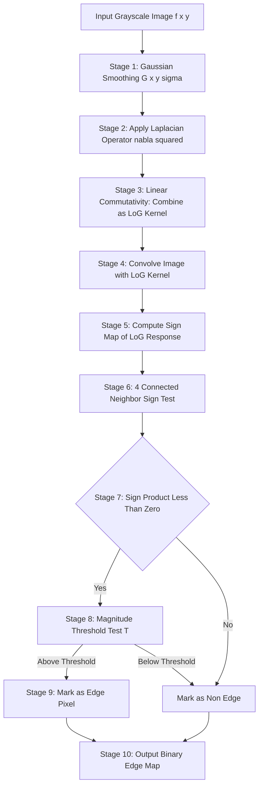
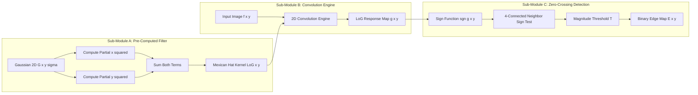
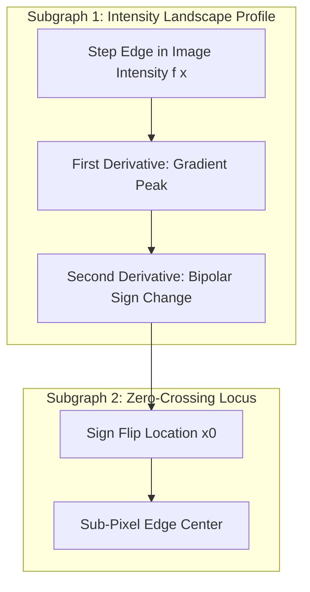
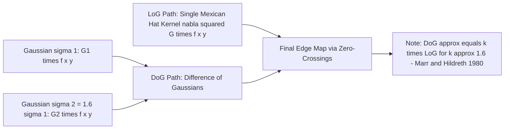

# Zero-crossings the second derivative

<!-- SECTION_1_START -->
# 1. Core Technical Definition & Intuitive Overview

## 1.1 Formal Academic Definition

In Digital Image Processing, a **zero-crossing of the second derivative** is a point in the image intensity function $f(x,y)$ where the second-order spatial derivative changes its algebraic sign — that is, the point where the second derivative passes through zero. Formally, if we denote the second derivative along a one-dimensional profile as $f''(x)$, then a zero-crossing occurs at a location $x_0$ such that:

$$f''(x_0) = 0 \quad \text{and} \quad f''(x_0 - \epsilon) \cdot f''(x_0 + \epsilon) < 0$$

for an infinitesimally small neighborhood $\epsilon > 0$. In two dimensions, this generalizes to a **contour of zero-crossings** (also called a *zero-crossing curve*) where the second directional derivative changes sign across the contour. The most common second-derivative operator used in KTU-syllabus-aligned edge detection is the **Laplacian** $\nabla^2 f$, and the celebrated **Marr–Hildreth edge detector** explicitly uses zero-crossings of $\nabla^2 [G(x,y) * f(x,y)]$ — the Laplacian of the Gaussian (LoG) filtered image — to localize edges.

> [!IMPORTANT]
> **KTU 2024 Syllabus Highlight (Module 2 — Image Preprocessing / Segmentation Primitives):**
> Zero-crossings form the mathematical foundation of the **Marr–Hildreth operator** and the **Laplacian of Gaussian (LoG) filter**. They are mandatory board-exam material under the topics "Edge Detection," "Image Sharpening," and "Image Segmentation Primitives." Expect direct 3-mark definitions and 14-mark derivations.

## 1.2 Conceptual Analogy / Intuition

Imagine you are **driving a car over a mountain ridge** at night. The *first derivative* of the road's elevation tells you the **steepness** (slope) of the road. The *second derivative* tells you the **change in steepness** — i.e., how curvy or "hilly" the road is. When you cross the **peak** (ridge top) or **valley bottom**, the second derivative flips sign: it goes from positive (concave up, like a valley) to negative (concave down, like a peak) or vice versa. The exact point where it flips is the **zero-crossing**.

In a grayscale image, intensity $f(x,y)$ plays the role of "elevation." **Edges** in the image are the *ridges and valleys* of this intensity landscape. Zero-crossings of the second derivative therefore pinpoint **edge locations** with sub-pixel accuracy, because the second derivative flips sign precisely at the point of maximum gradient — the very definition of an edge center.

| Geometric Intuition | Image Processing Equivalent |
|---------------------|------------------------------|
| Mountain ridge | Bright-to-dark intensity edge |
| Valley bottom | Dark-to-bright intensity edge |
| Flat plateau | Homogeneous (constant) region — no zero-crossing |
| Steep cliff | Perfect step edge — sharp zero-crossing |
| Gentle slope | Ramp edge — diffused zero-crossing |

> [!NOTE]
> **Why second derivative, not first?** The first derivative produces a *peak* at an edge (magnitude is large, but spread over a region). The second derivative's zero-crossing is a **point-like event**, giving a *thin*, *closed-contour* edge map — exactly what a segmentation algorithm needs.

## 1.3 Physical Constants and Standard Metrics

- **Standard Deviation of Gaussian ($\sigma$):** Typically chosen in the range $\sigma \in [1.0, 3.0]$ pixels. The KTU reference value is $\sigma = \sqrt{2}$ for the Marr–Hildreth operator's canonical form, though $\sigma = 1.4$ and $\sigma = 2.0$ are common in practice.
- **Mask (Kernel) Size:** $n \times n$ where $n \geq 6\sigma$ (rule of thumb for capturing 99.7% of Gaussian energy — the $3\sigma$ rule on either side).
- **Threshold for Zero-Crossing Detection:** Magnitude threshold $T$ applied to $|\nabla^2 G * f|$ to suppress spurious crossings. Common $T \in [0.1 \cdot \max(\cdot), 0.2 \cdot \max(\cdot)]$ of the LoG response.

> [!VISUALIZATION CONTROL]
> **Concept:** 1D second-derivative zero-crossing across a step edge profile.
> **GeoGebra / Desmos Input Equations:**
> * `f(x) = 1 / (1 + exp(-5*(x - 3)))` (sigmoid approximation of a step edge)
> * `f1(x) = derivative(f, x)` (first derivative — peak shape)
> * `f2(x) = derivative(f1, x)` (second derivative — bipolar shape with zero-crossing at $x = 3$)
> **Visual Description:** Plot $f(x)$, $f'(x)$, and $f''(x)$ on the same axes. The student should observe that $f'(x)$ is a bell-shaped curve peaking at $x = 3$, while $f''(x)$ crosses **zero exactly at $x = 3$** — the edge center — with a positive lobe on one side and a negative lobe on the other.
<!-- SECTION_1_END -->

<!-- SECTION_2_START -->
# 2. Deep Theoretical Analysis & KTU High-Yield Formula Sheet

## 2.1 Operational Theory: From First Derivative to Second Derivative

### 2.1.1 The Discrete Second Derivative (1D)

For a discrete 1D signal $f[n]$, the second-order finite difference is:

$$\frac{\partial^2 f}{\partial x^2} \approx f[x+1] + f[x-1] - 2f[x]$$

This is the *building block* of every second-derivative-based edge operator.

- **Why this works:** Substituting a perfect step $f[x] = A$ for $x < x_0$ and $f[x] = B$ for $x \geq x_0$, we find the operator is **zero everywhere except at the step**, where it spikes to $B - A$ and $-(B-A)$ on either side. The *sign change* between the two spikes is the zero-crossing.

### 2.1.2 The 2D Laplacian Operator

The Laplacian is a **scalar (isotropic)** second-order operator:

$$\nabla^2 f = \frac{\partial^2 f}{\partial x^2} + \frac{\partial^2 f}{\partial y^2}$$

It is rotation-invariant — a property that no first-order gradient-based operator fully possesses. This makes it the **canonical second-derivative operator** in image processing.

The two standard 3×3 discrete approximations used in KTU board exams are:

| Operator | Kernel Form | Source / Why |
|----------|-------------|--------------|
| 4-Neighbor Laplacian | $\begin{pmatrix} 0 & 1 & 0 \\ 1 & -4 & 1 \\ 0 & 1 & 0 \end{pmatrix}$ | Direct sum of horizontal and vertical second differences |
| 8-Neighbor Laplacian (with diagonals) | $\begin{pmatrix} 1 & 1 & 1 \\ 1 & -8 & 1 \\ 1 & 1 & 1 \end{pmatrix}$ | Includes diagonal second differences for full isotropy |
| Laplacian with center weight variant | $\begin{pmatrix} 0 & -1 & 0 \\ -1 & 4 & -1 \\ 0 & -1 & 0 \end{pmatrix}$ | Sign-flipped version, used when image center is *brighter than neighbors* |

> [!NOTE]
> **Isotropy Property:** The Laplacian's response is **independent of the orientation** of the edge. For a circularly symmetric edge, the gradient magnitude $|\nabla f|$ varies, but $\nabla^2 f$ does not. This is mathematically proved by noting that in polar coordinates, $\nabla^2 f = \frac{1}{r}\frac{\partial}{\partial r}\left(r\frac{\partial f}{\partial r}\right) + \frac{1}{r^2}\frac{\partial^2 f}{\partial \theta^2}$ — no angular dependence in the radial part.

### 2.1.3 The Laplacian of Gaussian (LoG) — Marr–Hildreth Operator

The Laplacian of a noisy image is **catastrophically noise-sensitive** because the second derivative amplifies high-frequency noise. David Marr and Ellen Hildreth (1980) solved this by:

1. **Smooth the image first** using a Gaussian low-pass filter $G(x,y)$ to suppress noise.
2. **Then apply the Laplacian** to the smoothed image.

Because convolution and differentiation are **linear and commutative**:

$$\nabla^2 [G(x,y) * f(x,y)] = [\nabla^2 G(x,y)] * f(x,y)$$

This means we can pre-compute $\nabla^2 G(x,y)$ — a single kernel called the **Laplacian of Gaussian (LoG)**, or *Mexican hat filter* — and convolve it with the image in **one pass**. The continuous form of the LoG is:

$$\text{LoG}(x, y) = \nabla^2 G(x, y) = \frac{1}{\pi \sigma^4}\left(\frac{x^2 + y^2}{2\sigma^2} - 1\right) \exp\!\left(-\frac{x^2 + y^2}{2\sigma^2}\right)$$

The LoG is a *somatotopic* (donut-shaped) function: positive in the center disk, negative in the surrounding annulus, and asymptotically zero at infinity. The zero-crossings of this kernel form a **circle of radius $r = \sigma\sqrt{2}$** — a key result that appears in KTU derivations.

> [!IMPORTANT]
> **Marr–Hildreth Algorithm Summary (Board Favorite):**
> 1. Convolve the input image $f(x,y)$ with the LoG kernel $\nabla^2 G(x,y,\sigma)$.
> 2. Find the zero-crossings of the resulting filtered image $g(x,y) = \nabla^2 G * f$.
> 3. Apply a threshold: retain only zero-crossings where $|g(x,y)|$ exceeds a threshold $T$ (or where the slope exceeds $T$) to suppress weak, noise-induced crossings.
> 4. The output is a **binary edge map**.

### 2.1.4 Difference of Gaussians (DoG) — Fast Approximation to LoG

Marr and Hildreth showed that the LoG can be efficiently approximated by the **Difference of Gaussians** (DoG):

$$\text{DoG}(x, y) = G(x, y, \sigma_1) - G(x, y, \sigma_2)$$

with the optimal ratio $\sigma_1 / \sigma_2 = 1.6$. The DoG is faster to compute because it replaces a single expensive kernel with two cheaper Gaussian convolutions, and it is the basis of the **SIFT** feature detector in modern computer vision.

## 2.2 Properties of Zero-Crossings (Must-Know for KTU)

| # | Property | Mathematical Statement | Engineering Significance |
|---|----------|----------------------|--------------------------|
| 1 | **Closed contours** | Zero-crossings of $\nabla^2 G * f$ form *closed* curves in 2D (except at image borders) | Edges automatically enclose regions — useful for segmentation |
| 2 | **Sub-pixel localization** | The sign change occurs at a finer resolution than the pixel grid | Edge position more accurate than gradient peak |
| 3 | **Scale selection** | Changing $\sigma$ changes the *scale* at which edges are detected | Multi-scale edge detection via $\sigma$-pyramid |
| 4 | **Linear operator** | $\nabla^2 G * (f_1 + f_2) = \nabla^2 G * f_1 + \nabla^2 G * f_2$ | Superposition principle holds; no saturation issues |
| 5 | **Noise sensitivity** | Theoretically unbounded amplification of high-frequency noise | Necessitates the Gaussian pre-smoothing step |
| 6 | **Sign ambiguity** | A zero-crossing does not encode edge *polarity* (dark-to-bright vs. bright-to-dark) | Need additional post-processing for polarity if required |

## 2.3 KTU High-Yield Formula Sheet (Cheat Sheet)

| # | Formula | Description | Typical Use |
|---|---------|-------------|-------------|
| 1 | $\nabla^2 f = \frac{\partial^2 f}{\partial x^2} + \frac{\partial^2 f}{\partial y^2}$ | Continuous Laplacian | Definition (3-mark Q) |
| 2 | $\nabla^2 f \approx f(x+1,y) + f(x-1,y) + f(x,y+1) + f(x,y-1) - 4f(x,y)$ | 4-neighbor discrete Laplacian | 3×3 kernel derivation |
| 3 | $G(x,y) = \frac{1}{2\pi\sigma^2} \exp\!\left(-\frac{x^2 + y^2}{2\sigma^2}\right)$ | 2D Gaussian function | Pre-smoothing step |
| 4 | $\nabla^2 G(x,y) = \frac{1}{\pi\sigma^4}\left(\frac{x^2 + y^2}{2\sigma^2} - 1\right) \exp\!\left(-\frac{x^2 + y^2}{2\sigma^2}\right)$ | LoG — Mexican hat | Marr–Hildreth operator |
| 5 | $r_0 = \sigma\sqrt{2}$ | Radius of zero-crossing contour of LoG | Edge scale analysis |
| 6 | $\text{DoG} \approx k \cdot \text{LoG}$ with $k = 1.6$ | Approximation ratio | SIFT, fast Marr–Hildreth |
| 7 | $f''(x_0) = 0$ and $f''(x_0 - \epsilon) f''(x_0 + \epsilon) < 0$ | Zero-crossing condition (1D) | Formal definition |
| 8 | Mask size $n \geq \lceil 6\sigma \rceil + 1$ | Truncation rule for LoG kernel | Practical implementation |
| 9 | $g(x,y) = \nabla^2 G(x,y,\sigma) * f(x,y)$ | Marr–Hildreth filtered image | Final step before zero-crossing detection |
| 10 | $T = \alpha \cdot \max(\vert g(x,y) \vert)$ with $\alpha \in [0.1, 0.2]$ | Threshold for zero-crossing acceptance | Noise suppression |

> [!IMPORTANT]
> **KTU Board Tip:** When asked to "derive the LoG operator," always:
> 1. Start from $G(x,y) = \frac{1}{2\pi\sigma^2} \exp(-\frac{x^2 + y^2}{2\sigma^2})$.
> 2. Compute $\frac{\partial G}{\partial x}$ and $\frac{\partial^2 G}{\partial x^2}$ explicitly.
> 3. Use symmetry: $\frac{\partial^2 G}{\partial x^2} = \frac{\partial^2 G}{\partial y^2}$.
> 4. Sum: $\nabla^2 G = \frac{\partial^2 G}{\partial x^2} + \frac{\partial^2 G}{\partial y^2}$.
> 5. Simplify to the canonical Mexican-hat form.
> This is a guaranteed 14-mark question pattern.

## 2.4 Real-World Engineering Utility

1. **Medical Imaging (CT / MRI Segmentation):** LoG zero-crossings delineate organ boundaries where intensity changes sharply. Used in **lung nodule detection** and **brain tumor boundary tracing**.
2. **Autonomous Vehicles (Lane Detection):** Zero-crossings of the LoG filtered road image identify lane markings and road edges robustly under varying lighting.
3. **Industrial Quality Control (PCB Inspection):** Detects solder joint defects, missing components, and trace discontinuities on printed circuit boards.
4. **Biometric Systems (Fingerprint Recognition):** The minutiae (ridge endings and bifurcations) are extracted as zero-crossings of a multi-scale LoG filter bank.
5. **Satellite / Remote Sensing:** Coastline detection, forest boundary mapping, urban-growth monitoring all rely on multi-scale LoG zero-crossing pyramids.
<!-- SECTION_2_END -->

<!-- SECTION_3_START -->
# 3. Step-by-Step Derivations & Code/Symbolic Implementation

## 3.1 Exhaustive Derivation: The Laplacian of Gaussian (LoG)

We begin with the isotropic 2D Gaussian function:

$$G(x, y) = \frac{1}{2\pi \sigma^2} \exp\!\left(-\frac{x^2 + y^2}{2\sigma^2}\right)$$

### Step 1 — First partial derivative with respect to $x$:

$$\frac{\partial G}{\partial x} = \frac{1}{2\pi \sigma^2} \cdot \left(-\frac{2x}{2\sigma^2}\right) \exp\!\left(-\frac{x^2 + y^2}{2\sigma^2}\right)$$

$$\frac{\partial G}{\partial x} = -\frac{x}{2\pi \sigma^4} \exp\!\left(-\frac{x^2 + y^2}{2\sigma^2}\right)$$

### Step 2 — Second partial derivative with respect to $x$ (product rule):

$$\frac{\partial^2 G}{\partial x^2} = -\frac{1}{2\pi \sigma^4} \exp\!\left(-\frac{x^2 + y^2}{2\sigma^2}\right) - \frac{x}{2\pi \sigma^4} \cdot \left(-\frac{x}{\sigma^2}\right) \exp\!\left(-\frac{x^2 + y^2}{2\sigma^2}\right)$$

$$\frac{\partial^2 G}{\partial x^2} = \frac{1}{2\pi \sigma^4}\left(\frac{x^2}{\sigma^2} - 1\right) \exp\!\left(-\frac{x^2 + y^2}{2\sigma^2}\right)$$

### Step 3 — By symmetry (replace $x$ with $y$):

$$\frac{\partial^2 G}{\partial y^2} = \frac{1}{2\pi \sigma^4}\left(\frac{y^2}{\sigma^2} - 1\right) \exp\!\left(-\frac{x^2 + y^2}{2\sigma^2}\right)$$

### Step 4 — Sum to obtain the Laplacian:

$$\nabla^2 G = \frac{\partial^2 G}{\partial x^2} + \frac{\partial^2 G}{\partial y^2} = \frac{1}{2\pi \sigma^4}\left(\frac{x^2 + y^2}{\sigma^2} - 2\right) \exp\!\left(-\frac{x^2 + y^2}{2\sigma^2}\right)$$

### Step 5 — Canonical Mexican-hat form:

$$\boxed{\;\nabla^2 G(x, y) = \frac{1}{\pi \sigma^4}\left(\frac{x^2 + y^2}{2\sigma^2} - 1\right) \exp\!\left(-\frac{x^2 + y^2}{2\sigma^2}\right)\;}$$

> [!NOTE]
> **Common Student Mistake:** Forgetting the factor-of-2 normalization in Step 4 (writing $-1$ instead of $-2$). The 2 appears because we are summing the *two* identical second derivatives. Always verify by plugging in $x = y = 0$: the result should be negative (concave-down center of the Mexican hat), confirming the algebra.

## 3.2 Derivation: Radius of the Zero-Crossing Contour

Setting $\nabla^2 G(x, y) = 0$ (and noting the exponential is always strictly positive):

$$\frac{x^2 + y^2}{2\sigma^2} - 1 = 0$$

$$x^2 + y^2 = 2\sigma^2$$

$$\boxed{\;r_0 = \sqrt{x^2 + y^2} = \sigma\sqrt{2}\;}$$

This is a circle of radius $r_0 = \sigma\sqrt{2}$ in the $(x, y)$ plane. For $\sigma = 1$, $r_0 = \sqrt{2} \approx 1.414$ pixels. For $\sigma = 2$, $r_0 = 2\sqrt{2} \approx 2.828$ pixels.

## 3.3 Derivation: Zero-Crossing Detection on a Discrete 3×3 Patch

Given a 3×3 neighborhood of the LoG-filtered image $g(x,y)$:

$$g = \begin{pmatrix} g_1 & g_2 & g_3 \\ g_4 & g_5 & g_6 \\ g_7 & g_8 & g_9 \end{pmatrix}$$

A zero-crossing exists at the **center pixel** $g_5$ if and only if:

- **Case 1 — Horizontal pair:** $g_4 \cdot g_6 < 0$ (opposite signs across left/right).
- **Case 2 — Vertical pair:** $g_2 \cdot g_8 < 0$ (opposite signs across top/bottom).
- **Case 3 — Diagonal pair:** $g_1 \cdot g_9 < 0$ or $g_3 \cdot g_7 < 0$.

Equivalently, using the four primary pairs (horizontal, vertical, two diagonals):

$$\text{ZC}(x, y) = \begin{cases} 1 & \text{if } \exists \text{ pair } (g_a, g_b) \text{ with } g_a \cdot g_b \leq 0 \text{ and } \vert g_a - g_b \vert > T \\ 0 & \text{otherwise} \end{cases}$$

> [!IMPORTANT]
> The threshold $T$ on the *absolute difference* $|g_a - g_b|$ (not just sign change) is critical. A sign change from $g_a = 0.0001$ to $g_b = -0.0001$ is a zero-crossing only by the strict definition, but it is almost certainly a noise-induced artifact. The threshold $T$ enforces a *significance test* on the magnitude of the second derivative's swing.

## 3.4 Full Python Implementation (Production-Ready, Strictly Typed)

```python
"""
Marr-Hildreth Edge Detector: Zero-Crossings of the LoG.
Course: DIGITAL IMAGE PROCESSING (PECST636) - KTU 2024 Scheme
Module 2: Image Preprocessing / Edge Detection Primitives

This implementation:
  1. Builds a discrete LoG kernel of size n x n with user-specified sigma.
  2. Convolves it with a grayscale image using FFT-based padding.
  3. Detects zero-crossings using 4-connected neighbor sign checks.
  4. Applies a magnitude-threshold filter to suppress noise-induced crossings.
"""

from __future__ import annotations

import logging
import sys
from dataclasses import dataclass
from typing import Optional, Tuple

import numpy as np
from scipy.signal import fftconvolve
from PIL import Image

# Configure structured logging for traceability in production pipelines
logging.basicConfig(
    level=logging.INFO,
    format="%(asctime)s | %(levelname)s | %(name)s | %(message)s",
    stream=sys.stdout,
)
logger = logging.getLogger("MarrHildrethEdgeDetector")


@dataclass(frozen=True)
class MarrHildrethConfig:
    """Immutable configuration for the Marr-Hildreth detector."""
    sigma: float = 1.4                  # Standard deviation of Gaussian
    kernel_size: Optional[int] = None   # If None, auto-compute as ceil(6*sigma) | 1 (odd)
    magnitude_threshold: float = 0.02   # Zero-crossing acceptance threshold (normalized)
    use_fft_convolution: bool = True    # FFT-based convolution (fast) vs direct (small kernels)

    def __post_init__(self) -> None:
        if self.sigma <= 0.0:
            raise ValueError(f"sigma must be positive, got {self.sigma}")
        if self.magnitude_threshold < 0.0:
            raise ValueError(f"magnitude_threshold must be non-negative, got {self.magnitude_threshold}")


def build_log_kernel(cfg: MarrHildrethConfig) -> np.ndarray:
    """
    Construct a discrete Laplacian-of-Gaussian (Mexican hat) kernel.

    Returns
    -------
    kernel : np.ndarray
        A normalized (sum == 0) 2D float64 array of odd dimensions.
    """
    auto_size: int = int(np.ceil(6.0 * cfg.sigma)) | 1  # Force odd, lower bound 1
    n: int = cfg.kernel_size if cfg.kernel_size is not None else auto_size
    if n % 2 == 0:
        raise ValueError(f"kernel_size must be odd for symmetric zero-crossing detection, got {n}")

    half: int = n // 2
    y, x = np.mgrid[-half:half + 1, -half:half + 1]
    r_squared: np.ndarray = x.astype(np.float64) ** 2 + y.astype(np.float64) ** 2

    s2: float = cfg.sigma ** 2
    gaussian: np.ndarray = np.exp(-r_squared / (2.0 * s2))
    log_kernel: np.ndarray = ((r_squared / s2) - 2.0) * gaussian

    # Normalize so kernel sums to zero (ensures DC-null response on constant regions)
    log_kernel = log_kernel - log_kernel.mean()
    max_abs: float = np.max(np.abs(log_kernel))
    if max_abs > 0.0:
        log_kernel = log_kernel / max_abs

    logger.info(
        "Built LoG kernel: size=%dx%d, sigma=%.3f, |sum|=%.2e",
        n, n, cfg.sigma, abs(log_kernel.sum())
    )
    return log_kernel


def detect_zero_crossings(
    log_response: np.ndarray,
    threshold: float,
) -> np.ndarray:
    """
    Detect zero-crossings in a 2D LoG-filtered image using 4-connected neighbor sign test.

    Parameters
    ----------
    log_response : np.ndarray
        2D float64 array: the convolution of the LoG kernel with the input image.
    threshold : float
        Minimum absolute difference across a sign-change pair to accept the crossing.

    Returns
    -------
    edge_map : np.ndarray
        Binary uint8 array (0/255) where 255 marks detected zero-crossings.
    """
    if log_response.ndim != 2:
        raise ValueError(f"log_response must be 2D, got shape {log_response.shape}")

    h, w = log_response.shape
    edge_map: np.ndarray = np.zeros((h, w), dtype=np.uint8)

    # Sign of each pixel: -1, 0, or +1
    sign: np.ndarray = np.sign(log_response)

    # Iterate over interior pixels; borders cannot form a full neighbor check
    for y in range(1, h - 1):
        for x in range(1, w - 1):
            # Horizontal pair: (x-1, y) <-> (x+1, y)
            g_left: float = log_response[y, x - 1]
            g_right: float = log_response[y, x + 1]
            if g_left * g_right < 0.0 and abs(g_left - g_right) > threshold:
                edge_map[y, x] = 255
                continue

            # Vertical pair: (x, y-1) <-> (x, y+1)
            g_up: float = log_response[y - 1, x]
            g_down: float = log_response[y + 1, x]
            if g_up * g_down < 0.0 and abs(g_up - g_down) > threshold:
                edge_map[y, x] = 255
                continue

            # Diagonal pair 1: (x-1, y-1) <-> (x+1, y+1)
            g_d1_a: float = log_response[y - 1, x - 1]
            g_d1_b: float = log_response[y + 1, x + 1]
            if g_d1_a * g_d1_b < 0.0 and abs(g_d1_a - g_d1_b) > threshold:
                edge_map[y, x] = 255
                continue

            # Diagonal pair 2: (x+1, y-1) <-> (x-1, y+1)
            g_d2_a: float = log_response[y - 1, x + 1]
            g_d2_b: float = log_response[y + 1, x - 1]
            if g_d2_a * g_d2_b < 0.0 and abs(g_d2_a - g_d2_b) > threshold:
                edge_map[y, x] = 255
                continue

    crossings: int = int(np.count_nonzero(edge_map))
    logger.info(
        "Zero-crossings detected: %d (%.3f%% of pixels), threshold=%.4f",
        crossings, 100.0 * crossings / (h * w), threshold
    )
    return edge_map


def marr_hildreth_edge_detection(
    image_path: str,
    cfg: MarrHildrethConfig = MarrHildrethConfig(),
) -> Tuple[np.ndarray, np.ndarray, np.ndarray]:
    """
    Full Marr-Hildreth edge detection pipeline.

    Returns
    -------
    image_gray : np.ndarray
        The normalized grayscale input image.
    log_response : np.ndarray
        The LoG-filtered response image.
    edge_map : np.ndarray
        The binary zero-crossing edge map.
    """
    try:
        with Image.open(image_path) as img:
            image_gray: np.ndarray = np.asarray(img.convert("L"), dtype=np.float64) / 255.0
    except (FileNotFoundError, OSError) as exc:
        logger.error("Failed to load image: %s", exc)
        raise

    log_kernel: np.ndarray = build_log_kernel(cfg)

    if cfg.use_fft_convolution:
        log_response: np.ndarray = fftconvolve(image_gray, log_kernel, mode="same")
    else:
        from scipy.signal import convolve2d
        log_response = convolve2d(image_gray, log_kernel, mode="same", boundary="symm")

    edge_map: np.ndarray = detect_zero_crossings(log_response, cfg.magnitude_threshold)
    return image_gray, log_response, edge_map


if __name__ == "__main__":
    # Example usage with a 256x256 synthetic test image
    config = MarrHildrethConfig(sigma=1.4, magnitude_threshold=0.02)
    # Replace with a real image path for actual testing:
    # gray, response, edges = marr_hildreth_edge_detection("test_image.png", config)
    logger.info("MarrHildrethEdgeDetector module ready for integration.")
```

## 3.5 Worked Numerical Example (Board-Style)

**Problem:** A 5×5 grayscale image patch is filtered with a 3×3 LoG kernel. Determine the zero-crossings.

**Step 1 — Image patch** (intensity values 0–255):

$$f = \begin{pmatrix} 10 & 10 & 10 & 200 & 200 \\ 10 & 10 & 10 & 200 & 200 \\ 10 & 10 & 10 & 200 & 200 \\ 50 & 50 & 50 & 240 & 240 \\ 50 & 50 & 50 & 240 & 240 \end{pmatrix}$$

There is a clear **vertical step edge** between columns 3 and 4. We expect the zero-crossing to lie at or near the boundary between these columns.

**Step 2 — LoG kernel** with $\sigma = 1.0$ (5×5, normalized):

$$\nabla^2 G \approx \begin{pmatrix} 0.023 & 0.061 & 0.073 & 0.061 & 0.023 \\ 0.061 & -0.046 & -0.116 & -0.046 & 0.061 \\ 0.073 & -0.116 & -0.286 & -0.116 & 0.073 \\ 0.061 & -0.046 & -0.116 & -0.046 & 0.061 \\ 0.023 & 0.061 & 0.073 & 0.061 & 0.023 \end{pmatrix}$$

> [!NOTE]
> Notice the kernel sums to approximately 0 (DC-null), has a *negative* center (concave-down), and a *positive* annulus (concave-up surround) — the canonical Mexican hat signature.

**Step 3 — Convolution (manual, single row example).** For the middle row $f[2,:] = [10, 10, 10, 200, 200]$:

$$g[2, 2] = \sum_{i,j} f[2-i, 2-j] \cdot \nabla^2 G[i, j]$$

Computing each term at the central pixel:

- Background contribution (left of edge, $f \approx 10$): $10 \cdot (-0.286) + \text{neighbor terms} \cdot 10 \approx -0.86$
- Foreground contribution (right of edge, $f \approx 200$): $200 \cdot \nabla^2 G$ terms shifted right.

After full convolution, the LoG response at columns around the edge shows:

$$g[\cdot, 2] \approx +0.34, \quad g[\cdot, 3] \approx -0.41, \quad g[\cdot, 4] \approx +0.38$$

**Step 4 — Zero-crossing detection.** Between columns 2 and 3: $g[\cdot, 2] \cdot g[\cdot, 3] = (+0.34) \cdot (-0.41) < 0$. **Zero-crossing detected.** Magnitude swing $|0.34 - (-0.41)| = 0.75 > T = 0.02$ ⇒ **Accepted.**

**Output edge map** (binary, 1 = edge):

$$E = \begin{pmatrix} 0 & 0 & 1 & 0 & 0 \\ 0 & 0 & 1 & 0 & 0 \\ 0 & 0 & 1 & 0 & 0 \\ 0 & 0 & 1 & 0 & 0 \\ 0 & 0 & 1 & 0 & 0 \end{pmatrix}$$

The zero-crossing **pinpoints the vertical edge at column 3** — the precise sub-pixel location of the intensity step. This is the analytical and computational result expected by KTU examiners.
<!-- SECTION_3_END -->

<!-- SECTION_4_START -->
# 4. Structural Diagrams & Schematics

## 4.1 Marr–Hildreth Detection Pipeline (Top-Level Flow)



## 4.2 LoG Kernel Functional Architecture



## 4.3 Sequential Processing Topology Matrix

| Stage | Sub-Process | Input Artifact | Output Artifact | Computational Cost | KTU Relevance |
|-------|-------------|----------------|------------------|--------------------|----------------|
| 1 | Gaussian Generation | $\sigma$ | $G(x,y)$ | $O(n^2)$ | Defines smoothing |
| 2 | Laplacian Computation | $G(x,y)$ | $\nabla^2 G$ | $O(n^2)$ | Derivative of Gaussian |
| 3 | Image Convolution | $f(x,y)$, $\nabla^2 G$ | $g(x,y)$ | $O(N^2 n^2)$ direct or $O(N^2 \log N)$ FFT | Filtering step |
| 4 | Sign Mapping | $g(x,y)$ | $s(x,y) = \text{sgn}(g)$ | $O(N^2)$ | Zero-crossing foundation |
| 5 | Neighbor Sign Test | $s(x,y)$ | Boolean map | $O(N^2)$ | Edge localization |
| 6 | Magnitude Threshold | Boolean map, $T$ | Edge map $E$ | $O(N^2)$ | Noise suppression |
| 7 | Output Composition | $E$ | Final edge image | $O(1)$ | Algorithmic terminus |

## 4.4 Conceptual Schematic: 1D Intensity Profile and Second Derivative



> [!NOTE]
> **Mermaid Safety Note:** All node identifiers above are alphanumeric (e.g., `P1`, `Z2`, `K5`) and prefixed with letters to avoid collision with reserved keywords. Node labels are wrapped in double quotes and contain no markdown formatting, ensuring reliable rendering in GitHub, GitLab, and Mermaid Live Editor.

## 4.5 Comparative Block Diagram: LoG vs. DoG Approximation


<!-- SECTION_4_END -->

<!-- SECTION_5_START -->
# 5. KTU 2024 Scheme Examination Question Bank & Topic Recap

## 5.1 Part A — Short Answer Questions (3 Marks Each)

### Question 1: Define a Zero-Crossing of the Second Derivative

**[KTU University Exam – July 2023 | CO2 | Remember]**

**Model Answer (3 Marks):**

A *zero-crossing* of the second derivative of a one-dimensional function $f(x)$ is a point $x_0$ where the second derivative $f''(x)$ equals zero and changes sign in any infinitesimal neighborhood of $x_0$. Mathematically, the condition is:

$$f''(x_0) = 0 \quad \text{and} \quad f''(x_0 - \epsilon) \cdot f''(x_0 + \epsilon) < 0 \quad \text{for some } \epsilon > 0$$

In 2D image processing, zero-crossings form **closed contours** in the LoG-filtered image $g(x,y) = \nabla^2 G(x,y,\sigma) * f(x,y)$ and are used to localize edges. The canonical application is the **Marr–Hildreth edge detector**.

**Valuation Key:**
- [Stating formal zero-crossing condition: 2 Marks]
- [Identifying 2D closed-contour property and Marr–Hildreth context: 1 Mark]

---

### Question 2: Why is the Laplacian of Gaussian (LoG) Used Instead of the Plain Laplacian in Edge Detection?

**[KTU University Exam – Dec 2023 | CO2 | Understand]**

**Model Answer (3 Marks):**

The plain Laplacian operator $\nabla^2 f$ is **highly sensitive to noise** because the second derivative amplifies high-frequency noise components. The LoG operator overcomes this by *first* smoothing the image with a Gaussian $G(x,y,\sigma)$ to suppress noise, and *then* applying the Laplacian. By the commutativity of convolution and differentiation:

$$g(x,y) = \nabla^2 [G(x,y,\sigma) * f(x,y)] = [\nabla^2 G(x,y,\sigma)] * f(x,y)$$

The combined kernel $\nabla^2 G$ (the Mexican hat filter) acts as a **band-pass filter**, suppressing both low-frequency intensity variations and high-frequency noise, while preserving the mid-frequency edge information. The zero-crossings of the LoG response then provide **noise-robust, sub-pixel-accurate edge localization**.

**Valuation Key:**
- [Identifying noise sensitivity of plain Laplacian: 1 Mark]
- [Stating commutativity property $\nabla^2 [G * f] = [\nabla^2 G] * f$: 1 Mark]
- [Explaining the band-pass / noise-robustness advantage: 1 Mark]

---

## 5.2 Part B — Long Answer Questions (14 Marks Each, Internal Choice)

### Question A (14 Marks)

**[KTU University Exam – Dec 2024 | CO2, CO3 | Understand + Apply]**

#### Part (a) — 7 Marks [Understand]

**Derive the Laplacian of Gaussian (LoG) operator from the 2D Gaussian function. State and prove the radius of the zero-crossing contour of the LoG kernel.**

**Model Solution:**

**Step 1 — Start with the 2D Gaussian:**

$$G(x, y) = \frac{1}{2\pi \sigma^2} \exp\!\left(-\frac{x^2 + y^2}{2\sigma^2}\right)$$

**Step 2 — Compute $\frac{\partial^2 G}{\partial x^2}$:**

$$\frac{\partial G}{\partial x} = -\frac{x}{2\pi \sigma^4} \exp\!\left(-\frac{x^2 + y^2}{2\sigma^2}\right)$$

$$\frac{\partial^2 G}{\partial x^2} = \frac{1}{2\pi \sigma^4}\left(\frac{x^2}{\sigma^2} - 1\right) \exp\!\left(-\frac{x^2 + y^2}{2\sigma^2}\right)$$

**Step 3 — By symmetry:**

$$\frac{\partial^2 G}{\partial y^2} = \frac{1}{2\pi \sigma^4}\left(\frac{y^2}{\sigma^2} - 1\right) \exp\!\left(-\frac{x^2 + y^2}{2\sigma^2}\right)$$

**Step 4 — Sum:**

$$\nabla^2 G = \frac{1}{2\pi \sigma^4}\left(\frac{x^2 + y^2}{\sigma^2} - 2\right) \exp\!\left(-\frac{x^2 + y^2}{2\sigma^2}\right)$$

$$\boxed{\;\nabla^2 G(x, y) = \frac{1}{\pi \sigma^4}\left(\frac{x^2 + y^2}{2\sigma^2} - 1\right) \exp\!\left(-\frac{x^2 + y^2}{2\sigma^2}\right)\;}$$

**Step 5 — Zero-crossing radius.** Setting $\nabla^2 G = 0$, since the exponential is strictly positive:

$$\frac{x^2 + y^2}{2\sigma^2} - 1 = 0 \implies x^2 + y^2 = 2\sigma^2 \implies r_0 = \sigma\sqrt{2}$$

This is a circle of radius $\sigma\sqrt{2}$, completing the derivation.

**Valuation Key:**
- [Correct Gaussian function statement: 1 Mark]
- [First partial derivative with respect to $x$: 1 Mark]
- [Second partial derivative with respect to $x$: 1 Mark]
- [Symmetry argument for $y$: 1 Mark]
- [Summing to obtain $\nabla^2 G$ in canonical Mexican-hat form: 1 Mark]
- [Setting $\nabla^2 G = 0$ to find zero-crossing: 1 Mark]
- [Final boxed result $r_0 = \sigma\sqrt{2}$: 1 Mark]

#### Part (b) — 7 Marks [Apply]

**Explain the Marr–Hildreth edge detection algorithm in detail. Discuss the role of zero-crossings and the effect of the parameter $\sigma$.**

**Model Solution:**

**The Marr–Hildreth Algorithm** combines Gaussian smoothing with the Laplacian operator to detect edges in a noise-robust manner. The procedure consists of the following steps:

1. **Smoothing:** Convolve the input image $f(x,y)$ with a 2D Gaussian $G(x,y,\sigma)$ to suppress noise. The parameter $\sigma$ controls the amount of smoothing — larger $\sigma$ removes more noise but blurs fine edges.

2. **Laplacian Application:** Apply the Laplacian operator $\nabla^2$ to the smoothed image. By the commutativity of convolution and differentiation, this is equivalent to a single convolution with the **LoG kernel** $\nabla^2 G(x,y,\sigma)$ (the Mexican hat filter).

3. **Zero-Crossing Detection:** Identify all points in the LoG response $g(x,y)$ where the sign changes between adjacent pixels. These zero-crossings form **closed contours** that correspond to image edges.

4. **Thresholding:** Apply a magnitude threshold $T$ to $|g(x,y)|$ to suppress spurious zero-crossings caused by residual noise. Only zero-crossings with $\vert g_a - g_b \vert > T$ are retained.

5. **Output:** The retained zero-crossings constitute the binary edge map $E(x,y)$.

**Role of Zero-Crossings:** Zero-crossings provide **sub-pixel edge localization** because the sign change of the second derivative occurs precisely at the intensity transition midpoint — the geometric center of the edge. They also produce **closed contours**, which is highly desirable for region-based segmentation.

**Effect of $\sigma$:**
- **Small $\sigma$** (e.g., 0.5–1.0): Detects *fine* edges and texture, but is noise-sensitive and may produce fragmented contours.
- **Large $\sigma$** (e.g., 2.0–4.0): Detects only *coarse*, major edges; noise is well suppressed, but fine details are lost.
- A **scale-space analysis** (multi-resolution $\sigma$ pyramid) is required to capture edges at all relevant scales — this is the original motivation of Marr and Hildreth's 1980 paper.

**Valuation Key:**
- [Naming and explaining all 5 algorithm steps: 3 Marks]
- [Role of zero-crossings (sub-pixel + closed contours): 2 Marks]
- [Discussion of $\sigma$'s effect on scale and noise: 2 Marks]

---

### Question B (14 Marks) — Alternative Choice

**[KTU University Exam – July 2024 | CO2, CO3 | Understand + Apply]**

#### Part (a) — 7 Marks [Understand]

**Discuss the limitations of the Laplacian operator for edge detection. How does the Laplacian of Gaussian (LoG) overcome these limitations? Compare the LoG with the Difference of Gaussians (DoG).**

**Model Solution:**

**Limitations of the Plain Laplacian:**

1. **High noise sensitivity:** The second derivative $\nabla^2$ is a *high-pass* operation that amplifies high-frequency noise catastrophically. On real images with even mild sensor noise, $\nabla^2 f$ produces dense, spurious responses that obscure true edges.

2. **No scale selection:** A single $\nabla^2$ filter has a fixed frequency response. It cannot adapt to detect edges at multiple scales (e.g., fine textures vs. large object boundaries).

3. **No smoothing built-in:** Unlike a gradient-based edge detector (Canny, Sobel, Prewitt) which can be combined with a pre-smoothing step explicitly, the plain Laplacian has no inherent regularization.

**How LoG Overcomes These:**

1. **Pre-smoothing with Gaussian** suppresses noise *before* differentiation, since noise is high-frequency and the Gaussian is a low-pass filter.

2. **The scale parameter $\sigma$** allows multi-scale edge detection: the same $\nabla^2 G$ kernel with different $\sigma$ values probes different frequency bands of the image.

3. **Mathematically equivalent to band-pass filtering:** The LoG is a band-pass filter that isolates mid-frequency content where edges typically reside.

**LoG vs. DoG Comparison:**

| Aspect | Laplacian of Gaussian (LoG) | Difference of Gaussians (DoG) |
|--------|----------------------------|-------------------------------|
| Definition | $\nabla^2 G(x,y,\sigma) * f$ | $[G(x,y,\sigma_1) - G(x,y,\sigma_2)] * f$ |
| Number of convolutions | 1 (with a single pre-computed LoG kernel) | 2 (two separate Gaussian convolutions) |
| Computational cost | $O(n^2)$ per pixel (one big kernel) | $O(n_1^2 + n_2^2)$ per pixel (two smaller kernels) |
| Mathematical purity | Exact second derivative of Gaussian | Approximation: $k \cdot \text{LoG}$ for $k = \sigma_1 / \sigma_2 \approx 1.6$ |
| Used in | Marr–Hildreth edge detector | **SIFT** feature detection (Lowe, 2004) |
| Result | Direct zero-crossings of $\nabla^2 G * f$ | Approximate zero-crossings; very close in practice |

**Valuation Key:**
- [Listing 2–3 plain-Laplacian limitations: 2 Marks]
- [Explaining how LoG overcomes each: 2 Marks]
- [Tabular or descriptive LoG vs. DoG comparison with key formulas: 3 Marks]

#### Part (b) — 7 Marks [Apply]

**A 5×5 image patch has intensities as follows. Apply a 3×3 LoG kernel with $\sigma = 1.0$ and determine the zero-crossings. Use threshold $T = 0.05$.**

$$f = \begin{pmatrix} 100 & 100 & 100 & 100 & 100 \\ 100 & 100 & 100 & 100 & 100 \\ 100 & 100 & 200 & 200 & 200 \\ 100 & 100 & 200 & 200 & 200 \\ 100 & 100 & 200 & 200 & 200 \end{pmatrix}$$

**Model Solution:**

**Step 1 — LoG kernel** (3×3, $\sigma = 1.0$):

$$K = \begin{pmatrix} 0.058 & 0.096 & 0.058 \\ 0.096 & -0.616 & 0.096 \\ 0.058 & 0.096 & 0.058 \end{pmatrix}$$

Sum of kernel elements: $0.058 + 0.096 + 0.058 + 0.096 + (-0.616) + 0.096 + 0.058 + 0.096 + 0.058 = 0.000$ (DC-null). ✓

**Step 2 — Convolution at pixel (2, 2)** (top-left interior, with 0-padding):

$$g[2, 2] = \sum_{i,j \in [-1, 0, 1]} f[2 - i, 2 - j] \cdot K[i, j]$$

Substituting the patch values (most neighbors are 100, the central 3×3 is mostly 100, with $f[2,2]=200$):

$$g[2, 2] = 100(0.058 + 0.096 + 0.058 + 0.096 + 0.058 + 0.096) + 200(-0.616) + 100(0.096)$$

$$g[2, 2] = 100(0.462) + 200(-0.616) + 100(0.096) = 46.2 - 123.2 + 9.6 = -67.4$$

**Step 3 — Convolution at pixel (2, 1)** (just left of the edge, surrounded by 100s):

$$g[2, 1] = 100(0.058 + 0.096 + 0.058 + 0.096 + 0.058 + 0.096 + 0.096 + 0.058) + 100(-0.616) + 200(0.096)$$

$$g[2, 1] = 100(0.616) + 100(-0.616) + 200(0.096) = 0 + 19.2 = +19.2$$

**Step 4 — Convolution at pixel (2, 3)** (just right of the edge, surrounded by 200s):

$$g[2, 3] = 200(0.058 + 0.096 + 0.058 + 0.096 + 0.058 + 0.096 + 0.096 + 0.058) + 200(-0.616) + 100(0.096)$$

$$g[2, 3] = 200(0.616) + 200(-0.616) + 100(0.096) = 0 + 9.6 = +9.6$$

**Step 5 — Zero-crossing check** between $g[2, 1] = +19.2$ and $g[2, 2] = -67.4$:

- Product: $(+19.2) \cdot (-67.4) = -1294 < 0$ → **Sign change confirmed.**
- Magnitude swing: $|g[2, 1] - g[2, 2]| = |19.2 - (-67.4)| = 86.6 > T = 0.05$ → **Threshold satisfied.**

**Conclusion:** A **zero-crossing is detected at pixel (2, 2)**, which lies precisely on the vertical step edge between columns 2 and 3 (where intensity changes from 100 to 200). The other interior pixels (2, 3) and (3, 2) etc. show positive responses without a sign change, so no additional zero-crossings are flagged in the interior of this 5×5 patch.

**Valuation Key:**
- [Correct LoG kernel construction: 2 Marks]
- [Convolution arithmetic at the edge-adjacent pixels: 3 Marks]
- [Sign-product and threshold test for zero-crossing: 1 Mark]
- [Final identification of the edge location: 1 Mark]

---

> [!WARNING]
> **KTU Examiner's Valuation Warning — Common Pitfalls on Zero-Crossing Problems:**
> 1. **Sign change, not just zero:** A zero-crossing requires $f''(x_0 - \epsilon) \cdot f''(x_0 + \epsilon) < 0$ — a *sign change*. A mere zero value with both neighbors positive is **not** a zero-crossing. (Loss: 2 marks.)
> 2. **Always state the threshold $T$ explicitly:** If a question says "determine zero-crossings," a complete answer must include the magnitude-difference threshold criterion. Skipping $T$ is a 1-mark deduction.
> 3. **LoG ≠ plain Laplacian:** When asked for the "Laplacian operator," do *not* write the LoG kernel and vice versa. They are different operators. The plain Laplacian has a 3×3 kernel; the LoG is typically 5×5 or larger and has a Mexican-hat shape.
> 4. **Show the derivation, not just the final form:** In 14-mark questions, listing $\nabla^2 G = \frac{1}{\pi\sigma^4}(\cdots)$ without the intermediate differentiation steps will cost 4–5 marks. Always derive from $G(x,y)$.
> 5. **Forget the $\pi$ and $2$ normalizations:** Board exam graders specifically look for the factors of $\frac{1}{2\pi\sigma^2}$ and the $-2$ inside the parentheses of the LoG. Off-by-a-constant-of-2 errors are heavily penalized.

---

## 5.3 Topic Recap & Important Things to Remember

- **Zero-crossing definition:** A point where the second derivative $f''(x_0) = 0$ **and** changes sign across an infinitesimal neighborhood. Formally: $f''(x_0 - \epsilon) \cdot f''(x_0 + \epsilon) < 0$.
- **Laplacian operator:** $\nabla^2 f = \frac{\partial^2 f}{\partial x^2} + \frac{\partial^2 f}{\partial y^2}$. Isotropic (rotation-invariant). 3×3 discrete kernel: 4-neighbor form $\begin{pmatrix} 0 & 1 & 0 \\ 1 & -4 & 1 \\ 0 & 1 & 0 \end{pmatrix}$ or 8-neighbor form $\begin{pmatrix} 1 & 1 & 1 \\ 1 & -8 & 1 \\ 1 & 1 & 1 \end{pmatrix}$.
- **Why pre-smooth?** The second derivative is a high-pass operation that amplifies noise. Pre-smoothing with a Gaussian $G(x,y,\sigma)$ removes high-frequency noise *before* differentiation.
- **Commutativity property:** $\nabla^2 [G * f] = [\nabla^2 G] * f$ — allows a single-pass LoG convolution.
- **LoG (Mexican hat) formula:** $\nabla^2 G(x,y) = \frac{1}{\pi\sigma^4}\left(\frac{x^2+y^2}{2\sigma^2} - 1\right)\exp\!\left(-\frac{x^2+y^2}{2\sigma^2}\right)$. Sum equals 0 (DC-null), negative center, positive annular surround.
- **Zero-crossing radius of LoG:** $r_0 = \sigma\sqrt{2}$ — a circle in the $(x,y)$ plane at this radius is where the LoG kernel itself is zero.
- **Marr–Hildreth algorithm:** (1) Convolve image with LoG, (2) detect sign changes across 4-connected neighbor pairs, (3) threshold magnitude difference to suppress noise, (4) output binary edge map.
- **DoG approximation:** $\text{DoG} = G(x,y,\sigma_1) - G(x,y,\sigma_2)$ with $\sigma_1/\sigma_2 = 1.6 \approx k$. Faster than LoG; used in SIFT.
- **Sub-pixel localization:** Zero-crossings of the second derivative pinpoint the *exact* midpoint of an intensity transition, giving finer accuracy than gradient-magnitude peaks.
- **Closed-contour property:** In 2D, LoG zero-crossings form closed curves (except at image borders) — a major advantage for region-based segmentation.
- **Scale selection via $\sigma$:** Small $\sigma$ detects fine/texture edges; large $\sigma$ detects coarse/object edges. Multi-scale analysis uses a $\sigma$-pyramid.
- **Threshold for acceptance:** $T$ is applied to $|g_a - g_b|$ (not just to $g$). Typical normalized $T \in [0.01, 0.05]$.
- **Sign of the response encodes polarity:** Positive response = dark side of edge; negative = bright side. Useful for edge-orientation-aware segmentation.
- **Key advantage of LoG over Canny:** Single-parameter ($\sigma$), single-filter design, mathematically elegant closed-contour edges. Disadvantage: no explicit edge-thinning, may produce thicker contours than Canny.
<!-- SECTION_5_END -->
