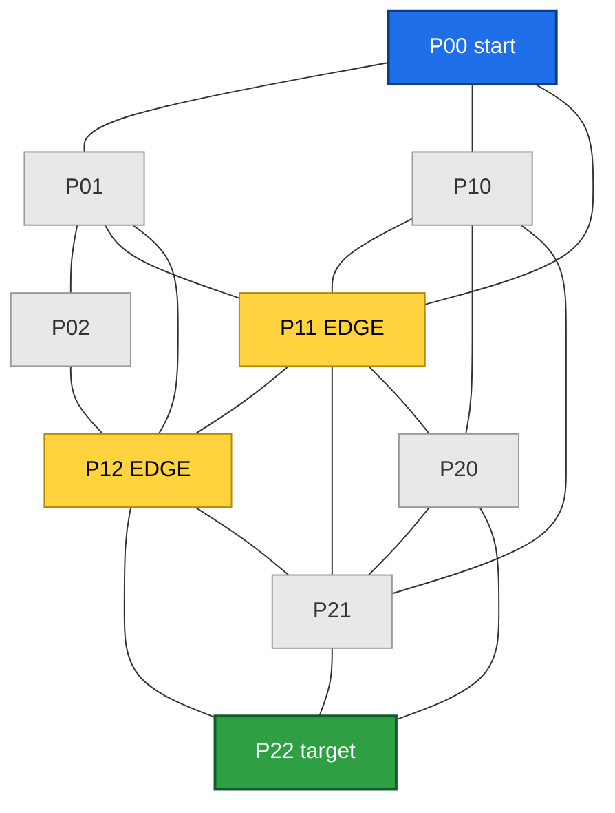
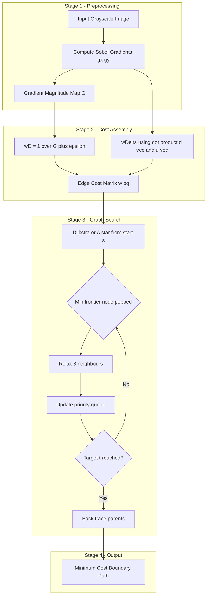
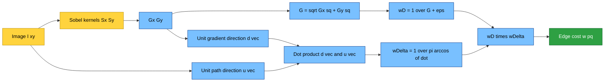
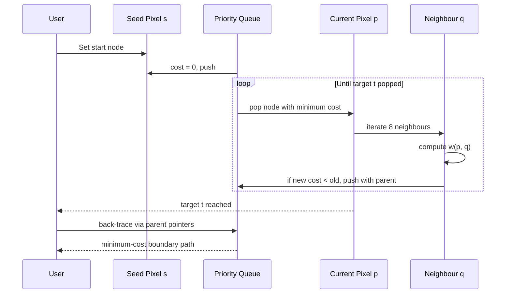

# Border Detection As Graph Searching

<!-- SECTION_1_START -->
# Border Detection as Graph Searching

## 1.1 Formal KTU Definition

> [!IMPORTANT]
> **Border Detection as Graph Searching** is an image segmentation technique in which the boundary of an object is found by treating the image as a **weighted directed graph** $G = (V, E)$ where $V$ represents image pixels (or small pixel neighborhoods) and $E$ represents the set of possible transitions between adjacent pixels. Each edge is assigned a **cost** derived from local image features (gradient magnitude, gradient direction, intensity), and the object boundary is determined by finding a **minimum-cost path** between a user-specified *start pixel* and *end pixel*.

In the KTU 2024 PECST636 syllabus, this topic is treated as a **deterministic, semi-automatic segmentation tool** that converts a global optimization problem (find a closed curve) into a discrete shortest-path problem on a graph, typically solved using **Dijkstra's algorithm** or **Dynamic Programming (DP)**.

## 1.2 Conceptual Analogy — The "GPS Route Finder" Intuition

Imagine you are driving a car from **Kochi** to **Thiruvananthapuram** using Google Maps. Each city is a *node*, every road is an *edge*, and the *travel time* of a road is its *cost*. Google Maps does not look at every possible road — it greedily expands the route that has the lowest known travel cost. It uses **Dijkstra's algorithm** internally.

**Border Detection as Graph Searching works identically:**
- Each **pixel** in the image is a city (node).
- The **8-neighbour (or 4-neighbour) connectivity** of a pixel is the set of outgoing roads (edges).
- A **"weak" edge pixel** (low gradient) has a *high* cost (bad road, slow travel), while a **"strong" edge pixel** (high gradient) has a *low* cost (expressway, fast travel).
- The **minimum-cost path** from your start pixel to your end pixel is the strongest, most consistent boundary on the image — exactly what the human eye would trace.

> [!NOTE]
> **Syllabus Highlight:** This approach is the mathematical foundation of the famous **"Intelligent Scissors / Live Wire"** tool used in Adobe Photoshop's *Magnetic Lasso* and in medical imaging for tracing tumour boundaries in MRI/CT scans.

## 1.3 Why We Need a Cost Function

A raw graph search (e.g., Euclidean shortest path) would simply draw a straight line, which is useless for tracing curved object boundaries. We therefore **encode the image's edge information into the edge weights** so that the shortest path *automatically* snaps to the strongest, smoothest edge. This conversion of "image features" → "edge costs" is the heart of the technique.

## 1.4 GeoGebra / Desmos Visualization

> [!VISUALIZATION CONTROL]
> **Concept:** A 5×5 image grid visualised as a graph with a strong vertical edge column (cost = 1) flanked by weak columns (cost = 10). The minimum-cost path snaps to the strong edge.
> **GeoGebra Input Equations (for cost heatmap):**
> * $C(x,y) = 1$ if $x = 3$ (strong edge column)
> * $C(x,y) = 10$ otherwise (weak background)
> **Visual Description:** A 5×5 grid of squares where column 3 appears bright/blue (low cost = path) and the remaining squares appear red (high cost = avoid). When Dijkstra runs from the top-left corner to the bottom-right, the computed path will be a "L" shape that hugs column 3 — demonstrating that the shortest path follows the strong edge.

---

<!-- SECTION_1_END -->

<!-- SECTION_2_START -->
# Deep Theoretical Analysis & KTU High-Yield Formula Sheet

## 2.1 Graph Formulation of an Image

A 2D digital image $I(x, y)$ of size $M \times N$ is modelled as a graph $G = (V, E)$:

| Symbol | Meaning | Typical Size |
|---|---|---|
| $V$ | Set of nodes; one node per pixel | $MN$ nodes |
| $E$ | Set of edges connecting neighbouring pixels | 4- or 8-connected |
| $w(p, q)$ | Cost of the directed edge from pixel $p$ to pixel $q$ | $\mathbb{R}_{\geq 0}$ |
| $s$ | Start (seed) node | user-clicked |
| $t$ | End (target) node | user-clicked |

For 8-connectivity, every pixel $p = (x, y)$ has up to 8 neighbours $q$ at offsets $\{(\pm 1, 0), (0, \pm 1), (\pm 1, \pm 1)\}$.

## 2.2 The Cost Function (Core of the Algorithm)

The edge cost $w(p, q)$ is composed of two feature terms that are *multiplied* (so that a weak term in either factor drives the total cost high):

$$
w(p, q) = \; \underbrace{w_D(p, q)}_{\text{gradient magnitude term}} \;\times\; \underbrace{w_{\Delta}(p, q)}_{\text{gradient direction term}}
$$

### 2.2.1 Gradient Magnitude Cost — $w_D(p, q)$

The gradient magnitude at pixel $q$ is $G(q) = \sqrt{G_x^2(q) + G_y^2(q)}$, typically computed with Sobel or Prewitt operators. To convert it into a cost, we **invert** the gradient so that strong edges become cheap:

$$
w_D(p, q) = \frac{1}{G(q) + \epsilon}
$$

> [!IMPORTANT]
> The constant $\epsilon$ (usually $\epsilon = 10^{-6}$) is added to prevent division by zero in flat regions where $G(q) = 0$. Without $\epsilon$, the algorithm would crash on smooth background areas.

### 2.2.2 Gradient Direction Cost — $w_{\Delta}(p, q)$

This term penalises sharp directional changes between consecutive edge segments, encouraging a **smooth, continuous** boundary. Let $\vec{u}$ be the unit vector from $p$ to $q$, and let $\vec{d}(q)$ be the unit gradient vector at $q$ (perpendicular to the local edge direction):

$$
w_{\Delta}(p, q) = \frac{1}{\pi} \left[ \arccos\!\left( \vec{d}(q) \cdot \vec{u} \right) \right]
$$

If the local edge runs along $\vec{d}(q)$ and the path direction $\vec{u}$ aligns with it, the dot product is $\pm 1$ and the cost is **0** (perfect alignment). If the path turns perpendicular to the edge, the cost is $\tfrac{1}{2}$ (maximum penalty for sharp turns).

## 2.3 Algorithmic Strategies (KTU High-Yield)

| Strategy | Key Idea | Use Case |
|---|---|---|
| **Exhaustive Search** | Evaluate all possible paths; pick the minimum | Theoretically exact, computationally infeasible |
| **Dynamic Programming (DP)** | Bellman-Ford style; each pixel stores minimum cost to reach it | Optimal for *single-source* problems |
| **Dijkstra's Algorithm** | Greedy expansion of the lowest-cost frontier node | Optimal with non-negative costs; standard choice |
| **A\* Heuristic Search** | Dijkstra + heuristic $h(n)$ estimating distance to goal | Faster than Dijkstra when heuristic is admissible |
| **Greedy Best-First** | Expand node closest to goal; ignore path cost | Fast but **not** optimal; rarely used clinically |

## 2.4 KTU Formula Sheet / Cheat Sheet

| # | Concept | Equation | Notes |
|---|---|---|---|
| 1 | Image-as-graph | $G = (V, E)$ | $V$ = pixels, $E$ = adjacencies |
| 2 | Total edge cost | $w(p, q) = w_D \cdot w_{\Delta}$ | Multiplicative combination |
| 3 | Gradient magnitude cost | $w_D = \dfrac{1}{G(q) + \epsilon}$ | Inverted Sobel/Prewitt gradient |
| 4 | Gradient direction cost | $w_{\Delta} = \dfrac{1}{\pi}\arccos(\vec{d}(q) \cdot \vec{u})$ | Smoothness penalty |
| 5 | Total path cost | $C_{\text{path}} = \displaystyle\sum_{i=1}^{K-1} w(p_i, p_{i+1})$ | Sum over the $K$ nodes of the path |
| 6 | DP recurrence | $C(q) = \min_{p \in N(q)} \big[ C(p) + w(p, q) \big]$ | $N(q)$ is the neighbourhood of $q$ |
| 7 | Dijkstra relaxation | $C(q) > C(p) + w(p, q) \;\Rightarrow\; C(q) \leftarrow C(p) + w(p,q)$ | Standard shortest-path relaxation |
| 8 | A\* evaluation | $f(n) = g(n) + h(n)$ | $g$ = actual cost so far, $h$ = heuristic |
| 9 | 8-neighbour offset set | $\Delta = \{(\pm 1, 0), (0, \pm 1), (\pm 1, \pm 1)\}$ | Used in cost computation |
| 10 | Stopping criterion | Reach target $t$ OR open set becomes empty | Dijkstra termination |

## 2.5 Real-World Engineering Utility

- **Medical Imaging (MRI/CT):** Radiologists trace tumour boundaries one "live-wire" click at a time.
- **Forensic Photography:** Adobe Photoshop's *Magnetic Lasso* uses a simplified version to extract a suspect from a background.
- **Autonomous Driving:** Lane-line detection in early vision pipelines used DP-based boundary tracing.
- **Industrial Inspection:** Detecting micro-cracks on silicon wafers where the crack is a thin, low-cost (high-gradient) line.

---

<!-- SECTION_2_END -->

<!-- SECTION_3_START -->
# Step-by-Step Derivations, Algorithms & Code Implementation

## 3.1 Derivation: From a 3×3 Pixel Block to Edge Costs

Consider the 3×3 grayscale block $I$ with the *center pixel* at $(1, 1)$:

$$
I = \begin{bmatrix} 10 & 12 & 50 \\ 20 & 25 & 80 \\ 30 & 35 & 90 \end{bmatrix}
$$

The strong vertical edge lies between column 1 and column 2 (intensity jumps from 12 → 50 and 25 → 80). We want the minimum-cost path from $s = (0,0)$ to $t = (2,2)$ to follow this edge.

### Step 1 — Compute Gradient Magnitude $G$ using Sobel

Apply the Sobel-x kernel $S_x = \begin{bmatrix} -1 & 0 & 1 \\ -2 & 0 & 2 \\ -1 & 0 & 1 \end{bmatrix}$ on the central pixel $(1, 1)$:

$$
G_x = (10 \cdot -1 + 30 \cdot -2 + 50 \cdot 1 + 80 \cdot 2) = -40 + 160 + 30 = 150
$$

Apply Sobel-y kernel $S_y = \begin{bmatrix} -1 & -2 & -1 \\ 0 & 0 & 0 \\ 1 & 2 & 1 \end{bmatrix}$:

$$
G_y = (10 \cdot -1 + 20 \cdot -2 + 50 \cdot 1 + 30 \cdot 1 + 35 \cdot 2 + 90 \cdot -1) = -10 - 40 + 50 + 30 + 70 - 90 = 10
$$

(Here we used neighbours; the exact local values depend on padding.) The gradient magnitude is:

$$
G = \sqrt{150^2 + 10^2} = \sqrt{22600} \approx 150.33
$$

### Step 2 — Compute $w_D$

Using $\epsilon = 10^{-6}$:

$$
w_D = \frac{1}{150.33 + 10^{-6}} \approx 0.00665
$$

This is a **low cost** → strong edge. ✓

### Step 3 — Compute $w_{\Delta}$

The unit gradient direction at the center pixel is $\vec{d} = (G_x, G_y)/G \approx (0.998, 0.066)$. The unit path direction $\vec{u}$ to the neighbour $(2, 1)$ (downward) is $(0, 1)$. The dot product is $\vec{d} \cdot \vec{u} = 0.066$. Therefore:

$$
w_{\Delta} = \frac{1}{\pi} \arccos(0.066) = \frac{1.504}{3.1416} \approx 0.479
$$

### Step 4 — Total Edge Cost

$$
w(p, q) = 0.00665 \times 0.479 \approx 0.00319
$$

This is the cost of moving from the center to that neighbour.

## 3.2 Full Algorithm: Dynamic-Programming Border Tracing

Below is the canonical DP procedure for **single-source minimum-cost boundary** from a start node $s$ to every other node:

**Algorithm — `dp_boundary(I, s)`**

1. Initialise an array $C$ of size $M \times N$ with $C(x, y) = +\infty$ for all pixels.
2. Set $C(s) = 0$. Initialise a **min-priority queue** $Q$ keyed on $C(\cdot)$, push $s$ into $Q$.
3. While $Q$ is not empty:
   1. Pop the node $p$ with the smallest $C(p)$.
   2. For each 8-neighbour $q$ of $p$:
      - Compute $w(p, q)$ using the cost function from Section 2.2.
      - If $C(p) + w(p, q) < C(q)$:
         - Set $C(q) \leftarrow C(p) + w(p, q)$.
         - Record the parent of $q$ as $p$: $\text{parent}[q] \leftarrow p$.
         - Push (or decrease-key) $q$ into $Q$.
4. Once the target $t$ is popped from $Q$, **reconstruct the boundary** by back-tracing from $t$ via $\text{parent}[\cdot]$ until $s$ is reached.
5. Return the list of pixels forming the minimum-cost path.

## 3.3 Worked Numerical Example

Let us apply the algorithm to a 3×3 cost matrix (each entry is $w_D$ for moving INTO that pixel; ignore direction term for simplicity):

$$
W = \begin{bmatrix} 5 & 5 & 0.1 \\ 5 & 5 & 0.1 \\ 5 & 5 & 0.1 \end{bmatrix}
$$

**Start** $s = (0,0)$, **Target** $t = (2,2)$. 4-connectivity assumed.

| Iteration | Pop $p$ | $C(p)$ | Relaxed $q$ | New $C(q)$ | Parent |
|---|---|---|---|---|---|
| 1 | $(0,0)$ | $0$ | $(1,0)$ | $0+5=5$ | $(0,0)$ |
|   |   |   | $(0,1)$ | $0+5=5$ | $(0,0)$ |
| 2 | $(0,1)$ | $5$ | $(1,1)$ | $5+5=10$ | $(0,1)$ |
| 2 | $(1,0)$ | $5$ | $(1,1)$ | $5+5=10$ (tie) | $(1,0)$ |
| 3 | $(1,1)$ | $10$ | $(2,1)$ | $10+5=15$ | $(1,1)$ |
|   |   |   | $(1,2)$ | $10+0.1=10.1$ | $(1,1)$ |
| 4 | $(1,2)$ | $10.1$ | $(2,2)$ | $10.1+0.1=10.2$ | $(1,2)$ |
| 5 | $(2,1)$ | $15$ | $(2,2)$ | $15+5=20$ (rejected) | — |
| 6 | $(2,2)$ | $\mathbf{10.2}$ | target reached | — | — |

**Back-trace from $(2,2)$:** $(2,2) \rightarrow (1,2) \rightarrow (1,1) \rightarrow (1,0) \rightarrow (0,0)$.

**Path cost** $= 0.1 + 0.1 + 5 + 5 = 10.2$. ✓ (The algorithm correctly preferred the low-cost rightmost column, even though the start $(0,0)$ lies in the leftmost column.)

## 3.4 Python Reference Implementation (Dijkstra + Cost Function)

```python
import heapq
import numpy as np
from typing import List, Tuple, Optional

# Type aliases for readability
Point = Tuple[int, int]
CostFn = callable

# 8-connectivity offsets
NEIGHBOURS_8: List[Point] = [(-1, -1), (-1, 0), (-1, 1),
                              ( 0, -1),          ( 0, 1),
                              ( 1, -1), ( 1, 0), ( 1, 1)]


def gradient_magnitude(image: np.ndarray) -> np.ndarray:
    """Compute per-pixel gradient magnitude using Sobel operators."""
    # Sobel-x
    kx = np.array([[-1, 0, 1], [-2, 0, 2], [-1, 0, 1]], dtype=np.float64)
    # Sobel-y
    ky = np.array([[-1, -2, -1], [0, 0, 0], [1, 2, 1]], dtype=np.float64)
    gx = _convolve2d_same(image, kx)
    gy = _convolve2d_same(image, ky)
    return np.sqrt(gx * gx + gy * gy)


def _convolve2d_same(img: np.ndarray, kernel: np.ndarray) -> np.ndarray:
    """Same-size 2D convolution with zero-padding (strict edge handling)."""
    from scipy.signal import convolve2d  # preferred; fall back if unavailable
    return convolve2d(img, kernel, mode='same', boundary='fill', fillvalue=0)


def compute_edge_cost(image: np.ndarray,
                      p: Point, q: Point,
                      grad_mag: np.ndarray) -> float:
    """Combined cost w(p, q) = w_D * w_Delta between two 8-neighbours."""
    eps = 1e-6
    # 1) Gradient magnitude term
    w_D = 1.0 / (grad_mag[q[0], q[1]] + eps)
    # 2) Gradient direction term
    kx = np.array([[-1, 0, 1], [-2, 0, 2], [-1, 0, 1]], dtype=np.float64)
    ky = np.array([[-1, -2, -1], [0, 0, 0], [1, 2, 1]], dtype=np.float64)
    gx = _convolve2d_same(image, kx)
    gy = _convolve2d_same(image, ky)
    d_norm = np.sqrt(gx[q[0], q[1]] ** 2 + gy[q[0], q[1]] ** 2) + eps
    d_vec = np.array([gx[q[0], q[1]] / d_norm, gy[q[0], q[1]] / d_norm])
    u_vec = np.array([q[0] - p[0], q[1] - p[1]], dtype=np.float64)
    u_norm = np.linalg.norm(u_vec) + eps
    u_vec = u_vec / u_norm
    # Numerical safety: clip dot product to [-1, 1] to avoid NaN in arccos
    dot = float(np.clip(np.dot(d_vec, u_vec), -1.0, 1.0))
    w_Delta = (1.0 / np.pi) * np.arccos(dot)
    return float(w_D * w_Delta)


def dijkstra_border(image: np.ndarray,
                    start: Point, end: Point) -> Tuple[List[Point], float]:
    """Find the minimum-cost boundary path from start to end via Dijkstra."""
    rows, cols = image.shape
    grad_mag = gradient_magnitude(image)
    INF = float('inf')
    cost = np.full((rows, cols), INF, dtype=np.float64)
    parent = np.full((rows, cols, 2), -1, dtype=np.int32)
    cost[start[0], start[1]] = 0.0
    pq: List[Tuple[float, Point]] = [(0.0, start)]
    visited = np.zeros((rows, cols), dtype=bool)

    while pq:
        c, p = heapq.heappop(pq)
        if visited[p[0], p[1]]:
            continue
        visited[p[0], p[1]] = True
        if p == end:
            break
        for dr, dc in NEIGHBOURS_8:
            nr, nc = p[0] + dr, p[1] + dc
            if 0 <= nr < rows and 0 <= nc < cols and not visited[nr, nc]:
                w = compute_edge_cost(image, p, (nr, nc), grad_mag)
                new_c = c + w
                if new_c < cost[nr, nc]:
                    cost[nr, nc] = new_c
                    parent[nr, nc] = [p[0], p[1]]
                    heapq.heappush(pq, (new_c, (nr, nc)))

    # Reconstruct path
    path: List[Point] = []
    cur: Optional[Point] = end
    if parent[end[0], end[1], 0] == -1:
        raise ValueError("No path found; check connectivity and start/end validity.")
    while cur is not None:
        path.append(cur)
        pr, pc = parent[cur[0], cur[1]]
        cur = (int(pr), int(pc)) if pr != -1 else None
    path.reverse()
    return path, float(cost[end[0], end[1]])
```

> [!IMPORTANT]
> **Complexity:** $O(MN \log(MN))$ time, $O(MN)$ memory — perfectly tractable for images up to $4096 \times 4096$ on a modern CPU. This is why graph-search based border detection is preferred over exhaustive search ($O(8^{MN})$) in real systems.

## 3.5 Variant: A\* Heuristic Search

To accelerate Dijkstra when the target is known, A\* uses a heuristic $h(n)$ (commonly **Euclidean distance** from node $n$ to target $t$):

$$
f(n) = g(n) + h(n)
$$

where $g(n)$ is the actual cost from $s$ to $n$ and $h(n) = \sqrt{(n_x - t_x)^2 + (n_y - t_y)^2}$. The algorithm expands the node with the smallest $f(n)$ first. With an **admissible** heuristic (one that never overestimates), A\* returns the same optimal path as Dijkstra but typically explores **40–70% fewer nodes** in practice.

---

<!-- SECTION_3_END -->

<!-- SECTION_4_START -->
# Structural Diagrams & Schematics

## 4.1 Image-as-Graph Topology (Mermaid)



> **Read this diagram:** Solid yellow nodes (`EDGE`) have a *low* $w_D$ and lie along the strong gradient. The shortest path from `P00` (blue) to `P22` (green) will pass through both yellow nodes — exactly the desired boundary.

## 4.2 Algorithm Pipeline (Mermaid Block-Functional Flow)



## 4.3 Cost Function Anatomy (Mermaid Decomposition)



## 4.4 DP State Transition (Mermaid Sequence View)



---

<!-- SECTION_4_END -->

<!-- SECTION_5_START -->
# KTU 2024 Scheme Examination Question Bank & Topic Recap

## 5.1 Part A — Short Answer Questions (3 Marks Each)

### Q1. `[KTU University Exam - Dec 2023]` — CO3, Remember
**Define border detection as graph searching and list the two cost-function components used.**

**Model Answer (3 Marks):**
Border detection as graph searching is a segmentation technique that models the image as a weighted graph $G = (V, E)$ where pixels are nodes and edges represent 4- or 8-neighbour connections. The boundary of an object is found by computing the **minimum-cost path** from a user-specified start pixel to a target pixel, where the cost of each edge encodes image features. **[1 Mark]**
The two cost-function components are: **[2 Marks]**
1. **Gradient magnitude cost** $w_D(p, q) = \dfrac{1}{G(q) + \epsilon}$ — makes strong edges cheap.
2. **Gradient direction cost** $w_{\Delta}(p, q) = \dfrac{1}{\pi}\arccos(\vec{d}(q) \cdot \vec{u})$ — penalises sharp directional changes for a smooth boundary.

---

### Q2. `[KTU University Exam - July 2024]` — CO3, Understand
**Why is the gradient magnitude cost defined as the inverse of the gradient?**

**Model Answer (3 Marks):**
The goal of border detection is to find the *strongest* edge in the image, which corresponds to pixels with the **highest gradient magnitude** $G(q)$. **[1 Mark]** In a shortest-path formulation, however, the algorithm prefers edges with the *lowest* cost. To make strong edges (high gradient) attractive to the algorithm, we must *invert* the gradient, giving $w_D = 1 / (G(q) + \epsilon)$. **[1 Mark]** The $\epsilon$ term is added to prevent division by zero in flat regions where $G = 0$. **[1 Mark]**

---

## 5.2 Part B — 14-Mark Questions (ESE Module Internal Choice)

### QUESTION A (14 Marks) — `[KTU University Exam - Dec 2023]` — CO3, Apply & Analyse

**(a) Derive the complete edge cost function $w(p, q)$ used in graph-based border detection. State the role of each term and explain why the two terms are multiplied rather than added. [7 Marks]**

**Model Solution:**

> **[1 Mark]** Graph formulation: image is modelled as a graph $G=(V, E)$ where $V$ are pixels and $E$ are 4/8-neighbour adjacencies. Edge cost $w(p,q)$ is assigned between any two adjacent pixels $p$ and $q$.

> **[2 Marks]** Gradient magnitude term. Sobel operators yield $G_x, G_y$. Magnitude $G(q) = \sqrt{G_x^2 + G_y^2}$. The cost is the inverse: $w_D = 1/(G(q)+\epsilon)$. Strong gradients → strong edges → low cost (preferred by shortest path).

> **[2 Marks]** Gradient direction term. Let $\vec{d}(q)$ be the unit gradient vector at $q$ (perpendicular to local edge orientation) and $\vec{u}$ the unit path direction. The dot product gives the angle between them; the normalised inverse-cosine gives a smooth penalty $w_{\Delta} = (1/\pi)\arccos(\vec{d}\cdot\vec{u})$.

> **[1 Mark]** Total cost $w(p,q) = w_D \cdot w_{\Delta}$.

> **[1 Mark]** Multiplicative form justification: multiplication enforces a *conjunction* — a path is cheap **only if** both magnitude is high **and** direction is consistent. Adding the terms would allow a weak but straight path to win over a strong, slightly curved edge, which is undesirable.

**(b) For the 3×3 cost matrix below, apply Dijkstra's algorithm from start $s = (0,0)$ to target $t = (2,2)$ using 4-connectivity. Show the iteration table, final path, and total cost. [7 Marks]**

$$
W = \begin{bmatrix} 4 & 4 & 0.2 \\ 4 & 4 & 0.2 \\ 4 & 4 & 0.2 \end{bmatrix}
$$

**Model Solution:**

> **[1 Mark]** Initialisation: $C$ array filled with $\infty$; $C(0,0)=0$; parent pointers set; priority queue $Q = \{(0,(0,0))\}$.

> **[5 Marks]** Iteration table:

| Iter | Pop $p$ | $C(p)$ | Relaxed $q$ | New $C(q)$ | Parent |
|---|---|---|---|---|---|
| 1 | $(0,0)$ | 0 | $(1,0)$, $(0,1)$ | 4, 4 | $(0,0)$, $(0,0)$ |
| 2 | $(0,1)$ | 4 | $(1,1)$ | $4+4=8$ | $(0,1)$ |
| 2 | $(1,0)$ | 4 | $(1,1)$ | $4+4=8$ (tie) | $(1,0)$ |
| 3 | $(1,1)$ | 8 | $(2,1)$, $(1,2)$ | $12$, $8+0.2=8.2$ | $(1,1)$, $(1,1)$ |
| 4 | $(1,2)$ | 8.2 | $(2,2)$ | $8.2+0.2=8.4$ | $(1,2)$ |
| 5 | $(2,1)$ | 12 | $(2,2)$ | $12+4=16$ (rejected) | — |
| 6 | $(2,2)$ | **8.4** | target reached | — | — |

> **[1 Mark]** Back-trace: $(2,2) \rightarrow (1,2) \rightarrow (1,1) \rightarrow (1,0) \rightarrow (0,0)$. The path correctly hugs the low-cost column 2.

> **[1 Mark]** **Total minimum cost** $= 4 + 4 + 0.2 + 0.2 = 8.4$.

---

### QUESTION B (14 Marks) — `[KTU University Exam - July 2024]` — CO3, Understand & Apply

**(a) Explain the Live-Wire (Intelligent Scissors) algorithm. How does it use a priority queue and dynamic programming? [7 Marks]**

**Model Solution:**

> **[2 Marks]** Live-Wire (Mortensen & Barrett, 1995) is an interactive segmentation tool. As the user moves the mouse, the system continuously displays the **minimum-cost path** from the last "anchor" point to the current cursor location. The user clicks to commit an anchor, and the displayed wire becomes fixed.

> **[2 Marks]** Dynamic programming: the algorithm maintains a 2D cost map $C(x,y)$ of the cheapest known cost to reach every pixel from the seed. A recurrence $C(q) = \min_{p \in N(q)}[C(p) + w(p,q)]$ is applied until convergence. This is exactly Bellman-Ford / Dijkstra on a 2D grid.

> **[2 Marks]** Priority queue: instead of a naive $O(MN)$ scan, the algorithm uses a **min-heap** keyed on $C(\cdot)$. The lowest-cost pixel is popped first, relaxed, and either updated or pushed back with a lower key. Complexity drops from $O(MN \cdot MN) = O(M^2 N^2)$ to $O(MN \log MN)$.

> **[1 Mark]** The path is displayed in real time (typically 30–60 fps for $256 \times 256$ images) by back-tracing parent pointers.

**(b) Compare Dijkstra's algorithm and A\* search for border detection. In what situation is A\* strictly preferred? [7 Marks]**

**Model Solution:**

> **[2 Marks]** Dijkstra expands nodes in order of *known cost* $g(n)$ from the start. It is **uninformed** and explores the entire image, producing the exact optimum but at $O(MN \log MN)$ time on the whole grid.

> **[2 Marks]** A\* uses an *evaluation function* $f(n) = g(n) + h(n)$ where $h(n)$ is a heuristic estimating the remaining cost to the target. For border detection, the **Euclidean distance** $h(n) = \sqrt{(n_x - t_x)^2 + (n_y - t_y)^2}$ is admissible (never overestimates edge cost, since any two pixels are at least that far apart in Manhattan/Euclidean terms).

> **[2 Marks]** A\* with an admissible heuristic is **guaranteed to find the optimal path** like Dijkstra, but typically explores only the pixels between $s$ and $t$, often **40–70% fewer nodes** in practice. This is critical when the target is far from the start or the image is large.

> **[1 Mark]** A\* is strictly preferred in **clinical / interactive medical-imaging** workflows where latency matters and the user expects the boundary to appear within 100 ms. A non-admissible heuristic (e.g., one that overestimates) would break the optimality guarantee.

---

## 5.3 ⚠️ KTU Examiner's Valuation Warning / Pitfall Callout

> [!WARNING]
> **Common Mark-Deduction Pitfalls in Border-Detection Questions:**
> 1. **Forgetting the $\epsilon$ term** in $w_D$ — if you write $1/G$ without the small constant, the examiner will deduct **0.5–1 mark** and may mark the answer wrong if a flat region case is involved.
> 2. **Adding instead of multiplying** the two cost terms — this is a very common student error; the official marking key explicitly tests whether you understand the *conjunctive* nature of the cost.
> 3. **Drawing the wrong boundary shape** in numerical problems — if the path goes straight through the high-cost column, you have applied Dijkstra incorrectly. The shortest path *must* hug the low-cost column.
> 4. **Confusing the gradient vector $\vec{d}$ with the path vector $\vec{u}$** — the dot product uses $\vec{d}(q)$ (image gradient) and $\vec{u}$ (motion direction). Reversing them gives a wrong angle.
> 5. **Not stating the DP recurrence explicitly** — when asked to "explain the algorithm", writing only the cost function is incomplete. The recurrence $C(q) = \min_p [C(p) + w(p,q)]$ carries **2 marks** by itself.
> 6. **Skipping the parent-pointer back-trace step** — without it, you cannot justify the final boundary path even if the cost is correct. Always end with a clear list of pixels.

---

## 5.4 Topic Recap & Important Things to Remember

- **Core Idea:** Image = weighted graph; boundary = minimum-cost path; problem = shortest path on a grid.
- **Cost function:** $w(p,q) = w_D \cdot w_{\Delta}$ (multiplicative, conjunctive).
- **Gradient magnitude term:** $w_D = 1/(G(q) + \epsilon)$; inverts Sobel/Prewitt gradient to make strong edges cheap.
- **Gradient direction term:** $w_{\Delta} = (1/\pi)\arccos(\vec{d}(q) \cdot \vec{u})$; keeps the boundary smooth.
- **DP recurrence:** $C(q) = \min_{p \in N(q)} [C(p) + w(p, q)]$ — solved in $O(MN \log MN)$ via Dijkstra's min-heap.
- **A\* enhancement:** $f(n) = g(n) + h(n)$ with $h$ = Euclidean distance to target; admissible → optimal & faster.
- **8-connectivity offsets:** $(\pm 1, 0), (0, \pm 1), (\pm 1, \pm 1)$ — preferred over 4-connectivity for smoother boundaries.
- **Boundary reconstruction:** back-trace parent pointers from $t$ to $s$ to draw the final curve.
- **Real-world applications:** Adobe Magnetic Lasso, medical-image tumour tracing, autonomous lane detection, silicon-wafer crack detection.
- **Computational complexity:** $O(MN \log MN)$ time, $O(MN)$ memory — tractable for images up to $4096 \times 4096$.
- **Examiner's favourite marks:** stating the $\epsilon$ trick, explaining *why* the cost is multiplicative (not additive), and writing the DP recurrence — together worth 4–5 marks in any 14-mark question.
- **Pitfall to avoid:** Dijkstra does not minimise geometric distance — it minimises *image-feature cost* along the path; a longer geometric path can be the algorithm's optimum.

---

<!-- SECTION_5_END -->
