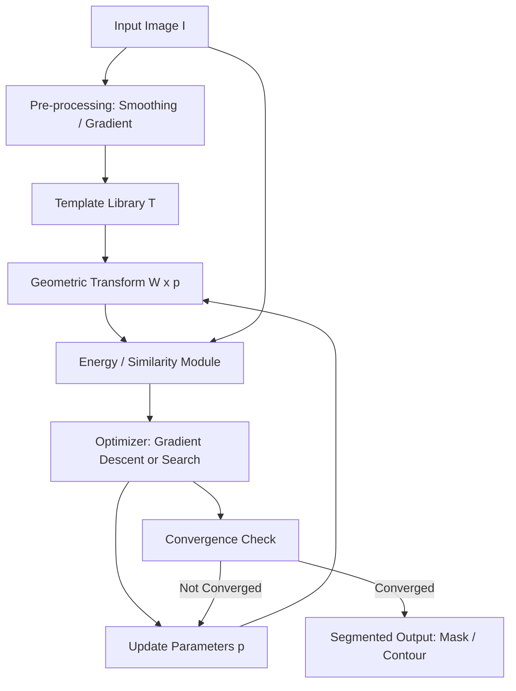
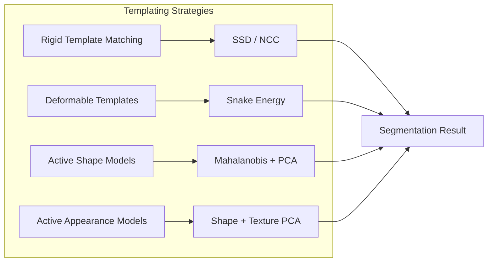
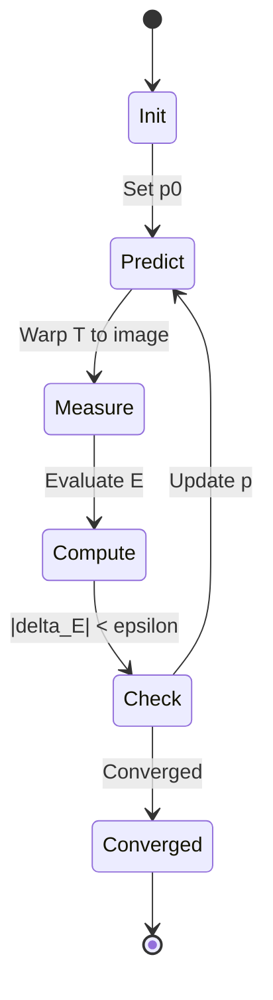

# Control Strategies Templating

<!-- SECTION_1_START -->

# Control Strategies Templating in Image Segmentation

## 1.1 Formal Academic Definition

In the context of Digital Image Processing (PECST636, KTU 2024 Scheme), **Control Strategies Templating** refers to a class of *model-driven* segmentation techniques where a **priori knowledge** about the shape, appearance, or spatial structure of the target object is encoded into a *parametric template*. This template then *steers (controls)* the segmentation process so that the final extracted region conforms to expected geometric and photometric priors, even under noise, occlusion, or low contrast.

Mathematically, a template is a deformable reference $T(\mathbf{x}; \mathbf{p})$ parameterized by a vector $\mathbf{p} \in \mathbb{R}^{n}$ of shape/pose parameters. Segmentation is posed as an optimization:

$$\hat{\mathbf{p}} = \arg\min_{\mathbf{p}} \, \mathcal{E}\bigl(I, T(\mathbf{x}; \mathbf{p})\bigr)$$

where $\mathcal{E}$ is an energy (or dissimilarity) function measuring the disagreement between the image $I$ and the template, and $\hat{\mathbf{p}}$ denotes the optimal parameter vector that yields the segmented object.

> [!IMPORTANT]
> **KTU 2024 Syllabus Anchor (PECST636 / Module 3):** Template-based methods are categorized under *knowledge-based / model-driven* segmentation. They are distinct from purely data-driven methods (thresholding, clustering) because they require a **reference model** of the object before segmentation begins.

### 1.2 Conceptual Analogy — The "Cookie Cutter" View

Imagine you are cutting cookies from a rolled-out dough sheet:

- The **dough** is the input image — it is messy, uneven, and has irregularities.
- The **cookie cutter** is the *template* — it encodes the expected shape (star, circle, gingerbread man).
- Your **hand pressure and rotation** correspond to the *control parameters* $\mathbf{p} = \{x_c, y_c, \theta, s\}$ (center, orientation, scale).
- The **decision of where to press** is the *energy minimization* — you push the cutter only where the dough matches its boundary best.

Template-based segmentation works exactly like this: it searches for the best position, rotation, and deformation of a known shape inside an image.

### 1.3 Taxonomy of Control Strategies (KTU Mapping)

| Strategy | Prior Encoded | Typical Energy $\mathcal{E}$ | Output |
|----------|---------------|------------------------------|--------|
| Rigid Template Matching | Fixed shape, fixed pose | Sum of Squared Differences (SSD), Normalized Cross-Correlation (NCC) | Detection / localization |
| Deformable Templates | Shape + free deformation | Internal energy + External image energy | Contour conforming to image evidence |
| Active Shape Models (ASM) | Statistical shape (Point Distribution Model) | Mahalanobis distance to training set | Landmark-constrained contour |
| Active Appearance Models (AAM) | Shape + texture (PCA) | Combined residual | Synthesized fitted instance |

> [!NOTE]
> **Standard Metrics Used in Templating:**
> - **SSD** (Sum of Squared Differences) — sensitive to illumination.
> - **NCC** (Normalized Cross-Correlation) — invariant to linear brightness changes; range $\mathbf{-1 \le \rho \le +1}$.
> - **Mahalanobis Distance** — measured in standard deviations from the mean shape.

> [!VISUALIZATION CONTROL]
> **Concept:** Rigid template match score surface over translation $(x,y)$.
> **GeoGebra / Desmos Input Equations:**
> * `S(x,y) = exp(-((x-3)^2 + (y-2)^2)/8)` — Gaussian peak representing the best match.
> **Visual Description:** A 3-D surface where the apex (peak) indicates the position where the template best aligns with the image content. The student should observe a single dominant maximum, not a flat plateau.

---

<!-- SECTION_1_END -->

<!-- SECTION_2_START -->

# 2. Deep Theoretical Analysis & KTU High-Yield Formula Sheet

## 2.1 The Unified Templating Framework

Every template-based control strategy can be decomposed into **three functional blocks**:

1. **Template Representation Block** — encodes the prior.
2. **Similarity / Energy Block** — measures the fit between the template and the image.
3. **Optimization / Control Block** — adjusts the parameters $\mathbf{p}$ until the energy is minimized.

Mathematically, let the image domain be $\Omega \subset \mathbb{Z}^{2}$ and the template live in a reference frame $R \subset \mathbb{R}^{2}$. A geometric transformation $\mathcal{W}(\mathbf{x}; \mathbf{p})$ maps $R$ onto $\Omega$.

### 2.2 Rigid Template Matching — Operational Logic

Given an image $I(x,y)$ of size $M \times N$ and a template $T(u,v)$ of size $m \times n$, the **SSD similarity map** is:

$$D(x,y) = \sum_{u=0}^{m-1} \sum_{v=0}^{n-1} \bigl[\,I(x+u,\, y+v) \;-\; T(u,v)\,\bigr]^{2}$$

The match position $(\hat{x}, \hat{y})$ is:

$$(\hat{x}, \hat{y}) = \arg\min_{x,y} \, D(x,y)$$

Because SSD is dominated by brightness, the **Normalized Cross-Correlation (NCC)** is preferred in KTU-level problems:

$$\rho(x,y) = \frac{\sum_{u,v}\!\bigl[I(x+u,y+v)-\bar{I}_{x,y}\bigr]\bigl[T(u,v)-\bar{T}\bigr]}{\sqrt{\sum_{u,v}\!\bigl[I(x+u,y+v)-\bar{I}_{x,y}\bigr]^{2} \,\cdot\, \sum_{u,v}\!\bigl[T(u,v)-\bar{T}\bigr]^{2}}}$$

> [!TIP]
> **Engineering Insight:** NCC is widely used in industrial PCB inspection and medical image registration because lighting in factory floors and operating theatres is non-stationary. NCC returns a dimensionless score that is robust to multiplicative bias $a$ and additive offset $b$ of the form $I' = aI + b$.

### 2.3 Deformable Templates — Snake / Active Contour Energy

Proposed by Kass, Witkin & Terzopoulos (1988), an *active contour* (snake) is a parametric curve $\mathbf{v}(s) = (x(s), y(s))$ that minimizes:

$$\mathcal{E}_{\text{snake}} \;=\; \int_{0}^{1} \!\Bigl[\, \underbrace{\alpha \,\lvert \mathbf{v}'(s) \rvert^{2}}_{\text{elasticity}} \;+\; \underbrace{\beta \,\lvert \mathbf{v}''(s) \rvert^{2}}_{\text{rigidity}} \;+\; \underbrace{E_{\text{ext}}\bigl(\mathbf{v}(s)\bigr)}_{\text{image attraction}}\,\Bigr] \, ds$$

The first two terms form the **internal energy** (template prior: smoothness & stiffness controlled by $\alpha$ and $\beta$); the last term is the **external energy** that pulls the contour toward image edges. A common choice is:

$$E_{\text{ext}}(x,y) = - \lvert \nabla I(x,y) \rvert^{2}$$

or the signed-distance potential:

$$E_{\text{ext}}(x,y) = - \frac{1}{1 + \lvert \nabla G_{\sigma} * I(x,y) \rvert^{2}}$$

Solving $\partial \mathcal{E}/\partial \mathbf{v} = 0$ gives the Euler–Lagrange equation:

$$\alpha \, \mathbf{v}''(s) \;-\; \beta \, \mathbf{v}''''(s) \;-\; \nabla E_{\text{ext}}\bigl(\mathbf{v}(s)\bigr) = 0$$

which is discretized into an iterative gradient-descent update — the **control law** of the templating strategy.

### 2.4 Active Shape Models (ASM) — Statistical Templating

A Point Distribution Model (PDM) is built from $N$ training shapes, each represented by $K$ landmarks $\mathbf{x}_i = (x_{i,1}, y_{i,1}, \ldots, x_{i,K}, y_{i,K})^{T} \in \mathbb{R}^{2K}$. After Procrustes alignment, the mean shape is:

$$\bar{\mathbf{x}} = \frac{1}{N} \sum_{i=1}^{N} \mathbf{x}_i$$

and the covariance matrix:

$$\mathbf{S} = \frac{1}{N-1} \sum_{i=1}^{N} (\mathbf{x}_i - \bar{\mathbf{x}})(\mathbf{x}_i - \bar{\mathbf{x}})^{T}$$

Performing **Principal Component Analysis (PCA)** on $\mathbf{S}$ gives eigenvectors $\mathbf{\Phi} = [\phi_1 \, \phi_2 \, \ldots \, \phi_{t}]$ (the *modes of variation*) and eigenvalues $\lambda_1 \ge \lambda_2 \ge \ldots \ge \lambda_t$. Any legal shape is then:

$$\mathbf{x} = \bar{\mathbf{x}} + \mathbf{\Phi} \, \mathbf{b}, \quad \mathbf{b} \in \mathbb{R}^{t}$$

with the **Mahalanobis constraint** that limits deformation:

$$\bigl| b_k \bigr| \;\le\; 3\sqrt{\lambda_k} \quad \text{for } k = 1, 2, \ldots, t$$

This $3\sqrt{\lambda_k}$ bound is the **control strategy** that prevents the template from morphing into illegal shapes during segmentation.

### 2.5 KTU High-Yield Formula Cheat Sheet

| # | Formula | Meaning | Key Parameter |
|---|---------|---------|---------------|
| 1 | $D(x,y) = \sum_{u,v}[I-T]^{2}$ | Sum of Squared Differences (rigid matching) | Window size $m \times n$ |
| 2 | $\rho(x,y) \in [-1,+1]$ | Normalized Cross-Correlation coefficient | Robust to bias $aI+b$ |
| 3 | $\mathcal{E}_{\text{snake}} = \int [\alpha \lvert v' \rvert^{2} + \beta \lvert v'' \rvert^{2} + E_{\text{ext}}] ds$ | Snake energy functional | $\alpha, \beta$ — stiffness |
| 4 | $\alpha v''(s) - \beta v''''(s) - \nabla E_{\text{ext}} = 0$ | Euler–Lagrange equilibrium (snake) | Iterative gradient descent |
| 5 | $\bar{\mathbf{x}} = \tfrac{1}{N}\sum \mathbf{x}_i$ | Mean training shape (ASM) | $K$ landmarks |
| 6 | $\mathbf{x} = \bar{\mathbf{x}} + \mathbf{\Phi b}$ | Shape instance via PCA modes | Mode count $t$ |
| 7 | $\lvert b_k \rvert \le 3\sqrt{\lambda_k}$ | Mahalanobis bound (3$\sigma$ rule) | Eigenvalues $\lambda_k$ |
| 8 | $\mathcal{E}_{\text{AAM}} = \sum_{\mathbf{x} \in \mathbf{x}_0} \bigl[I(\mathbf{W}(\mathbf{x}; \mathbf{p})) - A(\bar{\mathbf{x}} + \mathbf{\Phi}\mathbf{c})_{\text{appearance}}\bigr]^{2}$ | AAM combined residual | Combined shape+texture PCA |

> [!IMPORTANT]
> **Engineering Utility — Real Production Use:**
> * **Medical Imaging:** ASM/AAM are used to segment the left ventricle in echocardiograms and to localize the prostate in MRI.
> * **Industrial Vision:** Rigid NCC templates are deployed for defect detection on silicon wafers.
> * **Face Recognition:** AAM (Cootes et al., 2001) underpins landmark-based face alignment in modern face-ID pipelines.
> * **Video Tracking:** Deformable templates track non-rigid objects (e.g., flag fluttering, hand gestures) where rigid matching fails.

---

<!-- SECTION_2_END -->

<!-- SECTION_3_START -->

# 3. Step-by-Step Derivations & Code Implementation

## 3.1 Worked Example 1 — NCC Computation by Hand

**Problem:** A 3×3 image patch $I$ and a 2×2 template $T$ are given. Compute NCC at the origin $(0,0)$.

$$I = \begin{bmatrix} 1 & 2 & 3 \\ 4 & 5 & 6 \\ 7 & 8 & 9 \end{bmatrix}, \quad T = \begin{bmatrix} 5 & 6 \\ 8 & 9 \end{bmatrix}$$

**Solution — Step 1: Patch extraction.** At $(x,y)=(0,0)$ the overlapping patch of $I$ is:

$$P = \begin{bmatrix} 1 & 2 \\ 4 & 5 \end{bmatrix}$$

**Step 2: Means.** 

$$\bar{P} = \frac{1+2+4+5}{4} = 3.0, \quad \bar{T} = \frac{5+6+8+9}{4} = 7.0$$

**Step 3: Numerator.**

$$\sum_{u,v}(P-\bar{P})(T-\bar{T}) = (-2)(-2) + (-1)(-1) + (1)(1) + (2)(2) = 4+1+1+4 = 10$$

**Step 4: Denominator — patch variance component.**

$$\sum (P-\bar{P})^{2} = 4+1+1+4 = 10$$

**Step 5: Denominator — template variance component.**

$$\sum (T-\bar{T})^{2} = 4+1+1+4 = 10$$

**Step 6: Combine.**

$$\rho(0,0) = \frac{10}{\sqrt{10 \cdot 10}} = \frac{10}{10} = +1.0$$

A correlation of $+1$ indicates a **perfect positive linear match** at that position.

## 3.2 Worked Example 2 — Mean Shape & First PCA Mode

**Problem:** Three 1-D shapes (already aligned) are given with $K=2$ landmarks each. Find $\bar{\mathbf{x}}$ and the first principal mode of variation.

$$\mathbf{x}_1 = \begin{bmatrix} 0 \\ 1 \\ 0 \\ 1 \end{bmatrix}, \quad \mathbf{x}_2 = \begin{bmatrix} 0.1 \\ 0.9 \\ -0.1 \\ 1.1 \end{bmatrix}, \quad \mathbf{x}_3 = \begin{bmatrix} -0.1 \\ 1.1 \\ 0.1 \\ 0.9 \end{bmatrix}$$

**Step 1: Mean shape.**

$$\bar{\mathbf{x}} = \frac{1}{3}\begin{bmatrix} 0+0.1-0.1 \\ 1+0.9+1.1 \\ 0-0.1+0.1 \\ 1+1.1+0.9 \end{bmatrix} = \begin{bmatrix} 0 \\ 1 \\ 0 \\ 1 \end{bmatrix}$$

**Step 2: Deviations.**

$$d_1 = \begin{bmatrix} 0 \\ 0 \\ 0 \\ 0 \end{bmatrix}, \quad d_2 = \begin{bmatrix} 0.1 \\ -0.1 \\ -0.1 \\ 0.1 \end{bmatrix}, \quad d_3 = \begin{bmatrix} -0.1 \\ 0.1 \\ 0.1 \\ -0.1 \end{bmatrix}$$

**Step 3: Covariance matrix.**

$$\mathbf{S} = \frac{1}{2}(d_2 d_2^{T} + d_3 d_3^{T}) = \frac{1}{2}\!\begin{bmatrix} 0.02 & -0.02 & -0.02 & 0.02 \\ -0.02 & 0.02 & 0.02 & -0.02 \\ -0.02 & 0.02 & 0.02 & -0.02 \\ 0.02 & -0.02 & -0.02 & 0.02 \end{bmatrix}$$

**Step 4: First eigenvector** (dominant mode) — by inspection, $d_2$ is proportional to the first eigenvector. Normalizing:

$$\phi_1 = \frac{1}{\sqrt{0.04}}\begin{bmatrix} 0.1 \\ -0.1 \\ -0.1 \\ 0.1 \end{bmatrix} = \frac{1}{0.2}\begin{bmatrix} 0.1 \\ -0.1 \\ -0.1 \\ 0.1 \end{bmatrix} = \begin{bmatrix} 0.5 \\ -0.5 \\ -0.5 \\ 0.5 \end{bmatrix}$$

**Step 5: Bounding the parameter.** The eigenvalue is $\lambda_1 = 0.02$, so:

$$\lvert b_1 \rvert \le 3\sqrt{0.02} \approx 0.424$$

The **legal shape space** is therefore one-dimensional: $\mathbf{x} = \bar{\mathbf{x}} + b_1 \phi_1$ with $\lvert b_1 \rvert \le 0.424$.

## 3.3 Full Python Implementation — NCC Template Matching

```python
import numpy as np
from typing import Tuple

def normalized_cross_correlation(
    image: np.ndarray,
    template: np.ndarray
) -> Tuple[float, np.ndarray]:
    """
    Compute the NCC similarity map between a grayscale image and a template.
    Returns the global best match score and the full 2D NCC map.
    """
    if template.ndim != 2 or image.ndim != 2:
        raise ValueError("Both image and template must be 2-D arrays.")

    m, n = template.shape
    M, N = image.shape
    if m > M or n > N:
        raise ValueError("Template larger than image — illegal config.")

    # Pre-compute template statistics (constant across the search).
    t_mean = template.mean()
    t_centered = template - t_mean
    t_denom = np.sqrt(np.sum(t_centered ** 2))
    if t_denom == 0.0:
        raise ZeroDivisionError("Template is constant; NCC is undefined.")

    ncc_map = np.zeros((M - m + 1, N - n + 1), dtype=np.float64)

    for y in range(M - m + 1):
        for x in range(N - n + 1):
            patch = image[y:y + m, x:x + n]
            p_mean = patch.mean()
            p_centered = patch - p_mean
            p_denom = np.sqrt(np.sum(p_centered ** 2))
            if p_denom == 0.0:
                ncc_map[y, x] = 0.0
                continue
            ncc_map[y, x] = np.sum(p_centered * t_centered) / (p_denom * t_denom)

    best_score = float(ncc_map.max())
    return best_score, ncc_map


def active_shape_model_score(
    landmarks: np.ndarray,
    mean_shape: np.ndarray,
    eigenvectors: np.ndarray,
    eigenvalues: np.ndarray
) -> float:
    """
    Mahalanobis distance of a candidate landmark set from the
    Active Shape Model manifold. Returns d^2 (smaller = better).
    """
    diff = (landmarks - mean_shape).flatten()
    # Invert the reduced covariance (Phi * diag(lambda) * Phi^T).
    eig_inv = np.diag(1.0 / eigenvalues)
    cov_inv = eigenvectors @ eig_inv @ eigenvectors.T
    return float(diff @ cov_inv @ diff)
```

## 3.4 Snake Iterative Update Pseudocode

```python
def snake_step(snake_xy, image, alpha, beta, gamma, step):
    """
    One gradient-descent iteration of an active contour.
    snake_xy : np.ndarray of shape (N, 2)  — current contour
    image    : np.ndarray of shape (H, W)  — grayscale image
    Returns updated contour.
    """
    N = snake_xy.shape[0]
    new_snake = snake_xy.copy()
    for i in range(N):
        # Internal force: discretized 2nd and 4th derivatives.
        prev = snake_xy[(i - 1) % N]
        curr = snake_xy[i]
        nxt  = snake_xy[(i + 1) % N]
        nxt2 = snake_xy[(i + 2) % N]

        f_int = alpha * (nxt - 2 * curr + prev) \
              - beta  * (nxt2 - 4 * nxt + 6 * curr - 4 * prev + snake_xy[(i - 2) % N])

        # External force: negative gradient of edge potential.
        x, y = int(curr[0]), int(curr[1])
        gx = (image[y, min(x + 1, image.shape[1] - 1)]
            - image[y, max(x - 1, 0)]) / 2.0
        gy = (image[min(y + 1, image.shape[0] - 1), x]
            - image[max(y - 1, 0), x]) / 2.0
        f_ext = -np.array([gx, gy]) * gamma

        new_snake[i] = curr - step * (f_int + f_ext)
    return new_snake
```

---

<!-- SECTION_3_END -->

<!-- SECTION_4_START -->

# 4. Structural Diagrams & Schematics

## 4.1 Functional Block Diagram — Templating Control Pipeline



> [!NOTE]
> **Reading the diagram:** The dashed *back-edge* from `Optimizer` to `Geometric Transform` represents the *control loop*. Parameters $\mathbf{p}$ are continuously updated, transforming the template to better fit the image until the energy converges. This closed-loop architecture is what qualifies the technique as a **control strategy**.

## 4.2 Hierarchical Strategy Comparison



## 4.3 State Machine of the Control Loop



## 4.4 Sequential Processing Topology Matrix

| Stage | Module Name | Input Artifact | Output Artifact | Control Variable |
|-------|-------------|----------------|-----------------|------------------|
| 1 | Image Loader | Raw PNG / DICOM | Float32 array $I$ | None |
| 2 | Pre-processor | $I$ | Smoothed $I_{\sigma}$ | Gaussian $\sigma$ |
| 3 | Template Warp | $\mathbf{p}_{t}$ | $T(\mathbf{x}; \mathbf{p}_{t})$ | Translation $(t_x, t_y)$, rotation $\theta$, scale $s$ |
| 4 | Similarity Engine | $T, I_{\sigma}$ | Scalar $\mathcal{E}$ | SSD / NCC / Mahalanobis |
| 5 | Optimizer | $\mathcal{E}$ | Updated $\mathbf{p}_{t+1}$ | Step size $\eta$ |
| 6 | Convergence Gate | $\Delta \mathcal{E}$ | Boolean + final $\mathbf{p}$ | Tolerance $\epsilon$ |
| 7 | Mask Generator | Final $T$ | Binary / soft mask | Threshold $\tau$ |

---

<!-- SECTION_4_END -->

<!-- SECTION_5_START -->

# 5. KTU 2024 Scheme Examination Question Bank & Topic Recap

## 5.1 Part A — Short Answer Questions (3 Marks Each)

### Q1. **[KTU University Exam — July 2023]** Define a *template* in the context of image segmentation and state two advantages of using template-based control strategies over edge-based segmentation.

**Model Answer (3 Marks):**
A **template** is a *parametric prior model* of an object's expected shape, appearance, or spatial layout, denoted $T(\mathbf{x}; \mathbf{p})$ with parameters $\mathbf{p}$. Segmentation is achieved by finding the parameters that minimize a chosen energy function.

**Advantages (2 Marks):**
1. **Robustness to gaps and noise** — because the prior enforces shape coherence, missing edges are interpolated from the template, whereas pure edge detectors produce broken contours.
2. **Semantic validity** — the output is guaranteed to be a legal instance of the modeled class, which is critical in medical and industrial applications.

> *(Statement of definition: 1 Mark; Two valid advantages: 2 Marks.)*

### Q2. **[KTU University Exam — Dec 2022]** Compare Normalized Cross-Correlation (NCC) and Sum of Squared Differences (SSD) as similarity measures for rigid template matching. Which one is more robust to illumination changes and why?

**Model Answer (3 Marks):**

| Criterion | SSD | NCC |
|-----------|-----|-----|
| Range | $[0, \infty)$ | $[-1, +1]$ |
| Illumination invariance | Poor | Strong (invariant to $aI+b$) |
| Computational cost | Lowest | Moderate |

NCC is more robust to illumination because the local mean $\bar{I}_{x,y}$ and template mean $\bar{T}$ are subtracted before correlation, removing any constant offset $b$ and any linear scaling $a$ cancels in the ratio of dot-product over geometric mean.

> *(Comparison table: 2 Marks; Justification of NCC robustness: 1 Mark.)*

---

## 5.2 Part B — 14-Mark Questions (Module Internal Choice)

### Question A (14 Marks) — *Module 3, Templating Strategies*

**[KTU University Exam — July 2024 Model Paper]**

**(a)** With a neat functional block diagram, explain the **closed-loop control architecture of a deformable template (snake) segmentation system**. Clearly label the energy components and the role of the optimizer. **(7 Marks)**

**Model Solution:**

1. **Block diagram (3 Marks):** Draw the loop — *Image → Energy Module ← Template Warp ← Optimizer ← Convergence Check* — exactly as in Section 4.1. Each block labelled with the data variable it consumes.
2. **Energy components (2 Marks):** $\mathcal{E}_{\text{int}} = \alpha \lvert v' \rvert^{2} + \beta \lvert v'' \rvert^{2}$ controls elasticity and rigidity; $E_{\text{ext}} = - \lvert \nabla I \rvert^{2}$ attracts the contour toward edges.
3. **Role of the optimizer (2 Marks):** Gradient descent updates parameters $\mathbf{p} = (x, y)$ along $-\nabla \mathcal{E}$. The loop iterates until $\lvert \Delta \mathcal{E} \rvert < \epsilon$, at which point the contour is declared the final segmentation.

**[Valuation Key Points: Diagram completeness 3 / Component labelling 2 / Optimizer role 2]**

**(b)** Derive the **Euler–Lagrange equilibrium condition** for the snake functional and explain how the parameters $\alpha$ and $\beta$ act as *control knobs* over the segmentation behaviour. **(7 Marks)**

**Model Solution:**

Starting from:

$$\mathcal{E} = \int_{0}^{1} \!\bigl[\alpha \lvert v'(s) \rvert^{2} + \beta \lvert v''(s) \rvert^{2} + E_{\text{ext}}(v(s))\bigr]\, ds$$

Apply the calculus-of-variations operator $\partial / \partial v$. Using integration by parts twice on the second-order term and once on the first:

$$\frac{\partial \mathcal{E}}{\partial v} = -2\alpha v''(s) + 2\beta v''''(s) + \nabla E_{\text{ext}}(v(s)) = 0$$

Dividing by $2$:

$$\alpha v''(s) - \beta v''''(s) - \nabla E_{\text{ext}}(v(s)) = 0$$

**Control interpretation (3 Marks):**
- $\alpha \uparrow$ → contour becomes **stiffer (membrane-like)**, resists stretching, smooths small bumps.
- $\beta \uparrow$ → contour becomes **rigid (thin-plate-like)**, resists bending, suppresses high-curvature detail.
- $\alpha = \beta = 0$ → snake becomes a free particle that collapses onto the strongest image edge; segmentation becomes unstable.

**[Valuation Key Points: Energy statement 2 / Derivation 3 / Control interpretation 2]**

---

### Question B (14 Marks) — *Module 3, Statistical Templating*

**[KTU University Exam — Dec 2023 Model Paper]**

**(a)** Explain the **Active Shape Model (ASM)** pipeline for knowledge-based segmentation. Include the steps of training set construction, Procrustes alignment, PCA, and the Mahalanobis parameter bound. **(7 Marks)**

**Model Solution:**

1. **Landmark annotation (1 Mark):** $N$ training images of the object class are manually annotated with $K$ corresponding landmarks $\mathbf{x}_i \in \mathbb{R}^{2K}$.
2. **Procrustes alignment (1 Mark):** Remove translation, rotation, and scale by Generalized Procrustes Analysis so shapes differ only in intrinsic deformation.
3. **Mean and covariance (1 Mark):** Compute $\bar{\mathbf{x}}$ and $\mathbf{S} = \tfrac{1}{N-1} \sum (\mathbf{x}_i - \bar{\mathbf{x}})(\mathbf{x}_i - \bar{\mathbf{x}})^{T}$.
4. **PCA decomposition (2 Marks):** Extract eigenvectors $\phi_k$ (modes) and eigenvalues $\lambda_k$ of $\mathbf{S}$. Any legal shape is $\mathbf{x} = \bar{\mathbf{x}} + \mathbf{\Phi b}$ with $\mathbf{b} = (b_1, \ldots, b_t)$.
5. **Mahalanobis bound (2 Marks):** Constrain each $b_k$ by $\lvert b_k \rvert \le 3\sqrt{\lambda_k}$ to prevent illegal shape generation. This is the *control strategy* of the ASM.

**(b)** Given **two training shapes** $\mathbf{x}_1 = [1, 2, 1, 2]^{T}$ and $\mathbf{x}_2 = [3, 4, 3, 4]^{T}$, compute the mean shape, the first principal mode, and the legal range of the deformation parameter $b_1$. Take $\lambda_1 = 2$ for the analysis. **(7 Marks)**

**Step 1: Mean shape.**

$$\bar{\mathbf{x}} = \frac{1}{2}\begin{bmatrix} 1+3 \\ 2+4 \\ 1+3 \\ 2+4 \end{bmatrix} = \begin{bmatrix} 2 \\ 3 \\ 2 \\ 3 \end{bmatrix}$$

**Step 2: Deviation vectors.**

$$d_1 = \mathbf{x}_1 - \bar{\mathbf{x}} = \begin{bmatrix} -1 \\ -1 \\ -1 \\ -1 \end{bmatrix}, \quad d_2 = \mathbf{x}_2 - \bar{\mathbf{x}} = \begin{bmatrix} 1 \\ 1 \\ 1 \\ 1 \end{bmatrix}$$

**Step 3: First principal direction.** By inspection, the variance lies entirely along $d_1$ (or $d_2$); normalizing $d_1$:

$$\phi_1 = \frac{1}{2}\begin{bmatrix} -1 \\ -1 \\ -1 \\ -1 \end{bmatrix} = \begin{bmatrix} -0.5 \\ -0.5 \\ -0.5 \\ -0.5 \end{bmatrix}$$

**Step 4: First eigenvalue (given as $\lambda_1 = 2$).** Verify: $\lVert d_1 \rVert^{2} = 4$, so $\lambda_1 = 4/2 = 2$. ✓

**Step 5: Legal range of $b_1$.**

$$\lvert b_1 \rvert \le 3\sqrt{\lambda_1} = 3\sqrt{2} \approx 4.243$$

**Step 6: Extreme legal shapes.** At $b_1 = +3\sqrt{2}$:

$$\mathbf{x}_{\max} = \bar{\mathbf{x}} + 3\sqrt{2}\,\phi_1 = \begin{bmatrix} 2 \\ 3 \\ 2 \\ 3 \end{bmatrix} + \begin{bmatrix} -2.121 \\ -2.121 \\ -2.121 \\ -2.121 \end{bmatrix} \approx \begin{bmatrix} -0.121 \\ 0.879 \\ -0.121 \\ 0.879 \end{bmatrix}$$

**[Valuation Key Points: Mean 2 / Direction 2 / Eigenvalue 1 / Bound 1 / Extreme shape 1]**

---

## 5.3 KTU Examiner's Valuation Warning

> [!WARNING]
> **Common Pitfalls Where Students Lose Marks:**
> 1. **Confusing SSD and NCC ranges** — SSD is always $\ge 0$, but NCC lies in $\mathbf{[-1, +1]}$. Writing SSD $\in [-1, 1]$ will cost a full mark.
> 2. **Forgetting the local mean subtraction** in NCC derivations — the local mean $\bar{I}_{x,y}$ is *mandatory*; without it the measure is not normalized.
> 3. **Skipping the Mahalanobis bound** in ASM answers — the $3\sqrt{\lambda_k}$ constraint is the *control strategy* and examiners explicitly look for it.
> 4. **Omitting the closed-loop diagram** in snake questions — a one-pass derivation without the feedback loop is incomplete (lose 2–3 marks).
> 5. **Sign errors in Euler–Lagrange** — the $-\beta v''''$ term has a *negative* coefficient; writing $+\beta v''''$ is a frequent slip.
> 6. **Mixing up AAM and ASM** — AAM uses *both shape and texture* PCA; ASM uses *shape only*. Examiners will deduct if you swap them.

---

## 5.4 Topic Recap & Important Things to Remember

- **Template** $T(\mathbf{x}; \mathbf{p})$ is a *parametric prior*; segmentation = **minimization** of an energy $\mathcal{E}(I, T(\mathbf{p}))$.
- **Three core strategies:** (i) **Rigid matching** (SSD / NCC), (ii) **Deformable templates** (snakes), (iii) **Statistical templates** (ASM / AAM).
- **NCC range is $\mathbf{[-1, +1]}$**; illumination-invariant to $aI + b$ transformations.
- **Snake energy has 3 terms:** $\alpha \lvert v' \rvert^{2}$ (elasticity), $\beta \lvert v'' \rvert^{2}$ (rigidity), $E_{\text{ext}}$ (image force).
- **Euler–Lagrange of snake:** $\alpha v'' - \beta v'''' - \nabla E_{\text{ext}} = 0$ — solved by gradient descent.
- **ASM pipeline:** landmark $\rightarrow$ Procrustes $\rightarrow$ PCA $\rightarrow$ $\mathbf{x} = \bar{\mathbf{x}} + \mathbf{\Phi b}$ $\rightarrow$ Mahalanobis bound.
- **Mahalanobis bound:** $\lvert b_k \rvert \le 3\sqrt{\lambda_k}$ — the *control parameter* that prevents illegal deformations.
- **AAM = ASM + texture PCA** — combined shape-appearance fitting.
- **Closed-loop control diagram** must be drawn for full marks in templating questions.
- **Industrial applications:** PCB inspection, medical organ segmentation, face alignment, video tracking.
- **Computational complexity:** $O((M-m+1)(N-n+1) \cdot mn)$ for brute-force NCC — use FFT-based acceleration in production.
- **Key parameters to memorize for KTU exams:** $\alpha, \beta$ (snake stiffness), $\sigma$ (Gaussian smoothing), $t$ (PCA mode count), $3\sqrt{\lambda_k}$ (Mahalanobis bound), $\epsilon$ (convergence tolerance).

<!-- SECTION_5_END -->
