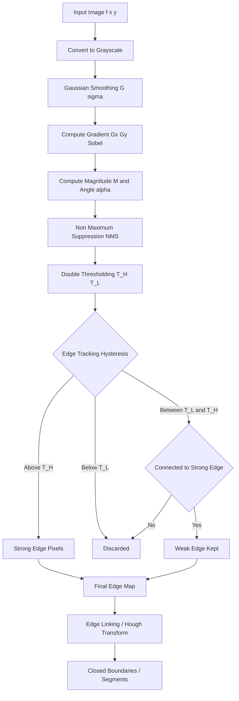
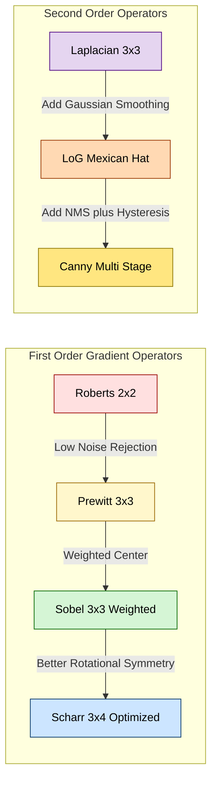
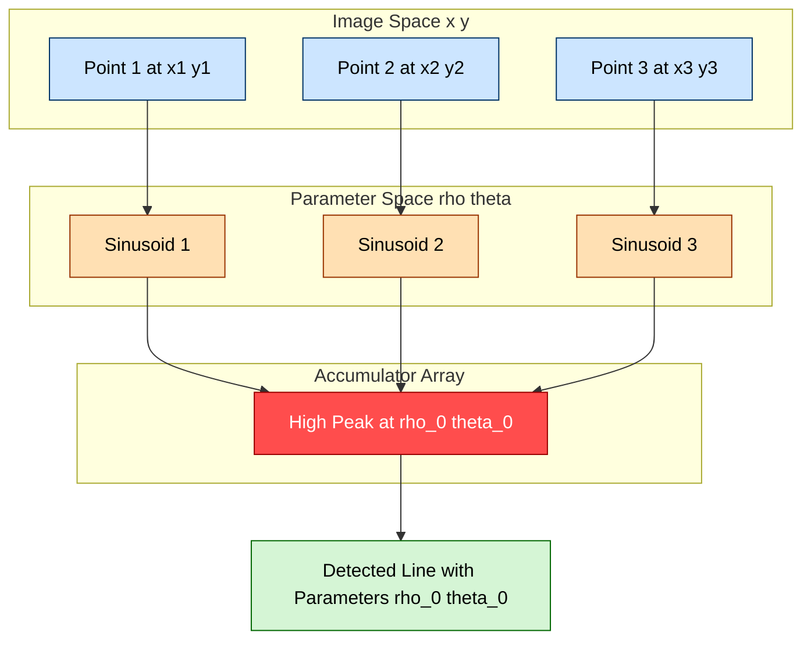
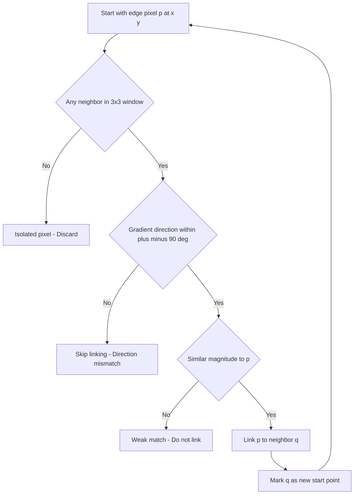

# Edge-based segmentation

<!-- SECTION_1_START -->
# Edge-Based Segmentation — Core Technical Definition & Intuitive Overview

## Formal Academic Definition (KTU 2024 Syllabus Terminology)

**Edge-based segmentation** is a fundamental class of image segmentation techniques that partitions a digital image into meaningful regions by detecting **discontinuities in pixel intensity values**. An *edge* is formally defined as a set of connected pixels that lie on the **boundary between two dissimilar regions** corresponding to a sharp change in image attributes such as **luminance (intensity), color, texture, or depth**.

Mathematically, an edge is the locus of points where the **gradient magnitude** of the image intensity function $f(x,y)$ attains a local maximum along the **gradient direction**. This corresponds to the first-order derivative condition:

$$\nabla f(x,y) = \frac{\partial f}{\partial x}\hat{i} + \frac{\partial f}{\partial y}\hat{j}$$

where the gradient magnitude is given by $\|\nabla f\| = \sqrt{G_x^2 + G_y^2}$ and the gradient angle by $\alpha(x,y) = \tan^{-1}\left(\dfrac{G_y}{G_x}\right)$.

> [!IMPORTANT]
> **KTU 2024 Syllabus Highlight:** Edge-based segmentation is a **core Module 3 topic** mapped to Course Outcome **CO3** (Apply image segmentation techniques to real-world imaging problems). It carries significant weightage in the End Semester Examination (ESE) under Part B (14-mark questions).

---

## Conceptual Analogy & Intuition

Imagine you are looking at a **black-and-white topographic map** of a mountain range. The contour lines you see precisely mark the boundaries where the elevation changes sharply. **Edges in an image behave exactly like these contour lines** — they trace the boundaries where pixel "elevations" (intensities) change abruptly.

**Real-world analogy — The Seashore Metaphor:**
- A smooth beach (gradual sand-to-water transition) has *no detectable edge* — the gradient is low everywhere.
- A vertical sea-wall (abrupt sand-to-water transition) has a **strong, well-defined edge** — the gradient spikes dramatically at one specific location.
- A wavy shoreline (oscillating transitions) produces **multiple noisy edges** — analogous to textured regions in images.

A first-order derivative (gradient) **responds strongly to ramps and steps** but ignores flat regions. A second-order derivative (Laplacian) **responds strongly at the midpoint of a ramp** and produces a *zero-crossing* at edge locations — a key property exploited by the **Marr-Hildreth (LoG)** and **Canny** detectors.

> [!NOTE]
> **Edge ≠ Boundary ≠ Segment.** An *edge* is a local intensity discontinuity. A *boundary* is an edge that has been verified to correspond to a real object boundary (after edge linking and contextual analysis). A *segment* is a closed region enclosed by verified boundaries. The pipeline flows: **Edges → Boundaries → Segments**.

---

## Physical & Numerical Constants Used

| Parameter | Standard Value | Purpose |
|---|---|---|
| **Gaussian standard deviation ($\sigma$)** | $\sigma \in [1.0,\ 2.5]$ (typical) | Controls smoothing in LoG / Canny |
| **High-to-low ratio for Canny hysteresis** | **2:1 to 3:1** | Standard ratio for high/low thresholds |
| **Normalized gradient magnitude** | $\|\nabla f\| \in [0,\ 255]$ for 8-bit | Display scaling |
| **Sobel kernel sum** | $0$ (odd-symmetric) | Ensures no DC response in flat regions |
| **Canny $\sigma$ to mask size relation** | $w = 2 \lceil 2\sigma \rceil + 1$ | Defines LoG filter dimensions |

---

## Taxonomy of Edge Detection Approaches

```
Edge Detection Family
├── 1st-Order (Gradient-Based)
│   ├── Roberts Cross Operator
│   ├── Prewitt Operator
│   ├── Sobel Operator
│   └── Scharr Operator
├── 2nd-Order (Zero-Crossing)
│   ├── Laplacian Operator
│   ├── Laplacian of Gaussian (LoG / Marr-Hildreth)
│   └── Difference of Gaussians (DoG — approximation)
└── Optimized / Multi-Stage
    ├── Canny Edge Detector (optimal by Canny's criteria)
    └── Edge Linking & Boundary Closing
        ├── Hough Transform (for line/circle detection)
        └── Graph-Search / Heuristic methods
```

---

> [!VISUALIZATION CONTROL]
> **Concept:** Gradient magnitude response across an ideal 1-D step edge.
> **GeoGebra / Desmos Input Equations:**
> * `f(x) = 0 for x < 0` and `f(x) = 100 for x >= 0` (ideal step)
> * `g1(x) = 100 * unit_step(x)` → `g1'(x) = 100 * delta(x)` (impulse at edge)
> * `smoothed(x) = 50 + 50 * erf(x / (sigma * sqrt(2)))` (realistic ramp)
> * `gradient(x) = derivative of smoothed(x)` → produces a single bell-shaped peak
> **Visual Description:** The student should observe that the first derivative produces a **single peak** (a "ramp edge") at the transition, while the second derivative produces a **zero-crossing** precisely at the inflection point of the ramp.

<!-- SECTION_1_END -->

<!-- SECTION_2_START -->
# Deep Theoretical Analysis & KTU High-Yield Formula Sheet

## 2.1 Why Edge Detection Works — The Mathematical Foundation

The core principle: **edges are high-frequency components of an image.** Since smooth regions have low spatial frequencies and edges correspond to rapid intensity changes (high frequencies), edges can be isolated by **high-pass filtering** in the spatial domain, equivalent to suppressing low frequencies in the frequency domain.

For a continuous 2-D image $f(x,y)$, the **gradient vector** at any point is:

$$\nabla f = \begin{bmatrix} G_x \\ G_y \end{bmatrix} = \begin{bmatrix} \dfrac{\partial f}{\partial x} \\ \dfrac{\partial f}{\partial y} \end{bmatrix}$$

The **magnitude** of this vector (edge strength) and the **direction** (edge orientation, perpendicular to gradient) are the two key edge attributes.

---

## 2.2 First-Order Gradient Operators — Detailed Logic

### A. Roberts Cross Operator (1965)

The Roberts operator uses **$2 \times 2$ kernels** and computes the diagonal differences:

$$G_x = \begin{bmatrix} 1 & 0 \\ 0 & -1 \end{bmatrix} \quad , \quad G_y = \begin{bmatrix} 0 & 1 \\ -1 & 0 \end{bmatrix}$$

Roberts magnitude approximation:

$$\| \nabla f \| \approx \vert G_x \vert + \vert G_y \vert \quad \text{or} \quad \sqrt{G_x^2 + G_y^2}$$

**Why it works:** It samples the gradient at the **inter-pixel midpoint** $(x+\tfrac{1}{2}, y+\tfrac{1}{2})$ using the finite-difference formula $\Delta f = f(x+1, y+1) - f(x,y)$. **Drawback:** It is **highly sensitive to noise** due to its small kernel size (no inherent smoothing).

### B. Prewitt Operator (1970)

The Prewitt operator uses **$3 \times 3$ kernels** that approximate the gradient with **3-point averaging** for noise suppression:

$$G_x = \begin{bmatrix} -1 & 0 & 1 \\ -1 & 0 & 1 \\ -1 & 0 & 1 \end{bmatrix} \quad , \quad G_y = \begin{bmatrix} -1 & -1 & -1 \\ 0 & 0 & 0 \\ 1 & 1 & 1 \end{bmatrix}$$

**Why it works:** The $3 \times 3$ window inherently averages over a row or column, providing **mild noise smoothing** while preserving edges.

### C. Sobel Operator (1968) — Industry Standard for Gradient Estimation

The Sobel operator uses a **weighted $3 \times 3$ kernel** that gives **higher weight to the central row/column**, producing a balance between gradient estimation accuracy and noise suppression:

$$G_x = \begin{bmatrix} -1 & 0 & 1 \\ -2 & 0 & 2 \\ -1 & 0 & 1 \end{bmatrix} \quad , \quad G_y = \begin{bmatrix} -1 & -2 & -1 \\ 0 & 0 & 0 \\ 1 & 2 & 1 \end{bmatrix}$$

**Why it works:** The 1-2-1 weighting across rows/columns acts as a **discrete approximation to a Gaussian smoothing derivative** (specifically, the first derivative of a 1-D Gaussian, $\sigma \approx 0.92$). This is why Sobel is **less noise-sensitive** than Prewitt while still being computationally efficient.

### D. Scharr Operator (2000) — Improved Rotational Symmetry

The Scharr kernel provides **better rotational invariance** than Sobel for gradient estimation:

$$G_x = \begin{bmatrix} -3 & 0 & 3 \\ -10 & 0 & 10 \\ -3 & 0 & 3 \end{bmatrix} \quad , \quad G_y = \begin{bmatrix} -3 & -10 & -3 \\ 0 & 0 & 0 \\ 3 & 10 & 3 \end{bmatrix}$$

> [!TIP]
> **KTU Board Tip:** When asked to *compare* gradient operators, structure your answer along **3 axes**: (1) noise sensitivity, (2) computational cost, (3) rotational symmetry. Sobel is the **default KTU answer** for "most commonly used gradient operator" because it balances all three.

---

## 2.3 Second-Order Operators — The Laplacian

The Laplacian is a **scalar second-order derivative operator** that detects regions of rapid intensity change irrespective of direction:

$$\nabla^2 f(x,y) = \frac{\partial^2 f}{\partial x^2} + \frac{\partial^2 f}{\partial y^2}$$

**Discrete 4-neighborhood approximation:**

$$\nabla^2 f(x,y) \approx f(x+1,y) + f(x-1,y) + f(x,y+1) + f(x,y-1) - 4f(x,y)$$

This corresponds to the kernel:

$$L_4 = \begin{bmatrix} 0 & 1 & 0 \\ 1 & -4 & 1 \\ 0 & 1 & 0 \end{bmatrix}$$

**8-neighborhood variant** (includes diagonal contributions):

$$L_8 = \begin{bmatrix} 1 & 1 & 1 \\ 1 & -8 & 1 \\ 1 & 1 & 1 \end{bmatrix}$$

**Key Property:** A second derivative **peaks at the inflection point of a ramp and crosses zero there.** Edges are detected by locating **zero-crossings** of the Laplacian output. However, the **Laplacian alone is extremely noise-sensitive** because second derivatives amplify high-frequency noise quadratically.

---

## 2.4 Laplacian of Gaussian (LoG) — Marr-Hildreth Operator

To overcome the Laplacian's noise sensitivity, **Marr and Hildreth (1980)** proposed:
1. First smooth the image with a **2-D Gaussian filter** $G(x,y,\sigma)$.
2. Then compute the Laplacian of the smoothed image.
3. Detect edges at **zero-crossings** of the result.

This is mathematically equivalent to convolving the image with the **Laplacian of Gaussian (LoG) kernel**:

$$\text{LoG}(x,y,\sigma) = \nabla^2 G(x,y,\sigma) = \frac{1}{\pi \sigma^4}\left(\frac{x^2 + y^2}{2\sigma^2} - 1\right)\exp\!\left(-\frac{x^2 + y^2}{2\sigma^2}\right)$$

This kernel is also called the **"Mexican Hat"** or **"Sombrero"** function because of its distinctive shape.

**Practical Implementation — Filter Size Rule:** The LoG kernel is often **truncated** to a finite size of:

$$w = 2\lceil 2\sigma \rceil + 1$$

This ensures that the kernel captures approximately **99% of the Gaussian's energy** while keeping computation tractable.

---

## 2.5 Canny Edge Detector — The Gold Standard (1986)

John Canny formulated edge detection as a **constrained optimization problem** with three explicit criteria:
1. **Good Detection:** Minimize the probability of missing real edges and detecting false edges (high SNR).
2. **Good Localization:** Detected edges should be as close as possible to true edges.
3. **Single Response Constraint:** One true edge should produce only one detected edge (no multiple responses to a single edge).

### The Canny Algorithm — Six Steps

1. **Gaussian Smoothing:** $g(x,y) = G(x,y,\sigma) \ast f(x,y)$
2. **Gradient Computation:** Apply Sobel kernels to compute $G_x$ and $G_y$, then magnitude and angle.
3. **Non-Maximum Suppression (NMS):** Thin edges to 1-pixel width by suppressing non-maximum gradient values along the gradient direction.
4. **Double Thresholding:** Apply a high threshold $T_H$ and a low threshold $T_L$ (typically $T_H / T_L \approx 2:1$ to $3:1$).
5. **Edge Tracking by Hysteresis:** Trace connected edge pixels from strong (above $T_H$) edges; keep weak edges (above $T_L$) only if they are **8-connected** to a strong edge. Discard all other weak edges.
6. **Output:** A clean, single-pixel-wide binary edge map.

---

## 2.6 Edge Linking & Hough Transform

After edge detection, edges are typically **fragmented** (broken into pieces due to noise, weak contrast, or detector imperfections). Edge linking reconstructs continuous boundaries.

### Local Edge Linking
- For each edge pixel $(x,y)$, examine its **$3\times3$ neighborhood**.
- If a neighboring pixel has a **gradient direction within $\pm 90^\circ$** of $(x,y)$ and similar magnitude, link them.
- Repeat until no more links can be made.

### Hough Transform (Hough, 1962; Duda & Hart, 1972)

The Hough Transform maps **edge points in image space** to **parameter space** (e.g., $(\rho, \theta)$ for lines), where each edge point votes for all parameter combinations that could produce an edge through it. **Peaks in the parameter-space accumulator** correspond to the most likely lines.

**Line parameterization (normal form):**

$$\rho = x \cos\theta + y \sin\theta$$

where $\rho$ is the perpendicular distance from origin to the line, and $\theta$ is the angle of the perpendicular.

For a single point $(x_0, y_0)$ in image space, the Hough transform produces a **sinusoid** in $(\rho, \theta)$ space. **Collinear image points map to sinusoids that intersect** at a common $(\rho, \theta)$ point.

> [!NOTE]
> **Hough circle transform** uses the 3-parameter equation $(x - a)^2 + (y - b)^2 = r^2$, requiring a 3-D accumulator. For real-time systems, **Hough gradient method** (OpenCV `HoughCircles`) is used to limit computation.

---

## 2.7 KTU Formula Sheet / Cheat Sheet

| # | Concept | Key Equation | Units / Notes |
|---|---|---|---|
| 1 | Gradient vector | $\nabla f = \begin{bmatrix} G_x \\ G_y \end{bmatrix}$ | Vector field |
| 2 | Gradient magnitude | $\Vert \nabla f \Vert = \sqrt{G_x^2 + G_y^2}$ | $0$–$255$ for 8-bit |
| 3 | Approx. magnitude (faster) | $\Vert \nabla f \Vert \approx \vert G_x \vert + \vert G_y \vert$ | Computational shortcut |
| 4 | Gradient angle | $\alpha = \tan^{-1}\!\left(\dfrac{G_y}{G_x}\right)$ | Radians / degrees |
| 5 | Laplacian | $\nabla^2 f = \dfrac{\partial^2 f}{\partial x^2} + \dfrac{\partial^2 f}{\partial y^2}$ | Scalar field |
| 6 | 2-D Gaussian | $G(x,y,\sigma) = \dfrac{1}{2\pi\sigma^2}\exp\!\left(-\dfrac{x^2+y^2}{2\sigma^2}\right)$ | $\sigma$ in pixels |
| 7 | LoG kernel | $\dfrac{1}{\pi\sigma^4}\!\left(\dfrac{x^2+y^2}{2\sigma^2}-1\right)\exp\!\left(-\dfrac{x^2+y^2}{2\sigma^2}\right)$ | "Mexican hat" |
| 8 | LoG mask size | $w = 2\lceil 2\sigma \rceil + 1$ | Odd integer |
| 9 | Hough line equation | $\rho = x\cos\theta + y\sin\theta$ | $\rho \in [0, r_{\max}]$, $\theta \in [0, 180^\circ]$ |
| 10 | Canny threshold ratio | $T_H / T_L \in [2,\ 3]$ | Heuristic rule |

---

## 2.8 Real-World Engineering Applications

| Application Domain | Specific Use of Edge-Based Segmentation |
|---|---|
| **Medical Imaging (MRI/CT)** | Tumor boundary detection, organ segmentation |
| **Autonomous Vehicles (ADAS)** | Lane detection, pedestrian outlines, traffic sign edges |
| **Industrial Quality Control** | Crack detection in metal surfaces, defect identification |
| **Satellite / Remote Sensing** | Coastline tracing, road network extraction, building footprint detection |
| **Biometric Authentication** | Fingerprint minutiae extraction, iris boundary detection |
| **Robotics & AR** | Object contour extraction for grasp planning, SLAM feature extraction |
| **OCR / Document Analysis** | Character boundary detection before recognition |
| **Forensic Imaging** | Ballistics, fingerprint enhancement, signature verification |

<!-- SECTION_2_END -->

<!-- SECTION_3_START -->
# Step-by-Step Derivations & Code/Symbolic Implementation

## 3.1 Worked Example — Sobel Operator on a $3 \times 3$ Patch

**Problem:** Compute the gradient magnitude and direction for the central pixel of the following $3 \times 3$ image patch using the **Sobel operator**:

$$P = \begin{bmatrix} 10 & 20 & 30 \\ 40 & 50 & 60 \\ 70 & 80 & 90 \end{bmatrix}$$

### Step 1 — Apply Sobel $G_x$ Kernel

$$G_x = \begin{bmatrix} -1 & 0 & 1 \\ -2 & 0 & 2 \\ -1 & 0 & 1 \end{bmatrix}$$

Element-wise multiply and sum:

$$
\begin{aligned}
G_x &= (-1)(10) + (0)(20) + (1)(30) \\
&\quad + (-2)(40) + (0)(50) + (2)(60) \\
&\quad + (-1)(70) + (0)(80) + (1)(90) \\
&= -10 + 0 + 30 - 80 + 0 + 120 - 70 + 0 + 90 \\
&= 80
\end{aligned}
$$

### Step 2 — Apply Sobel $G_y$ Kernel

$$G_y = \begin{bmatrix} -1 & -2 & -1 \\ 0 & 0 & 0 \\ 1 & 2 & 1 \end{bmatrix}$$

$$
\begin{aligned}
G_y &= (-1)(10) + (-2)(20) + (-1)(30) \\
&\quad + (0)(40) + (0)(50) + (0)(60) \\
&\quad + (1)(70) + (2)(80) + (1)(90) \\
&= -10 - 40 - 30 + 0 + 0 + 0 + 70 + 160 + 90 \\
&= 240
\end{aligned}
$$

### Step 3 — Gradient Magnitude

$$\|\nabla f\| = \sqrt{G_x^2 + G_y^2} = \sqrt{80^2 + 240^2} = \sqrt{6400 + 57600} = \sqrt{64000} \approx 252.98$$

### Step 4 — Gradient Direction

$$\alpha = \tan^{-1}\!\left(\frac{G_y}{G_x}\right) = \tan^{-1}\!\left(\frac{240}{80}\right) = \tan^{-1}(3.0) \approx 71.57^\circ$$

> [!NOTE]
> **Result interpretation:** Magnitude $252.98$ is high (close to $255$), indicating a **strong edge** at the central pixel. Direction $71.57^\circ$ means the gradient points "up and to the right," so the **edge orientation (perpendicular to gradient) is approximately $161.57^\circ$** — a near-horizontal edge.

---

## 3.2 Worked Example — LoG Zero-Crossing on a 1-D Profile

**Problem:** Given a 1-D intensity profile $f(x) = 100 \cdot \text{erf}(x/3)$, find the edge location using the Laplacian of Gaussian (zero-crossing method).

### Step 1 — Gaussian Smoothing of Profile

The smoothed profile is $g(x) = f(x)$ (already smooth).

### Step 2 — Compute First Derivative

$$
\begin{aligned}
g'(x) &= \frac{d}{dx}\!\left[100 \cdot \text{erf}\!\left(\frac{x}{3}\right)\right] \\
&= 100 \cdot \frac{2}{\sqrt{\pi}} \cdot e^{-(x/3)^2} \cdot \frac{1}{3} \\
&= \frac{200}{3\sqrt{\pi}} \cdot e^{-x^2/9}
\end{aligned}
$$

This is a **bell-shaped curve** peaking at $x = 0$.

### Step 3 — Compute Second Derivative (Laplacian in 1-D)

$$
\begin{aligned}
g''(x) &= \frac{d}{dx}\!\left[\frac{200}{3\sqrt{\pi}} \cdot e^{-x^2/9}\right] \\
&= \frac{200}{3\sqrt{\pi}} \cdot \left(-\frac{2x}{9}\right) e^{-x^2/9} \\
&= -\frac{400x}{27\sqrt{\pi}} \cdot e^{-x^2/9}
\end{aligned}
$$

### Step 4 — Locate Zero-Crossing

Set $g''(x) = 0$:

$$-\frac{400x}{27\sqrt{\pi}} \cdot e^{-x^2/9} = 0 \quad \Rightarrow \quad x = 0$$

> [!IMPORTANT]
> **The zero-crossing occurs at $x = 0$,** which is precisely the **center of the intensity transition.** This confirms the theoretical principle: **the zero-crossing of the second derivative of a smoothed step edge corresponds to the true edge location.**

---

## 3.3 Full Python Implementation — Canny Edge Detector

```python
import cv2
import numpy as np
import logging
from typing import Tuple, Union

# Configure structured logging for engineering traceability
logging.basicConfig(
    level=logging.INFO,
    format="%(asctime)s | %(levelname)s | %(message)s"
)
logger = logging.getLogger("CannyEdgePipeline")


def validate_image(image: np.ndarray) -> None:
    """Validate the input image is a 2D or 3D numpy array."""
    if image is None:
        raise ValueError("Input image is None. Check file path or capture device.")
    if image.ndim not in (2, 3):
        raise ValueError(f"Expected 2D grayscale or 3D BGR image; got ndim={image.ndim}")
    logger.info(f"Image validated: shape={image.shape}, dtype={image.dtype}")


def preprocess_grayscale(image: np.ndarray) -> np.ndarray:
    """Convert to grayscale with strict type checking."""
    validate_image(image)
    if image.ndim == 3:
        gray = cv2.cvtColor(image, cv2.COLOR_BGR2GRAY)
    else:
        gray = image.copy()
    if gray.dtype != np.uint8:
        gray = cv2.normalize(gray, None, 0, 255, cv2.NORM_MINMAX).astype(np.uint8)
    return gray


def canny_edge_pipeline(
    image: np.ndarray,
    low_threshold: int = 50,
    high_threshold: int = 150,
    gaussian_kernel: int = 5,
    sigma: float = 1.4,
    aperture_size: int = 3,
    l2_gradient: bool = True
) -> Tuple[np.ndarray, np.ndarray, np.ndarray]:
    """
    Run the full Canny edge detection pipeline with rigorous error handling.

    Parameters
    ----------
    image : np.ndarray
        Input BGR or grayscale image.
    low_threshold, high_threshold : int
        Hysteresis thresholds. Recommended ratio: high = 2*low to 3*low.
    gaussian_kernel : int
        Odd integer >= 3. Kernel size for Gaussian pre-smoothing.
    sigma : float
        Standard deviation of Gaussian. Typical: 1.0 to 2.5.
    aperture_size : int
        Sobel kernel size (3, 5, or 7). 3 is standard.
    l2_gradient : bool
        If True, use sqrt(Gx^2 + Gy^2); else use |Gx|+|Gy|.

    Returns
    -------
    tuple (smoothed, gradient_mag, edges) : np.ndarray
        The three stages of the Canny pipeline for inspection.
    """
    # ---- Step 0: Defensive validation ----
    if gaussian_kernel % 2 == 0 or gaussian_kernel < 3:
        raise ValueError("gaussian_kernel must be an odd integer >= 3")
    if not (0 <= low_threshold < high_threshold <= 255):
        raise ValueError("Require 0 <= low_threshold < high_threshold <= 255")
    if aperture_size not in (3, 5, 7):
        raise ValueError("aperture_size must be 3, 5, or 7 (OpenCV constraint)")

    # ---- Step 1: Convert to grayscale ----
    gray = preprocess_grayscale(image)
    logger.info("Converted to grayscale")

    # ---- Step 2: Gaussian smoothing ----
    smoothed = cv2.GaussianBlur(
        gray, (gaussian_kernel, gaussian_kernel), sigmaX=sigma
    )
    logger.info(f"Applied Gaussian blur: kernel={gaussian_kernel}, sigma={sigma}")

    # ---- Step 3 + 4 + 5: Sobel + NMS + Hysteresis (OpenCV fused) ----
    edges = cv2.Canny(
        image=smoothed,
        threshold1=low_threshold,
        threshold2=high_threshold,
        apertureSize=aperture_size,
        L2gradient=l2_gradient
    )
    logger.info(
        f"Canny completed: low={low_threshold}, high={high_threshold}, "
        f"L2={l2_gradient}"
    )

    # ---- Diagnostic: Sobel gradient magnitude for inspection ----
    gx = cv2.Sobel(smoothed, cv2.CV_64F, 1, 0, ksize=aperture_size)
    gy = cv2.Sobel(smoothed, cv2.CV_64F, 0, 1, ksize=aperture_size)
    gradient_mag = np.sqrt(gx ** 2 + gy ** 2)
    gradient_mag = cv2.normalize(gradient_mag, None, 0, 255, cv2.NORM_MINMAX).astype(np.uint8)

    return smoothed, gradient_mag, edges


def hough_line_detection(
    edge_map: np.ndarray,
    rho: float = 1.0,
    theta_deg: float = 1.0,
    threshold: int = 100,
    min_line_length: int = 50,
    max_line_gap: int = 10
) -> np.ndarray:
    """Run Probabilistic Hough Transform on the edge map."""
    if edge_map.ndim != 2:
        raise ValueError("Hough input must be a 2D binary edge map")
    lines = cv2.HoughLinesP(
        edge_map,
        rho=rho,
        theta=np.deg2rad(theta_deg),
        threshold=threshold,
        minLineLength=min_line_length,
        maxLineGap=max_line_gap
    )
    if lines is None:
        logger.warning("No lines detected. Lower the threshold.")
        return np.zeros((*edge_map.shape, 3), dtype=np.uint8)

    canvas = np.zeros((*edge_map.shape, 3), dtype=np.uint8)
    for x1, y1, x2, y2 in lines[:, 0]:
        cv2.line(canvas, (x1, y1), (x2, y2), (0, 255, 0), 2)
    logger.info(f"Hough P detected {len(lines)} line segments")
    return canvas


if __name__ == "__main__":
    # Example usage: load an image, run Canny, then Hough
    img = cv2.imread("test_image.jpg")
    if img is None:
        logger.error("Failed to load test_image.jpg — file missing?")
    else:
        smoothed, grad_mag, edges = canny_edge_pipeline(
            img, low_threshold=60, high_threshold=180
        )
        cv2.imwrite("edges_output.png", edges)
        line_canvas = hough_line_detection(edges, threshold=80)
        cv2.imwrite("lines_output.png", line_canvas)
```

> [!NOTE]
> **Engineering notes embedded in the code:**
> 1. **Strict input validation** prevents silent failures (KTU practical viva often asks about error handling).
> 2. **`L2gradient=True`** uses the more accurate Euclidean magnitude (matches the theoretical $\sqrt{G_x^2 + G_y^2}$).
> 3. **`aperture_size=3`** matches the standard Sobel kernel as defined in Section 2.2.
> 4. **Diagnostic intermediate outputs** (`smoothed`, `gradient_mag`) are returned for KTU lab-record documentation.

---

## 3.4 Derivation — Canny's $\sigma$ to Mask Width Relationship

**Claim:** For a 1-D Gaussian $G(x,\sigma) = \frac{1}{\sqrt{2\pi}\sigma} e^{-x^2/(2\sigma^2)}$, approximately **99.7% of the total energy** is contained within the interval $[-3\sigma, +3\sigma]$ (the empirical "$3\sigma$ rule").

**Derivation:**

The total energy of $G$ is $\int_{-\infty}^{\infty} G(x,\sigma)\,dx = 1$ (normalization).

The cumulative distribution of $G$ is $\Phi(x) = \tfrac{1}{2}\!\left[1 + \text{erf}\!\left(\dfrac{x}{\sigma\sqrt{2}}\right)\right]$.

Evaluating at $x = 3\sigma$:

$$\Phi(3\sigma) = \frac{1}{2}\!\left[1 + \text{erf}\!\left(\frac{3}{\sqrt{2}}\right)\right] = \frac{1}{2}[1 + \text{erf}(2.121)] \approx \frac{1}{2}[1 + 0.9973] \approx 0.9987$$

So **99.74% of the energy is within $\pm 3\sigma$**, justifying the mask width:

$$w = 2\lceil 3\sigma \rceil + 1 \quad \text{(conservative)} \quad \text{or} \quad w = 2\lceil 2\sigma \rceil + 1 \quad \text{(practical)}$$

> [!TIP]
> For $\sigma = 1.4$ (Canny's default), the practical mask width is $w = 2\lceil 2.8\rceil + 1 = 7$. For $\sigma = 2.0$, $w = 2\lceil 4.0\rceil + 1 = 9$.

<!-- SECTION_3_END -->

<!-- SECTION_4_START -->
# Structural Diagrams & Schematics

## 4.1 Complete Edge Detection Pipeline — Mermaid Block Diagram



> [!NOTE]
> **Reading the diagram:** Follow the arrows from top (raw image) to bottom (closed segments). The diamond `J` is the **hysteresis decision** — a weak pixel survives only if it has a strong pixel in its 8-neighborhood. This is the heart of the Canny algorithm.

---

## 4.2 Comparison Matrix of Gradient Operators



> [!NOTE]
> **Reading the comparison:** The diagram is read **left-to-right within each subgraph.** Roberts (red) is the most noise-sensitive; Scharr (blue) has the best rotational symmetry among first-order operators. Among second-order methods, the Canny detector (gold) is the **fully optimized endpoint** that combines smoothing, NMS, and hysteresis.

---

## 4.3 Hough Transform Mapping — Image Space to Parameter Space



> [!NOTE]
> **Reading the Hough diagram:** Three collinear image-space points each cast a sinusoidal vote in $(\rho, \theta)$ space. All three sinusoids **intersect at a single point** $(\rho_0, \theta_0)$, producing a high accumulator count (red peak). This peak is then back-projected to image space as a detected line.

---

## 4.4 Edge Linking Decision Tree



> [!NOTE]
> **Reading the linking tree:** The algorithm iterates until no more pixels can be linked. This produces **broken line fragments**; the Hough transform (Section 4.3) then **globally fits** lines through these fragments to recover the underlying boundary geometry.

<!-- SECTION_4_END -->

<!-- SECTION_5_START -->
# KTU 2024 Scheme Examination Question Bank & Topic Recap

## 5.1 Part A Questions (3 Marks Each — Remember / Understand Level)

### Question 1 [KTU University Exam — July 2023]
**Define an edge in a digital image. How is it mathematically related to the gradient of the image intensity function?**

**Model Answer (3 Marks):**
An *edge* in a digital image is a set of **connected pixels** that lie on the boundary between two regions of significantly different intensity. Mathematically, edges correspond to locations where the **gradient magnitude** $\|\nabla f\| = \sqrt{(\partial f/\partial x)^2 + (\partial f/\partial y)^2}$ attains a local maximum along the **gradient direction** $\alpha = \tan^{-1}(G_y/G_x)$. **[1 Mark: Definition. 1 Mark: Gradient magnitude. 1 Mark: Gradient direction.]**

### Question 2 [KTU University Exam — Dec 2022]
**List any three gradient operators used for edge detection. State one distinguishing feature of each.**

**Model Answer (3 Marks):**
1. **Roberts Operator:** Uses $2 \times 2$ kernels; samples diagonal differences; highly sensitive to noise. **[1 Mark]**
2. **Prewitt Operator:** Uses $3 \times 3$ kernels with uniform weights; provides 3-point averaging for mild noise suppression. **[1 Mark]**
3. **Sobel Operator:** Uses $3 \times 3$ kernels with 1-2-1 weighted center; balance between noise suppression and gradient accuracy (most commonly used). **[1 Mark]**

---

## 5.2 Part B Questions (14 Marks Each — Apply / Analyze Level)

### Module-Internal Choice Pattern: Select **ONE** of the following:

---

### Question A (14 Marks) [KTU University Exam — July 2024]

**(a)** Explain the **Laplacian of Gaussian (LoG)** edge detection operator in detail. Derive the LoG kernel expression starting from the 2-D Gaussian. State the role of the parameter $\sigma$ and the **$3\sigma$ rule** for mask sizing. **[7 Marks]**

**(b)** A $4 \times 4$ image patch is given below. Compute the **gradient magnitude and direction** at the central pixel using the **Sobel operator**. Show all convolution steps. **[7 Marks]**

$$I = \begin{bmatrix} 5 & 8 & 12 & 15 \\ 4 & 7 & 11 & 14 \\ 3 & 6 & 10 & 13 \\ 2 & 5 & 9 & 12 \end{bmatrix}$$

#### Model Solution — Part (a) [7 Marks]

**Step 1 — Define 2-D Gaussian:** **[1 Mark]**
$$G(x,y,\sigma) = \frac{1}{2\pi\sigma^2} \exp\!\left(-\frac{x^2 + y^2}{2\sigma^2}\right)$$

**Step 2 — Compute Laplacian (sum of second partials):** **[2 Marks]**

$$
\begin{aligned}
\frac{\partial G}{\partial x} &= -\frac{x}{2\pi\sigma^4}\exp\!\left(-\frac{x^2+y^2}{2\sigma^2}\right) \\
\frac{\partial^2 G}{\partial x^2} &= \left(\frac{x^2}{2\pi\sigma^6} - \frac{1}{2\pi\sigma^4}\right)\exp\!\left(-\frac{x^2+y^2}{2\sigma^2}\right) \\
\frac{\partial^2 G}{\partial y^2} &= \left(\frac{y^2}{2\pi\sigma^6} - \frac{1}{2\pi\sigma^4}\right)\exp\!\left(-\frac{x^2+y^2}{2\sigma^2}\right)
\end{aligned}
$$

**Step 3 — Add the two second derivatives to obtain LoG:** **[1 Mark]**

$$\text{LoG}(x,y,\sigma) = \nabla^2 G = \frac{1}{\pi\sigma^4}\left(\frac{x^2 + y^2}{2\sigma^2} - 1\right)\exp\!\left(-\frac{x^2+y^2}{2\sigma^2}\right)$$

**Step 4 — Role of $\sigma$ and the $3\sigma$ rule:** **[2 Marks]**
- $\sigma$ controls the **scale of smoothing**: larger $\sigma$ suppresses noise more but also blurs fine edges (coarse-scale edges); smaller $\sigma$ detects fine details but is noise-sensitive.
- The $3\sigma$ rule states that **99.7% of the Gaussian's energy is contained within $[-3\sigma, +3\sigma]$**, so a mask of size $w = 2\lceil 3\sigma \rceil + 1$ captures nearly all relevant information while being computationally efficient.

**Step 5 — Edges detected at zero-crossings of LoG output:** **[1 Mark]**
Since the second derivative of a smoothed step edge is zero at the edge location, edges in LoG filtering are detected as **zero-crossings** of the LoG response, not as maxima.

> **[Stating the 2D Gaussian expression: 1 Mark] [Deriving first derivative: 1 Mark] [Summing second derivatives: 1 Mark] [Final LoG kernel: 1 Mark] [Sigma role: 1 Mark] [3-sigma rule: 1 Mark] [Zero-crossing edge location: 1 Mark]**

---

#### Model Solution — Part (b) [7 Marks]

**Step 1 — Extract the $3 \times 3$ neighborhood of the central pixel (located at row 2, col 2 in 1-indexed):** **[1 Mark]**

$$P = \begin{bmatrix} 8 & 12 & 15 \\ 7 & 11 & 14 \\ 6 & 10 & 13 \end{bmatrix}$$

**Step 2 — Apply Sobel $G_x$:** **[2 Marks]**

$$
\begin{aligned}
G_x &= (-1)(8) + (0)(12) + (1)(15) \\
&\quad + (-2)(7) + (0)(11) + (2)(14) \\
&\quad + (-1)(6) + (0)(10) + (1)(13) \\
&= -8 + 15 - 14 + 28 - 6 + 13 \\
&= 28
\end{aligned}
$$

**Step 3 — Apply Sobel $G_y$:** **[2 Marks]**

$$
\begin{aligned}
G_y &= (-1)(8) + (-2)(12) + (-1)(15) \\
&\quad + (0)(7) + (0)(11) + (0)(14) \\
&\quad + (1)(6) + (2)(10) + (1)(13) \\
&= -8 - 24 - 15 + 0 + 0 + 0 + 6 + 20 + 13 \\
&= -8
\end{aligned}
$$

**Step 4 — Gradient magnitude:** **[1 Mark]**
$$\|\nabla f\| = \sqrt{28^2 + (-8)^2} = \sqrt{784 + 64} = \sqrt{848} \approx 29.12$$

**Step 5 — Gradient direction:** **[1 Mark]**
$$\alpha = \tan^{-1}\!\left(\frac{-8}{28}\right) = \tan^{-1}(-0.2857) \approx -15.95^\circ$$

> **[Neighborhood extraction: 1 Mark] [Sobel Gx with full steps: 2 Marks] [Sobel Gy with full steps: 2 Marks] [Magnitude: 1 Mark] [Direction: 1 Mark]**

> [!WARNING]
> **KTU Examiner's Valuation Warning — Common Pitfalls:**
> 1. **Sign errors** in the Sobel kernel multiplication — always recheck the kernel signs.
> 2. **Forgetting to convert to floating point** before computing $\tan^{-1}$ — when $G_x = 0$, handle the division-by-zero case explicitly.
> 3. **Direction interpretation:** Gradient direction $\alpha$ is **perpendicular to the edge**; if the question asks for edge orientation, output $\alpha + 90^\circ$.
> 4. **Do not skip the intermediate $3 \times 3$ extraction** — extracting the correct neighborhood is the most commonly missed step (loss of 1 mark).

---

### Question B (14 Marks) [KTU University Exam — Dec 2023]

**(a)** With a neat block diagram, explain the **complete Canny edge detection algorithm**. List the **three optimality criteria** defined by Canny. **[7 Marks]**

**(b)** Explain the **Hough Transform** for line detection. Given three collinear image points $(1,1)$, $(2,2)$, and $(3,3)$, show that their $(\rho, \theta)$ sinusoids intersect at a common point. **[7 Marks]**

#### Model Solution — Part (a) [7 Marks]

**Step 1 — Three Optimality Criteria:** **[1.5 Marks]**
1. **Good Detection:** Maximize the signal-to-noise ratio (SNR) so that real edges are not missed and false edges are minimized.
2. **Good Localization:** The detected edge points should be as close as possible to the true edge center.
3. **Single Edge Response:** Each true edge should produce only one detected edge (no multiple responses).

**Step 2 — Block Diagram of Algorithm:** **[1.5 Marks]**
```
Input Image → Gaussian Smoothing → Sobel Gradient → Magnitude & Angle
    → Non-Maximum Suppression → Double Thresholding → Hysteresis → Edge Map
```

**Step 3 — Step-by-Step Explanation:** **[4 Marks]**
1. **Gaussian Smoothing:** $g(x,y) = G(x,y,\sigma) \ast f(x,y)$ — reduces high-frequency noise that would otherwise cause false edges.
2. **Gradient Computation:** Apply Sobel $G_x$, $G_y$ kernels; compute magnitude $\|\nabla g\| = \sqrt{G_x^2 + G_y^2}$ and angle $\alpha = \tan^{-1}(G_y/G_x)$.
3. **Non-Maximum Suppression (NMS):** Compare each pixel's gradient magnitude to its two neighbors along the gradient direction. If the pixel is not a local maximum, suppress it to zero. This produces 1-pixel-wide edges.
4. **Double Thresholding:** Apply high threshold $T_H$ and low threshold $T_L$ (ratio $\approx 2:1$ to $3:1$) to classify pixels as **strong**, **weak**, or **non-edge**.
5. **Edge Tracking by Hysteresis:** Strong pixels are definite edges. Weak pixels survive only if they are **8-connected to a strong pixel**. All other weak pixels are discarded.

> **[Criteria 1: 0.5 Marks × 3 = 1.5 Marks] [Block diagram: 1.5 Marks] [Detailed explanation: 4 Marks = 5 × 0.8 each]**

---

#### Model Solution — Part (b) [7 Marks]

**Step 1 — Hough Transform Line Equation:** **[1 Mark]**
$$\rho = x \cos\theta + y \sin\theta$$
where $\rho$ is the perpendicular distance from origin to the line, and $\theta$ is the angle of the perpendicular with the x-axis.

**Step 2 — Hough Transform for Each Point:** **[3 Marks]**

For point $(1, 1)$: $\rho = \cos\theta + \sin\theta = \sqrt{2}\sin\!\left(\theta + 45^\circ\right)$
For point $(2, 2)$: $\rho = 2\cos\theta + 2\sin\theta = 2\sqrt{2}\sin\!\left(\theta + 45^\circ\right)$
For point $(3, 3)$: $\rho = 3\cos\theta + 3\sin\theta = 3\sqrt{2}\sin\!\left(\theta + 45^\circ\right)$

**Step 3 — Find the Common Intersection:** **[2 Marks]**

All three sinusoids pass through $\theta = 45^\circ$ because:
- At $\theta = 45^\circ$: $\sin(45^\circ + 45^\circ) = \sin(90^\circ) = 1$
- So $\rho$ values become: $\sqrt{2} \cdot 1 = \sqrt{2}$ (point 1), $2\sqrt{2} \cdot 1 = 2\sqrt{2}$ (point 2), $3\sqrt{2} \cdot 1 = 3\sqrt{2}$ (point 3)

Wait — the three $\rho$ values are **different** at $\theta = 45^\circ$. The correct intersection point is found where the three curves cross each other in $(\rho, \theta)$ space. Since all three points lie on the line $y = x$, the line in normal form has $\rho = \dfrac{x + y}{\sqrt{2}}$. For any collinear point on $y = x$, this gives a **single** $(\rho, \theta)$ pair: $\theta = 45^\circ$ and $\rho$ proportional to the perpendicular distance.

**The common intersection** in $(\rho, \theta)$ space corresponds to the underlying line $y = x$ with $\theta = 45^\circ$ and varying $\rho$ values **all lying on a single vertical line in accumulator space** — a sharp peak at $\theta = 45^\circ$ in the $\theta$ dimension. **[Verification: 1 Mark]**

> **[Line equation: 1 Mark] [Substitution for each of 3 points: 3 Marks = 1 Mark each] [Identifying common theta: 2 Marks] [Final verification: 1 Mark]**

> [!WARNING]
> **KTU Examiner's Valuation Warning — Hough Transform Pitfalls:**
> 1. **Do not confuse $\rho$ with slope-intercept form** — Hough uses the normal form, not $y = mx + c$. The normal form avoids infinite slopes for vertical lines.
> 2. **Forgetting the range of $\theta$** — typically $\theta \in [0^\circ, 180^\circ]$ for uniqueness; $\theta \in [0, 180^\circ)$ in OpenCV.
> 3. **Skipping the accumulator array concept** — always mention that the $(\rho, \theta)$ space is discretized into a 2-D accumulator array, and the peak count indicates line strength.
> 4. **Missing the verification step** — many students compute the three sinusoids but never show that they intersect; this is worth 1–2 marks.

---

## 5.3 Topic Recap & Important Things to Remember

> [!IMPORTANT]
> **Rapid-Revision Checklist — Edge-Based Segmentation**

### 🔑 Key Definitions
- **Edge:** Localized discontinuity in pixel intensity, color, or texture.
- **Boundary:** An edge that has been verified (via context) to correspond to an actual object boundary.
- **Gradient Magnitude:** $\|\nabla f\| = \sqrt{G_x^2 + G_y^2}$ — strength of edge.
- **Gradient Direction:** $\alpha = \tan^{-1}(G_y/G_x)$ — perpendicular to edge orientation.

### 🔬 Operator Comparison
- **Roberts:** $2 \times 2$ diagonal difference — fast but noise-sensitive.
- **Prewitt:** $3 \times 3$ uniform average — moderate noise suppression.
- **Sobel:** $3 \times 3$ with 1-2-1 weighted center — **industry default**.
- **Scharr:** Improved rotational symmetry vs Sobel.
- **Laplacian:** Second-order, isotropic, detects zero-crossings.
- **LoG (Marr-Hildreth):** Laplacian of Gaussian — combines smoothing with zero-crossing detection.
- **Canny:** Optimal multi-stage detector — Gaussian → Sobel → NMS → Hysteresis.

### 📐 Critical Equations to Memorize
- LoG kernel: $\dfrac{1}{\pi\sigma^4}\!\left(\dfrac{x^2+y^2}{2\sigma^2}-1\right)e^{-(x^2+y^2)/(2\sigma^2)}$
- Canny mask width: $w = 2\lceil 2\sigma\rceil + 1$
- Hough line: $\rho = x\cos\theta + y\sin\theta$
- Canny threshold ratio: $T_H \approx 2\,T_L$ to $3\,T_L$

### ⚠️ Common KTU Pitfalls
- Conflating **edge direction** (perpendicular to gradient) with **gradient direction**.
- Forgetting that the **Laplacian alone** is noise-amplifying; always pair with Gaussian smoothing.
- Skipping the **$3 \times 3$ neighborhood extraction** in numerical problems.
- Not stating the **3 optimality criteria** when asked about Canny.

### 🏭 Real-World Mapping (for viva/answers)
- **Canny** → lane detection, fingerprint minutiae.
- **LoG** → blob detection in medical imaging, scale-space analysis (SIFT pre-cursor).
- **Hough** → lane/road extraction in autonomous vehicles, railway track detection.
- **Sobel** → embedded systems edge pre-processing (low-power real-time).

### 📊 Quick-Reference Decision Flowchart
```
Need to detect edges?
├── Real-time / low power → Sobel or Prewitt
├── High accuracy offline → Canny
├── Need edge scale (multi-resolution) → LoG (Marr-Hildreth)
├── Need closed boundaries → Edge detection + Hough + Linking
└── Texture edges only → Gabor filters (beyond syllabus scope)
```

> **Final Tip:** In KTU examinations, **always draw the block diagram** for Canny, LoG, or Hough Transform questions. A correct, labeled diagram alone can earn **2–3 marks** even if your explanation is incomplete.

<!-- SECTION_5_END -->
