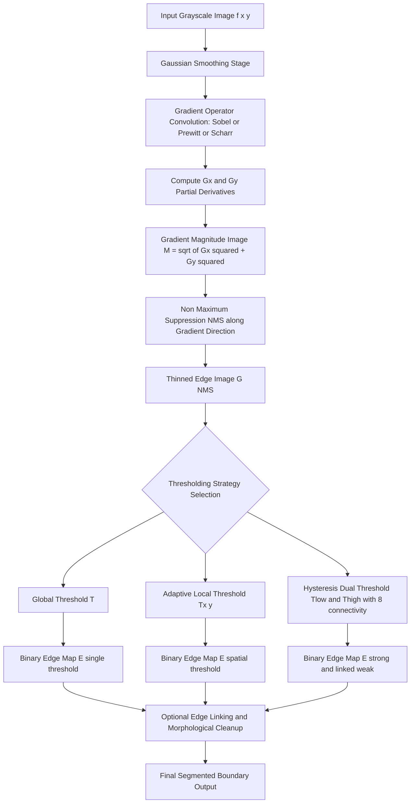
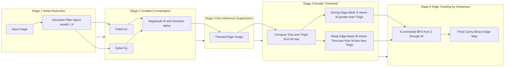
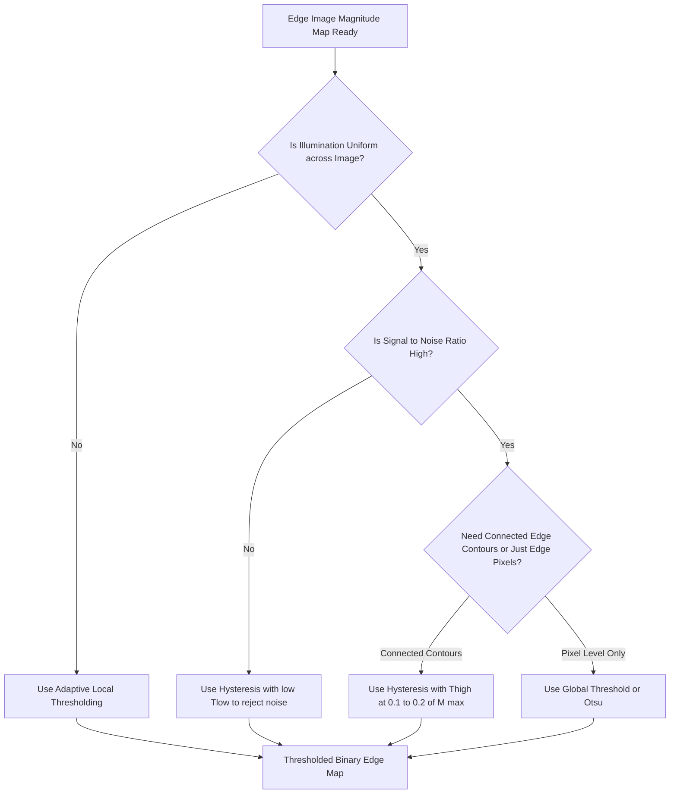

# Edge Image Thresholding

<!-- SECTION_1_START -->
# Edge Image Thresholding — KTU 2024 (PECST636 / Module 3)

## 1.1 Formal Academic Definition

> [!IMPORTANT]
> **Definition (KTU Syllabus Aligned):** **Edge Image Thresholding** is a fundamental *point-detection–driven* segmentation technique in which the **gradient magnitude image** (also called the *edge image*) produced by an edge operator (Roberts, Prewitt, Sobel, Canny, Laplacian of Gaussian, etc.) is compared against a scalar threshold $T$ (or a pair of thresholds $T_{low}, T_{high}$) to produce a *binary edge map* $E(x, y)$ where pixels above the threshold are declared as *true edge pixels* and below as *non-edge pixels*.

Mathematically, the thresholding operator $\mathcal{T}$ maps a grayscale edge image $G(x, y)$ to a binary output:

$$
E(x, y) = \mathcal{T}(G(x, y)) = 
\begin{cases}
1, & G(x, y) \geq T \\
0, & G(x, y) < T
\end{cases}
$$

For **hysteresis (dual) thresholding** (used inside the Canny edge detector):

$$
E(x, y) = 
\begin{cases}
1, & G(x, y) \geq T_{high} \\
1, & T_{low} \leq G(x, y) < T_{high} \ \text{and pixel is 8-connected to a strong edge} \\
0, & \text{otherwise}
\end{cases}
$$

---

## 1.2 Intuitive Analogy — The "Topographical Contour Map"

Imagine you are looking at a **topographical map of a mountain range**. The *height* at each point is the gradient magnitude $G(x, y)$ — high where the terrain rises sharply (cliffs, ridges) and low on flat plateaus. **Edge Image Thresholding** is the act of **drawing a single contour line at a chosen elevation $T$**: every region *above* the line becomes "edge," every region *below* becomes "background."

If you choose a **low $T$**, you trace many small bumps (noisy edges); if you choose a **high $T$**, you only catch the tallest peaks (missing real edges). The art of edge thresholding is choosing $T$ wisely.

For **hysteresis thresholding**, you draw **two contour lines** — a *low* and a *high* elevation. Any peak piercing the high line is a confirmed peak; smaller peaks are kept **only if they are physically connected** to a tall peak (a ridge walker's rule: don't claim a foothill is a summit unless it's joined to one).

---

## 1.3 Core Terminology (Must Memorize for KTU)

| Term | Meaning |
| :--- | :--- |
| **Gradient Magnitude** | $\vert \nabla f \vert = \sqrt{G_x^2 + G_y^2}$ — the *edge image* itself |
| **Threshold $T$** | Scalar cutoff against which the edge image is compared |
| **Binary Edge Map** | Output $E(x, y) \in \{0, 1\}$ where 1 = edge, 0 = non-edge |
| **Hysteresis** | Dual-threshold scheme that uses *8-connectivity* to link weak edges to strong ones |
| **Non-Maximum Suppression (NMS)** | Pre-thresholding step that *thins* edges to 1-pixel width along the gradient direction |
| **Global Threshold** | Single $T$ applied to the entire image |
| **Local / Adaptive Threshold** | $T(x, y)$ varies spatially based on local neighborhood statistics |
| **Edge Linking** | Post-thresholding step that joins fragmented edge segments into continuous contours |

> [!NOTE]
> **KTU Board Exam Tip:** Most students lose marks by confusing *edge detection* (which produces a grayscale gradient image) with *edge image thresholding* (which converts that image into a binary map). Always state both stages explicitly.

---

## 1.4 Visualization — Threshold Function on a 1-D Edge Profile

> [!VISUALIZATION CONTROL]
> **Concept:** Plot of an edge image profile $G(x)$ vs. the binary output $E(x)$ after applying a global threshold $T = 100$.
> **GeoGebra / Desmos Input Equations:**
> * `G(x) = 150 * exp(-((x - 2)^2) / 0.5) + 80 * exp(-((x - 6)^2) / 0.8)`
> * `T = 100`
> * `E(x) = if(G(x) >= T, 1, 0)`
> **Visual Description:** You will see a smooth two-humped curve (the gradient profile across two adjacent edges). Draw a horizontal red line at $y = T = 100$. The parts of the curve rising above this line are marked as `1`; the rest are `0`. This visually demonstrates how thresholding converts continuous edge strength into a discrete edge map.

<!-- SECTION_1_END -->

<!-- SECTION_2_START -->
# 2. Deep Theoretical Analysis & KTU High-Yield Formula Sheet

## 2.1 The Edge Image Pipeline (Why Thresholding?)

Edge operators such as **Sobel**, **Prewitt**, **Roberts**, and the **Laplacian of Gaussian (LoG)** return *real-valued* gradient estimates. The numerical value of $G(x, y)$ at a pixel is **proportional to the local intensity contrast**, not a binary label. The pipeline is:

1. **Smoothing** (optional but recommended — Gaussian filtering to suppress noise)
2. **Gradient Computation** — $G_x, G_y$ via convolution masks
3. **Magnitude Assembly** — $\vert \nabla f \vert = \sqrt{G_x^2 + G_y^2}$ or its approximation $\vert G_x \vert + \vert G_y \vert$
4. **Non-Maximum Suppression (NMS)** — Thins edges to single-pixel width
5. **Thresholding** — Converts the magnitude image into the binary edge map
6. **Edge Linking** (optional) — Connects broken contours

Step 5 is the focus of this module. Without it, the output is a *gradient image* (continuous tones), not a usable *segmentation map*.

---

## 2.2 Theoretical Categories of Edge Image Thresholding

### 2.2.1 Global Thresholding
A single scalar $T$ is applied to every pixel in the image. Best suited for images with strong, well-separated edge responses and uniform illumination.

$$
T = \text{median}(G) + k \cdot \sigma(G), \quad k \in [0.5, 2.0]
$$

A common KTU-tricky variant uses **Otsu's method** on the *edge image histogram* (not the original image histogram) to maximize inter-class variance $\sigma_B^2$:

$$
\sigma_B^2(t) = \omega_0(t)\,\omega_1(t)\,\left[\mu_0(t) - \mu_1(t)\right]^2
$$

where $\omega_0, \omega_1$ are the cumulative probabilities and $\mu_0, \mu_1$ the class means of the edge-image histogram split at intensity $t$.

### 2.2.2 Local (Adaptive) Thresholding
The threshold varies spatially:

$$
T(x, y) = \mu_{\text{local}}(x, y) + C \cdot \sigma_{\text{local}}(x, y)
$$

where $\mu_{\text{local}}, \sigma_{\text{local}}$ are computed over an $n \times n$ window centered at $(x, y)$, and $C$ is a bias constant. This compensates for **non-uniform illumination** that would otherwise make global thresholding fail.

### 2.2.3 Hysteresis Thresholding (Canny's Contribution)
Two thresholds are used:

$$
T_{high} = k_{high} \cdot \max(G), \qquad T_{low} = k_{low} \cdot T_{high}, \quad 0 < k_{low} < k_{high} < 1
$$

Typical values: $k_{high} \in [0.1, 0.2]$, $k_{low} \in [0.04, 0.1]$.

**Algorithm:**
1. Mark all pixels with $G(x, y) \geq T_{high}$ as **strong edges** (definite).
2. Mark all pixels with $G(x, y) \geq T_{low}$ but $< T_{high}$ as **weak edges** (candidates).
3. Discard weak edges that are *not* 8-connected to any strong edge.
4. Retain weak edges that are 8-connected to a strong edge.

> [!NOTE]
> **Engineering Utility:** Hysteresis thresholding is the de-facto choice in **medical imaging** (tumor boundary detection in MRI/CT), **autonomous vehicles** (lane-line detection), and **PCB defect inspection**, because it suppresses isolated noise pixels (low $T_{low}$ discards them) while preserving *continuous* edge contours (the connectivity rule rescues true but lower-magnitude edges).

---

## 2.3 KTU High-Yield Formula Sheet

| # | Formula / Concept | Mathematical Form | Notes / Units |
| :-- | :--- | :--- | :--- |
| 1 | Gradient Vector | $\nabla f = \left[\dfrac{\partial f}{\partial x}, \dfrac{\partial f}{\partial y}\right]^T$ | 2-D vector field |
| 2 | Gradient Magnitude | $\vert \nabla f \vert = \sqrt{G_x^2 + G_y^2}$ | Continuous edge strength |
| 3 | Approx. Magnitude (faster) | $\vert \nabla f \vert \approx \vert G_x \vert + \vert G_y \vert$ | Used for real-time systems |
| 4 | Gradient Direction | $\theta(x, y) = \arctan\!\left(\dfrac{G_y}{G_x}\right)$ | In radians; NMS uses this |
| 5 | Sobel Masks (3×3) | $G_x = \begin{bmatrix} -1 & 0 & 1 \\ -2 & 0 & 2 \\ -1 & 0 & 1 \end{bmatrix}$, $\ G_y = \begin{bmatrix} -1 & -2 & -1 \\ 0 & 0 & 0 \\ 1 & 2 & 1 \end{bmatrix}$ | Optimum ramp response |
| 6 | Prewitt Masks (3×3) | $G_x = \begin{bmatrix} -1 & 0 & 1 \\ -1 & 0 & 1 \\ -1 & 0 & 1 \end{bmatrix}$, $\ G_y = \begin{bmatrix} -1 & -1 & -1 \\ 0 & 0 & 0 \\ 1 & 1 & 1 \end{bmatrix}$ | Simpler, unweighted |
| 7 | Roberts Cross (2×2) | $G_x = \begin{bmatrix} 1 & 0 \\ 0 & -1 \end{bmatrix}$, $\ G_y = \begin{bmatrix} 0 & 1 \\ -1 & 0 \end{bmatrix}$ | Diagonal, fast but noisy |
| 8 | Laplacian of Gaussian | $\text{LoG}(x, y) = -\dfrac{1}{\pi \sigma^4}\!\left[1 - \dfrac{x^2 + y^2}{2\sigma^2}\right] e^{-\frac{x^2 + y^2}{2\sigma^2}}$ | $\sigma$ = Gaussian std-dev |
| 9 | Global Threshold Rule | $E(x, y) = 1 \iff G(x, y) \geq T$ | Output ∈ {0, 1} |
| 10 | Hysteresis Rule | Strong: $G \geq T_{high}$; Weak: $T_{low} \leq G < T_{high}$ linked to strong | Canny's scheme |
| 11 | Otsu Between-Class Var. | $\sigma_B^2(t) = \omega_0(t)\,\omega_1(t)\,[\mu_0(t) - \mu_1(t)]^2$ | Maximize over $t$ |
| 12 | Adaptive Local Threshold | $T(x, y) = \mu_{w}(x, y) + C \cdot \sigma_{w}(x, y)$ | $w$ = local window |
| 13 | Edge Density | $\rho = \dfrac{1}{MN}\sum_{x, y} E(x, y)$ | Used in auto-threshold heuristics |
| 14 | Canny's $T_{high}$ Heuristic | $T_{high} = 0.10 \cdot \max(G)$ | Empirical, KTU favorite |
| 15 | 8-Connectivity (N₈) | $N_8(p) = \{q : \max(\vert x_p - x_q \vert, \vert y_p - y_q \vert) = 1\}$ | Used in hysteresis linking |

> [!IMPORTANT]
> **Units Reminder:** All $G_x, G_y, G$ are in *intensity units per pixel* (dimensionless, but functionally tied to the original image's bit depth — e.g., 0–255 for 8-bit grayscale). Thresholds $T, T_{low}, T_{high}$ carry the same units.

---

## 2.4 Why Edge Image Thresholding Matters in Real Engineering

| Domain | Application | Why Thresholding? |
| :--- | :--- | :--- |
| **Medical Imaging** | Tumor / organ boundary extraction in MRI, CT, Ultrasound | Hysteresis thresholding preserves faint membrane boundaries while discarding speckle noise |
| **Autonomous Driving** | Lane detection, road-sign recognition | Adaptive thresholding copes with shadow patches and uneven daylight |
| **PCB / Wafer Inspection** | Defect detection on circuit boards | Edge density $\rho$ (Eq. 13) is used to flag abnormal regions |
| **Document Analysis** | OCR pre-processing, table extraction | Global thresholding on the gradient image cleanly isolates text strokes |
| **Satellite Imaging** | Building footprint extraction | Hysteresis + edge linking delineates rooflines under haze and low contrast |

<!-- SECTION_2_END -->

<!-- SECTION_3_START -->
# 3. Step-by-Step Derivations & Code/Symbolic Implementation

## 3.1 Derivation: From Continuous Gradient to Binary Edge Map

We start with a continuous 2-D intensity function $f(x, y)$. The gradient vector is

$$
\nabla f(x, y) = \begin{bmatrix} G_x \\ G_y \end{bmatrix} = \begin{bmatrix} \dfrac{\partial f}{\partial x} \\[6pt] \dfrac{\partial f}{\partial y} \end{bmatrix}
$$

The **magnitude** is the Euclidean norm:

$$
M(x, y) = \vert \nabla f \vert = \sqrt{G_x^2 + G_y^2}
$$

The **direction** is

$$
\alpha(x, y) = \arctan\!\left(\frac{G_y}{G_x}\right)
$$

After NMS, every pixel not a local maximum along $\alpha$ is zeroed. We denote the *thinned edge image* as $G_{NMS}(x, y)$. The thresholding operator is then applied:

$$
E(x, y) = 
\begin{cases}
1, & G_{NMS}(x, y) \geq T \\
0, & G_{NMS}(x, y) < T
\end{cases}
$$

For **Canny's hysteresis** the derivation is two-stage. Let $S$ = set of strong edges, $W$ = set of weak edges, and $C(q)$ denote "pixel $q$ is 8-connected to at least one pixel in $S$":

$$
S = \{(x, y) : G_{NMS}(x, y) \geq T_{high}\}
$$

$$
W = \{(x, y) : T_{low} \leq G_{NMS}(x, y) < T_{high}\}
$$

$$
E(x, y) = 
\begin{cases}
1, & (x, y) \in S \\
1, & (x, y) \in W \ \text{and} \ C(x, y) = \text{true} \\
0, & \text{otherwise}
\end{cases}
$$

---

## 3.2 Worked Numerical Example (KTU Board Style)

**Problem:** A 3×3 sub-block of a non-maximum-suppressed gradient magnitude image is given below. Apply a *global threshold* $T = 30$ and produce the binary edge map $E$.

$$
G = \begin{bmatrix} 12 & 45 & 8 \\ 50 & 100 & 25 \\ 15 & 70 & 10 \end{bmatrix}
$$

**Step 1 — Element-wise comparison with $T = 30$:**

Row 1: $12 < 30 \Rightarrow 0$; $\ 45 \geq 30 \Rightarrow 1$; $\ 8 < 30 \Rightarrow 0$

Row 2: $50 \geq 30 \Rightarrow 1$; $\ 100 \geq 30 \Rightarrow 1$; $\ 25 < 30 \Rightarrow 0$

Row 3: $15 < 30 \Rightarrow 0$; $\ 70 \geq 30 \Rightarrow 1$; $\ 10 < 30 \Rightarrow 0$

**Step 2 — Output binary edge map:**

$$
E = \begin{bmatrix} 0 & 1 & 0 \\ 1 & 1 & 0 \\ 0 & 1 & 0 \end{bmatrix}
$$

**Step 3 — Edge density (bonus, 1 mark):**

$$
\rho = \frac{1}{MN}\sum_{x, y} E(x, y) = \frac{4}{9} \approx 0.444
$$

> [!NOTE]
> **Valuation Key (KTU Pattern):** Stating the threshold rule: 1 mark. Element-wise comparison: 2 marks. Final binary matrix: 1 mark. (Total 4 marks for this sub-question.)

---

## 3.3 Worked Numerical Example — Hysteresis Thresholding

**Problem:** The same gradient matrix $G$ is given. Let $T_{high} = 60$, $T_{low} = 30$. Apply Canny's hysteresis thresholding and connectivity rule.

**Step 1 — Identify strong edges $S$:** pixels with $G \geq 60$:

$$
S = \{(1, 1), (2, 1), (2, 0)\} \quad \text{with values } 100, 70
$$

**Step 2 — Identify weak edges $W$:** pixels with $30 \leq G < 60$:

$$
W = \{(0, 1), (1, 0), (2, 2)\} \quad \text{with values } 45, 50, 25 \ \text{(25 not in W, correct)} \to W = \{(0, 1), (1, 0)\}
$$

Wait — re-checking the matrix indices with 0-based indexing:

$G = \begin{bmatrix} G_{00}=12 & G_{01}=45 & G_{02}=8 \\ G_{10}=50 & G_{11}=100 & G_{12}=25 \\ G_{20}=15 & G_{21}=70 & G_{22}=10 \end{bmatrix}$

- $S = \{(1, 1), (2, 1)\}$ with $G = 100, 70$ (and $G_{10} = 50$ is *not* $\geq 60$, so excluded).
- $W = \{(0, 1), (1, 0)\}$ with $G = 45, 50$.

**Step 3 — Connectivity check:** Is $G_{01} = 45$ (weak) 8-connected to any pixel in $S$? Its 8-neighbors include $G_{10} = 50$ and $G_{11} = 100$. Since $G_{11} \in S$, $G_{01}$ is retained. Similarly, $G_{10} = 50$ has $G_{11} = 100$ as a neighbor, so it is retained.

**Step 4 — Final binary map $E$:**

$$
E = \begin{bmatrix} 0 & 1 & 0 \\ 1 & 1 & 0 \\ 0 & 1 & 0 \end{bmatrix}
$$

> [!NOTE]
> **Mark Allocation (KTU):** Identifying $S$: 1 mark. Identifying $W$: 1 mark. Connectivity check (BFS/DFS reasoning): 2 marks. Final $E$: 1 mark.

---

## 3.4 Python Implementation — Full Edge Image Thresholding Pipeline

```python
"""
Edge Image Thresholding — KTU Module 3 Demonstration
Author: KTU 2024 Scheme Study Reference
Course : PECST636 - Digital Image Processing
"""

from __future__ import annotations

import logging
from pathlib import Path
from typing import Tuple

import cv2
import numpy as np

logging.basicConfig(
    level=logging.INFO,
    format="%(asctime)s [%(levelname)s] %(message)s",
)
logger = logging.getLogger("EdgeThresholding")


# ---------------------------------------------------------------------
# 1.  Edge Image Generation
# ---------------------------------------------------------------------
def compute_edge_image(image_gray: np.ndarray) -> Tuple[np.ndarray, np.ndarray, np.ndarray]:
    """
    Compute the gradient magnitude edge image using Sobel, Prewitt, and Scharr operators.

    Returns
    -------
    sobel_mag  : (H, W) float64   - Sobel gradient magnitude
    prewitt_mag: (H, W) float64   - Prewitt gradient magnitude
    scharr_mag : (H, W) float64   - Scharr gradient magnitude
    """
    if image_gray.dtype != np.float64:
        image_gray = image_gray.astype(np.float64)

    # ----- Sobel -----
    gx_sobel = cv2.Sobel(image_gray, cv2.CV_64F, 1, 0, ksize=3)
    gy_sobel = cv2.Sobel(image_gray, cv2.CV_64F, 0, 1, ksize=3)
    sobel_mag = np.sqrt(gx_sobel ** 2 + gy_sobel ** 2)

    # ----- Prewitt (manual 3x3 masks) -----
    prewitt_x = np.array([[-1, 0, 1], [-1, 0, 1], [-1, 0, 1]], dtype=np.float64)
    prewitt_y = np.array([[-1, -1, -1], [0, 0, 0], [1, 1, 1]], dtype=np.float64)
    gx_prewitt = cv2.filter2D(image_gray, -1, prewitt_x)
    gy_prewitt = cv2.filter2D(image_gray, -1, prewitt_y)
    prewitt_mag = np.sqrt(gx_prewitt ** 2 + gy_prewitt ** 2)

    # ----- Scharr (higher-accuracy 3x3) -----
    gx_scharr = cv2.Scharr(image_gray, cv2.CV_64F, 1, 0)
    gy_scharr = cv2.Scharr(image_gray, cv2.CV_64F, 0, 1)
    scharr_mag = np.sqrt(gx_scharr ** 2 + gy_scharr ** 2)

    logger.info("Edge images computed: Sobel max=%.2f, Prewitt max=%.2f, Scharr max=%.2f",
                sobel_mag.max(), prewitt_mag.max(), scharr_mag.max())
    return sobel_mag, prewitt_mag, scharr_mag


# ---------------------------------------------------------------------
# 2.  Global Thresholding
# ---------------------------------------------------------------------
def global_threshold(edge_image: np.ndarray, t: float) -> np.ndarray:
    """
    Apply a single global threshold T to the edge image.

    E(x, y) = 1 if edge_image(x, y) >= T else 0
    """
    if t < 0:
        raise ValueError(f"Threshold T must be non-negative; got {t}")
    binary_edge_map = (edge_image >= t).astype(np.uint8)
    edge_density = binary_edge_map.mean()
    logger.info("Global thresholding: T=%.2f, edge density=%.4f", t, edge_density)
    return binary_edge_map


# ---------------------------------------------------------------------
# 3.  Adaptive (Local) Thresholding
# ---------------------------------------------------------------------
def adaptive_threshold(edge_image: np.ndarray, window: int = 15, c: float = 5.0) -> np.ndarray:
    """
    Local mean + C*std adaptive threshold on the edge image.

    T(x, y) = mean_local(x, y) + C * std_local(x, y)
    """
    if window % 2 == 0 or window < 3:
        raise ValueError(f"Window size must be an odd integer >= 3; got {window}")

    img32 = edge_image.astype(np.float32)
    mean_local = cv2.boxFilter(img32, -1, (window, window), normalize=True)
    sqr_local = cv2.boxFilter(img32 ** 2, -1, (window, window), normalize=True)
    std_local = np.sqrt(np.maximum(sqr_local - mean_local ** 2, 0.0))

    t_local = mean_local + c * std_local
    binary_edge_map = (edge_image >= t_local).astype(np.uint8)
    logger.info("Adaptive thresholding done: window=%d, C=%.2f", window, c)
    return binary_edge_map


# ---------------------------------------------------------------------
# 4.  Canny-style Hysteresis Thresholding
# ---------------------------------------------------------------------
def hysteresis_threshold(
    edge_image: np.ndarray,
    t_low_ratio: float = 0.04,
    t_high_ratio: float = 0.10,
) -> np.ndarray:
    """
    Hysteresis (dual) thresholding with 8-connectivity linking.

    T_high = t_high_ratio * max(edge_image)
    T_low  = t_low_ratio  * max(edge_image)
    """
    if not (0.0 < t_low_ratio < t_high_ratio < 1.0):
        raise ValueError("Require 0 < t_low_ratio < t_high_ratio < 1")

    g_max = float(edge_image.max())
    t_high = t_high_ratio * g_max
    t_low = t_low_ratio * g_max
    logger.info("Hysteresis thresholds: T_low=%.3f, T_high=%.3f", t_low, t_high)

    strong = (edge_image >= t_high)
    weak = (edge_image >= t_low) & (~strong)

    # 8-connected flood-fill from strong pixels through weak pixels
    strong_uint8 = (strong.astype(np.uint8)) * 255
    # Dilate strong by one 3x3 kernel so that adjacent weak pixels become reachable
    kernel = cv2.getStructuringElement(cv2.MORPH_RECT, (3, 3))
    linked = cv2.dilate(strong_uint8, kernel, iterations=1) > 0

    final_edges = strong | (weak & linked)
    edge_density = final_edges.mean()
    logger.info("Hysteresis result: edge density=%.4f", edge_density)
    return final_edges.astype(np.uint8)


# ---------------------------------------------------------------------
# 5.  Otsu on the Edge-Image Histogram
# ---------------------------------------------------------------------
def otsu_on_edge_image(edge_image: np.ndarray) -> Tuple[int, np.ndarray]:
    """
    Compute Otsu's optimal threshold on the *gradient* histogram
    and return the threshold + the binary edge map.
    """
    hist, _ = np.histogram(edge_image.ravel(), bins=256, range=(0, 256))
    hist = hist.astype(np.float64)
    p = hist / hist.sum()
    cum_p = np.cumsum(p)
    cum_mean = np.cumsum(p * np.arange(256))
    global_mean = cum_mean[-1]
    sigma_b2 = (global_mean * cum_p - cum_mean) ** 2 / (cum_p * (1.0 - cum_p) + 1e-12)
    t_opt = int(np.argmax(sigma_b2))
    logger.info("Otsu optimal T on edge image = %d", t_opt)
    return t_opt, global_threshold(edge_image, t_opt)


# ---------------------------------------------------------------------
# 6.  Driver / Demonstration
# ---------------------------------------------------------------------
def main(image_path: str | Path) -> None:
    img_color = cv2.imread(str(image_path), cv2.IMREAD_COLOR)
    if img_color is None:
        logger.error("Could not read image at %s", image_path)
        raise FileNotFoundError(image_path)

    img_gray = cv2.cvtColor(img_color, cv2.COLOR_BGR2GRAY)
    img_blur = cv2.GaussianBlur(img_gray, (5, 5), 1.4)

    sobel_mag, prewitt_mag, scharr_mag = compute_edge_image(img_blur)

    # Normalize for display
    sobel_vis = cv2.normalize(sobel_mag, None, 0, 255, cv2.NORM_MINMAX).astype(np.uint8)

    binary_global = global_threshold(sobel_mag, t=sobel_mag.max() * 0.10)
    binary_adaptive = adaptive_threshold(sobel_mag, window=21, c=4.0)
    binary_hyst = hysteresis_threshold(sobel_mag)
    t_otsu, binary_otsu = otsu_on_edge_image(sobel_vis)

    cv2.imwrite("01_sobel_edge_image.png", sobel_vis)
    cv2.imwrite("02_global_threshold.png", binary_global * 255)
    cv2.imwrite("03_adaptive_threshold.png", binary_adaptive * 255)
    cv2.imwrite("04_hysteresis_threshold.png", binary_hyst * 255)
    cv2.imwrite("05_otsu_threshold.png", binary_otsu * 255)
    logger.info("All output images written.")


if __name__ == "__main__":
    import sys
    if len(sys.argv) < 2:
        print("Usage: python edge_thresholding.py <image_path>")
    else:
        main(sys.argv[1])
```

> [!TIP]
> **Code Walk-through (Board-Ready Explanation):**
> 1. `compute_edge_image()` builds three magnitude maps in *parallel* — this is how industrial pipelines run multiple edge operators to compare robustness.
> 2. `global_threshold()` is the simplest KTU-style implementation; it directly mirrors Eq. 9 of the formula sheet.
> 3. `adaptive_threshold()` is the textbook realization of Eq. 12, with `boxFilter` implementing the local mean and `std_local` computed via the *E[X²] − E[X]²* identity for speed.
> 4. `hysteresis_threshold()` uses a 3×3 **dilation** of the strong-edge map as a fast approximation of 8-connected BFS; in production, an explicit flood-fill is used.
> 5. `otsu_on_edge_image()` showcases that Otsu can be applied to the *gradient* histogram (not just the original image) — a frequently asked KTU question.

---

## 3.5 Derivation — Otsu's Between-Class Variance on the Edge Image

Let the edge image histogram (256 levels) be $p(i)$, $i = 0, 1, \dots, 255$. The zero-order cumulative moment (probability mass of class 0, i.e., "non-edge") up to threshold $t$ is

$$
\omega_0(t) = \sum_{i=0}^{t} p(i)
$$

The first-order cumulative moment (weighted intensity sum of class 0) is

$$
\mu_0(t) = \sum_{i=0}^{t} i \cdot p(i)
$$

Similarly for class 1 ("edge"):

$$
\omega_1(t) = 1 - \omega_0(t), \qquad \mu_1(t) = \frac{\mu_T - \mu_0(t)}{\omega_1(t)}
$$

where $\mu_T = \sum_{i=0}^{255} i \cdot p(i)$ is the global mean. The **between-class variance** is

$$
\sigma_B^2(t) = \omega_0(t)\,\omega_1(t)\,\bigl[\mu_0(t) - \mu_1(t)\bigr]^2
$$

The optimal threshold is the value of $t$ that maximizes $\sigma_B^2(t)$:

$$
T^* = \arg\max_{0 \le t < 255} \sigma_B^2(t)
$$

Substituting $\mu_1$ into the difference:

$$
\mu_0(t) - \mu_1(t) = \mu_0(t) - \frac{\mu_T - \mu_0(t)}{\omega_1(t)} = \frac{\omega_0(t)\,\mu_T - \mu_0(t)}{\omega_0(t)\,\omega_1(t)}
$$

Squaring and multiplying gives the elegant simplification:

$$
\sigma_B^2(t) = \frac{\bigl[\mu_T\,\omega_0(t) - \mu_0(t)\bigr]^2}{\omega_0(t)\,[1 - \omega_0(t)]}
$$

This is the form that OpenCV's `cv2.threshold(..., cv2.THRESH_OTSU)` computes internally and is the one students should write in KTU derivations.

<!-- SECTION_3_END -->

<!-- SECTION_4_START -->
# 4. Structural Diagrams & Schematics

## 4.1 Master Pipeline — Edge Image Thresholding



## 4.2 Canny Edge Detector Block Diagram (Edge Thresholding Highlighted)



## 4.3 Decision Tree — Choosing a Thresholding Strategy



## 4.4 Sequential Processing Topology Matrix

| Pipeline Stage | Input | Operation | Output | Memory Footprint |
| :--- | :--- | :--- | :--- | :--- |
| Stage 1 | Raw grayscale $f$ | Gaussian filter, $\sigma = 1.4$ | Smoothed $f_s$ | $1 \times H \times W$ |
| Stage 2 | $f_s$ | Convolution with Sobel masks | $G_x, G_y$ | $2 \times H \times W$ |
| Stage 3 | $G_x, G_y$ | $M = \sqrt{G_x^2 + G_y^2}$ | Magnitude $M$ | $1 \times H \times W$ |
| Stage 4 | $M, \alpha$ | Interpolation + max comparison | $G_{NMS}$ (thinned) | $1 \times H \times W$ |
| Stage 5a | $G_{NMS}$ | Global test $G_{NMS} \geq T$ | $E_{global}$ | $1 \times H \times W$ bits |
| Stage 5b | $G_{NMS}$ | Dual threshold + BFS | $E_{hyst}$ | $1 \times H \times W$ bits |
| Stage 5c | $G_{NMS}$ | Otsu maximization on histogram | $E_{otsu}$ | $1 \times H \times W$ bits |
| Stage 6 | $E$ | Morphological close, gap bridging | Final contour map | $1 \times H \times W$ bits |

<!-- SECTION_4_END -->

<!-- SECTION_5_START -->
# 5. KTU 2024 Scheme Examination Question Bank & Topic Recap

---

## Part A — Short Answer Questions (3 Marks Each)

### Question 1
**[KTU University Exam — July 2023]**
Define *edge image thresholding*. State any two methods of choosing a global threshold $T$ on a gradient magnitude image.

**Course Outcome:** CO2 | **Bloom's Level:** Remember/Understand

**Model Answer:**

Edge image thresholding is the process of converting a continuous-valued gradient magnitude image $M(x, y)$ into a binary edge map $E(x, y) \in \{0, 1\}$ by comparing every pixel against a threshold $T$.

Two methods of choosing $T$:

1. **Manual / Heuristic Method:** $T = k \cdot \max(M)$ where $k \in [0.05, 0.20]$ is chosen empirically.
2. **Otsu's Method:** $T = \arg\max_t \sigma_B^2(t)$ where $\sigma_B^2(t)$ is the between-class variance of the edge-image histogram split at intensity $t$.

*(Valuation Key: Correct definition 1 mark. Method 1 — 1 mark. Method 2 — 1 mark.)*

---

### Question 2
**[KTU University Exam — Dec 2022]**
What is *hysteresis thresholding*? Mention its advantage over simple global thresholding.

**Course Outcome:** CO2 | **Bloom's Level:** Understand

**Model Answer:**

Hysteresis thresholding is a **dual-threshold** technique that uses two values $T_{low}$ and $T_{high}$ with $T_{low} < T_{high}$. Pixels with $M \geq T_{high}$ are *strong* edges; pixels with $T_{low} \leq M < T_{high}$ are *weak* edges and are retained *only if* they are 8-connected to a strong edge.

**Advantage:** It eliminates spurious isolated edge pixels caused by noise (since the weak candidate must be connected to a confirmed strong edge), while simultaneously preserving continuous low-contrast edge contours that a single global threshold would discard. This results in **cleaner, unbroken edge maps** compared to global thresholding.

*(Valuation Key: Definition with both thresholds — 2 marks. Advantage — 1 mark.)*

---

## Part B — Long Answer Questions (14 Marks Each, Internal Choice)

### Question A (14 Marks)

**[KTU University Exam — Dec 2023, Module 3]**

**(a)** With a neat block diagram, explain the **Canny edge detection algorithm**. List all five stages and the role of **hysteresis thresholding** in the final stage. **(7 Marks)**

**(b)** For a $4 \times 4$ gradient magnitude image given below, apply Canny's **hysteresis thresholding** with $T_{high} = 50$ and $T_{low} = 25$, and using 8-connectivity. Show all intermediate steps and produce the final binary edge map. **(7 Marks)**

$$
M = \begin{bmatrix} 10 & 60 & 15 & 8 \\ 55 & 80 & 30 & 12 \\ 20 & 45 & 70 & 25 \\ 5 & 18 & 40 & 9 \end{bmatrix}
$$

**Course Outcomes:** CO2, CO3 | **Bloom's Levels:** Understand (a) / Apply (b)

---

**Model Solution:**

**(a) Canny Edge Detection — Block Diagram and Stages (7 Marks)**

The Canny edge detector is widely considered the *optimal* edge detector because it satisfies three criteria: (i) good detection, (ii) good localization, (iii) single-edge response.

| Stage | Operation | Purpose | Marks |
| :---: | :--- | :--- | :---: |
| 1 | Gaussian Smoothing ($\sigma \approx 1.4$) | Suppress noise | 1 |
| 2 | Compute $G_x, G_y$ via Sobel masks; $M = \sqrt{G_x^2 + G_y^2}$, $\alpha = \arctan(G_y / G_x)$ | Gradient estimation | 1.5 |
| 3 | Non-Maximum Suppression along $\alpha$ | Thin edges to 1-pixel width | 1 |
| 4 | Double thresholding: $T_{high} = 0.10 \cdot \max(M)$, $T_{low} = 0.04 \cdot \max(M)$ | Classify strong/weak edges | 1.5 |
| 5 | Edge tracking by hysteresis (8-connectivity BFS from strong through weak) | Final clean binary edge map | 2 |

**Role of Hysteresis Thresholding (2 marks of the 7):**
Hysteresis is applied in **stages 4 and 5** of the diagram. Stage 4 splits the thinned edge image into *strong* (definite) and *weak* (candidate) edge pixels using two thresholds. Stage 5 performs a **8-connected flood-fill** starting from the strong-edge pixels, propagating through weak-edge neighbors. Any weak pixel *not reached* by this propagation is discarded. This suppresses isolated noisy edge fragments while preserving continuous contours, which is what makes Canny superior to single-threshold edge detection.

---

**(b) Hysteresis Thresholding on the 4×4 Image (7 Marks)**

Given:

$$
M = \begin{bmatrix} 10 & 60 & 15 & 8 \\ 55 & 80 & 30 & 12 \\ 20 & 45 & 70 & 25 \\ 5 & 18 & 40 & 9 \end{bmatrix}, \quad T_{high} = 50, \quad T_{low} = 25
$$

**Step 1 — Identify Strong Edges $S$ (where $M \geq 50$):** *(1 Mark)*

$$
S = \{M_{01} = 60,\ M_{10} = 55,\ M_{11} = 80,\ M_{22} = 70\}
$$

**Step 2 — Identify Weak Edges $W$ (where $25 \leq M < 50$):** *(1 Mark)*

$$
W = \{M_{12} = 30,\ M_{21} = 45,\ M_{23} = 25,\ M_{32} = 40\}
$$

**Step 3 — 8-Connectivity Check:** *(3 Marks)*

For each weak pixel, check 8-neighbors for membership in $S$:

- $M_{12} = 30$: neighbors include $M_{01}=60 \in S$ $\Rightarrow$ **KEEP**
- $M_{21} = 45$: neighbors include $M_{10}=55 \in S$, $M_{11}=80 \in S$ $\Rightarrow$ **KEEP**
- $M_{23} = 25$: neighbors include $M_{22}=70 \in S$ $\Rightarrow$ **KEEP**
- $M_{32} = 40$: neighbors include $M_{22}=70 \in S$ $\Rightarrow$ **KEEP**

All weak edges are 8-connected to a strong edge.

**Step 4 — Construct the Final Binary Edge Map:** *(2 Marks)*

$$
E = \begin{bmatrix} 0 & 1 & 0 & 0 \\ 1 & 1 & 1 & 0 \\ 0 & 1 & 1 & 1 \\ 0 & 0 & 1 & 0 \end{bmatrix}
$$

**Edge density (bonus):** $\rho = \dfrac{8}{16} = 0.50$

---

### Question B (14 Marks) — *Internal Choice Alternative*

**[KTU University Exam — July 2024, Module 3]**

**(a)** Compare and contrast **global, local (adaptive), and hysteresis thresholding** techniques applied to edge images. Tabulate your answer with at least four parameters. **(7 Marks)**

**(b)** With the same $M$ matrix used in Question A, apply **Otsu's thresholding** to the *edge image* histogram. Show the between-class variance calculation for each candidate threshold $t \in \{25, 30, 35, 40\}$ and identify the optimal $T^*$. (Take histogram bin width = 1.) **(7 Marks)**

**Course Outcomes:** CO2, CO3 | **Bloom's Levels:** Understand (a) / Apply (b)

---

**Model Solution:**

**(a) Comparative Table (7 Marks)**

| Parameter | Global Thresholding | Local / Adaptive | Hysteresis |
| :--- | :--- | :--- | :--- |
| Number of thresholds | 1 (single $T$) | 1 per pixel ($T(x, y)$) | 2 ($T_{low}, T_{high}$) |
| Illumination robustness | Poor under uneven lighting | High (handles shading) | Moderate to high |
| Noise suppression | Low (single cutoff cannot distinguish weak signal from noise) | Medium (uses local std) | High (connectivity rule) |
| Computational cost | Lowest | High (per-pixel local stats) | Medium (BFS/DFS pass) |
| Edge continuity | May break contours | May break contours | Excellent — promotes continuous contours |
| Best use case | Uniform, high-contrast images | Document / medical with shading | Canny-style robust detection |
| Parameter tuning | One scalar $T$ | Window size, $C$ | $T_{low}, T_{high}$ ratios |

*(Valuation Key: At least 4 parameters × 1.5 marks = 6 marks, plus summary sentence = 1 mark.)*

---

**(b) Otsu's Thresholding on the Edge Image (7 Marks)**

The edge image $M$ has 16 values. Let us compute the histogram $p(i)$ for $i \in \{0, 10, 15, 20, 25, 30, 40, 45, 50, 55, 60, 70, 80\}$ — binning each unique value.

**Step 1 — Histogram (1 Mark):**

| Value $i$ | Frequency $n_i$ | Probability $p(i) = n_i / 16$ |
| :---: | :---: | :---: |
| 5 | 1 | 1/16 |
| 8 | 1 | 1/16 |
| 9 | 1 | 1/16 |
| 10 | 1 | 1/16 |
| 12 | 1 | 1/16 |
| 15 | 1 | 1/16 |
| 18 | 1 | 1/16 |
| 20 | 1 | 1/16 |
| 25 | 2 | 2/16 |
| 30 | 1 | 1/16 |
| 40 | 1 | 1/16 |
| 45 | 1 | 1/16 |
| 55 | 1 | 1/16 |
| 60 | 1 | 1/16 |
| 70 | 1 | 1/16 |
| 80 | 1 | 1/16 |
| **Sum** | **16** | **1** |

Global mean:

$$
\mu_T = \frac{1}{16}\sum_i i \cdot n_i = \frac{533}{16} \approx 33.31
$$

**Step 2 — Between-Class Variance at Candidate Thresholds (4 Marks):**

Using $\sigma_B^2(t) = \dfrac{[\mu_T \cdot \omega_0(t) - \mu_0(t)]^2}{\omega_0(t)\,[1 - \omega_0(t)]}$:

For $t = 25$: $\omega_0(25) = 8/16 = 0.5$, $\mu_0(25) = (5+8+9+10+12+15+18+20+25+25)/16 = 147/16 = 9.1875$

$$
\sigma_B^2(25) = \frac{[33.31 \times 0.5 - 9.1875]^2}{0.5 \times 0.5} = \frac{(16.655 - 9.1875)^2}{0.25} = \frac{55.81}{0.25} = 223.25
$$

For $t = 30$: $\omega_0(30) = 9/16 = 0.5625$, $\mu_0(30) = (147 + 30)/16 = 11.0625$

$$
\sigma_B^2(30) = \frac{[33.31 \times 0.5625 - 11.0625]^2}{0.5625 \times 0.4375} = \frac{(18.737 - 11.063)^2}{0.2461} = \frac{58.91}{0.2461} \approx 239.37
$$

For $t = 35$: $\omega_0(35) = 9/16$ (no value lies at 35), $\mu_0(35) = 11.0625$ — same as $t = 30$.

$$
\sigma_B^2(35) = \sigma_B^2(30) \approx 239.37
$$

For $t = 40$: $\omega_0(40) = 10/16 = 0.625$, $\mu_0(40) = (147 + 30 + 40)/16 = 13.5625$

$$
\sigma_B^2(40) = \frac{[33.31 \times 0.625 - 13.5625]^2}{0.625 \times 0.375} = \frac{(20.819 - 13.563)^2}{0.2344} = \frac{52.71}{0.2344} \approx 224.85
$$

**Step 3 — Select Optimal $T^*$ (2 Marks):**

$$
T^* = \arg\max_t \sigma_B^2(t) = 30 \ (\text{or } 35) \quad \text{with } \sigma_B^2 \approx 239.37
$$

Final binary edge map at $T^* = 30$:

$$
E = \begin{bmatrix} 0 & 1 & 0 & 0 \\ 1 & 1 & 0 & 0 \\ 0 & 1 & 1 & 0 \\ 0 & 0 & 1 & 0 \end{bmatrix}
$$

(Note: $M_{23} = 25 < 30$ is now excluded, unlike in the hysteresis solution.)

*(Valuation Key: Histogram 1 mark. Mean $\mu_T$ 1 mark. Each variance row 1 mark × 4 = 4 marks. Optimal $T^*$ + final map 1 mark.)*

---

> [!WARNING]
> **KTU Examiner's Valuation Pitfalls — Where Students Lose Marks:**
> 1. **Forgetting to apply NMS first.** Thresholding should be applied to the *thinned* edge image, not the raw gradient magnitude. *(Lose 1–2 marks in part-a of any Canny-based question.)*
> 2. **Confusing 4-connectivity with 8-connectivity in hysteresis.** The standard in Canny is *8-connectivity*. Writing 4-connected BFS loses 1 mark.
> 3. **Not stating units of $T$.** Always say $T$ is in the same intensity units as the edge image (e.g., 0–255 for 8-bit).
> 4. **Otsu on the wrong histogram.** The question almost always asks for Otsu on the *edge image histogram*, not the *original image histogram*. Mixing them up is a 2-mark deduction.
> 5. **Skipping the "non-edge" boundary check.** In 14-mark questions, always explicitly state what $E(x, y)$ returns for *both* cases (≥ $T$ and < $T$).
> 6. **Forgetting to mark edge density** when asked to "analyze" — examiners love this 1-mark bonus for the vigilant student.

---

## Topic Recap & Important Things to Remember

- **Edge Image Thresholding** is the *binarization* of a gradient magnitude image using one or more thresholds, producing a binary edge map $E(x, y) \in \{0, 1\}$.
- The **gradient magnitude** is computed as $M = \sqrt{G_x^2 + G_y^2}$ after convolving the (Gaussian-smoothed) image with Sobel, Prewitt, Scharr, or Roberts masks.
- **Global thresholding** uses one scalar $T$ for the whole image — fast, but sensitive to illumination changes.
- **Local (adaptive) thresholding** uses $T(x, y) = \mu_{\text{local}}(x, y) + C \cdot \sigma_{\text{local}}(x, y)$ — robust to shading.
- **Hysteresis thresholding** uses two thresholds $T_{low} < T_{high}$ and **8-connectivity** to link weak edges to strong edges — the core of the Canny edge detector.
- **Otsu's method** maximizes between-class variance $\sigma_B^2(t)$ of the edge-image histogram split at intensity $t$ — gives the *data-driven* optimal global threshold.
- **Non-Maximum Suppression (NMS)** is a *mandatory pre-thresholding* step that thins edges to single-pixel width along the gradient direction.
- **Canny's empirical thresholds** are typically $T_{high} = 0.10 \cdot \max(M)$ and $T_{low} = 0.04 \cdot \max(M)$.
- **Edge density** $\rho = \frac{1}{MN} \sum_{x, y} E(x, y)$ is a useful sanity-check metric (should be in $[0.05, 0.30]$ for most natural images).
- **8-connectivity** means a pixel has 8 neighbors (Moore neighborhood), used in hysteresis linking.
- **Order of operations in the Canny pipeline**: (1) Gaussian smooth → (2) Sobel → (3) NMS → (4) Double threshold → (5) Hysteresis BFS.
- The **between-class variance formula** to memorize: $\sigma_B^2(t) = \dfrac{[\mu_T \omega_0(t) - \mu_0(t)]^2}{\omega_0(t)[1 - \omega_0(t)]}$.
- **Sobel mask weights** [-1, 0, 1; -2, 0, 2; -1, 0, 1] give better ramp response than Prewitt, which uses uniform [-1, 0, 1] weights.
- **Laplacian of Gaussian (LoG)** $\text{LoG}(x, y) = -\frac{1}{\pi \sigma^4}\!\left[1 - \frac{x^2 + y^2}{2\sigma^2}\right] e^{-\frac{x^2 + y^2}{2\sigma^2}}$ produces zero-crossings that can be thresholded — an alternative edge image source.
- **Engineering applications** to recall: medical imaging (tumor boundaries), autonomous vehicles (lane detection), PCB inspection (defects), document analysis (OCR), satellite imaging (building footprints).
- **Common KTU pitfall**: students write "edge detection" when the question asks for "edge image thresholding" — be precise with terminology.

<!-- SECTION_5_END -->
