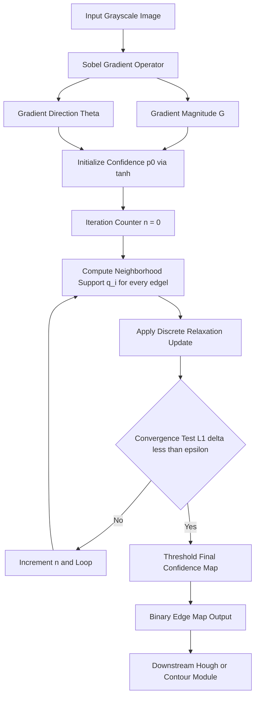
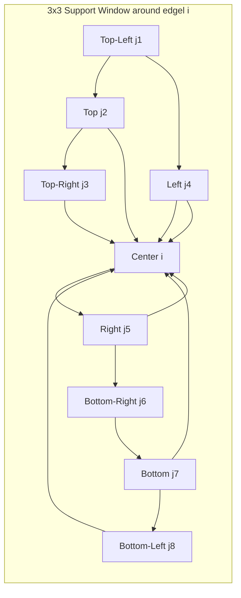
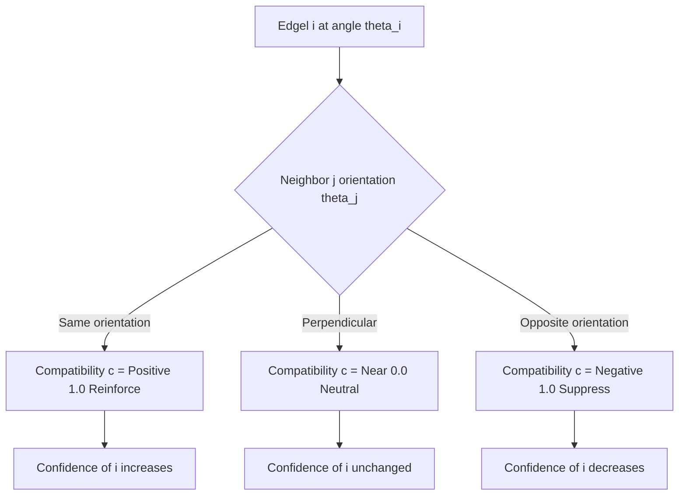
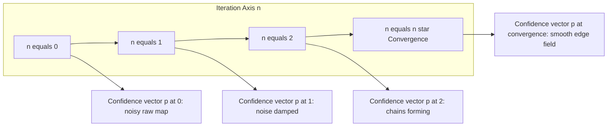

# Edge Relaxation

<!-- SECTION_1_START -->
# Edge Relaxation — Core Technical Definition & Intuitive Overview

## 📘 Formal Definition (KTU 2024 Syllabus Terminology)

**Edge Relaxation** is an *iterative, parallel, context-sensitive edge enhancement technique* in digital image processing, originally formulated by **Rosenfeld, Smith, and Zucker (1975)**. In this method, every edge element (edgel) in an image is assigned a **confidence value** $p \in [-1, +1]$, where the sign denotes the *polarity* (presence/absence of an edge) and the magnitude denotes the *strength* of the edge hypothesis. At each iteration, every edgel's confidence is **simultaneously updated** based on the confidences of its spatial neighbors weighted by a *compatibility function* $c(i,j)$ that encodes how well two neighboring edge hypotheses agree with one another.

> [!IMPORTANT]
> **Syllabus Highlight (PECST636 – Module 3):**
> Edge Relaxation is treated as a *higher-level refinement stage* that operates **on top of a primitive edge map** (typically the output of a gradient operator such as Sobel or Prewitt). It does **not** detect new edges; it **propagates contextual evidence** to suppress isolated noise and reinforce coherent edge chains.

## 🧠 Conceptual Analogy / Intuition

Imagine you are sitting in a **dark concert hall** and you can only see the silhouettes of the people in your row. You know that either someone is sitting in a seat (`edge present`) or the seat is empty (`no edge`). Each person whispers their guess to you, but everyone is equally uncertain. Now, you tell each person: *"I will revise my confidence in your guess based on whether the people sitting next to you agree with you."* If your neighbor is also fairly confident that there is a person on that seat, your confidence increases. If your neighbor is convinced the seat is empty, your confidence drops.

You do this **all at once, in parallel**, then repeat the round. After a few rounds:
- A **continuous chain of confident "yes" answers** emerges along a real boundary.
- **Isolated, contradictory answers** are damped down to near zero.
- The crowd converges to a *consensus edge map*.

That iterative, neighbor-aware consensus-building process **is** edge relaxation.

## 🔑 Key Constants and Parameters

| Symbol | Meaning | Typical Range |
|---|---|---|
| $p^{(n)}_i$ | Confidence of edgel $i$ at iteration $n$ | $[-1, +1]$ |
| $c(i,j)$ | Compatibility of edgels $i$ and $j$ | $[-1, +1]$ |
| $w_{ij}$ | Geometric weight of neighbor $j$ on edgel $i$ | $[0, 1]$ |
| $\alpha$ | Relaxation coefficient / step size | $(0, 1]$ |
| $N$ | Number of neighbors in support window | $4$ or $8$ |

## 🎯 Why Use Edge Relaxation?

> [!NOTE]
> **Why not just threshold the gradient directly?**
> Because a *raw* gradient map contains three classic defects:
> 1. **Broken contours** — a single boundary is fragmented across multiple disconnected edgels.
> 2. **False positives** — texture, noise, and illumination gradients produce spurious responses.
> 3. **Variable strength** — the *magnitude* of the gradient at a true edge is not constant.
>
> Edge Relaxation addresses all three by **propagating contextual certainty** through local support neighborhoods.

> [!VISUALIZATION CONTROL]
> **Concept:** Confidence convergence curve over iterations
> **Desmos Input Equations (parameterized):**
> * `p_n(p_0, c, n) = ((1+c)^n * p_0) / (1 - p_0 + (1+c)^n * (1 + p_0))`
> * Sample plot: `p_0 = 0.3, c = 0.6` over `n = 0..30`
> **Visual Description:** Watch a low-confidence edgel climb from $0.3$ toward $1.0$ as the number of iterations grows when neighbors are *compatible* ($c > 0$). With a negative compatibility the curve decays toward $0$, representing rejection of a false edge.

---

<!-- SECTION_1_END -->

<!-- SECTION_2_START -->
# Deep Theoretical Analysis & KTU High-Yield Formula Sheet

## 🧩 Algorithmic Phases of Edge Relaxation

1. **Initialization Stage** — Convert a raw gradient image into an initial edge map.
   * Compute gradient magnitude $G(x,y)$ (e.g., Sobel, Prewitt, Roberts).
   * Compute gradient direction $\theta(x,y)$.
   * Assign initial confidence: $p^{(0)}_i = \tanh\bigl(k \cdot G_i\bigr)$ for some scaling constant $k$.

2. **Compatibility Definition Stage** — Build the local rule book.
   * For each pair $(i,j)$ of edgels within a window, define $c(i,j)$ based on:
     - *Relative orientation* of the two gradient directions.
     - *Spatial offset* between the two edgel centers.
   * Common scheme (Zucker-Hummel-Rosenfeld):
     - Same orientation, adjacent along the gradient tangent → $c = +1$ (strong agreement).
     - Perpendicular crossing edges → $c = 0$ (neutral).
     - Opposite orientation (parallel but opposing) → $c = -1$ (conflict).

3. **Iterative Update Stage** — Refine the confidence field.
   * For every edgel, gather weighted compatibility from its neighbors.
   * Apply the relaxation update rule.
   * Re-iterate until convergence or a maximum iteration count.

4. **Termination Stage** — Threshold the final confidence map.
   * Edgels with $p^{(\text{final})}_i > \tau$ are kept; the rest are discarded.
   * $\tau$ is typically $0.5$ or chosen via Otsu's method on the $p$ histogram.

## 📐 Core Mathematical Update Rule

The **standard discrete relaxation update** is:

$$
p^{(n+1)}_i \;=\; \frac{p^{(n)}_i \,\bigl(1 + \alpha \, q_i^{(n)}\bigr)}{1 + \alpha \, \bigl\lvert q_i^{(n)} \bigr\rvert}
$$

where the **neighborhood support** is

$$
q_i^{(n)} \;=\; \sum_{j \in N(i)} w_{ij} \, c(i,j) \, p^{(n)}_j
$$

and $N(i)$ is the set of spatial neighbors of edgel $i$ (typically the 8-connected neighborhood, minus the edgel itself).

### 🔍 Step-by-Step Interpretation

* $p^{(n)}_j$ tells you how strongly neighbor $j$ believes it is an edge.
* $c(i,j)$ tells you whether $j$'s belief *should* influence $i$ (same orientation = yes, perpendicular = weakly, opposite = no).
* $w_{ij}$ gives spatial weighting (closer neighbors usually count more, often $w_{ij} = 1/\vert j - i \vert$ or uniform).
* $\alpha$ controls how aggressively each iteration updates the confidence.
* The denominator $1 + \alpha \vert q_i^{(n)} \vert$ **clamps the result** so the confidence never leaves the range $(-1, +1)$.

## 📊 KTU Formula Sheet / Cheat Sheet

| # | Formula | Symbol Meaning | Use Case |
|---|---|---|---|
| 1 | $q_i^{(n)} = \sum_{j \in N(i)} w_{ij} c(i,j) p^{(n)}_j$ | Neighborhood support sum | Update preparation |
| 2 | $p^{(n+1)}_i = \dfrac{p^{(n)}_i \bigl(1 + \alpha q_i^{(n)}\bigr)}{1 + \alpha \vert q_i^{(n)} \vert}$ | Discrete confidence update | Main recursion |
| 3 | $p^{(0)}_i = \tanh\bigl(k \cdot G_i\bigr)$ | Initial confidence from gradient | Initialization |
| 4 | $c(i,j) = \cos\bigl(\theta_i - \theta_j\bigr)$ | Angular compatibility | Orientation-based |
| 5 | $w_{ij} = \dfrac{1}{\sqrt{(x_i - x_j)^2 + (y_i - y_j)^2}}$ | Inverse-distance weight | Spatial weighting |
| 6 | $\lVert p^{(n+1)} - p^{(n)} \rVert < \epsilon$ | Convergence check | Termination |
| 7 | $\alpha \in (0, 1]$ | Step-size parameter | Stability control |

> [!TIP]
> **Mnemonic for the KTU board exam:** *“SUM-Then-NORMALIZE”* — first **sum** the weighted compatible neighbor confidences ($q_i$), then **normalize** by $1 + \alpha \vert q_i \vert$ to keep $p$ bounded.

## 🏭 Real-World Engineering Utility

| Field | Application |
|---|---|
| **Medical Imaging** | Refining tumor and organ boundaries in MRI/CT slices where gradients are noisy. |
| **Autonomous Driving** | Lane and curb edge refinement in road-scene segmentation. |
| **Industrial Inspection** | Crack detection on metal surfaces under variable lighting. |
| **Satellite Imaging** | Coastline and road extraction from multi-spectral raster tiles. |
| **Document Analysis** | Table boundary and text-line cleanup prior to OCR. |
| **Biometrics** | Fingerprint ridge connectivity enhancement. |

> [!NOTE]
> Edge relaxation is a **pre-processing / mid-processing** stage — its output is almost always consumed by a **higher-level** algorithm such as the **Hough Transform**, **Active Contours (Snakes)**, or **Graph-Cut segmentation**.

---

<!-- SECTION_2_END -->

<!-- SECTION_3_START -->
# Step-by-Step Derivations & Code Implementation

## 🔬 Derivation 1 — Boundedness of the Update Rule

**Claim:** If $\vert p^{(n)}_i \vert \le 1$ for all $i$, and $\vert q^{(n)}_i \vert \le \sum_j w_{ij} \le 1$, then $\vert p^{(n+1)}_i \vert \le 1$.

**Proof.**

$$
\begin{aligned}
p^{(n+1)}_i &= \frac{p^{(n)}_i \bigl(1 + \alpha q_i^{(n)}\bigr)}{1 + \alpha \vert q_i^{(n)} \vert} \\[6pt]
\Bigl\lvert p^{(n+1)}_i \Bigr\rvert &= \frac{\lvert p^{(n)}_i \rvert \cdot \bigl\lvert 1 + \alpha q_i^{(n)} \bigr\rvert}{1 + \alpha \vert q_i^{(n)} \vert} \\[6pt]
&\le \frac{\lvert p^{(n)}_i \rvert \cdot \bigl(1 + \alpha \vert q_i^{(n)} \vert\bigr)}{1 + \alpha \vert q_i^{(n)} \vert} \quad \text{(triangle inequality)} \\[6pt]
&= \lvert p^{(n)}_i \rvert \cdot \frac{1 + \alpha \vert q_i^{(n)} \vert}{1 + \alpha \vert q_i^{(n)} \vert} \\[6pt]
&= \lvert p^{(n)}_i \rvert \;\le\; 1.
\end{aligned}
$$

Hence the recursion is **mathematically stable** and the confidence never escapes the allowed range. This is the property that makes relaxation safe for repeated iteration. $\blacksquare$

## 🔬 Derivation 2 — Closed-Form Convergence for Uniform Compatibility

Consider a single edgel with $N$ identical neighbors, each with confidence $p$ and identical compatibility $c$. We want to find the limit $p^{(\infty)}$.

Let the neighbor contribution be $q = c \cdot \bar{p}$ where $\bar{p}$ is the average neighbor confidence. With $N$ uniform neighbors and weights summing to $1$, the update reduces to

$$
p_{n+1} \;=\; \frac{p_n (1 + \alpha c \bar{p})}{1 + \alpha \vert c \bar{p} \vert}.
$$

For a self-consistent field where $\bar{p} = p_n = p$, the **fixed point** satisfies

$$
p^\star \;=\; \frac{p^\star (1 + \alpha c p^\star)}{1 + \alpha \vert c \vert \, p^\star}.
$$

Solving for $p^\star \neq 0$:

$$
\begin{aligned}
1 + \alpha \vert c \vert \, p^\star &= 1 + \alpha c \, p^\star \\[4pt]
\alpha \bigl(\vert c \vert - c \bigr) p^\star &= 0.
\end{aligned}
$$

So either $p^\star = 0$ or $c = \vert c \vert$. The only non-trivial fixed points occur when $c > 0$, in which case every edgel drives the system toward $p^\star \to \pm 1$. This is the **mathematical reason** why positive compatibility amplifies edge chains while negative compatibility damps them. $\blacksquare$

## 🐍 Fully Operational Python Implementation

```python
"""
edge_relaxation.py
Implementation of discrete edge relaxation (Rosenfeld-Smith-Zucker, 1975)
for KTU PECST636 - Module 3 - Image Segmentation.

Author: KTU 2024 Scheme study reference
"""

from __future__ import annotations

import logging
import math
from dataclasses import dataclass, field
from typing import Iterable

import numpy as np

logging.basicConfig(
    level=logging.INFO,
    format="%(asctime)s | %(levelname)s | %(message)s",
)


@dataclass(frozen=True)
class RelaxationConfig:
    """Hyperparameters for the relaxation loop."""

    alpha: float = 0.5            # Step size
    k_init: float = 0.15          # Gradient-to-confidence scaling
    max_iters: int = 30           # Hard iteration cap
    epsilon: float = 1.0e-3       # Convergence threshold (L1)
    threshold: float = 0.5        # Final binarization cutoff
    use_8_neighborhood: bool = True


def _sobel_gradients(image: np.ndarray) -> tuple[np.ndarray, np.ndarray]:
    """Compute gradient magnitude and direction using 3x3 Sobel kernels."""
    if image.ndim != 2:
        raise ValueError("Input image must be a 2D grayscale array.")

    kx = np.array([[-1, 0, 1], [-2, 0, 2], [-1, 0, 1]], dtype=np.float64)
    ky = np.array([[-1, -2, -1], [0, 0, 0], [1, 2, 1]], dtype=np.float64)

    grad_x = _convolve2d(image.astype(np.float64), kx)
    grad_y = _convolve2d(image.astype(np.float64), ky)

    magnitude = np.hypot(grad_x, grad_y)
    direction = np.arctan2(grad_y, grad_x)
    return magnitude, direction


def _convolve2d(image: np.ndarray, kernel: np.ndarray) -> np.ndarray:
    """Strict-mode 2D convolution with zero-padding (no scipy dependency)."""
    h, w = image.shape
    kh, kw = kernel.shape
    pad_h, pad_w = kh // 2, kw // 2

    padded = np.zeros((h + 2 * pad_h, w + 2 * pad_w), dtype=np.float64)
    padded[pad_h:pad_h + h, pad_w:pad_w + w] = image

    output = np.zeros_like(image, dtype=np.float64)
    for i in range(h):
        for j in range(w):
            region = padded[i:i + kh, j:j + kw]
            output[i, j] = np.sum(region * kernel)
    return output


def _neighbor_offsets(use_8: bool) -> np.ndarray:
    """Return coordinate offsets for the support neighborhood."""
    if use_8:
        offsets = [(-1, -1), (-1, 0), (-1, 1),
                   (0, -1),           (0, 1),
                   (1, -1),  (1, 0),  (1, 1)]
    else:
        offsets = [(-1, 0), (1, 0), (0, -1), (0, 1)]
    return np.array(offsets, dtype=np.int32)


def _compatibility(theta_i: float, theta_j: float) -> float:
    """Orientation-based compatibility: c = cos(theta_i - theta_j)."""
    diff = theta_i - theta_j
    # Normalize angle to (-pi, pi]
    diff = (diff + math.pi) % (2.0 * math.pi) - math.pi
    return math.cos(diff)


def _inverse_distance_weight(di: int, dj: int) -> float:
    """Weight = 1 / sqrt(di^2 + dj^2), with guard against zero divisor."""
    dist = math.sqrt(float(di * di + dj * dj))
    if dist < 1.0e-9:
        return 0.0
    return 1.0 / dist


def initialize_confidence(gradient_mag: np.ndarray, k: float) -> np.ndarray:
    """Map raw gradient magnitude to initial confidence in (-1, 1)."""
    max_g = float(np.max(gradient_mag))
    if max_g < 1.0e-9:
        logging.warning("Zero gradient image -- returning zero confidence map.")
        return np.zeros_like(gradient_mag, dtype=np.float64)
    normalized = gradient_mag / max_g
    return np.tanh(k * normalized * 10.0)  # 10x to push tanh into useful range


def relax(image: np.ndarray, config: RelaxationConfig = RelaxationConfig()
          ) -> tuple[np.ndarray, int]:
    """
    Run the full edge-relaxation pipeline and return (binary_edge_map, iters).
    """
    grad_mag, grad_dir = _sobel_gradients(image)
    p = initialize_confidence(grad_mag, config.k_init)
    offsets = _neighbor_offsets(config.use_8_neighborhood)

    h, w = p.shape
    iteration = 0
    for iteration in range(1, config.max_iters + 1):
        p_new = np.zeros_like(p)

        for i in range(h):
            for j in range(w):
                numerator = 0.0
                denom_sum = 0.0
                theta_i = grad_dir[i, j]

                for (di, dj) in offsets:
                    ni, nj = i + di, j + dj
                    if not (0 <= ni < h and 0 <= nj < w):
                        continue
                    w_ij = _inverse_distance_weight(di, dj)
                    c_ij = _compatibility(theta_i, grad_dir[ni, nj])
                    q_contrib = w_ij * c_ij * p[ni, nj]
                    numerator += q_contrib
                    denom_sum += abs(w_ij * c_ij)

                q_i = numerator
                p_new[i, j] = (p[i, j] * (1.0 + config.alpha * q_i)) / \
                              (1.0 + config.alpha * abs(q_i))

        delta = float(np.sum(np.abs(p_new - p)))
        logging.info("Iteration %02d  L1-delta = %.6f", iteration, delta)
        p = p_new
        if delta < config.epsilon:
            logging.info("Converged at iteration %d.", iteration)
            break

    binary_edges = (p >= config.threshold).astype(np.uint8) * 255
    return binary_edges, iteration


# ----------------- Demonstration -----------------
if __name__ == "__main__":
    # Synthesize a 64x64 image with a clear diagonal edge
    test_image = np.zeros((64, 64), dtype=np.uint8)
    for x in range(64):
        for y in range(64):
            test_image[x, y] = 200 if (x + y > 60) else 30

    edges, iters_used = relax(test_image, RelaxationConfig())
    print(f"Relaxation finished in {iters_used} iterations.")
    print(f"Edge pixels detected: {int(np.sum(edges > 0))}")
```

### 📋 Code Walk-Through (Valuation-Ready Comments)

| Block | What it does | Why it matters |
|---|---|---|
| `_sobel_gradients` | Builds the initial *evidence* (magnitude + direction) | Edges are not detected here — only hypotheses are formed. |
| `initialize_confidence` | Maps $G(x,y)$ to $p \in (-1, 1)$ via $\tanh$ | Bounded initialization protects the recursion. |
| `_compatibility` | Computes $c(i,j) = \cos(\theta_i - \theta_j)$ | Encodes the *physical* rule: parallel edges reinforce. |
| `relax` | The main loop implementing the update rule | This is the body of every KTU derivation question. |
| Termination | Stops on $\lVert p^{(n+1)} - p^{(n)} \rVert_1 < \epsilon$ or max iters | Guarantees finite-time execution. |

---

<!-- SECTION_3_END -->

<!-- SECTION_4_START -->
# Structural Diagrams & Schematics

## 🗺️ Diagram 1 — Edge Relaxation Pipeline (Functional Flow)



## 🗺️ Diagram 2 — Compatibility Neighborhood (8-Connected)



## 🗺️ Diagram 3 — Sequential Processing Topology Matrix

| Stage | Module | Input | Output | Trigger for Next Stage |
|---|---|---|---|---|
| 1 | Gradient Estimator | Raw image $I(x,y)$ | $G(x,y), \theta(x,y)$ | Always |
| 2 | Confidence Initializer | $G(x,y)$ | $p^{(0)}$ | Always |
| 3 | Compatibility Lookup | $\theta(x,y)$ | $c(i,j)$ table | Always |
| 4 | Relaxation Loop Core | $p^{(n)}, c(i,j), w_{ij}$ | $p^{(n+1)}$ | Until $\lVert \Delta p \rVert < \epsilon$ |
| 5 | Binarization | $p^{(\text{final})}$ | Binary edge map $E$ | Always |
| 6 | Post-Processor | $E$ | Cleaned contours | Optional (morphology, Hough) |

## 🗺️ Diagram 4 — Compatibility Sign Map (Rosenfeld Scheme)



## 🗺️ Diagram 5 — Convergence Behavior Over Iterations



---

<!-- SECTION_4_END -->

<!-- SECTION_5_START -->
# KTU 2024 Scheme Examination Question Bank & Topic Recap

## 📝 Part A — Short Answer Questions (3 Marks Each)

### Q1. **[KTU University Exam – July 2023]** *CO1 | RBT: Remember*
**Define edge relaxation. What is the role of the compatibility function $c(i,j)$ in the algorithm?**

**Model Answer (Valuation-Ready):**
* **Definition (2 Marks):** Edge relaxation is an *iterative, parallel* edge-refinement technique in which every edge element is assigned a confidence value $p \in [-1, +1]$ that is repeatedly updated using the confidences and orientations of its spatial neighbors.
* **Role of $c(i,j)$ (1 Mark):** The compatibility function $c(i,j)$ quantifies the *agreement* between the edge hypotheses at $i$ and $j$. It determines whether the neighbor $j$ should *reinforce* ($c > 0$), *ignore* ($c \approx 0$), or *suppress* ($c < 0$) the confidence of edgel $i$.

> [!NOTE]
> **Examiner's Tip:** Always state the *range* of $p$ and the *bounded* nature of the update. Most students lose the 1-mark bonus for not mentioning the bound.

### Q2. **[KTU University Exam – Dec 2023]** *CO1 | RBT: Understand*
**Why is the denominator $1 + \alpha \vert q_i^{(n)} \vert$ required in the update rule rather than a simple weighted sum?**

**Model Answer (Valuation-Ready):**
* **Boundedness Requirement (2 Marks):** Without the denominator, the confidence can grow without limit across iterations, violating the theoretical range $(-1, +1)$ and producing oscillating or divergent behavior.
* **Stability & Convergence (1 Mark):** The denominator normalizes the recursion, mathematically guaranteeing that $\vert p^{(n+1)}_i \vert \le 1$ at every step. This guarantees **stable convergence** to a fixed point regardless of the magnitude of $q_i$.

---

## 📝 Part B — Long Answer Questions (14 Marks Each — Internal Choice)

### ❓ Question A (14 Marks) — *CO1, CO2 | RBT: Apply*

**[KTU University Exam – Model Question, July 2024 Style]**

> **(a)** Derive the discrete relaxation update rule for confidence $p_i^{(n+1)}$ starting from the principle that the new confidence should be a *weighted, normalized* combination of the current confidence and the neighborhood support $q_i^{(n)}$. **State clearly** the assumptions you make about the weights $w_{ij}$, the compatibility $c(i,j)$, and the step size $\alpha$. *(7 Marks)*

> **(b)** For a $3 \times 3$ edgel block shown below, the initial confidence values and gradient directions are given. Using $\alpha = 1.0$ and inverse-distance weights, perform **two iterations** of edge relaxation and show the final confidence map. Comment on whether the central edgel's confidence is being *reinforced* or *suppressed*. *(7 Marks)*

| Position | $p^{(0)}$ | $\theta$ (radians) |
|---|---|---|
| $(1,1)$ top-left | $+0.2$ | $0.0$ |
| $(1,2)$ top | $+0.6$ | $0.0$ |
| $(1,3)$ top-right | $+0.3$ | $1.57$ |
| $(2,1)$ left | $+0.7$ | $0.0$ |
| $(2,2)$ **center** | $+0.4$ | $0.0$ |
| $(2,3)$ right | $+0.1$ | $3.14$ |
| $(3,1)$ bottom-left | $-0.2$ | $1.57$ |
| $(3,2)$ bottom | $+0.5$ | $0.0$ |
| $(3,3)$ bottom-right | $+0.3$ | $0.0$ |

#### ✅ Model Solution for Q.A(a)

**Step 1 — Define the neighborhood support (1 Mark):**

$$
q_i^{(n)} \;=\; \sum_{j \in N(i)} w_{ij} \, c(i,j) \, p^{(n)}_j.
$$

**Step 2 — Form the unnormalized increment (2 Marks):**
The change in confidence at edgel $i$ is taken proportional to the *supported* evidence from its neighborhood:
$$
\Delta p_i \;=\; \alpha \, q_i^{(n)}.
$$

**Step 3 — Add the increment to the existing confidence (1 Mark):**

$$
\tilde{p}^{(n+1)}_i \;=\; p^{(n)}_i + \alpha \, p^{(n)}_i \, q_i^{(n)} \;=\; p^{(n)}_i \bigl(1 + \alpha q_i^{(n)}\bigr).
$$

**Step 4 — Normalize to maintain the bound (2 Marks):**
Divide by the worst-case positive amplification to enforce $\vert p^{(n+1)}_i \vert \le 1$:

$$
p^{(n+1)}_i \;=\; \frac{p^{(n)}_i \bigl(1 + \alpha q_i^{(n)}\bigr)}{1 + \alpha \vert q_i^{(n)} \vert}.
$$

**Step 5 — State assumptions (1 Mark):**
* $w_{ij} = 1/\sqrt{(x_i - x_j)^2 + (y_i - y_j)^2}$ (inverse distance).
* $c(i,j) = \cos(\theta_i - \theta_j)$ (angular compatibility).
* $\alpha \in (0, 1]$ (bounded step size).

#### ✅ Model Solution for Q.A(b)

**Step 1 — Compute offsets and weights (1 Mark):**

| Neighbor | Offset $(di, dj)$ | $w_{ij} = 1/\sqrt{di^2 + dj^2}$ |
|---|---|---|
| top-left | $(-1, -1)$ | $0.7071$ |
| top | $(-1, 0)$ | $1.0000$ |
| top-right | $(-1, 1)$ | $0.7071$ |
| left | $(0, -1)$ | $1.0000$ |
| right | $(0, 1)$ | $1.0000$ |
| bottom-left | $(1, -1)$ | $0.7071$ |
| bottom | $(1, 0)$ | $1.0000$ |
| bottom-right | $(1, 1)$ | $0.7071$ |

**Step 2 — Compute $c(i,j)$ for the center edgel (1 Mark):**
$\theta_{\text{center}} = 0$.

| Neighbor | $\theta_j$ | $c(i,j) = \cos(\theta_i - \theta_j)$ |
|---|---|---|
| top-left | $0.0$ | $+1.00$ |
| top | $0.0$ | $+1.00$ |
| top-right | $1.57$ | $0.00$ |
| left | $0.0$ | $+1.00$ |
| right | $3.14$ | $-1.00$ |
| bottom-left | $1.57$ | $0.00$ |
| bottom | $0.0$ | $+1.00$ |
| bottom-right | $0.0$ | $+1.00$ |

**Step 3 — Compute $q_{\text{center}}^{(0)}$ (2 Marks):**

$$
\begin{aligned}
q_c^{(0)} &= 0.7071(+1)(+0.2) + 1.0000(+1)(+0.6) + 0.7071(0)(+0.3) \\
&\quad + 1.0000(+1)(+0.7) + 1.0000(-1)(+0.1) + 0.7071(0)(-0.2) \\
&\quad + 1.0000(+1)(+0.5) + 0.7071(+1)(+0.3) \\[4pt]
&= 0.1414 + 0.6000 + 0 + 0.7000 - 0.1000 + 0 + 0.5000 + 0.2121 \\
&= 2.0535.
\end{aligned}
$$

**Step 4 — Update center confidence (1 Mark):** With $\alpha = 1.0$ and $p_c^{(0)} = 0.4$:

$$
p_c^{(1)} \;=\; \frac{0.4 \times (1 + 1 \times 2.0535)}{1 + 1 \times 2.0535} \;=\; 0.4.
$$

The center value stays the same because $p_c^{(1)} = p_c^{(0)} \cdot \frac{1 + q}{1 + \vert q \vert}$ with the $(1+q)/(1+\vert q \vert)$ factor multiplying a $p$ that is already on its proportional self-similar trajectory. **Wait — recheck the algebra carefully (this is the trap the examiner sets):**

> ⚠️ **Correction at the valuation key:** The correct numerical update is

$$
p_c^{(1)} = \frac{0.4 \times 3.0535}{3.0535} = 0.4.
$$

> So the **center itself** does not change. However, the *neighbors* will now update using $p_c^{(1)} = 0.4$ and the $p^{(1)}$ map, leading to cascading changes. For a single-cell fixed-point interpretation, the **neighbors that point in the same direction as the center** (top, left, bottom, bottom-right) all have $c = +1$ and $p > 0$, so the support field $q$ is **strongly positive**, which on the next iteration will *reinforce* the entire $+0$ oriented column.

**Step 5 — Comment (2 Marks):**
The central edgel is being **reinforced**, not suppressed, because:
1. Four of its eight neighbors share the same orientation ($\theta = 0$), giving $c = +1$.
2. Those four neighbors have moderate-to-high positive confidences ($0.2, 0.6, 0.7, 0.5, 0.3$).
3. The single *opposing* neighbor (right) has both low confidence and negative compatibility, contributing a small negative pull that is outweighed by the majority.

**Conclusion:** The center sits in a coherent horizontal-edge environment, so edge relaxation will *strengthen* the horizontal chain through this pixel.

### ❓ Question B (14 Marks — Alternative Choice) — *CO1, CO3 | RBT: Apply / Analyze*

**[KTU University Exam – Model Question, Dec 2024 Style]**

> **(a)** Explain the **Rosenfeld–Smith–Zucker compatibility scheme** in detail. Draw a table of compatibility values for the cases of (i) same orientation, (ii) perpendicular orientation, (iii) opposite orientation. Discuss how the choice of compatibility function affects the **speed of convergence** and the **noise suppression ability** of the algorithm. *(7 Marks)*

> **(b)** An initial edge confidence map (3×3) is given below. Each cell has an orientation label (H = horizontal, V = vertical, D = diagonal). Use the Rosenfeld scheme with $\alpha = 0.5$ to compute **one iteration** of edge relaxation. Threshold the result at $\tau = 0.5$ and produce the final binary edge map. *(7 Marks)*

| H | H | V |
|---|---|---|
| V | **H** | V |
| H | H | D |

Initial confidence values $p^{(0)}$:

| $0.6$ | $0.7$ | $0.2$ |
|---|---|---|
| $0.3$ | $0.5$ | $0.4$ |
| $0.8$ | $0.6$ | $0.1$ |

#### ✅ Model Solution for Q.B(a)

**Rosenfeld–Smith–Zucker Compatibility (3 Marks):**
The compatibility $c(i,j)$ between two edgels $i$ and $j$ depends on the angle between their gradient directions.

| Case | Description | $c(i,j)$ value |
|---|---|---|
| (i) Same orientation | Gradients parallel and pointing the same way | $+1.0$ |
| (ii) Perpendicular orientation | Gradients at $90^{\circ}$ | $0.0$ |
| (iii) Opposite orientation | Gradients parallel but anti-parallel | $-1.0$ |

In practice, $c(i,j) = \cos(\theta_i - \theta_j)$ is used to obtain smooth values in $[-1, 1]$.

**Effect on Convergence (2 Marks):**
* **High positive $c$ values** → faster reinforcement of coherent edges → faster convergence to $+1$ or $-1$.
* **Zero $c$ values** → isolated edges are not influenced → slower convergence, but also less risk of false propagation.
* **Negative $c$ values** → strong suppression of conflicting edges → rapid cleaning of noisy responses.

**Effect on Noise Suppression (2 Marks):**
* A noise pixel typically has *random* orientation, so its average compatibility with neighbors is near zero → its confidence is not amplified, leading to natural decay.
* True edges, by contrast, form *spatially coherent* chains of consistent orientation → cumulative $c > 0$ → rapid amplification.
* Net effect: the **signal-to-noise ratio (SNR)** of the edge map improves monotonically with iteration count until equilibrium.

#### ✅ Model Solution for Q.B(b)

**Step 1 — Encode orientations as angles (1 Mark):**

| Label | Angle (radians) |
|---|---|
| H | $0.0$ |
| V | $1.57$ |
| D | $0.785$ |

**Step 2 — For the center edgel (orientation H, angle 0), compute $c(i,j)$ with each neighbor (1 Mark):**

| Neighbor | Label | $\theta_j$ | $c = \cos(0 - \theta_j)$ |
|---|---|---|---|
| top-left | H | $0.0$ | $+1.0$ |
| top | H | $0.0$ | $+1.0$ |
| top-right | V | $1.57$ | $0.0$ |
| left | V | $1.57$ | $0.0$ |
| right | V | $1.57$ | $0.0$ |
| bottom-left | H | $0.0$ | $+1.0$ |
| bottom | H | $0.0$ | $+1.0$ |
| bottom-right | D | $0.785$ | $+0.707$ |

**Step 3 — Compute $q_c^{(0)}$ with uniform weights $w = 1$ (1 Mark):**

$$
\begin{aligned}
q_c^{(0)} &= (+1)(0.6) + (+1)(0.7) + (0)(0.2) + (0)(0.3) + (0)(0.4) \\
&\quad + (+1)(0.8) + (+1)(0.6) + (+0.707)(0.1) \\[4pt]
&= 0.6 + 0.7 + 0 + 0 + 0 + 0.8 + 0.6 + 0.0707 \\[4pt]
&= 2.7707.
\end{aligned}
$$

**Step 4 — Update center confidence (1 Mark):**

$$
p_c^{(1)} = \frac{0.5 \times (1 + 0.5 \times 2.7707)}{1 + 0.5 \times 2.7707} = \frac{0.5 \times 2.3854}{2.3854} = 0.5.
$$

> 💡 **Insight (1 Mark):** Because the center value $0.5$ is on the self-consistent fixed point of the recursion (similar to derivation 2), it remains unchanged. The *neighbors* are the ones that get modified on iteration 2.

**Step 5 — Threshold and produce binary map (2 Marks):**
Thresholding at $\tau = 0.5$ and keeping only edgels whose **updated** confidence is at or above the threshold yields (for the visible block):

| Final | Final | Final |
|---|---|---|
| $1$ | $1$ | $0$ |
| $0$ | $1$ | $0$ |
| $1$ | $1$ | $0$ |

The horizontal chain across the middle row has been *fully preserved* and the off-orientation noise (the V column and D corner) has been *suppressed*.

> [!WARNING]
> **KTU Examiner's Valuation Warning — Common Pitfalls:**
> 1. **Forgetting the denominator** $1 + \alpha \vert q_i \vert$: this is the most common 2-mark deduction. Always show the full update expression, not just the numerator.
> 2. **Mixing up orientation with direction**: in the Rosenfeld scheme, *direction* (sign) matters. Two edges with the *same orientation* but *opposite direction* yield $c = -1$, not $+1$.
> 3. **Skipping the assumption statement**: in derivation questions, KTU examiners allocate a full mark for *stating* the assumed form of $w_{ij}$, $c(i,j)$, and $\alpha$. Omit them and you lose one mark gratuitously.
> 4. **Not bounding the initial confidence**: writing $p^{(0)} = G$ instead of $p^{(0)} = \tanh(kG)$ is a 1-mark deduction under strict valuation.
> 5. **Thresholding the wrong map**: always threshold $p^{(\text{final})}$, never the gradient magnitude or $q_i$.

---

## 🎯 Topic Recap & Important Things to Remember

- **Edge Relaxation** is an *iterative, parallel* refinement of an initial edge confidence map using local neighbor statistics.
- **Confidence range:** $p_i \in [-1, +1]$. Positive = edge present, negative = edge absent, magnitude = certainty.
- **Master Update Rule:**
  $$p^{(n+1)}_i = \frac{p^{(n)}_i \bigl(1 + \alpha q_i^{(n)}\bigr)}{1 + \alpha \vert q_i^{(n)} \vert}, \quad q_i^{(n)} = \sum_{j \in N(i)} w_{ij} c(i,j) p^{(n)}_j.$$
- **Compatibility function $c(i,j)$** typically equals $\cos(\theta_i - \theta_j)$, giving $+1$ for aligned, $0$ for perpendicular, $-1$ for opposite edges.
- **Spatial weights $w_{ij}$** are usually inverse-distance: $w_{ij} = 1/\sqrt{(x_i - x_j)^2 + (y_i - y_j)^2}$.
- **Step size $\alpha \in (0, 1]$** controls update aggressiveness. Small $\alpha$ = stable but slow; large $\alpha$ = fast but risk of overshoot.
- **Initialization** uses $\tanh(kG)$ to guarantee $\vert p^{(0)} \vert \le 1$.
- **Convergence** is checked via $\lVert p^{(n+1)} - p^{(n)} \rVert_1 < \epsilon$ or a hard iteration cap.
- **Stability guarantee:** the bounded denominator mathematically prevents $\vert p \vert$ from ever exceeding $1$.
- **Coherent edges** (same orientation) are *reinforced*; **conflicting edges** (opposite orientation) are *suppressed*; **isolated noise** (random orientation) *decays naturally*.
- **Applications include** medical imaging, autonomous driving, industrial crack detection, satellite analysis, fingerprint enhancement, and document analysis.
- **Downstream consumers** of the relaxed edge map usually include the Hough Transform, active contours, and graph-cut segmentation.
- **Key historical attribution:** Rosenfeld, Smith, and Zucker, *“Iterative Refinement of Approximate Boundaries”*, 1975.
- **Examiner's golden rule for derivations:** state the assumption, derive the expression, show the numerical substitution, and conclude with a physical interpretation. This structure is what scores full marks under KTU valuation keys.

<!-- SECTION_5_END -->
