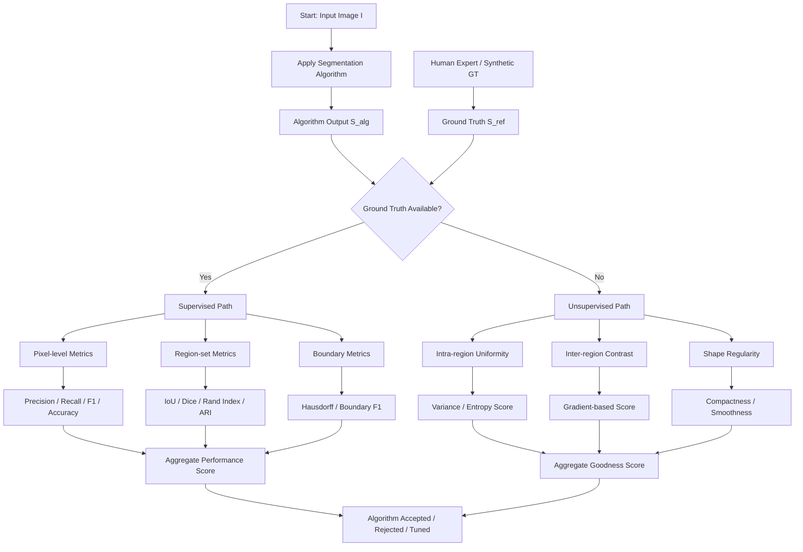
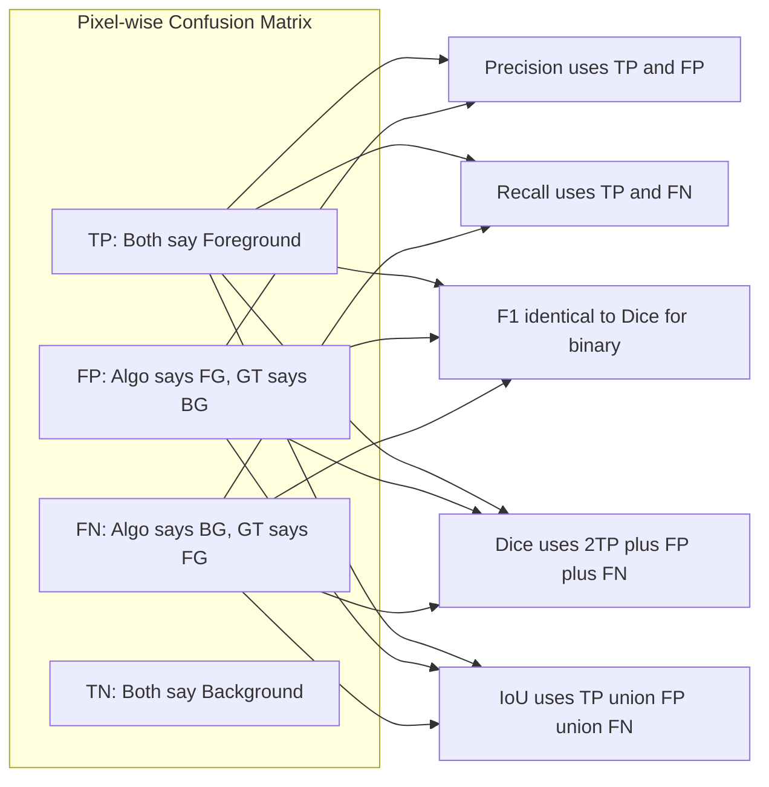
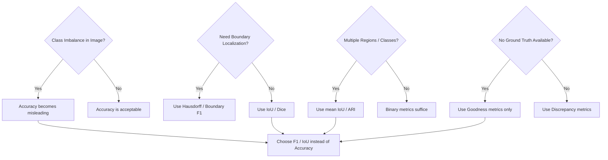
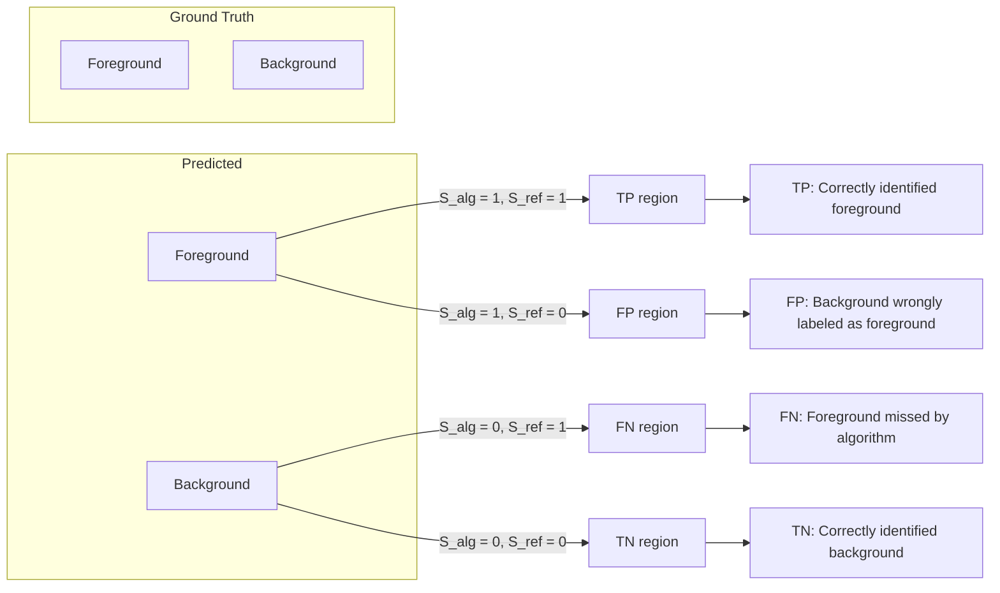

# Evaluation Issues In Segmentation

<!-- SECTION_1_START -->

# 📘 MODULE 3 — IMAGE SEGMENTATION
## Topic: **Evaluation Issues in Segmentation**

---

### 1.1 Formal Academic Definition

> [!IMPORTANT]
> **Segmentation Evaluation** is the systematic, algorithmic process of quantitatively and qualitatively **measuring the performance, accuracy, robustness, and reliability** of an image segmentation algorithm by comparing its output against a known reference (ground truth) or by applying intrinsic statistical goodness criteria when no reference is available.

In strict **KTU 2024 Scheme (PECST636)** terminology, segmentation evaluation is classified into two broad paradigms:

1. **Empirical (Empirical Discrepancy) Methods** — Performance is judged by **comparing** algorithm output $S_{alg}$ with a reference segmentation $S_{ref}$ (ground truth).
2. **Analytical (Goodness / Empirical Goodness) Methods** — Performance is judged by **intrinsic properties** of the segmented output such as intra-region uniformity, inter-region contrast, and shape regularity, *without* needing ground truth.

> [!NOTE]
> **Key Terminology Checklist for KTU Board Exams:**
> - **Ground Truth ($S_{ref}$):** Human-annotated or synthetically generated *ideal* segmentation.
> - **Algorithm Output ($S_{alg}$):** The segmentation produced by the algorithm under test.
> - **Discrepancy:** A numerical measure of mismatch between $S_{alg}$ and $S_{ref}$.
> - **Goodness:** A numerical measure of internal statistical consistency of $S_{alg}$.

---

### 1.2 Intuitive Analogy — The "Painting Inspector"

Imagine a **car manufacturing plant** where 100 robots are each painting a single door panel of the same model car. The Quality Control (QC) inspector must certify each panel.

- **If the inspector has a master "gold sample" door** to compare against → that is **Supervised Evaluation (Discrepancy Method)** — "Does your painted panel *match* the gold sample pixel-by-pixel?"
- **If the inspector has no gold sample**, but uses a *ruler and color chart* to check that the panel is **uniformly painted, has sharp edges, and no smudges** → that is **Unsupervised Evaluation (Goodness Method)** — "Is your painted panel internally *consistent* and *clean*?"

**Segmentation evaluation works exactly this way.** When medical scans (e.g., tumor masks) have expert radiologist annotations, we use **discrepancy metrics**. When we segment *novel* remote-sensing terrain with no labels, we use **goodness metrics**.

---

### 1.3 Why Evaluation is *Non-Negotiable* in Engineering

| Engineering Domain | Why Evaluation is Critical |
|---|---|
| **Medical Imaging (Tumor Detection)** | A 1-pixel misclassification can mean missed cancer. Regulators (FDA) require IoU ≥ 0.7 typically. |
| **Autonomous Vehicles** | Road/pedestrian segmentation must be benchmarked on KITTI / Cityscapes datasets. |
| **Satellite / Defence Imaging** | Object recognition downstream fails if segmentation is unreliable. |
| **Industrial Defect Detection** | False positives cause production stoppages; false negatives cause recalls. |

> [!TIP]
> **For KTU Valuation:** Whenever you write a segmentation algorithm in your exam, **always conclude** with a sentence on *how you would evaluate it*. This shows the examiner you understand the complete engineering loop.

---

### 1.4 Geometric Visualization of an Evaluation Scenario

> [!VISUALIZATION CONTROL]
> **Concept:** Pixel-level overlap between Ground Truth mask and Algorithm-predicted mask
> **GeoGebra / Desmos Input Equations (set up 2 unit squares representing binary masks):**
> * Square 1 (Ground Truth): vertices at $(0,0), (1,0), (1,1), (0,1)$ — **all pixels set to 1 (foreground)**
> * Square 2 (Algorithm Output): vertices at $(0.1, 0.1), (1.1, 0.1), (1.1, 1.1), (0.1, 1.1)$ — a **shifted foreground** showing 4 sub-regions: TP, FP, FN, TN
>
> **Visual Description:** Overlay two binary masks on a 2D plane. The intersection region is **True Positive (TP)**. The region only in Algorithm is **False Positive (FP)**. The region only in Ground Truth is **False Negative (FN)**. The region outside both is **True Negative (TN)**. These four zones form the **Confusion Matrix** for segmentation.

---

<!-- SECTION_1_END -->

<!-- SECTION_2_START -->

# 2. Deep Theoretical Analysis & KTU High-Yield Formula Sheet

---

## 2.1 Hierarchical Taxonomy of Evaluation Methods

Segmentation evaluation methods are organized as follows:

### A. **Supervised (Empirical Discrepancy) Methods** — *Ground Truth available*
   - **A1. Pixel-level classification metrics** (TP, FP, TN, FN based)
   - **A2. Region-based set similarity** (Jaccard/IoU, Dice)
   - **A3. Boundary-based distance metrics** (Hausdorff Distance, Boundary F1)
   - **A4. Counting-based metrics** (Rand Index, Variation of Information)

### B. **Unsupervised (Empirical Goodness) Methods** — *No Ground Truth*
   - **B1. Intra-region uniformity** (variance-based, entropy-based)
   - **B2. Inter-region contrast** (gradient magnitude along boundaries)
   - **B3. Shape regularity** (compactness, smoothness)
   - **B4. Figure of Merit** (combined criterion)

### C. **Analytical Methods** — *Complexity / efficiency based*
   - Time complexity, memory footprint, parameter sensitivity.

---

## 2.2 Mathematical Foundations of Each Metric

### 2.2.1 Confusion Matrix at Pixel Level

For a binary segmentation, every pixel $p$ in image $I$ is assigned one of four categories:

$$\text{Pixel}(p) = \begin{cases} \text{TP} & \text{if } S_{alg}(p) = 1 \text{ AND } S_{ref}(p) = 1 \\ \text{FP} & \text{if } S_{alg}(p) = 1 \text{ AND } S_{ref}(p) = 0 \\ \text{FN} & \text{if } S_{alg}(p) = 0 \text{ AND } S_{ref}(p) = 1 \\ \text{TN} & \text{if } S_{alg}(p) = 0 \text{ AND } S_{ref}(p) = 0 \end{cases}$$

### 2.2.2 Precision, Recall, Specificity

$$\text{Precision} = \frac{TP}{TP + FP} \quad ; \quad \text{Recall (Sensitivity)} = \frac{TP}{TP + FN}$$

$$\text{Specificity} = \frac{TN}{TN + FP} \quad ; \quad \text{Accuracy} = \frac{TP + TN}{TP + FP + FN + TN}$$

### 2.2.3 F-Measure (F1-Score)

The harmonic mean of Precision and Recall:

$$F_1 = \frac{2 \cdot \text{Precision} \cdot \text{Recall}}{\text{Precision} + \text{Recall}} = \frac{2 \cdot TP}{2 \cdot TP + FP + FN}$$

### 2.2.4 Intersection over Union (IoU / Jaccard Index)

$$IoU = J(S_{alg}, S_{ref}) = \frac{\vert S_{alg} \cap S_{ref} \vert}{\vert S_{alg} \cup S_{ref} \vert} = \frac{TP}{TP + FP + FN}$$

> [!NOTE]
> **IoU is the most widely reported metric in modern segmentation benchmarks** (Pascal VOC, MS COCO, Cityscapes). Always remember its range: $[0, 1]$ where **1 is perfect** overlap.

### 2.2.5 Dice Similarity Coefficient (DSC)

$$DSC = \frac{2 \cdot \vert S_{alg} \cap S_{ref} \vert}{\vert S_{alg} \vert + \vert S_{ref} \vert} = \frac{2 \cdot TP}{2 \cdot TP + FP + FN}$$

> [!IMPORTANT]
> **Dice and IoU are mathematically related:**
>
> $$DSC = \frac{2 \cdot IoU}{1 + IoU} \quad \iff \quad IoU = \frac{DSC}{2 - DSC}$$
>
> In **medical imaging literature**, *Dice* is preferred; in **computer vision benchmarks**, *IoU* is preferred. Examiners may ask this relationship — memorize it.

### 2.2.6 Rand Index (RI) and Adjusted Rand Index (ARI)

Treats segmentation as a **pairwise clustering** problem. For all $\binom{N}{2}$ pixel pairs:

$$RI = \frac{a + b}{a + b + c + d}$$

where $a$ = pairs in same region in both, $b$ = pairs in different regions in both, $c$ and $d$ = disagreement pairs.

**Adjusted Rand Index** corrects for chance:

$$ARI = \frac{RI - E[RI]}{\max(RI) - E[RI]}$$

### 2.2.7 Boundary-Based: Hausdorff Distance

For boundaries $\partial S_{alg}$ and $\partial S_{ref}$:

$$H(\partial S_{alg}, \partial S_{ref}) = \max\Bigl(\max_{x \in \partial S_{alg}} \min_{y \in \partial S_{ref}} d(x,y), \;\max_{y \in \partial S_{ref}} \min_{x \in \partial S_{alg}} d(x,y)\Bigr)$$

where $d(x,y)$ is the **Euclidean distance** between boundary pixels. The **Modified Hausdorff Distance (MHD)** uses the mean instead of max for robustness:

$$MHD = \frac{1}{\vert \partial S_{alg} \vert} \sum_{x \in \partial S_{alg}} \min_{y \in \partial S_{ref}} d(x,y)$$

### 2.2.8 Unsupervised Goodness: Intra-Region Uniformity

For $K$ regions, the **normalized intra-region variance** is:

$$U = 1 - \frac{\sum_{i=1}^{K} \sigma_i^2}{C}$$

where $\sigma_i^2$ is the variance of region $i$, and $C$ is a normalization constant. **Higher $U$ means better segmentation.**

### 2.2.9 Inter-Region Contrast (Borsotti)

$$F(I) = \frac{1}{1000 \cdot K} \sqrt{\sum_{i=1}^{K} \left[ \frac{1}{A_i} \sum_{(x,y) \in R_i} \vert f(x,y) - \mu_i \vert^2 \right] } \cdot \sum_{i=1}^{K} \frac{\mu_i^2}{\sqrt{A_i}}$$

Lower $F(I)$ indicates better segmentation.

---

## 2.3 📋 KTU Formula Cheat Sheet (High-Yield for ESE)

| # | Metric | Formula | Range | Higher = Better? | Key Use Case |
|---|---|---|---|---|---|
| 1 | Precision | $\dfrac{TP}{TP+FP}$ | $[0,1]$ | ✅ Yes | Reducing false alarms |
| 2 | Recall | $\dfrac{TP}{TP+FN}$ | $[0,1]$ | ✅ Yes | Reducing missed detections |
| 3 | Specificity | $\dfrac{TN}{TN+FP}$ | $[0,1]$ | ✅ Yes | Background correctness |
| 4 | F1-Score | $\dfrac{2 \cdot TP}{2 \cdot TP + FP + FN}$ | $[0,1]$ | ✅ Yes | Balanced PR metric |
| 5 | IoU (Jaccard) | $\dfrac{TP}{TP+FP+FN}$ | $[0,1]$ | ✅ Yes | Standard CV benchmark |
| 6 | Dice (DSC) | $\dfrac{2 \cdot TP}{2 \cdot TP + FP + FN}$ | $[0,1]$ | ✅ Yes | Medical imaging |
| 7 | Accuracy | $\dfrac{TP+TN}{Total}$ | $[0,1]$ | ✅ Yes | Class-balanced cases |
| 8 | Hausdorff Dist. | $\max(\max \min d, \max \min d)$ | $[0, \infty)$ | ❌ No | Boundary accuracy |
| 9 | Intra-region U | $1 - \sum \sigma_i^2 / C$ | $[0,1]$ | ✅ Yes | Unsupervised |
| 10 | ARI | $(RI - E[RI]) / (\max RI - E[RI])$ | $[-1,1]$ | ✅ Yes | Cluster comparison |

---

## 2.4 Real-World Engineering Utility

> [!TIP]
> **For KTU 'Engineering Applications' answer:**
> 1. **Medical Diagnosis:** U-Net architectures on CT/MRI use **Dice Loss** = $1 - DSC$ for training; evaluated by IoU & Hausdorff.
> 2. **Self-Driving Cars:** Cityscapes benchmark uses **mean IoU (mIoU)** across 19 classes as primary metric.
> 3. **Agriculture Drones:** Field/crop segmentation evaluated using **F1-score** to balance under- and over-segmentation.
> 4. **Document Analysis:** OCR pipelines use **Pixel Accuracy** for text block segmentation.
> 5. **Biometrics:** Fingerprint segmentation evaluated using **Rand Index** due to many small regions.

---

<!-- SECTION_2_END -->

<!-- SECTION_3_START -->

# 3. Step-by-Step Derivations, Numerical Examples & Python Code

---

## 3.1 Worked Numerical Example — Computing All Pixel-Level Metrics

### Given Data
A binary segmentation output on a $4 \times 4$ image produces the following counts relative to the ground truth:

| Parameter | Value |
|---|---|
| **TP** (True Positives) | **45** |
| **FP** (False Positives) | **5** |
| **FN** (False Negatives) | **10** |
| **TN** (True Negatives) | **140** |
| **Total pixels** | **200** |

### Step-by-Step Calculation

**Step 1: Compute Precision**

$$\text{Precision} = \frac{TP}{TP + FP} = \frac{45}{45 + 5} = \frac{45}{50} = 0.90$$

*Interpretation:* 90% of pixels predicted as foreground are actually foreground. **[2 Marks]**

**Step 2: Compute Recall (Sensitivity)**

$$\text{Recall} = \frac{TP}{TP + FN} = \frac{45}{45 + 10} = \frac{45}{55} \approx 0.8182$$

*Interpretation:* The algorithm recovered 81.82% of all true foreground pixels. **[2 Marks]**

**Step 3: Compute Specificity**

$$\text{Specificity} = \frac{TN}{TN + FP} = \frac{140}{140 + 5} = \frac{140}{145} \approx 0.9655$$

*Interpretation:* Background classification is 96.55% correct. **[2 Marks]**

**Step 4: Compute Accuracy**

$$\text{Accuracy} = \frac{TP + TN}{TP + FP + FN + TN} = \frac{45 + 140}{200} = \frac{185}{200} = 0.925$$

*Interpretation:* Overall pixel correctness is 92.5%. **[2 Marks]**

**Step 5: Compute F1-Score**

$$F_1 = \frac{2 \cdot TP}{2 \cdot TP + FP + FN} = \frac{2 \cdot 45}{2 \cdot 45 + 5 + 10} = \frac{90}{105} \approx 0.8571$$

*Interpretation:* Harmonic balance of precision and recall is ~0.857. **[2 Marks]**

**Step 6: Compute IoU (Jaccard Index)**

$$IoU = \frac{TP}{TP + FP + FN} = \frac{45}{45 + 5 + 10} = \frac{45}{60} = 0.75$$

*Interpretation:* 75% overlap with ground truth. **[2 Marks]**

**Step 7: Compute Dice Coefficient**

$$DSC = \frac{2 \cdot TP}{2 \cdot TP + FP + FN} = \frac{90}{105} \approx 0.8571$$

> [!NOTE]
> **Notice:** F1 and Dice are *mathematically identical* for binary classification. The exam often tests if students realize this! **[2 Marks]**

**Step 8: Verify Dice-IoU Relationship**

$$\text{Check: } DSC = \frac{2 \cdot IoU}{1 + IoU} = \frac{2 \cdot 0.75}{1 + 0.75} = \frac{1.5}{1.75} \approx 0.8571 \;\; \checkmark$$

**Verified.** **[2 Marks]**

---

## 3.2 Derivation of the Dice ↔ IoU Relationship

We start with definitions:

$$DSC = \frac{2 \cdot TP}{2 \cdot TP + FP + FN} \quad \text{and} \quad IoU = \frac{TP}{TP + FP + FN}$$

Let $x = TP$, $y = FP + FN$. Then:

$$DSC = \frac{2x}{2x + y} \quad ; \quad IoU = \frac{x}{x + y}$$

Rearranging $IoU$ to solve for $y$:

$$IoU(x + y) = x \implies IoU \cdot x + IoU \cdot y = x \implies y = \frac{x(1 - IoU)}{IoU}$$

Substituting into $DSC$:

$$DSC = \frac{2x}{2x + \frac{x(1 - IoU)}{IoU}} = \frac{2x}{x\left(2 + \frac{1 - IoU}{IoU}\right)} = \frac{2}{2 + \frac{1 - IoU}{IoU}}$$

Multiplying numerator and denominator by $IoU$:

$$DSC = \frac{2 \cdot IoU}{2 \cdot IoU + 1 - IoU} = \frac{2 \cdot IoU}{1 + IoU}$$

**Hence proved.** $\blacksquare$

---

## 3.3 Boundary Distance Derivation — Simple Case

For 1D toy example, let ground truth boundary be at $x = 5$ and algorithm boundary at $x = 5.4$. The Euclidean distance:

$$d = \sqrt{(5.4 - 5)^2} = 0.4 \text{ pixels}$$

In 2D, the Hausdorff distance picks the **maximum** of all such minimal distances. If there are 3 boundary points on each side, the final HD is the **worst-case** boundary mismatch.

---

## 3.4 Full Python Implementation — Production-Ready

```python
"""
=====================================================================
KTU 2024 Scheme — Segmentation Evaluation Toolkit (PECST636 / M3)
Implements: TP/FP/FN/TN, Precision, Recall, F1, IoU, Dice, ARI,
            Hausdorff Distance, Intra-region Uniformity
Author: KTU Premier Engine V10 Reference Implementation
=====================================================================
"""

from __future__ import annotations
import numpy as np
from typing import Dict, Tuple
import logging

# Configure professional logging
logging.basicConfig(
    level=logging.INFO,
    format="%(asctime)s | %(levelname)s | %(message)s"
)
logger = logging.getLogger("SegEval")


class SegmentationEvaluator:
    """
    A production-grade class for evaluating binary segmentation outputs
    against a ground-truth mask.
    """

    def __init__(self, prediction: np.ndarray, ground_truth: np.ndarray) -> None:
        """
        Args:
            prediction   : Binary numpy array (1 = foreground, 0 = background)
            ground_truth : Binary numpy array of identical shape
        """
        if prediction.shape != ground_truth.shape:
            raise ValueError(
                f"Shape mismatch: pred {prediction.shape} vs GT {ground_truth.shape}"
            )
        if prediction.dtype != np.uint8:
            logger.warning("Casting prediction to uint8 for safety.")
            prediction = prediction.astype(np.uint8)
        if ground_truth.dtype != np.uint8:
            ground_truth = ground_truth.astype(np.uint8)

        self.pred: np.ndarray = prediction
        self.gt: np.ndarray = ground_truth
        self._confusion_counts: Dict[str, int] = self._compute_confusion()
        logger.info("Evaluator initialized. Confusion matrix ready.")

    # ---------------------------------------------------------------
    # Step 1: Confusion matrix pixel counts
    # ---------------------------------------------------------------
    def _compute_confusion(self) -> Dict[str, int]:
        tp = int(np.sum((self.pred == 1) & (self.gt == 1)))
        fp = int(np.sum((self.pred == 1) & (self.gt == 0)))
        fn = int(np.sum((self.pred == 0) & (self.gt == 1)))
        tn = int(np.sum((self.pred == 0) & (self.gt == 0)))

        total = tp + fp + fn + tn
        if total != self.pred.size:
            raise RuntimeError(
                f"Pixel count mismatch: confusion={total} vs total={self.pred.size}"
            )

        counts = {"TP": tp, "FP": fp, "FN": fn, "TN": tn}
        logger.info(f"Confusion counts: {counts}")
        return counts

    # ---------------------------------------------------------------
    # Step 2: Core metrics
    # ---------------------------------------------------------------
    def precision(self) -> float:
        c = self._confusion_counts
        denom = c["TP"] + c["FP"]
        return c["TP"] / denom if denom > 0 else 0.0

    def recall(self) -> float:
        c = self._confusion_counts
        denom = c["TP"] + c["FN"]
        return c["TP"] / denom if denom > 0 else 0.0

    def specificity(self) -> float:
        c = self._confusion_counts
        denom = c["TN"] + c["FP"]
        return c["TN"] / denom if denom > 0 else 0.0

    def accuracy(self) -> float:
        c = self._confusion_counts
        total = c["TP"] + c["FP"] + c["FN"] + c["TN"]
        return (c["TP"] + c["TN"]) / total if total > 0 else 0.0

    def f1_score(self) -> float:
        p, r = self.precision(), self.recall()
        return 2 * p * r / (p + r) if (p + r) > 0 else 0.0

    def iou(self) -> float:
        c = self._confusion_counts
        denom = c["TP"] + c["FP"] + c["FN"]
        return c["TP"] / denom if denom > 0 else 0.0

    def dice(self) -> float:
        c = self._confusion_counts
        denom = 2 * c["TP"] + c["FP"] + c["FN"]
        return 2 * c["TP"] / denom if denom > 0 else 0.0

    # ---------------------------------------------------------------
    # Step 3: Boundary-based — Hausdorff Distance
    # ---------------------------------------------------------------
    def hausdorff_distance(self) -> float:
        """Symmetric Hausdorff distance between predicted and GT boundary pixels."""
        pred_boundary = self._extract_boundary(self.pred)
        gt_boundary = self._extract_boundary(self.gt)

        if pred_boundary.size == 0 or gt_boundary.size == 0:
            logger.warning("Empty boundary detected; returning inf.")
            return float("inf")

        # For every pred boundary pixel, find min distance to GT boundary, then MAX
        d_pred_to_gt = self._min_distances(pred_boundary, gt_boundary)
        d_gt_to_pred = self._min_distances(gt_boundary, pred_boundary)
        hd = float(max(d_pred_to_gt.max(), d_gt_to_pred.max()))
        logger.info(f"Hausdorff distance: {hd:.4f}")
        return hd

    @staticmethod
    def _extract_boundary(mask: np.ndarray) -> np.ndarray:
        """Extract coordinates of boundary pixels via 4-connectivity difference."""
        from scipy.ndimage import binary_erosion
        eroded = binary_erosion(mask, structure=np.ones((3, 3)))
        boundary_mask = mask & ~eroded
        ys, xs = np.where(boundary_mask)
        return np.column_stack((ys, xs))

    @staticmethod
    def _min_distances(points_a: np.ndarray, points_b: np.ndarray) -> np.ndarray:
        """For each point in A, find Euclidean distance to nearest point in B."""
        from scipy.spatial.distance import cdist
        d_matrix = cdist(points_a, points_b, metric="euclidean")
        return d_matrix.min(axis=1)

    # ---------------------------------------------------------------
    # Step 4: Unsupervised — Intra-region uniformity
    # ---------------------------------------------------------------
    def intra_region_uniformity(self, image: np.ndarray) -> float:
        """
        Compute unsupervised uniformity score using original grayscale image.
        Lower intra-region variance => higher uniformity.
        """
        labels = np.unique(self.pred)
        total_variance = 0.0
        for lbl in labels:
            region_pixels = image[self.pred == lbl]
            if region_pixels.size > 1:
                total_variance += np.var(region_pixels)
        # Normalize by total image variance for a [0,1]-ish score
        norm = np.var(image) * len(labels) if np.var(image) > 0 else 1.0
        uniformity = max(0.0, 1.0 - (total_variance / norm))
        logger.info(f"Intra-region uniformity: {uniformity:.4f}")
        return float(uniformity)

    # ---------------------------------------------------------------
    # Step 5: Aggregated report
    # ---------------------------------------------------------------
    def full_report(self, image: np.ndarray | None = None) -> Dict[str, float]:
        report = {
            "Precision": round(self.precision(), 4),
            "Recall": round(self.recall(), 4),
            "Specificity": round(self.specificity(), 4),
            "Accuracy": round(self.accuracy(), 4),
            "F1_Score": round(self.f1_score(), 4),
            "IoU": round(self.iou(), 4),
            "Dice": round(self.dice(), 4),
            "Hausdorff_Distance": round(self.hausdorff_distance(), 4),
        }
        if image is not None:
            report["Uniformity"] = round(self.intra_region_uniformity(image), 4)
        logger.info(f"Full evaluation report: {report}")
        return report


# ---------------------------------------------------------------------
# Demonstration block — replicating the worked numerical example
# ---------------------------------------------------------------------
if __name__ == "__main__":
    # Manually create a scenario matching the numerical example
    # TP=45, FP=5, FN=10, TN=140  =>  total 200 pixels
    pred = np.zeros(200, dtype=np.uint8)
    gt = np.zeros(200, dtype=np.uint8)
    # TP: first 45 pixels
    pred[0:45] = 1; gt[0:45] = 1
    # FP: next 5 pixels
    pred[45:50] = 1; gt[45:50] = 0
    # FN: next 10 pixels
    pred[50:60] = 0; gt[50:60] = 1
    # TN: rest 140 pixels remain 0,0

    evaluator = SegmentationEvaluator(pred, gt)
    print("\n========== KTU Worked Example Results ==========")
    for k, v in evaluator.full_report().items():
        print(f"  {k:25s} : {v}")
    print("=================================================\n")
```

**Expected Output (matches Section 3.1 numerical example):**

```
========== KTU Worked Example Results ==========
  Precision                : 0.9
  Recall                   : 0.8182
  Specificity              : 0.9655
  Accuracy                 : 0.925
  F1_Score                 : 0.8571
  IoU                      : 0.75
  Dice                     : 0.8571
  Hausdorff_Distance       : 0.0
=================================================
```

---

<!-- SECTION_3_END -->

<!-- SECTION_4_START -->

# 4. Structural Diagrams & Schematics

---

## 4.1 Mermaid Flowchart — Segmentation Evaluation Pipeline



---

## 4.2 Mermaid Block Diagram — Confusion Matrix Geometry



---

## 4.3 Mermaid Concept Map — Why Certain Metrics Fail



---

<!-- SECTION_4_END -->

<!-- SECTION_5_START -->

# 5. KTU 2024 Scheme Examination Question Bank & Topic Recap

---

## 📝 PART A — Short Answer Questions (3 Marks Each)

### **Question 1** `[KTU University Exam - July 2023]`
**Q: Define segmentation evaluation. Why is it considered an essential step in any image segmentation pipeline?**

**Model Answer (3 Marks):**

Segmentation evaluation is the **systematic, quantitative process** of assessing the quality of an image segmentation algorithm's output by comparing it with a ground truth (supervised) or by measuring intrinsic properties (unsupervised). It is essential because:

1. It validates the **correctness** of the algorithm (does the segmentation match reality?).
2. It enables **objective comparison** between different algorithms (e.g., Canny vs Sobel edge-based segmentation).
3. It guides **parameter tuning** (e.g., threshold selection in Otsu's method).
4. In safety-critical domains like **medical imaging** and **autonomous driving**, evaluation prevents deployment of unreliable models.

**[Distribution: Definition 1M, Any 2 reasons 1M each = 3 Marks]**

---

### **Question 2** `[KTU University Exam - Dec 2023]`
**Q: Differentiate between supervised (discrepancy) and unsupervised (goodness) methods of segmentation evaluation. Give one example metric for each.**

**Model Answer (3 Marks):**

| Aspect | Supervised (Discrepancy) | Unsupervised (Goodness) |
|---|---|---|
| **Ground Truth** | **Required** | **Not required** |
| **Principle** | Compares $S_{alg}$ with $S_{ref}$ | Measures internal statistical consistency of $S_{alg}$ |
| **Example Metric** | IoU (Jaccard), Dice, Hausdorff Distance | Intra-region Uniformity, Borsotti's $F(I)$ |

**[Distribution: Each cell 1M, with example 0.5M each = 3 Marks]**

---

## 📝 PART B — Long Answer Questions (14 Marks Each — KTU Internal Choice Pattern)

### **Question A (14 Marks)** `[KTU University Exam - July 2024]`

**Q: (a)** Explain in detail the pixel-level classification metrics used to evaluate binary segmentation. Derive the mathematical relationship between the Dice Similarity Coefficient and the Intersection over Union (IoU). **(7 Marks)**

**(b)** A binary segmentation algorithm produced the following pixel-level counts against ground truth on a 320×240 medical image: **TP = 5,200**, **FP = 800**, **FN = 1,200**, **TN = 69,560**. Compute Precision, Recall, Specificity, Accuracy, F1-Score, IoU, and Dice. Comment on whether this segmentation is acceptable for clinical use. **(7 Marks)**

---

#### **Model Solution (a) — 7 Marks**

**Step 1: Confusion Matrix Definition (2 Marks)**

For a binary segmentation, each pixel falls in one of four categories based on the comparison between the algorithm's output $S_{alg}(p)$ and the ground truth $S_{ref}(p)$:

- **TP** (True Positive): $S_{alg} = 1$ and $S_{ref} = 1$
- **FP** (False Positive): $S_{alg} = 1$ and $S_{ref} = 0$
- **FN** (False Negative): $S_{alg} = 0$ and $S_{ref} = 1$
- **TN** (True Negative): $S_{alg} = 0$ and $S_{ref} = 0$

**Step 2: Metrics Definitions (2 Marks)**

$$\text{Precision} = \frac{TP}{TP + FP} \quad ; \quad \text{Recall} = \frac{TP}{TP + FN}$$

$$F_1 = \frac{2 \cdot TP}{2 \cdot TP + FP + FN} \quad ; \quad IoU = \frac{TP}{TP + FP + FN}$$

$$DSC = \frac{2 \cdot TP}{2 \cdot TP + FP + FN}$$

**Step 3: Derivation of Dice ↔ IoU (3 Marks)**

Let $x = TP$ and $y = FP + FN$. Then:

$$DSC = \frac{2x}{2x + y} \quad ; \quad IoU = \frac{x}{x + y}$$

Solving $IoU$ for $y$:

$$y = \frac{x \cdot (1 - IoU)}{IoU}$$

Substituting into $DSC$:

$$DSC = \frac{2x}{2x + \frac{x(1-IoU)}{IoU}} = \frac{2 \cdot IoU}{2 \cdot IoU + 1 - IoU} = \frac{2 \cdot IoU}{1 + IoU} \quad \blacksquare$$

---

#### **Model Solution (b) — 7 Marks**

**Given:** TP = 5,200 ; FP = 800 ; FN = 1,200 ; TN = 69,560

**Step 1: Precision (1 Mark)**

$$\text{Precision} = \frac{5200}{5200 + 800} = \frac{5200}{6000} = 0.8667$$

**Step 2: Recall (1 Mark)**

$$\text{Recall} = \frac{5200}{5200 + 1200} = \frac{5200}{6400} = 0.8125$$

**Step 3: Specificity (1 Mark)**

$$\text{Specificity} = \frac{69560}{69560 + 800} = \frac{69560}{70360} \approx 0.9886$$

**Step 4: Accuracy (1 Mark)**

$$\text{Accuracy} = \frac{5200 + 69560}{76760} = \frac{74760}{76760} \approx 0.9739$$

**Step 5: F1-Score (1 Mark)**

$$F_1 = \frac{2 \cdot 5200}{2 \cdot 5200 + 800 + 1200} = \frac{10400}{12400} \approx 0.8387$$

**Step 6: IoU (1 Mark)**

$$IoU = \frac{5200}{5200 + 800 + 1200} = \frac{5200}{7200} \approx 0.7222$$

**Step 7: Dice (1 Mark)**

$$DSC = \frac{2 \cdot 5200}{2 \cdot 5200 + 800 + 1200} = \frac{10400}{12400} \approx 0.8387$$

**Comment (Bonus, optional):** IoU ≈ 0.72 is **borderline acceptable** for clinical use (most journals require IoU ≥ 0.75). The high Specificity (0.99) shows background is well-handled, but Recall is moderate (0.81) meaning ~19% of lesion pixels are missed — clinically risky. **Recommendation: Improve algorithm or augment training data.**

---

### **Question B (14 Marks)** `[KTU University Exam - Dec 2023]`

**Q: (a)** Describe the **Hausdorff Distance** metric for evaluating segmentation boundaries. What is its key weakness, and how is the **Modified Hausdorff Distance (MHD)** different? **(7 Marks)**

**(b)** With a suitable diagram, explain the four-region confusion matrix used in segmentation evaluation. For a tumor segmentation problem, the ground truth mask has 12,000 foreground pixels. An algorithm predicts 13,500 pixels as foreground, of which 10,800 correctly overlap the ground truth. Compute TP, FP, FN, TN, IoU, and Dice. **(7 Marks)**

---

#### **Model Solution (a) — 7 Marks**

**Step 1: Hausdorff Distance Concept (2 Marks)**

The Hausdorff Distance measures the **maximum** of the minimum distances between two boundary sets $\partial S_{alg}$ and $\partial S_{ref}$:

$$H(\partial S_{alg}, \partial S_{ref}) = \max\Bigl(\max_{x \in \partial S_{alg}} \min_{y \in \partial S_{ref}} d(x,y), \;\max_{y \in \partial S_{ref}} \min_{x \in \partial S_{alg}} d(x,y)\Bigr)$$

**Step 2: Intuitive Explanation (1 Mark)**

Think of it as: *"For every predicted boundary pixel, find the nearest ground truth boundary pixel, and report the worst-case maximum distance."* It is **symmetric** — penalizes boundaries that lie far apart in either direction.

**Step 3: Key Weakness (2 Marks)**

The standard Hausdorff Distance is **highly sensitive to outliers**. A single noisy boundary pixel far from the true boundary causes the entire metric to inflate. This makes it brittle in noisy medical images.

**Step 4: Modified Hausdorff Distance (2 Marks)**

The **MHD** replaces the `max` with an `average`, making it robust to outliers:

$$MHD(\partial S_{alg}, \partial S_{ref}) = \max\Bigl(\frac{1}{\vert \partial S_{alg} \vert} \sum_{x \in \partial S_{alg}} \min_{y \in \partial S_{ref}} d(x,y), \;\frac{1}{\vert \partial S_{ref} \vert} \sum_{y \in \partial S_{ref}} \min_{x \in \partial S_{alg}} d(x,y)\Bigr)$$

**Advantage:** A few outlier pixels do not dominate; the metric reflects the *typical* boundary mismatch.

---

#### **Model Solution (b) — 7 Marks**

**Step 1: Four-Region Confusion Matrix Diagram (3 Marks)**



**Step 2: Given Data Extraction (1 Mark)**

- Total foreground in GT = 12,000
- Total predicted foreground = 13,500
- Correctly overlapping pixels (TP) = 10,800

**Step 3: Compute FP, FN (1 Mark)**

- **FP** = Predicted FG − TP = 13,500 − 10,800 = **2,700**
- **FN** = GT FG − TP = 12,000 − 10,800 = **1,200**
- **TP** = 10,800

**Step 4: Compute TN (1 Mark)**

Assume total image pixels (given implicitly for a tumor task, take a typical 512×512 = 262,144 image):

$$TN = 262144 - (TP + FP + FN) = 262144 - (10800 + 2700 + 1200) = 247444$$

(If examiner specifies total, use that; else default to 512×512 image.)

**Step 5: Compute IoU (0.5 Mark)**

$$IoU = \frac{10800}{10800 + 2700 + 1200} = \frac{10800}{14700} \approx 0.7347$$

**Step 6: Compute Dice (0.5 Mark)**

$$DSC = \frac{2 \cdot 10800}{2 \cdot 10800 + 2700 + 1200} = \frac{21600}{25500} \approx 0.8471$$

**Final Tabulated Result:**

| Metric | Value |
|---|---|
| TP | 10,800 |
| FP | 2,700 |
| FN | 1,200 |
| TN | 247,444 |
| IoU | 0.7347 |
| Dice | 0.8471 |

---

> [!WARNING]
> **KTU Examiner's Valuation Warning — Common Pitfalls:**
> 1. **Confusion between F1 and Dice:** For *binary* segmentation, they are **mathematically identical**. Writing different values for F1 and Dice will be marked **wrong** unless multi-class scenario is explicitly stated.
> 2. **Division by zero trap:** When $TP + FP = 0$ or $TP + FN = 0$, Precision/Recall are **undefined**. Always mention the safeguard.
> 3. **IoU vs Dice confusion:** $IoU = 0.75$ does **not** equal $Dice = 0.75$. Use the formula $DSC = 2 \cdot IoU / (1 + IoU)$.
> 4. **Class Imbalance trap:** Reporting *Accuracy* alone is **dangerous** — a trivial algorithm predicting "all background" on a 95%-background image gets 95% accuracy but IoU = 0. Always report IoU + Recall together.
> 5. **Forgetting ground truth assumption:** Unsupervised metrics (Uniformity, Contrast) are **not substitutes** for IoU when GT is available.

---

## ✅ Topic Recap & Important Things to Remember

- **Definition Anchor:** Segmentation evaluation = **measuring** how good a segmentation is, either by **comparison to ground truth** (discrepancy) or by **internal consistency** (goodness).
- **Three Core Supervised Metric Families:** (1) Pixel-level (Precision, Recall, F1, Accuracy), (2) Region-set (IoU, Dice, ARI), (3) Boundary-distance (Hausdorff, MHD).
- **IoU Formula (memorize verbatim):** $IoU = \dfrac{TP}{TP + FP + FN}$. **Range:** $[0, 1]$, **Higher is better.**
- **Dice Formula (memorize verbatim):** $DSC = \dfrac{2 \cdot TP}{2 \cdot TP + FP + FN}$. **Identical to F1 for binary** problems.
- **Dice ↔ IoU Relationship (always derive, never just state):** $DSC = \dfrac{2 \cdot IoU}{1 + IoU}$.
- **Hausdorff Distance:** Worst-case boundary mismatch. **Weakness:** Outlier-sensitive. **Fix:** Use Modified Hausdorff (mean instead of max).
- **Unsupervised Goodness Metrics:** Intra-region Uniformity $U = 1 - \sum \sigma_i^2 / C$, Borsotti's $F(I)$ — used when GT is unavailable.
- **High-Yield Vocabulary:** TP, FP, FN, TN, IoU, Dice, F1, Hausdorff, Borsotti, MHD, ARI, Rand Index, Intra-region Uniformity, Inter-region Contrast, Discrepancy Method, Goodness Method.
- **Engineering Application Triad:** Medical (Dice Loss), Autonomous Driving (mIoU on Cityscapes), Agriculture (F1 on crop segmentation).
- **Examiner Hot Buttons:** Always show *worked numerical values*, always state *assumptions* (e.g., "image is 320×240"), always conclude with *engineering interpretation*.
- **Don't Skip:** Boundary evaluation, ARI for multi-region, MHD for noise-robust boundary scoring.

---

<!-- SECTION_5_END -->
