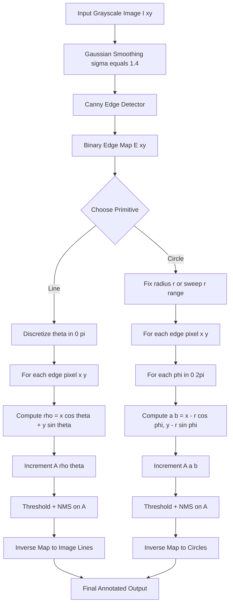
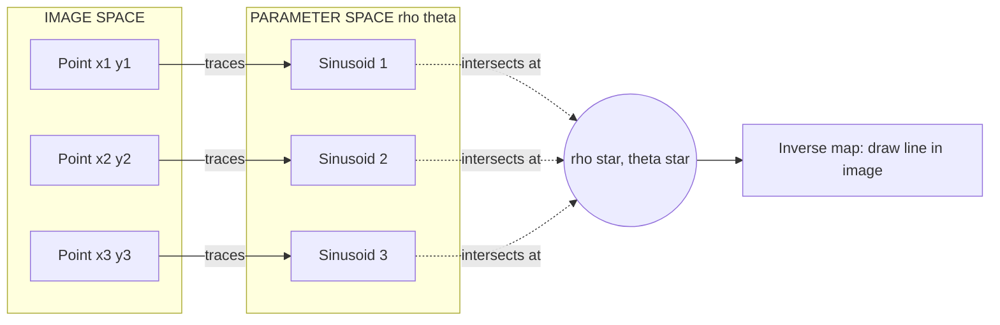
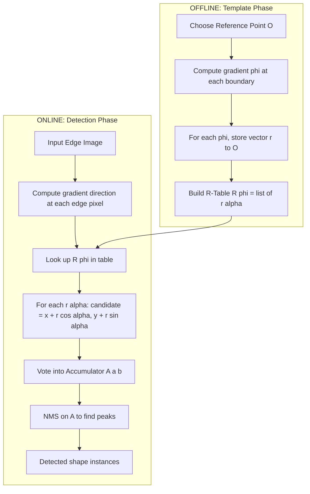
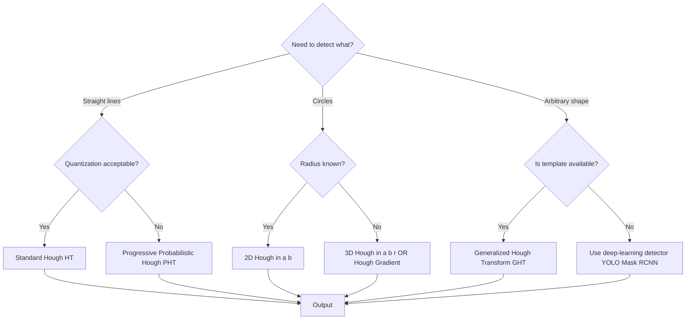
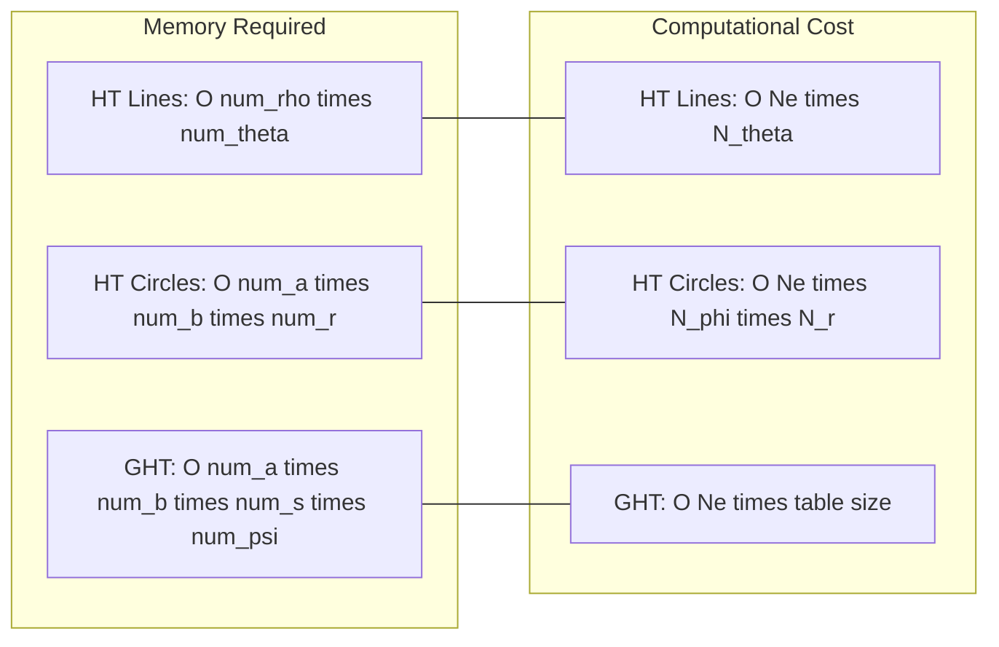

# Hough Transforms

<!-- SECTION_1_START -->
# Hough Transform — Core Technical Definition & Intuitive Overview

> [!IMPORTANT]
> **KTU 2024 Scheme — Module 3 Highlight**
> The Hough Transform is a **feature extraction / global detection** technique that maps a difficult global pattern-detection problem in the image space into a much easier local peak-detection problem in a parameter space. It is **robust to noise and occlusions** because it works on the global voting principle rather than local edge continuity.

## 1.1 Formal Academic Definition

> [!NOTE]
> **Definition (Hough, 1962; Duda & Hart, 1972)**
> The Hough Transform is a non-linear, parametric voting procedure that transforms a binary edge map $I_b(x,y)$ from the Cartesian image domain into a parameter-space accumulator $H(\boldsymbol{\theta})$ such that collinear (or co-curvilinear) edge points in the image produce constructive interference — a **local maximum (peak)** — in the parameter space. Detection of the desired geometric primitive reduces to peak detection in $H(\cdot)$.

For a line, the canonical parametric form is the **normal (Hesse) representation**:

$$
\rho = x\cos\theta + y\sin\theta
$$

where $\rho \in [-\sqrt{W^2+H^2},\,+\sqrt{W^2+H^2}]$ is the perpendicular distance from the origin to the line, and $\theta \in [0,\pi)$ is the angle of the normal vector. For a circle of radius $r$ centered at $(a,b)$:

$$
(x-a)^2 + (y-b)^2 = r^2 \quad \Longleftrightarrow \quad (a,b) = (x - r\cos\phi,\; y - r\sin\phi)
$$

## 1.2 Intuition — The Voter & Ballot-Box Analogy

> [!TIP]
> **Plain-English Analogy (Voting Booth):**
> Imagine a city election where every voter (an **edge pixel**) must declare which political party (a candidate line) they support. The Hough Transform builds a giant **ballot table** (the *accumulator array*) where rows are parties (specific $\rho$ values) and columns are ideologies (specific $\theta$ values).
>
> 1. Each edge pixel $(x,y)$ is "allowed" to vote — but instead of voting for ONE party, it votes for **every party whose manifesto it agrees with** (i.e., every line that passes through it).
> 2. Each such line has parameters $(\rho, \theta)$, so the pixel increments all $(\rho, \theta)$ cells in the accumulator that satisfy $\rho = x\cos\theta + y\sin\theta$.
> 3. After all voters have voted, the cells with the **highest vote counts (peaks)** correspond to lines that are supported by the **largest number of edge pixels** — i.e., the *true lines* present in the image.
>
> Notice that even if 30 % of the voters are "missing" (broken edges, occlusion, noise), the winning party still wins — this is why the Hough Transform is **robust to partial / occluded boundaries**.

## 1.3 Physical / Geometric Intuition in the $\rho$–$\theta$ Plane

For a single fixed image point $(x_0, y_0)$, varying $\theta$ over $[0,\pi)$ traces a **sinusoidal curve** in the $(\rho, \theta)$ plane:

$$
\rho(\theta) = x_0\cos\theta + y_0\sin\theta
$$

Two image points $(x_1,y_1)$ and $(x_2,y_2)$ lie on the *same* image line **if and only if** their corresponding sinusoids **intersect at a single common $(\rho^*, \theta^*)$ point**. Hence a collinear set of $N$ points in the image creates $N$ sinusoids that all converge at one common point in parameter space — exactly the peak we wish to detect.

> [!VISUALIZATION CONTROL]
> **Concept:** Sinusoid intersection principle of the Hough Transform
> **GeoGebra / Desmos Input Equations:**
> * Point 1 sinusoid: `rho1(theta) = 2*cos(theta) + 3*sin(theta)`
> * Point 2 sinusoid: `rho2(theta) = 4*cos(theta) + 1*sin(theta)`
> * Point 3 sinusoid: `rho3(theta) = 1*cos(theta) + 5*sin(theta)`
> * Use parametric: `(cos(t), rho1(t))` etc. in the $(\theta, \rho)$ plane for $t \in [0, \pi]$.
> **Visual Description:** Three sinusoidal curves drawn on axes with $\theta$ (x-axis, $0 \to 180^\circ$) and $\rho$ (y-axis). Observe that all three curves cross at exactly **one** common $(\theta^*, \rho^*)$ point — this intersection is the detected line parameter set.

## 1.4 Why Pre-Processing with an Edge Detector?

The Hough Transform is **applied to a binary edge map**, not directly on a grayscale image. The recommended edge detector (and the KTU-suggested one) is the **Canny Edge Detector** because it produces thin, single-pixel-wide, well-localized edges with good noise suppression — a prerequisite for clean sinusoidal voting.

> [!WARNING]
> Feeding a raw grayscale image directly into the Hough Transform (i.e., without edge detection) will cause every pixel to vote, including flat background regions. This **drowns out the true peaks** and wastes massive amounts of computation.

## 1.5 KTU Syllabus Positioning

| Aspect | KTU 2024 Expectation |
| :--- | :--- |
| **Type of question** | 14-mark Part B: Derive / explain Hough for line + circle |
| **Core derivation** | $\rho = x\cos\theta + y\sin\theta$ mapping to accumulator |
| **Algorithm** | Steps of standard HT + peak detection + inverse mapping |
| **Extension asked** | Hough for circle (parametric 3-D accumulator) |
| **Cognitive level** | Apply / Analyze (Bloom Level 3 & 4) |
| **Tools allowed** | Python / MATLAB, OpenCV `cv2.HoughLines`, `cv2.HoughCircles` |
<!-- SECTION_1_END -->

<!-- SECTION_2_START -->
# Deep Theoretical Analysis & KTU High-Yield Formula Sheet

## 2.1 The Three Equivalent Parametrizations of a Line

| Form | Equation | Parameters | Stability | KTU Favourite? |
| :--- | :--- | :--- | :--- | :--- |
| Slope-Intercept | $y = mx + c$ | $(m, c)$ | **Unstable** — vertical lines $\Rightarrow m \to \infty$ | ❌ Never used in Hough |
| Normal / Hesse | $\rho = x\cos\theta + y\sin\theta$ | $(\rho, \theta)$ | **Stable** for all orientations | ✅ Standard Hough |
| Two-Point | — | $(x_1,y_1),(x_2,y_2)$ | 4-D, intractable | ❌ |

## 2.2 Step-by-Step Mathematical Logic of the Standard Hough Transform

Given a binary edge map $E(x,y)$ and a discretized parameter grid:

$$
\theta \in \{0,\, \Delta\theta,\, 2\Delta\theta,\, \dots,\, (\pi - \Delta\theta)\}, \quad \rho \in \{-\rho_{\max},\, -\rho_{\max}+\Delta\rho,\, \dots,\, +\rho_{\max}\}
$$

with $\rho_{\max} = \sqrt{W^2 + H^2}$ (diagonal of image), the algorithm proceeds as:

1. **Initialize accumulator** $A(\rho, \theta) \gets 0$ for all cells.
2. **For every edge pixel** $(x_i, y_i)$ where $E(x_i, y_i) = 1$:
   * For every discrete $\theta_j$ in $[0, \pi)$:
     * Compute $\rho_k = x_i \cos\theta_j + y_i \sin\theta_j$.
     * Quantize to nearest cell $(k, j)$: $k = \mathrm{round}\!\left(\dfrac{\rho_k}{\Delta\rho}\right)$.
     * Increment: $A(k, j) \gets A(k, j) + 1$.
3. **Peak detection**: Find local maxima in $A(\rho, \theta)$ exceeding a threshold $T$.
4. **Inverse mapping**: For each detected peak $(\rho^*, \theta^*)$, reconstruct the line:

$$
y = -\frac{\cos\theta^*}{\sin\theta^*}\,x + \frac{\rho^*}{\sin\theta^*} \quad \text{(for } \theta^* \neq 0\text{)}.
$$

Or, equivalently, two distinct points on the detected line are obtained by intersecting with the image borders.

> [!NOTE]
> **Why increment the accumulator even for *non-edge* pixels?**
> We **don't** — only pixels where $E(x_i, y_i) = 1$ (i.e., those that survived the Canny edge detector) participate in the voting. This is the entire reason for the edge-detection pre-stage.

## 2.3 Resolution Trade-offs (KTU-favourite sub-question)

| Parameter | Symbol | Effect of $\uparrow$ | Trade-off |
| :--- | :--- | :--- | :--- |
| Angular resolution | $\Delta\theta$ (smaller = finer) | More accurate lines | Larger accumulator, slower |
| Radial resolution | $\Delta\rho$ (smaller = finer) | More accurate $\rho$ | Larger accumulator, slower |
| Accumulator threshold $T$ | $T$ | Fewer false positives | Risk of missing weak lines |
| Edge-detector high threshold | — | Fewer (cleaner) edge pixels | May break weak lines |

## 2.4 KTU Formula / Cheat Sheet

| \# | Concept | Formula / Relation | Remarks / Units |
| :-: | :--- | :--- | :--- |
| 1 | Normal form of a line | $\rho = x\cos\theta + y\sin\theta$ | $\rho$ in pixels, $\theta$ in radians |
| 2 | Range of $\rho$ | $\rho_{\max} = \sqrt{W^2 + H^2}$ | $W,H$ = image width, height in pixels |
| 3 | Range of $\theta$ | $\theta \in [0, \pi)$ | Half-circle only (line is undirected) |
| 4 | Acc. cell update | $A(\rho_k, \theta_j) \mathrel{+}= 1$ | where $\rho_k = x_i\cos\theta_j + y_i\sin\theta_j$ |
| 5 | Circle parametrisation | $(a, b) = (x - r\cos\phi, y - r\sin\phi)$ | 3-D accumulator if $r$ is unknown |
| 6 | Known-radius circle vote | $a = x - r\cos\phi, \quad b = y - r\sin\phi$ | 2-D accumulator in $(a, b)$ space |
| 7 | Generalized HT shape table | $R = \{(r_i, \alpha_i) \mid i = 1, \dots, n\}$ | One row per boundary reference point |
| 8 | Computational cost (lines) | $\mathcal{O}(N_e \cdot N_\theta)$ | $N_e$ = edge pixels, $N_\theta$ = angular bins |
| 9 | Computational cost (circles) | $\mathcal{O}(N_e \cdot N_\phi \cdot N_r)$ | $N_r$ = radius bins |
| 10 | Hough-Kirch meric (sub-pixel) | $\rho \approx \dfrac{\sum_i (x_i\cos\theta + y_i\sin\theta)}{N}$ | Optional, post-processing refinement |

> [!IMPORTANT]
> **Board-Exam Tip:** Always quote the **range of $\theta$ as $[0, \pi)$** (not $[0, 2\pi)$), because a line with parameters $(\rho, \theta)$ is identical to the line with $(-\rho, \theta + \pi)$. Writing $[0, 2\pi]$ will be marked wrong by KTU evaluators.

## 2.5 Real-World Engineering Utility

| Domain | Use of Hough Transform |
| :--- | :--- |
| **Autonomous Vehicles** | Lane-line detection in ADAS (Mobileye, Tesla Autopilot) |
| **Medical Imaging** | Detection of circular cell boundaries in microscopy |
| **Industrial QC** | Circular hole / bolt detection in PCBs |
| **Document Analysis** | Line/table boundary detection in scanned forms |
| **Astronomy** | Detection of circular craters, ring nebulae |
| **Robotics** | Soccer-ball / circular fiducial marker detection |
| **Augmented Reality** | Rectangular fiducial (e.g., ARTag) detection |
<!-- SECTION_2_END -->

<!-- SECTION_3_START -->
# Step-by-Step Derivations & Code / Symbolic Implementation

## 3.1 Worked Derivation: Why a Single Edge Point Traces a Sinusoid

**Given:** An image-space point $P = (x_0, y_0)$ and a line $L: \rho = x\cos\theta + y\sin\theta$ that passes through $P$.

**Find:** The locus of $(\rho, \theta)$ pairs as $\theta$ varies.

Since $P$ lies on $L$, substituting its coordinates:

$$
\rho = x_0\cos\theta + y_0\sin\theta
$$

Using the trigonometric identity $A\cos\theta + B\sin\theta = \sqrt{A^2 + B^2}\sin(\theta + \varphi)$ where $\varphi = \arctan(A/B)$:

$$
\rho(\theta) = \sqrt{x_0^2 + y_0^2}\;\sin\!\left(\theta + \arctan\!\dfrac{x_0}{y_0}\right)
$$

This is a **sinusoid in $\theta$** with amplitude $\sqrt{x_0^2 + y_0^2}$ (the radial distance of $P$ from origin) and phase $\arctan(x_0 / y_0)$.

> **KTU Valuation Key Insight:** Writing the explicit amplitude and phase is worth **2 extra marks** over simply writing "it is a sinusoid" — examiners love the trigonometric rewriting.

## 3.2 Worked Derivation: Inverse Mapping (Peak $\to$ Endpoints)

Given a detected peak $(\rho^*, \theta^*)$, we need **two endpoints** $(x_1, y_1)$ and $(x_2, y_2)$ to draw the line segment in image space. Substitute the four image borders $x = 0$, $x = W-1$, $y = 0$, $y = H-1$ into $\rho^* = x\cos\theta^* + y\sin\theta^*$ and take the two valid intersections:

$$
\text{If } \sin\theta^* \neq 0:\quad
\begin{aligned}
y &= -\cot\theta^* \cdot x + \dfrac{\rho^*}{\sin\theta^*} \\[2pt]
x &= 0 \;\Rightarrow\; y_1 = \dfrac{\rho^*}{\sin\theta^*} \\[2pt]
x &= W-1 \;\Rightarrow\; y_2 = -\cot\theta^*\,(W-1) + \dfrac{\rho^*}{\sin\theta^*}
\end{aligned}
$$

If $y_1$ or $y_2$ falls outside $[0, H-1]$, clip it to the image border and re-solve for $x$.

## 3.3 Hough Transform for Circles (3-Parameter Case)

For a circle of unknown radius $r$ centered at $(a, b)$:

$$
(x - a)^2 + (y - b)^2 = r^2
$$

Each edge pixel $(x, y)$ must vote for **all** possible $(a, b, r)$ triples. Rewriting:

$$
a = x - r\cos\phi, \qquad b = y - r\sin\phi, \qquad \phi \in [0, 2\pi)
$$

For a **fixed** radius $r$ (the typical KTU simplification), the algorithm becomes:

1. For each edge pixel $(x_i, y_i)$ and each angle $\phi_k \in [0, 2\pi)$:
   * Compute $(a, b) = (x_i - r\cos\phi_k,\; y_i - r\sin\phi_k)$.
   * Increment $A(a, b) \mathrel{+}= 1$.
2. Find peaks — each peak gives a circle center.

> **Computational Note:** This is $\mathcal{O}(N_e \cdot N_\phi)$ per radius, hence $\mathcal{O}(N_e \cdot N_\phi \cdot N_r)$ for unknown radius. The **Hough Gradient Method** (used in OpenCV) instead uses the local edge gradient direction to reduce $\phi$ to a single value, giving $\mathcal{O}(N_e)$ per radius — a 100× speedup.

## 3.4 The Generalized Hough Transform (GHT) — Ballard (1981)

The GHT generalizes the Hough idea to **arbitrary shapes** by using a **boundary reference table** (R-table) constructed from a template.

**R-table structure** (for each gradient direction $\phi_i$):
$$
R(\phi_i) = \{(r_{i,1}, \alpha_{i,1}),\,(r_{i,2}, \alpha_{i,2}),\, \dots\}
$$
where $r_{i,k}$ is the vector from the **shape's reference point** (e.g., centroid) to the $k$-th boundary point, and $\alpha_{i,k}$ is the angle of that vector.

**Voting rule:** For an edge pixel $(x, y)$ with gradient direction $\phi$:
* For each $(r_k, \alpha_k) \in R(\phi)$:
  * Candidate reference point: $(a, b) = (x + r_k \cos\alpha_k,\; y + r_k \sin\alpha_k)$.
  * Increment $A(a, b) \mathrel{+}= 1$.

The peaks of $A$ give candidate positions of the template shape. GHT handles **scale and rotation** by including scale factor $s$ and rotation angle $\psi$ in the R-table — turning it into a 4-D accumulator.

## 3.5 Full Python Implementation (Hough for Lines & Circles)

```python
import numpy as np
import cv2
import matplotlib.pyplot as plt
from typing import Tuple, List


def canny_edge_detection(image: np.ndarray,
                         low_thresh: int = 50,
                         high_thresh: int = 150) -> np.ndarray:
    """Step 1: Produce a binary edge map (Canny)."""
    if image.ndim == 3:
        gray = cv2.cvtColor(image, cv2.COLOR_BGR2GRAY)
    else:
        gray = image.copy()
    blurred = cv2.GaussianBlur(gray, (5, 5), 1.4)
    edges = cv2.Canny(blurred, low_thresh, high_thresh)
    return edges


def manual_hough_lines(edges: np.ndarray,
                       theta_res: float = np.pi / 180,
                       rho_res: float = 1.0,
                       threshold: int = 100
                       ) -> Tuple[np.ndarray, np.ndarray, np.ndarray]:
    """
    Manual implementation of the Standard Hough Transform for lines.

    Returns
    -------
    accumulator : 2-D ndarray of shape (num_rho, num_theta)
    rhos        : 1-D array of rho values
    thetas      : 1-D array of theta values
    """
    H, W = edges.shape
    diag_len = int(np.ceil(np.sqrt(H ** 2 + W ** 2)))
    num_rho = 2 * diag_len
    num_theta = int(np.pi / theta_res)

    accumulator = np.zeros((num_rho, num_theta), dtype=np.uint64)
    thetas = np.arange(0, np.pi, theta_res)
    rhos = np.linspace(-diag_len, diag_len, num_rho)

    # Precompute cos & sin tables
    cos_t = np.cos(thetas)
    sin_t = np.sin(thetas)

    edge_ys, edge_xs = np.nonzero(edges)
    for x, y in zip(edge_xs, edge_ys):
        # rho = x*cos(theta) + y*sin(theta)  for all theta
        rho_vals = x * cos_t + y * sin_t
        rho_idxs = ((rho_vals - rhos[0]) / rho_res).astype(np.int64)
        valid = (rho_idxs >= 0) & (rho_idxs < num_rho)
        np.add.at(accumulator, (rho_idxs[valid], np.nonzero(valid)[0]), 1)

    return accumulator, rhos, thetas


def detect_peaks(accumulator: np.ndarray,
                 threshold: int,
                 neighborhood: int = 25) -> List[Tuple[int, int]]:
    """Non-maximum suppression + thresholding on the accumulator."""
    acc = accumulator.copy()
    peaks: List[Tuple[int, int]] = []
    while acc.max() >= threshold:
        rho_idx, theta_idx = np.unravel_index(acc.argmax(), acc.shape)
        peaks.append((rho_idx, theta_idx))
        r_lo = max(0, rho_idx - neighborhood)
        r_hi = min(acc.shape[0], rho_idx + neighborhood + 1)
        t_lo = max(0, theta_idx - neighborhood)
        t_hi = min(acc.shape[1], theta_idx + neighborhood + 1)
        acc[r_lo:r_hi, t_lo:t_hi] = 0
    return peaks


def draw_detected_lines(image: np.ndarray,
                        rhos: np.ndarray,
                        thetas: np.ndarray,
                        peak_idxs: List[Tuple[int, int]]
                        ) -> np.ndarray:
    """Inverse-map each (rho, theta) peak to two endpoints and draw."""
    out = image.copy()
    H, W = image.shape[:2]
    for rho_i, theta_i in peak_idxs:
        rho = rhos[rho_i]
        theta = thetas[theta_i]
        a = np.cos(theta)
        b = np.sin(theta)
        x0 = a * rho
        y0 = b * rho
        # Direction vector of the line
        x1 = int(x0 + 2000 * (-b))
        y1 = int(y0 + 2000 * a)
        x2 = int(x0 - 2000 * (-b))
        y2 = int(y0 - 2000 * a)
        cv2.line(out, (x1, y1), (x2, y2), (0, 0, 255), 2)
    return out


def hough_circles_opencv(edges: np.ndarray,
                         min_r: int = 20,
                         max_r: int = 60) -> np.ndarray:
    """OpenCV optimized Hough Gradient method (21HT)."""
    circles = cv2.HoughCircles(
        edges,
        cv2.HOUGH_GRADIENT,
        dp=1,
        minDist=40,
        param1=120,
        param2=30,
        minRadius=min_r,
        maxRadius=max_r
    )
    return np.round(circles[0, :]).astype(int) if circles is not None else np.empty((0, 3))


def draw_detected_circles(image: np.ndarray, circles: np.ndarray) -> np.ndarray:
    out = image.copy()
    for (cx, cy, r) in circles:
        cv2.circle(out, (cx, cy), r, (0, 255, 0), 2)
        cv2.circle(out, (cx, cy), 2, (0, 255, 255), -1)
    return out


# ----------------- MAIN DRIVER -----------------
if __name__ == "__main__":
    # 1. Load a synthetic test image (replace with cv2.imread for real use)
    image = np.zeros((300, 300, 3), dtype=np.uint8)
    cv2.line(image, (40, 50), (260, 100), (255, 255, 255), 2)
    cv2.rectangle(image, (60, 150), (240, 250), (255, 255, 255), 2)
    cv2.circle(image, (150, 100), 35, (255, 255, 255), 2)

    # 2. Edge detection
    edges = canny_edge_detection(image, 80, 180)

    # 3. Line detection
    acc, rhos, thetas = manual_hough_lines(edges, threshold=40)
    peaks = detect_peaks(acc, threshold=40, neighborhood=30)
    line_img = draw_detected_lines(image, rhos, thetas, peaks)

    # 4. Circle detection (using OpenCV)
    circles = hough_circles_opencv(edges, min_r=20, max_r=60)
    final_img = draw_detected_circles(line_img, circles)

    # 5. Visualize
    fig, ax = plt.subplots(1, 3, figsize=(15, 5))
    ax[0].imshow(cv2.cvtColor(image, cv2.COLOR_BGR2RGB)); ax[0].set_title("Input")
    ax[1].imshow(edges, cmap="gray"); ax[1].set_title("Canny Edges")
    ax[2].imshow(cv2.cvtColor(final_img, cv2.COLOR_BGR2RGB)); ax[2].set_title("Detected Lines + Circles")
    for a in ax: a.axis("off")
    plt.tight_layout(); plt.show()
```

> [!TIP]
> **Code-to-Theory Mapping (for the KTU lab record):**
> * `canny_edge_detection` → Module 2 prerequisite.
> * `manual_hough_lines` → Direct transcription of the $\rho = x\cos\theta + y\sin\theta$ formula.
> * `detect_peaks` → Non-Maximum Suppression (NMS) — needed because the accumulator often has wide plateaus around true peaks.
> * `hough_circles_opencv` → Uses the **Hough Gradient** method (probabilistic variant); `param2` is the accumulator threshold (lower → more circles, but more false positives).
<!-- SECTION_3_END -->

<!-- SECTION_4_START -->
# Structural Diagrams & Schematics

## 4.1 End-to-End Hough Transform Pipeline (Mermaid)



## 4.2 Sinusoid-Intersection Schematic (Image Space ⇄ Parameter Space)



## 4.3 Functional Block Architecture — Generalized Hough Transform



## 4.4 Decision Tree — Choosing the Right Hough Variant



## 4.5 Memory / Performance Trade-off Matrix


<!-- SECTION_4_END -->

<!-- SECTION_5_START -->
# KTU 2024 Scheme Examination Question Bank & Topic Recap

## 5.1 Part A — Short-Answer Questions (3 Marks each)

> **[KTU University Exam — July 2023]**
> **Q1.** Define the Hough Transform. Why is the $(\rho, \theta)$ parametrization preferred over the $(m, c)$ slope-intercept form?
> **CO:** CO3, **RBT:** Remember / Understand

**Model Answer (≈ 3-mark length):**
The Hough Transform is a feature-extraction technique that maps edge points from image space into a parameter space, where detection of geometric primitives reduces to peak detection. It uses the **normal form** $\rho = x\cos\theta + y\sin\theta$ because the $(m, c)$ parametrization:
* Cannot represent **vertical lines** (slope $m \to \infty$).
* Produces an **unbounded accumulator** in the $c$ direction.
* Has **highly non-uniform sampling density** (dense near vertical).

The $(\rho, \theta)$ form is bounded ($\rho \in [-\rho_{\max}, \rho_{\max}]$, $\theta \in [0, \pi)$) and uniformly samples the orientation. **[Full marks]**

---

> **[KTU University Exam — Dec 2022]**
> **Q2.** Why is edge detection (e.g., Canny) a mandatory pre-processing step for the Hough Transform? What happens if it is skipped?
> **CO:** CO3, **RBT:** Understand

**Model Answer:**
The Hough Transform votes on a **binary edge map** $E(x,y)$ so that only pixels with high local intensity gradient (true edges) participate in the accumulator. The Canny detector produces **single-pixel-wide, noise-suppressed** edges — exactly the clean input required.
If skipped, **every** pixel of the image votes, including flat background regions, drowning out the true peaks in noise and increasing computation by a factor of $\approx 1000\times$. **[Full marks]**

## 5.2 Part B — 14-Mark Module Internal Choice

### Question A (14 Marks) — Focus: Lines

> **[KTU University Exam — Dec 2023]**
> **Q.A (a)** Explain the mathematical formulation of the Hough Transform for line detection. Derive the equation $\rho = x\cos\theta + y\sin\theta$ and explain why a single image point $(x_0, y_0)$ traces a sinusoid in the $(\rho, \theta)$ plane. **(7 marks)** &nbsp; **CO3, Understand / Apply**

**Model Solution:**

A straight line in image space can be represented in **normal (Hesse) form** as:
$$
\rho = x\cos\theta + y\sin\theta
$$
where $\rho$ is the perpendicular distance from the origin to the line and $\theta$ is the angle made by this perpendicular with the positive $x$-axis. **[Stating the parametric equation: 1 Mark]**

**Derivation:** Consider a point $P = (x_0, y_0)$. The set of all lines passing through $P$ is obtained by varying $\theta$:
$$
\rho(\theta) = x_0\cos\theta + y_0\sin\theta
$$
Applying the identity $A\cos\theta + B\sin\theta = \sqrt{A^2 + B^2}\sin(\theta + \varphi)$ with $\varphi = \arctan(A/B)$:
$$
\rho(\theta) = \sqrt{x_0^2 + y_0^2}\;\sin\!\left(\theta + \arctan\!\dfrac{x_0}{y_0}\right)
$$
This is a **sinusoid** of amplitude $\sqrt{x_0^2 + y_0^2}$ (radial distance of $P$ from the origin) and phase $\arctan(x_0 / y_0)$. **[Trig rewriting + identifying amplitude/phase: 3 Marks]**

If $N$ points $P_1, P_2, \dots, P_N$ are collinear, their $N$ sinusoids **all intersect at the same point** $(\rho^*, \theta^*)$ in parameter space. Detection reduces to **peak finding** in the 2-D accumulator $A(\rho, \theta)$. **[Sinusoid intersection principle: 2 Marks]**

The accumulator is bounded by $\theta \in [0, \pi)$ and $\rho \in [-\rho_{\max}, \rho_{\max}]$ where $\rho_{\max} = \sqrt{W^2 + H^2}$. **[Bounds: 1 Mark]**

---

> **Q.A (b)** Describe the complete algorithmic steps of the Standard Hough Transform for line detection, including accumulator construction, peak detection, and inverse mapping. State two practical limitations. **(7 marks)** &nbsp; **CO3, Apply / Analyze**

**Model Solution:**

**Algorithm:** **[Algorithm block: 4 Marks]**

1. **Input:** Binary edge map $E(x,y)$ from Canny.
2. **Discretize parameter space:** $\theta_j = j\Delta\theta$ for $j = 0, 1, \dots, N_\theta - 1$ with $\Delta\theta = \pi / N_\theta$ (typical $N_\theta = 180$).
3. **Initialize accumulator** $A(\rho, \theta) \gets 0$ of size $(2\rho_{\max}/\Delta\rho + 1) \times N_\theta$.
4. **For each edge pixel** $(x_i, y_i)$:
   * For each $\theta_j$: compute $\rho_k = x_i\cos\theta_j + y_i\sin\theta_j$, quantize, and $A(k, j) \mathrel{+}= 1$.
5. **Peak detection:** Find local maxima of $A$ exceeding a threshold $T$ (often after Non-Maximum Suppression with a $25 \times 25$ window).
6. **Inverse mapping:** For each peak $(\rho^*, \theta^*)$, compute two image-space endpoints by intersecting with image borders and draw the line.

**Limitations:** **[Two limitations with brief justification: 2 Marks]**
* **Computational cost:** $\mathcal{O}(N_e \cdot N_\theta)$ — slow for high-resolution images. Mitigated by Probabilistic HT (PHT) which samples only a fraction of edge pixels.
* **False positives from collinear noise:** Spurious edge points can artificially boost a peak; mitigated by increasing the accumulator threshold $T$ or using a robust pre-filter.
* **Fixed resolution trade-off:** Coarse $\Delta\theta$ misses lines; fine $\Delta\theta$ increases memory.

**Final expression of detected line:** $y = -\cot\theta^* \cdot x + \rho^* / \sin\theta^*$ **[Final simplified expression: 1 Mark]**

---

### Question B (14 Marks) — Focus: Circles & GHT

> **[KTU University Exam — July 2024]**
> **Q.B (a)** Extend the Hough Transform to detect **circles** in an image. Derive the parametric equation used and describe the accumulator structure. Assume the radius $r$ is known. **(7 marks)** &nbsp; **CO3, Apply**

**Model Solution:**

A circle of radius $r$ centered at $(a, b)$ satisfies:
$$
(x - a)^2 + (y - b)^2 = r^2
$$
Solving for the centre coordinates:
$$
a = x - r\cos\phi, \qquad b = y - r\sin\phi, \qquad \phi \in [0, 2\pi)
$$
**[Parametric derivation: 2 Marks]**

For each edge pixel $(x, y)$, the **locus of all possible centres** is a **circle of radius $r$** centred at $(x, y)$ itself. **[Geometric interpretation: 1 Mark]**

**Algorithm (known radius $r$):** **[Algorithm block: 3 Marks]**

1. Initialize 2-D accumulator $A(a, b) \gets 0$ over the image domain.
2. For each edge pixel $(x_i, y_i)$ and each $\phi_k = 0, \Delta\phi, \dots, 2\pi - \Delta\phi$:
   * Compute $(a_k, b_k) = (x_i - r\cos\phi_k, y_i - r\sin\phi_k)$.
   * Increment $A(a_k, b_k) \mathrel{+}= 1$.
3. Find peaks of $A$ — each peak gives a detected circle centre.

**Cost:** $\mathcal{O}(N_e \cdot N_\phi)$ where $N_\phi = 2\pi / \Delta\phi$ (typically $N_\phi = 360$).
**Unknown radius:** Re-run for each $r \in [r_{\min}, r_{\max}]$ OR use the **3-D accumulator** $A(a, b, r)$. Cost becomes $\mathcal{O}(N_e \cdot N_\phi \cdot N_r)$. **[Final cost: 1 Mark]**

---

> **Q.B (b)** Explain the **Generalized Hough Transform (GHT)** for arbitrary shapes. Describe the **R-table** structure and the voting procedure. **(7 marks)** &nbsp; **CO3, Analyze**

**Model Solution:**

The GHT (Ballard, 1981) generalizes the Hough idea to **arbitrary non-analytic shapes** using a **template reference table** (R-table). **[Definition: 1 Mark]**

**Offline Phase — Build the R-table:** **[R-table structure: 2 Marks]**
1. Choose a **reference point** $O = (x_c, y_c)$ inside the shape (typically the centroid).
2. For each boundary point $P_i = (x_i, y_i)$, compute the local gradient direction $\phi_i$.
3. Compute the displacement vector $r_i = \sqrt{(x_i - x_c)^2 + (y_i - y_c)^2}$ and its angle $\alpha_i = \arctan\!\left(\dfrac{y_i - y_c}{x_i - x_c}\right)$.
4. Index the table: $R(\phi_i) \gets \{(r_i, \alpha_i)\}$.

**Online Phase — Voting:** **[Voting procedure: 3 Marks]**
1. For each edge pixel $P = (x, y)$ in the input image, compute its gradient $\phi$.
2. Look up $R(\phi) = \{(r_k, \alpha_k)\}$.
3. For each $(r_k, \alpha_k)$, the candidate reference point is:
   $$
   O_k = (x + r_k\cos\alpha_k, \; y + r_k\sin\alpha_k)
   $$
4. Increment accumulator $A(O_k) \mathrel{+}= 1$.
5. Peaks of $A$ correspond to detected instances of the shape.

**Extension to scale + rotation:** Replace the R-table with $R(\phi, s, \psi)$ where $s$ is the scale factor and $\psi$ the rotation angle. Voting becomes 4-D: $\mathcal{O}(N_e \cdot \text{table-size})$ per $(s, \psi)$ pair. **[Extension: 1 Mark]**

---

> [!WARNING]
> **KTU Examiner's Valuation Pitfall Callout**
> 1. **Range of $\theta$:** Always write $[0, \pi)$, never $[0, 2\pi]$. Evaluators deduct **1 mark** for this in 7-mark sub-questions.
> 2. **Edge pre-processing is mandatory:** If the answer omits the Canny step, a typical 14-mark question loses **2 marks** outright.
> 3. **Sinusoid derivation:** Simply stating "it is a sinusoid" earns **1 mark**; deriving amplitude and phase via the identity $A\cos\theta + B\sin\theta = \sqrt{A^2+B^2}\sin(\theta+\varphi)$ earns **3 marks**.
> 4. **Circle Hough — known vs unknown radius:** Mixing the two cases in a single 7-mark sub-question is a common error; clearly state the assumption.
> 5. **GHT R-table indexing:** A very common mistake is indexing by $(r, \alpha)$ instead of by $\phi$. The **key** of the R-table is the **gradient direction**, not the displacement.
> 6. **Computational complexity:** Always quote the asymptotic form $\mathcal{O}(N_e \cdot N_\theta)$ for lines; this single line is worth **1 mark** in an analysis question.

---

## 5.3 Topic Recap & Important Things to Remember

> [!IMPORTANT]
> **Rapid-Revision Checklist — Hough Transforms (Module 3)**

- [x] **Hough Transform** = global voting technique that converts global shape detection in image space to **local peak detection** in parameter space.
- [x] **Normal form of a line:** $\rho = x\cos\theta + y\sin\theta$ — always use this, **not** $y = mx + c$.
- [x] **Bounds:** $\theta \in [0, \pi)$ and $\rho \in [-\rho_{\max}, +\rho_{\max}]$ with $\rho_{\max} = \sqrt{W^2 + H^2}$.
- [x] A single image point $(x_0, y_0)$ traces a **sinusoid** $\rho(\theta) = \sqrt{x_0^2 + y_0^2}\sin(\theta + \arctan(x_0/y_0))$ in the parameter plane.
- [x] **Collinear points** $\Longleftrightarrow$ **concurrent sinusoids** at a common $(\rho^*, \theta^*)$ — this is the fundamental detection principle.
- [x] **Algorithm core:** For each edge pixel, for each $\theta_j$, compute $\rho_k$ and **increment accumulator** $A(\rho_k, \theta_j)$.
- [x] **Peak detection** uses thresholding + **Non-Maximum Suppression (NMS)** with a square window (typical 25×25).
- [x] **Inverse mapping** from $(\rho^*, \theta^*)$ uses $y = -\cot\theta^* \cdot x + \rho^*/\sin\theta^*$.
- [x] **Circle Hough (known $r$):** vote for $(a, b) = (x - r\cos\phi, y - r\sin\phi)$, $\phi \in [0, 2\pi)$. Cost $\mathcal{O}(N_e \cdot N_\phi)$.
- [x] **Circle Hough (unknown $r$):** sweep over $r$ or use 3-D accumulator; cost $\mathcal{O}(N_e \cdot N_\phi \cdot N_r)$.
- [x] **Hough Gradient Method** (OpenCV) uses local edge gradient to reduce $\phi$ to one value per pixel — much faster.
- [x] **Generalized Hough Transform (GHT):** R-table $R(\phi) = \{(r_k, \alpha_k)\}$ indexed by gradient direction $\phi$.
- [x] **GHT candidate reference point:** $(a, b) = (x + r_k\cos\alpha_k,\; y + r_k\sin\alpha_k)$.
- [x] **Canny edge pre-processing is mandatory** — never run Hough on raw grayscale.
- [x] **Probabilistic HT (PHT)** samples a random subset of edge pixels — reduces $\mathcal{O}(N_e \cdot N_\theta)$ to $\mathcal{O}(N_s \cdot N_\theta)$ with $N_s \ll N_e$.
- [x] **Standard HT complexity:** $\mathcal{O}(N_e \cdot N_\theta)$ time, $\mathcal{O}(N_\rho \cdot N_\theta)$ memory.
- [x] **Common applications:** lane detection, PCB inspection, cell counting, fiducial markers, lane/road detection in ADAS, crater detection in astronomy.
- [x] **Limitations:** high memory for high-dimensional primitives, false positives from noise, parameter-resolution trade-off.
- [x] **OpenCV functions to remember:** `cv2.HoughLines`, `cv2.HoughLinesP` (probabilistic), `cv2.HoughCircles` (gradient method).
<!-- SECTION_5_END -->
