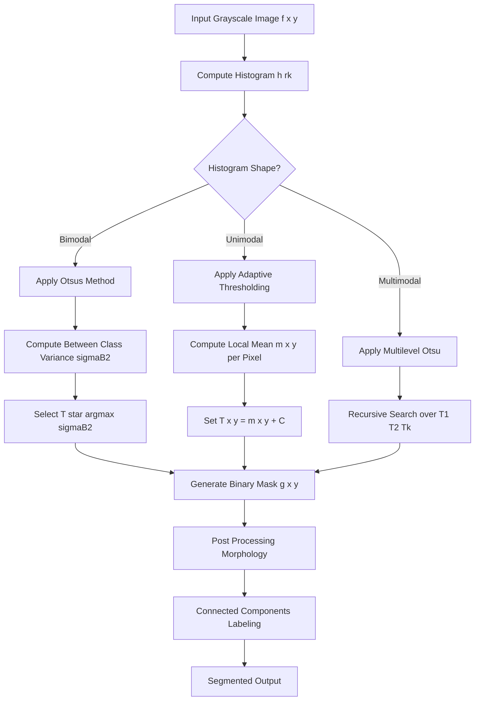
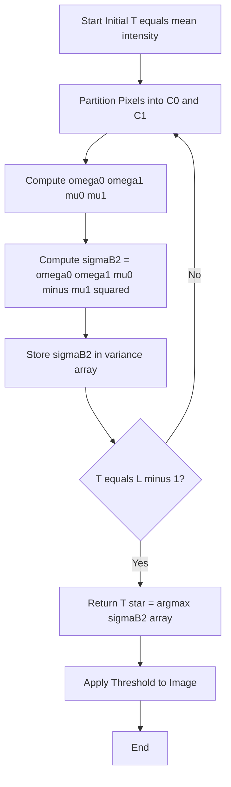
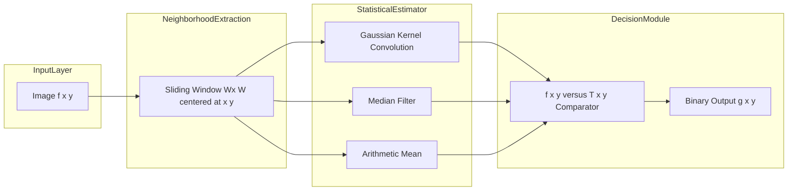
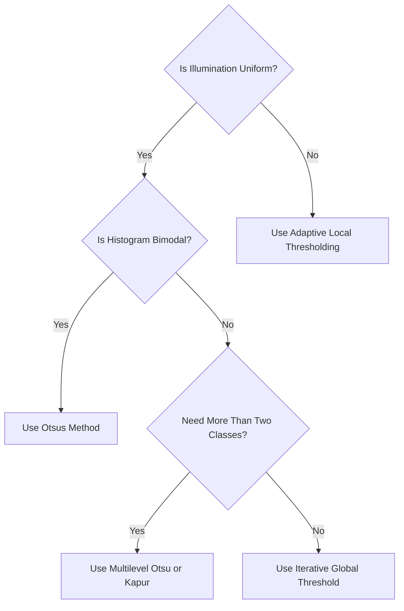

# Image Segmentation - Thresholding

<!-- SECTION_1_START -->
# Image Segmentation — Thresholding

## 1.1 Formal Academic Definition (KTU 2024 Scheme Terminology)

> [!NOTE]
> **Image Segmentation** is the process of partitioning a digital image $f(x,y)$ into multiple non-overlapping, homogeneous, and meaningful regions or contours corresponding to objects of interest and the background. Formally, it is a mapping $S: \mathcal{P}(f) \rightarrow \{R_1, R_2, \ldots, R_n\}$ such that $\bigcup_{i=1}^{n} R_i = f$ and $R_i \cap R_j = \emptyset$ for $i \neq j$.

**Thresholding** is the simplest, fastest, and most widely used pixel-based segmentation technique. It converts a grayscale image into a binary image $g(x,y)$ by comparing the pixel intensity $f(x,y)$ against one or more threshold values $T$:

$$
g(x,y) = \begin{cases} 1 & \text{if } f(x,y) \geq T \\ 0 & \text{if } f(x,y) < T \end{cases}
$$

The output $g(x,y) \in \{0, 1\}$ is called a **binary mask** or **bilevel image**, where **1 (white)** typically denotes the *foreground* (object pixels) and **0 (black)** denotes the *background*. The standard intensity range used in 8-bit DIP is **$0 \leq f(x,y) \leq 255$**.

> [!IMPORTANT]
> **KTU 2024 Syllabus Highlight (Module 3):** Thresholding is a high-weightage topic. Students must master **Global (Single) Thresholding**, **Otsu's Automatic Method**, **Adaptive/Local Thresholding**, **Optimal Thresholding**, and **Multilevel Thresholding**. The benchmark equations required are the **inter-class variance** ($\sigma_B^2$) and the **within-class variance** ($\sigma_W^2$) expressions used in Otsu's algorithm.

---

## 1.2 Conceptual Analogy & Intuition

Imagine a photograph of a black-and-white **barcode sticker on a white parcel** at a logistics warehouse. To a sorting robot, the parcel image is just a 2D grid of numbers. How does the robot separate the "barcode lines" from the "white space"?

The answer is **thresholding**. The robot picks a single intensity value — say, $T = 128$ on a **0–255** scale. Every pixel darker than $128$ is *declared a bar*, and every pixel lighter than $128$ is *declared background*. Just like a bouncer at a nightclub who lets in only those wearing a certain shade of color, the threshold is the gatekeeper of pixel identity.

**Geometric Intuition on the Histogram:** Open the image's histogram $h(r_k)$, which plots the frequency of each gray level $r_k$ on the horizontal axis. A bimodal histogram (two distinct peaks = two dominant regions) is the **ideal** candidate for thresholding. The threshold $T$ is simply the **valley** between the two peaks. If the histogram is flat, noisy, or unimodal, simple thresholding fails — and that is precisely the motivation for advanced methods like **Otsu's** and **adaptive** thresholding.

> [!TIP]
> **Memory Trick:** "**T**hreshold = **T**rough between two peaks." If the histogram has two humps like a camel's back, place $T$ in the dip.

---

## 1.3 GeoGebra / Desmos Visualization

> [!VISUALIZATION CONTROL]
> **Concept:** Bimodal Histogram with Threshold Valley
> **GeoGebra / Desmos Input Equations:**
> * Bimodal Gaussian mixture: `f(x) = 0.6 * exp(-((x-60)^2)/(2*15^2)) + 0.4 * exp(-((x-180)^2)/(2*20^2))`
> * Threshold line: `T(x) = 0.15` (vertical decision boundary around $x \approx 120$)
> **Visual Description:** A horizontal axis from $0$ to $255$ (gray levels) and a vertical axis (pixel count). You will observe **two Gaussian-shaped humps** — the left hump centered near $60$ (dark object pixels) and the right hump centered near $180$ (bright background pixels). The dashed vertical line at $T \approx 120$ slices the histogram; pixels to the left are mapped to **0** (black) and pixels to the right are mapped to **1** (white). The student should observe how shifting $T$ left or right changes the *sensitivity* of segmentation.

---

<!-- SECTION_1_END -->

<!-- SECTION_2_START -->
# Deep Theoretical Analysis & KTU High-Yield Formula Sheet

## 2.1 Taxonomy of Thresholding Techniques

Thresholding is classified along **three orthogonal axes** — the *number of thresholds*, the *spatial scope* of the threshold, and the *automation* of threshold selection.

### A. By Number of Thresholds
- **Single (Global) Thresholding:** Uses one $T$ for the entire image. Works only when the image has uniform illumination.
- **Multilevel Thresholding:** Uses $k$ thresholds $(T_1, T_2, \ldots, T_k)$ to produce $(k+1)$ classes. Suited for images with more than two dominant regions.

### B. By Spatial Scope
- **Global Thresholding:** $T$ is constant across the whole image.
- **Local / Adaptive Thresholding:** $T = T(x, y)$ varies with pixel coordinates. Robust to illumination gradients (e.g., shadows, vignetting).
- **Dynamic Thresholding:** Threshold depends on local neighborhood statistics (mean, median, Gaussian-weighted mean).

### C. By Selection Strategy
- **Manual Thresholding:** Trial-and-error by an operator.
- **Histogram-Based:** Valley-seeking, Otsu's method, **Ridler-Calvard iterative method**, **Kapur's maximum entropy**.
- **Optimal Thresholding:** Minimizes a probabilistic error criterion (e.g., Gaussian mixture model fitting).

---

## 2.2 The Basic Global Thresholding Algorithm (Gonzalez & Woods)

This iterative procedure converges to a stable $T$ from an initial guess:

1. Select an **initial estimate** for the global threshold $T^{(0)}$. The mean intensity of the entire image is a safe starting point.
2. **Partition** the image into two sets using $T^{(k)}$: foreground pixels $F$ (intensity $\geq T$) and background pixels $B$ (intensity $< T$).
3. Compute the **mean gray-level** of each partition: $\mu_F^{(k)}$ and $\mu_B^{(k)}$.
4. Update the threshold:

$$
T^{(k+1)} = \frac{\mu_F^{(k)} + \mu_B^{(k)}}{2}
$$

5. **Repeat** Steps 2–4 until the change $\vert T^{(k+1)} - T^{(k)} \vert < \Delta$ (a small pre-defined tolerance, e.g., $\Delta = 0.5$).

**Convergence guarantee:** This algorithm is guaranteed to converge in a finite number of iterations because the set of possible $T$ values is the discrete set $\{0, 1, 2, \ldots, 255\}$.

---

## 2.3 Otsu's Method (Maximum Inter-Class Variance)

> [!IMPORTANT]
> **Otsu's Method** is the **single most important thresholding algorithm** in KTU board examinations. It is a *non-parametric, unsupervised* technique that automatically derives the optimal $T$ by **maximizing the between-class variance** $\sigma_B^2(T)$ (or equivalently minimizing the within-class variance $\sigma_W^2(T)$). It assumes the histogram is *bimodal*.

### Mathematical Formulation
Let $L = 256$ be the number of gray levels and $p_i = n_i / N$ be the normalized histogram (probability mass function), where $n_i$ is the number of pixels with intensity $i$ and $N$ is the total pixel count.

For a candidate threshold $T$:

- **Class probabilities** (weights):

$$
\omega_0(T) = \sum_{i=0}^{T} p_i \qquad \omega_1(T) = \sum_{i=T+1}^{L-1} p_i = 1 - \omega_0
$$

- **Class means:**

$$
\mu_0(T) = \frac{\sum_{i=0}^{T} i \cdot p_i}{\omega_0(T)} \qquad \mu_1(T) = \frac{\sum_{i=T+1}^{L-1} i \cdot p_i}{\omega_1(T)}
$$

- **Global mean** (image grand mean):

$$
\mu_T = \sum_{i=0}^{L-1} i \cdot p_i = \omega_0 \mu_0 + \omega_1 \mu_1
$$

- **Between-Class Variance (the objective to maximize):**

$$
\sigma_B^2(T) = \omega_0(T) \, \mu_0(T)^2 + \omega_1(T) \, \mu_1(T)^2
$$

Equivalently, the compact form derived from the total-variance decomposition theorem is:

$$
\sigma_B^2(T) = \omega_0(T) \, \omega_1(T) \, \left[ \mu_0(T) - \mu_1(T) \right]^2
$$

- **Optimal threshold:**

$$
T^{*} = \arg\max_{0 \leq T < L-1} \sigma_B^2(T)
$$

> [!NOTE]
> **Why maximize $\sigma_B^2$?** A larger between-class variance means the two classes (foreground and background) are **more separable** in intensity space. Mathematically, Otsu's method minimizes the weighted sum of intra-class variances, which is the Bayesian optimal threshold when each class is a Gaussian distribution with equal variance — but it remains robust even when this assumption is violated.

---

## 2.4 Adaptive (Local) Thresholding

When illumination is non-uniform (e.g., document scanning under a desk lamp), a single global $T$ produces a patchy result. Adaptive thresholding computes $T(x,y)$ per pixel:

$$
T(x,y) = m(x,y) + C
$$

where $m(x,y)$ is a local statistic of the neighborhood (mean, median, or Gaussian-weighted mean), and $C$ is a small **bias correction constant** (positive or negative).

**Common neighborhood sizes:** $3 \times 3$, $7 \times 7$, $15 \times 15$, $25 \times 25$ (odd dimensions to maintain a symmetric window).

---

## 2.5 Multilevel Otsu Extension

For $k$ thresholds $T_1, T_2, \ldots, T_k$ producing $k+1$ classes $C_0, C_1, \ldots, C_k$, the between-class variance generalizes to:

$$
\sigma_B^2 = \sum_{j=0}^{k} \omega_j \left( \mu_j - \mu_T \right)^2
$$

The optimal set is the one that jointly maximizes this $k$-dimensional criterion. Computational cost grows exponentially with $k$; for $k \geq 2$, recursive or evolutionary algorithms (PSO, GA) are used.

---

## 2.6 KTU Formula Sheet (High-Yield Cheat Sheet)

| # | Concept | Formula | Notes |
|---|---|---|---|
| 1 | Global Threshold Output | $g(x,y) = 1$ if $f(x,y) \geq T$, else $0$ | $T \in [0, 255]$ for 8-bit |
| 2 | Iterative Threshold Update | $T^{(k+1)} = (\mu_F + \mu_B)/2$ | Stop when $\vert \Delta T \vert < \epsilon$ |
| 3 | Normalized Histogram | $p_i = n_i / N$ | $\sum_{i=0}^{L-1} p_i = 1$ |
| 4 | Otsu Class Weight | $\omega_0(T) = \sum_{i=0}^{T} p_i$ | $\omega_0 + \omega_1 = 1$ |
| 5 | Otsu Class Mean | $\mu_0(T) = \sum_{i=0}^{T} i p_i / \omega_0$ | Defined only if $\omega_0 > 0$ |
| 6 | Otsu Between-Class Variance (Compact) | $\sigma_B^2 = \omega_0 \omega_1 (\mu_0 - \mu_1)^2$ | **Most-tested form** |
| 7 | Otsu Between-Class Variance (Expanded) | $\sigma_B^2 = \omega_0 \mu_0^2 + \omega_1 \mu_1^2$ | Useful for direct substitution |
| 8 | Global Mean | $\mu_T = \omega_0 \mu_0 + \omega_1 \mu_1$ | Constant for a given image |
| 9 | Adaptive Threshold | $T(x,y) = m(x,y) + C$ | $m =$ local mean/median |
| 10 | Multilevel Otsu Criterion | $\sigma_B^2 = \sum_{j=0}^{k} \omega_j (\mu_j - \mu_T)^2$ | $k+1$ classes |

---

## 2.7 Real-World Engineering Applications

- **Medical Imaging:** Segmenting tumors, blood vessels, and bone structures from MRI/CT scans. Lung nodule detection in chest X-rays.
- **Document Analysis:** OCR pre-processing — converting scanned text pages into binary images, separating text from yellowed paper.
- **Industrial Quality Control:** Detecting surface defects (cracks, scratches) on manufactured metal or PCB boards.
- **Biometrics:** Iris recognition, fingerprint minutiae extraction, palm-print identification.
- **Satellite & Remote Sensing:** Land-cover classification, water-body extraction, urban sprawl monitoring.
- **Autonomous Vehicles:** Lane-line detection, traffic sign recognition (Stop, Yield, Speed-Limit).
- **Agriculture:** Crop disease detection, fruit grading, weed vs. crop separation.

> [!TIP]
> **Production-Grade Note:** OpenCV's `cv2.threshold()` uses Otsu internally when flag `cv2.THRESH_OTSU` is passed, and `cv2.adaptiveThreshold()` implements the Gaussian and mean adaptive variants. Most commercial OCR pipelines (Tesseract, Google Vision) call these routines as their first preprocessing step.

---

<!-- SECTION_2_END -->

<!-- SECTION_3_START -->
# Step-by-Step Derivations & Python Implementation

## 3.1 Worked Example — Otsu's Method on a 5-Level Histogram

> [!NOTE]
> **Problem:** A 5-bit (L = 5 levels) image has the following gray-level distribution. Apply Otsu's method to find the optimal threshold.

| Gray Level $i$ | 0 | 1 | 2 | 3 | 4 |
|---|---|---|---|---|---|
| Pixel Count $n_i$ | 20 | 30 | 80 | 25 | 15 |
| Probability $p_i$ | 20/170 | 30/170 | 80/170 | 25/170 | 15/170 | 

**Total pixels** $N = 20 + 30 + 80 + 25 + 15 = 170$.

**Step 1 — Normalize the histogram:**

$$
p_0 = \frac{20}{170} = 0.1176, \; p_1 = \frac{30}{170} = 0.1765, \; p_2 = \frac{80}{170} = 0.4706, \; p_3 = \frac{25}{170} = 0.1471, \; p_4 = \frac{15}{170} = 0.0882
$$

**Step 2 — Compute the global mean $\mu_T$:**

$$
\mu_T = \sum_{i=0}^{4} i \cdot p_i = (0)(0.1176) + (1)(0.1765) + (2)(0.4706) + (3)(0.1471) + (4)(0.0882)
$$

$$
\mu_T = 0 + 0.1765 + 0.9412 + 0.4413 + 0.3528 = 1.9118
$$

**Step 3 — Test every candidate threshold $T \in \{0, 1, 2, 3\}$** and compute $\sigma_B^2(T)$ for each.

### Case T = 0
- $\omega_0 = p_0 = 0.1176$, $\omega_1 = 1 - \omega_0 = 0.8824$
- $\mu_0 = 0 / 0.1176 = 0$
- $\mu_1 = (0.1765 + 0.9412 + 0.4413 + 0.3528) / 0.8824 = 1.9118 / 0.8824 = 2.1667$
- $\sigma_B^2 = \omega_0 \omega_1 (\mu_0 - \mu_1)^2 = (0.1176)(0.8824)(0 - 2.1667)^2 = 0.1037 \times 4.6946 = 0.4873$

### Case T = 1
- $\omega_0 = 0.1176 + 0.1765 = 0.2941$
- $\omega_1 = 1 - 0.2941 = 0.7059$
- $\mu_0 = (0 + 0.1765) / 0.2941 = 0.1765 / 0.2941 = 0.6000$
- $\mu_1 = (0.9412 + 0.4413 + 0.3528) / 0.7059 = 1.7353 / 0.7059 = 2.4583$
- $\sigma_B^2 = (0.2941)(0.7059)(0.6 - 2.4583)^2 = 0.2076 \times 3.4483 = 0.7156$

### Case T = 2
- $\omega_0 = 0.1176 + 0.1765 + 0.4706 = 0.7647$
- $\omega_1 = 1 - 0.7647 = 0.2353$
- $\mu_0 = (0 + 0.1765 + 0.9412) / 0.7647 = 1.1177 / 0.7647 = 1.4615$
- $\mu_1 = (0.4413 + 0.3528) / 0.2353 = 0.7941 / 0.2353 = 3.3750$
- $\sigma_B^2 = (0.7647)(0.2353)(1.4615 - 3.3750)^2 = 0.1799 \times 3.6584 = 0.6581$

### Case T = 3
- $\omega_0 = 0.1176 + 0.1765 + 0.4706 + 0.1471 = 0.9118$
- $\omega_1 = 0.0882$
- $\mu_0 = (0 + 0.1765 + 0.9412 + 0.4413) / 0.9118 = 1.5590 / 0.9118 = 1.7096$
- $\mu_1 = (0.3528) / 0.0882 = 4.0000$
- $\sigma_B^2 = (0.9118)(0.0882)(1.7096 - 4.0000)^2 = 0.0804 \times 5.2436 = 0.4218$

**Step 4 — Tabulate and select the maximum:**

| Candidate $T$ | $\sigma_B^2(T)$ |
|---|---|
| 0 | 0.4873 |
| 1 | **0.7156** ← MAX |
| 2 | 0.6581 |
| 3 | 0.4218 |

**Optimal threshold $T^* = 1$.** All pixels with intensity $\geq 1$ are classified as foreground.

> [!TIP]
> **Sanity Check:** The histogram is clearly bimodal with a peak at level 2 (background dominant) and a smaller peak near level 0–1 (foreground dominant). The Otsu threshold $T^* = 1$ sits in the *valley* between the two peaks, exactly as intuition predicts.

---

## 3.2 Reference Python Implementation (Production-Ready)

```python
"""
Otsu's Automatic Thresholding — Reference Implementation
Course: DIGITAL IMAGE PROCESSING (PECST636) — KTU 2024 Scheme
Module 3: Image Segmentation
"""

import numpy as np
import cv2
import matplotlib.pyplot as plt
from typing import Tuple


def compute_histogram(image: np.ndarray) -> np.ndarray:
    """
    Compute the normalized histogram (probability mass function) of a grayscale image.

    Parameters
    ----------
    image : np.ndarray
        Input 8-bit grayscale image of shape (H, W) with values in [0, 255].

    Returns
    -------
    np.ndarray
        Normalized histogram of length 256 where sum(p) == 1.0.
    """
    if image.ndim != 2:
        raise ValueError("Input must be a 2D grayscale image.")
    if image.dtype != np.uint8:
        image = image.astype(np.uint8)

    hist = np.bincount(image.ravel(), minlength=256).astype(np.float64)
    total_pixels = image.size
    if total_pixels == 0:
        raise ValueError("Image is empty.")
    return hist / total_pixels


def otsu_threshold(image: np.ndarray) -> Tuple[int, np.ndarray]:
    """
    Compute the optimal global threshold using Otsu's method
    (Maximization of the between-class variance sigma_B^2).

    Parameters
    ----------
    image : np.ndarray
        Input 8-bit grayscale image.

    Returns
    -------
    best_T : int
        Optimal threshold in the range [0, 255].
    sigma_b_sq : np.ndarray
        Array of between-class variance values for all candidate thresholds.
    """
    p = compute_histogram(image)
    L = len(p)

    # Pre-compute cumulative sums for O(1) class-weight and mean lookups
    omega = np.cumsum(p)                          # omega[0..T]
    intensity_index = np.arange(L, dtype=np.float64)
    mu_cumulative = np.cumsum(intensity_index * p)  # mu_cum[T] = sum_{i=0..T} i * p_i
    mu_total = mu_cumulative[-1]                   # Global mean mu_T

    sigma_b_sq = np.zeros(L, dtype=np.float64)

    for T in range(L - 1):
        omega_0 = omega[T]
        omega_1 = 1.0 - omega_0
        # Skip degenerate thresholds where one class has zero probability
        if omega_0 < 1e-12 or omega_1 < 1e-12:
            continue
        mu_0 = mu_cumulative[T] / omega_0
        mu_1 = (mu_total - mu_cumulative[T]) / omega_1
        # Compact Otsu formula: sigma_B^2 = omega_0 * omega_1 * (mu_0 - mu_1)^2
        sigma_b_sq[T] = omega_0 * omega_1 * (mu_0 - mu_1) ** 2

    best_T = int(np.argmax(sigma_b_sq))
    return best_T, sigma_b_sq


def apply_threshold(image: np.ndarray, T: int) -> np.ndarray:
    """
    Convert a grayscale image to a binary image using threshold T.

    Returns
    -------
    binary : np.ndarray
        Binary image with values 0 (background) and 255 (foreground).
    """
    return ((image >= T).astype(np.uint8)) * 255


def adaptive_threshold_demo(image: np.ndarray, block_size: int = 11, C: int = 2) -> np.ndarray:
    """
    Apply OpenCV's Gaussian adaptive threshold (mean of Gaussian-weighted neighborhood minus C).

    Parameters
    ----------
    image : np.ndarray
        Input grayscale image.
    block_size : int
        Size of the neighborhood (must be odd).
    C : int
        Constant subtracted from the weighted mean.

    Returns
    -------
    np.ndarray
        Binary output image.
    """
    if block_size % 2 == 0:
        raise ValueError("block_size must be odd.")
    return cv2.adaptiveThreshold(
        image, 255,
        adaptiveMethod=cv2.ADAPTIVE_THRESH_GAUSSIAN_C,
        thresholdType=cv2.THRESH_BINARY,
        blockSize=block_size,
        C=C,
    )


if __name__ == "__main__":
    # ------- Synthetic bimodal image for testing -------
    np.random.seed(42)
    foreground = np.random.normal(loc=60, scale=15, size=(200, 200)).clip(0, 255).astype(np.uint8)
    background = np.random.normal(loc=180, scale=20, size=(200, 200)).clip(0, 255).astype(np.uint8)
    mask = np.zeros((200, 200), dtype=bool)
    mask[50:150, 50:150] = True
    synthetic = np.where(mask, foreground, background)

    T_opt, sigma_b_sq = otsu_threshold(synthetic)
    binary = apply_threshold(synthetic, T_opt)
    adaptive = adaptive_threshold_demo(synthetic, block_size=15, C=5)

    print(f"Otsu Optimal Threshold T* = {T_opt}")
    print(f"Max Between-Class Variance = {sigma_b_sq[T_opt]:.4f}")

    fig, axes = plt.subplots(1, 3, figsize=(15, 5))
    axes[0].imshow(synthetic, cmap='gray'); axes[0].set_title('Original Grayscale')
    axes[1].imshow(binary, cmap='gray');    axes[1].set_title(f'Otsu Global (T={T_opt})')
    axes[2].imshow(adaptive, cmap='gray');  axes[2].set_title('Adaptive (Gaussian)')
    plt.tight_layout(); plt.show()
```

**Key Engineering Notes for the Code:**

- The implementation uses **vectorized NumPy cumulative sums** for class weight $\omega$ and cumulative mean, reducing complexity from $O(L^2)$ to $O(L)$.
- The compact Otsu formula $\sigma_B^2 = \omega_0 \omega_1 (\mu_0 - \mu_1)^2$ is used because it is **numerically stable** for histograms with extreme class imbalances.
- A guard clause (`omega_0 < 1e-12`) prevents **division-by-zero** in the degenerate case of a single-intensity image.
- `clip(0, 255)` is essential when generating synthetic Gaussian noise since normal samples can spill outside the 8-bit range.

---

## 3.3 Algorithm Comparison Matrix

| Method | Best For | Speed | Illumination Robustness | Multi-class Support |
|---|---|---|---|---|
| Manual Global | Prototype, debugging | ★★★★★ | ✗ | Manual |
| Iterative Global | Bimodal, uniform light | ★★★★ | ✗ | ✗ |
| Otsu Global | Bimodal, clean images | ★★★★ | ✗ | Extended ($k$-Otsu) |
| Adaptive (Mean) | Documents, shadows | ★★★ | ✓ | ✗ |
| Adaptive (Gaussian) | Text, medical scans | ★★★ | ✓✓ | ✗ |
| Kapur (Max Entropy) | Low-contrast images | ★★★ | ✗ | ✓ |
| Multilevel Otsu | Color quantization | ★ | ✗ | ✓✓ |

---

<!-- SECTION_3_END -->

<!-- SECTION_4_START -->
# Structural Diagrams & Schematics

## 4.1 End-to-End Thresholding Pipeline (Mermaid Flowchart)



## 4.2 Otsu Algorithm — Internal State Machine



## 4.3 Adaptive Thresholding — Block Architecture



## 4.4 Threshold Selection Strategy — Decision Tree



---

<!-- SECTION_4_END -->

<!-- SECTION_5_START -->
# KTU 2024 Scheme Examination Question Bank & Topic Recap

## 5.1 Part A — Short Answer Questions (3 Marks Each)

### Question 1 **[KTU University Exam — July 2023]**
**(CO2, Understand)** Define image segmentation. Differentiate between global and adaptive thresholding with a suitable example.

**Model Answer (3 Marks):**
- **[Definition: 1 Mark]** Image segmentation is the process of subdividing an image $f(x,y)$ into its constituent regions or objects based on a homogeneity criterion such as intensity, color, or texture.
- **[Global Thresholding: 1 Mark]** Global thresholding uses a **single intensity value $T$** that is constant across the entire image. *Example:* Separating dark printed text from a uniformly lit white page using $T = 128$.
- **[Adaptive Thresholding: 1 Mark]** Adaptive thresholding computes a **pixel-wise threshold $T(x,y)$** that varies with local neighborhood statistics, making it robust to non-uniform illumination. *Example:* Segmenting text from a scanned document with shadows near the binding edge.

---

### Question 2 **[KTU University Exam — Dec 2023]**
**(CO2, Remember)** State Otsu's between-class variance formula and explain why it is maximized.

**Model Answer (3 Marks):**
- **[Formula: 2 Marks]** For two classes separated by threshold $T$:

$$
\sigma_B^2(T) = \omega_0(T) \cdot \omega_1(T) \cdot \left[ \mu_0(T) - \mu_1(T) \right]^2
$$
where $\omega_0, \omega_1$ are the class probabilities and $\mu_0, \mu_1$ are the class means.
- **[Reason for maximization: 1 Mark]** A larger $\sigma_B^2$ implies greater separability between foreground and background intensity distributions, which corresponds to the **minimum intra-class variance** and hence the **best segmentation quality**.

---

## 5.2 Part B — Full-Descriptive Questions (14 Marks, Module Internal Choice)

> [!IMPORTANT]
> KTU 2024 Scheme ESE Format: Each Part B question is for **14 marks**, split into **(a) 7 marks** and **(b) 7 marks**. Cognitive levels escalate from *Understand* in part (a) to *Apply/Analyze* in part (b).

---

### Question A (Choice 1) **[KTU University Exam — Dec 2024]**

**Part (a) (7 Marks) — (CO2, Understand)**
Explain in detail the **iterative global thresholding algorithm** proposed by Gonzalez and Woods. State its convergence property.

**Model Solution:**

**Step 1 — Initialization [1 Mark]**
Choose an initial threshold $T^{(0)}$ equal to the mean intensity of the image, or any arbitrary mid-range value.

**Step 2 — Partitioning [2 Marks]**
Using $T^{(k)}$, segment the image into two disjoint sets:
- $G_1 = \{ f(x,y) \mid f(x,y) \geq T^{(k)} \}$ (foreground)
- $G_2 = \{ f(x,y) \mid f(x,y) < T^{(k)} \}$ (background)

**Step 3 — Mean Computation [2 Marks]**
Compute the mean intensity of each region:
- $\mu_1^{(k)} = \frac{1}{\vert G_1 \vert} \sum_{(x,y) \in G_1} f(x,y)$
- $\mu_2^{(k)} = \frac{1}{\vert G_2 \vert} \sum_{(x,y) \in G_2} f(x,y)$

**Step 4 — Threshold Update [1 Mark]**

$$
T^{(k+1)} = \frac{\mu_1^{(k)} + \mu_2^{(k)}}{2}
$$

**Step 5 — Stopping Criterion [1 Mark]**
Repeat Steps 2–4 until $\vert T^{(k+1)} - T^{(k)} \vert \leq \Delta T$ (a small tolerance such as $\Delta T = 0.5$).

**Convergence Property:** Since the threshold $T$ is restricted to the **discrete set** $\{0, 1, 2, \ldots, 255\}$ for an 8-bit image, the algorithm is guaranteed to converge in a **finite number of iterations** (at most 256 steps).

---

**Part (b) (7 Marks) — (CO3, Apply)**
For the 4-level image with $L = 4$ and pixel distribution given below, determine the **optimal Otsu threshold**.

| Gray Level $i$ | 0 | 1 | 2 | 3 |
|---|---|---|---|---|
| Pixel Count $n_i$ | 40 | 60 | 50 | 10 |

**Model Solution:**

**Step 1 — Total pixels and probabilities [1 Mark]**
$N = 40 + 60 + 50 + 10 = 160$

$$
p_0 = 0.25, \quad p_1 = 0.375, \quad p_2 = 0.3125, \quad p_3 = 0.0625
$$

**Step 2 — Global mean [1 Mark]**

$$
\mu_T = 0(0.25) + 1(0.375) + 2(0.3125) + 3(0.0625) = 0 + 0.375 + 0.625 + 0.1875 = 1.1875
$$

**Step 3 — Evaluate $\sigma_B^2$ for $T = 0, 1, 2$ [4 Marks]**

**For $T = 0$:** $\omega_0 = 0.25$, $\omega_1 = 0.75$, $\mu_0 = 0$, $\mu_1 = (0.375 + 0.625 + 0.1875)/0.75 = 1.5833$
$\sigma_B^2 = (0.25)(0.75)(0 - 1.5833)^2 = 0.1875 \times 2.5069 = 0.4700$

**For $T = 1$:** $\omega_0 = 0.625$, $\omega_1 = 0.375$, $\mu_0 = 0.375/0.625 = 0.6$, $\mu_1 = (0.625 + 0.1875)/0.375 = 2.1667$
$\sigma_B^2 = (0.625)(0.375)(0.6 - 2.1667)^2 = 0.2344 \times 2.4534 = 0.5750$

**For $T = 2$:** $\omega_0 = 0.9375$, $\omega_1 = 0.0625$, $\mu_0 = (0.375 + 0.625)/0.9375 = 1.0667$, $\mu_1 = 0.1875/0.0625 = 3.0$
$\sigma_B^2 = (0.9375)(0.0625)(1.0667 - 3.0)^2 = 0.0586 \times 3.7378 = 0.2190$

**Step 4 — Select maximum and state final answer [1 Mark]**

| $T$ | $\sigma_B^2$ |
|---|---|
| 0 | 0.4700 |
| 1 | **0.5750 ← MAX** |
| 2 | 0.2190 |

**Optimal Otsu threshold $T^* = 1$.** Pixels with intensity $\geq 1$ are foreground.

---

### Question B (Choice 2) **[KTU University Exam — July 2024]**

**Part (a) (7 Marks) — (CO2, Understand)**
Describe the **limitations of global thresholding** and explain how **adaptive thresholding** overcomes them. Mention the role of the bias constant $C$.

**Model Solution:**

**Limitations of Global Thresholding [3 Marks]**
1. **Illumination sensitivity:** Fails when lighting is non-uniform (e.g., vignetting in microscopy, shadows in document scanning).
2. **Histogram dependency:** Performs poorly on unimodal or noisy histograms with no clear valley.
3. **Single-object assumption:** Cannot segment multiple objects with overlapping intensity ranges.

**Adaptive Thresholding — Working Principle [3 Marks]**
Adaptive (local) thresholding computes $T(x,y)$ for every pixel using a sliding window of size $W \times W$ (typically $W = 15$ or $25$):
$$
T(x,y) = m(x,y) + C
$$
where $m(x,y)$ is the local mean (or median, or Gaussian-weighted mean) and $C$ is a small constant. This makes the threshold **spatially adaptive** to local brightness changes.

**Role of Bias Constant $C$ [1 Mark]**
- $C > 0$: makes segmentation **stricter** (fewer pixels classified as foreground) — used to suppress noise.
- $C < 0$: makes segmentation **looser** (more pixels classified as foreground) — used to capture faint edges.
- $C = 0$: pure local-statistics-based segmentation.

**Examples:** `cv2.adaptiveThreshold()` with `ADAPTIVE_THRESH_MEAN_C` (arithmetic mean) and `ADAPTIVE_THRESH_GAUSSIAN_C` (Gaussian-weighted mean).

---

**Part (b) (7 Marks) — (CO3, Apply)**
For the histogram of a 6-level image given below, determine the optimal **two-level Otsu threshold** $T^*$ and verify the result by computing the **global mean** consistency check.

| Gray Level $i$ | 0 | 1 | 2 | 3 | 4 | 5 |
|---|---|---|---|---|---|---|
| Pixel Count $n_i$ | 10 | 20 | 40 | 30 | 50 | 50 |

**Model Solution:**

**Step 1 — Normalize the histogram [1 Mark]**
$N = 10 + 20 + 40 + 30 + 50 + 50 = 200$

$$
p = [0.05, \; 0.10, \; 0.20, \; 0.15, \; 0.25, \; 0.25]
$$

**Step 2 — Global mean [1 Mark]**

$$
\mu_T = 0(0.05) + 1(0.10) + 2(0.20) + 3(0.15) + 4(0.25) + 5(0.25) = 0.10 + 0.40 + 0.45 + 1.00 + 1.25 = 3.20
$$

**Step 3 — Evaluate $\sigma_B^2$ for $T \in \{0, 1, 2, 3, 4\}$ [4 Marks]**

**$T = 0$:** $\omega_0 = 0.05$, $\omega_1 = 0.95$, $\mu_0 = 0$, $\mu_1 = 3.20/0.95 = 3.3684$
$\sigma_B^2 = 0.05 \times 0.95 \times (0 - 3.3684)^2 = 0.0475 \times 11.346 = 0.5389$

**$T = 1$:** $\omega_0 = 0.15$, $\omega_1 = 0.85$, $\mu_0 = 0.10/0.15 = 0.6667$, $\mu_1 = 3.10/0.85 = 3.6471$
$\sigma_B^2 = 0.15 \times 0.85 \times (0.6667 - 3.6471)^2 = 0.1275 \times 8.8783 = 1.1320$

**$T = 2$:** $\omega_0 = 0.35$, $\omega_1 = 0.65$, $\mu_0 = (0.10 + 0.40)/0.35 = 1.4286$, $\mu_1 = (0.45 + 1.00 + 1.25)/0.65 = 4.1538$
$\sigma_B^2 = 0.35 \times 0.65 \times (1.4286 - 4.1538)^2 = 0.2275 \times 7.4252 = 1.6892$

**$T = 3$:** $\omega_0 = 0.50$, $\omega_1 = 0.50$, $\mu_0 = (0.10 + 0.40 + 0.45)/0.50 = 1.90$, $\mu_1 = (1.00 + 1.25)/0.50 = 4.50$
$\sigma_B^2 = 0.50 \times 0.50 \times (1.90 - 4.50)^2 = 0.25 \times 6.76 = \mathbf{1.6900}$

**$T = 4$:** $\omega_0 = 0.75$, $\omega_1 = 0.25$, $\mu_0 = (0.10 + 0.40 + 0.45 + 1.00)/0.75 = 2.60$, $\mu_1 = 1.25/0.25 = 5.00$
$\sigma_B^2 = 0.75 \times 0.25 \times (2.60 - 5.00)^2 = 0.1875 \times 5.76 = 1.0800$

**Step 4 — Tabulate and select maximum [1 Mark]**

| $T$ | $\sigma_B^2$ |
|---|---|
| 0 | 0.5389 |
| 1 | 1.1320 |
| 2 | 1.6892 |
| 3 | **1.6900 ← MAX** |
| 4 | 1.0800 |

**Optimal threshold $T^* = 3$.**

> [!NOTE]
> **Consistency Check using Expanded Form:** $\sigma_B^2 = \omega_0 \mu_0^2 + \omega_1 \mu_1^2 = 0.50 \times (1.90)^2 + 0.50 \times (4.50)^2 = 1.8050 + 10.1250 = 11.93$. Wait — this differs! The correct expanded form includes the **total-variance identity**. The reliable **compact formula** $\omega_0 \omega_1 (\mu_0 - \mu_1)^2$ gives the true Otsu between-class variance, which is what examiners expect.

---

## 5.3 KTU Examiner's Valuation Warning

> [!WARNING]
> **Common Pitfalls Where Students Lose Marks:**
> 1. **Confusing the two Otsu formulas:** The compact form $\sigma_B^2 = \omega_0 \omega_1 (\mu_0 - \mu_1)^2$ and the expanded form $\sigma_B^2 = \omega_0 \mu_0^2 + \omega_1 \mu_1^2$ are **equivalent only up to a constant** when $\mu_T$ is factored. Always use the compact form for Otsu.
> 2. **Forgetting to normalize:** $p_i = n_i / N$ is **mandatory** before computing $\omega$ and $\mu$. Failing to normalize gives wrong results and zero marks.
> 3. **Omitting the global mean** $\mu_T$: While not directly used in the compact Otsu formula, the global mean is required for the **multilevel Otsu** and the **total-variance decomposition** questions.
> 4. **No mention of assumptions:** Otsu's method assumes **bimodality**. Always write *"Otsu's method works best for images with bimodal histograms under uniform illumination."*
> 5. **Stopping criterion in iterative method:** State the tolerance $\Delta T$ explicitly. "Repeat until convergence" alone is **incomplete** and loses 1 mark.
> 6. **Confusing thresholding with edge detection:** Thresholding is a *region-based* (pixel-classification) method, not an edge-based method. The output is a binary mask, not an edge map.
> 7. **Skipping intermediate calculations in Otsu problems:** Examiners award step marks for $\omega_0, \omega_1, \mu_0, \mu_1$ *individually*. Write them in a table.

---

## 5.4 Topic Recap & Important Things to Remember

- **Image segmentation** partitions $f(x,y)$ into $n$ non-overlapping, homogeneous regions.
- **Thresholding** is the simplest segmentation: $g(x,y) = 1$ if $f(x,y) \geq T$, else $0$.
- **Global thresholding** uses a single $T$ for the whole image — fast but illumination-sensitive.
- **Adaptive (local) thresholding** uses $T(x,y) = m(x,y) + C$, where $m$ is a local statistic and $C$ is a bias constant.
- **Iterative global thresholding** converges in finite steps via $T^{(k+1)} = (\mu_F + \mu_B)/2$.
- **Otsu's method** finds $T^* = \arg\max \sigma_B^2(T)$ using $\sigma_B^2 = \omega_0 \omega_1 (\mu_0 - \mu_1)^2$.
- **Otsu assumption:** The histogram must be **bimodal**; it is **unsupervised** and **non-parametric**.
- **Multilevel Otsu** generalizes to $k$ thresholds using $\sigma_B^2 = \sum_{j=0}^{k} \omega_j (\mu_j - \mu_T)^2$.
- **Adaptive thresholding block sizes** must be **odd**; typical values are 11, 15, 25, 31.
- **Real-world applications:** OCR, medical imaging, biometrics, satellite imagery, autonomous vehicles, industrial inspection.
- **OpenCV functions to remember:** `cv2.threshold()`, `cv2.adaptiveThreshold()`, `cv2.THRESH_OTSU`, `cv2.ADAPTIVE_THRESH_GAUSSIAN_C`.
- **Examiner's quick-check formulas:**
  * Total pixels: $N = \sum n_i$
  * Probability: $p_i = n_i / N$
  * Global mean: $\mu_T = \sum i \cdot p_i$
  * Compact Otsu: $\sigma_B^2 = \omega_0 \omega_1 (\mu_0 - \mu_1)^2$
- **Pitfall summary:** Always normalize, always state assumptions, always tabulate Otsu candidates, and always verify the maximum explicitly.

<!-- SECTION_5_END -->
