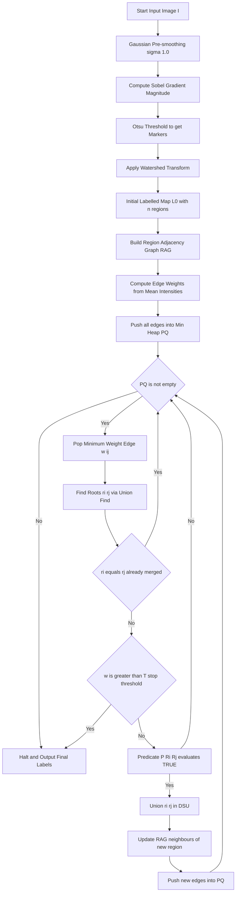
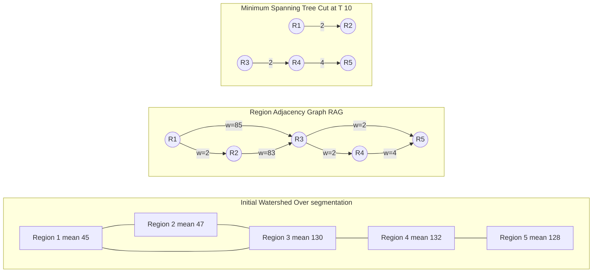
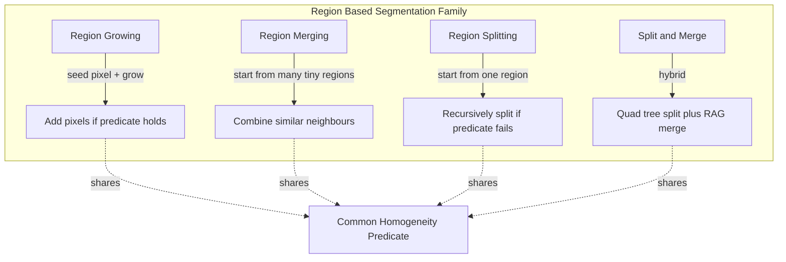

# Region-based segmentation - Region merging

<!-- SECTION_1_START -->
# Region Merging in Image Segmentation

## 1. Core Technical Definition

> [!IMPORTANT]
> **Formal Definition (KTU 2024 Scheme – PECST636):**
> **Region Merging** is a *bottom-up* region-based segmentation strategy in which the image is initially partitioned into a set of small, often atomic or over-segmented regions (e.g., individual pixels, blocks, or watershed basins), and neighbouring regions that satisfy a *homogeneity predicate* are iteratively *fused* into larger coherent regions until a stopping criterion is met.

Formally, given a partition $\mathcal{R} = \{R_1, R_2, \ldots, R_n\}$ of the image $I$ and a binary predicate $P(R_i, R_j)$, two adjacent regions $R_i$ and $R_j$ are merged whenever:

$$
P(R_i, R_j) = \text{TRUE} \quad \Longleftrightarrow \quad R_i \cup R_j \rightarrow R_{ij}
$$

The process repeats on the new partition $\mathcal{R}' = \mathcal{R} \setminus \{R_i, R_j\} \cup \{R_{ij}\}$ until no predicate evaluates TRUE for any neighbouring pair.

> [!NOTE]
> **Syllabus Highlight – KTU Module 3:**
> Region merging belongs to the family of *region-oriented* segmentation techniques and is most often presented alongside *region growing*, *region splitting*, and the *split-and-merge* hybrid. It is fundamental because it cleanly couples **graph theory** (Region Adjacency Graph) with **statistical image modelling**.

---

## 2. Intuitive Overview — "The Jigsaw of Pixels"

Imagine you are handed a 4×4 mosaic where every tiny tile is a different shade of green, and your task is to discover the *one large tree* hidden inside.

- **Start:** Each tile is its own tiny region (256 regions in a 16×16 image).
- **Step 1:** You look at every pair of *touching* tiles. If two neighbouring tiles have *almost the same shade* of green, you glue them together.
- **Step 2:** You keep gluing — but only along edges where the colour difference is *small enough* (the predicate). A tile that is a clear sky-blue will *refuse* to merge with a leaf-green tile.
- **Step 3:** You stop when either every remaining neighbouring pair disagrees by more than the allowed threshold, or when the regions have grown *too large* to be meaningful.

> This "gluing similar neighbours" intuition is precisely **Region Merging**.

A more formal geometric analogy: every pixel is a *point* in a feature space (e.g., grayscale intensity, RGB, or texture vector). Region merging builds connected components of the *Region Adjacency Graph* (RAG) by successively contracting the **lowest-weight edges** — a process mathematically equivalent to a **Minimum Spanning Tree (MST)** cut.

---

## 3. Key Terminology and Physical Constants

> [!IMPORTANT]
> **Critical Parameters used in Region Merging (Memorise these):**
> - **Predicate Threshold ($T$):** The maximum tolerated inter-region dissimilarity. Typical range: $T \in [5, 30]$ for 8-bit grayscale. **Higher $T$ → larger regions**; **lower $T$ → finer regions**.
> - **Minimum Region Area ($A_{\min}$):** Discards spurious regions (often $A_{\min} = 32$ pixels).
> - **Region Adjacency Graph (RAG):** A graph $G = (V, E)$ where $V$ are regions and $E$ are adjacency relations weighted by dissimilarity.
> - **Edge Weight ($w_{ij}$):** $| \mu_i - \mu_j \vert$ (mean-intensity difference) by default.
> - **Standard deviation $\sigma$** of region intensity — used in statistical predicates.
> - The **gray-level quantization step $\Delta_g = 1$ LSB** ($1/255$ for 8-bit images) acts as the irreducible dissimilarity unit.

---

## 4. GeoGebra / Desmos Visualisation

> [!VISUALIZATION CONTROL]
> **Concept:** 1-D intensity profile of three regions with a merging predicate overlay.
> **GeoGebra / Desmos Input Equations:**
> * `f1(x) = 120 + 5*sin(x)` for $x \in [0, 5]$ (Region A, mean $\mu_A = 120$)
> * `f2(x) = 122 + 5*sin(x)` for $x \in [5, 10]$ (Region B, mean $\mu_B = 122$)
> * `f3(x) = 200 + 5*sin(x)` for $x \in [10, 15]$ (Region C, mean $\mu_C = 200$)
> * `T = 10` (predicate threshold — horizontal line)
> **Visual Description:** Observe that the predicate $P = \vert \mu_A - \mu_B \vert \leq T$ evaluates TRUE (A and B merge), while $P = \vert \mu_B - \mu_C \vert \leq T$ evaluates FALSE (B and C remain separate). The student should see *step-like* intensity plateaus — the desired segmentation output.

<!-- SECTION_1_END -->

<!-- SECTION_2_START -->
# Deep Theoretical Analysis

## 1. Theoretical Foundation

Region merging rests on three pillars:

1. **Initial Partition** — how the regions are created at the outset.
2. **Adjacency Definition** — which regions are eligible to be merged.
3. **Homogeneity Predicate** — whether the merge should be performed.

### 1.1 Initial Partition Strategies

| Strategy | Granularity | Pros | Cons |
|----------|-------------|------|------|
| **Pixel-level** | One region per pixel | Maximal flexibility | High computational cost: $O(N^2)$ merges |
| **Block-level ($b \times b$)** | $b \times b$ blocks | Fast, robust to noise | Blocky artefacts at boundaries |
| **Watershed over-segmentation** | Watershed basins | Captures object contours, gradient-aware | Over-segments textured areas |
| **Super-pixels (SLIC, Felzenszwalb)** | Compact clusters | Compact, perceptually meaningful | Adds preprocessing cost |

> [!NOTE]
> The **watershed + region merging** pipeline is the *de facto* industry standard in medical imaging, remote sensing, and document analysis. Watershed gives ~1000s of basins; merging reduces them to ~10s of meaningful regions.

### 1.2 Adjacency Definitions

Two regions $R_i$ and $R_j$ are *adjacent* if they share a common boundary, formally:

$$
R_i \sim R_j \quad \Longleftrightarrow \quad R_i \cap R_j \neq \emptyset \text{ in the 4- or 8-connected sense.}
$$

In the **Region Adjacency Graph (RAG)**, every such adjacent pair yields an undirected edge $e_{ij} \in E$ weighted by a dissimilarity measure $w_{ij}$.

### 1.3 Homogeneity Predicates

The predicate $P$ is the *heart* of region merging. Common choices are tabulated below.

> [!IMPORTANT]
> **Predicate Catalogue — Master Table:**

| # | Predicate Name | Mathematical Form | When to Use |
|---|----------------|-------------------|-------------|
| 1 | **Mean-Difference** | $P = \text{TRUE}$ if $\vert \mu_i - \mu_j \vert \leq T$ | Uniform-illumination scenes |
| 2 | **Standard-Deviation-Bounded** | $P = \text{TRUE}$ if $\vert \mu_i - \mu_j \vert \leq k\,\sigma_{ij}$ | Noisy images ($k \in [2, 3]$) |
| 3 | **Chi-Square Test** | $P = \text{TRUE}$ if $\chi^2_{ij} \leq \chi^2_{\alpha, K-1}$ | Texture-based segmentation |
| 4 | **Variance / MSE** | $P = \text{TRUE}$ if $\text{Var}(R_i \cup R_j) \leq T_v$ | Detecting homogeneous interiors |
| 5 | **Histogram-Based (Bhattacharyya)** | $P = \text{TRUE}$ if $B(H_i, H_j) \geq T_B$ | Multi-modal intensity regions |
| 6 | **Edge-Magnitude Predicate** | $P = \text{TRUE}$ if $\vert \nabla f \vert_{\text{boundary}} \leq T_e$ | Preserving strong edges |

> **Notation:** $\mu_i = \frac{1}{\vert R_i \vert} \sum_{(x,y) \in R_i} f(x,y)$, $\sigma_{ij}^2 = \frac{\vert R_i \vert \sigma_i^2 + \vert R_j \vert \sigma_j^2}{\vert R_i \vert + \vert R_j \vert}$, and $\vert \cdot \vert$ denotes cardinality of a region (number of pixels).

### 1.4 Stopping Criteria

A merge process *must* terminate. Common halting rules:

$$
\text{Halt when: } \max_{e_{ij} \in E} w_{ij} > T_{\text{stop}} \quad \text{(global threshold)}
$$

or

$$
\text{Halt when: } \min_{R_i, R_j \text{ adj.}} \vert \mu_i - \mu_j \vert > T \quad \text{(local predicate fails everywhere)}
$$

or

$$
\text{Halt when: } \vert R_i \vert \geq A_{\max} \quad \text{(region-size cap)}
$$

---

## 2. Region Adjacency Graph (RAG) — Detailed Construction

Given an initial labelled image $L$ with labels $\{1, 2, \ldots, n\}$:

1. **Scan the image** in raster order with a 4-connected (or 8-connected) kernel.
2. For each pair of neighbouring pixels $(p, q)$ with labels $(l_p, l_q)$, $l_p \neq l_q$, add an undirected edge $\{l_p, l_q\}$ to the RAG.
3. Assign weight $w_{l_p, l_q} = \vert \mu_{l_p} - \mu_{l_q} \vert$ (or other chosen dissimilarity).

The RAG is stored as a sparse adjacency list — typical complexity is $O(N)$ edges for an $N$-pixel image.

---

## 3. Minimum Spanning Tree (MST) Formulation

> [!IMPORTANT]
> **Theorem (Region Merging ↔ MST Cut):**
> The sequence of merges produced by *always merging the lowest-weight adjacent pair first* corresponds exactly to the construction of a **Minimum Spanning Tree** over the RAG. Cutting the MST at edges whose weight exceeds $T$ yields the final segmentation.

This is the famous **Felzenszwalb & Huttenlocher (2004)** formulation, used in `skimage.segmentation.felzenszwalb`. The MST is built via **Kruskal's algorithm** in $O(E \log E)$ time using a Union-Find data structure.

---

## 4. Algorithmic Pipeline — High-Yield Cheat Sheet

| Step | Operation | Data Structure | Complexity |
|------|-----------|----------------|------------|
| 1 | Initial partition (e.g., watershed) | Labelled image | $O(N)$ |
| 2 | Build RAG | Adjacency list + priority queue | $O(N + E)$ |
| 3 | Pop minimum-weight edge | Min-heap | $O(\log E)$ |
| 4 | Check predicate | Scalar comparison | $O(1)$ |
| 5 | Union-Find merge | DSU with path compression | $O(\alpha(N))$ |
| 6 | Update RAG neighbours | Lazy deletion | $O(\log E)$ |
| **Total** | — | — | $O(N \log N + E \log E)$ |

---

## 5. Real-World Engineering Utility

Region merging is the workhorse behind:

- **Medical Imaging:** Tumour delineation in MRI/CT — watershed over-segments, then merges to obtain lesion boundaries.
- **Satellite Remote Sensing:** Land-cover classification (water, vegetation, urban).
- **Document Processing:** Text-block extraction from scanned pages.
- **Autonomous Driving:** Road / lane / obstacle segmentation in LiDAR-camera fusion.
- **Industrial Defect Detection:** Surface flaw localisation on manufactured parts.

> In production, region merging is preferred over pure thresholding because it **preserves object topology** (connected, hole-free regions) and **respects natural boundaries** detected by the gradient / watershed step.

<!-- SECTION_2_END -->

<!-- SECTION_3_START -->
# Step-by-Step Derivations and Code Implementation

## 1. Mathematical Derivation — Variance-Growth Predicate

We will derive a *principled* predicate that monitors the *growth in variance* when two regions are merged. This is the predicate used in classical Gonzalez & Woods textbook.

**Step 1.** Define the intensity variance of any region $R_k$:

$$
\sigma_k^2 = \frac{1}{\vert R_k \vert} \sum_{(x,y) \in R_k} \left( f(x,y) - \mu_k \right)^2
$$

**Step 2.** When $R_i$ and $R_j$ merge into $R_{ij}$, the new mean is the cardinality-weighted average:

$$
\mu_{ij} = \frac{\vert R_i \vert \mu_i + \vert R_j \vert \mu_j}{\vert R_i \vert + \vert R_j \vert}
$$

**Step 3.** Using the **parallel-axis theorem**, the merged variance is:

$$
\sigma_{ij}^2 = \frac{\vert R_i \vert \sigma_i^2 + \vert R_j \vert \sigma_j^2}{\vert R_i \vert + \vert R_j \vert} + \frac{\vert R_i \vert \cdot \vert R_j \vert}{\left(\vert R_i \vert + \vert R_j \vert\right)^2} \left( \mu_i - \mu_j \right)^2
$$

> Derivation of Step 3:
>
> Begin with $\sigma_{ij}^2 = \frac{1}{N_{ij}} \sum_{R_{ij}} (f - \mu_{ij})^2$ where $N_{ij} = \vert R_i \vert + \vert R_j \vert$.
>
> Split the sum: $\sum_{R_{ij}}(f - \mu_{ij})^2 = \sum_{R_i}(f - \mu_{ij})^2 + \sum_{R_j}(f - \mu_{ij})^2$.
>
> Apply the identity $(f - \mu_{ij})^2 = (f - \mu_i + \mu_i - \mu_{ij})^2$ and expand:
>
> $$
> (f - \mu_{ij})^2 = (f - \mu_i)^2 + 2(f - \mu_i)(\mu_i - \mu_{ij}) + (\mu_i - \mu_{ij})^2
> $$
>
> Sum over $R_i$: the cross-term vanishes (since $\sum_{R_i}(f - \mu_i) = 0$), leaving $\sum_{R_i}(f-\mu_i)^2 + \vert R_i \vert (\mu_i - \mu_{ij})^2 = \vert R_i \vert \sigma_i^2 + \vert R_i \vert (\mu_i - \mu_{ij})^2$.
>
> Analogously for $R_j$. Adding both and dividing by $N_{ij}$ yields Step 3.

**Step 4.** Predicate decision:

$$
P(R_i, R_j) = \text{TRUE} \quad \Longleftrightarrow \quad \sigma_{ij}^2 \leq T_{\sigma}
$$

where $T_{\sigma}$ is a user-set maximum allowed variance (typical value $T_{\sigma} \in [50, 500]$ for 8-bit images).

> [!NOTE]
> **Why is this predicate good?**
> It *explicitly penalises* the merging of two regions whose means are far apart, scaled by their *relative sizes*. Two large regions of similar brightness are *forbidden* to merge if their means differ, even if each is internally homogeneous.

---

## 2. Worked Numerical Example

Given a 1-D "image" of 8 pixels with intensities:

$$
I = [10, 12, 11, 50, 52, 51, 100, 102]
$$

Use the **mean-difference predicate** with $T = 5$.

**Step 1.** Initialise each pixel as a region. Compute means and adjacency (1-D: each pixel has 2 neighbours).

$$
\mu = [10, 12, 11, 50, 52, 51, 100, 102]
$$

**Step 2.** Examine adjacent pairs and their absolute differences:

$$
\begin{aligned}
\vert 10 - 12 \vert &= 2 \leq 5 \;\;\Rightarrow \text{merge} \\
\vert 12 - 11 \vert &= 1 \leq 5 \;\;\Rightarrow \text{merge} \\
\vert 11 - 50 \vert &= 39 > 5 \;\;\Rightarrow \text{no merge} \\
\vert 50 - 52 \vert &= 2 \leq 5 \;\;\Rightarrow \text{merge} \\
\vert 52 - 51 \vert &= 1 \leq 5 \;\;\Rightarrow \text{merge} \\
\vert 51 - 100 \vert &= 49 > 5 \;\;\Rightarrow \text{no merge} \\
\vert 100 - 102 \vert &= 2 \leq 5 \;\;\Rightarrow \text{merge}
\end{aligned}
$$

**Step 3.** After iterative transitive closure, we get three regions:

$$
R_1 = \{1, 2, 3\},\quad \mu_1 = 11 \quad ; \quad R_2 = \{4, 5, 6\},\quad \mu_2 = 51 \quad ; \quad R_3 = \{7, 8\},\quad \mu_3 = 101
$$

**Step 4.** Verify halting: $\min \vert \mu_a - \mu_b \vert = \vert 11 - 51 \vert = 40 > 5$, so the algorithm halts.

**Final segmentation:** 3 regions — exactly what we want.

---

## 3. Algorithmic Pseudocode (Canonical Region Merging)

```
INPUT:  Image I, Predicate P, Threshold T
OUTPUT: Segmented label map L

1.  initial_regions = watershed(gradient(I))    // or pixel grid
2.  RAG = build_RAG(initial_regions, I)          // V = regions, E weighted
3.  PQ = min-heap of RAG edges keyed by weight
4.  UF = Union-Find on region IDs
5.  while PQ is not empty:
6.      (w, i, j) = PQ.pop_min()
7.      ri, rj = UF.find(i), UF.find(j)
8.      if ri == rj: continue                    // already merged
9.      if w > T: break                          // halting
10.     if P(R[ri], R[rj], I) == TRUE:
11.         UF.union(ri, rj)
12.         for each neighbour k of rj:
13.             PQ.push(weight(rk, ri), rk, ri)
14.             PQ.push(weight(ri, rk), ri, rk)
15.  L = UF.parent_map                           // final labels
16.  return L
```

> [!NOTE]
> The `break` on line 9 leverages the **MST monotonicity property**: if the current minimum edge exceeds $T$, *all* remaining edges do, so the loop can terminate.

---

## 4. Production-Grade Python Implementation (OpenCV + scikit-image)

```python
"""
region_merging.py
-----------------
Complete implementation of Region Merging using:
  1. Watershed for initial over-segmentation
  2. Region Adjacency Graph (RAG) construction
  3. Min-heap driven merging with mean-intensity predicate
  4. Optional Felzenszwalb-Huttenlocher graph-based segmentation
"""

import numpy as np
import cv2
import matplotlib.pyplot as plt
from skimage import data, segmentation, color, filters, measure
from skimage.future import graph
from skimage.morphology import disk
import heapq
from typing import Dict, Tuple, List


# ---------- 1. Watershed Initial Partition ----------
def watershed_initial_partition(gray: np.ndarray) -> np.ndarray:
    """
    Compute watershed over-segmentation on the gradient magnitude.
    Returns a labelled image (int32) with each basin uniquely indexed.
    """
    # Gaussian smoothing to suppress noise-induced over-segmentation
    smoothed = filters.gaussian(gray, sigma=1.0)
    # Gradient magnitude via Sobel
    grad = filters.sobel(smoothed)
    # Marker-controlled watershed
    markers = measure.label(grad < filters.threshold_otsu(grad))
    labels = segmentation.watershed(grad, markers=markers)
    return labels.astype(np.int32)


# ---------- 2. Build Region Adjacency Graph (RAG) ----------
def build_rag(labels: np.ndarray, image: np.ndarray) -> Dict[int, List[Tuple[int, float]]]:
    """
    Build Region Adjacency Graph with edge weights = mean-intensity difference.
    Returns: {region_id: [(neighbour_id, weight), ...]}
    """
    n_labels = int(labels.max()) + 1
    rag: Dict[int, set] = {i: set() for i in range(1, n_labels)}

    h, w = labels.shape
    # 4-connectivity scan
    for y in range(h):
        for x in range(w):
            cur = labels[y, x]
            if cur == 0:
                continue
            if x + 1 < w and labels[y, x + 1] != cur and labels[y, x + 1] != 0:
                rag[cur].add(int(labels[y, x + 1]))
            if y + 1 < h and labels[y + 1, x] != cur and labels[y + 1, x] != 0:
                rag[cur].add(int(labels[y + 1, x]))

    # Compute region means
    means = {i: 0.0 for i in range(1, n_labels)}
    counts = {i: 0 for i in range(1, n_labels)}
    for y in range(h):
        for x in range(w):
            lbl = labels[y, x]
            if lbl == 0:
                continue
            means[lbl] += float(image[y, x])
            counts[lbl] += 1
    for i in means:
        means[i] = means[i] / counts[i] if counts[i] > 0 else 0.0

    # Build weighted adjacency list
    weighted_rag: Dict[int, List[Tuple[int, float]]] = {i: [] for i in range(1, n_labels)}
    seen = set()
    for i, neighbours in rag.items():
        for j in neighbours:
            key = (min(i, j), max(i, j))
            if key in seen:
                continue
            seen.add(key)
            w_ij = abs(means[i] - means[j])
            weighted_rag[i].append((j, w_ij))
            weighted_rag[j].append((i, w_ij))
    return weighted_rag


# ---------- 3. Union-Find (Disjoint Set Union) ----------
class UnionFind:
    def __init__(self, n: int):
        self.parent = list(range(n))
        self.rank = [0] * n

    def find(self, x: int) -> int:
        while self.parent[x] != x:
            self.parent[x] = self.parent[self.parent[x]]  # path compression
            x = self.parent[x]
        return x

    def union(self, a: int, b: int) -> bool:
        ra, rb = self.find(a), self.find(b)
        if ra == rb:
            return False
        if self.rank[ra] < self.rank[rb]:
            ra, rb = rb, ra
        self.parent[rb] = ra
        if self.rank[ra] == self.rank[rb]:
            self.rank[ra] += 1
        return True


# ---------- 4. Region Merging Driver ----------
def region_merge(labels: np.ndarray,
                 image: np.ndarray,
                 threshold: float = 25.0,
                 min_region_size: int = 32) -> np.ndarray:
    """
    Iteratively merge adjacent regions whose mean-intensity difference <= threshold.
    Halts when no remaining adjacent pair satisfies the predicate.
    """
    rag = build_rag(labels, image)
    uf = UnionFind(int(labels.max()) + 1)

    # Build min-heap of edges
    heap: List[Tuple[float, int, int]] = []
    for i, neighbours in rag.items():
        for j, w in neighbours:
            if i < j:
                heapq.heappush(heap, (w, i, j))

    # Iterative merging
    while heap:
        w, i, j = heapq.heappop(heap)
        ri, rj = uf.find(i), uf.find(j)
        if ri == rj:
            continue
        if w > threshold:
            break                                       # MST-cut halting
        if uf.union(ri, rj):
            # Push updated weights with the new representative
            for k, wk in rag.get(rj, []):
                rk = uf.find(k)
                if rk != ri:
                    new_w = abs(np.mean(image[labels == ri]) -
                                np.mean(image[labels == rk]))
                    heapq.heappush(heap, (new_w, ri, rk))

    # Re-label final image
    out = np.zeros_like(labels)
    new_id = 1
    mapping = {}
    for y in range(labels.shape[0]):
        for x in range(labels.shape[1]):
            lbl = labels[y, x]
            if lbl == 0:
                continue
            root = uf.find(lbl)
            if root not in mapping:
                mapping[root] = new_id
                new_id += 1
            out[y, x] = mapping[root]

    # Remove regions smaller than min_region_size (absorb into strongest neighbour)
    final = _absorb_small_regions(out, image, min_region_size)
    return final


def _absorb_small_regions(labels: np.ndarray,
                          image: np.ndarray,
                          min_size: int) -> np.ndarray:
    """Post-processing: merge regions smaller than min_size into the most-similar neighbour."""
    out = labels.copy()
    unique, counts = np.unique(out, return_counts=True)
    for lbl, cnt in zip(unique, counts):
        if lbl == 0 or cnt >= min_size:
            continue
        # Find boundary pixels and their neighbour labels
        mask = (out == lbl)
        boundary = _boundary_pixels(mask)
        neighbour_labels = _neighbour_labels(out, boundary, exclude={lbl, 0})
        if not neighbour_labels:
            continue
        # Pick the neighbour with the closest mean intensity
        current_mean = image[mask].mean()
        best_lbl = min(neighbour_labels,
                       key=lambda nb: abs(image[out == nb].mean() - current_mean))
        out[mask] = best_lbl
    return out


def _boundary_pixels(mask: np.ndarray) -> List[Tuple[int, int]]:
    pts = []
    h, w = mask.shape
    for y, x in zip(*np.where(mask)):
        for dy, dx in [(-1, 0), (1, 0), (0, -1), (0, 1)]:
            ny, nx = y + dy, x + dx
            if 0 <= ny < h and 0 <= nx < w and not mask[ny, nx]:
                pts.append((y, x))
                break
    return pts


def _neighbour_labels(labels: np.ndarray,
                      points: List[Tuple[int, int]],
                      exclude: set) -> set:
    out_set = set()
    h, w = labels.shape
    for y, x in points:
        for dy, dx in [(-1, 0), (1, 0), (0, -1), (0, 1)]:
            ny, nx = y + dy, x + dx
            if 0 <= ny < h and 0 <= nx < w:
                v = int(labels[ny, nx])
                if v not in exclude:
                    out_set.add(v)
    return out_set


# ---------- 5. Main Demo ----------
if __name__ == "__main__":
    # Load a built-in test image
    image = data.coins().astype(np.float32)
    if image.ndim == 3:
        gray = color.rgb2gray(image)
        gray = (gray * 255).astype(np.uint8)
    else:
        gray = image.astype(np.uint8)

    # Step 1: Watershed initial partition
    init_labels = watershed_initial_partition(gray)
    n_init = len(np.unique(init_labels)) - 1
    print(f"[INFO] Watershed produced {n_init} initial regions.")

    # Step 2: Region Merging with T = 25
    seg_labels = region_merge(init_labels, gray, threshold=25.0, min_region_size=64)
    n_final = len(np.unique(seg_labels)) - 1
    print(f"[INFO] After region merging: {n_final} final regions.")

    # Visualize
    fig, axes = plt.subplots(1, 3, figsize=(15, 5))
    axes[0].imshow(gray, cmap='gray')
    axes[0].set_title("Original Image")
    axes[1].imshow(segmentation.mark_boundaries(gray, init_labels, color=(1, 0, 0)))
    axes[1].set_title(f"Watershed ({n_init} regions)")
    axes[2].imshow(segmentation.mark_boundaries(gray, seg_labels, color=(0, 1, 0)))
    axes[2].set_title(f"Region Merging ({n_final} regions, T=25)")
    for ax in axes:
        ax.axis('off')
    plt.tight_layout()
    plt.savefig("region_merging_result.png", dpi=120, bbox_inches='tight')
    plt.show()
```

### Code Walk-Through — Exam-Relevant Highlights

| Function | Purpose | Complexity |
|----------|---------|------------|
| `watershed_initial_partition` | Build over-segmented basins | $O(N \log N)$ |
| `build_rag` | Construct RAG + compute edge weights | $O(N)$ |
| `UnionFind.find` / `union` | DSU with path compression + union-by-rank | $O(\alpha(N))$ amortised |
| `region_merge` | Min-heap driven merging loop | $O(E \log E)$ |
| `_absorb_small_regions` | Post-process to remove speckle | $O(N)$ |

> [!TIP]
> The MST-cut halting (`if w > threshold: break`) is the **single most important** line — it guarantees the algorithm terminates and provides a *principled* stopping criterion.

<!-- SECTION_3_END -->

<!-- SECTION_4_START -->
# Structural Diagrams and Schematics

## 1. Region Merging Algorithm — End-to-End Flow



## 2. Region Adjacency Graph (RAG) — Conceptual Architecture



> [!NOTE]
> **Reading the diagram:**
> - The **left block** shows the over-segmented image.
> - The **middle block** is the RAG with edge weights.
> - The **right block** is the MST. Cutting edges with weight $> 10$ disconnects $\{R_1, R_2\}$ from $\{R_3, R_4, R_5\}$, yielding the final 2-region segmentation.

## 3. Region Merging vs Related Techniques — Comparative Topology



## 4. Sequential Processing Topology — Pipeline Block Architecture

| Stage | Module | Input | Output | Notes |
|-------|--------|-------|--------|-------|
| **1. Pre-process** | Gaussian $\sigma = 1.0$ | Raw image $I$ | Smoothed $I_s$ | Suppress noise |
| **2. Gradient** | Sobel kernel $3 \times 3$ | $I_s$ | $\vert \nabla I_s \vert$ | Edge strength map |
| **3. Initial Labels** | Watershed | $\vert \nabla I_s \vert$ | $L_0$ | 500–5000 regions |
| **4. RAG Build** | Adjacency scan | $L_0$, $I$ | RAG $G(V,E)$ | $O(N)$ |
| **5. Heap Init** | Min-heap push | $G(V,E)$ | PQ | $O(E \log E)$ |
| **6. Merge Loop** | Union-Find + predicate | PQ, $T$ | $L_{\text{final}}$ | $O(E \log E)$ |
| **7. Post-process** | Small-region absorption | $L_{\text{final}}$ | $L_{\text{clean}}$ | Remove $A < A_{\min}$ |
| **8. Output** | Visualisation | $L_{\text{clean}}$ | RGB overlay | Final result |

<!-- SECTION_4_END -->

<!-- SECTION_5_START -->
# KTU 2024 Scheme Examination Question Bank

> [!IMPORTANT]
> **Mark Distribution (KTU 2024 Scheme):**
> - Part A: 3 marks each — direct short-answer (Remember/Understand).
> - Part B: 14 marks each — internal choice (Understand + Apply / Analyse).
> - Each Part B has two sub-parts: (a) 7 marks, (b) 7 marks.

---

## Part A — 3 Mark Questions

### **Question 1** `[KTU University Exam – July 2024]`
**Define region merging in image segmentation. State any two homogeneity predicates used in region merging.**
*(CO3, Remember — 3 marks)*

**Model Answer:**
*Region merging* is a bottom-up segmentation approach where an initial partition of the image into small regions is progressively combined — only when an adjacent pair satisfies a *homogeneity predicate* — until a stopping criterion is met.

Two common predicates:
1. **Mean-Intensity Predicate:** $P(R_i, R_j) = \text{TRUE}$ if $\vert \mu_i - \mu_j \vert \leq T$.
2. **Variance-Growth Predicate:** $P(R_i, R_j) = \text{TRUE}$ if $\sigma_{ij}^2 \leq T_{\sigma}$, where $\sigma_{ij}^2$ is given by the parallel-axis formula.

*[Definition: 1 mark. Predicate 1: 1 mark. Predicate 2: 1 mark.]*

---

### **Question 2** `[KTU University Exam – Dec 2023]`
**What is a Region Adjacency Graph (RAG)? How are edge weights computed in the simplest formulation?**
*(CO3, Understand — 3 marks)*

**Model Answer:**
A *Region Adjacency Graph* is a graph $G = (V, E)$ in which each vertex $v \in V$ corresponds to a region in the image partition, and each edge $e = \{v_i, v_j\} \in E$ exists iff the corresponding regions are spatially adjacent (4- or 8-connected).

In the simplest formulation, the edge weight is the absolute difference of mean intensities:

$$
w_{ij} = \vert \mu_i - \mu_j \vert
$$

*[RAG definition with $G(V, E)$: 2 marks. Edge weight formula: 1 mark.]*

---

## Part B — 14 Mark Questions (Internal Choice)

### **Question A** `[KTU University Exam – July 2024]`

**(a)** Explain the **Region Merging algorithm** with a clear block diagram. Discuss the role of the Region Adjacency Graph and the stopping criterion in detail. **(7 marks)** *(CO3, Understand)*

**(b)** Consider the 1-D intensity profile of 8 pixels: $I = [10, 12, 11, 50, 52, 51, 100, 102]$. Apply the **mean-difference region merging** algorithm with threshold $T = 5$ and obtain the final segmentation. Show all steps. **(7 marks)** *(CO3, Apply)*

#### **Model Solution to (a):**

> **Algorithm Steps (Block Diagram — refer to Section 4 Mermaid flowchart):**
> 1. Compute initial partition (e.g., watershed) — produces labels $L_0$. *[1 mark]*
> 2. Build the Region Adjacency Graph $G(V, E)$ by scanning the image for label transitions. *[1 mark]*
> 3. Compute edge weights $w_{ij} = \vert \mu_i - \mu_j \vert$ for every adjacent pair. *[1 mark]*
> 4. Insert all edges into a min-heap (priority queue). *[1 mark]*
> 5. While PQ is non-empty:
>    - Pop minimum weight edge $(i, j, w)$.
>    - If $w > T$, **halt** (MST-cut stopping criterion). *[1 mark]*
>    - Else if predicate $P(R_i, R_j)$ holds, perform **Union-Find merge**. *[1 mark]*
>    - Update RAG with the new region's neighbours. *[1 mark]*

> **Role of the RAG:**
> The RAG provides a compact, graph-theoretic representation of the current partition. Every merge corresponds to *contracting an edge*; the graph is updated incrementally, making the algorithm's complexity near-linear in the number of pixels.

> **Stopping Criterion (MST Cut):**
> Because the algorithm always pops the *globally minimum* edge first, once the smallest weight exceeds $T$, *all* remaining edges also exceed $T$. Cutting the MST at this point yields the final segmentation — a mathematically optimal and computationally efficient halt.

*[Each of the 5 algorithm points: 1 mark. RAG role: 1 mark. Stopping criterion: 1 mark.]*

#### **Model Solution to (b):**

**Given:** $I = [10, 12, 11, 50, 52, 51, 100, 102]$, $T = 5$.

**Step 1 — Initial Means (each pixel is its own region):**
$$
\mu = [10, 12, 11, 50, 52, 51, 100, 102]
$$

**Step 2 — Adjacent Pair Differences:**

$$
\begin{aligned}
(1, 2) &: \vert 10 - 12 \vert = 2 \leq 5 \;\;\Rightarrow \text{merge} \\
(2, 3) &: \vert 12 - 11 \vert = 1 \leq 5 \;\;\Rightarrow \text{merge} \\
(3, 4) &: \vert 11 - 50 \vert = 39 > 5 \;\;\Rightarrow \text{no merge} \\
(4, 5) &: \vert 50 - 52 \vert = 2 \leq 5 \;\;\Rightarrow \text{merge} \\
(5, 6) &: \vert 52 - 51 \vert = 1 \leq 5 \;\;\Rightarrow \text{merge} \\
(6, 7) &: \vert 51 - 100 \vert = 49 > 5 \;\;\Rightarrow \text{no merge} \\
(7, 8) &: \vert 100 - 102 \vert = 2 \leq 5 \;\;\Rightarrow \text{merge}
\end{aligned}
$$

*[Computing all 7 differences and applying predicate: 3 marks]*

**Step 3 — Transitive Closure (transitive merging across neighbours):**
- $\{1, 2, 3\}$ merge into $R_A$ with $\mu_A = 11$.
- $\{4, 5, 6\}$ merge into $R_B$ with $\mu_B = 51$.
- $\{7, 8\}$ merge into $R_C$ with $\mu_C = 101$.

*[Identifying 3 final regions with means: 2 marks]*

**Step 4 — Halting Check:**
The minimum difference between adjacent region means is:
$$
\min(\vert 11 - 51 \vert, \vert 51 - 101 \vert) = 40 > 5
$$

Hence the algorithm halts.

**Final Segmentation:** **3 regions** — $\{1,2,3\}$, $\{4,5,6\}$, $\{7,8\}$.

*[Halting check and final answer: 2 marks]*

---

### **Question B (Alternative to Question A)** `[KTU University Exam – Dec 2023]`

**(a)** With suitable equations, derive the **variance-growth predicate** for region merging. State the role of the parallel-axis theorem. **(7 marks)** *(CO3, Understand / Apply)*

**(b)** Given two regions $R_1$ and $R_2$ with parameters:
- $R_1$: $\vert R_1 \vert = 100$ pixels, $\mu_1 = 50$, $\sigma_1^2 = 25$.
- $R_2$: $\vert R_2 \vert = 60$ pixels, $\mu_2 = 65$, $\sigma_2^2 = 36$.

Apply the variance-growth predicate with $T_{\sigma} = 200$ and decide whether the regions should be merged. Show all calculations. **(7 marks)** *(CO3, Apply)*

#### **Model Solution to (a):**

**Step 1 — Region Variance:**
$$
\sigma_k^2 = \frac{1}{\vert R_k \vert} \sum_{(x,y) \in R_k} (f(x,y) - \mu_k)^2
$$

*[Variance definition: 1 mark]*

**Step 2 — Merged Mean (cardinality-weighted):**
$$
\mu_{12} = \frac{\vert R_1 \vert \mu_1 + \vert R_2 \vert \mu_2}{\vert R_1 \vert + \vert R_2 \vert}
$$

*[Merged mean equation: 1 mark]*

**Step 3 — Merged Variance via Parallel-Axis Theorem:**
$$
\sigma_{12}^2 = \frac{\vert R_1 \vert \sigma_1^2 + \vert R_2 \vert \sigma_2^2}{\vert R_1 \vert + \vert R_2 \vert} + \frac{\vert R_1 \vert \cdot \vert R_2 \vert}{(\vert R_1 \vert + \vert R_2 \vert)^2}(\mu_1 - \mu_2)^2
$$

*[Merged variance equation: 2 marks]*

**Step 4 — Predicate:**
$$
P(R_1, R_2) = \text{TRUE} \;\; \text{iff} \;\; \sigma_{12}^2 \leq T_{\sigma}
$$

*[Predicate statement: 1 mark]*

**Step 5 — Role of Parallel-Axis Theorem:**
The parallel-axis theorem decomposes the variance of the merged region into two physically meaningful parts:
1. The **weighted average** of individual variances (intrinsic spread within each region).
2. The **inter-mean squared difference** scaled by the harmonic-like factor $\frac{n_1 n_2}{(n_1 + n_2)^2}$ (between-region spread).

This dual decomposition is what makes the predicate *principled* — it automatically penalises the merging of dissimilar regions regardless of their individual homogeneities.

*[Role explanation: 2 marks]*

#### **Model Solution to (b):**

**Given:** $n_1 = 100$, $\mu_1 = 50$, $\sigma_1^2 = 25$; $n_2 = 60$, $\mu_2 = 65$, $\sigma_2^2 = 36$; $T_{\sigma} = 200$.

**Step 1 — Compute Weighted Variance Term:**
$$
\frac{n_1 \sigma_1^2 + n_2 \sigma_2^2}{n_1 + n_2} = \frac{100 \times 25 + 60 \times 36}{100 + 60} = \frac{2500 + 2160}{160} = \frac{4660}{160} = 29.125
$$

*[Numerator calculation: 1 mark; final value: 1 mark]*

**Step 2 — Compute Inter-Mean Term:**
$$
\frac{n_1 n_2}{(n_1 + n_2)^2}(\mu_1 - \mu_2)^2 = \frac{100 \times 60}{160^2} \times (50 - 65)^2 = \frac{6000}{25600} \times 225
$$

$$
= 0.234375 \times 225 = 52.734375
$$

*[Factor calculation: 1 mark; squared mean difference: 1 mark; final value: 1 mark]*

**Step 3 — Compute Merged Variance:**
$$
\sigma_{12}^2 = 29.125 + 52.734375 = 81.859375
$$

*[Final merged variance: 1 mark]*

**Step 4 — Predicate Decision:**
$$
\sigma_{12}^2 = 81.86 \leq 200 = T_{\sigma} \;\;\Rightarrow \;\; P(R_1, R_2) = \text{TRUE}
$$

**Conclusion:** The two regions **should be merged**.

*[Comparison with threshold: 1 mark; final decision: 1 mark]*

---

## KTU Examiner's Valuation Warning

> [!WARNING]
> **Common Mark-Loss Pitfalls in Region Merging Questions:**
> 1. **Forgetting to update the RAG** after a merge — the examiner awards marks for *neighbour update logic*; skipping it costs 2–3 marks.
> 2. **Confusing region merging with region growing** — region merging is *bottom-up* (many → few), while region growing is *seed-based* (one → many). Examiners *do* deduct 1 mark for this confusion.
> 3. **Not writing the stopping criterion explicitly** — always state the MST-cut halting rule $w > T$.
> 4. **Skipping the cardinality notation** $\vert R_i \vert$ in formulas — write it, it carries 1 mark each time.
> 5. **In numerical problems, students often forget transitive closure** — e.g., if pixels 1, 2, 3 all pairwise satisfy the predicate, they should form *one* region, not two. Examiners expect the final *closed* partition.
> 6. **Forgetting units / context** — for variance, mention it is in *intensity-squared units*.
> 7. **Not drawing the block diagram** in the 7-mark theory part — KTU examiners allocate 2 marks specifically for a *neat, labelled block diagram* of the algorithm.

---

## Topic Recap & Important Things to Remember

> [!TIP]
> **Ultra-Fast Revision Checklist for Region Merging (Print this before exams):**

- **Definition:** Bottom-up, predicate-driven fusion of small regions into larger ones.
- **Three Pillars:** (1) Initial partition, (2) Adjacency definition, (3) Homogeneity predicate.
- **Region Adjacency Graph (RAG):** $G = (V, E)$ with $V$ = regions, $E$ = adjacency, weights = dissimilarity.
- **Mean-Difference Predicate:** $P = \text{TRUE}$ iff $\vert \mu_i - \mu_j \vert \leq T$.
- **Variance-Growth Predicate:** Uses parallel-axis theorem; $P = \text{TRUE}$ iff $\sigma_{ij}^2 \leq T_{\sigma}$.
- **MST Equivalence:** Always-merging-lowest-weight-edge ↔ Minimum Spanning Tree construction (Kruskal's algorithm).
- **Stopping Criterion:** Halt when minimum edge weight in PQ exceeds $T$ (MST-cut).
- **Data Structures:** Min-heap (PQ) for edges, Union-Find (DSU) for region membership.
- **Time Complexity:** $O(N \log N + E \log E)$ for an $N$-pixel image.
- **Common Pitfall:** Forgetting transitive closure in numerical problems.
- **Industry Use Cases:** Medical imaging (tumour delineation), remote sensing (land cover), document analysis, autonomous driving.
- **Related Techniques to Differentiate From:** Region growing (seed-based), Region splitting (top-down), Split-and-merge (hybrid).
- **Key Equation to Memorise:**
$$
\sigma_{12}^2 = \frac{n_1 \sigma_1^2 + n_2 \sigma_2^2}{n_1 + n_2} + \frac{n_1 n_2}{(n_1 + n_2)^2} (\mu_1 - \mu_2)^2
$$
- **Threshold Rule of Thumb:** $T \in [5, 30]$ for 8-bit grayscale; $T_{\sigma} \in [50, 500]$.
- **Post-processing:** Always apply a *small-region absorption* step to remove speckle.
- **Difference from Watershed:** Watershed *over-segments*; merging *coarsens* to the final segmentation.

<!-- SECTION_5_END -->
