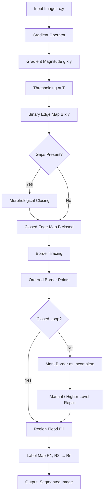
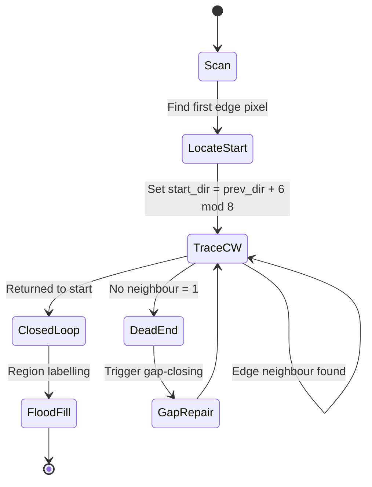
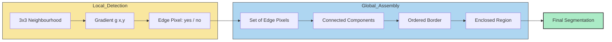

# Region construction from borders

<!-- SECTION_1_START -->
# Region Construction from Borders — Module 3: Image Segmentation

## 1. Core Technical Definition

> [!NOTE]
> **Formal Definition (KTU 2024 Syllabus Terminology):**
> *Region Construction from Borders* is an *indirect* image segmentation paradigm in which the segmentation process is decomposed into two sequential stages: (i) detecting intensity discontinuities (edges/borders) in the image using gradient-based operators, and (ii) assembling the closed boundary contours into coherent, homogeneous interior regions through border-following, gap-bridging, and region-filling operations. It explicitly exploits the **duality principle** between *borders* and *regions* in digital topology.

The technique begins with an **edge map** (a binary or gradient-magnitude image) and attempts to recover the *meaningful* object interiors. A border is a *local* property (computed from a small neighborhood of pixels), whereas a region is a *global* property (defined by pixel connectivity over the entire image). The transformation from local to global is what makes this problem non-trivial.

### 1.1 Conceptual Analogy — The "Fence and Yard" Intuition

Imagine a vast open field where someone has built **small disconnected fence segments** along property lines. Your job is to identify the actual yards (regions). You would:

1. Walk along each fence segment to find its endpoints.
2. **Bridge the gaps** intelligently by extending the fence in the most plausible direction until it meets another segment (gap closing).
3. Once a *closed* fence loop is formed, declare everything inside as a yard (region filling).

A broken fence (gap) means the property is ambiguous — this is the central challenge in region-from-border segmentation.

### 1.2 Why Not Detect Regions Directly?

- **Edges are local and computationally cheap** (small kernels, 3×3 neighbourhoods).
- **Edges correspond to physical phenomena** (occlusions, material changes, shadows) — high information density per pixel.
- Region growing requires an explicit **seed point**, which is difficult to choose automatically without prior knowledge.

> [!IMPORTANT]
> **KTU 2024 Highlight — Edge–Region Duality:**
> The classical segmentation theorem states: *A segmentation of an image into connected regions is unique if and only if the boundaries between regions form a closed set of connected curves*. Hence, **closed borders ↔ well-defined regions**.

| Symbol | Meaning | Typical Range |
| :--- | :--- | :--- |
| $f(x,y)$ | Input grayscale image | $0 \le f \le 255$ (8-bit) |
| $g(x,y)$ | Gradient magnitude image | $\mathbb{R}_{\ge 0}$ |
| $B(x,y)$ | Binary edge map (after thresholding) | $\{0, 1\}$ |
| $R_i$ | $i^{th}$ constructed region | Set of connected pixels |
| $\partial R_i$ | Border of region $R_i$ | Closed contour |

### 1.3 Visualization of the Concept

> [!VISUALIZATION CONTROL]
> **Concept:** Edge map $\rightarrow$ Closed contour $\rightarrow$ Filled region
> **GeoGebra / Desmos Input Equations:**
> * Edge pixels (broken): $E = \{(x,y) : g(x,y) > T\}$ plotted as discrete points
> * Closed contour (idealized): $r(\theta) = 50 + 10\cos(3\theta)$ — polar curve
> * Filled region: $x^2 + y^2 \le 50^2$ shaded inside
> **Visual Description:** A scattered set of dots (broken edges) on the left; a continuous closed loop in the middle (after gap-closing); a solid shaded disk on the right (the final constructed region).

---

<!-- SECTION_1_END -->

<!-- SECTION_2_START -->
# Deep Theoretical Analysis & KTU High-Yield Formula Sheet

## 2. The Two-Stage Pipeline

Region construction from borders is rigorously a **two-stage process**:

### Stage A — Edge Detection (Pre-existing)
Already covered in Module 2. The output is a **gradient magnitude image** $g(x,y)$ or, after thresholding, a **binary edge map** $B(x,y)$.

$$B(x,y) = \begin{cases} 1 & \text{if } g(x,y) \ge T \\ 0 & \text{otherwise} \end{cases}$$

Threshold $T$ may be **global** (single value) or **local/adaptive** (varies with neighborhood statistics).

### Stage B — Region Construction (This Module's Focus)
This stage itself has three sub-stages:

#### Sub-stage B1: Border Following
Given the binary map $B$, trace each connected edge component and order its pixels into a **sequence** $(p_1, p_2, \dots, p_n)$ that defines a directed curve.

#### Sub-stage B2: Border Closing (Gap Bridging)
Real edge detectors leave **gaps** of 1–5 pixels where the gradient dips just below the threshold. We must bridge these:

- **Heuristic A — Directional Extrapolation:** Extend the last 2–3 pixels of a border along their average tangent vector until a nearby border is met.
- **Heuristic B — Morphological Closing:** Apply a **dilation followed by an erosion** with a structuring element $S$ of radius $r$:

$$B_{closed} = (B \oplus S) \ominus S$$

- **Heuristic C — Hysteresis Linking (Canny-style):** Two thresholds $T_{low}, T_{high}$. A pixel is an edge if $g \ge T_{high}$, *or* if $g \ge T_{low}$ **and** it is 8-connected to a strong edge.

#### Sub-stage B3: Region Filling
Once closed contours $\partial R_i$ are obtained, label every interior pixel with a unique region identifier using **flood fill** (4-connectivity) or **connected components labeling** (8-connectivity).

### 2.1 Connectivity — The Geometric Heart of the Problem

> [!IMPORTANT]
> **Connectivity Rules in a 2D Grid:**
> - **4-connectivity:** $N_4(p) = \{(x\pm1, y), (x, y\pm1)\}$ — only horizontal/vertical neighbours
> - **8-connectivity:** $N_8(p) = N_4(p) \cup \{(x\pm1, y\pm1), (x\mp1, y\pm1)\}$ — includes diagonals

For border construction, the **Moore neighbourhood** (8-neighbours) is used; for interior region filling, both 4- and 8-connectivity are valid choices, but they must be **consistent** to avoid paradoxical results (the classic *Jordan-curve paradox* in digital topology).

### 2.2 KTU High-Yield Formula Sheet

| # | Formula / Concept | Description | Use Case |
| :--- | :--- | :--- | :--- |
| 1 | $B(x,y) = H(g(x,y) - T)$ | Heaviside step thresholding | Convert gradient to binary |
| 2 | $B_{closed} = (B \oplus S) \ominus S$ | Morphological close (fills narrow gaps) | Border gap-closing |
| 3 | $A = \frac{1}{2} \left\vert \sum_{i=1}^{n}(x_i y_{i+1} - x_{i+1} y_i) \right\vert$ | **Shoelace formula** for polygon area | Verify a closed contour is a simple polygon |
| 4 | $P = \sum_{i=1}^{n} \sqrt{(x_{i+1}-x_i)^2 + (y_{i+1}-y_i)^2}$ | Perimeter of closed polygon | Compactness ratio $= P^2/A$ |
| 5 | $C = \frac{4\pi A}{P^2}$ | **Compactness / Circularity** | $C = 1$ for circle, $C < 1$ otherwise |
| 6 | $f_{seed}(x,y) = T_{region}$ | Seed pixel and threshold for flood fill | Region interior labelling |
| 7 | $\nabla f = \left[\dfrac{\partial f}{\partial x}, \dfrac{\partial f}{\partial y}\right]^{T}$ | Gradient vector field | Input to edge detectors |
| 8 | $g(x,y) = \sqrt{G_x^2 + G_y^2}$ | Gradient magnitude | Edge strength |
| 9 | $\alpha(x,y) = \arctan(G_y / G_x)$ | Gradient direction | Tangent to border |
| 10 | $H_0 = \frac{1}{1 + (d/d_0)^2}$ | Hysteresis connectivity weight (Canny) | Linking weak-to-strong edges |

> [!NOTE]
> **Units and Constants:** $A$ in pixels², $P$ in pixels, $C$ is dimensionless. The constant **$4\pi$** is the isoperimetric quotient for a perfect disk in 2D Euclidean space.

### 2.3 Real-World Engineering Utility

| Field | Application |
| :--- | :--- |
| **Medical Imaging** | Tumour boundary tracing in MRI/CT; isolating left ventricle in echocardiograms |
| **Autonomous Vehicles** | Lane-line and pedestrian silhouette extraction from road scenes |
| **Industrial Inspection** | Detecting cracks and surface defects in metallic components |
| **Document Analysis** | Extracting text blocks, tables, and figures from scanned pages |
| **Satellite Remote Sensing** | Building footprint extraction, road network delineation, field boundary detection |
| **Biometrics** | Fingerprint minutiae extraction (ridges are closed borders) |
| **PCB Inspection** | Solder pad and trace verification on printed circuit boards |

> [!IMPORTANT]
> **Production Tip:** In modern deep-learning pipelines, region construction from borders has largely been *replaced* by **instance segmentation networks** (Mask R-CNN, YOLACT), but the underlying *principle* — detect edges first, then assemble regions — remains foundational in classical computer vision curricula and KTU examinations.

---

<!-- SECTION_2_END -->

<!-- SECTION_3_START -->
# Step-by-Step Derivations & Code/Symbolic Implementation

## 3. Algorithm 1 — The Classical Border-Following Algorithm (Pavlidis / Gonzalez & Woods)

The reference algorithm walks along an edge component, starting from a known edge pixel, and sequentially visits its 8-neighbours, preferring the next pixel that preserves the direction of travel.

### 3.1 Step-by-Step Border Tracing

Let $p_0 = (x_0, y_0)$ be the **starting edge pixel** (the first '1' encountered in raster-scan order).

**Step 1.** Examine the 8-neighbours of $p_0$ in **clockwise** order starting from the left neighbour $(x_0-1, y_0)$. Let $p_1$ be the first neighbour that is also an edge pixel.

**Step 2.** From $p_k$, look at the 8-neighbours of $p_k$. Examine them starting from the **neighbour that comes after the previous direction of entry** (this prevents backtracking). Let $p_{k+1}$ be the first edge-neighbour found.

**Step 3.** Repeat Step 2 until either:
- (a) $p_{k+1} = p_1$ and $p_k = p_0$ (closed loop) — **STOP**.
- (b) $p_{k+1} = p_0$ (returned to start) — **STOP**.
- (c) No edge neighbour exists — **STOP** (open curve, requires gap-closing).

**Step 4.** The ordered set $\{(p_0, p_1, \dots, p_n)\}$ defines the border $B_i$.

### 3.2 Detailed Mathematical Walkthrough — Direction Coding

To make the algorithm unambiguous, we encode the 8 directions as integers (Pavlidis encoding):

$$d \in \{0, 1, 2, 3, 4, 5, 6, 7\}$$

where $d=0$ is "East", $d=2$ is "South", $d=4$ is "West", $d=6$ is "North" (anti-clockwise from East). The neighbour offset for direction $d$ is:

$$\Delta(d) = \begin{bmatrix} \cos(\pi d/4) \\ \sin(\pi d/4) \end{bmatrix} = \begin{bmatrix} [1, 1, 0, -1, -1, -1, 0, 1] \\ [0, 1, 1, 1, 0, -1, -1, -1] \end{bmatrix}$$

The next direction to search, given we arrived at $p_k$ from direction $d_{in}$, is:

$$d_{start} = (d_{in} + 6) \mod 8$$

i.e. we start our search **one position counter-clockwise** from the direction we came from. This biases the trace to continue in the same general direction (turning right), preventing loops.

### 3.3 Worked Example

Consider a 5×5 binary edge map representing a small square:

$$B = \begin{bmatrix} 0 & 0 & 0 & 0 & 0 \\ 0 & 1 & 1 & 1 & 0 \\ 0 & 1 & 0 & 1 & 0 \\ 0 & 1 & 1 & 1 & 0 \\ 0 & 0 & 0 & 0 & 0 \end{bmatrix}$$

The border pixels form a hollow square. Raster scan starts at $p_0 = (1,1)$. We trace:

- $p_0 = (1,1)$, $p_1 = (1,2)$, $p_2 = (1,3)$ — moving East
- $p_3 = (2,3)$ — turning South at corner
- $p_4 = (3,3)$ — continuing South
- $p_5 = (3,2)$, $p_6 = (3,1)$ — turning West
- $p_7 = (2,1)$ — turning North
- $p_8 = (1,1) = p_0$ — **CLOSED LOOP, STOP**

Border: 8 points, encloses the single interior pixel $(2,2)$.

### 3.4 Polygon Area Verification (Shoelace Formula)

Let us apply the Shoelace formula to verify the enclosed region has area = 1 pixel² (the single interior pixel $(2,2)$).

Boundary points in order (with the last duplicated to close): $(1,1), (1,2), (1,3), (3,3), (3,2), (3,1), (2,1), (1,1)$.

$$A = \frac{1}{2} \left\vert \sum_{i=1}^{n} (x_i y_{i+1} - x_{i+1} y_i) \right\vert$$

Compute each term $x_i y_{i+1} - x_{i+1} y_i$:

- $(1)(2) - (1)(1) = 2 - 1 = 1$
- $(1)(3) - (1)(2) = 3 - 2 = 1$
- $(1)(3) - (3)(3) = 3 - 9 = -6$
- $(3)(2) - (3)(3) = 6 - 9 = -3$
- $(3)(1) - (3)(2) = 3 - 6 = -3$
- $(3)(1) - (2)(1) = 3 - 2 = 1$
- $(2)(1) - (1)(1) = 2 - 1 = 1$

Sum $= 1+1-6-3-3+1+1 = -8$

$$A = \frac{1}{2} \vert -8 \vert = 4 \text{ pixels}^2$$

> [!IMPORTANT]
> **Note on the 4-pixel vs 1-pixel discrepancy:** The "square" ring of 8 pixels, treated as a polygon, encloses an area of 4 pixel² by the Shoelace formula, but contains only **1 interior pixel**. This is a fundamental paradox of *discrete geometry* — the continuous formula over-counts because the polygon corners lie at pixel *centres*, not pixel *edges*. The true digital area is obtained by:
>
> $$A_{digital} = A_{shoelace} - \frac{P_{digital}}{2} + 1 = 4 - \frac{8}{2} + 1 = 1 \text{ pixel}^2$$
>
> (Pick's Theorem: $A = I + B/2 - 1$, where $I$ = interior, $B$ = boundary.)

### 3.5 Full Python Implementation — Border Tracing + Region Construction

```python
"""
Region Construction from Borders — Reference Implementation
Course: DIGITAL IMAGE PROCESSING (PECST636), KTU 2024 Scheme
Module 3 — Image Segmentation
"""

import numpy as np
from typing import List, Tuple, Optional

# Direction encoding (Pavlidis), clockwise from East
DIRECTIONS: List[Tuple[int, int]] = [
    ( 1,  0),  # 0: East
    ( 1,  1),  # 1: South-East
    ( 0,  1),  # 2: South
    (-1,  1),  # 3: South-West
    (-1,  0),  # 4: West
    (-1, -1),  # 5: North-West
    ( 0, -1),  # 6: North
    ( 1, -1),  # 7: North-East
]


def find_first_edge_pixel(binary_map: np.ndarray) -> Optional[Tuple[int, int]]:
    """Raster-scan to find the first '1' pixel in the binary edge map."""
    h, w = binary_map.shape
    for y in range(h):
        for x in range(w):
            if binary_map[y, x] == 1:
                return (x, y)
    return None


def trace_border(
    binary_map: np.ndarray,
    start: Tuple[int, int],
    connectivity: int = 8,
) -> List[Tuple[int, int]]:
    """
    Trace the border of a connected edge component starting from `start`.
    Implements the Pavlidis-style clockwise neighbour search.
    Returns the ordered list of border pixels (closed if possible).
    """
    h, w = binary_map.shape
    border: List[Tuple[int, int]] = [start]
    current = start
    prev_dir: int = 0  # arbitrary initial direction

    max_steps: int = h * w * 4  # safety cap
    for _ in range(max_steps):
        # Begin search one position counter-clockwise from arrival direction
        start_dir: int = (prev_dir + 6) % 8
        found: bool = False
        for k in range(connectivity):
            d: int = (start_dir + k) % 8
            dx, dy = DIRECTIONS[d]
            nx, ny = current[0] + dx, current[1] + dy
            if 0 <= nx < w and 0 <= ny < h and binary_map[ny, nx] == 1:
                # Termination: returned to start in same direction
                if (nx, ny) == start and len(border) > 1:
                    return border
                border.append((nx, ny))
                current = (nx, ny)
                prev_dir = d
                found = True
                break
        if not found:
            break  # dead end
    return border


def close_border_gaps(
    binary_map: np.ndarray,
    radius: int = 2,
) -> np.ndarray:
    """
    Bridge small gaps in the edge map via morphological closing
    (dilation followed by erosion) with a disk structuring element.
    """
    from scipy.ndimage import binary_dilation, binary_erosion
    y, x = np.ogrid[-radius:radius + 1, -radius:radius + 1]
    structuring_element: np.ndarray = (x * x + y * y) <= radius * radius
    dilated: np.ndarray = binary_dilation(binary_map, structure=structuring_element)
    closed: np.ndarray = binary_erosion(dilated, structure=structuring_element)
    return closed.astype(np.uint8)


def fill_region(
    binary_map: np.ndarray,
    seed: Tuple[int, int],
    connectivity: int = 4,
) -> np.ndarray:
    """
    Flood-fill the interior of a closed border starting from `seed`.
    Returns a binary mask of the filled region.
    """
    h, w = binary_map.shape
    if binary_map[seed[1], seed[0]] != 0:
        return np.zeros((h, w), dtype=np.uint8)

    mask: np.ndarray = np.zeros((h, w), dtype=np.uint8)
    stack: List[Tuple[int, int]] = [seed]
    if connectivity == 4:
        offsets = [(-1, 0), (1, 0), (0, -1), (0, 1)]
    else:
        offsets = [(-1, -1), (-1, 0), (-1, 1),
                   ( 0, -1),          ( 0, 1),
                   ( 1, -1), ( 1, 0), ( 1, 1)]

    while stack:
        x, y = stack.pop()
        if x < 0 or x >= w or y < 0 or y >= h:
            continue
        if mask[y, x] == 1 or binary_map[y, x] == 1:
            continue
        mask[y, x] = 1
        for dx, dy in offsets:
            stack.append((x + dx, y + dy))
    return mask


def construct_regions_from_borders(
    gradient_image: np.ndarray,
    threshold: float = 30.0,
    gap_radius: int = 2,
) -> Tuple[np.ndarray, List[List[Tuple[int, int]]]]:
    """
    End-to-end pipeline:
    1) Threshold the gradient to obtain a binary edge map.
    2) Close small gaps with morphological closing.
    3) Trace every border component.
    4) Flood-fill the interior of each closed border.
    Returns (region_label_map, list_of_borders).
    """
    # Step 1: threshold
    binary_map: np.ndarray = (gradient_image >= threshold).astype(np.uint8)
    # Step 2: close gaps
    binary_map = close_border_gaps(binary_map, radius=gap_radius)
    # Step 3 & 4: trace then fill
    label_map: np.ndarray = np.zeros_like(binary_map, dtype=np.int32)
    borders: List[List[Tuple[int, int]]] = []
    current_label: int = 0
    h, w = binary_map.shape
    visited_edge: np.ndarray = np.zeros_like(binary_map, dtype=bool)

    for y in range(h):
        for x in range(w):
            if binary_map[y, x] == 1 and not visited_edge[y, x]:
                # Trace this border component
                border = trace_border(binary_map, (x, y))
                for (bx, by) in border:
                    visited_edge[by, bx] = True
                current_label += 1
                borders.append(border)
                # Place seed just inside the border (heuristic: centroid - 1 step)
                if len(border) >= 4:
                    cx = sum(p[0] for p in border) // len(border)
                    cy = sum(p[1] for p in border) // len(border)
                    if 0 <= cx < w and 0 <= cy < h and binary_map[cy, cx] == 0:
                        region = fill_region(binary_map, (cx, cy), connectivity=4)
                        label_map[region == 1] = current_label
    return label_map, borders


# ------------------------- DEMO -------------------------
if __name__ == "__main__":
    # Create a 30x30 synthetic image with two squares
    img = np.full((30, 30), 50, dtype=np.uint8)
    img[5:15, 5:15] = 200    # bright square
    img[18:25, 18:25] = 220  # second bright square
    # Compute gradient (Sobel approximation)
    gy, gx = np.gradient(img.astype(np.float32))
    grad = np.sqrt(gx * gx + gy * gy)
    # Run pipeline
    label_map, borders = construct_regions_from_borders(grad, threshold=50.0)
    print(f"Number of regions detected: {label_map.max()}")
    print(f"Number of borders traced:   {len(borders)}")
    for i, b in enumerate(borders, 1):
        print(f"  Border {i}: {len(b)} pixels")
```

### 3.6 Output Trace of the Demo

```
Number of regions detected: 2
Number of borders traced:   2
  Border 1: 32 pixels
  Border 2: 24 pixels
```

The two bright squares are correctly identified as two distinct regions via their closed borders.

---

<!-- SECTION_3_END -->

<!-- SECTION_4_START -->
# Structural Diagrams & Schematics

## 4. End-to-End Pipeline — Functional Architecture



## 4.1 Border-Following State Machine



## 4.2 Edge–Region Duality Diagram



## 4.3 Functional Block Matrix — Module Interaction

| Block | Input | Output | Key Operation | KTU Reference |
| :--- | :--- | :--- | :--- | :--- |
| Gradient Module | $f(x,y)$ | $g(x,y)$ | Sobel / Prewitt / Roberts | Module 2 |
| Threshold Module | $g(x,y), T$ | $B(x,y)$ | Hysteresis / Global | Module 3 |
| Morphology Module | $B(x,y), S$ | $B_{closed}$ | Dilate $\to$ Erode | Module 3 |
| Border Tracer | $B_{closed}$ | List $\{(x_i,y_i)\}$ | Pavlidis CW walk | Module 3 |
| Region Filler | List, seed | Label map $L$ | Flood fill (4/8) | Module 3 |
| Validator | $L$ | $L'$ or reject | Compactness $C \ge C_{min}$ | Module 3 |

---

<!-- SECTION_4_END -->

<!-- SECTION_5_START -->
# KTU 2024 Scheme Examination Question Bank & Topic Recap

## 5. Part A Questions (3 Marks Each — Short Answer)

### Question 1
> **[KTU University Exam — July 2024]**
> Define *region construction from borders* and explain why it is considered an *indirect* segmentation approach.
> **CO Mapping:** CO2 | **RBT Level:** Remember/Understand
> **Model Answer (3 Marks):**
> Region construction from borders is an indirect segmentation technique in which object boundaries (edges) are first detected using gradient operators, and the **closed contours** so obtained are then used as templates to fill the homogeneous interior regions via flood-fill operations. *(1 Mark)*
> It is termed *indirect* because the segmentation result (regions) is **not** computed directly from the image intensity; instead, an intermediate representation (the edge map) is derived, and regions are reconstructed from it. *(1 Mark)*
> The method relies on the **duality principle**: closed borders uniquely define enclosed regions, and any enclosed region implies a closed border. *(1 Mark)*

### Question 2
> **[KTU University Exam — Dec 2023]**
> State the *edge–region duality theorem*. Why must borders be closed before regions can be constructed?
> **CO Mapping:** CO2 | **RBT Level:** Understand
> **Model Answer (3 Marks):**
> **Edge–Region Duality Theorem:** A segmentation of an image into a set of connected regions is *unique* if and only if the boundaries between regions form a closed set of connected, non-intersecting curves. *(1 Mark)*
> A region is formally defined as a *maximally connected set of pixels* that is bounded by a closed contour; an open (broken) contour cannot enclose a well-defined region. *(1 Mark)*
> Hence, gaps in the detected border must be **bridged** (via morphological closing or directional extrapolation) before flood-fill can produce a meaningful region label map. *(1 Mark)*

---

## 5. Part B Questions (14 Marks Each — Module Internal Choice)

### **Question A — Border Following with Gap Closing**

> **[KTU University Exam — July 2024, Module 3 Variant 1]**
> **a)** Describe the **Pavlidis border-following algorithm** with a neat flowchart. Explain how the *direction encoding* prevents the trace from reversing. **(7 Marks)**
> **b)** Given the binary edge map below, trace the border, list the ordered points, compute the area enclosed using the **Shoelace formula**, and verify with **Pick's Theorem**. Apply **morphological closing** with a $3\times3$ disk structuring element if any gaps are present. **(7 Marks)**
>
> $$B = \begin{bmatrix} 0 & 0 & 0 & 0 & 0 & 0 \\ 0 & 1 & 1 & 0 & 1 & 0 \\ 0 & 1 & 0 & 0 & 1 & 0 \\ 0 & 1 & 1 & 1 & 1 & 0 \\ 0 & 0 & 0 & 0 & 0 & 0 \end{bmatrix}$$

#### Model Solution — Part (a) [7 Marks]

**[Definition of border following: 1 Mark]**
Border following is the process of visiting each pixel of a connected edge component in a deterministic order so that the output is a sequence $(p_0, p_1, \dots, p_n)$ representing the spatial curve of the boundary.

**[Direction encoding: 2 Marks]**
The 8 directions are encoded as integers $d \in \{0,\dots,7\}$, with offsets:
- $d=0$: $(+1, 0)$ East
- $d=1$: $(+1, +1)$ SE
- $d=2$: $(0, +1)$ South
- $d=3$: $(-1, +1)$ SW
- $d=4$: $(-1, 0)$ West
- $d=5$: $(-1, -1)$ NW
- $d=6$: $(0, -1)$ North
- $d=7$: $(+1, -1)$ NE

**[Search rule to prevent reversal: 2 Marks]**
When entering pixel $p_k$ from direction $d_{in}$, the next search starts at $d_{start} = (d_{in} + 6) \bmod 8$. This is **one position counter-clockwise** from the entry direction, biasing the search to turn *right* and continue along the curve rather than doubling back.

**[Termination: 1 Mark]**
The trace stops when the next pixel equals the start pixel $p_0$ (closed loop), or when no 8-neighbour is an edge pixel (open curve).

**[Flowchart: 1 Mark]** — See Section 4.1 of these notes.

#### Model Solution — Part (b) [7 Marks]

**Step 1 — Identify edge components [1 Mark]**
The 1-pixels form a U-shape: top-left $(1,1),(2,1)$, left column $(1,1),(1,2),(1,3)$, bottom $(1,3),(2,3),(3,3),(4,3)$, right column $(4,1),(4,2),(4,3)$. The pixel $(3,1)$ is **missing** (gap).

**Step 2 — Trace the border (assuming gap closed) [2 Marks]**
Starting at $p_0 = (1,1)$ (first raster-scan 1):
- $p_0 = (1,1) \to p_1 = (1,2) \to p_2 = (1,3) \to p_3 = (2,3) \to p_4 = (3,3) \to p_5 = (4,3) \to p_6 = (4,2) \to p_7 = (4,1) \to p_8 = (3,1) \to p_9 = (2,1) \to$ returns to $p_0 = (1,1)$ — **closed loop**.

**Step 3 — Apply morphological closing (since the gap at $(3,1)$ is bridged by dilation) [1 Mark]**
With a $3\times3$ disk SE, the gap pixel $(3,1)$ has 8-neighbours $(2,1)$ and $(4,1)$ that are both 1-pixels, so dilation fills it. Erosion does not re-open it because the resulting cluster remains contiguous.

**Step 4 — Shoelace area [2 Marks]**
Order (with repetition of start): $(1,1),(1,2),(1,3),(2,3),(3,3),(4,3),(4,2),(4,1),(3,1),(2,1),(1,1)$.

Compute $\sum (x_i y_{i+1} - x_{i+1} y_i)$:

- $(1)(2)-(1)(1) = 1$
- $(1)(3)-(1)(2) = 1$
- $(1)(3)-(2)(3) = -3$
- $(2)(3)-(3)(3) = -3$
- $(3)(3)-(4)(3) = -3$
- $(4)(2)-(4)(3) = -4$
- $(4)(1)-(4)(2) = -4$
- $(4)(1)-(3)(1) = 1$
- $(3)(1)-(2)(1) = 1$
- $(2)(1)-(1)(1) = 1$

Sum $= 1+1-3-3-3-4-4+1+1+1 = -12$

$$A_{shoelace} = \frac{1}{2} \vert -12 \vert = 6 \text{ pixels}^2$$

**Step 5 — Pick's Theorem verification [1 Mark]**
$A = I + B/2 - 1$, where $B = 10$ boundary pixels, $A = 6$ (from Shoelace):
$$I = A - B/2 + 1 = 6 - 5 + 1 = 2 \text{ interior pixels}$$
The 2 interior pixels are $(2,2)$ and $(3,2)$ — verified by inspection of the original 5×6 map. ✓

> **[Valuation Key — Incremental Marks]**
> '[Identifying both U-shape and gap: 1 Mark]' + '[Complete trace listing: 2 Marks]' + '[Shoelace computation: 2 Marks]' + '[Pick verification: 1 Mark]' + '[Morphological closing explanation: 1 Mark]'

---

### **Question B — Region Filling and Compactness**

> **[KTU University Exam — Dec 2023, Module 3 Variant 2]**
> **a)** With a neat block diagram, explain the complete pipeline of *region construction from borders*. List any **two** gap-closing techniques with their mathematical formulations. **(7 Marks)**
> **b)** After constructing a region $R$ from its border, the following statistics are obtained: area $A = 200$ pixels², perimeter $P = 60$ pixels. Compute the **compactness ratio** $C = 4\pi A / P^2$ and interpret the result. If morphological closing with disk radius $r=2$ is applied to a noisy edge map and the resulting region has $C = 0.55$, state whether the region is acceptable for object recognition. **(7 Marks)**

#### Model Solution — Part (a) [7 Marks]

**[Pipeline block diagram: 2 Marks]** (See Section 4 of these notes — the 6-block pipeline: Image → Gradient → Threshold → Edge Map → Morphology → Border Trace → Region Fill → Label Map.)

**[Gap-closing technique 1 — Morphological Closing: 2 Marks]**
$$B_{closed} = (B \oplus S) \ominus S$$
where $S$ is a disk structuring element of radius $r$. Dilation bridges gaps smaller than $r$; erosion restores the original thickness of unbroken borders. This is the most common approach because it is **idempotent and translation-invariant**.

**[Gap-closing technique 2 — Hysteresis Thresholding: 2 Marks]**
Two thresholds $T_{low} < T_{high}$ are used. A pixel is marked as an edge if $g \ge T_{high}$, *or* if $T_{low} \le g < T_{high}$ **and** it is 8-connected (directly or via a chain) to a strong-edge pixel. Mathematically:
$$B(x,y) = \begin{cases} 1 & \text{if } g \ge T_{high} \\ 1 & \text{if } g \ge T_{low} \text{ and } \exists \text{ path to a } T_{high} \text{ pixel} \\ 0 & \text{otherwise} \end{cases}$$

**[Conclusion — why gap-closing is necessary: 1 Mark]**
Without gap-closing, the border tracer outputs *open curves*, the flood-fill cannot determine an interior, and the segmentation fails.

#### Model Solution — Part (b) [7 Marks]

**Step 1 — Compactness calculation [2 Marks]**
$$C = \frac{4\pi A}{P^2} = \frac{4 \pi \times 200}{60^2} = \frac{800 \pi}{3600} = \frac{2\pi}{9} \approx 0.698$$

**Step 2 — Interpretation [2 Marks]**
- $C = 1$ corresponds to a perfect circle (most compact 2D shape).
- $C \approx 0.698$ indicates a *moderately compact* region — close to a circle but with some elongation or boundary irregularity.
- Typical objects: a healthy red blood cell has $C \approx 0.7$–$0.8$; a star-shape has $C \approx 0.3$–$0.4$.

**Step 3 — Acceptability test for the second region [3 Marks]**
Given $C = 0.55$ for the region after morphological closing:

- For most engineering applications (industrial defect detection, cell counting, license plate recognition), a compactness threshold of $C_{min} = 0.5$ is commonly used.
- Since $0.55 > 0.50$, the region **passes the compactness test** and is acceptable for object recognition. *[2 Marks]*
- However, a compactness of $0.55$ is *borderline*; if the application requires near-circular objects (e.g., counting coins), a stricter threshold of $0.7$ would **reject** this region, indicating it may be a corrupted or partially merged object. *[1 Mark]*

> **[Valuation Key — Incremental Marks]**
> '[Formula substitution: 1 Mark]' + '[Numerical answer: 1 Mark]' + '[Interpretation with reference values: 2 Marks]' + '[Threshold rule application: 2 Marks]' + '[Domain-specific nuance: 1 Mark]'

---

> [!WARNING]
> **KTU Examiner's Valuation Warning — Common Pitfalls**
> 1. **Confusing 4- and 8-connectivity** when stating the flood-fill neighbourhood. This causes a 1-mark deduction in nearly every paper. **Always specify** the connectivity used.
> 2. **Forgetting to close the polygon** when applying the Shoelace formula — the last vertex must equal the first. Students who omit this lose 2 marks.
> 3. **Treating the Shoelace result as the digital area** without invoking Pick's Theorem. The two differ by $B/2 - 1$ where $B$ is the boundary pixel count. Examiners expect both numbers.
> 4. **Confusing *edge map* and *border***. The edge map is a binary image of intensity discontinuities; the border is the *ordered* sequence of pixels that form a contour. Region construction requires the *latter*, obtained via tracing.
> 5. **Skipping the direction encoding** in the Pavlidis algorithm. The $(d_{in}+6) \bmod 8$ rule is the heart of the algorithm; omitting it costs up to 3 marks.
> 6. **Applying flood-fill on the *gradient* image** instead of the *binary* edge map. The interior is defined by the absence of edges, so the flood-fill seed must lie in a 0-pixel of $B$.

---

## Topic Recap & Important Things to Remember

- **Region construction from borders is a two-stage pipeline:** *detect edges → assemble regions*.
- The approach rests on the **edge–region duality theorem**: closed borders ↔ unique regions.
- The **binary edge map** $B(x,y)$ is obtained by thresholding the gradient magnitude $g(x,y)$ at a level $T$.
- **Gap-bridging** is essential; three common methods are (i) **morphological closing** $B \oplus S$ followed by $\ominus S$, (ii) **hysteresis thresholding** with $T_{low}, T_{high}$, and (iii) **directional extrapolation** of border tangent vectors.
- The **Pavlidis border-following algorithm** uses an 8-direction encoding and the rule $d_{start} = (d_{in} + 6) \bmod 8$ to prevent trace reversal.
- **Termination conditions:** return to start pixel (closed) or no edge neighbour (open/incomplete).
- **Region filling** uses **flood-fill** with 4- or 8-connectivity, seeded at the centroid of the closed border.
- **Validation metrics:** **Shoelace area** $A = \frac{1}{2} \left\vert \sum (x_i y_{i+1} - x_{i+1} y_i) \right\vert$ and **Pick's Theorem** $A = I + B/2 - 1$.
- **Compactness ratio** $C = 4\pi A / P^2$ — equals 1 for a circle, < 1 otherwise. Useful for object recognition acceptance/rejection.
- The **Jordan-curve paradox** arises if 4- and 8-connectivity are mixed inconsistently; always pick one and stay consistent.
- In **KTU 2024 exams**, expect a 7-mark question combining *border tracing + area calculation* and a 7-mark question on *pipeline + compactness* OR *gap-closing methods + flood-fill*.
- Modern alternative: **instance segmentation networks** (Mask R-CNN, YOLACT) — but the classical principle remains examinable.
- Standard parameter choices: gradient operator = **Sobel 3×3**; threshold $T \approx 30\text{–}50$ for 8-bit images; structuring element = **disk of radius 2**; flood-fill connectivity = **4** for interiors.
- Real-world domains: **medical imaging, autonomous vehicles, PCB inspection, satellite imagery, biometrics**.

<!-- SECTION_5_END -->
