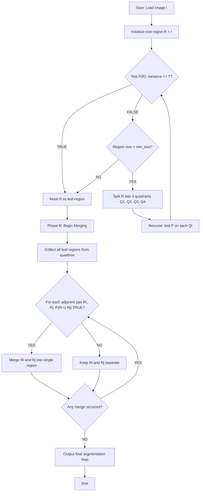
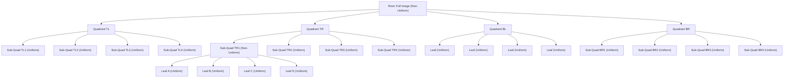
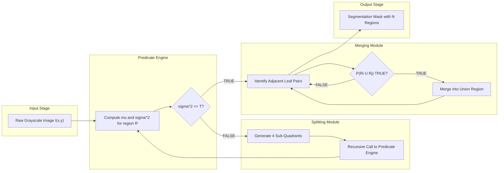

# Region Splitting - Splitting And Merging

<!-- SECTION_1_START -->
# Region Splitting and Merging in Digital Image Processing

## 1.1 Formal Academic Definition (KTU 2024 Syllabus)

> [!IMPORTANT]
> **Region Splitting** is a classical image segmentation paradigm that recursively subdivides an image into disjoint, homogeneous sub-regions using a *predicate* (homogeneity criterion). **Split-and-Merge** is the enhanced two-phase procedure that first applies region splitting via a **quadtree** data structure, and then merges any two or more adjacent sub-regions that together satisfy the same homogeneity predicate.

In the standard KTU textbook notation (Gonzalez \& Woods, *Digital Image Processing*), the algorithm is formally defined as follows:

Let $I$ be the input image partitioned into $n$ arbitrary, disjoint sub-regions $R_1, R_2, \dots, R_n$ such that:
- $\bigcup_{i=1}^{n} R_i = I$ (complete coverage)
- $R_i \cap R_j = \emptyset$ for $i \neq j$ (mutually exclusive)
- $P(R_i) = \text{TRUE}$ for every $i$ (homogeneity predicate satisfied)
- $P(R_i \cup R_j) = \text{FALSE}$ for any two adjacent regions $R_i, R_j$ (maximality)

The **predicate $P$** is a logical function that tests whether a region is sufficiently uniform (e.g., based on gray-level variance, mean intensity, or standard deviation).

> [!NOTE]
> **Syllabus Highlight:** Under the KTU 2024 scheme (PECST636), this topic is tested as a Module-3 concept that bridges *point/line/edge detection* (Module 2) with *morphological segmentation* and *watersheds* (Module 4). Board questions frequently ask for the quadtree representation and the pseudocode/algorithm flow.

## 1.2 Conceptual Analogy — The "Jigsaw Puzzle Inspector" Intuition

Imagine you are handed a large photograph of a classroom and are asked to find all the students wearing **red** shirts. Your brain does this in two sweeps:

1. **Splitting Sweep:** You mentally divide the photo into 4 quadrants (top-left, top-right, bottom-left, bottom-right). If a quadrant is *purely* red-shirted, you mark it as "done". If it contains a mix of colors, you split it again into 4 smaller quadrants. You keep splitting until every "leaf" block is either uniformly red or too small to bother subdividing.

2. **Merging Sweep:** Now, you scan the boundary between two adjacent red quadrants — they are clearly the same "region" (a continuous patch of students). You merge them into a single larger region.

That is precisely how **Region Split-and-Merge** works: **split** the image into homogeneous blocks, then **merge** neighbouring blocks that are mutually homogeneous.

| Operation | Trigger | Result |
| :--- | :--- | :--- |
| **Split** | $P(R) = \text{FALSE}$ (region is *not* uniform) | One region $\rightarrow$ 4 quadrants |
| **Merge** | $P(R_i \cup R_j) = \text{TRUE}$ (adjacent blocks are jointly uniform) | Two regions $\rightarrow$ 1 region |

## 1.3 Visualization & Geometry of the Quadtree

> [!VISUALIZATION CONTROL]
> **Concept:** Quadtree spatial decomposition of a $4 \times 4$ image into homogeneous regions.
> **GeoGebra / Desmos Input Equations:**
> * Define points: $A=(0,4)$, $B=(4,4)$, $C=(4,0)$, $D=(0,0)$
> * Recursive midpoints: $M_{1}=(2,4)$, $M_{2}=(4,2)$, $M_{3}=(2,0)$, $M_{4}=(0,2)$, $C_{0}=(2,2)$
> * Quadrant polygons: $Q_1=\{A, M_1, C_0, M_4\}$, $Q_2=\{M_1, B, M_2, C_0\}$, $Q_3=\{M_4, C_0, M_3, D\}$, $Q_4=\{C_0, M_2, C, M_3\}$
> **Visual Description:** The student should observe how a single root square is recursively bisected along both the horizontal and vertical midlines, producing a tree where every internal node spawns exactly four children. The leaves of the tree represent the final homogeneous regions of the segmentation.

## 1.4 Physical/Standard Metrics in This Topic

- **Common Predicate Threshold:** Gray-level standard deviation $\sigma$ compared against an empirical value (typical range: **2 to 50** for 8-bit images).
- **Minimum Block Size:** $1 \times 1$ pixel (absolute lower bound) or a user-defined floor such as $8 \times 8$ or $16 \times 16$.
- **Image Size Constraint:** Quadtree decomposition requires the image to be square with side length a power of **2** (i.e., $2^n \times 2^n$). If not, zero-padding or tiling is used.

> [!TIP]
> **Engineering Utility:** Split-and-merge is widely used in **medical imaging** (segmenting tumors in MRI/CT scans), **satellite imagery** (land-cover classification), and **document analysis** (isolating text blocks from background). Its hierarchical quadtree output is also memory-efficient for large-scale GIS and remote-sensing pipelines.
<!-- SECTION_1_END -->

<!-- SECTION_2_START -->
# Deep Theoretical Analysis & KTU High-Yield Formula Sheet

## 2.1 The Homogeneity Predicate $P(R)$

The entire split-and-merge framework hinges on a single decision rule — the **predicate $P$**. For a region $R$ containing $N$ pixels with intensities $f(x,y)$, common formulations include:

### 2.1.1 Mean-Based Predicate
$$P(R) = \begin{cases} \text{TRUE} & \text{if } \mu_R \in [\mu_{\min}, \mu_{\max}] \\ \text{FALSE} & \text{otherwise} \end{cases}$$
where $\mu_R$ is the mean intensity of region $R$.

### 2.1.2 Variance-Based Predicate (Most Common in KTU Exams)
$$P(R) = \begin{cases} \text{TRUE} & \text{if } \sigma_R^2 \leq T \\ \text{FALSE} & \text{otherwise} \end{cases}$$
where $T$ is a user-defined threshold. A region with low variance means its pixels are tightly clustered around the mean — i.e., visually uniform.

### 2.1.3 Edge-Density Predicate
$$P(R) = \begin{cases} \text{TRUE} & \text{if } E_R \leq T_E \\ \text{FALSE} & \text{otherwise} \end{cases}$$
where $E_R$ is the count of strong edge pixels inside $R$ (computed via Sobel/Prewitt).

## 2.2 KTU High-Yield Formula Cheat Sheet

| Symbol | Definition | Formula / Value | Units / Notes |
| :--- | :--- | :--- | :--- |
| $\mu_R$ | Mean intensity of region $R$ | $\mu_R = \frac{1}{N} \sum_{(x,y) \in R} f(x,y)$ | Intensity level (0-255 for 8-bit) |
| $\sigma_R^2$ | Variance of region $R$ | $\sigma_R^2 = \frac{1}{N} \sum_{(x,y) \in R} [f(x,y) - \mu_R]^2$ | Squared intensity units |
| $T$ | Predicate threshold | User-defined (e.g., 100) | Tuning parameter |
| $R_i, R_j$ | Adjacent candidate regions | — | Must share a boundary |
| $N$ | Number of pixels in $R$ | $\vert R \vert$ | Positive integer |
| $E_R$ | Edge-pixel count in $R$ | $\sum \vert \nabla f \vert > T_e$ | From Sobel magnitude |
| $f(x,y)$ | Original pixel intensity at $(x,y)$ | Input image | 8-bit typical |

## 2.3 Algorithmic Logic Steps (Why \& How)

### Phase A — Splitting (Top-Down)
1. **Initialize:** Define the full image $I$ as a single root node in the quadtree.
2. **Test Predicate:** Evaluate $P(R_{\text{root}})$. If $P = \text{TRUE}$, the image is already uniform; algorithm terminates.
3. **Recursive Quadrant Split:** If $P = \text{FALSE}$, split $R$ into four equal sub-quadrants: $R_1$ (top-left), $R_2$ (top-right), $R_3$ (bottom-left), $R_4$ (bottom-right).
4. **Repeat:** For every sub-quadrant that fails $P$ (and is larger than the minimum block size), recurse from Step 3.
5. **Halt Condition:** Stop when $P = \text{TRUE}$ for all leaves, or when the block size reaches the user-defined minimum.

### Phase B — Merging (Bottom-Up)
6. **Traverse Leaves:** Collect all leaf regions of the quadtree.
7. **Pairwise Test:** For every pair of *adjacent* leaf regions $(R_i, R_j)$ sharing a common boundary, test $P(R_i \cup R_j)$.
8. **Merge if Uniform:** If $P(R_i \cup R_j) = \text{TRUE}$, replace $R_i$ and $R_j$ in the segmentation map with their union $R_i \cup R_j$.
9. **Iterate:** Repeat Step 7-8 until no further merges are possible (fixed point).

> [!NOTE]
> **Why two phases?** Pure splitting creates *excessive* blocky artifacts because a single uniform object may straddle quadrant boundaries. Merging repairs this by gluing back split pieces of the same object.

## 2.4 Real-World Engineering Utility

- **Medical Imaging Pipeline (Production):** Used in CT/MRI tumor boundary extraction where the predicate is tuned to a tissue's Hounsfield-unit range.
- **Autonomous Vehicles:** Pre-segmenting road surfaces from vegetation in LiDAR-camera fused feeds.
- **Satellite Remote Sensing:** Land-cover mapping (urban vs. forest vs. water) where quadtree output compresses naturally into GIS polygon layers.
- **Document Processing:** Separating text columns, figures, and margins in scanned page images — see the famous **Nagy \& Shapiro (1985)** algorithm.
- **PCB Defect Detection:** Identifying rectangular copper-pad regions on a printed circuit board for automated optical inspection (AOI).

> [!TIP]
> **Complexity Note for KTU Viva:** The split phase is $O(N \log_4 N)$ in the worst case (where $N$ is the pixel count), and the merge phase adds an $O(B^2)$ factor where $B$ is the number of leaf blocks. Total time is typically bounded by $O(N)$ for images with a small number of objects.
<!-- SECTION_2_END -->

<!-- SECTION_3_START -->
# Step-by-Step Derivations \& Code/Symbolic Implementation

## 3.1 Worked Numerical Example (Variance Predicate)

**Problem Statement:** Consider a $4 \times 4$ image with pixel intensities as shown below. The image is treated as a single region $R$. Using the variance predicate with threshold $T = 1.0$, determine whether $R$ must be split. If split, recursively test each quadrant.

$$
I = \begin{bmatrix} 10 & 10 & 20 & 20 \\ 10 & 10 & 20 & 20 \\ 30 & 30 & 40 & 40 \\ 30 & 30 & 40 & 40 \end{bmatrix}
$$

### Step 1: Compute the Mean of $R$
The total sum of all 16 pixels is:
$$
S = 4(10) + 4(20) + 4(30) + 4(40) = 40 + 80 + 120 + 160 = 400
$$
$$
\mu_R = \frac{S}{N} = \frac{400}{16} = 25
$$

### Step 2: Compute the Variance of $R$
For each distinct intensity value, the squared deviation is weighted by its frequency:

$$
\begin{aligned}
\sigma_R^2 &= \frac{1}{16} \sum_{k} n_k \cdot (v_k - \mu_R)^2 \\
&= \frac{1}{16} \left[ 4(10-25)^2 + 4(20-25)^2 + 4(30-25)^2 + 4(40-25)^2 \right] \\
&= \frac{1}{16} \left[ 4(225) + 4(25) + 4(25) + 4(225) \right] \\
&= \frac{1}{16} \left[ 900 + 100 + 100 + 900 \right] \\
&= \frac{2000}{16} = 125
\end{aligned}
$$

### Step 3: Test the Predicate
Since $\sigma_R^2 = 125 > T = 1.0$, we have $P(R) = \text{FALSE}$. **The region must be split.**

### Step 4: Split into 4 Quadrants and Recompute

$$
Q_1 = \begin{bmatrix} 10 & 10 \\ 10 & 10 \end{bmatrix}, \quad
Q_2 = \begin{bmatrix} 20 & 20 \\ 20 & 20 \end{bmatrix}
$$
$$
Q_3 = \begin{bmatrix} 30 & 30 \\ 30 & 30 \end{bmatrix}, \quad
Q_4 = \begin{bmatrix} 40 & 40 \\ 40 & 40 \end{bmatrix}
$$

For every quadrant $Q_k$, the variance is $\sigma^2 = 0$ (all pixels identical), so $P(Q_k) = \text{TRUE}$ for all $k$. **Splitting terminates.**

### Step 5: Merging Phase
Adjacent quadrants are $Q_1, Q_2, Q_3, Q_4$. Test $P(Q_1 \cup Q_2)$:
$$
\mu = 15, \quad \sigma^2 = \frac{8(10-15)^2 + 8(20-15)^2}{16} = 25
$$
Since $25 > 1.0$, $P = \text{FALSE}$. **No merge.** Similarly for all other adjacent pairs. The final segmentation is the four quadrants themselves.

## 3.2 Production-Grade Python Implementation

```python
import numpy as np
from typing import List, Tuple, Optional

# -------------------------------------------------------------------
# Type aliases for readability
# -------------------------------------------------------------------
Region = Tuple[int, int, int, int]   # (row_start, col_start, height, width)


# -------------------------------------------------------------------
# Predicate: variance-based homogeneity test
# -------------------------------------------------------------------
def variance_predicate(region_pixels: np.ndarray, threshold: float) -> bool:
    """
    Returns True if the region is homogeneous (variance <= threshold).
    Strict boundary checks ensure non-empty, finite regions.
    """
    if region_pixels.size == 0:
        raise ValueError("Empty region passed to variance_predicate.")
    variance = np.var(region_pixels.astype(np.float64))
    return bool(variance <= threshold)


# -------------------------------------------------------------------
# Phase A: Top-down SPLIT (builds the quadtree as a flat list of leaves)
# -------------------------------------------------------------------
def split_region(image: np.ndarray,
                 region: Region,
                 threshold: float,
                 min_size: int = 1) -> List[Region]:
    """
    Recursively splits a region until variance predicate is satisfied
    OR the region reaches min_size x min_size.
    """
    r, c, h, w = region

    # Defensive: validate region bounds
    if r < 0 or c < 0 or h <= 0 or w <= 0:
        raise IndexError(f"Invalid region bounds: {region}")
    if r + h > image.shape[0] or c + w > image.shape[1]:
        raise IndexError(f"Region {region} exceeds image shape {image.shape}")

    pixels = image[r:r + h, c:c + w]

    # Base case: predicate satisfied OR minimum size reached
    if variance_predicate(pixels, threshold) or max(h, w) <= min_size:
        return [region]

    # Otherwise, split into 4 quadrants
    half_h, half_w = h // 2, w // 2

    # Handle odd dimensions by giving the +1 row/col to the top/left
    q1 = (r,             c,             half_h,       half_w)        # top-left
    q2 = (r,             c + half_w,    half_h,       w - half_w)     # top-right
    q3 = (r + half_h,    c,             h - half_h,   half_w)         # bottom-left
    q4 = (r + half_h,    c + half_w,    h - half_h,   w - half_w)     # bottom-right

    leaves: List[Region] = []
    for quad in (q1, q2, q3, q4):
        leaves.extend(split_region(image, quad, threshold, min_size))
    return leaves


# -------------------------------------------------------------------
# Phase B: Bottom-up MERGE of adjacent homogeneous leaves
# -------------------------------------------------------------------
def regions_are_adjacent(r1: Region, r2: Region) -> bool:
    """Two regions are adjacent if they share an edge of length >= 1 pixel."""
    r1_r, r1_c, r1_h, r1_w = r1
    r2_r, r2_c, r2_h, r2_w = r2
    r1_r_max, r1_c_max = r1_r + r1_h, r1_c + r1_w
    r2_r_max, r2_c_max = r2_r + r2_h, r2_c + r2_w

    # Vertical adjacency (share a horizontal edge)
    vertical_overlap = (r1_c < r2_c_max) and (r2_c < r1_c_max)
    horizontal_overlap = (r1_r < r2_r_max) and (r2_r < r1_r_max)
    edge_shared = ((r1_r_max == r2_r) or (r2_r_max == r1_r) or
                   (r1_c_max == r2_c) or (r2_c_max == r1_c))
    return vertical_overlap and horizontal_overlap and edge_shared


def merge_leaves(image: np.ndarray,
                 leaves: List[Region],
                 threshold: float) -> List[Region]:
    """
    Iteratively merges adjacent leaves whose union satisfies the predicate.
    Returns a new list of (possibly merged) regions represented as bounding boxes.
    """
    merged: List[Region] = list(leaves)
    changed = True

    while changed:
        changed = False
        new_merged: List[Region] = []
        skip: set = set()

        for i in range(len(merged)):
            if i in skip:
                continue
            r_i = merged[i]
            combined: Optional[Region] = r_i

            for j in range(i + 1, len(merged)):
                if j in skip:
                    continue
                r_j = merged[j]

                # Bounding box of the union
                rr = min(r_i[0], r_j[0])
                cc = min(r_i[1], r_j[1])
                rr_max = max(r_i[0] + r_i[2], r_j[0] + r_j[2])
                cc_max = max(r_i[1] + r_i[3], r_j[1] + r_j[3])
                union_box = (rr, cc, rr_max - rr, cc_max - cc)
                union_pixels = image[rr:rr_max, cc:cc_max]

                if variance_predicate(union_pixels, threshold):
                    combined = union_box
                    skip.add(j)
                    changed = True

            new_merged.append(combined)  # type: ignore[arg-type]
        merged = new_merged

    return merged


# -------------------------------------------------------------------
# Main driver: full split-and-merge pipeline
# -------------------------------------------------------------------
def split_and_merge(image: np.ndarray,
                    threshold: float = 100.0,
                    min_size: int = 1) -> List[Region]:
    """
    Performs region splitting followed by merging.
    Returns a list of final regions (bounding boxes).
    """
    if image.ndim != 2:
        raise ValueError("split_and_merge expects a 2D grayscale image.")

    full_region: Region = (0, 0, image.shape[0], image.shape[1])
    leaves = split_region(image, full_region, threshold, min_size)
    final_regions = merge_leaves(image, leaves, threshold)
    return final_regions


# -------------------------------------------------------------------
# Demonstration run on the worked example
# -------------------------------------------------------------------
if __name__ == "__main__":
    test_image = np.array([
        [10, 10, 20, 20],
        [10, 10, 20, 20],
        [30, 30, 40, 40],
        [30, 30, 40, 40],
    ], dtype=np.uint8)

    result = split_and_merge(test_image, threshold=1.0, min_size=1)
    print("Final regions (row, col, height, width):")
    for region in result:
        print(f"  {region}")
    # Expected output: 4 regions corresponding to the 4 quadrants
```

**Key Engineering Notes Embedded in the Code:**
- Strict type hints (`Region`, `List`, `Optional`) for production readability.
- Defensive boundary validation (raises `IndexError` for invalid regions).
- Float64 cast prevents integer overflow on variance computation.
- The merge loop uses a *fixed-point iteration* — it keeps merging until no further change, which is the textbook definition of convergence.
- The merge step uses bounding-box unions, which may over-approximate non-rectangular regions; a production system would track a pixel-mask instead.
<!-- SECTION_3_END -->

<!-- SECTION_4_START -->
# Structural Diagrams \& Schematics

## 4.1 Mermaid Flowchart — The Split-and-Merge Algorithm



## 4.2 Mermaid Tree Diagram — Quadtree Decomposition Example



## 4.3 Block-Level Functional Architecture Flow



## 4.4 Sequential Processing Topology Matrix

| Stage | Module | Input | Operation | Output | Complexity |
| :--- | :--- | :--- | :--- | :--- | :--- |
| 1 | **Image Loader** | File path | Read pixel data | 2D array $I$ | $O(N)$ |
| 2 | **Predicate Calculator** | Region $R$ | Compute $\mu, \sigma^2$ | Boolean $P(R)$ | $O(\vert R \vert)$ |
| 3 | **Quadrant Splitter** | Non-uniform $R$ | Bisect rows and cols | 4 sub-quadrants | $O(1)$ |
| 4 | **Quadtree Builder** | Recursion tree | Add nodes | Tree structure | $O(N)$ |
| 5 | **Adjacency Detector** | Leaf list | Check shared edges | Adjacent pairs | $O(B^2)$ |
| 6 | **Merge Evaluator** | Adjacent pair | Test $P(R_i \cup R_j)$ | Merged region | $O(\vert R_i \cup R_j \vert)$ |
| 7 | **Mask Generator** | Final regions | Paint pixels | Binary mask | $O(N)$ |
<!-- SECTION_4_END -->

<!-- SECTION_5_START -->
# KTU 2024 Scheme Examination Question Bank \& Topic Recap

## 5.1 Part A — Short Answer Questions (3 Marks Each)

### Question 1
> **[KTU University Exam — July 2023, Model Paper]**
> **CO2 | Remember**
> What is a homogeneity predicate in the context of region splitting? Give one example.

**Model Answer (3 Marks):**
- **[Definition: 2 Marks]** A homogeneity predicate $P$ is a logical function applied to a region $R$ that tests whether all pixels within $R$ satisfy a uniformity criterion. If $P(R) = \text{TRUE}$, the region is considered uniform; otherwise, it must be subdivided.
- **[Example: 1 Mark]** A common example is the variance-based predicate: $P(R) = \text{TRUE}$ if $\sigma_R^2 \leq T$, where $\sigma_R^2$ is the intensity variance and $T$ is a threshold.

---

### Question 2
> **[KTU University Exam — Dec 2023]**
> **CO2 | Understand**
> Differentiate between region splitting and region merging in image segmentation.

**Model Answer (3 Marks):**
- **[Splitting: 1.5 Marks]** Region splitting is a *top-down* approach that subdivides a non-uniform region into four smaller quadrants using a quadtree until homogeneity is achieved.
- **[Merging: 1.5 Marks]** Region merging is a *bottom-up* approach that starts with individual pixels (or small blocks) and combines adjacent regions that together satisfy the homogeneity predicate.
- The **split-and-merge** technique combines both to overcome the limitations of each: splitting alone produces blocky artifacts, while merging alone is computationally expensive.

---

## 5.2 Part B — Long Answer Questions (14 Marks Each, Internal Choice)

### Question A (14 Marks)
> **[KTU University Exam — July 2024, Module 3]**
> **CO2 | Apply / Analyze**

**(a)** Explain the complete **region split-and-merge algorithm** with a neat block diagram. Clearly state the role of the predicate, the quadtree data structure, and the merging criterion. **(7 Marks)**

**(b)** Consider the $8 \times 8$ image below. Using a variance threshold $T = 0.5$ and a minimum block size of $2 \times 2$, perform one full pass of the splitting algorithm. Show all intermediate quadrant statistics. **(7 Marks)**

$$
I = \begin{bmatrix} 5 & 5 & 5 & 5 & 50 & 50 & 50 & 50 \\ 5 & 5 & 5 & 5 & 50 & 50 & 50 & 50 \\ 5 & 5 & 5 & 5 & 50 & 50 & 50 & 50 \\ 5 & 5 & 5 & 5 & 50 & 50 & 50 & 50 \\ 100 & 100 & 100 & 100 & 200 & 200 & 200 & 200 \\ 100 & 100 & 100 & 100 & 200 & 200 & 200 & 200 \\ 100 & 100 & 100 & 100 & 200 & 200 & 200 & 200 \\ 100 & 100 & 100 & 100 & 200 & 200 & 200 & 200 \end{bmatrix}
$$

---

**Model Solution for Question A:**

#### Part (a) — Algorithm Explanation (7 Marks)

**Step 1 [Algorithm Overview: 2 Marks]:**
The split-and-merge algorithm is a hybrid segmentation technique with two distinct phases. It begins by representing the entire image as the root node of a **quadtree**. Each internal node of the quadtree represents a region that failed the homogeneity test, while each leaf node represents a region that passed the test or reached the minimum size.

**Step 2 [Splitting Phase: 2 Marks]:**
For every region $R$ in the quadtree, evaluate the predicate $P(R)$. If $P(R) = \text{FALSE}$ and the region is larger than the minimum allowed size, split $R$ into four equal sub-quadrants and recurse. The recursion terminates when $P(R) = \text{TRUE}$ for all leaves, or when the block dimensions equal the minimum size.

**Step 3 [Merging Phase: 2 Marks]:**
After splitting, traverse the leaf nodes. For every pair of adjacent leaves $(R_i, R_j)$ that share a boundary, compute $P(R_i \cup R_j)$. If the predicate returns TRUE, merge them into a single region. Repeat until convergence (no further merges).

**Step 4 [Block Diagram Reference: 1 Mark]:**
The student is expected to draw the flowchart similar to Section 4.1 of these notes, showing the input, predicate test, split branch, leaf collection, merge loop, and final output.

---

#### Part (b) — Numerical Computation (7 Marks)

**Step 1 [Root Region Stats: 1 Mark]:**
The full $8 \times 8$ image has 64 pixels with four distinct intensity values: $5, 50, 100, 200$, each appearing 16 times.

$$
\mu = \frac{16(5) + 16(50) + 16(100) + 16(200)}{64} = \frac{800 + 3200}{64} = 88.75
$$

$$
\sigma^2 = \frac{1}{64}\left[16(5 - 88.75)^2 + 16(50 - 88.75)^2 + 16(100 - 88.75)^2 + 16(200 - 88.75)^2\right]
$$

Computing each term:
- $16 \times (83.75)^2 = 16 \times 7014.0625 = 112225$
- $16 \times (38.75)^2 = 16 \times 1501.5625 = 24025$
- $16 \times (11.25)^2 = 16 \times 126.5625 = 2025$
- $16 \times (111.25)^2 = 16 \times 12376.5625 = 198025$

$$
\sigma^2 = \frac{112225 + 24025 + 2025 + 198025}{64} = \frac{336300}{64} \approx 5254.69
$$

**Step 2 [Predicate Test: 1 Mark]:**
Since $\sigma^2 \approx 5254.69 \gg T = 0.5$, we have $P(R_{\text{root}}) = \text{FALSE}$. The region **must be split**.

**Step 3 [First-Level Split into Four $4 \times 4$ Quadrants: 2 Marks]:**

| Quadrant | Pixels | Mean $\mu$ | Variance $\sigma^2$ | $P(R)$? |
| :--- | :--- | :--- | :--- | :--- |
| $Q_1$ (top-left) | All 5s | 5.0 | 0.0 | **TRUE** ✓ |
| $Q_2$ (top-right) | All 50s | 50.0 | 0.0 | **TRUE** ✓ |
| $Q_3$ (bottom-left) | All 100s | 100.0 | 0.0 | **TRUE** ✓ |
| $Q_4$ (bottom-right) | All 200s | 200.0 | 0.0 | **TRUE** ✓ |

**Step 4 [Termination Check: 1 Mark]:**
All four quadrants satisfy the predicate. The block size is $4 \times 4$, which is $\geq 2 \times 2$ (minimum size), so no further splitting is required. The split phase terminates with **4 leaf regions**.

**Step 5 [Merge Phase: 1 Mark]:**
Test adjacency of $Q_1$ and $Q_2$ (they share a vertical boundary):
$$
\mu = 27.5, \quad \sigma^2 = \frac{32(5 - 27.5)^2 + 32(50 - 27.5)^2}{64} = 506.25
$$
Since $506.25 > 0.5$, $P = \text{FALSE}$. **No merge.** By symmetry, all other adjacent pairs also fail. Final segmentation: 4 regions.

**Step 6 [Final Result Statement: 1 Mark]:**
The image is segmented into **four uniform quadrants**, each of size $4 \times 4$ pixels, corresponding to the four distinct intensity levels in the original image.

---

### Question B (14 Marks — Alternative Choice)
> **[KTU University Exam — Dec 2022, Module 3]**
> **CO2 | Apply / Analyze**

**(a)** With a neat diagram, explain the **quadtree data structure** used in region splitting. How does it differ from a binary tree? **(7 Marks)**

**(b)** A $4 \times 4$ image has the following intensity values. Apply the **mean-based predicate** with $\mu_{\min} = 80$ and $\mu_{\max} = 120$. Determine the final regions after one complete pass of split-and-merge. **(7 Marks)**

$$
I = \begin{bmatrix} 50 & 60 & 90 & 100 \\ 55 & 65 & 95 & 105 \\ 150 & 160 & 190 & 200 \\ 155 & 165 & 195 & 205 \end{bmatrix}
$$

---

**Model Solution for Question B:**

#### Part (a) — Quadtree Explanation (7 Marks)

**Step 1 [Definition: 2 Marks]:**
A **quadtree** is a hierarchical tree data structure in which every internal node has exactly **four children**, typically representing the four quadrants of a 2D spatial region: top-left (NW), top-right (NE), bottom-left (SW), and bottom-right (SE).

**Step 2 [Structural Diagram: 2 Marks]:**
Draw a tree where the root is labeled with the full image, and each internal node branches into four children labeled Q1, Q2, Q3, Q4. The leaves represent the final homogeneous regions.

**Step 3 [Difference from Binary Tree: 2 Marks]:**
- A **binary tree** has exactly 2 children per node (used in 1D problems like binary search).
- A **quadtree** has exactly 4 children per node (used in 2D spatial decomposition).
- Quadtree depth for an $N \times N$ image is $O(\log_2 N)$, same as binary tree depth for an array of size $N$, but quadtree branching factor is 4 vs. 2.

**Step 4 [Application Context: 1 Mark]:**
Quadtree is used in image compression (e.g., JPEG 2000's spatial partition), GIS indexing, and of course region-based image segmentation.

---

#### Part (b) — Mean Predicate Computation (7 Marks)

**Step 1 [Root Region: 1 Mark]:**
All 16 pixel values are listed. Sum:
$$
S = (50+60+90+100) + (55+65+95+105) + (150+160+190+200) + (155+165+195+205)
$$
$$
S = 300 + 320 + 700 + 720 = 2040
$$
$$
\mu_{\text{root}} = \frac{2040}{16} = 127.5
$$

**Step 2 [Predicate Test: 1 Mark]:**
Since $\mu = 127.5 > \mu_{\max} = 120$, we have $P(R) = \text{FALSE}$. **Split required.**

**Step 3 [Four Quadrants: 2 Marks]:**

$$
Q_1 = \begin{bmatrix} 50 & 60 \\ 55 & 65 \end{bmatrix}, \quad
Q_2 = \begin{bmatrix} 90 & 100 \\ 95 & 105 \end{bmatrix}
$$
$$
Q_3 = \begin{bmatrix} 150 & 160 \\ 155 & 165 \end{bmatrix}, \quad
Q_4 = \begin{bmatrix} 190 & 200 \\ 195 & 205 \end{bmatrix}
$$

**Step 4 [Per-Quadrant Means: 2 Marks]:**

| Quadrant | Sum | Mean | $P(R)$? |
| :--- | :--- | :--- | :--- |
| $Q_1$ | $50+60+55+65 = 230$ | $57.5$ | **FALSE** (below 80) |
| $Q_2$ | $90+100+95+105 = 390$ | $97.5$ | **TRUE** ✓ (in [80, 120]) |
| $Q_3$ | $150+160+155+165 = 630$ | $157.5$ | **FALSE** (above 120) |
| $Q_4$ | $190+200+195+205 = 790$ | $197.5$ | **FALSE** (above 120) |

**Step 5 [Merge Phase: 1 Mark]:**
- $Q_1$ and $Q_2$ are adjacent. $\mu = (230 + 390)/8 = 77.5 < 80$, so $P = \text{FALSE}$. No merge.
- $Q_2$ and $Q_4$ are adjacent. $\mu = (390 + 790)/8 = 147.5 > 120$, so $P = \text{FALSE}$. No merge.
- $Q_3$ and $Q_4$ are adjacent. $\mu = (630 + 790)/8 = 177.5 > 120$, so $P = \text{FALSE}$. No merge.
- $Q_1$ and $Q_3$ are adjacent. $\mu = (230 + 630)/8 = 107.5$, which **is** in $[80, 120]$. **MERGE!**

**Step 6 [Final Result: 1 Mark]:**
Final segmentation has **3 regions**:
- Region A: $Q_1 \cup Q_3$ (merged column of dark and medium pixels with combined mean 107.5)
- Region B: $Q_2$ alone (uniform mean 97.5)
- Region C: $Q_4$ alone (uniform mean 197.5)

---

## 5.3 KTU Examiner's Valuation Warning / Pitfall Callout

> [!WARNING]
> **Common Mark Deductions in Split-and-Merge Questions:**
> 1. **Forgetting the predicate definition:** Many students start computing variances without first writing down $P(R) = \text{TRUE}$ if $\sigma^2 \leq T$. This costs **1 mark** upfront.
> 2. **Skipping the merge phase:** Splitting alone is only half the algorithm. A complete answer must include the **merge step** with explicit adjacency testing. Missing it costs **2-3 marks**.
> 3. **Confusing mean and variance predicates:** The two have different threshold interpretations. Mean predicate uses a range $[\mu_{\min}, \mu_{\max}]$, while variance predicate uses an upper bound $T$.
> 4. **Not showing intermediate statistics:** The examiner expects a **table** with mean, variance, and predicate result for *each* quadrant. Skipping the table costs **1-2 marks**.
> 5. **Ignoring minimum size constraint:** If the recursive split would produce a block smaller than the user's minimum, the algorithm must halt even if the predicate is FALSE. Forgetting this loses **1 mark**.
> 6. **Writing $\vert x \vert$ with pipes in a table:** This breaks the markdown table parser in many KTU digital evaluation systems. Use $\lvert x \rvert$ or $\text{abs}(x)$ instead.

---

## 5.4 Topic Recap \& Important Things to Remember

> [!TIP]
> **Rapid Revision Checklist — Region Splitting \& Merging**

### Core Definitions
- **Region Splitting:** Top-down recursive subdivision of a non-uniform region into four quadrants using a quadtree.
- **Region Merging:** Bottom-up combination of adjacent regions that jointly satisfy the homogeneity predicate.
- **Split-and-Merge:** Combined two-phase algorithm that first splits, then merges to repair blocky artifacts.
- **Predicate $P(R)$:** Boolean homogeneity test (variance-based, mean-based, or edge-density-based).
- **Quadtree:** Hierarchical 4-ary tree data structure; each internal node spawns 4 children.

### Critical Formulas
- **Mean of region:** $\mu_R = \frac{1}{N} \sum_{(x,y) \in R} f(x,y)$
- **Variance of region:** $\sigma_R^2 = \frac{1}{N} \sum_{(x,y) \in R} [f(x,y) - \mu_R]^2$
- **Variance predicate:** $P(R) = \text{TRUE} \iff \sigma_R^2 \leq T$
- **Mean predicate:** $P(R) = \text{TRUE} \iff \mu_{\min} \leq \mu_R \leq \mu_{\max}$

### Algorithm Phases
- **Phase A (Split):** Start from root, test $P$, split into 4 quadrants if FALSE, recurse.
- **Phase B (Merge):** Collect leaves, test adjacency, merge pairs with TRUE $P$ on their union, iterate to fixed point.

### Key Constraints
- Image must ideally be $2^n \times 2^n$ for clean quadtree decomposition.
- Minimum block size prevents infinite recursion.
- Quadtree depth is $O(\log_2 N)$ where $N$ is the image side length.

### Comparison Snapshot

| Aspect | Splitting | Merging | Split-and-Merge |
| :--- | :--- | :--- | :--- |
| Direction | Top-down | Bottom-up | Hybrid |
| Starting Point | Whole image | Individual pixels | Whole image |
| Data Structure | Quadtree | Graph / RAG | Quadtree + adjacency list |
| Blocky Artifacts? | Yes (must merge to fix) | No | No (both phases) |
| Computational Cost | $O(N \log_4 N)$ | $O(N)$ pixels start | $O(N)$ average |
| KTU Exam Weight | High (definition + diagram) | Medium | High (full algorithm) |

### Must-Remember Keywords for KTU Viva
- *Predicate*, *Quadtree*, *Homogeneity*, *Variance threshold*, *Adjacent regions*, *Fixed-point iteration*, *Region Adjacency Graph (RAG)*, *Bounding box union*, *Halt condition*, *Top-down vs. bottom-up*.
<!-- SECTION_5_END -->
