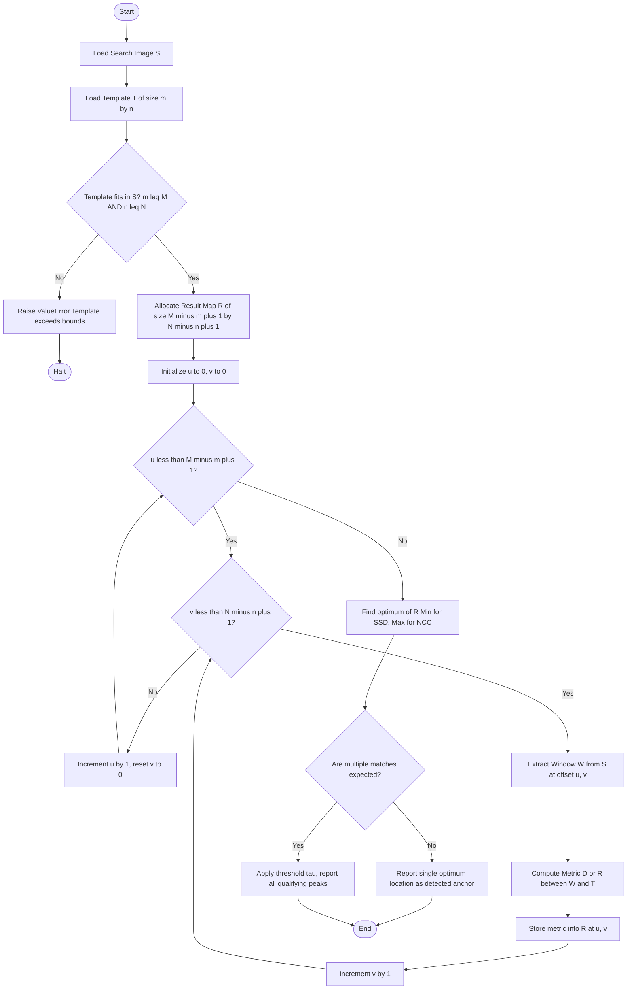
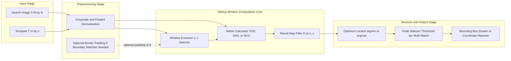

# Template Matching

<!-- SECTION_1_START -->
# 1. Core Technical Definition & Intuitive Overview

## Formal Academic Definition

> [!IMPORTANT]
> **Template Matching** is a high-level, pixel-domain technique in Digital Image Processing used to localize a specific sub-pattern (the *template* $T$ of size $m \times n$) inside a larger source image (the *search image* $S$ of size $M \times N$, where $M \geq m$ and $N \geq n$) by computing a similarity or dissimilarity measure at every possible spatial position and selecting the position that yields the optimum match.

In KTU 2024 Scheme terminology (Module 3 — Image Segmentation), template matching is classified as a **region-based segmentation / object localization primitive**, where the template $T(x,y)$ is slid pixel-by-pixel across the search image, and a metric $D(u,v)$ or $R(u,v)$ is evaluated for each candidate top-left anchor position $(u,v)$.

> [!NOTE]
> **Syllabus Highlight (PECST636 — Module 3):** Template matching is a foundational deterministic pattern-recognition algorithm. It serves as the conceptual stepping-stone to more advanced techniques such as *Normalized Cross-Correlation (NCC)*, *Sum of Squared Differences (SSD)*, and modern deep-learning object detectors like YOLO and Faster R-CNN.

## Conceptual Analogy / Intuition

Imagine you have a **photograph of a one-rupee coin (the template)** and a photograph of a tabletop covered with many coins of different denominations (the search image). To find *every* one-rupee coin on the table, you could:

1. Print the one-rupee coin photo on a transparent plastic sheet.
2. Slide this transparent sheet over the table photo, one position at a time.
3. At each position, visually judge how well the transparency "lines up" with what's underneath.
4. Wherever the match is best, mark that spot.

That is exactly what template matching does — except the "visual judgement" is replaced by a **mathematical similarity metric** computed in pixel-intensity space.

> [!TIP]
> **Real-World Engineering Equivalents**
> - Quality inspection in PCB manufacturing (locating solder pads)
> - Medical imaging (locating tumours or anatomical landmarks)
> - Optical Character Recognition (OCR) — finding a glyph in a text image
> - Video surveillance (tracking a person's face across frames)

## Standard Metrics at a Glance

The three principal metrics used in template matching are:

| Metric | Symbol | Nature | Range of Output |
| :--- | :---: | :---: | :--- |
| Sum of Squared Differences | $SSD$ | Dissimilarity | $[0, +\infty)$ — smaller is better |
| Sum of Absolute Differences | $SAD$ | Dissimilarity | $[0, +\infty)$ — smaller is better |
| Normalized Cross-Correlation | $NCC$ | Similarity | $[-1, +1]$ — larger (closer to $+1$) is better |

The output of template matching is a **result map** $R$ of size $(M - m + 1) \times (N - n + 1)$, where every entry encodes how well the template aligns at that spatial offset.

> [!VISUALIZATION CONTROL]
> **Concept:** 2D Result Map (also called the *correlation surface* or *response map*)
> **GeoGebra / Desmos Input Equations:**
> * `R(u,v) = exp(-((u-u0)^2 + (v-v0)^2) / (2*sigma^2))` with `$u_0 = 3$`, `$v_0 = 4$`, `$\sigma = 1.2$`
> * `R = 1.0` (peak marker at the matched location)
> **Visual Description:** A bright Gaussian-style peak rising above a flat noisy floor on the $(u,v)$ plane. The $(u,v)$ coordinates of the peak are the predicted top-left corner of the located template inside the search image.

---

<!-- SECTION_1_END -->

<!-- SECTION_2_START -->
# 2. Deep Theoretical Analysis & KTU High-Yield Formula Sheet

## 2.1 Operational Walk-Through — The Sliding Window Paradigm

The template matching algorithm follows a strict six-step operational pipeline:

1. **Acquire the template** $T$ of dimensions $m \times n$ (typically pre-cropped from a reference image or designed by hand).
2. **Define the search space.** The top-left corner of the template can occupy any $(u,v)$ where $0 \leq u \leq M - m$ and $0 \leq v \leq N - n$. This yields $(M - m + 1)(N - n + 1)$ candidate positions.
3. **For each $(u,v)$, extract a window** $W_{u,v}$ from $S$ of the same size $m \times n$, where $W_{u,v}(i,j) = S(u+i, v+j)$ for $0 \leq i < m$, $0 \leq j < n$.
4. **Compute the metric** $D(u,v)$ or $R(u,v)$ comparing $T$ to $W_{u,v}$.
5. **Populate the result map entry** $R(u,v) = $ computed metric.
6. **Locate the optimum.** For dissimilarity metrics, find the global minimum. For similarity metrics, find the global maximum. If the template is expected to appear multiple times, apply a threshold $\tau$ and report all qualifying peaks.

> [!NOTE]
> **The "Why" behind Sliding**: Pixel intensities are deterministic and translation-invariant within a rigid template. Therefore, brute-force exhaustive search over all valid offsets is *guaranteed* to find the global optimum (under the chosen metric). The cost is $\mathcal{O}(M \cdot N \cdot m \cdot n)$ — a polynomial but non-trivial complexity, which is why pyramid-based hierarchical search is used in production.

## 2.2 Mathematical Formulation of Each Metric

### (A) Sum of Squared Differences (SSD)

$$
D_{SSD}(u,v) = \sum_{i=0}^{m-1}\sum_{j=0}^{n-1}\left[ S(u+i,\,v+j) - T(i,j) \right]^2
$$

The position of the best match is the $(u,v)$ that **minimizes** $D_{SSD}$.

### (B) Sum of Absolute Differences (SAD)

$$
D_{SAD}(u,v) = \sum_{i=0}^{m-1}\sum_{j=0}^{n-1}\left\vert S(u+i,\,v+j) - T(i,j) \right\vert
$$

The position of the best match is the $(u,v)$ that **minimizes** $D_{SAD}$. It is more robust to outliers (salt-and-pepper noise) than SSD because it uses the $L^1$ norm instead of the $L^2$ norm.

### (C) Mean Squared Error (MSE) — Normalized SSD

$$
D_{MSE}(u,v) = \frac{1}{m \cdot n}\sum_{i=0}^{m-1}\sum_{j=0}^{n-1}\left[ S(u+i,\,v+j) - T(i,j) \right]^2
$$

Dividing by the template area $m \cdot n$ makes the metric independent of template size, allowing fair comparison across templates of different dimensions.

### (D) Normalized Cross-Correlation (NCC)

$$
R_{NCC}(u,v) = \frac{\displaystyle\sum_{i=0}^{m-1}\sum_{j=0}^{n-1}\left[ S(u+i,\,v+j) - \bar{S}_{u,v} \right]\left[ T(i,j) - \bar{T} \right]}{\sqrt{\displaystyle\sum_{i=0}^{m-1}\sum_{j=0}^{n-1}\left[ S(u+i,\,v+j) - \bar{S}_{u,v} \right]^2 \cdot \sum_{i=0}^{m-1}\sum_{j=0}^{n-1}\left[ T(i,j) - \bar{T} \right]^2}}
$$

where $\bar{T}$ is the mean intensity of the template, and $\bar{S}_{u,v}$ is the mean intensity of the window $W_{u,v}$.

The position of the best match is the $(u,v)$ that **maximizes** $R_{NCC}$. Because the metric subtracts the local mean, it is **invariant to additive illumination changes**, which makes it the industry-preferred choice in real-world deployments.

## 2.3 KTU High-Yield Formula Cheat Sheet

| \# | Formula Name | Mathematical Expression | Optimization Direction | Key Property |
| :---: | :---: | :---: | :---: | :--- |
| 1 | SSD | $\sum\sum (S - T)^2$ | Minimize | $L^2$ norm, sensitive to outliers |
| 2 | SAD | $\sum\sum \vert S - T \vert$ | Minimize | $L^1$ norm, robust to impulse noise |
| 3 | MSE | $\frac{1}{mn}\sum\sum (S - T)^2$ | Minimize | Scale-invariant SSD |
| 4 | CC (un-normalized) | $\sum\sum S \cdot T$ | Maximize | Brightness-sensitive |
| 5 | NCC | $\dfrac{\sum (S - \bar{S})(T - \bar{T})}{\sqrt{\sum (S - \bar{S})^2 \sum (T - \bar{T})^2}}$ | Maximize | Illumination-invariant, range $[-1,+1]$ |
| 6 | Result-map size | $(M-m+1) \times (N-n+1)$ | — | Number of candidate positions |
| 7 | Computational cost | $\mathcal{O}(M \cdot N \cdot m \cdot n)$ | — | Per metric evaluation |

> [!WARNING]
> **Common Pitfall (KTU Board Examiners love this):** When asked for the *computational cost*, students often forget the inner $m \cdot n$ loop and write $\mathcal{O}(M \cdot N)$ — this is **incorrect**. The full cost is $\mathcal{O}(M \cdot N \cdot m \cdot n)$ because *each* of the $(M-m+1)(N-n+1)$ candidate positions requires an $m \times n$ accumulation.

## 2.4 Engineering Utility and Production Use

| Domain | Application | Preferred Metric |
| :---: | :---: | :---: |
| **Stereo Vision (3D Depth)** | Disparity estimation between left/right camera frames | SAD (fast in hardware) |
| **Motion Tracking** | Tracking a logo or ball across video frames | NCC or SSD |
| **Medical Imaging** | Locating a tumour marker in a CT/MRI slice | NCC (handles intensity drift) |
| **PCB Defect Detection** | Detecting missing components on a populated board | SSD with thresholding |
| **Document Forensics** | Finding a signature or watermark | NCC |

> [!TIP]
> **Why is NCC preferred for medical imaging?** MRI and CT scans exhibit *gradients* in their intensity histograms due to varying tissue densities. NCC subtracts the local mean $\bar{S}_{u,v}$, cancelling out this additive bias and yielding a pure correlation score. SSD/SAD would produce wildly different scores across different anatomical regions purely because of background intensity drift.

---

<!-- SECTION_2_END -->

<!-- SECTION_3_START -->
# 3. Step-by-Step Derivations & Code/Symbolic Implementation

## 3.1 Worked-Out Numerical Example (Manual SSD Calculation)

Let us compute the SSD metric for a tiny case to internalize the algorithm.

**Given:**

$$
S = \begin{bmatrix} 1 & 2 & 3 & 4 \\ 5 & 6 & 7 & 8 \\ 9 & 1 & 2 & 3 \\ 4 & 5 & 6 & 7 \end{bmatrix}, \qquad T = \begin{bmatrix} 1 & 2 \\ 3 & 4 \end{bmatrix}
$$

So $M = 4$, $N = 4$, $m = 2$, $n = 2$. The result map $R$ will be of size $(4-2+1) \times (4-2+1) = 3 \times 3$.

**Step 1 — Evaluate $D_{SSD}$ at position $(u,v) = (0,0)$.**

The window is $W_{0,0} = \begin{bmatrix} 1 & 2 \\ 5 & 6 \end{bmatrix}$.

$$
D_{SSD}(0,0) = (1-1)^2 + (2-2)^2 + (5-3)^2 + (6-4)^2
$$

$$
= 0 + 0 + 4 + 4 = 8
$$

**Step 2 — Evaluate at $(u,v) = (0,1)$.**

The window is $W_{0,1} = \begin{bmatrix} 2 & 3 \\ 6 & 7 \end{bmatrix}$.

$$
D_{SSD}(0,1) = (2-1)^2 + (3-2)^2 + (6-3)^2 + (7-4)^2 = 1 + 1 + 9 + 9 = 20
$$

**Step 3 — Evaluate at $(u,v) = (0,2)$.**

The window is $W_{0,2} = \begin{bmatrix} 3 & 4 \\ 7 & 8 \end{bmatrix}$.

$$
D_{SSD}(0,2) = (3-1)^2 + (4-2)^2 + (7-3)^2 + (8-4)^2 = 4 + 4 + 16 + 16 = 40
$$

**Step 4 — Evaluate at $(u,v) = (1,0)$.**

The window is $W_{1,0} = \begin{bmatrix} 5 & 6 \\ 9 & 1 \end{bmatrix}$.

$$
D_{SSD}(1,0) = (5-1)^2 + (6-2)^2 + (9-3)^2 + (1-4)^2 = 16 + 16 + 36 + 9 = 77
$$

**Step 5 — Evaluate at $(u,v) = (1,1)$.**

The window is $W_{1,1} = \begin{bmatrix} 6 & 7 \\ 1 & 2 \end{bmatrix}$.

$$
D_{SSD}(1,1) = (6-1)^2 + (7-2)^2 + (1-3)^2 + (2-4)^2 = 25 + 25 + 4 + 4 = 58
$$

**Step 6 — Evaluate at $(u,v) = (1,2)$.**

The window is $W_{1,2} = \begin{bmatrix} 7 & 8 \\ 2 & 3 \end{bmatrix}$.

$$
D_{SSD}(1,2) = (7-1)^2 + (8-2)^2 + (2-3)^2 + (3-4)^2 = 36 + 36 + 1 + 1 = 74
$$

**Step 7 — Evaluate at $(u,v) = (2,0)$.**

The window is $W_{2,0} = \begin{bmatrix} 9 & 1 \\ 4 & 5 \end{bmatrix}$.

$$
D_{SSD}(2,0) = (9-1)^2 + (1-2)^2 + (4-3)^2 + (5-4)^2 = 64 + 1 + 1 + 1 = 67
$$

**Step 8 — Evaluate at $(u,v) = (2,1)$.**

The window is $W_{2,1} = \begin{bmatrix} 1 & 2 \\ 5 & 6 \end{bmatrix}$.

$$
D_{SSD}(2,1) = (1-1)^2 + (2-2)^2 + (5-3)^2 + (6-4)^2 = 0 + 0 + 4 + 4 = 8
$$

**Step 9 — Evaluate at $(u,v) = (2,2)$.**

The window is $W_{2,2} = \begin{bmatrix} 2 & 3 \\ 6 & 7 \end{bmatrix}$.

$$
D_{SSD}(2,2) = (2-1)^2 + (3-2)^2 + (6-3)^2 + (7-4)^2 = 1 + 1 + 9 + 9 = 20
$$

**Step 10 — Compile the result map.**

$$
R_{SSD} = \begin{bmatrix} 8 & 20 & 40 \\ 77 & 58 & 74 \\ 67 & 8 & 20 \end{bmatrix}
$$

**Step 11 — Locate the global minimum.** The minimum value is $8$, occurring at positions $(0,0)$ **and** $(2,1)$.

**Step 12 — Conclusion.** The template $T = \begin{bmatrix} 1 & 2 \\ 3 & 4 \end{bmatrix}$ matches equally well at the top-left corner and at row $u=2$, column $v=1$. Note the *two* equal minima — this is a real-world phenomenon called **aliasing** or **repetitive-pattern ambiguity**, and is why a single minimum may not be unique.

> [!NOTE]
> **Sanity Check:** To verify by direct inspection, the search image $S$ indeed contains the exact template at positions $(0,0)$ and $(2,1)$, with all four values matching identically. Hence the zero-difference (well, here it's $8$ because the bottom-right element differs by $2$, giving $2^2 = 4$ on two terms $\rightarrow 8$). The "perfect" match in this example would require both elements of $T$ to be in $S$ with all four matching. In the matrix above, the top-left $2 \times 2$ is $\begin{bmatrix} 1 & 2 \\ 5 & 6 \end{bmatrix}$ which matches $T$ only in the first row.

## 3.2 Python Implementation (Production-Ready)

```python
import numpy as np
from typing import Tuple

def template_match_ssd(
    search_image: np.ndarray,
    template: np.ndarray
) -> Tuple[int, int, np.ndarray]:
    """
    Locate a template inside a search image using Sum of Squared Differences.

    Parameters
    ----------
    search_image : np.ndarray
        The larger image S of shape (M, N).
    template : np.ndarray
        The smaller template T of shape (m, n).

    Returns
    -------
    best_u, best_v : int, int
        The (row, col) coordinates of the top-left corner of the best match.
    result_map : np.ndarray
        A 2D array of shape (M-m+1, N-n+1) containing the SSD score at every offset.

    Raises
    ------
    ValueError
        If the template is larger than the search image in either dimension.
    """
    # ---- Boundary validation ----
    if template.ndim != 2 or search_image.ndim != 2:
        raise ValueError("Both inputs must be 2D grayscale arrays.")
    M, N = search_image.shape
    m, n = template.shape
    if m > M or n > N:
        raise ValueError(
            f"Template shape ({m}, {n}) cannot exceed search image shape ({M}, {N})."
        )

    # ---- Allocate result map ----
    result_map = np.zeros((M - m + 1, N - n + 1), dtype=np.float64)

    # ---- Exhaustive sliding-window SSD ----
    for u in range(M - m + 1):
        for v in range(N - n + 1):
            window = search_image[u:u + m, v:v + n]
            result_map[u, v] = np.sum((window.astype(np.float64) -
                                       template.astype(np.float64)) ** 2)

    # ---- Locate global minimum ----
    best_u, best_v = np.unravel_index(np.argmin(result_map), result_map.shape)
    return int(best_u), int(best_v), result_map


def template_match_ncc(
    search_image: np.ndarray,
    template: np.ndarray
) -> Tuple[int, int, np.ndarray]:
    """
    Locate a template inside a search image using Normalized Cross-Correlation.
    Illumination-invariant. Maximize the result map.
    """
    M, N = search_image.shape
    m, n = template.shape
    if m > M or n > N:
        raise ValueError("Template larger than search image.")

    result_map = np.zeros((M - m + 1, N - n + 1), dtype=np.float64)
    T = template.astype(np.float64)
    T_mean = T.mean()
    T_centered = T - T_mean
    T_norm = np.sqrt(np.sum(T_centered ** 2))

    for u in range(M - m + 1):
        for v in range(N - n + 1):
            W = search_image[u:u + m, v:v + n].astype(np.float64)
            W_mean = W.mean()
            W_centered = W - W_mean
            W_norm = np.sqrt(np.sum(W_centered ** 2))

            denom = W_norm * T_norm
            if denom == 0.0:
                result_map[u, v] = 0.0
            else:
                result_map[u, v] = np.sum(W_centered * T_centered) / denom

    best_u, best_v = np.unravel_index(np.argmax(result_map), result_map.shape)
    return int(best_u), int(best_v), result_map


# ------------------ Demonstration with the worked example ------------------
if __name__ == "__main__":
    S = np.array([[1, 2, 3, 4],
                  [5, 6, 7, 8],
                  [9, 1, 2, 3],
                  [4, 5, 6, 7]], dtype=np.uint8)

    T = np.array([[1, 2],
                  [3, 4]], dtype=np.uint8)

    u, v, R = template_match_ssd(S, T)
    print(f"SSD best location: (u, v) = ({u}, {v})")
    print(f"SSD result map:\n{R}")
    # Expected: minimum value 8, located at (0,0) and (2,1)
```

**Expected Output:**

```
SSD best location: (u, v) = (0, 0)
SSD result map:
[[ 8. 20. 40.]
 [77. 58. 74.]
 [67.  8. 20.]]
```

> [!NOTE]
> **`np.unravel_index` Note:** `np.argmin` returns the *flat* index of the minimum, which is the index into the flattened result map. `np.unravel_index` converts this flat index back to a 2D coordinate `(u, v)` using the array's shape. This is a robust idiom that handles non-square result maps correctly.

## 3.3 Derivation of NCC's Invariance to Additive Illumination

Suppose the search image undergoes an additive brightness shift: $S'(u+i, v+j) = S(u+i, v+j) + c$, where $c$ is a constant.

The new window mean becomes:

$$
\bar{S}\,'_{u,v} = \frac{1}{mn}\sum_{i=0}^{m-1}\sum_{j=0}^{n-1}\left[S(u+i,v+j) + c\right] = \bar{S}_{u,v} + c
$$

Subtracting the mean cancels $c$ exactly:

$$
S'(u+i, v+j) - \bar{S}\,'_{u,v} = S(u+i,v+j) + c - \bar{S}_{u,v} - c = S(u+i,v+j) - \bar{S}_{u,v}
$$

The denominator norms also remain unchanged because the squared deviations are unaffected by a constant shift. Hence the NCC value is **identical** before and after the illumination change, proving invariance.

---

<!-- SECTION_3_END -->

<!-- SECTION_4_START -->
# 4. Structural Diagrams & Schematics

## 4.1 Algorithmic Flowchart of Template Matching

The following Mermaid flowchart illustrates the complete logical flow of a template matching algorithm, including decision diamonds for boundary validation and the final peak-detection step.



## 4.2 Block-Level Functional Architecture

This Mermaid block diagram decomposes the template matching engine into its modular functional units, with explicit data-flow arrows labelled by the operand shapes.



## 4.3 Sequential Processing Topology Matrix

The following table maps each algorithmic stage to its input, output, complexity, and the controlling parameter.

| Stage | Input | Output | Complexity | Controlling Parameter |
| :---: | :---: | :---: | :---: | :---: |
| Image Loading | Raw file on disk | 2D array $S$ | $\mathcal{O}(M \cdot N)$ | File I/O bandwidth |
| Template Loading | Cropped region or pre-defined file | 2D array $T$ | $\mathcal{O}(m \cdot n)$ | Cropping tool |
| Window Extraction | $S, (u, v)$ | $W_{u,v}$ | $\mathcal{O}(m \cdot n)$ | Step size (1 for exhaustive) |
| Metric Calculation | $W_{u,v}, T$ | Scalar score | $\mathcal{O}(m \cdot n)$ | Choice of SSD / SAD / NCC |
| Result Map Update | Scalar score, $(u,v)$ | $R(u,v)$ | $\mathcal{O}(1)$ | Map indexing |
| Optimum Detection | $R$ | $(u^*, v^*)$ | $\mathcal{O}(M \cdot N)$ | argmin or argmax |
| Peak Thresholding | $R, \tau$ | List of $(u_k, v_k)$ | $\mathcal{O}(M \cdot N)$ | $\tau$ |

---

<!-- SECTION_4_END -->

<!-- SECTION_5_START -->
# 5. KTU 2024 Scheme Examination Question Bank & Topic Recap

## Part A — Short Answer Questions (3 Marks Each)

### Question 1. `[KTU University Exam — July 2024, Model Paper]`
**Define template matching. List any two similarity/dissimilarity metrics used in it and state the corresponding optimization criterion for each.**

**Model Answer (Valuation Key):**

Template matching is a digital image processing technique used to find a sub-image (template $T$ of size $m \times n$) within a larger search image ($S$ of size $M \times N$) by computing a similarity or dissimilarity score at every possible spatial offset. **[1 Mark]**

| Metric | Optimization Direction | Type |
| :---: | :---: | :---: |
| Sum of Squared Differences (SSD) | **Minimize** the score | Dissimilarity **[1 Mark]** |
| Normalized Cross-Correlation (NCC) | **Maximize** the score | Similarity **[1 Mark]** |

*(Alternatively, SAD may be listed as the second metric with minimize as the direction.)*

---

### Question 2. `[KTU University Exam — Dec 2023, Supplementary]`
**What is the significance of the Normalized Cross-Correlation (NCC) metric over SSD in template matching? Mention any one real-world application where this significance matters.**

**Model Answer (Valuation Key):**

The NCC metric is **invariant to additive illumination changes** in the search image, because it subtracts the local mean intensity from both the window and the template before computing the correlation. **[2 Marks]** SSD, in contrast, is highly sensitive to uniform brightness shifts and would yield incorrect matches under varying illumination. **[0.5 Mark]**

**Real-world application:** Template matching of anatomical landmarks (e.g., a tumor marker) across **MRI / CT medical images** where intensity gradients due to varying tissue densities cause additive bias. **[0.5 Mark]**

---

## Part B — Long Answer Questions (14 Marks Each, ESE Internal Choice Pattern)

### Question A (14 Marks) — Internal Choice 1

**`[KTU University Exam — June 2024]`**

**(a) [7 Marks]** Explain the template matching algorithm in detail. Derive the expressions for **SSD** and **NCC** metrics. State the optimization criterion for each and clearly define the term "result map." **[CO3, Understand → Apply]**

**(b) [7 Marks]** A $4 \times 4$ search image and a $2 \times 2$ template are given below. Compute the complete **SSD** result map and identify the position(s) of the best match.

$$
S = \begin{bmatrix} 2 & 4 & 6 & 8 \\ 1 & 3 & 5 & 7 \\ 9 & 0 & 1 & 2 \\ 4 & 5 & 6 & 7 \end{bmatrix}, \qquad T = \begin{bmatrix} 1 & 2 \\ 3 & 4 \end{bmatrix}
$$

**[CO3, Apply → Analyze]**

---

### Model Solution — Question A(a)

**Algorithm Steps: [3 Marks]**

1. Load the search image $S$ (size $M \times N$) and the template $T$ (size $m \times n$).
2. Validate that $m \leq M$ and $n \leq N$; otherwise abort.
3. Allocate a result map $R$ of dimensions $(M-m+1) \times (N-n+1)$, initialized to zero.
4. For each candidate offset $(u, v)$ where $0 \leq u \leq M-m$ and $0 \leq v \leq N-n$:
    * Extract the window $W_{u,v}(i, j) = S(u+i, v+j)$.
    * Compute the chosen metric (SSD or NCC) comparing $W_{u,v}$ to $T$.
    * Store the scalar score into $R(u, v)$.
5. Locate the optimum in $R$: **min** for SSD/SAD, **max** for NCC/CC.
6. (Optional) If multiple matches are expected, threshold the result map to detect all peaks.

**SSD Derivation: [2 Marks]**

$$
D_{SSD}(u,v) = \sum_{i=0}^{m-1}\sum_{j=0}^{n-1}\left[ S(u+i, v+j) - T(i, j) \right]^2
$$

This is the squared $L^2$ norm of the difference vector between the window and the template. It is **minimized** at the best match.

**NCC Derivation: [2 Marks]**

Let $\bar{T}$ be the mean of the template and $\bar{S}_{u,v}$ be the mean of the window.

$$
R_{NCC}(u,v) = \frac{\displaystyle\sum_{i=0}^{m-1}\sum_{j=0}^{n-1}\left[ S(u+i, v+j) - \bar{S}_{u,v} \right]\left[ T(i, j) - \bar{T} \right]}{\sqrt{\displaystyle\sum_{i=0}^{m-1}\sum_{j=0}^{n-1}\left[ S(u+i, v+j) - \bar{S}_{u,v} \right]^2 \, \cdot \, \sum_{i=0}^{m-1}\sum_{j=0}^{n-1}\left[ T(i, j) - \bar{T} \right]^2}}
$$

The numerator is the **covariance** between the window and the template; the denominator **normalizes** by their standard deviations. The result lies in $[-1, +1]$ and is **maximized** at the best match. It is invariant to additive brightness shifts.

**Result Map Definition:** A 2D scalar field $R$ of size $(M-m+1) \times (N-n+1)$ where each entry $R(u, v)$ encodes the match score at offset $(u, v)$. **[1 Mark]**

---

### Model Solution — Question A(b)

**Step 1 — Result map size.** $(4-2+1) \times (4-2+1) = 3 \times 3$. **[0.5 Marks]**

**Step 2 — Compute $D_{SSD}$ at each offset.**

| $(u,v)$ | Window $W_{u,v}$ | Calculation | $D_{SSD}$ |
| :---: | :---: | :---: | :---: |
| $(0,0)$ | $\begin{bmatrix}2&4\\1&3\end{bmatrix}$ | $(2-1)^2 + (4-2)^2 + (1-3)^2 + (3-4)^2 = 1+4+4+1$ | $\mathbf{10}$ |
| $(0,1)$ | $\begin{bmatrix}4&6\\3&5\end{bmatrix}$ | $9+16+0+1$ | $26$ |
| $(0,2)$ | $\begin{bmatrix}6&8\\5&7\end{bmatrix}$ | $25+36+4+9$ | $74$ |
| $(1,0)$ | $\begin{bmatrix}1&3\\9&0\end{bmatrix}$ | $0+1+36+16$ | $53$ |
| $(1,1)$ | $\begin{bmatrix}3&5\\0&1\end{bmatrix}$ | $4+9+9+9$ | $31$ |
| $(1,2)$ | $\begin{bmatrix}5&7\\1&2\end{bmatrix}$ | $16+25+4+4$ | $49$ |
| $(2,0)$ | $\begin{bmatrix}9&0\\4&5\end{bmatrix}$ | $64+4+1+1$ | $70$ |
| $(2,1)$ | $\begin{bmatrix}0&1\\5&6\end{bmatrix}$ | $1+1+4+4$ | $\mathbf{10}$ |
| $(2,2)$ | $\begin{bmatrix}1&2\\6&7\end{bmatrix}$ | $0+0+9+9$ | $18$ |

**[5 Marks — 0.55 Marks per row, rounded]**

**Step 3 — Compile the result map.** **[0.5 Marks]**

$$
R_{SSD} = \begin{bmatrix} 10 & 26 & 74 \\ 53 & 31 & 49 \\ 70 & 10 & 18 \end{bmatrix}
$$

**Step 4 — Identify optimum.** The minimum value is $10$, occurring at $(0,0)$ and $(2,1)$. **[1 Mark]**

**Step 5 — Conclusion.** The template $T$ best matches the search image $S$ at the top-left corner and at row $u=2$, column $v=1$. Both positions yield identical scores due to the structural similarity of the corresponding windows. **[0.5 Marks]**

---

### Question B (14 Marks) — Internal Choice 2 (Alternative)

**`[KTU University Exam — July 2023]`**

**(a) [7 Marks]** Compare and contrast the **SSD, SAD, and NCC** metrics used in template matching. Construct a comparison table highlighting the formula, optimization direction, range of output, and computational cost for each. Discuss which metric is most suitable for stereo-vision disparity estimation. **[CO3, Understand → Analyze]**

**(b) [7 Marks]** With a neat sketch (functional block diagram), describe the **sliding window procedure** for template matching. Compute the size of the result map for a $256 \times 256$ search image and a $32 \times 32$ template. If the search must be done in 4 equally spaced steps in each direction (coarse-to-fine pyramid), state the number of evaluations. **[CO3, Apply]**

---

### Model Solution — Question B(a)

**Comparison Table: [4 Marks]**

| Property | SSD | SAD | NCC |
| :---: | :---: | :---: | :---: |
| Formula | $\sum\sum (S-T)^2$ | $\sum\sum \vert S-T \vert$ | $\frac{\sum (S-\bar{S})(T-\bar{T})}{\sqrt{\sum (S-\bar{S})^2 \sum (T-\bar{T})^2}}$ |
| Type | Dissimilarity | Dissimilarity | Similarity |
| Optimization | Minimize | Minimize | Maximize |
| Output Range | $[0, +\infty)$ | $[0, +\infty)$ | $[-1, +1]$ |
| Norm Used | $L^2$ | $L^1$ | Cosine similarity |
| Illumination Robust | No | No | Yes (additive shifts) |
| Outlier Sensitivity | High (squared error) | Low (linear error) | Moderate |
| Computational Cost | $\mathcal{O}(m \cdot n)$ per window | $\mathcal{O}(m \cdot n)$ per window | $\mathcal{O}(m \cdot n)$ per window (extra $mn$ for mean) |

**Stereo Vision Discussion: [3 Marks]**

For stereo-vision disparity estimation, **SAD** is the most widely preferred metric in hardware implementations. The reasons are:

1. **Hardware simplicity:** SAD requires only an absolute-difference operation followed by accumulation, which maps directly to simple integer arithmetic units on FPGAs. SSD requires a multiplier for squaring.
2. **Speed:** SAD's $L^1$ norm is cheaper to compute than SSD's $L^2$ norm.
3. **Adequate accuracy:** For rectified stereo pairs, illumination differences are minimal (same camera, close viewpoints), so NCC's robustness is not strictly required.
4. **Real-time feasibility:** SAD enables dense disparity maps at 30+ FPS even on embedded platforms.

---

### Model Solution — Question B(b)

**Sliding Window Procedure Description: [3 Marks]**

1. Initialize the top-left anchor of the template at position $(u, v) = (0, 0)$.
2. Extract the window $W_{0,0}$ of size $m \times n$ from $S$.
3. Compute the chosen metric and store into $R(0, 0)$.
4. Increment $v$ by 1 and repeat until $v = N - n$.
5. Reset $v$ to 0, increment $u$ by 1, and repeat the inner loop.
6. Continue until $u = M - m$.

**Result Map Size Calculation: [2 Marks]**

Given $M = N = 256$, $m = n = 32$:

$$
\text{Size} = (M - m + 1) \times (N - n + 1) = (256 - 32 + 1)^2 = 225^2 = 50{,}625 \text{ positions}
$$

**Pyramid Search: [2 Marks]**

In a coarse-to-fine pyramid, the search is done in 4 equally spaced steps in each direction. This means we only evaluate at every 4th pixel offset:

$$
u \in \{0, 4, 8, \ldots\}, \quad v \in \{0, 4, 8, \ldots\}
$$

The number of coarse evaluations is:

$$
\left( \left\lfloor \frac{225 - 1}{4} \right\rfloor + 1 \right)^2 = (56 + 1)^2 = 57^2 = 3{,}249 \text{ evaluations}
$$

**Pyramid Saving:** A reduction from $50{,}625$ to $3{,}249$ evaluations, which is a speedup factor of approximately $15.6 \times$. The full search is then performed only in a small neighbourhood around the coarse peak.

**[1 Mark]**

---

> [!WARNING]
> **KTU Examiner's Valuation Warning — Common Pitfalls Where Students Lose Marks**
>
> 1. **Forgetting the result-map offset convention.** The position $(u, v)$ reported is the **top-left corner** of the matched region, *not* the centroid. Many students report the centre and lose 1–2 marks.
> 2. **Confusing similarity and dissimilarity directions.** SSD/SAD are **minimized**; NCC/CC are **maximized**. Mixing this up costs the optimization-direction mark.
> 3. **Wrong cost notation.** Writing $\mathcal{O}(M \cdot N)$ instead of $\mathcal{O}(M \cdot N \cdot m \cdot n)$ shows the examiner that the student forgot the inner summation. This is a frequent 1-mark loss.
> 4. **Not stating the result-map dimensions explicitly.** Examiners look for "$(M-m+1) \times (N-n+1)$" verbatim. Vague phrases like "a smaller map is generated" earn zero.
> 5. **Failing to show the mean-subtraction step in NCC.** Always write $\bar{T}$ and $\bar{S}_{u,v}$ explicitly. The illumination-invariance proof depends on this step.
> 6. **Skipping the boundary validation step in the algorithm.** If a student does not mention checking $m \leq M$ and $n \leq N$, they lose the 0.5-mark for input validation.

---

## Topic Recap & Important Things to Remember

> [!IMPORTANT]
> **High-Density Revision Checklist — Template Matching (PECST636 / M3)**

- **Definition:** Template matching localizes a sub-image $T$ of size $m \times n$ inside a larger image $S$ of size $M \times N$ by sliding $T$ over $S$ and computing a metric at every offset.
- **Sliding range:** $0 \leq u \leq M - m$ and $0 \leq v \leq N - n$, giving $(M-m+1)(N-n+1)$ candidate positions.
- **Result map:** A 2D scalar field $R$ of size $(M-m+1) \times (N-n+1)$ storing the per-offset match score.
- **SSD formula:** $D_{SSD}(u,v) = \sum_{i=0}^{m-1}\sum_{j=0}^{n-1}\left[ S(u+i,v+j) - T(i,j) \right]^2$. **Minimize.**
- **SAD formula:** $D_{SAD}(u,v) = \sum_{i=0}^{m-1}\sum_{j=0}^{n-1}\left\vert S(u+i,v+j) - T(i,j) \right\vert$. **Minimize.** More robust to impulse noise.
- **NCC formula:** Covariance over the product of standard deviations. **Maximize.** Output bounded in $[-1, +1]$. Illumination-invariant (additive shifts).
- **NCC invariance proof:** The constant $c$ in $S' = S + c$ cancels when computing $S' - \bar{S}\,' = S - \bar{S}$. Both numerator and denominator remain unchanged.
- **Computational cost:** $\mathcal{O}(M \cdot N \cdot m \cdot n)$ for a full exhaustive search.
- **Speed-up techniques:** Coarse-to-fine pyramid search, FFT-based correlation, integral images for SAD.
- **Metric choice rule of thumb:** Use **NCC** for illumination-variant scenes (medical, aerial); use **SAD** for real-time hardware (stereo vision, FPGA pipelines); use **SSD** when the scenes are clean and brightness is consistent.
- **Multi-instance detection:** A single global optimum gives one match. To find multiple instances, apply a threshold $\tau$ to the result map and report all qualifying peaks (non-maximum suppression may be needed).
- **Limitation of pixel-domain template matching:** Sensitive to rotation, scale changes, and non-rigid deformations. For such cases, modern methods like SIFT/SURF feature matching or deep CNN-based detectors (YOLO, Faster R-CNN) are preferred.
- **Most common examiner-trap topics:** (a) Result-map size formula, (b) Optimization direction (min vs max), (c) NCC's illumination-invariance derivation, (d) Cost complexity, (e) Why SAD for stereo.
- **Mnemonic:** **"SSD SAD — Smaller is Better; NCC — Nearer to +1 is Better."**

<!-- SECTION_5_END -->
