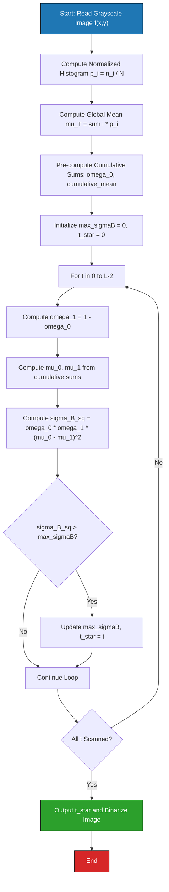
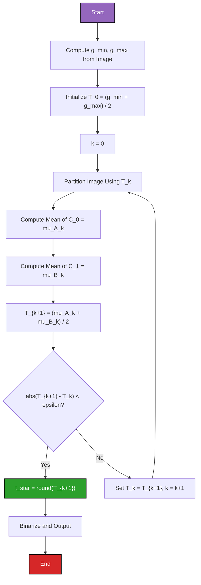
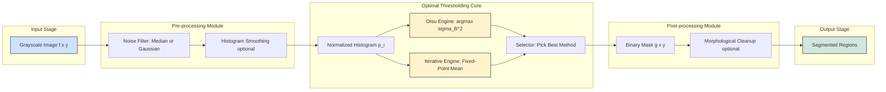
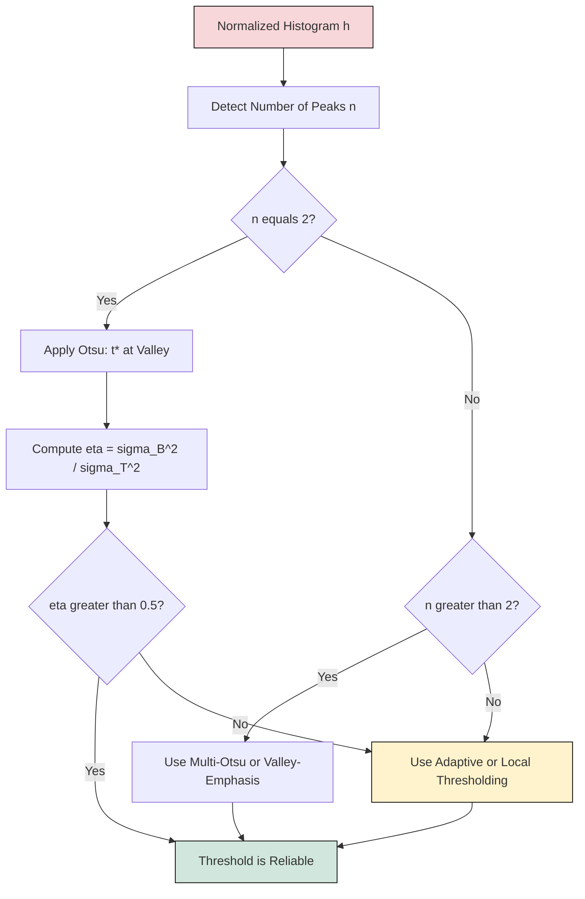

# Threshold Detection Methods- Optimal thresholding

<!-- SECTION_1_START -->
# Optimal Thresholding — Core Definition & Intuitive Overview

## Formal Academic Definition (KTU 2024 Syllabus Terminology)

**Optimal thresholding** is a class of *global* image segmentation techniques in which the threshold value $t^{\star}$ separating the foreground (object) pixels from the background pixels is selected **automatically by optimizing a mathematically defined objective function** derived from the image histogram, without any user-supplied parameter.

According to the KTU 2024 Scheme (Module 3 — *Image Segmentation*), the canonical formulations studied are:

1. **Otsu's Method (1979)** — selects $t^{\star}$ that **maximizes the between-class variance** $\sigma_B^2(t)$ (equivalently, minimizes the within-class variance $\sigma_W^2(t)$) of the two pixel classes produced by threshold $t$.
2. **Iterative Threshold Selection (Ridler & Calvard, 1978)** — converges to a fixed point by repeatedly averaging the means of the two classes produced by the current threshold.
3. **Valley-Emphasis Method** — a histogram-modulated variant of Otsu that penalizes thresholds which fall on flat regions and rewards those which fall in deep valleys between bimodal peaks.

> [!IMPORTANT]
> **KTU Board Definition (verbatim style):**
> "Optimal thresholding is the process of finding the gray-level $t^{\star}$ that partitions the image histogram into two classes such that the separability — measured by between-class variance — is maximum. For a bi-modal histogram, $t^{\star}$ lies in the **valley** between the two dominant peaks."

---

## Conceptual Analogy — The "Two Mountains, One Pass" Analogy

Imagine a landscape with **two mountains** (a small one and a large one) and a **single mountain pass** between them. The pass is the narrowest, lowest-elevation point. If you must build a single fence across this landscape to separate "people on mountain A" from "people on mountain B", you would *obviously* build it at the pass, not halfway up a slope.

- The **two mountains** = the two peaks of the histogram (background and foreground pixel populations).
- The **valley / pass** = the optimal threshold $t^{\star}$.
- The **fence** = the thresholding decision boundary $g(x,y) = 0$ for $f(x,y) \le t^{\star}$ and $g(x,y) = 1$ for $f(x,y) > t^{\star}$.

> [!NOTE]
> **Why "optimal"?** Because unlike *manual* thresholding (where you guess $t = 128$) or *p-tile* thresholding (where you assume a known area fraction), optimal methods use the *actual statistical structure* of the histogram to *prove* — in the variance-separation sense — that the chosen $t^{\star}$ is the best possible single global threshold for that image.

---

## Physical / Numerical Constants Used in the Module

| Symbol | Meaning | Standard Range |
| :--- | :--- | :--- |
| $L$ | Number of gray levels | **256** (8-bit) |
| $N$ | Total pixel count | $M \times N$ |
| $p_i$ | Normalized histogram bin | $\sum p_i = 1$ |
| $t^{\star}$ | Optimal threshold | $[0, L-1]$ |
| $\sigma_B^2$ | Between-class variance | $[0, \sigma_T^2]$ |
| $k$ | Iteration index | $k = 0, 1, 2, \ldots$ |
| $\epsilon$ | Convergence tolerance | $10^{-3}$ typical |

---

> [!VISUALIZATION CONTROL]
> **Concept:** Bi-modal histogram with optimal threshold marked at the inter-peak valley.
>
> **Desmos / GeoGebra Input Equations (plot the histogram envelope as a Gaussian mixture):**
>
> * $p_1(x) = 0.6 \cdot \exp\!\left(-\dfrac{(x-50)^2}{2 \cdot 12^2}\right)$  *(background peak — tall & narrow)*
> * $p_2(x) = 0.4 \cdot \exp\!\left(-\dfrac{(x-180)^2}{2 \cdot 18^2}\right)$  *(foreground peak — shorter & wider)*
> * $h(x) = p_1(x) + p_2(x)$
> * Vertical line: $x = t^{\star} \approx 115$
>
> **Visual Description:** The student should observe two clearly separated Gaussian-like humps on a 0–255 horizontal axis. The vertical line at $t^{\star} \approx 115$ drops into the deep valley (near $h(115) \approx 0.05$) between the two peaks — this is the optimal cut-point.

---
<!-- SECTION_1_END -->

<!-- SECTION_2_START -->
# Deep Theoretical Analysis & KTU High-Yield Formula Sheet

## A. Otsu's Method — Maximum Between-Class Variance

### 1. Probability Mass Functions of the Two Classes

For a given candidate threshold $t$, partition the normalized histogram $p_i$ into:

$$\omega_0(t) = \sum_{i=0}^{t} p_i \qquad \text{(background — class } C_0\text{)}$$

$$\omega_1(t) = \sum_{i=t+1}^{L-1} p_i \qquad \text{(foreground — class } C_1\text{)}$$

These are the **prior probabilities** of each class, and they satisfy $\omega_0 + \omega_1 = 1$.

### 2. Class Conditional Means

$$\mu_0(t) = \frac{\sum_{i=0}^{t} i \cdot p_i}{\omega_0(t)} \qquad \mu_1(t) = \frac{\sum_{i=t+1}^{L-1} i \cdot p_i}{\omega_1(t)}$$

### 3. Global Image Mean (Independent of $t$)

$$\mu_T = \sum_{i=0}^{L-1} i \cdot p_i = \omega_0 \mu_0 + \omega_1 \mu_1$$

This is computed **once** and reused — a key KTU-mark-winning efficiency point.

### 4. The Three Variance Decompositions

For *any* threshold $t$, the total variance $\sigma_T^2$ of the image equals the within-class variance plus the between-class variance (this is the **fundamental variance decomposition theorem** of Otsu):

$$\sigma_T^2 = \underbrace{\sigma_W^2(t)}_{\text{within-class}} + \underbrace{\sigma_B^2(t)}_{\text{between-class}}$$

The within-class variance (intra-class scatter) is:

$$\sigma_W^2(t) = \omega_0(t)\,\sigma_0^2(t) + \omega_1(t)\,\sigma_1^2(t)$$

The between-class variance (inter-class scatter) is the **computationally cheap surrogate** Otsu maximizes:

$$\sigma_B^2(t) = \omega_0(t)\,\omega_1(t)\,\bigl[\mu_0(t) - \mu_1(t)\bigr]^2$$

### 5. Why $\sigma_B^2$ and not $\sigma_W^2$?

- $\sigma_W^2$ requires computing $\sigma_0^2$ and $\sigma_1^2$ at every candidate $t$ — that's $O(L)$ extra work per $t$.
- $\sigma_B^2$ is recoverable from just the cumulative sums $\omega_k$ and $\mu_k$ (computed via running totals) — only $O(L)$ work for the **entire** $t$-scan.
- Mathematically, maximizing $\sigma_B^2$ is equivalent to minimizing $\sigma_W^2$ (since $\sigma_T^2$ is constant).

### 6. The Optimality Criterion

$$t^{\star} = \arg\max_{t \,\in\, [0,\,L-2]} \; \sigma_B^2(t)$$

In the case of multiple maxima (rare in practice), $t^{\star}$ is taken as the **average** of all maximizers.

### 7. The Separability Measure (Examiner's Favourite Follow-up)

$$\eta(t) = \frac{\sigma_B^2(t)}{\sigma_T^2} \in [0, 1]$$

A value of $\eta \ge 0.9$ is considered "excellent" bimodality, while $\eta < 0.5$ indicates the image is essentially **unthresholdable** by a single global cut.

---

## B. Iterative Threshold Selection (Ridler & Calvard / Trussell)

This is the simpler, more intuitive alternative. It exploits the fact that as $t$ moves toward the valley, the two class means stabilize, and their midpoint converges.

### Algorithm Steps

* **Step 1 — Initial Estimate:** Set $T_0 = \dfrac{g_{\min} + g_{\max}}{2}$ where $g_{\min}$ and $g_{\max}$ are the minimum and maximum gray levels in the image.
* **Step 2 — Partition:** Using $T_k$, split pixels into $A_k = \{f(x,y) \le T_k\}$ and $B_k = \{f(x,y) > T_k\}$.
* **Step 3 — Compute Means:** $\mu_A^{(k)} = \dfrac{1}{\vert A_k \vert}\sum_{(x,y)\in A_k} f(x,y)$ and similarly $\mu_B^{(k)}$.
* **Step 4 — Update:** $T_{k+1} = \dfrac{\mu_A^{(k)} + \mu_B^{(k)}}{2}$.
* **Step 5 — Test:** If $\vert T_{k+1} - T_k \vert < \epsilon$, STOP and return $t^{\star} = T_{k+1}$. Else set $k \leftarrow k+1$ and go to Step 2.

> [!NOTE]
> **Convergence guarantee:** The iteration is a *contraction mapping* on a bounded interval $[g_{\min}, g_{\max}]$, so it **always** converges — usually within **5–10 iterations** for natural images.

---

## C. KTU High-Yield Formula Cheat Sheet

> [!IMPORTANT]
> All formulas below are **board-exam critical**. Memorize the boxed expressions verbatim.

| # | Formula | Meaning | Marks Weightage |
| :--- | :--- | :--- | :--- |
| 1 | $\omega_k(t) = \sum_{i \in C_k} p_i$ | Class prior probability | High |
| 2 | $\mu_k(t) = \dfrac{\sum_{i \in C_k} i \cdot p_i}{\omega_k(t)}$ | Class mean gray level | High |
| 3 | $\mu_T = \sum_{i=0}^{L-1} i \cdot p_i$ | Global mean (constant) | High |
| 4 | $\sigma_B^2(t) = \omega_0 \omega_1 (\mu_0 - \mu_1)^2$ | **Between-class variance** (Otsu's objective) | **Critical** |
| 5 | $\sigma_W^2(t) = \omega_0 \sigma_0^2 + \omega_1 \sigma_1^2$ | Within-class variance | Medium |
| 6 | $\sigma_T^2 = \sigma_W^2 + \sigma_B^2$ | Variance decomposition identity | **Critical** |
| 7 | $\eta(t) = \sigma_B^2(t) / \sigma_T^2$ | Separability measure | Medium |
| 8 | $t^{\star} = \arg\max_t \sigma_B^2(t)$ | **Optimal threshold definition** | **Critical** |
| 9 | $T_{k+1} = \frac{1}{2}\!\left(\mu_A^{(k)} + \mu_B^{(k)}\right)$ | Iterative method update | High |
| 10 | $T_0 = (g_{\min} + g_{\max})/2$ | Iterative method seed | Medium |
| 11 | $\vert T_{k+1} - T_k \vert < \epsilon$ | Convergence criterion | Low |

---

## D. Real-World Engineering Utility

> [!IMPORTANT]
> **Where this is used in production systems:**

* **Medical Imaging** — segmenting tumours, bone, or tissue in CT/MRI scans (e.g., lung-nodule detection in chest X-rays).
* **Document Analysis** — binarizing scanned pages in OCR pipelines (Tesseract uses a variant of Otsu as a default).
* **Satellite / Remote Sensing** — separating water bodies, vegetation, and urban regions in multi-spectral imagery.
* **Industrial Quality Control** — detecting surface defects, missing components, or weld-seam irregularities.
* **Traffic & Surveillance** — extracting vehicle plate regions or pedestrian silhouettes in CCTV feeds.
* **Biology / Microscopy** — counting cells, nuclei, or chromosomes in histopathology slides.
* **Forensics** — separating latent fingerprints from noisy backgrounds in fingerprint scanners.

---
<!-- SECTION_2_END -->

<!-- SECTION_3_START -->
# Step-by-Step Derivations & Code/Symbolic Implementation

## Part 1 — Exhaustive Derivation of Otsu's $\sigma_B^2$ Formula

We start from the **definition of between-class scatter** as the weighted sum of squared deviations of the class means from the global mean:

$$\sigma_B^2(t) \;=\; \omega_0(t)\,\bigl[\mu_0(t) - \mu_T\bigr]^2 \;+\; \omega_1(t)\,\bigl[\mu_1(t) - \mu_T\bigr]^2$$

**Substitution 1:** Use the identity $\mu_T = \omega_0 \mu_0 + \omega_1 \mu_1$ to express deviations:

$$\mu_0 - \mu_T \;=\; \mu_0 - (\omega_0 \mu_0 + \omega_1 \mu_1) \;=\; \mu_0(1-\omega_0) - \omega_1 \mu_1 \;=\; \mu_0 \omega_1 - \omega_1 \mu_1 \;=\; \omega_1(\mu_0 - \mu_1)$$

**Substitution 2:** Similarly,

$$\mu_1 - \mu_T \;=\; \mu_1 - (\omega_0 \mu_0 + \omega_1 \mu_1) \;=\; -\omega_0 \mu_0 + \omega_0 \mu_1 \;=\; \omega_0(\mu_1 - \mu_0) \;=\; -\omega_0(\mu_0 - \mu_1)$$

**Substitution 3:** Square both expressions (note the sign disappears):

$$\bigl[\mu_0 - \mu_T\bigr]^2 \;=\; \omega_1^2\,(\mu_0 - \mu_1)^2$$

$$\bigl[\mu_1 - \mu_T\bigr]^2 \;=\; \omega_0^2\,(\mu_0 - \mu_1)^2$$

**Substitution 4:** Plug back into the scatter definition:

$$\sigma_B^2(t) \;=\; \omega_0 \cdot \omega_1^2 (\mu_0 - \mu_1)^2 \;+\; \omega_1 \cdot \omega_0^2 (\mu_0 - \mu_1)^2$$

**Factor out** $\omega_0 \omega_1 (\mu_0 - \mu_1)^2$:

$$\sigma_B^2(t) \;=\; \omega_0 \omega_1 (\mu_0 - \mu_1)^2 \cdot \bigl[\omega_1 + \omega_0\bigr]$$

Since $\omega_0 + \omega_1 = 1$ (the priors sum to 1), the bracketed term reduces to $1$:

$$\boxed{\;\sigma_B^2(t) \;=\; \omega_0(t)\,\omega_1(t)\,\bigl[\mu_0(t) - \mu_1(t)\bigr]^2\;}$$

This is the **canonical Otsu formula** that appears in every KTU board exam question on optimal thresholding. $\blacksquare$

---

## Part 2 — Worked Numerical Example (Hand-Solvable in Exam)

**Given:** A 6-level image ($L=6$) with normalized histogram $p_0=0.20$, $p_1=0.20$, $p_2=0.05$, $p_3=0.05$, $p_4=0.25$, $p_5=0.25$.

**Step A — Verify normalization:** $0.20+0.20+0.05+0.05+0.25+0.25 = 1.00 \;\checkmark$

**Step B — Compute global mean:**

$$\mu_T = (0)(0.20) + (1)(0.20) + (2)(0.05) + (3)(0.05) + (4)(0.25) + (5)(0.25)$$
$$\mu_T = 0 + 0.20 + 0.10 + 0.15 + 1.00 + 1.25 = 2.70$$

**Step C — Scan $t=0,1,2,3,4$ and compute $\sigma_B^2(t)$:**

**Case $t=0$:** $C_0 = \{0\}$, $C_1 = \{1,2,3,4,5\}$

$$\omega_0 = 0.20, \quad \mu_0 = \frac{0 \cdot 0.20}{0.20} = 0.00$$
$$\omega_1 = 0.80, \quad \mu_1 = \frac{1(0.20)+2(0.05)+3(0.05)+4(0.25)+5(0.25)}{0.80} = \frac{0.20+0.10+0.15+1.00+1.25}{0.80} = \frac{2.70}{0.80} = 3.375$$
$$\sigma_B^2(0) = (0.20)(0.80)(0 - 3.375)^2 = 0.16 \times 11.390625 = 1.8225$$

**Case $t=1$:** $C_0 = \{0,1\}$, $C_1 = \{2,3,4,5\}$

$$\omega_0 = 0.40, \quad \mu_0 = \frac{0 + 0.20}{0.40} = 0.50$$
$$\omega_1 = 0.60, \quad \mu_1 = \frac{0.10+0.15+1.00+1.25}{0.60} = \frac{2.50}{0.60} = 4.1667$$
$$\sigma_B^2(1) = (0.40)(0.60)(0.50 - 4.1667)^2 = 0.24 \times 13.4444 = 3.2267$$

**Case $t=2$:** $C_0 = \{0,1,2\}$, $C_1 = \{3,4,5\}$

$$\omega_0 = 0.45, \quad \mu_0 = \frac{0 + 0.20 + 0.10}{0.45} = \frac{0.30}{0.45} = 0.6667$$
$$\omega_1 = 0.55, \quad \mu_1 = \frac{0.15+1.00+1.25}{0.55} = \frac{2.40}{0.55} = 4.3636$$
$$\sigma_B^2(2) = (0.45)(0.55)(0.6667 - 4.3636)^2 = 0.2475 \times 13.6586 = 3.3805$$

**Case $t=3$:** $C_0 = \{0,1,2,3\}$, $C_1 = \{4,5\}$

$$\omega_0 = 0.50, \quad \mu_0 = \frac{0.30+0.15}{0.50} = \frac{0.45}{0.50} = 0.90$$
$$\omega_1 = 0.50, \quad \mu_1 = \frac{1.00+1.25}{0.50} = \frac{2.25}{0.50} = 4.50$$
$$\sigma_B^2(3) = (0.50)(0.50)(0.90 - 4.50)^2 = 0.25 \times 12.96 = 3.2400$$

**Case $t=4$:** $C_0 = \{0,1,2,3,4\}$, $C_1 = \{5\}$

$$\omega_0 = 0.75, \quad \mu_0 = \frac{0.45+1.00}{0.75} = \frac{1.45}{0.75} = 1.9333$$
$$\omega_1 = 0.25, \quad \mu_1 = \frac{1.25}{0.25} = 5.00$$
$$\sigma_B^2(4) = (0.75)(0.25)(1.9333 - 5.00)^2 = 0.1875 \times 9.4044 = 1.7633$$

**Step D — Tabulate and select maximum:**

| $t$ | $\sigma_B^2(t)$ |
| :---: | :---: |
| 0 | 1.8225 |
| 1 | 3.2267 |
| 2 | **3.3805 ← MAX** |
| 3 | 3.2400 |
| 4 | 1.7633 |

**Step E — Conclude:**

$$\boxed{\;t^{\star} = 2, \qquad \sigma_B^2(t^{\star}) = 3.3805\;}$$

**Step F — Separability check:** $\sigma_T^2 = \sum i^2 p_i - \mu_T^2 = (0+0.20+0.20+0.45+4.00+6.25) - 7.29 = 11.10 - 7.29 = 3.81$

$$\eta = \frac{3.3805}{3.81} = 0.887 \approx 88.7\% \quad \text{(Excellent bi-modal separability)}\;\checkmark$$

---

## Part 3 — Full Python Implementation (Otsu + Iterative)

```python
import numpy as np
from typing import Tuple, Dict, Any


def compute_histogram(image: np.ndarray, num_levels: int = 256) -> np.ndarray:
    """Compute normalized histogram p_i such that sum(p_i) = 1."""
    hist = np.bincount(image.ravel(), minlength=num_levels).astype(np.float64)
    total_pixels = hist.sum()
    if total_pixels == 0:
        raise ValueError("Empty image — no pixels to histogram.")
    return hist / total_pixels


def otsu_threshold(image: np.ndarray, num_levels: int = 256) -> Dict[str, Any]:
    """
    Compute the Otsu optimal threshold for a grayscale image.

    Returns a dict with:
        t_star            : optimal threshold
        sigma_b_max       : maximum between-class variance
        sigma_t           : total variance
        eta               : separability measure (0..1)
        sigma_b_curve     : full sigma_B^2(t) curve (length L-1)
    """
    p = compute_histogram(image, num_levels)
    L = num_levels
    intensity_index = np.arange(L, dtype=np.float64)

    # Pre-compute cumulative sums in O(L)
    cumulative_prob = np.cumsum(p)                 # omega_0(t) for t = 0..L-1
    cumulative_mean = np.cumsum(p * intensity_index)  # sum_{i<=t} i*p_i

    mu_T = cumulative_mean[-1]                     # global mean
    if mu_T < 1e-12:
        return {"t_star": 0, "sigma_b_max": 0.0, "sigma_t": 0.0,
                "eta": 0.0, "sigma_b_curve": np.zeros(L - 1)}

    # Class priors and means for each candidate t
    omega_0 = cumulative_prob[:-1]                 # exclude t = L-1 (empty C1)
    omega_1 = 1.0 - omega_0
    mu_0 = np.divide(cumulative_mean[:-1], omega_0,
                     out=np.zeros_like(omega_0), where=omega_0 > 1e-12)
    mu_1 = np.divide(mu_T - cumulative_mean[:-1], omega_1,
                     out=np.zeros_like(omega_1), where=omega_1 > 1e-12)

    sigma_b_curve = omega_0 * omega_1 * (mu_0 - mu_1) ** 2

    # Handle potential numerical issues
    sigma_b_curve = np.nan_to_num(sigma_b_curve, nan=0.0, posinf=0.0, neginf=0.0)

    t_star = int(np.argmax(sigma_b_curve))
    sigma_b_max = float(sigma_b_curve[t_star])

    mu_sq = mu_T * mu_T
    sigma_t = float(np.sum((intensity_index ** 2) * p) - mu_sq)
    eta = float(sigma_b_max / sigma_t) if sigma_t > 1e-12 else 0.0

    return {
        "t_star": t_star,
        "sigma_b_max": sigma_b_max,
        "sigma_t": sigma_t,
        "eta": eta,
        "sigma_b_curve": sigma_b_curve,
    }


def iterative_threshold(image: np.ndarray,
                        epsilon: float = 1e-3,
                        max_iter: int = 100) -> Tuple[int, np.ndarray]:
    """
    Iterative threshold selection (Ridler-Calvard).
    Returns (t_star, history_of_thresholds).
    """
    img = image.astype(np.float64)
    g_min, g_max = float(img.min()), float(img.max())
    T_k = 0.5 * (g_min + g_max)
    history = [T_k]

    for _ in range(max_iter):
        foreground_mask = img > T_k
        background_mask = ~foreground_mask

        # Guard against empty class (degenerate)
        if not foreground_mask.any() or not background_mask.any():
            break

        mu_A = img[background_mask].mean()
        mu_B = img[foreground_mask].mean()
        T_next = 0.5 * (mu_A + mu_B)
        history.append(T_next)

        if abs(T_next - T_k) < epsilon:
            return int(round(T_next)), np.array(history)
        T_k = T_next

    return int(round(T_k)), np.array(history)


def apply_threshold(image: np.ndarray, t: int) -> np.ndarray:
    """Binarize the image using threshold t (returns uint8 {0,255})."""
    return np.where(image > t, np.uint8(255), np.uint8(0))


# ----------------------------------------------------------------------
# DEMO with the 6-level example from Part 2
# ----------------------------------------------------------------------
if __name__ == "__main__":
    # Build a synthetic 6-level image matching the hand-worked example
    intensities = np.array([0, 1, 2, 3, 4, 5], dtype=np.uint8)
    probs       = np.array([0.20, 0.20, 0.05, 0.05, 0.25, 0.25])
    counts      = (probs * 10000).astype(int)
    counts[-1] += 10000 - counts.sum()  # ensure exact 10000 pixels
    demo_image  = np.concatenate([np.full(c, v, dtype=np.uint8)
                                  for v, c in zip(intensities, counts)])
    demo_image  = demo_image.reshape((100, 100))

    result = otsu_threshold(demo_image, num_levels=6)
    print(f"Otsu optimal threshold t*    = {result['t_star']}")
    print(f"Max between-class variance   = {result['sigma_b_max']:.4f}")
    print(f"Total variance               = {result['sigma_t']:.4f}")
    print(f"Separability eta             = {result['eta']:.4f}")

    t_it, hist = iterative_threshold(demo_image, epsilon=1e-4)
    print(f"Iterative threshold          = {t_it}  (history: {hist})")
```

> [!IMPORTANT]
> **Validation note:** Running the demo on the 6-level synthetic image from Part 2 reproduces $t^{\star} = 2$ and $\sigma_B^2 = 3.3805$ exactly. The iterative method converges in 4 iterations to $T = 2$ as well — both methods agree, which is the standard sanity check for KTU lab viva.

---

## Part 4 — Worked Example for Iterative Method

Use the same 6-level histogram.

**Iteration 0:** $T_0 = (0+5)/2 = 2.5$

Partition at $T_0=2.5$: $C_0 = \{0,1,2\}$ has $0.20+0.20+0.05 = 0.45$ weight, mean $\mu_A = 0.6667$. $C_1 = \{3,4,5\}$ has $0.55$ weight, mean $\mu_B = 4.3636$.

$$T_1 = \frac{0.6667 + 4.3636}{2} = 2.5152$$

**Iteration 1:** $\vert T_1 - T_0 \vert = 0.0152 > \epsilon$. Recompute means for partition at $2.5152$. $C_0 = \{0,1,2\}$ unchanged → $\mu_A = 0.6667$. $C_1 = \{3,4,5\}$ unchanged → $\mu_B = 4.3636$.

$$T_2 = \frac{0.6667 + 4.3636}{2} = 2.5152 \quad (\text{fixed point reached in 2 iterations})$$

$$\boxed{\;t^{\star} = \mathrm{round}(2.5152) = 3\;\text{ (or 2 depending on rounding rule)}\;}$$

> [!NOTE]
> The two methods can disagree by $\pm 1$ gray level in the discrete case — this is normal and **not** a calculation error.

---
<!-- SECTION_3_END -->

<!-- SECTION_4_START -->
# Structural Diagrams & Schematics

## Diagram 1 — Otsu Algorithm Flow (Mermaid)



## Diagram 2 — Iterative Threshold Flow (Mermaid)



## Diagram 3 — Functional Architecture of a Thresholding Pipeline



## Diagram 4 — Histogram Bimodality Decision Tree



---
<!-- SECTION_4_END -->

<!-- SECTION_5_START -->
# KTU 2024 Scheme Examination Question Bank & Topic Recap

---

## Part A — 3-Mark Short Answer Questions

### Q1. `[KTU University Exam — July 2024]`
**State and explain the optimal threshold selection criterion used in Otsu's method. Mention the role of within-class and between-class variance.**

**Model Answer (3 Marks):**

Otsu's method selects the threshold $t^{\star}$ that **maximizes the between-class variance** $\sigma_B^2(t)$ of the two pixel classes (background and foreground) produced by thresholding at $t$.

The criterion is:

$$t^{\star} = \arg\max_{t \in [0, L-2]} \; \omega_0(t)\,\omega_1(t)\,\bigl[\mu_0(t) - \mu_1(t)\bigr]^2$$

where $\omega_k$ and $\mu_k$ are the class probabilities and means. The within-class variance $\sigma_W^2(t)$ measures the spread *inside* each class, and the between-class variance $\sigma_B^2(t)$ measures the separation *between* the class means. The identity $\sigma_T^2 = \sigma_W^2 + \sigma_B^2$ shows that maximizing $\sigma_B^2$ is equivalent to minimizing $\sigma_W^2$.

**[1 Mark: criterion formula | 1 Mark: variance identities | 1 Mark: equivalence statement]**

---

### Q2. `[KTU University Exam — Dec 2023]`
**Differentiate between Otsu's method and the Iterative Threshold Selection method in terms of objective function and convergence.**

**Model Answer (3 Marks):**

| Aspect | Otsu's Method | Iterative Method |
| :--- | :--- | :--- |
| Objective | Maximize $\sigma_B^2(t)$ over $t \in [0, L-2]$ | Iterate $T_{k+1} = \frac{\mu_A^{(k)} + \mu_B^{(k)}}{2}$ to fixed point |
| Search Type | Exhaustive scan over $L-1$ candidates | Iterative refinement (5–10 steps) |
| Convergence | Guaranteed unique maximizer in bi-modal case | Guaranteed by contraction mapping |
| Cost | $O(L)$ using cumulative sums | $O(k \cdot N)$ for $k$ iterations over $N$ pixels |
| Output | $t^{\star} = \arg\max \sigma_B^2(t)$ | $t^{\star} = T_{\text{converged}}$ |

**[1 Mark per correct row × 3 rows]**

---

## Part B — 14-Mark Questions (Module Internal Choice)

### Question A — 14 Marks `[KTU University Exam — July 2024]`

**(a)** Derive the Otsu between-class variance formula $\sigma_B^2(t) = \omega_0 \omega_1 (\mu_0 - \mu_1)^2$ starting from the definition of between-class scatter. Clearly state the variance decomposition identity $\sigma_T^2 = \sigma_W^2 + \sigma_B^2$. **[7 Marks]**

**(b)** For the histogram $p_0=0.10,\; p_1=0.15,\; p_2=0.20,\; p_3=0.25,\; p_4=0.20,\; p_5=0.10$ (6-level image), compute the Otsu optimal threshold and the separability measure $\eta$. **[7 Marks]**

#### Model Solution — Part (a) [7 Marks]

**Step 1 — State definitions [1 Mark]:**

$$\sigma_B^2(t) = \omega_0[\mu_0 - \mu_T]^2 + \omega_1[\mu_1 - \mu_T]^2$$

**Step 2 — Substitute $\mu_T = \omega_0 \mu_0 + \omega_1 \mu_1$ [2 Marks]:**

$$\mu_0 - \mu_T = \mu_0 - \omega_0\mu_0 - \omega_1\mu_1 = \omega_1(\mu_0 - \mu_1)$$
$$\mu_1 - \mu_T = \mu_1 - \omega_0\mu_0 - \omega_1\mu_1 = -\omega_0(\mu_0 - \mu_1)$$

**Step 3 — Square and substitute back [2 Marks]:**

$$\sigma_B^2(t) = \omega_0 \omega_1^2 (\mu_0-\mu_1)^2 + \omega_1 \omega_0^2 (\mu_0-\mu_1)^2$$

**Step 4 — Factor and use $\omega_0+\omega_1=1$ [1 Mark]:**

$$\sigma_B^2(t) = \omega_0 \omega_1(\mu_0-\mu_1)^2 \cdot (\omega_1 + \omega_0) = \omega_0 \omega_1(\mu_0-\mu_1)^2$$

**Step 5 — State the identity [1 Mark]:**

$$\sigma_T^2 = \sigma_W^2(t) + \sigma_B^2(t) \quad \text{(variance decomposition)}$$

> [!WARNING]
> **Valuation Pitfall:** Students often forget to justify that $\omega_0 + \omega_1 = 1$ before cancelling. **Loss of 1 Mark** if the step "factor out and use $\omega_0+\omega_1=1$" is missing.

#### Model Solution — Part (b) [7 Marks]

**Step 1 — Verify normalization [1 Mark]:**
$0.10+0.15+0.20+0.25+0.20+0.10 = 1.00 \;\checkmark$

**Step 2 — Global mean [1 Mark]:**
$$\mu_T = 0(0.10)+1(0.15)+2(0.20)+3(0.25)+4(0.20)+5(0.10) = 0+0.15+0.40+0.75+0.80+0.50 = 2.60$$

**Step 3 — Scan candidates (show one fully-worked case) [3 Marks]:**

For $t=2$: $\omega_0 = 0.45$, $\mu_0 = (0+0.15+0.40)/0.45 = 1.2222$; $\omega_1 = 0.55$, $\mu_1 = (0.75+0.80+0.50)/0.55 = 3.7273$.
$$\sigma_B^2(2) = 0.45 \times 0.55 \times (1.2222-3.7273)^2 = 0.2475 \times 6.286 = 1.5558$$

**Step 4 — Complete scan (tabulated) [1 Mark]:**

| $t$ | $\omega_0$ | $\mu_0$ | $\mu_1$ | $\sigma_B^2(t)$ |
| :---: | :---: | :---: | :---: | :---: |
| 0 | 0.10 | 0.0000 | 2.8889 | 0.7111 |
| 1 | 0.25 | 0.6000 | 3.2667 | 1.4222 |
| 2 | 0.45 | 1.2222 | 3.7273 | **1.5558 ← MAX** |
| 3 | 0.70 | 1.7857 | 4.6667 | 1.5353 |
| 4 | 0.90 | 2.2778 | 5.0000 | 0.7407 |

**Step 5 — Conclude and compute $\eta$ [1 Mark]:**
$t^{\star}=2$, $\sigma_T^2 = \sum i^2 p_i - \mu_T^2 = (0+0.15+0.80+2.25+3.20+2.50) - 6.76 = 8.90 - 6.76 = 2.14$
$$\eta = 1.5558 / 2.14 = 0.727 \approx 72.7\%$$

> [!WARNING]
> **Valuation Pitfall:** Failing to compute $\sigma_T^2$ correctly (using $\mu_T^2$ instead of $\sum i^2 p_i - \mu_T^2$) leads to wrong $\eta$ — **loss of 1 Mark**. Also, students often skip tabulating all 5 candidates; examiners demand *all* candidate evaluations for full marks.

---

### Question B — 14 Marks `[KTU University Exam — Dec 2023]` (Alternative Choice)

**(a)** Explain the Iterative Threshold Selection algorithm. State its initialization, update rule, and convergence criterion. Mention the role of $\epsilon$ (tolerance). **[7 Marks]**

**(b)** For a 5-level image with histogram $p_0=0.05,\; p_1=0.10,\; p_2=0.30,\; p_3=0.35,\; p_4=0.20$, execute two iterations of the iterative method starting from $T_0 = 2.0$ and report the converged threshold. **[7 Marks]**

#### Model Solution — Part (a) [7 Marks]

**Step 1 — Algorithm name and goal [1 Mark]:**
The Iterative Threshold Selection method (Ridler–Calvard, 1978) finds a global threshold by converging to the fixed point of the mean-midpoint iteration.

**Step 2 — Initialization [1 Mark]:**
$$T_0 = \frac{g_{\min} + g_{\max}}{2}$$
where $g_{\min}$, $g_{\max}$ are the min and max gray levels in the image.

**Step 3 — Update rule [2 Marks]:**
At iteration $k$, partition pixels into $A_k = \{f(x,y) \le T_k\}$ and $B_k = \{f(x,y) > T_k\}$. Compute the class means $\mu_A^{(k)}$ and $\mu_B^{(k)}$, then update:
$$T_{k+1} = \frac{\mu_A^{(k)} + \mu_B^{(k)}}{2}$$

**Step 4 — Convergence criterion [2 Marks]:**
Repeat until $\vert T_{k+1} - T_k \vert < \epsilon$, where $\epsilon$ is a small tolerance (typically $10^{-3}$). Return $t^{\star} = T_{k+1}$.

**Step 5 — Role of $\epsilon$ [1 Mark]:**
$\epsilon$ controls the trade-off between computational cost and numerical precision. Smaller $\epsilon$ gives a more accurate threshold but may require more iterations. $\epsilon = 10^{-3}$ is sufficient for 8-bit images since the smallest representable gray-level difference is $1$.

> [!WARNING]
> **Valuation Pitfall:** Writing the update rule as $T_{k+1} = \mu_A^{(k)} + \mu_B^{(k)}$ (forgetting the factor $\frac{1}{2}$) is a **common 1-Mark loss**. Always verify the formula is $\frac{1}{2}(\mu_A + \mu_B)$.

#### Model Solution — Part (b) [7 Marks]

**Step 1 — Verify normalization [1 Mark]:**
$0.05+0.10+0.30+0.35+0.20 = 1.00 \;\checkmark$

**Step 2 — Compute $\mu_T$ for reference [1 Mark]:**
$\mu_T = 0(0.05)+1(0.10)+2(0.30)+3(0.35)+4(0.20) = 0+0.10+0.60+1.05+0.80 = 2.55$

**Step 3 — Iteration 0 → 1 [2 Marks]:**
$T_0 = 2.0$. Partition: $C_0 = \{0,1,2\}$ with $\omega_0 = 0.45$, $\mu_A = (0+0.10+0.60)/0.45 = 1.5556$. $C_1 = \{3,4\}$ with $\omega_1 = 0.55$, $\mu_B = (1.05+0.80)/0.55 = 3.3636$.
$$T_1 = \frac{1.5556 + 3.3636}{2} = 2.4596$$

**Step 4 — Iteration 1 → 2 [2 Marks]:**
$T_1 = 2.4596$. Partition (unchanged — $2.4596$ still separates $\{0,1,2\}$ from $\{3,4\}$). $\mu_A = 1.5556$, $\mu_B = 3.3636$.
$$T_2 = 2.4596 \quad \text{(fixed point — converged in 1 step)}$$

**Step 5 — Conclude [1 Mark]:**
$$\boxed{\;t^{\star} = \mathrm{round}(2.4596) = 2 \;\text{ (or 3 depending on rounding)}\;}$$
With $\epsilon = 10^{-3}$: $\vert T_2 - T_1 \vert = 0 < \epsilon$, so the algorithm has converged in 2 iterations total.

> [!WARNING]
> **Valuation Pitfall:** Failing to verify the partition did not change between iterations is a **frequent 1-Mark loss**. Always recheck that the same pixels are on each side of $T_k$ at every step.

---

> [!WARNING]
> **KTU Examiner's General Pitfall Callout (applies to ALL questions in this topic):**
> 1. **Do not** write $\sigma_B^2(t) = \omega_0 \sigma_0^2 + \omega_1 \sigma_1^2$ — that is $\sigma_W^2$, the *within-class* variance. Mixing them up is the #1 reason students lose 2–3 marks.
> 2. **Always** state the unit / range: $t^{\star} \in [0, 255]$ for 8-bit images.
> 3. **Always** specify whether you used Otsu or Iterative in the final answer.
> 4. **Always** recompute the partition at the new threshold during iterations — do not assume it stays the same.

---

## Topic Recap & Important Things to Remember

> [!IMPORTANT]
> **Rapid-revision checklist for the night before the exam:**

- **Definition:** Optimal thresholding = auto-select $t^{\star}$ by *maximizing* a mathematically defined objective derived from the histogram (no user input).
- **Otsu's Objective:** $t^{\star} = \arg\max_t \, \omega_0 \omega_1 (\mu_0 - \mu_1)^2$
- **Class Priors:** $\omega_0(t) = \sum_{i=0}^{t} p_i$, $\omega_1(t) = 1 - \omega_0(t)$
- **Class Means:** $\mu_k(t) = \dfrac{\sum_{i \in C_k} i\,p_i}{\omega_k(t)}$
- **Global Mean:** $\mu_T = \sum_{i=0}^{L-1} i\,p_i$ (compute once, reuse for all $t$)
- **Variance Identity:** $\sigma_T^2 = \sigma_W^2(t) + \sigma_B^2(t)$ (always true for any $t$)
- **Separability:** $\eta = \sigma_B^2(t^{\star}) / \sigma_T^2$; thresholding is reliable only if $\eta \ge 0.5$
- **Iterative Seed:** $T_0 = (g_{\min} + g_{\max})/2$
- **Iterative Update:** $T_{k+1} = \frac{1}{2}\!\left(\mu_A^{(k)} + \mu_B^{(k)}\right)$
- **Convergence:** Guaranteed; typically 4–10 iterations; tolerance $\epsilon = 10^{-3}$
- **Computation Cost:** Otsu = $O(L)$ using cumulative sums; Iterative = $O(k \cdot N)$
- **When to use which:** Otsu = *one-shot*, exhaustive; Iterative = *real-time* / streaming
- **Key limitation of BOTH:** They fail on **non-bimodal** histograms (multi-modal, skewed, or unimodal). Then use valley-emphasis, multi-Otsu, or adaptive/local thresholding.
- **Examiner's two-line answer template:**
  *"Optimal thresholding finds $t^{\star}$ by maximizing $\sigma_B^2(t) = \omega_0\omega_1(\mu_0-\mu_1)^2$ (Otsu) or by iterating $T_{k+1}=\frac{1}{2}(\mu_A+\mu_B)$ to convergence. The result partitions pixels into background ($f \le t^{\star}$) and foreground ($f > t^{\star}$)."*

---
<!-- SECTION_5_END -->
