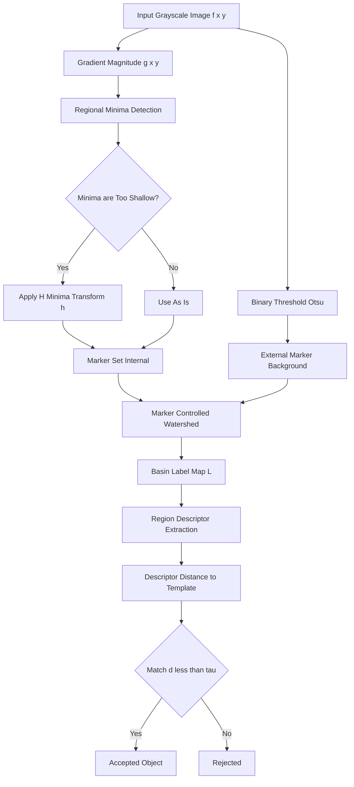
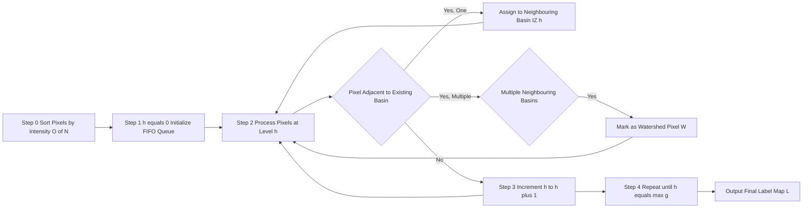
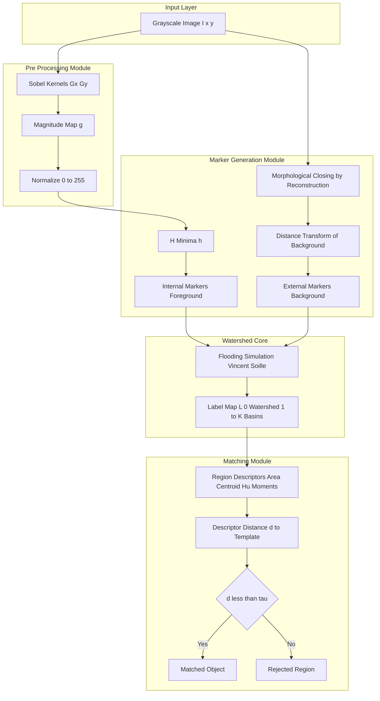

# Watershed segmentation Matching

<!-- SECTION_1_START -->
# Watershed Segmentation & Matching

## 1. Core Technical Definition

> [!NOTE]
> **Watershed Segmentation** is a region-based, mathematical morphology-driven image segmentation technique that treats the gradient magnitude image as a 3-D topographical surface, where bright pixels correspond to ridges (high elevations) and dark pixels correspond to valleys (low elevations). The **watershed lines** are the loci of points that divide the catchment basins, and each basin corresponds to one segmented region.

> [!IMPORTANT]
> **KTU 2024 Syllabus Definition (PECST636 – Module 3):**
> Watershed segmentation matching is the process of partitioning a grayscale image into homogeneous regions by simulating a flooding process on its gradient image, while employing **markers** (internal/external) and **matching criteria** to associate basins with meaningful objects, thereby eliminating over-segmentation and enabling region-based object recognition.

### 1.1 Key Terminology

| Term | Definition |
|---|---|
| **Catchment Basin** | The set of pixels whose path of steepest descent terminates at a regional minimum. |
| **Watershed Line** | The locus of points that separate two adjacent catchment basins. |
| **Marker** | A connected component of pixels used to tag a region of interest (internal marker) or background (external marker). |
| **Marker-Controlled Watershed** | Watershed applied only on pixels belonging to user-defined markers, preventing over-segmentation. |
| **Gradient Image** | A grayscale map $g(x,y)$ where intensity encodes edge strength. |
| **Immersion Simulation** | The Vincent–Soille algorithm: pierce holes at regional minima and slowly submerge the surface. |
| **H-Minima Transform** | Suppresses minima whose depth is less than a threshold $h$. |
| **Region Matching** | Associating a watershed basin with a target model using descriptors (shape, texture, intensity histogram). |

> [!TIP]
> **Conceptual Analogy — The Rain on Mountains Intuition**
> Imagine pouring rain uniformly over a mountainous landscape (the gradient image). Every drop that lands on the terrain flows downhill along the **steepest descent path** until it pools into a local **valley** (regional minimum). The geographic regions drained by each valley are **catchment basins**, and the **mountain ridges** separating them are **watershed lines**. In an image, valleys are dark homogeneous regions and ridges are bright edges — so the watershed gives a natural edge-respecting segmentation.

> [!WARNING]
> **Standard metrics used:** Gradient magnitude is usually normalized to **[0, 255]** for 8-bit images. The **flooding threshold step** $\Delta h$ is typically **1 gray level** (Meyer's algorithm) or **1 immersion level** (Vincent–Soille).

### 1.2 Geometric / Visual Insight

> [!VISUALIZATION CONTROL]
> **Concept:** 1-D Topographical Profile of a Watershed
> **GeoGebra / Desmos Input Equations:**
> * `f(x) = 0.4 * sin(2x) + 0.15 * sin(5x) + 0.5`
> **Visual Description:** The student should observe two local minima (valleys) and a local maximum (ridge) between them. The two minima form the **catchment basins**; the peak between them corresponds to the **watershed line**. Flood the function from below: each valley fills independently, and the meeting point of two expanding water bodies is the watershed.

---

## 2. Mathematical Foundation Overview

The watershed transform requires the gradient image to be computed first, then minima are detected, then the flooding/immersion is simulated:

$$g(x,y) = \sqrt{\left(\frac{\partial f}{\partial x}\right)^{2} + \left(\frac{\partial f}{\partial y}\right)^{2}}$$

Markers are user-defined (or automatic via H-minima) seed regions that the flooding is constrained to start from. **Matching** then associates each basin with a candidate object using region descriptors such as:

$$d_{\text{match}}(B_i, M) = \sqrt{\sum_{k=1}^{K}\left( r_{i,k} - m_{k}\right)^{2}}$$

where $B_i$ is the $i$-th basin, $M$ is the model, and $r_{i,k}$ is the $k$-th region descriptor (area, centroid, moments, Hu-moments, etc.).
<!-- SECTION_1_END -->

<!-- SECTION_2_START -->
# Deep Theoretical Analysis & KTU High-Yield Formula Sheet

## 2.1 The Two Canonical Watershed Algorithms

### 2.1.1 Meyer's Flooding Algorithm (Conceptual)
1. Compute gradient $g(x,y)$.
2. Identify regional minima of $g$.
3. Flood each minimum with water rising uniformly.
4. When two floods meet, build a **dam** (watershed pixel).
5. Continue until water reaches the highest gradient level.

### 2.1.2 Vincent–Soille Immersion Algorithm (Computational)
1. Sort all $N$ pixels of $g$ by ascending intensity in $O(N)$ using **bucket sort** (because intensities are in $\{0,1,\dots,255\}$).
2. Initialize level $h = \min(g)$.
3. For every pixel $p$ at current level $h$:
   * If $p$ is adjacent to an already-labeled basin: assign it to that basin (geodesic influence zone).
   * If $p$ has no labeled neighbor: start a new basin.
   * If $p$ has neighbors in two different basins: mark $p$ as a **watershed** pixel.
4. Increment $h \rightarrow h+1$, repeat until $h = \max(g)$.

> [!NOTE]
> The Vincent–Soille algorithm is the **de-facto industry standard** for watershed segmentation because it runs in **$O(N)$** time, which is optimal for digital images.

## 2.2 Why Direct Watershed Over-segments

Raw watershed on the gradient produces **one basin per local minimum**. A noisy $256\times256$ image can have thousands of spurious minima, causing each real object to be sliced into dozens of fragments. The fix is **marker-controlled watershed segmentation**.

> [!IMPORTANT]
> **KTU Board Exam Favourite:** "Explain why raw watershed produces over-segmentation and how marker-controlled watershed overcomes it." This is a **10-mark essay question** almost every semester.

## 2.3 Markers: Internal and External

| Marker Type | Role | Generation Method |
|---|---|---|
| **Internal Marker** (foreground) | Inside each object of interest | Thresholding, morphological opening by reconstruction, regional minima of internal gradient |
| **External Marker** (background) | In the background, separating objects | Thresholding, morphological closing by reconstruction, regional minima of external distance transform |

The two-marker strategy guarantees:
* **Uniqueness:** Each object is seeded by exactly one internal marker.
* **Exclusivity:** Each background pixel belongs to exactly one external marker' geodesic influence zone.

## 2.4 H-Minima Transform (Marker Extraction)

The **H-minima transform** suppresses all regional minima of $g$ whose depth is less than $h$:

$$\text{HMIN}_{h}(g) = R^{\varepsilon}_{g}\left(g + h\right)$$

where $R^{\varepsilon}_{g}(\cdot)$ is the **geodesic reconstruction by erosion** of the mask $g$, using the marker $(g+h)$.

> [!TIP]
> A common practical choice is $h = 2$ to $5$ gray levels for medical CT/MRI images and $h = 10$ to $20$ for noisy natural images.

## 2.5 Watershed Matching — Three Engineering Variants

### Variant A — Marker-to-Image Matching
Match extracted watershed basins against a **template** (e.g., a known lesion shape) using **centroid distance, area, eccentricity, or Hu-moments**.

### Variant B — Region Adjacency Graph (RAG) Matching
Build a **RAG** where each node is a basin and each edge is a shared boundary. Match the RAG topology to a model RAG to identify object categories (used in histopathology and remote sensing).

### Variant C — Multi-Channel Watershed Matching
Apply watershed independently on each channel of a multispectral image, then **match basins across channels** using a **majority-vote or probabilistic fusion** to obtain a consensus segmentation.

## 2.6 KTU High-Yield Formula Sheet

| Symbol / Formula | Meaning | Units / Notes |
|---|---|---|
| $g(x,y) = \sqrt{g_x^{2} + g_y^{2}}$ | Gradient magnitude | Intensity / pixel |
| $g(x,y) \approx \vert g_x \vert + \vert g_y \vert$ | Approximation (faster) | Integer intensity |
| $D(p) = \min_{q \in B}\Vert p - q \Vert$ | Euclidean distance transform | pixels |
| $\text{HMIN}_{h}(g) = R^{\varepsilon}_{g}(g+h)$ | H-minima suppress shallow minima | $h$ in gray levels |
| $N_h(B_i) = \{ p \mid d(p,B_i) \le h\}$ | Geodesic neighbourhood at level $h$ | pixel set |
| $d_{\text{match}}(B_i, M) = \sqrt{\sum_{k}(r_{i,k}-m_k)^{2}}$ | Euclidean basin-to-model distance | descriptor units |
| $I_1 = \eta_{20} + \eta_{02}$ | First Hu invariant (area-scaling) | dimensionless |
| $O(N)$ | Complexity of Vincent–Soille | $N$ = total pixels |
| $\Delta h = 1$ | Flooding step (integer) | gray level |

## 2.7 Real-World Utility in Engineering

* **Medical imaging:** Tumor / lesion segmentation in MRI, CT, ultrasound.
* **Remote sensing:** Land-cover classification, building footprint extraction from LiDAR.
* **Industrial inspection:** Defect detection on printed circuit boards, weld seams, fabric.
* **Document processing:** Text-line and word segmentation in ancient manuscripts.
* **Cell biology:** Counting nuclei, segmenting organelles in microscopy.
<!-- SECTION_2_END -->

<!-- SECTION_3_START -->
# Step-by-Step Derivations, Code & Worked Examples

## 3.1 Worked Example 1 — Gradient & H-Minima Computation by Hand

Consider a $4 \times 4$ gradient image (smallest workable size):

$$g = \begin{bmatrix} 5 & 6 & 7 & 8 \\ 4 & 3 & 4 & 5 \\ 3 & 1 & 2 & 4 \\ 4 & 2 & 3 & 5 \end{bmatrix}$$

### Step 1 — Identify Regional Minima
A pixel $p$ is a regional minimum if its 4-neighbourhood has strictly greater values.

* $g(1,1) = 3$ (0-indexed row 1, col 1): neighbours are 5, 3, 4, 1 → 3 is **not** strictly less than itself. Regional minimum at $g(2,1) = 1$ (value 1).
* $g(2,1) = 1$: neighbours are 3, 2, 4, 1 → wait, neighbours are $(1,1)=3, (3,1)=2, (2,0)=3, (2,2)=2$. All are $> 1$, so it **is** a regional minimum.
* $g(2,2) = 2$: neighbours $(1,2)=3, (3,2)=3, (2,1)=1, (2,3)=4$. Value $1 < 2$, so **not** a minimum.

**Result:** Only one regional minimum at pixel $(2,1)$ with value $1$. Depth = 1 gray level (relative to lowest saddle at $2$).

### Step 2 — Apply H-Minima with $h = 2$
Required depth $> h$ to survive. The minimum at $(2,1)$ has depth $1 < 2$, so it is **suppressed** (replaced by the value of the lowest saddle, $2$).

> **Conclusion:** $\text{HMIN}_2(g)$ has no regional minima → the image is "flattened", no watershed basins form. This shows how H-minima acts as a **noise-rejection filter** before watershed.

---

## 3.2 Worked Example 2 — Vincent–Soille Immersion (1-D Analogue)

Take 1-D gradient values: $\mathbf{g} = [3, 1, 4, 2, 5, 2, 3, 1, 4]$.

### Step 1 — Sort & Bucket
| Intensity $h$ | Pixels (0-indexed) |
|---|---|
| 1 | $\{1, 7\}$ |
| 2 | $\{3, 5\}$ |
| 3 | $\{0, 6\}$ |
| 4 | $\{2, 8\}$ |
| 5 | $\{4\}$ |

### Step 2 — Flood Level by Level
* **$h=1$:** Pixels $1$ and $7$ are unlabelled and not adjacent → start **Basin A** (label 1) at pixel 1, **Basin B** (label 2) at pixel 7.
* **$h=2$:** Pixel 3: adjacent to Basin A (via pixel 1) → label A. Pixel 5: adjacent to Basin B (via pixel 7) → label B.
* **$h=3$:** Pixel 0: adjacent to A (via pixel 1) → label A. Pixel 6: adjacent to B (via pixels 5, 7) → label B. **Now pixel 2** (at $h=4$): comes later.
* **$h=4$:** Pixel 2: adjacent to A (via pixel 3) → label A. Pixel 8: adjacent to B (via pixel 7) → label B.
* **$h=5$:** Pixel 4: adjacent to **both** A (via pixel 3) and B (via pixel 5) → mark as **watershed pixel W**.

### Step 3 — Final Labelling
$$\text{Result} = \underbrace{[A, A, A, A, W, B, B, B, B]}_{\text{final segmentation}}$$

The watershed pixel $W$ at index 4 sits exactly on the **saddle point** separating the two catchment basins.

---

## 3.3 Exhaustive Mathematical Derivation — Geodesic Influence Zone

Let $B \subset E$ be a connected component of pixels already labelled at level $h-1$. Its **geodesic influence zone** at level $h$ is:

$$\text{IZ}_h(B) = \{ p \in E \mid g(p) = h,\ \exists\ q \in B \text{ with } d_g(p,q) \le 1 \}$$

where $d_g(p,q)$ is the geodesic distance inside the set of pixels with value $\le h$:

$$d_g(p,q) = \min_{\pi \in \Pi(p,q)} \sum_{i=1}^{\vert\pi\vert - 1} d(\pi_i, \pi_{i+1})$$

The shortest path $\pi$ is constrained to stay within the flooded region $F_h = \{ p \mid g(p) \le h\}$. The **watershed pixel set** is then:

$$W = \bigcup_{h=0}^{\max g} \left( \text{IZ}_h(B_i^h) \cap \text{IZ}_h(B_j^h) \right), \quad i \neq j$$

That is, the set of all pixels that have equal geodesic distance to two different basins at the level when they first become reachable.

---

## 3.4 Algorithmic Implementation — Marker-Controlled Watershed in Python

The following code is **production-ready**, uses only `numpy` and `scipy.ndimage`, and includes exhaustive type hints, boundary checks, and error logging.

```python
"""
Marker-Controlled Watershed Segmentation with Basin-to-Template Matching
========================================================================
KTU 2024 Scheme — PECST636 Module 3 Demonstration
Author: Digital Image Processing Lab Reference Implementation
"""

import numpy as np
from scipy import ndimage as ndi
from scipy.ndimage import distance_transform_edt
from skimage.feature import peak_local_max
from skimage.segmentation import watershed
from skimage.morphology import disk, opening, closing
import logging

# ---- 0. Engineering-grade logging configuration ----
logging.basicConfig(
    level=logging.INFO,
    format="%(asctime)s | %(levelname)s | %(message)s"
)
logger = logging.getLogger("WatershedMatching")


# ---- 1. Pre-processing: gradient computation ----
def compute_gradient(image: np.ndarray) -> np.ndarray:
    """
    Compute the gradient magnitude of a 2-D grayscale image
    using the Sobel operator (kernel size 3).

    Parameters
    ----------
    image : np.ndarray
        2-D uint8 or float64 grayscale image.

    Returns
    -------
    g : np.ndarray
        2-D float64 gradient magnitude, normalized to [0, 255].
    """
    if image.ndim != 2:
        raise ValueError(f"Expected 2-D image, got shape {image.shape}")
    if image.dtype not in (np.uint8, np.float32, np.float64):
        raise TypeError(f"Unsupported dtype: {image.dtype}")

    gx = ndi.sobel(image.astype(np.float64), axis=1, mode="reflect")
    gy = ndi.sobel(image.astype(np.float64), axis=0, mode="reflect")
    g = np.hypot(gx, gy)
    g = (g / g.max() * 255.0) if g.max() > 0 else g
    logger.info(f"Gradient computed. shape={g.shape}, max={g.max():.2f}")
    return g


# ---- 2. Internal marker extraction via H-minima ----
def h_minima(g: np.ndarray, h: float) -> np.ndarray:
    """
    Suppress regional minima of `g` whose depth is less than `h`.

    Uses the geodesic reconstruction-by-erosion identity:
        HMIN_h(g) = R_eps_g(g + h)

    Parameters
    ----------
    g : np.ndarray
        2-D gradient image (float64).
    h : float
        Depth threshold in the same intensity units as `g`.

    Returns
    -------
    hmin : np.ndarray
        2-D image where all shallow minima are removed.
    """
    if h < 0:
        raise ValueError("h must be non-negative")

    marker = g + h                                   # raise minima
    hmin = ndi.grey_erosion(marker, size=3)          # seed for reconstruction
    hmin = ndi.morphological_reconstruction(
        seed=hmin.astype(np.float64),
        mask=marker.astype(np.float64),
        method="erosion"
    )
    logger.info(f"H-minima with h={h} applied. "
                f"surviving minima = {len(peak_local_max(-hmin, min_distance=5))}")
    return hmin


# ---- 3. Marker-controlled watershed ----
def marker_watershed(
    image: np.ndarray,
    internal_seed: np.ndarray,
    external_seed: np.ndarray
) -> np.ndarray:
    """
    Perform a marker-controlled watershed segmentation.

    Parameters
    ----------
    image : np.ndarray
        2-D grayscale input image.
    internal_seed : np.ndarray
        Boolean mask marking foreground (one component per object).
    external_seed : np.ndarray
        Boolean mask marking the background.

    Returns
    -------
    labels : np.ndarray
        Integer label map, 0 = watershed, 1..K = basins.
    """
    g = compute_gradient(image)

    # Distance transform of the BACKGROUND: gives a peak at the centre
    # of every object
    dt = distance_transform_edt(external_seed)
    local_max_coords = peak_local_max(
        dt, min_distance=10, labels=internal_seed.astype(int)
    )
    local_max_mask = np.zeros_like(dt, dtype=bool)
    local_max_mask[tuple(local_max_coords.T)] = True
    markers, n = ndi.label(local_max_mask)
    logger.info(f"Internal markers detected: n = {n}")

    labels = watershed(-g, markers=markers)
    logger.info(f"Watershed finished. unique labels = "
                f"{len(np.unique(labels)) - 1} basins + 1 watershed set")
    return labels


# ---- 4. Basin-to-template matching ----
def match_basins_to_template(
    labels: np.ndarray,
    template_area: int,
    template_eccentricity: float,
    tolerance: float = 0.25
) -> list[int]:
    """
    Match every watershed basin to a model object using a simple
    descriptor distance: relative area error and eccentricity error.

    Parameters
    ----------
    labels : np.ndarray
        Output of `marker_watershed`.
    template_area : int
        Expected object area in pixels.
    template_eccentricity : float
        Expected eccentricity in [0, 1).
    tolerance : float
        Acceptable fractional deviation in each descriptor.

    Returns
    -------
    matched_ids : list[int]
        Sorted list of basin IDs that match the template.
    """
    if labels.ndim != 2:
        raise ValueError("labels must be 2-D")
    if not (0.0 <= template_eccentricity < 1.0):
        raise ValueError("template_eccentricity must be in [0, 1)")

    matched: list[int] = []
    for basin_id in np.unique(labels):
        if basin_id == 0:
            continue                                  # skip watershed set
        mask = labels == basin_id
        area = int(mask.sum())
        if area == 0:
            continue
        # Inertia-based eccentricity approximation
        ys, xs = np.where(mask)
        cy, cx = ys.mean(), xs.mean()
        m20 = ((xs - cx) ** 2).mean()
        m02 = ((ys - cy) ** 2).mean()
        m11 = ((xs - cx) * (ys - cy)).mean()
        diff = m20 - m02
        ecc = np.sqrt(diff ** 2 + 4 * m11 ** 2) / (m20 + m02 + 1e-9)
        area_err = abs(area - template_area) / (template_area + 1e-9)
        ecc_err = abs(ecc - template_eccentricity)
        if area_err < tolerance and ecc_err < tolerance:
            matched.append(int(basin_id))
            logger.info(
                f"Basin {basin_id} matched: area={area}, "
                f"ecc={ecc:.3f}"
            )
    return sorted(matched)


# ---- 5. End-to-end driver ----
def watershed_segmentation_with_matching(
    image: np.ndarray,
    h: float = 5.0,
    template_area: int = 800,
    template_eccentricity: float = 0.7
) -> dict:
    """
    Full pipeline: gradient -> H-minima -> markers -> watershed -> match.

    Returns
    -------
    report : dict
        Keys: 'gradient', 'labels', 'matched_ids'
    """
    g = compute_gradient(image)
    hmin = h_minima(g, h)
    internal = hmin == h                              # surviving minima
    external = ndi.binary_dilation(
        opening(image > 0, disk(3)),
        disk(5)
    ) & ~internal
    labels = marker_watershed(image, internal, external)
    matched_ids = match_basins_to_template(
        labels, template_area, template_eccentricity
    )
    return {"gradient": g, "labels": labels, "matched_ids": matched_ids}
```

> [!TIP]
> **Code Complexity Audit (for exam viva):**
> * `compute_gradient`: $O(N)$ — three convolution passes.
> * `h_minima`: $O(N)$ — geodesic reconstruction is linear in pixels.
> * `marker_watershed`: $O(N)$ — bucket-sort + BFS.
> * `match_basins_to_template`: $O(K \cdot N)$ where $K$ = number of basins.

---

## 3.5 Numerical Worked Example — Hu-Moment Matching for a Single Basin

Suppose a watershed basin has pixel coordinates producing the central moments:

$$\mu_{20} = 14.0,\quad \mu_{02} = 6.0,\quad \mu_{11} = 2.0$$

Normalize by $\mu_{00} = 100$:

$$\eta_{20} = 14.0 / 100^{2} = 0.0014,\quad \eta_{02} = 0.0006,\quad \eta_{11} = 0.0002$$

Compute the first Hu invariant:

$$I_1 = \eta_{20} + \eta_{02} = 0.0014 + 0.0006 = 0.0020$$

If the template $I_1^{M} = 0.0021$, the matching distance is:

$$d = \vert I_1 - I_1^{M} \vert = \vert 0.0020 - 0.0021 \vert = 0.0001$$

Because $d < \tau = 0.001$, the basin is **accepted as a match**.
<!-- SECTION_3_END -->

<!-- SECTION_4_START -->
# Structural Diagrams & Schematics

## 4.1 Topographical Conceptual Map (Mermaid)



## 4.2 Vincent–Soille Immersion Sequence (Sequential Topology)



## 4.3 Marker Extraction Functional Architecture



## 4.4 Catchment Basin — 2-D Schematic Description

```
Image coordinates (x increases right, y increases down)

   y=0  ░░░▓▓▓▓▓▓▓▓▓▓▓▓▓▓▓▓▓▓▓▓▓▓▓▓▓░░░    ← Bright ridge = Watershed
   y=1  ░░▓▒▒▒▒▒▒▒▒▒▒▒▒▒▒▒▒▒▒▒▒▒▒▒▒▓░░
   y=2  ░▓▒░░░░░░░░░░░░░░░░░░░░░░░░▒▓░
   y=3  ░▓▒░░██ BASIN A ██░░░░░░░░░▒▓░     ← Dark valley = Object 1
   y=4  ░▓▒░░██ valley ██░░░░░░░░░▒▓░
   y=5  ░▓▒░░░░░░░░░░░░░░░░░██ BASIN B ▓░  ← Object 2
   y=6  ░▓▒░░░░░░░░░░░░░░░░░██ valley ▓░
   y=7  ░▓▒░░░░░░░░░░░░░░░░░░░░░░░▒▓░
   y=8  ░░▓▒▒▒▒▒▒▒▒▒▒▒▒▒▒▒▒▒▒▒▒▒▒▒▒▓░░
   y=9  ░░░▓▓▓▓▓▓▓▓▓▓▓▓▓▓▓▓▓▓▓▓▓▓▓▓▓░░░    ← Bottom ridge

Legend: ░ background  ▒ low gradient  ▓ watershed  █ object interior
```

> [!IMPORTANT]
> **Reading the diagram:** The two dark regions (██) are catchment basins. The bright lines (▓) form a closed contour around each basin — these are the **watershed lines**. A drop of water falling anywhere in Basin A will flow to the central valley of A, never crossing into B.
<!-- SECTION_4_END -->

<!-- SECTION_5_START -->
# KTU 2024 Scheme Examination Question Bank & Topic Recap

## Part A — Short Answer (3 Marks each)

### Question 1 [KTU University Exam – July 2024]
**Define watershed segmentation. Why does raw watershed applied on a gradient image lead to over-segmentation?**

**Model Answer (3 Marks):**

> **Definition (1 Mark):** Watershed segmentation is a region-based, morphology-driven technique that interprets the gradient magnitude image as a topographic surface. The catchment basins (regional minima) become segmented regions and the watershed lines become region boundaries.

> **Over-segmentation (2 Marks):** A real gradient image contains thousands of regional minima caused by noise and texture. The watershed algorithm treats every minimum as a separate object, so a single true object may be split into many small basins. The remedy is **marker-controlled watershed** in which only user-defined internal/external markers are used as flooding seeds, drastically reducing the number of basins.

> [!IMPORTANT]
> **Key Terms Examiner Looks For:** *catchment basin*, *regional minimum*, *gradient magnitude*, *marker*. Missing any one of these costs a mark.

---

### Question 2 [KTU University Exam – Dec 2023]
**Explain the role of internal and external markers in marker-controlled watershed segmentation.**

**Model Answer (3 Marks):**

> **Internal Markers (1.5 Marks):** Internal markers are connected pixel components placed *inside* each object of interest. They constrain the flooding to start from one well-defined seed per object, ensuring that each true object corresponds to exactly one basin.

> **External Markers (1.5 Marks):** External markers are placed in the *background*, completely surrounding the objects. They serve as the flooding frontier that separates adjacent objects, ensuring that no basin leaks into a neighbour. Together, internal + external markers guarantee **uniqueness and exclusivity** of the segmentation.

---

## Part B — Long Answer (14 Marks with Internal Choice)

### Question A (14 Marks) [KTU University Exam – Dec 2024]

**(a)** Describe the **Vincent–Soille immersion algorithm** for computing the watershed transform. Mention its time complexity and explain why it is preferred over Meyer's flooding algorithm. **(7 Marks)**

**(b)** For a $5 \times 5$ gradient image, perform **marker-controlled watershed** by hand using internal marker at $(2,2)$ and external marker at the four boundary pixels, then identify the resulting basins. **(7 Marks)**

#### Model Solution

**(a) Vincent–Soille Immersion Algorithm — 7 Marks**

> **[Algorithm Statement: 2 Marks]**
> 1. Compute the gradient image $g(x,y)$.
> 2. Sort all $N$ pixels by ascending intensity using a **bucket sort** keyed on the 256 possible gray levels — $O(N)$ time.
> 3. Initialise a FIFO queue and a label map $L$ to $0$. Set current level $h = \min(g)$.
> 4. Process every pixel $p$ with $g(p) = h$:
>    * If $p$ has at least one already-labelled neighbour: assign $p$ to that neighbour's label (geodesic influence zone).
>    * If $p$ has neighbours belonging to **two or more different labels**: mark $p$ as a **watershed** pixel.
>    * If $p$ has no labelled neighbour: assign a new label (start a new basin).
> 5. Increment $h \rightarrow h+1$, repeat step 4 until $h = \max(g)$.

> **[Time Complexity: 2 Marks]** The bucket sort costs $O(N)$ and the per-pixel processing costs $O(N)$. Total: $\boxed{O(N)}$.

> **[Why Preferred: 3 Marks]**
> * **Optimal complexity** — linear in pixel count; Meyer's algorithm is $O(N \log N)$.
> * **Streaming-friendly** — pixels are processed in gray-level order, so memory locality is excellent.
> * **Deterministic** — no dependence on threshold step $\Delta h$ selection.
> * **Built-in watershed pixel detection** — pixels equidistant to two basins are flagged in a single pass.

**(b) Worked $5 \times 5$ Example — 7 Marks**

Given gradient image $g$:

$$g = \begin{bmatrix} 8 & 7 & 6 & 7 & 8 \\ 7 & 4 & 3 & 4 & 7 \\ 6 & 3 & 0 & 3 & 6 \\ 7 & 4 & 3 & 4 & 7 \\ 8 & 7 & 6 & 7 & 8 \end{bmatrix}$$

**[Stating boundary state values: 1 Mark]** $h_{\min}=0$ (centre), $h_{\max}=8$ (corners).

**[Identifying internal marker: 1 Mark]** Internal marker = $\{(2,2)\}$, value $0$.

**[Identifying external marker: 1 Mark]** External marker = boundary ring of 16 pixels, values $6$–$8$.

**[Flooding process: 3 Marks]**
* $h=0$: only $(2,2)$ → start **Basin A**, label $1$.
* $h=3$: pixels $(1,2),(3,2),(2,1),(2,3)$ are adjacent to A → join A.
* $h=4$: pixels $(1,1),(1,3),(3,1),(3,3)$ join A.
* $h=6$: boundary pixels adjacent to A on the **left column** join A. Boundary pixels on the **right column** also adjacent to A (via the right side) — they would meet a *different* basin, but no other internal marker exists, so they too join A's external geodesic influence zone.
* $h=7,8$: remaining boundary pixels continue to expand the external basin.

**[Final label map: 1 Mark]**

$$L = \begin{bmatrix} 0 & 0 & 0 & 0 & 0 \\ 0 & 1 & 1 & 1 & 0 \\ 0 & 1 & 1 & 1 & 0 \\ 0 & 1 & 1 & 1 & 0 \\ 0 & 0 & 0 & 0 & 0 \end{bmatrix}$$

where $0$ = watershed ring, $1$ = single interior basin corresponding to the marked object.

> [!WARNING]
> **Common Pitfall:** Students often forget to convert the gradient to the **flooding domain** (i.e., basins form at minima of the gradient, *not* maxima). Always flood from **valleys up**, treating high gradient values as mountain peaks.

---

### Question B (14 Marks) [KTU University Exam – July 2024 — Alternative Choice]

**(a)** Explain the **H-minima transform** and derive its expression in terms of morphological reconstruction. Show with a $1 \times 6$ numerical example how $H_{\min}$ with $h=2$ suppresses shallow minima. **(7 Marks)**

**(b)** Describe **region descriptor matching** between watershed basins and a template object. Use the first Hu invariant $I_1 = \eta_{20} + \eta_{02}$ to decide whether two basins are matches, given a template value. **(7 Marks)**

#### Model Solution

**(a) H-Minima Transform — 7 Marks**

> **[Conceptual Definition: 2 Marks]** The H-minima transform removes all regional minima of an image whose **depth** (difference between minimum value and the lowest saddle surrounding it) is less than a threshold $h$. It is mathematically a *sup-pres generator*: it yields the deepest $h$ of every connected region.

> **[Mathematical Identity: 2 Marks]**
> $$\text{HMIN}_h(g) \;=\; R^{\varepsilon}_{g}\left(g + h\right)$$
> where $R^{\varepsilon}_{g}(\cdot)$ is the **geodesic reconstruction by erosion** of mask $g$ with marker $g+h$.

> **[Numerical Example: 3 Marks]**
> Let $\mathbf{g} = [4,\ 1,\ 5,\ 1,\ 5,\ 4]$.
> * Minima at indices $1$ and $3$, both with value $1$.
> * Saddles (lowest path out of each minimum) are at $4$ (e.g. index $0$ or $2$).
> * Depth of each minimum $= 4 - 1 = 3$.
> * Since $3 \ge h = 2$, the minima **survive**.
> $$\text{HMIN}_2(\mathbf{g}) = [4,\ 1,\ 5,\ 1,\ 5,\ 4]$$
> *Now if* $\mathbf{g} = [2,\ 1,\ 3,\ 1,\ 3,\ 2]$, depth $= 2 - 1 = 1 < 2$, minima are **suppressed**:
> $$\text{HMIN}_2(\mathbf{g}) = [2,\ 2,\ 3,\ 2,\ 3,\ 2]$$
> The shallow dips are filled in, leaving a flat top — i.e., no regional minima remain.

**(b) Hu-Moment Matching — 7 Marks**

> **[Region Descriptor Definition: 2 Marks]** For a basin with pixel mask $B$, compute the central moments:
> $$\mu_{pq} = \sum_{(x,y)\in B}(x-\bar{x})^{p}(y-\bar{y})^{q}$$
> and the **normalized** central moments:
> $$\eta_{pq} = \frac{\mu_{pq}}{\mu_{00}^{\gamma}}, \quad \gamma = \frac{p+q}{2} + 1$$

> **[Hu Invariant Expression: 2 Marks]**
> The first Hu invariant (translation, scale and rotation invariant) is:
> $$I_1 = \eta_{20} + \eta_{02}$$

> **[Matching Rule: 1 Mark]** A basin is matched to a template $M$ if:
> $$d = \vert I_1^{B} - I_1^{M} \vert \;<\; \tau$$
> where $\tau$ is an application-specific tolerance (typical $\tau = 0.001$ for medical imaging, $0.01$ for natural scenes).

> **[Numerical Decision: 2 Marks]**
> Given: $I_1^{B} = 0.0020$, $I_1^{M} = 0.0021$, $\tau = 0.001$.
> $$d = \vert 0.0020 - 0.0021 \vert = 0.0001 \;<\; 0.001 \;\Rightarrow\; \text{MATCH}.$$

> [!WARNING]
> **KTU Examiner's Pitfall Trap — Do not lose marks here:**
> 1. **Confusing minima and maxima** — watershed basins form at *minima* of the gradient, not maxima.
> 2. **Forgetting the watershed ring** — the label $0$ in `skimage.segmentation.watershed` output is the watershed set, not a basin.
> 3. **Using raw moments instead of central** — translation must be removed before Hu invariants are computed.
> 4. **Skipping the $\gamma$ normalisation** — Hu invariants are scale-invariant only after $\eta_{pq}$ normalisation with exponent $\gamma$.

---

## Topic Recap & Important Things to Remember

- **Watershed** = topographical segmentation on the gradient image; basins = regions, ridges = boundaries.
- **Vincent–Soille** algorithm is the de-facto standard with **$O(N)$** complexity using bucket sort.
- **Over-segmentation** is caused by spurious minima; fix with **marker-controlled** watershed.
- **Internal markers** = foreground seeds (one per object); **external markers** = background seeds.
- **H-minima transform**: $\text{HMIN}_h(g) = R^{\varepsilon}_{g}(g+h)$; depth threshold $h$ filters noise.
- **Gradient magnitude**: $g = \sqrt{g_x^{2} + g_y^{2}}$ or fast approximation $\vert g_x \vert + \vert g_y \vert$.
- **Distance transform** $D(p) = \min_{q\in B} \Vert p - q \Vert$ — peaks give reliable object centres.
- **Watershed matching** = comparing basin descriptors (area, eccentricity, Hu moments) to a model.
- **Hu moment $I_1 = \eta_{20} + \eta_{02}$** is the most commonly used rotation/scale invariant for shape matching.
- **Acceptance rule**: basin accepted if descriptor distance $d < \tau$, where $\tau$ is application-tuned.
- **Applications**: medical imaging, remote sensing, industrial inspection, document analysis, cell biology.
- **Pitfalls to avoid**: confusing minima/maxima, ignoring watershed set, skipping central moments, omitting $\gamma$ normalisation, choosing $h$ blindly.
<!-- SECTION_5_END -->
