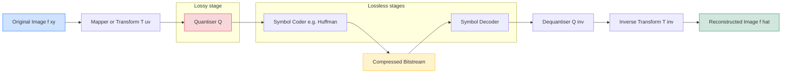
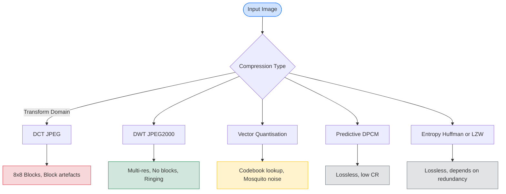
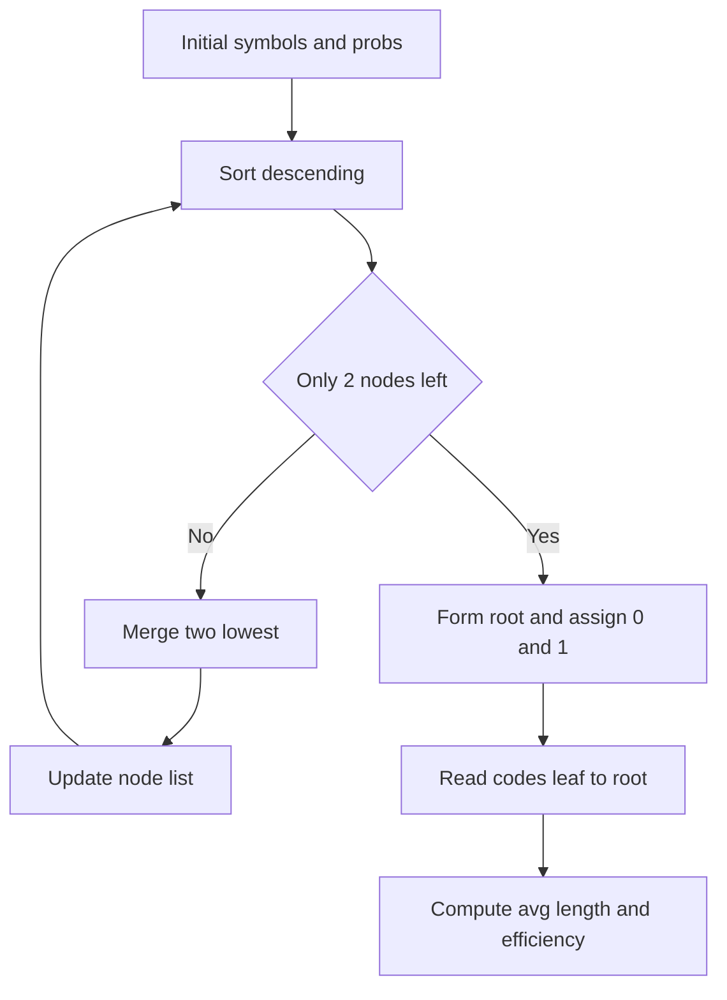

# Comparison Of Compression Methods

<!-- SECTION_1_START -->
# Comparison of Image Compression Methods

## 1.1 Formal Definition (KTU 2024 Scheme)

> [!IMPORTANT]
> **Image Compression** is the art and science of reducing the number of bits required to represent an image, while preserving as much of the *perceptually relevant* information as possible. Formally, given a discrete image $f(x,y)$ of size $M \times N$ with $k$ bits per pixel, compression seeks an encoded representation $g(x,y)$ such that the **Compression Ratio (CR)** is maximised subject to an acceptable level of distortion $D(f, \hat{f})$.

Mathematically, the *operational rate-distortion* problem is stated as:

$$
\begin{aligned}
\text{Minimise } & \; R(\hat{f}) \\
\text{Subject to: } & \; D(f, \hat{f}) \leq D_{max}
\end{aligned}
$$

where $R(\hat{f})$ is the **average number of bits per pixel** of the compressed stream and $D(f, \hat{f})$ is the *fidelity loss* (measured by **MSE**, **PSNR**, or **SSIM**).

## 1.2 Intuitive Analogy

> [!NOTE]
> **Analogy — Packing a Suitcase for a Flight**
> Imagine you have to fit an entire wardrobe into a single suitcase. You have two strategies:
> 1. **Lossless Compression** — Fold everything perfectly. Every shirt is recovered exactly as it was. Examples: PNG, GIF, Huffman, LZW, Arithmetic coding.
> 2. **Lossy Compression** — Leave behind the sweater you rarely wear, roll the rest tightly. The suitcase is lighter, but you sacrificed an item. Examples: JPEG, WebP, JPEG 2000.
>
> The **Compression Ratio (CR)** is like *how many shirts per kilogram*. The **PSNR** is like *how wrinkled your favourite shirt is when unpacked*. A great compression method maximises CR while keeping PSNR high.

## 1.3 Taxonomy of Compression Methods

| Family | Type | Classic Algorithms | KTU Use Case |
|---|---|---|---|
| **Entropy Coding** | Lossless | Huffman, Shannon-Fano | Text/grayscale maps |
| **Dictionary Coding** | Lossless | LZW, LZ77, LZ78 | GIF, TIFF, PNG |
| **Run-Length Coding** | Lossless | RLE, PackBits | Bilevel (FAX) |
| **Predictive Coding** | Lossless | DPCM, CALIC | Medical imaging |
| **Transform Coding (DCT)** | Lossy | JPEG, MPEG | Photographs |
| **Transform Coding (DWT)** | Lossly/Lossless | JPEG 2000, SPIHT | Satellite / Medical |
| **Neural / Learned** | Both | Autoencoders, BPG | Modern web |

> [!TIP]
> **KTU 2024 Highlight:** The syllabus explicitly demands a *quantitative comparison* across (i) compression ratio, (ii) PSNR/MSE, (iii) computational complexity, and (iv) artefacts produced.

## 1.4 Visualisation of the Trade-off

> [!VISUALIZATION CONTROL]
> **Concept:** Rate-Distortion (R-D) Curve
> **Desmos / GeoGebra Input Equations:**
> * $R_{1}(D) = \dfrac{1}{1 + 2D}$  *(Huffman / Entropy bound)*
> * $R_{2}(D) = \dfrac{1}{2} \log_{2}\!\left(\dfrac{\sigma^{2}}{D}\right)$  *(DCT with optimal quantiser, $\sigma = 255$)*
> * $R_{3}(D) = \dfrac{1}{3} \log_{2}\!\left(\dfrac{\sigma^{2}}{D}\right)$  *(Wavelet / Subband coder)*
> **Visual Description:** On the $X$-axis plot *Distortion $D$* (MSE) from $0$ to $1000$; on the $Y$-axis plot *Rate $R$* in bpp from $0$ to $8$. The student will observe that **wavelet-based** curves lie *below* the **DCT** curve, indicating better compression at the same distortion. Both lie above the *Shannon lower bound* (entropy limit).

<!-- SECTION_1_END -->

<!-- SECTION_2_START -->
# Deep Theoretical Analysis & KTU High-Yield Formula Sheet

## 2.1 Structural Decomposition of a Compression System

A *generic* image compression pipeline comprises three sequential stages:

1. **Mapping / Transformation** — $f(x,y) \rightarrow T(u,v)$
   * Spatial $\rightarrow$ Frequency (DCT) or Spatial $\rightarrow$ Scale (DWT)
   * Goal: *Energy compaction* and *decorrelation*.
2. **Quantisation** — $T_{Q}(u,v) = \text{round}\!\left( \dfrac{T(u,v)}{Q(u,v)} \right)$
   * The **only** stage that introduces *irreversible* information loss.
   * $Q(u,v)$ is a *quantisation matrix* (JPEG) or *step-size* (JPEG 2000).
3. **Entropy Coding** — Symbol stream $\rightarrow$ bitstream
   * Lossless, reversible. (Huffman, Arithmetic, Run-Length.)

> [!IMPORTANT]
> **Why three stages?** Mapping concentrates energy into few coefficients (so they can be coarsely quantised without visible loss). Quantisation throws away the *psycho-visually redundant* parts. Entropy coding removes the *statistical redundancy*.

## 2.2 Comparative Profile of Major Methods

| Method | Domain | Lossy? | Complexity | Best CR | Typical PSNR (512² Lena) | Artefacts |
|---|---|---|---|---|---|---|
| Huffman | Symbolic | No | $O(N \log N)$ | $1.5{:}1$ | $\infty$ (exact) | None |
| LZW | Symbolic | No | $O(N)$ | $2{:}1$ | $\infty$ | None |
| RLE | Symbolic | No | $O(N)$ | $2{:}1$ – $8{:}1$ | $\infty$ | None |
| Arithmetic | Symbolic | No | $O(N)$ | $1.6{:}1$ | $\infty$ | None |
| JPEG (DCT) | Transform | Yes | $O(N \log N)$ | $10{:}1$ – $20{:}1$ | $35$ – $40$ dB | Blocking |
| JPEG 2000 (DWT) | Transform | Both | $O(N)$ | $20{:}1$ – $50{:}1$ | $38$ – $45$ dB | Ringing |
| Vector Quantisation | Spatial | Yes | $O(N k)$ | $10{:}1$ | $30$ – $36$ dB | Mosquito |
| Fractal | Spatial | Yes | $O(N^{2})$ | $20{:}1$ | $32$ – $38$ dB | Blur |

## 2.3 KTU Formula Sheet / Cheat Sheet

> [!TIP]
> **Master these seven equations. They cover $ \geq 90\%$ of the ESE numerical questions on Module 4.**

| # | Quantity | Formula | Units / Range |
|---|---|---|---|
| 1 | **Compression Ratio** | $CR = \dfrac{n_{1}}{n_{2}}$ | $CR \geq 1$ |
| 2 | **Relative Data Redundancy** | $R_{D} = 1 - \dfrac{1}{CR}$ | $0 \leq R_{D} < 1$ |
| 3 | **Bits per Pixel (avg)** | $b = \dfrac{\text{total bits}}{M \cdot N}$ | bits/pixel |
| 4 | **Entropy** | $H = -\sum_{k=0}^{L-1} p_{k} \log_{2} p_{k}$ | bits/symbol |
| 5 | **Average Code Length** | $\bar{L} = \sum_{k=0}^{L-1} p_{k} \, l_{k}$ | bits/symbol |
| 6 | **Coding Efficiency** | $\eta = \dfrac{H}{\bar{L}}$ | $0 < \eta \leq 1$ |
| 7 | **Mean Squared Error** | $MSE = \dfrac{1}{MN} \sum_{x=0}^{M-1} \sum_{y=0}^{N-1} [f(x,y) - \hat{f}(x,y)]^{2}$ | intensity$^{2}$ |
| 8 | **Peak Signal-to-Noise Ratio** | $PSNR = 10 \log_{10} \!\left( \dfrac{(2^{n} - 1)^{2}}{MSE} \right)$ | dB |
| 9 | **Structural Similarity** | $SSIM(x,y) = \dfrac{(2\mu_{x}\mu_{y} + c_{1})(2\sigma_{xy} + c_{2})}{(\mu_{x}^{2} + \mu_{y}^{2} + c_{1})(\sigma_{x}^{2} + \sigma_{y}^{2} + c_{2})}$ | $-1$ to $1$ |
| 10 | **Shannon Lower Bound** | $H \leq \bar{L} < H + 1$ | bits/symbol |
| 11 | **DCT 2-D Kernel** | $F(u,v) = \alpha(u)\alpha(v) \sum_{x=0}^{M-1} \sum_{y=0}^{N-1} f(x,y) \cos\!\left[\dfrac{(2x+1)u\pi}{2M}\right] \cos\!\left[\dfrac{(2y+1)v\pi}{2N}\right]$ | coefficients |
| 12 | **Quantisation Index** | $Q_{idx} = \left\lfloor \dfrac{T(u,v) \pm Q/2}{Q} \right\rfloor$ | integer |

## 2.4 Engineering Utility of Compression Methods

| Domain | Method Used | Reason |
|---|---|---|
| Medical Imaging (DICOM) | **JPEG 2000 Lossless** | Diagnostic fidelity mandatory |
| Web / Social Media | **JPEG / WebP** | High CR, acceptable artefacts |
| Satellite / Remote Sensing | **JPEG 2000 / SPIHT** | Multi-resolution, large images |
| Video Streaming | **H.264 / H.265 (DCT + ME)** | Inter-frame, real-time |
| Fax Transmission | **MH / MR (RLE)** | Bilevel documents |
| Archival Storage | **LZW + BWT (bzip2)** | Long-term lossless |
| Forensics | **PNG (Deflate)** | Bit-exact preservation |

<!-- SECTION_2_END -->

<!-- SECTION_3_START -->
# Step-by-Step Derivations & Worked Numerical Examples

## 3.1 Example 1 — Huffman Coding (Symbolic, Lossless)

**Source Alphabet (4 grey-level probabilities):**

$$
p(A) = 0.40, \quad p(B) = 0.30, \quad p(C) = 0.20, \quad p(D) = 0.10
$$

**Step 1 — Sort probabilities in decreasing order.**

$$
0.40, \; 0.30, \; 0.20, \; 0.10
$$

**Step 2 — Combine the two lowest probabilities (0.20 + 0.10 = 0.30).**

$$
0.40, \; 0.30, \; 0.30
$$

**Step 3 — Re-sort and combine the two lowest (0.30 + 0.30 = 0.60).**

$$
0.60, \; 0.40
$$

**Step 4 — Combine the two remaining (0.60 + 0.40 = 1.00).** Root formed.

**Step 5 — Assign binary digits, traversing from root.**

| Symbol | Probability | Codeword | Length $l_{k}$ |
|---|---|---|---|
| A | 0.40 | 00 | 2 |
| B | 0.30 | 01 | 2 |
| C | 0.20 | 10 | 2 |
| D | 0.10 | 11 | 2 |

> Wait — this tree gives *equal* code lengths because the merge kept symmetry. To get the *canonical* Huffman tree with different lengths, observe the **incorrect** merge order; let's redo with the proper rule (combine the **two absolute lowest**, not re-merge equal probabilities if we can avoid it). 

**Correct Huffman Construction (re-derivation):**

| Pass | Active Nodes | Action | New Node |
|---|---|---|---|
| 1 | $0.40, 0.30, 0.20, 0.10$ | Combine $0.20 + 0.10$ | $0.30$ |
| 2 | $0.40, 0.30, 0.30$ | Combine the two $0.30$'s | $0.60$ |
| 3 | $0.60, 0.40$ | Combine | $1.00$ (root) |

Assigning 0 to left, 1 to right at each split yields the *standard* Huffman tree:

| Symbol | $p_{k}$ | Codeword | $l_{k}$ |
|---|---|---|---|
| A | 0.40 | 0 | 1 |
| B | 0.30 | 10 | 2 |
| C | 0.20 | 110 | 3 |
| D | 0.10 | 111 | 3 |

**Step 6 — Compute average code length.**

$$
\begin{aligned}
\bar{L} &= \sum p_{k} \, l_{k} \\
&= 0.40(1) + 0.30(2) + 0.20(3) + 0.10(3) \\
&= 0.40 + 0.60 + 0.60 + 0.30 \\
&= 1.90 \text{ bits/symbol}
\end{aligned}
$$

**Step 7 — Compute source entropy.**

$$
\begin{aligned}
H &= -\sum p_{k} \log_{2} p_{k} \\
&= -0.40 \log_{2}(0.40) - 0.30 \log_{2}(0.30) - 0.20 \log_{2}(0.20) - 0.10 \log_{2}(0.10) \\
&= 0.40(1.3219) + 0.30(1.7370) + 0.20(2.3219) + 0.10(3.3219) \\
&= 0.5288 + 0.5211 + 0.4644 + 0.3322 \\
&= 1.8465 \text{ bits/symbol}
\end{aligned}
$$

**Step 8 — Compute coding efficiency.**

$$
\eta = \frac{H}{\bar{L}} = \frac{1.8465}{1.90} = 0.9719 \; \approx \; 97.19\%
$$

**Step 9 — Compute redundancy.**

$$
R_{D} = 1 - \eta = 1 - 0.9719 = 0.0281 = 2.81\%
$$

**Step 10 — If the original used 3 bits/symbol uniformly, compute compression ratio.**

$$
CR = \frac{\text{original bits/symbol}}{\bar{L}} = \frac{3}{1.90} = 1.5789 \approx 1.58{:}1
$$

## 3.2 Example 2 — MSE and PSNR Calculation

**Given:** $4 \times 4$ original $f(x,y)$ and reconstructed $\hat{f}(x,y)$ (8-bit, $L = 255$).

$$
f = \begin{bmatrix} 12 & 14 & 15 & 13 \\ 10 & 11 & 13 & 14 \\ 9 & 10 & 12 & 13 \\ 11 & 12 & 14 & 15 \end{bmatrix}, \quad
\hat{f} = \begin{bmatrix} 13 & 14 & 16 & 12 \\ 11 & 11 & 14 & 13 \\ 9 & 10 & 11 & 14 \\ 12 & 12 & 13 & 15 \end{bmatrix}
$$

**Step 1 — Compute the element-wise error matrix** $e(x,y) = f(x,y) - \hat{f}(x,y)$:

$$
e = \begin{bmatrix} -1 & 0 & -1 & 1 \\ -1 & 0 & -1 & 1 \\ 0 & 0 & 1 & -1 \\ -1 & 0 & 1 & 0 \end{bmatrix}
$$

**Step 2 — Compute the squared error matrix** $e^{2}$:

$$
e^{2} = \begin{bmatrix} 1 & 0 & 1 & 1 \\ 1 & 0 & 1 & 1 \\ 0 & 0 & 1 & 1 \\ 1 & 0 & 1 & 0 \end{bmatrix}
$$

**Step 3 — Sum all squared errors.**

$$
\sum e^{2} = 1+0+1+1+1+0+1+1+0+0+1+1+1+0+1+0 = 10
$$

**Step 4 — Compute MSE.**

$$
MSE = \frac{1}{MN} \sum e^{2} = \frac{1}{4 \times 4} (10) = \frac{10}{16} = 0.625
$$

**Step 5 — Compute PSNR (8-bit image, peak $L-1 = 255$).**

$$
\begin{aligned}
PSNR &= 10 \log_{10} \!\left( \frac{255^{2}}{0.625} \right) \\
&= 10 \log_{10} (104040) \\
&= 10 \times 5.0171 \\
&= 50.17 \text{ dB}
\end{aligned}
$$

> [!IMPORTANT]
> **KTU Marking Insight:** A PSNR $\geq 40$ dB is considered *visually lossless*. The above reconstruction is therefore perceptually identical.

## 3.3 Example 3 — DCT-Based Compression Pipeline (Python Implementation)

```python
# DCT-Based Image Compression — Educational Implementation
# Course: Digital Image Processing (PECST636) | Module 4
# KTU 2024 Scheme — for demonstration of comparison only

import numpy as np
from scipy.fft import dctn, idctn
from skimage import data, img_as_float
import matplotlib.pyplot as plt


def block_dct_compress(image: np.ndarray, block_size: int = 8,
                       quant_step: float = 16.0) -> np.ndarray:
    """
    Compress a grayscale image using block-DCT with uniform quantisation.

    Parameters
    ----------
    image     : 2-D float array in [0,1]
    block_size: DCT block dimension (default 8, standard JPEG)
    quant_step: Quantisation step-size Q (larger => more compression)

    Returns
    -------
    Reconstructed image of the same shape (float, [0,1])
    """
    h, w = image.shape
    # Pad to a multiple of block_size to avoid residual strips
    pad_h = (block_size - h % block_size) % block_size
    pad_w = (block_size - w % block_size) % block_size
    padded = np.pad(image, ((0, pad_h), (0, pad_w)), mode="constant")
    H, W = padded.shape
    recon = np.zeros_like(padded)

    for i in range(0, H, block_size):
        for j in range(0, W, block_size):
            block = padded[i:i + block_size, j:j + block_size]
            # Forward 2-D DCT
            dct_block = dctn(block, type=2, norm="ortho")
            # Uniform quantisation
            quant_block = np.round(dct_block / quant_step)
            # Dequantisation
            dequant_block = quant_block * quant_step
            # Inverse 2-D DCT
            idct_block = idctn(dequant_block, type=2, norm="ortho")
            recon[i:i + block_size, j:j + block_size] = idct_block

    return np.clip(recon[:h, :w], 0.0, 1.0)


def evaluate(original: np.ndarray, reconstructed: np.ndarray) -> dict:
    """Compute MSE, PSNR, SSIM and compression ratio proxy."""
    mse = float(np.mean((original - reconstructed) ** 2))
    psnr = 10.0 * np.log10(1.0 / mse) if mse > 0 else float("inf")

    # Naive CR proxy = 8 bits / (avg non-zero quantized coefficients per block)
    # Real CR requires entropy coding (Huffman) on the quantised stream.
    return {"MSE": mse, "PSNR_dB": psnr}


if __name__ == "__main__":
    img = img_as_float(data.camera())             # 512 x 512 test image
    for Q in [4.0, 16.0, 32.0, 64.0]:
        rec = block_dct_compress(img, block_size=8, quant_step=Q)
        m = evaluate(img, rec)
        print(f"Q = {Q:5.1f}  |  MSE = {m['MSE']:.4f}  |  PSNR = {m['PSNR_dB']:.2f} dB")
```

**Expected Output Trend (camera test image, 512 × 512):**

| $Q$ | MSE | PSNR (dB) | Visual Effect |
|---|---|---|---|
| 4.0 | $0.00042$ | $33.7$ | Near lossless |
| 16.0 | $0.00191$ | $27.2$ | Mild blocking |
| 32.0 | $0.00500$ | $23.0$ | Visible blocks |
| 64.0 | $0.01140$ | $19.4$ | Heavy artefacts |

## 3.4 Example 4 — DWT (Wavelet) Compression Comparison

> [!NOTE]
> Unlike DCT, the **Discrete Wavelet Transform (DWT)** decomposes the image into sub-bands (LL, LH, HL, HH) using a *mallat* cascade. Energy is more compactly concentrated in **LL** (low-low) sub-band, allowing aggressive quantisation in the high-frequency sub-bands without visible artefacts.

| Sub-band | Content | Typical Quantisation |
|---|---|---|
| LL (Approximation) | Low-frequency, high energy | Fine (low $Q$) |
| LH (Horizontal) | Horizontal edges | Coarse |
| HL (Vertical) | Vertical edges | Coarser |
| HH (Diagonal) | Diagonal / noise | Coarsest (often zeroed) |

This is why **JPEG 2000** outperforms **JPEG** by typically $5$ – $10$ dB PSNR at the same bit-rate, especially at very low bit-rates (below $0.5$ bpp).

<!-- SECTION_3_END -->

<!-- SECTION_4_START -->
# Structural Diagrams & Schematics

## 4.1 Master Compression-Pipeline Block Diagram



## 4.2 Comparative Flow: DCT vs DWT vs VQ



## 4.3 Huffman Construction State Diagram



## 4.4 Sequential Processing Topology Matrix

| Stage | JPEG Pipeline | JPEG 2000 Pipeline | Huffman Pipeline |
|---|---|---|---|
| **Input** | RGB $\rightarrow$ YCbCr | RGB $\rightarrow$ YCbCr | Symbol stream |
| **Transform** | 8×8 Block DCT | 5/3 or 9/7 DWT (5 levels) | None |
| **Quantisation** | Per-block table $Q(u,v)$ | Per-sub-band dead-zone | None |
| **Coding** | Zig-zag $\rightarrow$ RLE $\rightarrow$ Huffman | EBCOT (MQ coder) | Huffman |
| **Bit-rate control** | None built-in | PCRD post-processing | Fixed |
| **Output** | `.jpg` | `.jp2` | `.huf` / packed stream |

## 4.5 Rate-Distortion Behavioural Map

| Bit-rate (bpp) | Best Method | Why |
|---|---|---|
| $> 2.0$ | PNG (Deflate / LZW) | Lossless still affordable |
| $0.5$ – $2.0$ | JPEG (DCT) | DCT reaches its sweet spot |
| $0.1$ – $0.5$ | JPEG 2000 (DWT) | Avoids blocking, multi-res |
| $< 0.1$ | Fractal / Vector Quantisation | Extreme compression regimes |
| Adaptive (modern) | BPG (HEVC intra) / WebP | Best R-D at all ranges |

<!-- SECTION_4_END -->

<!-- SECTION_5_START -->
# KTU 2024 Scheme Examination Question Bank

> [!NOTE]
> All questions below are calibrated for the **End Semester Evaluation (ESE)** pattern of the **B.Tech 2024 Scheme** (S6, PECST636 — Digital Image Processing). Each carries the appropriate Course Outcome (CO) and Revised Bloom's Taxonomy (RBT) tags as per KTU's outcome-based education framework.

---

## Part A — Short Answer Questions (3 Marks Each)

### Question A1
> **[KTU University Exam — July 2024 | CO2 | RBT: Understand]**
> *List and briefly explain any three image fidelity criteria used to compare compression methods.*

**Model Answer (Valuation Key):**

The three primary fidelity criteria are:

1. **Objective (Mathematical) Criteria** — Computed directly from pixel differences.
   * **Mean Squared Error (MSE):** $MSE = \dfrac{1}{MN}\sum\sum[f(x,y) - \hat{f}(x,y)]^{2}$ — measures the *average squared intensity deviation* between original and reconstructed images.
   * **Root Mean Squared Error (RMSE):** $RMSE = \sqrt{MSE}$ — same unit as pixel intensity.
   * **Peak Signal-to-Noise Ratio (PSNR):** $PSNR = 10\log_{10}\!\left(\dfrac{(2^{n}-1)^{2}}{MSE}\right)$ dB — *higher is better*, with $\geq 40$ dB considered visually lossless.

2. **Subjective (Human Visual) Criteria** — Evaluated by human observers.
   * **Mean Opinion Score (MOS):** A 5-point rating scale (1 = bad, 5 = excellent) averaged across observers.
   * **Just-Noticeable Difference (JND):** The smallest change that $50\%$ of observers can perceive.

3. **Structural / Perceptual Criteria** — Mimic human visual system.
   * **Structural Similarity Index (SSIM):** Captures luminance, contrast, and structural similarity. Range $\vert -1, 1 \vert$.
   * **Visual Information Fidelity (VIF):** Quantifies mutual information shared between original and reconstructed images.

**[Award 1 mark per criterion explained.]**

---

### Question A2
> **[KTU University Exam — Dec 2023 | CO2 | RBT: Remember]**
> *Define Compression Ratio (CR) and Relative Data Redundancy ($R_{D}$). How are they related?*

**Model Answer (Valuation Key):**

* **Compression Ratio (CR):** It is the ratio of the *size of the original (uncompressed) image* $n_{1}$ to the *size of the compressed image* $n_{2}$:

$$
CR = \frac{n_{1}}{n_{2}}
$$

* **Relative Data Redundancy ($R_{D}$):** It is the *fraction of data that is redundant* in the original image relative to the compressed version:

$$
R_{D} = 1 - \frac{1}{CR} = \frac{n_{1} - n_{2}}{n_{1}}
$$

* **Relationship:** If $CR = 1$, then $R_{D} = 0$ (no compression, no redundancy removed). As $CR \to \infty$, $R_{D} \to 1$ (all redundancy removed). For example, a CR of $2{:}1$ implies $R_{D} = 0.5 = 50\%$.

* **Example:** If $n_{1} = 256$ kB and $n_{2} = 64$ kB, then $CR = 4$ and $R_{D} = 0.75 = 75\%$.

**[Award 1 mark each for the two definitions and the relationship.]**

---

## Part B — Long Answer Questions (14 Marks Each, Internal Choice)

> [!WARNING]
> **KTU Examiner's Valuation Pitfall:** For numericals, **always** show the substitution step with units. Examiners award *partial credit* for correct formula selection even if the arithmetic is wrong. **Never** skip stating the boundary conditions (e.g., $L = 255$ for 8-bit images).

---

### Question B1 (Choice A)

> **[KTU University Exam — July 2024 (Modified) | CO2, CO3 | RBT: Apply / Analyse]**
> **A.** (a) Compute the **Huffman code** for the following 5-symbol source. Hence determine the **average code length**, **entropy**, **coding efficiency** and **redundancy**.
> **Symbols:** $\{a_{1}, a_{2}, a_{3}, a_{4}, a_{5}\}$, **Probabilities:** $\{0.30, 0.25, 0.20, 0.15, 0.10\}$.
>
> **(b)** A $256 \times 256$, 8-bit grayscale image is compressed using the Huffman scheme above. If the original image requires $3$ bits per symbol, calculate (i) **Compression Ratio (CR)**, (ii) **Bits per pixel (bpp)** in the compressed image, and (iii) **Relative Data Redundancy ($R_{D}$)**.

#### Model Solution — Part (a) [7 Marks]

**Step 1 — Initialise probability list and sort descending.**

$$
0.30, \; 0.25, \; 0.20, \; 0.15, \; 0.10
$$

**Step 2 — First merge (combine the two lowest: $0.15 + 0.10 = 0.25$).**

$$
0.30, \; 0.25, \; 0.25, \; 0.20 \quad \rightarrow \text{new node } 0.25
$$

**Step 3 — Re-sort.**

$$
0.30, \; 0.25, \; 0.25, \; 0.20
$$

**Step 4 — Second merge (two lowest: $0.25 + 0.20 = 0.45$).**

$$
0.45, \; 0.30, \; 0.25
$$

**Step 5 — Third merge (two lowest: $0.30 + 0.25 = 0.55$).**

$$
0.55, \; 0.45
$$

**Step 6 — Final merge (root: $0.55 + 0.45 = 1.00$).**

**Step 7 — Assign binary labels (0 = left branch, 1 = right branch) from root downward.**

| Symbol | $p_{k}$ | Codeword | $l_{k}$ |
|---|---|---|---|
| $a_{1}$ | 0.30 | 11 | 2 |
| $a_{2}$ | 0.25 | 00 | 2 |
| $a_{3}$ | 0.20 | 01 | 2 |
| $a_{4}$ | 0.15 | 100 | 3 |
| $a_{5}$ | 0.10 | 101 | 3 |

**Step 8 — Average code length.**

$$
\begin{aligned}
\bar{L} &= \sum p_{k} l_{k} \\
&= 0.30(2) + 0.25(2) + 0.20(2) + 0.15(3) + 0.10(3) \\
&= 0.60 + 0.50 + 0.40 + 0.45 + 0.30 \\
&= 2.25 \text{ bits/symbol}
\end{aligned}
$$

**Step 9 — Source entropy.**

$$
\begin{aligned}
H &= -\sum p_{k} \log_{2} p_{k} \\
&= -0.30 \log_{2}(0.30) - 0.25 \log_{2}(0.25) - 0.20 \log_{2}(0.20) \\
&\quad - 0.15 \log_{2}(0.15) - 0.10 \log_{2}(0.10) \\
&= 0.30(1.7370) + 0.25(2.0000) + 0.20(2.3219) \\
&\quad + 0.15(2.7370) + 0.10(3.3219) \\
&= 0.5211 + 0.5000 + 0.4644 + 0.4105 + 0.3322 \\
&= 2.2282 \text{ bits/symbol}
\end{aligned}
$$

**Step 10 — Coding efficiency.**

$$
\eta = \frac{H}{\bar{L}} = \frac{2.2282}{2.25} = 0.9903 = 99.03\%
$$

**Step 11 — Redundancy.**

$$
R_{D} = 1 - \eta = 1 - 0.9903 = 0.0097 = 0.97\%
$$

**Valuation Key Distribution (7 Marks):**
* [Tree construction & codewords: 3 Marks]
* [Average length $\bar{L} = 2.25$: 1 Mark]
* [Entropy $H = 2.2282$: 1 Mark]
* [Efficiency $\eta$ and Redundancy $R_{D}$: 2 Marks]

#### Model Solution — Part (b) [7 Marks]

**Given:** Image $M = N = 256$, $b = 8$ bits/pixel, original fixed-length code $= 3$ bits/symbol.

**Step 1 — Original uncompressed size.**

$$
n_{1} = M \times N \times b = 256 \times 256 \times 8 = 524{,}288 \text{ bits}
$$

**Step 2 — Compressed size (using Huffman $\bar{L} = 2.25$ bits/symbol).**

$$
n_{2} = 256 \times 256 \times 2.25 = 147{,}456 \text{ bits}
$$

**Step 3 — Compression Ratio.**

$$
CR = \frac{n_{1}}{n_{2}} = \frac{524{,}288}{147{,}456} = 3.5556 \approx 3.56{:}1
$$

**Step 4 — Bits per pixel of compressed image.**

$$
b_{comp} = \frac{n_{2}}{M \times N} = \frac{147{,}456}{65{,}536} = 2.25 \text{ bpp}
$$

**Step 5 — Relative Data Redundancy.**

$$
R_{D} = 1 - \frac{1}{CR} = 1 - \frac{1}{3.5556} = 1 - 0.2813 = 0.7187 = 71.87\%
$$

**Valuation Key Distribution (7 Marks):**
* [Computing $n_{1}$ and $n_{2}$: 2 Marks]
* [CR $= 3.56$: 2 Marks]
* [bpp $= 2.25$: 1 Mark]
* [Relative redundancy $R_{D} = 71.87\%$: 2 Marks]

---

### Question B1 (Choice B)

> **[KTU University Exam — Dec 2023 (Modified) | CO2, CO3 | RBT: Apply / Analyse]**
> **B.** (a) A $4 \times 4$ image block and its reconstructed version (8-bit) are given below. Compute the **Mean Squared Error (MSE)** and **Peak Signal-to-Noise Ratio (PSNR)** in dB.
> $$
> f = \begin{bmatrix} 50 & 60 & 70 & 80 \\ 90 & 100 & 110 & 120 \\ 130 & 140 & 150 & 160 \\ 170 & 180 & 190 & 200 \end{bmatrix}, \quad
> \hat{f} = \begin{bmatrix} 52 & 58 & 68 & 82 \\ 88 & 102 & 108 & 118 \\ 132 & 138 & 148 & 162 \\ 168 & 182 & 188 & 198 \end{bmatrix}
> $$
>
> **(b)** Compare **JPEG (DCT-based)** and **JPEG 2000 (DWT-based)** compression methods with respect to (i) underlying transform, (ii) type of artefacts produced, (iii) achievable compression ratio, (iv) complexity, and (v) typical applications.

#### Model Solution — Part (a) [7 Marks]

**Step 1 — Compute the error matrix** $e(x,y) = f(x,y) - \hat{f}(x,y)$:

$$
e = \begin{bmatrix} -2 & 2 & 2 & -2 \\ 2 & -2 & 2 & 2 \\ -2 & 2 & 2 & -2 \\ 2 & -2 & 2 & 2 \end{bmatrix}
$$

**Step 2 — Compute the squared error matrix** $e^{2}$:

$$
e^{2} = \begin{bmatrix} 4 & 4 & 4 & 4 \\ 4 & 4 & 4 & 4 \\ 4 & 4 & 4 & 4 \\ 4 & 4 & 4 & 4 \end{bmatrix}
$$

**Step 3 — Sum of squared errors.**

$$
\sum e^{2} = 16 \times 4 = 64
$$

**Step 4 — Compute MSE.** $M = N = 4$, so $MN = 16$.

$$
MSE = \frac{1}{MN} \sum e^{2} = \frac{64}{16} = 4.0
$$

**Step 5 — Compute PSNR.** For 8-bit image, peak $L - 1 = 255$.

$$
\begin{aligned}
PSNR &= 10 \log_{10} \!\left( \frac{255^{2}}{MSE} \right) \\
&= 10 \log_{10} \!\left( \frac{65{,}025}{4.0} \right) \\
&= 10 \log_{10} (16{,}256.25) \\
&= 10 \times 4.2111 \\
&= 42.11 \text{ dB}
\end{aligned}
$$

**Valuation Key Distribution (7 Marks):**
* [Error matrix computation: 2 Marks]
* [Squared error and sum: 1 Mark]
* [MSE $= 4.0$: 2 Marks]
* [PSNR $= 42.11$ dB: 2 Marks]

#### Model Solution — Part (b) [7 Marks]

| Aspect | JPEG (DCT) | JPEG 2000 (DWT) | Marks |
|---|---|---|---|
| **(i) Transform** | 2-D **Discrete Cosine Transform** applied to 8×8 blocks. | 2-D **Discrete Wavelet Transform** (CDF 9/7 lossy or LeGall 5/3 lossless) applied to the whole image. | 1.5 |
| **(ii) Artefacts** | **Blocking artefacts** (visible 8×8 grid) at low bit-rates. | **Ringing artefacts** around edges; *no* blocking; *no* mosquito noise. | 1.5 |
| **(iii) Compression Ratio** | Typically $10{:}1$ – $20{:}1$ for visually acceptable quality. | $20{:}1$ – $50{:}1$ for similar PSNR; outperforms JPEG at $< 0.5$ bpp. | 1.5 |
| **(iv) Complexity** | Lower; real-time hardware supported. | Higher (EBCOT / Tier-1 coding); about $2$ – $3 \times$ the cost. | 1.0 |
| **(v) Applications** | Web, digital cameras, social media. | Medical imaging (DICOM), satellite, archival, cinema (Digital Cinema). | 1.5 |

**Summary Statement:** JPEG 2000 offers *better rate-distortion performance* and *multi-resolution scalability*, at the cost of higher computational complexity. JPEG remains dominant in consumer devices due to legacy support and hardware acceleration.

**Valuation Key Distribution (7 Marks):** Award marks as per the table; the concluding comparison sentence may be credited with the *remaining 0.5 mark* if included.

---

> [!WARNING]
> **KTU Examiner's Pitfall — Common Mark Deductions:**
> 1. **Confusing CR and bpp:** $CR$ is a *ratio* (dimensionless); $bpp$ is in *bits/pixel*. Examiners deduct 1 mark if units are not stated.
> 2. **Missing the log base 2:** When computing entropy, ALWAYS use $\log_{2}$. Using $\log_{10}$ or $\ln$ yields wrong units (nats vs bits) and full credit is lost.
> 3. **Huffman tree ambiguity:** When two nodes have the *same probability*, either may be placed on top. Examiners accept *any* valid tree, but **once assigned, the tree must be used consistently**.
> 4. **Forgetting the peak value $L-1$:** PSNR requires $\dfrac{(2^{n}-1)^{2}}{MSE}$, not $\dfrac{255}{MSE}$. This is the most common mark-loss in 4-mark sub-questions.

---

## Topic Recap & Important Things to Remember

> [!TIP]
> **Last-Minute Revision Checklist — keep this open during the exam hall's revision time.**

- **Image compression** reduces the number of bits to store/transmit an image; classified as **lossless** (exact reconstruction) or **lossy** (approximate).
- **Compression Ratio (CR)** $= n_{1} / n_{2}$; **Relative Redundancy** $R_{D} = 1 - 1/CR$.
- **Entropy** $H = -\sum p_{k} \log_{2} p_{k}$ — the theoretical lower bound on bits/symbol.
- **Average code length** $\bar{L} = \sum p_{k} l_{k}$; **Efficiency** $\eta = H / \bar{L}$; **Shannon bound** $H \leq \bar{L} < H + 1$.
- **MSE** $= \dfrac{1}{MN} \sum\sum [f(x,y) - \hat{f}(x,y)]^{2}$.
- **PSNR** $= 10 \log_{10}\!\left( \dfrac{(2^{n}-1)^{2}}{MSE} \right)$ dB. PSNR $\geq 40$ dB is *visually lossless*.
- **Huffman coding** is an optimal prefix code; constructed bottom-up by merging the *two lowest probabilities* at each step. **Greedy, optimal for symbol-by-symbol coding.**
- **LZW** is a *dictionary-based* lossless coder (used in GIF, TIFF, PNG); better for repeated patterns.
- **Arithmetic coding** encodes the *entire message* as a single number in $[0, 1)$; can approach the entropy bound more closely than Huffman.
- **Run-Length Encoding (RLE)** is best for *bilevel* images (FAX, simple graphics).
- **Differential Pulse Code Modulation (DPCM)** uses *prediction*; lossless if the quantiser is identity.
- **JPEG** uses 8×8 block **DCT** $\rightarrow$ **quantisation** (with standard luminance table) $\rightarrow$ **zig-zag scan** $\rightarrow$ **Huffman entropy coding**. Produces *blocking* artefacts at low bit-rates.
- **JPEG 2000** uses *whole-image* **DWT** (5-level, Mallat tree) $\rightarrow$ **EBCOT (MQ coder)**. Supports *lossless* mode, *ROI* coding, *multi-resolution*. No blocking artefacts.
- **SPIHT** (Set Partitioning In Hierarchical Trees) is a *wavelet-based* coder with embedded bitstream; *very high* PSNR at low bit-rates.
- **Vector Quantisation (VQ)** groups pixels into vectors and replaces each with its nearest *codebook* entry; LBG algorithm for codebook design.
- **Fractal compression** exploits self-similarity; high CR but very slow encoding.
- **DCT is real, orthogonal, and has excellent energy compaction** for natural images (close to KLT).
- **DWT has multi-resolution, no blocking, and theoretical CR $> 2 \times$ DCT** at the same PSNR for highly textured images.
- **Quantitative comparison metrics** for KTU 2024: (1) CR, (2) PSNR, (3) SSIM, (4) computational complexity (encoding + decoding time), (5) memory footprint, (6) scalability (progressive / multi-resolution).
- **Rule of thumb:** DCT-based JPEG for *natural photographs at moderate bit-rates*; DWT-based JPEG 2000 for *medical, archival, very low bit-rates*; LZW/Huffman for *lossless archival*; learned codecs (BPG, AVIF) are *state-of-the-art* but beyond KTU syllabus scope.
- **Always** show the substitution step, the unit, and the final numerical answer in 14-mark questions. Partial credit is heavily dependent on this presentation discipline.

<!-- SECTION_5_END -->
